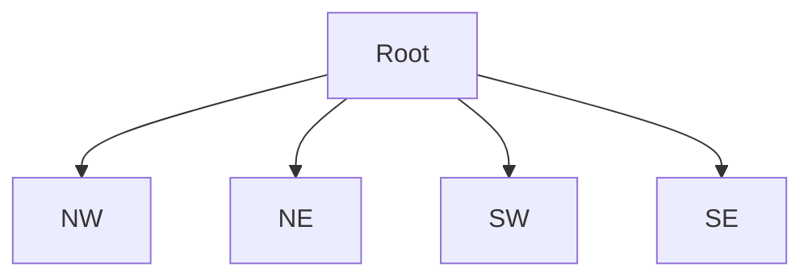
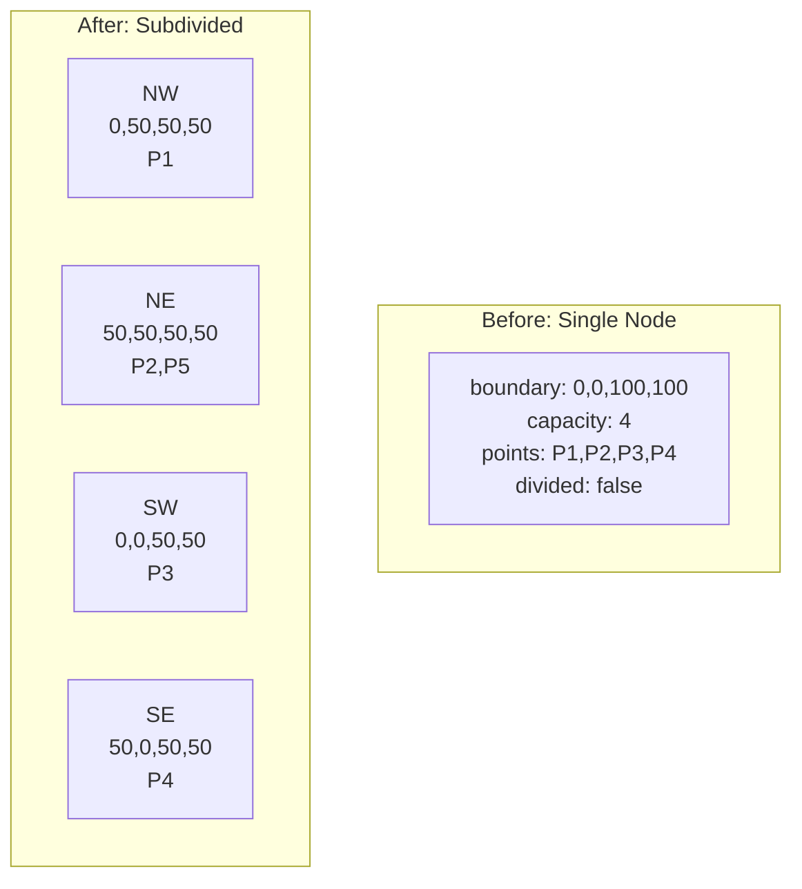
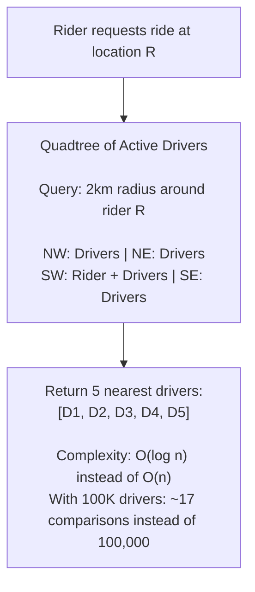

# 🎯 Quadtree

## 0️⃣ Prerequisites

Before diving into Quadtrees, you need to understand:

### 2D Coordinate Systems
A **2D coordinate system** represents points using (x, y) pairs.

```java
// Point at x=100, y=200
Point location = new Point(100, 200);
```

### Bounding Boxes (Rectangles)
A **bounding box** defines a rectangular region with position and dimensions.

```java
// Rectangle with center (50, 50), width 100, height 100
// Covers x: [0, 100], y: [0, 100]
Rectangle bounds = new Rectangle(50, 50, 100, 100);
```

### Recursion
**Recursion** is when a function calls itself. Quadtrees are recursive structures.

```java
void process(Node node) {
    if (node.isLeaf()) {
        // Base case
    } else {
        // Recursive case: process children
        for (Node child : node.children) {
            process(child);
        }
    }
}
```

### Tree Data Structures
A **tree** is a hierarchical structure with nodes. Each node can have children.



<details>
<summary>ASCII diagram (reference)</summary>

```text
        Root
       / | \ \
      NW NE SW SE
```
</details>

---

## 1️⃣ What Problem Does This Exist to Solve?

### The Core Problem: Efficient Spatial Queries

Imagine you're building Uber and need to find drivers within 1 km of a rider.

**Naive approach:**
```java
List<Driver> findNearbyDrivers(Location rider, double radius) {
    List<Driver> nearby = new ArrayList<>();
    for (Driver driver : allDrivers) {  // 100,000 drivers
        if (distance(rider, driver.location) <= radius) {
            nearby.add(driver);
        }
    }
    return nearby;
}
// Time: O(n) for every query - too slow!
```

**With 100,000 drivers and 10,000 ride requests per second:**
- 100,000 × 10,000 = 1 billion distance calculations per second
- Impossible!

### Real-World Pain Points

**Scenario 1: Finding Nearby Drivers (Uber/Lyft)**
- 100,000 active drivers in a city
- Each ride request needs to find the 5 nearest drivers
- Must respond in milliseconds

**Scenario 2: Collision Detection (Games)**
- 10,000 objects on screen
- Check if any two objects collide
- Naive: 10,000² = 100 million checks per frame
- At 60 FPS: 6 billion checks per second!

**Scenario 3: Geographic Information Systems (GIS)**
- Find all restaurants within a map viewport
- As user pans/zooms, query changes
- Database has millions of POIs

### What Breaks Without Quadtrees?

| Without Quadtree | With Quadtree |
|-----------------|---------------|
| O(n) per query | O(log n) average |
| Check all points | Check only relevant regions |
| Doesn't scale | Handles millions of points |
| Linear scan | Spatial indexing |

---

## 2️⃣ Intuition and Mental Model

### The Map Division Analogy

Imagine you're organizing a city map to find locations quickly.

**Naive approach**: One big list of all locations. To find anything, scan the whole list.

**Quadtree approach**: Divide the map into 4 quadrants. If a quadrant has too many locations, divide it again.

**Initial map (too many points):**
- Multiple points scattered across the map

**After quadtree division:**
- Map divided into 4 quadrants (NW, NE, SW, SE)
- Each quadrant contains a subset of points
- Dense quadrants can be further subdivided

<details>
<summary>ASCII diagram (reference)</summary>

```text
Initial map (too many points):
┌─────────────────────────────┐
│  •    •  •    •    •   •   │
│    •        •    •         │
│  •   •  •      •    •  •   │
│      •    •  •    •        │
│  •      •      •    •   •  │
└─────────────────────────────┘

After quadtree division:
┌──────────────┬──────────────┐
│  •    •  •   │  •    •   •  │
│    •         │   •          │
├──────────────┼──────────────┤
│  •   •  •    │   •    •  •  │
│      •    •  │ •    •       │
│  •      •    │    •    •   •│
```
</details>
└──────────────┴──────────────┘
  Northwest      Northeast
  Southwest      Southeast
```

### The Key Insight

<details>
<summary>ASCII diagram (reference)</summary>

```text
┌─────────────────────────────────────────────────────────────────┐
│                    QUADTREE KEY INSIGHT                          │
├─────────────────────────────────────────────────────────────────┤
│                                                                  │
│  "Divide space recursively into 4 quadrants"                    │
│                                                                  │
│  When searching for points in a region:                         │
│  1. If region doesn't overlap quadrant → skip entirely          │
│  2. If region overlaps quadrant → recurse into it               │
│                                                                  │
│  This eliminates large portions of the search space quickly.    │
│                                                                  │
│  Query time: O(log n) average, O(n) worst case                  │
│                                                                  │
└─────────────────────────────────────────────────────────────────┘
```
</details>

### Quadtree Structure

```
                    Root (entire map)
                   /    |    |    \
                NW     NE   SW    SE
               /|\    /|\  /|\   /|\
              ... (recursive subdivision)

Each node either:
- Contains points (leaf node)
- Has 4 children (internal node)
```

---

## 3️⃣ How It Works Internally

### Core Components

1. **Boundary**: The rectangular region this node covers
2. **Points**: List of points stored in this node (leaf nodes)
3. **Children**: Four child nodes (NW, NE, SW, SE) for internal nodes
4. **Capacity**: Maximum points before subdivision

### Node Structure

```java
class QuadTreeNode {
    Rectangle boundary;      // Region this node covers
    List<Point> points;      // Points stored here (if leaf)
    int capacity;            // Max points before split
    
    QuadTreeNode nw, ne, sw, se;  // Children (if internal)
    boolean divided;         // Has this node been subdivided?
}
```

### Insertion Algorithm

```
Insert point P into node N:

1. If P is outside N's boundary:
   - Return false (point doesn't belong here)

2. If N has room (points.size < capacity) and N is not divided:
   - Add P to N's points
   - Return true

3. If N is not yet divided:
   - Subdivide N into 4 children
   - Move existing points to appropriate children

4. Insert P into the appropriate child:
   - If P is in NW quadrant → insert into NW child
   - If P is in NE quadrant → insert into NE child
   - If P is in SW quadrant → insert into SW child
   - If P is in SE quadrant → insert into SE child
```

### Subdivision

**Before subdivision:**
- boundary: (0,0,100,100)
- capacity: 4
- points: [P1,P2,P3,P4]
- divided: false

**After inserting 5th point:**


<details>
<summary>ASCII diagram (reference)</summary>

```text
Before subdivision:
┌─────────────────────────────┐
│      boundary: (0,0,100,100)│
│      capacity: 4            │
│      points: [P1,P2,P3,P4]  │
│      divided: false         │
└─────────────────────────────┘

After inserting 5th point:
┌──────────────┬──────────────┐
│     NW       │      NE      │
│  (0,50,50,50)│ (50,50,50,50)│
│  [P1]        │  [P2,P5]     │
├──────────────┼──────────────┤
│     SW       │      SE      │
│  (0,0,50,50) │ (50,0,50,50) │
│  [P3]        │  [P4]        │
└──────────────┴──────────────┘
```
</details>

### Query Algorithm (Range Search)

```
Find all points in range R:

1. If R doesn't intersect node's boundary:
   - Return empty (no points can be in R)

2. If node is a leaf:
   - Return all points that are inside R

3. If node is internal:
   - Recursively query all children
   - Combine results
```

### Intersection Check

```java
boolean intersects(Rectangle a, Rectangle b) {
    return !(a.right < b.left || 
             a.left > b.right || 
             a.top < b.bottom || 
             a.bottom > b.top);
}
```

---

## 4️⃣ Simulation: Step-by-Step Walkthrough

### Building a Quadtree

**Space**: 100x100 area, capacity = 2 points per node

**Points to insert**: A(10,80), B(70,90), C(20,20), D(80,30), E(15,75)

```
Initial state:
┌─────────────────────────────────────────┐
│                                         │
│                                         │
│                                         │
│                                         │
│                                         │
└─────────────────────────────────────────┘
Root: boundary=(0,0,100,100), points=[], divided=false

Insert A(10,80):
┌─────────────────────────────────────────┐
│ A                                       │
│                                         │
│                                         │
│                                         │
│                                         │
└─────────────────────────────────────────┘
Root: points=[A]

Insert B(70,90):
┌─────────────────────────────────────────┐
│ A                           B           │
│                                         │
│                                         │
│                                         │
│                                         │
└─────────────────────────────────────────┘
Root: points=[A,B] (at capacity)

Insert C(20,20) - triggers subdivision:
┌────────────────────┬────────────────────┐
│ A                  │          B         │
│                    │                    │
├────────────────────┼────────────────────┤
│ C                  │                    │
│                    │                    │
└────────────────────┴────────────────────┘
Root: divided=true
  NW: points=[A]
  NE: points=[B]
  SW: points=[C]
  SE: points=[]

Insert D(80,30):
┌────────────────────┬────────────────────┐
│ A                  │          B         │
│                    │                    │
├────────────────────┼────────────────────┤
│ C                  │              D     │
│                    │                    │
└────────────────────┴────────────────────┘
Root.SE: points=[D]

Insert E(15,75):
┌────────────────────┬────────────────────┐
│ A                  │          B         │
│ E                  │                    │
├────────────────────┼────────────────────┤
│ C                  │              D     │
│                    │                    │
└────────────────────┴────────────────────┘
Root.NW: points=[A,E] (at capacity)
```

### Range Query Example

**Query**: Find all points in rectangle (5,70,30,20) - x:[5,35], y:[70,90]

```
Query region (shaded):
┌────────────────────┬────────────────────┐
│▓▓▓▓▓▓▓▓▓▓▓▓▓▓▓▓▓▓▓▓│          B         │
│▓A▓▓▓▓▓▓▓▓▓▓▓▓▓▓▓▓▓▓│                    │
│▓E▓▓▓▓▓▓▓▓▓▓▓▓▓▓▓▓▓▓│                    │
├────────────────────┼────────────────────┤
│ C                  │              D     │
│                    │                    │
└────────────────────┴────────────────────┘

Step 1: Check root - query intersects root's boundary ✓
Step 2: Check children:
  - NW: query intersects NW ✓ → check points A(10,80)✓, E(15,75)✓
  - NE: query intersects NE ✓ → check points B(70,90)✗ (outside query)
  - SW: query doesn't intersect SW ✗ → skip entirely!
  - SE: query doesn't intersect SE ✗ → skip entirely!

Result: [A, E]
Points checked: 3 (A, E, B)
Points skipped: 2 (C, D) - entire quadrants eliminated!
```

### Nearest Neighbor Query

**Query**: Find nearest point to Q(60,60)

```
┌────────────────────┬────────────────────┐
│ A                  │          B         │
│ E                  │                    │
├────────────────────┼───────Q────────────┤
│ C                  │              D     │
│                    │                    │
└────────────────────┴────────────────────┘

Algorithm:
1. Start with infinite best distance
2. Search quadrant containing Q first (SE)
   - SE has point D(80,30)
   - Distance Q to D = sqrt((60-80)² + (60-30)²) = 36.06
   - Best = D, bestDist = 36.06

3. Check if other quadrants could have closer point:
   - NE: closest possible distance to NE = 10 (Q.y to NE.bottom)
   - 10 < 36.06, so must check NE
   - NE has B(70,90), distance = 31.62
   - New best = B, bestDist = 31.62

4. Continue checking:
   - NW: closest possible = 10, check it
   - NW has A, E, distances > 31.62
   - SW: closest possible = 10, check it
   - SW has C, distance = 56.57 > 31.62

Result: B is nearest to Q
```

---

## 5️⃣ How Engineers Use This in Production

### Uber: Finding Nearby Drivers



<details>
<summary>ASCII diagram (reference)</summary>

```text
┌─────────────────────────────────────────────────────────────────┐
│                    UBER DRIVER MATCHING                          │
├─────────────────────────────────────────────────────────────────┤
│                                                                  │
│  Rider requests ride at location R                              │
│       │                                                          │
│       ▼                                                          │
│  ┌─────────────────────────────────────────────────────────┐   │
│  │              Quadtree of Active Drivers                  │   │
│  │  ┌────────────┬────────────┐                            │   │
│  │  │    🚗     │  🚗  🚗    │                            │   │
│  │  │  🚗       │            │                            │   │
│  │  ├────────────┼────────────┤                            │   │
│  │  │     R     │  🚗        │  ← Query: 2km radius       │   │
│  │  │  🚗  🚗   │      🚗    │    around rider R          │   │
│  │  └────────────┴────────────┘                            │   │
│  └─────────────────────────────────────────────────────────┘   │
│       │                                                          │
│       ▼                                                          │
│  Return 5 nearest drivers: [D1, D2, D3, D4, D5]                │
│                                                                  │
│  Complexity: O(log n) instead of O(n)                          │
│  With 100K drivers: ~17 comparisons instead of 100,000         │
│                                                                  │
└─────────────────────────────────────────────────────────────────┘
```
</details>

### Game Development: Collision Detection

```java
// Without spatial indexing: O(n²)
for (int i = 0; i < objects.size(); i++) {
    for (int j = i + 1; j < objects.size(); j++) {
        if (collides(objects[i], objects[j])) {
            handleCollision(i, j);
        }
    }
}

// With quadtree: O(n log n)
QuadTree tree = new QuadTree(worldBounds);
for (GameObject obj : objects) {
    tree.insert(obj);
}

for (GameObject obj : objects) {
    List<GameObject> nearby = tree.query(obj.getBounds());
    for (GameObject other : nearby) {
        if (obj != other && collides(obj, other)) {
            handleCollision(obj, other);
        }
    }
}
```

### PostGIS: Spatial Database Indexing

PostgreSQL with PostGIS uses spatial indexes (including quadtree-like structures) for geographic queries:

```sql
-- Create spatial index
CREATE INDEX idx_restaurants_location 
ON restaurants USING GIST (location);

-- Find restaurants within 1km of a point
SELECT name, location
FROM restaurants
WHERE ST_DWithin(
    location,
    ST_MakePoint(-122.4194, 37.7749)::geography,
    1000  -- 1000 meters
);
```

---

## 6️⃣ Implementation in Java

### Point and Rectangle Classes

```java
/**
 * Represents a 2D point.
 */
public class Point {
    public final double x;
    public final double y;
    public final Object data;  // Optional payload (e.g., driver ID)
    
    public Point(double x, double y) {
        this(x, y, null);
    }
    
    public Point(double x, double y, Object data) {
        this.x = x;
        this.y = y;
        this.data = data;
    }
    
    public double distanceTo(Point other) {
        double dx = this.x - other.x;
        double dy = this.y - other.y;
        return Math.sqrt(dx * dx + dy * dy);
    }
    
    public double squaredDistanceTo(Point other) {
        double dx = this.x - other.x;
        double dy = this.y - other.y;
        return dx * dx + dy * dy;
    }
}

/**
 * Represents an axis-aligned bounding box.
 */
public class Rectangle {
    public final double x;      // Center x
    public final double y;      // Center y
    public final double halfWidth;
    public final double halfHeight;
    
    public Rectangle(double x, double y, double halfWidth, double halfHeight) {
        this.x = x;
        this.y = y;
        this.halfWidth = halfWidth;
        this.halfHeight = halfHeight;
    }
    
    public boolean contains(Point point) {
        return point.x >= x - halfWidth &&
               point.x <= x + halfWidth &&
               point.y >= y - halfHeight &&
               point.y <= y + halfHeight;
    }
    
    public boolean intersects(Rectangle other) {
        return !(other.x - other.halfWidth > this.x + this.halfWidth ||
                 other.x + other.halfWidth < this.x - this.halfWidth ||
                 other.y - other.halfHeight > this.y + this.halfHeight ||
                 other.y + other.halfHeight < this.y - this.halfHeight);
    }
    
    // Create circle query as bounding box
    public static Rectangle fromCircle(double centerX, double centerY, double radius) {
        return new Rectangle(centerX, centerY, radius, radius);
    }
}
```

### Quadtree Implementation

```java
import java.util.*;

/**
 * A Quadtree for efficient 2D spatial queries.
 */
public class QuadTree {
    
    private static final int DEFAULT_CAPACITY = 4;
    private static final int MAX_DEPTH = 10;
    
    private final Rectangle boundary;
    private final int capacity;
    private final int depth;
    private final List<Point> points;
    
    private QuadTree nw, ne, sw, se;
    private boolean divided;
    
    public QuadTree(Rectangle boundary) {
        this(boundary, DEFAULT_CAPACITY, 0);
    }
    
    public QuadTree(Rectangle boundary, int capacity) {
        this(boundary, capacity, 0);
    }
    
    private QuadTree(Rectangle boundary, int capacity, int depth) {
        this.boundary = boundary;
        this.capacity = capacity;
        this.depth = depth;
        this.points = new ArrayList<>();
        this.divided = false;
    }
    
    /**
     * Inserts a point into the quadtree.
     * @return true if the point was inserted
     */
    public boolean insert(Point point) {
        // Point outside boundary
        if (!boundary.contains(point)) {
            return false;
        }
        
        // Room in this node and not yet divided
        if (points.size() < capacity && !divided) {
            points.add(point);
            return true;
        }
        
        // Need to subdivide
        if (!divided) {
            subdivide();
        }
        
        // Insert into appropriate child
        if (nw.insert(point)) return true;
        if (ne.insert(point)) return true;
        if (sw.insert(point)) return true;
        if (se.insert(point)) return true;
        
        // Should never reach here
        return false;
    }
    
    /**
     * Subdivides this node into 4 children.
     */
    private void subdivide() {
        double x = boundary.x;
        double y = boundary.y;
        double hw = boundary.halfWidth / 2;
        double hh = boundary.halfHeight / 2;
        
        nw = new QuadTree(new Rectangle(x - hw, y + hh, hw, hh), capacity, depth + 1);
        ne = new QuadTree(new Rectangle(x + hw, y + hh, hw, hh), capacity, depth + 1);
        sw = new QuadTree(new Rectangle(x - hw, y - hh, hw, hh), capacity, depth + 1);
        se = new QuadTree(new Rectangle(x + hw, y - hh, hw, hh), capacity, depth + 1);
        
        divided = true;
        
        // Move existing points to children
        for (Point p : points) {
            nw.insert(p);
            ne.insert(p);
            sw.insert(p);
            se.insert(p);
        }
        points.clear();
    }
    
    /**
     * Finds all points within the given range.
     */
    public List<Point> query(Rectangle range) {
        List<Point> found = new ArrayList<>();
        query(range, found);
        return found;
    }
    
    private void query(Rectangle range, List<Point> found) {
        // Range doesn't intersect this node
        if (!boundary.intersects(range)) {
            return;
        }
        
        // Check points in this node
        for (Point p : points) {
            if (range.contains(p)) {
                found.add(p);
            }
        }
        
        // Recurse into children
        if (divided) {
            nw.query(range, found);
            ne.query(range, found);
            sw.query(range, found);
            se.query(range, found);
        }
    }
    
    /**
     * Finds all points within a circular range.
     */
    public List<Point> queryCircle(double centerX, double centerY, double radius) {
        List<Point> found = new ArrayList<>();
        Rectangle boundingBox = Rectangle.fromCircle(centerX, centerY, radius);
        double radiusSquared = radius * radius;
        Point center = new Point(centerX, centerY);
        
        queryCircle(boundingBox, center, radiusSquared, found);
        return found;
    }
    
    private void queryCircle(Rectangle range, Point center, double radiusSquared, 
                             List<Point> found) {
        if (!boundary.intersects(range)) {
            return;
        }
        
        for (Point p : points) {
            if (p.squaredDistanceTo(center) <= radiusSquared) {
                found.add(p);
            }
        }
        
        if (divided) {
            nw.queryCircle(range, center, radiusSquared, found);
            ne.queryCircle(range, center, radiusSquared, found);
            sw.queryCircle(range, center, radiusSquared, found);
            se.queryCircle(range, center, radiusSquared, found);
        }
    }
    
    /**
     * Finds the K nearest neighbors to a point.
     */
    public List<Point> kNearest(Point target, int k) {
        // Max heap to keep track of k nearest (furthest at top)
        PriorityQueue<Point> heap = new PriorityQueue<>(k + 1,
            (a, b) -> Double.compare(b.squaredDistanceTo(target), a.squaredDistanceTo(target)));
        
        kNearest(target, k, heap, Double.MAX_VALUE);
        
        List<Point> result = new ArrayList<>(heap);
        result.sort(Comparator.comparingDouble(p -> p.squaredDistanceTo(target)));
        return result;
    }
    
    private double kNearest(Point target, int k, PriorityQueue<Point> heap, 
                           double maxDistSquared) {
        // Check if this node could contain closer points
        double nodeDistSquared = squaredDistanceToRectangle(target, boundary);
        if (nodeDistSquared > maxDistSquared) {
            return maxDistSquared;
        }
        
        // Check points in this node
        for (Point p : points) {
            double distSquared = p.squaredDistanceTo(target);
            if (distSquared < maxDistSquared || heap.size() < k) {
                heap.offer(p);
                if (heap.size() > k) {
                    heap.poll();
                }
                if (heap.size() == k) {
                    maxDistSquared = heap.peek().squaredDistanceTo(target);
                }
            }
        }
        
        // Recurse into children, closest first
        if (divided) {
            QuadTree[] children = {nw, ne, sw, se};
            Arrays.sort(children, Comparator.comparingDouble(
                c -> squaredDistanceToRectangle(target, c.boundary)));
            
            for (QuadTree child : children) {
                maxDistSquared = child.kNearest(target, k, heap, maxDistSquared);
            }
        }
        
        return maxDistSquared;
    }
    
    /**
     * Calculates squared distance from a point to a rectangle.
     */
    private double squaredDistanceToRectangle(Point p, Rectangle r) {
        double dx = Math.max(0, Math.max(r.x - r.halfWidth - p.x, p.x - r.x - r.halfWidth));
        double dy = Math.max(0, Math.max(r.y - r.halfHeight - p.y, p.y - r.y - r.halfHeight));
        return dx * dx + dy * dy;
    }
    
    /**
     * Returns total number of points in the tree.
     */
    public int size() {
        int count = points.size();
        if (divided) {
            count += nw.size() + ne.size() + sw.size() + se.size();
        }
        return count;
    }
}
```

### Testing the Implementation

```java
public class QuadTreeTest {
    
    public static void main(String[] args) {
        testBasicOperations();
        testRangeQuery();
        testCircleQuery();
        testKNearest();
        testPerformance();
    }
    
    static void testBasicOperations() {
        System.out.println("=== Basic Operations ===");
        
        Rectangle bounds = new Rectangle(50, 50, 50, 50);  // 0-100 x 0-100
        QuadTree tree = new QuadTree(bounds, 4);
        
        // Insert points
        tree.insert(new Point(10, 80, "A"));
        tree.insert(new Point(70, 90, "B"));
        tree.insert(new Point(20, 20, "C"));
        tree.insert(new Point(80, 30, "D"));
        tree.insert(new Point(15, 75, "E"));
        
        System.out.println("Total points: " + tree.size());
    }
    
    static void testRangeQuery() {
        System.out.println("\n=== Range Query ===");
        
        Rectangle bounds = new Rectangle(50, 50, 50, 50);
        QuadTree tree = new QuadTree(bounds, 4);
        
        // Insert points
        tree.insert(new Point(10, 80, "A"));
        tree.insert(new Point(70, 90, "B"));
        tree.insert(new Point(20, 20, "C"));
        tree.insert(new Point(80, 30, "D"));
        tree.insert(new Point(15, 75, "E"));
        
        // Query: find points in upper-left region
        Rectangle query = new Rectangle(20, 75, 20, 15);  // x:0-40, y:60-90
        List<Point> found = tree.query(query);
        
        System.out.println("Points in range: ");
        for (Point p : found) {
            System.out.println("  " + p.data + " at (" + p.x + ", " + p.y + ")");
        }
    }
    
    static void testCircleQuery() {
        System.out.println("\n=== Circle Query (Nearby Search) ===");
        
        Rectangle bounds = new Rectangle(50, 50, 50, 50);
        QuadTree tree = new QuadTree(bounds, 4);
        
        // Insert "drivers"
        tree.insert(new Point(25, 25, "Driver 1"));
        tree.insert(new Point(30, 30, "Driver 2"));
        tree.insert(new Point(75, 75, "Driver 3"));
        tree.insert(new Point(80, 20, "Driver 4"));
        tree.insert(new Point(28, 28, "Driver 5"));
        
        // Find drivers within radius 10 of point (27, 27)
        List<Point> nearby = tree.queryCircle(27, 27, 10);
        
        System.out.println("Drivers within radius 10 of (27,27):");
        for (Point p : nearby) {
            System.out.println("  " + p.data + " at (" + p.x + ", " + p.y + ")");
        }
    }
    
    static void testKNearest() {
        System.out.println("\n=== K-Nearest Neighbors ===");
        
        Rectangle bounds = new Rectangle(50, 50, 50, 50);
        QuadTree tree = new QuadTree(bounds, 4);
        
        // Insert points
        Random rand = new Random(42);
        for (int i = 0; i < 100; i++) {
            tree.insert(new Point(rand.nextDouble() * 100, rand.nextDouble() * 100, "P" + i));
        }
        
        // Find 5 nearest to (50, 50)
        Point target = new Point(50, 50);
        List<Point> nearest = tree.kNearest(target, 5);
        
        System.out.println("5 nearest to (50, 50):");
        for (Point p : nearest) {
            System.out.printf("  %s at (%.1f, %.1f) - distance: %.2f\n",
                p.data, p.x, p.y, p.distanceTo(target));
        }
    }
    
    static void testPerformance() {
        System.out.println("\n=== Performance Test ===");
        
        Rectangle bounds = new Rectangle(500, 500, 500, 500);  // 0-1000 x 0-1000
        QuadTree tree = new QuadTree(bounds, 10);
        
        Random rand = new Random(42);
        int n = 100_000;
        
        // Insert points
        long start = System.currentTimeMillis();
        for (int i = 0; i < n; i++) {
            tree.insert(new Point(rand.nextDouble() * 1000, rand.nextDouble() * 1000));
        }
        long insertTime = System.currentTimeMillis() - start;
        System.out.println("Insert " + n + " points: " + insertTime + " ms");
        
        // Range queries
        start = System.currentTimeMillis();
        int totalFound = 0;
        for (int i = 0; i < 10000; i++) {
            double x = rand.nextDouble() * 900 + 50;
            double y = rand.nextDouble() * 900 + 50;
            List<Point> found = tree.queryCircle(x, y, 50);
            totalFound += found.size();
        }
        long queryTime = System.currentTimeMillis() - start;
        System.out.println("10,000 range queries: " + queryTime + " ms");
        System.out.println("Average points per query: " + (totalFound / 10000));
        
        // Compare with brute force
        List<Point> allPoints = new ArrayList<>();
        for (int i = 0; i < n; i++) {
            allPoints.add(new Point(rand.nextDouble() * 1000, rand.nextDouble() * 1000));
        }
        
        start = System.currentTimeMillis();
        for (int i = 0; i < 1000; i++) {
            double cx = rand.nextDouble() * 900 + 50;
            double cy = rand.nextDouble() * 900 + 50;
            Point center = new Point(cx, cy);
            for (Point p : allPoints) {
                if (p.distanceTo(center) <= 50) {
                    // Found
                }
            }
        }
        long bruteTime = System.currentTimeMillis() - start;
        System.out.println("1,000 brute force queries: " + bruteTime + " ms");
        System.out.println("Quadtree speedup: ~" + (bruteTime * 10 / queryTime) + "x");
    }
}
```

---

## 7️⃣ Comparison: Quadtree vs K-d Tree vs R-Tree

| Aspect | Quadtree | K-d Tree | R-Tree |
|--------|----------|----------|--------|
| Dimensions | 2D only | Any dimension | Any dimension |
| Split strategy | Fixed (4 quadrants) | Median split | Bounding boxes |
| Balance | Not guaranteed | Balanced | Balanced |
| Best for | Uniform distribution | Point data | Rectangle data |
| Dynamic inserts | Easy | Requires rebalancing | Moderate |
| Use case | Games, maps | Nearest neighbor | Spatial databases |

### When to Use Which

**Quadtree:**
- 2D spatial data
- Dynamic insertions/deletions
- Game collision detection
- Map-based applications

**K-d Tree:**
- Higher dimensions
- Static data (build once, query many)
- Machine learning (nearest neighbor)
- Best for point queries

**R-Tree:**
- Overlapping rectangles
- Database indexing
- Geographic data with extent
- PostGIS, spatial databases

---

## 8️⃣ Tradeoffs, Pitfalls, and Common Mistakes

### Tradeoffs

| Aspect | Quadtree | Alternative |
|--------|----------|-------------|
| Memory | Overhead for sparse data | K-d Tree more compact |
| Balance | Can become unbalanced | R-Tree always balanced |
| Dimensions | 2D only | K-d Tree supports any |
| Updates | Fast for dynamic data | K-d Tree needs rebuild |

### Common Pitfalls

**1. Wrong capacity setting**

```java
// BAD: Capacity too low causes excessive subdivision
QuadTree tree = new QuadTree(boundary, 1);  // Splits on every point!

// BAD: Capacity too high defeats the purpose
QuadTree tree = new QuadTree(boundary, 10000);  // Linear search in nodes

// GOOD: Balance between subdivision and node size
QuadTree tree = new QuadTree(boundary, 8);  // Reasonable for most cases
```

**2. Not limiting depth**

```java
// BAD: No depth limit with clustered data
// Points at same location cause infinite recursion!

// GOOD: Limit maximum depth
private static final int MAX_DEPTH = 10;

private QuadTree(Rectangle boundary, int capacity, int depth) {
    if (depth > MAX_DEPTH) {
        // Store in current node even if over capacity
    }
}
```

**3. Inefficient k-nearest implementation**

```java
// BAD: Collect all points, then sort
List<Point> all = tree.query(entireWorld);
Collections.sort(all, byDistanceTo(target));
return all.subList(0, k);

// GOOD: Use priority queue with early termination
PriorityQueue<Point> heap = new PriorityQueue<>(byDistanceTo(target));
// Prune branches that can't contain closer points
```

**4. Ignoring boundary conditions**

```java
// BAD: Points exactly on boundary may be missed
if (x > boundary.minX && x < boundary.maxX)  // Excludes boundary points!

// GOOD: Include boundary points
if (x >= boundary.minX && x <= boundary.maxX)
```

### Performance Gotchas

**1. Degenerate cases**

```java
// All points on a line: Quadtree degenerates
// Solution: Use K-d Tree for such distributions
```

**2. Moving objects**

```java
// Frequent updates are expensive
// Solution: Use loose Quadtree or rebuild periodically
```

---

## 9️⃣ When NOT to Use Quadtrees

### Anti-Patterns

**1. Higher dimensions**

```java
// WRONG: Using Quadtree for 3D data
// Quadtree is 2D only!

// RIGHT: Use Octree (8 children) for 3D
// Or K-d Tree for any dimension
```

**2. Static data with many queries**

```java
// WRONG: Quadtree for static point cloud
// Quadtree doesn't guarantee balance

// RIGHT: Use K-d Tree for static data
// Better balance, more efficient queries
```

**3. Objects with extent (not just points)**

```java
// WRONG: Storing rectangles in point Quadtree
// Rectangle may span multiple quadrants

// RIGHT: Use R-Tree for objects with extent
// Or Region Quadtree for area data
```

**4. Uniformly distributed data**

```java
// WRONG: Quadtree for evenly spaced grid
// No benefit from spatial partitioning

// RIGHT: Just use 2D array indexing
int row = (int) (y / cellSize);
int col = (int) (x / cellSize);
```

### Better Alternatives

| Use Case | Better Alternative |
|----------|-------------------|
| 3D spatial data | Octree |
| Higher dimensions | K-d Tree |
| Rectangles/polygons | R-Tree |
| Static data, many queries | K-d Tree |
| Database spatial index | R-Tree (PostGIS) |
| Uniform grid | 2D array |

---

## 🔟 Interview Follow-Up Questions with Answers

### L4 (Entry-Level) Questions

**Q1: What is a Quadtree and when would you use it?**

**Answer**: A Quadtree is a tree data structure where each internal node has exactly 4 children, representing 4 quadrants of a 2D space (NW, NE, SW, SE). It's used for spatial indexing, allowing efficient queries like "find all points within this rectangle" or "find the nearest point to this location." Common use cases include: finding nearby drivers in ride-sharing apps, collision detection in games, and geographic information systems. The key advantage is reducing search time from O(n) to O(log n) average case.

**Q2: How does a Quadtree improve query performance?**

**Answer**: A Quadtree improves performance by spatial partitioning. When querying for points in a region, we can eliminate entire quadrants that don't intersect our query region. For example, if searching for points in the northwest corner, we can skip the entire southeast quadrant without checking any of its points. This "pruning" reduces the number of points we need to examine from O(n) to O(log n) on average, assuming points are reasonably distributed.

### L5 (Senior) Questions

**Q3: How would you handle moving objects in a Quadtree?**

**Answer**: Several approaches:

1. **Rebuild periodically**: Simple but expensive. Good if objects move infrequently.

2. **Remove and reinsert**: When an object moves, remove it from its current position and reinsert at the new position. Works well for sparse movements.

3. **Loose Quadtree**: Expand node boundaries slightly so objects near boundaries don't need to move between nodes for small movements.

4. **Store objects at lowest common ancestor**: Store moving objects higher in the tree so they don't need to move as often.

5. **Separate static and dynamic trees**: Keep static objects in one tree, moving objects in another that's rebuilt frequently.

**Q4: How would you implement a Quadtree for a distributed system?**

**Answer**:

```
Architecture:
1. Partition space into regions, each handled by a server
2. Each server maintains a local Quadtree for its region
3. Border queries require cross-server communication

Approach 1: Static Partitioning
- Divide world into fixed grid
- Each grid cell → one server
- Simple but may have hotspots

Approach 2: Dynamic Partitioning
- Use consistent hashing on Geohash
- Automatically rebalances load
- More complex but handles hotspots

Cross-Region Queries:
- Query coordinator determines affected servers
- Parallel queries to relevant servers
- Merge results

Example: Find drivers within 5km
- Hash rider location to find primary server
- If radius crosses boundaries, query neighboring servers
- Merge and return top K results
```

### L6 (Staff) Questions

**Q5: Design a real-time location tracking system for 1 million moving vehicles.**

**Answer**:

```
Architecture:

1. Data Ingestion:
   - Vehicles send GPS updates every 5 seconds
   - Kafka partitioned by geohash prefix
   - 200K updates/second

2. Spatial Index:
   - In-memory Quadtree per region
   - Region = city or district
   - Each region on dedicated server

3. Update Strategy:
   - Batch updates every 100ms
   - Rebuild affected subtrees
   - Use loose quadtree to minimize rebuilds

4. Query Path:
   - "Find vehicles near (lat, lng)":
   - Route to appropriate region server
   - Query local quadtree
   - Return results

5. Cross-Region:
   - Query coordinator for border cases
   - Parallel queries to affected regions
   - Merge with distance filtering

6. Scaling:
   - Shard by geohash
   - Add replicas for read scaling
   - Hot regions get more shards

Performance:
- 1M vehicles, 200K updates/sec
- Query latency: < 10ms p99
- Update latency: < 100ms
```

---

## 1️⃣1️⃣ One Clean Mental Summary

A Quadtree is a tree data structure that recursively divides 2D space into four quadrants. Each node either contains points (leaf) or has four children representing NW, NE, SW, SE regions. When searching, entire quadrants that don't intersect the query region are skipped, reducing average search time from O(n) to O(log n). Quadtrees are essential for spatial queries like finding nearby points, range searches, and collision detection. They're used in ride-sharing apps (finding nearby drivers), games (collision detection), and mapping applications (point-of-interest queries).

---

## Summary

Quadtrees are essential for:
- **Ride-sharing**: Finding nearby drivers/riders
- **Games**: Collision detection, spatial queries
- **Maps**: Point-of-interest search
- **GIS**: Geographic data indexing

Key takeaways:
1. Divides 2D space into 4 quadrants recursively
2. O(log n) average query time vs O(n) brute force
3. Capacity determines when to subdivide
4. K-nearest requires priority queue optimization
5. For moving objects, consider loose quadtrees
6. For higher dimensions, consider K-d trees

