# 📬 Queue vs Pub/Sub

---

## 0️⃣ Prerequisites

Before diving into messaging patterns, you should understand:

- **Distributed Systems** (Phase 1, Topic 1): Systems where multiple computers communicate over unreliable networks. Messages between systems can be lost, delayed, or duplicated.
- **Synchronous vs Asynchronous Communication**: 
  - **Synchronous**: Caller waits for response (like a phone call). You dial, wait for answer, talk, hang up.
  - **Asynchronous**: Caller does not wait (like sending a text message). You send, continue with your day, response comes later.
- **Producer and Consumer**: 
  - **Producer**: The system that creates/sends messages (also called publisher or sender).
  - **Consumer**: The system that receives/processes messages (also called subscriber or receiver).

**Quick refresher on why async matters**: In a synchronous system, if Service A calls Service B and B is slow, A is blocked waiting. If B crashes, A might crash too. Async communication decouples services, making systems more resilient and scalable.

---

## 1️⃣ What Problem Does This Exist to Solve?

### The Specific Pain Point

Imagine you're building an e-commerce system. When a customer places an order, you need to:

1. Save the order to the database
2. Send a confirmation email
3. Notify the warehouse
4. Update inventory
5. Process payment
6. Send analytics event

**The synchronous nightmare:**

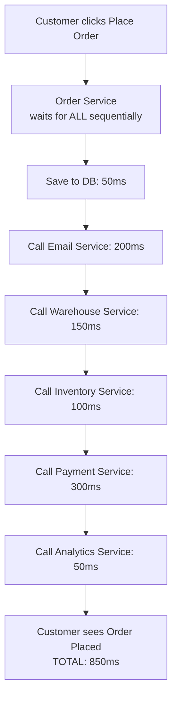

<details>
<summary>ASCII diagram (reference)</summary>

```text
Customer clicks "Place Order"
    │
    ▼
┌─────────────────────────────────────────────────────────────┐
│ Order Service (waits for ALL of these sequentially)         │
│                                                              │
│   Save to DB ──────────────────────────────► 50ms           │
│   Call Email Service ──────────────────────► 200ms          │
│   Call Warehouse Service ──────────────────► 150ms          │
│   Call Inventory Service ──────────────────► 100ms          │
│   Call Payment Service ─────────────────────► 300ms         │
│   Call Analytics Service ──────────────────► 50ms           │
│                                                              │
│   TOTAL: 850ms (if nothing fails!)                          │
└─────────────────────────────────────────────────────────────┘
    │
    ▼
Customer sees "Order Placed" (almost 1 second later)
```

</details>

**What if Email Service is down?**
- Does the entire order fail?
- Should the customer wait while you retry?
- What if Analytics is slow? Should the customer wait for analytics?

### What Systems Looked Like Before Messaging

In early web applications, all communication was synchronous HTTP calls:

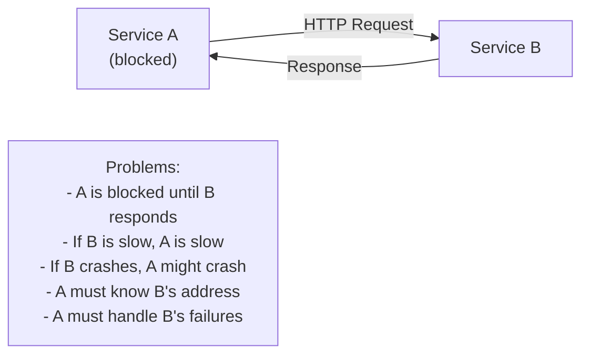

<details>
<summary>ASCII diagram (reference)</summary>

```text
┌─────────────┐      HTTP       ┌─────────────┐
│  Service A  │ ──────────────► │  Service B  │
│  (blocked)  │ ◄────────────── │             │
└─────────────┘    Response     └─────────────┘

Problems:
- A is blocked until B responds
- If B is slow, A is slow
- If B crashes, A might crash
- A must know B's address
- A must handle B's failures
```

</details>

### What Breaks Without Messaging

**Without asynchronous messaging:**

1. **Tight Coupling**: Services must know about each other directly. Adding a new service means changing existing services.

2. **Cascading Failures**: If the email service is down, the entire order placement fails. One slow service slows everything.

3. **No Load Leveling**: If 10,000 orders come in at once, all downstream services get hit simultaneously. They might crash.

4. **No Retry Logic**: If a call fails, the caller must implement retry logic. Every caller must do this.

5. **Scaling Mismatch**: Your order service can handle 1,000 req/sec, but your email service can only handle 100 emails/sec. What happens to the other 900?

### Real Examples of the Problem

**Amazon's Order Processing**:
Amazon processes thousands of orders per second during Prime Day. They cannot afford to have the order confirmation wait for:
- Warehouse notification
- Shipping label generation
- Seller notification
- Recommendation engine update
- Fraud detection

All of these happen asynchronously via messaging.

**LinkedIn's Feed**:
When you post on LinkedIn, it must appear in potentially millions of followers' feeds. LinkedIn cannot synchronously update millions of feeds. Instead, they publish a "new post" message, and multiple services consume it asynchronously.

**Uber's Ride Matching**:
When you request a ride, Uber doesn't synchronously call every driver. They publish the ride request, and the matching service, pricing service, ETA service, and driver notification service all consume it independently.

---

## 2️⃣ Intuition and Mental Model

### The Post Office Analogy

Think of messaging systems like different postal services:

**Queue (Point-to-Point) = Registered Mail with One Recipient**

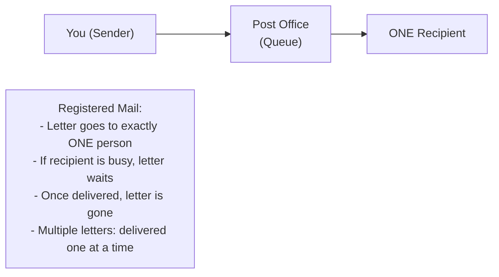

<details>
<summary>ASCII diagram (reference)</summary>

```text
┌─────────────────────────────────────────────────────────────┐
│                    REGISTERED MAIL                           │
│                                                              │
│   You (Sender) ──► Post Office ──► ONE Recipient            │
│                       (Queue)                                │
│                                                              │
│   • Letter goes to exactly ONE person                       │
│   • If recipient is busy, letter waits at post office       │
│   • Once delivered, letter is gone from post office         │
│   • Multiple letters? Delivered one at a time               │
└─────────────────────────────────────────────────────────────┘
```

</details>

**Pub/Sub (Publish-Subscribe) = Newspaper Subscription**

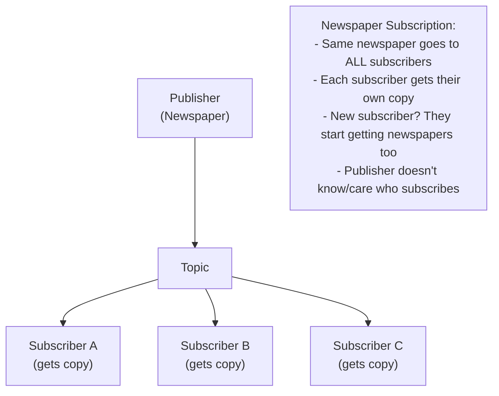

<details>
<summary>ASCII diagram (reference)</summary>

```text
┌─────────────────────────────────────────────────────────────┐
│                   NEWSPAPER SUBSCRIPTION                     │
│                                                              │
│                      ┌──► Subscriber A (gets copy)          │
│   Publisher ──► Topic ├──► Subscriber B (gets copy)         │
│   (Newspaper)         └──► Subscriber C (gets copy)         │
│                                                              │
│   • Same newspaper goes to ALL subscribers                  │
│   • Each subscriber gets their own copy                     │
│   • New subscriber? They start getting newspapers too       │
│   • Publisher doesn't know/care who subscribes              │
└─────────────────────────────────────────────────────────────┘
```

</details>

### The Core Difference

| Aspect | Queue | Pub/Sub |
|--------|-------|---------|
| **Delivery** | One consumer gets each message | All subscribers get each message |
| **Analogy** | Task assignment | Broadcasting news |
| **Use case** | Work distribution | Event notification |
| **Consumer relationship** | Competing | Independent |

---

## 3️⃣ How It Works Internally

### Queue (Point-to-Point Messaging)

A queue is a data structure that holds messages until a consumer processes them. Messages are delivered to exactly one consumer.

**Internal Structure:**

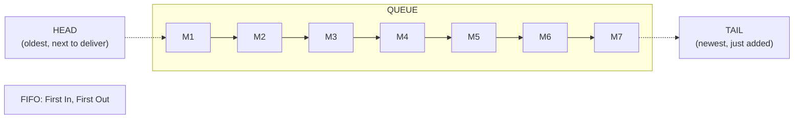

<details>
<summary>ASCII diagram (reference)</summary>

```text
┌─────────────────────────────────────────────────────────────┐
│                         QUEUE                                │
│                                                              │
│   ┌─────┬─────┬─────┬─────┬─────┬─────┬─────┐              │
│   │ M1  │ M2  │ M3  │ M4  │ M5  │ M6  │ M7  │              │
│   └─────┴─────┴─────┴─────┴─────┴─────┴─────┘              │
│     ▲                                     ▲                  │
│     │                                     │                  │
│   HEAD                                  TAIL                 │
│   (oldest,                            (newest,               │
│    next to                             just                  │
│    deliver)                            added)                │
│                                                              │
│   FIFO: First In, First Out                                 │
└─────────────────────────────────────────────────────────────┘
```

</details>

**How Delivery Works:**

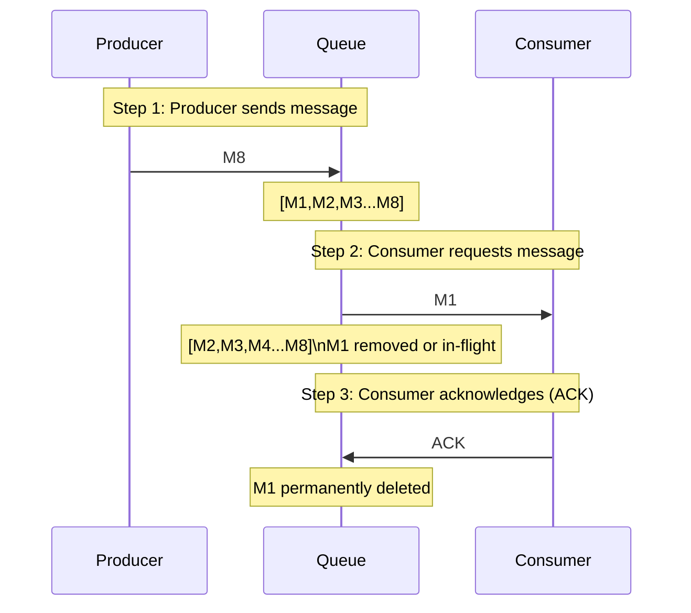

**Multiple Consumers (Competing Consumers):**

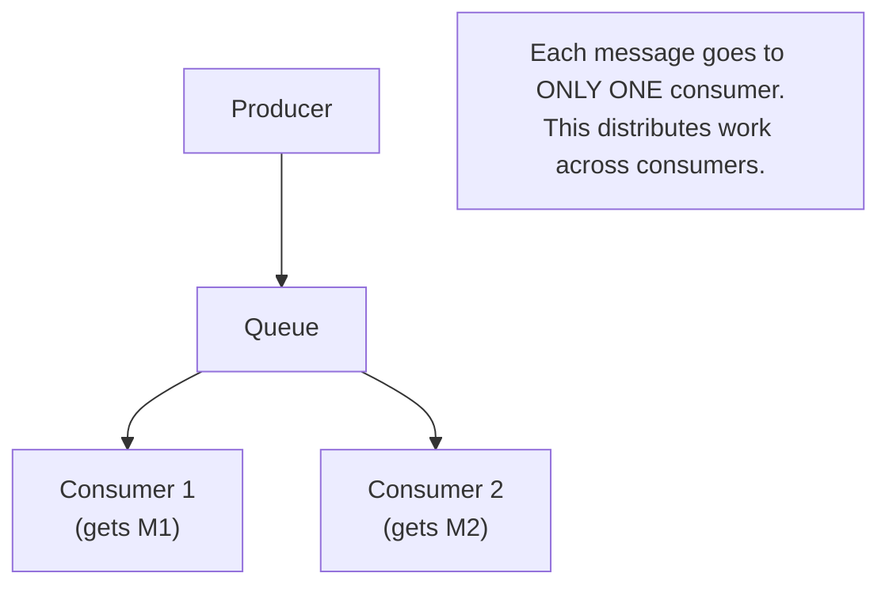

### Pub/Sub (Publish-Subscribe)

In Pub/Sub, messages are published to a "topic" and all subscribers to that topic receive a copy.

**Internal Structure:**

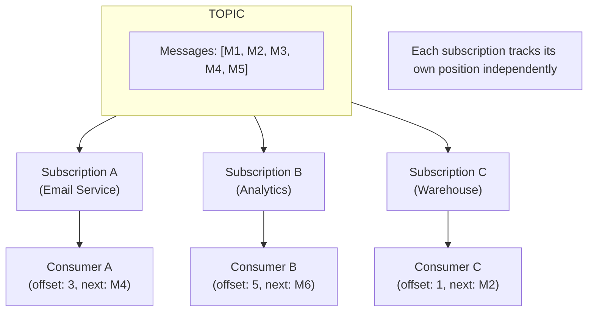

**How Delivery Works:**

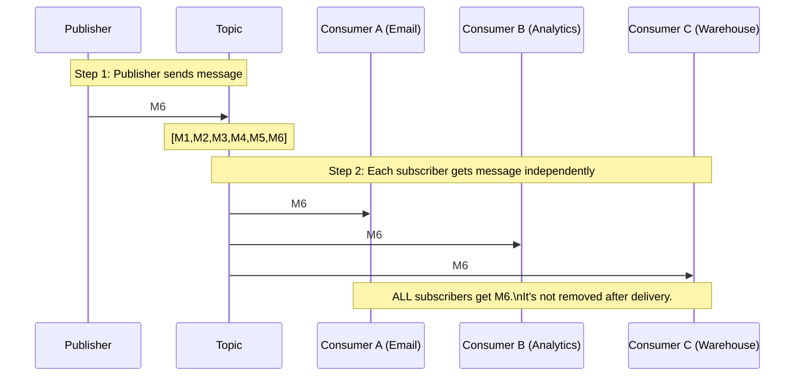

### Key Internal Differences

| Aspect | Queue | Pub/Sub |
|--------|-------|---------|
| **Message storage** | Deleted after ACK | Retained (until TTL or compaction) |
| **Consumer tracking** | Queue tracks what's delivered | Each subscription tracks its offset |
| **Delivery count** | Exactly one consumer | All subscribers |
| **Adding consumers** | Shares the load | Each gets all messages |
| **Message replay** | Usually not possible | Often possible (rewind offset) |

---

## 4️⃣ Simulation-First Explanation

Let's trace through both patterns with a concrete example.

### Scenario: E-commerce Order Processing

**Setup:**
- Customer places order: `{orderId: "ORD-123", item: "Laptop", price: 999}`
- We need to: (1) Send email, (2) Notify warehouse, (3) Update analytics

### Queue Pattern Simulation

**Use case**: Distributing email sending work across multiple email workers.

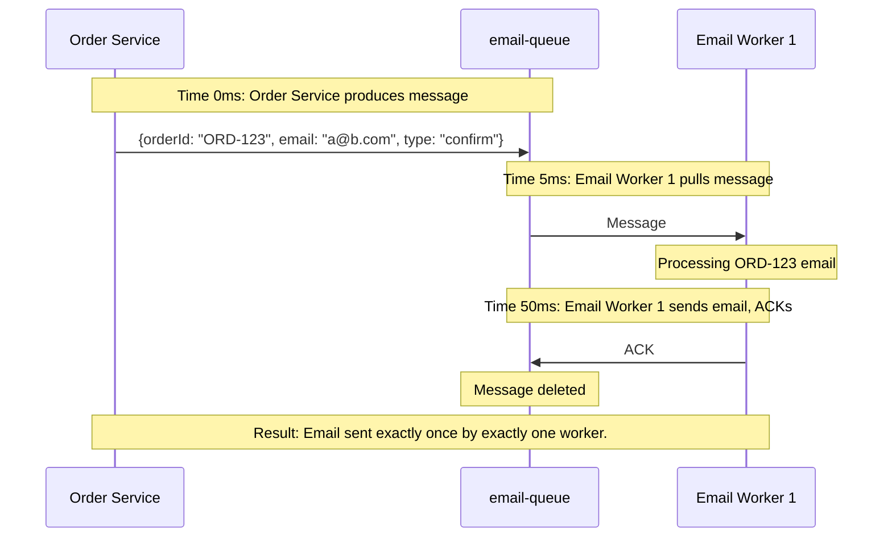

**What if we have 1000 emails to send?**

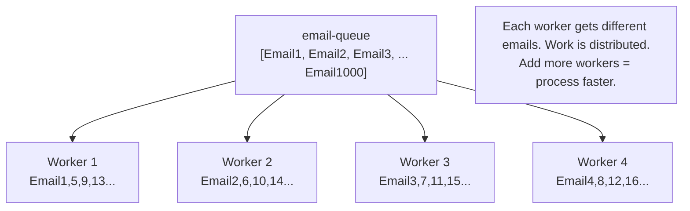

### Pub/Sub Pattern Simulation

**Use case**: Broadcasting order event to multiple interested services.

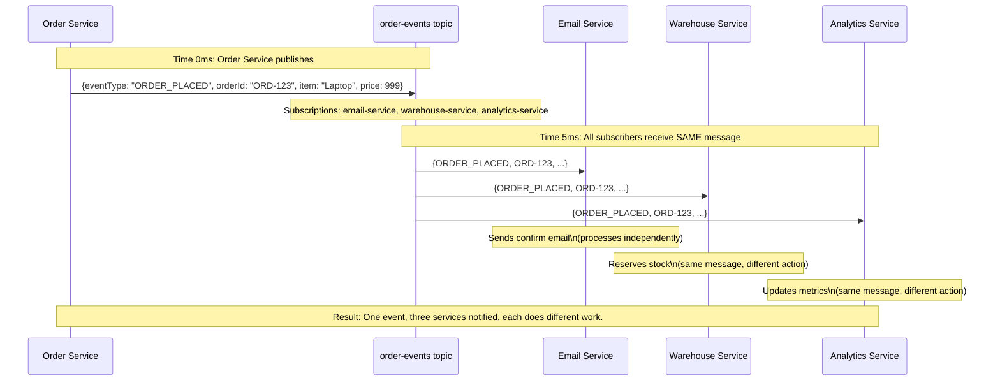

**What if we add a new service (Fraud Detection)?**

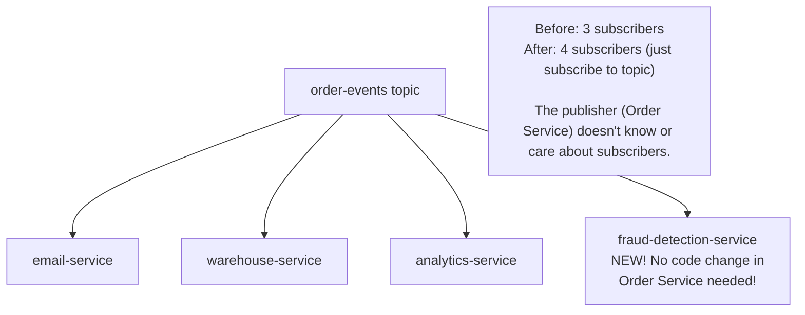

### Combined Pattern (Real-World)

In practice, you often combine both:

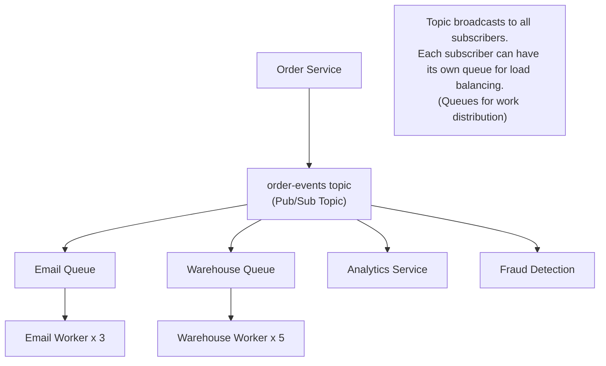

---

## 5️⃣ How Engineers Actually Use This in Production

### Amazon SQS (Queue) + SNS (Pub/Sub)

Amazon uses this pattern extensively:

**SNS (Simple Notification Service)**: Pub/Sub topics
**SQS (Simple Queue Service)**: Queues

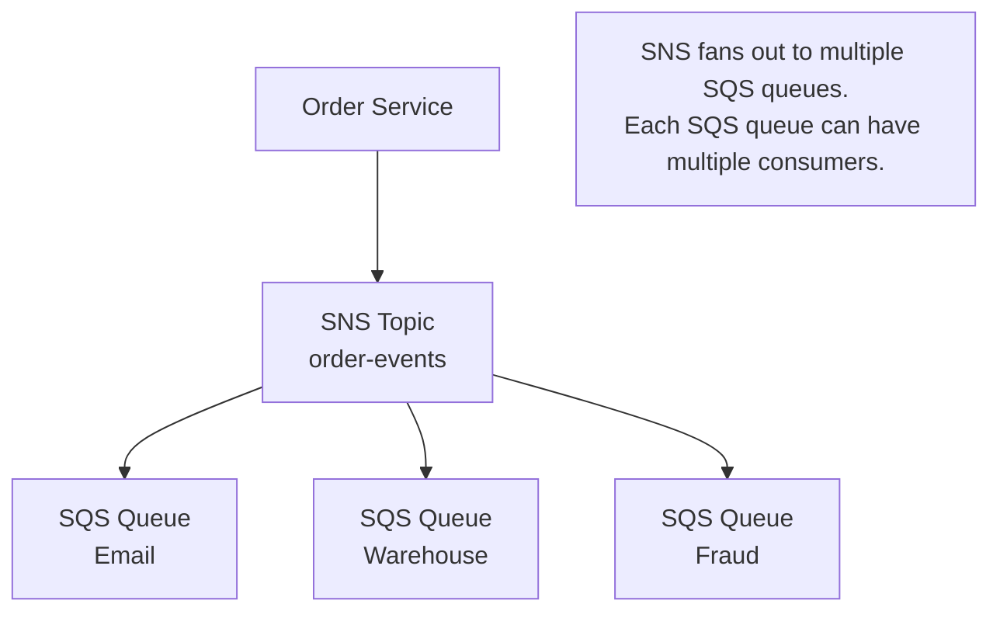

**Why this pattern?**
- SNS handles the fan-out (one message to many subscribers)
- SQS handles the work distribution (competing consumers)
- SQS provides durability (messages persist until processed)
- SQS provides retry logic (failed messages return to queue)

### Netflix's Event-Driven Architecture

Netflix uses Kafka (which supports both patterns) for:

1. **User Activity Events** (Pub/Sub):
   - User watches a show → event published
   - Recommendation service, analytics, billing all subscribe

2. **Video Encoding Tasks** (Queue-like):
   - New video uploaded → encoding task queued
   - Multiple encoding workers compete for tasks

### Uber's Real-Time Systems

Uber uses a combination:

1. **Ride Requests** (Pub/Sub):
   - Rider requests ride → event published
   - Matching service, pricing service, ETA service all receive it

2. **Driver Notifications** (Queue):
   - Matched driver → notification queued
   - Ensures exactly-once delivery to driver app

### Slack's Messaging Infrastructure

Slack processes billions of messages:

1. **Message Posted** (Pub/Sub):
   - User sends message → event to topic
   - Real-time delivery, search indexing, notification services subscribe

2. **Push Notifications** (Queue):
   - Notification service queues push notifications
   - Workers send to Apple/Google push services

---

## 6️⃣ How to Implement or Apply It

### Maven Dependencies

```xml
<dependencies>
    <!-- Spring Boot -->
    <dependency>
        <groupId>org.springframework.boot</groupId>
        <artifactId>spring-boot-starter</artifactId>
    </dependency>
    
    <!-- RabbitMQ (supports both Queue and Pub/Sub) -->
    <dependency>
        <groupId>org.springframework.boot</groupId>
        <artifactId>spring-boot-starter-amqp</artifactId>
    </dependency>
    
    <!-- For JSON serialization -->
    <dependency>
        <groupId>com.fasterxml.jackson.core</groupId>
        <artifactId>jackson-databind</artifactId>
    </dependency>
</dependencies>
```

### Queue Pattern Implementation (RabbitMQ)

**Configuration:**

```java
package com.systemdesign.messaging.queue;

import org.springframework.amqp.core.Queue;
import org.springframework.amqp.rabbit.connection.ConnectionFactory;
import org.springframework.amqp.rabbit.core.RabbitTemplate;
import org.springframework.amqp.support.converter.Jackson2JsonMessageConverter;
import org.springframework.context.annotation.Bean;
import org.springframework.context.annotation.Configuration;

/**
 * Configuration for point-to-point queue messaging.
 * Messages go to exactly one consumer.
 */
@Configuration
public class QueueConfig {
    
    public static final String EMAIL_QUEUE = "email-queue";
    
    /**
     * Declares a durable queue.
     * Durable = survives broker restart.
     */
    @Bean
    public Queue emailQueue() {
        // Queue(name, durable, exclusive, autoDelete)
        // durable: true = survives restart
        // exclusive: false = multiple consumers allowed
        // autoDelete: false = don't delete when consumers disconnect
        return new Queue(EMAIL_QUEUE, true, false, false);
    }
    
    /**
     * JSON message converter.
     * Converts Java objects to JSON for transmission.
     */
    @Bean
    public Jackson2JsonMessageConverter messageConverter() {
        return new Jackson2JsonMessageConverter();
    }
    
    /**
     * RabbitTemplate with JSON converter.
     * This is what we use to send messages.
     */
    @Bean
    public RabbitTemplate rabbitTemplate(ConnectionFactory connectionFactory,
                                         Jackson2JsonMessageConverter converter) {
        RabbitTemplate template = new RabbitTemplate(connectionFactory);
        template.setMessageConverter(converter);
        return template;
    }
}
```

**Producer (Sends to Queue):**

```java
package com.systemdesign.messaging.queue;

import org.springframework.amqp.rabbit.core.RabbitTemplate;
import org.springframework.stereotype.Service;

/**
 * Produces messages to the email queue.
 * Each message will be processed by exactly ONE consumer.
 */
@Service
public class EmailQueueProducer {
    
    private final RabbitTemplate rabbitTemplate;
    
    public EmailQueueProducer(RabbitTemplate rabbitTemplate) {
        this.rabbitTemplate = rabbitTemplate;
    }
    
    /**
     * Sends an email task to the queue.
     * 
     * @param task The email to send
     */
    public void sendEmailTask(EmailTask task) {
        System.out.println("Producing email task: " + task.getOrderId());
        
        // convertAndSend(queueName, message)
        // The message is converted to JSON and sent to the queue
        rabbitTemplate.convertAndSend(QueueConfig.EMAIL_QUEUE, task);
        
        System.out.println("Email task sent to queue: " + task.getOrderId());
    }
    
    /**
     * Email task data transfer object.
     */
    public record EmailTask(
        String orderId,
        String recipientEmail,
        String subject,
        String body
    ) {}
}
```

**Consumer (Receives from Queue):**

```java
package com.systemdesign.messaging.queue;

import org.springframework.amqp.rabbit.annotation.RabbitListener;
import org.springframework.stereotype.Service;

/**
 * Consumes email tasks from the queue.
 * Multiple instances of this consumer will COMPETE for messages.
 * Each message goes to exactly ONE consumer.
 */
@Service
public class EmailQueueConsumer {
    
    private final EmailService emailService;
    
    public EmailQueueConsumer(EmailService emailService) {
        this.emailService = emailService;
    }
    
    /**
     * Listens to the email queue.
     * Spring automatically acknowledges after successful processing.
     * If an exception is thrown, the message returns to the queue.
     * 
     * @param task The email task to process
     */
    @RabbitListener(queues = QueueConfig.EMAIL_QUEUE)
    public void processEmailTask(EmailQueueProducer.EmailTask task) {
        System.out.println("Consumer received task: " + task.orderId());
        
        try {
            // Process the email
            emailService.sendEmail(
                task.recipientEmail(),
                task.subject(),
                task.body()
            );
            
            System.out.println("Email sent successfully for: " + task.orderId());
            // Automatic ACK happens here (message removed from queue)
            
        } catch (Exception e) {
            System.err.println("Failed to send email: " + e.getMessage());
            // Throwing exception = message returns to queue for retry
            throw e;
        }
    }
}
```

### Pub/Sub Pattern Implementation (RabbitMQ)

**Configuration:**

```java
package com.systemdesign.messaging.pubsub;

import org.springframework.amqp.core.*;
import org.springframework.context.annotation.Bean;
import org.springframework.context.annotation.Configuration;

/**
 * Configuration for pub/sub messaging.
 * Messages go to ALL subscribers.
 * 
 * In RabbitMQ, pub/sub uses:
 * - Exchange: The "topic" where messages are published
 * - Queues: Each subscriber has its own queue
 * - Bindings: Connect queues to the exchange
 */
@Configuration
public class PubSubConfig {
    
    public static final String ORDER_EVENTS_EXCHANGE = "order-events";
    public static final String EMAIL_SUBSCRIPTION_QUEUE = "order-events.email";
    public static final String WAREHOUSE_SUBSCRIPTION_QUEUE = "order-events.warehouse";
    public static final String ANALYTICS_SUBSCRIPTION_QUEUE = "order-events.analytics";
    
    /**
     * Fanout Exchange: Broadcasts to ALL bound queues.
     * "Fanout" means every message goes to every queue.
     */
    @Bean
    public FanoutExchange orderEventsExchange() {
        return new FanoutExchange(ORDER_EVENTS_EXCHANGE);
    }
    
    // Each subscriber gets its own queue
    
    @Bean
    public Queue emailSubscriptionQueue() {
        return new Queue(EMAIL_SUBSCRIPTION_QUEUE, true);
    }
    
    @Bean
    public Queue warehouseSubscriptionQueue() {
        return new Queue(WAREHOUSE_SUBSCRIPTION_QUEUE, true);
    }
    
    @Bean
    public Queue analyticsSubscriptionQueue() {
        return new Queue(ANALYTICS_SUBSCRIPTION_QUEUE, true);
    }
    
    // Bind each queue to the exchange
    
    @Bean
    public Binding emailBinding(Queue emailSubscriptionQueue, 
                                FanoutExchange orderEventsExchange) {
        return BindingBuilder
            .bind(emailSubscriptionQueue)
            .to(orderEventsExchange);
    }
    
    @Bean
    public Binding warehouseBinding(Queue warehouseSubscriptionQueue,
                                    FanoutExchange orderEventsExchange) {
        return BindingBuilder
            .bind(warehouseSubscriptionQueue)
            .to(orderEventsExchange);
    }
    
    @Bean
    public Binding analyticsBinding(Queue analyticsSubscriptionQueue,
                                    FanoutExchange orderEventsExchange) {
        return BindingBuilder
            .bind(analyticsSubscriptionQueue)
            .to(orderEventsExchange);
    }
}
```

**Publisher:**

```java
package com.systemdesign.messaging.pubsub;

import org.springframework.amqp.rabbit.core.RabbitTemplate;
import org.springframework.stereotype.Service;

import java.time.Instant;

/**
 * Publishes order events to the topic.
 * All subscribers will receive each event.
 */
@Service
public class OrderEventPublisher {
    
    private final RabbitTemplate rabbitTemplate;
    
    public OrderEventPublisher(RabbitTemplate rabbitTemplate) {
        this.rabbitTemplate = rabbitTemplate;
    }
    
    /**
     * Publishes an order placed event.
     * All subscribers (email, warehouse, analytics) will receive this.
     * 
     * @param event The order event
     */
    public void publishOrderPlaced(OrderEvent event) {
        System.out.println("Publishing order event: " + event.orderId());
        
        // convertAndSend(exchange, routingKey, message)
        // For fanout exchange, routingKey is ignored (all queues get it)
        rabbitTemplate.convertAndSend(
            PubSubConfig.ORDER_EVENTS_EXCHANGE,
            "",  // routing key (ignored for fanout)
            event
        );
        
        System.out.println("Order event published: " + event.orderId());
    }
    
    /**
     * Order event data.
     */
    public record OrderEvent(
        String eventType,
        String orderId,
        String customerId,
        String customerEmail,
        String item,
        int quantity,
        double price,
        Instant timestamp
    ) {
        public static OrderEvent orderPlaced(String orderId, String customerId,
                                             String email, String item, 
                                             int qty, double price) {
            return new OrderEvent(
                "ORDER_PLACED",
                orderId,
                customerId,
                email,
                item,
                qty,
                price,
                Instant.now()
            );
        }
    }
}
```

**Subscribers (Each gets ALL messages):**

```java
package com.systemdesign.messaging.pubsub;

import org.springframework.amqp.rabbit.annotation.RabbitListener;
import org.springframework.stereotype.Service;

/**
 * Email service subscriber.
 * Receives ALL order events and sends confirmation emails.
 */
@Service
public class EmailSubscriber {
    
    @RabbitListener(queues = PubSubConfig.EMAIL_SUBSCRIPTION_QUEUE)
    public void handleOrderEvent(OrderEventPublisher.OrderEvent event) {
        System.out.println("[Email] Received event: " + event.eventType() 
            + " for order: " + event.orderId());
        
        if ("ORDER_PLACED".equals(event.eventType())) {
            // Send confirmation email
            System.out.println("[Email] Sending confirmation to: " 
                + event.customerEmail());
            // emailService.sendConfirmation(event);
        }
    }
}

/**
 * Warehouse service subscriber.
 * Receives ALL order events and reserves inventory.
 */
@Service
public class WarehouseSubscriber {
    
    @RabbitListener(queues = PubSubConfig.WAREHOUSE_SUBSCRIPTION_QUEUE)
    public void handleOrderEvent(OrderEventPublisher.OrderEvent event) {
        System.out.println("[Warehouse] Received event: " + event.eventType() 
            + " for order: " + event.orderId());
        
        if ("ORDER_PLACED".equals(event.eventType())) {
            // Reserve inventory
            System.out.println("[Warehouse] Reserving " + event.quantity() 
                + " x " + event.item());
            // inventoryService.reserve(event.item(), event.quantity());
        }
    }
}

/**
 * Analytics service subscriber.
 * Receives ALL order events and updates metrics.
 */
@Service
public class AnalyticsSubscriber {
    
    @RabbitListener(queues = PubSubConfig.ANALYTICS_SUBSCRIPTION_QUEUE)
    public void handleOrderEvent(OrderEventPublisher.OrderEvent event) {
        System.out.println("[Analytics] Received event: " + event.eventType() 
            + " for order: " + event.orderId());
        
        if ("ORDER_PLACED".equals(event.eventType())) {
            // Update metrics
            System.out.println("[Analytics] Recording sale: $" + event.price());
            // metricsService.recordSale(event.price());
        }
    }
}
```

### Application Configuration

```yaml
# application.yml
spring:
  rabbitmq:
    host: localhost
    port: 5672
    username: guest
    password: guest
    # Connection settings
    connection-timeout: 5000
    # Listener settings
    listener:
      simple:
        # Number of concurrent consumers per listener
        concurrency: 1
        max-concurrency: 10
        # Acknowledge mode
        acknowledge-mode: auto
        # Retry settings
        retry:
          enabled: true
          initial-interval: 1000
          max-attempts: 3
          max-interval: 10000
          multiplier: 2.0
```

### Docker Compose for RabbitMQ

```yaml
# docker-compose.yml
version: '3.8'
services:
  rabbitmq:
    image: rabbitmq:3-management
    container_name: rabbitmq
    ports:
      - "5672:5672"   # AMQP port
      - "15672:15672" # Management UI
    environment:
      RABBITMQ_DEFAULT_USER: guest
      RABBITMQ_DEFAULT_PASS: guest
    volumes:
      - rabbitmq_data:/var/lib/rabbitmq
    healthcheck:
      test: rabbitmq-diagnostics -q ping
      interval: 30s
      timeout: 10s
      retries: 3

volumes:
  rabbitmq_data:
```

### Running and Verifying

```bash
# Start RabbitMQ
docker-compose up -d

# Wait for RabbitMQ to be ready
docker-compose logs -f rabbitmq

# Access management UI
# Open http://localhost:15672
# Login: guest / guest

# Run your Spring Boot application
./mvnw spring-boot:run

# In the management UI, you can see:
# - Queues created
# - Messages flowing
# - Consumer connections
```

---

## 7️⃣ Tradeoffs, Pitfalls, and Common Mistakes

### Common Mistakes

#### 1. Using Queue When You Need Pub/Sub

**Wrong:**
```
Order placed → Send to email-queue
                      ↓
               Email Service processes
               
Problem: Warehouse never gets notified!
You'd have to send to warehouse-queue separately.
```

**Right:**
```
Order placed → Publish to order-events topic
                      ↓
               ┌──────┴──────┐
               ↓             ↓
         Email Service  Warehouse Service
         (subscribes)   (subscribes)
```

#### 2. Using Pub/Sub When You Need Queue

**Wrong:**
```
Send 1000 emails → Publish to email-topic
                        ↓
                 ┌──────┴──────┐
                 ↓             ↓
           Worker 1       Worker 2
           (gets 1000)    (gets 1000)
           
Problem: Each email sent TWICE!
```

**Right:**
```
Send 1000 emails → Send to email-queue
                        ↓
                 ┌──────┴──────┐
                 ↓             ↓
           Worker 1       Worker 2
           (gets 500)     (gets 500)
           
Work is distributed, each email sent once.
```

#### 3. Not Handling Message Ordering

**Problem:**
```
Messages sent: [Create User] → [Update User] → [Delete User]
Messages received (out of order): [Delete User] → [Create User] → [Update User]

Result: User exists when they should be deleted!
```

**Solution:**
- Use partitioning (same user → same partition → same order)
- Or design operations to be order-independent (idempotent)

#### 4. Ignoring Poison Messages

**Poison message**: A message that always fails processing.

```
Queue: [M1, M2_poison, M3, M4, ...]

Consumer tries M2_poison → fails → returns to queue
Consumer tries M2_poison → fails → returns to queue
Consumer tries M2_poison → fails → returns to queue
... forever blocking M3, M4, etc.
```

**Solution:** Use Dead Letter Queue (DLQ), covered in Topic 3.

### Performance Gotchas

#### Queue Depth Monitoring

```
If queue depth keeps growing:
- Consumers are too slow
- Not enough consumers
- Messages arriving faster than processing

Monitor: queue_depth, consumer_count, message_rate
Alert: if queue_depth > threshold for > 5 minutes
```

#### Fan-out Overhead

```
Pub/Sub with 100 subscribers:
- 1 message published
- 100 copies delivered
- 100x network traffic
- 100x storage (if durable)

Consider: Do all subscribers need all messages?
Use: Topic filtering / routing keys for selective delivery
```

### Security Considerations

1. **Message Encryption**: Messages in transit and at rest should be encrypted for sensitive data.

2. **Access Control**: Not every service should publish to every topic or consume from every queue.

3. **Message Validation**: Consumers should validate messages. A malicious producer could send malformed data.

---

## 8️⃣ When NOT to Use This

### When Queue is Overkill

1. **Simple request-response**: If you need an immediate response, use HTTP.
   ```
   Need: "What's the user's balance?"
   Don't: Send to queue, wait for response queue
   Do: Call the balance service directly
   ```

2. **Low-volume, low-latency**: If you have 10 requests/minute and need sub-100ms response, queues add unnecessary latency.

3. **Tightly coupled workflow**: If step B absolutely must happen immediately after step A, synchronous might be simpler.

### When Pub/Sub is Overkill

1. **Single consumer**: If only one service needs the data, a direct call or queue is simpler.

2. **Guaranteed ordering across subscribers**: Pub/Sub doesn't guarantee that all subscribers process in the same order.

3. **Small, simple systems**: For a monolith with 3 services, pub/sub infrastructure might be overkill.

### Anti-Patterns

1. **Using messaging for synchronous operations**:
   ```
   // Anti-pattern: Request-reply over messaging
   sendToQueue(request);
   response = waitForResponseQueue(timeout: 30s);  // Blocking!
   
   // Just use HTTP if you need sync response
   ```

2. **Putting large payloads in messages**:
   ```
   // Bad: 10MB image in message
   message = { image: <10MB binary> }
   
   // Good: Reference to image
   message = { imageUrl: "s3://bucket/image.jpg" }
   ```

3. **Not considering message size limits**:
   - RabbitMQ default: 128MB (but don't!)
   - SQS: 256KB
   - Kafka: 1MB default (configurable)

---

## 9️⃣ Comparison with Alternatives

### Queue vs Pub/Sub Decision Matrix

| Scenario | Use Queue | Use Pub/Sub |
|----------|-----------|-------------|
| Work distribution | ✅ | ❌ |
| Event notification | ❌ | ✅ |
| Load leveling | ✅ | ❌ |
| Multiple consumers need same data | ❌ | ✅ |
| Exactly-once processing | ✅ (easier) | ❌ (harder) |
| Adding new consumers dynamically | ❌ (changes load) | ✅ (transparent) |
| Message replay | ❌ (usually) | ✅ (often) |

### Technology Comparison

| Feature | RabbitMQ | Amazon SQS/SNS | Apache Kafka | Redis Streams |
|---------|----------|----------------|--------------|---------------|
| **Queue** | ✅ | SQS | ✅ (consumer groups) | ✅ |
| **Pub/Sub** | ✅ (exchanges) | SNS | ✅ (topics) | ✅ |
| **Ordering** | Per-queue | FIFO queues | Per-partition | Per-stream |
| **Replay** | ❌ | ❌ | ✅ | ✅ |
| **Throughput** | 10K/sec | 3K/sec (SQS) | 1M+/sec | 100K+/sec |
| **Latency** | Low | Medium | Low | Very Low |
| **Managed** | Self/Cloud | AWS | Self/Confluent | Self/Cloud |

### When to Choose Each

**RabbitMQ**: Traditional messaging, complex routing, when you need both patterns.

**Amazon SQS/SNS**: AWS ecosystem, managed service, simple requirements.

**Apache Kafka**: High throughput, event sourcing, stream processing, replay needed.

**Redis Streams**: Already using Redis, need simple streaming, low latency critical.

---

## 🔟 Interview Follow-Up Questions WITH Answers

### L4 (Entry-Level) Questions

**Q1: What's the difference between a queue and pub/sub?**

**Answer:**
A queue delivers each message to exactly one consumer. Think of it like a task list where workers pick up tasks. Once a task is picked up, it's gone from the list. This is used for work distribution.

Pub/Sub (publish-subscribe) delivers each message to all subscribers. Think of it like a newspaper. Everyone who subscribes gets their own copy. The publisher doesn't know or care who the subscribers are. This is used for event notification.

**Q2: When would you use a queue vs pub/sub?**

**Answer:**
Use a **queue** when:
- You want to distribute work across multiple workers
- Each piece of work should be done exactly once
- Example: Sending emails. You have 1000 emails and 10 workers. Each worker should send different emails.

Use **pub/sub** when:
- Multiple services need to know about the same event
- Each service does something different with the event
- Example: Order placed. Email service sends confirmation, warehouse reserves stock, analytics records the sale. All need to know about the same order.

### L5 (Senior) Questions

**Q3: How would you design a notification system that needs both patterns?**

**Answer:**
I would use a combination:

1. **Pub/Sub for event distribution**: When an event occurs (new follower, new message), publish to a topic. Multiple services subscribe: push notification service, email service, in-app notification service.

2. **Queue for work distribution within each service**: The push notification service might have a queue internally. Multiple workers consume from this queue to actually send the push notifications to Apple/Google.

Architecture:
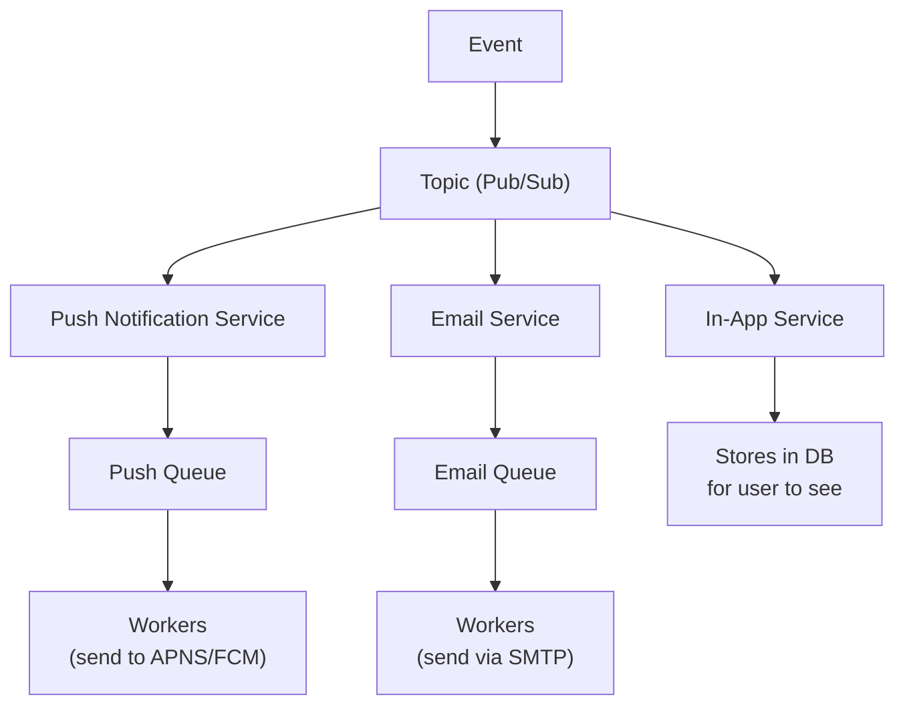

This gives us:
- Decoupling (services don't know about each other)
- Scalability (each service scales independently)
- Reliability (queues handle backpressure)

**Q4: How do you handle message ordering in a distributed messaging system?**

**Answer:**
Message ordering is challenging because:
- Network delays can reorder messages
- Multiple partitions/queues process in parallel
- Consumer failures cause redelivery

Solutions:

1. **Single partition/queue**: All messages for the same entity go to the same partition. Kafka does this with partition keys. Messages within a partition are ordered.

2. **Sequence numbers**: Include a sequence number in messages. Consumer tracks last processed sequence, rejects out-of-order.

3. **Idempotent operations**: Design operations so order doesn't matter. Instead of "increment by 1", use "set to 5".

4. **Event sourcing**: Store all events with timestamps. Rebuild state by replaying events in order.

For most systems, I'd use partition keys (same user/order → same partition) which gives ordering within an entity while allowing parallelism across entities.

### L6 (Staff) Questions

**Q5: Design a messaging system for a company with 100M daily active users posting content.**

**Answer:**
Let me break this down:

**Scale estimation:**
- 100M DAU
- Assume 10% post daily = 10M posts/day
- = 115 posts/second average
- Peak = 10x = 1,150 posts/second
- Each post fans out to average 500 followers = 575,000 deliveries/second at peak

**Architecture:**

1. **Post Ingestion (Queue pattern)**:
   - User posts → Post Service → Kafka topic "raw-posts"
   - Post processors (validate, store, extract metadata)
   - Multiple partitions, partition by user_id for ordering

2. **Fan-out (Pub/Sub + Queue hybrid)**:
   - Processed post → "post-events" topic
   - Fan-out service subscribes, determines followers
   - For users with <10K followers: push to their feeds (write fan-out)
   - For users with >10K followers: store reference, pull on read (read fan-out)

3. **Delivery (Queue pattern)**:
   - Push notifications queued per device type
   - Separate queues for iOS, Android, Web
   - Workers send to respective push services

**Key decisions:**
- Kafka for durability and replay capability
- Hybrid fan-out to handle celebrities (millions of followers)
- Separate queues for different delivery channels
- Partition by user_id for ordering within user's posts

**Q6: How would you handle a scenario where pub/sub subscribers have vastly different processing speeds?**

**Answer:**
This is the "slow consumer" problem. Options:

1. **Independent queues per subscriber** (recommended):
   - Each subscriber has its own queue
   - Slow subscriber's queue grows, doesn't affect others
   - Monitor queue depth, alert on growth
   - Scale slow subscriber or accept delay

2. **Backpressure**:
   - Slow subscriber signals it's overwhelmed
   - Publisher slows down
   - Problem: affects all subscribers

3. **Sampling/Filtering**:
   - Slow subscriber only processes a sample
   - Or filters to only messages it can handle
   - Acceptable for analytics, not for critical processing

4. **Tiered topics**:
   - Critical messages to high-priority topic (all subscribers keep up)
   - Non-critical to low-priority topic (slow subscribers may lag)

For production, I'd use independent queues with monitoring. If a subscriber consistently lags:
- Investigate why (CPU? DB? External service?)
- Scale the subscriber
- If it's a design issue, consider if it needs all messages

---

## 1️⃣1️⃣ One Clean Mental Summary

Queue and Pub/Sub are the two fundamental messaging patterns. A **Queue** delivers each message to exactly one consumer, distributing work across workers (like tasks on a to-do list that workers pick up). **Pub/Sub** delivers each message to all subscribers, broadcasting events to multiple interested services (like a newspaper that everyone subscribed gets). Use Queue when you want to parallelize work (sending emails, processing orders). Use Pub/Sub when multiple services need to react to the same event (order placed triggers email, warehouse, analytics). In practice, combine both: Pub/Sub to fan out events to services, Queue within each service to distribute work. The key insight is decoupling: producers don't need to know about consumers, and adding new consumers doesn't require changing producers.

---

## Quick Reference Card

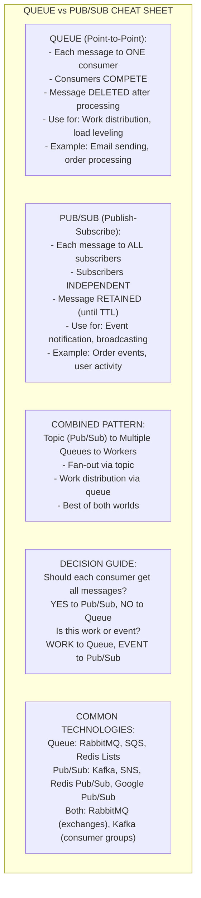

<details>
<summary>ASCII diagram (reference)</summary>

```text
┌─────────────────────────────────────────────────────────────┐
│              QUEUE vs PUB/SUB CHEAT SHEET                   │
├─────────────────────────────────────────────────────────────┤
│ QUEUE (Point-to-Point)                                      │
│   • Each message → ONE consumer                             │
│   • Consumers COMPETE for messages                          │
│   • Message DELETED after processing                        │
│   • Use for: Work distribution, load leveling               │
│   • Example: Email sending, order processing                │
├─────────────────────────────────────────────────────────────┤
│ PUB/SUB (Publish-Subscribe)                                 │
│   • Each message → ALL subscribers                          │
│   • Subscribers are INDEPENDENT                             │
│   • Message RETAINED (until TTL)                            │
│   • Use for: Event notification, broadcasting               │
│   • Example: Order events, user activity                    │
├─────────────────────────────────────────────────────────────┤
│ COMBINED PATTERN                                            │
│   Topic (Pub/Sub) → Multiple Queues → Workers               │
│   • Fan-out via topic                                       │
│   • Work distribution via queue                             │
│   • Best of both worlds                                     │
├─────────────────────────────────────────────────────────────┤
│ DECISION GUIDE                                              │
│   "Should each consumer get all messages?"                  │
│     YES → Pub/Sub                                           │
│     NO  → Queue                                             │
│                                                              │
│   "Is this work to be done or event to be notified?"       │
│     WORK  → Queue                                           │
│     EVENT → Pub/Sub                                         │
├─────────────────────────────────────────────────────────────┤
│ COMMON TECHNOLOGIES                                         │
│   Queue: RabbitMQ, SQS, Redis Lists                        │
│   Pub/Sub: Kafka, SNS, Redis Pub/Sub, Google Pub/Sub       │
│   Both: RabbitMQ (exchanges), Kafka (consumer groups)      │
└─────────────────────────────────────────────────────────────┘
```

</details>

