# 📨 Message Delivery

---

## 0️⃣ Prerequisites

Before diving into message delivery, you should understand:

- **Queue vs Pub/Sub** (Topic 1): The two fundamental messaging patterns. Queue delivers to one consumer, Pub/Sub delivers to all subscribers.
- **Distributed Systems** (Phase 1, Topic 1): Systems where multiple computers communicate over unreliable networks.
- **Network Failures** (Phase 1, Topic 7): Networks can lose packets, duplicate packets, delay packets, or deliver them out of order.

**Quick refresher on network unreliability**: When Service A sends a message to Service B over a network:
- The message might never arrive (packet loss)
- The message might arrive twice (retransmission)
- The acknowledgment might be lost (A doesn't know B received it)
- The message might arrive late (network congestion)

This unreliability is the foundation of why message delivery is complex.

---

## 1️⃣ What Problem Does This Exist to Solve?

### The Specific Pain Point

Imagine you're building a payment system. A customer clicks "Pay $100." Your service sends a message to the payment processor.

**Scenario 1: Message Lost**
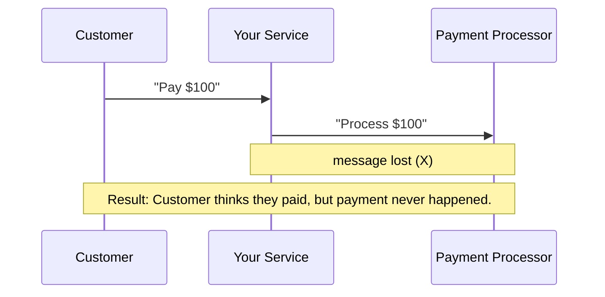
```mermaid
sequenceDiagram
  participant C as Customer
  participant YS as Your Service
  participant PP as Payment Processor
  
  C->>YS: "Pay $100"
  YS->>PP: "Process $100"
  Note over YS,PP: message lost (X)
  
  Note over C,PP: Result: Customer thinks they paid, but payment never happened.
```

**Scenario 2: Acknowledgment Lost**
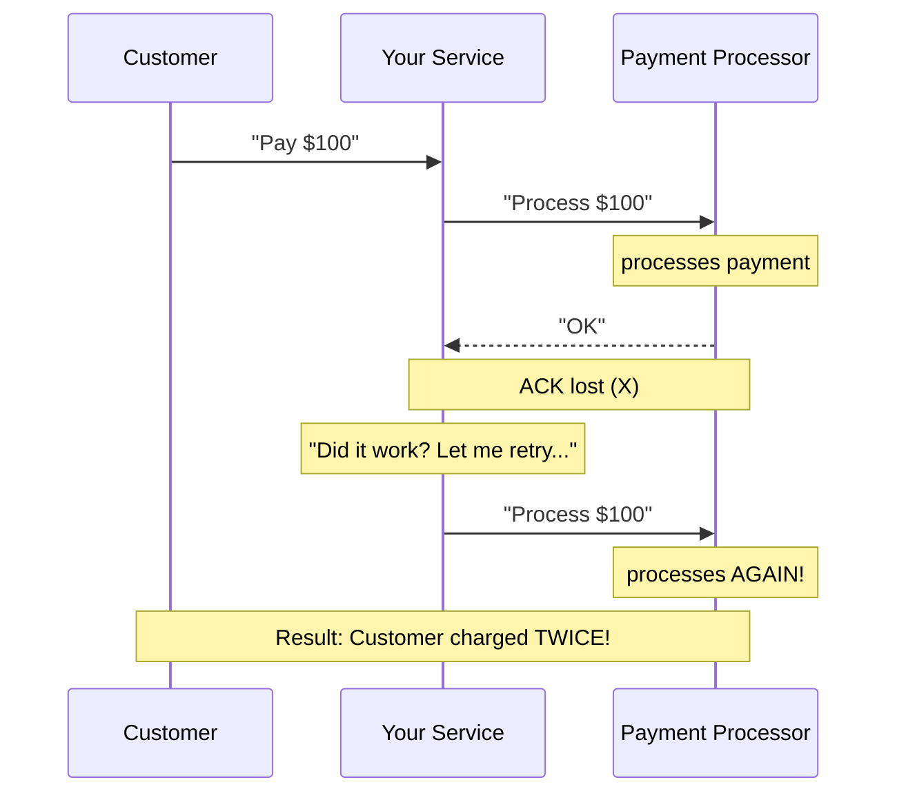
```mermaid
sequenceDiagram
  participant C as Customer
  participant YS as Your Service
  participant PP as Payment Processor
  
  C->>YS: "Pay $100"
  YS->>PP: "Process $100"
  Note over PP: processes payment
  PP-->>YS: "OK"
  Note over PP,YS: ACK lost (X)
  Note over YS: "Did it work? Let me retry..."
  YS->>PP: "Process $100"
  Note over PP: processes AGAIN!
  
  Note over C,PP: Result: Customer charged TWICE!
```

**Scenario 3: Message Duplicated**
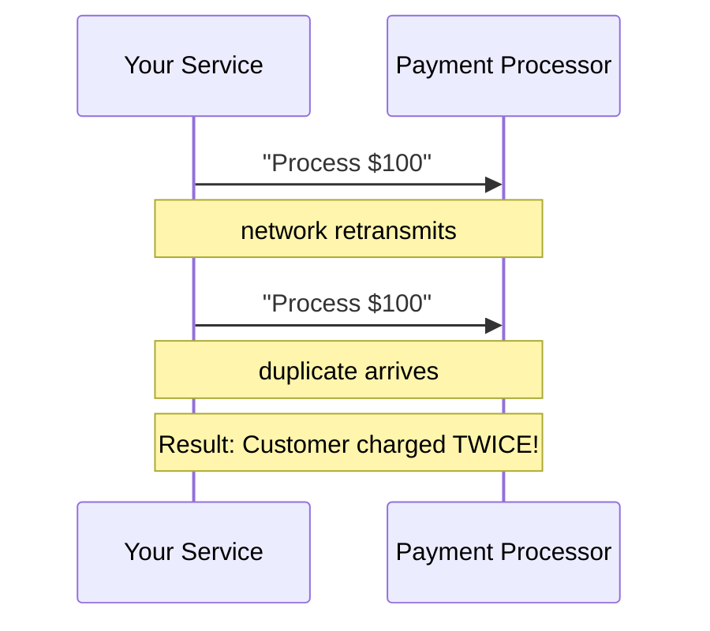
```mermaid
sequenceDiagram
  participant YS as Your Service
  participant PP as Payment Processor
  
  YS->>PP: "Process $100"
  Note over YS,PP: network retransmits
  YS->>PP: "Process $100"
  Note over YS,PP: duplicate arrives
  
  Note over YS,PP: Result: Customer charged TWICE!
```

### What Systems Looked Like Before Formal Delivery Guarantees

Early messaging systems had no formal guarantees:
- "Fire and forget": Send message, hope it arrives
- Manual retry logic scattered throughout code
- Inconsistent handling of duplicates
- No way to know if message was processed

### What Breaks Without Proper Delivery Semantics

1. **Financial Systems**: Double charges, missing payments, incorrect balances
2. **Inventory Systems**: Overselling (sold item twice), underselling (missed sale)
3. **Order Systems**: Duplicate orders, missing orders
4. **Notification Systems**: Spam (duplicate notifications), missed alerts
5. **Analytics**: Inflated or deflated metrics

### Real Examples of the Problem

**Early PayPal**: PayPal had significant issues with duplicate payments in their early days. A network timeout during payment would cause retries, resulting in multiple charges.

**Amazon's Ordering System**: Amazon had to develop sophisticated idempotency systems because network issues between their microservices would cause duplicate order processing.

**Stock Trading**: Financial systems require exactly-once semantics. A duplicate trade execution could cost millions.

---

## 2️⃣ Intuition and Mental Model

### The Postal Service Analogy

Think of message delivery like different postal services:

**At-Most-Once: Postcard**
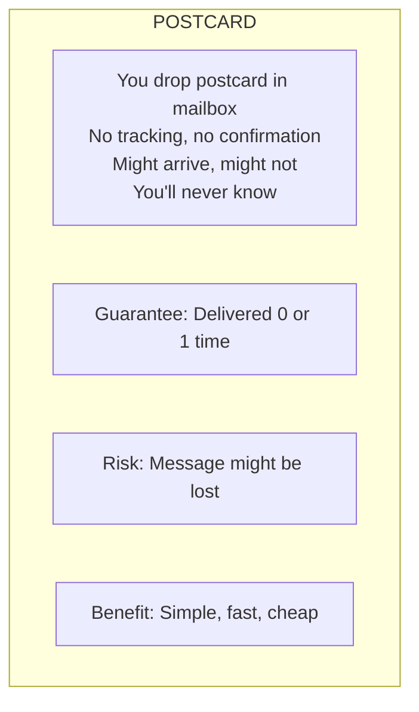
```mermaid
flowchart TD
  subgraph Postcard["POSTCARD"]
    Steps["You drop postcard in mailbox\nNo tracking, no confirmation\nMight arrive, might not\nYou'll never know"]
    Guarantee["Guarantee: Delivered 0 or 1 time"]
    Risk["Risk: Message might be lost"]
    Benefit["Benefit: Simple, fast, cheap"]
  end
```

**At-Least-Once: Registered Mail with Retry**
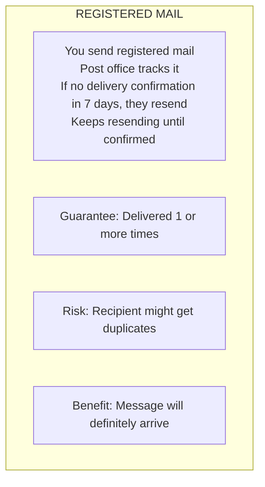
```mermaid
flowchart TD
  subgraph RegisteredMail["REGISTERED MAIL"]
    Steps["You send registered mail\nPost office tracks it\nIf no delivery confirmation in 7 days, they resend\nKeeps resending until confirmed"]
    Guarantee["Guarantee: Delivered 1 or more times"]
    Risk["Risk: Recipient might get duplicates"]
    Benefit["Benefit: Message will definitely arrive"]
  end
```

**Exactly-Once: Bank Wire Transfer**
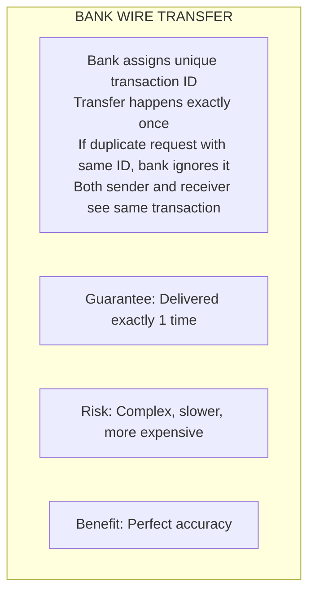
```mermaid
flowchart TD
  subgraph BankWire["BANK WIRE TRANSFER"]
    Steps["Bank assigns unique transaction ID\nTransfer happens exactly once\nIf duplicate request with same ID, bank ignores it\nBoth sender and receiver see same transaction"]
    Guarantee["Guarantee: Delivered exactly 1 time"]
    Risk["Risk: Complex, slower, more expensive"]
    Benefit["Benefit: Perfect accuracy"]
  end
```

### The Three Delivery Guarantees

| Guarantee | Delivery Count | Lost Messages? | Duplicates? | Complexity |
|-----------|----------------|----------------|-------------|------------|
| At-Most-Once | 0 or 1 | Yes, possible | No | Low |
| At-Least-Once | 1 or more | No | Yes, possible | Medium |
| Exactly-Once | Exactly 1 | No | No | High |

---

## 3️⃣ How It Works Internally

### At-Most-Once Delivery

**Mechanism**: Send once, don't retry, don't wait for acknowledgment.

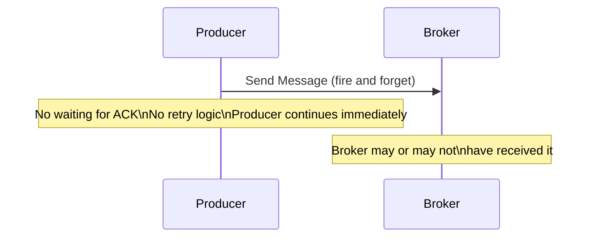
```mermaid
sequenceDiagram
  participant P as Producer
  participant B as Broker
  
  P->>B: Send Message (fire and forget)
  Note over P: No waiting for ACK\nNo retry logic\nProducer continues immediately
  Note over B: Broker may or may not\nhave received it
```

**Implementation Details:**

1. Producer sends message to broker
2. Producer does NOT wait for acknowledgment
3. If message is lost, it's gone forever
4. No retry mechanism

**When Message is Lost:**
- Network failure between producer and broker
- Broker crashes before persisting
- Message queue is full (message dropped)

**Code Pattern:**
```java
// At-most-once: Send and forget
producer.send(message);  // Returns immediately
// No error handling, no retry
// Message might be lost
```

### At-Least-Once Delivery

**Mechanism**: Send, wait for acknowledgment, retry if no ACK received.

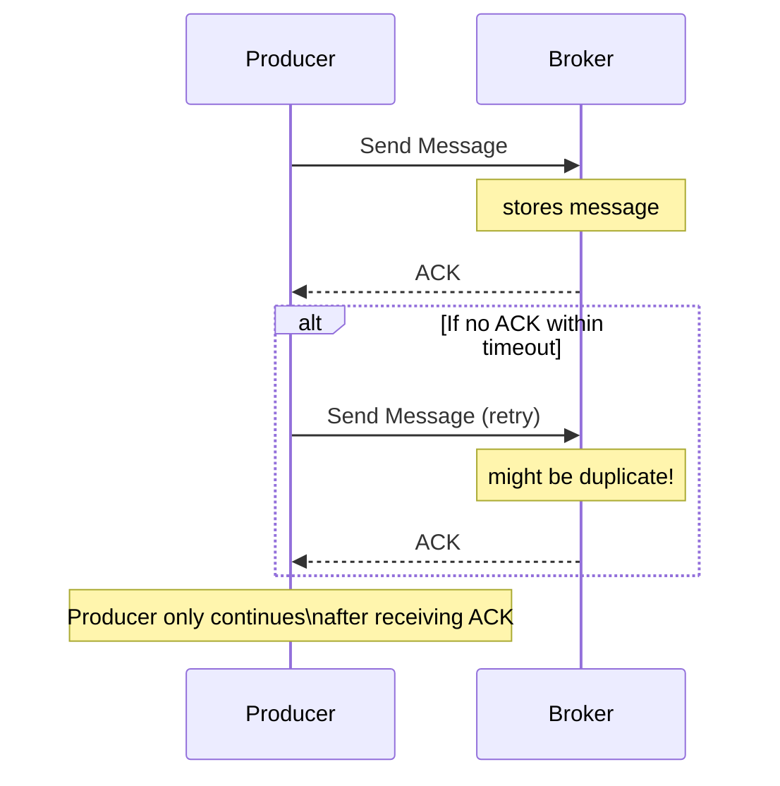
```mermaid
sequenceDiagram
  participant P as Producer
  participant B as Broker
  
  P->>B: Send Message
  Note over B: stores message
  B-->>P: ACK
  
  alt If no ACK within timeout
    P->>B: Send Message (retry)
    Note over B: might be duplicate!
    B-->>P: ACK
  end
  
  Note over P: Producer only continues\nafter receiving ACK
```

**Why Duplicates Happen:**

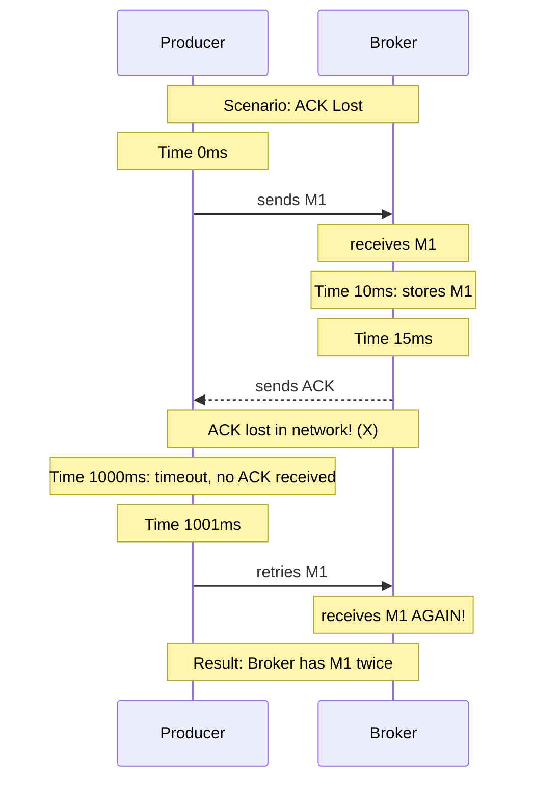
```mermaid
sequenceDiagram
  participant P as Producer
  participant B as Broker
  
  Note over P,B: Scenario: ACK Lost
  
  Note over P: Time 0ms
  P->>B: sends M1
  Note over B: receives M1
  
  Note over B: Time 10ms: stores M1
  
  Note over B: Time 15ms
  B-->>P: sends ACK
  Note over B,P: ACK lost in network! (X)
  
  Note over P: Time 1000ms: timeout, no ACK received
  
  Note over P: Time 1001ms
  P->>B: retries M1
  Note over B: receives M1 AGAIN!
  
  Note over P,B: Result: Broker has M1 twice
```

**Consumer-Side At-Least-Once:**

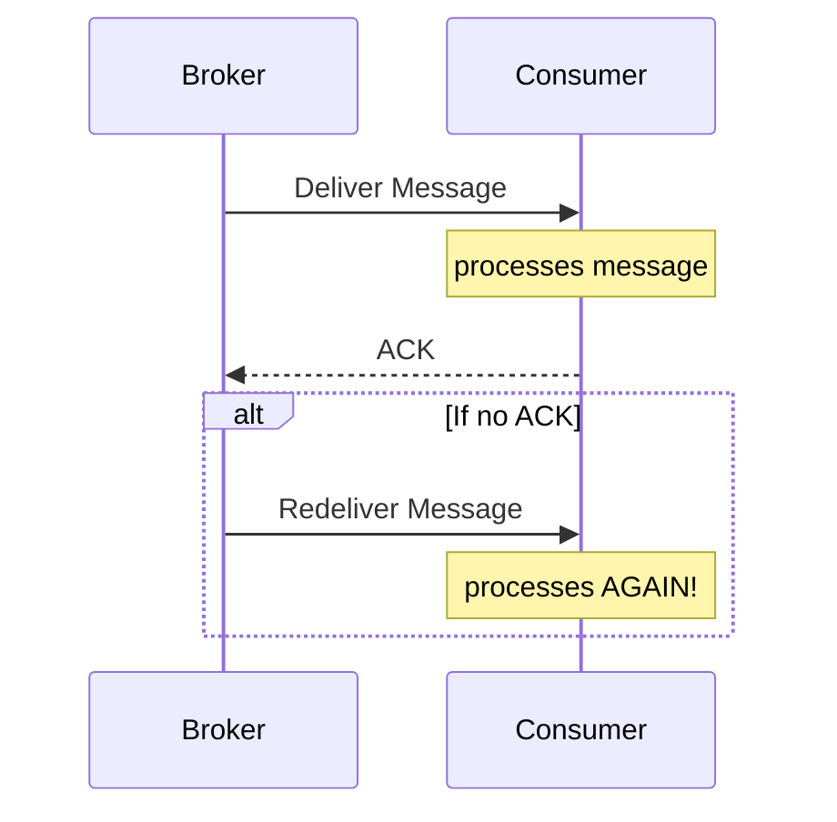
```mermaid
sequenceDiagram
  participant B as Broker
  participant C as Consumer
  
  B->>C: Deliver Message
  Note over C: processes message
  C-->>B: ACK
  
  alt If no ACK
    B->>C: Redeliver Message
    Note over C: processes AGAIN!
  end
```

**Why Consumer Duplicates Happen:**

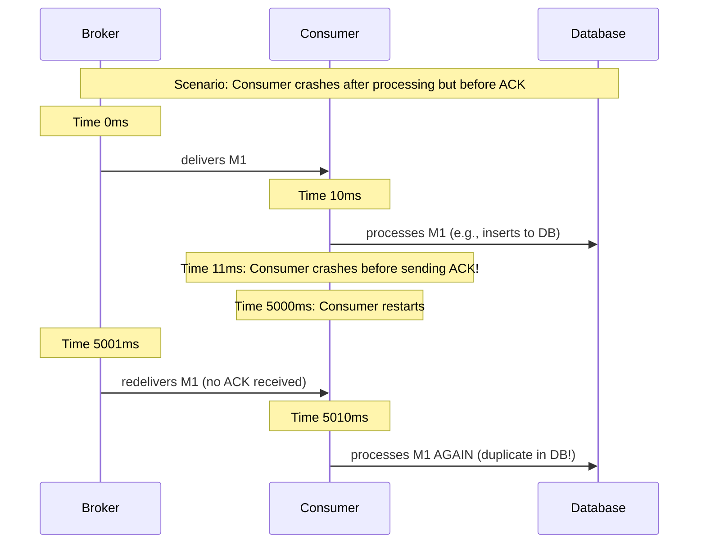
```mermaid
sequenceDiagram
  participant B as Broker
  participant C as Consumer
  participant DB as Database
  
  Note over B,DB: Scenario: Consumer crashes after processing but before ACK
  
  Note over B: Time 0ms
  B->>C: delivers M1
  
  Note over C: Time 10ms
  C->>DB: processes M1 (e.g., inserts to DB)
  
  Note over C: Time 11ms: Consumer crashes before sending ACK!
  
  Note over C: Time 5000ms: Consumer restarts
  
  Note over B: Time 5001ms
  B->>C: redelivers M1 (no ACK received)
  
  Note over C: Time 5010ms
  C->>DB: processes M1 AGAIN (duplicate in DB!)
```

### Exactly-Once Delivery

**The Hard Truth**: True exactly-once delivery is impossible in distributed systems due to the Two Generals Problem. What we achieve is **exactly-once semantics** through:

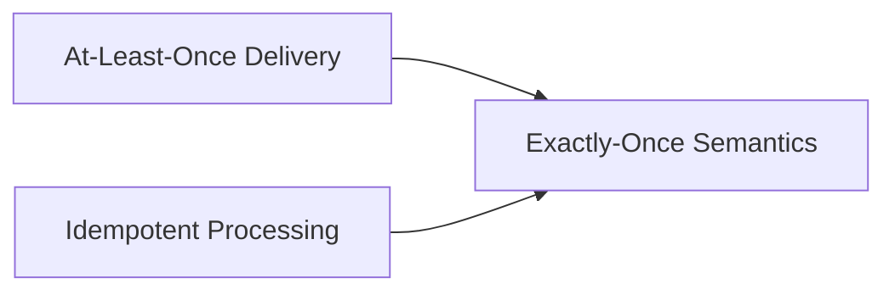
```mermaid
flowchart LR
  A["At-Least-Once Delivery"]
  B["Idempotent Processing"]
  C["Exactly-Once Semantics"]
  A --> C
  B --> C
```

**Mechanism 1: Idempotency Keys**

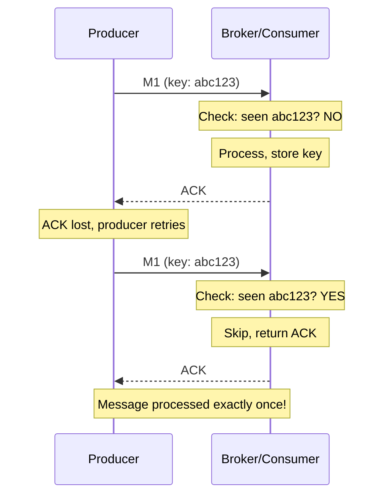
```mermaid
sequenceDiagram
  participant P as Producer
  participant BC as Broker/Consumer
  
  P->>BC: M1 (key: abc123)
  Note over BC: Check: seen abc123? NO
  Note over BC: Process, store key
  BC-->>P: ACK
  
  Note over P: ACK lost, producer retries
  
  P->>BC: M1 (key: abc123)
  Note over BC: Check: seen abc123? YES
  Note over BC: Skip, return ACK
  BC-->>P: ACK
  
  Note over P,BC: Message processed exactly once!
```

**Mechanism 2: Transactional Outbox**

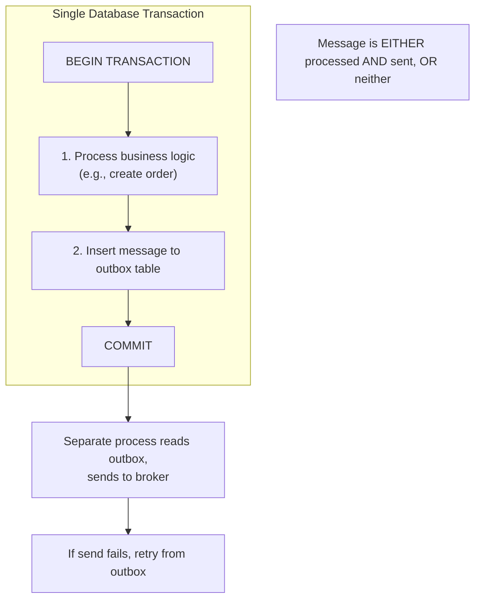
```mermaid
flowchart TD
  subgraph Transaction["Single Database Transaction"]
    BEGIN["BEGIN TRANSACTION"]
    BL["1. Process business logic\n(e.g., create order)"]
    OUTBOX["2. Insert message to outbox table"]
    COMMIT["COMMIT"]
    BEGIN --> BL --> OUTBOX --> COMMIT
  end
  
  PROCESS["Separate process reads outbox,\nsends to broker"]
  RETRY["If send fails, retry from outbox"]
  
  COMMIT --> PROCESS
  PROCESS --> RETRY
  
  Note["Message is EITHER processed AND sent, OR neither"]
```

**Mechanism 3: Kafka Transactions**

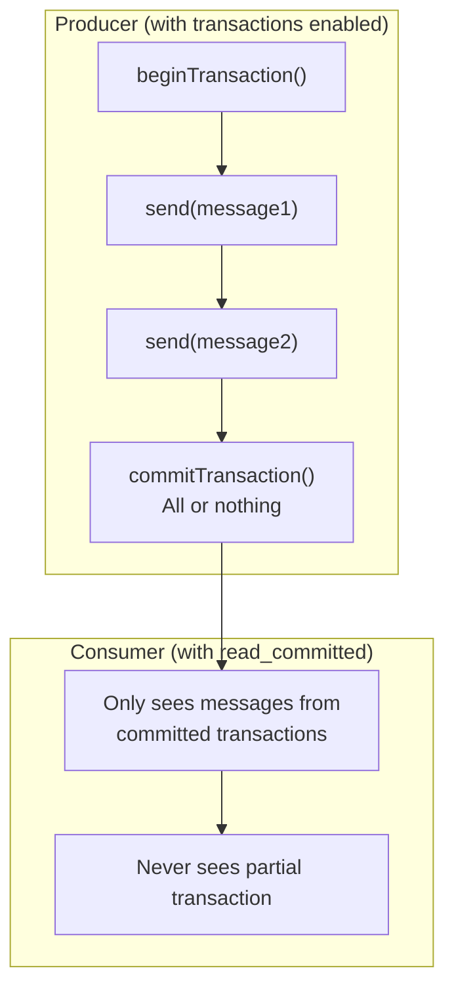
```mermaid
flowchart TD
  subgraph Producer["Producer (with transactions enabled)"]
    BT["beginTransaction()"]
    S1["send(message1)"]
    S2["send(message2)"]
    CT["commitTransaction()\nAll or nothing"]
    BT --> S1 --> S2 --> CT
  end
  
  subgraph Consumer["Consumer (with read_committed)"]
    C1["Only sees messages from\ncommitted transactions"]
    C2["Never sees partial transaction"]
  end
  
  CT --> C1
  C1 --> C2
```

---

## 4️⃣ Simulation-First Explanation

Let's trace through each delivery guarantee with a concrete payment example.

### Scenario: Process a $100 Payment

**Setup:**
- Payment Service sends "charge $100" to Payment Processor
- Network has 10% packet loss
- Processing takes 50ms

### At-Most-Once Simulation

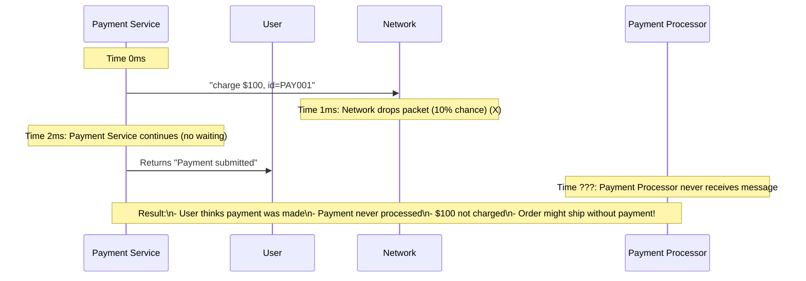
```mermaid
sequenceDiagram
  participant PS as Payment Service
  participant User
  participant Network
  participant PP as Payment Processor
  
  Note over PS: Time 0ms
  PS->>Network: "charge $100, id=PAY001"
  Note over Network: Time 1ms: Network drops packet (10% chance) (X)
  
  Note over PS: Time 2ms: Payment Service continues (no waiting)
  PS->>User: Returns "Payment submitted"
  
  Note over PP: Time ???: Payment Processor never receives message
  
  Note over PS,PP: Result:\n- User thinks payment was made\n- Payment never processed\n- $100 not charged\n- Order might ship without payment!
```

### At-Least-Once Simulation

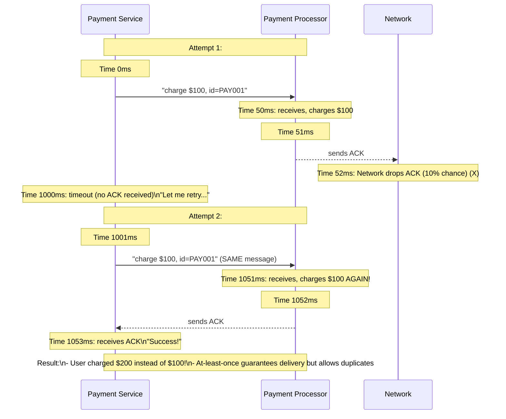
```mermaid
sequenceDiagram
  participant PS as Payment Service
  participant PP as Payment Processor
  participant Network
  
  Note over PS,PP: Attempt 1:
  Note over PS: Time 0ms
  PS->>PP: "charge $100, id=PAY001"
  Note over PP: Time 50ms: receives, charges $100
  Note over PP: Time 51ms
  PP-->>Network: sends ACK
  Note over Network: Time 52ms: Network drops ACK (10% chance) (X)
  
  Note over PS: Time 1000ms: timeout (no ACK received)\n"Let me retry..."
  
  Note over PS,PP: Attempt 2:
  Note over PS: Time 1001ms
  PS->>PP: "charge $100, id=PAY001" (SAME message)
  Note over PP: Time 1051ms: receives, charges $100 AGAIN!
  Note over PP: Time 1052ms
  PP-->>PS: sends ACK
  Note over PS: Time 1053ms: receives ACK\n"Success!"
  
  Note over PS,PP: Result:\n- User charged $200 instead of $100!\n- At-least-once guarantees delivery but allows duplicates
```

### Exactly-Once Simulation (with Idempotency)

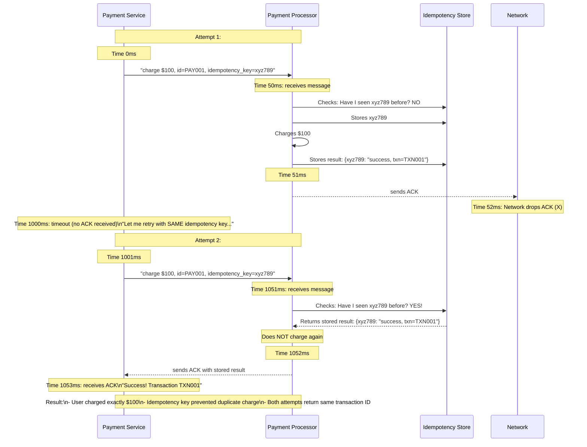
```mermaid
sequenceDiagram
  participant PS as Payment Service
  participant PP as Payment Processor
  participant Store as Idempotency Store
  participant Network
  
  Note over PS,PP: Attempt 1:
  Note over PS: Time 0ms
  PS->>PP: "charge $100, id=PAY001, idempotency_key=xyz789"
  Note over PP: Time 50ms: receives message
  PP->>Store: Checks: Have I seen xyz789 before? NO
  PP->>Store: Stores xyz789
  PP->>PP: Charges $100
  PP->>Store: Stores result: {xyz789: "success, txn=TXN001"}
  Note over PP: Time 51ms
  PP-->>Network: sends ACK
  Note over Network: Time 52ms: Network drops ACK (X)
  
  Note over PS: Time 1000ms: timeout (no ACK received)\n"Let me retry with SAME idempotency key..."
  
  Note over PS,PP: Attempt 2:
  Note over PS: Time 1001ms
  PS->>PP: "charge $100, id=PAY001, idempotency_key=xyz789"
  Note over PP: Time 1051ms: receives message
  PP->>Store: Checks: Have I seen xyz789 before? YES!
  Store-->>PP: Returns stored result: {xyz789: "success, txn=TXN001"}
  Note over PP: Does NOT charge again
  Note over PP: Time 1052ms
  PP-->>PS: sends ACK with stored result
  Note over PS: Time 1053ms: receives ACK\n"Success! Transaction TXN001"
  
  Note over PS,PP: Result:\n- User charged exactly $100\n- Idempotency key prevented duplicate charge\n- Both attempts return same transaction ID
```

---

## 5️⃣ How Engineers Actually Use This in Production

### Stripe's Approach

Stripe uses **at-least-once with idempotency keys**:

```bash
# Stripe API call with idempotency key
curl https://api.stripe.com/v1/charges \
  -u sk_test_xxx: \
  -H "Idempotency-Key: order_12345_charge_attempt_1" \
  -d amount=10000 \
  -d currency=usd
```

**Stripe's documentation states:**
> "Idempotency keys expire after 24 hours. If you retry a request with the same key within 24 hours, you'll get the same response."

### Kafka's Exactly-Once Semantics

Kafka (since version 0.11) supports exactly-once semantics:

**Producer Side:**
```java
Properties props = new Properties();
props.put("enable.idempotence", "true");
props.put("transactional.id", "my-transactional-id");

KafkaProducer<String, String> producer = new KafkaProducer<>(props);
producer.initTransactions();

try {
    producer.beginTransaction();
    producer.send(new ProducerRecord<>("topic1", "key", "value1"));
    producer.send(new ProducerRecord<>("topic2", "key", "value2"));
    producer.commitTransaction();
} catch (Exception e) {
    producer.abortTransaction();
}
```

**Consumer Side:**
```java
Properties props = new Properties();
props.put("isolation.level", "read_committed");
// Consumer only sees committed transactions
```

### Amazon SQS

SQS provides **at-least-once** by default, with **FIFO queues** offering exactly-once:

**Standard Queue (At-Least-Once):**
- Messages delivered at least once
- Occasional duplicates
- Best-effort ordering

**FIFO Queue (Exactly-Once):**
- Messages delivered exactly once
- Strict ordering
- Deduplication based on message ID

```java
// SQS FIFO Queue - exactly once
SendMessageRequest request = SendMessageRequest.builder()
    .queueUrl(fifoQueueUrl)
    .messageBody("Payment $100")
    .messageGroupId("order-123")  // For ordering
    .messageDeduplicationId("payment-xyz789")  // For deduplication
    .build();
```

### Netflix's Approach

Netflix uses Kafka with custom idempotency:

1. **Producer**: Assigns unique message ID
2. **Consumer**: Stores processed IDs in Cassandra
3. **On receive**: Check if ID processed, skip if yes
4. **Cleanup**: IDs expire after 7 days

---

## 6️⃣ How to Implement or Apply It

### Maven Dependencies

```xml
<dependencies>
    <!-- Spring Boot -->
    <dependency>
        <groupId>org.springframework.boot</groupId>
        <artifactId>spring-boot-starter</artifactId>
    </dependency>
    
    <!-- Kafka -->
    <dependency>
        <groupId>org.springframework.kafka</groupId>
        <artifactId>spring-kafka</artifactId>
    </dependency>
    
    <!-- Redis for idempotency store -->
    <dependency>
        <groupId>org.springframework.boot</groupId>
        <artifactId>spring-boot-starter-data-redis</artifactId>
    </dependency>
</dependencies>
```

### At-Most-Once Implementation

```java
package com.systemdesign.messaging.delivery;

import org.springframework.kafka.core.KafkaTemplate;
import org.springframework.stereotype.Service;

/**
 * At-Most-Once Producer.
 * Sends message without waiting for acknowledgment.
 * Fast but messages can be lost.
 */
@Service
public class AtMostOnceProducer {
    
    private final KafkaTemplate<String, String> kafkaTemplate;
    
    public AtMostOnceProducer(KafkaTemplate<String, String> kafkaTemplate) {
        this.kafkaTemplate = kafkaTemplate;
    }
    
    /**
     * Sends message with at-most-once semantics.
     * Fire and forget, no waiting for ACK.
     * 
     * Use when: Metrics, logs, non-critical events
     * Don't use when: Payments, orders, anything important
     */
    public void sendFireAndForget(String topic, String message) {
        // send() returns a Future, but we don't wait for it
        kafkaTemplate.send(topic, message);
        // Method returns immediately
        // Message might be lost, we'll never know
        System.out.println("Message sent (fire-and-forget): " + message);
    }
}
```

**Configuration for At-Most-Once:**

```yaml
spring:
  kafka:
    producer:
      # Don't wait for any acknowledgment
      acks: 0
      # No retries
      retries: 0
```

### At-Least-Once Implementation

```java
package com.systemdesign.messaging.delivery;

import org.apache.kafka.clients.producer.ProducerRecord;
import org.apache.kafka.clients.producer.RecordMetadata;
import org.springframework.kafka.core.KafkaTemplate;
import org.springframework.kafka.support.SendResult;
import org.springframework.stereotype.Service;

import java.util.concurrent.CompletableFuture;
import java.util.concurrent.TimeUnit;

/**
 * At-Least-Once Producer.
 * Waits for acknowledgment, retries on failure.
 * Guarantees delivery but may produce duplicates.
 */
@Service
public class AtLeastOnceProducer {
    
    private final KafkaTemplate<String, String> kafkaTemplate;
    private static final int MAX_RETRIES = 3;
    private static final long RETRY_DELAY_MS = 1000;
    
    public AtLeastOnceProducer(KafkaTemplate<String, String> kafkaTemplate) {
        this.kafkaTemplate = kafkaTemplate;
    }
    
    /**
     * Sends message with at-least-once semantics.
     * Waits for ACK, retries on failure.
     * 
     * Use when: You need guaranteed delivery
     * Warning: Consumer must handle duplicates!
     */
    public void sendWithRetry(String topic, String key, String message) {
        int attempt = 0;
        Exception lastException = null;
        
        while (attempt < MAX_RETRIES) {
            attempt++;
            try {
                // Send and wait for acknowledgment
                CompletableFuture<SendResult<String, String>> future = 
                    kafkaTemplate.send(topic, key, message);
                
                // Block until ACK received (or timeout)
                SendResult<String, String> result = future.get(5, TimeUnit.SECONDS);
                
                RecordMetadata metadata = result.getRecordMetadata();
                System.out.println("Message sent successfully on attempt " + attempt);
                System.out.println("  Topic: " + metadata.topic());
                System.out.println("  Partition: " + metadata.partition());
                System.out.println("  Offset: " + metadata.offset());
                return;  // Success!
                
            } catch (Exception e) {
                lastException = e;
                System.err.println("Attempt " + attempt + " failed: " + e.getMessage());
                
                if (attempt < MAX_RETRIES) {
                    try {
                        Thread.sleep(RETRY_DELAY_MS * attempt);  // Exponential backoff
                    } catch (InterruptedException ie) {
                        Thread.currentThread().interrupt();
                        throw new RuntimeException("Interrupted during retry", ie);
                    }
                }
            }
        }
        
        throw new RuntimeException(
            "Failed to send message after " + MAX_RETRIES + " attempts", 
            lastException
        );
    }
}
```

**Configuration for At-Least-Once:**

```yaml
spring:
  kafka:
    producer:
      # Wait for leader acknowledgment
      acks: 1
      # Or wait for all replicas: acks: all
      
      # Enable retries
      retries: 3
      
      # Retry backoff
      properties:
        retry.backoff.ms: 1000
```

### Exactly-Once Implementation (Idempotent Consumer)

```java
package com.systemdesign.messaging.delivery;

import org.springframework.data.redis.core.StringRedisTemplate;
import org.springframework.kafka.annotation.KafkaListener;
import org.springframework.stereotype.Service;

import java.time.Duration;

/**
 * Exactly-Once Consumer using idempotency.
 * Tracks processed message IDs to prevent duplicate processing.
 */
@Service
public class ExactlyOnceConsumer {
    
    private final StringRedisTemplate redisTemplate;
    private final PaymentService paymentService;
    
    private static final String IDEMPOTENCY_PREFIX = "processed:";
    private static final Duration IDEMPOTENCY_TTL = Duration.ofHours(24);
    
    public ExactlyOnceConsumer(StringRedisTemplate redisTemplate,
                               PaymentService paymentService) {
        this.redisTemplate = redisTemplate;
        this.paymentService = paymentService;
    }
    
    /**
     * Consumes payment messages with exactly-once semantics.
     * Uses Redis to track processed message IDs.
     */
    @KafkaListener(topics = "payments", groupId = "payment-processor")
    public void processPayment(PaymentMessage message) {
        String messageId = message.getIdempotencyKey();
        String redisKey = IDEMPOTENCY_PREFIX + messageId;
        
        // Step 1: Check if already processed
        // SET NX = Set if Not eXists (atomic operation)
        Boolean isNew = redisTemplate.opsForValue()
            .setIfAbsent(redisKey, "processing", IDEMPOTENCY_TTL);
        
        if (Boolean.FALSE.equals(isNew)) {
            // Already processed (or being processed)
            System.out.println("Duplicate message detected, skipping: " + messageId);
            return;
        }
        
        try {
            // Step 2: Process the message
            System.out.println("Processing payment: " + messageId);
            PaymentResult result = paymentService.processPayment(
                message.getAmount(),
                message.getCurrency(),
                message.getCustomerId()
            );
            
            // Step 3: Mark as completed with result
            redisTemplate.opsForValue().set(
                redisKey, 
                "completed:" + result.getTransactionId(),
                IDEMPOTENCY_TTL
            );
            
            System.out.println("Payment processed: " + result.getTransactionId());
            
        } catch (Exception e) {
            // Step 4: On failure, remove the key to allow retry
            redisTemplate.delete(redisKey);
            throw e;  // Let Kafka retry
        }
    }
    
    /**
     * Payment message structure.
     */
    public static class PaymentMessage {
        private String idempotencyKey;
        private double amount;
        private String currency;
        private String customerId;
        
        // Getters and setters
        public String getIdempotencyKey() { return idempotencyKey; }
        public void setIdempotencyKey(String key) { this.idempotencyKey = key; }
        public double getAmount() { return amount; }
        public void setAmount(double amount) { this.amount = amount; }
        public String getCurrency() { return currency; }
        public void setCurrency(String currency) { this.currency = currency; }
        public String getCustomerId() { return customerId; }
        public void setCustomerId(String id) { this.customerId = id; }
    }
}
```

### Exactly-Once with Kafka Transactions

```java
package com.systemdesign.messaging.delivery;

import org.apache.kafka.clients.producer.ProducerRecord;
import org.springframework.kafka.core.KafkaTemplate;
import org.springframework.stereotype.Service;
import org.springframework.transaction.annotation.Transactional;

/**
 * Exactly-Once Producer using Kafka Transactions.
 * All messages in a transaction are delivered atomically.
 */
@Service
public class TransactionalProducer {
    
    private final KafkaTemplate<String, String> kafkaTemplate;
    
    public TransactionalProducer(KafkaTemplate<String, String> kafkaTemplate) {
        this.kafkaTemplate = kafkaTemplate;
    }
    
    /**
     * Sends multiple messages in a single transaction.
     * Either ALL messages are delivered, or NONE.
     */
    @Transactional
    public void sendTransactionally(String orderId, OrderData order) {
        // All of these are part of one transaction
        kafkaTemplate.send("orders", orderId, order.toJson());
        kafkaTemplate.send("inventory", orderId, order.getInventoryUpdate());
        kafkaTemplate.send("notifications", orderId, order.getNotification());
        
        // If any send fails, all are rolled back
        // Consumer with read_committed only sees committed transactions
    }
    
    /**
     * Manual transaction control for complex scenarios.
     */
    public void sendWithManualTransaction(String topic, String key, String value) {
        kafkaTemplate.executeInTransaction(operations -> {
            operations.send(topic, key, value);
            // Can do multiple sends here
            // Can also do database operations if using same transaction manager
            return true;
        });
    }
}
```

**Configuration for Kafka Transactions:**

```yaml
spring:
  kafka:
    producer:
      # Required for exactly-once
      acks: all
      
      # Enable idempotence (required for transactions)
      properties:
        enable.idempotence: true
      
      # Transaction ID prefix (required for transactions)
      transaction-id-prefix: tx-
    
    consumer:
      # Only read committed transactions
      properties:
        isolation.level: read_committed
```

### Consumer Acknowledgment Modes

```java
package com.systemdesign.messaging.delivery;

import org.apache.kafka.clients.consumer.ConsumerRecord;
import org.springframework.kafka.annotation.KafkaListener;
import org.springframework.kafka.support.Acknowledgment;
import org.springframework.stereotype.Service;

/**
 * Demonstrates different consumer acknowledgment modes.
 */
@Service
public class AcknowledgmentModes {
    
    /**
     * AUTO acknowledgment (default).
     * Message is acknowledged after listener method returns.
     * If exception thrown, message is redelivered.
     */
    @KafkaListener(topics = "auto-ack-topic", groupId = "auto-ack-group")
    public void autoAck(String message) {
        System.out.println("Processing: " + message);
        // If this throws, message will be redelivered
        processMessage(message);
        // ACK happens automatically after this method returns
    }
    
    /**
     * MANUAL acknowledgment.
     * You control exactly when the message is acknowledged.
     * More control but more responsibility.
     */
    @KafkaListener(
        topics = "manual-ack-topic", 
        groupId = "manual-ack-group",
        containerFactory = "manualAckListenerFactory"
    )
    public void manualAck(ConsumerRecord<String, String> record, 
                          Acknowledgment acknowledgment) {
        try {
            System.out.println("Processing: " + record.value());
            processMessage(record.value());
            
            // Explicitly acknowledge
            acknowledgment.acknowledge();
            System.out.println("Message acknowledged");
            
        } catch (Exception e) {
            // Don't acknowledge - message will be redelivered
            System.err.println("Processing failed, will retry: " + e.getMessage());
            // Optionally: acknowledgment.nack(Duration.ofSeconds(1));
        }
    }
    
    /**
     * BATCH acknowledgment.
     * Acknowledge multiple messages at once.
     * More efficient but if one fails, all are redelivered.
     */
    @KafkaListener(
        topics = "batch-ack-topic",
        groupId = "batch-ack-group",
        containerFactory = "batchListenerFactory"
    )
    public void batchAck(List<ConsumerRecord<String, String>> records,
                         Acknowledgment acknowledgment) {
        System.out.println("Processing batch of " + records.size() + " messages");
        
        for (ConsumerRecord<String, String> record : records) {
            processMessage(record.value());
        }
        
        // Acknowledge entire batch
        acknowledgment.acknowledge();
    }
    
    private void processMessage(String message) {
        // Business logic here
    }
}
```

---

## 7️⃣ Tradeoffs, Pitfalls, and Common Mistakes

### Common Mistakes

#### 1. Assuming At-Least-Once is Enough

**Wrong thinking:**
```
"We use at-least-once delivery, so we're safe!"
```

**Reality:**
```
At-least-once + No idempotency = Duplicates

Message: "Charge customer $100"
Delivered twice = Customer charged $200
```

**Fix:** Always implement idempotent consumers when using at-least-once.

#### 2. Idempotency Key in Wrong Place

**Wrong:**
```java
// Idempotency key in message body
{
  "idempotencyKey": "xyz789",
  "amount": 100
}

// Problem: If message is corrupted, can't extract key
// Problem: Key might be changed by intermediate systems
```

**Right:**
```java
// Idempotency key in message header
Headers: {
  "idempotency-key": "xyz789"
}
Body: {
  "amount": 100
}

// Key is separate from payload
// Survives payload transformations
```

#### 3. Acknowledging Before Processing

**Wrong:**
```java
@KafkaListener(topics = "orders")
public void process(Order order, Acknowledgment ack) {
    ack.acknowledge();  // ACK first!
    processOrder(order);  // What if this fails?
}
// If processOrder() fails, message is lost!
```

**Right:**
```java
@KafkaListener(topics = "orders")
public void process(Order order, Acknowledgment ack) {
    processOrder(order);  // Process first
    ack.acknowledge();    // ACK only after success
}
```

#### 4. Not Handling Poison Messages

**Problem:**
```
Message that always fails processing:
1. Consumer receives message
2. Processing fails
3. Message returns to queue
4. Consumer receives message (again)
5. Processing fails (again)
... infinite loop!
```

**Solution:** Use Dead Letter Queue (DLQ), covered in Topic 3.

### Performance Tradeoffs

| Guarantee | Latency | Throughput | Complexity |
|-----------|---------|------------|------------|
| At-Most-Once | Lowest | Highest | Lowest |
| At-Least-Once | Medium | Medium | Medium |
| Exactly-Once | Highest | Lowest | Highest |

**At-Most-Once Performance:**
- No waiting for ACK
- No retry overhead
- Throughput: 100K+ messages/sec

**At-Least-Once Performance:**
- Wait for ACK (adds latency)
- Retry overhead on failures
- Throughput: 10K-50K messages/sec

**Exactly-Once Performance:**
- Transaction overhead
- Idempotency check overhead
- Throughput: 1K-10K messages/sec

### When to Use Each

| Use Case | Recommended Guarantee |
|----------|----------------------|
| Metrics/Logs | At-Most-Once |
| Notifications | At-Least-Once + Idempotency |
| Payments | Exactly-Once |
| Analytics events | At-Least-Once (dedupe later) |
| Order processing | Exactly-Once |
| Chat messages | At-Least-Once + Client dedupe |

---

## 8️⃣ When NOT to Use This

### When At-Most-Once is Acceptable

1. **Metrics and monitoring**: Missing one data point is fine
2. **Log aggregation**: Losing occasional logs is acceptable
3. **Real-time analytics**: Approximate counts are sufficient
4. **Heartbeats**: Missing one heartbeat is okay

### When Exactly-Once is Overkill

1. **Idempotent operations by design**: `SET value = 5` doesn't need exactly-once
2. **Downstream deduplication**: If consumer dedupes anyway
3. **Non-critical notifications**: User won't notice duplicate notification
4. **High-volume, low-value events**: Cost of exactly-once exceeds value

### Anti-Patterns

1. **Using exactly-once for everything**: Massive performance penalty
2. **Relying on message broker for business logic**: Broker guarantees delivery, not processing
3. **Infinite retry without backoff**: Can overwhelm downstream systems
4. **Not monitoring delivery failures**: Silent data loss

---

## 9️⃣ Comparison with Alternatives

### Delivery Guarantee Comparison

| Aspect | At-Most-Once | At-Least-Once | Exactly-Once |
|--------|--------------|---------------|--------------|
| **Message loss** | Possible | No | No |
| **Duplicates** | No | Possible | No |
| **Performance** | Best | Good | Worst |
| **Complexity** | Simple | Medium | Complex |
| **Use case** | Metrics | General | Financial |

### Technology Support

| Technology | At-Most-Once | At-Least-Once | Exactly-Once |
|------------|--------------|---------------|--------------|
| Kafka | ✅ (acks=0) | ✅ (acks=1/all) | ✅ (transactions) |
| RabbitMQ | ✅ | ✅ | ❌ (need idempotency) |
| SQS Standard | ✅ | ✅ | ❌ |
| SQS FIFO | ✅ | ✅ | ✅ (deduplication) |
| Redis Streams | ✅ | ✅ | ❌ (need idempotency) |

### Push vs Pull Models

**Push Model:**
```
Broker pushes messages to consumer as they arrive.
+ Lower latency
+ Simpler consumer
- Broker must track consumer state
- Can overwhelm slow consumers
```

**Pull Model:**
```
Consumer pulls messages from broker when ready.
+ Consumer controls pace
+ Better for batch processing
+ Simpler broker
- Higher latency
- Consumer must poll
```

| Technology | Model |
|------------|-------|
| Kafka | Pull |
| RabbitMQ | Push (default) or Pull |
| SQS | Pull |
| Redis Pub/Sub | Push |
| Google Pub/Sub | Push or Pull |

---

## 🔟 Interview Follow-Up Questions WITH Answers

### L4 (Entry-Level) Questions

**Q1: What are the three message delivery guarantees?**

**Answer:**
1. **At-Most-Once**: Message delivered 0 or 1 time. Fast but can lose messages. Used for metrics, logs.

2. **At-Least-Once**: Message delivered 1 or more times. Guarantees delivery but may duplicate. Used for most applications.

3. **Exactly-Once**: Message delivered exactly 1 time. No loss, no duplicates. Used for financial transactions.

The key insight is that exactly-once is achieved by combining at-least-once delivery with idempotent processing.

**Q2: Why can't we just use exactly-once for everything?**

**Answer:**
Exactly-once has significant overhead:

1. **Performance**: Requires transactions or idempotency checks, adding latency
2. **Complexity**: More code, more failure modes
3. **Storage**: Need to store processed message IDs
4. **Cost**: More database calls, more network round trips

For many use cases (metrics, logs, non-critical events), the cost of exactly-once exceeds the cost of occasional duplicates or losses.

### L5 (Senior) Questions

**Q3: How would you implement exactly-once processing for a payment system?**

**Answer:**
I would use a combination of techniques:

1. **Producer side**: Generate idempotency key before first send, include in every retry.

2. **Consumer side**:
   - Before processing, check Redis: `SETNX idempotency:{key} "processing"`
   - If key exists, skip (duplicate)
   - If key doesn't exist, process payment
   - After success, update Redis: `SET idempotency:{key} "completed:{txn_id}"`
   - If processing fails, delete key to allow retry

3. **Database level**: Use unique constraint on idempotency key in transactions table.

4. **Timeout handling**: Keys expire after 24 hours (configurable based on retry policy).

**Q4: What happens if the idempotency store (Redis) is down?**

**Answer:**
This is a critical failure scenario. Options:

1. **Fail closed**: Reject all messages until Redis recovers. Safest for financial systems.

2. **Fail open**: Process without idempotency check. Risk duplicates but maintain availability.

3. **Fallback store**: Use database as backup idempotency store. Slower but durable.

4. **Circuit breaker**: After N failures, switch to fallback mode automatically.

For payments, I'd fail closed. For notifications, I'd fail open (duplicate notification is better than no notification).

### L6 (Staff) Questions

**Q5: Design a system that provides exactly-once semantics across multiple microservices.**

**Answer:**
This is the distributed transaction problem. Options:

**Option 1: Saga Pattern**
```
Order Service → Payment Service → Inventory Service → Shipping Service

Each step:
1. Has idempotency key
2. Stores result
3. Publishes event for next step

On failure:
1. Publish compensating event
2. Each service undoes its action
```

**Option 2: Transactional Outbox**
```
Each service:
1. Business logic + outbox write in same DB transaction
2. Separate process reads outbox, publishes to Kafka
3. Consumer uses idempotency

Guarantees:
- Business logic and message publishing are atomic
- No message lost, no duplicates
```

**Option 3: Two-Phase Commit (2PC)**
```
Coordinator asks all participants: "Can you commit?"
If all say yes: "Commit"
If any says no: "Rollback"

Problems:
- Blocking (all wait for slowest)
- Coordinator is single point of failure
- Not practical for microservices
```

For microservices, I'd recommend Saga with idempotency keys. It's eventually consistent but practical.

**Q6: How do you test message delivery guarantees?**

**Answer:**
Testing requires simulating failures:

**Unit tests:**
- Mock broker to return failures
- Verify retry behavior
- Verify idempotency logic

**Integration tests:**
- Send duplicate messages, verify processed once
- Kill consumer mid-processing, verify retry
- Verify idempotency key expiration

**Chaos tests:**
- Network partition between producer and broker
- Kill broker mid-transaction
- Slow down consumer (verify backpressure)

**Production monitoring:**
- Track duplicate rate (should be near zero for exactly-once)
- Track message loss rate (should be zero for at-least-once)
- Alert on idempotency store failures

---

## 1️⃣1️⃣ One Clean Mental Summary

Message delivery guarantees define how many times a message is delivered: **at-most-once** (0 or 1, fast but lossy), **at-least-once** (1+, reliable but may duplicate), or **exactly-once** (exactly 1, perfect but expensive). True exactly-once delivery is impossible in distributed systems, but we achieve **exactly-once semantics** by combining at-least-once delivery with idempotent processing. The key is the idempotency key: producer generates it once, includes it in every retry, and consumer checks if it's seen before processing. Most systems use at-least-once with idempotency because it balances reliability with performance. Choose your guarantee based on the cost of loss vs. the cost of duplicates: metrics can lose data, payments cannot duplicate.

---

## Quick Reference Card

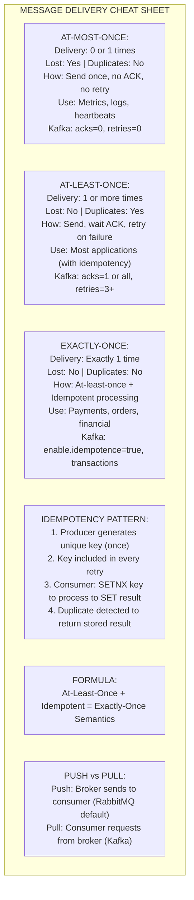
```mermaid
flowchart TD
  subgraph CheatSheet["MESSAGE DELIVERY CHEAT SHEET"]
    AMO["AT-MOST-ONCE:\nDelivery: 0 or 1 times\nLost: Yes | Duplicates: No\nHow: Send once, no ACK, no retry\nUse: Metrics, logs, heartbeats\nKafka: acks=0, retries=0"]
    ALO["AT-LEAST-ONCE:\nDelivery: 1 or more times\nLost: No | Duplicates: Yes\nHow: Send, wait ACK, retry on failure\nUse: Most applications (with idempotency)\nKafka: acks=1 or all, retries=3+"]
    EO["EXACTLY-ONCE:\nDelivery: Exactly 1 time\nLost: No | Duplicates: No\nHow: At-least-once + Idempotent processing\nUse: Payments, orders, financial\nKafka: enable.idempotence=true, transactions"]
    IP["IDEMPOTENCY PATTERN:\n1. Producer generates unique key (once)\n2. Key included in every retry\n3. Consumer: SETNX key to process to SET result\n4. Duplicate detected to return stored result"]
    Formula["FORMULA:\nAt-Least-Once + Idempotent = Exactly-Once Semantics"]
    PushPull["PUSH vs PULL:\nPush: Broker sends to consumer (RabbitMQ default)\nPull: Consumer requests from broker (Kafka)"]
  end
```

<details>
<summary>ASCII diagram (reference)</summary>

```text
┌─────────────────────────────────────────────────────────────┐
│           MESSAGE DELIVERY CHEAT SHEET                       │
├─────────────────────────────────────────────────────────────┤
│ AT-MOST-ONCE                                                 │
│   Delivery: 0 or 1 times                                    │
│   Lost: Yes | Duplicates: No                                │
│   How: Send once, no ACK, no retry                          │
│   Use: Metrics, logs, heartbeats                            │
│   Kafka: acks=0, retries=0                                  │
├─────────────────────────────────────────────────────────────┤
│ AT-LEAST-ONCE                                                │
│   Delivery: 1 or more times                                 │
│   Lost: No | Duplicates: Yes                                │
│   How: Send, wait ACK, retry on failure                     │
│   Use: Most applications (with idempotency)                 │
│   Kafka: acks=1 or all, retries=3+                          │
├─────────────────────────────────────────────────────────────┤
│ EXACTLY-ONCE                                                 │
│   Delivery: Exactly 1 time                                  │
│   Lost: No | Duplicates: No                                 │
│   How: At-least-once + Idempotent processing                │
│   Use: Payments, orders, financial                          │
│   Kafka: enable.idempotence=true, transactions              │
├─────────────────────────────────────────────────────────────┤
│ IDEMPOTENCY PATTERN                                          │
│   1. Producer generates unique key (once)                   │
│   2. Key included in every retry                            │
│   3. Consumer: SETNX key → process → SET result             │
│   4. Duplicate detected → return stored result              │
├─────────────────────────────────────────────────────────────┤
│ FORMULA                                                      │
│   At-Least-Once + Idempotent = Exactly-Once Semantics       │
├─────────────────────────────────────────────────────────────┤
│ PUSH vs PULL                                                 │
│   Push: Broker sends to consumer (RabbitMQ default)         │
│   Pull: Consumer requests from broker (Kafka)               │
└─────────────────────────────────────────────────────────────┘
```

</details>

