# 🔥 Kafka Deep Dive

---

## 0️⃣ Prerequisites

Before diving into Kafka, you should understand:

- **Queue vs Pub/Sub** (Topic 1): Kafka supports both patterns through consumer groups.
- **Message Delivery** (Topic 2): At-least-once, at-most-once, and exactly-once semantics.
- **Dead Letter Queue** (Topic 3): Handling failed messages.
- **Consumer Groups** (Topic 4): How multiple consumers share partitions.
- **Distributed Systems** (Phase 1, Topic 1): Concepts like replication, partitioning, and consensus.

**Quick refresher on why Kafka exists**: Traditional message queues (like RabbitMQ) delete messages after delivery. Kafka is different. It's a distributed commit log that retains messages, allowing replay, multiple consumers, and stream processing. Think of it as a "database for events."

---

## 1️⃣ What Problem Does This Exist to Solve?

### The Specific Pain Point

LinkedIn in 2010 faced a massive data pipeline problem:

```mermaid
flowchart TD
  subgraph Nightmare["LINKEDIN'S DATA PIPELINE NIGHTMARE"]
    Sources["Data Sources:\n- User activity (page views, clicks)\n- Search queries\n- Messaging\n- Connection requests\n- Job applications"]
    Destinations["Data Destinations:\n- Hadoop (batch analytics)\n- Real-time dashboards\n- Search index\n- Recommendation engine\n- Monitoring systems"]
    Problem["Problem: 5 sources × 5 destinations = 25 integrations!\nEach integration was custom, fragile, and slow."]
    
    Sources --> Problem
    Destinations --> Problem
  end
```



### What Systems Looked Like Before Kafka

**Point-to-Point Integrations:**


**Traditional Message Queues:**
```
Problems with RabbitMQ/ActiveMQ at LinkedIn's scale:
- Messages deleted after consumption (no replay)
- Single consumer per queue (or complex routing)
- Not designed for millions of messages/second
- Limited retention (memory-based)
- No built-in partitioning
```

### What Breaks Without Kafka

1. **No Unified Data Pipeline**: Each system has its own integration, duplicating effort.

2. **No Replay**: If a consumer misses messages or has a bug, data is lost forever.

3. **No Scalability**: Traditional queues can't handle millions of events per second.

4. **No Real-Time + Batch**: You either get real-time (queues) or batch (files), not both.

5. **No Decoupling**: Producers must know about all consumers.

### Real Examples of the Problem

**LinkedIn's Motivation**:
LinkedIn needed to process 1 trillion messages per day across their data pipeline. No existing system could handle this while providing replay, multiple consumers, and real-time processing.

**Uber's Challenge**:
Uber processes millions of trip events per second. They need real-time processing (pricing, matching) AND batch processing (analytics, ML training) from the same data.

**Netflix's Scale**:
Netflix processes 8 million events per second. They need this data for real-time recommendations, A/B testing, and batch analytics simultaneously.

---

## 2️⃣ Intuition and Mental Model

### The Commit Log Analogy

Think of Kafka as a **distributed append-only log** (like a database transaction log):


### The Newspaper Archive Analogy


│   - Ordering preserved within section                       │
│                                                              │
│   Consumer Groups = Reading clubs                           │
│   - Club members share sections (each reads different ones) │
│   - Different clubs read the same newspaper independently   │
│                                                              │
└─────────────────────────────────────────────────────────────┘
```

### Kafka's Core Architecture


---

## 3️⃣ How It Works Internally

### Topics and Partitions

**Topic**: A category or feed name to which messages are published. Think of it as a table in a database.

**Partition**: A topic is split into partitions for parallelism. Each partition is an ordered, immutable sequence of messages.


### How Partitioning Works

```java
// Default partitioner logic (simplified)
int partition = hash(key) % numPartitions;

// Examples:
// key = "user-123" → hash = 456 → partition = 456 % 3 = 0
// key = "user-456" → hash = 789 → partition = 789 % 3 = 0
// key = "user-789" → hash = 234 → partition = 234 % 3 = 0

// Same key ALWAYS goes to same partition
// This guarantees ordering for that key
```

### Offsets

**Offset**: A unique identifier for each message within a partition. It's a sequential number starting from 0.


### Producers

Producers send messages to topics. Key producer concepts:

**Acknowledgment Modes (acks):**


**Idempotent Producer:**

```
┌─────────────────────────────────────────────────────────────┐
│                IDEMPOTENT PRODUCER                           │
│                                                              │
│   Without idempotence:                                      │
│   Producer sends M1 ──► Broker receives, ACK lost           │
│   Producer retries M1 ──► Broker receives M1 AGAIN          │
│   Result: Duplicate M1 in topic                             │
│                                                              │
│   With idempotence (enable.idempotence=true):               │
│   Producer sends M1 (seq=1) ──► Broker receives             │
│   Producer retries M1 (seq=1) ──► Broker detects duplicate  │
│   Result: M1 stored exactly once                            │
│                                                              │
│   How it works:                                              │
│   - Producer gets unique ID (PID)                           │
│   - Each message has sequence number                        │
│   - Broker tracks (PID, partition, seq) to detect dupes     │
│                                                              │
└─────────────────────────────────────────────────────────────┘
```

### Consumers

Consumers read messages from topics. Key concepts covered in Topic 4 (Consumer Groups).

**Poll Loop:**

```java
while (true) {
    // Poll for new messages (also sends heartbeat)
    ConsumerRecords<String, String> records = consumer.poll(Duration.ofMillis(100));
    
    for (ConsumerRecord<String, String> record : records) {
        // Process each message
        process(record);
    }
    
    // Commit offsets
    consumer.commitSync();
}
```

### Replication

Kafka replicates partitions across brokers for fault tolerance.


**Leader Election:**

```
┌─────────────────────────────────────────────────────────────┐
│                    LEADER ELECTION                           │
│                                                              │
│   Normal state:                                              │
│   Broker 1 (Leader) ◄── Writes go here                      │
│   Broker 2 (Follower, ISR)                                  │
│   Broker 3 (Follower, ISR)                                  │
│                                                              │
│   Broker 1 fails:                                            │
│   1. Controller (another broker) detects failure            │
│   2. Controller selects new leader from ISR                 │
│   3. Broker 2 becomes new leader                            │
│   4. Producers/consumers redirect to Broker 2               │
│                                                              │
│   Broker 1 (dead)                                           │
│   Broker 2 (NEW Leader) ◄── Writes now go here              │
│   Broker 3 (Follower, ISR)                                  │
│                                                              │
└─────────────────────────────────────────────────────────────┘
```

### Storage: Segments and Indexes

Kafka stores messages in **segments** (files) with **indexes** for fast lookup.

```
┌─────────────────────────────────────────────────────────────┐
│                    STORAGE INTERNALS                         │
│                                                              │
│   Partition directory: /kafka-logs/orders-0/                │
│                                                              │
│   Segments:                                                  │
│   ┌────────────────────────────────────────────────────┐    │
│   │ 00000000000000000000.log  (offsets 0-999)          │    │
│   │ 00000000000000000000.index                          │    │
│   │ 00000000000000000000.timeindex                      │    │
│   ├────────────────────────────────────────────────────┤    │
│   │ 00000000000000001000.log  (offsets 1000-1999)       │    │
│   │ 00000000000000001000.index                          │    │
│   │ 00000000000000001000.timeindex                      │    │
│   ├────────────────────────────────────────────────────┤    │
│   │ 00000000000000002000.log  (active segment)         │    │
│   │ 00000000000000002000.index                          │    │
│   │ 00000000000000002000.timeindex                      │    │
│   └────────────────────────────────────────────────────┘    │
│                                                              │
│   .log: Actual messages                                     │
│   .index: Offset → file position mapping                    │
│   .timeindex: Timestamp → offset mapping                    │
│                                                              │
│   Segment file named by first offset in segment             │
│                                                              │
└─────────────────────────────────────────────────────────────┘
```

### Log Compaction

For topics that represent state (like user profiles), Kafka can compact logs to keep only the latest value per key.

```
┌─────────────────────────────────────────────────────────────┐
│                    LOG COMPACTION                            │
│                                                              │
│   Before compaction:                                         │
│   ┌─────┬─────┬─────┬─────┬─────┬─────┬─────┐              │
│   │K1:A │K2:B │K1:C │K3:D │K2:E │K1:F │K3:G │              │
│   └─────┴─────┴─────┴─────┴─────┴─────┴─────┘              │
│                                                              │
│   After compaction:                                          │
│   ┌─────┬─────┬─────┐                                       │
│   │K1:F │K2:E │K3:G │  (only latest value per key)         │
│   └─────┴─────┴─────┘                                       │
│                                                              │
│   Use cases:                                                 │
│   - User profiles (latest state)                            │
│   - Database changelog (CDC)                                │
│   - Configuration updates                                   │
│                                                              │
│   Configuration:                                             │
│   cleanup.policy=compact                                    │
│                                                              │
└─────────────────────────────────────────────────────────────┘
```

---

## 4️⃣ Simulation-First Explanation

Let's trace through Kafka's behavior with a concrete example.

### Scenario: Order Processing Pipeline

**Setup:**
- Topic: `orders` with 3 partitions, replication factor 2
- 3 brokers
- Producer sending orders
- Consumer group `order-processor` with 2 consumers

### Step 1: Topic Creation

```
Command: kafka-topics.sh --create --topic orders --partitions 3 --replication-factor 2

Result:
┌─────────────────────────────────────────────────────────────┐
│   Broker 1          Broker 2          Broker 3              │
│   ┌──────────┐      ┌──────────┐      ┌──────────┐         │
│   │ P0 (L)   │      │ P0 (F)   │      │ P1 (L)   │         │
│   │ P2 (F)   │      │ P1 (F)   │      │ P2 (L)   │         │
│   └──────────┘      └──────────┘      └──────────┘         │
│                                                              │
│   L = Leader, F = Follower                                  │
│   Each partition has 1 leader + 1 follower                  │
└─────────────────────────────────────────────────────────────┘
```

### Step 2: Producer Sends Messages

```
Producer sends:
  Order O1 (key: "user-123") → hash("user-123") % 3 = 0 → Partition 0
  Order O2 (key: "user-456") → hash("user-456") % 3 = 1 → Partition 1
  Order O3 (key: "user-123") → hash("user-123") % 3 = 0 → Partition 0

Partition 0: [O1, O3]  (same user, same partition, ordered)
Partition 1: [O2]
Partition 2: []

With acks=all:
1. Producer sends O1 to Broker 1 (P0 leader)
2. Broker 1 writes to local log
3. Broker 2 (P0 follower) replicates O1
4. Broker 1 sends ACK to producer
5. Producer proceeds to next message
```

### Step 3: Consumer Group Processing

```
Consumer Group: order-processor
Consumer A: Assigned P0, P1
Consumer B: Assigned P2

Processing:
Time 0ms:   Consumer A polls → gets O1 from P0
Time 10ms:  Consumer A processes O1
Time 20ms:  Consumer A commits offset P0=1
Time 30ms:  Consumer A polls → gets O2 from P1, O3 from P0
Time 40ms:  Consumer A processes O2, O3
Time 50ms:  Consumer A commits offsets P0=2, P1=1

Consumer B: Polls P2, gets nothing (empty)

Offset state:
  (order-processor, orders, 0) = 2
  (order-processor, orders, 1) = 1
  (order-processor, orders, 2) = 0
```

### Step 4: Consumer Failure and Rebalance

```
Time 60ms: Consumer A crashes!

Time 70ms: Broker detects missing heartbeat

Time 10060ms: session.timeout.ms expires, rebalance triggered

Rebalance:
  Consumer B: Assigned P0, P1, P2 (takes over everything)

Consumer B reads committed offsets:
  P0 = 2 (start from offset 2)
  P1 = 1 (start from offset 1)
  P2 = 0 (start from offset 0)

Consumer B continues processing from where Consumer A left off.
No messages lost!
```

### Step 5: Broker Failure

```
Time 20000ms: Broker 1 crashes!

Impact:
  P0: Leader was on Broker 1 → Broker 2 (follower) becomes leader
  P2: Follower was on Broker 1 → Only Broker 3 (leader) remains

New state:
┌─────────────────────────────────────────────────────────────┐
│   Broker 1 (dead)   Broker 2          Broker 3              │
│                     ┌──────────┐      ┌──────────┐         │
│                     │ P0 (L)   │      │ P1 (L)   │         │
│                     │ P1 (F)   │      │ P2 (L)   │         │
│                     └──────────┘      └──────────┘         │
│                                                              │
│   P0: New leader is Broker 2                                │
│   P2: Under-replicated (only 1 copy)                        │
└─────────────────────────────────────────────────────────────┘

Producers automatically redirect to new leaders.
Consumers automatically redirect to new leaders.
Processing continues with minimal interruption.
```

---

## 5️⃣ How Engineers Actually Use This in Production

### LinkedIn's Usage

LinkedIn (Kafka's creator) processes:
- 7 trillion messages per day
- 1.5 PB of data per day
- 100+ Kafka clusters

Use cases:
- Activity tracking (page views, clicks)
- Metrics pipeline
- Data integration between systems
- Real-time analytics

### Uber's Architecture

Uber's Kafka deployment:
- 20+ clusters
- Trillions of messages per day
- Used for: trip events, driver location, pricing, ETA

Key patterns:
- Separate clusters for different use cases
- Multi-region replication
- Custom consumer frameworks

### Netflix's Scale

Netflix processes:
- 8 million events per second
- 1 trillion events per day
- 700+ billion messages per day

Use cases:
- Real-time recommendations
- A/B testing
- Monitoring and alerting
- Data pipeline to Spark/Flink

### Airbnb's Implementation

Airbnb uses Kafka for:
- Search ranking events
- Booking events
- Messaging between services
- Data warehouse ingestion

Key practices:
- Schema registry for all topics
- Exactly-once semantics for financial data
- Dead letter topics for failed processing

---

## 6️⃣ How to Implement or Apply It

### Maven Dependencies

```xml
<dependencies>
    <!-- Spring Kafka -->
    <dependency>
        <groupId>org.springframework.kafka</groupId>
        <artifactId>spring-kafka</artifactId>
    </dependency>
    
    <!-- Kafka Clients -->
    <dependency>
        <groupId>org.apache.kafka</groupId>
        <artifactId>kafka-clients</artifactId>
    </dependency>
    
    <!-- JSON Serialization -->
    <dependency>
        <groupId>com.fasterxml.jackson.core</groupId>
        <artifactId>jackson-databind</artifactId>
    </dependency>
</dependencies>
```

### Producer Configuration

```java
package com.systemdesign.kafka;

import org.apache.kafka.clients.producer.ProducerConfig;
import org.apache.kafka.common.serialization.StringSerializer;
import org.springframework.context.annotation.Bean;
import org.springframework.context.annotation.Configuration;
import org.springframework.kafka.core.DefaultKafkaProducerFactory;
import org.springframework.kafka.core.KafkaTemplate;
import org.springframework.kafka.core.ProducerFactory;
import org.springframework.kafka.support.serializer.JsonSerializer;

import java.util.HashMap;
import java.util.Map;

@Configuration
public class KafkaProducerConfig {
    
    @Bean
    public ProducerFactory<String, Order> producerFactory() {
        Map<String, Object> props = new HashMap<>();
        
        // Bootstrap servers
        props.put(ProducerConfig.BOOTSTRAP_SERVERS_CONFIG, "localhost:9092");
        
        // Serializers
        props.put(ProducerConfig.KEY_SERIALIZER_CLASS_CONFIG, StringSerializer.class);
        props.put(ProducerConfig.VALUE_SERIALIZER_CLASS_CONFIG, JsonSerializer.class);
        
        // Acknowledgment: all replicas must acknowledge
        props.put(ProducerConfig.ACKS_CONFIG, "all");
        
        // Retries
        props.put(ProducerConfig.RETRIES_CONFIG, 3);
        props.put(ProducerConfig.RETRY_BACKOFF_MS_CONFIG, 1000);
        
        // Idempotence: prevent duplicates on retry
        props.put(ProducerConfig.ENABLE_IDEMPOTENCE_CONFIG, true);
        
        // Batching for throughput
        props.put(ProducerConfig.BATCH_SIZE_CONFIG, 16384);  // 16KB
        props.put(ProducerConfig.LINGER_MS_CONFIG, 5);  // Wait 5ms for batch
        
        // Compression
        props.put(ProducerConfig.COMPRESSION_TYPE_CONFIG, "snappy");
        
        // Buffer memory
        props.put(ProducerConfig.BUFFER_MEMORY_CONFIG, 33554432);  // 32MB
        
        return new DefaultKafkaProducerFactory<>(props);
    }
    
    @Bean
    public KafkaTemplate<String, Order> kafkaTemplate() {
        return new KafkaTemplate<>(producerFactory());
    }
}
```

### Producer Service

```java
package com.systemdesign.kafka;

import org.apache.kafka.clients.producer.ProducerRecord;
import org.apache.kafka.clients.producer.RecordMetadata;
import org.springframework.kafka.core.KafkaTemplate;
import org.springframework.kafka.support.SendResult;
import org.springframework.stereotype.Service;

import java.util.concurrent.CompletableFuture;

@Service
public class OrderProducer {
    
    private static final String TOPIC = "orders";
    private final KafkaTemplate<String, Order> kafkaTemplate;
    
    public OrderProducer(KafkaTemplate<String, Order> kafkaTemplate) {
        this.kafkaTemplate = kafkaTemplate;
    }
    
    /**
     * Sends order to Kafka with the order ID as the key.
     * Same customer's orders go to same partition (ordering preserved).
     */
    public CompletableFuture<SendResult<String, Order>> sendOrder(Order order) {
        // Key determines partition: same key = same partition = ordered
        String key = order.getCustomerId();
        
        CompletableFuture<SendResult<String, Order>> future = 
            kafkaTemplate.send(TOPIC, key, order);
        
        future.whenComplete((result, ex) -> {
            if (ex == null) {
                RecordMetadata metadata = result.getRecordMetadata();
                System.out.printf("Sent order %s to partition %d, offset %d%n",
                    order.getId(),
                    metadata.partition(),
                    metadata.offset());
            } else {
                System.err.println("Failed to send order: " + ex.getMessage());
            }
        });
        
        return future;
    }
    
    /**
     * Sends order synchronously, waiting for acknowledgment.
     * Use when you need to know the result immediately.
     */
    public void sendOrderSync(Order order) throws Exception {
        String key = order.getCustomerId();
        SendResult<String, Order> result = kafkaTemplate.send(TOPIC, key, order).get();
        
        System.out.printf("Sent order %s to partition %d, offset %d%n",
            order.getId(),
            result.getRecordMetadata().partition(),
            result.getRecordMetadata().offset());
    }
    
    /**
     * Sends order with custom partition.
     * Use when you need explicit control over partitioning.
     */
    public void sendOrderToPartition(Order order, int partition) {
        ProducerRecord<String, Order> record = new ProducerRecord<>(
            TOPIC,
            partition,
            order.getCustomerId(),
            order
        );
        
        kafkaTemplate.send(record);
    }
}
```

### Consumer Configuration

```java
package com.systemdesign.kafka;

import org.apache.kafka.clients.consumer.ConsumerConfig;
import org.apache.kafka.common.serialization.StringDeserializer;
import org.springframework.context.annotation.Bean;
import org.springframework.context.annotation.Configuration;
import org.springframework.kafka.annotation.EnableKafka;
import org.springframework.kafka.config.ConcurrentKafkaListenerContainerFactory;
import org.springframework.kafka.core.ConsumerFactory;
import org.springframework.kafka.core.DefaultKafkaConsumerFactory;
import org.springframework.kafka.listener.ContainerProperties;
import org.springframework.kafka.support.serializer.JsonDeserializer;

import java.util.HashMap;
import java.util.Map;

@Configuration
@EnableKafka
public class KafkaConsumerConfig {
    
    @Bean
    public ConsumerFactory<String, Order> consumerFactory() {
        Map<String, Object> props = new HashMap<>();
        
        // Bootstrap servers
        props.put(ConsumerConfig.BOOTSTRAP_SERVERS_CONFIG, "localhost:9092");
        
        // Consumer group
        props.put(ConsumerConfig.GROUP_ID_CONFIG, "order-processor");
        
        // Deserializers
        props.put(ConsumerConfig.KEY_DESERIALIZER_CLASS_CONFIG, StringDeserializer.class);
        props.put(ConsumerConfig.VALUE_DESERIALIZER_CLASS_CONFIG, JsonDeserializer.class);
        
        // Auto offset reset
        props.put(ConsumerConfig.AUTO_OFFSET_RESET_CONFIG, "earliest");
        
        // Disable auto commit for manual control
        props.put(ConsumerConfig.ENABLE_AUTO_COMMIT_CONFIG, false);
        
        // Session management
        props.put(ConsumerConfig.SESSION_TIMEOUT_MS_CONFIG, 10000);
        props.put(ConsumerConfig.HEARTBEAT_INTERVAL_MS_CONFIG, 3000);
        props.put(ConsumerConfig.MAX_POLL_INTERVAL_MS_CONFIG, 300000);
        
        // Fetch settings
        props.put(ConsumerConfig.MAX_POLL_RECORDS_CONFIG, 500);
        props.put(ConsumerConfig.FETCH_MIN_BYTES_CONFIG, 1);
        props.put(ConsumerConfig.FETCH_MAX_WAIT_MS_CONFIG, 500);
        
        // Partition assignment
        props.put(ConsumerConfig.PARTITION_ASSIGNMENT_STRATEGY_CONFIG,
            "org.apache.kafka.clients.consumer.CooperativeStickyAssignor");
        
        // Trusted packages for JSON deserialization
        props.put(JsonDeserializer.TRUSTED_PACKAGES, "com.systemdesign.kafka");
        
        return new DefaultKafkaConsumerFactory<>(props);
    }
    
    @Bean
    public ConcurrentKafkaListenerContainerFactory<String, Order> kafkaListenerContainerFactory() {
        ConcurrentKafkaListenerContainerFactory<String, Order> factory =
            new ConcurrentKafkaListenerContainerFactory<>();
        factory.setConsumerFactory(consumerFactory());
        
        // Number of consumer threads
        factory.setConcurrency(3);
        
        // Manual acknowledgment
        factory.getContainerProperties().setAckMode(ContainerProperties.AckMode.MANUAL_IMMEDIATE);
        
        return factory;
    }
}
```

### Consumer Service

```java
package com.systemdesign.kafka;

import org.apache.kafka.clients.consumer.ConsumerRecord;
import org.springframework.kafka.annotation.KafkaListener;
import org.springframework.kafka.support.Acknowledgment;
import org.springframework.stereotype.Service;

@Service
public class OrderConsumer {
    
    private final OrderService orderService;
    
    public OrderConsumer(OrderService orderService) {
        this.orderService = orderService;
    }
    
    /**
     * Processes orders from Kafka.
     * Manual acknowledgment for exactly-once processing.
     */
    @KafkaListener(
        topics = "orders",
        groupId = "order-processor",
        containerFactory = "kafkaListenerContainerFactory"
    )
    public void processOrder(ConsumerRecord<String, Order> record, Acknowledgment ack) {
        Order order = record.value();
        
        System.out.printf("Received order %s from partition %d, offset %d%n",
            order.getId(),
            record.partition(),
            record.offset());
        
        try {
            // Process the order
            orderService.processOrder(order);
            
            // Acknowledge successful processing
            ack.acknowledge();
            
            System.out.println("Order processed: " + order.getId());
            
        } catch (Exception e) {
            System.err.println("Failed to process order: " + e.getMessage());
            // Don't acknowledge - will be redelivered
            // Or send to DLT (Dead Letter Topic)
            throw e;
        }
    }
    
    /**
     * Batch processing for higher throughput.
     */
    @KafkaListener(
        topics = "orders-batch",
        groupId = "order-batch-processor",
        containerFactory = "batchListenerContainerFactory"
    )
    public void processOrderBatch(List<ConsumerRecord<String, Order>> records, Acknowledgment ack) {
        System.out.println("Received batch of " + records.size() + " orders");
        
        List<Order> orders = records.stream()
            .map(ConsumerRecord::value)
            .collect(Collectors.toList());
        
        try {
            orderService.processOrderBatch(orders);
            ack.acknowledge();
        } catch (Exception e) {
            // Handle batch failure
            throw e;
        }
    }
}
```

### Transactional Producer (Exactly-Once)

```java
package com.systemdesign.kafka;

import org.springframework.kafka.core.KafkaTemplate;
import org.springframework.stereotype.Service;
import org.springframework.transaction.annotation.Transactional;

@Service
public class TransactionalOrderProducer {
    
    private final KafkaTemplate<String, Order> kafkaTemplate;
    
    public TransactionalOrderProducer(KafkaTemplate<String, Order> kafkaTemplate) {
        this.kafkaTemplate = kafkaTemplate;
    }
    
    /**
     * Sends multiple messages in a transaction.
     * Either all messages are sent, or none.
     */
    @Transactional
    public void sendOrderWithEvents(Order order) {
        // All of these are part of one transaction
        kafkaTemplate.send("orders", order.getCustomerId(), order);
        kafkaTemplate.send("order-events", order.getId(), new OrderEvent("CREATED", order));
        kafkaTemplate.send("inventory-updates", order.getProductId(), 
            new InventoryUpdate(order.getProductId(), -order.getQuantity()));
        
        // If any send fails, all are rolled back
    }
    
    /**
     * Manual transaction control.
     */
    public void sendWithManualTransaction(Order order) {
        kafkaTemplate.executeInTransaction(ops -> {
            ops.send("orders", order.getCustomerId(), order);
            ops.send("order-events", order.getId(), new OrderEvent("CREATED", order));
            return true;
        });
    }
}
```

### Application Configuration

```yaml
# application.yml
spring:
  kafka:
    bootstrap-servers: localhost:9092
    
    producer:
      key-serializer: org.apache.kafka.common.serialization.StringSerializer
      value-serializer: org.springframework.kafka.support.serializer.JsonSerializer
      acks: all
      retries: 3
      properties:
        enable.idempotence: true
        max.in.flight.requests.per.connection: 5
        compression.type: snappy
        batch.size: 16384
        linger.ms: 5
      # For transactions
      transaction-id-prefix: tx-
    
    consumer:
      group-id: order-processor
      auto-offset-reset: earliest
      enable-auto-commit: false
      key-deserializer: org.apache.kafka.common.serialization.StringDeserializer
      value-deserializer: org.springframework.kafka.support.serializer.JsonDeserializer
      properties:
        spring.json.trusted.packages: "com.systemdesign.kafka"
        session.timeout.ms: 10000
        heartbeat.interval.ms: 3000
        max.poll.interval.ms: 300000
        max.poll.records: 500
        partition.assignment.strategy: org.apache.kafka.clients.consumer.CooperativeStickyAssignor
        # For exactly-once
        isolation.level: read_committed
    
    listener:
      concurrency: 3
      ack-mode: manual_immediate
```

### Docker Compose for Kafka

```yaml
# docker-compose.yml
version: '3.8'
services:
  zookeeper:
    image: confluentinc/cp-zookeeper:7.4.0
    environment:
      ZOOKEEPER_CLIENT_PORT: 2181
      ZOOKEEPER_TICK_TIME: 2000
    ports:
      - "2181:2181"
  
  kafka:
    image: confluentinc/cp-kafka:7.4.0
    depends_on:
      - zookeeper
    ports:
      - "9092:9092"
    environment:
      KAFKA_BROKER_ID: 1
      KAFKA_ZOOKEEPER_CONNECT: zookeeper:2181
      KAFKA_ADVERTISED_LISTENERS: PLAINTEXT://localhost:9092
      KAFKA_OFFSETS_TOPIC_REPLICATION_FACTOR: 1
      KAFKA_TRANSACTION_STATE_LOG_MIN_ISR: 1
      KAFKA_TRANSACTION_STATE_LOG_REPLICATION_FACTOR: 1
      KAFKA_AUTO_CREATE_TOPICS_ENABLE: "true"
  
  kafka-ui:
    image: provectuslabs/kafka-ui:latest
    depends_on:
      - kafka
    ports:
      - "8080:8080"
    environment:
      KAFKA_CLUSTERS_0_NAME: local
      KAFKA_CLUSTERS_0_BOOTSTRAPSERVERS: kafka:9092
```

### Kafka CLI Commands

```bash
# Create topic
kafka-topics.sh --create \
  --bootstrap-server localhost:9092 \
  --topic orders \
  --partitions 3 \
  --replication-factor 1

# List topics
kafka-topics.sh --list --bootstrap-server localhost:9092

# Describe topic
kafka-topics.sh --describe --bootstrap-server localhost:9092 --topic orders

# Produce messages
kafka-console-producer.sh --bootstrap-server localhost:9092 --topic orders

# Consume messages
kafka-console-consumer.sh --bootstrap-server localhost:9092 \
  --topic orders \
  --from-beginning \
  --group test-consumer

# Check consumer group
kafka-consumer-groups.sh --bootstrap-server localhost:9092 \
  --describe --group order-processor

# Reset offsets
kafka-consumer-groups.sh --bootstrap-server localhost:9092 \
  --group order-processor \
  --topic orders \
  --reset-offsets \
  --to-earliest \
  --execute
```

---

## 7️⃣ Tradeoffs, Pitfalls, and Common Mistakes

### Common Mistakes

#### 1. Not Using Keys for Ordering

**Wrong:**
```java
// No key - messages distributed round-robin
kafkaTemplate.send("orders", order);
// Orders for same customer might go to different partitions
// No ordering guarantee!
```

**Right:**
```java
// Key = customerId - same customer always goes to same partition
kafkaTemplate.send("orders", order.getCustomerId(), order);
// All orders for customer-123 go to same partition
// Ordering preserved for each customer
```

#### 2. Too Many or Too Few Partitions

**Too few:**
```
Topic with 2 partitions, 10 consumers
- 8 consumers sit idle
- Limited parallelism
- Can't scale
```

**Too many:**
```
Topic with 1000 partitions
- 1000 files per broker
- Longer leader election
- More memory overhead
- Rebalancing takes forever
```

**Rule of thumb:** Start with `max(expected_consumers * 2, expected_throughput_mb / 10)`

#### 3. Committing Offsets Incorrectly

**Wrong (commit before process):**
```java
@KafkaListener(topics = "orders")
public void process(Order order, Acknowledgment ack) {
    ack.acknowledge();  // Commit first!
    processOrder(order);  // What if this fails?
}
// Message lost if processing fails!
```

**Wrong (auto-commit with long processing):**
```yaml
enable-auto-commit: true
auto-commit-interval: 5000  # 5 seconds
```
```java
// Processing takes 10 seconds
// Auto-commit happens at 5 seconds
// If crash at 7 seconds, message lost!
```

**Right:**
```java
@KafkaListener(topics = "orders")
public void process(Order order, Acknowledgment ack) {
    processOrder(order);  // Process first
    ack.acknowledge();    // Then commit
}
```

#### 4. Ignoring Backpressure

**Problem:**
```
Producer: 100,000 msg/sec
Consumer: 10,000 msg/sec
Lag grows by 90,000 msg/sec!
```

**Solutions:**
- Add more consumers (up to partition count)
- Increase partition count
- Batch processing
- Rate limit producer

### Performance Tuning

**Producer tuning:**
```yaml
# Batching
batch.size: 16384      # 16KB batch
linger.ms: 5           # Wait 5ms for batch

# Compression
compression.type: snappy  # Good balance of speed/ratio

# Throughput vs latency
# High throughput: larger batch, longer linger
# Low latency: smaller batch, shorter linger
```

**Consumer tuning:**
```yaml
# Fetch settings
fetch.min.bytes: 1          # Min data to fetch
fetch.max.wait.ms: 500      # Max wait time
max.poll.records: 500       # Records per poll

# Processing
# Batch processing is faster than one-by-one
# Async processing can improve throughput
```

---

## 8️⃣ When NOT to Use This

### When Kafka is Overkill

1. **Low volume**: < 1000 messages/day. Use RabbitMQ or even a database queue.

2. **Simple request-response**: Use HTTP or gRPC instead.

3. **Small team, simple needs**: Kafka has operational complexity.

4. **Need message routing**: RabbitMQ's exchanges are more flexible.

5. **Need priority queues**: Kafka doesn't support message priority.

### When Kafka is the Wrong Tool

1. **Database replacement**: Kafka is not a database (despite log compaction).

2. **Long-term storage**: Use S3, HDFS for archival.

3. **Complex event processing**: Consider Flink, Spark Streaming.

4. **Message transformation**: Consider Kafka Connect or dedicated ETL.

### Anti-Patterns

1. **One partition per entity**: Creates millions of partitions.

2. **Using Kafka as a database**: Query capabilities are limited.

3. **Ignoring retention**: Data grows forever without cleanup policy.

4. **No monitoring**: Consumer lag can grow silently.

---

## 9️⃣ Comparison with Alternatives

### Kafka vs RabbitMQ

| Aspect | Kafka | RabbitMQ |
|--------|-------|----------|
| **Model** | Log-based | Queue-based |
| **Retention** | Configurable (time/size) | Until consumed |
| **Replay** | Yes | No |
| **Ordering** | Per-partition | Per-queue |
| **Throughput** | Very high (1M+/sec) | High (100K/sec) |
| **Latency** | Low | Very low |
| **Routing** | Partition key only | Complex routing |
| **Use case** | Event streaming | Task queues |

### Kafka vs Amazon SQS

| Aspect | Kafka | SQS |
|--------|-------|-----|
| **Managed** | Self-hosted or Confluent | Fully managed |
| **Ordering** | Per-partition | FIFO queues only |
| **Replay** | Yes | No |
| **Throughput** | Very high | Limited (3K/sec standard) |
| **Cost** | Infrastructure cost | Per-message cost |
| **Complexity** | High | Low |

### Kafka vs Apache Pulsar

| Aspect | Kafka | Pulsar |
|--------|-------|--------|
| **Architecture** | Broker stores data | Separate storage (BookKeeper) |
| **Multi-tenancy** | Limited | Native |
| **Geo-replication** | MirrorMaker | Built-in |
| **Tiered storage** | Add-on | Native |
| **Maturity** | Very mature | Growing |
| **Community** | Largest | Growing |

---

## 🔟 Interview Follow-Up Questions WITH Answers

### L4 (Entry-Level) Questions

**Q1: What is Kafka and why would you use it?**

**Answer:**
Kafka is a distributed streaming platform that works like a commit log. Unlike traditional message queues that delete messages after consumption, Kafka retains messages for a configurable period.

Key reasons to use Kafka:
1. **High throughput**: Can handle millions of messages per second
2. **Durability**: Messages are persisted to disk and replicated
3. **Replay**: Consumers can re-read messages
4. **Multiple consumers**: Different consumer groups can read the same data independently
5. **Ordering**: Messages within a partition are strictly ordered

Use Kafka when you need to process large volumes of events, need message replay, or have multiple systems consuming the same data stream.

**Q2: What's the difference between a topic and a partition?**

**Answer:**
A **topic** is a category or feed name. It's like a table in a database. For example, "orders" or "user-events".

A **partition** is a subset of a topic. Each topic is split into one or more partitions for parallelism. Each partition is:
- An ordered, immutable sequence of messages
- Stored on a single broker (with replicas on other brokers)
- Assigned to one consumer in a consumer group

Key points:
- Ordering is guaranteed within a partition, not across partitions
- Partitions enable parallel processing
- The partition is determined by the message key (hash) or round-robin

### L5 (Senior) Questions

**Q3: How does Kafka achieve exactly-once semantics?**

**Answer:**
Kafka achieves exactly-once through several mechanisms:

1. **Idempotent Producer** (`enable.idempotence=true`):
   - Producer gets a unique ID (PID)
   - Each message has a sequence number
   - Broker detects and deduplicates retries
   - Guarantees exactly-once within a single producer session

2. **Transactions**:
   - Producer wraps multiple sends in a transaction
   - Either all messages are visible or none
   - Consumer with `isolation.level=read_committed` only sees committed transactions

3. **Consumer idempotency**:
   - Store processed offsets with business data atomically
   - Or use idempotency keys in application

For end-to-end exactly-once:
```
Producer (idempotent) → Kafka (transactions) → Consumer (idempotent processing)
```

**Q4: How would you handle a scenario where consumer lag is growing?**

**Answer:**
Growing consumer lag means consumers can't keep up with producers. Steps to address:

1. **Diagnose**:
   - Check consumer processing time
   - Check for errors causing retries
   - Check for hot partitions

2. **Scale consumers**:
   - Add more consumers (up to partition count)
   - If at partition limit, increase partitions

3. **Optimize processing**:
   - Batch processing instead of one-by-one
   - Async I/O for database calls
   - Reduce processing complexity

4. **Tune settings**:
   - Increase `max.poll.records` for batching
   - Adjust `fetch.min.bytes` and `fetch.max.wait.ms`

5. **Address hot partitions**:
   - Better partitioning key
   - Salting for hot keys

6. **Rate limit producers** (if appropriate)

### L6 (Staff) Questions

**Q5: Design a multi-region Kafka deployment for a global application.**

**Answer:**
Multi-region Kafka is complex. Key considerations:

**Architecture options:**

1. **Active-Passive with MirrorMaker**:
   - Primary region handles all writes
   - MirrorMaker replicates to secondary region
   - Failover on primary failure
   - Pros: Simple, consistent
   - Cons: Latency for remote producers, failover complexity

2. **Active-Active with MirrorMaker 2**:
   - Each region has its own cluster
   - Bidirectional replication
   - Producers write to local cluster
   - Consumers read from local cluster
   - Pros: Low latency, high availability
   - Cons: Conflict resolution, eventual consistency

3. **Confluent Cluster Linking**:
   - Real-time replication with byte-for-byte copying
   - Preserves offsets across clusters
   - Easier consumer migration

**Key decisions:**
- Topic naming convention (include region prefix)
- Offset management (different offsets per region)
- Consumer group coordination
- Conflict resolution for active-active

**Q6: How would you migrate from RabbitMQ to Kafka?**

**Answer:**
Migration strategy:

1. **Dual-write phase**:
   - Modify producers to write to both RabbitMQ and Kafka
   - Consumers continue reading from RabbitMQ
   - Verify Kafka data matches

2. **Shadow read phase**:
   - Add Kafka consumers that process but don't act
   - Compare results with RabbitMQ consumers
   - Fix any discrepancies

3. **Gradual cutover**:
   - Route percentage of consumers to Kafka
   - Monitor for issues
   - Increase percentage gradually

4. **Complete migration**:
   - All consumers on Kafka
   - Remove RabbitMQ writes
   - Decommission RabbitMQ

**Key considerations:**
- Message format differences
- Ordering guarantees (RabbitMQ per-queue, Kafka per-partition)
- Acknowledgment semantics
- Consumer group behavior

---

## 1️⃣1️⃣ One Clean Mental Summary

Kafka is a distributed commit log that retains messages, unlike traditional queues that delete after consumption. Messages are organized into **topics** (categories) split into **partitions** (for parallelism). Each partition is an ordered, append-only log where messages are identified by **offsets**. Producers write to partitions (determined by message key hash), and consumers in **consumer groups** share partitions for parallel processing. Kafka provides durability through **replication** (each partition has a leader and followers). Key differentiators: message retention enables replay, multiple consumer groups can read the same data independently, and partitions enable horizontal scaling. Use Kafka for high-throughput event streaming, data pipelines, and scenarios requiring replay or multiple consumers.

---

## Quick Reference Card

```
┌─────────────────────────────────────────────────────────────┐
│                 KAFKA DEEP DIVE CHEAT SHEET                  │
├─────────────────────────────────────────────────────────────┤
│ CORE CONCEPTS                                                │
│   Topic: Category/feed of messages                          │
│   Partition: Ordered subset of topic (parallelism unit)     │
│   Offset: Message position in partition                     │
│   Broker: Kafka server                                      │
│   Consumer Group: Consumers sharing partitions              │
├─────────────────────────────────────────────────────────────┤
│ PRODUCER SETTINGS                                            │
│   acks=0: Fire and forget (fastest, can lose)               │
│   acks=1: Leader ACK (balanced)                             │
│   acks=all: All ISR ACK (safest, slowest)                   │
│   enable.idempotence=true: Prevent duplicates               │
├─────────────────────────────────────────────────────────────┤
│ CONSUMER SETTINGS                                            │
│   group.id: Consumer group identifier                       │
│   auto.offset.reset: earliest/latest                        │
│   enable.auto.commit: true/false                            │
│   isolation.level: read_committed (for transactions)        │
├─────────────────────────────────────────────────────────────┤
│ REPLICATION                                                  │
│   Leader: Handles all reads/writes                          │
│   Follower: Replicates from leader                          │
│   ISR: In-Sync Replicas (caught up followers)               │
│   min.insync.replicas: Min ISR for acks=all                 │
├─────────────────────────────────────────────────────────────┤
│ EXACTLY-ONCE                                                 │
│   Producer: enable.idempotence=true                         │
│   Transactions: beginTransaction/commitTransaction          │
│   Consumer: isolation.level=read_committed                  │
├─────────────────────────────────────────────────────────────┤
│ STORAGE                                                      │
│   Segments: Log files split by size/time                    │
│   Index: Offset → file position mapping                     │
│   Log compaction: Keep only latest value per key            │
├─────────────────────────────────────────────────────────────┤
│ PERFORMANCE TUNING                                           │
│   batch.size: Bytes per batch (default 16KB)                │
│   linger.ms: Wait time for batching                         │
│   compression.type: snappy/gzip/lz4/zstd                    │
│   max.poll.records: Records per consumer poll               │
├─────────────────────────────────────────────────────────────┤
│ COMMON MISTAKES                                              │
│   ✗ No message key (loses ordering)                         │
│   ✗ Too many/few partitions                                 │
│   ✗ Commit before process                                   │
│   ✗ Ignoring consumer lag                                   │
└─────────────────────────────────────────────────────────────┘
```

