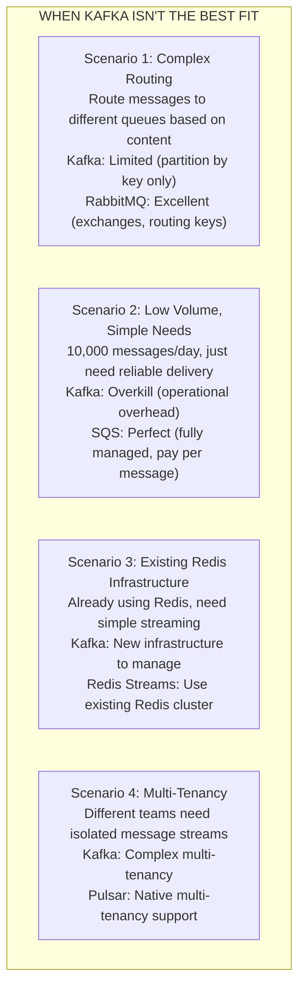
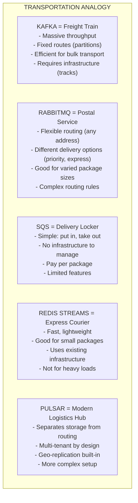

# 🔄 Other Messaging Systems

---

## 0️⃣ Prerequisites

Before diving into other messaging systems, you should understand:

- **Queue vs Pub/Sub** (Topic 1): The two fundamental messaging patterns.
- **Message Delivery** (Topic 2): At-least-once, at-most-once, exactly-once semantics.
- **Consumer Groups** (Topic 4): How multiple consumers share work.
- **Kafka Deep Dive** (Topic 5): Kafka's architecture as a reference point for comparison.

**Quick refresher on why multiple systems exist**: Different messaging systems were designed with different priorities. Kafka optimizes for throughput and replay. RabbitMQ optimizes for routing flexibility. SQS optimizes for simplicity and managed operations. Understanding when to use each is crucial for system design.

---

## 1️⃣ What Problem Does This Exist to Solve?

### The Specific Pain Point

Kafka is excellent, but it's not always the right choice:



<details>
<summary>ASCII diagram (reference)</summary>

```text
┌─────────────────────────────────────────────────────────────┐
│              WHEN KAFKA ISN'T THE BEST FIT                   │
│                                                              │
│   Scenario 1: Complex Routing                               │
│   "Route messages to different queues based on content"     │
│   Kafka: Limited (partition by key only)                    │
│   RabbitMQ: Excellent (exchanges, routing keys)             │
│                                                              │
│   Scenario 2: Low Volume, Simple Needs                      │
│   "10,000 messages/day, just need reliable delivery"        │
│   Kafka: Overkill (operational overhead)                    │
│   SQS: Perfect (fully managed, pay per message)             │
│                                                              │
│   Scenario 3: Existing Redis Infrastructure                 │
│   "Already using Redis, need simple streaming"              │
│   Kafka: New infrastructure to manage                       │
│   Redis Streams: Use existing Redis cluster                 │
│                                                              │
│   Scenario 4: Multi-Tenancy                                 │
│   "Different teams need isolated message streams"           │
│   Kafka: Complex multi-tenancy                              │
│   Pulsar: Native multi-tenancy support                      │
│                                                              │
└─────────────────────────────────────────────────────────────┘
```

</details>

### Why Multiple Systems Exist

Each messaging system was designed for specific use cases:

| System | Origin | Primary Design Goal |
|--------|--------|---------------------|
| **RabbitMQ** | 2007, Rabbit Technologies | Flexible message routing, AMQP compliance |
| **Kafka** | 2011, LinkedIn | High-throughput event streaming, log-based |
| **Redis Pub/Sub** | 2010, Redis | Simple real-time messaging |
| **Redis Streams** | 2018, Redis | Kafka-like streaming in Redis |
| **SQS** | 2006, AWS | Fully managed, simple queue |
| **SNS** | 2010, AWS | Fully managed pub/sub |
| **Google Pub/Sub** | 2015, Google | Global, fully managed pub/sub |
| **Apache Pulsar** | 2016, Yahoo | Multi-tenancy, tiered storage |

### Real Examples of Choosing Different Systems

**Slack**: Uses both Kafka (event streaming) and RabbitMQ (job queues). Different tools for different jobs.

**Lyft**: Uses SQS for simple task queues, Kafka for event streaming.

**Pinterest**: Started with RabbitMQ, migrated to Kafka for scale, but kept RabbitMQ for specific use cases.

---

## 2️⃣ Intuition and Mental Model

### The Transportation Analogy

Think of messaging systems like different transportation options:



<details>
<summary>ASCII diagram (reference)</summary>

```text
┌─────────────────────────────────────────────────────────────┐
│              TRANSPORTATION ANALOGY                          │
│                                                              │
│   KAFKA = Freight Train                                     │
│   - Massive throughput                                      │
│   - Fixed routes (partitions)                               │
│   - Efficient for bulk transport                            │
│   - Requires infrastructure (tracks)                        │
│                                                              │
│   RABBITMQ = Postal Service                                 │
│   - Flexible routing (any address)                          │
│   - Different delivery options (priority, express)          │
│   - Good for varied package sizes                           │
│   - Complex routing rules                                   │
│                                                              │
│   SQS = Delivery Locker                                     │
│   - Simple: put in, take out                                │
│   - No infrastructure to manage                             │
│   - Pay per package                                         │
│   - Limited features                                        │
│                                                              │
│   REDIS STREAMS = Express Courier                           │
│   - Fast, lightweight                                       │
│   - Good for small packages                                 │
│   - Uses existing infrastructure                            │
│   - Not for heavy loads                                     │
│                                                              │
│   PULSAR = Modern Logistics Hub                             │
│   - Separates storage from routing                          │
│   - Multi-tenant by design                                  │
│   - Geo-replication built-in                                │
│   - More complex setup                                      │
│                                                              │
└─────────────────────────────────────────────────────────────┘
```

</details>

---

## 3️⃣ How It Works Internally

### RabbitMQ Architecture

RabbitMQ implements the AMQP (Advanced Message Queuing Protocol) standard.

```
┌─────────────────────────────────────────────────────────────┐
│                    RABBITMQ ARCHITECTURE                     │
│                                                              │
│   Producer                                                   │
│      │                                                       │
│      │ Publish (routing_key="order.created")                │
│      ▼                                                       │
│   ┌─────────────────────────────────────────────────┐       │
│   │                    EXCHANGE                      │       │
│   │  (Routes messages based on type and bindings)   │       │
│   └───────────────────┬─────────────────────────────┘       │
│                       │                                      │
│         ┌─────────────┼─────────────┐                       │
│         │             │             │                       │
│         ▼             ▼             ▼                       │
│   ┌─────────┐   ┌─────────┐   ┌─────────┐                  │
│   │ Queue A │   │ Queue B │   │ Queue C │                  │
│   │ order.* │   │ *.created│  │ order.# │                  │
│   └────┬────┘   └────┬────┘   └────┬────┘                  │
│        │             │             │                        │
│        ▼             ▼             ▼                        │
│   Consumer A    Consumer B    Consumer C                    │
│                                                              │
└─────────────────────────────────────────────────────────────┘
```

**Exchange Types:**

```
┌─────────────────────────────────────────────────────────────┐
│                    EXCHANGE TYPES                            │
│                                                              │
│   DIRECT: Exact routing key match                           │
│   ┌──────────┐                                              │
│   │ Exchange │──► routing_key="error" ──► Error Queue       │
│   │ (direct) │──► routing_key="info"  ──► Info Queue        │
│   └──────────┘                                              │
│                                                              │
│   FANOUT: Broadcast to all bound queues                     │
│   ┌──────────┐                                              │
│   │ Exchange │──► Queue A (gets all)                        │
│   │ (fanout) │──► Queue B (gets all)                        │
│   └──────────┘──► Queue C (gets all)                        │
│                                                              │
│   TOPIC: Pattern matching with wildcards                    │
│   ┌──────────┐                                              │
│   │ Exchange │──► "order.*"    ──► Order Queue              │
│   │ (topic)  │──► "*.created"  ──► Created Queue            │
│   └──────────┘──► "#"          ──► All Queue                │
│   * = one word, # = zero or more words                      │
│                                                              │
│   HEADERS: Match on message headers                         │
│   ┌──────────┐                                              │
│   │ Exchange │──► x-match: all, type: order ──► Queue       │
│   │ (headers)│                                              │
│   └──────────┘                                              │
│                                                              │
└─────────────────────────────────────────────────────────────┘
```

### Redis Streams Architecture

Redis Streams (added in Redis 5.0) provides Kafka-like functionality within Redis.

```
┌─────────────────────────────────────────────────────────────┐
│                    REDIS STREAMS                             │
│                                                              │
│   Stream: mystream                                          │
│   ┌─────────────────────────────────────────────────────┐   │
│   │ Entry ID        │ Fields                            │   │
│   ├─────────────────┼───────────────────────────────────┤   │
│   │ 1609459200000-0 │ {order_id: "O1", amount: 100}    │   │
│   │ 1609459200001-0 │ {order_id: "O2", amount: 200}    │   │
│   │ 1609459200002-0 │ {order_id: "O3", amount: 150}    │   │
│   └─────────────────┴───────────────────────────────────┘   │
│                                                              │
│   Entry ID = <timestamp>-<sequence>                         │
│   Entries are immutable and ordered                         │
│                                                              │
│   Consumer Groups (like Kafka):                             │
│   ┌─────────────────────────────────────────────────────┐   │
│   │ Group: order-processors                             │   │
│   │   Consumer A: last_delivered = 1609459200001-0      │   │
│   │   Consumer B: last_delivered = 1609459200000-0      │   │
│   │   Pending entries: [1609459200002-0]                │   │
│   └─────────────────────────────────────────────────────┘   │
│                                                              │
└─────────────────────────────────────────────────────────────┘
```

**Redis Streams vs Redis Pub/Sub:**

| Feature | Redis Pub/Sub | Redis Streams |
|---------|---------------|---------------|
| Persistence | No (fire-and-forget) | Yes |
| Consumer groups | No | Yes |
| Message replay | No | Yes |
| Acknowledgment | No | Yes |
| Use case | Real-time broadcast | Durable streaming |

### AWS SQS Architecture

SQS is a fully managed queue service with two types:

```
┌─────────────────────────────────────────────────────────────┐
│                    AWS SQS                                   │
│                                                              │
│   STANDARD QUEUE:                                           │
│   ┌─────────────────────────────────────────────────────┐   │
│   │ • At-least-once delivery                            │   │
│   │ • Best-effort ordering (NOT guaranteed)             │   │
│   │ • Nearly unlimited throughput                       │   │
│   │ • Occasional duplicates                             │   │
│   └─────────────────────────────────────────────────────┘   │
│                                                              │
│   FIFO QUEUE:                                               │
│   ┌─────────────────────────────────────────────────────┐   │
│   │ • Exactly-once processing                           │   │
│   │ • Strict ordering (within message group)            │   │
│   │ • Limited throughput (3,000 msg/sec with batching) │   │
│   │ • No duplicates (deduplication ID)                  │   │
│   └─────────────────────────────────────────────────────┘   │
│                                                              │
│   Message Lifecycle:                                        │
│   1. Producer sends message ──► Message in queue            │
│   2. Consumer receives ──► Message invisible (visibility    │
│                             timeout starts)                 │
│   3. Consumer processes ──► Consumer deletes message        │
│   4. If not deleted ──► Message becomes visible again       │
│                                                              │
└─────────────────────────────────────────────────────────────┘
```

### AWS SNS Architecture

SNS is a fully managed pub/sub service:

```
┌─────────────────────────────────────────────────────────────┐
│                    AWS SNS                                   │
│                                                              │
│   Publisher                                                  │
│      │                                                       │
│      │ Publish to Topic                                     │
│      ▼                                                       │
│   ┌─────────────────────────────────────────────────────┐   │
│   │                    SNS TOPIC                         │   │
│   │              "order-events"                          │   │
│   └───────────────────┬─────────────────────────────────┘   │
│                       │                                      │
│         ┌─────────────┼─────────────┬─────────────┐         │
│         │             │             │             │         │
│         ▼             ▼             ▼             ▼         │
│   ┌─────────┐   ┌─────────┐   ┌─────────┐   ┌─────────┐    │
│   │   SQS   │   │  Lambda │   │  HTTP   │   │  Email  │    │
│   │  Queue  │   │Function │   │Endpoint │   │         │    │
│   └─────────┘   └─────────┘   └─────────┘   └─────────┘    │
│                                                              │
│   Subscribers can be: SQS, Lambda, HTTP, Email, SMS, etc.  │
│                                                              │
│   Common Pattern: SNS + SQS (Fan-out)                       │
│   SNS broadcasts ──► Multiple SQS queues ──► Consumers      │
│                                                              │
└─────────────────────────────────────────────────────────────┘
```

### Google Cloud Pub/Sub Architecture

Google Pub/Sub is a global, fully managed messaging service:

```
┌─────────────────────────────────────────────────────────────┐
│                 GOOGLE CLOUD PUB/SUB                         │
│                                                              │
│   Publisher                                                  │
│      │                                                       │
│      │ Publish                                              │
│      ▼                                                       │
│   ┌─────────────────────────────────────────────────────┐   │
│   │                    TOPIC                             │   │
│   │              "projects/myproject/topics/orders"     │   │
│   └───────────────────┬─────────────────────────────────┘   │
│                       │                                      │
│         ┌─────────────┼─────────────┐                       │
│         │             │             │                       │
│         ▼             ▼             ▼                       │
│   ┌───────────┐ ┌───────────┐ ┌───────────┐                │
│   │Subscription│ │Subscription│ │Subscription│               │
│   │   "sub-A"  │ │   "sub-B"  │ │   "sub-C"  │               │
│   └─────┬─────┘ └─────┬─────┘ └─────┬─────┘                │
│         │             │             │                       │
│         ▼             ▼             ▼                       │
│   Consumer A    Consumer B    Consumer C                    │
│   (Pull)        (Push)        (Pull)                       │
│                                                              │
│   Features:                                                  │
│   • Global by default (multi-region)                        │
│   • At-least-once delivery                                  │
│   • Message ordering (with ordering key)                    │
│   • Dead letter topics                                      │
│   • Message filtering                                       │
│                                                              │
└─────────────────────────────────────────────────────────────┘
```

### Apache Pulsar Architecture

Pulsar separates serving (brokers) from storage (BookKeeper):

```
┌─────────────────────────────────────────────────────────────┐
│                    APACHE PULSAR                             │
│                                                              │
│   ┌─────────────────────────────────────────────────────┐   │
│   │                  PULSAR BROKERS                      │   │
│   │  (Stateless, handle produce/consume)                │   │
│   │  ┌─────────┐  ┌─────────┐  ┌─────────┐             │   │
│   │  │Broker 1 │  │Broker 2 │  │Broker 3 │             │   │
│   │  └─────────┘  └─────────┘  └─────────┘             │   │
│   └───────────────────┬─────────────────────────────────┘   │
│                       │                                      │
│   ┌───────────────────┴─────────────────────────────────┐   │
│   │              APACHE BOOKKEEPER                       │   │
│   │  (Distributed log storage)                          │   │
│   │  ┌─────────┐  ┌─────────┐  ┌─────────┐             │   │
│   │  │ Bookie 1│  │ Bookie 2│  │ Bookie 3│             │   │
│   │  └─────────┘  └─────────┘  └─────────┘             │   │
│   └─────────────────────────────────────────────────────┘   │
│                                                              │
│   Key Differences from Kafka:                               │
│   • Brokers are stateless (easier scaling)                  │
│   • Native multi-tenancy (tenant/namespace/topic)           │
│   • Tiered storage (offload to S3, GCS)                     │
│   • Unified messaging (queue + streaming)                   │
│   • Built-in geo-replication                                │
│                                                              │
│   Topic Structure:                                          │
│   persistent://tenant/namespace/topic                       │
│   persistent://ecommerce/orders/order-events                │
│                                                              │
└─────────────────────────────────────────────────────────────┘
```

---

## 4️⃣ Simulation-First Explanation

Let's compare how the same use case works across different systems.

### Scenario: Order Processing with Routing

**Requirement:**
- Orders come in with different types: `standard`, `express`, `priority`
- Different processors handle different types
- Need reliable delivery

### RabbitMQ Solution

```
┌─────────────────────────────────────────────────────────────┐
│                    RABBITMQ SOLUTION                         │
│                                                              │
│   Producer sends:                                            │
│   {order_id: "O1", type: "express", amount: 100}            │
│   routing_key = "order.express"                             │
│                                                              │
│   Topic Exchange: "orders"                                  │
│   Bindings:                                                  │
│   - "order.standard" ──► standard-queue                     │
│   - "order.express"  ──► express-queue                      │
│   - "order.priority" ──► priority-queue                     │
│   - "order.*"        ──► all-orders-queue (analytics)       │
│                                                              │
│   Result:                                                    │
│   - Message goes to express-queue                           │
│   - Message ALSO goes to all-orders-queue                   │
│   - Express processor handles it                            │
│   - Analytics processor sees all orders                     │
│                                                              │
└─────────────────────────────────────────────────────────────┘
```

### Kafka Solution

```
┌─────────────────────────────────────────────────────────────┐
│                    KAFKA SOLUTION                            │
│                                                              │
│   Option 1: Separate Topics                                 │
│   - orders-standard (topic)                                 │
│   - orders-express (topic)                                  │
│   - orders-priority (topic)                                 │
│   Producer must know which topic to use.                    │
│   Analytics consumer must subscribe to all three.           │
│                                                              │
│   Option 2: Single Topic with Consumer Filtering            │
│   - orders (topic, 6 partitions)                            │
│   - All orders go to same topic                             │
│   - Consumers filter by type in application code            │
│   - Inefficient: consumers read messages they don't need    │
│                                                              │
│   Option 3: Custom Partitioner                              │
│   - orders (topic, 3 partitions)                            │
│   - Partition 0: standard                                   │
│   - Partition 1: express                                    │
│   - Partition 2: priority                                   │
│   - Assign specific consumers to specific partitions        │
│   - Complex, not flexible                                   │
│                                                              │
│   Kafka is less flexible for content-based routing.         │
│                                                              │
└─────────────────────────────────────────────────────────────┘
```

### SQS + SNS Solution

```
┌─────────────────────────────────────────────────────────────┐
│                    SQS + SNS SOLUTION                        │
│                                                              │
│   SNS Topic: order-events                                   │
│   Filter Policies:                                           │
│   - standard-queue: {"type": ["standard"]}                  │
│   - express-queue: {"type": ["express"]}                    │
│   - priority-queue: {"type": ["priority"]}                  │
│   - analytics-queue: {} (no filter, gets all)               │
│                                                              │
│   Producer sends to SNS:                                     │
│   {                                                          │
│     "Message": "{\"order_id\": \"O1\", \"amount\": 100}",  │
│     "MessageAttributes": {                                   │
│       "type": {"DataType": "String", "StringValue": "express"}│
│     }                                                        │
│   }                                                          │
│                                                              │
│   Result:                                                    │
│   - SNS filters and routes to express-queue                 │
│   - SNS also routes to analytics-queue                      │
│   - Fully managed, no infrastructure                        │
│                                                              │
└─────────────────────────────────────────────────────────────┘
```

---

## 5️⃣ How Engineers Actually Use This in Production

### Slack's Architecture

Slack uses multiple messaging systems:

- **Kafka**: Event streaming, activity logging
- **RabbitMQ**: Job queues, background tasks
- **Redis**: Real-time presence, typing indicators

**Why multiple systems?**
- Kafka for durability and replay
- RabbitMQ for complex job routing
- Redis for low-latency real-time features

### Lyft's Architecture

Lyft's messaging strategy:

- **Kafka**: Core event streaming (rides, payments)
- **SQS**: Simple task queues (emails, notifications)
- **Redis Pub/Sub**: Real-time driver location updates

**Why SQS over Kafka for some cases?**
- Simpler operations (fully managed)
- Pay-per-use pricing
- Good enough for non-critical tasks

### Uber's Evolution

Uber's messaging evolution:

1. **Early days**: RabbitMQ for everything
2. **Scale issues**: RabbitMQ couldn't handle volume
3. **Migration**: Moved to Kafka for event streaming
4. **Current**: Kafka for streaming, custom systems for specific needs

### Pinterest's Journey

Pinterest's messaging story:

1. **Started with**: RabbitMQ
2. **Problem**: Couldn't scale, complex operations
3. **Solution**: Migrated to Kafka
4. **Kept RabbitMQ for**: Specific job queues where routing was needed

---

## 6️⃣ How to Implement or Apply It

### RabbitMQ with Spring Boot

**Maven Dependencies:**

```xml
<dependency>
    <groupId>org.springframework.boot</groupId>
    <artifactId>spring-boot-starter-amqp</artifactId>
</dependency>
```

**Configuration:**

```java
package com.systemdesign.messaging.rabbitmq;

import org.springframework.amqp.core.*;
import org.springframework.amqp.rabbit.connection.ConnectionFactory;
import org.springframework.amqp.rabbit.core.RabbitTemplate;
import org.springframework.amqp.support.converter.Jackson2JsonMessageConverter;
import org.springframework.context.annotation.Bean;
import org.springframework.context.annotation.Configuration;

@Configuration
public class RabbitMQConfig {
    
    // Topic Exchange for flexible routing
    @Bean
    public TopicExchange orderExchange() {
        return new TopicExchange("orders");
    }
    
    // Queues for different order types
    @Bean
    public Queue standardQueue() {
        return QueueBuilder.durable("orders.standard").build();
    }
    
    @Bean
    public Queue expressQueue() {
        return QueueBuilder.durable("orders.express").build();
    }
    
    @Bean
    public Queue allOrdersQueue() {
        return QueueBuilder.durable("orders.all").build();
    }
    
    // Bindings with routing patterns
    @Bean
    public Binding standardBinding() {
        return BindingBuilder
            .bind(standardQueue())
            .to(orderExchange())
            .with("order.standard");
    }
    
    @Bean
    public Binding expressBinding() {
        return BindingBuilder
            .bind(expressQueue())
            .to(orderExchange())
            .with("order.express");
    }
    
    @Bean
    public Binding allOrdersBinding() {
        // Wildcard: order.* matches order.standard, order.express, etc.
        return BindingBuilder
            .bind(allOrdersQueue())
            .to(orderExchange())
            .with("order.*");
    }
    
    @Bean
    public Jackson2JsonMessageConverter messageConverter() {
        return new Jackson2JsonMessageConverter();
    }
    
    @Bean
    public RabbitTemplate rabbitTemplate(ConnectionFactory connectionFactory) {
        RabbitTemplate template = new RabbitTemplate(connectionFactory);
        template.setMessageConverter(messageConverter());
        return template;
    }
}
```

**Producer:**

```java
package com.systemdesign.messaging.rabbitmq;

import org.springframework.amqp.rabbit.core.RabbitTemplate;
import org.springframework.stereotype.Service;

@Service
public class OrderProducer {
    
    private final RabbitTemplate rabbitTemplate;
    
    public OrderProducer(RabbitTemplate rabbitTemplate) {
        this.rabbitTemplate = rabbitTemplate;
    }
    
    public void sendOrder(Order order) {
        // Routing key based on order type
        String routingKey = "order." + order.getType().toLowerCase();
        
        rabbitTemplate.convertAndSend("orders", routingKey, order);
        
        System.out.println("Sent order " + order.getId() 
            + " with routing key: " + routingKey);
    }
}
```

**Consumer:**

```java
package com.systemdesign.messaging.rabbitmq;

import org.springframework.amqp.rabbit.annotation.RabbitListener;
import org.springframework.stereotype.Service;

@Service
public class OrderConsumer {
    
    @RabbitListener(queues = "orders.express")
    public void processExpressOrder(Order order) {
        System.out.println("[EXPRESS] Processing: " + order.getId());
        // Priority handling for express orders
    }
    
    @RabbitListener(queues = "orders.standard")
    public void processStandardOrder(Order order) {
        System.out.println("[STANDARD] Processing: " + order.getId());
        // Normal handling
    }
    
    @RabbitListener(queues = "orders.all")
    public void trackAllOrders(Order order) {
        System.out.println("[ANALYTICS] Tracking: " + order.getId());
        // Analytics for all orders
    }
}
```

### Redis Streams with Spring Boot

**Maven Dependencies:**

```xml
<dependency>
    <groupId>org.springframework.boot</groupId>
    <artifactId>spring-boot-starter-data-redis</artifactId>
</dependency>
```

**Producer:**

```java
package com.systemdesign.messaging.redis;

import org.springframework.data.redis.connection.stream.ObjectRecord;
import org.springframework.data.redis.connection.stream.StreamRecords;
import org.springframework.data.redis.core.RedisTemplate;
import org.springframework.stereotype.Service;

@Service
public class RedisStreamProducer {
    
    private static final String STREAM_KEY = "orders";
    private final RedisTemplate<String, Object> redisTemplate;
    
    public RedisStreamProducer(RedisTemplate<String, Object> redisTemplate) {
        this.redisTemplate = redisTemplate;
    }
    
    public String sendOrder(Order order) {
        // Create a record for the stream
        ObjectRecord<String, Order> record = StreamRecords
            .newRecord()
            .ofObject(order)
            .withStreamKey(STREAM_KEY);
        
        // Add to stream, returns the entry ID
        var recordId = redisTemplate.opsForStream().add(record);
        
        System.out.println("Added order to stream with ID: " + recordId);
        return recordId.getValue();
    }
}
```

**Consumer:**

```java
package com.systemdesign.messaging.redis;

import org.springframework.data.redis.connection.stream.*;
import org.springframework.data.redis.core.RedisTemplate;
import org.springframework.data.redis.stream.StreamListener;
import org.springframework.stereotype.Service;

@Service
public class RedisStreamConsumer implements StreamListener<String, ObjectRecord<String, Order>> {
    
    private final RedisTemplate<String, Object> redisTemplate;
    
    public RedisStreamConsumer(RedisTemplate<String, Object> redisTemplate) {
        this.redisTemplate = redisTemplate;
    }
    
    @Override
    public void onMessage(ObjectRecord<String, Order> message) {
        Order order = message.getValue();
        String recordId = message.getId().getValue();
        
        System.out.println("Received order: " + order.getId() 
            + " from stream ID: " + recordId);
        
        try {
            // Process the order
            processOrder(order);
            
            // Acknowledge the message
            redisTemplate.opsForStream().acknowledge(
                "orders",           // stream key
                "order-processors", // consumer group
                recordId            // message ID
            );
            
        } catch (Exception e) {
            System.err.println("Failed to process: " + e.getMessage());
            // Message will be redelivered (pending)
        }
    }
    
    private void processOrder(Order order) {
        // Business logic
    }
}
```

### AWS SQS with Spring Boot

**Maven Dependencies:**

```xml
<dependency>
    <groupId>io.awspring.cloud</groupId>
    <artifactId>spring-cloud-aws-messaging</artifactId>
    <version>2.4.4</version>
</dependency>
```

**Producer:**

```java
package com.systemdesign.messaging.sqs;

import io.awspring.cloud.messaging.core.QueueMessagingTemplate;
import org.springframework.stereotype.Service;

@Service
public class SQSProducer {
    
    private final QueueMessagingTemplate queueMessagingTemplate;
    
    public SQSProducer(QueueMessagingTemplate queueMessagingTemplate) {
        this.queueMessagingTemplate = queueMessagingTemplate;
    }
    
    public void sendOrder(Order order) {
        queueMessagingTemplate.convertAndSend("order-queue", order);
        System.out.println("Sent order to SQS: " + order.getId());
    }
    
    // For FIFO queue with deduplication
    public void sendOrderFIFO(Order order) {
        queueMessagingTemplate.convertAndSend(
            "order-queue.fifo",
            order,
            headers -> {
                headers.put("message-group-id", order.getCustomerId());
                headers.put("message-deduplication-id", order.getId());
            }
        );
    }
}
```

**Consumer:**

```java
package com.systemdesign.messaging.sqs;

import io.awspring.cloud.messaging.listener.annotation.SqsListener;
import org.springframework.stereotype.Service;

@Service
public class SQSConsumer {
    
    @SqsListener("order-queue")
    public void processOrder(Order order) {
        System.out.println("Received from SQS: " + order.getId());
        // Process order
        // Message automatically deleted after successful processing
    }
    
    // With manual acknowledgment
    @SqsListener(value = "order-queue", deletionPolicy = SqsMessageDeletionPolicy.NEVER)
    public void processOrderManual(Order order, Acknowledgment ack) {
        try {
            processOrder(order);
            ack.acknowledge();  // Delete message
        } catch (Exception e) {
            // Don't acknowledge, message becomes visible again
        }
    }
}
```

---

## 7️⃣ Tradeoffs, Pitfalls, and Common Mistakes

### Common Mistakes

#### 1. Choosing Based on Popularity, Not Requirements

**Wrong thinking:**
```
"Kafka is popular, let's use Kafka for everything!"

Reality:
- 100 messages/day → SQS is simpler and cheaper
- Complex routing needed → RabbitMQ is better
- Already have Redis → Redis Streams might work
```

#### 2. Ignoring Operational Complexity

**Wrong:**
```
"We'll run our own Kafka cluster"
- Team of 2 engineers
- No Kafka experience
- 10,000 messages/day

Result: Operational nightmare
```

**Right:**
```
For small teams with low volume:
- Use managed services (SQS, Cloud Pub/Sub, Confluent Cloud)
- Or simpler systems (Redis Streams if already using Redis)
```

#### 3. Not Understanding Delivery Guarantees

| System | Default Guarantee | Notes |
|--------|-------------------|-------|
| RabbitMQ | At-least-once | With publisher confirms |
| Kafka | At-least-once | Exactly-once with transactions |
| SQS Standard | At-least-once | Occasional duplicates |
| SQS FIFO | Exactly-once | With deduplication |
| Redis Streams | At-least-once | With consumer groups |
| Google Pub/Sub | At-least-once | With ordering key |

### Performance Comparison

| System | Throughput | Latency | Persistence |
|--------|------------|---------|-------------|
| Kafka | 1M+ msg/sec | Low (ms) | Yes |
| RabbitMQ | 100K msg/sec | Very Low | Yes |
| Redis Streams | 100K+ msg/sec | Very Low | Optional |
| SQS | 3K msg/sec (FIFO) | Medium | Yes |
| Google Pub/Sub | 100K+ msg/sec | Low | Yes |
| Pulsar | 1M+ msg/sec | Low | Yes |

---

## 8️⃣ When NOT to Use This

### When to Avoid Each System

**Don't use RabbitMQ when:**
- Need very high throughput (>100K msg/sec)
- Need message replay
- Need long-term message retention

**Don't use Kafka when:**
- Need complex routing
- Low volume (<10K msg/day)
- Small team, no Kafka expertise
- Need priority queues

**Don't use SQS when:**
- Need very high throughput
- Need message replay
- Need strict ordering across all messages

**Don't use Redis Streams when:**
- Need guaranteed durability (Redis persistence has limits)
- Messages larger than Redis memory
- Need complex routing

**Don't use Pulsar when:**
- Small scale (operational overhead)
- Team unfamiliar with BookKeeper
- Simple use case

---

## 9️⃣ Comparison with Alternatives

### Comprehensive Comparison Matrix

| Feature | Kafka | RabbitMQ | SQS | Redis Streams | Pulsar |
|---------|-------|----------|-----|---------------|--------|
| **Model** | Log | Queue | Queue | Log | Log |
| **Throughput** | Very High | High | Medium | High | Very High |
| **Latency** | Low | Very Low | Medium | Very Low | Low |
| **Ordering** | Per-partition | Per-queue | FIFO only | Per-stream | Per-partition |
| **Replay** | Yes | No | No | Yes | Yes |
| **Routing** | Limited | Excellent | SNS filter | Limited | Limited |
| **Multi-tenancy** | Complex | Vhosts | Per-queue | Databases | Native |
| **Managed Option** | Confluent | CloudAMQP | AWS | Redis Cloud | StreamNative |
| **Complexity** | High | Medium | Low | Low | High |

### Decision Matrix

```
┌─────────────────────────────────────────────────────────────┐
│                    DECISION MATRIX                           │
│                                                              │
│   Need high throughput + replay?                            │
│   → Kafka or Pulsar                                         │
│                                                              │
│   Need complex routing?                                      │
│   → RabbitMQ                                                │
│                                                              │
│   Need simplicity + managed?                                 │
│   → SQS/SNS or Google Pub/Sub                               │
│                                                              │
│   Already using Redis?                                       │
│   → Redis Streams (if requirements fit)                     │
│                                                              │
│   Need multi-tenancy + geo-replication?                     │
│   → Pulsar                                                  │
│                                                              │
│   Low volume, small team?                                    │
│   → SQS or managed service                                  │
│                                                              │
└─────────────────────────────────────────────────────────────┘
```

---

## 🔟 Interview Follow-Up Questions WITH Answers

### L4 (Entry-Level) Questions

**Q1: What's the difference between Kafka and RabbitMQ?**

**Answer:**
The fundamental difference is the model:

**Kafka** is log-based:
- Messages are appended to a log and retained
- Consumers track their position (offset)
- Multiple consumers can read the same messages
- Great for event streaming and replay

**RabbitMQ** is queue-based:
- Messages are delivered and removed
- Broker tracks what's delivered
- Complex routing with exchanges
- Great for task queues and routing

Choose Kafka for: high throughput, replay, event sourcing
Choose RabbitMQ for: complex routing, traditional queues, lower volume

**Q2: When would you use SQS over Kafka?**

**Answer:**
Use SQS when:
1. **Simplicity matters**: SQS is fully managed, no infrastructure to run
2. **Low to medium volume**: Under 100K messages/day
3. **AWS ecosystem**: Already using AWS, want tight integration
4. **Cost optimization**: Pay per message, no idle costs
5. **Small team**: No Kafka expertise needed

Use Kafka when:
1. **High throughput**: Millions of messages per second
2. **Replay needed**: Consumers need to re-read messages
3. **Multiple consumers**: Different systems reading same stream
4. **Event sourcing**: Building event-driven architecture

### L5 (Senior) Questions

**Q3: How would you migrate from RabbitMQ to Kafka?**

**Answer:**
Migration strategy:

1. **Assess compatibility**:
   - RabbitMQ routing → Kafka topics/partitions
   - Queue semantics → Consumer groups
   - Message format compatibility

2. **Dual-write phase**:
   - Modify producers to write to both
   - Consumers still read from RabbitMQ
   - Verify Kafka data matches

3. **Shadow consumption**:
   - Add Kafka consumers (shadow mode)
   - Compare results with RabbitMQ consumers
   - Fix discrepancies

4. **Gradual cutover**:
   - Move consumers to Kafka one by one
   - Monitor for issues
   - Keep RabbitMQ as fallback

5. **Decommission**:
   - Stop RabbitMQ writes
   - Drain remaining messages
   - Shut down RabbitMQ

Key challenges:
- Routing logic must be reimplemented
- Consumer acknowledgment semantics differ
- Message ordering guarantees differ

**Q4: Design a messaging architecture for a multi-region e-commerce platform.**

**Answer:**
Requirements analysis:
- Orders from multiple regions
- Need low latency for local operations
- Need global consistency for inventory
- Need replay for analytics

Architecture:

```
Region US-East:
  - Kafka cluster (local orders)
  - SQS for background jobs
  
Region EU-West:
  - Kafka cluster (local orders)
  - SQS for background jobs
  
Region AP-South:
  - Kafka cluster (local orders)
  - SQS for background jobs

Cross-region:
  - Kafka MirrorMaker 2 for replication
  - Or Confluent Cluster Linking
  - Global topic for inventory updates
```

Key decisions:
- Local Kafka for low-latency order processing
- Cross-region replication for global view
- SQS for simple background tasks (region-local)
- Careful handling of ordering across regions

### L6 (Staff) Questions

**Q5: How would you evaluate and choose a messaging system for a new platform?**

**Answer:**
Evaluation framework:

1. **Requirements gathering**:
   - Throughput (messages/second)
   - Latency requirements
   - Ordering requirements
   - Durability requirements
   - Replay requirements
   - Routing complexity

2. **Operational considerations**:
   - Team expertise
   - Managed vs self-hosted
   - Monitoring and debugging
   - Disaster recovery

3. **Cost analysis**:
   - Infrastructure costs
   - Operational costs (people)
   - Licensing costs
   - Growth projections

4. **Proof of concept**:
   - Test with realistic load
   - Test failure scenarios
   - Measure actual latency/throughput

5. **Decision matrix**:
   - Weight criteria by importance
   - Score each option
   - Consider hybrid approaches

Example decision:
- High throughput + replay needed → Kafka
- But complex routing for some use cases → Keep RabbitMQ for those
- Background jobs → SQS (simpler, managed)

---

## 1️⃣1️⃣ One Clean Mental Summary

Different messaging systems exist because they were designed for different priorities. **Kafka** is a distributed log optimized for high throughput, replay, and multiple consumers. **RabbitMQ** is a traditional message broker optimized for flexible routing with exchanges and queues. **SQS/SNS** are fully managed AWS services optimized for simplicity and integration. **Redis Streams** provides Kafka-like functionality within Redis for teams already using Redis. **Pulsar** separates compute and storage for better multi-tenancy and tiered storage. Choose based on your specific requirements: throughput needs, routing complexity, replay requirements, operational capacity, and existing infrastructure. Many production systems use multiple messaging systems for different use cases.

---

## Quick Reference Card

```
┌─────────────────────────────────────────────────────────────┐
│           MESSAGING SYSTEMS CHEAT SHEET                      │
├─────────────────────────────────────────────────────────────┤
│ KAFKA                                                        │
│   Best for: High throughput, replay, event streaming        │
│   Model: Distributed log                                    │
│   Routing: Partition key only                               │
│   Managed: Confluent Cloud, AWS MSK                         │
├─────────────────────────────────────────────────────────────┤
│ RABBITMQ                                                     │
│   Best for: Complex routing, traditional queues             │
│   Model: AMQP broker with exchanges                         │
│   Routing: Direct, fanout, topic, headers                   │
│   Managed: CloudAMQP, AWS MQ                                │
├─────────────────────────────────────────────────────────────┤
│ AWS SQS/SNS                                                  │
│   Best for: Simple queues, AWS integration                  │
│   Model: Managed queue (SQS) + pub/sub (SNS)               │
│   Routing: SNS filter policies                              │
│   Managed: Fully managed by AWS                             │
├─────────────────────────────────────────────────────────────┤
│ REDIS STREAMS                                                │
│   Best for: Teams already using Redis                       │
│   Model: Log-based (like Kafka)                             │
│   Routing: Limited                                          │
│   Managed: Redis Cloud, AWS ElastiCache                     │
├─────────────────────────────────────────────────────────────┤
│ GOOGLE PUB/SUB                                               │
│   Best for: GCP integration, global messaging               │
│   Model: Managed pub/sub                                    │
│   Routing: Filter by attributes                             │
│   Managed: Fully managed by Google                          │
├─────────────────────────────────────────────────────────────┤
│ APACHE PULSAR                                                │
│   Best for: Multi-tenancy, tiered storage                   │
│   Model: Separated compute/storage                          │
│   Routing: Topic-based                                      │
│   Managed: StreamNative                                     │
├─────────────────────────────────────────────────────────────┤
│ QUICK DECISION                                               │
│   High throughput + replay → Kafka                          │
│   Complex routing → RabbitMQ                                │
│   Simple + managed → SQS/SNS or Pub/Sub                     │
│   Already have Redis → Redis Streams                        │
│   Multi-tenant + geo → Pulsar                               │
└─────────────────────────────────────────────────────────────┘
```

