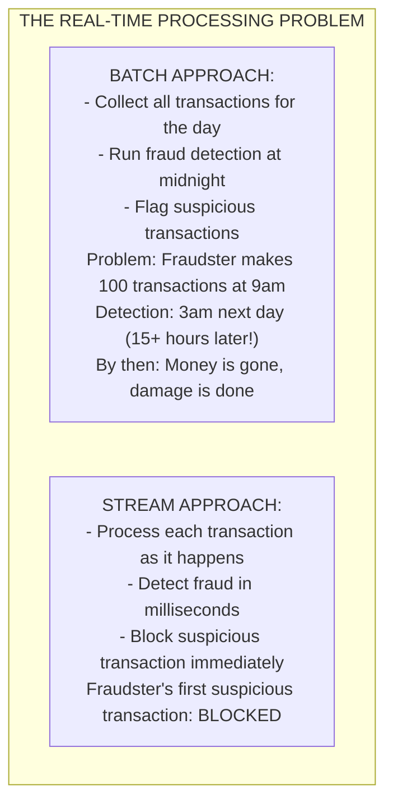
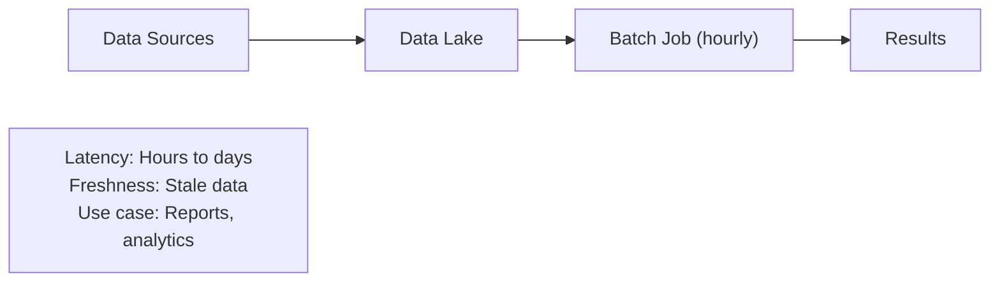
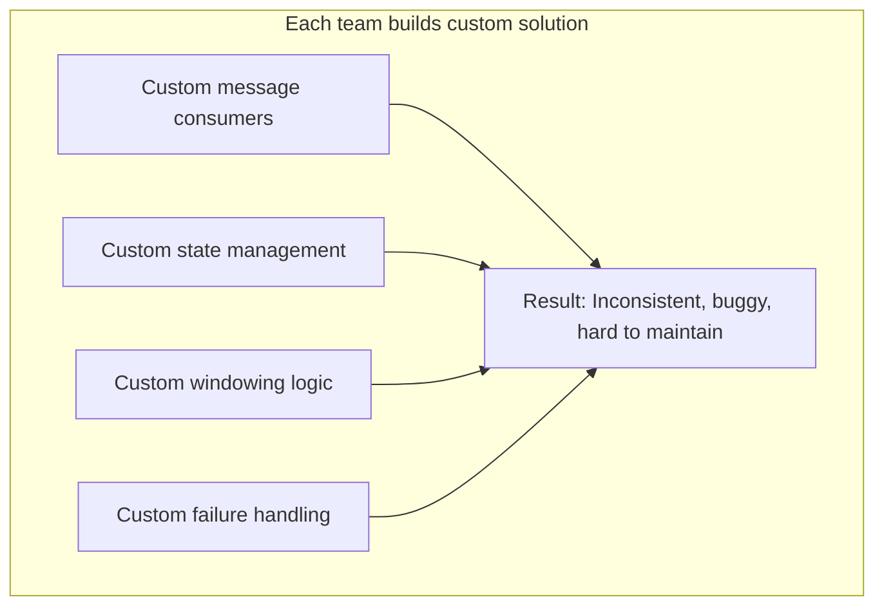
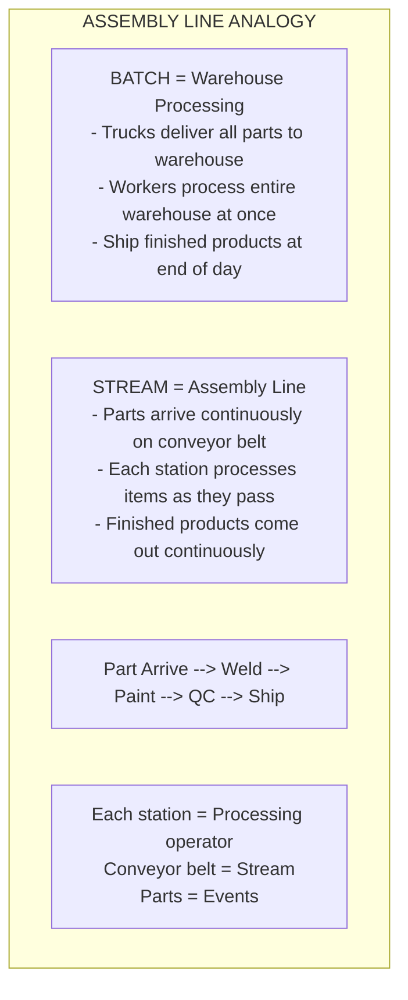

# 🌊 Stream Processing

---

## 0️⃣ Prerequisites

Before diving into stream processing, you should understand:

- **Kafka Deep Dive** (Topic 5): Topics, partitions, offsets, consumer groups.
- **Consumer Groups** (Topic 4): How multiple consumers share work.
- **Message Delivery** (Topic 2): At-least-once, exactly-once semantics.
- **Distributed Systems** (Phase 1): Concepts like partitioning and fault tolerance.

**Quick refresher on batch vs stream**: 
- **Batch processing**: Collect data, process all at once (hourly, daily). Example: Generate daily sales report.
- **Stream processing**: Process data as it arrives, continuously. Example: Fraud detection on each transaction.

---

## 1️⃣ What Problem Does This Exist to Solve?

### The Specific Pain Point

Imagine you're building a fraud detection system:



### What Systems Looked Like Before Stream Processing

**Batch-Only World:**


**Custom Real-Time Systems:**


### What Breaks Without Stream Processing

1. **Delayed Insights**: Business decisions based on stale data.
2. **Missed Opportunities**: Can't react to events in real-time.
3. **Poor User Experience**: Updates take hours instead of seconds.
4. **Operational Blindness**: Can't monitor systems in real-time.
5. **Competitive Disadvantage**: Competitors with real-time systems win.

### Real Examples of the Problem

**Netflix**: Needs to update recommendations as you watch, not next day.

**Uber**: Needs to calculate surge pricing based on current demand, not yesterday's.

**LinkedIn**: Needs to update feed as connections post, not in batch.

**Trading Systems**: Need to react to market changes in milliseconds.

---

## 2️⃣ Intuition and Mental Model

### The Assembly Line Analogy

Think of stream processing like a factory assembly line:



### Core Stream Processing Concepts

```
┌─────────────────────────────────────────────────────────────┐
│              STREAM PROCESSING CONCEPTS                      │
│                                                              │
│   EVENT: Single data point (transaction, click, log)        │
│   ┌─────────────────────────────────────────────────────┐   │
│   │ {userId: "U1", action: "purchase", amount: 100,     │   │
│   │  timestamp: "2024-01-15T10:30:00Z"}                 │   │
│   └─────────────────────────────────────────────────────┘   │
│                                                              │
│   STREAM: Unbounded sequence of events                      │
│   ───[E1]──[E2]──[E3]──[E4]──[E5]──[E6]──►                 │
│                                                              │
│   OPERATOR: Transformation applied to stream                │
│   - Filter: Keep only matching events                       │
│   - Map: Transform each event                               │
│   - Aggregate: Combine multiple events                      │
│                                                              │
│   WINDOW: Group events by time or count                     │
│   ┌─────────┐ ┌─────────┐ ┌─────────┐                      │
│   │ Window 1│ │ Window 2│ │ Window 3│                      │
│   │ 10:00-  │ │ 10:05-  │ │ 10:10-  │                      │
│   │ 10:05   │ │ 10:10   │ │ 10:15   │                      │
│   └─────────┘ └─────────┘ └─────────┘                      │
│                                                              │
└─────────────────────────────────────────────────────────────┘
```

---

## 3️⃣ How It Works Internally

### Windowing Types

Windowing groups events for aggregation. There are several types:

```
┌─────────────────────────────────────────────────────────────┐
│                    TUMBLING WINDOWS                          │
│                                                              │
│   Fixed-size, non-overlapping windows                       │
│                                                              │
│   Events: ─[1]─[2]─[3]─[4]─[5]─[6]─[7]─[8]─[9]─►           │
│                                                              │
│   Windows (5 min each):                                     │
│   ┌─────────────┐ ┌─────────────┐ ┌─────────────┐          │
│   │ [1] [2] [3] │ │ [4] [5] [6] │ │ [7] [8] [9] │          │
│   │  10:00-10:05│ │  10:05-10:10│ │  10:10-10:15│          │
│   └─────────────┘ └─────────────┘ └─────────────┘          │
│                                                              │
│   Use case: "Count transactions per 5-minute interval"      │
│                                                              │
└─────────────────────────────────────────────────────────────┘

┌─────────────────────────────────────────────────────────────┐
│                    SLIDING WINDOWS                           │
│                                                              │
│   Fixed-size, overlapping windows                           │
│                                                              │
│   Events: ─[1]─[2]─[3]─[4]─[5]─[6]─►                       │
│                                                              │
│   Windows (5 min size, 1 min slide):                        │
│   ┌─────────────────────┐                                   │
│   │ [1] [2] [3] [4] [5] │ 10:00-10:05                      │
│   └─────────────────────┘                                   │
│       ┌─────────────────────┐                               │
│       │ [2] [3] [4] [5] [6] │ 10:01-10:06                  │
│       └─────────────────────┘                               │
│                                                              │
│   Events can be in multiple windows!                        │
│   Use case: "Moving average over last 5 minutes"            │
│                                                              │
└─────────────────────────────────────────────────────────────┘

┌─────────────────────────────────────────────────────────────┐
│                    SESSION WINDOWS                           │
│                                                              │
│   Dynamic windows based on activity gaps                    │
│                                                              │
│   Events: ─[1]─[2]─[3]────────────[4]─[5]─────[6]─►        │
│                    ↑              ↑        ↑                │
│                    gap > timeout  gap > timeout             │
│                                                              │
│   Sessions (gap timeout = 5 min):                           │
│   ┌───────────┐       ┌─────────┐    ┌─────┐               │
│   │ [1][2][3] │       │ [4][5]  │    │ [6] │               │
│   │ Session 1 │       │Session 2│    │Sess3│               │
│   └───────────┘       └─────────┘    └─────┘               │
│                                                              │
│   Use case: "User session analysis"                         │
│                                                              │
└─────────────────────────────────────────────────────────────┘
```

### Stateful vs Stateless Processing

```
┌─────────────────────────────────────────────────────────────┐
│              STATELESS PROCESSING                            │
│                                                              │
│   Each event processed independently                        │
│   No memory of previous events                              │
│                                                              │
│   Examples:                                                  │
│   - Filter: Keep events where amount > 100                  │
│   - Map: Convert currency USD → EUR                         │
│   - Transform: Extract fields, format data                  │
│                                                              │
│   Event ──► Process ──► Output                              │
│   (no state needed)                                         │
│                                                              │
└─────────────────────────────────────────────────────────────┘

┌─────────────────────────────────────────────────────────────┐
│              STATEFUL PROCESSING                             │
│                                                              │
│   Processing depends on previous events                     │
│   Must maintain state across events                         │
│                                                              │
│   Examples:                                                  │
│   - Count: Total transactions per user                      │
│   - Aggregate: Sum of amounts in window                     │
│   - Join: Combine events from two streams                   │
│                                                              │
│   Event ──► Process with State ──► Output                   │
│                  ↑      │                                   │
│                  └──────┘ (state updated)                   │
│                                                              │
│   State must be:                                             │
│   - Fault-tolerant (survives failures)                      │
│   - Scalable (partitioned)                                  │
│   - Consistent (exactly-once updates)                       │
│                                                              │
└─────────────────────────────────────────────────────────────┘
```

### Event Time vs Processing Time

```
┌─────────────────────────────────────────────────────────────┐
│              EVENT TIME vs PROCESSING TIME                   │
│                                                              │
│   EVENT TIME: When the event actually occurred              │
│   - Embedded in event: {"timestamp": "10:00:00"}            │
│   - Reflects real-world time                                │
│                                                              │
│   PROCESSING TIME: When the event is processed              │
│   - System clock when event reaches processor               │
│   - Can differ from event time due to delays                │
│                                                              │
│   Example:                                                   │
│   Event created at 10:00:00 (event time)                    │
│   Network delay: 5 seconds                                  │
│   Processed at 10:00:05 (processing time)                   │
│                                                              │
│   Which window does it belong to?                           │
│   - Event time window: 10:00-10:05                          │
│   - Processing time window: 10:05-10:10                     │
│                                                              │
│   Event time is usually correct for business logic          │
│                                                              │
└─────────────────────────────────────────────────────────────┘
```

### Watermarks and Late Data

```
┌─────────────────────────────────────────────────────────────┐
│              WATERMARKS AND LATE DATA                        │
│                                                              │
│   PROBLEM: Events can arrive out of order                   │
│                                                              │
│   Stream: ─[E1:10:01]─[E3:10:03]─[E2:10:02]─►              │
│                                   ↑                         │
│                           E2 arrived late!                  │
│                                                              │
│   When can we close window 10:00-10:05?                     │
│   - Can't wait forever for late events                      │
│   - But don't want to miss late events                      │
│                                                              │
│   WATERMARK: "All events before this time have arrived"     │
│                                                              │
│   Stream with watermark:                                    │
│   ─[E1:10:01]─[E3:10:03]─[W:10:02]─[E2:10:02]─►            │
│                           ↑                                 │
│                    Watermark at 10:02                       │
│                    "Events before 10:02 complete"           │
│                                                              │
│   E2 arrives after watermark = LATE DATA                    │
│                                                              │
│   Options for late data:                                    │
│   1. Drop: Ignore late events                               │
│   2. Allow: Accept events within allowed lateness           │
│   3. Side output: Send late events to separate stream       │
│                                                              │
└─────────────────────────────────────────────────────────────┘
```

### Backpressure

```
┌─────────────────────────────────────────────────────────────┐
│                    BACKPRESSURE                              │
│                                                              │
│   PROBLEM: Consumer slower than producer                    │
│                                                              │
│   Producer: 10,000 events/sec                               │
│   Consumer: 5,000 events/sec                                │
│   Gap: 5,000 events/sec accumulating                        │
│                                                              │
│   Without backpressure:                                      │
│   - Buffer grows unbounded                                  │
│   - Memory exhausted                                        │
│   - System crashes                                          │
│                                                              │
│   BACKPRESSURE: Signal upstream to slow down                │
│                                                              │
│   ┌──────────┐    ┌──────────┐    ┌──────────┐             │
│   │ Producer │───►│  Buffer  │───►│ Consumer │             │
│   └──────────┘    └──────────┘    └──────────┘             │
│        ▲               │                                    │
│        │               │                                    │
│        └───────────────┘                                    │
│        "Slow down!" (backpressure signal)                   │
│                                                              │
│   Strategies:                                                │
│   1. Block producer until buffer has space                  │
│   2. Drop events (lossy)                                    │
│   3. Sample events (statistical)                            │
│   4. Scale up consumers                                     │
│                                                              │
└─────────────────────────────────────────────────────────────┘
```

### Stream-Table Duality

```
┌─────────────────────────────────────────────────────────────┐
│              STREAM-TABLE DUALITY                            │
│                                                              │
│   STREAM: Sequence of changes (events)                      │
│   TABLE: Current state (snapshot)                           │
│                                                              │
│   They are two views of the same data!                      │
│                                                              │
│   STREAM → TABLE (Aggregation):                             │
│   ┌─────────────────────────────────────────────────────┐   │
│   │ Stream: INSERT U1, UPDATE U1, DELETE U2, INSERT U3  │   │
│   │                     ↓                                │   │
│   │ Table:  | U1 | current_state |                      │   │
│   │         | U3 | current_state |                      │   │
│   └─────────────────────────────────────────────────────┘   │
│                                                              │
│   TABLE → STREAM (CDC):                                     │
│   ┌─────────────────────────────────────────────────────┐   │
│   │ Table changes: U1 updated, U2 deleted, U3 inserted  │   │
│   │                     ↓                                │   │
│   │ Stream: [UPDATE U1] [DELETE U2] [INSERT U3]         │   │
│   └─────────────────────────────────────────────────────┘   │
│                                                              │
│   Use case: Join stream with table                          │
│   - Stream: Transactions                                    │
│   - Table: User profiles                                    │
│   - Join: Enrich transactions with user data                │
│                                                              │
└─────────────────────────────────────────────────────────────┘
```

---

## 4️⃣ Simulation-First Explanation

Let's trace through a real-time fraud detection system.

### Scenario: Credit Card Fraud Detection

**Requirements:**
- Flag if user makes >3 transactions in 5 minutes
- Flag if single transaction >$1000
- Flag if transactions from different countries within 1 hour

### Stream Processing Flow

```
┌─────────────────────────────────────────────────────────────┐
│              FRAUD DETECTION FLOW                            │
│                                                              │
│   Input Stream (transactions):                              │
│   ─[T1]─[T2]─[T3]─[T4]─[T5]─►                              │
│                                                              │
│   T1: {user: "U1", amount: 50, country: "US", time: 10:00} │
│   T2: {user: "U1", amount: 30, country: "US", time: 10:01} │
│   T3: {user: "U1", amount: 40, country: "US", time: 10:02} │
│   T4: {user: "U1", amount: 20, country: "UK", time: 10:03} │
│   T5: {user: "U2", amount: 1500, country: "US", time: 10:04}│
│                                                              │
└─────────────────────────────────────────────────────────────┘
```

### Processing Steps

```
Step 1: Single Transaction Check (Stateless)
┌─────────────────────────────────────────────────────────────┐
│   Filter: amount > 1000                                     │
│                                                              │
│   T1 (50): Pass                                             │
│   T2 (30): Pass                                             │
│   T3 (40): Pass                                             │
│   T4 (20): Pass                                             │
│   T5 (1500): ALERT! "High value transaction"                │
│                                                              │
└─────────────────────────────────────────────────────────────┘

Step 2: Velocity Check (Stateful, Tumbling Window)
┌─────────────────────────────────────────────────────────────┐
│   Window: 5 minutes, Group by: user                         │
│   Alert if: count > 3                                       │
│                                                              │
│   Window 10:00-10:05:                                       │
│   - U1: [T1, T2, T3, T4] = 4 transactions                  │
│   - U2: [T5] = 1 transaction                                │
│                                                              │
│   U1 count (4) > 3: ALERT! "High velocity for U1"          │
│                                                              │
└─────────────────────────────────────────────────────────────┘

Step 3: Location Check (Stateful, Session Window)
┌─────────────────────────────────────────────────────────────┐
│   Window: Session with 1 hour gap, Group by: user           │
│   Alert if: distinct countries > 1                          │
│                                                              │
│   U1 Session:                                                │
│   - T1 (US), T2 (US), T3 (US), T4 (UK)                     │
│   - Countries: {US, UK}                                     │
│   - Distinct count: 2                                       │
│                                                              │
│   U1 countries (2) > 1: ALERT! "Multiple countries for U1" │
│                                                              │
└─────────────────────────────────────────────────────────────┘

Final Output:
┌─────────────────────────────────────────────────────────────┐
│   Alerts:                                                    │
│   1. T5: High value transaction (U2, $1500)                 │
│   2. U1: High velocity (4 transactions in 5 min)            │
│   3. U1: Multiple countries (US, UK in 1 hour)              │
│                                                              │
│   Actions:                                                   │
│   - Block U1's next transaction pending review              │
│   - Flag T5 for manual review                               │
│   - Send notification to U1                                 │
│                                                              │
└─────────────────────────────────────────────────────────────┘
```

---

## 5️⃣ How Engineers Actually Use This in Production

### Netflix's Real-Time Analytics

Netflix processes 8 million events per second:

- **Use case**: Real-time viewing statistics
- **Technology**: Apache Flink
- **Windowing**: 1-minute tumbling windows for metrics
- **State**: Per-title view counts
- **Output**: Real-time dashboards, recommendations

### Uber's Surge Pricing

Uber calculates surge pricing in real-time:

- **Input**: Ride requests, driver locations
- **Processing**: Aggregate demand per area per minute
- **Output**: Surge multiplier updated every minute
- **Technology**: Apache Flink

### LinkedIn's Activity Feed

LinkedIn updates feeds in real-time:

- **Input**: Posts, likes, comments, shares
- **Processing**: Filter by connections, rank by relevance
- **Output**: Updated feed for each user
- **Technology**: Apache Samza (now Kafka Streams)

### Stripe's Fraud Detection

Stripe detects fraud in real-time:

- **Input**: Payment transactions
- **Processing**: ML models, rule-based checks, velocity checks
- **Output**: Allow/block decision in <100ms
- **Technology**: Custom stream processing

---

## 6️⃣ How to Implement or Apply It

### Kafka Streams Implementation

**Maven Dependencies:**

```xml
<dependency>
    <groupId>org.apache.kafka</groupId>
    <artifactId>kafka-streams</artifactId>
    <version>3.6.0</version>
</dependency>
```

**Fraud Detection with Kafka Streams:**

```java
package com.systemdesign.streaming;

import org.apache.kafka.streams.*;
import org.apache.kafka.streams.kstream.*;
import org.apache.kafka.common.serialization.Serdes;

import java.time.Duration;
import java.util.Properties;

public class FraudDetectionStream {
    
    public static void main(String[] args) {
        Properties props = new Properties();
        props.put(StreamsConfig.APPLICATION_ID_CONFIG, "fraud-detection");
        props.put(StreamsConfig.BOOTSTRAP_SERVERS_CONFIG, "localhost:9092");
        props.put(StreamsConfig.DEFAULT_KEY_SERDE_CLASS_CONFIG, Serdes.String().getClass());
        props.put(StreamsConfig.DEFAULT_VALUE_SERDE_CLASS_CONFIG, Serdes.String().getClass());
        
        StreamsBuilder builder = new StreamsBuilder();
        
        // Input stream of transactions
        KStream<String, Transaction> transactions = builder
            .stream("transactions", Consumed.with(Serdes.String(), transactionSerde()));
        
        // Rule 1: High value transactions (stateless)
        KStream<String, Alert> highValueAlerts = transactions
            .filter((key, txn) -> txn.getAmount() > 1000)
            .mapValues(txn -> new Alert(
                txn.getUserId(),
                "HIGH_VALUE",
                "Transaction amount: " + txn.getAmount()
            ));
        
        // Rule 2: Velocity check (stateful, windowed)
        KTable<Windowed<String>, Long> velocityCounts = transactions
            .groupBy((key, txn) -> txn.getUserId())  // Group by user
            .windowedBy(TimeWindows.ofSizeWithNoGrace(Duration.ofMinutes(5)))  // 5-min window
            .count(Materialized.as("velocity-counts"));  // Count per window
        
        KStream<String, Alert> velocityAlerts = velocityCounts
            .toStream()
            .filter((windowedKey, count) -> count > 3)
            .map((windowedKey, count) -> KeyValue.pair(
                windowedKey.key(),
                new Alert(
                    windowedKey.key(),
                    "HIGH_VELOCITY",
                    "Transactions in window: " + count
                )
            ));
        
        // Rule 3: Multiple countries (stateful, session window)
        KTable<Windowed<String>, Set<String>> countrySessions = transactions
            .groupBy((key, txn) -> txn.getUserId())
            .windowedBy(SessionWindows.ofInactivityGapWithNoGrace(Duration.ofHours(1)))
            .aggregate(
                HashSet::new,  // Initializer
                (key, txn, countries) -> {
                    countries.add(txn.getCountry());
                    return countries;
                },
                (key, left, right) -> {
                    left.addAll(right);
                    return left;
                },
                Materialized.as("country-sessions")
            );
        
        KStream<String, Alert> countryAlerts = countrySessions
            .toStream()
            .filter((windowedKey, countries) -> countries.size() > 1)
            .map((windowedKey, countries) -> KeyValue.pair(
                windowedKey.key(),
                new Alert(
                    windowedKey.key(),
                    "MULTIPLE_COUNTRIES",
                    "Countries: " + countries
                )
            ));
        
        // Merge all alerts and send to output topic
        highValueAlerts
            .merge(velocityAlerts)
            .merge(countryAlerts)
            .to("fraud-alerts", Produced.with(Serdes.String(), alertSerde()));
        
        // Build and start the topology
        Topology topology = builder.build();
        KafkaStreams streams = new KafkaStreams(topology, props);
        
        // Graceful shutdown
        Runtime.getRuntime().addShutdownHook(new Thread(streams::close));
        
        streams.start();
    }
}
```

### Spring Cloud Stream Implementation

```java
package com.systemdesign.streaming;

import org.springframework.cloud.stream.annotation.EnableBinding;
import org.springframework.cloud.stream.annotation.StreamListener;
import org.springframework.cloud.stream.messaging.Processor;
import org.springframework.messaging.handler.annotation.SendTo;
import org.springframework.stereotype.Service;

import java.util.function.Function;

@Service
public class TransactionProcessor {
    
    /**
     * Simple stateless transformation.
     */
    @Bean
    public Function<Transaction, EnrichedTransaction> enrichTransaction() {
        return transaction -> {
            EnrichedTransaction enriched = new EnrichedTransaction(transaction);
            enriched.setRiskScore(calculateRiskScore(transaction));
            enriched.setProcessedAt(Instant.now());
            return enriched;
        };
    }
    
    /**
     * Filter high-risk transactions.
     */
    @Bean
    public Function<Flux<Transaction>, Flux<Transaction>> filterHighRisk() {
        return transactions -> transactions
            .filter(txn -> txn.getAmount() > 500)
            .filter(txn -> isHighRiskCountry(txn.getCountry()));
    }
    
    /**
     * Windowed aggregation for velocity check.
     */
    @Bean
    public Function<KStream<String, Transaction>, KStream<String, VelocityAlert>> 
            velocityCheck() {
        return transactions -> transactions
            .groupBy((key, txn) -> txn.getUserId())
            .windowedBy(TimeWindows.of(Duration.ofMinutes(5)))
            .count()
            .toStream()
            .filter((key, count) -> count > 3)
            .mapValues((key, count) -> new VelocityAlert(key.key(), count));
    }
}
```

### Apache Flink Implementation

```java
package com.systemdesign.streaming.flink;

import org.apache.flink.streaming.api.datastream.DataStream;
import org.apache.flink.streaming.api.environment.StreamExecutionEnvironment;
import org.apache.flink.streaming.api.windowing.assigners.TumblingEventTimeWindows;
import org.apache.flink.streaming.api.windowing.time.Time;

public class FlinkFraudDetection {
    
    public static void main(String[] args) throws Exception {
        StreamExecutionEnvironment env = 
            StreamExecutionEnvironment.getExecutionEnvironment();
        
        // Enable event time processing
        env.setStreamTimeCharacteristic(TimeCharacteristic.EventTime);
        
        // Read from Kafka
        DataStream<Transaction> transactions = env
            .addSource(new FlinkKafkaConsumer<>(
                "transactions",
                new TransactionDeserializer(),
                kafkaProperties()
            ))
            .assignTimestampsAndWatermarks(
                WatermarkStrategy
                    .<Transaction>forBoundedOutOfOrderness(Duration.ofSeconds(5))
                    .withTimestampAssigner((txn, ts) -> txn.getTimestamp())
            );
        
        // High value check (stateless)
        DataStream<Alert> highValueAlerts = transactions
            .filter(txn -> txn.getAmount() > 1000)
            .map(txn -> new Alert(txn.getUserId(), "HIGH_VALUE", txn.getAmount()));
        
        // Velocity check (stateful, windowed)
        DataStream<Alert> velocityAlerts = transactions
            .keyBy(Transaction::getUserId)
            .window(TumblingEventTimeWindows.of(Time.minutes(5)))
            .aggregate(new CountAggregator())
            .filter(result -> result.getCount() > 3)
            .map(result -> new Alert(result.getUserId(), "HIGH_VELOCITY", result.getCount()));
        
        // Union alerts and write to Kafka
        highValueAlerts
            .union(velocityAlerts)
            .addSink(new FlinkKafkaProducer<>(
                "fraud-alerts",
                new AlertSerializer(),
                kafkaProperties()
            ));
        
        env.execute("Fraud Detection");
    }
}
```

### Application Configuration

```yaml
# application.yml for Spring Cloud Stream
spring:
  cloud:
    stream:
      kafka:
        streams:
          binder:
            configuration:
              default.key.serde: org.apache.kafka.common.serialization.Serdes$StringSerde
              default.value.serde: org.springframework.kafka.support.serializer.JsonSerde
              commit.interval.ms: 1000
              
      bindings:
        input:
          destination: transactions
          group: fraud-detection
        output:
          destination: fraud-alerts
          
      function:
        definition: enrichTransaction;filterHighRisk;velocityCheck
```

---

## 7️⃣ Tradeoffs, Pitfalls, and Common Mistakes

### Common Mistakes

#### 1. Using Processing Time When Event Time is Needed

**Wrong:**
```java
// Using processing time for business logic
.windowedBy(TimeWindows.of(Duration.ofMinutes(5)))  // Processing time window

// Problem: Events delayed by network arrive in wrong window
// Transaction at 10:00, processed at 10:06, goes into 10:05-10:10 window
```

**Right:**
```java
// Using event time with watermarks
.assignTimestampsAndWatermarks(
    WatermarkStrategy
        .forBoundedOutOfOrderness(Duration.ofSeconds(30))
        .withTimestampAssigner((event, ts) -> event.getTimestamp())
)
.windowedBy(TimeWindows.of(Duration.ofMinutes(5)))  // Event time window
```

#### 2. Not Handling State Size

**Problem:**
```java
// State grows unbounded
.groupByKey()
.aggregate(
    HashMap::new,
    (key, value, agg) -> {
        agg.put(value.getId(), value);  // Never removes!
        return agg;
    }
);
// Memory exhausted after days of running
```

**Solution:**
```java
// Use windowed state or TTL
.groupByKey()
.windowedBy(TimeWindows.of(Duration.ofHours(24)))  // State expires
.aggregate(...);

// Or use state TTL
Materialized.<String, Long, KeyValueStore<Bytes, byte[]>>as("store")
    .withRetention(Duration.ofDays(7))  // State expires after 7 days
```

#### 3. Ignoring Backpressure

**Problem:**
```java
// Consumer can't keep up
// No backpressure handling
// Buffer grows, OOM crash
```

**Solution:**
```java
// Configure buffer limits
props.put(StreamsConfig.BUFFERED_RECORDS_PER_PARTITION_CONFIG, 1000);

// Or use rate limiting
.filter(...)
.mapValues(...)
.peek((k, v) -> rateLimiter.acquire())  // Rate limit
```

### Performance Considerations

| Aspect | Recommendation |
|--------|----------------|
| **Parallelism** | Match partition count to consumer instances |
| **State stores** | Use RocksDB for large state |
| **Serialization** | Use efficient formats (Avro, Protobuf) |
| **Windowing** | Smaller windows = less state, more frequent output |
| **Checkpointing** | Balance frequency vs overhead |

---

## 8️⃣ When NOT to Use This

### When Stream Processing is Overkill

1. **Batch is sufficient**: Daily reports, end-of-day reconciliation.
2. **Simple transformations**: ETL that doesn't need real-time.
3. **Low volume**: 100 events/day doesn't need streaming infrastructure.
4. **No time sensitivity**: If hours of delay is acceptable.

### When to Use Batch Instead

| Scenario | Stream | Batch |
|----------|--------|-------|
| Fraud detection | ✅ | ❌ |
| Daily sales report | ❌ | ✅ |
| Real-time dashboard | ✅ | ❌ |
| ML model training | ❌ | ✅ |
| Live recommendations | ✅ | ❌ |
| Data warehouse load | ❌ | ✅ |

---

## 9️⃣ Comparison with Alternatives

### Stream Processing Frameworks

| Feature | Kafka Streams | Apache Flink | Apache Spark Streaming |
|---------|---------------|--------------|------------------------|
| **Model** | Library | Cluster | Cluster |
| **Deployment** | Embedded | Standalone | Standalone |
| **State** | Local + Kafka | Managed | RDD-based |
| **Latency** | Low (ms) | Very Low (ms) | Higher (seconds) |
| **Exactly-once** | Yes | Yes | Yes |
| **Windowing** | Good | Excellent | Good |
| **SQL Support** | KSQL | FlinkSQL | SparkSQL |
| **Learning curve** | Low | Medium | Medium |

### When to Choose Each

**Kafka Streams:**
- Already using Kafka
- Simple streaming needs
- Want library, not cluster
- Java/Scala applications

**Apache Flink:**
- Complex event processing
- Low latency requirements
- Advanced windowing
- Large-scale stateful processing

**Spark Streaming:**
- Already using Spark for batch
- Unified batch + stream
- ML integration needed
- Can tolerate higher latency

---

## 🔟 Interview Follow-Up Questions WITH Answers

### L4 (Entry-Level) Questions

**Q1: What is stream processing?**

**Answer:**
Stream processing is processing data continuously as it arrives, rather than collecting it and processing in batches. 

Think of it like an assembly line vs a warehouse:
- Batch: Collect all items in warehouse, process at end of day
- Stream: Process each item as it arrives on the conveyor belt

Key characteristics:
- Continuous processing
- Low latency (milliseconds to seconds)
- Unbounded data (no end)
- Stateful operations possible

Use cases: Fraud detection, real-time analytics, live dashboards.

**Q2: What is a window in stream processing?**

**Answer:**
A window groups events together for aggregation. Since streams are infinite, you can't aggregate "all events." Windows define a finite subset to aggregate.

Three main types:
1. **Tumbling**: Fixed-size, non-overlapping (e.g., every 5 minutes)
2. **Sliding**: Fixed-size, overlapping (e.g., 5-minute window, slides every 1 minute)
3. **Session**: Dynamic size based on activity gaps

Example: "Count transactions per user in the last 5 minutes" uses a tumbling window.

### L5 (Senior) Questions

**Q3: How do you handle late-arriving data in stream processing?**

**Answer:**
Late data is events that arrive after their window has closed. Handling strategies:

1. **Watermarks**: Track progress of event time. Events before watermark are "on time."

2. **Allowed lateness**: Accept late events within a grace period.
   ```java
   .windowedBy(TimeWindows.of(Duration.ofMinutes(5))
       .grace(Duration.ofMinutes(1)))  // Accept 1 min late
   ```

3. **Side outputs**: Send late events to separate stream for special handling.

4. **Retriggering**: Update window results when late data arrives.

Trade-offs:
- Longer allowed lateness = more accurate, but higher latency and state
- Shorter = faster results, but may miss late events

**Q4: How do you ensure exactly-once processing in stream applications?**

**Answer:**
Exactly-once requires coordination between source, processing, and sink:

1. **Source**: Track offsets, replay on failure
   - Kafka consumer offsets
   - Checkpointing

2. **Processing**: Idempotent operations + state checkpointing
   - Kafka Streams: Changelog topics for state
   - Flink: Distributed snapshots (Chandy-Lamport)

3. **Sink**: Idempotent writes or transactional writes
   - Kafka: Transactional producer
   - Database: Upsert with idempotency key

End-to-end exactly-once:
- Kafka Streams: Enable `processing.guarantee=exactly_once_v2`
- Flink: Enable checkpointing + two-phase commit sinks

### L6 (Staff) Questions

**Q5: Design a real-time analytics system for 1 million events per second.**

**Answer:**
At 1M events/sec, we need careful architecture:

**Ingestion:**
- Kafka with 100+ partitions
- Multiple producer instances
- Compression (snappy/lz4)

**Processing:**
- Apache Flink cluster (10+ TaskManagers)
- Partition by key for parallelism
- RocksDB state backend for large state
- Incremental checkpointing

**Storage:**
- Time-series DB (InfluxDB, TimescaleDB) for metrics
- Elasticsearch for searchable events
- S3 for raw event archive

**Serving:**
- Pre-aggregated results in Redis
- WebSocket for real-time updates
- Grafana for dashboards

**Key considerations:**
- Backpressure handling
- State size management
- Checkpoint frequency (balance durability vs overhead)
- Exactly-once vs at-least-once (based on requirements)

---

## 1️⃣1️⃣ One Clean Mental Summary

Stream processing handles unbounded, continuous data in real-time, unlike batch processing which handles bounded data periodically. Key concepts: **events** (individual data points), **streams** (sequences of events), **operators** (transformations like filter, map, aggregate), and **windows** (groupings for aggregation: tumbling, sliding, session). Stateful processing maintains information across events (counts, aggregates), requiring fault-tolerant state management. **Event time** (when event occurred) is usually preferred over **processing time** (when processed) for accuracy. **Watermarks** track event time progress and handle late data. **Backpressure** prevents overwhelming slow consumers. Choose stream processing when you need real-time results (fraud detection, live dashboards), batch processing when delay is acceptable (daily reports, ML training).

---

## Quick Reference Card

```
┌─────────────────────────────────────────────────────────────┐
│           STREAM PROCESSING CHEAT SHEET                      │
├─────────────────────────────────────────────────────────────┤
│ CORE CONCEPTS                                                │
│   Event: Single data point                                  │
│   Stream: Unbounded sequence of events                      │
│   Operator: Transformation (filter, map, aggregate)         │
│   Window: Grouping for aggregation                          │
├─────────────────────────────────────────────────────────────┤
│ WINDOW TYPES                                                 │
│   Tumbling: Fixed-size, non-overlapping                     │
│   Sliding: Fixed-size, overlapping                          │
│   Session: Dynamic, based on activity gaps                  │
├─────────────────────────────────────────────────────────────┤
│ TIME SEMANTICS                                               │
│   Event time: When event occurred (preferred)               │
│   Processing time: When event processed                     │
│   Watermark: "Events before this time are complete"         │
├─────────────────────────────────────────────────────────────┤
│ STATE MANAGEMENT                                             │
│   Stateless: Each event independent (filter, map)           │
│   Stateful: Depends on history (count, aggregate)           │
│   State must be: Fault-tolerant, scalable, consistent       │
├─────────────────────────────────────────────────────────────┤
│ LATE DATA HANDLING                                           │
│   Watermark: Track event time progress                      │
│   Allowed lateness: Accept late events in grace period      │
│   Side output: Send late events to separate stream          │
├─────────────────────────────────────────────────────────────┤
│ FRAMEWORKS                                                   │
│   Kafka Streams: Library, embedded, simple                  │
│   Apache Flink: Cluster, low latency, complex CEP           │
│   Spark Streaming: Cluster, unified batch+stream            │
├─────────────────────────────────────────────────────────────┤
│ WHEN TO USE                                                  │
│   Stream: Fraud detection, real-time dashboards             │
│   Batch: Daily reports, ML training, data warehouse         │
└─────────────────────────────────────────────────────────────┘
```

