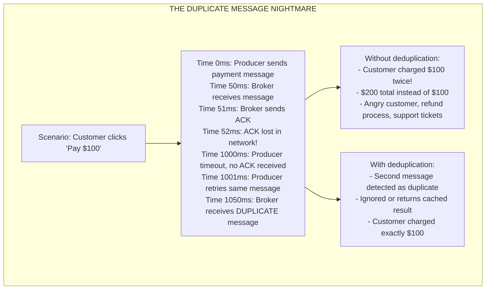
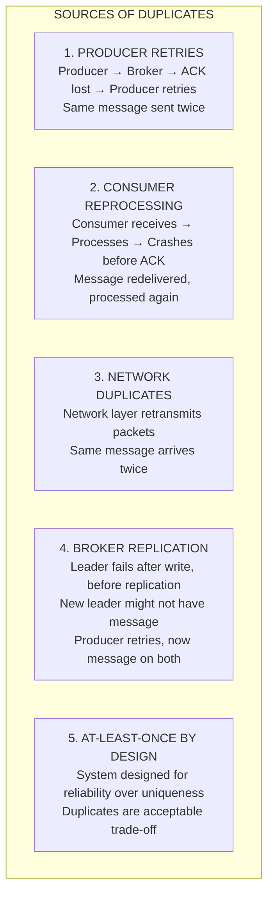

# 🔁 Message Deduplication

---

## 0️⃣ Prerequisites

Before diving into message deduplication, you should understand:

- **Message Delivery** (Topic 2): At-least-once delivery means duplicates are possible.
- **Idempotency** (Phase 1, Topic 13): Making operations safe to execute multiple times.
- **Consumer Groups** (Topic 4): How consumers process messages from Kafka.
- **Bloom Filters** (Phase 5.5, Topic 1): Probabilistic data structure for set membership.

**Quick refresher on why duplicates happen**: In distributed systems with at-least-once delivery, the same message can be delivered multiple times. This happens when:
- Network timeout causes producer retry
- Consumer crashes after processing but before acknowledgment
- Message broker redelivers unacknowledged messages

---

## 1️⃣ What Problem Does This Exist to Solve?

### The Specific Pain Point

Consider a payment processing system:



### Sources of Duplicate Messages



### What Breaks Without Deduplication

1. **Financial Systems**: Double charges, incorrect balances
2. **Inventory Systems**: Stock counts off, overselling
3. **Notification Systems**: Spam (same notification multiple times)
4. **Analytics**: Inflated metrics, wrong business decisions
5. **Order Processing**: Duplicate orders, fulfillment chaos

### Real Examples of the Problem

**PayPal**: Early PayPal had significant issues with duplicate payments. They implemented idempotency keys to solve this.

**Uber**: Duplicate ride requests could match multiple drivers to one rider. They use deduplication at multiple layers.

**Shopify**: During Black Friday, network issues caused message retries. Without deduplication, orders would be processed multiple times.

---

## 2️⃣ Intuition and Mental Model

### The Visitor Log Analogy

Think of deduplication like a visitor log at a building:

```
┌─────────────────────────────────────────────────────────────┐
│              VISITOR LOG ANALOGY                             │
│                                                              │
│   WITHOUT DEDUPLICATION:                                     │
│   ┌─────────────────────────────────────────────────────┐   │
│   │ Visitor Log:                                         │   │
│   │ 9:00 - John Smith - Badge #123                      │   │
│   │ 9:05 - Jane Doe - Badge #456                        │   │
│   │ 9:10 - John Smith - Badge #123  ← Counted again!    │   │
│   │                                                      │   │
│   │ Count: 3 visitors (wrong!)                          │   │
│   └─────────────────────────────────────────────────────┘   │
│                                                              │
│   WITH DEDUPLICATION:                                        │
│   ┌─────────────────────────────────────────────────────┐   │
│   │ Visitor Log:                                         │   │
│   │ 9:00 - John Smith - Badge #123 ✓                    │   │
│   │ 9:05 - Jane Doe - Badge #456 ✓                      │   │
│   │ 9:10 - John Smith - Badge #123 (already logged)     │   │
│   │                                                      │   │
│   │ Count: 2 unique visitors (correct!)                 │   │
│   └─────────────────────────────────────────────────────┘   │
│                                                              │
│   The badge number is the DEDUPLICATION KEY                 │
│                                                              │
└─────────────────────────────────────────────────────────────┘
```

### Deduplication Strategies Overview

```
┌─────────────────────────────────────────────────────────────┐
│              DEDUPLICATION STRATEGIES                        │
│                                                              │
│   1. IDEMPOTENCY KEY                                         │
│   Each message has unique ID                                │
│   Store processed IDs, check before processing              │
│   Most common, most reliable                                │
│                                                              │
│   2. CONTENT-BASED DEDUPLICATION                            │
│   Hash message content                                      │
│   Same content = same hash = duplicate                      │
│   No explicit key needed                                    │
│                                                              │
│   3. NATURAL KEY DEDUPLICATION                              │
│   Use business identifier (order_id, transaction_id)        │
│   Check if already processed in database                    │
│   Leverages existing data                                   │
│                                                              │
│   4. TIME-WINDOW DEDUPLICATION                              │
│   Only dedupe within time window                            │
│   Older duplicates treated as new                           │
│   Reduces storage requirements                              │
│                                                              │
│   5. BLOOM FILTER DEDUPLICATION                             │
│   Probabilistic: "definitely not seen" or "maybe seen"      │
│   Very memory efficient                                     │
│   Small false positive rate                                 │
│                                                              │
└─────────────────────────────────────────────────────────────┘
```

---

## 3️⃣ How It Works Internally

### Idempotency Key Pattern

```
┌─────────────────────────────────────────────────────────────┐
│              IDEMPOTENCY KEY FLOW                            │
│                                                              │
│   Producer generates unique key:                            │
│   key = "pay_" + orderId + "_" + timestamp                  │
│   key = "pay_O123_1705312200000"                            │
│                                                              │
│   Message: {                                                 │
│     "idempotencyKey": "pay_O123_1705312200000",             │
│     "orderId": "O123",                                      │
│     "amount": 100                                           │
│   }                                                          │
│                                                              │
│   Consumer processing:                                       │
│   ┌─────────────────────────────────────────────────────┐   │
│   │ 1. Extract idempotencyKey from message              │   │
│   │ 2. Check store: EXISTS idempotency:{key}?           │   │
│   │    - YES: Return cached result, skip processing     │   │
│   │    - NO: Continue to step 3                         │   │
│   │ 3. SET idempotency:{key} = "processing" (with TTL)  │   │
│   │ 4. Process the message                              │   │
│   │ 5. SET idempotency:{key} = {result} (with TTL)      │   │
│   │ 6. Return result                                    │   │
│   └─────────────────────────────────────────────────────┘   │
│                                                              │
└─────────────────────────────────────────────────────────────┘
```

### Deduplication Window

```
┌─────────────────────────────────────────────────────────────┐
│              DEDUPLICATION WINDOW                            │
│                                                              │
│   Why not store ALL message IDs forever?                    │
│   - Storage grows unbounded                                 │
│   - 1M messages/day × 50 bytes = 50MB/day = 18GB/year      │
│   - Lookup becomes slow                                     │
│                                                              │
│   Solution: Time-based deduplication window                 │
│                                                              │
│   ┌─────────────────────────────────────────────────────┐   │
│   │ Time: 10:00    10:05    10:10    10:15    10:20     │   │
│   │       ├────────┼────────┼────────┼────────┤         │   │
│   │       │◄─── Deduplication Window (15 min) ───►│     │   │
│   │       │                                        │     │   │
│   │ IDs:  │ [A,B,C] [D,E,F] [G,H,I] [J,K,L]       │     │   │
│   │       │                                        │     │   │
│   │       │ At 10:20, IDs from 10:00 expire       │     │   │
│   │       │ A, B, C no longer in dedup store      │     │   │
│   │       │                                        │     │   │
│   └─────────────────────────────────────────────────────┘   │
│                                                              │
│   Trade-off:                                                 │
│   - Longer window = better dedup, more storage              │
│   - Shorter window = less storage, might miss late dupes    │
│                                                              │
│   Choose based on:                                           │
│   - Max expected delay for duplicates                       │
│   - Storage capacity                                        │
│   - Business requirements                                   │
│                                                              │
└─────────────────────────────────────────────────────────────┘
```

### Bloom Filter for Deduplication

```
┌─────────────────────────────────────────────────────────────┐
│              BLOOM FILTER DEDUPLICATION                      │
│                                                              │
│   Bloom Filter: Probabilistic set membership                │
│   - "Definitely NOT in set" (100% accurate)                 │
│   - "Probably in set" (small false positive rate)           │
│                                                              │
│   How it works:                                              │
│   1. Hash message ID with multiple hash functions           │
│   2. Set bits at hash positions                             │
│   3. To check: hash and check if ALL bits are set           │
│                                                              │
│   Example:                                                   │
│   Bloom filter (10 bits): [0,0,0,0,0,0,0,0,0,0]             │
│                                                              │
│   Add "msg-123": hash1=2, hash2=5, hash3=8                  │
│   Filter: [0,0,1,0,0,1,0,0,1,0]                             │
│                                                              │
│   Check "msg-456": hash1=2, hash2=4, hash3=8                │
│   Bits at 2,4,8: [1,0,1] - bit 4 is 0                       │
│   Result: DEFINITELY NOT SEEN ✓                             │
│                                                              │
│   Check "msg-789": hash1=2, hash2=5, hash3=8                │
│   Bits at 2,5,8: [1,1,1] - all set                          │
│   Result: PROBABLY SEEN (could be false positive)           │
│                                                              │
│   For deduplication:                                         │
│   - "Definitely not seen" → Process message                 │
│   - "Probably seen" → Check database to confirm             │
│                                                              │
└─────────────────────────────────────────────────────────────┘
```

### Database-Level Deduplication

```
┌─────────────────────────────────────────────────────────────┐
│              DATABASE-LEVEL DEDUPLICATION                    │
│                                                              │
│   Use database constraints to prevent duplicates            │
│                                                              │
│   Schema:                                                    │
│   CREATE TABLE processed_messages (                         │
│     message_id VARCHAR(255) PRIMARY KEY,                    │
│     processed_at TIMESTAMP,                                 │
│     result JSON                                             │
│   );                                                         │
│                                                              │
│   Processing:                                                │
│   BEGIN TRANSACTION;                                         │
│     -- This will fail if message_id exists                  │
│     INSERT INTO processed_messages (message_id, ...)        │
│     VALUES ('msg-123', ...);                                │
│                                                              │
│     -- Only runs if INSERT succeeds                         │
│     -- Process message here                                 │
│   COMMIT;                                                    │
│                                                              │
│   If INSERT fails (duplicate key):                          │
│   - Message was already processed                           │
│   - Skip processing, return cached result                   │
│                                                              │
│   Advantages:                                                │
│   - Atomic with business logic                              │
│   - Durable                                                 │
│   - No separate dedup store                                 │
│                                                              │
│   Disadvantages:                                             │
│   - Database load                                           │
│   - Slower than Redis                                       │
│                                                              │
└─────────────────────────────────────────────────────────────┘
```

---

## 4️⃣ Simulation-First Explanation

Let's trace through deduplication in action.

### Scenario: Payment Processing with Duplicates

**Setup:**
- Payment service processes payment messages
- Redis for deduplication store
- 24-hour deduplication window

### Normal Flow (No Duplicate)

```
Time 0ms: Producer sends payment message
┌─────────────────────────────────────────────────────────────┐
│ Message: {                                                   │
│   "idempotencyKey": "pay_O123_1705312200",                  │
│   "orderId": "O123",                                        │
│   "amount": 100,                                            │
│   "customerId": "C456"                                      │
│ }                                                            │
└─────────────────────────────────────────────────────────────┘

Time 50ms: Consumer receives message
  Step 1: Extract key = "pay_O123_1705312200"
  Step 2: Check Redis: GET dedup:pay_O123_1705312200
          Result: NULL (not found)
  Step 3: Set processing flag: 
          SET dedup:pay_O123_1705312200 "processing" EX 86400 NX
          Result: OK (lock acquired)
  Step 4: Process payment
          - Charge customer $100
          - Create transaction record
          - Result: {txnId: "TXN789", status: "SUCCESS"}
  Step 5: Store result:
          SET dedup:pay_O123_1705312200 '{"txnId":"TXN789","status":"SUCCESS"}' EX 86400
  Step 6: ACK message

Time 100ms: Producer receives ACK, done.
```

### Duplicate Flow (ACK Lost)

```
Time 0ms: Producer sends payment message
Time 50ms: Consumer processes (same as above)
Time 100ms: Consumer sends ACK
Time 101ms: ACK LOST IN NETWORK!
Time 1000ms: Producer timeout, retries

Time 1001ms: Producer sends SAME message (retry)
┌─────────────────────────────────────────────────────────────┐
│ Message: {                                                   │
│   "idempotencyKey": "pay_O123_1705312200",  ← SAME KEY     │
│   "orderId": "O123",                                        │
│   "amount": 100,                                            │
│   "customerId": "C456"                                      │
│ }                                                            │
└─────────────────────────────────────────────────────────────┘

Time 1050ms: Consumer receives duplicate message
  Step 1: Extract key = "pay_O123_1705312200"
  Step 2: Check Redis: GET dedup:pay_O123_1705312200
          Result: '{"txnId":"TXN789","status":"SUCCESS"}'
          DUPLICATE DETECTED!
  Step 3: Return cached result (no reprocessing)
  Step 4: ACK message

Result: Customer charged exactly once!
```

### Concurrent Duplicate Flow

```
Time 0ms: Network causes duplicate delivery
         Message 1 and Message 2 arrive simultaneously

Time 1ms: Consumer A receives Message 1
Time 2ms: Consumer B receives Message 2 (same message!)

Consumer A:
  Step 1: Key = "pay_O123_1705312200"
  Step 2: SET dedup:pay_O123_1705312200 "processing" NX
          Result: OK (got lock)
  Step 3: Processing...

Consumer B:
  Step 1: Key = "pay_O123_1705312200"
  Step 2: SET dedup:pay_O123_1705312200 "processing" NX
          Result: FAIL (key exists, Consumer A has lock)
  Step 3: Wait and retry, or return "in progress"

Consumer A:
  Step 4: Processing complete
  Step 5: SET result

Consumer B:
  Step 4: Check again, find result
  Step 5: Return cached result

Result: Only processed once despite concurrent delivery!
```

---

## 5️⃣ How Engineers Actually Use This in Production

### Stripe's Idempotency

Stripe's API requires idempotency keys for mutations:

```bash
curl https://api.stripe.com/v1/charges \
  -u sk_test_xxx: \
  -H "Idempotency-Key: order_12345_charge" \
  -d amount=2000 \
  -d currency=usd
```

**Stripe's implementation:**
- Keys expire after 24 hours
- Same key + different body = error
- Returns cached response for duplicates
- Stores results, not just "processed" flag

### Uber's Deduplication

Uber uses multi-layer deduplication:

1. **Client layer**: Generate request ID, include in all retries
2. **Gateway layer**: Dedupe at API gateway
3. **Service layer**: Each service has its own dedup
4. **Database layer**: Unique constraints as last defense

### Netflix's Approach

Netflix uses:
- Kafka idempotent producer (producer-side dedup)
- Consumer-side deduplication with Cassandra
- Time-windowed dedup (7 days)
- Bloom filters for hot path

### Amazon's Strategy

Amazon's order processing:
- Order ID as natural deduplication key
- Database unique constraint on order ID
- Idempotent operations throughout
- State machine prevents invalid transitions

---

## 6️⃣ How to Implement or Apply It

### Maven Dependencies

```xml
<dependencies>
    <!-- Redis -->
    <dependency>
        <groupId>org.springframework.boot</groupId>
        <artifactId>spring-boot-starter-data-redis</artifactId>
    </dependency>
    
    <!-- Guava for Bloom Filter -->
    <dependency>
        <groupId>com.google.guava</groupId>
        <artifactId>guava</artifactId>
        <version>32.1.3-jre</version>
    </dependency>
    
    <!-- Kafka -->
    <dependency>
        <groupId>org.springframework.kafka</groupId>
        <artifactId>spring-kafka</artifactId>
    </dependency>
</dependencies>
```

### Redis-Based Deduplication Service

```java
package com.systemdesign.dedup;

import org.springframework.data.redis.core.StringRedisTemplate;
import org.springframework.stereotype.Service;

import java.time.Duration;
import java.util.Optional;

/**
 * Deduplication service using Redis.
 * Stores processed message IDs with TTL.
 */
@Service
public class DeduplicationService {
    
    private static final String KEY_PREFIX = "dedup:";
    private static final Duration DEFAULT_TTL = Duration.ofHours(24);
    
    private final StringRedisTemplate redisTemplate;
    private final ObjectMapper objectMapper;
    
    public DeduplicationService(StringRedisTemplate redisTemplate,
                                ObjectMapper objectMapper) {
        this.redisTemplate = redisTemplate;
        this.objectMapper = objectMapper;
    }
    
    /**
     * Checks if message was already processed.
     * 
     * @param idempotencyKey Unique message identifier
     * @return Optional containing cached result if duplicate, empty if new
     */
    public Optional<DeduplicationResult> checkDuplicate(String idempotencyKey) {
        String key = KEY_PREFIX + idempotencyKey;
        String value = redisTemplate.opsForValue().get(key);
        
        if (value == null) {
            return Optional.empty();  // Not a duplicate
        }
        
        if ("processing".equals(value)) {
            // Another consumer is processing this message
            return Optional.of(DeduplicationResult.inProgress());
        }
        
        // Found cached result
        try {
            CachedResult cached = objectMapper.readValue(value, CachedResult.class);
            return Optional.of(DeduplicationResult.cached(cached));
        } catch (Exception e) {
            // Corrupted cache, treat as new
            return Optional.empty();
        }
    }
    
    /**
     * Attempts to acquire processing lock for a message.
     * Uses SET NX (set if not exists) for atomic check-and-set.
     * 
     * @param idempotencyKey Unique message identifier
     * @return true if lock acquired, false if duplicate
     */
    public boolean tryAcquireLock(String idempotencyKey) {
        String key = KEY_PREFIX + idempotencyKey;
        // SET NX with TTL - atomic operation
        Boolean acquired = redisTemplate.opsForValue()
            .setIfAbsent(key, "processing", DEFAULT_TTL);
        return Boolean.TRUE.equals(acquired);
    }
    
    /**
     * Stores the result of processing for future duplicate detection.
     * 
     * @param idempotencyKey Unique message identifier
     * @param result Processing result to cache
     */
    public void storeResult(String idempotencyKey, Object result) {
        String key = KEY_PREFIX + idempotencyKey;
        try {
            CachedResult cached = new CachedResult(
                "completed",
                result,
                System.currentTimeMillis()
            );
            String json = objectMapper.writeValueAsString(cached);
            redisTemplate.opsForValue().set(key, json, DEFAULT_TTL);
        } catch (Exception e) {
            throw new RuntimeException("Failed to store dedup result", e);
        }
    }
    
    /**
     * Marks processing as failed, allowing retry.
     * 
     * @param idempotencyKey Unique message identifier
     */
    public void markFailed(String idempotencyKey) {
        String key = KEY_PREFIX + idempotencyKey;
        redisTemplate.delete(key);  // Allow retry
    }
    
    /**
     * Cached result structure.
     */
    public record CachedResult(
        String status,
        Object result,
        long processedAt
    ) {}
    
    /**
     * Deduplication check result.
     */
    public static class DeduplicationResult {
        private final boolean isDuplicate;
        private final boolean isInProgress;
        private final CachedResult cachedResult;
        
        private DeduplicationResult(boolean isDuplicate, boolean isInProgress, 
                                   CachedResult cachedResult) {
            this.isDuplicate = isDuplicate;
            this.isInProgress = isInProgress;
            this.cachedResult = cachedResult;
        }
        
        public static DeduplicationResult inProgress() {
            return new DeduplicationResult(true, true, null);
        }
        
        public static DeduplicationResult cached(CachedResult result) {
            return new DeduplicationResult(true, false, result);
        }
        
        // Getters
        public boolean isDuplicate() { return isDuplicate; }
        public boolean isInProgress() { return isInProgress; }
        public CachedResult getCachedResult() { return cachedResult; }
    }
}
```

### Kafka Consumer with Deduplication

```java
package com.systemdesign.dedup;

import org.apache.kafka.clients.consumer.ConsumerRecord;
import org.springframework.kafka.annotation.KafkaListener;
import org.springframework.kafka.support.Acknowledgment;
import org.springframework.stereotype.Service;

/**
 * Kafka consumer with deduplication.
 */
@Service
public class DeduplicatingConsumer {
    
    private final DeduplicationService dedupService;
    private final PaymentService paymentService;
    
    public DeduplicatingConsumer(DeduplicationService dedupService,
                                 PaymentService paymentService) {
        this.dedupService = dedupService;
        this.paymentService = paymentService;
    }
    
    @KafkaListener(topics = "payments", groupId = "payment-processor")
    public void processPayment(ConsumerRecord<String, PaymentMessage> record,
                              Acknowledgment ack) {
        PaymentMessage message = record.value();
        String idempotencyKey = message.getIdempotencyKey();
        
        // Step 1: Check for duplicate
        var dupCheck = dedupService.checkDuplicate(idempotencyKey);
        if (dupCheck.isPresent()) {
            var result = dupCheck.get();
            if (result.isInProgress()) {
                // Another consumer is processing, don't ack, will be redelivered
                System.out.println("Message in progress by another consumer: " 
                    + idempotencyKey);
                return;
            }
            // Duplicate - return cached result
            System.out.println("Duplicate detected, returning cached result: " 
                + idempotencyKey);
            ack.acknowledge();
            return;
        }
        
        // Step 2: Try to acquire lock
        if (!dedupService.tryAcquireLock(idempotencyKey)) {
            // Race condition - another consumer got it first
            System.out.println("Lock not acquired, skipping: " + idempotencyKey);
            return;
        }
        
        // Step 3: Process the message
        try {
            PaymentResult result = paymentService.processPayment(
                message.getOrderId(),
                message.getAmount(),
                message.getCustomerId()
            );
            
            // Step 4: Store result for future duplicates
            dedupService.storeResult(idempotencyKey, result);
            
            // Step 5: Acknowledge
            ack.acknowledge();
            System.out.println("Payment processed: " + result.getTransactionId());
            
        } catch (Exception e) {
            // Step 4 (failure): Mark as failed to allow retry
            dedupService.markFailed(idempotencyKey);
            System.err.println("Payment failed, will retry: " + e.getMessage());
            // Don't ack - message will be redelivered
            throw e;
        }
    }
}
```

### Bloom Filter Deduplication

```java
package com.systemdesign.dedup;

import com.google.common.hash.BloomFilter;
import com.google.common.hash.Funnels;
import org.springframework.stereotype.Service;

import java.nio.charset.StandardCharsets;
import java.util.concurrent.ConcurrentHashMap;

/**
 * Bloom filter based deduplication.
 * Fast probabilistic check with fallback to database.
 */
@Service
public class BloomFilterDeduplication {
    
    // Bloom filter for fast "definitely not seen" checks
    private final BloomFilter<String> bloomFilter;
    
    // Backup store for confirmed duplicates
    private final ConcurrentHashMap<String, Boolean> confirmedIds;
    
    // Database for persistent storage
    private final ProcessedMessageRepository repository;
    
    public BloomFilterDeduplication(ProcessedMessageRepository repository) {
        this.repository = repository;
        
        // Expected 1 million entries, 1% false positive rate
        this.bloomFilter = BloomFilter.create(
            Funnels.stringFunnel(StandardCharsets.UTF_8),
            1_000_000,  // expected insertions
            0.01        // false positive probability
        );
        
        this.confirmedIds = new ConcurrentHashMap<>();
        
        // Load existing IDs into bloom filter on startup
        loadExistingIds();
    }
    
    /**
     * Checks if message might be a duplicate.
     * 
     * @param messageId Message identifier
     * @return true if definitely new, false if possibly duplicate
     */
    public DuplicateCheckResult checkDuplicate(String messageId) {
        // Fast path: Bloom filter says definitely not seen
        if (!bloomFilter.mightContain(messageId)) {
            return DuplicateCheckResult.definitelyNew();
        }
        
        // Bloom filter says maybe seen - could be false positive
        // Check database to confirm
        if (confirmedIds.containsKey(messageId)) {
            return DuplicateCheckResult.confirmedDuplicate();
        }
        
        // Check database
        boolean exists = repository.existsById(messageId);
        if (exists) {
            confirmedIds.put(messageId, true);  // Cache for future
            return DuplicateCheckResult.confirmedDuplicate();
        }
        
        // False positive from bloom filter
        return DuplicateCheckResult.falsePositive();
    }
    
    /**
     * Marks message as processed.
     * 
     * @param messageId Message identifier
     */
    public void markProcessed(String messageId) {
        bloomFilter.put(messageId);
        confirmedIds.put(messageId, true);
        repository.save(new ProcessedMessage(messageId, System.currentTimeMillis()));
    }
    
    private void loadExistingIds() {
        // Load recent IDs into bloom filter
        repository.findRecentIds(Duration.ofHours(24))
            .forEach(id -> {
                bloomFilter.put(id);
                confirmedIds.put(id, true);
            });
    }
    
    public static class DuplicateCheckResult {
        private final boolean isNew;
        private final boolean isFalsePositive;
        
        private DuplicateCheckResult(boolean isNew, boolean isFalsePositive) {
            this.isNew = isNew;
            this.isFalsePositive = isFalsePositive;
        }
        
        public static DuplicateCheckResult definitelyNew() {
            return new DuplicateCheckResult(true, false);
        }
        
        public static DuplicateCheckResult confirmedDuplicate() {
            return new DuplicateCheckResult(false, false);
        }
        
        public static DuplicateCheckResult falsePositive() {
            return new DuplicateCheckResult(true, true);
        }
        
        public boolean isNew() { return isNew; }
        public boolean isFalsePositive() { return isFalsePositive; }
    }
}
```

### Database-Based Deduplication

```java
package com.systemdesign.dedup;

import org.springframework.stereotype.Service;
import org.springframework.transaction.annotation.Transactional;

/**
 * Database-based deduplication using unique constraints.
 */
@Service
public class DatabaseDeduplication {
    
    private final ProcessedMessageRepository messageRepository;
    private final OrderRepository orderRepository;
    
    @Transactional
    public ProcessingResult processOrderIdempotently(
            String idempotencyKey, 
            OrderRequest request) {
        
        // Check if already processed
        var existing = messageRepository.findById(idempotencyKey);
        if (existing.isPresent()) {
            // Return cached result
            return existing.get().getResult();
        }
        
        // Try to insert dedup record (will fail if duplicate)
        ProcessedMessage dedupRecord = new ProcessedMessage();
        dedupRecord.setMessageId(idempotencyKey);
        dedupRecord.setStatus("processing");
        dedupRecord.setCreatedAt(Instant.now());
        
        try {
            // This INSERT will fail if idempotencyKey already exists
            // due to PRIMARY KEY constraint
            messageRepository.save(dedupRecord);
        } catch (DataIntegrityViolationException e) {
            // Duplicate! Another transaction inserted first
            var cached = messageRepository.findById(idempotencyKey);
            if (cached.isPresent() && cached.get().getResult() != null) {
                return cached.get().getResult();
            }
            // Still processing by another transaction
            throw new ConcurrentProcessingException("Message being processed");
        }
        
        // Process the order
        Order order = createOrder(request);
        
        // Update dedup record with result
        ProcessingResult result = new ProcessingResult(order.getId(), "SUCCESS");
        dedupRecord.setStatus("completed");
        dedupRecord.setResult(result);
        messageRepository.save(dedupRecord);
        
        return result;
    }
    
    private Order createOrder(OrderRequest request) {
        Order order = new Order();
        order.setCustomerId(request.getCustomerId());
        order.setItems(request.getItems());
        order.setTotal(calculateTotal(request.getItems()));
        return orderRepository.save(order);
    }
}
```

### Application Configuration

```yaml
# application.yml
spring:
  redis:
    host: localhost
    port: 6379
    timeout: 2000
    
  kafka:
    consumer:
      group-id: payment-processor
      enable-auto-commit: false
      auto-offset-reset: earliest
      
deduplication:
  ttl: 86400  # 24 hours in seconds
  bloom-filter:
    expected-insertions: 1000000
    false-positive-rate: 0.01
```

---

## 7️⃣ Tradeoffs, Pitfalls, and Common Mistakes

### Common Mistakes

#### 1. Not Storing Results, Only "Processed" Flag

**Wrong:**
```java
// Only store that we processed it
redis.set("dedup:" + key, "processed");

// On duplicate, we know it was processed but not the result
// Client can't get the original response
```

**Right:**
```java
// Store the actual result
redis.set("dedup:" + key, serialize(result));

// On duplicate, return the cached result
// Client gets same response as original
```

#### 2. TTL Shorter Than Retry Window

**Wrong:**
```
Dedup TTL: 1 hour
Client retry timeout: 2 hours

Hour 0: Message processed, stored in dedup
Hour 1: Dedup entry expires
Hour 1.5: Client retries (thinks original failed)
Hour 1.5: Message processed AGAIN (duplicate!)
```

**Right:**
```
Dedup TTL: 24 hours (or longer than max retry window)
Client retry timeout: 1 hour

Hour 0: Message processed, stored in dedup
Hour 1: Client retries
Hour 1: Dedup detects duplicate, returns cached result
```

#### 3. Not Handling Concurrent Processing

**Wrong:**
```java
if (!exists(key)) {
    // Race condition window!
    process(message);  // Both threads process
    store(key);
}
```

**Right:**
```java
// Atomic check-and-set
if (setIfNotExists(key, "processing")) {
    process(message);
    store(key, result);
} else {
    // Another thread is processing
    waitOrReturnCached();
}
```

### Performance Considerations

| Approach | Latency | Storage | Accuracy |
|----------|---------|---------|----------|
| Redis | ~1ms | Medium | 100% |
| Bloom Filter | ~0.1ms | Low | 99%+ |
| Database | ~5-10ms | High | 100% |
| Hybrid | ~0.5ms | Medium | 100% |

### Storage Requirements

```
Example: 1 million messages/day, 24-hour window

Redis (key + result):
  Key: ~50 bytes
  Result: ~200 bytes
  Total: 250 bytes × 1M = 250 MB

Bloom Filter:
  1M entries, 1% FP rate ≈ 1.2 MB
  (Plus database for confirmed)

Database:
  Row: ~300 bytes
  Index: ~50 bytes
  Total: 350 bytes × 1M = 350 MB
```

---

## 8️⃣ When NOT to Use This

### When Deduplication is Unnecessary

1. **Idempotent operations by design**: `SET value = 5` is naturally idempotent
2. **Exactly-once delivery guaranteed**: Kafka transactions with read_committed
3. **Stateless processing**: Filter, transform operations that don't have side effects
4. **Acceptable duplicates**: Analytics where approximate counts are fine

### When Simpler Approaches Work

| Scenario | Approach |
|----------|----------|
| Database insert | UNIQUE constraint |
| File processing | Check if file exists |
| API calls | Idempotency header |
| State machines | Invalid transition = no-op |

---

## 9️⃣ Comparison with Alternatives

### Deduplication Approaches

| Approach | Pros | Cons | Use When |
|----------|------|------|----------|
| **Idempotency Key** | Explicit, reliable | Requires key generation | API requests |
| **Content Hash** | No explicit key | Hash collisions possible | Log dedup |
| **Bloom Filter** | Memory efficient | False positives | High volume |
| **Database** | Durable, queryable | Slower | Audit required |
| **Kafka Idempotent** | Producer-side | Kafka only | Kafka producers |

### Kafka Deduplication Options

| Level | Mechanism | Coverage |
|-------|-----------|----------|
| Producer | `enable.idempotence=true` | Producer retries |
| Broker | Log compaction | Same key updates |
| Consumer | Application dedup | All duplicates |

---

## 🔟 Interview Follow-Up Questions WITH Answers

### L4 (Entry-Level) Questions

**Q1: Why do duplicate messages happen?**

**Answer:**
Duplicates happen because distributed systems prioritize reliability over uniqueness:

1. **Producer retries**: ACK lost, producer resends
2. **Consumer redelivery**: Consumer crashes before ACK, broker redelivers
3. **Network issues**: Packets duplicated at network layer
4. **At-least-once delivery**: System designed to never lose messages, accepting duplicates as trade-off

The key insight is that in distributed systems, it's impossible to guarantee exactly-once delivery. We achieve exactly-once semantics by combining at-least-once delivery with idempotent processing.

**Q2: What is an idempotency key?**

**Answer:**
An idempotency key is a unique identifier for a message or operation that allows the system to detect duplicates.

Properties of a good idempotency key:
- Unique per logical operation
- Same for all retries of the same operation
- Generated by the client/producer
- Includes enough context (e.g., order_id + action + timestamp)

Example: For a payment, the key might be `pay_order123_1705312200` combining order ID and timestamp.

### L5 (Senior) Questions

**Q3: How would you implement deduplication for a system processing 1 million messages per second?**

**Answer:**
At 1M msg/sec, we need a multi-layer approach:

1. **First layer: Bloom filter (in-memory)**
   - 99%+ of checks answered in microseconds
   - "Definitely not seen" → process immediately
   - "Maybe seen" → check next layer

2. **Second layer: Redis cluster**
   - Distributed across multiple nodes
   - Sharded by idempotency key
   - 24-hour TTL

3. **Third layer: Database (optional)**
   - For audit trail
   - Async write (not in hot path)

4. **Optimization**:
   - Batch Redis checks
   - Local caching of recent IDs
   - Partition by key for locality

Storage calculation:
- 1M/sec × 86400 sec × 50 bytes = 4.3 TB/day (too much!)
- With 1-hour window: 1M × 3600 × 50 bytes = 180 GB (manageable)
- With Bloom filter: ~100 MB + Redis for confirmations

**Q4: How do you handle the case where deduplication store (Redis) is down?**

**Answer:**
This is a critical failure scenario. Options:

1. **Fail closed (safest)**:
   - Reject all messages until Redis recovers
   - No duplicates, but no processing
   - Good for financial systems

2. **Fail open (available)**:
   - Process without dedup check
   - Risk duplicates
   - Good for non-critical systems

3. **Fallback to database**:
   - Slower but durable
   - Circuit breaker pattern
   - Switch back when Redis recovers

4. **Local cache fallback**:
   - Each consumer maintains local cache
   - Partial protection
   - Risk: duplicates across consumers

For payment systems, I'd recommend fail closed with fast Redis recovery (cluster mode, replicas).

### L6 (Staff) Questions

**Q5: Design a deduplication system for a global, multi-region deployment.**

**Answer:**
Multi-region deduplication is complex due to latency and consistency:

**Option 1: Global dedup store**
- Single Redis cluster (or Spanner)
- All regions check same store
- Cons: Cross-region latency (100ms+)

**Option 2: Regional dedup with sync**
- Each region has local dedup store
- Async replication between regions
- Cons: Brief window for cross-region duplicates

**Option 3: Route by key**
- Hash idempotency key to "home" region
- All operations for that key go to home region
- Cons: Cross-region latency for some requests

**Recommended approach:**
1. Route by key to home region (Option 3)
2. Local dedup store in each region
3. Async replication for disaster recovery
4. Accept brief inconsistency window for availability

For critical operations (payments), use global store with caching.

---

## 1️⃣1️⃣ One Clean Mental Summary

Message deduplication prevents the same message from being processed multiple times. It's essential because at-least-once delivery (the reliable default) can produce duplicates through producer retries, consumer redelivery, or network issues. The standard solution is **idempotency keys**: each message has a unique ID, and consumers check if that ID was already processed before processing. Store the ID (and ideally the result) in Redis or a database with a TTL matching your retry window. For high-volume systems, use **Bloom filters** as a fast first check. Key implementation details: use atomic SET-IF-NOT-EXISTS for the check-and-lock, store results (not just "processed" flag), handle concurrent processing, and set TTL longer than your retry window.

---

## Quick Reference Card

```
┌─────────────────────────────────────────────────────────────┐
│           MESSAGE DEDUPLICATION CHEAT SHEET                  │
├─────────────────────────────────────────────────────────────┤
│ WHY DUPLICATES HAPPEN                                        │
│   • Producer retry (ACK lost)                               │
│   • Consumer redelivery (crash before ACK)                  │
│   • Network duplicates                                      │
│   • At-least-once delivery by design                        │
├─────────────────────────────────────────────────────────────┤
│ IDEMPOTENCY KEY PATTERN                                      │
│   1. Extract key from message                               │
│   2. Check store: seen before?                              │
│   3. If yes: return cached result                           │
│   4. If no: SET key = "processing" (atomic)                 │
│   5. Process message                                        │
│   6. SET key = result (with TTL)                            │
├─────────────────────────────────────────────────────────────┤
│ DEDUPLICATION APPROACHES                                     │
│   Redis: Fast, simple, ~1ms                                 │
│   Bloom Filter: Memory efficient, ~0.1ms, 99%+ accurate     │
│   Database: Durable, ~5-10ms, 100% accurate                 │
│   Hybrid: Bloom → Redis → Database                          │
├─────────────────────────────────────────────────────────────┤
│ KEY IMPLEMENTATION DETAILS                                   │
│   • Use SET NX (if not exists) for atomic lock              │
│   • Store result, not just "processed" flag                 │
│   • TTL > max retry window                                  │
│   • Handle concurrent processing                            │
├─────────────────────────────────────────────────────────────┤
│ COMMON MISTAKES                                              │
│   ✗ TTL shorter than retry window                           │
│   ✗ Not storing results                                     │
│   ✗ Race condition in check-then-set                        │
│   ✗ Not handling dedup store failures                       │
├─────────────────────────────────────────────────────────────┤
│ FORMULA                                                      │
│   At-Least-Once + Deduplication = Exactly-Once Semantics    │
└─────────────────────────────────────────────────────────────┘
```

