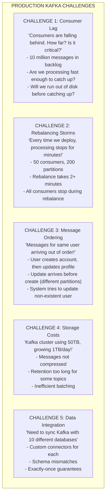
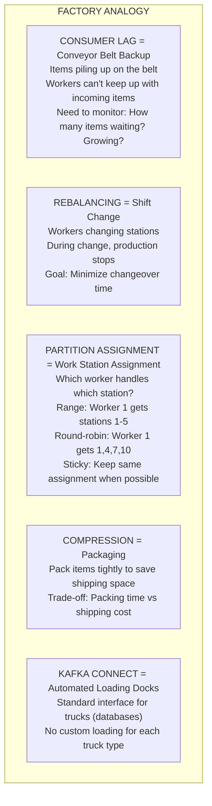

# ⚡ Kafka Advanced Topics

---

## 0️⃣ Prerequisites

Before diving into Kafka advanced topics, you should understand:

- **Kafka Deep Dive** (Topic 5): Topics, partitions, offsets, producers, consumers, replication.
- **Consumer Groups** (Topic 4): Partition assignment, rebalancing basics.
- **Message Delivery** (Topic 2): At-least-once, at-most-once, exactly-once semantics.

**Quick refresher on Kafka basics**: Kafka is a distributed log where messages are appended to partitions. Producers write to partitions (by key or round-robin). Consumers in a group each read from assigned partitions. Offsets track position. Replication provides fault tolerance.

---

## 1️⃣ What Problem Does This Exist to Solve?

### The Specific Pain Points at Scale

Once you have Kafka running in production, new challenges emerge:



### Real Examples of the Problems

**LinkedIn**: With 7 trillion messages/day, even 0.1% lag means 7 billion messages behind. They built extensive lag monitoring.

**Uber**: Rebalancing during deployments caused ride matching delays. They implemented incremental cooperative rebalancing.

**Netflix**: Needed to sync Kafka events to Elasticsearch, S3, and Cassandra. Built on Kafka Connect for reliability.

---

## 2️⃣ Intuition and Mental Model

### The Factory Assembly Line Analogy

Think of Kafka operations like managing a massive factory:



---

## 3️⃣ How It Works Internally

### Consumer Lag Monitoring

Consumer lag is the difference between the latest message in a partition and the consumer's current position.

```
┌─────────────────────────────────────────────────────────────┐
│              CONSUMER LAG                                    │
│                                                              │
│   Partition 0:                                               │
│   ┌───┬───┬───┬───┬───┬───┬───┬───┬───┬───┐                │
│   │ 0 │ 1 │ 2 │ 3 │ 4 │ 5 │ 6 │ 7 │ 8 │ 9 │                │
│   └───┴───┴───┴───┴───┴───┴───┴───┴───┴───┘                │
│                       ▲               ▲                      │
│                       │               │                      │
│              Consumer Offset    Log End Offset              │
│                   (5)              (9)                       │
│                                                              │
│   LAG = Log End Offset - Consumer Offset = 9 - 5 = 4        │
│                                                              │
│   Total Lag = Sum of lag across all partitions              │
│                                                              │
│   Key Metrics:                                               │
│   - Current lag (messages)                                  │
│   - Lag growth rate (messages/second)                       │
│   - Time to catch up (lag / consumption rate)               │
│                                                              │
└─────────────────────────────────────────────────────────────┘
```

**Lag Monitoring Tools:**

| Tool | Features |
|------|----------|
| **Burrow** | LinkedIn's lag monitor, consumer health |
| **Kafka Lag Exporter** | Prometheus metrics |
| **Confluent Control Center** | UI, alerts, commercial |
| **kafka-consumer-groups.sh** | Built-in CLI tool |

### Rebalancing Strategies

When consumers join/leave, partitions must be reassigned.

```
┌─────────────────────────────────────────────────────────────┐
│              EAGER REBALANCING (Default, Old)                │
│                                                              │
│   Before: C1=[P0,P1,P2], C2=[P3,P4,P5]                      │
│                                                              │
│   C3 joins:                                                  │
│   1. ALL consumers stop and revoke ALL partitions           │
│   2. Coordinator calculates new assignment                  │
│   3. ALL consumers get new assignment                       │
│   4. ALL consumers resume                                   │
│                                                              │
│   After: C1=[P0,P1], C2=[P2,P3], C3=[P4,P5]                │
│                                                              │
│   Problem: Complete stop-the-world during rebalance!        │
│   Duration: Can be minutes for large consumer groups        │
│                                                              │
└─────────────────────────────────────────────────────────────┘

┌─────────────────────────────────────────────────────────────┐
│              COOPERATIVE REBALANCING (New, Better)           │
│                                                              │
│   Before: C1=[P0,P1,P2], C2=[P3,P4,P5]                      │
│                                                              │
│   C3 joins:                                                  │
│   1. Consumers keep processing current partitions           │
│   2. Coordinator identifies partitions to move: P2, P5      │
│   3. Only C1 revokes P2, only C2 revokes P5                │
│   4. C3 gets P2, P5                                         │
│   5. Other partitions never stopped!                        │
│                                                              │
│   After: C1=[P0,P1], C2=[P3,P4], C3=[P2,P5]                │
│                                                              │
│   Benefit: Only affected partitions pause briefly           │
│                                                              │
└─────────────────────────────────────────────────────────────┘
```

**Enabling Cooperative Rebalancing:**

```java
props.put(ConsumerConfig.PARTITION_ASSIGNMENT_STRATEGY_CONFIG,
    CooperativeStickyAssignor.class.getName());
```

### Partition Assignment Strategies

```
┌─────────────────────────────────────────────────────────────┐
│              RANGE ASSIGNOR                                  │
│                                                              │
│   Partitions: [P0, P1, P2, P3, P4, P5]                      │
│   Consumers: [C0, C1]                                        │
│                                                              │
│   Assignment:                                                │
│   C0: [P0, P1, P2]  (first half)                           │
│   C1: [P3, P4, P5]  (second half)                          │
│                                                              │
│   Pros: Simple, predictable                                 │
│   Cons: Uneven if partitions not divisible by consumers     │
│         Uneven across multiple topics                       │
│                                                              │
└─────────────────────────────────────────────────────────────┘

┌─────────────────────────────────────────────────────────────┐
│              ROUND ROBIN ASSIGNOR                            │
│                                                              │
│   Partitions: [P0, P1, P2, P3, P4, P5]                      │
│   Consumers: [C0, C1]                                        │
│                                                              │
│   Assignment:                                                │
│   C0: [P0, P2, P4]  (even indices)                         │
│   C1: [P1, P3, P5]  (odd indices)                          │
│                                                              │
│   Pros: Even distribution                                   │
│   Cons: Many partition moves on rebalance                   │
│                                                              │
└─────────────────────────────────────────────────────────────┘

┌─────────────────────────────────────────────────────────────┐
│              STICKY ASSIGNOR                                 │
│                                                              │
│   Goal: Minimize partition movement during rebalance        │
│                                                              │
│   Before rebalance:                                          │
│   C0: [P0, P1, P2], C1: [P3, P4, P5]                       │
│                                                              │
│   C2 joins:                                                  │
│   C0: [P0, P1]      (kept P0, P1)                          │
│   C1: [P3, P4]      (kept P3, P4)                          │
│   C2: [P2, P5]      (got moved partitions)                 │
│                                                              │
│   Only 2 partitions moved instead of all 6!                 │
│                                                              │
│   Pros: Minimal disruption, preserves locality              │
│   Cons: Slightly more complex                               │
│                                                              │
└─────────────────────────────────────────────────────────────┘

┌─────────────────────────────────────────────────────────────┐
│              COOPERATIVE STICKY ASSIGNOR                     │
│                                                              │
│   Combines sticky assignment with cooperative rebalancing   │
│   Best of both worlds!                                      │
│                                                              │
│   - Minimizes partition movement (sticky)                   │
│   - Doesn't stop all consumers (cooperative)                │
│   - Recommended for production                              │
│                                                              │
└─────────────────────────────────────────────────────────────┘
```

### Message Ordering Guarantees

```
┌─────────────────────────────────────────────────────────────┐
│              KAFKA ORDERING GUARANTEES                       │
│                                                              │
│   WITHIN A PARTITION: Strict ordering guaranteed            │
│   ┌─────────────────────────────────────────────────────┐   │
│   │ Partition 0: [M1] → [M2] → [M3] → [M4]              │   │
│   │              Always processed in this order         │   │
│   └─────────────────────────────────────────────────────┘   │
│                                                              │
│   ACROSS PARTITIONS: No ordering guarantee                  │
│   ┌─────────────────────────────────────────────────────┐   │
│   │ Partition 0: [M1] → [M3]                            │   │
│   │ Partition 1: [M2] → [M4]                            │   │
│   │                                                      │   │
│   │ Consumer might see: M2, M1, M4, M3                  │   │
│   │ (depends on which partition read first)             │   │
│   └─────────────────────────────────────────────────────┘   │
│                                                              │
│   TO GUARANTEE ORDER FOR AN ENTITY:                         │
│   Use entity ID as partition key                            │
│   All messages for user "U123" → same partition             │
│   → Guaranteed order for that user                          │
│                                                              │
└─────────────────────────────────────────────────────────────┘
```

**Ordering with Retries:**

```
┌─────────────────────────────────────────────────────────────┐
│              ORDERING WITH RETRIES                           │
│                                                              │
│   Problem:                                                   │
│   Producer sends M1, M2, M3                                 │
│   M1 fails, M2 succeeds, M1 retried                         │
│   Order in partition: M2, M1 (wrong!)                       │
│                                                              │
│   Solution 1: max.in.flight.requests.per.connection=1       │
│   Only one request at a time                                │
│   Guarantees order, but reduces throughput                  │
│                                                              │
│   Solution 2: enable.idempotence=true (recommended)         │
│   Kafka tracks sequence numbers                             │
│   Broker rejects out-of-order messages                      │
│   Maintains order with up to 5 in-flight requests           │
│                                                              │
└─────────────────────────────────────────────────────────────┘
```

### Compression

```
┌─────────────────────────────────────────────────────────────┐
│              KAFKA COMPRESSION                               │
│                                                              │
│   Compression happens at BATCH level, not message level     │
│                                                              │
│   Without compression:                                       │
│   [M1:100B][M2:100B][M3:100B] = 300B                        │
│                                                              │
│   With compression:                                          │
│   [Compressed(M1+M2+M3)] = ~100B (varies by data)           │
│                                                              │
│   Compression Types:                                         │
│   ┌────────────┬───────────┬───────────┬──────────────┐    │
│   │ Type       │ Ratio     │ CPU       │ Use Case     │    │
│   ├────────────┼───────────┼───────────┼──────────────┤    │
│   │ none       │ 1x        │ None      │ Already comp │    │
│   │ gzip       │ Best      │ High      │ Cold storage │    │
│   │ snappy     │ Good      │ Low       │ Real-time    │    │
│   │ lz4        │ Good      │ Very Low  │ Real-time    │    │
│   │ zstd       │ Very Good │ Medium    │ Balanced     │    │
│   └────────────┴───────────┴───────────┴──────────────┘    │
│                                                              │
│   Recommendation: lz4 or zstd for most use cases            │
│                                                              │
└─────────────────────────────────────────────────────────────┘
```

### Batching

```
┌─────────────────────────────────────────────────────────────┐
│              KAFKA BATCHING                                  │
│                                                              │
│   Producer batches messages before sending                  │
│                                                              │
│   Key configs:                                               │
│   - batch.size: Max bytes per batch (default 16KB)         │
│   - linger.ms: Wait time to fill batch (default 0)         │
│                                                              │
│   linger.ms=0 (default):                                    │
│   Send immediately, small batches, more requests            │
│                                                              │
│   linger.ms=5:                                               │
│   Wait up to 5ms to fill batch                              │
│   Larger batches, fewer requests, better throughput         │
│   Trade-off: 5ms added latency                              │
│                                                              │
│   Example:                                                   │
│   1000 messages/sec, each 1KB                               │
│                                                              │
│   linger.ms=0: 1000 requests/sec (1 msg each)              │
│   linger.ms=10: 10 requests/sec (100 msgs each)            │
│                                                              │
│   Compression + Batching = Huge efficiency gains            │
│                                                              │
└─────────────────────────────────────────────────────────────┘
```

### Kafka Connect

Kafka Connect is a framework for streaming data between Kafka and external systems.

```
┌─────────────────────────────────────────────────────────────┐
│              KAFKA CONNECT ARCHITECTURE                      │
│                                                              │
│   SOURCE CONNECTORS (External → Kafka):                     │
│   ┌──────────┐     ┌─────────────┐     ┌─────────┐         │
│   │ Database │────►│ JDBC Source │────►│  Kafka  │         │
│   │ (MySQL)  │     │ Connector   │     │  Topic  │         │
│   └──────────┘     └─────────────┘     └─────────┘         │
│                                                              │
│   SINK CONNECTORS (Kafka → External):                       │
│   ┌─────────┐     ┌─────────────┐     ┌──────────┐         │
│   │  Kafka  │────►│ ES Sink     │────►│ Elastic  │         │
│   │  Topic  │     │ Connector   │     │ search   │         │
│   └─────────┘     └─────────────┘     └──────────┘         │
│                                                              │
│   CONNECT CLUSTER:                                           │
│   ┌─────────────────────────────────────────────────────┐   │
│   │ Worker 1        Worker 2        Worker 3            │   │
│   │ ┌───────────┐   ┌───────────┐   ┌───────────┐      │   │
│   │ │ Task 1    │   │ Task 2    │   │ Task 3    │      │   │
│   │ │ (MySQL)   │   │ (MySQL)   │   │ (ES)      │      │   │
│   │ └───────────┘   └───────────┘   └───────────┘      │   │
│   │                                                      │   │
│   │ Distributed mode: Tasks distributed across workers  │   │
│   │ Fault tolerant: Task moves if worker fails          │   │
│   └─────────────────────────────────────────────────────┘   │
│                                                              │
└─────────────────────────────────────────────────────────────┘
```

**Popular Connectors:**

| Connector | Type | Use Case |
|-----------|------|----------|
| JDBC | Source/Sink | Relational databases |
| Debezium | Source | CDC from databases |
| Elasticsearch | Sink | Search indexing |
| S3 | Sink | Data lake storage |
| HDFS | Sink | Hadoop storage |
| MongoDB | Source/Sink | Document database |

---

## 4️⃣ Simulation-First Explanation

Let's trace through a production scenario.

### Scenario: E-commerce Order Processing at Scale

**Setup:**
- Topic: `orders` with 12 partitions
- Consumer group: `order-processors` with 4 consumers
- 10,000 orders/minute during peak

### Consumer Lag Incident

```
┌─────────────────────────────────────────────────────────────┐
│              LAG INCIDENT TIMELINE                           │
│                                                              │
│   10:00 AM - Normal operation                               │
│   - Lag: ~100 messages (normal processing delay)            │
│   - Throughput: 10,000 msg/min in, 10,000 msg/min out      │
│                                                              │
│   10:15 AM - Flash sale starts                              │
│   - Incoming: 50,000 msg/min (5x normal)                   │
│   - Processing: 10,000 msg/min (unchanged)                  │
│   - Lag growing: 40,000 msg/min                            │
│                                                              │
│   10:30 AM - Alert triggered                                │
│   - Lag: 600,000 messages                                   │
│   - Time to catch up: 60 minutes (if traffic stops)        │
│   - Disk usage growing                                      │
│                                                              │
│   10:35 AM - Response                                       │
│   - Scale consumers: 4 → 12 (match partition count)        │
│   - Processing: 30,000 msg/min (3x improvement)            │
│   - Lag growth slowing                                      │
│                                                              │
│   11:00 AM - Recovery                                       │
│   - Flash sale ends, incoming: 10,000 msg/min              │
│   - Processing: 30,000 msg/min                             │
│   - Lag decreasing: 20,000 msg/min                         │
│                                                              │
│   11:30 AM - Caught up                                      │
│   - Lag: ~100 messages (back to normal)                    │
│   - Scale down consumers: 12 → 4                           │
│                                                              │
└─────────────────────────────────────────────────────────────┘
```

### Rebalancing During Deployment

```
┌─────────────────────────────────────────────────────────────┐
│              REBALANCING COMPARISON                          │
│                                                              │
│   EAGER REBALANCING (Old):                                  │
│   ─────────────────────────────────────────────────────────  │
│   10:00:00 - Deploy starts, C1 restarts                     │
│   10:00:01 - Coordinator detects C1 left                    │
│   10:00:01 - ALL consumers stop processing                  │
│   10:00:02 - Rebalance starts                               │
│   10:00:30 - Rebalance completes (30 sec!)                  │
│   10:00:30 - C1 rejoins, another rebalance!                 │
│   10:01:00 - Second rebalance completes                     │
│   10:01:00 - Processing resumes                             │
│                                                              │
│   Total downtime: 60 seconds                                │
│   Messages delayed: 10,000                                  │
│                                                              │
│   ─────────────────────────────────────────────────────────  │
│   COOPERATIVE REBALANCING (New):                            │
│   ─────────────────────────────────────────────────────────  │
│   10:00:00 - Deploy starts, C1 restarts                     │
│   10:00:01 - Coordinator detects C1 left                    │
│   10:00:01 - C2, C3, C4 CONTINUE processing their partitions│
│   10:00:02 - C1's partitions reassigned to C2, C3, C4      │
│   10:00:03 - C1 rejoins, gets some partitions back         │
│   10:00:04 - Incremental rebalance, minimal movement        │
│                                                              │
│   Total downtime: ~3 seconds (only C1's partitions)         │
│   Messages delayed: ~500                                    │
│                                                              │
└─────────────────────────────────────────────────────────────┘
```

---

## 5️⃣ How Engineers Actually Use This in Production

### LinkedIn's Kafka Operations

LinkedIn (Kafka's creator) operates at massive scale:
- 7 trillion messages/day
- 100+ Kafka clusters
- Custom lag monitoring (Burrow)
- Automated partition rebalancing

### Uber's Kafka Tuning

Uber optimized for low latency:
- Cooperative rebalancing for zero-downtime deployments
- LZ4 compression for speed
- Aggressive batching (linger.ms=5)
- Custom partition assignment for data locality

### Netflix's Kafka Connect Usage

Netflix uses Kafka Connect extensively:
- Debezium for CDC from MySQL
- S3 sink for data lake
- Elasticsearch sink for search
- Custom connectors for internal systems

---

## 6️⃣ How to Implement or Apply It

### Consumer Lag Monitoring

```java
package com.systemdesign.kafka.monitoring;

import org.apache.kafka.clients.admin.*;
import org.apache.kafka.clients.consumer.OffsetAndMetadata;
import org.apache.kafka.common.TopicPartition;

import java.util.*;
import java.util.concurrent.*;

/**
 * Consumer lag monitor using Kafka Admin API.
 */
public class ConsumerLagMonitor {
    
    private final AdminClient adminClient;
    private final ScheduledExecutorService scheduler;
    
    public ConsumerLagMonitor(String bootstrapServers) {
        Properties props = new Properties();
        props.put(AdminClientConfig.BOOTSTRAP_SERVERS_CONFIG, bootstrapServers);
        this.adminClient = AdminClient.create(props);
        this.scheduler = Executors.newSingleThreadScheduledExecutor();
    }
    
    /**
     * Get lag for a consumer group.
     */
    public Map<TopicPartition, Long> getConsumerLag(String groupId) 
            throws ExecutionException, InterruptedException {
        
        // Get committed offsets for the group
        Map<TopicPartition, OffsetAndMetadata> committedOffsets = 
            adminClient.listConsumerGroupOffsets(groupId)
                .partitionsToOffsetAndMetadata()
                .get();
        
        // Get end offsets (latest) for the partitions
        Map<TopicPartition, OffsetSpec> offsetSpecs = new HashMap<>();
        for (TopicPartition tp : committedOffsets.keySet()) {
            offsetSpecs.put(tp, OffsetSpec.latest());
        }
        
        Map<TopicPartition, ListOffsetsResult.ListOffsetsResultInfo> endOffsets =
            adminClient.listOffsets(offsetSpecs).all().get();
        
        // Calculate lag
        Map<TopicPartition, Long> lag = new HashMap<>();
        for (TopicPartition tp : committedOffsets.keySet()) {
            long committed = committedOffsets.get(tp).offset();
            long end = endOffsets.get(tp).offset();
            lag.put(tp, end - committed);
        }
        
        return lag;
    }
    
    /**
     * Get total lag across all partitions.
     */
    public long getTotalLag(String groupId) 
            throws ExecutionException, InterruptedException {
        return getConsumerLag(groupId).values().stream()
            .mapToLong(Long::longValue)
            .sum();
    }
    
    /**
     * Start periodic lag monitoring.
     */
    public void startMonitoring(String groupId, long intervalSeconds) {
        scheduler.scheduleAtFixedRate(() -> {
            try {
                Map<TopicPartition, Long> lag = getConsumerLag(groupId);
                long total = lag.values().stream().mapToLong(Long::longValue).sum();
                
                System.out.println("=== Consumer Lag Report ===");
                System.out.println("Group: " + groupId);
                System.out.println("Total Lag: " + total);
                
                lag.forEach((tp, l) -> {
                    if (l > 1000) {  // Alert threshold
                        System.out.println("WARNING: " + tp + " lag: " + l);
                    }
                });
                
                // Send to metrics system (Prometheus, etc.)
                // metricsClient.gauge("kafka.consumer.lag", total, "group", groupId);
                
            } catch (Exception e) {
                System.err.println("Error monitoring lag: " + e.getMessage());
            }
        }, 0, intervalSeconds, TimeUnit.SECONDS);
    }
    
    public void close() {
        scheduler.shutdown();
        adminClient.close();
    }
}
```

### Optimized Producer Configuration

```java
package com.systemdesign.kafka.producer;

import org.apache.kafka.clients.producer.*;
import org.apache.kafka.common.serialization.StringSerializer;

import java.util.Properties;

/**
 * High-throughput Kafka producer with optimal settings.
 */
public class OptimizedProducer {
    
    public static KafkaProducer<String, String> createProducer(String bootstrapServers) {
        Properties props = new Properties();
        
        // Connection
        props.put(ProducerConfig.BOOTSTRAP_SERVERS_CONFIG, bootstrapServers);
        props.put(ProducerConfig.KEY_SERIALIZER_CLASS_CONFIG, StringSerializer.class);
        props.put(ProducerConfig.VALUE_SERIALIZER_CLASS_CONFIG, StringSerializer.class);
        
        // Reliability
        props.put(ProducerConfig.ACKS_CONFIG, "all");  // Wait for all replicas
        props.put(ProducerConfig.ENABLE_IDEMPOTENCE_CONFIG, true);  // Exactly-once
        props.put(ProducerConfig.RETRIES_CONFIG, Integer.MAX_VALUE);  // Retry forever
        props.put(ProducerConfig.MAX_IN_FLIGHT_REQUESTS_PER_CONNECTION, 5);  // With idempotence
        
        // Batching for throughput
        props.put(ProducerConfig.BATCH_SIZE_CONFIG, 32 * 1024);  // 32KB batches
        props.put(ProducerConfig.LINGER_MS_CONFIG, 5);  // Wait up to 5ms to fill batch
        props.put(ProducerConfig.BUFFER_MEMORY_CONFIG, 64 * 1024 * 1024);  // 64MB buffer
        
        // Compression
        props.put(ProducerConfig.COMPRESSION_TYPE_CONFIG, "lz4");  // Fast compression
        
        // Timeouts
        props.put(ProducerConfig.REQUEST_TIMEOUT_MS_CONFIG, 30000);
        props.put(ProducerConfig.DELIVERY_TIMEOUT_MS_CONFIG, 120000);
        
        return new KafkaProducer<>(props);
    }
    
    /**
     * Send with callback for async handling.
     */
    public static void sendAsync(KafkaProducer<String, String> producer,
                                 String topic, String key, String value) {
        ProducerRecord<String, String> record = new ProducerRecord<>(topic, key, value);
        
        producer.send(record, (metadata, exception) -> {
            if (exception != null) {
                System.err.println("Send failed: " + exception.getMessage());
                // Handle failure (retry, dead letter, alert)
            } else {
                System.out.println("Sent to " + metadata.topic() + 
                    " partition " + metadata.partition() + 
                    " offset " + metadata.offset());
            }
        });
    }
}
```

### Optimized Consumer with Cooperative Rebalancing

```java
package com.systemdesign.kafka.consumer;

import org.apache.kafka.clients.consumer.*;
import org.apache.kafka.common.TopicPartition;
import org.apache.kafka.common.serialization.StringDeserializer;

import java.time.Duration;
import java.util.*;

/**
 * Optimized consumer with cooperative rebalancing.
 */
public class OptimizedConsumer {
    
    public static KafkaConsumer<String, String> createConsumer(
            String bootstrapServers, String groupId) {
        
        Properties props = new Properties();
        
        // Connection
        props.put(ConsumerConfig.BOOTSTRAP_SERVERS_CONFIG, bootstrapServers);
        props.put(ConsumerConfig.GROUP_ID_CONFIG, groupId);
        props.put(ConsumerConfig.KEY_DESERIALIZER_CLASS_CONFIG, StringDeserializer.class);
        props.put(ConsumerConfig.VALUE_DESERIALIZER_CLASS_CONFIG, StringDeserializer.class);
        
        // Cooperative rebalancing (key!)
        props.put(ConsumerConfig.PARTITION_ASSIGNMENT_STRATEGY_CONFIG,
            CooperativeStickyAssignor.class.getName());
        
        // Offset management
        props.put(ConsumerConfig.ENABLE_AUTO_COMMIT_CONFIG, false);  // Manual commit
        props.put(ConsumerConfig.AUTO_OFFSET_RESET_CONFIG, "earliest");
        
        // Performance tuning
        props.put(ConsumerConfig.FETCH_MIN_BYTES_CONFIG, 1024);  // Min fetch size
        props.put(ConsumerConfig.FETCH_MAX_WAIT_MS_CONFIG, 500);  // Max wait time
        props.put(ConsumerConfig.MAX_POLL_RECORDS_CONFIG, 500);  // Records per poll
        
        // Session management
        props.put(ConsumerConfig.SESSION_TIMEOUT_MS_CONFIG, 30000);
        props.put(ConsumerConfig.HEARTBEAT_INTERVAL_MS_CONFIG, 10000);
        props.put(ConsumerConfig.MAX_POLL_INTERVAL_MS_CONFIG, 300000);  // 5 min processing
        
        // Static membership (optional, reduces rebalancing)
        // props.put(ConsumerConfig.GROUP_INSTANCE_ID_CONFIG, "consumer-" + hostname);
        
        return new KafkaConsumer<>(props);
    }
    
    /**
     * Consumer with rebalance listener.
     */
    public static void consumeWithRebalanceHandling(
            KafkaConsumer<String, String> consumer, String topic) {
        
        consumer.subscribe(Collections.singletonList(topic), new ConsumerRebalanceListener() {
            @Override
            public void onPartitionsRevoked(Collection<TopicPartition> partitions) {
                System.out.println("Partitions revoked: " + partitions);
                // Commit offsets before losing partitions
                consumer.commitSync();
                // Clean up any partition-specific state
            }
            
            @Override
            public void onPartitionsAssigned(Collection<TopicPartition> partitions) {
                System.out.println("Partitions assigned: " + partitions);
                // Initialize state for new partitions
            }
            
            @Override
            public void onPartitionsLost(Collection<TopicPartition> partitions) {
                // Called during cooperative rebalance when partitions moved
                System.out.println("Partitions lost: " + partitions);
                // Don't commit - partitions already reassigned
            }
        });
        
        while (true) {
            ConsumerRecords<String, String> records = consumer.poll(Duration.ofMillis(100));
            
            for (ConsumerRecord<String, String> record : records) {
                processRecord(record);
            }
            
            if (!records.isEmpty()) {
                consumer.commitAsync((offsets, exception) -> {
                    if (exception != null) {
                        System.err.println("Commit failed: " + exception.getMessage());
                    }
                });
            }
        }
    }
    
    private static void processRecord(ConsumerRecord<String, String> record) {
        System.out.println("Processing: " + record.key() + " from partition " + 
            record.partition() + " offset " + record.offset());
    }
}
```

### Kafka Connect Configuration

```json
// Source connector: MySQL to Kafka (using Debezium)
{
  "name": "mysql-source-connector",
  "config": {
    "connector.class": "io.debezium.connector.mysql.MySqlConnector",
    "database.hostname": "mysql-server",
    "database.port": "3306",
    "database.user": "debezium",
    "database.password": "password",
    "database.server.id": "1",
    "database.server.name": "mydb",
    "database.include.list": "mydb",
    "table.include.list": "mydb.orders,mydb.customers",
    "database.history.kafka.bootstrap.servers": "kafka:9092",
    "database.history.kafka.topic": "schema-changes.mydb",
    "include.schema.changes": "true",
    "transforms": "unwrap",
    "transforms.unwrap.type": "io.debezium.transforms.ExtractNewRecordState"
  }
}
```

```json
// Sink connector: Kafka to Elasticsearch
{
  "name": "elasticsearch-sink-connector",
  "config": {
    "connector.class": "io.confluent.connect.elasticsearch.ElasticsearchSinkConnector",
    "connection.url": "http://elasticsearch:9200",
    "topics": "mydb.orders",
    "key.ignore": "false",
    "schema.ignore": "true",
    "type.name": "_doc",
    "behavior.on.null.values": "delete",
    "write.method": "upsert",
    "batch.size": 1000,
    "max.buffered.records": 5000,
    "flush.timeout.ms": 60000
  }
}
```

---

## 7️⃣ Tradeoffs, Pitfalls, and Common Mistakes

### Common Mistakes

#### 1. Not Monitoring Consumer Lag

**Wrong:**
```
"Consumers seem to be working, no alerts"
Meanwhile: 10 million messages in backlog
Disk fills up, Kafka crashes
```

**Right:**
```
- Monitor lag per partition
- Alert when lag > threshold
- Alert when lag growing
- Dashboard for visibility
```

#### 2. Using Eager Rebalancing in Production

**Wrong:**
```java
// Default (eager) - all consumers stop during rebalance
props.put(ConsumerConfig.PARTITION_ASSIGNMENT_STRATEGY_CONFIG,
    RangeAssignor.class.getName());
```

**Right:**
```java
// Cooperative - only affected partitions pause
props.put(ConsumerConfig.PARTITION_ASSIGNMENT_STRATEGY_CONFIG,
    CooperativeStickyAssignor.class.getName());
```

#### 3. No Compression on High-Volume Topics

**Wrong:**
```java
// Default: no compression
// 1TB/day of uncompressed data
```

**Right:**
```java
props.put(ProducerConfig.COMPRESSION_TYPE_CONFIG, "lz4");
// Same data: 300GB/day (70% reduction)
```

### Performance Tuning Guide

| Scenario | Key Settings |
|----------|--------------|
| **High throughput** | Large batch.size, linger.ms=5-10, compression=lz4 |
| **Low latency** | Small batch.size, linger.ms=0, acks=1 |
| **High reliability** | acks=all, min.insync.replicas=2, idempotence=true |
| **Large messages** | Increase max.request.size, message.max.bytes |

---

## 8️⃣ When NOT to Use This

### When Advanced Features Are Overkill

1. **Low volume**: 1000 messages/day doesn't need lag monitoring infrastructure
2. **Single consumer**: No rebalancing with one consumer
3. **Development/testing**: Default settings are fine
4. **Simple use case**: Don't over-engineer

### Simpler Alternatives

| Need | Advanced | Simple Alternative |
|------|----------|-------------------|
| Lag monitoring | Burrow cluster | kafka-consumer-groups.sh |
| Data integration | Kafka Connect cluster | Simple consumer + producer |
| Compression | Custom per-topic | Global default |

---

## 9️⃣ Comparison with Alternatives

### Rebalancing Strategy Comparison

| Strategy | Rebalance Time | Partition Movement | Best For |
|----------|----------------|-------------------|----------|
| Range | Fast | High | Simple setups |
| RoundRobin | Fast | High | Even distribution |
| Sticky | Medium | Low | Production |
| CooperativeSticky | Minimal | Low | Production (recommended) |

### Compression Comparison

| Type | Compression Ratio | CPU Usage | Latency | Best For |
|------|-------------------|-----------|---------|----------|
| none | 1x | None | Lowest | Pre-compressed |
| gzip | Best (60-80%) | High | High | Archival |
| snappy | Good (50-60%) | Low | Low | Real-time |
| lz4 | Good (50-60%) | Very Low | Lowest | Real-time |
| zstd | Very Good (55-70%) | Medium | Medium | Balanced |

---

## 🔟 Interview Follow-Up Questions WITH Answers

### L4 (Entry-Level) Questions

**Q1: What is consumer lag and why is it important?**

**Answer:**
Consumer lag is the difference between the latest message in a Kafka partition and the consumer's current position. It tells you how far behind your consumers are.

Why it matters:
- **Data freshness**: High lag means stale data
- **Processing capacity**: Growing lag means consumers can't keep up
- **Disk space**: Messages accumulate, disk fills up
- **Alerting**: Lag spikes indicate problems

You should monitor lag and alert when it exceeds thresholds or grows consistently.

**Q2: What is the difference between Range and RoundRobin partition assignment?**

**Answer:**
**Range Assignor:**
- Divides partitions into contiguous ranges
- Consumer 1 gets partitions 0-2, Consumer 2 gets 3-5
- Simple but can be uneven (if 7 partitions, someone gets 4)

**RoundRobin Assignor:**
- Distributes partitions one at a time in round-robin
- Consumer 1 gets 0,2,4, Consumer 2 gets 1,3,5
- More even distribution
- But more partition movement during rebalancing

For production, I'd recommend **Cooperative Sticky** which minimizes partition movement while keeping even distribution.

### L5 (Senior) Questions

**Q3: How would you handle a situation where consumer lag is growing continuously?**

**Answer:**
Systematic approach:

1. **Identify the bottleneck:**
   - Is it processing time? (slow business logic)
   - Is it commit time? (slow database)
   - Is it consumer count? (not enough parallelism)

2. **Quick fixes:**
   - Scale up consumers (up to partition count)
   - Increase max.poll.records if processing is fast
   - Check for slow downstream systems

3. **Longer-term solutions:**
   - Add more partitions (requires topic recreation or expansion)
   - Optimize processing logic
   - Async processing with batching
   - Consider stream processing framework

4. **Monitoring improvements:**
   - Alert on lag growth rate, not just absolute lag
   - Track processing time per message
   - Dashboard showing lag trends

**Q4: How do you ensure message ordering in Kafka?**

**Answer:**
Kafka guarantees ordering within a partition, not across partitions.

**To ensure ordering for an entity:**
1. Use entity ID as partition key
2. All messages for that entity go to same partition
3. Single consumer per partition maintains order

**Challenges:**
1. **Retries**: Can cause reordering
   - Solution: Enable idempotence (`enable.idempotence=true`)
   - Kafka tracks sequence numbers, rejects out-of-order

2. **Multiple partitions**: No cross-partition ordering
   - Solution: Use single partition (limits throughput)
   - Or: Accept eventual consistency with timestamps

3. **Consumer failures**: Reprocessing can cause duplicates
   - Solution: Idempotent processing on consumer side

### L6 (Staff) Questions

**Q5: Design a Kafka Connect pipeline for real-time data synchronization between MySQL and Elasticsearch.**

**Answer:**
Architecture:

```
MySQL → Debezium Source → Kafka → ES Sink → Elasticsearch
```

**Components:**

1. **Debezium MySQL Source Connector:**
   - Captures changes from MySQL binlog
   - Creates events for INSERT, UPDATE, DELETE
   - Maintains schema history

2. **Kafka Topics:**
   - One topic per table: `dbserver.database.table`
   - Compacted topics for latest state
   - Retention based on recovery needs

3. **Elasticsearch Sink Connector:**
   - Upsert mode for updates
   - Delete on null (tombstone handling)
   - Batching for performance

**Key considerations:**
- Schema evolution: Use Schema Registry
- Exactly-once: Kafka transactions + idempotent sink
- Monitoring: Connector status, lag, errors
- Failure handling: Dead letter queue for failed records

**Scaling:**
- Multiple tasks per connector
- Partition by primary key for parallelism
- Separate Connect clusters for source vs sink

---

## 1️⃣1️⃣ One Clean Mental Summary

Kafka advanced operations focus on production reliability and performance. **Consumer lag monitoring** tracks how far behind consumers are—critical for capacity planning and alerting. **Rebalancing strategies** determine how partitions are reassigned when consumers join/leave; use **Cooperative Sticky** to minimize disruption. **Partition assignment strategies** (Range, RoundRobin, Sticky) affect distribution and movement during rebalances. **Message ordering** is guaranteed within a partition; use entity ID as key for per-entity ordering, and enable idempotence to handle retries. **Compression** (lz4 or zstd recommended) reduces storage and network costs. **Batching** (linger.ms, batch.size) improves throughput at slight latency cost. **Kafka Connect** provides standardized data integration with external systems through source and sink connectors.

---

## Quick Reference Card

```
┌─────────────────────────────────────────────────────────────┐
│           KAFKA ADVANCED CHEAT SHEET                         │
├─────────────────────────────────────────────────────────────┤
│ CONSUMER LAG                                                 │
│   Lag = Log End Offset - Consumer Offset                    │
│   Monitor: Total lag, lag growth rate, per-partition        │
│   Tools: Burrow, kafka-consumer-groups.sh, Prometheus       │
├─────────────────────────────────────────────────────────────┤
│ REBALANCING STRATEGIES                                       │
│   Eager: All consumers stop (old, avoid)                    │
│   Cooperative: Only affected partitions pause (use this!)   │
│   Config: partition.assignment.strategy                     │
├─────────────────────────────────────────────────────────────┤
│ PARTITION ASSIGNMENT                                         │
│   Range: Contiguous ranges, simple                          │
│   RoundRobin: Even distribution, more movement              │
│   Sticky: Minimizes movement (recommended)                  │
│   CooperativeSticky: Sticky + cooperative (best)            │
├─────────────────────────────────────────────────────────────┤
│ MESSAGE ORDERING                                             │
│   Within partition: Guaranteed                              │
│   Across partitions: Not guaranteed                         │
│   Solution: Use entity ID as partition key                  │
│   With retries: enable.idempotence=true                     │
├─────────────────────────────────────────────────────────────┤
│ COMPRESSION                                                  │
│   lz4: Fast, good ratio (recommended for real-time)         │
│   zstd: Better ratio, more CPU (recommended balanced)       │
│   gzip: Best ratio, slow (archival only)                    │
├─────────────────────────────────────────────────────────────┤
│ BATCHING                                                     │
│   batch.size: Max bytes per batch (default 16KB)            │
│   linger.ms: Wait time to fill batch (default 0)            │
│   Tip: linger.ms=5 for throughput, 0 for latency            │
├─────────────────────────────────────────────────────────────┤
│ KAFKA CONNECT                                                │
│   Source: External → Kafka (Debezium, JDBC)                 │
│   Sink: Kafka → External (ES, S3, HDFS)                     │
│   Distributed: Tasks spread across workers                  │
└─────────────────────────────────────────────────────────────┘
```

