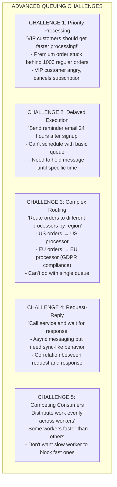
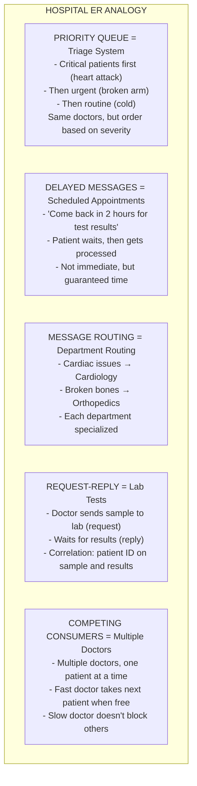

# 📨 Message Queue Patterns

---

## 0️⃣ Prerequisites

Before diving into message queue patterns, you should understand:

- **Queue vs Pub/Sub** (Topic 1): Fundamental messaging patterns.
- **Message Delivery** (Topic 2): Delivery guarantees and acknowledgments.
- **Other Messaging Systems** (Topic 6): RabbitMQ, SQS, Redis for context.

**Quick refresher on queues**: A message queue is a buffer that stores messages until consumers process them. Unlike pub/sub where messages go to all subscribers, a queue message is processed by exactly one consumer. This makes queues ideal for work distribution and task processing.

---

## 1️⃣ What Problem Does This Exist to Solve?

### The Specific Pain Points

Basic queuing works, but real applications need more sophisticated patterns:



### Real Examples of the Problems

**Uber**: Premium rides need priority processing during surge. Regular rides can wait slightly longer.

**Shopify**: Send abandoned cart emails exactly 1 hour after cart abandonment, not immediately.

**Stripe**: Route payment processing to region-specific processors for compliance.

**Slack**: Request-reply pattern for real-time message delivery confirmation.

---

## 2️⃣ Intuition and Mental Model

### The Hospital Emergency Room Analogy

Think of message queue patterns like an emergency room:



---

## 3️⃣ How It Works Internally

### Pattern 1: Priority Queues

Priority queues process high-priority messages before low-priority ones.

```
┌─────────────────────────────────────────────────────────────┐
│              PRIORITY QUEUE IMPLEMENTATIONS                  │
│                                                              │
│   APPROACH 1: Multiple Queues                               │
│   ┌─────────────────────────────────────────────────────┐   │
│   │ HIGH priority queue:    [M5] [M8]                   │   │
│   │ MEDIUM priority queue:  [M2] [M4] [M7]              │   │
│   │ LOW priority queue:     [M1] [M3] [M6] [M9]         │   │
│   └─────────────────────────────────────────────────────┘   │
│                                                              │
│   Consumer logic:                                            │
│   1. Check HIGH queue, process if not empty                 │
│   2. Else check MEDIUM queue                                │
│   3. Else check LOW queue                                   │
│                                                              │
│   Pros: Simple, clear priority                              │
│   Cons: Low priority can starve                             │
│                                                              │
│   ─────────────────────────────────────────────────────────  │
│   APPROACH 2: Weighted Round Robin                          │
│   ┌─────────────────────────────────────────────────────┐   │
│   │ Process 5 from HIGH, then 3 from MEDIUM, then 1 LOW │   │
│   │ Ratio: 5:3:1                                         │   │
│   └─────────────────────────────────────────────────────┘   │
│                                                              │
│   Pros: No starvation                                       │
│   Cons: More complex, less strict priority                  │
│                                                              │
│   ─────────────────────────────────────────────────────────  │
│   APPROACH 3: Single Queue with Priority Field              │
│   ┌─────────────────────────────────────────────────────┐   │
│   │ Queue: [{msg: M1, priority: 3}, {msg: M2, priority: 1}] │
│   │ Consumer sorts by priority before processing        │   │
│   └─────────────────────────────────────────────────────┘   │
│                                                              │
│   Pros: Single queue to manage                              │
│   Cons: Sorting overhead, not true priority queue           │
│                                                              │
└─────────────────────────────────────────────────────────────┘
```

**RabbitMQ Priority Queue:**

```
┌─────────────────────────────────────────────────────────────┐
│              RABBITMQ PRIORITY QUEUE                         │
│                                                              │
│   Queue declaration with max priority:                      │
│   x-max-priority: 10  (priorities 0-10)                     │
│                                                              │
│   Internal structure:                                        │
│   ┌─────────────────────────────────────────────────────┐   │
│   │ Priority 10: [M5]                                    │   │
│   │ Priority 9:  []                                      │   │
│   │ Priority 8:  [M8, M12]                              │   │
│   │ ...                                                  │   │
│   │ Priority 1:  [M1, M3, M6, M9]                       │   │
│   │ Priority 0:  [M2, M4]                               │   │
│   └─────────────────────────────────────────────────────┘   │
│                                                              │
│   Delivery: Always from highest non-empty priority          │
│                                                              │
│   Note: Higher priority = more memory overhead              │
│   Recommendation: Use 1-5 levels, not 0-255                 │
│                                                              │
└─────────────────────────────────────────────────────────────┘
```

### Pattern 2: Delayed Messages

Delayed messages are held until a specified time before delivery.

```
┌─────────────────────────────────────────────────────────────┐
│              DELAYED MESSAGE IMPLEMENTATIONS                 │
│                                                              │
│   APPROACH 1: Dead Letter Queue + TTL                       │
│   ┌─────────────────────────────────────────────────────┐   │
│   │                                                      │   │
│   │   Producer ──► Delay Queue (TTL=5min) ──► DLX ──►   │   │
│   │                                          │          │   │
│   │                                          ▼          │   │
│   │                                    Processing Queue │   │
│   │                                          │          │   │
│   │                                          ▼          │   │
│   │                                       Consumer      │   │
│   │                                                      │   │
│   │   Message expires from delay queue → goes to DLX    │   │
│   │   DLX routes to processing queue                    │   │
│   └─────────────────────────────────────────────────────┘   │
│                                                              │
│   Limitation: All messages have same delay                  │
│                                                              │
│   ─────────────────────────────────────────────────────────  │
│   APPROACH 2: Multiple Delay Queues                         │
│   ┌─────────────────────────────────────────────────────┐   │
│   │ delay-1min queue  (TTL=1min)  ──► DLX ──► process   │   │
│   │ delay-5min queue  (TTL=5min)  ──► DLX ──► process   │   │
│   │ delay-1hour queue (TTL=1hour) ──► DLX ──► process   │   │
│   │ delay-1day queue  (TTL=1day)  ──► DLX ──► process   │   │
│   └─────────────────────────────────────────────────────┘   │
│                                                              │
│   Producer chooses queue based on desired delay             │
│                                                              │
│   ─────────────────────────────────────────────────────────  │
│   APPROACH 3: Plugin/Native Support                         │
│   ┌─────────────────────────────────────────────────────┐   │
│   │ RabbitMQ: rabbitmq-delayed-message-exchange plugin  │   │
│   │ AWS SQS: DelaySeconds parameter (up to 15 min)      │   │
│   │ Redis: ZADD with score = delivery timestamp         │   │
│   └─────────────────────────────────────────────────────┘   │
│                                                              │
└─────────────────────────────────────────────────────────────┘
```

**Redis-Based Delay Queue:**

```
┌─────────────────────────────────────────────────────────────┐
│              REDIS SORTED SET DELAY QUEUE                    │
│                                                              │
│   Structure: Sorted set with score = delivery timestamp     │
│                                                              │
│   ZADD delay_queue 1705312200 "message1"                    │
│   ZADD delay_queue 1705312500 "message2"                    │
│   ZADD delay_queue 1705313000 "message3"                    │
│                                                              │
│   Sorted by score (timestamp):                              │
│   ┌─────────────────────────────────────────────────────┐   │
│   │ Score (timestamp) │ Message                         │   │
│   │ 1705312200        │ message1  ← earliest           │   │
│   │ 1705312500        │ message2                        │   │
│   │ 1705313000        │ message3  ← latest             │   │
│   └─────────────────────────────────────────────────────┘   │
│                                                              │
│   Consumer:                                                  │
│   1. ZRANGEBYSCORE delay_queue 0 {current_time} LIMIT 0 10 │
│   2. Process returned messages                              │
│   3. ZREM delay_queue {processed_messages}                  │
│                                                              │
│   Pros: Flexible delays, efficient                          │
│   Cons: Need polling, not push-based                        │
│                                                              │
└─────────────────────────────────────────────────────────────┘
```

### Pattern 3: Message Routing

Message routing directs messages to different queues based on content or metadata.

```
┌─────────────────────────────────────────────────────────────┐
│              RABBITMQ EXCHANGE ROUTING                       │
│                                                              │
│   DIRECT EXCHANGE: Route by exact routing key               │
│   ┌─────────────────────────────────────────────────────┐   │
│   │                                                      │   │
│   │   Producer: routing_key="order.us"                  │   │
│   │                    │                                 │   │
│   │                    ▼                                 │   │
│   │            ┌──────────────┐                         │   │
│   │            │    Direct    │                         │   │
│   │            │   Exchange   │                         │   │
│   │            └──────────────┘                         │   │
│   │               /       \                             │   │
│   │   "order.us" /         \ "order.eu"                │   │
│   │             ▼           ▼                           │   │
│   │      ┌─────────┐   ┌─────────┐                     │   │
│   │      │ US Queue│   │ EU Queue│                     │   │
│   │      └─────────┘   └─────────┘                     │   │
│   │                                                      │   │
│   └─────────────────────────────────────────────────────┘   │
│                                                              │
│   TOPIC EXCHANGE: Route by pattern matching                 │
│   ┌─────────────────────────────────────────────────────┐   │
│   │                                                      │   │
│   │   Routing key: "order.us.premium"                   │   │
│   │                                                      │   │
│   │   Bindings:                                          │   │
│   │   - "order.us.*"    → US Queue (matches!)           │   │
│   │   - "order.*.premium" → Premium Queue (matches!)    │   │
│   │   - "order.eu.*"    → EU Queue (no match)          │   │
│   │                                                      │   │
│   │   * = exactly one word                              │   │
│   │   # = zero or more words                            │   │
│   │                                                      │   │
│   └─────────────────────────────────────────────────────┘   │
│                                                              │
│   HEADERS EXCHANGE: Route by message headers                │
│   ┌─────────────────────────────────────────────────────┐   │
│   │                                                      │   │
│   │   Message headers: {region: "us", type: "premium"}  │   │
│   │                                                      │   │
│   │   Binding: x-match=all, region=us, type=premium     │   │
│   │   → Only matches if ALL headers match               │   │
│   │                                                      │   │
│   │   Binding: x-match=any, region=us                   │   │
│   │   → Matches if ANY header matches                   │   │
│   │                                                      │   │
│   └─────────────────────────────────────────────────────┘   │
│                                                              │
└─────────────────────────────────────────────────────────────┘
```

### Pattern 4: Request-Reply

Request-reply enables synchronous-style communication over async messaging.

```
┌─────────────────────────────────────────────────────────────┐
│              REQUEST-REPLY PATTERN                           │
│                                                              │
│   ┌─────────────────────────────────────────────────────┐   │
│   │                                                      │   │
│   │   Client                          Server            │   │
│   │     │                                │              │   │
│   │     │ 1. Send request               │              │   │
│   │     │    correlation_id: "req-123"  │              │   │
│   │     │    reply_to: "client-queue"   │              │   │
│   │     │ ──────────────────────────────►              │   │
│   │     │         Request Queue         │              │   │
│   │     │                               │              │   │
│   │     │                               │ 2. Process   │   │
│   │     │                               │              │   │
│   │     │ 3. Receive reply              │              │   │
│   │     │    correlation_id: "req-123"  │              │   │
│   │     │ ◄──────────────────────────────              │   │
│   │     │         Reply Queue           │              │   │
│   │     │                               │              │   │
│   │                                                      │   │
│   └─────────────────────────────────────────────────────┘   │
│                                                              │
│   Key elements:                                              │
│   - correlation_id: Links request to response               │
│   - reply_to: Where to send the response                    │
│   - timeout: Don't wait forever                             │
│                                                              │
│   Variations:                                                │
│   - Temporary reply queue (per request)                     │
│   - Shared reply queue (filter by correlation_id)           │
│   - Direct reply-to (RabbitMQ optimization)                 │
│                                                              │
└─────────────────────────────────────────────────────────────┘
```

### Pattern 5: Competing Consumers

Multiple consumers process from the same queue, distributing work.

```
┌─────────────────────────────────────────────────────────────┐
│              COMPETING CONSUMERS                             │
│                                                              │
│   ┌─────────────────────────────────────────────────────┐   │
│   │                                                      │   │
│   │   Queue: [M1] [M2] [M3] [M4] [M5] [M6]              │   │
│   │            │    │    │    │    │    │               │   │
│   │            └────┼────┼────┴────┼────┘               │   │
│   │                 │    │         │                    │   │
│   │                 ▼    ▼         ▼                    │   │
│   │            ┌─────┐ ┌─────┐ ┌─────┐                 │   │
│   │            │ C1  │ │ C2  │ │ C3  │                 │   │
│   │            └─────┘ └─────┘ └─────┘                 │   │
│   │                                                      │   │
│   │   Each message processed by exactly ONE consumer    │   │
│   │                                                      │   │
│   └─────────────────────────────────────────────────────┘   │
│                                                              │
│   PREFETCH (QoS):                                           │
│   ┌─────────────────────────────────────────────────────┐   │
│   │                                                      │   │
│   │   prefetch=1: Consumer gets 1 message at a time     │   │
│   │   - Fair distribution                               │   │
│   │   - Fast consumer gets more messages                │   │
│   │   - Slower throughput (more round trips)            │   │
│   │                                                      │   │
│   │   prefetch=10: Consumer gets 10 messages at a time  │   │
│   │   - Higher throughput (batching)                    │   │
│   │   - Uneven distribution possible                    │   │
│   │   - Messages stuck if consumer crashes              │   │
│   │                                                      │   │
│   │   Recommendation: Start with prefetch=1, tune up    │   │
│   │                                                      │   │
│   └─────────────────────────────────────────────────────┘   │
│                                                              │
└─────────────────────────────────────────────────────────────┘
```

### Pattern 6: Topic vs Queue Semantics

```
┌─────────────────────────────────────────────────────────────┐
│              TOPIC vs QUEUE SEMANTICS                        │
│                                                              │
│   QUEUE SEMANTICS:                                           │
│   - Message delivered to ONE consumer                       │
│   - Load balancing / work distribution                      │
│   - Message removed after processing                        │
│   - Example: Task processing, job queues                    │
│                                                              │
│   ┌─────────┐     ┌─────────┐                              │
│   │ Producer│────►│  Queue  │────► ONE Consumer            │
│   └─────────┘     └─────────┘                              │
│                                                              │
│   ─────────────────────────────────────────────────────────  │
│   TOPIC SEMANTICS:                                           │
│   - Message delivered to ALL subscribers                    │
│   - Broadcast / fan-out                                     │
│   - Each subscriber gets a copy                             │
│   - Example: Events, notifications                          │
│                                                              │
│   ┌─────────┐     ┌─────────┐     ┌──────────┐             │
│   │ Producer│────►│  Topic  │────►│Subscriber1│            │
│   └─────────┘     └─────────┘────►│Subscriber2│            │
│                                ───►│Subscriber3│            │
│                                    └──────────┘             │
│                                                              │
│   ─────────────────────────────────────────────────────────  │
│   HYBRID (Kafka Consumer Groups):                           │
│   - Topic semantics between groups                          │
│   - Queue semantics within a group                          │
│                                                              │
│   Group A: Consumer1, Consumer2 (share partitions)          │
│   Group B: Consumer3, Consumer4 (share partitions)          │
│   Both groups get all messages, but within group, shared    │
│                                                              │
└─────────────────────────────────────────────────────────────┘
```

---

## 4️⃣ Simulation-First Explanation

Let's trace through a priority queue scenario.

### Scenario: E-commerce Order Processing with Priorities

**Setup:**
- Three priority levels: HIGH (premium customers), MEDIUM (regular), LOW (batch)
- Three worker processes
- Weighted processing: 5 HIGH, 3 MEDIUM, 1 LOW per cycle

### Order Flow

```
┌─────────────────────────────────────────────────────────────┐
│              ORDER PROCESSING SIMULATION                     │
│                                                              │
│   Time 0ms: Orders arrive                                   │
│   HIGH queue:   [O1-premium] [O5-premium]                   │
│   MEDIUM queue: [O2-regular] [O3-regular] [O6-regular]      │
│   LOW queue:    [O4-batch] [O7-batch] [O8-batch] [O9-batch] │
│                                                              │
│   Time 10ms: Worker 1 checks queues                         │
│   - HIGH not empty → takes O1-premium                       │
│   - Processes O1 (50ms)                                     │
│                                                              │
│   Time 20ms: Worker 2 checks queues                         │
│   - HIGH not empty → takes O5-premium                       │
│   - Processes O5 (50ms)                                     │
│                                                              │
│   Time 30ms: Worker 3 checks queues                         │
│   - HIGH empty now                                          │
│   - MEDIUM not empty → takes O2-regular                     │
│   - Processes O2 (50ms)                                     │
│                                                              │
│   Time 60ms: Worker 1 finishes O1                           │
│   - HIGH empty, MEDIUM not empty                            │
│   - Takes O3-regular                                        │
│                                                              │
│   Result: Premium orders processed first!                   │
│   O1, O5 done before O2, O3, O4...                         │
│                                                              │
└─────────────────────────────────────────────────────────────┘
```

### Delayed Message Flow

```
┌─────────────────────────────────────────────────────────────┐
│              DELAYED MESSAGE SIMULATION                      │
│                                                              │
│   Scenario: Send reminder email 1 hour after signup         │
│                                                              │
│   Time 10:00:00 - User signs up                             │
│   - System creates delayed message:                         │
│     {type: "reminder", userId: "U123", delay: 3600s}        │
│   - Message added to delay queue with TTL=3600s             │
│                                                              │
│   Time 10:00:00 - 10:59:59                                  │
│   - Message sits in delay queue                             │
│   - User might complete profile, no reminder needed         │
│                                                              │
│   Time 10:30:00 - User completes profile                    │
│   - System cancels reminder (removes from delay queue)      │
│   - No email sent                                           │
│                                                              │
│   OR                                                         │
│                                                              │
│   Time 11:00:00 - User hasn't completed profile             │
│   - Message TTL expires                                     │
│   - Message moves to processing queue via DLX               │
│   - Worker picks up message                                 │
│   - Sends reminder email to U123                            │
│                                                              │
└─────────────────────────────────────────────────────────────┘
```

---

## 5️⃣ How Engineers Actually Use This in Production

### Uber's Priority Processing

Uber uses priority queues for:
- UberX vs UberBlack (premium gets priority matching)
- Surge pricing calculations (high-demand areas first)
- Payment processing (failed payments retry with lower priority)

### Shopify's Delayed Messages

Shopify uses delayed messages for:
- Abandoned cart emails (1 hour delay)
- Order confirmation retries (exponential backoff)
- Scheduled sales (start at specific time)

### Stripe's Message Routing

Stripe routes payments by:
- Region (US, EU, APAC processors)
- Payment method (card, bank transfer, crypto)
- Risk level (high-risk to manual review queue)

### Slack's Request-Reply

Slack uses request-reply for:
- Real-time message delivery confirmation
- User presence updates
- File upload completion notifications

---

## 6️⃣ How to Implement or Apply It

### RabbitMQ Priority Queue

```java
package com.systemdesign.queue.priority;

import com.rabbitmq.client.*;

import java.io.IOException;
import java.util.HashMap;
import java.util.Map;

/**
 * RabbitMQ priority queue implementation.
 */
public class PriorityQueueExample {
    
    private static final String QUEUE_NAME = "priority_orders";
    private static final int MAX_PRIORITY = 10;
    
    /**
     * Declare a priority queue.
     */
    public static void declareQueue(Channel channel) throws IOException {
        Map<String, Object> args = new HashMap<>();
        args.put("x-max-priority", MAX_PRIORITY);
        
        channel.queueDeclare(
            QUEUE_NAME,
            true,   // durable
            false,  // not exclusive
            false,  // no auto-delete
            args    // priority argument
        );
    }
    
    /**
     * Publish message with priority.
     */
    public static void publishWithPriority(Channel channel, String message, int priority) 
            throws IOException {
        AMQP.BasicProperties props = new AMQP.BasicProperties.Builder()
            .priority(priority)
            .deliveryMode(2)  // persistent
            .build();
        
        channel.basicPublish("", QUEUE_NAME, props, message.getBytes());
        System.out.println("Sent with priority " + priority + ": " + message);
    }
    
    /**
     * Consumer that processes by priority.
     */
    public static void startConsumer(Channel channel) throws IOException {
        // Set prefetch to 1 for fair priority processing
        channel.basicQos(1);
        
        DeliverCallback deliverCallback = (consumerTag, delivery) -> {
            String message = new String(delivery.getBody());
            int priority = delivery.getProperties().getPriority();
            
            System.out.println("Processing priority " + priority + ": " + message);
            
            // Simulate processing
            try {
                Thread.sleep(100);
            } catch (InterruptedException e) {
                Thread.currentThread().interrupt();
            }
            
            channel.basicAck(delivery.getEnvelope().getDeliveryTag(), false);
        };
        
        channel.basicConsume(QUEUE_NAME, false, deliverCallback, consumerTag -> {});
    }
    
    public static void main(String[] args) throws Exception {
        ConnectionFactory factory = new ConnectionFactory();
        factory.setHost("localhost");
        
        try (Connection connection = factory.newConnection();
             Channel channel = connection.createChannel()) {
            
            declareQueue(channel);
            
            // Publish messages with different priorities
            publishWithPriority(channel, "Low priority order", 1);
            publishWithPriority(channel, "Medium priority order", 5);
            publishWithPriority(channel, "HIGH PRIORITY VIP ORDER", 10);
            publishWithPriority(channel, "Another low priority", 1);
            publishWithPriority(channel, "Another HIGH PRIORITY", 10);
            
            // Start consumer - will process HIGH first
            startConsumer(channel);
            
            Thread.sleep(5000);
        }
    }
}
```

### Delayed Message with Redis

```java
package com.systemdesign.queue.delayed;

import redis.clients.jedis.Jedis;
import redis.clients.jedis.resps.Tuple;

import java.util.List;
import java.util.UUID;
import java.util.concurrent.Executors;
import java.util.concurrent.ScheduledExecutorService;
import java.util.concurrent.TimeUnit;

/**
 * Delayed message queue using Redis sorted sets.
 */
public class RedisDelayedQueue {
    
    private static final String DELAY_QUEUE = "delayed_messages";
    private final Jedis jedis;
    private final ScheduledExecutorService scheduler;
    private final MessageProcessor processor;
    
    public RedisDelayedQueue(Jedis jedis, MessageProcessor processor) {
        this.jedis = jedis;
        this.processor = processor;
        this.scheduler = Executors.newSingleThreadScheduledExecutor();
    }
    
    /**
     * Schedule a message for future delivery.
     * 
     * @param message The message content
     * @param delaySeconds Seconds to delay
     * @return Message ID
     */
    public String scheduleMessage(String message, long delaySeconds) {
        String messageId = UUID.randomUUID().toString();
        long deliveryTime = System.currentTimeMillis() / 1000 + delaySeconds;
        
        // Store message with delivery timestamp as score
        String payload = messageId + ":" + message;
        jedis.zadd(DELAY_QUEUE, deliveryTime, payload);
        
        System.out.println("Scheduled message " + messageId + 
            " for delivery in " + delaySeconds + " seconds");
        
        return messageId;
    }
    
    /**
     * Cancel a scheduled message.
     */
    public boolean cancelMessage(String messageId) {
        // Find and remove message by ID prefix
        List<String> messages = jedis.zrange(DELAY_QUEUE, 0, -1);
        for (String msg : messages) {
            if (msg.startsWith(messageId + ":")) {
                jedis.zrem(DELAY_QUEUE, msg);
                System.out.println("Cancelled message: " + messageId);
                return true;
            }
        }
        return false;
    }
    
    /**
     * Start the delayed message processor.
     */
    public void startProcessor() {
        scheduler.scheduleAtFixedRate(this::processReadyMessages, 0, 1, TimeUnit.SECONDS);
    }
    
    private void processReadyMessages() {
        long now = System.currentTimeMillis() / 1000;
        
        // Get messages ready for delivery (score <= now)
        List<Tuple> ready = jedis.zrangeByScoreWithScores(DELAY_QUEUE, 0, now);
        
        for (Tuple tuple : ready) {
            String payload = tuple.getElement();
            
            // Remove from queue
            long removed = jedis.zrem(DELAY_QUEUE, payload);
            
            if (removed > 0) {
                // Extract message content
                String[] parts = payload.split(":", 2);
                String messageId = parts[0];
                String message = parts[1];
                
                // Process the message
                try {
                    processor.process(messageId, message);
                } catch (Exception e) {
                    System.err.println("Failed to process: " + e.getMessage());
                    // Could re-queue with backoff
                }
            }
        }
    }
    
    public void stop() {
        scheduler.shutdown();
    }
    
    @FunctionalInterface
    public interface MessageProcessor {
        void process(String messageId, String message);
    }
    
    public static void main(String[] args) throws InterruptedException {
        Jedis jedis = new Jedis("localhost", 6379);
        
        RedisDelayedQueue queue = new RedisDelayedQueue(jedis, (id, msg) -> {
            System.out.println("Processing message " + id + ": " + msg);
        });
        
        // Schedule messages
        queue.scheduleMessage("Send welcome email", 5);
        queue.scheduleMessage("Send reminder", 10);
        String cancelId = queue.scheduleMessage("This will be cancelled", 15);
        
        // Start processor
        queue.startProcessor();
        
        // Cancel one message
        Thread.sleep(3000);
        queue.cancelMessage(cancelId);
        
        // Wait for messages to be processed
        Thread.sleep(15000);
        queue.stop();
    }
}
```

### Request-Reply Pattern

```java
package com.systemdesign.queue.requestreply;

import com.rabbitmq.client.*;

import java.io.IOException;
import java.util.UUID;
import java.util.concurrent.*;

/**
 * Request-Reply pattern implementation.
 */
public class RequestReplyClient implements AutoCloseable {
    
    private final Connection connection;
    private final Channel channel;
    private final String requestQueue;
    private final String replyQueue;
    private final ConcurrentMap<String, CompletableFuture<String>> pendingRequests;
    
    public RequestReplyClient(String host, String requestQueue) throws Exception {
        ConnectionFactory factory = new ConnectionFactory();
        factory.setHost(host);
        
        this.connection = factory.newConnection();
        this.channel = connection.createChannel();
        this.requestQueue = requestQueue;
        this.pendingRequests = new ConcurrentHashMap<>();
        
        // Declare exclusive reply queue
        this.replyQueue = channel.queueDeclare().getQueue();
        
        // Start listening for replies
        startReplyConsumer();
    }
    
    private void startReplyConsumer() throws IOException {
        DeliverCallback deliverCallback = (consumerTag, delivery) -> {
            String correlationId = delivery.getProperties().getCorrelationId();
            String response = new String(delivery.getBody());
            
            CompletableFuture<String> future = pendingRequests.remove(correlationId);
            if (future != null) {
                future.complete(response);
            }
        };
        
        channel.basicConsume(replyQueue, true, deliverCallback, consumerTag -> {});
    }
    
    /**
     * Send request and wait for reply.
     */
    public String call(String message, long timeoutMs) 
            throws IOException, TimeoutException, InterruptedException, ExecutionException {
        
        String correlationId = UUID.randomUUID().toString();
        CompletableFuture<String> future = new CompletableFuture<>();
        pendingRequests.put(correlationId, future);
        
        AMQP.BasicProperties props = new AMQP.BasicProperties.Builder()
            .correlationId(correlationId)
            .replyTo(replyQueue)
            .build();
        
        channel.basicPublish("", requestQueue, props, message.getBytes());
        
        try {
            return future.get(timeoutMs, TimeUnit.MILLISECONDS);
        } catch (TimeoutException e) {
            pendingRequests.remove(correlationId);
            throw e;
        }
    }
    
    @Override
    public void close() throws Exception {
        channel.close();
        connection.close();
    }
}

/**
 * Request-Reply server.
 */
public class RequestReplyServer {
    
    private final Channel channel;
    private final String requestQueue;
    
    public RequestReplyServer(String host, String requestQueue) throws Exception {
        ConnectionFactory factory = new ConnectionFactory();
        factory.setHost(host);
        
        Connection connection = factory.newConnection();
        this.channel = connection.createChannel();
        this.requestQueue = requestQueue;
        
        channel.queueDeclare(requestQueue, false, false, false, null);
        channel.basicQos(1);
    }
    
    public void start() throws IOException {
        DeliverCallback deliverCallback = (consumerTag, delivery) -> {
            String message = new String(delivery.getBody());
            String correlationId = delivery.getProperties().getCorrelationId();
            String replyTo = delivery.getProperties().getReplyTo();
            
            System.out.println("Received request: " + message);
            
            // Process request
            String response = processRequest(message);
            
            // Send reply
            AMQP.BasicProperties replyProps = new AMQP.BasicProperties.Builder()
                .correlationId(correlationId)
                .build();
            
            channel.basicPublish("", replyTo, replyProps, response.getBytes());
            channel.basicAck(delivery.getEnvelope().getDeliveryTag(), false);
            
            System.out.println("Sent response: " + response);
        };
        
        channel.basicConsume(requestQueue, false, deliverCallback, consumerTag -> {});
        System.out.println("Server started, waiting for requests...");
    }
    
    private String processRequest(String request) {
        // Simulate processing
        return "Processed: " + request.toUpperCase();
    }
}
```

### Multiple Priority Queues with Spring

```java
package com.systemdesign.queue.priority;

import org.springframework.amqp.core.*;
import org.springframework.amqp.rabbit.annotation.RabbitListener;
import org.springframework.amqp.rabbit.core.RabbitTemplate;
import org.springframework.context.annotation.Bean;
import org.springframework.context.annotation.Configuration;
import org.springframework.stereotype.Service;

/**
 * Multi-queue priority implementation with Spring AMQP.
 */
@Configuration
public class MultiPriorityQueueConfig {
    
    @Bean
    public Queue highPriorityQueue() {
        return new Queue("orders.high", true);
    }
    
    @Bean
    public Queue mediumPriorityQueue() {
        return new Queue("orders.medium", true);
    }
    
    @Bean
    public Queue lowPriorityQueue() {
        return new Queue("orders.low", true);
    }
}

@Service
public class PriorityOrderService {
    
    private final RabbitTemplate rabbitTemplate;
    
    public PriorityOrderService(RabbitTemplate rabbitTemplate) {
        this.rabbitTemplate = rabbitTemplate;
    }
    
    public void submitOrder(Order order) {
        String queue = switch (order.getPriority()) {
            case HIGH -> "orders.high";
            case MEDIUM -> "orders.medium";
            case LOW -> "orders.low";
        };
        
        rabbitTemplate.convertAndSend(queue, order);
    }
}

@Service
public class PriorityOrderConsumer {
    
    /**
     * Weighted consumption: Check high first, then medium, then low.
     * Using separate listeners with different concurrency.
     */
    @RabbitListener(queues = "orders.high", concurrency = "5")
    public void processHighPriority(Order order) {
        System.out.println("[HIGH] Processing: " + order.getId());
        processOrder(order);
    }
    
    @RabbitListener(queues = "orders.medium", concurrency = "3")
    public void processMediumPriority(Order order) {
        System.out.println("[MEDIUM] Processing: " + order.getId());
        processOrder(order);
    }
    
    @RabbitListener(queues = "orders.low", concurrency = "1")
    public void processLowPriority(Order order) {
        System.out.println("[LOW] Processing: " + order.getId());
        processOrder(order);
    }
    
    private void processOrder(Order order) {
        // Business logic
    }
}
```

---

## 7️⃣ Tradeoffs, Pitfalls, and Common Mistakes

### Common Mistakes

#### 1. Priority Starvation

**Problem:**
```
HIGH queue always has messages
LOW queue never processed
Low priority customers never served
```

**Solution:**
```
Weighted round-robin:
- Process 5 HIGH, then 3 MEDIUM, then 1 LOW
- Guarantees all priorities eventually processed
- Or: Time-based priority boost (old LOW becomes MEDIUM)
```

#### 2. Delayed Message Clock Skew

**Problem:**
```
Server 1: time = 10:00:00
Server 2: time = 10:00:05

Message scheduled for 10:00:03
- Server 1: Not ready yet
- Server 2: Ready! Processes early
```

**Solution:**
```
- Use NTP to sync clocks
- Or: Use central time source (Redis server time)
- Or: Accept small variance as acceptable
```

#### 3. Request-Reply Timeout Handling

**Problem:**
```
Client sends request, waits 30 seconds
Server processes in 35 seconds
Client times out, retries
Server sends reply to dead correlation ID
```

**Solution:**
```
- Set appropriate timeouts
- Implement idempotency on server
- Consider circuit breaker for failing services
- Log orphaned replies for debugging
```

### Pattern Selection Guide

| Need | Pattern | When to Use |
|------|---------|-------------|
| VIP processing | Priority Queue | Clear priority levels |
| Scheduled tasks | Delayed Messages | Future execution |
| Content-based routing | Message Routing | Different processors |
| Sync over async | Request-Reply | Need response |
| Work distribution | Competing Consumers | Parallel processing |

---

## 8️⃣ When NOT to Use This

### When Simpler Patterns Suffice

1. **Priority Queue**: If all messages are equal priority, use simple queue
2. **Delayed Messages**: If immediate processing is fine, skip complexity
3. **Message Routing**: If one processor handles all, no routing needed
4. **Request-Reply**: If fire-and-forget works, don't add correlation

### Anti-Patterns

| Pattern | Anti-Pattern | Better Alternative |
|---------|--------------|-------------------|
| Priority | 100 priority levels | 3-5 levels max |
| Delayed | Polling every 10ms | Event-driven with TTL |
| Routing | Routing logic in consumer | Exchange-based routing |
| Request-Reply | Sync call for async work | Fire-and-forget + webhook |

---

## 9️⃣ Comparison with Alternatives

### Priority Implementation Comparison

| Approach | Pros | Cons | Best For |
|----------|------|------|----------|
| Multiple queues | Simple, clear | More queues to manage | Few priority levels |
| Native priority | Single queue | Memory overhead | Many priorities |
| Weighted RR | No starvation | Complex logic | Fair processing |

### Delayed Message Comparison

| Approach | Pros | Cons | Best For |
|----------|------|------|----------|
| DLQ + TTL | Native RabbitMQ | Fixed delays | Simple delays |
| Redis sorted set | Flexible delays | Polling needed | Variable delays |
| Database + scheduler | Persistent | More components | Long delays |

---

## 🔟 Interview Follow-Up Questions WITH Answers

### L4 (Entry-Level) Questions

**Q1: How would you implement a priority queue?**

**Answer:**
Two main approaches:

1. **Multiple queues** (simpler):
   - Create separate queues: high, medium, low
   - Consumer checks high first, then medium, then low
   - Easy to understand and implement

2. **Native priority queue** (RabbitMQ):
   - Single queue with x-max-priority setting
   - Messages include priority field
   - Broker handles ordering

I'd start with multiple queues for simplicity, then consider native priority if we need many priority levels.

**Q2: What is the request-reply pattern?**

**Answer:**
Request-reply enables synchronous-style communication over async messaging:

1. Client sends request with:
   - `correlation_id`: Unique ID for this request
   - `reply_to`: Queue where response should be sent

2. Server processes request and sends reply to `reply_to` queue with same `correlation_id`

3. Client matches reply to request using `correlation_id`

Use cases: RPC over messaging, service calls where you need the response.

### L5 (Senior) Questions

**Q3: How would you implement delayed messages without native support?**

**Answer:**
Several approaches:

1. **DLQ + TTL** (RabbitMQ):
   - Message goes to delay queue with TTL
   - When TTL expires, message moves to DLQ
   - DLQ routes to processing queue
   - Limitation: All messages same delay

2. **Redis sorted set** (flexible):
   - Score = delivery timestamp
   - Poll for messages where score <= now
   - Process and remove
   - Supports any delay duration

3. **Multiple delay queues**:
   - delay-1min, delay-5min, delay-1hour
   - Producer chooses appropriate queue
   - Good for discrete delay options

For production, I'd use Redis sorted set for flexibility or RabbitMQ delayed message plugin if available.

**Q4: How do you prevent priority starvation?**

**Answer:**
Priority starvation happens when high-priority messages always exist, so low-priority never process.

Solutions:

1. **Weighted round-robin**:
   - Process 5 high, 3 medium, 1 low per cycle
   - Guarantees all levels get some processing

2. **Priority aging**:
   - Increase priority over time
   - Old low-priority becomes medium, then high
   - Eventually everything gets processed

3. **Reserved capacity**:
   - Dedicate some consumers to low priority only
   - High priority can't starve them

4. **Monitoring and alerting**:
   - Alert if low-priority queue grows too large
   - Manual intervention if needed

### L6 (Staff) Questions

**Q5: Design a message routing system for a multi-region payment processor.**

**Answer:**
Requirements:
- Route by region (US, EU, APAC)
- Route by payment method (card, bank, crypto)
- Route by risk level (low, medium, high)
- Handle failures gracefully

Architecture:

```
                    ┌─────────────────┐
Payment ──────────► │  Topic Exchange │
                    │  (payment.*)    │
                    └────────┬────────┘
                             │
        ┌────────────────────┼────────────────────┐
        │                    │                    │
        ▼                    ▼                    ▼
   ┌─────────┐         ┌─────────┐         ┌─────────┐
   │ US Queue│         │ EU Queue│         │APAC Queue│
   │payment. │         │payment. │         │payment. │
   │us.*     │         │eu.*     │         │apac.*   │
   └────┬────┘         └────┬────┘         └────┬────┘
        │                   │                   │
        ▼                   ▼                   ▼
   US Processor        EU Processor       APAC Processor
```

Key decisions:
- Topic exchange for pattern-based routing
- Routing key: `payment.{region}.{method}.{risk}`
- Each region has sub-routing for method and risk
- DLQ for failed payments
- Priority queue for high-value transactions

---

## 1️⃣1️⃣ One Clean Mental Summary

Message queue patterns extend basic queuing for real-world needs. **Priority queues** process important messages first using multiple queues or native priority support—watch for starvation. **Delayed messages** hold messages until a future time using TTL+DLQ or Redis sorted sets. **Message routing** directs messages to different queues based on content using exchange types (direct, topic, headers). **Request-reply** enables sync-style communication over async messaging using correlation IDs and reply-to queues. **Competing consumers** distribute work across multiple workers with prefetch controlling fairness. **Topic vs queue semantics**: queues deliver to one consumer (work distribution), topics deliver to all subscribers (broadcast). Choose patterns based on your specific needs—don't over-engineer simple use cases.

---

## Quick Reference Card

```
┌─────────────────────────────────────────────────────────────┐
│           MESSAGE QUEUE PATTERNS CHEAT SHEET                 │
├─────────────────────────────────────────────────────────────┤
│ PRIORITY QUEUE                                               │
│   Multiple queues: high, medium, low                        │
│   Native: x-max-priority setting                            │
│   Prevent starvation: weighted round-robin                  │
├─────────────────────────────────────────────────────────────┤
│ DELAYED MESSAGES                                             │
│   RabbitMQ: TTL + DLQ                                       │
│   Redis: Sorted set with score = delivery time              │
│   SQS: DelaySeconds (max 15 min)                            │
├─────────────────────────────────────────────────────────────┤
│ MESSAGE ROUTING                                              │
│   Direct: Exact routing key match                           │
│   Topic: Pattern matching (* = 1 word, # = 0+ words)        │
│   Headers: Match on message headers                         │
├─────────────────────────────────────────────────────────────┤
│ REQUEST-REPLY                                                │
│   correlation_id: Links request to response                 │
│   reply_to: Queue for response                              │
│   timeout: Don't wait forever                               │
├─────────────────────────────────────────────────────────────┤
│ COMPETING CONSUMERS                                          │
│   Multiple consumers on same queue                          │
│   prefetch=1: Fair distribution                             │
│   prefetch=N: Higher throughput, less fair                  │
├─────────────────────────────────────────────────────────────┤
│ TOPIC vs QUEUE                                               │
│   Queue: One consumer gets message (work distribution)      │
│   Topic: All subscribers get message (broadcast)            │
│   Kafka: Hybrid (queue within group, topic between groups)  │
└─────────────────────────────────────────────────────────────┘
```

