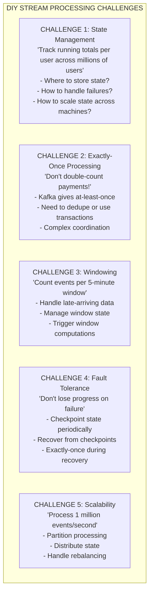
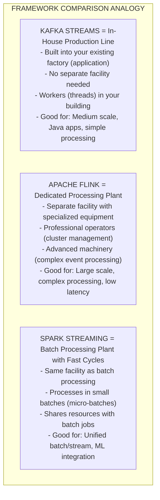
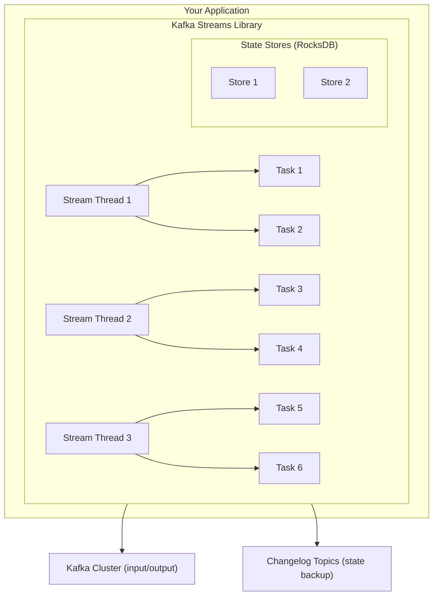
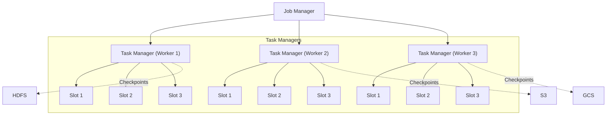
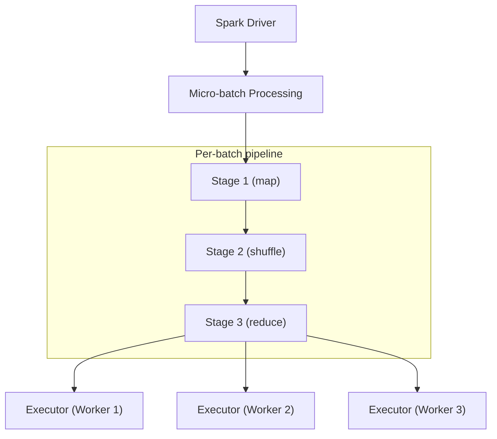
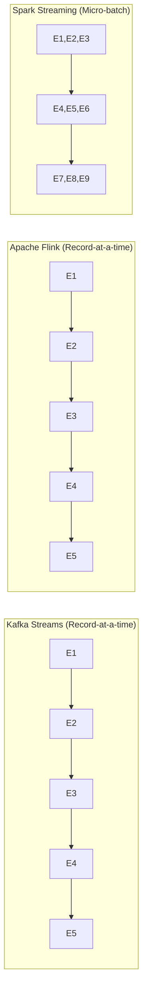

# 🌊 Stream Processing Frameworks

---

## 0️⃣ Prerequisites

Before diving into stream processing frameworks, you should understand:

- **Stream Processing** (Topic 8): Windowing, stateful processing, watermarks, backpressure.
- **Kafka Deep Dive** (Topic 5): Topics, partitions, consumer groups.
- **Message Delivery** (Topic 2): At-least-once, exactly-once semantics.

**Quick refresher on stream processing**: Stream processing handles unbounded, continuous data in real-time. Key concepts include windowing (grouping events by time), stateful processing (maintaining information across events), and exactly-once semantics (processing each event exactly once despite failures).

---

## 1️⃣ What Problem Does This Exist to Solve?

### The Specific Pain Point

Building stream processing from scratch is complex:



### Why Use a Framework?

Stream processing frameworks solve these challenges:

| Challenge | Framework Solution |
|-----------|-------------------|
| State management | Built-in state stores (RocksDB, in-memory) |
| Exactly-once | Transactional processing, checkpointing |
| Windowing | Window operators with late data handling |
| Fault tolerance | Automatic checkpointing and recovery |
| Scalability | Automatic partitioning and distribution |

### Real Examples

**LinkedIn**: Built Kafka Streams for their use cases, now open source.

**Uber**: Uses Apache Flink for real-time surge pricing and fraud detection.

**Netflix**: Uses Apache Flink for real-time analytics and recommendations.

**Alibaba**: Uses Apache Flink for Singles' Day processing (500K+ events/second).

---

## 2️⃣ Intuition and Mental Model

### The Factory Production Line Analogy



---

## 3️⃣ How It Works Internally

### Kafka Streams Architecture

Kafka Streams is a client library that runs inside your application.



<details>
<summary>ASCII diagram (reference)</summary>

```text
┌─────────────────────────────────────────────────────────────┐
│              KAFKA STREAMS ARCHITECTURE                      │
│                                                              │
│   ┌─────────────────────────────────────────────────────┐   │
│   │              YOUR APPLICATION                        │   │
│   │                                                      │   │
│   │   ┌─────────────────────────────────────────────┐   │   │
│   │   │           KAFKA STREAMS LIBRARY              │   │   │
│   │   │                                              │   │   │
│   │   │   ┌──────────┐  ┌──────────┐  ┌──────────┐  │   │   │
│   │   │   │ Stream   │  │ Stream   │  │ Stream   │  │   │   │
│   │   │   │ Thread 1 │  │ Thread 2 │  │ Thread 3 │  │   │   │
│   │   │   │          │  │          │  │          │  │   │   │
│   │   │   │ ┌──────┐ │  │ ┌──────┐ │  │ ┌──────┐ │  │   │   │
│   │   │   │ │Task 1│ │  │ │Task 3│ │  │ │Task 5│ │  │   │   │
│   │   │   │ │Task 2│ │  │ │Task 4│ │  │ │Task 6│ │  │   │   │
│   │   │   │ └──────┘ │  │ └──────┘ │  │ └──────┘ │  │   │   │
│   │   │   └──────────┘  └──────────┘  └──────────┘  │   │   │
│   │   │                                              │   │   │
│   │   │   State Stores (RocksDB)                    │   │   │
│   │   │   ┌──────────┐  ┌──────────┐               │   │   │
│   │   │   │ Store 1  │  │ Store 2  │               │   │   │
│   │   │   └──────────┘  └──────────┘               │   │   │
│   │   │                                              │   │   │
│   │   └─────────────────────────────────────────────┘   │   │
│   │                                                      │   │
│   └─────────────────────────────────────────────────────┘   │
│              │                              │                │
│              ▼                              ▼                │
│   ┌─────────────────────┐    ┌─────────────────────┐        │
│   │    Kafka Cluster    │    │   Changelog Topics  │        │
│   │   (input/output)    │    │   (state backup)    │        │
│   └─────────────────────┘    └─────────────────────┘        │
│                                                              │
│   Key characteristics:                                       │
│   - Library, not cluster (runs in your JVM)                 │
│   - Tasks = partitions (one task per partition)             │
│   - State stored locally + backed up to Kafka               │
│   - Scale by adding application instances                   │
│                                                              │
└─────────────────────────────────────────────────────────────┘
```
</details>

### Apache Flink Architecture

Flink is a distributed processing engine with its own cluster.



<details>
<summary>ASCII diagram (reference)</summary>

```text
┌─────────────────────────────────────────────────────────────┐
│              APACHE FLINK ARCHITECTURE                       │
│                                                              │
│   ┌─────────────────────────────────────────────────────┐   │
│   │                   JOB MANAGER                        │   │
│   │   (Master node - coordinates job execution)         │   │
│   │                                                      │   │
│   │   - Job scheduling                                  │   │
│   │   - Checkpoint coordination                         │   │
│   │   - Recovery management                             │   │
│   └─────────────────────────────────────────────────────┘   │
│              │                │                │             │
│              ▼                ▼                ▼             │
│   ┌──────────────┐  ┌──────────────┐  ┌──────────────┐     │
│   │ TASK MANAGER │  │ TASK MANAGER │  │ TASK MANAGER │     │
│   │  (Worker 1)  │  │  (Worker 2)  │  │  (Worker 3)  │     │
│   │              │  │              │  │              │     │
│   │ ┌──────────┐ │  │ ┌──────────┐ │  │ ┌──────────┐ │     │
│   │ │  Slot 1  │ │  │ │  Slot 1  │ │  │ │  Slot 1  │ │     │
│   │ │  Slot 2  │ │  │ │  Slot 2  │ │  │ │  Slot 2  │ │     │
│   │ │  Slot 3  │ │  │ │  Slot 3  │ │  │ │  Slot 3  │ │     │
│   │ └──────────┘ │  │ └──────────┘ │  │ └──────────┘ │     │
│   │              │  │              │  │              │     │
│   │ State (RocksDB) │ State (RocksDB) │ State (RocksDB) │  │
│   └──────────────┘  └──────────────┘  └──────────────┘     │
│                                                              │
│   Checkpoints stored in: HDFS, S3, GCS                      │
│                                                              │
│   Key characteristics:                                       │
│   - Distributed cluster (separate from application)         │
│   - True streaming (event-by-event, not micro-batch)        │
│   - Sophisticated state management                          │
│   - Advanced windowing and event time processing            │
│                                                              │
└─────────────────────────────────────────────────────────────┘
```
</details>

### Spark Streaming Architecture

Spark Streaming processes data in micro-batches.



<details>
<summary>ASCII diagram (reference)</summary>

```text
┌─────────────────────────────────────────────────────────────┐
│              SPARK STREAMING ARCHITECTURE                    │
│                                                              │
│   ┌─────────────────────────────────────────────────────┐   │
│   │                 SPARK DRIVER                         │   │
│   │   (Coordinates micro-batch execution)               │   │
│   └─────────────────────────────────────────────────────┘   │
│              │                                              │
│              ▼                                              │
│   ┌─────────────────────────────────────────────────────┐   │
│   │              MICRO-BATCH PROCESSING                  │   │
│   │                                                      │   │
│   │   Time: |--1s--|--1s--|--1s--|--1s--|               │   │
│   │         Batch1  Batch2  Batch3  Batch4              │   │
│   │                                                      │   │
│   │   Each batch processed as regular Spark job:        │   │
│   │   ┌─────────┐  ┌─────────┐  ┌─────────┐            │   │
│   │   │ Stage 1 │─►│ Stage 2 │─►│ Stage 3 │            │   │
│   │   │ (map)   │  │(shuffle)│  │(reduce) │            │   │
│   │   └─────────┘  └─────────┘  └─────────┘            │   │
│   │                                                      │   │
│   └─────────────────────────────────────────────────────┘   │
│              │                                              │
│              ▼                                              │
│   ┌──────────────┐  ┌──────────────┐  ┌──────────────┐     │
│   │   Executor   │  │   Executor   │  │   Executor   │     │
│   │  (Worker 1)  │  │  (Worker 2)  │  │  (Worker 3)  │     │
│   └──────────────┘  └──────────────┘  └──────────────┘     │
│                                                              │
│   Structured Streaming (newer):                             │
│   - Continuous processing mode (lower latency)              │
│   - Better exactly-once semantics                           │
│   - Unified batch and streaming API                         │
│                                                              │
│   Key characteristics:                                       │
│   - Micro-batch (not true streaming)                        │
│   - Reuses Spark infrastructure                             │
│   - Good for ML integration                                 │
│   - Higher latency than Flink                               │
│                                                              │
└─────────────────────────────────────────────────────────────┘
```
</details>

### Processing Model Comparison



<details>
<summary>ASCII diagram (reference)</summary>

```text
┌─────────────────────────────────────────────────────────────┐
│              PROCESSING MODEL COMPARISON                     │
│                                                              │
│   KAFKA STREAMS (Record-at-a-time):                         │
│   ───[E1]──[E2]──[E3]──[E4]──[E5]──►                       │
│        │    │    │    │    │                                │
│        ▼    ▼    ▼    ▼    ▼                                │
│   Process each event as it arrives                          │
│   Latency: Milliseconds                                     │
│                                                              │
│   ─────────────────────────────────────────────────────────  │
│   APACHE FLINK (Record-at-a-time):                          │
│   ───[E1]──[E2]──[E3]──[E4]──[E5]──►                       │
│        │    │    │    │    │                                │
│        ▼    ▼    ▼    ▼    ▼                                │
│   Process each event as it arrives                          │
│   Latency: Milliseconds (can be sub-millisecond)            │
│                                                              │
│   ─────────────────────────────────────────────────────────  │
│   SPARK STREAMING (Micro-batch):                            │
│   ───[E1,E2,E3]────[E4,E5,E6]────[E7,E8,E9]──►             │
│          │              │              │                    │
│          ▼              ▼              ▼                    │
│   Collect events, process as batch                          │
│   Latency: Seconds (batch interval)                         │
│                                                              │
└─────────────────────────────────────────────────────────────┘
```
</details>

---

## 4️⃣ Simulation-First Explanation

Let's trace the same use case through all three frameworks.

### Scenario: Real-Time Click Analytics

**Requirement:**
- Count clicks per URL in 5-minute windows
- Handle late-arriving data (up to 1 minute late)
- Output results to Kafka

### Kafka Streams Processing

```
┌─────────────────────────────────────────────────────────────┐
│              KAFKA STREAMS EXECUTION                         │
│                                                              │
│   Input: clicks topic (3 partitions)                        │
│                                                              │
│   Application Instance 1 (Tasks 0, 1):                      │
│   ┌─────────────────────────────────────────────────────┐   │
│   │ Event arrives: {url: "/home", time: 10:02:30}       │   │
│   │                                                      │   │
│   │ 1. Deserialize event                                │   │
│   │ 2. Extract key (url) and timestamp                  │   │
│   │ 3. Find window: [10:00-10:05]                       │   │
│   │ 4. Update state store:                              │   │
│   │    RocksDB: window_10:00_/home = 42 → 43            │   │
│   │ 5. Changelog: Write to kafka changelog topic        │   │
│   │                                                      │   │
│   │ Window closes at 10:06 (10:05 + 1min allowed late): │   │
│   │ 6. Emit: {url: "/home", window: "10:00-10:05",     │   │
│   │           count: 156}                               │   │
│   │ 7. Write to output topic                            │   │
│   └─────────────────────────────────────────────────────┘   │
│                                                              │
│   Application Instance 2 (Task 2):                          │
│   - Processes partition 2 independently                     │
│   - Same logic, different data                              │
│                                                              │
│   Scaling: Add more application instances                   │
│   Recovery: Restore from changelog topics                   │
│                                                              │
└─────────────────────────────────────────────────────────────┘
```

### Apache Flink Processing

```
┌─────────────────────────────────────────────────────────────┐
│              FLINK EXECUTION                                 │
│                                                              │
│   Job submitted to JobManager:                              │
│   ┌─────────────────────────────────────────────────────┐   │
│   │ 1. Parse job graph                                  │   │
│   │ 2. Create execution graph                           │   │
│   │ 3. Assign tasks to TaskManagers                     │   │
│   └─────────────────────────────────────────────────────┘   │
│                                                              │
│   TaskManager 1 processing:                                 │
│   ┌─────────────────────────────────────────────────────┐   │
│   │ Event arrives: {url: "/home", time: 10:02:30}       │   │
│   │                                                      │   │
│   │ 1. Source operator reads from Kafka                 │   │
│   │ 2. Watermark: "Events before 10:01:30 complete"     │   │
│   │ 3. Window operator:                                 │   │
│   │    - Assigns event to window [10:00-10:05]          │   │
│   │    - Updates keyed state: /home → 43                │   │
│   │ 4. Checkpoint triggered (async):                    │   │
│   │    - Snapshot state to S3                           │   │
│   │    - Barrier flows through pipeline                 │   │
│   │                                                      │   │
│   │ Watermark reaches 10:06:                            │   │
│   │ 5. Window [10:00-10:05] fires                       │   │
│   │ 6. Emit aggregated result                           │   │
│   │ 7. Sink writes to Kafka                             │   │
│   └─────────────────────────────────────────────────────┘   │
│                                                              │
│   Parallelism: Configurable per operator                    │
│   Recovery: Restore from last successful checkpoint         │
│                                                              │
└─────────────────────────────────────────────────────────────┘
```

### Spark Streaming Processing

```
┌─────────────────────────────────────────────────────────────┐
│              SPARK STRUCTURED STREAMING EXECUTION            │
│                                                              │
│   Micro-batch interval: 1 second                            │
│                                                              │
│   Batch at 10:02:31:                                        │
│   ┌─────────────────────────────────────────────────────┐   │
│   │ 1. Read all events from 10:02:30 to 10:02:31       │   │
│   │    Events: [{url: "/home"}, {url: "/about"}, ...]  │   │
│   │                                                      │   │
│   │ 2. Assign to windows based on event time            │   │
│   │    /home → window [10:00-10:05]                     │   │
│   │                                                      │   │
│   │ 3. Update state (in Spark's state store):           │   │
│   │    window_10:00_/home = 42 + 5 = 47                 │   │
│   │                                                      │   │
│   │ 4. Check watermark: 10:02:31 - 1min = 10:01:31     │   │
│   │    Window [10:00-10:05] not yet closeable          │   │
│   │                                                      │   │
│   │ 5. Checkpoint state                                 │   │
│   └─────────────────────────────────────────────────────┘   │
│                                                              │
│   Batch at 10:06:01:                                        │
│   ┌─────────────────────────────────────────────────────┐   │
│   │ 1. Watermark: 10:06:01 - 1min = 10:05:01           │   │
│   │ 2. Window [10:00-10:05] can close                   │   │
│   │ 3. Emit: {url: "/home", count: 156}                │   │
│   │ 4. Write to Kafka sink                              │   │
│   └─────────────────────────────────────────────────────┘   │
│                                                              │
│   Latency: ~batch interval (1 second in this case)          │
│   Recovery: From checkpoint (HDFS, S3)                      │
│                                                              │
└─────────────────────────────────────────────────────────────┘
```

---

## 5️⃣ How Engineers Actually Use This in Production

### LinkedIn (Kafka Streams)

LinkedIn uses Kafka Streams for:
- Real-time metrics aggregation
- Activity tracking
- Who viewed your profile

**Why Kafka Streams:**
- Already heavy Kafka users
- Simple deployment (just Java apps)
- No separate cluster to manage

### Uber (Apache Flink)

Uber uses Flink for:
- Surge pricing (real-time demand)
- Fraud detection
- Trip event processing

**Why Flink:**
- Sub-second latency required
- Complex event processing
- Exactly-once critical for payments

### Netflix (Apache Flink)

Netflix uses Flink for:
- Real-time recommendations
- A/B test analytics
- Viewing statistics

**Why Flink:**
- Scale (millions of events/second)
- Complex windowing
- Integration with data platform

### Airbnb (Spark Streaming)

Airbnb uses Spark Streaming for:
- Search ranking updates
- Price optimization
- ML feature computation

**Why Spark:**
- Unified batch and streaming
- ML integration (MLlib)
- Existing Spark expertise

---

## 6️⃣ How to Implement or Apply It

### Kafka Streams Implementation

```java
package com.systemdesign.streaming.kafkastreams;

import org.apache.kafka.common.serialization.Serdes;
import org.apache.kafka.streams.*;
import org.apache.kafka.streams.kstream.*;

import java.time.Duration;
import java.util.Properties;

/**
 * Kafka Streams click analytics.
 */
public class ClickAnalyticsKafkaStreams {
    
    public static void main(String[] args) {
        Properties props = new Properties();
        props.put(StreamsConfig.APPLICATION_ID_CONFIG, "click-analytics");
        props.put(StreamsConfig.BOOTSTRAP_SERVERS_CONFIG, "localhost:9092");
        props.put(StreamsConfig.DEFAULT_KEY_SERDE_CLASS_CONFIG, Serdes.String().getClass());
        props.put(StreamsConfig.DEFAULT_VALUE_SERDE_CLASS_CONFIG, Serdes.String().getClass());
        
        // Exactly-once processing
        props.put(StreamsConfig.PROCESSING_GUARANTEE_CONFIG, 
            StreamsConfig.EXACTLY_ONCE_V2);
        
        StreamsBuilder builder = new StreamsBuilder();
        
        // Read clicks from input topic
        KStream<String, ClickEvent> clicks = builder
            .stream("clicks", Consumed.with(
                Serdes.String(),
                new ClickEventSerde()
            ))
            .selectKey((k, v) -> v.getUrl());  // Key by URL
        
        // Count clicks per URL in 5-minute windows
        KTable<Windowed<String>, Long> clickCounts = clicks
            .groupByKey()
            .windowedBy(TimeWindows
                .ofSizeWithNoGrace(Duration.ofMinutes(5))
                .grace(Duration.ofMinutes(1)))  // Allow 1 min late
            .count(Materialized.as("click-counts"));
        
        // Output to results topic
        clickCounts
            .toStream()
            .map((windowedKey, count) -> KeyValue.pair(
                windowedKey.key(),
                new ClickCount(
                    windowedKey.key(),
                    windowedKey.window().start(),
                    windowedKey.window().end(),
                    count
                )
            ))
            .to("click-counts", Produced.with(
                Serdes.String(),
                new ClickCountSerde()
            ));
        
        // Build and start
        KafkaStreams streams = new KafkaStreams(builder.build(), props);
        
        // Graceful shutdown
        Runtime.getRuntime().addShutdownHook(new Thread(streams::close));
        
        streams.start();
    }
}
```

### Apache Flink Implementation

```java
package com.systemdesign.streaming.flink;

import org.apache.flink.api.common.eventtime.*;
import org.apache.flink.api.common.functions.AggregateFunction;
import org.apache.flink.streaming.api.datastream.DataStream;
import org.apache.flink.streaming.api.environment.StreamExecutionEnvironment;
import org.apache.flink.streaming.api.windowing.assigners.TumblingEventTimeWindows;
import org.apache.flink.streaming.api.windowing.time.Time;
import org.apache.flink.streaming.connectors.kafka.*;

import java.time.Duration;

/**
 * Flink click analytics.
 */
public class ClickAnalyticsFlink {
    
    public static void main(String[] args) throws Exception {
        StreamExecutionEnvironment env = 
            StreamExecutionEnvironment.getExecutionEnvironment();
        
        // Enable checkpointing for exactly-once
        env.enableCheckpointing(60000);  // Checkpoint every minute
        env.getCheckpointConfig().setCheckpointingMode(CheckpointingMode.EXACTLY_ONCE);
        
        // Read from Kafka
        DataStream<ClickEvent> clicks = env
            .addSource(new FlinkKafkaConsumer<>(
                "clicks",
                new ClickEventDeserializer(),
                kafkaProperties()
            ))
            // Assign timestamps and watermarks
            .assignTimestampsAndWatermarks(
                WatermarkStrategy
                    .<ClickEvent>forBoundedOutOfOrderness(Duration.ofMinutes(1))
                    .withTimestampAssigner((event, ts) -> event.getTimestamp())
            );
        
        // Count clicks per URL in 5-minute windows
        DataStream<ClickCount> clickCounts = clicks
            .keyBy(ClickEvent::getUrl)
            .window(TumblingEventTimeWindows.of(Time.minutes(5)))
            .allowedLateness(Time.minutes(1))
            .aggregate(new CountAggregator(), new WindowResultFunction());
        
        // Write to Kafka
        clickCounts.addSink(new FlinkKafkaProducer<>(
            "click-counts",
            new ClickCountSerializer(),
            kafkaProperties()
        ));
        
        env.execute("Click Analytics");
    }
    
    /**
     * Aggregator that counts events.
     */
    public static class CountAggregator 
            implements AggregateFunction<ClickEvent, Long, Long> {
        
        @Override
        public Long createAccumulator() { return 0L; }
        
        @Override
        public Long add(ClickEvent value, Long acc) { return acc + 1; }
        
        @Override
        public Long getResult(Long acc) { return acc; }
        
        @Override
        public Long merge(Long a, Long b) { return a + b; }
    }
    
    /**
     * Converts window result to output format.
     */
    public static class WindowResultFunction 
            extends ProcessWindowFunction<Long, ClickCount, String, TimeWindow> {
        
        @Override
        public void process(String key, Context ctx, Iterable<Long> counts, 
                           Collector<ClickCount> out) {
            Long count = counts.iterator().next();
            out.collect(new ClickCount(
                key,
                ctx.window().getStart(),
                ctx.window().getEnd(),
                count
            ));
        }
    }
}
```

### Spark Structured Streaming Implementation

```java
package com.systemdesign.streaming.spark;

import org.apache.spark.sql.*;
import org.apache.spark.sql.streaming.*;
import org.apache.spark.sql.types.*;

import static org.apache.spark.sql.functions.*;

/**
 * Spark Structured Streaming click analytics.
 */
public class ClickAnalyticsSpark {
    
    public static void main(String[] args) throws Exception {
        SparkSession spark = SparkSession.builder()
            .appName("ClickAnalytics")
            .master("local[*]")
            .getOrCreate();
        
        // Define schema for click events
        StructType schema = new StructType()
            .add("url", DataTypes.StringType)
            .add("userId", DataTypes.StringType)
            .add("timestamp", DataTypes.TimestampType);
        
        // Read from Kafka
        Dataset<Row> clicks = spark.readStream()
            .format("kafka")
            .option("kafka.bootstrap.servers", "localhost:9092")
            .option("subscribe", "clicks")
            .option("startingOffsets", "latest")
            .load()
            .select(from_json(
                col("value").cast(DataTypes.StringType), 
                schema
            ).as("data"))
            .select("data.*");
        
        // Count clicks per URL in 5-minute windows
        Dataset<Row> clickCounts = clicks
            .withWatermark("timestamp", "1 minute")  // Allow 1 min late
            .groupBy(
                window(col("timestamp"), "5 minutes"),
                col("url")
            )
            .count();
        
        // Write to Kafka
        StreamingQuery query = clickCounts
            .select(
                col("url").as("key"),
                to_json(struct(
                    col("url"),
                    col("window.start").as("windowStart"),
                    col("window.end").as("windowEnd"),
                    col("count")
                )).as("value")
            )
            .writeStream()
            .format("kafka")
            .option("kafka.bootstrap.servers", "localhost:9092")
            .option("topic", "click-counts")
            .option("checkpointLocation", "/tmp/checkpoint")
            .outputMode("update")
            .start();
        
        query.awaitTermination();
    }
}
```

---

## 7️⃣ Tradeoffs, Pitfalls, and Common Mistakes

### Common Mistakes

#### 1. Wrong Framework for Use Case

**Wrong:**
```
Use case: Simple aggregation, Java application
Choice: Apache Flink cluster

Result: Operational overhead for simple use case
Better: Kafka Streams (no cluster needed)
```

**Wrong:**
```
Use case: Complex CEP, sub-millisecond latency
Choice: Spark Streaming

Result: Latency too high (micro-batch)
Better: Apache Flink (true streaming)
```

#### 2. Ignoring State Size

**Problem:**
```java
// Unbounded state - grows forever!
clicks.groupByKey()
    .aggregate(...)  // No window, state never cleaned

// After 1 month: State = 100GB, OOM
```

**Solution:**
```java
// Bounded state with windows
clicks.groupByKey()
    .windowedBy(TimeWindows.of(Duration.ofHours(1)))
    .aggregate(...)  // State cleaned after window closes
```

#### 3. Wrong Output Mode (Spark)

**Problem:**
```java
// Complete mode with large state
.outputMode("complete")  // Outputs entire result table each time

// With 1M unique URLs: Outputs 1M rows every batch!
```

**Solution:**
```java
// Update mode for incremental output
.outputMode("update")  // Only outputs changed rows
```

### Framework Selection Guide

| Criteria | Kafka Streams | Flink | Spark Streaming |
|----------|---------------|-------|-----------------|
| **Latency** | Low (ms) | Very Low (ms) | Higher (seconds) |
| **Complexity** | Simple | Complex | Medium |
| **Deployment** | Library | Cluster | Cluster |
| **State size** | Medium | Large | Large |
| **ML integration** | Limited | Good | Excellent |
| **Exactly-once** | Yes | Yes | Yes |
| **SQL support** | KSQL | FlinkSQL | SparkSQL |

---

## 8️⃣ When NOT to Use This

### When Simpler Solutions Work

1. **Simple consumers**: If just reading and processing, use Kafka Consumer API
2. **Batch is fine**: If hourly/daily processing is acceptable, use batch
3. **Low volume**: 100 events/second doesn't need a framework

### Framework-Specific Limitations

| Framework | Don't Use When |
|-----------|----------------|
| **Kafka Streams** | Need non-Kafka sources, very large state |
| **Flink** | Simple use case, small team, no cluster ops |
| **Spark Streaming** | Sub-second latency required |

---

## 9️⃣ Comparison with Alternatives

### Comprehensive Comparison

| Feature | Kafka Streams | Flink | Spark Streaming |
|---------|---------------|-------|-----------------|
| **Model** | Library | Cluster | Cluster |
| **Processing** | Record-at-a-time | Record-at-a-time | Micro-batch |
| **Latency** | ~ms | ~ms | ~seconds |
| **State backend** | RocksDB + Kafka | RocksDB, Heap | RocksDB, Heap |
| **Exactly-once** | Via transactions | Checkpoints | Checkpoints |
| **Windowing** | Good | Excellent | Good |
| **Event time** | Yes | Yes | Yes |
| **SQL** | KSQL | FlinkSQL | SparkSQL |
| **Sources** | Kafka only | Many | Many |
| **Learning curve** | Low | Medium | Medium |
| **Ops complexity** | Low | High | Medium |

### Decision Tree

```
┌─────────────────────────────────────────────────────────────┐
│              FRAMEWORK DECISION TREE                         │
│                                                              │
│   Is Kafka your only source/sink?                           │
│   ├─ Yes: Is your use case simple?                          │
│   │       ├─ Yes: → KAFKA STREAMS                           │
│   │       └─ No: Need complex CEP?                          │
│   │              ├─ Yes: → FLINK                            │
│   │              └─ No: → KAFKA STREAMS                     │
│   │                                                          │
│   └─ No: Do you need sub-second latency?                    │
│          ├─ Yes: → FLINK                                    │
│          └─ No: Do you need ML integration?                 │
│                 ├─ Yes: → SPARK STREAMING                   │
│                 └─ No: Do you have Spark already?           │
│                        ├─ Yes: → SPARK STREAMING            │
│                        └─ No: → FLINK                       │
│                                                              │
└─────────────────────────────────────────────────────────────┘
```

---

## 🔟 Interview Follow-Up Questions WITH Answers

### L4 (Entry-Level) Questions

**Q1: What's the difference between Kafka Streams and Apache Flink?**

**Answer:**
Key differences:

**Kafka Streams:**
- Library that runs in your application (no cluster)
- Kafka-only (source and sink must be Kafka)
- Simpler deployment and operations
- Good for medium complexity

**Apache Flink:**
- Distributed cluster (separate infrastructure)
- Multiple sources/sinks (Kafka, files, databases)
- More sophisticated processing (complex event processing)
- Better for large-scale, complex use cases

Choose Kafka Streams for simplicity when Kafka is your ecosystem. Choose Flink for complex processing or non-Kafka sources.

**Q2: What is micro-batch processing?**

**Answer:**
Micro-batch processing (used by Spark Streaming) collects events over a small time interval (e.g., 1 second), then processes them as a batch.

```
Events: E1, E2, E3, E4, E5, E6
        |----batch 1----|----batch 2----|
        
Process batch 1 as: [E1, E2, E3]
Then process batch 2 as: [E4, E5, E6]
```

Pros: Reuses batch infrastructure, high throughput
Cons: Higher latency (at least batch interval), not true real-time

True streaming (Flink, Kafka Streams) processes each event as it arrives.

### L5 (Senior) Questions

**Q3: How does exactly-once processing work in stream processing frameworks?**

**Answer:**
Different frameworks achieve exactly-once differently:

**Kafka Streams:**
- Uses Kafka transactions
- Read → Process → Write all in one transaction
- If failure, transaction aborts, replay from last committed offset

**Flink:**
- Distributed snapshots (Chandy-Lamport algorithm)
- Periodic checkpoints of all operator state
- On failure, restore from checkpoint, replay from checkpointed offset
- Two-phase commit for sinks

**Spark Streaming:**
- Checkpoints offset and state together
- Idempotent writes or transactional sinks
- Replay from checkpointed offset on failure

Key insight: All rely on idempotent replay from a known position.

**Q4: How would you handle state that doesn't fit in memory?**

**Answer:**
Strategies for large state:

1. **RocksDB backend** (all frameworks support):
   - Spills to disk when memory full
   - SSD recommended for performance
   - Configure memory limits

2. **Incremental checkpointing** (Flink):
   - Only checkpoint changed state
   - Reduces checkpoint size and time

3. **State TTL**:
   - Expire old state automatically
   - Reduces state size

4. **Windowing**:
   - Bound state by time windows
   - State cleaned when window closes

5. **External state store**:
   - Use Redis/Cassandra for state
   - Trade-off: Network latency

### L6 (Staff) Questions

**Q5: Design a real-time fraud detection system using stream processing.**

**Answer:**
Architecture:

```
Transactions → Kafka → Flink → Alerts → Action Service
                         │
                         ├─► Feature Store (Redis)
                         └─► ML Model Service
```

**Why Flink:**
- Sub-second latency critical
- Complex event processing (patterns)
- Large state (user history)

**Processing pipeline:**
1. **Enrichment**: Join with user profile
2. **Feature computation**: 
   - Velocity (transactions per hour)
   - Geographic patterns
   - Amount patterns
3. **Rule engine**: Known fraud patterns
4. **ML scoring**: Real-time model inference
5. **Decision**: Block/allow/review

**State management:**
- User transaction history (windowed, 24 hours)
- Running aggregates (count, sum)
- ML features (updated in real-time)

**Exactly-once:**
- Checkpointing every 30 seconds
- Idempotent downstream (alert deduplication)

---

## 1️⃣1️⃣ One Clean Mental Summary

Stream processing frameworks handle the complexity of real-time data processing. **Kafka Streams** is a library (not a cluster) that runs in your Java application, ideal for Kafka-centric use cases with simple deployment. **Apache Flink** is a distributed cluster for large-scale, low-latency processing with sophisticated windowing and state management. **Spark Streaming** uses micro-batches, offering higher latency but excellent ML integration and unified batch/streaming. Choose Kafka Streams for simplicity, Flink for complex real-time processing, and Spark when you need ML or already have Spark infrastructure. All three support exactly-once semantics through different mechanisms (transactions, checkpoints).

---

## Quick Reference Card

```
┌─────────────────────────────────────────────────────────────┐
│           STREAM PROCESSING FRAMEWORKS CHEAT SHEET           │
├─────────────────────────────────────────────────────────────┤
│ KAFKA STREAMS                                                │
│   Type: Library (runs in your app)                          │
│   Sources: Kafka only                                       │
│   Latency: Milliseconds                                     │
│   Best for: Simple-medium complexity, Kafka ecosystem       │
│   Exactly-once: Kafka transactions                          │
├─────────────────────────────────────────────────────────────┤
│ APACHE FLINK                                                 │
│   Type: Distributed cluster                                 │
│   Sources: Many (Kafka, files, DBs, etc.)                   │
│   Latency: Milliseconds (sub-ms possible)                   │
│   Best for: Complex CEP, large scale, low latency           │
│   Exactly-once: Distributed snapshots                       │
├─────────────────────────────────────────────────────────────┤
│ SPARK STREAMING                                              │
│   Type: Distributed cluster (micro-batch)                   │
│   Sources: Many                                             │
│   Latency: Seconds (batch interval)                         │
│   Best for: ML integration, unified batch/stream            │
│   Exactly-once: Checkpoints + idempotent sinks              │
├─────────────────────────────────────────────────────────────┤
│ QUICK DECISION                                               │
│   Kafka only + simple → Kafka Streams                       │
│   Complex + low latency → Flink                             │
│   ML + batch/stream unified → Spark                         │
├─────────────────────────────────────────────────────────────┤
│ COMMON PITFALLS                                              │
│   • Wrong framework for use case                            │
│   • Unbounded state (no windows)                            │
│   • Ignoring late data handling                             │
│   • Over-engineering simple use cases                       │
└─────────────────────────────────────────────────────────────┘
```

