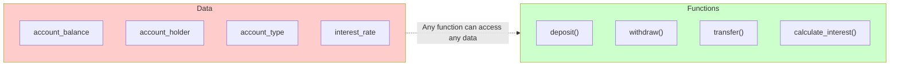
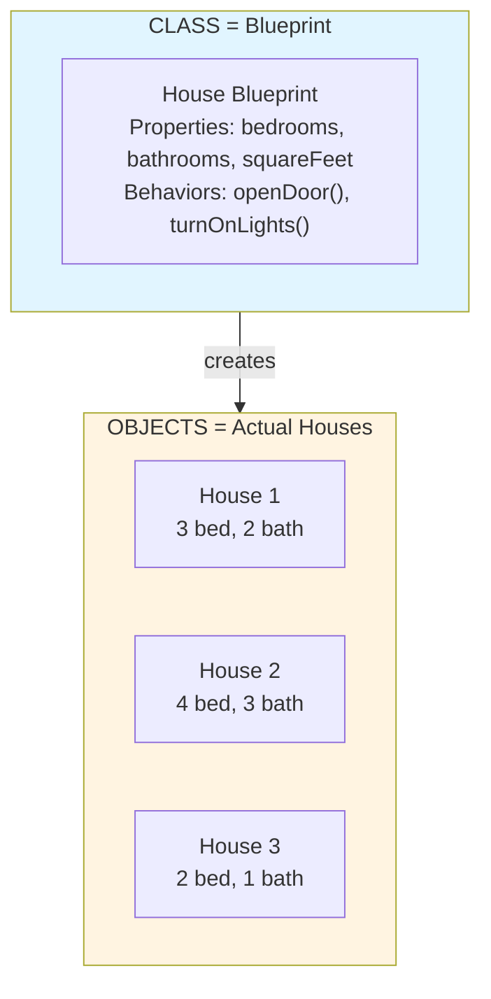
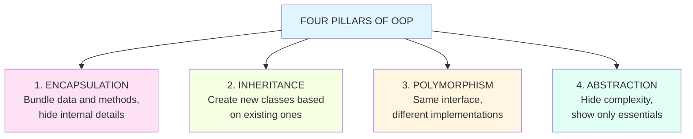
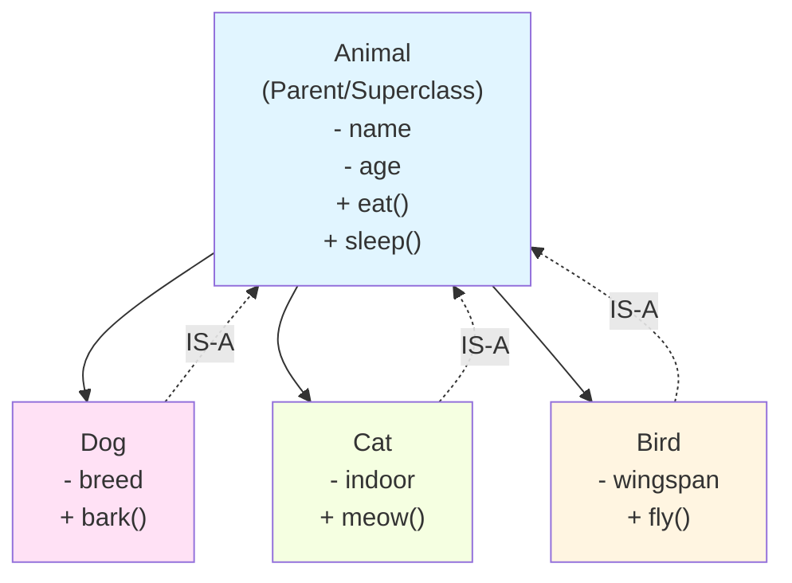
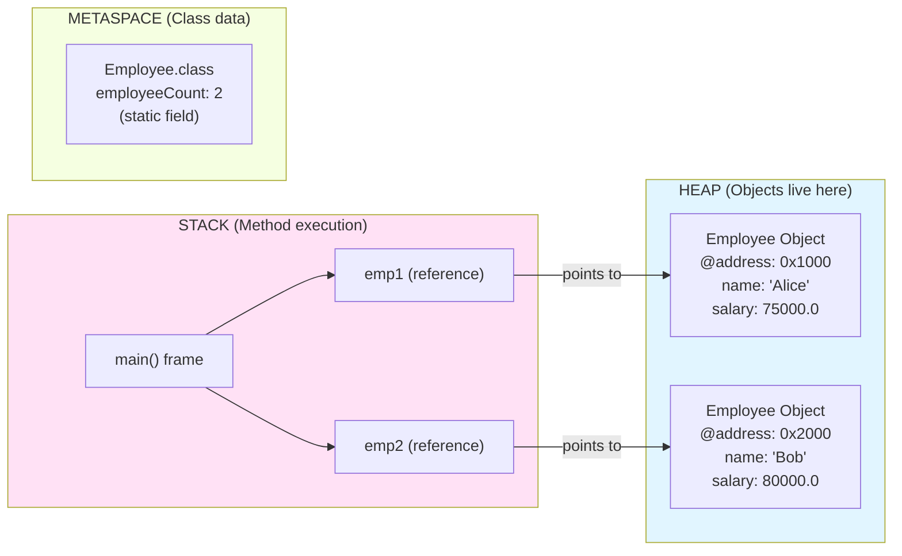
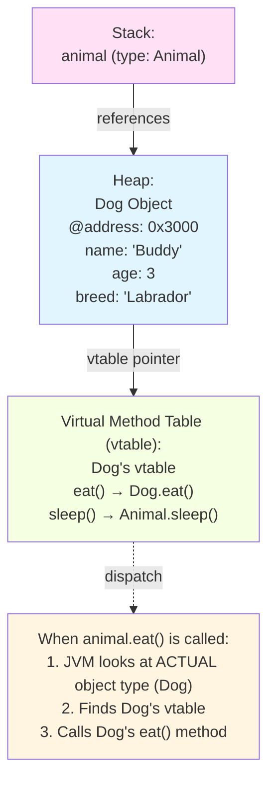
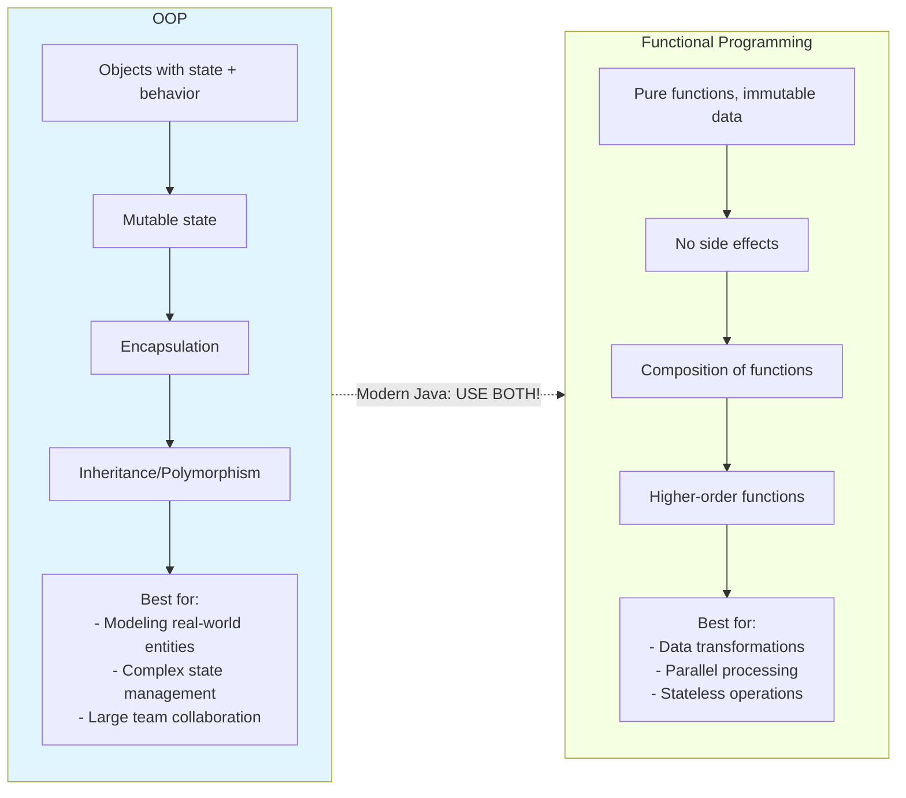

# ☕ OOP Fundamentals in Java

---

## 0️⃣ Prerequisites

Before diving into Object-Oriented Programming (OOP), you need to understand:

- **Variable**: A named container that stores data. Think of it as a labeled box holding a value.
- **Data Type**: The kind of data a variable can hold (int, String, boolean, etc.).
- **Function/Method**: A reusable block of code that performs a specific task.
- **Memory**: Where your program stores data while running. RAM holds running programs.

If you understand that programs manipulate data using variables and functions, you're ready.

---

## 1️⃣ What Problem Does This Exist to Solve?

### The Pain Point

Imagine you're building a banking system. Without OOP, you'd write code like this:

```java
// Procedural approach - NO OOP
String account1_holder = "Alice";
double account1_balance = 1000.0;
String account1_type = "SAVINGS";

String account2_holder = "Bob";
double account2_balance = 2500.0;
String account2_type = "CHECKING";

// Function to deposit
void deposit(String accountHolder, double amount) {
    if (accountHolder.equals("Alice")) {
        account1_balance += amount;
    } else if (accountHolder.equals("Bob")) {
        account2_balance += amount;
    }
    // What if we have 10,000 accounts?!
}
```

**Problems with this approach**:

1. **No grouping**: Account data is scattered across separate variables
2. **No protection**: Anyone can directly modify `account1_balance` to any value
3. **No reusability**: Adding a new account means adding more variables
4. **No organization**: As the codebase grows, it becomes unmaintainable

### What Systems Looked Like Before OOP

In the 1960s-1970s, programming was **procedural**:



<details>
<summary>ASCII diagram (reference)</summary>

```text
┌─────────────────────────────────────────────────────────────┐
│                 PROCEDURAL PROGRAMMING                       │
│                                                              │
│   Data                          Functions                    │
│   ────                          ─────────                    │
│   account_balance               deposit()                    │
│   account_holder                withdraw()                   │
│   account_type                  transfer()                   │
│   interest_rate                 calculate_interest()         │
│                                                              │
│   Data and functions are SEPARATE                           │
│   Any function can access any data                          │
│   No boundaries, no protection                              │
└─────────────────────────────────────────────────────────────┘
```
</details>

Languages like C, FORTRAN, and COBOL followed this model. As programs grew to millions of lines, they became impossible to maintain.

### What Breaks Without OOP

1. **Spaghetti Code**: Functions calling functions with no clear structure
2. **Global State Chaos**: Any part of the code can modify any data
3. **Duplication**: Same logic repeated for different data types
4. **Modification Nightmares**: Changing one thing breaks ten others
5. **No Modeling**: Can't represent real-world entities naturally

### Real Examples of the Problem

**NASA's Mars Climate Orbiter (1999)**: Lost due to a unit conversion error. Procedural code made it hard to encapsulate and validate data properly. Cost: $327 million.

**Early Banking Systems**: Bugs where account balances could go negative or be modified directly without validation caused financial losses and required massive rewrites.

---

## 2️⃣ Intuition and Mental Model

### The Blueprint and House Analogy

Think of OOP like architecture:



<details>
<summary>ASCII diagram (reference)</summary>

```text
┌─────────────────────────────────────────────────────────────┐
│                    THE BLUEPRINT ANALOGY                     │
│                                                              │
│   CLASS = Blueprint                                          │
│   ┌─────────────────────────────┐                           │
│   │    House Blueprint          │                           │
│   │    ─────────────────        │                           │
│   │    - bedrooms: int          │  ← Properties (what it has)│
│   │    - bathrooms: int         │                           │
│   │    - squareFeet: int        │                           │
│   │                             │                           │
│   │    + openDoor()             │  ← Behaviors (what it does)│
│   │    + turnOnLights()         │                           │
│   └─────────────────────────────┘                           │
│                                                              │
│   OBJECTS = Actual Houses Built from Blueprint              │
│   ┌──────────┐  ┌──────────┐  ┌──────────┐                 │
│   │ House 1  │  │ House 2  │  │ House 3  │                 │
│   │ 3 bed    │  │ 4 bed    │  │ 2 bed    │                 │
│   │ 2 bath   │  │ 3 bath   │  │ 1 bath   │                 │
│   └──────────┘  └──────────┘  └──────────┘                 │
│                                                              │
│   Same blueprint, different actual values                    │
└─────────────────────────────────────────────────────────────┘
```
</details>

**Key insight**: A class is a template. Objects are real instances created from that template.

This analogy will be referenced throughout:

- Class = Blueprint (defines structure)
- Object = House (actual instance)
- Fields = Rooms (properties/data)
- Methods = Appliances (behaviors/actions)
- Constructor = Construction crew (builds the house)

---

## 3️⃣ How It Works Internally

### The Four Pillars of OOP

OOP is built on four fundamental concepts:



<details>
<summary>ASCII diagram (reference)</summary>

```text
┌─────────────────────────────────────────────────────────────┐
│                   FOUR PILLARS OF OOP                        │
│                                                              │
│   1. ENCAPSULATION                                          │
│      "Bundle data and methods, hide internal details"        │
│                                                              │
│   2. INHERITANCE                                             │
│      "Create new classes based on existing ones"             │
│                                                              │
│   3. POLYMORPHISM                                            │
│      "Same interface, different implementations"             │
│                                                              │
│   4. ABSTRACTION                                             │
│      "Hide complexity, show only essentials"                 │
│                                                              │
└─────────────────────────────────────────────────────────────┘
```
</details>

Let's understand each one deeply.

---

### Pillar 1: Encapsulation

**Definition**: Bundling data (fields) and methods that operate on that data into a single unit (class), and restricting direct access to some components.

**Why it exists**: To protect data from invalid states and hide implementation details.

```java
// WITHOUT Encapsulation - DANGEROUS
public class BankAccount {
    public double balance;  // Anyone can set this to -999999!
    public String holder;
}

// Usage - Nothing prevents invalid state
BankAccount account = new BankAccount();
account.balance = -50000;  // Invalid! Accounts can't be negative
account.holder = null;     // Invalid! Must have a holder
```

```java
// WITH Encapsulation - SAFE
public class BankAccount {
    // Private fields - cannot be accessed directly from outside
    private double balance;
    private String holder;
    
    // Constructor - the ONLY way to create an account
    public BankAccount(String holder, double initialDeposit) {
        if (holder == null || holder.isBlank()) {
            throw new IllegalArgumentException("Holder name required");
        }
        if (initialDeposit < 0) {
            throw new IllegalArgumentException("Initial deposit cannot be negative");
        }
        this.holder = holder;
        this.balance = initialDeposit;
    }
    
    // Getter - controlled read access
    public double getBalance() {
        return this.balance;
    }
    
    // No setter for balance! Can only modify through deposit/withdraw
    
    // Controlled modification through methods
    public void deposit(double amount) {
        if (amount <= 0) {
            throw new IllegalArgumentException("Deposit must be positive");
        }
        this.balance += amount;
    }
    
    public void withdraw(double amount) {
        if (amount <= 0) {
            throw new IllegalArgumentException("Withdrawal must be positive");
        }
        if (amount > this.balance) {
            throw new IllegalStateException("Insufficient funds");
        }
        this.balance -= amount;
    }
}
```

**Access Modifiers in Java**:

| Modifier    | Class | Package | Subclass | World |
| ----------- | ----- | ------- | -------- | ----- |
| `public`    | ✅    | ✅      | ✅       | ✅    |
| `protected` | ✅    | ✅      | ✅       | ❌    |
| (default)   | ✅    | ✅      | ❌       | ❌    |
| `private`   | ✅    | ❌      | ❌       | ❌    |

**Best Practice**: Make fields `private`, provide `public` methods for controlled access.

---

### Pillar 2: Inheritance

**Definition**: Creating a new class (child/subclass) that inherits fields and methods from an existing class (parent/superclass).

**Why it exists**: To reuse code and establish "is-a" relationships.



<details>
<summary>ASCII diagram (reference)</summary>

```text
┌─────────────────────────────────────────────────────────────┐
│                    INHERITANCE HIERARCHY                     │
│                                                              │
│                      ┌─────────────┐                        │
│                      │   Animal    │  ← Parent/Superclass   │
│                      │  ─────────  │                        │
│                      │  - name     │                        │
│                      │  - age      │                        │
│                      │  + eat()    │                        │
│                      │  + sleep()  │                        │
│                      └──────┬──────┘                        │
│                             │                                │
│              ┌──────────────┼──────────────┐                │
│              │              │              │                │
│        ┌─────▼─────┐  ┌─────▼─────┐  ┌─────▼─────┐         │
│        │    Dog    │  │    Cat    │  │   Bird    │         │
│        │  ───────  │  │  ───────  │  │  ───────  │         │
│        │  - breed  │  │  - indoor │  │  - wingspan│         │
│        │  + bark() │  │  + meow() │  │  + fly()  │         │
│        └───────────┘  └───────────┘  └───────────┘         │
│                                                              │
│        Dog IS-A Animal                                       │
│        Cat IS-A Animal                                       │
│        Bird IS-A Animal                                      │
└─────────────────────────────────────────────────────────────┘
```
</details>

```java
// Parent class (Superclass)
public class Animal {
    protected String name;  // Protected: accessible in subclasses
    protected int age;
    
    public Animal(String name, int age) {
        this.name = name;
        this.age = age;
    }
    
    public void eat() {
        System.out.println(name + " is eating");
    }
    
    public void sleep() {
        System.out.println(name + " is sleeping");
    }
}

// Child class (Subclass) - inherits from Animal
public class Dog extends Animal {
    private String breed;  // Additional field specific to Dog
    
    public Dog(String name, int age, String breed) {
        super(name, age);  // Call parent constructor FIRST
        this.breed = breed;
    }
    
    // Additional method specific to Dog
    public void bark() {
        System.out.println(name + " says: Woof!");
    }
    
    // Override parent method with Dog-specific behavior
    @Override
    public void eat() {
        System.out.println(name + " the " + breed + " is eating dog food");
    }
}
```

```java
// Usage
Dog myDog = new Dog("Buddy", 3, "Golden Retriever");
myDog.eat();    // "Buddy the Golden Retriever is eating dog food" (overridden)
myDog.sleep();  // "Buddy is sleeping" (inherited from Animal)
myDog.bark();   // "Buddy says: Woof!" (Dog-specific)
```

**The `super` keyword**:

- `super(args)` - calls parent constructor (must be first line)
- `super.method()` - calls parent's version of a method
- `super.field` - accesses parent's field (if accessible)

---

### Pillar 3: Polymorphism

**Definition**: The ability of objects of different classes to be treated as objects of a common parent class, with each responding appropriately to the same method call.

**Why it exists**: To write flexible, extensible code that works with objects without knowing their exact type.

**Two types of Polymorphism**:

1. **Compile-time (Method Overloading)**: Same method name, different parameters
2. **Runtime (Method Overriding)**: Same method signature, different implementation in subclass

```java
// METHOD OVERLOADING (Compile-time Polymorphism)
// Same method name, different parameter lists
public class Calculator {
    
    // add with two integers
    public int add(int a, int b) {
        return a + b;
    }
    
    // add with three integers
    public int add(int a, int b, int c) {
        return a + b + c;
    }
    
    // add with two doubles
    public double add(double a, double b) {
        return a + b;
    }
}

// The compiler decides which method to call based on arguments
Calculator calc = new Calculator();
calc.add(1, 2);        // Calls add(int, int) → 3
calc.add(1, 2, 3);     // Calls add(int, int, int) → 6
calc.add(1.5, 2.5);    // Calls add(double, double) → 4.0
```

```java
// METHOD OVERRIDING (Runtime Polymorphism)
// Same method signature, different behavior in subclasses

public class Shape {
    public double calculateArea() {
        return 0;  // Default implementation
    }
}

public class Circle extends Shape {
    private double radius;
    
    public Circle(double radius) {
        this.radius = radius;
    }
    
    @Override
    public double calculateArea() {
        return Math.PI * radius * radius;
    }
}

public class Rectangle extends Shape {
    private double width;
    private double height;
    
    public Rectangle(double width, double height) {
        this.width = width;
        this.height = height;
    }
    
    @Override
    public double calculateArea() {
        return width * height;
    }
}
```

**The Power of Polymorphism**:

```java
// This method works with ANY shape - current and future!
public void printArea(Shape shape) {
    System.out.println("Area: " + shape.calculateArea());
}

// Usage - same method, different behaviors
Shape circle = new Circle(5);
Shape rectangle = new Rectangle(4, 6);

printArea(circle);     // "Area: 78.54..." (Circle's implementation)
printArea(rectangle);  // "Area: 24.0" (Rectangle's implementation)

// If someone adds Triangle later, printArea() still works!
```

**Why this matters in production**:

```java
// Payment processing system
public interface PaymentProcessor {
    void processPayment(double amount);
}

public class CreditCardProcessor implements PaymentProcessor {
    @Override
    public void processPayment(double amount) {
        // Connect to credit card network
        // Validate card, process transaction
    }
}

public class PayPalProcessor implements PaymentProcessor {
    @Override
    public void processPayment(double amount) {
        // Connect to PayPal API
        // Process through PayPal
    }
}

// Service code doesn't care WHICH processor
public class CheckoutService {
    private PaymentProcessor processor;  // Could be any implementation!
    
    public void checkout(double amount) {
        processor.processPayment(amount);  // Polymorphic call
    }
}
```

---

### Pillar 4: Abstraction

**Definition**: Hiding complex implementation details and showing only the essential features of an object.

**Why it exists**: To reduce complexity and isolate the impact of changes.

**Two ways to achieve abstraction in Java**:

1. **Abstract Classes**: Partial implementation, can have state
2. **Interfaces**: Pure contract, no state (until Java 8 default methods)

```java
// ABSTRACT CLASS
// Cannot be instantiated directly
// Can have abstract methods (no body) and concrete methods (with body)
// Can have fields (state)

public abstract class Vehicle {
    protected String brand;
    protected int year;
    
    public Vehicle(String brand, int year) {
        this.brand = brand;
        this.year = year;
    }
    
    // Abstract method - MUST be implemented by subclasses
    public abstract void start();
    
    // Abstract method
    public abstract void stop();
    
    // Concrete method - inherited as-is
    public void displayInfo() {
        System.out.println(year + " " + brand);
    }
}

public class Car extends Vehicle {
    private int numDoors;
    
    public Car(String brand, int year, int numDoors) {
        super(brand, year);
        this.numDoors = numDoors;
    }
    
    @Override
    public void start() {
        System.out.println("Turn key, engine starts");
    }
    
    @Override
    public void stop() {
        System.out.println("Press brake, turn off ignition");
    }
}

public class ElectricScooter extends Vehicle {
    public ElectricScooter(String brand, int year) {
        super(brand, year);
    }
    
    @Override
    public void start() {
        System.out.println("Press power button, motor activates");
    }
    
    @Override
    public void stop() {
        System.out.println("Release throttle, apply brake");
    }
}
```

```java
// INTERFACE
// Pure contract - defines WHAT, not HOW
// All methods are public abstract by default (before Java 8)
// Cannot have instance fields (only static final constants)
// A class can implement MULTIPLE interfaces

public interface Drivable {
    void accelerate();
    void brake();
    int getSpeed();
}

public interface Electric {
    int getBatteryLevel();
    void charge();
}

// A class can implement multiple interfaces
public class Tesla implements Drivable, Electric {
    private int speed = 0;
    private int battery = 100;
    
    @Override
    public void accelerate() {
        speed += 10;
    }
    
    @Override
    public void brake() {
        speed = Math.max(0, speed - 10);
    }
    
    @Override
    public int getSpeed() {
        return speed;
    }
    
    @Override
    public int getBatteryLevel() {
        return battery;
    }
    
    @Override
    public void charge() {
        battery = 100;
    }
}
```

**Abstract Class vs Interface**:

| Feature                 | Abstract Class                 | Interface                         |
| ----------------------- | ------------------------------ | --------------------------------- |
| Methods                 | Abstract + Concrete            | Abstract (+ default since Java 8) |
| Fields                  | Any type                       | Only public static final          |
| Constructor             | Yes                            | No                                |
| Multiple inheritance    | No (single extends)            | Yes (multiple implements)         |
| Access modifiers        | Any                            | Public only (methods)             |
| Use when                | Sharing code among related classes | Defining a contract/capability    |

---

## 4️⃣ Simulation-First Explanation

Let's trace how objects work in memory.

### Creating an Object Step-by-Step

```java
public class Employee {
    private String name;
    private double salary;
    private static int employeeCount = 0;  // Shared across all instances
    
    public Employee(String name, double salary) {
        this.name = name;
        this.salary = salary;
        employeeCount++;
    }
}

// In main method:
Employee emp1 = new Employee("Alice", 75000);
Employee emp2 = new Employee("Bob", 80000);
```

**What happens in memory**:



<details>
<summary>ASCII diagram (reference)</summary>

```text
┌─────────────────────────────────────────────────────────────────────────┐
│                           MEMORY LAYOUT                                  │
│                                                                          │
│   STACK (Method execution)          HEAP (Objects live here)            │
│   ─────────────────────            ──────────────────────               │
│                                                                          │
│   main() frame:                     ┌─────────────────────┐             │
│   ┌─────────────────┐               │  Employee Object    │             │
│   │ emp1 ──────────────────────────►│  @address: 0x1000   │             │
│   │ (reference)     │               │  name: "Alice"      │             │
│   │                 │               │  salary: 75000.0    │             │
│   │ emp2 ────────────────────┐      └─────────────────────┘             │
│   │ (reference)     │        │                                          │
│   └─────────────────┘        │      ┌─────────────────────┐             │
│                              └─────►│  Employee Object    │             │
│                                     │  @address: 0x2000   │             │
│   METASPACE (Class data)            │  name: "Bob"        │             │
│   ──────────────────────            │  salary: 80000.0    │             │
│   ┌─────────────────────┐           └─────────────────────┘             │
│   │  Employee.class     │                                               │
│   │  employeeCount: 2   │  ← Static field stored with class            │
│   │  (static field)     │                                               │
│   └─────────────────────┘                                               │
│                                                                          │
└─────────────────────────────────────────────────────────────────────────┘
```
</details>

**Step-by-step execution**:

1. `Employee emp1` - Creates a reference variable on the stack (initially null)
2. `new Employee(...)` - Allocates memory on the heap for the object
3. Constructor runs - Initializes fields, increments static counter
4. `= new Employee(...)` - Assigns the heap address to the stack reference
5. Repeat for emp2

### Method Dispatch (How Polymorphism Works)

```java
Animal animal = new Dog("Buddy", 3, "Labrador");
animal.eat();  // Which eat() is called?
```



<details>
<summary>ASCII diagram (reference)</summary>

```text
┌─────────────────────────────────────────────────────────────────────────┐
│                      METHOD DISPATCH (RUNTIME)                           │
│                                                                          │
│   1. Variable 'animal' has type Animal (compile-time type)              │
│   2. Actual object is Dog (runtime type)                                │
│                                                                          │
│   Stack:                           Heap:                                │
│   ┌──────────────┐                ┌─────────────────────────┐           │
│   │ animal ─────────────────────► │  Dog Object             │           │
│   │ (type: Animal)│               │  @address: 0x3000       │           │
│   └──────────────┘                │  name: "Buddy"          │           │
│                                   │  age: 3                 │           │
│                                   │  breed: "Labrador"      │           │
│                                   │                         │           │
│                                   │  vtable pointer ────────┼──┐        │
│                                   └─────────────────────────┘  │        │
│                                                                │        │
│   Virtual Method Table (vtable):                               │        │
│   ┌─────────────────────────────────────────────────────────┐  │        │
│   │  Dog's vtable                                            │◄─┘        │
│   │  ─────────────                                          │           │
│   │  eat() ──────► Dog.eat() implementation                 │           │
│   │  sleep() ────► Animal.sleep() implementation (inherited)│           │
│   └─────────────────────────────────────────────────────────┘           │
│                                                                          │
│   When animal.eat() is called:                                          │
│   1. JVM looks at ACTUAL object type (Dog)                              │
│   2. Finds Dog's vtable                                                 │
│   3. Calls Dog's eat() method                                           │
│                                                                          │
└─────────────────────────────────────────────────────────────────────────┘
```
</details>

---

## 5️⃣ How Engineers Actually Use This in Production

### Real Systems at Real Companies

**Netflix's Microservices**:

Netflix uses OOP extensively in their Java-based microservices:

```java
// Interface defines the contract
public interface RecommendationEngine {
    List<Movie> getRecommendations(User user, int count);
}

// Different implementations for different strategies
public class CollaborativeFilteringEngine implements RecommendationEngine {
    @Override
    public List<Movie> getRecommendations(User user, int count) {
        // Find users with similar watching patterns
        // Recommend what they watched
    }
}

public class ContentBasedEngine implements RecommendationEngine {
    @Override
    public List<Movie> getRecommendations(User user, int count) {
        // Analyze genres, actors, directors user likes
        // Find similar content
    }
}

// Service uses polymorphism - doesn't care which implementation
@Service
public class RecommendationService {
    private final RecommendationEngine engine;  // Injected
    
    public List<Movie> recommend(User user) {
        return engine.getRecommendations(user, 10);
    }
}
```

**Amazon's Order Processing**:

```java
// Abstract base for all order processors
public abstract class OrderProcessor {
    protected final PaymentService paymentService;
    protected final InventoryService inventoryService;
    
    public final void processOrder(Order order) {
        validateOrder(order);      // Template method pattern
        reserveInventory(order);
        processPayment(order);
        fulfillOrder(order);       // Abstract - varies by order type
        sendNotification(order);
    }
    
    protected abstract void fulfillOrder(Order order);
}

public class PhysicalOrderProcessor extends OrderProcessor {
    @Override
    protected void fulfillOrder(Order order) {
        // Ship physical items via warehouse
    }
}

public class DigitalOrderProcessor extends OrderProcessor {
    @Override
    protected void fulfillOrder(Order order) {
        // Send download link via email
    }
}
```

### Real Workflows and Tooling

**Spring Framework's Dependency Injection**:

```java
// Interface
public interface UserRepository {
    User findById(Long id);
    void save(User user);
}

// Implementation
@Repository
public class JpaUserRepository implements UserRepository {
    @Override
    public User findById(Long id) {
        // JPA/Hibernate implementation
    }
    
    @Override
    public void save(User user) {
        // JPA/Hibernate implementation
    }
}

// Service depends on interface, not implementation
@Service
public class UserService {
    private final UserRepository userRepository;  // Interface type!
    
    // Spring injects the implementation automatically
    public UserService(UserRepository userRepository) {
        this.userRepository = userRepository;
    }
    
    public User getUser(Long id) {
        return userRepository.findById(id);
    }
}
```

**Why this matters**:

- Can swap `JpaUserRepository` for `MongoUserRepository` without changing `UserService`
- Can inject `MockUserRepository` for testing
- Loose coupling = easier maintenance

### Production War Stories

**The God Class Anti-Pattern**:

A fintech company had a `TransactionManager` class with 15,000 lines:

```java
// ANTI-PATTERN: God Class
public class TransactionManager {
    // 200+ fields
    // 500+ methods
    // Does EVERYTHING: validation, processing, logging, notifications...
    
    public void processTransaction(Transaction t) {
        // 2000 lines of code in ONE method
    }
}
```

**Problems**:

- Any change risked breaking something
- Testing was nearly impossible
- Multiple developers couldn't work simultaneously
- Deployment was all-or-nothing

**Solution**: Broke into proper OOP structure:

```java
public interface TransactionValidator { ... }
public interface TransactionProcessor { ... }
public interface TransactionNotifier { ... }

public class CreditCardValidator implements TransactionValidator { ... }
public class ACHValidator implements TransactionValidator { ... }

public class TransactionOrchestrator {
    private final TransactionValidator validator;
    private final TransactionProcessor processor;
    private final TransactionNotifier notifier;
    // Clean, testable, maintainable
}
```

---

## 6️⃣ How to Implement: Complete Example

Let's build a proper OOP system for an e-commerce product catalog.

### Project Structure

```
src/main/java/com/example/catalog/
├── model/
│   ├── Product.java
│   ├── PhysicalProduct.java
│   ├── DigitalProduct.java
│   └── SubscriptionProduct.java
├── service/
│   ├── PricingStrategy.java
│   ├── StandardPricing.java
│   ├── DiscountPricing.java
│   └── ProductService.java
└── CatalogApplication.java
```

### Base Product Class (Abstraction + Encapsulation)

```java
// Product.java
package com.example.catalog.model;

import java.math.BigDecimal;
import java.util.Objects;

/**
 * Abstract base class for all products in the catalog.
 * 
 * Design decisions:
 * - Abstract because "Product" alone is too vague to instantiate
 * - Uses BigDecimal for price (never use double for money!)
 * - Encapsulates all fields with validation in setters
 */
public abstract class Product {
    
    // Private fields - encapsulation
    private final String id;           // Immutable after creation
    private String name;
    private String description;
    private BigDecimal basePrice;
    
    /**
     * Constructor with validation.
     * Protected so only subclasses can call it.
     */
    protected Product(String id, String name, BigDecimal basePrice) {
        // Validate all inputs
        if (id == null || id.isBlank()) {
            throw new IllegalArgumentException("Product ID cannot be null or blank");
        }
        if (name == null || name.isBlank()) {
            throw new IllegalArgumentException("Product name cannot be null or blank");
        }
        if (basePrice == null || basePrice.compareTo(BigDecimal.ZERO) < 0) {
            throw new IllegalArgumentException("Price cannot be null or negative");
        }
        
        this.id = id;
        this.name = name;
        this.basePrice = basePrice;
    }
    
    // Getters - controlled read access
    public String getId() {
        return id;
    }
    
    public String getName() {
        return name;
    }
    
    public String getDescription() {
        return description;
    }
    
    public BigDecimal getBasePrice() {
        return basePrice;
    }
    
    // Setter with validation
    public void setName(String name) {
        if (name == null || name.isBlank()) {
            throw new IllegalArgumentException("Name cannot be null or blank");
        }
        this.name = name;
    }
    
    public void setDescription(String description) {
        this.description = description;  // Description can be null
    }
    
    public void setBasePrice(BigDecimal basePrice) {
        if (basePrice == null || basePrice.compareTo(BigDecimal.ZERO) < 0) {
            throw new IllegalArgumentException("Price cannot be null or negative");
        }
        this.basePrice = basePrice;
    }
    
    /**
     * Abstract method - each product type calculates final price differently.
     * Physical products add shipping, digital products might have no tax, etc.
     */
    public abstract BigDecimal calculateFinalPrice();
    
    /**
     * Abstract method - each product type has different delivery mechanism.
     */
    public abstract String getDeliveryInfo();
    
    // Concrete method - same for all products
    public String getDisplayName() {
        return name + " (" + id + ")";
    }
    
    // equals and hashCode based on ID (business key)
    @Override
    public boolean equals(Object o) {
        if (this == o) return true;
        if (o == null || getClass() != o.getClass()) return false;
        Product product = (Product) o;
        return Objects.equals(id, product.id);
    }
    
    @Override
    public int hashCode() {
        return Objects.hash(id);
    }
    
    @Override
    public String toString() {
        return getClass().getSimpleName() + "{" +
               "id='" + id + '\'' +
               ", name='" + name + '\'' +
               ", basePrice=" + basePrice +
               '}';
    }
}
```

### Concrete Product Types (Inheritance + Polymorphism)

```java
// PhysicalProduct.java
package com.example.catalog.model;

import java.math.BigDecimal;

/**
 * Physical products that need to be shipped.
 * Adds weight and shipping cost to the base product.
 */
public class PhysicalProduct extends Product {
    
    private double weightKg;
    private BigDecimal shippingCost;
    private static final BigDecimal TAX_RATE = new BigDecimal("0.08");  // 8% tax
    
    public PhysicalProduct(String id, String name, BigDecimal basePrice, 
                          double weightKg, BigDecimal shippingCost) {
        super(id, name, basePrice);  // Call parent constructor
        
        if (weightKg <= 0) {
            throw new IllegalArgumentException("Weight must be positive");
        }
        if (shippingCost == null || shippingCost.compareTo(BigDecimal.ZERO) < 0) {
            throw new IllegalArgumentException("Shipping cost cannot be negative");
        }
        
        this.weightKg = weightKg;
        this.shippingCost = shippingCost;
    }
    
    public double getWeightKg() {
        return weightKg;
    }
    
    public BigDecimal getShippingCost() {
        return shippingCost;
    }
    
    @Override
    public BigDecimal calculateFinalPrice() {
        // Base price + tax + shipping
        BigDecimal tax = getBasePrice().multiply(TAX_RATE);
        return getBasePrice().add(tax).add(shippingCost);
    }
    
    @Override
    public String getDeliveryInfo() {
        return "Ships within 3-5 business days. Weight: " + weightKg + "kg";
    }
}
```

```java
// DigitalProduct.java
package com.example.catalog.model;

import java.math.BigDecimal;

/**
 * Digital products delivered via download.
 * No shipping, potentially no tax (varies by jurisdiction).
 */
public class DigitalProduct extends Product {
    
    private String downloadUrl;
    private long fileSizeBytes;
    private String fileFormat;
    
    public DigitalProduct(String id, String name, BigDecimal basePrice,
                         String downloadUrl, long fileSizeBytes, String fileFormat) {
        super(id, name, basePrice);
        
        if (downloadUrl == null || downloadUrl.isBlank()) {
            throw new IllegalArgumentException("Download URL required");
        }
        if (fileSizeBytes <= 0) {
            throw new IllegalArgumentException("File size must be positive");
        }
        
        this.downloadUrl = downloadUrl;
        this.fileSizeBytes = fileSizeBytes;
        this.fileFormat = fileFormat;
    }
    
    public String getDownloadUrl() {
        return downloadUrl;
    }
    
    public long getFileSizeBytes() {
        return fileSizeBytes;
    }
    
    public String getFileFormat() {
        return fileFormat;
    }
    
    @Override
    public BigDecimal calculateFinalPrice() {
        // Digital products: no tax, no shipping (simplified)
        return getBasePrice();
    }
    
    @Override
    public String getDeliveryInfo() {
        return "Instant download. File size: " + formatFileSize(fileSizeBytes) + 
               ". Format: " + fileFormat;
    }
    
    private String formatFileSize(long bytes) {
        if (bytes < 1024) return bytes + " B";
        if (bytes < 1024 * 1024) return (bytes / 1024) + " KB";
        return (bytes / (1024 * 1024)) + " MB";
    }
}
```

```java
// SubscriptionProduct.java
package com.example.catalog.model;

import java.math.BigDecimal;

/**
 * Subscription-based products with recurring billing.
 */
public class SubscriptionProduct extends Product {
    
    public enum BillingCycle {
        MONTHLY, QUARTERLY, YEARLY
    }
    
    private BillingCycle billingCycle;
    private int trialDays;
    
    public SubscriptionProduct(String id, String name, BigDecimal monthlyPrice,
                              BillingCycle billingCycle, int trialDays) {
        super(id, name, monthlyPrice);
        
        if (trialDays < 0) {
            throw new IllegalArgumentException("Trial days cannot be negative");
        }
        
        this.billingCycle = billingCycle;
        this.trialDays = trialDays;
    }
    
    public BillingCycle getBillingCycle() {
        return billingCycle;
    }
    
    public int getTrialDays() {
        return trialDays;
    }
    
    @Override
    public BigDecimal calculateFinalPrice() {
        // Price per billing cycle
        return switch (billingCycle) {
            case MONTHLY -> getBasePrice();
            case QUARTERLY -> getBasePrice().multiply(new BigDecimal("3")).multiply(new BigDecimal("0.9"));  // 10% discount
            case YEARLY -> getBasePrice().multiply(new BigDecimal("12")).multiply(new BigDecimal("0.8"));    // 20% discount
        };
    }
    
    @Override
    public String getDeliveryInfo() {
        String trialInfo = trialDays > 0 ? trialDays + "-day free trial. " : "";
        return trialInfo + "Billed " + billingCycle.name().toLowerCase() + 
               ". Cancel anytime.";
    }
}
```

### Pricing Strategy (Polymorphism via Interface)

```java
// PricingStrategy.java
package com.example.catalog.service;

import com.example.catalog.model.Product;
import java.math.BigDecimal;

/**
 * Strategy interface for different pricing algorithms.
 * Allows swapping pricing logic without changing product classes.
 */
public interface PricingStrategy {
    
    /**
     * Calculate the final price for a product.
     * 
     * @param product The product to price
     * @return The final price after applying this strategy
     */
    BigDecimal calculatePrice(Product product);
    
    /**
     * Get a description of this pricing strategy.
     */
    String getDescription();
}
```

```java
// StandardPricing.java
package com.example.catalog.service;

import com.example.catalog.model.Product;
import java.math.BigDecimal;

/**
 * Standard pricing - uses product's own price calculation.
 */
public class StandardPricing implements PricingStrategy {
    
    @Override
    public BigDecimal calculatePrice(Product product) {
        return product.calculateFinalPrice();
    }
    
    @Override
    public String getDescription() {
        return "Standard pricing";
    }
}
```

```java
// DiscountPricing.java
package com.example.catalog.service;

import com.example.catalog.model.Product;
import java.math.BigDecimal;

/**
 * Discount pricing - applies percentage discount to final price.
 */
public class DiscountPricing implements PricingStrategy {
    
    private final BigDecimal discountPercent;
    private final String promoCode;
    
    public DiscountPricing(BigDecimal discountPercent, String promoCode) {
        if (discountPercent.compareTo(BigDecimal.ZERO) < 0 || 
            discountPercent.compareTo(new BigDecimal("100")) > 0) {
            throw new IllegalArgumentException("Discount must be between 0 and 100");
        }
        this.discountPercent = discountPercent;
        this.promoCode = promoCode;
    }
    
    @Override
    public BigDecimal calculatePrice(Product product) {
        BigDecimal originalPrice = product.calculateFinalPrice();
        BigDecimal discountMultiplier = BigDecimal.ONE.subtract(
            discountPercent.divide(new BigDecimal("100"))
        );
        return originalPrice.multiply(discountMultiplier);
    }
    
    @Override
    public String getDescription() {
        return discountPercent + "% off with code: " + promoCode;
    }
}
```

### Product Service (Using Everything Together)

```java
// ProductService.java
package com.example.catalog.service;

import com.example.catalog.model.Product;
import java.math.BigDecimal;
import java.util.*;

/**
 * Service for managing products and calculating prices.
 * Demonstrates OOP principles in a service layer.
 */
public class ProductService {
    
    // Stores all products - could be injected repository in real app
    private final Map<String, Product> products = new HashMap<>();
    
    // Current pricing strategy - can be changed at runtime
    private PricingStrategy pricingStrategy;
    
    public ProductService() {
        this.pricingStrategy = new StandardPricing();  // Default
    }
    
    public ProductService(PricingStrategy pricingStrategy) {
        this.pricingStrategy = pricingStrategy;
    }
    
    /**
     * Add a product to the catalog.
     * Works with ANY product type due to polymorphism.
     */
    public void addProduct(Product product) {
        products.put(product.getId(), product);
    }
    
    /**
     * Get a product by ID.
     */
    public Optional<Product> getProduct(String id) {
        return Optional.ofNullable(products.get(id));
    }
    
    /**
     * Get all products.
     */
    public List<Product> getAllProducts() {
        return new ArrayList<>(products.values());
    }
    
    /**
     * Calculate price using current pricing strategy.
     * Polymorphism: same method works with any product type and any pricing strategy.
     */
    public BigDecimal getPrice(Product product) {
        return pricingStrategy.calculatePrice(product);
    }
    
    /**
     * Change pricing strategy at runtime.
     */
    public void setPricingStrategy(PricingStrategy strategy) {
        this.pricingStrategy = strategy;
    }
    
    /**
     * Get delivery info - polymorphic call, each product type responds differently.
     */
    public String getDeliveryInfo(Product product) {
        return product.getDeliveryInfo();
    }
    
    /**
     * Print catalog - demonstrates polymorphism.
     */
    public void printCatalog() {
        System.out.println("=== Product Catalog ===");
        System.out.println("Pricing: " + pricingStrategy.getDescription());
        System.out.println();
        
        for (Product product : products.values()) {
            System.out.println(product.getDisplayName());
            System.out.println("  Base Price: $" + product.getBasePrice());
            System.out.println("  Final Price: $" + getPrice(product));
            System.out.println("  Delivery: " + product.getDeliveryInfo());
            System.out.println();
        }
    }
}
```

### Main Application

```java
// CatalogApplication.java
package com.example.catalog;

import com.example.catalog.model.*;
import com.example.catalog.service.*;
import java.math.BigDecimal;

/**
 * Demonstrates OOP principles in action.
 */
public class CatalogApplication {
    
    public static void main(String[] args) {
        // Create service with default pricing
        ProductService service = new ProductService();
        
        // Add different product types - all are "Product" (polymorphism)
        Product laptop = new PhysicalProduct(
            "PHY-001",
            "MacBook Pro 14\"",
            new BigDecimal("1999.00"),
            1.6,  // weight in kg
            new BigDecimal("15.00")  // shipping
        );
        
        Product ebook = new DigitalProduct(
            "DIG-001",
            "Clean Code eBook",
            new BigDecimal("39.99"),
            "https://example.com/download/clean-code",
            5_242_880,  // 5 MB
            "PDF"
        );
        
        Product streaming = new SubscriptionProduct(
            "SUB-001",
            "Premium Streaming",
            new BigDecimal("14.99"),
            SubscriptionProduct.BillingCycle.MONTHLY,
            30  // 30-day trial
        );
        
        // Add to service
        service.addProduct(laptop);
        service.addProduct(ebook);
        service.addProduct(streaming);
        
        // Print with standard pricing
        service.printCatalog();
        
        System.out.println("=".repeat(50));
        System.out.println();
        
        // Change pricing strategy at runtime
        service.setPricingStrategy(
            new DiscountPricing(new BigDecimal("20"), "HOLIDAY20")
        );
        
        // Same catalog, different prices
        service.printCatalog();
    }
}
```

**Output**:

```
=== Product Catalog ===
Pricing: Standard pricing

MacBook Pro 14" (PHY-001)
  Base Price: $1999.00
  Final Price: $2173.92
  Delivery: Ships within 3-5 business days. Weight: 1.6kg

Clean Code eBook (DIG-001)
  Base Price: $39.99
  Final Price: $39.99
  Delivery: Instant download. File size: 5 MB. Format: PDF

Premium Streaming (SUB-001)
  Base Price: $14.99
  Final Price: $14.99
  Delivery: 30-day free trial. Billed monthly. Cancel anytime.

==================================================

=== Product Catalog ===
Pricing: 20% off with code: HOLIDAY20

MacBook Pro 14" (PHY-001)
  Base Price: $1999.00
  Final Price: $1739.14
  Delivery: Ships within 3-5 business days. Weight: 1.6kg

Clean Code eBook (DIG-001)
  Base Price: $39.99
  Final Price: $31.99
  Delivery: Instant download. File size: 5 MB. Format: PDF

Premium Streaming (SUB-001)
  Base Price: $14.99
  Final Price: $11.99
  Delivery: 30-day free trial. Billed monthly. Cancel anytime.
```

---

## 7️⃣ Tradeoffs, Pitfalls, and Common Mistakes

### Common OOP Mistakes

**1. Inheritance for Code Reuse (Wrong!)**

```java
// WRONG: Using inheritance just to reuse code
public class ArrayList<E> {
    public void add(E element) { ... }
}

// Stack IS-NOT-A ArrayList!
public class Stack<E> extends ArrayList<E> {
    public void push(E element) {
        add(element);
    }
    
    public E pop() {
        return remove(size() - 1);
    }
}

// Problem: Stack inherits add(), remove(), get() - breaks Stack semantics!
Stack<String> stack = new Stack<>();
stack.add(0, "wrong!");  // Shouldn't be allowed!
```

```java
// RIGHT: Use composition
public class Stack<E> {
    private final List<E> elements = new ArrayList<>();  // HAS-A relationship
    
    public void push(E element) {
        elements.add(element);
    }
    
    public E pop() {
        if (elements.isEmpty()) {
            throw new EmptyStackException();
        }
        return elements.remove(elements.size() - 1);
    }
    
    // Only expose what makes sense for a Stack
}
```

**2. Deep Inheritance Hierarchies**

```java
// WRONG: Too many levels
class Animal { }
class Mammal extends Animal { }
class Carnivore extends Mammal { }
class Canine extends Carnivore { }
class Dog extends Canine { }
class GoldenRetriever extends Dog { }
class MyPet extends GoldenRetriever { }  // 7 levels deep!

// Problems:
// - Hard to understand
// - Fragile base class problem
// - Difficult to modify
```

```java
// RIGHT: Prefer composition and interfaces
interface Animal { }
interface Mammal extends Animal { }
interface Pet { }

class Dog implements Mammal, Pet {
    private final Breed breed;  // Composition
    private final Owner owner;  // Composition
}
```

**3. Exposing Internal State**

```java
// WRONG: Returning mutable internal collection
public class Order {
    private List<Item> items = new ArrayList<>();
    
    public List<Item> getItems() {
        return items;  // Caller can modify our internal list!
    }
}

// Usage - breaks encapsulation
Order order = new Order();
order.getItems().clear();  // Oops! Cleared the order's items
```

```java
// RIGHT: Return defensive copy or unmodifiable view
public class Order {
    private List<Item> items = new ArrayList<>();
    
    public List<Item> getItems() {
        return Collections.unmodifiableList(items);  // Read-only view
        // OR
        // return new ArrayList<>(items);  // Defensive copy
    }
    
    public void addItem(Item item) {
        items.add(item);  // Controlled modification
    }
}
```

**4. God Classes**

```java
// WRONG: One class doing everything
public class UserManager {
    public void createUser() { }
    public void updateUser() { }
    public void deleteUser() { }
    public void sendEmail() { }
    public void generateReport() { }
    public void processPayment() { }
    public void validateAddress() { }
    // 500 more methods...
}
```

```java
// RIGHT: Single Responsibility
public class UserService { /* user CRUD only */ }
public class EmailService { /* email only */ }
public class ReportService { /* reports only */ }
public class PaymentService { /* payments only */ }
public class AddressValidator { /* validation only */ }
```

### When Inheritance is Appropriate

| Use Inheritance When                            | Use Composition When                         |
| ----------------------------------------------- | -------------------------------------------- |
| True "is-a" relationship                        | "Has-a" relationship                         |
| Subclass is a specialization                    | Behavior can change at runtime               |
| Want to use polymorphism                        | Need multiple "inherited" behaviors          |
| Modeling a clear hierarchy (Shape → Circle)    | Combining unrelated behaviors                |
| Framework requires it (e.g., extending Thread) | Maximum flexibility needed                   |

### Performance Considerations

- **Virtual method dispatch**: Polymorphic calls have slight overhead (vtable lookup)
- **Object creation**: Each `new` allocates heap memory
- **Inheritance depth**: Deeper hierarchies mean more vtable lookups
- **In practice**: JVM optimizes aggressively; rarely a bottleneck

---

## 8️⃣ When NOT to Use Heavy OOP

### Anti-Patterns and Misuse Cases

**1. Simple Scripts**

```java
// OVERKILL for a one-off script
public interface DataProcessor { }
public abstract class AbstractDataProcessor implements DataProcessor { }
public class CSVDataProcessor extends AbstractDataProcessor { }
public class CSVDataProcessorFactory { }
public class CSVDataProcessorFactoryBuilder { }

// Just write the script!
public class ConvertCSV {
    public static void main(String[] args) {
        // 20 lines of code, done.
    }
}
```

**2. Pure Data Transfer**

```java
// OVERKILL for simple data carriers
public class UserDTO {
    private String name;
    private int age;
    
    // Constructor, getters, setters, equals, hashCode, toString...
    // 50 lines of boilerplate
}

// Use Java Records instead (Java 14+)
public record UserDTO(String name, int age) { }
// Automatically gets constructor, getters, equals, hashCode, toString
```

**3. Utility Functions**

```java
// WRONG: Forcing OOP on stateless utilities
public class StringUtils {
    public String capitalize(String s) { ... }  // Why instance method?
}

// Usage requires unnecessary object
StringUtils utils = new StringUtils();
utils.capitalize("hello");

// RIGHT: Static methods for stateless utilities
public final class StringUtils {
    private StringUtils() { }  // Prevent instantiation
    
    public static String capitalize(String s) { ... }
}

// Clean usage
StringUtils.capitalize("hello");
```

### Better Alternatives

| Scenario                | Instead of OOP Classes | Use                               |
| ----------------------- | ---------------------- | --------------------------------- |
| Simple data containers  | Classes with getters   | Records (Java 14+)                |
| Stateless utilities     | Instance methods       | Static methods                    |
| One-off transformations | Strategy pattern       | Lambda expressions                |
| Configuration           | Builder pattern        | Properties files or YAML          |
| Simple state machines   | State pattern          | Enums with behavior               |

---

## 9️⃣ Comparison: OOP vs Other Paradigms

### OOP vs Functional Programming



<details>
<summary>ASCII diagram (reference)</summary>

```text
┌─────────────────────────────────────────────────────────────────────────┐
│                    OOP vs FUNCTIONAL PROGRAMMING                         │
│                                                                          │
│   OOP:                              Functional:                         │
│   ────                              ──────────                          │
│   Objects with state + behavior     Pure functions, immutable data      │
│   Mutable state                     No side effects                     │
│   Encapsulation                     Composition of functions            │
│   Inheritance/Polymorphism          Higher-order functions              │
│                                                                          │
│   Java Example (OOP):               Java Example (Functional):          │
│   ──────────────────                ────────────────────────            │
│   class Counter {                   // Using streams                    │
│       private int count = 0;        List<Integer> doubled =             │
│       void increment() {               numbers.stream()                 │
│           count++;                        .map(n -> n * 2)              │
│       }                                   .collect(toList());           │
│   }                                                                      │
│                                                                          │
│   Best for:                         Best for:                           │
│   - Modeling real-world entities    - Data transformations              │
│   - Complex state management        - Parallel processing               │
│   - Large team collaboration        - Stateless operations              │
│                                                                          │
│   Modern Java: USE BOTH! OOP for structure, FP for operations.          │
└─────────────────────────────────────────────────────────────────────────┘
```
</details>

### When to Use Each

| Scenario                    | OOP                                      | Functional                  |
| --------------------------- | ---------------------------------------- | --------------------------- |
| Domain modeling             | ✅ Classes represent entities            | ❌                          |
| Data transformation         | ❌                                       | ✅ Streams, map, filter     |
| State management            | ✅ Encapsulated state                    | ✅ Immutable state          |
| Concurrency                 | ⚠️ Requires careful synchronization     | ✅ No shared mutable state  |
| Code organization           | ✅ Packages, classes, interfaces         | ✅ Modules, functions       |
| Testing                     | ⚠️ May need mocking                     | ✅ Pure functions easy test |

---

## 🔟 Interview Follow-Up Questions WITH Answers

### L4 (Entry-Level) Questions

**Q: What are the four pillars of OOP?**

A: The four pillars are:
1. **Encapsulation**: Bundling data and methods together, hiding internal details. We use private fields with public getters/setters to control access and validate data.
2. **Inheritance**: Creating new classes based on existing ones. A Dog class extends Animal, inheriting its fields and methods while adding its own.
3. **Polymorphism**: Same interface, different implementations. A method accepting Shape can work with Circle, Rectangle, or any Shape subtype, each with its own behavior.
4. **Abstraction**: Hiding complexity, showing only essentials. An interface defines what methods exist without revealing how they work.

**Q: What's the difference between abstract class and interface?**

A: Key differences:
- **State**: Abstract classes can have instance fields; interfaces can only have static final constants.
- **Constructors**: Abstract classes have constructors; interfaces don't.
- **Multiple inheritance**: A class can implement multiple interfaces but extend only one abstract class.
- **Methods**: Abstract classes can have any access modifier; interface methods are public.
- **Use case**: Use abstract class when sharing code among related classes; use interface when defining a contract that unrelated classes can implement.

Since Java 8, interfaces can have default methods with implementation, blurring the line somewhat.

### L5 (Mid-Level) Questions

**Q: Explain composition over inheritance. When would you use each?**

A: Composition means a class contains instances of other classes (HAS-A relationship) rather than inheriting from them (IS-A relationship).

**Prefer composition when**:
- The relationship is "has-a" not "is-a"
- You need to change behavior at runtime
- You want to combine behaviors from multiple sources
- You want to avoid the fragile base class problem

**Use inheritance when**:
- There's a true "is-a" relationship (Dog IS-A Animal)
- You need polymorphism (treat all shapes uniformly)
- The framework requires it

Example: A Car HAS-A Engine (composition), but a SportsCar IS-A Car (inheritance).

**Q: How does method dispatch work in Java? Explain virtual method tables.**

A: When you call a method on an object, Java uses dynamic dispatch to determine which implementation to run:

1. At compile time, the compiler checks the declared type has the method.
2. At runtime, the JVM looks at the actual object's class.
3. Each class has a virtual method table (vtable) mapping method signatures to implementations.
4. The JVM looks up the method in the object's vtable and calls that implementation.

This is why `Animal animal = new Dog(); animal.eat();` calls Dog's eat() method, not Animal's. The vtable lookup happens at runtime, enabling polymorphism.

### L6 (Senior) Questions

**Q: How would you design a plugin system using OOP principles?**

A: I'd use a combination of interfaces and the Strategy pattern:

1. **Define a plugin interface**: `public interface Plugin { void execute(); String getName(); }`

2. **Create a plugin manager**:
```java
public class PluginManager {
    private Map<String, Plugin> plugins = new HashMap<>();
    
    public void register(Plugin plugin) {
        plugins.put(plugin.getName(), plugin);
    }
    
    public void executeAll() {
        plugins.values().forEach(Plugin::execute);
    }
}
```

3. **Use ServiceLoader for discovery**: Java's ServiceLoader can automatically find implementations on the classpath.

4. **Consider lifecycle hooks**: `onLoad()`, `onUnload()` methods for resource management.

5. **Version compatibility**: Include version in the interface, use semantic versioning.

The key is that the core system depends only on the Plugin interface, not concrete implementations. New plugins can be added without modifying existing code (Open/Closed Principle).

**Q: Discuss the tradeoffs between deep inheritance hierarchies and flat composition-based designs.**

A: 

**Deep inheritance**:
- Pros: Clear taxonomy, code reuse, polymorphism
- Cons: Fragile base class problem (changing parent breaks children), tight coupling, hard to understand, inflexible

**Flat composition**:
- Pros: Flexible, loose coupling, easier to test, can combine behaviors
- Cons: More boilerplate, no automatic polymorphism, can be harder to see relationships

**My approach**:
1. Keep inheritance shallow (max 2-3 levels)
2. Use interfaces for polymorphism
3. Use composition for code reuse
4. Follow "favor composition over inheritance" but don't be dogmatic

Real example: Java's Collections framework uses both. `ArrayList` extends `AbstractList` (inheritance for shared implementation) but implements `List` interface (composition of behaviors like `RandomAccess`).

---

## 1️⃣1️⃣ One Clean Mental Summary

Object-Oriented Programming organizes code around objects that combine data and behavior, like blueprints (classes) that create houses (objects). The four pillars, encapsulation (hide internals), inheritance (build on existing code), polymorphism (same interface, different behaviors), and abstraction (hide complexity), work together to create maintainable, reusable code. The key insight is modeling your domain as interacting objects rather than procedures operating on data. In modern Java, combine OOP for structure with functional programming for operations, prefer composition over inheritance for flexibility, and keep hierarchies shallow. OOP isn't about using every feature. It's about organizing complexity so teams can work on large systems without stepping on each other.

