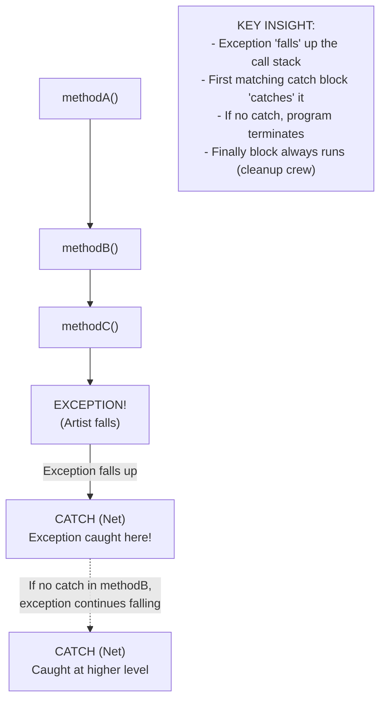
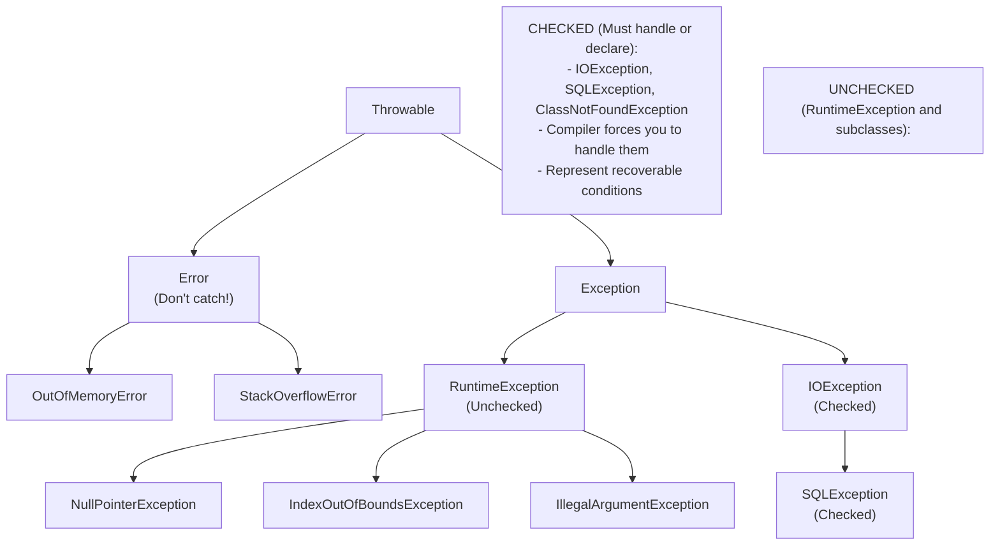
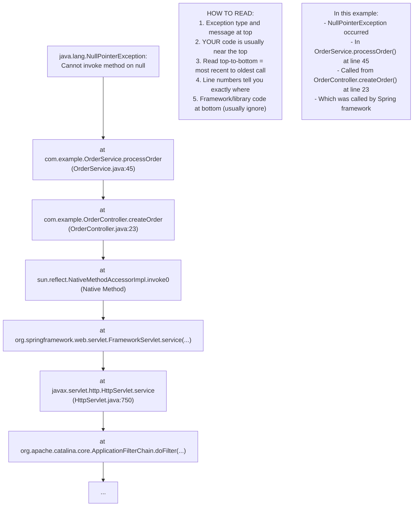
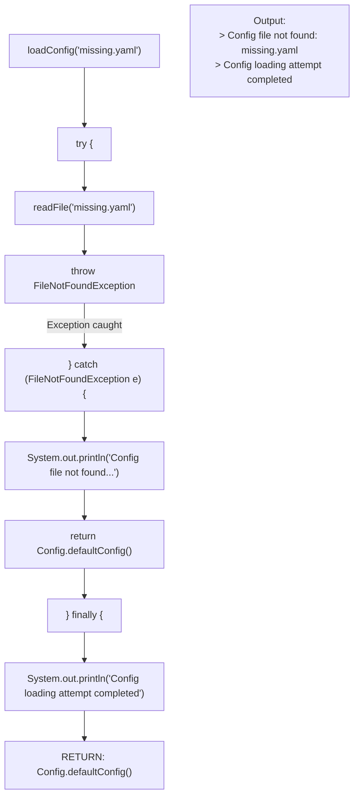
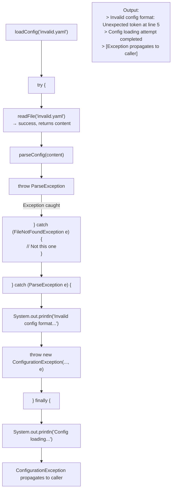
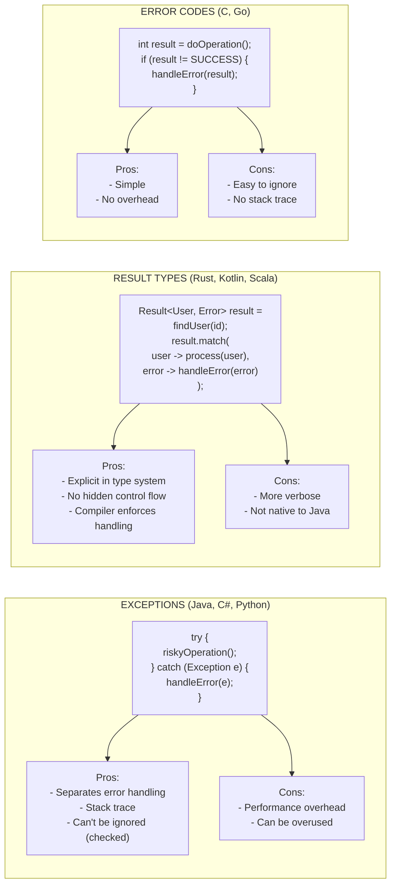

# ⚠️ Exception Handling in Java

---

## 0️⃣ Prerequisites

Before diving into Exception Handling, you need to understand:

- **Method Call Stack**: When method A calls method B, B is added to the stack. When B returns, it's removed. The stack tracks where execution should return.
- **Control Flow**: How program execution moves from one statement to another.
- **Inheritance**: Exception classes form a hierarchy (covered in `01-oop-fundamentals.md`)
- **Try-Catch Basics**: Basic syntax for catching exceptions

Quick refresher on the call stack:

```java
public void main() {
    methodA();  // Stack: [main, methodA]
}

public void methodA() {
    methodB();  // Stack: [main, methodA, methodB]
}

public void methodB() {
    // If exception here, it "unwinds" the stack
    // Looking for a handler in methodB, then methodA, then main
}
```

If you understand that exceptions interrupt normal flow and propagate up the call stack, you're ready.

---

## 1️⃣ What Problem Does This Exist to Solve?

### The Pain Point

Imagine you're reading a file and processing its contents:

```java
// WITHOUT Exception Handling - C-style error codes
int readFile(String path, StringBuilder content) {
    File file = openFile(path);
    if (file == null) {
        return -1;  // Error: file not found
    }
    
    int bytesRead = readContent(file, content);
    if (bytesRead < 0) {
        return -2;  // Error: read failed
    }
    
    int closeResult = closeFile(file);
    if (closeResult < 0) {
        return -3;  // Error: close failed
    }
    
    return 0;  // Success
}

// Caller must check return value
int result = readFile("data.txt", content);
if (result == -1) {
    System.out.println("File not found");
} else if (result == -2) {
    System.out.println("Read failed");
} else if (result == -3) {
    System.out.println("Close failed");
}
```

**Problems with error codes**:

1. **Easy to ignore**: Caller can forget to check return value
2. **Pollutes return type**: Can't return actual data AND error code
3. **Magic numbers**: What does -2 mean? Need documentation
4. **Error handling mixed with logic**: Hard to read
5. **No stack trace**: Where did the error originate?

### What Systems Looked Like Before Exceptions

In C and early languages, error handling was manual:

```c
// C-style error handling
FILE* fp = fopen("file.txt", "r");
if (fp == NULL) {
    // Handle error
    return ERROR_FILE_NOT_FOUND;
}

// Every operation needs error checking
if (fread(buffer, 1, size, fp) != size) {
    fclose(fp);  // Must clean up!
    return ERROR_READ_FAILED;
}

// Easy to forget cleanup or error checks
```

### What Breaks Without Proper Exception Handling

1. **Silent failures**: Errors ignored, data corrupted
2. **Resource leaks**: Files, connections left open
3. **Debugging nightmares**: No stack trace, no context
4. **Inconsistent state**: Half-completed operations
5. **Security vulnerabilities**: Unhandled errors expose system info

### Real Examples of the Problem

**Therac-25 (1985-1987)**: Radiation therapy machine killed patients due to race conditions and inadequate error handling. Error messages were cryptic numbers that operators ignored.

**Ariane 5 (1996)**: Rocket exploded due to unhandled integer overflow exception. Cost: $370 million.

---

## 2️⃣ Intuition and Mental Model

### The Safety Net Analogy

Think of exceptions like safety nets in a circus:



<details>
<summary>ASCII diagram (reference)</summary>

```text
┌─────────────────────────────────────────────────────────────────────────┐
│                    EXCEPTION AS SAFETY NET                               │
│                                                                          │
│   Normal Execution (Trapeze Artist)                                     │
│                                                                          │
│        methodA() ─────► methodB() ─────► methodC()                      │
│            │                │                │                          │
│            │                │                │                          │
│            │                │                ▼                          │
│            │                │           EXCEPTION!                      │
│            │                │           (Artist falls)                  │
│            │                │                │                          │
│            │                │                │                          │
│   ═══════════════════════════════════════════════════════════════════   │
│            │                │                │                          │
│            │           ┌────┴────┐           │                          │
│            │           │ CATCH   │◄──────────┘                          │
│            │           │ (Net)   │   Exception caught here!             │
│            │           └─────────┘                                      │
│            │                                                            │
│   If no catch in methodB, exception continues falling...               │
│            │                                                            │
│       ┌────┴────┐                                                       │
│       │ CATCH   │◄── Caught at higher level                            │
│       │ (Net)   │                                                       │
│       └─────────┘                                                       │
│                                                                          │
│   KEY INSIGHT:                                                          │
│   - Exception "falls" up the call stack                                │
│   - First matching catch block "catches" it                            │
│   - If no catch, program terminates                                    │
│   - Finally block always runs (cleanup crew)                           │
│                                                                          │
└─────────────────────────────────────────────────────────────────────────┘
```
</details>
```

**Key insights**:

- **throw**: Artist falls (something went wrong)
- **catch**: Safety net catches the fall (handle the error)
- **finally**: Cleanup crew (always runs, regardless of fall)
- **throws**: Warning sign "Artist might fall here"

---

## 3️⃣ How It Works Internally

### The Exception Hierarchy



<details>
<summary>ASCII diagram (reference)</summary>

```text
┌─────────────────────────────────────────────────────────────────────────┐
│                    JAVA EXCEPTION HIERARCHY                              │
│                                                                          │
│                         Throwable                                       │
│                             │                                            │
│              ┌──────────────┴──────────────┐                            │
│              │                             │                            │
│           Error                       Exception                         │
│      (Don't catch!)                       │                             │
│              │                  ┌─────────┴─────────┐                   │
│    ┌─────────┼─────────┐        │                   │                   │
│    │         │         │   RuntimeException    IOException              │
│ OutOfMemory StackOverflow    (Unchecked)       SQLException             │
│ Error       Error            │                 (Checked)                │
│                    ┌─────────┼─────────┐                                │
│                    │         │         │                                │
│              NullPointer  IndexOutOf  IllegalArgument                   │
│              Exception    Bounds      Exception                         │
│                           Exception                                     │
│                                                                          │
│   ═══════════════════════════════════════════════════════════════════   │
│                                                                          │
│   CHECKED (Must handle or declare):                                     │
│   - IOException, SQLException, ClassNotFoundException                   │
│   - Compiler forces you to handle them                                 │
│   - Represent recoverable conditions                                    │
│                                                                          │
│   UNCHECKED (RuntimeException and subclasses):                         │
```
</details>
```
│   - NullPointerException, IllegalArgumentException                     │
│   - Compiler doesn't force handling                                    │
│   - Usually represent programming errors                               │
│                                                                          │
│   ERRORS (Don't catch):                                                 │
│   - OutOfMemoryError, StackOverflowError                              │
│   - JVM problems, can't recover                                        │
│                                                                          │
└─────────────────────────────────────────────────────────────────────────┘
```

### Checked vs Unchecked Exceptions

| Aspect              | Checked Exception              | Unchecked Exception           |
| ------------------- | ------------------------------ | ----------------------------- |
| Superclass          | Exception (not RuntimeException) | RuntimeException              |
| Compiler check      | Must handle or declare         | No compiler enforcement       |
| Examples            | IOException, SQLException      | NullPointerException          |
| Typical cause       | External factors               | Programming bugs              |
| Recovery            | Often possible                 | Usually fix the code          |
| Declaration         | Must use `throws`              | Optional                      |

### How Exception Propagation Works

```java
public class ExceptionPropagation {
    
    public static void main(String[] args) {
        try {
            level1();
        } catch (Exception e) {
            System.out.println("Caught in main: " + e.getMessage());
            e.printStackTrace();
        }
    }
    
    static void level1() {
        System.out.println("Entering level1");
        level2();
        System.out.println("Exiting level1");  // Never reached if exception
    }
    
    static void level2() {
        System.out.println("Entering level2");
        level3();
        System.out.println("Exiting level2");  // Never reached if exception
    }
    
    static void level3() {
        System.out.println("Entering level3");
        throw new RuntimeException("Error in level3");
        // Code below never executes
    }
}

// Output:
// Entering level1
// Entering level2
// Entering level3
// Caught in main: Error in level3
// java.lang.RuntimeException: Error in level3
//     at ExceptionPropagation.level3(...)
//     at ExceptionPropagation.level2(...)
//     at ExceptionPropagation.level1(...)
//     at ExceptionPropagation.main(...)
```

### The Stack Trace



<details>
<summary>ASCII diagram (reference)</summary>

```text
┌─────────────────────────────────────────────────────────────────────────┐
│                    READING A STACK TRACE                                 │
│                                                                          │
│   java.lang.NullPointerException: Cannot invoke method on null          │
│       at com.example.OrderService.processOrder(OrderService.java:45)    │
│       at com.example.OrderController.createOrder(OrderController.java:23)│
│       at sun.reflect.NativeMethodAccessorImpl.invoke0(Native Method)    │
│       at org.springframework.web.servlet.FrameworkServlet.service(...)  │
│       at javax.servlet.http.HttpServlet.service(HttpServlet.java:750)   │
│       at org.apache.catalina.core.ApplicationFilterChain.doFilter(...)  │
│       ...                                                                │
│                                                                          │
│   HOW TO READ:                                                          │
│   1. Exception type and message at top                                  │
│   2. YOUR code is usually near the top                                  │
│   3. Read top-to-bottom = most recent to oldest call                   │
│   4. Line numbers tell you exactly where                               │
│   5. Framework/library code at bottom (usually ignore)                 │
│                                                                          │
│   In this example:                                                      │
│   - NullPointerException occurred                                       │
│   - In OrderService.processOrder() at line 45                          │
│   - Called from OrderController.createOrder() at line 23               │
│   - Which was called by Spring framework                               │
│                                                                          │
└─────────────────────────────────────────────────────────────────────────┘
```
</details>
```

---

## 4️⃣ Simulation-First Explanation

Let's trace exception handling in a file processing scenario.

### Scenario: Reading and Processing a Config File

```java
public class ConfigLoader {
    
    public Config loadConfig(String path) {
        try {
            String content = readFile(path);
            Config config = parseConfig(content);
            validateConfig(config);
            return config;
        } catch (FileNotFoundException e) {
            System.out.println("Config file not found: " + path);
            return Config.defaultConfig();
        } catch (ParseException e) {
            System.out.println("Invalid config format: " + e.getMessage());
            throw new ConfigurationException("Failed to parse config", e);
        } catch (ValidationException e) {
            System.out.println("Invalid config values: " + e.getMessage());
            throw new ConfigurationException("Config validation failed", e);
        } finally {
            System.out.println("Config loading attempt completed");
        }
    }
}
```

### Trace 1: File Not Found



<details>
<summary>ASCII diagram (reference)</summary>

```text
┌─────────────────────────────────────────────────────────────────────────┐
│                    TRACE: FILE NOT FOUND                                 │
│                                                                          │
│   loadConfig("missing.yaml")                                            │
│        │                                                                 │
│        ▼                                                                 │
│   try {                                                                  │
│        │                                                                 │
│        ▼                                                                 │
│   readFile("missing.yaml")                                              │
│        │                                                                 │
│        ▼                                                                 │
│   throw FileNotFoundException ─────────────────────┐                    │
│                                                     │                    │
│   } catch (FileNotFoundException e) { ◄────────────┘                    │
│        │                                                                 │
│        ▼                                                                 │
│   System.out.println("Config file not found...")                        │
│   return Config.defaultConfig();                                        │
│        │                                                                 │
│        ▼                                                                 │
│   } finally {                                                           │
│        │                                                                 │
│        ▼                                                                 │
│   System.out.println("Config loading attempt completed")                │
│        │                                                                 │
│        ▼                                                                 │
│   RETURN: Config.defaultConfig()                                        │
│                                                                          │
│   Output:                                                               │
│   > Config file not found: missing.yaml                                 │
│   > Config loading attempt completed                                    │
│                                                                          │
└─────────────────────────────────────────────────────────────────────────┘
```
</details>
```

### Trace 2: Parse Error (Re-thrown)



<details>
<summary>ASCII diagram (reference)</summary>

```text
┌─────────────────────────────────────────────────────────────────────────┐
│                    TRACE: PARSE ERROR                                    │
│                                                                          │
│   loadConfig("invalid.yaml")                                            │
│        │                                                                 │
│        ▼                                                                 │
│   try {                                                                  │
│        │                                                                 │
│        ▼                                                                 │
│   readFile("invalid.yaml") → success, returns content                   │
│        │                                                                 │
│        ▼                                                                 │
│   parseConfig(content)                                                  │
│        │                                                                 │
│        ▼                                                                 │
│   throw ParseException ────────────────────────────┐                    │
│                                                     │                    │
│   } catch (FileNotFoundException e) {              │                    │
│       // Not this one                              │                    │
│   } catch (ParseException e) { ◄───────────────────┘                    │
│        │                                                                 │
│        ▼                                                                 │
│   System.out.println("Invalid config format...")                        │
│   throw new ConfigurationException(..., e); ───────┐                    │
│        │                                            │                    │
│        ▼                                            │                    │
│   } finally {                                       │                    │
│        │                                            │                    │
│        ▼                                            │                    │
│   System.out.println("Config loading...")           │                    │
│        │                                            │                    │
│        ▼                                            │                    │
│   ConfigurationException propagates to caller  ◄───┘                    │
│                                                                          │
│   Output:                                                               │
│   > Invalid config format: Unexpected token at line 5                   │
│   > Config loading attempt completed                                    │
│   > [Exception propagates to caller]                                    │
│                                                                          │
└─────────────────────────────────────────────────────────────────────────┘
```
</details>
```

---

## 5️⃣ How Engineers Actually Use This in Production

### Real Systems at Real Companies

**Netflix's Hystrix Pattern**:

```java
// Circuit breaker with exception handling
public class MovieService {
    
    private final CircuitBreaker circuitBreaker;
    private final MovieRepository repository;
    
    public List<Movie> getRecommendations(String userId) {
        try {
            return circuitBreaker.execute(() -> {
                return repository.findRecommendations(userId);
            });
        } catch (CircuitBreakerOpenException e) {
            // Circuit is open, return fallback
            log.warn("Circuit breaker open for recommendations");
            return getFallbackRecommendations(userId);
        } catch (TimeoutException e) {
            // Request timed out
            log.error("Timeout getting recommendations for user: {}", userId);
            return getFallbackRecommendations(userId);
        } catch (Exception e) {
            // Unexpected error
            log.error("Error getting recommendations", e);
            throw new ServiceException("Failed to get recommendations", e);
        }
    }
    
    private List<Movie> getFallbackRecommendations(String userId) {
        // Return cached or default recommendations
        return cache.getOrDefault(userId, DEFAULT_RECOMMENDATIONS);
    }
}
```

**Spring Boot Global Exception Handler**:

```java
@RestControllerAdvice
public class GlobalExceptionHandler {
    
    private static final Logger log = LoggerFactory.getLogger(GlobalExceptionHandler.class);
    
    @ExceptionHandler(ResourceNotFoundException.class)
    @ResponseStatus(HttpStatus.NOT_FOUND)
    public ErrorResponse handleNotFound(ResourceNotFoundException ex, WebRequest request) {
        log.warn("Resource not found: {}", ex.getMessage());
        return new ErrorResponse(
            HttpStatus.NOT_FOUND.value(),
            "NOT_FOUND",
            ex.getMessage(),
            request.getDescription(false)
        );
    }
    
    @ExceptionHandler(ValidationException.class)
    @ResponseStatus(HttpStatus.BAD_REQUEST)
    public ErrorResponse handleValidation(ValidationException ex, WebRequest request) {
        log.warn("Validation failed: {}", ex.getMessage());
        return new ErrorResponse(
            HttpStatus.BAD_REQUEST.value(),
            "VALIDATION_ERROR",
            ex.getMessage(),
            request.getDescription(false)
        );
    }
    
    @ExceptionHandler(Exception.class)
    @ResponseStatus(HttpStatus.INTERNAL_SERVER_ERROR)
    public ErrorResponse handleGeneric(Exception ex, WebRequest request) {
        log.error("Unexpected error", ex);
        return new ErrorResponse(
            HttpStatus.INTERNAL_SERVER_ERROR.value(),
            "INTERNAL_ERROR",
            "An unexpected error occurred",  // Don't expose internal details!
            request.getDescription(false)
        );
    }
}

public record ErrorResponse(
    int status,
    String error,
    String message,
    String path
) {}
```

### Real Workflows and Tooling

**Structured Logging with Exceptions**:

```java
// Using SLF4J with structured logging
try {
    processOrder(order);
} catch (PaymentException e) {
    log.error("Payment failed for order {} customer {}", 
        order.getId(), 
        order.getCustomerId(),
        e);  // Exception as last argument logs stack trace
    
    // Or with structured logging (MDC)
    MDC.put("orderId", order.getId());
    MDC.put("customerId", order.getCustomerId());
    MDC.put("errorType", e.getClass().getSimpleName());
    log.error("Payment processing failed", e);
    MDC.clear();
}
```

**Exception Monitoring (Sentry, Rollbar)**:

```java
// Automatic exception reporting
try {
    riskyOperation();
} catch (Exception e) {
    Sentry.captureException(e);  // Reports to Sentry
    throw e;  // Re-throw for normal handling
}

// Or with context
Sentry.configureScope(scope -> {
    scope.setTag("feature", "checkout");
    scope.setUser(new User(userId));
    scope.setExtra("orderId", orderId);
});
```

### Production War Stories

**The Swallowed Exception**:

A team had code that silently swallowed exceptions:

```java
// DISASTER: Exception swallowed
try {
    saveToDatabase(data);
} catch (Exception e) {
    // Log and continue
    log.error("Save failed", e);
}
// Code continues as if save succeeded!
// Data was lost, users never notified
```

**The fix**:

```java
// CORRECT: Handle appropriately
try {
    saveToDatabase(data);
} catch (DatabaseException e) {
    log.error("Save failed, retrying", e);
    retryQueue.add(data);  // Queue for retry
    throw new DataPersistenceException("Save failed, queued for retry", e);
}
```

---

## 6️⃣ How to Implement: Complete Examples

### Try-Catch-Finally Basics

```java
public class ExceptionBasics {
    
    public void basicTryCatch() {
        try {
            // Code that might throw
            int result = 10 / 0;
        } catch (ArithmeticException e) {
            // Handle specific exception
            System.out.println("Cannot divide by zero: " + e.getMessage());
        }
    }
    
    public void multipleCatch() {
        try {
            String text = null;
            text.length();  // NullPointerException
        } catch (NullPointerException e) {
            System.out.println("Null value encountered");
        } catch (Exception e) {
            // Catch-all for other exceptions
            // Must come AFTER more specific catches
            System.out.println("Unexpected error: " + e.getMessage());
        }
    }
    
    public void multiCatch() {
        // Java 7+: Catch multiple types in one block
        try {
            // Code that might throw different exceptions
        } catch (IOException | SQLException e) {
            // Handle both the same way
            System.out.println("I/O or Database error: " + e.getMessage());
        }
    }
    
    public void finallyBlock() {
        FileReader reader = null;
        try {
            reader = new FileReader("file.txt");
            // Process file
        } catch (IOException e) {
            System.out.println("Error reading file");
        } finally {
            // ALWAYS runs, even if exception thrown
            // Use for cleanup
            if (reader != null) {
                try {
                    reader.close();
                } catch (IOException e) {
                    System.out.println("Error closing file");
                }
            }
        }
    }
}
```

### Try-With-Resources (Java 7+)

```java
public class TryWithResources {
    
    // OLD WAY: Manual resource management
    public String readFileOld(String path) throws IOException {
        BufferedReader reader = null;
        try {
            reader = new BufferedReader(new FileReader(path));
            return reader.readLine();
        } finally {
            if (reader != null) {
                reader.close();  // Must close manually
            }
        }
    }
    
    // NEW WAY: Try-with-resources
    public String readFileNew(String path) throws IOException {
        // Resource declared in try() is automatically closed
        try (BufferedReader reader = new BufferedReader(new FileReader(path))) {
            return reader.readLine();
        }
        // reader.close() called automatically, even if exception thrown
    }
    
    // Multiple resources
    public void copyFile(String source, String dest) throws IOException {
        try (
            InputStream in = new FileInputStream(source);
            OutputStream out = new FileOutputStream(dest)
        ) {
            byte[] buffer = new byte[1024];
            int length;
            while ((length = in.read(buffer)) > 0) {
                out.write(buffer, 0, length);
            }
        }
        // Both streams closed automatically, in reverse order
    }
    
    // Custom AutoCloseable
    public void customResource() {
        try (MyResource resource = new MyResource()) {
            resource.doSomething();
        } catch (Exception e) {
            System.out.println("Error: " + e.getMessage());
        }
    }
}

// Custom resource must implement AutoCloseable
class MyResource implements AutoCloseable {
    public void doSomething() {
        System.out.println("Doing something");
    }
    
    @Override
    public void close() {
        System.out.println("Resource closed");
    }
}
```

### Creating Custom Exceptions

```java
// CHECKED Exception - for recoverable conditions
public class OrderNotFoundException extends Exception {
    
    private final String orderId;
    
    public OrderNotFoundException(String orderId) {
        super("Order not found: " + orderId);
        this.orderId = orderId;
    }
    
    public OrderNotFoundException(String orderId, Throwable cause) {
        super("Order not found: " + orderId, cause);
        this.orderId = orderId;
    }
    
    public String getOrderId() {
        return orderId;
    }
}

// UNCHECKED Exception - for programming errors
public class InvalidOrderStateException extends RuntimeException {
    
    private final String orderId;
    private final String currentState;
    private final String attemptedTransition;
    
    public InvalidOrderStateException(String orderId, String currentState, 
                                      String attemptedTransition) {
        super(String.format(
            "Invalid state transition for order %s: cannot %s from state %s",
            orderId, attemptedTransition, currentState
        ));
        this.orderId = orderId;
        this.currentState = currentState;
        this.attemptedTransition = attemptedTransition;
    }
    
    // Getters for additional context
    public String getOrderId() { return orderId; }
    public String getCurrentState() { return currentState; }
    public String getAttemptedTransition() { return attemptedTransition; }
}

// Usage
public class OrderService {
    
    public Order getOrder(String orderId) throws OrderNotFoundException {
        Order order = repository.findById(orderId);
        if (order == null) {
            throw new OrderNotFoundException(orderId);
        }
        return order;
    }
    
    public void cancelOrder(String orderId) {
        Order order = repository.findById(orderId);
        if (order.getStatus() == OrderStatus.SHIPPED) {
            throw new InvalidOrderStateException(
                orderId, 
                "SHIPPED", 
                "cancel"
            );
        }
        order.setStatus(OrderStatus.CANCELLED);
        repository.save(order);
    }
}
```

### Exception Handling in REST APIs

```java
// Domain exceptions
public class DomainException extends RuntimeException {
    private final String errorCode;
    
    public DomainException(String errorCode, String message) {
        super(message);
        this.errorCode = errorCode;
    }
    
    public String getErrorCode() {
        return errorCode;
    }
}

public class ResourceNotFoundException extends DomainException {
    public ResourceNotFoundException(String resourceType, String id) {
        super("NOT_FOUND", resourceType + " with id " + id + " not found");
    }
}

public class BusinessRuleViolationException extends DomainException {
    public BusinessRuleViolationException(String message) {
        super("BUSINESS_RULE_VIOLATION", message);
    }
}

// Controller
@RestController
@RequestMapping("/api/orders")
public class OrderController {
    
    private final OrderService orderService;
    
    @GetMapping("/{id}")
    public ResponseEntity<OrderDTO> getOrder(@PathVariable String id) {
        // Let exceptions propagate to global handler
        Order order = orderService.getOrder(id);
        return ResponseEntity.ok(OrderDTO.from(order));
    }
    
    @PostMapping
    public ResponseEntity<OrderDTO> createOrder(@Valid @RequestBody CreateOrderRequest request) {
        Order order = orderService.createOrder(request);
        return ResponseEntity
            .status(HttpStatus.CREATED)
            .body(OrderDTO.from(order));
    }
}

// Global exception handler
@RestControllerAdvice
public class GlobalExceptionHandler {
    
    private static final Logger log = LoggerFactory.getLogger(GlobalExceptionHandler.class);
    
    @ExceptionHandler(ResourceNotFoundException.class)
    public ResponseEntity<ApiError> handleNotFound(ResourceNotFoundException ex) {
        log.warn("Resource not found: {}", ex.getMessage());
        return ResponseEntity
            .status(HttpStatus.NOT_FOUND)
            .body(new ApiError(ex.getErrorCode(), ex.getMessage()));
    }
    
    @ExceptionHandler(BusinessRuleViolationException.class)
    public ResponseEntity<ApiError> handleBusinessRule(BusinessRuleViolationException ex) {
        log.warn("Business rule violation: {}", ex.getMessage());
        return ResponseEntity
            .status(HttpStatus.UNPROCESSABLE_ENTITY)
            .body(new ApiError(ex.getErrorCode(), ex.getMessage()));
    }
    
    @ExceptionHandler(MethodArgumentNotValidException.class)
    public ResponseEntity<ApiError> handleValidation(MethodArgumentNotValidException ex) {
        String message = ex.getBindingResult().getFieldErrors().stream()
            .map(error -> error.getField() + ": " + error.getDefaultMessage())
            .collect(Collectors.joining(", "));
        
        return ResponseEntity
            .status(HttpStatus.BAD_REQUEST)
            .body(new ApiError("VALIDATION_ERROR", message));
    }
    
    @ExceptionHandler(Exception.class)
    public ResponseEntity<ApiError> handleGeneric(Exception ex) {
        log.error("Unexpected error", ex);
        // Don't expose internal details to client
        return ResponseEntity
            .status(HttpStatus.INTERNAL_SERVER_ERROR)
            .body(new ApiError("INTERNAL_ERROR", "An unexpected error occurred"));
    }
}

// API Error response
public record ApiError(
    String code,
    String message,
    Instant timestamp
) {
    public ApiError(String code, String message) {
        this(code, message, Instant.now());
    }
}
```

### Exception Handling Best Practices

```java
public class ExceptionBestPractices {
    
    // 1. Be specific in what you catch
    public void specificCatch() {
        try {
            readFile();
        } catch (FileNotFoundException e) {
            // Handle missing file specifically
            createDefaultFile();
        } catch (IOException e) {
            // Handle other I/O errors differently
            throw new DataAccessException("Failed to read file", e);
        }
        // DON'T: catch (Exception e) for everything
    }
    
    // 2. Don't swallow exceptions
    public void dontSwallow() {
        try {
            processData();
        } catch (Exception e) {
            // BAD: Silent swallow
            // log.error("Error", e);  // Just logging is often not enough
            
            // GOOD: Take action
            log.error("Processing failed, queuing for retry", e);
            retryQueue.add(data);
            metrics.increment("processing.failures");
        }
    }
    
    // 3. Preserve the original exception
    public void preserveCause() {
        try {
            callExternalService();
        } catch (IOException e) {
            // BAD: Loses original stack trace
            // throw new ServiceException("Service call failed");
            
            // GOOD: Preserve cause
            throw new ServiceException("Service call failed", e);
        }
    }
    
    // 4. Use appropriate exception types
    public User getUser(String id) {
        User user = repository.findById(id);
        
        // BAD: Using Exception for control flow
        // if (user == null) throw new Exception("Not found");
        
        // GOOD: Specific exception type
        if (user == null) {
            throw new UserNotFoundException(id);
        }
        return user;
    }
    
    // 5. Clean up resources properly
    public void cleanupResources() {
        // BAD: Manual cleanup, error-prone
        // Connection conn = getConnection();
        // try { ... } finally { conn.close(); }
        
        // GOOD: Try-with-resources
        try (Connection conn = getConnection()) {
            // Use connection
        } catch (SQLException e) {
            throw new DataAccessException("Database error", e);
        }
    }
    
    // 6. Log at the right level
    public void appropriateLogging() {
        try {
            process();
        } catch (ValidationException e) {
            // WARN: Expected, recoverable
            log.warn("Validation failed: {}", e.getMessage());
        } catch (ServiceException e) {
            // ERROR: Unexpected, needs attention
            log.error("Service failure", e);
        }
    }
    
    // 7. Fail fast for programming errors
    public void failFast(String input) {
        // Validate preconditions immediately
        if (input == null) {
            throw new IllegalArgumentException("Input cannot be null");
        }
        if (input.isBlank()) {
            throw new IllegalArgumentException("Input cannot be blank");
        }
        // Now safe to use input
    }
    
    // 8. Document exceptions
    /**
     * Retrieves an order by ID.
     *
     * @param orderId the order ID
     * @return the order
     * @throws OrderNotFoundException if order doesn't exist
     * @throws IllegalArgumentException if orderId is null
     */
    public Order getOrder(String orderId) throws OrderNotFoundException {
        if (orderId == null) {
            throw new IllegalArgumentException("orderId cannot be null");
        }
        // ...
    }
}
```

---

## 7️⃣ Tradeoffs, Pitfalls, and Common Mistakes

### Common Mistakes

**1. Catching Exception or Throwable**

```java
// BAD: Too broad
try {
    doSomething();
} catch (Exception e) {
    // Catches everything, including programming bugs
    // that should crash the application
}

// WORSE: Catching Throwable
try {
    doSomething();
} catch (Throwable t) {
    // Catches Errors like OutOfMemoryError
    // You can't recover from these!
}

// GOOD: Catch specific exceptions
try {
    doSomething();
} catch (IOException e) {
    handleIOError(e);
} catch (ParseException e) {
    handleParseError(e);
}
```

**2. Empty Catch Blocks**

```java
// TERRIBLE: Silent failure
try {
    importantOperation();
} catch (Exception e) {
    // Nothing here - exception vanishes
}

// GOOD: At minimum, log it
try {
    importantOperation();
} catch (Exception e) {
    log.error("Operation failed", e);
    throw e;  // Or handle appropriately
}
```

**3. Using Exceptions for Control Flow**

```java
// BAD: Exception as control flow
public boolean isInteger(String s) {
    try {
        Integer.parseInt(s);
        return true;
    } catch (NumberFormatException e) {
        return false;
    }
}

// GOOD: Check before
public boolean isInteger(String s) {
    if (s == null || s.isEmpty()) return false;
    for (char c : s.toCharArray()) {
        if (!Character.isDigit(c)) return false;
    }
    return true;
}

// OR use Optional pattern
public Optional<Integer> parseInteger(String s) {
    try {
        return Optional.of(Integer.parseInt(s));
    } catch (NumberFormatException e) {
        return Optional.empty();
    }
}
```

**4. Losing Exception Information**

```java
// BAD: Loses stack trace
try {
    callService();
} catch (ServiceException e) {
    throw new RuntimeException("Service failed");  // Original cause lost!
}

// GOOD: Preserve cause
try {
    callService();
} catch (ServiceException e) {
    throw new RuntimeException("Service failed", e);  // Cause preserved
}
```

**5. Catching and Rethrowing Without Adding Value**

```java
// POINTLESS: Just rethrows
try {
    doSomething();
} catch (IOException e) {
    throw e;  // Why catch at all?
}

// USEFUL: Adds context or transforms
try {
    doSomething();
} catch (IOException e) {
    log.error("Failed while doing something", e);
    throw new BusinessException("Operation failed", e);
}
```

### Checked vs Unchecked Debate

| Use Checked When                    | Use Unchecked When                  |
| ----------------------------------- | ----------------------------------- |
| Caller can reasonably recover       | Programming error (null, bad args)  |
| External failure (I/O, network)     | Unrecoverable condition             |
| API contract requires handling      | Would clutter code with try-catch   |
| Failure is expected possibility     | Caller can't do anything useful     |

```java
// CHECKED: Caller should handle file not existing
public void readConfig(String path) throws FileNotFoundException {
    // ...
}

// UNCHECKED: Programming error, fix the code
public void setAge(int age) {
    if (age < 0) {
        throw new IllegalArgumentException("Age cannot be negative");
    }
}
```

---

## 8️⃣ When NOT to Use Exceptions

### Situations Where Exceptions Are Wrong

**1. Expected Conditions**

```java
// BAD: Exception for expected case
public User findUser(String id) {
    User user = repository.findById(id);
    if (user == null) {
        throw new UserNotFoundException(id);  // Is this really exceptional?
    }
    return user;
}

// BETTER: Use Optional for "might not exist"
public Optional<User> findUser(String id) {
    return Optional.ofNullable(repository.findById(id));
}

// Caller handles:
findUser(id).ifPresentOrElse(
    user -> process(user),
    () -> handleMissing()
);
```

**2. Performance-Critical Code**

```java
// BAD: Exception in hot path
public boolean isValid(String input) {
    try {
        validate(input);  // Throws on invalid
        return true;
    } catch (ValidationException e) {
        return false;  // Exception overhead!
    }
}

// GOOD: Return boolean directly
public boolean isValid(String input) {
    return input != null 
        && input.length() >= 3 
        && input.matches("[a-zA-Z]+");
}
```

**3. Alternative Return Types**

```java
// Instead of exceptions, consider:

// 1. Optional for "might not exist"
Optional<User> findUser(String id);

// 2. Either/Result for "success or failure"
Result<Order, OrderError> createOrder(OrderRequest request);

// 3. Sealed classes for known outcomes (Java 17+)
sealed interface PaymentResult permits PaymentSuccess, PaymentFailure, PaymentPending {}
record PaymentSuccess(String transactionId) implements PaymentResult {}
record PaymentFailure(String reason) implements PaymentResult {}
record PaymentPending(String checkUrl) implements PaymentResult {}
```

---

## 9️⃣ Comparison with Alternatives

### Exception Handling Approaches



<details>
<summary>ASCII diagram (reference)</summary>

```text
┌─────────────────────────────────────────────────────────────────────────┐
│                    ERROR HANDLING APPROACHES                             │
│                                                                          │
│   EXCEPTIONS (Java, C#, Python):                                        │
│   ─────────────────────────────                                         │
│   try {                              Pros:                              │
│       riskyOperation();              - Separates error handling         │
│   } catch (Exception e) {            - Stack trace                      │
│       handleError(e);                - Can't be ignored (checked)       │
│   }                                  Cons:                              │
│                                      - Performance overhead             │
│                                      - Can be overused                  │
│                                                                          │
│   RESULT TYPES (Rust, Kotlin, Scala):                                   │
│   ─────────────────────────────────                                     │
│   Result<User, Error> result =       Pros:                              │
│       findUser(id);                  - Explicit in type system          │
│   result.match(                      - No hidden control flow           │
│       user -> process(user),         - Compiler enforces handling       │
│       error -> handleError(error)    Cons:                              │
│   );                                 - More verbose                     │
│                                      - Not native to Java               │
│                                                                          │
│   ERROR CODES (C, Go):                                                  │
│   ────────────────────                                                  │
│   int result = doOperation();        Pros:                              │
│   if (result != SUCCESS) {           - Simple                           │
│       handleError(result);           - No overhead                      │
│   }                                  Cons:                              │
│                                      - Easy to ignore                   │
│                                      - No stack trace                   │
│                                                                          │
└─────────────────────────────────────────────────────────────────────────┘
```
</details>
```

### Java Approaches Comparison

| Approach                | Use When                           | Example                           |
| ----------------------- | ---------------------------------- | --------------------------------- |
| Checked Exception       | Recoverable, external failure      | IOException, SQLException         |
| Unchecked Exception     | Programming error, unrecoverable   | NullPointerException              |
| Optional                | Value might not exist              | `Optional<User>`                  |
| Null                    | Avoid! Use Optional instead        | -                                 |
| Result type (custom)    | Success or failure with details    | `Result<Order, OrderError>`       |
| Validation result       | Multiple validation errors         | `ValidationResult`                |

---

## 🔟 Interview Follow-Up Questions WITH Answers

### L4 (Entry-Level) Questions

**Q: What is the difference between checked and unchecked exceptions?**

A: Checked exceptions extend Exception (but not RuntimeException) and must be either caught or declared in the method signature with `throws`. The compiler enforces this. Examples: IOException, SQLException. They represent recoverable conditions like file not found or network failure.

Unchecked exceptions extend RuntimeException and don't require explicit handling. Examples: NullPointerException, IllegalArgumentException. They usually represent programming errors that should be fixed in the code rather than caught.

**Q: What is try-with-resources?**

A: Try-with-resources (Java 7+) automatically closes resources that implement AutoCloseable. Instead of manually closing in a finally block, you declare the resource in the try statement:

```java
try (BufferedReader reader = new BufferedReader(new FileReader("file.txt"))) {
    return reader.readLine();
}
// reader.close() called automatically
```

Benefits: cleaner code, guaranteed cleanup even if exception occurs, handles suppressed exceptions properly.

### L5 (Mid-Level) Questions

**Q: How would you design an exception handling strategy for a REST API?**

A: I'd use a layered approach:

1. **Domain exceptions**: Custom exceptions for business rules (OrderNotFoundException, InsufficientFundsException)

2. **Global exception handler**: @RestControllerAdvice that catches exceptions and returns consistent error responses

3. **Error response format**: Standardized JSON with code, message, timestamp, and optionally details

4. **Logging**: Log errors with context (request ID, user ID) at appropriate levels

5. **Don't expose internals**: Generic message for 500 errors, specific messages for 4xx

6. **HTTP status codes**: Map exceptions to appropriate status codes (404, 400, 422, 500)

**Q: When would you create a custom exception vs use a standard one?**

A: Create custom exceptions when:
- You need to carry additional context (orderId, userId)
- You want to distinguish between different failure modes
- You need specific handling at catch sites
- The exception represents a domain concept

Use standard exceptions when:
- IllegalArgumentException: invalid method arguments
- IllegalStateException: object in wrong state
- UnsupportedOperationException: method not supported
- NullPointerException: null where not allowed (or use Objects.requireNonNull)

### L6 (Senior) Questions

**Q: How do you handle exceptions in async/reactive code?**

A: Async code complicates exception handling because exceptions can't propagate up the call stack normally.

For CompletableFuture:
```java
CompletableFuture.supplyAsync(() -> riskyOperation())
    .exceptionally(ex -> {
        log.error("Operation failed", ex);
        return fallbackValue;
    })
    .thenAccept(result -> process(result));
```

For reactive streams (Project Reactor):
```java
Mono.fromCallable(() -> riskyOperation())
    .onErrorResume(ex -> {
        log.error("Operation failed", ex);
        return Mono.just(fallbackValue);
    })
    .subscribe(result -> process(result));
```

Key principles:
- Handle errors at the appropriate level
- Use operators like `onErrorResume`, `onErrorReturn`, `retry`
- Don't let exceptions escape unhandled
- Consider circuit breakers for external calls

**Q: Discuss the tradeoffs between checked exceptions and Result types.**

A: Checked exceptions:
- Pros: Part of Java, IDE support, stack traces
- Cons: Verbose, don't compose well with lambdas/streams, can lead to catch-and-swallow

Result types (like `Either<Error, Success>`):
- Pros: Explicit in type system, compose with map/flatMap, can't be ignored
- Cons: Not native to Java, learning curve, no stack trace by default

My recommendation: Use checked exceptions for truly exceptional cases (I/O failures, network errors). Use Result types or Optional for expected "failure" cases (user not found, validation errors). Use unchecked exceptions for programming errors.

In practice, many modern Java codebases lean toward unchecked exceptions + Optional, avoiding checked exceptions except at system boundaries.

---

## 1️⃣1️⃣ One Clean Mental Summary

Exceptions are Java's mechanism for handling errors without polluting return types or requiring manual error checking. Think of them as safety nets: when something goes wrong, execution "falls" up the call stack until a matching catch block is found. Checked exceptions (IOException) force you to handle or declare them, ensuring you don't ignore recoverable failures. Unchecked exceptions (NullPointerException) represent bugs that should be fixed, not caught. Use try-with-resources for automatic cleanup, create custom exceptions to carry context, and handle exceptions at the appropriate level. Don't swallow exceptions silently, don't use them for control flow, and don't catch Exception or Throwable broadly. In REST APIs, use global exception handlers to return consistent error responses. The goal is making failures visible and recoverable while keeping the happy path clean.

