# 🗑️ Garbage Collection in Java

---

## 0️⃣ Prerequisites

Before diving into Garbage Collection, you need to understand:

- **Java Memory Model**: Heap vs Stack, where objects live (covered in `07-java-memory-model.md`)
- **Object Lifecycle**: Objects are created with `new`, used, and eventually become unreachable
- **Reference**: A variable that points to an object in memory
- **Memory Allocation**: When you create an object, the JVM allocates memory on the heap

Quick mental model:

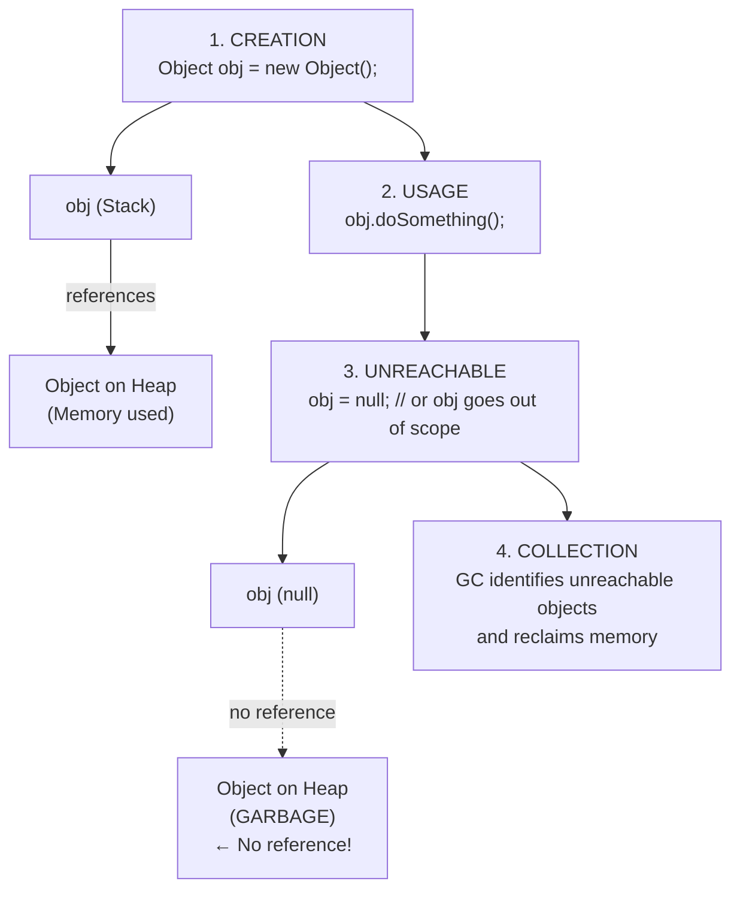

<details>
<summary>ASCII diagram (reference)</summary>

```text
┌─────────────────────────────────────────────────────────────────────────┐
│                    OBJECT LIFECYCLE                                      │
│                                                                          │
│   1. CREATION                                                           │
│      Object obj = new Object();                                         │
│      ┌─────────┐      ┌─────────────────┐                              │
│      │   obj   │─────►│  Object on Heap │                              │
│      │ (Stack) │      │  (Memory used)  │                              │
│      └─────────┘      └─────────────────┘                              │
│                                                                          │
│   2. USAGE                                                              │
│      obj.doSomething();                                                 │
│                                                                          │
│   3. UNREACHABLE                                                        │
│      obj = null;  // or obj goes out of scope                          │
│      ┌─────────┐      ┌─────────────────┐                              │
│      │   obj   │      │  Object on Heap │  ← No reference!             │
│      │ (null)  │      │  (GARBAGE)      │                              │
│      └─────────┘      └─────────────────┘                              │
│                                                                          │
│   4. COLLECTION                                                         │
│      GC identifies unreachable objects and reclaims memory             │
│                                                                          │
└─────────────────────────────────────────────────────────────────────────┘
```
</details>
```

If you understand that objects become garbage when no references point to them, you're ready.

---

## 1️⃣ What Problem Does This Exist to Solve?

### The Pain Point

In languages without garbage collection (C, C++), developers must manually manage memory:

```c
// C code - manual memory management
char* buffer = malloc(1024);  // Allocate
// ... use buffer ...
free(buffer);  // Must remember to free!
buffer = NULL;

// Common bugs:
// 1. Forget to free → Memory leak
// 2. Free twice → Crash (double free)
// 3. Use after free → Undefined behavior
// 4. Free wrong pointer → Corruption
```

**Problems with manual memory management**:

1. **Memory leaks**: Forget to free memory, application uses more and more RAM
2. **Dangling pointers**: Use memory after it's freed
3. **Double free**: Free the same memory twice
4. **Fragmentation**: Memory becomes scattered, can't allocate large blocks
5. **Developer burden**: Must track every allocation/deallocation

### What Systems Looked Like Before GC

Before automatic garbage collection:

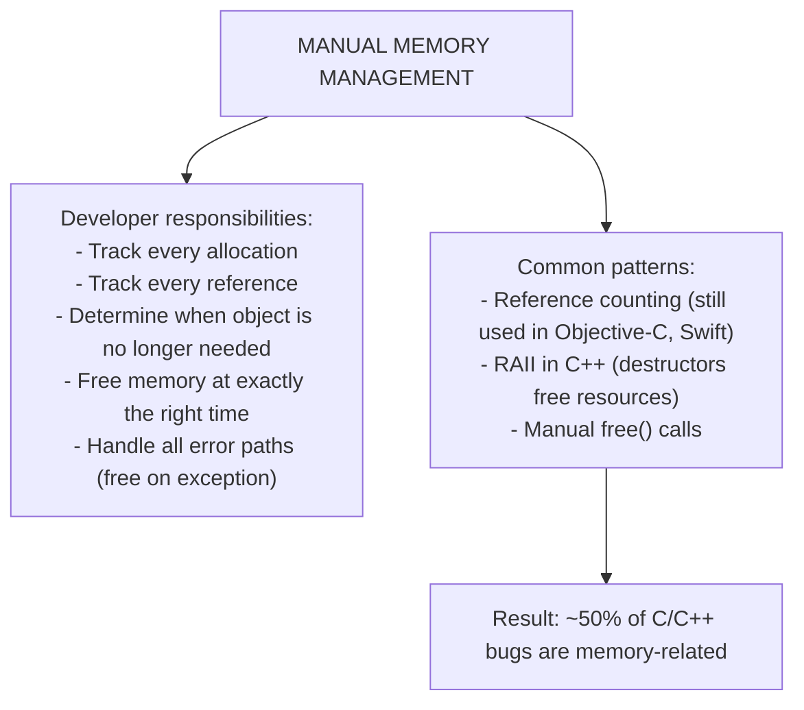

<details>
<summary>ASCII diagram (reference)</summary>

```text
┌─────────────────────────────────────────────────────────────────────────┐
│                    MANUAL MEMORY MANAGEMENT                              │
│                                                                          │
│   Developer responsibilities:                                           │
│   - Track every allocation                                              │
│   - Track every reference                                               │
│   - Determine when object is no longer needed                          │
│   - Free memory at exactly the right time                              │
│   - Handle all error paths (free on exception)                         │
│                                                                          │
│   Common patterns:                                                      │
│   - Reference counting (still used in Objective-C, Swift)              │
│   - RAII in C++ (destructors free resources)                           │
│   - Manual free() calls                                                 │
│                                                                          │
│   Result: ~50% of C/C++ bugs are memory-related                        │
│                                                                          │
└─────────────────────────────────────────────────────────────────────────┘
```
</details>
```

### What Breaks Without Proper GC Understanding

Even with automatic GC, problems occur:

1. **Memory leaks**: Objects still referenced but not needed (listeners, caches)
2. **GC pauses**: "Stop-the-world" pauses freeze your application
3. **OutOfMemoryError**: Heap fills up faster than GC can reclaim
4. **Thrashing**: GC runs constantly but can't free enough memory
5. **Performance degradation**: Wrong GC settings for your workload

### Real Examples of the Problem

**Twitter's GC Pauses (2010-2012)**: Twitter experienced multi-second GC pauses that caused the "Fail Whale." They switched from CMS to custom GC tuning, then later to G1.

**Minecraft's Lag Spikes**: Minecraft is notorious for GC-induced lag spikes. Players experience stuttering when GC runs, especially with large worlds.

**LinkedIn's Memory Leak**: A memory leak in a cache caused gradual performance degradation. Without understanding GC, the team couldn't diagnose the issue.

---

## 2️⃣ Intuition and Mental Model

### The Garbage Truck Analogy

Think of GC like garbage collection in a city:

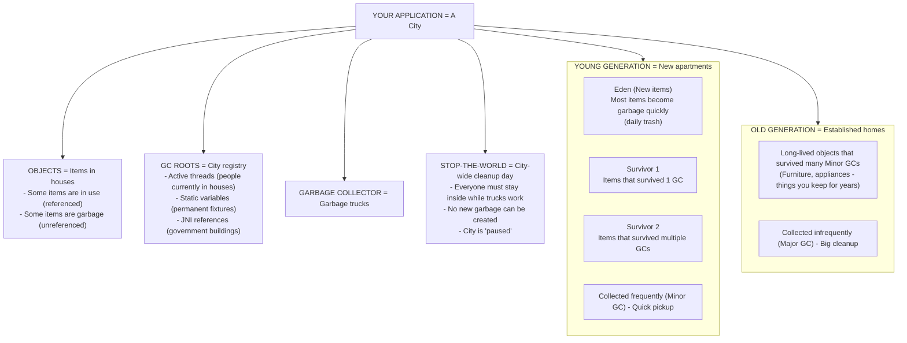

<details>
<summary>ASCII diagram (reference)</summary>

```text
┌─────────────────────────────────────────────────────────────────────────┐
│                    GARBAGE TRUCK ANALOGY                                 │
│                                                                          │
│   YOUR APPLICATION = A City                                             │
│   ─────────────────────────                                             │
│                                                                          │
│   OBJECTS = Items in houses                                             │
│   - Some items are in use (referenced)                                  │
│   - Some items are garbage (unreferenced)                              │
│                                                                          │
│   GC ROOTS = City registry                                              │
│   - Active threads (people currently in houses)                        │
│   - Static variables (permanent fixtures)                              │
│   - JNI references (government buildings)                              │
│                                                                          │
│   GARBAGE COLLECTOR = Garbage trucks                                    │
│                                                                          │
│   YOUNG GENERATION = New apartments                                     │
│   ┌─────────────────────────────────────────────────────────────────┐   │
│   │  Eden (New items)     │ Survivor 1 │ Survivor 2 │               │   │
│   │  Most items become    │ Items that │ Items that │               │   │
│   │  garbage quickly      │ survived   │ survived   │               │   │
│   │  (daily trash)        │ 1 GC       │ multiple   │               │   │
│   └─────────────────────────────────────────────────────────────────┘   │
│   Collected frequently (Minor GC) - Quick pickup                       │
│                                                                          │
│   OLD GENERATION = Established homes                                    │
│   ┌─────────────────────────────────────────────────────────────────┐   │
│   │  Long-lived objects that survived many Minor GCs                │   │
│   │  (Furniture, appliances - things you keep for years)           │   │
│   └─────────────────────────────────────────────────────────────────┘   │
│   Collected infrequently (Major GC) - Big cleanup                      │
│                                                                          │
│   STOP-THE-WORLD = City-wide cleanup day                               │
│   - Everyone must stay inside while trucks work                        │
│   - No new garbage can be created                                      │
│   - City is "paused"                                                   │
│                                                                          │
└─────────────────────────────────────────────────────────────────────────┘
```
</details>
```

**Key insights**:

- **Young Generation**: Where new objects are born, most die young
- **Old Generation**: Where long-lived objects eventually move
- **Minor GC**: Frequent, fast collection of young generation
- **Major GC**: Infrequent, slower collection of entire heap
- **Stop-the-World**: Application pauses during GC

---

## 3️⃣ How It Works Internally

### Heap Memory Structure

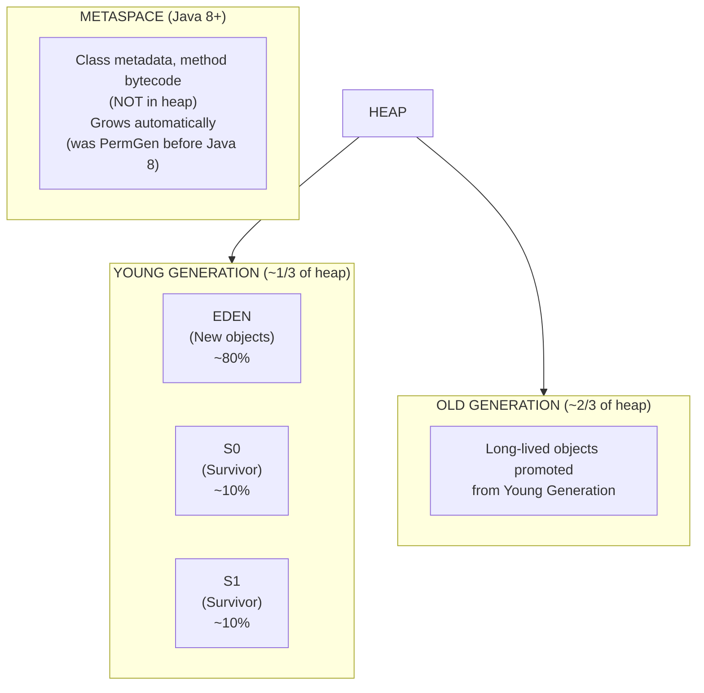

<details>
<summary>ASCII diagram (reference)</summary>

```text
┌─────────────────────────────────────────────────────────────────────────┐
│                    JVM HEAP STRUCTURE                                    │
│                                                                          │
│   ┌─────────────────────────────────────────────────────────────────┐   │
│   │                        HEAP                                      │   │
│   │  ┌────────────────────────────────────────────────────────────┐ │   │
│   │  │              YOUNG GENERATION (~1/3 of heap)               │ │   │
│   │  │  ┌──────────────────┬───────────┬───────────┐             │ │   │
│   │  │  │      EDEN        │    S0     │    S1     │             │ │   │
│   │  │  │   (New objects)  │(Survivor) │(Survivor) │             │ │   │
│   │  │  │      ~80%        │   ~10%    │   ~10%    │             │ │   │
│   │  │  └──────────────────┴───────────┴───────────┘             │ │   │
│   │  └────────────────────────────────────────────────────────────┘ │   │
│   │                                                                  │   │
│   │  ┌────────────────────────────────────────────────────────────┐ │   │
│   │  │              OLD GENERATION (~2/3 of heap)                 │ │   │
│   │  │                                                            │ │   │
│   │  │    Long-lived objects promoted from Young Generation      │ │   │
│   │  │                                                            │ │   │
│   │  └────────────────────────────────────────────────────────────┘ │   │
│   └─────────────────────────────────────────────────────────────────┘   │
│                                                                          │
│   ┌─────────────────────────────────────────────────────────────────┐   │
│   │                     METASPACE (Java 8+)                         │   │
│   │    Class metadata, method bytecode (NOT in heap)               │   │
│   │    Grows automatically (was PermGen before Java 8)             │   │
│   └─────────────────────────────────────────────────────────────────┘   │
│                                                                          │
└─────────────────────────────────────────────────────────────────────────┘
```
</details>
```

### Object Allocation Flow

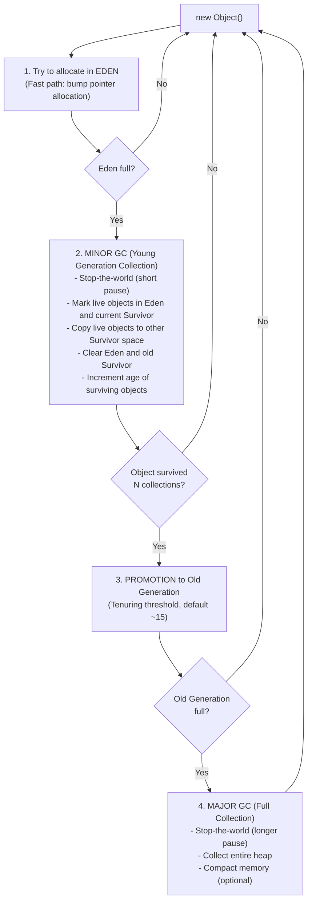

<details>
<summary>ASCII diagram (reference)</summary>

```text
┌─────────────────────────────────────────────────────────────────────────┐
│                    OBJECT ALLOCATION FLOW                                │
│                                                                          │
│   new Object()                                                          │
│        │                                                                 │
│        ▼                                                                 │
│   ┌─────────────────────────────────────────────────────────────────┐   │
│   │  1. Try to allocate in EDEN                                     │   │
│   │     (Fast path: bump pointer allocation)                        │   │
│   └─────────────────────────────────────────────────────────────────┘   │
│        │                                                                 │
│        │ Eden full?                                                     │
│        ▼                                                                 │
│   ┌─────────────────────────────────────────────────────────────────┐   │
│   │  2. MINOR GC (Young Generation Collection)                      │   │
│   │     - Stop-the-world (short pause)                              │   │
│   │     - Mark live objects in Eden and current Survivor           │   │
│   │     - Copy live objects to other Survivor space                │   │
│   │     - Clear Eden and old Survivor                              │   │
│   │     - Increment age of surviving objects                       │   │
│   └─────────────────────────────────────────────────────────────────┘   │
│        │                                                                 │
│        │ Object survived N collections?                                 │
│        ▼                                                                 │
│   ┌─────────────────────────────────────────────────────────────────┐   │
│   │  3. PROMOTION to Old Generation                                 │   │
│   │     (Tenuring threshold, default ~15)                          │   │
│   └─────────────────────────────────────────────────────────────────┘   │
│        │                                                                 │
│        │ Old Generation full?                                          │
│        ▼                                                                 │
│   ┌─────────────────────────────────────────────────────────────────┐   │
│   │  4. MAJOR GC (Full Collection)                                  │   │
│   │     - Stop-the-world (longer pause)                            │   │
│   │     - Collect entire heap                                       │   │
│   │     - Compact memory (optional)                                │   │
│   └─────────────────────────────────────────────────────────────────┘   │
│                                                                          │
└─────────────────────────────────────────────────────────────────────────┘
```
</details>
```

### How GC Finds Garbage (Mark and Sweep)

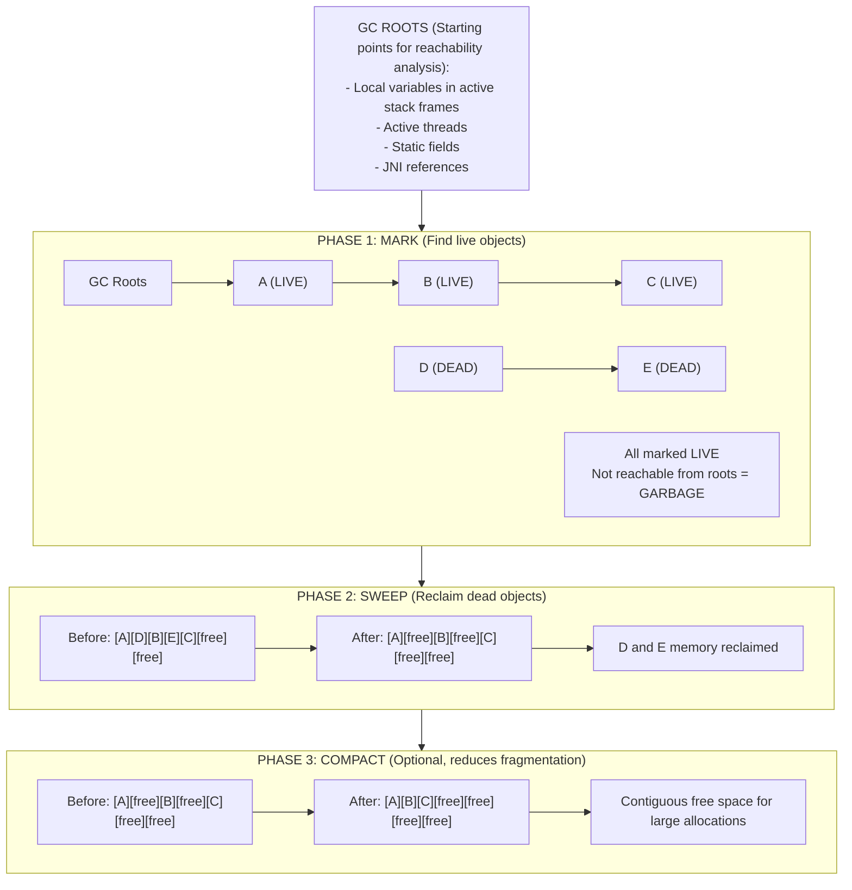

<details>
<summary>ASCII diagram (reference)</summary>

```text
┌─────────────────────────────────────────────────────────────────────────┐
│                    MARK AND SWEEP ALGORITHM                              │
│                                                                          │
│   GC ROOTS (Starting points for reachability analysis):                │
│   - Local variables in active stack frames                             │
│   - Active threads                                                      │
│   - Static fields                                                       │
│   - JNI references                                                      │
│                                                                          │
│   PHASE 1: MARK (Find live objects)                                    │
│   ┌─────────────────────────────────────────────────────────────────┐   │
│   │                                                                  │   │
│   │   GC Roots                                                      │   │
│   │      │                                                           │   │
│   │      ▼                                                           │   │
│   │   ┌─────┐     ┌─────┐     ┌─────┐                              │   │
│   │   │  A  │────►│  B  │────►│  C  │  ← All marked LIVE           │   │
│   │   │LIVE │     │LIVE │     │LIVE │                              │   │
│   │   └─────┘     └─────┘     └─────┘                              │   │
│   │                                                                  │   │
│   │   ┌─────┐     ┌─────┐                                          │   │
│   │   │  D  │────►│  E  │  ← Not reachable from roots = GARBAGE   │   │
│   │   │DEAD │     │DEAD │                                          │   │
│   │   └─────┘     └─────┘                                          │   │
│   │                                                                  │   │
│   └─────────────────────────────────────────────────────────────────┘   │
│                                                                          │
│   PHASE 2: SWEEP (Reclaim dead objects)                                │
│   ┌─────────────────────────────────────────────────────────────────┐   │
│   │                                                                  │   │
│   │   Before: [A][D][B][E][C][free][free]                          │   │
│   │                                                                  │   │
│   │   After:  [A][free][B][free][C][free][free]                    │   │
│   │                                                                  │   │
│   │   D and E memory reclaimed                                      │   │
│   │                                                                  │   │
│   └─────────────────────────────────────────────────────────────────┘   │
│                                                                          │
│   PHASE 3: COMPACT (Optional, reduces fragmentation)                   │
│   ┌─────────────────────────────────────────────────────────────────┐   │
│   │                                                                  │   │
│   │   Before: [A][free][B][free][C][free][free]                    │   │
│   │                                                                  │   │
│   │   After:  [A][B][C][free][free][free][free]                    │   │
│   │                                                                  │   │
│   │   Contiguous free space for large allocations                  │   │
│   │                                                                  │   │
│   └─────────────────────────────────────────────────────────────────┘   │
│                                                                          │
└─────────────────────────────────────────────────────────────────────────┘
```
</details>
```

---

## 4️⃣ Simulation-First Explanation

### Scenario: Web Application Object Lifecycle

```java
@RestController
public class OrderController {
    
    @PostMapping("/orders")
    public Order createOrder(@RequestBody OrderRequest request) {
        // Objects created during request processing
        Order order = new Order();                    // 1. Created in Eden
        List<OrderItem> items = new ArrayList<>();   // 2. Created in Eden
        
        for (ItemRequest item : request.getItems()) {
            OrderItem orderItem = new OrderItem();   // 3. Created in Eden
            items.add(orderItem);
        }
        
        order.setItems(items);
        orderRepository.save(order);                 // 4. Order persisted
        
        return order;                                // 5. Response sent
        // All request-scoped objects become garbage after response
    }
}
```

### Memory Trace

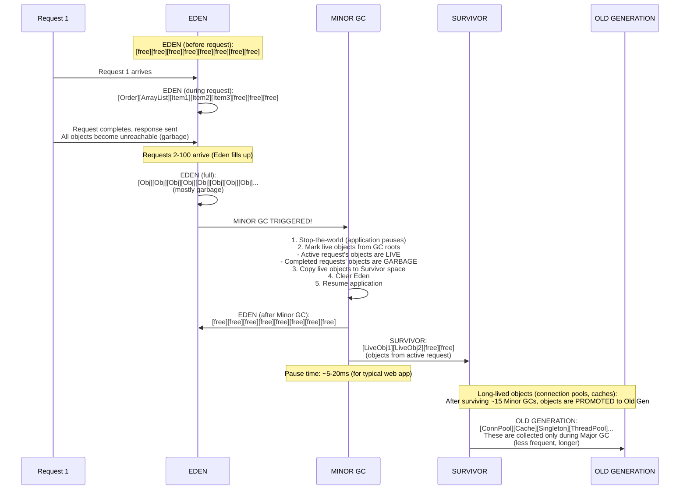

<details>
<summary>ASCII diagram (reference)</summary>

```text
┌─────────────────────────────────────────────────────────────────────────┐
│                    OBJECT LIFECYCLE TRACE                                │
│                                                                          │
│   Request 1 arrives:                                                    │
│   ═══════════════════════════════════════════════════════════════════   │
│                                                                          │
│   EDEN (before request):                                                │
│   [free][free][free][free][free][free][free][free]                     │
│                                                                          │
│   EDEN (during request):                                                │
│   [Order][ArrayList][Item1][Item2][Item3][free][free][free]            │
│                                                                          │
│   Request completes, response sent...                                   │
│   All objects become unreachable (garbage)                             │
│                                                                          │
│   ═══════════════════════════════════════════════════════════════════   │
│   Requests 2-100 arrive (Eden fills up):                               │
│   ═══════════════════════════════════════════════════════════════════   │
│                                                                          │
│   EDEN (full):                                                          │
│   [Obj][Obj][Obj][Obj][Obj][Obj][Obj][Obj]... (mostly garbage)        │
│                                                                          │
│   MINOR GC TRIGGERED!                                                   │
│   ═══════════════════════════════════════════════════════════════════   │
│                                                                          │
│   1. Stop-the-world (application pauses)                               │
│   2. Mark live objects from GC roots                                   │
│      - Active request's objects are LIVE                               │
│      - Completed requests' objects are GARBAGE                         │
│   3. Copy live objects to Survivor space                               │
│   4. Clear Eden                                                         │
│   5. Resume application                                                 │
│                                                                          │
│   EDEN (after Minor GC):                                                │
│   [free][free][free][free][free][free][free][free]                     │
│                                                                          │
│   SURVIVOR:                                                             │
│   [LiveObj1][LiveObj2][free][free]  (objects from active request)      │
│                                                                          │
│   Pause time: ~5-20ms (for typical web app)                            │
│                                                                          │
│   ═══════════════════════════════════════════════════════════════════   │
│   Long-lived objects (connection pools, caches):                       │
│   ═══════════════════════════════════════════════════════════════════   │
│                                                                          │
│   After surviving ~15 Minor GCs, objects are PROMOTED to Old Gen       │
│                                                                          │
│   OLD GENERATION:                                                       │
│   [ConnPool][Cache][Singleton][ThreadPool]...                          │
│                                                                          │
│   These are collected only during Major GC (less frequent, longer)     │
│                                                                          │
└─────────────────────────────────────────────────────────────────────────┘
```
</details>
```

---

## 5️⃣ How Engineers Actually Use This in Production

### Real Systems at Real Companies

**Netflix's GC Tuning**:

```bash
# Netflix's typical JVM settings for microservices
java -Xms4g -Xmx4g \                    # Fixed heap size (no resizing)
     -XX:+UseG1GC \                     # G1 Garbage Collector
     -XX:MaxGCPauseMillis=200 \         # Target max pause time
     -XX:InitiatingHeapOccupancyPercent=45 \  # Start concurrent marking earlier
     -XX:+ParallelRefProcEnabled \      # Parallel reference processing
     -XX:+UseStringDeduplication \      # Deduplicate String objects
     -Xlog:gc*:file=gc.log:time \       # GC logging
     -jar service.jar
```

**Twitter's GC Evolution**:

```
2010: CMS with frequent Full GCs → Multi-second pauses
2012: Tuned CMS, reduced heap size → Better but still pauses
2014: G1 GC with careful tuning → Sub-100ms pauses
2018: Investigating ZGC → Sub-10ms pauses
```

### Real Workflows and Tooling

**GC Log Analysis**:

```bash
# Enable GC logging (Java 9+)
java -Xlog:gc*:file=gc.log:time,uptime,level,tags -jar app.jar

# Sample GC log entry (G1):
[2024-01-15T10:30:45.123+0000][12.345s][info][gc] GC(42) Pause Young (Normal) 
    (G1 Evacuation Pause) 512M->128M(1024M) 15.234ms

# Meaning:
# GC(42) - 42nd GC event
# Pause Young - Minor GC
# 512M->128M - Heap usage before->after
# (1024M) - Total heap size
# 15.234ms - Pause duration
```

**Tools for GC Analysis**:

```java
// Programmatic GC monitoring
public class GCMonitor {
    
    public static void monitor() {
        for (GarbageCollectorMXBean gc : ManagementFactory.getGarbageCollectorMXBeans()) {
            System.out.println("GC Name: " + gc.getName());
            System.out.println("Collection count: " + gc.getCollectionCount());
            System.out.println("Collection time: " + gc.getCollectionTime() + "ms");
        }
        
        MemoryMXBean memory = ManagementFactory.getMemoryMXBean();
        MemoryUsage heap = memory.getHeapMemoryUsage();
        System.out.println("Heap used: " + heap.getUsed() / 1024 / 1024 + "MB");
        System.out.println("Heap max: " + heap.getMax() / 1024 / 1024 + "MB");
    }
}
```

### Production War Stories

**The Memory Leak That Wasn't**:

A team thought they had a memory leak because heap kept growing:

```
Heap usage over time:
Hour 1: 2GB
Hour 2: 3GB
Hour 3: 4GB (max)
Hour 4: 4GB (Full GC triggered, back to 1GB)
Hour 5: 2GB
...
```

**The reality**: This is normal! The JVM delays GC until necessary. The heap grows until it triggers collection. The team was alarmed by normal behavior.

**Lesson**: Understand that high heap usage isn't always a leak. Watch for:
- Heap usage after Full GC (should return to baseline)
- Increasing Full GC frequency
- OutOfMemoryError

---

## 6️⃣ How to Implement: GC Algorithms

### Serial GC (Single-threaded)

```mermaid
sequenceDiagram
    participant App as Application
    participant GC as GC Thread
    
    Note over App,GC: -XX:+UseSerialGC<br/>Characteristics:<br/>- Single thread for all GC work<br/>- Stop-the-world for entire collection<br/>- Simple, low overhead<br/>- Long pauses on large heaps
    
    App->>App: [Running...]
    App->>GC: [Paused]
    GC->>GC: [Mark]
    GC->>GC: [Sweep]
    GC->>GC: [Compact]
    GC->>App: [Running...]
    
    Note over App,GC: Best for:<br/>- Small heaps (&lt;100MB)<br/>- Single-core machines<br/>- Client applications
```

<details>
<summary>ASCII diagram (reference)</summary>

```text
┌─────────────────────────────────────────────────────────────────────────┐
│                    SERIAL GC                                             │
│                                                                          │
│   -XX:+UseSerialGC                                                      │
│                                                                          │
│   Characteristics:                                                      │
│   - Single thread for all GC work                                       │
│   - Stop-the-world for entire collection                               │
│   - Simple, low overhead                                                │
│   - Long pauses on large heaps                                          │
│                                                                          │
│   Application        GC Thread                                          │
│   ───────────        ─────────                                          │
│   [Running...]                                                          │
│   [Paused]           [Mark]                                             │
│   [Paused]           [Sweep]                                            │
│   [Paused]           [Compact]                                          │
│   [Running...]                                                          │
│                                                                          │
│   Best for:                                                             │
│   - Small heaps (<100MB)                                                │
│   - Single-core machines                                                │
│   - Client applications                                                 │
│                                                                          │
└─────────────────────────────────────────────────────────────────────────┘
```
</details>
```

### Parallel GC (Throughput Collector)

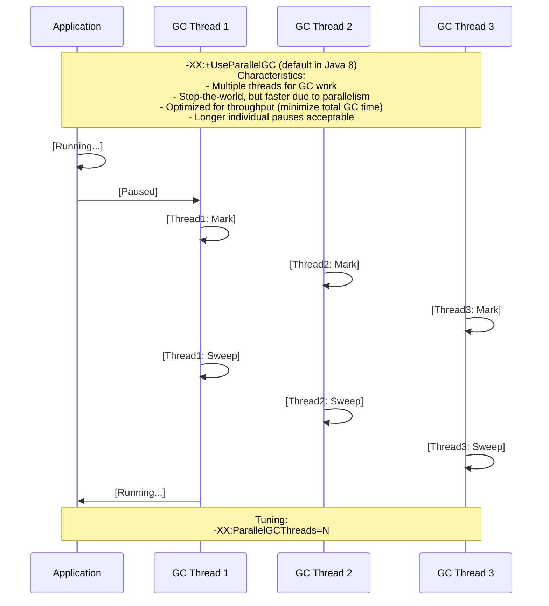

<details>
<summary>ASCII diagram (reference)</summary>

```text
┌─────────────────────────────────────────────────────────────────────────┐
│                    PARALLEL GC                                           │
│                                                                          │
│   -XX:+UseParallelGC (default in Java 8)                               │
│                                                                          │
│   Characteristics:                                                      │
│   - Multiple threads for GC work                                        │
│   - Stop-the-world, but faster due to parallelism                      │
│   - Optimized for throughput (minimize total GC time)                  │
│   - Longer individual pauses acceptable                                │
│                                                                          │
│   Application        GC Threads                                         │
│   ───────────        ──────────                                         │
│   [Running...]                                                          │
│   [Paused]           [Thread1: Mark][Thread2: Mark][Thread3: Mark]     │
│   [Paused]           [Thread1: Sweep][Thread2: Sweep][Thread3: Sweep]  │
│   [Running...]                                                          │
│                                                                          │
│   Tuning:                                                               │
│   -XX:ParallelGCThreads=N        # Number of GC threads                │
│   -XX:MaxGCPauseMillis=N         # Target pause time                   │
│   -XX:GCTimeRatio=N              # Throughput goal (1/(1+N))           │
│                                                                          │
│   Best for:                                                             │
│   - Batch processing                                                    │
│   - Background jobs                                                     │
│   - When throughput matters more than latency                          │
│                                                                          │
└─────────────────────────────────────────────────────────────────────────┘
```
</details>
```

### G1 GC (Garbage First)

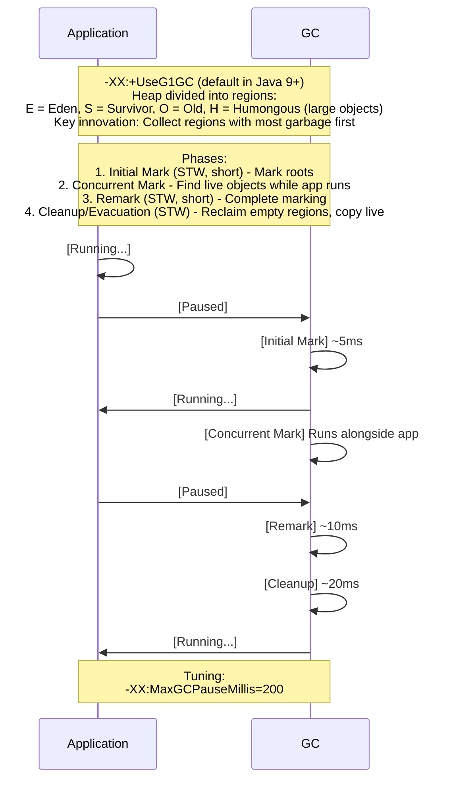

<details>
<summary>ASCII diagram (reference)</summary>

```text
┌─────────────────────────────────────────────────────────────────────────┐
│                    G1 GC (Garbage First)                                 │
│                                                                          │
│   -XX:+UseG1GC (default in Java 9+)                                    │
│                                                                          │
│   Heap divided into regions:                                            │
│   ┌────┬────┬────┬────┬────┬────┬────┬────┬────┬────┬────┬────┐        │
│   │ E  │ E  │ S  │ O  │ O  │ E  │ H  │ O  │ E  │ S  │ O  │free│        │
│   └────┴────┴────┴────┴────┴────┴────┴────┴────┴────┴────┴────┘        │
│   E = Eden, S = Survivor, O = Old, H = Humongous (large objects)       │
│                                                                          │
│   Key innovation: Collect regions with most garbage first               │
│                                                                          │
│   Phases:                                                               │
│   1. Initial Mark (STW, short) - Mark roots                            │
│   2. Concurrent Mark - Find live objects while app runs                │
│   3. Remark (STW, short) - Complete marking                            │
│   4. Cleanup/Evacuation (STW) - Reclaim empty regions, copy live       │
│                                                                          │
│   Application        GC                                                 │
│   ───────────        ──                                                 │
│   [Running...]                                                          │
│   [Paused]           [Initial Mark]        ~5ms                        │
│   [Running...]       [Concurrent Mark]     Runs alongside app          │
│   [Paused]           [Remark]              ~10ms                        │
│   [Paused]           [Cleanup]             ~20ms                        │
│   [Running...]                                                          │
│                                                                          │
│   Tuning:                                                               │
│   -XX:MaxGCPauseMillis=200       # Target pause (default 200ms)        │
│   -XX:G1HeapRegionSize=N         # Region size (1-32MB)                │
│   -XX:InitiatingHeapOccupancyPercent=45  # When to start marking       │
│                                                                          │
│   Best for:                                                             │
│   - Large heaps (>4GB)                                                  │
│   - Applications needing predictable pauses                            │
│   - General-purpose, balanced workloads                                │
│                                                                          │
└─────────────────────────────────────────────────────────────────────────┘
```
</details>
```

### ZGC (Low Latency)

```mermaid
sequenceDiagram
    participant App as Application
    participant GC as GC
    
    Note over App,GC: -XX:+UseZGC (Java 11+, production-ready in Java 15+)<br/>Characteristics:<br/>- Sub-millisecond pauses (typically &lt;1ms)<br/>- Pauses don't increase with heap size<br/>- Supports heaps from 8MB to 16TB<br/>- Concurrent everything (mark, relocate, remap)
    
    Note over App,GC: How it achieves low latency:<br/>- Colored pointers (metadata in pointer bits)<br/>- Load barriers (check/fix references on read)<br/>- Concurrent relocation
    
    App->>App: [Running...]
    GC->>GC: [Concurrent Mark]
    App->>GC: [Paused]
    GC->>GC: [Pause Mark Start] &lt;1ms
    GC->>App: [Running...]
    GC->>GC: [Concurrent Mark]
    App->>GC: [Paused]
    GC->>GC: [Pause Mark End] &lt;1ms
    GC->>App: [Running...]
    GC->>GC: [Concurrent Relocate]
    GC->>GC: [Concurrent Remap]
    
    Note over App,GC: Tuning (minimal needed):<br/>-XX:+UseZGC<br/>-Xmx&lt;size&gt; # Set max heap<br/>-XX:SoftMaxHeapSize=&lt;size&gt; # Soft limit for GC to aim for<br/><br/>Best for:<br/>- Latency-sensitive applications<br/>- Large heaps where G1 pauses are too long<br/>- Real-time systems
```

<details>
<summary>ASCII diagram (reference)</summary>

```text
┌─────────────────────────────────────────────────────────────────────────┐
│                    ZGC (Z Garbage Collector)                             │
│                                                                          │
│   -XX:+UseZGC (Java 11+, production-ready in Java 15+)                 │
│                                                                          │
│   Characteristics:                                                      │
│   - Sub-millisecond pauses (typically <1ms)                            │
│   - Pauses don't increase with heap size                               │
│   - Supports heaps from 8MB to 16TB                                    │
│   - Concurrent everything (mark, relocate, remap)                      │
│                                                                          │
│   How it achieves low latency:                                          │
│   - Colored pointers (metadata in pointer bits)                        │
│   - Load barriers (check/fix references on read)                       │
│   - Concurrent relocation                                               │
│                                                                          │
│   Application        GC                                                 │
│   ───────────        ──                                                 │
│   [Running...]       [Concurrent Mark]                                  │
│   [Paused]           [Pause Mark Start]    <1ms                        │
│   [Running...]       [Concurrent Mark]                                  │
│   [Paused]           [Pause Mark End]      <1ms                        │
│   [Running...]       [Concurrent Relocate]                             │
│   [Running...]       [Concurrent Remap]                                │
│                                                                          │
│   Tuning (minimal needed):                                              │
│   -XX:+UseZGC                                                          │
│   -Xmx<size>                     # Set max heap                        │
│   -XX:SoftMaxHeapSize=<size>     # Soft limit for GC to aim for        │
│                                                                          │
│   Best for:                                                             │
│   - Latency-sensitive applications                                      │
│   - Large heaps where G1 pauses are too long                          │
│   - Real-time systems                                                   │
│                                                                          │
└─────────────────────────────────────────────────────────────────────────┘
```
</details>
```

### Shenandoah GC

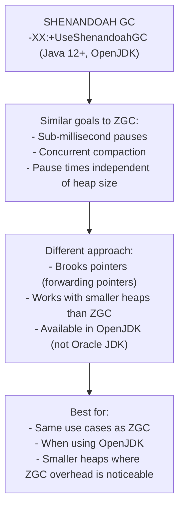

<details>
<summary>ASCII diagram (reference)</summary>

```text
┌─────────────────────────────────────────────────────────────────────────┐
│                    SHENANDOAH GC                                         │
│                                                                          │
│   -XX:+UseShenandoahGC (Java 12+, OpenJDK)                             │
│                                                                          │
│   Similar goals to ZGC:                                                 │
│   - Sub-millisecond pauses                                              │
│   - Concurrent compaction                                               │
│   - Pause times independent of heap size                               │
│                                                                          │
│   Different approach:                                                   │
│   - Brooks pointers (forwarding pointers)                              │
│   - Works with smaller heaps than ZGC                                  │
│   - Available in OpenJDK (not Oracle JDK)                              │
│                                                                          │
│   Best for:                                                             │
│   - Same use cases as ZGC                                              │
│   - When using OpenJDK                                                 │
│   - Smaller heaps where ZGC overhead is noticeable                    │
│                                                                          │
└─────────────────────────────────────────────────────────────────────────┘
```
</details>
```

### GC Algorithm Comparison

| GC           | Pause Time    | Throughput | Heap Size  | Use Case                |
| ------------ | ------------- | ---------- | ---------- | ----------------------- |
| Serial       | Long          | Low        | <100MB     | Single-core, small heap |
| Parallel     | Medium-Long   | High       | Medium     | Batch processing        |
| G1           | Predictable   | Medium     | >4GB       | General purpose         |
| ZGC          | <1ms          | Medium     | Any        | Low latency             |
| Shenandoah   | <1ms          | Medium     | Any        | Low latency (OpenJDK)   |

---

## 7️⃣ Tradeoffs, Pitfalls, and Common Mistakes

### Common Mistakes

**1. Setting Heap Too Large**

```bash
# WRONG: Huge heap means huge GC pauses
java -Xmx64g -jar app.jar  # Full GC could take minutes!

# RIGHT: Size heap appropriately
# Rule of thumb: 2-4x live data size
java -Xmx8g -jar app.jar
```

**2. Not Setting -Xms Equal to -Xmx**

```bash
# WRONG: JVM wastes time resizing heap
java -Xms512m -Xmx4g -jar app.jar

# RIGHT: Fixed heap size, no resizing overhead
java -Xms4g -Xmx4g -jar app.jar
```

**3. Ignoring GC Logs**

```bash
# WRONG: Flying blind
java -jar app.jar

# RIGHT: Always enable GC logging in production
java -Xlog:gc*:file=gc.log:time,uptime:filecount=5,filesize=10M -jar app.jar
```

**4. Calling System.gc()**

```java
// WRONG: Forcing GC is almost always wrong
System.gc();  // Just a hint, may be ignored
Runtime.getRuntime().gc();  // Same thing

// RIGHT: Let the JVM decide when to GC
// If you think you need System.gc(), you probably have a design problem
```

**5. Creating Unnecessary Objects in Hot Paths**

```java
// WRONG: Object allocation in tight loop
for (int i = 0; i < 1_000_000; i++) {
    String s = new String("constant");  // 1M allocations!
    process(s);
}

// RIGHT: Reuse objects
String s = "constant";  // Interned, reused
for (int i = 0; i < 1_000_000; i++) {
    process(s);
}
```

### Memory Leak Patterns

```java
// LEAK 1: Static collections that grow forever
public class LeakyCache {
    private static final Map<String, Object> cache = new HashMap<>();
    
    public void add(String key, Object value) {
        cache.put(key, value);  // Never removed!
    }
}

// FIX: Use bounded cache or weak references
private static final Map<String, Object> cache = 
    new LinkedHashMap<>(100, 0.75f, true) {
        @Override
        protected boolean removeEldestEntry(Map.Entry eldest) {
            return size() > 100;
        }
    };

// LEAK 2: Listeners not removed
public class EventSource {
    private List<Listener> listeners = new ArrayList<>();
    
    public void addListener(Listener l) {
        listeners.add(l);
    }
    // No removeListener! Listeners live forever
}

// LEAK 3: ThreadLocal not cleaned up
private static final ThreadLocal<byte[]> buffer = 
    ThreadLocal.withInitial(() -> new byte[1024 * 1024]);

public void process() {
    byte[] b = buffer.get();
    // ... use buffer ...
    // LEAK: If using thread pool, buffer stays in thread forever!
}

// FIX: Always remove ThreadLocal
public void process() {
    try {
        byte[] b = buffer.get();
        // ... use buffer ...
    } finally {
        buffer.remove();  // Clean up!
    }
}
```

---

## 8️⃣ When NOT to Tune GC

### Situations Where Default Settings Are Fine

**1. Small Applications**

```bash
# For apps with <1GB heap, defaults are usually fine
java -Xmx512m -jar small-app.jar
```

**2. Short-Lived Processes**

```bash
# For CLI tools, scripts, batch jobs
# GC tuning doesn't matter if process runs for seconds
java -jar batch-job.jar
```

**3. When You Haven't Measured**

```
RULE: Don't tune what you haven't measured!

Before tuning:
1. Enable GC logging
2. Identify actual problems (pause times, frequency)
3. Establish baseline metrics
4. Make ONE change at a time
5. Measure impact
```

### Better Alternatives to GC Tuning

| Problem                    | Instead of GC Tuning          | Try This                         |
| -------------------------- | ----------------------------- | -------------------------------- |
| High allocation rate       | Tune GC                       | Reduce allocations (pooling)     |
| Large objects              | Tune region size              | Avoid large arrays               |
| Long pauses                | Tune pause target             | Use low-latency GC (ZGC)         |
| Memory leaks               | Increase heap                 | Fix the leak                     |
| OutOfMemoryError           | Increase heap                 | Analyze heap dump, fix root cause|

---

## 9️⃣ Comparison: GC Selection Guide

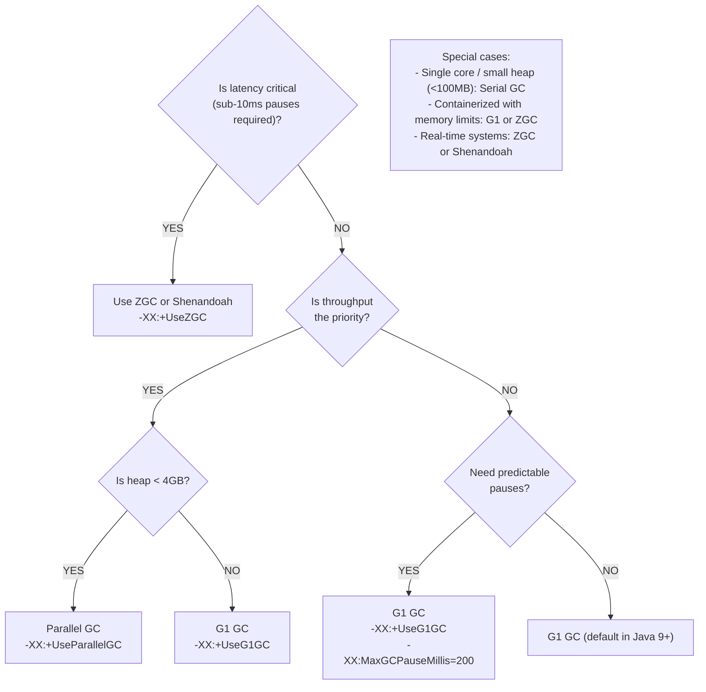

<details>
<summary>ASCII diagram (reference)</summary>

```text
┌─────────────────────────────────────────────────────────────────────────┐
│                    GC SELECTION DECISION TREE                            │
│                                                                          │
│   Is latency critical (sub-10ms pauses required)?                       │
│   │                                                                      │
│   ├── YES → Use ZGC or Shenandoah                                       │
│   │         -XX:+UseZGC                                                 │
│   │                                                                      │
│   └── NO → Is throughput the priority?                                  │
│            │                                                             │
│            ├── YES → Is heap < 4GB?                                     │
│            │         │                                                   │
│            │         ├── YES → Parallel GC                              │
│            │         │         -XX:+UseParallelGC                       │
│            │         │                                                   │
│            │         └── NO → G1 GC                                     │
│            │                  -XX:+UseG1GC                              │
│            │                                                             │
│            └── NO → Need predictable pauses?                            │
│                     │                                                    │
│                     ├── YES → G1 GC                                     │
│                     │         -XX:+UseG1GC                              │
│                     │         -XX:MaxGCPauseMillis=200                  │
│                     │                                                    │
│                     └── NO → G1 GC (default in Java 9+)                │
│                                                                          │
│   Special cases:                                                        │
│   - Single core / small heap (<100MB): Serial GC                       │
│   - Containerized with memory limits: G1 or ZGC                        │
│   - Real-time systems: ZGC or Shenandoah                               │
│                                                                          │
└─────────────────────────────────────────────────────────────────────────┘
```
</details>
```

---

## 🔟 Interview Follow-Up Questions WITH Answers

### L4 (Entry-Level) Questions

**Q: What is garbage collection in Java?**

A: Garbage collection is automatic memory management. The JVM automatically identifies objects that are no longer reachable (no references point to them) and reclaims their memory. This frees developers from manual memory management (like in C/C++) and prevents common bugs like memory leaks, double-free, and use-after-free.

The GC works by tracing from "GC roots" (active threads, static variables, etc.) to find all reachable objects. Anything not reachable is garbage and can be collected.

**Q: What is the difference between minor GC and major GC?**

A: Minor GC (Young Generation Collection):
- Collects only the young generation (Eden + Survivor spaces)
- Fast because most young objects are garbage
- Happens frequently
- Short pause times (milliseconds)

Major GC (Full GC):
- Collects the entire heap (young + old generation)
- Slower because it processes more memory
- Happens less frequently
- Longer pause times (can be seconds on large heaps)

Most objects die young, so minor GC is very efficient. Objects that survive multiple minor GCs are promoted to old generation.

### L5 (Mid-Level) Questions

**Q: Explain the G1 garbage collector.**

A: G1 (Garbage First) is a server-style collector designed for large heaps with predictable pause times.

Key features:
1. **Region-based heap**: Heap divided into equal-sized regions (1-32MB) that can be Eden, Survivor, Old, or Humongous
2. **Garbage First**: Collects regions with most garbage first for efficiency
3. **Pause time goal**: Tries to meet `-XX:MaxGCPauseMillis` target
4. **Concurrent marking**: Most marking happens while application runs
5. **Incremental compaction**: Compacts a few regions at a time

Phases: Initial Mark (STW) → Concurrent Mark → Remark (STW) → Cleanup (STW)

Best for: Large heaps (>4GB), applications needing predictable pauses, general-purpose workloads.

**Q: How would you diagnose a memory leak in Java?**

A: Step-by-step approach:

1. **Confirm it's a leak**: Check if heap usage after Full GC keeps increasing over time

2. **Enable GC logging**: Look for increasing "heap after GC" values
   ```bash
   java -Xlog:gc*:file=gc.log:time -jar app.jar
   ```

3. **Take heap dumps**: Capture memory state
   ```bash
   jmap -dump:format=b,file=heap.hprof <pid>
   ```

4. **Analyze with tools**: Use Eclipse MAT, VisualVM, or YourKit
   - Look for objects with unexpectedly high retention
   - Check dominator tree for largest retainers
   - Find GC roots keeping objects alive

5. **Common culprits**:
   - Static collections that grow
   - Listeners not removed
   - ThreadLocal not cleaned
   - Caches without eviction

### L6 (Senior) Questions

**Q: How would you tune GC for a latency-sensitive trading application?**

A: For trading systems where microseconds matter:

1. **Choose the right GC**: ZGC or Shenandoah for sub-millisecond pauses
   ```bash
   -XX:+UseZGC
   ```

2. **Size heap appropriately**: Not too large (more to scan), not too small (frequent GC)
   - Profile to find live data size
   - Set heap to 2-3x live data

3. **Minimize allocation**:
   - Object pooling for frequently created objects
   - Primitive arrays instead of object arrays
   - Avoid autoboxing in hot paths

4. **Pre-allocate**: Allocate buffers, collections at startup

5. **Warm up**: Run through typical paths before accepting traffic

6. **Consider off-heap**: For large data sets, use ByteBuffer or libraries like Chronicle

7. **Monitor and tune**:
   ```bash
   -Xlog:gc*:file=gc.log:time
   -XX:+PrintGCApplicationStoppedTime
   ```

8. **Test under load**: GC behavior changes under memory pressure

**Q: Explain how ZGC achieves sub-millisecond pauses.**

A: ZGC uses several techniques:

1. **Colored pointers**: Stores GC metadata in unused bits of 64-bit pointers (on 64-bit systems). This allows GC to track object state without separate data structures.

2. **Load barriers**: When application reads a reference, a small code snippet checks if the reference needs updating. This allows concurrent relocation without stopping the application.

3. **Concurrent phases**: Almost all work is concurrent:
   - Concurrent marking
   - Concurrent relocation
   - Concurrent reference processing

4. **Only two tiny STW pauses**:
   - Pause Mark Start: Start of marking (~1ms)
   - Pause Mark End: End of marking (~1ms)

5. **No compaction pause**: Objects are relocated concurrently. When an object moves, the load barrier updates references on access.

6. **Region-based**: Heap divided into regions that can be collected independently.

The key insight is that by using load barriers, ZGC can move objects while the application is running. The application always sees consistent state because barriers fix up references on the fly.

---

## 1️⃣1️⃣ One Clean Mental Summary

Garbage Collection is Java's automatic memory management system that frees developers from manual allocation/deallocation. The heap is divided into generations: Young (Eden + Survivors) for new objects and Old for long-lived objects. Most objects die young, so Minor GC (young generation only) is fast and frequent. Major GC (full heap) is slower but less frequent. The key metrics are pause time (how long the app stops) and throughput (how much time is spent doing actual work vs GC). G1 is the default, balancing pause times and throughput. For latency-critical applications, ZGC or Shenandoah provide sub-millisecond pauses. The most important tuning is choosing the right GC for your workload and sizing the heap appropriately (2-4x live data). Don't tune without measuring first. Enable GC logs, establish baselines, and make one change at a time. Most "GC problems" are actually application problems: memory leaks, excessive allocation, or inappropriate heap size.

