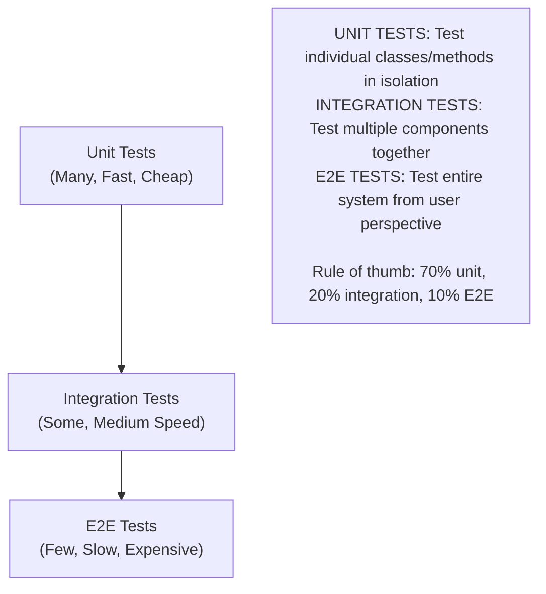
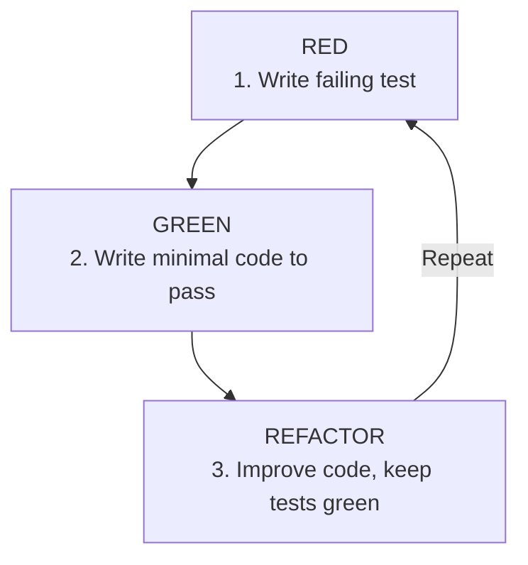

# 🧪 Testing in Java

---

## 0️⃣ Prerequisites

Before diving into Testing in Java, you need to understand:

- **OOP Fundamentals**: Classes, interfaces, inheritance
- **Dependency Injection**: Constructor injection, Spring DI
- **Basic Java Syntax**: Methods, annotations

---

## 1️⃣ Why Testing Matters



<details>
<summary>ASCII diagram (reference)</summary>

```text
┌─────────────────────────────────────────────────────────────────────────┐
│                    THE TESTING PYRAMID                                   │
│                                                                          │
│                         /\                                              │
│                        /  \                                             │
│                       /    \       E2E Tests                            │
│                      / E2E  \      (Few, Slow, Expensive)               │
│                     /────────\                                          │
│                    /          \                                         │
│                   / Integration \   Integration Tests                   │
│                  /    Tests      \  (Some, Medium Speed)                │
│                 /────────────────\                                      │
│                /                  \                                     │
│               /    Unit Tests      \  Unit Tests                        │
│              /                      \ (Many, Fast, Cheap)               │
│             /────────────────────────\                                  │
│                                                                          │
│   UNIT TESTS: Test individual classes/methods in isolation              │
│   INTEGRATION TESTS: Test multiple components together                  │
│   E2E TESTS: Test entire system from user perspective                  │
│                                                                          │
│   Rule of thumb: 70% unit, 20% integration, 10% E2E                    │
│                                                                          │
└─────────────────────────────────────────────────────────────────────────┘
```
</details>
```

---

## 2️⃣ JUnit 5 Fundamentals

### Basic Test Structure

```java
import org.junit.jupiter.api.*;
import static org.junit.jupiter.api.Assertions.*;

class CalculatorTest {
    
    private Calculator calculator;
    
    @BeforeAll
    static void setUpAll() {
        // Runs once before all tests (must be static)
        System.out.println("Starting calculator tests");
    }
    
    @BeforeEach
    void setUp() {
        // Runs before each test
        calculator = new Calculator();
    }
    
    @Test
    void shouldAddTwoNumbers() {
        // Given
        int a = 5;
        int b = 3;
        
        // When
        int result = calculator.add(a, b);
        
        // Then
        assertEquals(8, result);
    }
    
    @Test
    @DisplayName("Should throw exception when dividing by zero")
    void shouldThrowExceptionWhenDividingByZero() {
        assertThrows(ArithmeticException.class, () -> {
            calculator.divide(10, 0);
        });
    }
    
    @Test
    @Disabled("Not implemented yet")
    void shouldMultiplyTwoNumbers() {
        // TODO: Implement
    }
    
    @AfterEach
    void tearDown() {
        // Runs after each test
        calculator = null;
    }
    
    @AfterAll
    static void tearDownAll() {
        // Runs once after all tests
        System.out.println("Finished calculator tests");
    }
}
```

### Assertions

```java
import static org.junit.jupiter.api.Assertions.*;

class AssertionExamples {
    
    @Test
    void basicAssertions() {
        // Equality
        assertEquals(4, 2 + 2);
        assertEquals("hello", "hello");
        assertNotEquals(5, 2 + 2);
        
        // Boolean
        assertTrue(5 > 3);
        assertFalse(3 > 5);
        
        // Null
        assertNull(null);
        assertNotNull("value");
        
        // Same reference
        String s1 = "test";
        String s2 = s1;
        assertSame(s1, s2);
        
        // Arrays
        assertArrayEquals(new int[]{1, 2, 3}, new int[]{1, 2, 3});
        
        // Iterables
        assertIterableEquals(List.of(1, 2, 3), List.of(1, 2, 3));
    }
    
    @Test
    void exceptionAssertions() {
        // Assert exception is thrown
        Exception exception = assertThrows(IllegalArgumentException.class, () -> {
            throw new IllegalArgumentException("Invalid value");
        });
        
        assertEquals("Invalid value", exception.getMessage());
        
        // Assert no exception
        assertDoesNotThrow(() -> {
            // This should not throw
        });
    }
    
    @Test
    void groupedAssertions() {
        User user = new User("Alice", 25);
        
        // All assertions run, failures reported together
        assertAll("user",
            () -> assertEquals("Alice", user.getName()),
            () -> assertEquals(25, user.getAge()),
            () -> assertNotNull(user.getId())
        );
    }
    
    @Test
    void timeoutAssertions() {
        // Assert completes within timeout
        assertTimeout(Duration.ofSeconds(1), () -> {
            // Should complete in less than 1 second
            Thread.sleep(100);
        });
        
        // Preemptively abort if timeout exceeded
        assertTimeoutPreemptively(Duration.ofSeconds(1), () -> {
            // Will be interrupted if takes too long
        });
    }
}
```

### Parameterized Tests

```java
import org.junit.jupiter.params.ParameterizedTest;
import org.junit.jupiter.params.provider.*;

class ParameterizedTestExamples {
    
    @ParameterizedTest
    @ValueSource(ints = {1, 2, 3, 4, 5})
    void shouldBePositive(int number) {
        assertTrue(number > 0);
    }
    
    @ParameterizedTest
    @ValueSource(strings = {"", "  ", "\t", "\n"})
    void shouldBeBlank(String input) {
        assertTrue(input.isBlank());
    }
    
    @ParameterizedTest
    @NullAndEmptySource
    @ValueSource(strings = {"  ", "\t"})
    void shouldBeNullOrBlank(String input) {
        assertTrue(input == null || input.isBlank());
    }
    
    @ParameterizedTest
    @EnumSource(DayOfWeek.class)
    void shouldHandleAllDays(DayOfWeek day) {
        assertNotNull(day);
    }
    
    @ParameterizedTest
    @EnumSource(value = DayOfWeek.class, names = {"SATURDAY", "SUNDAY"})
    void shouldBeWeekend(DayOfWeek day) {
        assertTrue(day == DayOfWeek.SATURDAY || day == DayOfWeek.SUNDAY);
    }
    
    @ParameterizedTest
    @CsvSource({
        "1, 2, 3",
        "5, 5, 10",
        "10, -5, 5"
    })
    void shouldAddNumbers(int a, int b, int expected) {
        assertEquals(expected, a + b);
    }
    
    @ParameterizedTest
    @CsvFileSource(resources = "/test-data.csv", numLinesToSkip = 1)
    void shouldProcessCsvData(String name, int age) {
        assertNotNull(name);
        assertTrue(age > 0);
    }
    
    @ParameterizedTest
    @MethodSource("provideStringsForIsBlank")
    void shouldCheckBlank(String input, boolean expected) {
        assertEquals(expected, input == null || input.isBlank());
    }
    
    static Stream<Arguments> provideStringsForIsBlank() {
        return Stream.of(
            Arguments.of(null, true),
            Arguments.of("", true),
            Arguments.of("  ", true),
            Arguments.of("hello", false)
        );
    }
}
```

### Nested Tests

```java
@DisplayName("Order Service Tests")
class OrderServiceTest {
    
    private OrderService orderService;
    
    @BeforeEach
    void setUp() {
        orderService = new OrderService();
    }
    
    @Nested
    @DisplayName("When creating orders")
    class WhenCreatingOrders {
        
        @Test
        @DisplayName("Should create order with valid items")
        void shouldCreateOrderWithValidItems() {
            Order order = orderService.createOrder(List.of(
                new Item("Product 1", 10.0),
                new Item("Product 2", 20.0)
            ));
            
            assertNotNull(order.getId());
            assertEquals(2, order.getItems().size());
        }
        
        @Test
        @DisplayName("Should throw when items are empty")
        void shouldThrowWhenItemsEmpty() {
            assertThrows(IllegalArgumentException.class, () -> {
                orderService.createOrder(List.of());
            });
        }
    }
    
    @Nested
    @DisplayName("When calculating totals")
    class WhenCalculatingTotals {
        
        private Order order;
        
        @BeforeEach
        void setUp() {
            order = new Order(List.of(
                new Item("A", 10.0),
                new Item("B", 20.0)
            ));
        }
        
        @Test
        @DisplayName("Should calculate subtotal correctly")
        void shouldCalculateSubtotal() {
            assertEquals(30.0, order.getSubtotal());
        }
        
        @Test
        @DisplayName("Should apply discount")
        void shouldApplyDiscount() {
            order.applyDiscount(0.1);
            assertEquals(27.0, order.getTotal());
        }
    }
}
```

---

## 3️⃣ Mockito

### Basic Mocking

```java
import org.junit.jupiter.api.Test;
import org.junit.jupiter.api.extension.ExtendWith;
import org.mockito.Mock;
import org.mockito.InjectMocks;
import org.mockito.junit.jupiter.MockitoExtension;
import static org.mockito.Mockito.*;

@ExtendWith(MockitoExtension.class)
class UserServiceTest {
    
    @Mock
    private UserRepository userRepository;
    
    @Mock
    private EmailService emailService;
    
    @InjectMocks
    private UserService userService;
    
    @Test
    void shouldFindUserById() {
        // Given
        User expectedUser = new User("1", "Alice");
        when(userRepository.findById("1")).thenReturn(Optional.of(expectedUser));
        
        // When
        Optional<User> result = userService.findById("1");
        
        // Then
        assertTrue(result.isPresent());
        assertEquals("Alice", result.get().getName());
        verify(userRepository).findById("1");
    }
    
    @Test
    void shouldCreateUserAndSendEmail() {
        // Given
        User user = new User(null, "Bob");
        User savedUser = new User("1", "Bob");
        when(userRepository.save(any(User.class))).thenReturn(savedUser);
        
        // When
        User result = userService.createUser(user);
        
        // Then
        assertEquals("1", result.getId());
        verify(userRepository).save(user);
        verify(emailService).sendWelcomeEmail(savedUser);
    }
}
```

### Stubbing

```java
@Test
void stubbingExamples() {
    // Return value
    when(repository.findById("1")).thenReturn(Optional.of(user));
    
    // Return different values on consecutive calls
    when(repository.findById("1"))
        .thenReturn(Optional.empty())
        .thenReturn(Optional.of(user));
    
    // Throw exception
    when(repository.findById("invalid"))
        .thenThrow(new RuntimeException("Not found"));
    
    // Answer (dynamic response)
    when(repository.save(any(User.class)))
        .thenAnswer(invocation -> {
            User user = invocation.getArgument(0);
            user.setId(UUID.randomUUID().toString());
            return user;
        });
    
    // Void methods
    doNothing().when(emailService).sendEmail(any());
    doThrow(new RuntimeException()).when(emailService).sendEmail(null);
    
    // Argument matchers
    when(repository.findByName(anyString())).thenReturn(List.of(user));
    when(repository.findByAge(eq(25))).thenReturn(List.of(user));
    when(repository.findByNameAndAge(anyString(), anyInt())).thenReturn(user);
}
```

### Verification

```java
@Test
void verificationExamples() {
    // Verify method was called
    verify(repository).save(user);
    
    // Verify method was called with specific argument
    verify(repository).save(argThat(u -> u.getName().equals("Alice")));
    
    // Verify method was called N times
    verify(repository, times(2)).findById(anyString());
    
    // Verify method was never called
    verify(emailService, never()).sendEmail(any());
    
    // Verify method was called at least/most N times
    verify(repository, atLeast(1)).findById(anyString());
    verify(repository, atMost(3)).findById(anyString());
    
    // Verify no more interactions
    verifyNoMoreInteractions(repository);
    
    // Verify order of calls
    InOrder inOrder = inOrder(repository, emailService);
    inOrder.verify(repository).save(any());
    inOrder.verify(emailService).sendEmail(any());
    
    // Capture arguments
    ArgumentCaptor<User> captor = ArgumentCaptor.forClass(User.class);
    verify(repository).save(captor.capture());
    User captured = captor.getValue();
    assertEquals("Alice", captured.getName());
}
```

### Spies

```java
@Test
void spyExamples() {
    // Spy wraps real object
    List<String> realList = new ArrayList<>();
    List<String> spyList = spy(realList);
    
    // Real methods are called by default
    spyList.add("one");
    assertEquals(1, spyList.size());
    
    // But can stub specific methods
    when(spyList.size()).thenReturn(100);
    assertEquals(100, spyList.size());
    
    // For void methods, use doReturn
    doReturn(100).when(spyList).size();
}

// With annotations
@Spy
private ArrayList<String> spyList;

@Test
void shouldUseSpy() {
    spyList.add("item");
    verify(spyList).add("item");
}
```

---

## 4️⃣ Integration Testing with Spring Boot

### @SpringBootTest

```java
@SpringBootTest
class OrderServiceIntegrationTest {
    
    @Autowired
    private OrderService orderService;
    
    @Autowired
    private OrderRepository orderRepository;
    
    @Test
    void shouldCreateAndRetrieveOrder() {
        // Given
        CreateOrderRequest request = new CreateOrderRequest(
            "user-1",
            List.of(new ItemRequest("Product", 2, 10.0))
        );
        
        // When
        Order created = orderService.createOrder(request);
        
        // Then
        assertNotNull(created.getId());
        
        Optional<Order> retrieved = orderRepository.findById(created.getId());
        assertTrue(retrieved.isPresent());
        assertEquals("user-1", retrieved.get().getUserId());
    }
}
```

### @WebMvcTest (Controller Tests)

```java
@WebMvcTest(UserController.class)
class UserControllerTest {
    
    @Autowired
    private MockMvc mockMvc;
    
    @MockBean
    private UserService userService;
    
    @Test
    void shouldReturnUser() throws Exception {
        // Given
        User user = new User("1", "Alice", 25);
        when(userService.findById("1")).thenReturn(Optional.of(user));
        
        // When/Then
        mockMvc.perform(get("/api/users/1"))
            .andExpect(status().isOk())
            .andExpect(jsonPath("$.id").value("1"))
            .andExpect(jsonPath("$.name").value("Alice"))
            .andExpect(jsonPath("$.age").value(25));
    }
    
    @Test
    void shouldReturn404WhenUserNotFound() throws Exception {
        when(userService.findById("999")).thenReturn(Optional.empty());
        
        mockMvc.perform(get("/api/users/999"))
            .andExpect(status().isNotFound());
    }
    
    @Test
    void shouldCreateUser() throws Exception {
        User user = new User("1", "Bob", 30);
        when(userService.createUser(any())).thenReturn(user);
        
        mockMvc.perform(post("/api/users")
                .contentType(MediaType.APPLICATION_JSON)
                .content("""
                    {
                        "name": "Bob",
                        "age": 30
                    }
                    """))
            .andExpect(status().isCreated())
            .andExpect(header().string("Location", "/api/users/1"))
            .andExpect(jsonPath("$.id").value("1"));
    }
    
    @Test
    void shouldValidateInput() throws Exception {
        mockMvc.perform(post("/api/users")
                .contentType(MediaType.APPLICATION_JSON)
                .content("""
                    {
                        "name": "",
                        "age": -1
                    }
                    """))
            .andExpect(status().isBadRequest());
    }
}
```

### @DataJpaTest (Repository Tests)

```java
@DataJpaTest
class UserRepositoryTest {
    
    @Autowired
    private UserRepository userRepository;
    
    @Autowired
    private TestEntityManager entityManager;
    
    @Test
    void shouldFindByEmail() {
        // Given
        User user = new User("Alice", "alice@example.com");
        entityManager.persist(user);
        entityManager.flush();
        
        // When
        Optional<User> found = userRepository.findByEmail("alice@example.com");
        
        // Then
        assertTrue(found.isPresent());
        assertEquals("Alice", found.get().getName());
    }
    
    @Test
    void shouldFindByAgeGreaterThan() {
        // Given
        entityManager.persist(new User("Young", "young@test.com", 20));
        entityManager.persist(new User("Old", "old@test.com", 50));
        entityManager.flush();
        
        // When
        List<User> result = userRepository.findByAgeGreaterThan(30);
        
        // Then
        assertEquals(1, result.size());
        assertEquals("Old", result.get(0).getName());
    }
}
```

---

## 5️⃣ Testcontainers

### Setup

```xml
<!-- pom.xml -->
<dependency>
    <groupId>org.testcontainers</groupId>
    <artifactId>testcontainers</artifactId>
    <scope>test</scope>
</dependency>
<dependency>
    <groupId>org.testcontainers</groupId>
    <artifactId>postgresql</artifactId>
    <scope>test</scope>
</dependency>
<dependency>
    <groupId>org.testcontainers</groupId>
    <artifactId>junit-jupiter</artifactId>
    <scope>test</scope>
</dependency>
```

### Database Container

```java
@SpringBootTest
@Testcontainers
class OrderRepositoryIntegrationTest {
    
    @Container
    static PostgreSQLContainer<?> postgres = new PostgreSQLContainer<>("postgres:15")
        .withDatabaseName("testdb")
        .withUsername("test")
        .withPassword("test");
    
    @DynamicPropertySource
    static void configureProperties(DynamicPropertyRegistry registry) {
        registry.add("spring.datasource.url", postgres::getJdbcUrl);
        registry.add("spring.datasource.username", postgres::getUsername);
        registry.add("spring.datasource.password", postgres::getPassword);
    }
    
    @Autowired
    private OrderRepository orderRepository;
    
    @Test
    void shouldSaveAndRetrieveOrder() {
        Order order = new Order("user-1", List.of(
            new OrderItem("Product", 2, BigDecimal.TEN)
        ));
        
        Order saved = orderRepository.save(order);
        
        Optional<Order> found = orderRepository.findById(saved.getId());
        assertTrue(found.isPresent());
        assertEquals("user-1", found.get().getUserId());
    }
}
```

### Multiple Containers

```java
@SpringBootTest
@Testcontainers
class IntegrationTest {
    
    @Container
    static PostgreSQLContainer<?> postgres = new PostgreSQLContainer<>("postgres:15");
    
    @Container
    static GenericContainer<?> redis = new GenericContainer<>("redis:7")
        .withExposedPorts(6379);
    
    @Container
    static KafkaContainer kafka = new KafkaContainer(
        DockerImageName.parse("confluentinc/cp-kafka:7.4.0"));
    
    @DynamicPropertySource
    static void configureProperties(DynamicPropertyRegistry registry) {
        registry.add("spring.datasource.url", postgres::getJdbcUrl);
        registry.add("spring.datasource.username", postgres::getUsername);
        registry.add("spring.datasource.password", postgres::getPassword);
        
        registry.add("spring.redis.host", redis::getHost);
        registry.add("spring.redis.port", () -> redis.getMappedPort(6379));
        
        registry.add("spring.kafka.bootstrap-servers", kafka::getBootstrapServers);
    }
    
    @Test
    void shouldIntegrateWithAllServices() {
        // Test with real PostgreSQL, Redis, and Kafka
    }
}
```

### Comprehensive Integration Test Examples

#### Example 1: Payment Service Integration Test

```java
@SpringBootTest(webEnvironment = SpringBootTest.WebEnvironment.RANDOM_PORT)
@Testcontainers
@AutoConfigureMockMvc
class PaymentServiceIntegrationTest {
    
    @Container
    static PostgreSQLContainer<?> postgres = new PostgreSQLContainer<>("postgres:15")
        .withDatabaseName("payment_test")
        .withInitScript("schema.sql");
    
    @Container
    static GenericContainer<?> redis = new GenericContainer<>("redis:7")
        .withExposedPorts(6379);
    
    @Autowired
    private MockMvc mockMvc;
    
    @Autowired
    private PaymentRepository paymentRepository;
    
    @Autowired
    private RedisTemplate<String, String> redisTemplate;
    
    @DynamicPropertySource
    static void configureProperties(DynamicPropertyRegistry registry) {
        registry.add("spring.datasource.url", postgres::getJdbcUrl);
        registry.add("spring.datasource.username", postgres::getUsername);
        registry.add("spring.datasource.password", postgres::getPassword);
        registry.add("spring.redis.host", redis::getHost);
        registry.add("spring.redis.port", () -> redis.getMappedPort(6379));
    }
    
    @BeforeEach
    void setUp() {
        paymentRepository.deleteAll();
        redisTemplate.getConnectionFactory().getConnection().flushAll();
    }
    
    @Test
    void shouldProcessPaymentSuccessfully() throws Exception {
        // Given
        String idempotencyKey = UUID.randomUUID().toString();
        PaymentRequest request = new PaymentRequest(
            "user-123",
            BigDecimal.valueOf(100.00),
            "card-456"
        );
        
        // When
        mockMvc.perform(post("/api/payments")
                .header("Idempotency-Key", idempotencyKey)
                .contentType(MediaType.APPLICATION_JSON)
                .content(objectMapper.writeValueAsString(request)))
            .andExpect(status().isOk())
            .andExpect(jsonPath("$.status").value("SUCCESS"))
            .andExpect(jsonPath("$.amount").value(100.00));
        
        // Then - Verify database
        List<Payment> payments = paymentRepository.findAll();
        assertEquals(1, payments.size());
        assertEquals("user-123", payments.get(0).getUserId());
        
        // Then - Verify idempotency key cached
        String cached = redisTemplate.opsForValue().get("idempotency:" + idempotencyKey);
        assertNotNull(cached);
    }
    
    @Test
    void shouldHandleDuplicatePaymentRequest() throws Exception {
        // Given - First payment
        String idempotencyKey = UUID.randomUUID().toString();
        PaymentRequest request = new PaymentRequest(
            "user-123",
            BigDecimal.valueOf(100.00),
            "card-456"
        );
        
        // First request
        MvcResult firstResult = mockMvc.perform(post("/api/payments")
                .header("Idempotency-Key", idempotencyKey)
                .contentType(MediaType.APPLICATION_JSON)
                .content(objectMapper.writeValueAsString(request)))
            .andExpect(status().isOk())
            .andReturn();
        
        String firstPaymentId = JsonPath.read(
            firstResult.getResponse().getContentAsString(), 
            "$.paymentId"
        );
        
        // When - Duplicate request with same idempotency key
        MvcResult secondResult = mockMvc.perform(post("/api/payments")
                .header("Idempotency-Key", idempotencyKey)
                .contentType(MediaType.APPLICATION_JSON)
                .content(objectMapper.writeValueAsString(request)))
            .andExpect(status().isOk())
            .andReturn();
        
        // Then - Should return same payment ID
        String secondPaymentId = JsonPath.read(
            secondResult.getResponse().getContentAsString(), 
            "$.paymentId"
        );
        assertEquals(firstPaymentId, secondPaymentId);
        
        // Then - Should only have one payment in database
        assertEquals(1, paymentRepository.count());
    }
    
    @Test
    void shouldHandleConcurrentPaymentRequests() throws Exception {
        // Given
        String idempotencyKey = UUID.randomUUID().toString();
        PaymentRequest request = new PaymentRequest(
            "user-123",
            BigDecimal.valueOf(100.00),
            "card-456"
        );
        
        // When - 10 concurrent requests with same idempotency key
        ExecutorService executor = Executors.newFixedThreadPool(10);
        List<Future<MvcResult>> futures = new ArrayList<>();
        
        for (int i = 0; i < 10; i++) {
            futures.add(executor.submit(() -> {
                return mockMvc.perform(post("/api/payments")
                        .header("Idempotency-Key", idempotencyKey)
                        .contentType(MediaType.APPLICATION_JSON)
                        .content(objectMapper.writeValueAsString(request)))
                    .andReturn();
            }));
        }
        
        // Then - All should succeed
        Set<String> paymentIds = new HashSet<>();
        for (Future<MvcResult> future : futures) {
            MvcResult result = future.get(5, TimeUnit.SECONDS);
            assertEquals(200, result.getResponse().getStatus());
            String paymentId = JsonPath.read(
                result.getResponse().getContentAsString(), 
                "$.paymentId"
            );
            paymentIds.add(paymentId);
        }
        
        // Then - Should have only one unique payment ID
        assertEquals(1, paymentIds.size());
        
        // Then - Should have only one payment in database
        assertEquals(1, paymentRepository.count());
        
        executor.shutdown();
    }
}
```

#### Example 2: Order Service with External API Integration Test

```java
@SpringBootTest(webEnvironment = SpringBootTest.WebEnvironment.RANDOM_PORT)
@Testcontainers
class OrderServiceIntegrationTest {
    
    @Container
    static PostgreSQLContainer<?> postgres = new PostgreSQLContainer<>("postgres:15");
    
    @Container
    static GenericContainer<?> wiremock = new GenericContainer<>("wiremock/wiremock:latest")
        .withExposedPorts(8080);
    
    @Autowired
    private OrderService orderService;
    
    @Autowired
    private OrderRepository orderRepository;
    
    @DynamicPropertySource
    static void configureProperties(DynamicPropertyRegistry registry) {
        registry.add("spring.datasource.url", postgres::getJdbcUrl);
        registry.add("payment.service.url", 
            () -> "http://localhost:" + wiremock.getMappedPort(8080));
    }
    
    @Test
    void shouldCreateOrderWithPayment() {
        // Given - WireMock stub for payment service
        WireMock.configureFor("localhost", wiremock.getMappedPort(8080));
        stubFor(post("/api/payments")
            .willReturn(aResponse()
                .withStatus(200)
                .withHeader("Content-Type", "application/json")
                .withBody("""
                    {
                        "paymentId": "pay-123",
                        "status": "SUCCESS"
                    }
                    """)));
        
        // When
        OrderRequest request = new OrderRequest(
            "user-1",
            List.of(new OrderItem("product-1", 2, BigDecimal.valueOf(50.00)))
        );
        Order order = orderService.createOrder(request);
        
        // Then
        assertNotNull(order.getId());
        assertEquals("user-1", order.getUserId());
        assertEquals("pay-123", order.getPaymentId());
        assertEquals(OrderStatus.CONFIRMED, order.getStatus());
        
        // Verify WireMock was called
        verify(postRequestedFor(urlEqualTo("/api/payments")));
    }
    
    @Test
    void shouldHandlePaymentServiceFailure() {
        // Given - WireMock stub returning error
        WireMock.configureFor("localhost", wiremock.getMappedPort(8080));
        stubFor(post("/api/payments")
            .willReturn(aResponse()
                .withStatus(500)
                .withBody("Payment service unavailable")));
        
        // When/Then
        OrderRequest request = new OrderRequest(
            "user-1",
            List.of(new OrderItem("product-1", 2, BigDecimal.valueOf(50.00)))
        );
        
        assertThrows(PaymentServiceException.class, () -> {
            orderService.createOrder(request);
        });
        
        // Then - Order should be in PENDING state
        List<Order> orders = orderRepository.findAll();
        assertEquals(1, orders.size());
        assertEquals(OrderStatus.PENDING, orders.get(0).getStatus());
    }
}
```

#### Example 3: Kafka Integration Test

```java
@SpringBootTest
@Testcontainers
class OrderEventIntegrationTest {
    
    @Container
    static KafkaContainer kafka = new KafkaContainer(
        DockerImageName.parse("confluentinc/cp-kafka:7.4.0"));
    
    @Autowired
    private OrderService orderService;
    
    @Autowired
    private KafkaTemplate<String, Object> kafkaTemplate;
    
    @DynamicPropertySource
    static void configureProperties(DynamicPropertyRegistry registry) {
        registry.add("spring.kafka.bootstrap-servers", kafka::getBootstrapServers);
    }
    
    @Test
    void shouldPublishOrderCreatedEvent() throws Exception {
        // Given
        OrderRequest request = new OrderRequest(
            "user-1",
            List.of(new OrderItem("product-1", 1, BigDecimal.valueOf(100.00)))
        );
        
        // When
        Order order = orderService.createOrder(request);
        
        // Then - Verify event was published
        Consumer<String, OrderCreatedEvent> consumer = createConsumer("order-events");
        ConsumerRecord<String, OrderCreatedEvent> record = consumer.poll(Duration.ofSeconds(5))
            .iterator().next();
        
        assertNotNull(record);
        assertEquals(order.getId(), record.value().getOrderId());
        assertEquals("user-1", record.value().getUserId());
        
        consumer.close();
    }
    
    @Test
    void shouldProcessOrderCancelledEvent() {
        // Given - Order exists
        Order order = orderService.createOrder(new OrderRequest("user-1", List.of()));
        
        // When - Publish cancellation event
        OrderCancelledEvent event = new OrderCancelledEvent(order.getId(), "User requested");
        kafkaTemplate.send("order-events", order.getId(), event);
        
        // Wait for processing
        await().atMost(5, TimeUnit.SECONDS).until(() -> {
            Order updated = orderService.getOrder(order.getId());
            return updated.getStatus() == OrderStatus.CANCELLED;
        });
        
        // Then
        Order updated = orderService.getOrder(order.getId());
        assertEquals(OrderStatus.CANCELLED, updated.getStatus());
    }
    
    private Consumer<String, OrderCreatedEvent> createConsumer(String topic) {
        Properties props = new Properties();
        props.put(ConsumerConfig.BOOTSTRAP_SERVERS_CONFIG, kafka.getBootstrapServers());
        props.put(ConsumerConfig.GROUP_ID_CONFIG, "test-group");
        props.put(ConsumerConfig.KEY_DESERIALIZER_CLASS_CONFIG, StringDeserializer.class);
        props.put(ConsumerConfig.VALUE_DESERIALIZER_CLASS_CONFIG, JsonDeserializer.class);
        props.put(ConsumerConfig.AUTO_OFFSET_RESET_CONFIG, "earliest");
        
        Consumer<String, OrderCreatedEvent> consumer = new KafkaConsumer<>(props);
        consumer.subscribe(Collections.singletonList(topic));
        return consumer;
    }
}
```

#### Example 4: Database Transaction Integration Test

```java
@SpringBootTest
@Testcontainers
@Transactional
class OrderServiceTransactionTest {
    
    @Container
    static PostgreSQLContainer<?> postgres = new PostgreSQLContainer<>("postgres:15");
    
    @Autowired
    private OrderService orderService;
    
    @Autowired
    private InventoryService inventoryService;
    
    @Autowired
    private OrderRepository orderRepository;
    
    @Autowired
    private InventoryRepository inventoryRepository;
    
    @DynamicPropertySource
    static void configureProperties(DynamicPropertyRegistry registry) {
        registry.add("spring.datasource.url", postgres::getJdbcUrl);
        registry.add("spring.datasource.username", postgres::getUsername);
        registry.add("spring.datasource.password", postgres::getPassword);
    }
    
    @Test
    @Transactional
    void shouldRollbackOnInventoryFailure() {
        // Given
        OrderRequest request = new OrderRequest(
            "user-1",
            List.of(new OrderItem("product-1", 100, BigDecimal.valueOf(10.00))) // 100 items
        );
        
        // Set up inventory with only 50 items
        Inventory inventory = new Inventory("product-1", 50);
        inventoryRepository.save(inventory);
        
        // When/Then - Should fail and rollback
        assertThrows(InsufficientInventoryException.class, () -> {
            orderService.createOrder(request);
        });
        
        // Then - Order should not be created
        assertEquals(0, orderRepository.count());
        
        // Then - Inventory should not be updated
        Inventory updated = inventoryRepository.findById("product-1").orElseThrow();
        assertEquals(50, updated.getQuantity());
    }
    
    @Test
    @Transactional(propagation = Propagation.REQUIRES_NEW)
    void shouldCommitInSeparateTransaction() {
        // Given
        OrderRequest request = new OrderRequest(
            "user-1",
            List.of(new OrderItem("product-1", 1, BigDecimal.valueOf(10.00)))
        );
        
        // When
        Order order = orderService.createOrderInNewTransaction(request);
        
        // Then - Order is committed even if outer transaction rolls back
        assertNotNull(order.getId());
        assertTrue(orderRepository.existsById(order.getId()));
    }
}
```

#### Example 5: REST API Integration Test with Security

```java
@SpringBootTest(webEnvironment = SpringBootTest.WebEnvironment.RANDOM_PORT)
@AutoConfigureMockMvc
@Testcontainers
class SecureApiIntegrationTest {
    
    @Container
    static PostgreSQLContainer<?> postgres = new PostgreSQLContainer<>("postgres:15");
    
    @Autowired
    private MockMvc mockMvc;
    
    @Autowired
    private UserRepository userRepository;
    
    @Autowired
    private JwtTokenProvider tokenProvider;
    
    @DynamicPropertySource
    static void configureProperties(DynamicPropertyRegistry registry) {
        registry.add("spring.datasource.url", postgres::getJdbcUrl);
    }
    
    @Test
    void shouldRequireAuthentication() throws Exception {
        mockMvc.perform(get("/api/users/me"))
            .andExpect(status().isUnauthorized());
    }
    
    @Test
    void shouldAccessWithValidToken() throws Exception {
        // Given - Create user and generate token
        User user = new User("alice", "alice@example.com");
        userRepository.save(user);
        
        String token = tokenProvider.generateToken(user.getId());
        
        // When/Then
        mockMvc.perform(get("/api/users/me")
                .header("Authorization", "Bearer " + token))
            .andExpect(status().isOk())
            .andExpect(jsonPath("$.id").value(user.getId()))
            .andExpect(jsonPath("$.email").value("alice@example.com"));
    }
    
    @Test
    void shouldRejectExpiredToken() throws Exception {
        // Given - Generate expired token
        String expiredToken = tokenProvider.generateExpiredToken("user-1");
        
        // When/Then
        mockMvc.perform(get("/api/users/me")
                .header("Authorization", "Bearer " + expiredToken))
            .andExpect(status().isUnauthorized());
    }
    
    @Test
    void shouldEnforceRoleBasedAccess() throws Exception {
        // Given - Regular user token
        User regularUser = new User("bob", "bob@example.com", Role.USER);
        userRepository.save(regularUser);
        String userToken = tokenProvider.generateToken(regularUser.getId());
        
        // When/Then - Should not access admin endpoint
        mockMvc.perform(delete("/api/admin/users/user-123")
                .header("Authorization", "Bearer " + userToken))
            .andExpect(status().isForbidden());
        
        // Given - Admin user token
        User adminUser = new User("admin", "admin@example.com", Role.ADMIN);
        userRepository.save(adminUser);
        String adminToken = tokenProvider.generateToken(adminUser.getId());
        
        // When/Then - Should access admin endpoint
        mockMvc.perform(delete("/api/admin/users/user-123")
                .header("Authorization", "Bearer " + adminToken))
            .andExpect(status().isOk());
    }
}
```

#### Example 6: Performance Integration Test

```java
@SpringBootTest(webEnvironment = SpringBootTest.WebEnvironment.RANDOM_PORT)
@Testcontainers
class PerformanceIntegrationTest {
    
    @Container
    static PostgreSQLContainer<?> postgres = new PostgreSQLContainer<>("postgres:15");
    
    @Autowired
    private OrderService orderService;
    
    @DynamicPropertySource
    static void configureProperties(DynamicPropertyRegistry registry) {
        registry.add("spring.datasource.url", postgres::getJdbcUrl);
    }
    
    @Test
    void shouldHandleConcurrentOrders() throws Exception {
        int numberOfThreads = 50;
        int ordersPerThread = 10;
        ExecutorService executor = Executors.newFixedThreadPool(numberOfThreads);
        CountDownLatch latch = new CountDownLatch(numberOfThreads);
        List<Future<Order>> futures = new ArrayList<>();
        
        long startTime = System.currentTimeMillis();
        
        // When - Create orders concurrently
        for (int i = 0; i < numberOfThreads; i++) {
            final int threadId = i;
            futures.add(executor.submit(() -> {
                try {
                    for (int j = 0; j < ordersPerThread; j++) {
                        OrderRequest request = new OrderRequest(
                            "user-" + threadId,
                            List.of(new OrderItem("product-1", 1, BigDecimal.TEN))
                        );
                        orderService.createOrder(request);
                    }
                    return null;
                } finally {
                    latch.countDown();
                }
            }));
        }
        
        // Wait for all threads
        assertTrue(latch.await(30, TimeUnit.SECONDS));
        
        long endTime = System.currentTimeMillis();
        long duration = endTime - startTime;
        
        // Then - Verify all orders created
        long totalOrders = orderService.count();
        assertEquals(numberOfThreads * ordersPerThread, totalOrders);
        
        // Then - Performance check
        double ordersPerSecond = (totalOrders * 1000.0) / duration;
        assertTrue(ordersPerSecond > 100, 
            "Should process at least 100 orders/second, got " + ordersPerSecond);
        
        executor.shutdown();
    }
}
```

---

## 6️⃣ Test-Driven Development (TDD)

### TDD Cycle



<details>
<summary>ASCII diagram (reference)</summary>

```text
┌─────────────────────────────────────────────────────────────────────────┐
│                    TDD CYCLE (Red-Green-Refactor)                        │
│                                                                          │
│                         ┌───────────┐                                   │
│                         │           │                                   │
│                         │    RED    │  1. Write failing test            │
│                         │           │                                   │
│                         └─────┬─────┘                                   │
│                               │                                          │
│                               ▼                                          │
│                         ┌───────────┐                                   │
│                         │           │                                   │
│                         │   GREEN   │  2. Write minimal code to pass    │
│                         │           │                                   │
│                         └─────┬─────┘                                   │
│                               │                                          │
│                               ▼                                          │
│                         ┌───────────┐                                   │
│                         │           │                                   │
│                         │ REFACTOR  │  3. Improve code, keep tests green│
│                         │           │                                   │
│                         └─────┬─────┘                                   │
│                               │                                          │
│                               └─────────────────────────────────────┐   │
│                                                                      │   │
│                         ◄────────────────────────────────────────────┘   │
│                                     Repeat                              │
│                                                                          │
└─────────────────────────────────────────────────────────────────────────┘
```
</details>
```

### TDD Example

```java
// Step 1: RED - Write failing test
class ShoppingCartTest {
    
    @Test
    void shouldCalculateTotalForEmptyCart() {
        ShoppingCart cart = new ShoppingCart();
        assertEquals(BigDecimal.ZERO, cart.getTotal());
    }
}

// Step 2: GREEN - Minimal implementation
class ShoppingCart {
    public BigDecimal getTotal() {
        return BigDecimal.ZERO;
    }
}

// Step 3: Add more tests (RED)
@Test
void shouldCalculateTotalWithOneItem() {
    ShoppingCart cart = new ShoppingCart();
    cart.addItem(new Item("Product", BigDecimal.TEN));
    assertEquals(BigDecimal.TEN, cart.getTotal());
}

// Step 4: GREEN - Extend implementation
class ShoppingCart {
    private List<Item> items = new ArrayList<>();
    
    public void addItem(Item item) {
        items.add(item);
    }
    
    public BigDecimal getTotal() {
        return items.stream()
            .map(Item::getPrice)
            .reduce(BigDecimal.ZERO, BigDecimal::add);
    }
}

// Step 5: More tests, refactor, repeat...
@Test
void shouldApplyDiscount() {
    ShoppingCart cart = new ShoppingCart();
    cart.addItem(new Item("Product", BigDecimal.valueOf(100)));
    cart.applyDiscount(BigDecimal.valueOf(0.1));  // 10% discount
    assertEquals(BigDecimal.valueOf(90), cart.getTotal());
}
```

---

## 7️⃣ Best Practices

### Test Naming

```java
// Pattern: should[ExpectedBehavior]When[Condition]

@Test
void shouldReturnEmptyListWhenNoUsersFound() { }

@Test
void shouldThrowExceptionWhenUserIdIsNull() { }

@Test
void shouldSendEmailWhenOrderIsConfirmed() { }

// Or: given_when_then pattern
@Test
void givenValidUser_whenSave_thenUserIsPersisted() { }
```

### Arrange-Act-Assert (AAA)

```java
@Test
void shouldCalculateOrderTotal() {
    // Arrange (Given)
    Order order = new Order();
    order.addItem(new Item("A", 10.0));
    order.addItem(new Item("B", 20.0));
    
    // Act (When)
    double total = order.calculateTotal();
    
    // Assert (Then)
    assertEquals(30.0, total);
}
```

### Test Isolation

```java
// BAD: Tests depend on each other
class BadTests {
    private static User sharedUser;
    
    @Test
    void test1() {
        sharedUser = createUser();  // Creates state
    }
    
    @Test
    void test2() {
        assertNotNull(sharedUser);  // Depends on test1!
    }
}

// GOOD: Each test is independent
class GoodTests {
    private User user;
    
    @BeforeEach
    void setUp() {
        user = createUser();  // Fresh for each test
    }
    
    @Test
    void test1() {
        // Uses its own user
    }
    
    @Test
    void test2() {
        // Uses its own user
    }
}
```

### What to Test

```java
// DO test:
// - Business logic
// - Edge cases
// - Error handling
// - Integration points

// DON'T test:
// - Getters/setters (unless they have logic)
// - Framework code
// - Third-party libraries
// - Private methods directly

// Test behavior, not implementation
// BAD: Testing internal state
@Test
void shouldAddToInternalList() {
    cart.addItem(item);
    assertEquals(1, cart.getItems().size());  // Exposes internal structure
}

// GOOD: Testing behavior
@Test
void shouldIncludedAddedItemInTotal() {
    cart.addItem(new Item("Product", 10.0));
    assertEquals(10.0, cart.getTotal());  // Tests observable behavior
}
```

---

## 8️⃣ Interview Questions WITH Answers

### L4 (Entry-Level) Questions

**Q: What is the difference between unit tests and integration tests?**

A: **Unit tests** test individual components (classes, methods) in isolation. Dependencies are mocked. They're fast and focused.

**Integration tests** test multiple components together, often with real dependencies (database, external services). They're slower but verify components work together.

Example: Unit test mocks the repository. Integration test uses a real database.

**Q: What is Mockito and why is it useful?**

A: Mockito is a mocking framework that creates fake objects (mocks) to replace real dependencies in tests.

Benefits:
- Test in isolation without real dependencies
- Control dependency behavior (return values, exceptions)
- Verify interactions (was method called?)

```java
@Mock
private UserRepository repository;

when(repository.findById("1")).thenReturn(Optional.of(user));
verify(repository).findById("1");
```

### L5 (Mid-Level) Questions

**Q: Explain the difference between @Mock, @Spy, and @InjectMocks.**

A: 
- **@Mock**: Creates a mock object. All methods return default values unless stubbed.
- **@Spy**: Wraps a real object. Real methods are called unless stubbed.
- **@InjectMocks**: Creates the object under test and injects mocks into it.

```java
@Mock
private UserRepository repository;  // Fake repository

@Spy
private ArrayList<String> list;  // Real list, can stub specific methods

@InjectMocks
private UserService userService;  // Real service with mocked repository
```

**Q: What is Testcontainers and when would you use it?**

A: Testcontainers provides throwaway Docker containers for integration tests. Use it when you need real external services (databases, message queues, etc.) in tests.

Benefits:
- Tests run against real services, not mocks
- Containers are isolated and disposable
- Same environment as production

```java
@Container
static PostgreSQLContainer<?> postgres = new PostgreSQLContainer<>("postgres:15");
```

### L6 (Senior) Questions

**Q: How do you decide what to test and at what level?**

A: Follow the testing pyramid:
- **70% unit tests**: Fast, test business logic in isolation
- **20% integration tests**: Test component interactions, database queries
- **10% E2E tests**: Test critical user journeys

Test at the lowest level that gives confidence. Unit test business logic. Integration test repository queries. E2E test critical flows.

Don't test:
- Framework code
- Trivial getters/setters
- Third-party libraries

**Q: How do you test code that depends on time or randomness?**

A: Inject the dependency:

```java
// BAD: Hard to test
public class Order {
    public void complete() {
        this.completedAt = Instant.now();  // Can't control time
    }
}

// GOOD: Inject clock
public class Order {
    private final Clock clock;
    
    public Order(Clock clock) {
        this.clock = clock;
    }
    
    public void complete() {
        this.completedAt = Instant.now(clock);
    }
}

// Test
Clock fixedClock = Clock.fixed(Instant.parse("2024-01-01T00:00:00Z"), ZoneOffset.UTC);
Order order = new Order(fixedClock);
order.complete();
assertEquals(Instant.parse("2024-01-01T00:00:00Z"), order.getCompletedAt());
```

---

## 9️⃣ One Clean Mental Summary

Testing in Java follows the **testing pyramid**: many unit tests (fast, isolated), some integration tests (components together), few E2E tests (full system). **JUnit 5** provides the test framework with annotations (`@Test`, `@BeforeEach`, `@ParameterizedTest`) and assertions. **Mockito** creates mocks to isolate units: `@Mock` for fakes, `@Spy` for partial mocks, `@InjectMocks` for the class under test. **Spring Boot test slices** (`@WebMvcTest`, `@DataJpaTest`) load only relevant components. **Testcontainers** provides real Docker containers for integration tests. Follow **TDD** (Red-Green-Refactor) to drive design through tests. Name tests clearly (`shouldDoXWhenY`), use AAA pattern (Arrange-Act-Assert), keep tests isolated and independent. Test behavior, not implementation. The goal isn't 100% coverage - it's confidence that the code works correctly.

