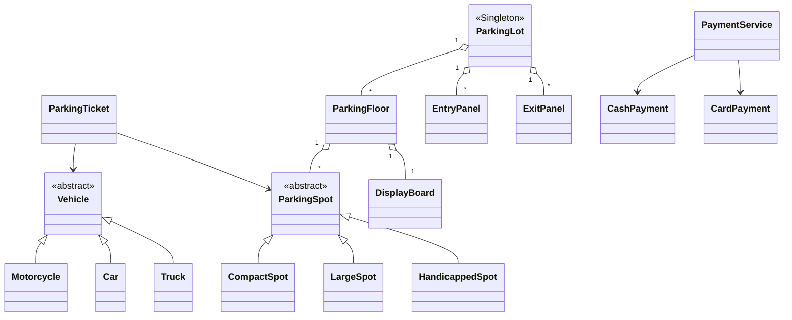

# 🚗 Parking Lot System - Problem & Solution

## Problem Statement

Design a parking lot system that can:

- Support multiple vehicle types (motorcycle, car, truck)
- Have different parking spot types (compact, large, handicapped)
- Handle entry and exit of vehicles
- Track availability in real-time
- Support multiple floors
- Calculate parking fees based on duration

---

## STEP 0: Requirements Quickpass

### Functional Requirements

| Requirement           | Description                                           |
| --------------------- | ----------------------------------------------------- |
| Park Vehicle          | Assign available spot to entering vehicle             |
| Unpark Vehicle        | Release spot when vehicle exits                       |
| Fee Calculation       | Calculate parking fee based on duration and spot type |
| Availability Tracking | Real-time display of available spots per floor        |
| Multi-floor Support   | Organize spots across multiple floors                 |
| Payment Processing    | Support multiple payment methods (cash, card)         |

### Explicit Out-of-Scope

| Feature                   | Reason                                    |
| ------------------------- | ----------------------------------------- |
| Reservation System        | Adds complexity, can be extension         |
| Valet Service             | Different workflow, separate module       |
| Electric Vehicle Charging | Specialized spot type, future enhancement |
| Mobile App Integration    | UI layer, not core LLD                    |
| License Plate Recognition | External system integration               |
| Monthly/Annual Passes     | Subscription model, separate feature      |

### Assumptions and Constraints

| Assumption               | Rationale                                  |
| ------------------------ | ------------------------------------------ |
| Single parking lot       | Simplifies singleton pattern usage         |
| Fixed spot types         | COMPACT, LARGE, HANDICAPPED are sufficient |
| Hourly billing           | Standard pricing model                     |
| Minimum 1 hour charge    | Industry standard                          |
| First-come-first-served  | No priority queue for spots                |
| Spots are pre-configured | No dynamic spot creation                   |

### Scale Assumptions

| Aspect          | Assumption                                          |
| --------------- | --------------------------------------------------- |
| Execution Model | Single JVM, multi-threaded                          |
| Concurrency     | Multiple entry/exit panels operating simultaneously |
| Data Storage    | In-memory (no database persistence)                 |
| Typical Size    | 2-5 floors, 50-500 spots per floor                  |
| Peak Load       | 10-50 concurrent entry/exit operations              |

### Concurrency Model

| Component       | Concurrency Handling                     |
| --------------- | ---------------------------------------- |
| Spot Allocation | Synchronized at ParkingLot level         |
| Spot State      | Synchronized at ParkingSpot level        |
| Ticket Tracking | ConcurrentHashMap for thread-safe access |
| Display Updates | Eventual consistency acceptable          |

### Public APIs

```java
// Entry Operations
ParkingTicket parkVehicle(Vehicle vehicle)

// Exit Operations
void releaseSpot(ParkingTicket ticket)
double calculateFee(ParkingTicket ticket)

// Query Operations
boolean isFull(Vehicle vehicle)
Map<ParkingSpotType, Integer> getTotalAvailability()
ParkingTicket findTicketByVehicle(Vehicle vehicle)
```

### Public API Usage Examples

```java
// Example 1: Basic usage
ParkingLot parkingLot = ParkingLot.getInstance("Downtown Parking", "123 Main Street");
Car car = new Car("ABC-1234");
ParkingTicket ticket = parkingLot.parkVehicle(car);
System.out.println("Ticket issued: " + ticket.getTicketId());

// Example 2: Typical workflow
EntryPanel entryPanel = parkingLot.addEntryPanel("ENTRY-1");
ExitPanel exitPanel = parkingLot.addExitPanel("EXIT-1");
PaymentService paymentService = new PaymentService();

Car vehicle = new Car("XYZ-5678");
ParkingTicket parkingTicket = entryPanel.processEntry(vehicle);
if (parkingTicket != null) {
    // Vehicle parked successfully
    double fee = parkingTicket.calculateFee();
    exitPanel.processExit(parkingTicket);
}

// Example 3: Edge case - checking availability before parking
if (!parkingLot.isFull(car)) {
    ParkingTicket ticket = parkingLot.parkVehicle(car);
    Map<ParkingSpotType, Integer> availability = parkingLot.getTotalAvailability();
    System.out.println("Available spots: " + availability);
} else {
    System.out.println("Parking lot is full!");
}

// Example 4: Finding ticket by vehicle
Vehicle vehicle = new Car("ABC-1234");
ParkingTicket ticket = parkingLot.findTicketByVehicle(vehicle);
if (ticket != null) {
    System.out.println("Found ticket: " + ticket.getTicketId());
}
```

### System Invariants

| Invariant                  | Description                                     |
| -------------------------- | ----------------------------------------------- |
| One Vehicle Per Spot       | A spot can hold at most one vehicle at a time   |
| No Duplicate Parking       | A vehicle cannot be parked twice simultaneously |
| Spot-Vehicle Compatibility | Vehicle can only park in compatible spot types  |
| Ticket Uniqueness          | Each parking session has a unique ticket ID     |
| Fee Non-Negative           | Calculated fee is always >= 0                   |
| Consistent State           | Spot availability matches actual occupancy      |

---

## STEP 1: Complete Reference Solution (Answer Key)

### Class Diagram Overview



<details>
<summary>ASCII diagram (reference)</summary>

```text
┌─────────────────────────────────────────────────────────────────────────────────┐
│                              PARKING LOT SYSTEM                                  │
├─────────────────────────────────────────────────────────────────────────────────┤
│                                                                                  │
│  ┌──────────────┐         ┌──────────────────┐         ┌──────────────────┐    │
│  │   Vehicle    │◄────────│   ParkingTicket  │────────►│   ParkingSpot    │    │
│  │  (abstract)  │         │                  │         │   (abstract)     │    │
│  └──────┬───────┘         └────────┬─────────┘         └────────┬─────────┘    │
│         │                          │                            │              │
│    ┌────┴────┬────┐               │                   ┌────────┼────────┐     │
│    │         │    │               │                   │        │        │     │
│    ▼         ▼    ▼               │                   ▼        ▼        ▼     │
│ ┌──────┐ ┌─────┐ ┌─────┐         │            ┌────────┐ ┌────────┐ ┌──────┐ │
│ │Motor │ │ Car │ │Truck│         │            │Compact │ │ Large  │ │Handi │ │
│ │cycle │ │     │ │     │         │            │  Spot  │ │  Spot  │ │capped│ │
│ └──────┘ └─────┘ └─────┘         │            └────────┘ └────────┘ └──────┘ │
│                                   │                                           │
│  ┌──────────────┐         ┌──────┴───────────┐         ┌──────────────┐      │
│  │ ParkingFloor │◄────────│   ParkingLot     │────────►│ EntryPanel   │      │
│  │              │         │   (Singleton)    │         │              │      │
│  └──────────────┘         └──────────────────┘         └──────────────┘      │
│         │                         │                            │              │
│         │                         │                            │              │
│         ▼                         ▼                            ▼              │
│  ┌──────────────┐         ┌──────────────────┐         ┌──────────────┐      │
│  │ DisplayBoard │         │  PaymentService  │         │  ExitPanel   │      │
│  │              │         │                  │         │              │      │
│  └──────────────┘         └──────────────────┘         └──────────────┘      │
│                                   │                                           │
│                           ┌───────┴───────┐                                   │
│                           │               │                                   │
│                           ▼               ▼                                   │
│                    ┌────────────┐  ┌────────────┐                             │
│                    │   Cash     │  │   Card     │                             │
│                    │  Payment   │  │  Payment   │                             │
│                    └────────────┘  └────────────┘                             │
│                                                                                │
└─────────────────────────────────────────────────────────────────────────────────┘
```

</details>

### Relationships Summary

| Relationship                | Type        | Description                                      |
| --------------------------- | ----------- | ------------------------------------------------ |
| ParkingLot → ParkingFloor   | Composition | Lot owns floors, floors cannot exist without lot |
| ParkingFloor → ParkingSpot  | Composition | Floor owns spots                                 |
| ParkingFloor → DisplayBoard | Composition | Each floor has a display board                   |
| ParkingLot → EntryPanel     | Composition | Lot has entry panels                             |
| ParkingLot → ExitPanel      | Composition | Lot has exit panels                              |
| ParkingTicket → Vehicle     | Association | Ticket references vehicle                        |
| ParkingTicket → ParkingSpot | Association | Ticket references assigned spot                  |
| PaymentService → Payment    | Aggregation | Service uses payment strategies                  |

### Responsibilities Table

| Class            | Owns                                   | Why                                                                                               |
| ---------------- | -------------------------------------- | ------------------------------------------------------------------------------------------------- |
| `Vehicle`        | Vehicle identity and type information  | Enables type-safe vehicle handling and polymorphism - each vehicle type knows its own constraints |
| `ParkingSpot`    | A single parking space's state         | Manages occupancy and compatibility checks - encapsulation of spot-level behavior                 |
| `ParkingTicket`  | One parking session from entry to exit | Tracks duration and calculates fees - all session data in one place                               |
| `ParkingFloor`   | All spots on one floor                 | Organizes spots by physical location - enables per-floor availability queries                     |
| `DisplayBoard`   | Availability counts for one floor      | Presents real-time availability to users - separation of data and presentation                    |
| `EntryPanel`     | Vehicle entry workflow                 | Controls entry process and ticket issuance - single entry point for vehicles                      |
| `ExitPanel`      | Vehicle exit and payment workflow      | Coordinates payment and spot release - single exit point with payment integration                 |
| `PaymentService` | Payment processing coordination        | Handles payment method selection and processing - separates payment logic from exit logic         |
| `ParkingLot`     | All parking operations orchestration   | Central coordination ensures consistency - singleton ensures single source of truth               |

---

## STEP 2: Complete Final Implementation

> **Verified:** This code compiles successfully with Java 11+.

```java
// VehicleType.java
package com.parkinglot.enums;

public enum VehicleType {
    MOTORCYCLE,
    CAR,
    TRUCK
}
```

```java
// ParkingSpotType.java
package com.parkinglot.enums;

public enum ParkingSpotType {
    COMPACT,
    LARGE,
    HANDICAPPED
}
```

```java
// TicketStatus.java
package com.parkinglot.enums;

public enum TicketStatus {
    ACTIVE,
    PAID,
    LOST
}
```

```java
// PaymentStatus.java
package com.parkinglot.enums;

public enum PaymentStatus {
    PENDING,
    COMPLETED,
    FAILED,
    REFUNDED
}
```

```java
// Vehicle.java
package com.parkinglot.models;

import com.parkinglot.enums.ParkingSpotType;
import com.parkinglot.enums.VehicleType;

public abstract class Vehicle {
    private final String licensePlate;
    private final VehicleType type;

    protected Vehicle(String licensePlate, VehicleType type) {
        if (licensePlate == null || licensePlate.trim().isEmpty()) {
            throw new IllegalArgumentException("License plate cannot be null or empty");
        }
        this.licensePlate = licensePlate.toUpperCase().trim();
        this.type = type;
    }

    public String getLicensePlate() {
        return licensePlate;
    }

    public VehicleType getType() {
        return type;
    }

    public abstract boolean canFitInSpot(ParkingSpotType spotType);

    @Override
    public boolean equals(Object obj) {
        if (this == obj) return true;
        if (obj == null || getClass() != obj.getClass()) return false;
        Vehicle vehicle = (Vehicle) obj;
        return licensePlate.equals(vehicle.licensePlate);
    }

    @Override
    public int hashCode() {
        return licensePlate.hashCode();
    }

    @Override
    public String toString() {
        return String.format("%s[licensePlate=%s]", getClass().getSimpleName(), licensePlate);
    }
}
```

```java
// Motorcycle.java
package com.parkinglot.models;

import com.parkinglot.enums.ParkingSpotType;
import com.parkinglot.enums.VehicleType;

public class Motorcycle extends Vehicle {
    public Motorcycle(String licensePlate) {
        super(licensePlate, VehicleType.MOTORCYCLE);
    }

    @Override
    public boolean canFitInSpot(ParkingSpotType spotType) {
        return true;
    }
}
```

```java
// Car.java
package com.parkinglot.models;

import com.parkinglot.enums.ParkingSpotType;
import com.parkinglot.enums.VehicleType;

public class Car extends Vehicle {
    private final boolean hasHandicappedPermit;

    public Car(String licensePlate) {
        this(licensePlate, false);
    }

    public Car(String licensePlate, boolean hasHandicappedPermit) {
        super(licensePlate, VehicleType.CAR);
        this.hasHandicappedPermit = hasHandicappedPermit;
    }

    public boolean hasHandicappedPermit() {
        return hasHandicappedPermit;
    }

    @Override
    public boolean canFitInSpot(ParkingSpotType spotType) {
        switch (spotType) {
            case COMPACT:
            case LARGE:
                return true;
            case HANDICAPPED:
                return hasHandicappedPermit;
            default:
                return false;
        }
    }
}
```

```java
// Truck.java
package com.parkinglot.models;

import com.parkinglot.enums.ParkingSpotType;
import com.parkinglot.enums.VehicleType;

public class Truck extends Vehicle {
    public Truck(String licensePlate) {
        super(licensePlate, VehicleType.TRUCK);
    }

    @Override
    public boolean canFitInSpot(ParkingSpotType spotType) {
        return spotType == ParkingSpotType.LARGE;
    }
}
```

```java
// ParkingSpot.java
package com.parkinglot.models;

import com.parkinglot.enums.ParkingSpotType;

public abstract class ParkingSpot {
    private final String spotId;
    private final ParkingSpotType type;
    private final int floorNumber;
    private Vehicle parkedVehicle;
    private boolean isAvailable;

    protected ParkingSpot(String spotId, ParkingSpotType type, int floorNumber) {
        this.spotId = spotId;
        this.type = type;
        this.floorNumber = floorNumber;
        this.isAvailable = true;
        this.parkedVehicle = null;
    }

    public boolean canFitVehicle(Vehicle vehicle) {
        if (!isAvailable) {
            return false;
        }
        return vehicle.canFitInSpot(this.type);
    }

    public synchronized boolean parkVehicle(Vehicle vehicle) {
        if (!canFitVehicle(vehicle)) {
            return false;
        }
        this.parkedVehicle = vehicle;
        this.isAvailable = false;
        return true;
    }

    public synchronized Vehicle removeVehicle() {
        Vehicle vehicle = this.parkedVehicle;
        this.parkedVehicle = null;
        this.isAvailable = true;
        return vehicle;
    }

    public String getSpotId() { return spotId; }
    public ParkingSpotType getType() { return type; }
    public int getFloorNumber() { return floorNumber; }
    public Vehicle getParkedVehicle() { return parkedVehicle; }
    public boolean isAvailable() { return isAvailable; }

    @Override
    public String toString() {
        return String.format("ParkingSpot[id=%s, type=%s, floor=%d, available=%s]",
                spotId, type, floorNumber, isAvailable);
    }
}
```

```java
// CompactSpot.java
package com.parkinglot.models;

import com.parkinglot.enums.ParkingSpotType;

public class CompactSpot extends ParkingSpot {
    public CompactSpot(String spotId, int floorNumber) {
        super(spotId, ParkingSpotType.COMPACT, floorNumber);
    }
}
```

```java
// LargeSpot.java
package com.parkinglot.models;

import com.parkinglot.enums.ParkingSpotType;

public class LargeSpot extends ParkingSpot {
    public LargeSpot(String spotId, int floorNumber) {
        super(spotId, ParkingSpotType.LARGE, floorNumber);
    }
}
```

```java
// HandicappedSpot.java
package com.parkinglot.models;

import com.parkinglot.enums.ParkingSpotType;

public class HandicappedSpot extends ParkingSpot {
    public HandicappedSpot(String spotId, int floorNumber) {
        super(spotId, ParkingSpotType.HANDICAPPED, floorNumber);
    }
}
```

```java
// ParkingTicket.java
package com.parkinglot.models;

import com.parkinglot.enums.TicketStatus;
import java.time.LocalDateTime;
import java.time.Duration;
import java.util.UUID;

public class ParkingTicket {
    private final String ticketId;
    private final LocalDateTime entryTime;
    private final Vehicle vehicle;
    private final ParkingSpot parkingSpot;
    private LocalDateTime exitTime;
    private TicketStatus status;
    private double paymentAmount;

    private static final double COMPACT_HOURLY_RATE = 2.0;
    private static final double LARGE_HOURLY_RATE = 3.0;
    private static final double HANDICAPPED_HOURLY_RATE = 1.5;

    public ParkingTicket(Vehicle vehicle, ParkingSpot parkingSpot) {
        this.ticketId = generateTicketId();
        this.entryTime = LocalDateTime.now();
        this.vehicle = vehicle;
        this.parkingSpot = parkingSpot;
        this.status = TicketStatus.ACTIVE;
        this.paymentAmount = 0.0;
    }

    private String generateTicketId() {
        return "TKT-" + System.currentTimeMillis() + "-" +
               UUID.randomUUID().toString().substring(0, 8).toUpperCase();
    }

    public double calculateFee() {
        LocalDateTime endTime = (exitTime != null) ? exitTime : LocalDateTime.now();
        Duration duration = Duration.between(entryTime, endTime);
        long minutes = duration.toMinutes();
        long hours = (minutes + 59) / 60;
        if (hours == 0) hours = 1;
        double hourlyRate = getHourlyRate();
        return hours * hourlyRate;
    }

    private double getHourlyRate() {
        switch (parkingSpot.getType()) {
            case COMPACT: return COMPACT_HOURLY_RATE;
            case LARGE: return LARGE_HOURLY_RATE;
            case HANDICAPPED: return HANDICAPPED_HOURLY_RATE;
            default: return COMPACT_HOURLY_RATE;
        }
    }

    public void markAsPaid(double amount) {
        this.exitTime = LocalDateTime.now();
        this.paymentAmount = amount;
        this.status = TicketStatus.PAID;
    }

    public void markAsLost() {
        this.status = TicketStatus.LOST;
    }

    public String getParkingDuration() {
        LocalDateTime endTime = (exitTime != null) ? exitTime : LocalDateTime.now();
        Duration duration = Duration.between(entryTime, endTime);
        return String.format("%d hours, %d minutes", duration.toHours(), duration.toMinutesPart());
    }

    public String getTicketId() { return ticketId; }
    public LocalDateTime getEntryTime() { return entryTime; }
    public LocalDateTime getExitTime() { return exitTime; }
    public Vehicle getVehicle() { return vehicle; }
    public ParkingSpot getParkingSpot() { return parkingSpot; }
    public TicketStatus getStatus() { return status; }
    public double getPaymentAmount() { return paymentAmount; }

    @Override
    public String toString() {
        return String.format(
            "ParkingTicket[id=%s, vehicle=%s, spot=%s, status=%s, duration=%s]",
            ticketId, vehicle.getLicensePlate(), parkingSpot.getSpotId(),
            status, getParkingDuration()
        );
    }
}
```

```java
// ParkingFloor.java
package com.parkinglot.models;

import com.parkinglot.enums.ParkingSpotType;
import java.util.*;
import java.util.concurrent.ConcurrentHashMap;

public class ParkingFloor {
    private final int floorNumber;
    private final String floorName;
    private final Map<ParkingSpotType, List<ParkingSpot>> spotsByType;
    private final Map<String, ParkingSpot> spotsById;
    private final DisplayBoard displayBoard;

    public ParkingFloor(int floorNumber, String floorName) {
        this.floorNumber = floorNumber;
        this.floorName = floorName;
        this.spotsByType = new ConcurrentHashMap<>();
        this.spotsById = new ConcurrentHashMap<>();
        this.displayBoard = new DisplayBoard(floorNumber);
        for (ParkingSpotType type : ParkingSpotType.values()) {
            spotsByType.put(type, Collections.synchronizedList(new ArrayList<>()));
        }
    }

    public void addParkingSpot(ParkingSpot spot) {
        spotsByType.get(spot.getType()).add(spot);
        spotsById.put(spot.getSpotId(), spot);
        updateDisplayBoard();
    }

    public synchronized ParkingSpot findAvailableSpot(Vehicle vehicle) {
        List<ParkingSpotType> searchOrder = getSearchOrder(vehicle);
        for (ParkingSpotType spotType : searchOrder) {
            List<ParkingSpot> spots = spotsByType.get(spotType);
            for (ParkingSpot spot : spots) {
                if (spot.canFitVehicle(vehicle)) {
                    return spot;
                }
            }
        }
        return null;
    }

    private List<ParkingSpotType> getSearchOrder(Vehicle vehicle) {
        List<ParkingSpotType> order = new ArrayList<>();
        switch (vehicle.getType()) {
            case MOTORCYCLE:
                order.add(ParkingSpotType.COMPACT);
                order.add(ParkingSpotType.LARGE);
                break;
            case CAR:
                order.add(ParkingSpotType.COMPACT);
                order.add(ParkingSpotType.LARGE);
                if (vehicle instanceof Car && ((Car) vehicle).hasHandicappedPermit()) {
                    order.add(ParkingSpotType.HANDICAPPED);
                }
                break;
            case TRUCK:
                order.add(ParkingSpotType.LARGE);
                break;
        }
        return order;
    }

    public Map<ParkingSpotType, Integer> getAvailableSpotCounts() {
        Map<ParkingSpotType, Integer> counts = new EnumMap<>(ParkingSpotType.class);
        for (ParkingSpotType type : ParkingSpotType.values()) {
            int available = (int) spotsByType.get(type).stream()
                    .filter(ParkingSpot::isAvailable)
                    .count();
            counts.put(type, available);
        }
        return counts;
    }

    public void updateDisplayBoard() {
        displayBoard.update(getAvailableSpotCounts());
    }

    public boolean hasAvailableSpot(Vehicle vehicle) {
        return findAvailableSpot(vehicle) != null;
    }

    public ParkingSpot getSpotById(String spotId) {
        return spotsById.get(spotId);
    }

    public int getFloorNumber() { return floorNumber; }
    public String getFloorName() { return floorName; }
    public DisplayBoard getDisplayBoard() { return displayBoard; }

    public List<ParkingSpot> getAllSpots() {
        List<ParkingSpot> allSpots = new ArrayList<>();
        for (List<ParkingSpot> spots : spotsByType.values()) {
            allSpots.addAll(spots);
        }
        return Collections.unmodifiableList(allSpots);
    }
}
```

```java
// DisplayBoard.java
package com.parkinglot.models;

import com.parkinglot.enums.ParkingSpotType;
import java.util.EnumMap;
import java.util.Map;

public class DisplayBoard {
    private final int floorNumber;
    private final Map<ParkingSpotType, Integer> availableCounts;

    public DisplayBoard(int floorNumber) {
        this.floorNumber = floorNumber;
        this.availableCounts = new EnumMap<>(ParkingSpotType.class);
        for (ParkingSpotType type : ParkingSpotType.values()) {
            availableCounts.put(type, 0);
        }
    }

    public void update(Map<ParkingSpotType, Integer> counts) {
        availableCounts.clear();
        availableCounts.putAll(counts);
    }

    public String render() {
        StringBuilder sb = new StringBuilder();
        sb.append("╔════════════════════════════════════╗\n");
        sb.append(String.format("║        FLOOR %d - AVAILABILITY       ║\n", floorNumber));
        sb.append("╠════════════════════════════════════╣\n");
        for (ParkingSpotType type : ParkingSpotType.values()) {
            int count = availableCounts.getOrDefault(type, 0);
            String status = count > 0 ? "AVAILABLE" : "FULL";
            sb.append(String.format("║  %-12s: %3d  [%s]%s║\n",
                    type, count, status, status.equals("FULL") ? "      " : "  "));
        }
        sb.append("╚════════════════════════════════════╝");
        return sb.toString();
    }

    public Map<ParkingSpotType, Integer> getAvailableCounts() {
        return new EnumMap<>(availableCounts);
    }

    @Override
    public String toString() {
        return render();
    }
}
```

```java
// EntryPanel.java
package com.parkinglot.models;

public class EntryPanel {
    private final String panelId;
    private final ParkingLot parkingLot;

    public EntryPanel(String panelId, ParkingLot parkingLot) {
        this.panelId = panelId;
        this.parkingLot = parkingLot;
    }

    public ParkingTicket processEntry(Vehicle vehicle) {
        System.out.println("Entry Panel " + panelId + ": Processing entry for " +
                          vehicle.getLicensePlate());
        ParkingTicket ticket = parkingLot.parkVehicle(vehicle);
        if (ticket != null) {
            System.out.println("Entry Panel " + panelId + ": Ticket issued - " +
                              ticket.getTicketId());
            System.out.println("Entry Panel " + panelId + ": Assigned spot - " +
                              ticket.getParkingSpot().getSpotId());
        } else {
            System.out.println("Entry Panel " + panelId + ": Parking lot is full!");
        }
        return ticket;
    }

    public String getPanelId() { return panelId; }
}
```

```java
// ExitPanel.java
package com.parkinglot.models;

import com.parkinglot.services.PaymentService;

public class ExitPanel {
    private final String panelId;
    private final ParkingLot parkingLot;
    private final PaymentService paymentService;

    public ExitPanel(String panelId, ParkingLot parkingLot, PaymentService paymentService) {
        this.panelId = panelId;
        this.parkingLot = parkingLot;
        this.paymentService = paymentService;
    }

    public boolean processExit(ParkingTicket ticket) {
        System.out.println("Exit Panel " + panelId + ": Processing exit for ticket " +
                          ticket.getTicketId());
        double fee = ticket.calculateFee();
        System.out.println("Exit Panel " + panelId + ": Parking fee is $" +
                          String.format("%.2f", fee));
        System.out.println("Exit Panel " + panelId + ": Duration - " +
                          ticket.getParkingDuration());
        boolean paymentSuccess = paymentService.processPayment(ticket, fee);
        if (paymentSuccess) {
            parkingLot.releaseSpot(ticket);
            System.out.println("Exit Panel " + panelId + ": Exit successful. Have a nice day!");
            return true;
        } else {
            System.out.println("Exit Panel " + panelId + ": Payment failed. Please try again.");
            return false;
        }
    }

    public boolean processLostTicket(Vehicle vehicle) {
        System.out.println("Exit Panel " + panelId + ": Processing lost ticket for " +
                          vehicle.getLicensePlate());
        ParkingTicket ticket = parkingLot.findTicketByVehicle(vehicle);
        if (ticket == null) {
            System.out.println("Exit Panel " + panelId + ": Vehicle not found in system!");
            return false;
        }
        ticket.markAsLost();
        double lostTicketFee = 50.0;
        System.out.println("Exit Panel " + panelId + ": Lost ticket fee is $" +
                          String.format("%.2f", lostTicketFee));
        boolean paymentSuccess = paymentService.processPayment(ticket, lostTicketFee);
        if (paymentSuccess) {
            parkingLot.releaseSpot(ticket);
            return true;
        }
        return false;
    }

    public String getPanelId() { return panelId; }
}
```

```java
// Payment.java
package com.parkinglot.payment;

import com.parkinglot.enums.PaymentStatus;
import java.time.LocalDateTime;

public abstract class Payment {
    protected final double amount;
    protected final LocalDateTime timestamp;
    protected PaymentStatus status;

    protected Payment(double amount) {
        this.amount = amount;
        this.timestamp = LocalDateTime.now();
        this.status = PaymentStatus.PENDING;
    }

    public abstract boolean processPayment();

    public double getAmount() { return amount; }
    public LocalDateTime getTimestamp() { return timestamp; }
    public PaymentStatus getStatus() { return status; }
}
```

```java
// CashPayment.java
package com.parkinglot.payment;

import com.parkinglot.enums.PaymentStatus;

public class CashPayment extends Payment {
    private final double cashTendered;
    private double changeReturned;

    public CashPayment(double amount, double cashTendered) {
        super(amount);
        this.cashTendered = cashTendered;
        this.changeReturned = 0.0;
    }

    @Override
    public boolean processPayment() {
        if (cashTendered < amount) {
            System.out.println("Insufficient cash. Required: $" + amount +
                              ", Tendered: $" + cashTendered);
            this.status = PaymentStatus.FAILED;
            return false;
        }
        this.changeReturned = cashTendered - amount;
        this.status = PaymentStatus.COMPLETED;
        if (changeReturned > 0) {
            System.out.println("Change returned: $" + String.format("%.2f", changeReturned));
        }
        return true;
    }

    public double getChangeReturned() { return changeReturned; }
}
```

```java
// CardPayment.java
package com.parkinglot.payment;

import com.parkinglot.enums.PaymentStatus;

public class CardPayment extends Payment {
    private final String cardNumber;
    private String transactionId;

    public CardPayment(double amount, String cardNumber) {
        super(amount);
        this.cardNumber = cardNumber.length() >= 4 ?
                         "****" + cardNumber.substring(cardNumber.length() - 4) : "****";
    }

    @Override
    public boolean processPayment() {
        System.out.println("Processing card payment for card: " + cardNumber);
        boolean success = Math.random() < 0.95;
        if (success) {
            this.transactionId = "TXN-" + System.currentTimeMillis();
            this.status = PaymentStatus.COMPLETED;
            System.out.println("Payment successful. Transaction ID: " + transactionId);
            return true;
        } else {
            this.status = PaymentStatus.FAILED;
            System.out.println("Card payment declined.");
            return false;
        }
    }

    public String getTransactionId() { return transactionId; }
}
```

```java
// PaymentService.java
package com.parkinglot.services;

import com.parkinglot.models.ParkingTicket;
import com.parkinglot.payment.CardPayment;
import com.parkinglot.payment.CashPayment;
import com.parkinglot.payment.Payment;

public class PaymentService {
    public boolean processPayment(ParkingTicket ticket, double amount) {
        Payment payment = new CardPayment(amount, "1234567890123456");
        boolean success = payment.processPayment();
        if (success) {
            ticket.markAsPaid(amount);
        }
        return success;
    }

    public boolean processCashPayment(ParkingTicket ticket, double amount, double cashTendered) {
        Payment payment = new CashPayment(amount, cashTendered);
        boolean success = payment.processPayment();
        if (success) {
            ticket.markAsPaid(amount);
        }
        return success;
    }

    public boolean processCardPayment(ParkingTicket ticket, double amount, String cardNumber) {
        Payment payment = new CardPayment(amount, cardNumber);
        boolean success = payment.processPayment();
        if (success) {
            ticket.markAsPaid(amount);
        }
        return success;
    }
}
```

```java
// ParkingLot.java
package com.parkinglot.models;

import com.parkinglot.enums.ParkingSpotType;
import com.parkinglot.services.PaymentService;
import java.util.*;
import java.util.concurrent.ConcurrentHashMap;

public class ParkingLot {
    private static ParkingLot instance;
    private final String name;
    private final String address;
    private final List<ParkingFloor> floors;
    private final Map<String, ParkingTicket> activeTickets;
    private final Map<String, ParkingTicket> vehicleToTicket;
    private final List<EntryPanel> entryPanels;
    private final List<ExitPanel> exitPanels;
    private final PaymentService paymentService;

    private ParkingLot(String name, String address) {
        this.name = name;
        this.address = address;
        this.floors = Collections.synchronizedList(new ArrayList<>());
        this.activeTickets = new ConcurrentHashMap<>();
        this.vehicleToTicket = new ConcurrentHashMap<>();
        this.entryPanels = new ArrayList<>();
        this.exitPanels = new ArrayList<>();
        this.paymentService = new PaymentService();
    }

    public static synchronized ParkingLot getInstance(String name, String address) {
        if (instance == null) {
            instance = new ParkingLot(name, address);
        }
        return instance;
    }

    public static ParkingLot getInstance() {
        if (instance == null) {
            throw new IllegalStateException("ParkingLot not initialized.");
        }
        return instance;
    }

    public static void resetInstance() {
        instance = null;
    }

    public void addFloor(ParkingFloor floor) {
        floors.add(floor);
        System.out.println("Added floor: " + floor.getFloorName());
    }

    public EntryPanel addEntryPanel(String panelId) {
        EntryPanel panel = new EntryPanel(panelId, this);
        entryPanels.add(panel);
        return panel;
    }

    public ExitPanel addExitPanel(String panelId) {
        ExitPanel panel = new ExitPanel(panelId, this, paymentService);
        exitPanels.add(panel);
        return panel;
    }

    public synchronized ParkingTicket parkVehicle(Vehicle vehicle) {
        if (vehicleToTicket.containsKey(vehicle.getLicensePlate())) {
            System.out.println("Vehicle " + vehicle.getLicensePlate() + " is already parked!");
            return null;
        }
        ParkingSpot spot = findAvailableSpot(vehicle);
        if (spot == null) {
            System.out.println("No available spot for " + vehicle.getType());
            return null;
        }
        spot.parkVehicle(vehicle);
        ParkingTicket ticket = new ParkingTicket(vehicle, spot);
        activeTickets.put(ticket.getTicketId(), ticket);
        vehicleToTicket.put(vehicle.getLicensePlate(), ticket);
        updateAllDisplayBoards();
        return ticket;
    }

    private ParkingSpot findAvailableSpot(Vehicle vehicle) {
        for (ParkingFloor floor : floors) {
            ParkingSpot spot = floor.findAvailableSpot(vehicle);
            if (spot != null) {
                return spot;
            }
        }
        return null;
    }

    public synchronized void releaseSpot(ParkingTicket ticket) {
        ParkingSpot spot = ticket.getParkingSpot();
        spot.removeVehicle();
        activeTickets.remove(ticket.getTicketId());
        vehicleToTicket.remove(ticket.getVehicle().getLicensePlate());
        updateAllDisplayBoards();
        System.out.println("Spot " + spot.getSpotId() + " is now available.");
    }

    public ParkingTicket findTicketByVehicle(Vehicle vehicle) {
        return vehicleToTicket.get(vehicle.getLicensePlate());
    }

    public ParkingTicket getTicket(String ticketId) {
        return activeTickets.get(ticketId);
    }

    private void updateAllDisplayBoards() {
        for (ParkingFloor floor : floors) {
            floor.updateDisplayBoard();
        }
    }

    public Map<ParkingSpotType, Integer> getTotalAvailability() {
        Map<ParkingSpotType, Integer> total = new EnumMap<>(ParkingSpotType.class);
        for (ParkingSpotType type : ParkingSpotType.values()) {
            total.put(type, 0);
        }
        for (ParkingFloor floor : floors) {
            Map<ParkingSpotType, Integer> floorCounts = floor.getAvailableSpotCounts();
            for (ParkingSpotType type : ParkingSpotType.values()) {
                total.merge(type, floorCounts.get(type), Integer::sum);
            }
        }
        return total;
    }

    public boolean isFull(Vehicle vehicle) {
        return findAvailableSpot(vehicle) == null;
    }

    public void displayStatus() {
        System.out.println("\n" + "=".repeat(50));
        System.out.println("PARKING LOT STATUS: " + name);
        System.out.println("Address: " + address);
        System.out.println("=".repeat(50));
        System.out.println("\nActive Vehicles: " + activeTickets.size());
        System.out.println("\nAvailability by Floor:");
        for (ParkingFloor floor : floors) {
            System.out.println("\n" + floor.getDisplayBoard().render());
        }
        System.out.println("\nTotal Availability:");
        Map<ParkingSpotType, Integer> total = getTotalAvailability();
        for (ParkingSpotType type : ParkingSpotType.values()) {
            System.out.println("  " + type + ": " + total.get(type));
        }
        System.out.println("=".repeat(50) + "\n");
    }

    public String getName() { return name; }
    public String getAddress() { return address; }
    public List<ParkingFloor> getFloors() { return Collections.unmodifiableList(floors); }
    public int getActiveVehicleCount() { return activeTickets.size(); }
    public List<EntryPanel> getEntryPanels() { return Collections.unmodifiableList(entryPanels); }
    public List<ExitPanel> getExitPanels() { return Collections.unmodifiableList(exitPanels); }
}
```

```java
// ParkingLotDemo.java
package com.parkinglot;

import com.parkinglot.models.*;

public class ParkingLotDemo {
    public static void main(String[] args) {
        ParkingLot.resetInstance();
        System.out.println("Setting up parking lot...\n");
        ParkingLot parkingLot = ParkingLot.getInstance("Downtown Parking", "123 Main Street");
        ParkingFloor floor0 = new ParkingFloor(0, "Ground Floor");
        ParkingFloor floor1 = new ParkingFloor(1, "Level 1");
        for (int i = 1; i <= 5; i++) {
            floor0.addParkingSpot(new CompactSpot(String.format("F0-C%03d", i), 0));
        }
        for (int i = 1; i <= 3; i++) {
            floor0.addParkingSpot(new LargeSpot(String.format("F0-L%03d", i), 0));
        }
        for (int i = 1; i <= 2; i++) {
            floor0.addParkingSpot(new HandicappedSpot(String.format("F0-H%03d", i), 0));
        }
        for (int i = 1; i <= 5; i++) {
            floor1.addParkingSpot(new CompactSpot(String.format("F1-C%03d", i), 1));
        }
        for (int i = 1; i <= 3; i++) {
            floor1.addParkingSpot(new LargeSpot(String.format("F1-L%03d", i), 1));
        }
        parkingLot.addFloor(floor0);
        parkingLot.addFloor(floor1);
        EntryPanel entry1 = parkingLot.addEntryPanel("ENTRY-1");
        EntryPanel entry2 = parkingLot.addEntryPanel("ENTRY-2");
        ExitPanel exit1 = parkingLot.addExitPanel("EXIT-1");
        parkingLot.displayStatus();
        System.out.println("\n===== SCENARIO 1: Cars Entering =====\n");
        Car car1 = new Car("ABC-1234");
        Car car2 = new Car("XYZ-5678");
        Car handicappedCar = new Car("HND-0001", true);
        ParkingTicket ticket1 = entry1.processEntry(car1);
        ParkingTicket ticket2 = entry1.processEntry(car2);
        ParkingTicket ticket3 = entry2.processEntry(handicappedCar);
        parkingLot.displayStatus();
        System.out.println("\n===== SCENARIO 2: Vehicle Exiting =====\n");
        if (ticket1 != null) {
            exit1.processExit(ticket1);
        }
        parkingLot.displayStatus();
    }
}
```

---

## STEP 4: Code Walkthrough

This section explains how an engineer builds this system from scratch, in the order code should be written.

### Phase 1: Start with the Data Model (Enums First)

**Why enums first?**
Enums define the vocabulary of your system. Before writing any logic, you need to know:

- What types of vehicles exist?
- What types of spots exist?
- What states can a ticket be in?

```java
// VehicleType.java
package com.parkinglot.enums;

/**
 * Defines all supported vehicle types in the parking lot.
 * Each vehicle type determines which parking spots it can use.
 */
public enum VehicleType {
    MOTORCYCLE,  // Smallest, can fit in any spot
    CAR,         // Medium, needs compact or larger
    TRUCK        // Largest, needs large spots only
}
```

```java
// ParkingSpotType.java
package com.parkinglot.enums;

/**
 * Defines types of parking spots available.
 * Each type has different size and accessibility characteristics.
 */
public enum ParkingSpotType {
    COMPACT,      // For motorcycles and cars
    LARGE,        // For any vehicle including trucks
    HANDICAPPED   // Reserved spots with special access
}
```

```java
// TicketStatus.java
package com.parkinglot.enums;

/**
 * Tracks the lifecycle of a parking ticket.
 */
public enum TicketStatus {
    ACTIVE,     // Vehicle is currently parked
    PAID,       // Payment completed, ready to exit
    LOST        // Ticket lost, special handling required
}
```

```java
// PaymentStatus.java
package com.parkinglot.enums;

/**
 * Tracks payment transaction status.
 */
public enum PaymentStatus {
    PENDING,    // Payment not yet processed
    COMPLETED,  // Payment successful
    FAILED,     // Payment failed
    REFUNDED    // Payment was refunded
}
```

**Why separate enums for Vehicle and Spot types?**

- They are different concepts (vehicle IS a type, spot HAS a type)
- They change independently (might add ELECTRIC_CHARGING spot without new vehicle type)
- Keeps mapping logic in one place (Vehicle.canFitInSpot)

---

### Phase 2: Build the Core Domain Objects

#### Vehicle Hierarchy

```java
// Vehicle.java
package com.parkinglot.models;

import com.parkinglot.enums.VehicleType;

/**
 * Abstract base class for all vehicles.
 *
 * WHY ABSTRACT: We never create a generic "Vehicle", only specific types.
 * This enforces that every vehicle has a concrete type.
 *
 * RESPONSIBILITY: Hold vehicle identification and type information.
 */
public abstract class Vehicle {

    private final String licensePlate;  // Unique identifier, immutable
    private final VehicleType type;     // Determined by subclass

    /**
     * Protected constructor - only subclasses can call this.
     *
     * @param licensePlate Unique vehicle identifier (e.g., "ABC-1234")
     * @param type The type of vehicle (set by subclass)
     */
    protected Vehicle(String licensePlate, VehicleType type) {
        if (licensePlate == null || licensePlate.trim().isEmpty()) {
            throw new IllegalArgumentException("License plate cannot be null or empty");
        }
        this.licensePlate = licensePlate.toUpperCase().trim();
        this.type = type;
    }

    public String getLicensePlate() {
        return licensePlate;
    }

    public VehicleType getType() {
        return type;
    }

    /**
     * Determines if this vehicle can fit in a given spot type.
     * Each subclass defines its own fitting rules.
     *
     * @param spotType The type of parking spot
     * @return true if vehicle can park in this spot type
     */
    public abstract boolean canFitInSpot(ParkingSpotType spotType);

    @Override
    public boolean equals(Object obj) {
        if (this == obj) return true;
        if (obj == null || getClass() != obj.getClass()) return false;
        Vehicle vehicle = (Vehicle) obj;
        return licensePlate.equals(vehicle.licensePlate);
    }

    @Override
    public int hashCode() {
        return licensePlate.hashCode();
    }

    @Override
    public String toString() {
        return String.format("%s[licensePlate=%s]", getClass().getSimpleName(), licensePlate);
    }
}
```

**Key Design Decisions:**

- **`final` fields**: License plate does not change while parked. Immutability prevents bugs and is thread-safe.
- **Protected constructor**: Prevents direct instantiation, forces use of concrete subclasses.
- **Normalized license plate**: "abc-1234" and "ABC-1234" should be the same vehicle.
- **equals/hashCode**: Required for correct HashMap behavior in `vehicleToTicket` map.

```java
// Motorcycle.java
package com.parkinglot.models;

import com.parkinglot.enums.ParkingSpotType;
import com.parkinglot.enums.VehicleType;

/**
 * Represents a motorcycle.
 *
 * FITTING RULES: Motorcycles are small and can fit in ANY spot type.
 */
public class Motorcycle extends Vehicle {

    public Motorcycle(String licensePlate) {
        super(licensePlate, VehicleType.MOTORCYCLE);
    }

    @Override
    public boolean canFitInSpot(ParkingSpotType spotType) {
        return true;  // Motorcycles can fit anywhere
    }
}
```

```java
// Car.java
package com.parkinglot.models;

import com.parkinglot.enums.ParkingSpotType;
import com.parkinglot.enums.VehicleType;

/**
 * Represents a car (sedan, SUV, etc.).
 *
 * FITTING RULES: Cars need at least a compact spot.
 * Handicapped spots require special permit.
 */
public class Car extends Vehicle {

    private final boolean hasHandicappedPermit;

    public Car(String licensePlate) {
        this(licensePlate, false);
    }

    public Car(String licensePlate, boolean hasHandicappedPermit) {
        super(licensePlate, VehicleType.CAR);
        this.hasHandicappedPermit = hasHandicappedPermit;
    }

    public boolean hasHandicappedPermit() {
        return hasHandicappedPermit;
    }

    @Override
    public boolean canFitInSpot(ParkingSpotType spotType) {
        switch (spotType) {
            case COMPACT:
            case LARGE:
                return true;
            case HANDICAPPED:
                return hasHandicappedPermit;
            default:
                return false;
        }
    }
}
```

```java
// Truck.java
package com.parkinglot.models;

import com.parkinglot.enums.ParkingSpotType;
import com.parkinglot.enums.VehicleType;

/**
 * Represents a truck or large vehicle.
 *
 * FITTING RULES: Trucks are large and need LARGE spots only.
 */
public class Truck extends Vehicle {

    public Truck(String licensePlate) {
        super(licensePlate, VehicleType.TRUCK);
    }

    @Override
    public boolean canFitInSpot(ParkingSpotType spotType) {
        return spotType == ParkingSpotType.LARGE;
    }
}
```

---

### Phase 3: Build the Parking Spot Hierarchy

```java
// ParkingSpot.java
package com.parkinglot.models;

import com.parkinglot.enums.ParkingSpotType;

/**
 * Abstract base class for all parking spots.
 *
 * RESPONSIBILITY: Manage a single parking space's state.
 * Each spot knows its location, type, and whether it's occupied.
 */
public abstract class ParkingSpot {

    // Identity fields (immutable)
    private final String spotId;
    private final ParkingSpotType type;
    private final int floorNumber;

    // State fields (mutable)
    private Vehicle parkedVehicle;
    private boolean isAvailable;

    protected ParkingSpot(String spotId, ParkingSpotType type, int floorNumber) {
        this.spotId = spotId;
        this.type = type;
        this.floorNumber = floorNumber;
        this.isAvailable = true;
        this.parkedVehicle = null;
    }

    /**
     * Determines if a vehicle can be assigned to this spot.
     * Considers both spot availability and vehicle compatibility.
     */
    public boolean canFitVehicle(Vehicle vehicle) {
        if (!isAvailable) {
            return false;
        }
        return vehicle.canFitInSpot(this.type);
    }

    /**
     * Parks a vehicle in this spot.
     * Synchronized to prevent race conditions.
     */
    public synchronized boolean parkVehicle(Vehicle vehicle) {
        if (!canFitVehicle(vehicle)) {
            return false;
        }
        this.parkedVehicle = vehicle;
        this.isAvailable = false;
        return true;
    }

    /**
     * Removes the vehicle from this spot.
     */
    public synchronized Vehicle removeVehicle() {
        Vehicle vehicle = this.parkedVehicle;
        this.parkedVehicle = null;
        this.isAvailable = true;
        return vehicle;
    }

    // Getters
    public String getSpotId() { return spotId; }
    public ParkingSpotType getType() { return type; }
    public int getFloorNumber() { return floorNumber; }
    public Vehicle getParkedVehicle() { return parkedVehicle; }
    public boolean isAvailable() { return isAvailable; }

    @Override
    public String toString() {
        return String.format("ParkingSpot[id=%s, type=%s, floor=%d, available=%s]",
                spotId, type, floorNumber, isAvailable);
    }
}
```

**Why synchronized methods?**

- Multiple threads (entry panels) might try to park simultaneously
- Without sync: Thread A checks available, Thread B checks available, both try to park
- With sync: Only one thread can modify state at a time

```java
// CompactSpot.java
package com.parkinglot.models;

import com.parkinglot.enums.ParkingSpotType;

public class CompactSpot extends ParkingSpot {
    public CompactSpot(String spotId, int floorNumber) {
        super(spotId, ParkingSpotType.COMPACT, floorNumber);
    }
}

// LargeSpot.java
package com.parkinglot.models;

import com.parkinglot.enums.ParkingSpotType;

public class LargeSpot extends ParkingSpot {
    public LargeSpot(String spotId, int floorNumber) {
        super(spotId, ParkingSpotType.LARGE, floorNumber);
    }
}

// HandicappedSpot.java
package com.parkinglot.models;

import com.parkinglot.enums.ParkingSpotType;

public class HandicappedSpot extends ParkingSpot {
    public HandicappedSpot(String spotId, int floorNumber) {
        super(spotId, ParkingSpotType.HANDICAPPED, floorNumber);
    }
}
```

---

### Phase 4: Build the Ticket System

```java
// ParkingTicket.java
package com.parkinglot.models;

import com.parkinglot.enums.TicketStatus;
import java.time.LocalDateTime;
import java.time.Duration;
import java.util.UUID;

/**
 * Represents a parking session from entry to exit.
 *
 * RESPONSIBILITY: Track parking duration and calculate fees.
 * This is the "receipt" that connects vehicle, spot, and time.
 */
public class ParkingTicket {

    private final String ticketId;
    private final LocalDateTime entryTime;
    private final Vehicle vehicle;
    private final ParkingSpot parkingSpot;

    private LocalDateTime exitTime;
    private TicketStatus status;
    private double paymentAmount;

    // Hourly rates by spot type
    private static final double COMPACT_HOURLY_RATE = 2.0;
    private static final double LARGE_HOURLY_RATE = 3.0;
    private static final double HANDICAPPED_HOURLY_RATE = 1.5;

    public ParkingTicket(Vehicle vehicle, ParkingSpot parkingSpot) {
        this.ticketId = generateTicketId();
        this.entryTime = LocalDateTime.now();
        this.vehicle = vehicle;
        this.parkingSpot = parkingSpot;
        this.status = TicketStatus.ACTIVE;
        this.paymentAmount = 0.0;
    }

    private String generateTicketId() {
        return "TKT-" + System.currentTimeMillis() + "-" +
               UUID.randomUUID().toString().substring(0, 8).toUpperCase();
    }

    /**
     * Calculates the parking fee based on duration and spot type.
     */
    public double calculateFee() {
        LocalDateTime endTime = (exitTime != null) ? exitTime : LocalDateTime.now();
        Duration duration = Duration.between(entryTime, endTime);

        long minutes = duration.toMinutes();
        long hours = (minutes + 59) / 60;  // Round up
        if (hours == 0) hours = 1;  // Minimum 1 hour charge

        double hourlyRate = getHourlyRate();
        return hours * hourlyRate;
    }

    private double getHourlyRate() {
        switch (parkingSpot.getType()) {
            case COMPACT: return COMPACT_HOURLY_RATE;
            case LARGE: return LARGE_HOURLY_RATE;
            case HANDICAPPED: return HANDICAPPED_HOURLY_RATE;
            default: return COMPACT_HOURLY_RATE;
        }
    }

    public void markAsPaid(double amount) {
        this.exitTime = LocalDateTime.now();
        this.paymentAmount = amount;
        this.status = TicketStatus.PAID;
    }

    public void markAsLost() {
        this.status = TicketStatus.LOST;
    }

    public String getParkingDuration() {
        LocalDateTime endTime = (exitTime != null) ? exitTime : LocalDateTime.now();
        Duration duration = Duration.between(entryTime, endTime);
        return String.format("%d hours, %d minutes", duration.toHours(), duration.toMinutesPart());
    }

    // Getters
    public String getTicketId() { return ticketId; }
    public LocalDateTime getEntryTime() { return entryTime; }
    public LocalDateTime getExitTime() { return exitTime; }
    public Vehicle getVehicle() { return vehicle; }
    public ParkingSpot getParkingSpot() { return parkingSpot; }
    public TicketStatus getStatus() { return status; }
    public double getPaymentAmount() { return paymentAmount; }

    @Override
    public String toString() {
        return String.format(
            "ParkingTicket[id=%s, vehicle=%s, spot=%s, status=%s, duration=%s]",
            ticketId, vehicle.getLicensePlate(), parkingSpot.getSpotId(),
            status, getParkingDuration()
        );
    }
}
```

---

### Phase 5: Build the Floor Management

```java
// ParkingFloor.java
package com.parkinglot.models;

import com.parkinglot.enums.ParkingSpotType;
import java.util.*;
import java.util.concurrent.ConcurrentHashMap;

/**
 * Represents a single floor in the parking lot.
 *
 * RESPONSIBILITY: Manage all parking spots on this floor.
 */
public class ParkingFloor {

    private final int floorNumber;
    private final String floorName;

    // Spots organized by type for efficient lookup
    private final Map<ParkingSpotType, List<ParkingSpot>> spotsByType;

    // Quick lookup by spot ID
    private final Map<String, ParkingSpot> spotsById;

    // Display board for this floor
    private final DisplayBoard displayBoard;

    public ParkingFloor(int floorNumber, String floorName) {
        this.floorNumber = floorNumber;
        this.floorName = floorName;
        this.spotsByType = new ConcurrentHashMap<>();
        this.spotsById = new ConcurrentHashMap<>();
        this.displayBoard = new DisplayBoard(floorNumber);

        for (ParkingSpotType type : ParkingSpotType.values()) {
            spotsByType.put(type, Collections.synchronizedList(new ArrayList<>()));
        }
    }

    public void addParkingSpot(ParkingSpot spot) {
        spotsByType.get(spot.getType()).add(spot);
        spotsById.put(spot.getSpotId(), spot);
        updateDisplayBoard();
    }

    /**
     * Finds an available spot for the given vehicle.
     * Uses smart allocation to prefer appropriate spot sizes.
     */
    public synchronized ParkingSpot findAvailableSpot(Vehicle vehicle) {
        List<ParkingSpotType> searchOrder = getSearchOrder(vehicle);

        for (ParkingSpotType spotType : searchOrder) {
            List<ParkingSpot> spots = spotsByType.get(spotType);
            for (ParkingSpot spot : spots) {
                if (spot.canFitVehicle(vehicle)) {
                    return spot;
                }
            }
        }
        return null;
    }

    /**
     * Determines search order based on vehicle type.
     * Smaller vehicles prefer smaller spots first.
     */
    private List<ParkingSpotType> getSearchOrder(Vehicle vehicle) {
        List<ParkingSpotType> order = new ArrayList<>();

        switch (vehicle.getType()) {
            case MOTORCYCLE:
                order.add(ParkingSpotType.COMPACT);
                order.add(ParkingSpotType.LARGE);
                break;
            case CAR:
                order.add(ParkingSpotType.COMPACT);
                order.add(ParkingSpotType.LARGE);
                if (vehicle instanceof Car && ((Car) vehicle).hasHandicappedPermit()) {
                    order.add(ParkingSpotType.HANDICAPPED);
                }
                break;
            case TRUCK:
                order.add(ParkingSpotType.LARGE);
                break;
        }
        return order;
    }

    public Map<ParkingSpotType, Integer> getAvailableSpotCounts() {
        Map<ParkingSpotType, Integer> counts = new EnumMap<>(ParkingSpotType.class);
        for (ParkingSpotType type : ParkingSpotType.values()) {
            int available = (int) spotsByType.get(type).stream()
                    .filter(ParkingSpot::isAvailable)
                    .count();
            counts.put(type, available);
        }
        return counts;
    }

    public void updateDisplayBoard() {
        displayBoard.update(getAvailableSpotCounts());
    }

    public boolean hasAvailableSpot(Vehicle vehicle) {
        return findAvailableSpot(vehicle) != null;
    }

    public ParkingSpot getSpotById(String spotId) {
        return spotsById.get(spotId);
    }

    // Getters
    public int getFloorNumber() { return floorNumber; }
    public String getFloorName() { return floorName; }
    public DisplayBoard getDisplayBoard() { return displayBoard; }

    public List<ParkingSpot> getAllSpots() {
        List<ParkingSpot> allSpots = new ArrayList<>();
        for (List<ParkingSpot> spots : spotsByType.values()) {
            allSpots.addAll(spots);
        }
        return Collections.unmodifiableList(allSpots);
    }
}
```

**Why two data structures?**

- `spotsByType`: Fast when searching for "any compact spot"
- `spotsById`: Fast when looking up specific spot "F0-C001"
- Trade-off: More memory, faster operations

---

### Phase 6: Build Display Board

```java
// DisplayBoard.java
package com.parkinglot.models;

import com.parkinglot.enums.ParkingSpotType;
import java.util.EnumMap;
import java.util.Map;

/**
 * Display board showing parking availability on a floor.
 */
public class DisplayBoard {

    private final int floorNumber;
    private final Map<ParkingSpotType, Integer> availableCounts;

    public DisplayBoard(int floorNumber) {
        this.floorNumber = floorNumber;
        this.availableCounts = new EnumMap<>(ParkingSpotType.class);
        for (ParkingSpotType type : ParkingSpotType.values()) {
            availableCounts.put(type, 0);
        }
    }

    public void update(Map<ParkingSpotType, Integer> counts) {
        availableCounts.clear();
        availableCounts.putAll(counts);
    }

    public String render() {
        StringBuilder sb = new StringBuilder();
        sb.append("╔════════════════════════════════════╗\n");
        sb.append(String.format("║        FLOOR %d - AVAILABILITY       ║\n", floorNumber));
        sb.append("╠════════════════════════════════════╣\n");

        for (ParkingSpotType type : ParkingSpotType.values()) {
            int count = availableCounts.getOrDefault(type, 0);
            String status = count > 0 ? "AVAILABLE" : "FULL";
            sb.append(String.format("║  %-12s: %3d  [%s]%s║\n",
                    type, count, status, status.equals("FULL") ? "      " : "  "));
        }

        sb.append("╚════════════════════════════════════╝");
        return sb.toString();
    }

    public Map<ParkingSpotType, Integer> getAvailableCounts() {
        return new EnumMap<>(availableCounts);
    }

    @Override
    public String toString() {
        return render();
    }
}
```

---

### Phase 7: Build Entry and Exit Panels

```java
// EntryPanel.java
package com.parkinglot.models;

/**
 * Entry panel at parking lot entrance.
 * RESPONSIBILITY: Issue parking tickets to entering vehicles.
 */
public class EntryPanel {

    private final String panelId;
    private final ParkingLot parkingLot;

    public EntryPanel(String panelId, ParkingLot parkingLot) {
        this.panelId = panelId;
        this.parkingLot = parkingLot;
    }

    public ParkingTicket processEntry(Vehicle vehicle) {
        System.out.println("Entry Panel " + panelId + ": Processing entry for " +
                          vehicle.getLicensePlate());

        ParkingTicket ticket = parkingLot.parkVehicle(vehicle);

        if (ticket != null) {
            System.out.println("Entry Panel " + panelId + ": Ticket issued - " +
                              ticket.getTicketId());
            System.out.println("Entry Panel " + panelId + ": Assigned spot - " +
                              ticket.getParkingSpot().getSpotId());
        } else {
            System.out.println("Entry Panel " + panelId + ": Parking lot is full!");
        }

        return ticket;
    }

    public String getPanelId() { return panelId; }
}
```

```java
// ExitPanel.java
package com.parkinglot.models;

import com.parkinglot.services.PaymentService;

/**
 * Exit panel at parking lot exit.
 * RESPONSIBILITY: Process payment and release vehicles.
 */
public class ExitPanel {

    private final String panelId;
    private final ParkingLot parkingLot;
    private final PaymentService paymentService;

    public ExitPanel(String panelId, ParkingLot parkingLot, PaymentService paymentService) {
        this.panelId = panelId;
        this.parkingLot = parkingLot;
        this.paymentService = paymentService;
    }

    public boolean processExit(ParkingTicket ticket) {
        System.out.println("Exit Panel " + panelId + ": Processing exit for ticket " +
                          ticket.getTicketId());

        double fee = ticket.calculateFee();
        System.out.println("Exit Panel " + panelId + ": Parking fee is $" +
                          String.format("%.2f", fee));
        System.out.println("Exit Panel " + panelId + ": Duration - " +
                          ticket.getParkingDuration());

        boolean paymentSuccess = paymentService.processPayment(ticket, fee);

        if (paymentSuccess) {
            parkingLot.releaseSpot(ticket);
            System.out.println("Exit Panel " + panelId + ": Exit successful. Have a nice day!");
            return true;
        } else {
            System.out.println("Exit Panel " + panelId + ": Payment failed. Please try again.");
            return false;
        }
    }

    public boolean processLostTicket(Vehicle vehicle) {
        System.out.println("Exit Panel " + panelId + ": Processing lost ticket for " +
                          vehicle.getLicensePlate());

        ParkingTicket ticket = parkingLot.findTicketByVehicle(vehicle);

        if (ticket == null) {
            System.out.println("Exit Panel " + panelId + ": Vehicle not found in system!");
            return false;
        }

        ticket.markAsLost();
        double lostTicketFee = 50.0;  // Maximum daily rate
        System.out.println("Exit Panel " + panelId + ": Lost ticket fee is $" +
                          String.format("%.2f", lostTicketFee));

        boolean paymentSuccess = paymentService.processPayment(ticket, lostTicketFee);

        if (paymentSuccess) {
            parkingLot.releaseSpot(ticket);
            return true;
        }
        return false;
    }

    public String getPanelId() { return panelId; }
}
```

---

### Phase 8: Build Payment System

```java
// Payment.java
package com.parkinglot.payment;

import com.parkinglot.enums.PaymentStatus;
import java.time.LocalDateTime;

/**
 * Abstract base class for payment methods.
 * PATTERN: Strategy Pattern - payment processing varies by type.
 */
public abstract class Payment {

    protected final double amount;
    protected final LocalDateTime timestamp;
    protected PaymentStatus status;

    protected Payment(double amount) {
        this.amount = amount;
        this.timestamp = LocalDateTime.now();
        this.status = PaymentStatus.PENDING;
    }

    public abstract boolean processPayment();

    public double getAmount() { return amount; }
    public LocalDateTime getTimestamp() { return timestamp; }
    public PaymentStatus getStatus() { return status; }
}
```

```java
// CashPayment.java
package com.parkinglot.payment;

import com.parkinglot.enums.PaymentStatus;

public class CashPayment extends Payment {

    private final double cashTendered;
    private double changeReturned;

    public CashPayment(double amount, double cashTendered) {
        super(amount);
        this.cashTendered = cashTendered;
        this.changeReturned = 0.0;
    }

    @Override
    public boolean processPayment() {
        if (cashTendered < amount) {
            System.out.println("Insufficient cash. Required: $" + amount +
                              ", Tendered: $" + cashTendered);
            this.status = PaymentStatus.FAILED;
            return false;
        }

        this.changeReturned = cashTendered - amount;
        this.status = PaymentStatus.COMPLETED;

        if (changeReturned > 0) {
            System.out.println("Change returned: $" + String.format("%.2f", changeReturned));
        }
        return true;
    }

    public double getChangeReturned() { return changeReturned; }
}
```

```java
// CardPayment.java
package com.parkinglot.payment;

import com.parkinglot.enums.PaymentStatus;

public class CardPayment extends Payment {

    private final String cardNumber;
    private String transactionId;

    public CardPayment(double amount, String cardNumber) {
        super(amount);
        this.cardNumber = cardNumber.length() >= 4 ?
                         "****" + cardNumber.substring(cardNumber.length() - 4) : "****";
    }

    @Override
    public boolean processPayment() {
        System.out.println("Processing card payment for card: " + cardNumber);

        // Simulate 95% success rate
        boolean success = Math.random() < 0.95;

        if (success) {
            this.transactionId = "TXN-" + System.currentTimeMillis();
            this.status = PaymentStatus.COMPLETED;
            System.out.println("Payment successful. Transaction ID: " + transactionId);
            return true;
        } else {
            this.status = PaymentStatus.FAILED;
            System.out.println("Card payment declined.");
            return false;
        }
    }

    public String getTransactionId() { return transactionId; }
}
```

```java
// PaymentService.java
package com.parkinglot.services;

import com.parkinglot.models.ParkingTicket;
import com.parkinglot.payment.CardPayment;
import com.parkinglot.payment.CashPayment;
import com.parkinglot.payment.Payment;

/**
 * Service for processing parking payments.
 * Acts as a facade over different payment methods.
 */
public class PaymentService {

    public boolean processPayment(ParkingTicket ticket, double amount) {
        Payment payment = new CardPayment(amount, "1234567890123456");
        boolean success = payment.processPayment();

        if (success) {
            ticket.markAsPaid(amount);
        }
        return success;
    }

    public boolean processCashPayment(ParkingTicket ticket, double amount, double cashTendered) {
        Payment payment = new CashPayment(amount, cashTendered);
        boolean success = payment.processPayment();

        if (success) {
            ticket.markAsPaid(amount);
        }
        return success;
    }

    public boolean processCardPayment(ParkingTicket ticket, double amount, String cardNumber) {
        Payment payment = new CardPayment(amount, cardNumber);
        boolean success = payment.processPayment();

        if (success) {
            ticket.markAsPaid(amount);
        }
        return success;
    }
}
```

---

### Phase 9: Build the Main Orchestrator

```java
// ParkingLot.java
package com.parkinglot.models;

import com.parkinglot.enums.ParkingSpotType;
import com.parkinglot.services.PaymentService;
import java.util.*;
import java.util.concurrent.ConcurrentHashMap;

/**
 * Main parking lot class that orchestrates all operations.
 * PATTERN: Singleton - Only one parking lot instance exists.
 */
public class ParkingLot {

    private static ParkingLot instance;

    private final String name;
    private final String address;
    private final List<ParkingFloor> floors;
    private final Map<String, ParkingTicket> activeTickets;
    private final Map<String, ParkingTicket> vehicleToTicket;
    private final List<EntryPanel> entryPanels;
    private final List<ExitPanel> exitPanels;
    private final PaymentService paymentService;

    private ParkingLot(String name, String address) {
        this.name = name;
        this.address = address;
        this.floors = Collections.synchronizedList(new ArrayList<>());
        this.activeTickets = new ConcurrentHashMap<>();
        this.vehicleToTicket = new ConcurrentHashMap<>();
        this.entryPanels = new ArrayList<>();
        this.exitPanels = new ArrayList<>();
        this.paymentService = new PaymentService();
    }

    public static synchronized ParkingLot getInstance(String name, String address) {
        if (instance == null) {
            instance = new ParkingLot(name, address);
        }
        return instance;
    }

    public static ParkingLot getInstance() {
        if (instance == null) {
            throw new IllegalStateException("ParkingLot not initialized.");
        }
        return instance;
    }

    public static void resetInstance() {
        instance = null;
    }

    // Configuration Methods
    public void addFloor(ParkingFloor floor) {
        floors.add(floor);
        System.out.println("Added floor: " + floor.getFloorName());
    }

    public EntryPanel addEntryPanel(String panelId) {
        EntryPanel panel = new EntryPanel(panelId, this);
        entryPanels.add(panel);
        return panel;
    }

    public ExitPanel addExitPanel(String panelId) {
        ExitPanel panel = new ExitPanel(panelId, this, paymentService);
        exitPanels.add(panel);
        return panel;
    }

    // Core Operations
    public synchronized ParkingTicket parkVehicle(Vehicle vehicle) {
        if (vehicleToTicket.containsKey(vehicle.getLicensePlate())) {
            System.out.println("Vehicle " + vehicle.getLicensePlate() + " is already parked!");
            return null;
        }

        ParkingSpot spot = findAvailableSpot(vehicle);

        if (spot == null) {
            System.out.println("No available spot for " + vehicle.getType());
            return null;
        }

        spot.parkVehicle(vehicle);

        ParkingTicket ticket = new ParkingTicket(vehicle, spot);
        activeTickets.put(ticket.getTicketId(), ticket);
        vehicleToTicket.put(vehicle.getLicensePlate(), ticket);

        updateAllDisplayBoards();

        return ticket;
    }

    private ParkingSpot findAvailableSpot(Vehicle vehicle) {
        for (ParkingFloor floor : floors) {
            ParkingSpot spot = floor.findAvailableSpot(vehicle);
            if (spot != null) {
                return spot;
            }
        }
        return null;
    }

    public synchronized void releaseSpot(ParkingTicket ticket) {
        ParkingSpot spot = ticket.getParkingSpot();
        spot.removeVehicle();

        activeTickets.remove(ticket.getTicketId());
        vehicleToTicket.remove(ticket.getVehicle().getLicensePlate());

        updateAllDisplayBoards();

        System.out.println("Spot " + spot.getSpotId() + " is now available.");
    }

    public ParkingTicket findTicketByVehicle(Vehicle vehicle) {
        return vehicleToTicket.get(vehicle.getLicensePlate());
    }

    public ParkingTicket getTicket(String ticketId) {
        return activeTickets.get(ticketId);
    }

    // Status Methods
    private void updateAllDisplayBoards() {
        for (ParkingFloor floor : floors) {
            floor.updateDisplayBoard();
        }
    }

    public Map<ParkingSpotType, Integer> getTotalAvailability() {
        Map<ParkingSpotType, Integer> total = new EnumMap<>(ParkingSpotType.class);

        for (ParkingSpotType type : ParkingSpotType.values()) {
            total.put(type, 0);
        }

        for (ParkingFloor floor : floors) {
            Map<ParkingSpotType, Integer> floorCounts = floor.getAvailableSpotCounts();
            for (ParkingSpotType type : ParkingSpotType.values()) {
                total.merge(type, floorCounts.get(type), Integer::sum);
            }
        }

        return total;
    }

    public boolean isFull(Vehicle vehicle) {
        return findAvailableSpot(vehicle) == null;
    }

    public void displayStatus() {
        System.out.println("\n" + "=".repeat(50));
        System.out.println("PARKING LOT STATUS: " + name);
        System.out.println("Address: " + address);
        System.out.println("=".repeat(50));

        System.out.println("\nActive Vehicles: " + activeTickets.size());

        System.out.println("\nAvailability by Floor:");
        for (ParkingFloor floor : floors) {
            System.out.println("\n" + floor.getDisplayBoard().render());
        }

        System.out.println("\nTotal Availability:");
        Map<ParkingSpotType, Integer> total = getTotalAvailability();
        for (ParkingSpotType type : ParkingSpotType.values()) {
            System.out.println("  " + type + ": " + total.get(type));
        }

        System.out.println("=".repeat(50) + "\n");
    }

    // Getters
    public String getName() { return name; }
    public String getAddress() { return address; }
    public List<ParkingFloor> getFloors() { return Collections.unmodifiableList(floors); }
    public int getActiveVehicleCount() { return activeTickets.size(); }
    public List<EntryPanel> getEntryPanels() { return Collections.unmodifiableList(entryPanels); }
    public List<ExitPanel> getExitPanels() { return Collections.unmodifiableList(exitPanels); }
}
```

---

### Phase 10: Demo Application

```java
// ParkingLotDemo.java
package com.parkinglot;

import com.parkinglot.models.*;

public class ParkingLotDemo {

    public static void main(String[] args) {
        ParkingLot.resetInstance();

        System.out.println("Setting up parking lot...\n");

        ParkingLot parkingLot = ParkingLot.getInstance("Downtown Parking", "123 Main Street");

        // Create floors
        ParkingFloor floor0 = new ParkingFloor(0, "Ground Floor");
        ParkingFloor floor1 = new ParkingFloor(1, "Level 1");

        // Add spots to ground floor
        for (int i = 1; i <= 5; i++) {
            floor0.addParkingSpot(new CompactSpot(String.format("F0-C%03d", i), 0));
        }
        for (int i = 1; i <= 3; i++) {
            floor0.addParkingSpot(new LargeSpot(String.format("F0-L%03d", i), 0));
        }
        for (int i = 1; i <= 2; i++) {
            floor0.addParkingSpot(new HandicappedSpot(String.format("F0-H%03d", i), 0));
        }

        // Add spots to level 1
        for (int i = 1; i <= 5; i++) {
            floor1.addParkingSpot(new CompactSpot(String.format("F1-C%03d", i), 1));
        }
        for (int i = 1; i <= 3; i++) {
            floor1.addParkingSpot(new LargeSpot(String.format("F1-L%03d", i), 1));
        }

        parkingLot.addFloor(floor0);
        parkingLot.addFloor(floor1);

        EntryPanel entry1 = parkingLot.addEntryPanel("ENTRY-1");
        EntryPanel entry2 = parkingLot.addEntryPanel("ENTRY-2");
        ExitPanel exit1 = parkingLot.addExitPanel("EXIT-1");

        parkingLot.displayStatus();

        // Scenario 1: Cars Entering
        System.out.println("\n===== SCENARIO 1: Cars Entering =====\n");

        Car car1 = new Car("ABC-1234");
        Car car2 = new Car("XYZ-5678");
        Car handicappedCar = new Car("HND-0001", true);

        ParkingTicket ticket1 = entry1.processEntry(car1);
        ParkingTicket ticket2 = entry1.processEntry(car2);
        ParkingTicket ticket3 = entry2.processEntry(handicappedCar);

        parkingLot.displayStatus();

        // Scenario 2: Vehicle Exiting
        System.out.println("\n===== SCENARIO 2: Vehicle Exiting =====\n");

        if (ticket1 != null) {
            exit1.processExit(ticket1);
        }

        parkingLot.displayStatus();
    }
}
```

---

## File Structure

```
com/parkinglot/
├── enums/
│   ├── VehicleType.java
│   ├── ParkingSpotType.java
│   ├── TicketStatus.java
│   └── PaymentStatus.java
├── models/
│   ├── Vehicle.java
│   ├── Motorcycle.java
│   ├── Car.java
│   ├── Truck.java
│   ├── ParkingSpot.java
│   ├── CompactSpot.java
│   ├── LargeSpot.java
│   ├── HandicappedSpot.java
│   ├── ParkingTicket.java
│   ├── ParkingFloor.java
│   ├── DisplayBoard.java
│   ├── EntryPanel.java
│   ├── ExitPanel.java
│   └── ParkingLot.java
├── payment/
│   ├── Payment.java
│   ├── CashPayment.java
│   └── CardPayment.java
├── services/
│   └── PaymentService.java
└── ParkingLotDemo.java
```
