# 🚗 Parking Lot System - Design Explanation

## STEP 2: Detailed Explanation

### Why Each Class Exists

| Class                    | Problem It Owns                           | What Breaks Without It                                      |
| ------------------------ | ----------------------------------------- | ----------------------------------------------------------- |
| `Vehicle` (abstract)     | Enforce vehicle types and polymorphism    | Cannot have type-safe vehicle handling, no polymorphism     |
| `ParkingSpot` (abstract) | Manage individual parking space state     | Cannot track spot occupancy, no spot type behavior          |
| `ParkingTicket`          | Track parking sessions and calculate fees | Cannot charge for parking, no session tracking              |
| `ParkingFloor`           | Organize spots by physical location       | Cannot show per-floor availability, no spatial organization |
| `DisplayBoard`           | Present availability information          | Users cannot see current availability                       |
| `EntryPanel`             | Handle vehicle entry workflow             | No controlled entry, no ticket issuance                     |
| `ExitPanel`              | Handle exit and payment workflow          | No payment collection, no controlled exit                   |
| `PaymentService`         | Coordinate payment processing             | Cannot collect parking fees                                 |
| `ParkingLot`             | Central coordination of all operations    | Inconsistent state across components                        |

### Why Responsibilities Are Placed Where They Are

**Vehicle.canFitInSpot() vs ParkingSpot.canFitVehicle()**

```java
// Vehicle knows its own size constraints
public abstract boolean canFitInSpot(ParkingSpotType spotType);

// Spot delegates compatibility check to vehicle
public boolean canFitVehicle(Vehicle vehicle) {
    if (!isAvailable) return false;
    return vehicle.canFitInSpot(this.type);  // Delegation
}
```

**Why this design?**

- Each vehicle type has unique fitting rules (motorcycle fits anywhere, truck needs large)
- Adding new vehicle types requires only creating new subclass
- Spot does not need to know about every vehicle type

**ParkingTicket.calculateFee() Placement**

```java
// Ticket has all data needed for fee calculation
public double calculateFee() {
    Duration duration = Duration.between(entryTime, exitTime);
    double hourlyRate = getHourlyRate();  // Based on spot type
    return hours * hourlyRate;
}
```

**Why in Ticket?**

- Ticket has entry time, exit time, and spot type
- All data needed is already in the ticket
- No external dependencies required

**Alternative (if pricing becomes complex):**

```java
// Extract to PricingService for dynamic pricing
public class PricingService {
    public double calculateFee(ParkingTicket ticket) {
        return strategy.calculate(ticket, getCurrentOccupancy());
    }
}
```

### How Objects Interact at Runtime

**Entry Flow:**

```mermaid
flowchart TD
    A["User arrives → EntryPanel.processEntry(vehicle)"]
    B["ParkingLot.parkVehicle(vehicle)"]
    
    C{"Check: vehicleToTicket.containsKey(plate)?"}
    C -->|Yes| D["Return null (already parked)"]
    C -->|No| E["findAvailableSpot(vehicle)"]
    
    E --> F["For each ParkingFloor:<br/>floor.findAvailableSpot(vehicle)"]
    F --> G["For each spot in searchOrder:<br/>spot.canFitVehicle(vehicle)?"]
    G --> H{"vehicle.canFitInSpot(spotType)?"}
    H -->|Yes| I["spot.parkVehicle(vehicle)"]
    H -->|No| G
    
    I --> J["spot.isAvailable = false<br/>spot.parkedVehicle = vehicle"]
    J --> K["Create ParkingTicket"]
    K --> L["activeTickets.put(ticketId, ticket)<br/>vehicleToTicket.put(plate, ticket)"]
    L --> M["updateAllDisplayBoards()"]
    
    A --> B
    B --> C
```



<details>
<summary>ASCII diagram (reference)</summary>

```text
User arrives → EntryPanel.processEntry(vehicle)
                    │
                    ▼
            ParkingLot.parkVehicle(vehicle)
                    │
                    ├──► Check: vehicleToTicket.containsKey(plate)?
                    │         Yes → Return null (already parked)
                    │
                    ├──► findAvailableSpot(vehicle)
                    │         │
                    │         ▼
                    │    For each ParkingFloor:
                    │         floor.findAvailableSpot(vehicle)
                    │              │
                    │              ▼
                    │         For each spot in searchOrder:
                    │              spot.canFitVehicle(vehicle)?
                    │                   │
                    │                   ▼
                    │              vehicle.canFitInSpot(spotType)?
                    │
                    ├──► spot.parkVehicle(vehicle)
                    │         │
                    │         ▼
                    │    spot.isAvailable = false
                    │    spot.parkedVehicle = vehicle
                    │
                    ├──► Create ParkingTicket
                    │
                    ├──► activeTickets.put(ticketId, ticket)
                    │    vehicleToTicket.put(plate, ticket)
                    │
                    └──► updateAllDisplayBoards()
```

</details>
```

**Exit Flow:**

```mermaid
flowchart TD
    A["User at exit → ExitPanel.processExit(ticket)"]
    B["ticket.calculateFee()"]
    C["Duration = now - entryTime<br/>Hours = ceiling(minutes / 60)<br/>Fee = hours × hourlyRate"]
    D["paymentService.processPayment(ticket, fee)"]
    E["Payment.processPayment()"]
    F["ticket.markAsPaid(fee)"]
    G["parkingLot.releaseSpot(ticket)"]
    H["spot.removeVehicle()"]
    I["activeTickets.remove(ticketId)<br/>vehicleToTicket.remove(plate)"]
    J["updateAllDisplayBoards()"]
    
    A --> B
    B --> C
    C --> D
    D --> E
    E --> F
    F --> G
    G --> H
    G --> I
    G --> J
```



<details>
<summary>ASCII diagram (reference)</summary>

```text
User at exit → ExitPanel.processExit(ticket)
                    │
                    ├──► ticket.calculateFee()
                    │         │
                    │         ▼
                    │    Duration = now - entryTime
                    │    Hours = ceiling(minutes / 60)
                    │    Fee = hours × hourlyRate
                    │
                    ├──► paymentService.processPayment(ticket, fee)
                    │         │
                    │         ▼
                    │    Payment.processPayment()
                    │         │
                    │         ▼
                    │    ticket.markAsPaid(fee)
                    │
                    └──► parkingLot.releaseSpot(ticket)
                              │
                              ├──► spot.removeVehicle()
                              │
                              ├──► activeTickets.remove(ticketId)
                              │    vehicleToTicket.remove(plate)
                              │
                              └──► updateAllDisplayBoards()
```

</details>
```

---

## Design Patterns Used

### 1. Singleton Pattern

**Where:** `ParkingLot` class

**Why it fits:**

- Only one parking lot should exist in the system
- All entry/exit panels must share the same state
- Prevents inconsistent availability counts

```java
public class ParkingLot {
    private static ParkingLot instance;

    private ParkingLot(String name, String address) {
        // Private constructor
    }

    public static synchronized ParkingLot getInstance(String name, String address) {
        if (instance == null) {
            instance = new ParkingLot(name, address);
        }
        return instance;
    }
}
```

**Trade-offs:**

| Pros                       | Cons                    |
| -------------------------- | ----------------------- |
| Guaranteed single instance | Harder to unit test     |
| Global access point        | Hidden dependencies     |
| Lazy initialization        | Can become a god object |

**Interview tip:** Mention that in production, you might use dependency injection instead of Singleton for better testability.

---

### 2. Strategy Pattern

**Where:** `Payment` hierarchy

**Why it fits:**

- Different payment methods have different algorithms
- Need to switch payment methods at runtime
- Encapsulates payment-specific logic

```java
// Strategy interface (implicit via abstract class)
public abstract class Payment {
    public abstract boolean processPayment();
}

// Concrete strategies
public class CashPayment extends Payment {
    @Override
    public boolean processPayment() {
        // Cash-specific logic: validate amount, calculate change
    }
}

public class CardPayment extends Payment {
    @Override
    public boolean processPayment() {
        // Card-specific logic: connect to gateway, validate card
    }
}
```

**How it enables extension:**

```java
// Adding mobile payment requires no changes to existing code
public class MobilePayment extends Payment {
    @Override
    public boolean processPayment() {
        // Apple Pay / Google Pay logic
    }
}
```

---

### 3. Template Method Pattern (Implicit)

**Where:** `Vehicle` and `ParkingSpot` hierarchies

**Why it fits:**

- Common structure with varying implementation
- Base class defines the skeleton, subclasses fill in details

```java
// Base class defines structure
public abstract class Vehicle {
    protected Vehicle(String licensePlate, VehicleType type) {
        // Common initialization
    }

    // Subclasses implement this
    public abstract boolean canFitInSpot(ParkingSpotType spotType);
}

// Subclass provides specific behavior
public class Truck extends Vehicle {
    @Override
    public boolean canFitInSpot(ParkingSpotType spotType) {
        return spotType == ParkingSpotType.LARGE;  // Truck-specific rule
    }
}
```

---

### 4. Factory Pattern (Could Be Added)

**Where:** Spot creation

**Current (simple) approach:**

```java
floor.addParkingSpot(new CompactSpot("F0-C001", 0));
```

**With Factory Pattern:**

```java
public class ParkingSpotFactory {
    public static ParkingSpot createSpot(ParkingSpotType type,
                                         String spotId, int floor) {
        switch (type) {
            case COMPACT: return new CompactSpot(spotId, floor);
            case LARGE: return new LargeSpot(spotId, floor);
            case HANDICAPPED: return new HandicappedSpot(spotId, floor);
            default: throw new IllegalArgumentException("Unknown type");
        }
    }
}
```

**When to use Factory:**

- When creation logic is complex
- When you need to hide concrete classes
- When creation depends on configuration

---

### 5. Composition over Inheritance

**Where:** Throughout the design

```java
// ParkingFloor CONTAINS DisplayBoard (composition)
public class ParkingFloor {
    private final DisplayBoard displayBoard;  // Owns the display
}

// ParkingLot CONTAINS ParkingFloors (composition)
public class ParkingLot {
    private final List<ParkingFloor> floors;  // Owns the floors
}
```

**Why composition:**

- Floors cannot exist without a parking lot
- Display boards are integral to floors
- Changes to one do not require changes to others

---

## Why Alternatives Were Rejected

### Alternative 1: Single ParkingSpot Class with Type Field

```java
// Rejected approach
public class ParkingSpot {
    private ParkingSpotType type;

    public boolean canFitVehicle(Vehicle vehicle) {
        switch (type) {
            case COMPACT: // Logic for compact
            case LARGE: // Logic for large
            // ... more cases
        }
    }
}
```

**Why rejected:**

- Violates OCP (must modify class to add new types)
- Giant switch statements are hard to maintain
- Cannot add type-specific behavior easily

---

### Alternative 2: Vehicle Stores Its Parking Spot

```java
// Rejected approach
public class Vehicle {
    private ParkingSpot currentSpot;  // Vehicle knows where it's parked
}
```

**Why rejected:**

- Bidirectional dependency (Vehicle ↔ Spot)
- Harder to manage state consistency
- Vehicle should not know about parking infrastructure

**Better approach:** Ticket connects Vehicle and Spot

---

### Alternative 3: Global Spot List Instead of Floors

```java
// Rejected approach
public class ParkingLot {
    private List<ParkingSpot> allSpots;  // No floor organization
}
```

**Why rejected:**

- Loses physical organization
- Cannot show per-floor availability
- Harder to implement floor-specific features

---

### Alternative 4: Ticket Contains Payment Logic

```java
// Rejected approach
public class ParkingTicket {
    public boolean processPayment(String cardNumber) {
        // Payment processing in ticket
    }
}
```

**Why rejected:**

- Violates SRP (ticket handles both tracking AND payment)
- Payment logic should be separate
- Cannot easily swap payment providers

---

## STEP 3: SOLID Principles Analysis

### 1. Single Responsibility Principle (SRP)

> **Definition**: A class should have only one reason to change.

| Class            | Single Responsibility          | Why It Works                                   |
| ---------------- | ------------------------------ | ---------------------------------------------- |
| `Vehicle`        | Hold vehicle identity and type | Only changes if vehicle identification changes |
| `ParkingSpot`    | Manage one parking space       | Only changes if spot behavior changes          |
| `ParkingTicket`  | Track one parking session      | Only changes if ticketing rules change         |
| `ParkingFloor`   | Manage spots on one floor      | Only changes if floor management changes       |
| `DisplayBoard`   | Show availability              | Only changes if display format changes         |
| `PaymentService` | Process payments               | Only changes if payment logic changes          |
| `ParkingLot`     | Orchestrate parking operations | This is the coordination point                 |

**Potential SRP Violation - ParkingTicket:**

```java
// ParkingTicket currently calculates fees
public double calculateFee() {
    // Pricing logic here
}
```

**Why it is acceptable:**

- Fee calculation is directly tied to the ticket (duration, spot type)
- Extracting to a separate `PricingService` would be over-engineering for this scope
- In a larger system, you would extract this to support dynamic pricing

**If we needed to fix it:**

```java
// FeeCalculator.java - Separate class for pricing
public class FeeCalculator {
    private final PricingStrategy strategy;

    public double calculate(ParkingTicket ticket) {
        return strategy.calculateFee(ticket);
    }
}
```

---

### 2. Open/Closed Principle (OCP)

> **Definition**: Software entities should be open for extension but closed for modification.

**Adding New Vehicle Types:**

```java
// To add Electric Vehicle - NO existing code modified
public class ElectricCar extends Vehicle {

    public ElectricCar(String licensePlate) {
        super(licensePlate, VehicleType.ELECTRIC_CAR);
    }

    @Override
    public boolean canFitInSpot(ParkingSpotType spotType) {
        return spotType == ParkingSpotType.ELECTRIC_CHARGING ||
               spotType == ParkingSpotType.COMPACT ||
               spotType == ParkingSpotType.LARGE;
    }
}
```

**Adding New Payment Methods:**

```java
// To add Mobile Payment - NO existing code modified
public class MobilePayment extends Payment {
    private final String walletId;

    public MobilePayment(double amount, String walletId) {
        super(amount);
        this.walletId = walletId;
    }

    @Override
    public boolean processPayment() {
        // Mobile payment processing logic
        return true;
    }
}
```

**Adding New Spot Types:**

```java
// To add Electric Charging Spot - NO existing code modified
public class ElectricChargingSpot extends ParkingSpot {
    private final double chargingRateKW;

    public ElectricChargingSpot(String spotId, int floor, double chargingRate) {
        super(spotId, ParkingSpotType.ELECTRIC_CHARGING, floor);
        this.chargingRateKW = chargingRate;
    }
}
```

---

### 3. Liskov Substitution Principle (LSP)

> **Definition**: Subtypes must be substitutable for their base types without altering program correctness.

**Testing LSP in our design:**

```java
public void testLSP() {
    List<Vehicle> vehicles = Arrays.asList(
        new Car("CAR-001"),
        new Motorcycle("BIKE-001"),
        new Truck("TRUCK-001")
    );

    for (Vehicle vehicle : vehicles) {
        // All vehicles can be checked for spot compatibility
        boolean canFit = vehicle.canFitInSpot(ParkingSpotType.LARGE);

        // All vehicles have a license plate
        String plate = vehicle.getLicensePlate();

        // All vehicles have a type
        VehicleType type = vehicle.getType();
    }
}
```

**LSP holds because:**

- All `Vehicle` subclasses implement `canFitInSpot()` correctly
- No subclass throws unexpected exceptions
- No subclass has stricter preconditions
- All subclasses maintain the same contract

**Potential LSP Violation to Avoid:**

```java
// BAD: This would violate LSP
public class BrokenMotorcycle extends Vehicle {
    @Override
    public boolean canFitInSpot(ParkingSpotType spotType) {
        throw new UnsupportedOperationException("Motorcycles park differently!");
    }
}
```

This breaks LSP because code expecting a `Vehicle` would crash.

---

### 4. Interface Segregation Principle (ISP)

> **Definition**: Clients should not be forced to depend on interfaces they do not use.

**Current design analysis:**

We use abstract classes, but could improve with interfaces:

```java
// Better: Use interfaces for specific capabilities
public interface Parkable {
    boolean canFitVehicle(Vehicle vehicle);
    boolean parkVehicle(Vehicle vehicle);
    Vehicle removeVehicle();
}

public interface Reservable {
    boolean reserve(String reservationId, Duration duration);
    void cancelReservation(String reservationId);
}

public interface ChargingCapable {
    void startCharging(ElectricVehicle vehicle);
    void stopCharging();
    double getChargingRate();
}
```

**With ISP applied:**

```java
// Regular spot only implements Parkable
public class CompactSpot implements Parkable {
    // Only parking methods
}

// Electric spot implements both
public class ElectricChargingSpot implements Parkable, ChargingCapable {
    // Parking + charging methods
}

// VIP spot can be reserved
public class VIPSpot implements Parkable, Reservable {
    // Parking + reservation methods
}
```

**Why we did not over-apply ISP:**

- For interview scope, abstract classes are sufficient
- Adding interfaces everywhere adds complexity without clear benefit
- ISP becomes important when you have clients that need different capabilities

---

### 5. Dependency Inversion Principle (DIP)

> **Definition**: High-level modules should not depend on low-level modules. Both should depend on abstractions.

**Current implementation:**

```java
// ExitPanel depends on concrete PaymentService
public class ExitPanel {
    private final PaymentService paymentService;  // Concrete class
}
```

**Better with DIP:**

```java
// Define abstraction
public interface PaymentProcessor {
    boolean processPayment(ParkingTicket ticket, double amount);
}

// Concrete implementation
public class PaymentService implements PaymentProcessor {
    @Override
    public boolean processPayment(ParkingTicket ticket, double amount) {
        // Implementation
    }
}

// High-level module depends on abstraction
public class ExitPanel {
    private final PaymentProcessor paymentProcessor;  // Interface!

    public ExitPanel(String panelId, ParkingLot lot, PaymentProcessor processor) {
        this.paymentProcessor = processor;
    }
}
```

**Benefits of DIP:**

- Easy to swap payment providers (Stripe → Square)
- Easy to mock in tests
- Decouples exit panel from payment implementation

**Where DIP is applied well:**

```java
// Vehicle is abstract, ParkingLot works with abstraction
public synchronized ParkingTicket parkVehicle(Vehicle vehicle) {
    // Works with ANY vehicle type
    ParkingSpot spot = findAvailableSpot(vehicle);
    // ...
}
```

**Why We Use Abstract Classes and Concrete PaymentService in This LLD Implementation:**

For low-level design interviews, we intentionally use abstract classes for Vehicle hierarchy and concrete PaymentService for the following reasons:

1. **Inheritance Hierarchy**: The system has a clear inheritance hierarchy (Vehicle types) with shared implementation code. Abstract classes are appropriate when there's shared behavior between subclasses.

2. **Single Payment Strategy**: The system has a single, well-defined payment processing strategy. There's no requirement for multiple payment implementations in the interview context.

3. **Core Focus**: LLD interviews focus on parking algorithms, fee calculation, and spot management. Adding interface abstractions shifts focus away from these core concepts.

4. **Production vs Interview**: In production systems, we would absolutely extract `Parkable`, `Reservable`, `ChargingCapable`, and `PaymentProcessor` interfaces for:
   - Testability (mock interfaces in unit tests)
   - Flexibility (swap implementations for different scenarios)
   - Dependency injection (easier configuration)

**The Trade-off:**
- **Interview Scope**: Abstract classes and concrete services focus on parking algorithms and fee calculation
- **Production Scope**: Interfaces provide testability and flexibility

Note: We do use Vehicle abstraction well (good DIP!), showing we understand when abstractions add value.

---

## SOLID Principles Check

| Principle | Rating | Explanation                                                                                                                                                                                                                         | Fix if WEAK/FAIL                                                                                                   | Tradeoff                                                           |
| --------- | ------ | ----------------------------------------------------------------------------------------------------------------------------------------------------------------------------------------------------------------------------------- | ------------------------------------------------------------------------------------------------------------------ | ------------------------------------------------------------------ |
| **SRP**   | PASS   | Each class has a single, well-defined responsibility. Vehicle handles identity/type, ParkingSpot manages state, ParkingTicket tracks sessions, etc. Minor concern: ParkingTicket calculates fees, but this is acceptable for scope. | N/A                                                                                                                | -                                                                  |
| **OCP**   | PASS   | System is open for extension (new vehicle types, payment methods, spot types) without modifying existing code. Vehicle/Payment hierarchies enable this.                                                                             | N/A                                                                                                                | -                                                                  |
| **LSP**   | PASS   | All Vehicle subclasses properly implement canFitInSpot() without violating base contract. No unexpected exceptions or stricter preconditions.                                                                                       | N/A                                                                                                                | -                                                                  |
| **ISP**   | ACCEPTABLE (LLD Scope)   | Using abstract classes instead of interfaces. For LLD interview scope, this is acceptable as it focuses on parking algorithms and fee calculation. In production, we would benefit from interface segregation (Parkable, Reservable, ChargingCapable).                                           | See "Why We Use Abstract Classes and Concrete PaymentService" section above for detailed justification. This is an intentional design decision for interview context. | Interview: Focuses on core parking algorithms. Production: Adds abstraction layer and more files, but increases flexibility   |
| **DIP**   | ACCEPTABLE (LLD Scope)   | ExitPanel depends on concrete PaymentService. Vehicle abstraction is used well (demonstrating DIP understanding), but payment processing uses concrete class for interview simplicity.                                                                                                         | See "Why We Use Abstract Classes and Concrete PaymentService" section above for detailed justification. This is an intentional design decision for interview context, not an oversight. | Interview: Simpler, focuses on core LLD skills. Production: More setup/configuration, but improves testability and flexibility |

---

## STEP 7: Complexity Analysis

### Time Complexity

| Operation               | Complexity | Explanation                        |
| ----------------------- | ---------- | ---------------------------------- |
| `parkVehicle()`         | O(F × S)   | F = floors, S = spots per floor    |
| `findAvailableSpot()`   | O(S)       | Linear scan of spots on one floor  |
| `releaseSpot()`         | O(1)       | Direct access via ticket reference |
| `getTicket(ticketId)`   | O(1)       | HashMap lookup                     |
| `findTicketByVehicle()` | O(1)       | HashMap lookup                     |
| `calculateFee()`        | O(1)       | Simple arithmetic                  |
| `updateDisplayBoard()`  | O(S)       | Count available spots              |

### Space Complexity

| Data Structure    | Space | Purpose                          |
| ----------------- | ----- | -------------------------------- |
| `floors`          | O(F)  | Store floor objects              |
| `spotsByType`     | O(S)  | Organize spots by type per floor |
| `spotsById`       | O(S)  | Quick spot lookup by ID          |
| `activeTickets`   | O(V)  | V = currently parked vehicles    |
| `vehicleToTicket` | O(V)  | Vehicle → ticket mapping         |

### Bottlenecks at Scale

**10x Usage (100 → 1,000 vehicles):**

- Linear spot search becomes noticeable
- Solution: Index available spots separately

**100x Usage (100 → 10,000 vehicles):**

- Single ParkingLot lock becomes bottleneck
- Solution: Partition by floor, parallel processing

### Optimization: Available Spot Index

```java
// Instead of scanning all spots:
private final Map<ParkingSpotType, Queue<ParkingSpot>> availableSpots;

// O(1) to get available spot
public ParkingSpot findAvailableSpot(Vehicle vehicle) {
    for (ParkingSpotType type : getSearchOrder(vehicle)) {
        ParkingSpot spot = availableSpots.get(type).poll();
        if (spot != null) return spot;
    }
    return null;
}

// When vehicle leaves, add back to queue
public void releaseSpot(ParkingSpot spot) {
    availableSpots.get(spot.getType()).offer(spot);
}
```

### Thread Safety Considerations

**Where Synchronization is Needed:**

1. **Spot allocation** - Two cars cannot get the same spot

```java
public synchronized ParkingTicket parkVehicle(Vehicle vehicle) {
    // Only one thread can allocate at a time
}
```

2. **Spot state changes** - Park/remove must be atomic

```java
public synchronized boolean parkVehicle(Vehicle vehicle) {
    if (!canFitVehicle(vehicle)) return false;
    this.parkedVehicle = vehicle;
    this.isAvailable = false;
    return true;
}
```

3. **Ticket tracking** - Use ConcurrentHashMap

```java
private final Map<String, ParkingTicket> activeTickets =
    new ConcurrentHashMap<>();
```

**Race Condition Example (Without Sync):**

```
Thread A: Check spot F0-C001 available? → Yes
Thread B: Check spot F0-C001 available? → Yes
Thread A: Park in F0-C001 → Success
Thread B: Park in F0-C001 → COLLISION! Two cars, one spot
```

**With Synchronization:**

```
Thread A: Acquire lock on parkVehicle()
Thread A: Check spot F0-C001 available? → Yes
Thread A: Park in F0-C001 → Success
Thread A: Release lock
Thread B: Acquire lock on parkVehicle()
Thread B: Check spot F0-C001 available? → No
Thread B: Find next available spot
```

---

## Extensibility Analysis

### Adding Valet Parking

```java
public class ValetService {
    private final Queue<Vehicle> waitingVehicles;
    private final List<ValetAttendant> attendants;

    public ParkingTicket parkWithValet(Vehicle vehicle) {
        // Attendant parks the vehicle
        // Returns ticket with valet flag
    }

    public Vehicle retrieveVehicle(ParkingTicket ticket) {
        // Attendant retrieves the vehicle
    }
}
```

**Changes needed:** None to existing classes!

### Adding Reservation System

```java
public class ReservationService {
    private final Map<String, Reservation> reservations;

    public Reservation reserve(ParkingSpotType type,
                               LocalDateTime startTime,
                               Duration duration) {
        // Find and reserve a spot
    }
}
```

**Changes needed:**

- Add `reserved` flag to `ParkingSpot`
- Modify `findAvailableSpot()` to skip reserved spots

### Adding Monthly Pass

```java
public class MonthlyPass {
    private final String passId;
    private final Vehicle vehicle;
    private final ParkingSpot assignedSpot;
    private final YearMonth validMonth;

    public boolean isValid() {
        return YearMonth.now().equals(validMonth);
    }
}
```

**Changes needed:**

- Modify entry logic to check for valid pass
- Skip payment for pass holders

---

## STEP 8: Interviewer Follow-ups with Answers

### Q1: How would you scale this for a multi-building parking structure?

**Answer:**

```java
// Add Building layer above ParkingLot
public class ParkingComplex {
    private final List<ParkingLot> buildings;
    private final LoadBalancer loadBalancer;

    public ParkingTicket findParkingAcrossBuildings(Vehicle vehicle) {
        // Strategy 1: Round-robin across buildings
        // Strategy 2: Nearest building with availability
        // Strategy 3: Building with most available spots

        for (ParkingLot building : loadBalancer.getOrderedBuildings()) {
            if (!building.isFull(vehicle)) {
                return building.parkVehicle(vehicle);
            }
        }
        return null;
    }
}
```

**Key considerations:**

- Each building is independent (own singleton or remove singleton pattern)
- Load balancer decides which building to try first
- Cross-building ticket lookup requires central registry

---

### Q2: How would you handle peak hours with long entry queues?

**Answer:**

1. **Pre-allocation**: Reserve spots when vehicle detected approaching

```java
public class SpotReservation {
    public String reserveSpot(VehicleType type, Duration holdTime) {
        ParkingSpot spot = findAndLockSpot(type);
        scheduleRelease(spot, holdTime);
        return spot.getSpotId();
    }
}
```

2. **Multiple entry lanes**: Each with dedicated spot pools

```java
public class EntryLane {
    private final Queue<ParkingSpot> dedicatedSpots;
    // Reduces contention by partitioning spots
}
```

3. **License plate recognition**: Auto-assign spot before arrival
4. **Overflow handling**: Direct to nearby lots when full
5. **Dynamic pricing**: Higher rates during peak to reduce demand

---

### Q3: How would you add dynamic pricing (surge pricing)?

**Answer:**

```java
public interface PricingStrategy {
    double calculateRate(ParkingSpotType type, LocalDateTime time);
}

public class DynamicPricingStrategy implements PricingStrategy {
    private final OccupancyTracker occupancyTracker;

    @Override
    public double calculateRate(ParkingSpotType type, LocalDateTime time) {
        double baseRate = getBaseRate(type);
        double occupancyMultiplier = getOccupancyMultiplier();
        double timeMultiplier = getTimeMultiplier(time);

        return baseRate * occupancyMultiplier * timeMultiplier;
    }

    private double getOccupancyMultiplier() {
        double occupancy = occupancyTracker.getCurrentOccupancy();
        if (occupancy > 0.9) return 2.0;      // 90%+ full: 2x price
        if (occupancy > 0.7) return 1.5;      // 70%+ full: 1.5x price
        return 1.0;
    }

    private double getTimeMultiplier(LocalDateTime time) {
        int hour = time.getHour();
        if (hour >= 9 && hour <= 11) return 1.5;   // Morning rush
        if (hour >= 17 && hour <= 19) return 1.5;  // Evening rush
        if (hour >= 22 || hour <= 6) return 0.5;   // Night discount
        return 1.0;
    }
}
```

---

### Q4: What if we need to support electric vehicle charging?

**Answer:**

```java
// Add new spot type
public enum ParkingSpotType {
    COMPACT, LARGE, HANDICAPPED, ELECTRIC_CHARGING
}

// New spot class with charging capability
public class ElectricChargingSpot extends ParkingSpot
        implements ChargingCapable {

    private final double chargingRateKW;
    private ChargingSession currentSession;

    public ElectricChargingSpot(String spotId, int floor, double chargingRate) {
        super(spotId, ParkingSpotType.ELECTRIC_CHARGING, floor);
        this.chargingRateKW = chargingRate;
    }

    @Override
    public void startCharging(ElectricVehicle vehicle) {
        this.currentSession = new ChargingSession(vehicle, chargingRateKW);
    }

    @Override
    public void stopCharging() {
        this.currentSession.end();
    }
}

// Extended ticket for charging
public class ChargingTicket extends ParkingTicket {
    private final ChargingSession chargingSession;

    @Override
    public double calculateFee() {
        double parkingFee = super.calculateFee();
        double chargingFee = chargingSession.calculateChargingFee();
        return parkingFee + chargingFee;
    }
}
```

---

### Q5: How would you handle concurrent access from multiple entry panels?

**Answer:**

Current design uses `synchronized` methods, which works but has limitations.

**Better approach for high concurrency:**

```java
// Option 1: Optimistic locking with CAS
public class ParkingSpot {
    private final AtomicReference<Vehicle> parkedVehicle =
        new AtomicReference<>(null);

    public boolean parkVehicle(Vehicle vehicle) {
        // Compare-and-swap: only succeeds if currently null
        return parkedVehicle.compareAndSet(null, vehicle);
    }
}

// Option 2: Fine-grained locks per floor
public class ParkingFloor {
    private final ReentrantLock floorLock = new ReentrantLock();

    public ParkingSpot findAvailableSpot(Vehicle vehicle) {
        floorLock.lock();
        try {
            // Find and allocate spot
        } finally {
            floorLock.unlock();
        }
    }
}

// Option 3: Lock-free available spot queue
public class ParkingFloor {
    private final ConcurrentLinkedQueue<ParkingSpot> availableSpots;

    public ParkingSpot findAvailableSpot(Vehicle vehicle) {
        return availableSpots.poll();  // Atomic operation
    }

    public void releaseSpot(ParkingSpot spot) {
        availableSpots.offer(spot);  // Atomic operation
    }
}
```

---

### Q6: What would you do differently with more time?

**Answer:**

1. **Add reservation system** - Book spots in advance
2. **Add analytics** - Track peak hours, popular spots, revenue
3. **Add notification service** - Alert when spot available
4. **Add admin dashboard** - Monitor in real-time
5. **Add audit logging** - Track all operations for compliance
6. **Add rate limiting** - Prevent abuse of entry panels
7. **Extract pricing to service** - Support A/B testing of pricing strategies
8. **Add caching layer** - Cache availability counts for display boards
9. **Add event sourcing** - Full history of all parking events
10. **Add metrics/monitoring** - Prometheus/Grafana for operations

---

### Q7: What are the tradeoffs in your design?

**Answer:**

| Decision                       | Trade-off                                |
| ------------------------------ | ---------------------------------------- |
| Singleton ParkingLot           | Simple global access vs harder to test   |
| Synchronized methods           | Thread-safe vs potential bottleneck      |
| In-memory storage              | Fast access vs no persistence            |
| Linear spot search             | Simple implementation vs O(n) complexity |
| Fee calculation in Ticket      | Cohesion vs potential SRP violation      |
| Abstract classes vs Interfaces | Simpler hierarchy vs less flexibility    |

---

### Q8: Common interviewer challenges and responses

**Challenge:** "Your spot search is O(n). How would you optimize it?"

**Response:**

```java
// Maintain separate queue of available spots per type
private final Map<ParkingSpotType, Queue<ParkingSpot>> availableSpots;

// O(1) to get available spot
public ParkingSpot findAvailableSpot(Vehicle vehicle) {
    for (ParkingSpotType type : getSearchOrder(vehicle)) {
        ParkingSpot spot = availableSpots.get(type).poll();
        if (spot != null) return spot;
    }
    return null;
}
```

**Challenge:** "What if the singleton pattern makes testing difficult?"

**Response:**
"For production, I would use dependency injection instead. The ParkingLot would be created by a factory or IoC container and injected into panels. This allows easy mocking in tests while maintaining single-instance semantics in production."

**Challenge:** "How do you handle partial failures? What if payment succeeds but spot release fails?"

**Response:**
"I would implement the saga pattern or use a transactional outbox:

1. Record the intent to release spot
2. Process payment
3. Release spot
4. If step 3 fails, a background job retries
5. If payment fails, rollback by not releasing spot"
