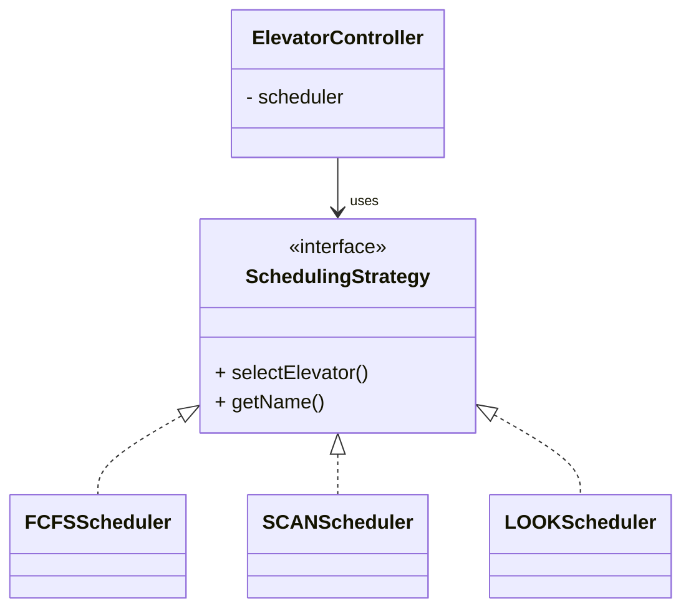

# 🛗 Elevator System - Design Explanation

## STEP 2: Detailed Design Explanation

This document covers the design decisions, SOLID principles application, design patterns used, and complexity analysis for the Elevator System.

---

## STEP 3: SOLID Principles Analysis

### 1. Single Responsibility Principle (SRP)

| Class | Single Responsibility | Reason for Change |
|-------|----------------------|-------------------|
| `Elevator` | Manage single elevator's state and movement | Elevator behavior changes |
| `Door` | Control door open/close operations | Door mechanics change |
| `Request` | Represent a single request | Request format changes |
| `Floor` | Represent floor with buttons | Floor interface changes |
| `ElevatorController` | Coordinate all elevators | Coordination logic changes |
| `SchedulingStrategy` | Select elevator for request | Algorithm changes |

**Potential SRP Concern - Elevator class:**

The `Elevator` class handles:
1. Movement logic
2. Stop management
3. Weight tracking
4. State management

**Why it's acceptable:**
- All these are tightly coupled to "being an elevator"
- Splitting would create artificial boundaries
- In production, you might extract `ElevatorMovementController`

**If we needed to split:**

```java
// Movement logic extracted
public class ElevatorMovementController {
    private final Elevator elevator;
    
    public boolean moveUp() { ... }
    public boolean moveDown() { ... }
    public void stopAtFloor() { ... }
}

// Weight management extracted
public class LoadManager {
    private final int maxWeight;
    private int currentWeight;
    
    public boolean canAddWeight(int kg) { ... }
    public void updateWeight(int delta) { ... }
}
```

---

### 2. Open/Closed Principle (OCP)

**Excellent OCP: Scheduling Strategies**

```java
// Adding new scheduler requires NO changes to existing code
public class PriorityScheduler implements SchedulingStrategy {
    
    @Override
    public Elevator selectElevator(List<Elevator> elevators, ExternalRequest request) {
        // VIP floors get priority
        if (isVIPFloor(request.getFloor())) {
            return findNearestIdleElevator(elevators, request);
        }
        return defaultSelection(elevators, request);
    }
    
    @Override
    public String getName() {
        return "Priority Scheduler";
    }
}

// Usage - just swap the strategy
controller.setScheduler(new PriorityScheduler());
```

**Adding New Request Types:**

```java
// Current: ExternalRequest and InternalRequest
// Adding: MaintenanceRequest

public class MaintenanceRequest extends Request {
    private final int priority;
    
    public MaintenanceRequest(int floor, int priority) {
        super(floor);
        this.priority = priority;
    }
    
    @Override
    public Direction getDirection() {
        return Direction.IDLE;  // Maintenance doesn't have direction
    }
}
```

**Adding New Elevator Types:**

```java
// Express elevator (skips certain floors)
public class ExpressElevator extends Elevator {
    private final Set<Integer> expressStops;
    
    public ExpressElevator(int id, int minFloor, int maxFloor, 
                           int maxWeight, Set<Integer> expressStops) {
        super(id, minFloor, maxFloor, maxWeight);
        this.expressStops = expressStops;
    }
    
    @Override
    public void addDestination(int floor) {
        if (!expressStops.contains(floor)) {
            System.out.println("Express elevator doesn't stop at floor " + floor);
            return;
        }
        super.addDestination(floor);
    }
}
```

---

### 3. Liskov Substitution Principle (LSP)

**Testing LSP with Requests:**

```java
public void processRequest(Request request) {
    // Works with ANY Request subtype
    int floor = request.getFloor();
    Direction dir = request.getDirection();
    
    // Both ExternalRequest and InternalRequest work here
    System.out.println("Processing request to floor " + floor);
}

// Test
processRequest(new ExternalRequest(5, Direction.UP));  // Works
processRequest(new InternalRequest(5, 2));             // Works
```

**LSP with Scheduling Strategies:**

```java
public void testAllSchedulers(List<Elevator> elevators, ExternalRequest request) {
    List<SchedulingStrategy> schedulers = Arrays.asList(
        new FCFSScheduler(),
        new SCANScheduler(),
        new LOOKScheduler()
    );
    
    for (SchedulingStrategy scheduler : schedulers) {
        // All schedulers must return valid elevator or null
        Elevator selected = scheduler.selectElevator(elevators, request);
        
        // Contract: if selected, it can accept the request
        if (selected != null) {
            assert selected.canAcceptRequest(request);
        }
    }
}
```

**Potential LSP Violation to Avoid:**

```java
// BAD: Breaking the contract
public class BrokenScheduler implements SchedulingStrategy {
    @Override
    public Elevator selectElevator(List<Elevator> elevators, ExternalRequest request) {
        throw new UnsupportedOperationException("Use selectElevatorV2 instead!");
    }
}
```

---

### 4. Interface Segregation Principle (ISP)

**Current Design:**

```java
// Single interface for scheduling
public interface SchedulingStrategy {
    Elevator selectElevator(List<Elevator> elevators, ExternalRequest request);
    String getName();
}
```

**Better with ISP (if needed):**

```java
// Separate interfaces for different capabilities
public interface ElevatorSelector {
    Elevator selectElevator(List<Elevator> elevators, ExternalRequest request);
}

public interface RequestPrioritizer {
    List<Request> prioritize(List<Request> requests);
}

public interface LoadBalancer {
    void rebalance(List<Elevator> elevators);
}

// Scheduler can implement what it needs
public class AdvancedScheduler implements ElevatorSelector, RequestPrioritizer {
    // Implements both
}

public class SimpleScheduler implements ElevatorSelector {
    // Only implements selection
}
```

**ISP for Elevator Operations:**

```java
// Instead of one large Elevator interface
public interface Movable {
    boolean move();
    int getCurrentFloor();
    Direction getDirection();
}

public interface Stoppable {
    boolean shouldStop();
    void stopAtFloor();
}

public interface WeightAware {
    boolean updateWeight(int deltaKg);
    int getCurrentWeight();
    int getMaxWeight();
}

// Elevator implements all
public class Elevator implements Movable, Stoppable, WeightAware {
    // ...
}

// Test doubles can implement only what they need
public class MockElevatorForMovement implements Movable {
    // Only movement methods
}
```

---

### 5. Dependency Inversion Principle (DIP)

**Current Implementation:**

```java
public class ElevatorController {
    private SchedulingStrategy scheduler;  // Depends on abstraction ✓
    
    public void setScheduler(SchedulingStrategy scheduler) {
        this.scheduler = scheduler;
    }
}
```

**DIP in Action:**

```java
// High-level module (Controller) depends on abstraction (SchedulingStrategy)
// Low-level modules (FCFSScheduler, SCANScheduler) implement abstraction

// This allows:
ElevatorController controller = new ElevatorController(...);

// Swap implementations at runtime
controller.setScheduler(new FCFSScheduler());
controller.setScheduler(new SCANScheduler());
controller.setScheduler(new LOOKScheduler());
controller.setScheduler(new CustomScheduler());
```

**Improving DIP with Dependency Injection:**

```java
// Constructor injection (preferred)
public class ElevatorController {
    private final SchedulingStrategy scheduler;
    
    public ElevatorController(int numElevators, int minFloor, int maxFloor,
                              int maxWeight, SchedulingStrategy scheduler) {
        this.scheduler = scheduler;
        // ...
    }
}

// Usage with DI framework (Spring)
@Configuration
public class ElevatorConfig {
    
    @Bean
    public SchedulingStrategy scheduler() {
        return new LOOKScheduler();
    }
    
    @Bean
    public ElevatorController controller(SchedulingStrategy scheduler) {
        return new ElevatorController(3, 0, 10, 1000, scheduler);
    }
}
```

---

## SOLID Principles Check

| Principle | Rating | Explanation | Fix if WEAK/FAIL | Tradeoff |
|-----------|--------|-------------|------------------|----------|
| **SRP** | PASS | Each class has a single, well-defined responsibility. Elevator manages state/movement, Door controls door operations, ElevatorController coordinates, SchedulingStrategy handles algorithm selection. Minor concern: Elevator class handles movement, stops, weight, and state - but these are tightly coupled to being an elevator. | N/A | - |
| **OCP** | PASS | System is open for extension (new scheduling algorithms, elevator types) without modifying existing code. Strategy pattern for scheduling enables this perfectly. | N/A | - |
| **LSP** | PASS | All scheduling strategies properly implement SchedulingStrategy interface without violating contract. All elevator types (if extended) would be substitutable. | N/A | - |
| **ISP** | PASS | Interfaces are focused. SchedulingStrategy interface is minimal and focused. No clients are forced to depend on methods they don't use. | N/A | - |
| **DIP** | PASS | High-level module (ElevatorController) depends on abstraction (SchedulingStrategy interface), not concrete implementations. DIP is well applied. | N/A | - |

---

## Design Patterns Used

### 1. Strategy Pattern

**Where:** Scheduling algorithms

**Why it fits:**
- Multiple algorithms for the same problem
- Need to switch algorithms at runtime
- Algorithms are interchangeable



<details>
<summary>ASCII diagram (reference)</summary>

```text
┌─────────────────────┐
│ ElevatorController  │
│                     │
│ - scheduler         │────────┐
└─────────────────────┘        │
                               │ uses
                               ▼
                    ┌──────────────────────┐
                    │ «interface»          │
                    │ SchedulingStrategy   │
                    ├──────────────────────┤
                    │ + selectElevator()   │
                    │ + getName()          │
                    └──────────────────────┘
                               △
           ┌───────────────────┼───────────────────┐
           │                   │                   │
┌──────────┴───────┐ ┌────────┴────────┐ ┌───────┴────────┐
│  FCFSScheduler   │ │  SCANScheduler  │ │  LOOKScheduler │
├──────────────────┤ ├─────────────────┤ ├────────────────┤
│ + selectElevator │ │ + selectElevator│ │ + selectElevator│
└──────────────────┘ └─────────────────┘ └────────────────┘
```

</details>

**Benefits:**
- Easy to add new algorithms
- Easy to test each algorithm in isolation
- Runtime flexibility

---

### 2. Singleton Pattern

**Where:** `Building` class

**Why it fits:**
- Only one building in the system
- Global access point needed
- Coordinates all elevators

```java
public class Building {
    private static Building instance;
    
    private Building(...) { /* private */ }
    
    public static synchronized Building getInstance(...) {
        if (instance == null) {
            instance = new Building(...);
        }
        return instance;
    }
}
```

**Trade-offs:**

| Pros | Cons |
|------|------|
| Single source of truth | Hard to unit test |
| Global access | Hidden dependencies |
| Lazy initialization | Thread safety complexity |

**Alternative: Dependency Injection**

```java
// Instead of Singleton, use DI
@Component
@Scope("singleton")  // Spring manages single instance
public class Building {
    // No static instance, managed by container
}
```

---

### 3. State Pattern (Implicit)

**Where:** `Elevator` states

**Current Implementation (Enum-based):**

```java
public enum ElevatorState {
    MOVING_UP, MOVING_DOWN, IDLE, STOPPED, MAINTENANCE, EMERGENCY
}

// State checks scattered in methods
public boolean move() {
    if (state == ElevatorState.MAINTENANCE || 
        state == ElevatorState.EMERGENCY) {
        return false;
    }
    // ...
}
```

**Better with State Pattern:**

```java
// State interface
public interface ElevatorState {
    void handleRequest(Elevator elevator, Request request);
    void move(Elevator elevator);
    void stop(Elevator elevator);
    void openDoor(Elevator elevator);
}

// Concrete states
public class IdleState implements ElevatorState {
    @Override
    public void handleRequest(Elevator elevator, Request request) {
        elevator.addDestination(request.getFloor());
        elevator.setState(new MovingState(request.getDirection()));
    }
    
    @Override
    public void move(Elevator elevator) {
        // Can't move when idle without request
    }
    
    @Override
    public void stop(Elevator elevator) {
        // Already stopped
    }
    
    @Override
    public void openDoor(Elevator elevator) {
        elevator.getDoor().open();
    }
}

public class MovingUpState implements ElevatorState {
    @Override
    public void handleRequest(Elevator elevator, Request request) {
        if (request.getFloor() > elevator.getCurrentFloor()) {
            elevator.addDestination(request.getFloor());
        }
    }
    
    @Override
    public void move(Elevator elevator) {
        elevator.incrementFloor();
        if (elevator.shouldStop()) {
            elevator.setState(new StoppedState());
        }
    }
    
    @Override
    public void stop(Elevator elevator) {
        elevator.setState(new StoppedState());
    }
    
    @Override
    public void openDoor(Elevator elevator) {
        // Can't open door while moving!
        throw new IllegalStateException("Cannot open door while moving");
    }
}

public class EmergencyState implements ElevatorState {
    @Override
    public void handleRequest(Elevator elevator, Request request) {
        // Ignore all requests in emergency
        System.out.println("Emergency mode: Request ignored");
    }
    
    @Override
    public void move(Elevator elevator) {
        // Cannot move in emergency
    }
    
    @Override
    public void stop(Elevator elevator) {
        // Already stopped
    }
    
    @Override
    public void openDoor(Elevator elevator) {
        elevator.getDoor().emergencyOpen();
    }
}
```

**Why we didn't use full State Pattern:**
- Enum-based approach is simpler for interview scope
- State transitions are straightforward
- Full pattern adds complexity without clear benefit here

---

### 4. Observer Pattern (Could be added)

**Use case:** Notify displays when elevator position changes

```java
// Observer interface
public interface ElevatorObserver {
    void onFloorChanged(int elevatorId, int newFloor);
    void onDirectionChanged(int elevatorId, Direction newDirection);
    void onStateChanged(int elevatorId, ElevatorState newState);
}

// Observable (in Elevator)
public class Elevator {
    private final List<ElevatorObserver> observers = new ArrayList<>();
    
    public void addObserver(ElevatorObserver observer) {
        observers.add(observer);
    }
    
    private void notifyFloorChange() {
        for (ElevatorObserver observer : observers) {
            observer.onFloorChanged(id, currentFloor);
        }
    }
    
    public boolean move() {
        // ... movement logic ...
        notifyFloorChange();  // Notify observers
        return true;
    }
}

// Concrete observer
public class FloorDisplay implements ElevatorObserver {
    private final int floorNumber;
    
    @Override
    public void onFloorChanged(int elevatorId, int newFloor) {
        System.out.println("Floor " + floorNumber + " display: " +
                          "Elevator " + elevatorId + " at floor " + newFloor);
    }
    
    // ... other methods
}
```

---

### 5. Command Pattern (Could be added)

**Use case:** Queue and execute elevator commands

```java
// Command interface
public interface ElevatorCommand {
    void execute();
    void undo();
}

// Concrete commands
public class MoveUpCommand implements ElevatorCommand {
    private final Elevator elevator;
    
    public MoveUpCommand(Elevator elevator) {
        this.elevator = elevator;
    }
    
    @Override
    public void execute() {
        elevator.moveUp();
    }
    
    @Override
    public void undo() {
        elevator.moveDown();
    }
}

public class OpenDoorCommand implements ElevatorCommand {
    private final Elevator elevator;
    
    @Override
    public void execute() {
        elevator.getDoor().open();
    }
    
    @Override
    public void undo() {
        elevator.getDoor().close();
    }
}

// Command invoker
public class ElevatorCommandQueue {
    private final Queue<ElevatorCommand> commands = new LinkedList<>();
    private final Stack<ElevatorCommand> history = new Stack<>();
    
    public void addCommand(ElevatorCommand command) {
        commands.offer(command);
    }
    
    public void executeNext() {
        ElevatorCommand command = commands.poll();
        if (command != null) {
            command.execute();
            history.push(command);
        }
    }
    
    public void undoLast() {
        if (!history.isEmpty()) {
            ElevatorCommand command = history.pop();
            command.undo();
        }
    }
}
```

---

## Why Alternatives Were Rejected

### Alternative 1: Single Elevator Class with Type Field

```java
// Rejected
public class Elevator {
    private ElevatorType type;  // STANDARD, EXPRESS, FREIGHT
    
    public void addDestination(int floor) {
        if (type == ElevatorType.EXPRESS) {
            // Express logic
        } else if (type == ElevatorType.FREIGHT) {
            // Freight logic
        } else {
            // Standard logic
        }
    }
}
```

**Why rejected:**
- Violates OCP (must modify for new types)
- Complex conditionals
- Can't add type-specific fields easily

**Better:** Use inheritance

```java
public class ExpressElevator extends Elevator { ... }
public class FreightElevator extends Elevator { ... }
```

---

### Alternative 2: Elevator Manages Its Own Scheduling

```java
// Rejected
public class Elevator {
    public void handleExternalRequest(ExternalRequest request) {
        // Elevator decides if it should take this request
    }
}
```

**Why rejected:**
- Elevator can't see other elevators
- No global optimization possible
- Violates SRP (elevator shouldn't schedule)

**Better:** Central controller with strategy

---

### Alternative 3: Polling Instead of Event-Driven

```java
// Rejected
public class ElevatorController {
    public void run() {
        while (true) {
            for (Floor floor : floors) {
                if (floor.hasUpButtonPressed()) {
                    // Handle
                }
            }
            Thread.sleep(100);
        }
    }
}
```

**Why rejected:**
- Inefficient (constant polling)
- Wastes CPU cycles
- Harder to scale

**Better:** Event-driven with request queue

---

### Alternative 4: Hardcoded Scheduling Logic

```java
// Rejected
public Elevator selectElevator(List<Elevator> elevators, Request request) {
    // Always use SCAN algorithm
    // No way to change
}
```

**Why rejected:**
- Can't adapt to different scenarios
- Can't A/B test algorithms
- Violates OCP

**Better:** Strategy pattern

---

## What Would Break Without Each Class

| Class | What Breaks |
|-------|-------------|
| `Elevator` | No elevator functionality at all |
| `Door` | Can't control door state, safety issues |
| `Request` | Can't represent user intentions |
| `Floor` | No interface for users to call elevators |
| `ElevatorController` | No coordination, chaos |
| `SchedulingStrategy` | Hardcoded algorithm, inflexible |
| `Building` | No system configuration |

---

## Scheduling Algorithm Comparison

### FCFS (First-Come-First-Served)

```
Scenario: Elevator at floor 5
Requests: Floor 2 (UP), Floor 8 (DOWN), Floor 3 (UP)

FCFS order: 2 → 8 → 3
Movement: 5 → 2 → 8 → 3
Total distance: 3 + 6 + 5 = 14 floors
```

### SCAN (Elevator Algorithm)

```
Same scenario:
Elevator at floor 5, moving UP

SCAN order: 8 → 3 → 2
Movement: 5 → 8 → 3 → 2
Total distance: 3 + 5 + 1 = 9 floors
```

### LOOK (Optimized SCAN)

```
Same scenario:
Elevator at floor 5, no requests above 8

LOOK order: 8 → 3 → 2
Same as SCAN here, but doesn't go to floor 10 (max)
```

### Comparison Table

| Algorithm | Pros | Cons | Best For |
|-----------|------|------|----------|
| FCFS | Simple, fair | Inefficient | Low traffic |
| SCAN | Efficient, bounded wait | May go to extremes | High traffic |
| LOOK | Most efficient | Slightly complex | Production systems |

---

## Concurrency Considerations

### Thread Safety in Elevator

```java
public class Elevator {
    // Thread-safe collections
    private final NavigableSet<Integer> upStops = 
        new ConcurrentSkipListSet<>();
    
    // Synchronized methods for state changes
    public synchronized void addDestination(int floor) {
        // Only one thread can modify at a time
    }
    
    public synchronized boolean move() {
        // Atomic movement
    }
}
```

### Race Condition Example

```
Without synchronization:
Thread A (Controller): Check elevator.hasStops() → true
Thread B (Controller): Check elevator.hasStops() → true
Thread A: Call elevator.move()
Thread B: Call elevator.move()
Result: Elevator moves twice unexpectedly!

With synchronization:
Thread A: Acquire lock, move(), release lock
Thread B: Wait for lock, acquire, move(), release
Result: Proper sequential movement
```

### Deadlock Prevention

```java
// Always acquire locks in same order
public void transferPassenger(Elevator from, Elevator to) {
    // Sort by ID to ensure consistent lock order
    Elevator first = from.getId() < to.getId() ? from : to;
    Elevator second = from.getId() < to.getId() ? to : from;
    
    synchronized (first) {
        synchronized (second) {
            // Safe transfer
        }
    }
}
```

---

## STEP 8: Interviewer Follow-ups with Answers

### Q1: How would you handle a stuck elevator?

**Answer:**
```java
public class Elevator {
    private long lastMovementTime;
    private static final long STUCK_THRESHOLD_MS = 30000;  // 30 seconds
    
    public boolean isStuck() {
        if (state == ElevatorState.MOVING_UP || state == ElevatorState.MOVING_DOWN) {
            return System.currentTimeMillis() - lastMovementTime > STUCK_THRESHOLD_MS;
        }
        return false;
    }
    
    public boolean move() {
        // ... existing logic ...
        lastMovementTime = System.currentTimeMillis();
        return true;
    }
}

public class ElevatorController {
    private ScheduledExecutorService healthChecker;
    
    public void startHealthCheck() {
        healthChecker.scheduleAtFixedRate(() -> {
            for (Elevator elevator : elevators) {
                if (elevator.isStuck()) {
                    handleStuckElevator(elevator);
                }
            }
        }, 10, 10, TimeUnit.SECONDS);
    }
    
    private void handleStuckElevator(Elevator elevator) {
        elevator.setMaintenance(true);
        redistributeRequests(elevator);
        notifyMaintenance(elevator);
    }
}
```

---

### Q2: How would you add VIP/priority floors?

**Answer:**
```java
public class PriorityRequest extends ExternalRequest {
    private final int priority;  // Higher = more important
    
    public PriorityRequest(int floor, Direction direction, int priority) {
        super(floor, direction);
        this.priority = priority;
    }
}

public class PriorityScheduler implements SchedulingStrategy {
    private final Set<Integer> vipFloors = Set.of(1, 10, 20);  // Lobby, exec floors
    
    @Override
    public Elevator selectElevator(List<Elevator> elevators, ExternalRequest request) {
        if (isVIPRequest(request)) {
            // Dedicate an idle elevator if available
            return findIdleElevator(elevators)
                .orElse(findNearestElevator(elevators, request));
        }
        return standardSelection(elevators, request);
    }
    
    private boolean isVIPRequest(ExternalRequest request) {
        return vipFloors.contains(request.getFloor()) ||
               (request instanceof PriorityRequest && 
                ((PriorityRequest) request).getPriority() > 5);
    }
}
```

---

### Q3: How would you implement destination dispatch?

**Answer:**
Destination dispatch: Users enter destination BEFORE entering elevator.

```java
public class DestinationDispatchController extends ElevatorController {
    
    // User enters destination at lobby kiosk
    public int requestElevatorWithDestination(int sourceFloor, int destFloor) {
        // Find best elevator for this trip
        Elevator best = findBestElevatorForTrip(sourceFloor, destFloor);
        
        if (best != null) {
            // Add both pickup and destination
            best.addDestination(sourceFloor);
            best.addDestination(destFloor);
            
            // Return elevator ID so user knows which one to take
            return best.getId();
        }
        
        return -1;  // No elevator available
    }
    
    private Elevator findBestElevatorForTrip(int source, int dest) {
        Direction tripDirection = source < dest ? Direction.UP : Direction.DOWN;
        
        return elevators.stream()
            .filter(e -> e.canAcceptRequest(new ExternalRequest(source, tripDirection)))
            .filter(e -> !willCauseBacktrack(e, source, dest))
            .min(Comparator.comparingLong(e -> e.estimatedTimeToFloor(source)))
            .orElse(null);
    }
}
```

---

### Q4: How would you handle peak hours (morning rush)?

**Answer:**
```java
public class RushHourOptimizer {
    
    // During morning rush, most people go UP from lobby
    public void optimizeForMorningRush(ElevatorController controller) {
        // Park some elevators at lobby
        for (int i = 0; i < controller.getElevators().size() / 2; i++) {
            Elevator elevator = controller.getElevator(i + 1);
            if (elevator.getState() == ElevatorState.IDLE) {
                elevator.addDestination(0);  // Send to lobby
            }
        }
        
        // Switch to batch loading
        controller.setScheduler(new BatchLoadingScheduler());
    }
}

public class BatchLoadingScheduler implements SchedulingStrategy {
    
    @Override
    public Elevator selectElevator(List<Elevator> elevators, ExternalRequest request) {
        // During rush, fill elevators before sending
        // Don't dispatch half-empty elevators
        
        Optional<Elevator> loadingElevator = elevators.stream()
            .filter(e -> e.getCurrentFloor() == request.getFloor())
            .filter(e -> e.getState() == ElevatorState.STOPPED)
            .filter(e -> e.getCurrentWeightKg() < e.getMaxWeightKg() * 0.8)
            .findFirst();
        
        if (loadingElevator.isPresent()) {
            return loadingElevator.get();  // Keep loading current elevator
        }
        
        // Otherwise, send a new one
        return findNearestIdle(elevators, request);
    }
}
```

---

### Q5: What would you do differently with more time?

**Answer:**
1. **Add persistence**: Store elevator state in database for recovery
2. **Add metrics**: Track wait times, trip times, utilization
3. **Add simulation mode**: Test algorithms without real delays
4. **Add REST API**: Control system via HTTP
5. **Add WebSocket**: Real-time position updates to displays
6. **Add ML-based prediction**: Predict demand based on time/day
7. **Add energy optimization**: Regenerative braking, sleep mode

---

### Q6: How would you optimize for very tall buildings (100+ floors)?

**Answer:**
```java
// Zone-based elevator assignment
public class ZoneBasedScheduler implements SchedulingStrategy {
    private final Map<Integer, List<Elevator>> zones;
    
    // Zone 1: Floors 1-25 (elevators 1-2)
    // Zone 2: Floors 26-50 (elevators 3-4)
    // Zone 3: Floors 51-75 (elevators 5-6)
    // Zone 4: Floors 76-100 (elevators 7-8)
    
    @Override
    public Elevator selectElevator(List<Elevator> elevators, ExternalRequest request) {
        int zone = getZoneForFloor(request.getFloor());
        List<Elevator> zoneElevators = zones.get(zone);
        
        // Select from zone-specific elevators
        return findBestInZone(zoneElevators, request)
            .orElse(findNearestCrossZone(elevators, request));
    }
}
```

---

### Q7: How would you handle emergency situations?

**Answer:**
```java
public enum EmergencyType {
    FIRE, POWER_OUTAGE, EARTHQUAKE, MEDICAL
}

public class EmergencyHandler {
    public void handleEmergency(EmergencyType type, ElevatorController controller) {
        switch (type) {
            case FIRE:
                // Send all elevators to ground floor, disable calls
                controller.getAllElevators().forEach(e -> {
                    e.addDestination(0);
                    e.setEmergencyMode(true);
                });
                break;
            case POWER_OUTAGE:
                // Use backup power, move to nearest floor
                controller.getAllElevators().forEach(e -> {
                    int nearestFloor = e.getCurrentFloor();
                    e.addDestination(nearestFloor);
                });
                break;
        }
    }
}
```

---

### Q8: What are the tradeoffs between SCAN and LOOK algorithms?

**Answer:**

| Aspect | SCAN | LOOK |
|--------|------|------|
| **Efficiency** | Goes to extremes even if no requests | Only goes to furthest request |
| **Wait Time Bounds** | Guaranteed (worst case: 2× max floors) | Same bounds, but typically faster |
| **Implementation** | Simpler | Slightly more complex (need to check if requests exist) |
| **Best For** | Systems requiring strict fairness | Production systems (better performance) |

**Recommendation:** Use LOOK for production - it's more efficient while maintaining the same worst-case guarantees.

---

## STEP 7: Complexity Analysis

### Time Complexity

| Operation | Complexity | Explanation |
|-----------|------------|-------------|
| `addDestination()` | O(log n) | ConcurrentSkipListSet.add() |
| `shouldStop()` | O(log n) | Set.contains() |
| `move()` | O(1) | Simple state update |
| `stopAtFloor()` | O(log n) | Set.remove() |
| `selectElevator()` | O(E) | E = number of elevators |
| `calculateScore()` | O(S) | S = stops in elevator |

### Space Complexity

| Data Structure | Space | Purpose |
|----------------|-------|---------|
| `elevators` | O(E) | Store elevator objects |
| `upStops` per elevator | O(F) | F = max floors |
| `downStops` per elevator | O(F) | F = max floors |
| `pendingRequests` | O(R) | R = pending requests |

### Bottlenecks at Scale

**100 elevators, 100 floors:**
- `selectElevator()` becomes O(E × S) = O(100 × 100) = O(10,000)
- Solution: Partition elevators by zone

**1000 requests/second:**
- `pendingRequests` queue grows unbounded
- Solution: Rate limiting, request batching

**Optimization: Zone-based Scheduling**

```java
public class ZonedElevatorController {
    private final Map<Integer, List<Elevator>> elevatorsByZone;
    
    // Zone 1: Floors 0-10
    // Zone 2: Floors 11-20
    // Zone 3: Floors 21-30
    
    public Elevator selectElevator(ExternalRequest request) {
        int zone = request.getFloor() / 10;
        List<Elevator> zoneElevators = elevatorsByZone.get(zone);
        
        // Only search within zone
        return scheduler.selectElevator(zoneElevators, request);
    }
}
```

