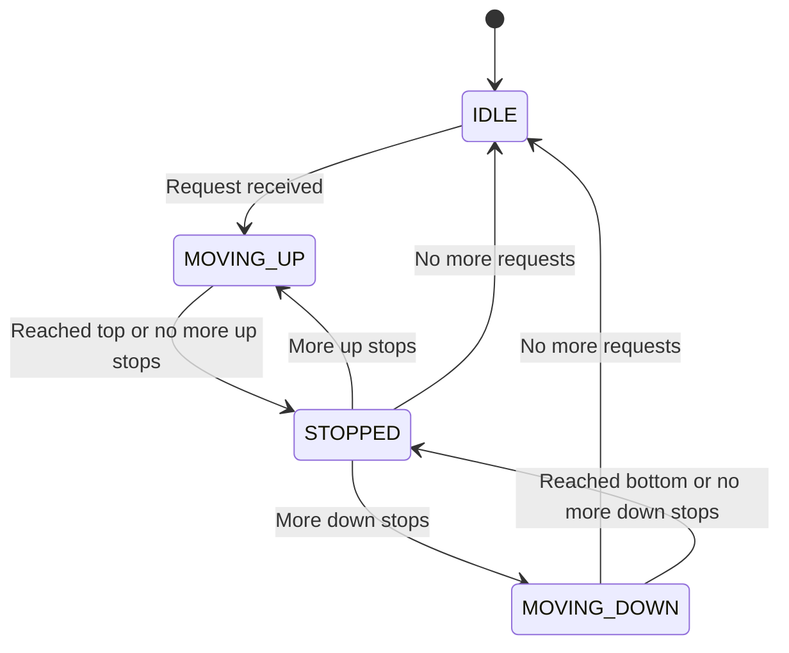

# 🛗 Elevator System - Simulation & Testing

## STEP 5: Simulation / Dry Run

### Scenario 1: Happy Path - SCAN Algorithm in Action

```
Initial State:
- Elevator 1: Floor 0, IDLE
- Elevator 2: Floor 0, IDLE
- Elevator 3: Floor 0, IDLE

Time T0: Request from Floor 5 (DOWN)
- SCAN Scheduler evaluates:
  - Elevator 1: Distance = 5, Score = 5 (idle)
  - Elevator 2: Distance = 5, Score = 5 (idle)
  - Elevator 3: Distance = 5, Score = 5 (idle)
- Selects Elevator 1 (first with min score)
- Elevator 1: upStops = {5}, direction = UP

Time T1: Elevator 1 moving
- Floor 0 → 1 → 2 → 3 → 4 → 5
- At Floor 5: shouldStop() = true (5 in upStops)
- stopAtFloor(): Open door, wait, close door
- upStops = {}, direction = IDLE

Time T2: Request from Floor 2 (UP) and Floor 8 (DOWN)
- Request Floor 2 (UP):
  - Elevator 1: Floor 5, IDLE, Distance = 3, Score = 3
  - Elevator 2: Floor 0, IDLE, Distance = 2, Score = 2 ← Selected
- Request Floor 8 (DOWN):
  - Elevator 1: Floor 5, IDLE, Distance = 3, Score = 3 ← Selected
  - Elevator 3: Floor 0, IDLE, Distance = 8, Score = 8

Time T3: Both elevators moving
- Elevator 1: 5 → 6 → 7 → 8 (stops, serves request)
- Elevator 2: 0 → 1 → 2 (stops, serves request)

Time T4: Request from Floor 6 (UP) while Elevator 1 at Floor 8 going DOWN
- Elevator 1: Floor 8, DOWN, Score = 2 + 20 = 22 (moving away)
- Elevator 2: Floor 2, IDLE, Score = 4
- Elevator 3: Floor 0, IDLE, Score = 6
- Selects Elevator 2
```

**Final State:**

```
Elevator 1: Floor 8, IDLE
Elevator 2: Floor 6, IDLE (served request from Floor 6)
Elevator 3: Floor 0, IDLE
All requests served successfully
```

---

### Scenario 2: Failure/Invalid Input - Weight Limit Exceeded

**Initial State:**

```
Elevator 1: Floor 0, IDLE, currentWeight: 0 kg, maxWeight: 1000 kg
Elevator 2: Floor 5, MOVING_UP, currentWeight: 800 kg, maxWeight: 1000 kg
```

**Step-by-step:**

1. `Elevator 1.requestElevator(ExternalRequest(Floor 3, Direction.UP))`

   - Elevator 1 selected (IDLE, nearest)
   - Elevator 1 moves to Floor 3
   - Door opens, passenger boards
   - `updateWeight(250)` → currentWeight: 250 kg ✓

2. `Elevator 1.addDestination(Floor 8)` (via internal button)

   - Elevator 1 continues UP
   - Door opens at Floor 8
   - More passengers attempt to board (total weight would be 1200 kg)

3. `Elevator 1.updateWeight(950)` (attempt to add 950 kg)
   - Check: currentWeight (250) + 950 = 1200 > maxWeight (1000) ✗
   - `updateWeight()` returns false
   - Door closes, elevator continues without additional passengers
   - Error message displayed: "Weight limit exceeded. Please wait for next elevator."

**Final State:**

```
Elevator 1: Floor 8, IDLE, currentWeight: 250 kg
Passengers who exceeded limit remain on floor
Elevator 1 continues operation normally
```

---

### Scenario 3: Concurrency/Race Condition - Simultaneous Requests

**Initial State:**

```
Elevator 1: Floor 3, MOVING_UP, upStops: {5, 7}
Elevator 2: Floor 1, MOVING_UP, upStops: {4}
Elevator 3: Floor 0, IDLE
```

**Step-by-step (simulating concurrent requests):**

**Thread A:** Request from Floor 6 (UP) at time T0
**Thread B:** Request from Floor 2 (UP) at time T0 (simultaneous)

1. **Thread A:** `ElevatorController.requestElevator(ExternalRequest(Floor 6, Direction.UP))`

   - SCAN Scheduler evaluates all elevators
   - Elevator 1: Floor 3, UP, Score = 3 (serving 5, 7, will pass 6)
   - Elevator 2: Floor 1, UP, Score = 5 (serving 4, then needs to go to 6)
   - Elevator 3: Floor 0, IDLE, Score = 6
   - **Selected:** Elevator 1 (best score)
   - Elevator 1: upStops = {5, 6, 7} (6 added to stops)

2. **Thread B:** `ElevatorController.requestElevator(ExternalRequest(Floor 2, Direction.UP))` (concurrent)

   - SCAN Scheduler evaluates all elevators
   - Elevator 1: Floor 3, UP, Score = 1 (already passed Floor 2, would need to reverse)
   - Elevator 2: Floor 1, UP, Score = 1 (currently at 1, moving to 4, will pass 2)
   - Elevator 3: Floor 0, IDLE, Score = 2
   - **Selected:** Elevator 2 (best score, currently moving UP)
   - Elevator 2: upStops = {2, 4} (2 added to stops, reordered)

3. **Elevator 1 movement:**

   - Floor 3 → 4 → 5 (stops, serves original request)
   - Floor 5 → 6 (stops, serves Thread A's request)
   - Floor 6 → 7 (stops, serves original request)

4. **Elevator 2 movement:**
   - Floor 1 → 2 (stops, serves Thread B's request)
   - Floor 2 → 3 → 4 (stops, serves original request)

**Final State:**

```
Elevator 1: Floor 7, IDLE, upStops: {}
Elevator 2: Floor 4, IDLE, upStops: {}
All concurrent requests handled correctly, no race conditions
No duplicate assignments, proper thread-safe queue handling
```

---

### State Diagram



<details>
<summary>ASCII diagram (reference)</summary>

```text
                    ┌─────────────────────┐
                    │                     │
                    ▼                     │
              ┌──────────┐                │
   ┌─────────►│   IDLE   │◄──────────┐   │
   │          └────┬─────┘           │   │
   │               │                 │   │
   │    Request    │    No more      │   │
   │    received   │    requests     │   │
   │               ▼                 │   │
   │          ┌──────────┐           │   │
   │          │ MOVING_UP│───────────┤   │
   │          └────┬─────┘           │   │
   │               │                 │   │
   │    Reached    │                 │   │
   │    top or     │                 │   │
   │    no more    │                 │   │
   │    up stops   │                 │   │
   │               ▼                 │   │
   │          ┌──────────┐           │   │
   │          │ STOPPED  │───────────┘   │
   │          └────┬─────┘               │
   │               │                     │
   │    More       │                     │
   │    down       │                     │
   │    stops      │                     │
   │               ▼                     │
   │          ┌────────────┐             │
   └──────────│MOVING_DOWN │─────────────┘
              └────────────┘
```

</details>

---

## STEP 6: Edge Cases & Testing Strategy

### Boundary Conditions & Invalid Inputs

- **Invalid Floor Request**: Request for floor < minFloor or > maxFloor is rejected
- **Request for Current Floor**: If elevator already at requested floor, no action taken
- **Empty Building**: No elevators available, request queued indefinitely
- **All Elevators in Maintenance**: No elevator can accept requests
- **Request During Emergency**: Requests ignored while emergency active
- **Weight Limit Exceeded**: `updateWeight()` returns false, prevents boarding

### Concurrent Access Scenarios and Race Conditions

- **Simultaneous Requests**: Multiple floor buttons pressed at same time
  - **Expected Behavior**: `ConcurrentLinkedQueue` handles concurrent offers safely
- **Simultaneous Destination Adds**: Multiple threads call `addDestination()`
  - **Expected Behavior**: `synchronized` method ensures atomic updates
- **Scheduler Selection During Movement**: Elevator state changes while scheduler evaluates
  - **Expected Behavior**: Scheduler uses snapshot of state, may select suboptimally but safely
- **Emergency Stop During Movement**: Emergency triggered while elevator moving
  - **Expected Behavior**: Elevator stops immediately, doors open

### Unit Test Strategy for Each Class

**`Elevator`:**

- Test `addDestination` adds to correct set (upStops vs downStops)
- Test `move()` returns false when door open
- Test `move()` returns false in MAINTENANCE/EMERGENCY state
- Test `shouldStop()` returns true when current floor in stops
- Test `updateWeight()` rejects overweight
- Test direction changes correctly after serving all stops

**`Door`:**

- Test initial state is CLOSED
- Test `open()` is idempotent (calling twice is safe)
- Test `close()` is idempotent
- Test state transitions: CLOSED → OPENING → OPEN

**`Request` (and subclasses):**

- Test `ExternalRequest` rejects IDLE direction
- Test `InternalRequest` calculates direction correctly
- Test `compareTo` orders by floor

**`SchedulingStrategy` implementations:**

- Test FCFS selects nearest elevator
- Test SCAN prefers same-direction elevators
- Test LOOK considers estimated time
- Test all return null when no elevator available

### Integration Test Approach

- **End-to-End Flow**: Create building, start system, make requests, verify elevators arrive
- **Multiple Elevators**: Verify requests distributed across elevators
- **Scheduler Swap**: Change scheduler at runtime, verify new algorithm used
- **Emergency Scenario**: Trigger emergency, verify all elevators stop
- **Recovery**: Exit maintenance mode, verify elevator resumes service

### Load and Stress Testing Approach

- **High Request Volume**: Generate 1000 requests/second, measure queue growth
- **Concurrent Access**: 100 threads making requests simultaneously
- **Long Running**: Run system for hours, check for memory leaks
- **Peak Simulation**: Morning rush (all requests from lobby UP), evening rush (all DOWN to lobby)

---

### Unit Tests

```java
// ElevatorTest.java
public class ElevatorTest {

    private Elevator elevator;

    @BeforeEach
    void setUp() {
        elevator = new Elevator(1, 0, 10, 1000);
    }

    @Test
    void testInitialState() {
        assertEquals(0, elevator.getCurrentFloor());
        assertEquals(Direction.IDLE, elevator.getDirection());
        assertEquals(ElevatorState.IDLE, elevator.getState());
    }

    @Test
    void testAddDestinationAbove() {
        elevator.addDestination(5);

        assertTrue(elevator.getUpStops().contains(5));
        assertEquals(Direction.UP, elevator.getDirection());
    }

    @Test
    void testAddDestinationBelow() {
        // First move elevator up
        elevator.addDestination(5);
        while (elevator.getCurrentFloor() < 5) {
            elevator.move();
        }
        elevator.stopAtFloor();

        // Now add destination below
        elevator.addDestination(2);

        assertTrue(elevator.getDownStops().contains(2));
    }

    @Test
    void testCannotMoveWithDoorOpen() {
        elevator.addDestination(5);
        elevator.getDoor().open();

        assertFalse(elevator.move());
    }

    @Test
    void testShouldStopAtDestination() {
        elevator.addDestination(3);

        // Move to floor 3
        elevator.move();  // 0 → 1
        assertFalse(elevator.shouldStop());

        elevator.move();  // 1 → 2
        assertFalse(elevator.shouldStop());

        elevator.move();  // 2 → 3
        assertTrue(elevator.shouldStop());
    }

    @Test
    void testWeightLimit() {
        assertTrue(elevator.updateWeight(500));   // Add 500kg
        assertTrue(elevator.updateWeight(400));   // Add 400kg (total 900)
        assertFalse(elevator.updateWeight(200));  // Exceeds 1000kg limit
    }
}
```

```java
// SchedulerTest.java
public class SchedulerTest {

    private List<Elevator> elevators;

    @BeforeEach
    void setUp() {
        elevators = Arrays.asList(
            new Elevator(1, 0, 10, 1000),
            new Elevator(2, 0, 10, 1000),
            new Elevator(3, 0, 10, 1000)
        );
    }

    @Test
    void testFCFSSelectsNearest() {
        // Move elevator 2 to floor 4
        Elevator e2 = elevators.get(1);
        e2.addDestination(4);
        while (e2.getCurrentFloor() < 4) e2.move();
        e2.stopAtFloor();

        FCFSScheduler scheduler = new FCFSScheduler();
        ExternalRequest request = new ExternalRequest(5, Direction.UP);

        Elevator selected = scheduler.selectElevator(elevators, request);

        assertEquals(2, selected.getId());  // E2 is closest to floor 5
    }

    @Test
    void testSCANPrefersSameDirection() {
        // E1 at floor 3, moving UP
        Elevator e1 = elevators.get(0);
        e1.addDestination(5);
        while (e1.getCurrentFloor() < 3) e1.move();

        // E2 at floor 4, IDLE
        Elevator e2 = elevators.get(1);
        e2.addDestination(4);
        while (e2.getCurrentFloor() < 4) e2.move();
        e2.stopAtFloor();

        SCANScheduler scheduler = new SCANScheduler();
        ExternalRequest request = new ExternalRequest(6, Direction.UP);

        Elevator selected = scheduler.selectElevator(elevators, request);

        // E1 should be selected (moving UP toward floor 6)
        assertEquals(1, selected.getId());
    }
}
```

### Integration Tests

```java
// ElevatorSystemIntegrationTest.java
public class ElevatorSystemIntegrationTest {

    @Test
    void testFullScenario() throws InterruptedException {
        Building.resetInstance();
        Building building = Building.getInstance("Test", 10, 2, 0, 1000);
        building.start();

        ElevatorController controller = building.getController();

        // Request from floor 5
        controller.requestElevator(new ExternalRequest(5, Direction.UP));

        // Wait for elevator to arrive
        Thread.sleep(10000);

        // Verify an elevator is at or near floor 5
        boolean elevatorAtFloor5 = controller.getElevators().stream()
            .anyMatch(e -> e.getCurrentFloor() == 5);

        assertTrue(elevatorAtFloor5);

        building.stop();
    }
}
```

---

**Note:** Interview follow-ups have been moved to `02-design-explanation.md`, STEP 8.
