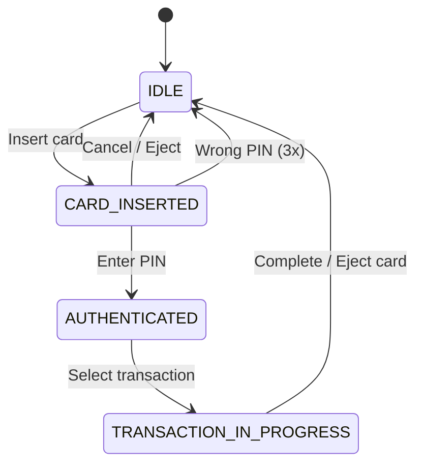

# 🏧 ATM System - Design Explanation

## STEP 2: Detailed Design Explanation

This document covers the design decisions, SOLID principles application, design patterns used, and complexity analysis for the ATM System.

---

## STEP 3: SOLID Principles Analysis

### 1. Single Responsibility Principle (SRP)

| Class | Responsibility | Reason for Change |
|-------|---------------|-------------------|
| `Card` | Manage card authentication | Card rules change |
| `Account` | Manage account balance | Account rules change |
| `Transaction` | Execute one transaction | Transaction logic changes |
| `CashDispenser` | Manage cash inventory | Cash handling changes |
| `CardReader` | Read and validate cards | Card technology changes |
| `ATMController` | Coordinate ATM operations | Workflow changes |
| `Screen` | Display messages | UI changes |
| `Keypad` | Accept user input | Input method changes |

**Key SRP Decision: Transaction Classes**

```java
// Each transaction type is a separate class
public class WithdrawalTransaction extends Transaction {
    @Override
    public boolean execute() {
        // Only withdrawal logic
    }
}

public class DepositTransaction extends Transaction {
    @Override
    public boolean execute() {
        // Only deposit logic
    }
}
```

**Why separate transaction classes?**
- Each has different validation rules
- Each interacts with different hardware
- Changes to withdrawal don't affect deposit
- Easy to add new transaction types

---

### 2. Open/Closed Principle (OCP)

**Adding New Transaction Types:**

```java
// Add bill payment without changing existing code
public class BillPaymentTransaction extends Transaction {
    private final String billerId;
    private final String accountNumber;
    
    public BillPaymentTransaction(Account account, double amount, 
                                  String billerId, String accountNumber) {
        super(TransactionType.BILL_PAYMENT, account, amount);
        this.billerId = billerId;
        this.accountNumber = accountNumber;
    }
    
    @Override
    public boolean execute() {
        // Validate
        if (!account.withdraw(amount)) {
            fail("Insufficient funds");
            return false;
        }
        
        // Send payment to biller (external API)
        boolean sent = BillerService.sendPayment(billerId, accountNumber, amount);
        
        if (!sent) {
            account.deposit(amount);  // Rollback
            fail("Payment failed");
            return false;
        }
        
        complete();
        return true;
    }
}
```

**Adding New Account Types:**

```java
// Add money market account
public class MoneyMarketAccount extends Account {
    private double minimumBalance;
    private int freeWithdrawals;
    private int withdrawalsUsed;
    
    @Override
    protected boolean canWithdraw(double amount) {
        if (balance - amount < minimumBalance) {
            return false;
        }
        if (withdrawalsUsed >= freeWithdrawals) {
            // Charge fee for excess withdrawals
        }
        return true;
    }
}
```

**Adding New Authentication Methods:**

```java
public interface AuthenticationMethod {
    boolean authenticate(Card card);
}

public class PinAuthentication implements AuthenticationMethod {
    @Override
    public boolean authenticate(Card card) {
        String pin = keypad.getPin();
        return card.validatePin(pin);
    }
}

public class BiometricAuthentication implements AuthenticationMethod {
    @Override
    public boolean authenticate(Card card) {
        // Fingerprint or face recognition
        return biometricScanner.verify(card.getCustomerId());
    }
}
```

---

### 3. Liskov Substitution Principle (LSP)

**Testing LSP with Accounts:**

```java
public void processWithdrawal(Account account, double amount) {
    // Works with ANY Account subtype
    if (account.withdraw(amount)) {
        System.out.println("Withdrawal successful");
    }
}

// All these work correctly
processWithdrawal(new CheckingAccount(...), 100);
processWithdrawal(new SavingsAccount(...), 100);
processWithdrawal(new MoneyMarketAccount(...), 100);
```

**LSP with Transactions:**

```java
public void executeTransaction(Transaction transaction) {
    // Works with ANY Transaction subtype
    boolean success = transaction.execute();
    logTransaction(transaction);
}

// All these work correctly
executeTransaction(new WithdrawalTransaction(...));
executeTransaction(new DepositTransaction(...));
executeTransaction(new TransferTransaction(...));
```

**Potential LSP Violation:**

```java
// BAD: Breaking the contract
public class LockedAccount extends Account {
    @Override
    public boolean withdraw(double amount) {
        throw new AccountLockedException("Account is locked");
    }
}
```

**Better approach:**

```java
public class LockedAccount extends Account {
    @Override
    protected boolean canWithdraw(double amount) {
        return false;  // Always return false, no exception
    }
}
```

---

### 4. Interface Segregation Principle (ISP)

**Current Design (Could Improve):**

```java
// Account has many methods
public abstract class Account {
    public double getBalance();
    public boolean withdraw(double amount);
    public boolean deposit(double amount);
    public void addTransaction(Transaction transaction);
}
```

**Better with ISP:**

```java
public interface Readable {
    double getBalance();
}

public interface Withdrawable {
    boolean withdraw(double amount);
}

public interface Depositable {
    boolean deposit(double amount);
}

public interface TransactionTrackable {
    void addTransaction(Transaction transaction);
    List<Transaction> getTransactions();
}

// Regular account implements all
public class CheckingAccount implements 
    Readable, Withdrawable, Depositable, TransactionTrackable { }

// View-only account (for reporting)
public class AccountView implements Readable {
    private final Account account;
    
    @Override
    public double getBalance() {
        return account.getBalance();
    }
}
```

**ISP for Hardware:**

```java
public interface CashHandler {
    boolean canDispense(double amount);
    boolean dispenseCash(double amount);
}

public interface CashAcceptor {
    double countInsertedCash();
    void returnCash();
}

// CashDispenser only dispenses
public class CashDispenser implements CashHandler { }

// CashSlot only accepts
public class CashSlot implements CashAcceptor { }

// Full-service machine does both
public class FullServiceCashHandler implements CashHandler, CashAcceptor { }
```

---

### 5. Dependency Inversion Principle (DIP)

**Current Implementation:**

```java
public class ATMController {
    private final ATM atm;  // Depends on concrete ATM
}
```

**Better with DIP:**

```java
// Define abstractions
public interface DisplayDevice {
    void displayMessage(String message);
    void displayError(String error);
}

public interface InputDevice {
    String getPin();
    int getInput();
    double getAmount();
}

public interface CashOutputDevice {
    boolean canDispense(double amount);
    boolean dispenseCash(double amount);
}

// Controller depends on abstractions
public class ATMController {
    private final DisplayDevice display;
    private final InputDevice input;
    private final CashOutputDevice cashOutput;
    
    public ATMController(DisplayDevice display, InputDevice input, 
                         CashOutputDevice cashOutput) {
        this.display = display;
        this.input = input;
        this.cashOutput = cashOutput;
    }
}

// Concrete implementations
public class Screen implements DisplayDevice { }
public class Keypad implements InputDevice { }
public class CashDispenser implements CashOutputDevice { }
```

**Benefits:**
- Easy to test with mock devices
- Can swap hardware implementations
- Supports different ATM configurations

---

## SOLID Principles Check

| Principle | Rating | Explanation | Fix if WEAK/FAIL | Tradeoff |
|-----------|--------|-------------|------------------|----------|
| **SRP** | PASS | Each class has a single, well-defined responsibility. Card handles authentication, Account manages balance, Transaction executes operations, CashDispenser handles cash, ATMController coordinates. Transaction class separation by type is excellent SRP. | N/A | - |
| **OCP** | PASS | System is open for extension (new transaction types, account types) without modifying existing code. Template method pattern in Transaction and inheritance enable this. | N/A | - |
| **LSP** | PASS | All Transaction subclasses properly implement the template method contract. All Account subclasses are substitutable. No violations. | N/A | - |
| **ISP** | WEAK | Could benefit from interface segregation for Account (Readable, Withdrawable, Depositable) and hardware (CashHandler, CashAcceptor). Currently using concrete classes or abstract classes. | Extract interfaces: Account interfaces, Hardware interfaces | More files/interfaces, but increases flexibility and testability |
| **DIP** | WEAK | ATMController depends on concrete ATM. Should depend on abstractions (DisplayDevice, InputDevice, CashOutputDevice interfaces). Hardware abstractions mentioned but not fully implemented. | Extract hardware interfaces, use constructor injection in controller | More setup/configuration, but improves testability and hardware vendor flexibility |

---

## Design Patterns Used

### 1. State Pattern

**Where:** ATM states

```java
public enum ATMState {
    IDLE,
    CARD_INSERTED,
    AUTHENTICATED,
    TRANSACTION_IN_PROGRESS,
    OUT_OF_SERVICE,
    OUT_OF_CASH
}
```

**Full State Pattern Implementation:**

```java
public interface ATMState {
    void insertCard(ATMController controller, Card card);
    void enterPin(ATMController controller, String pin);
    void selectTransaction(ATMController controller, int option);
    void cancelTransaction(ATMController controller);
}

public class IdleState implements ATMState {
    @Override
    public void insertCard(ATMController controller, Card card) {
        if (controller.getCardReader().readCard(card) != null) {
            controller.setState(new CardInsertedState());
        }
    }
    
    @Override
    public void enterPin(ATMController controller, String pin) {
        // Invalid in this state
        controller.getScreen().displayError("Please insert card first");
    }
    
    // ... other methods
}

public class CardInsertedState implements ATMState {
    @Override
    public void insertCard(ATMController controller, Card card) {
        // Invalid - card already inserted
    }
    
    @Override
    public void enterPin(ATMController controller, String pin) {
        if (controller.getCurrentCard().validatePin(pin)) {
            controller.setState(new AuthenticatedState());
        }
    }
    
    // ... other methods
}
```

**State Diagram:**



<details>
<summary>ASCII diagram (reference)</summary>

```text
                    ┌─────────────────────┐
                    │                     │
                    ▼                     │
              ┌──────────┐                │
   ┌─────────►│   IDLE   │◄──────────┐   │
   │          └────┬─────┘           │   │
   │               │                 │   │
   │    Insert     │    Cancel/      │   │
   │    Card       │    Eject        │   │
   │               ▼                 │   │
   │          ┌──────────────┐       │   │
   │          │CARD_INSERTED │───────┤   │
   │          └──────┬───────┘       │   │
   │                 │               │   │
   │    Enter        │    Wrong PIN  │   │
   │    PIN          │    (3x)       │   │
   │                 ▼               │   │
   │          ┌──────────────┐       │   │
   │          │AUTHENTICATED │───────┘   │
   │          └──────┬───────┘           │
   │                 │                   │
   │    Select       │                   │
   │    Transaction  │                   │
   │                 ▼                   │
   │          ┌────────────────────┐     │
   └──────────│TRANSACTION_IN_PROG │─────┘
              └────────────────────┘
```

</details>

---

### 2. Command Pattern

**Where:** Transaction execution

```java
// Transaction is a Command
public abstract class Transaction {
    public abstract boolean execute();
}

// Concrete commands
public class WithdrawalTransaction extends Transaction {
    @Override
    public boolean execute() {
        // Withdrawal logic
    }
}

// Invoker (ATMController)
public class ATMController {
    public boolean executeTransaction(Transaction transaction) {
        return transaction.execute();
    }
}
```

**With Undo Support:**

```java
public interface UndoableTransaction {
    boolean execute();
    boolean undo();
}

public class WithdrawalTransaction implements UndoableTransaction {
    private boolean executed = false;
    
    @Override
    public boolean execute() {
        if (account.withdraw(amount)) {
            executed = true;
            return true;
        }
        return false;
    }
    
    @Override
    public boolean undo() {
        if (executed) {
            account.deposit(amount);
            executed = false;
            return true;
        }
        return false;
    }
}
```

---

### 3. Strategy Pattern

**Where:** Cash dispensing algorithm

```java
public interface DispensingStrategy {
    Map<Integer, Integer> calculateBills(int amount, Map<Integer, Integer> inventory);
}

// Greedy: Use largest bills first
public class GreedyDispensingStrategy implements DispensingStrategy {
    @Override
    public Map<Integer, Integer> calculateBills(int amount, Map<Integer, Integer> inventory) {
        Map<Integer, Integer> result = new LinkedHashMap<>();
        int remaining = amount;
        
        for (int denomination : new int[]{100, 50, 20, 10, 5, 1}) {
            int available = inventory.getOrDefault(denomination, 0);
            int needed = remaining / denomination;
            int toUse = Math.min(needed, available);
            
            if (toUse > 0) {
                result.put(denomination, toUse);
                remaining -= toUse * denomination;
            }
        }
        
        return remaining == 0 ? result : null;
    }
}

// Balanced: Distribute across denominations
public class BalancedDispensingStrategy implements DispensingStrategy {
    @Override
    public Map<Integer, Integer> calculateBills(int amount, Map<Integer, Integer> inventory) {
        // Try to use mix of denominations
        // Prevents running out of specific bills
    }
}
```

---

### 4. Template Method Pattern

**Where:** Transaction execution flow

```java
public abstract class Transaction {
    
    // Template method
    public final boolean execute() {
        if (!validate()) {
            return false;
        }
        
        if (!performTransaction()) {
            return false;
        }
        
        postTransaction();
        return true;
    }
    
    // Steps to be implemented by subclasses
    protected abstract boolean validate();
    protected abstract boolean performTransaction();
    
    // Optional hook
    protected void postTransaction() {
        // Default: do nothing
    }
}

public class WithdrawalTransaction extends Transaction {
    
    @Override
    protected boolean validate() {
        return amount > 0 && amount % 20 == 0 && 
               cashDispenser.canDispense(amount);
    }
    
    @Override
    protected boolean performTransaction() {
        if (!account.withdraw(amount)) {
            return false;
        }
        return cashDispenser.dispenseCash(amount);
    }
    
    @Override
    protected void postTransaction() {
        account.addTransaction(this);
    }
}
```

---

### 5. Singleton Pattern

**Where:** Bank class

```java
public class Bank {
    private static Bank instance;
    
    private Bank(String name) { }
    
    public static synchronized Bank getInstance(String name) {
        if (instance == null) {
            instance = new Bank(name);
        }
        return instance;
    }
}
```

---

## Why Alternatives Were Rejected

### Alternative 1: Single Transaction Class

```java
// Rejected
public class Transaction {
    private TransactionType type;
    
    public boolean execute() {
        switch (type) {
            case WITHDRAWAL:
                // Withdrawal logic
            case DEPOSIT:
                // Deposit logic
            // ... more cases
        }
    }
}
```

**Why rejected:**
- Violates OCP (must modify for new types)
- Giant switch statement
- Mixing unrelated logic

---

### Alternative 2: Account Handles All Operations

```java
// Rejected
public class Account {
    public void withdraw(double amount, CashDispenser dispenser) {
        // Account knows about hardware
    }
}
```

**Why rejected:**
- Account shouldn't know about ATM hardware
- Violates SRP
- Tight coupling

---

### Alternative 3: No Hardware Abstraction

```java
// Rejected
public class ATM {
    public void dispenseCash(double amount) {
        // Direct hardware calls
    }
}
```

**Why rejected:**
- Can't test without real hardware
- Can't support different hardware vendors
- Violates DIP

---

## What Would Break Without Each Class

| Class | What Breaks |
|-------|-------------|
| `Card` | No authentication |
| `Account` | No balance tracking |
| `Transaction` | No transaction records |
| `CashDispenser` | Can't give cash |
| `CardReader` | Can't read cards |
| `ATMController` | No workflow coordination |
| `Bank` | No account management |

---

## Concurrency Considerations

### Thread-Safe Account Operations

```java
public abstract class Account {
    protected final ReentrantLock lock = new ReentrantLock();
    
    public boolean withdraw(double amount) {
        lock.lock();
        try {
            if (!canWithdraw(amount)) {
                return false;
            }
            balance -= amount;
            return true;
        } finally {
            lock.unlock();
        }
    }
}
```

### Thread-Safe Cash Dispenser

```java
public class CashDispenser {
    
    public synchronized boolean dispenseCash(double amount) {
        // Only one thread can dispense at a time
        Map<Integer, Integer> bills = calculateBills((int) amount);
        if (bills == null) {
            return false;
        }
        
        // Update inventory atomically
        for (Map.Entry<Integer, Integer> entry : bills.entrySet()) {
            cashInventory.merge(entry.getKey(), -entry.getValue(), Integer::sum);
        }
        
        return true;
    }
}
```

### Transfer Deadlock Prevention

```java
public class TransferTransaction extends Transaction {
    
    @Override
    public boolean execute() {
        // Always lock accounts in consistent order to prevent deadlock
        Account first = account.getAccountNumber().compareTo(
            destinationAccount.getAccountNumber()) < 0 ? account : destinationAccount;
        Account second = first == account ? destinationAccount : account;
        
        synchronized (first) {
            synchronized (second) {
                // Safe transfer
                if (!account.withdraw(amount)) {
                    return false;
                }
                destinationAccount.deposit(amount);
                return true;
            }
        }
    }
}
```

---

## Extensibility Analysis

### Adding Cardless Transactions

```java
public class CardlessWithdrawal {
    private final String phoneNumber;
    private final String otp;
    
    public boolean authenticate() {
        // Verify OTP sent to phone
        return otpService.verify(phoneNumber, otp);
    }
}

public class ATMController {
    public boolean startCardlessSession(String phoneNumber, String otp) {
        CardlessWithdrawal cardless = new CardlessWithdrawal(phoneNumber, otp);
        if (cardless.authenticate()) {
            // Find linked account and proceed
        }
    }
}
```

### Adding Receipt Printing

```java
public interface ReceiptPrinter {
    void print(Transaction transaction);
}

public class ThermalReceiptPrinter implements ReceiptPrinter {
    @Override
    public void print(Transaction transaction) {
        String receipt = formatReceipt(transaction);
        // Send to printer hardware
    }
}

public class ATMController {
    private final ReceiptPrinter printer;
    
    public void completeTransaction(Transaction transaction) {
        if (transaction.execute()) {
            printer.print(transaction);
        }
    }
}
```

### Adding Multi-Currency Support

```java
public class Currency {
    private final String code;  // USD, EUR, GBP
    private final String symbol;
    private final int decimalPlaces;
}

public class MultiCurrencyAccount extends Account {
    private final Map<Currency, Double> balances;
    
    public double getBalance(Currency currency) {
        return balances.getOrDefault(currency, 0.0);
    }
    
    public boolean withdraw(double amount, Currency currency) {
        // Currency-specific withdrawal
    }
}

public class CurrencyExchangeService {
    public double convert(double amount, Currency from, Currency to) {
        double rate = getExchangeRate(from, to);
        return amount * rate;
    }
}
```

---

## STEP 8: Interviewer Follow-ups with Answers

### Q1: How would you handle network failures?

**Answer:**

```java
public class ResilientTransaction {
    private static final int MAX_RETRIES = 3;
    
    public boolean executeWithRetry(Transaction transaction) {
        for (int attempt = 1; attempt <= MAX_RETRIES; attempt++) {
            try {
                return transaction.execute();
            } catch (NetworkException e) {
                if (attempt == MAX_RETRIES) {
                    // Store for later processing
                    pendingTransactions.add(transaction);
                    return false;
                }
                Thread.sleep(1000 * attempt);  // Exponential backoff
            }
        }
        return false;
    }
}
```

---

### Q2: How would you implement transaction limits?

**Answer:**

```java
public class TransactionLimitService {
    private final Map<String, DailyLimits> accountLimits;
    
    public boolean checkLimit(Account account, TransactionType type, double amount) {
        DailyLimits limits = accountLimits.get(account.getAccountNumber());
        
        switch (type) {
            case WITHDRAWAL:
                return limits.getRemainingWithdrawal() >= amount;
            case TRANSFER:
                return limits.getRemainingTransfer() >= amount;
            default:
                return true;
        }
    }
    
    public void recordTransaction(Account account, TransactionType type, double amount) {
        DailyLimits limits = accountLimits.get(account.getAccountNumber());
        limits.record(type, amount);
    }
}
```

---

### Q3: How would you add fraud detection?

**Answer:**

```java
public class FraudDetectionService {
    
    public boolean isSuspicious(Transaction transaction) {
        // Check 1: Unusual amount
        if (transaction.getAmount() > getAverageAmount(transaction.getAccount()) * 5) {
            return true;
        }
        
        // Check 2: Unusual location
        if (!isNearUsualLocations(transaction)) {
            return true;
        }
        
        // Check 3: Rapid transactions
        if (getRecentTransactionCount(transaction.getAccount()) > 5) {
            return true;
        }
        
        return false;
    }
    
    public void handleSuspiciousTransaction(Transaction transaction) {
        // Send alert
        notificationService.sendFraudAlert(transaction.getAccount().getOwner());
        
        // Require additional verification
        requireOTP(transaction);
    }
}
```

---

### Q4: How would you handle ATM maintenance?

**Answer:**

```java
public class MaintenanceService {
    
    public void scheduleMaintenanceMode(ATM atm, LocalDateTime startTime, 
                                        Duration duration) {
        // Set maintenance window
        atm.setMaintenanceWindow(startTime, duration);
        
        // If maintenance starts now, set to out of service
        if (LocalDateTime.now().isAfter(startTime)) {
            atm.setState(ATMState.OUT_OF_SERVICE);
        }
        
        // Schedule end of maintenance
        scheduler.schedule(() -> {
            atm.setState(ATMState.IDLE);
            performSelfTest(atm);
        }, duration.toMillis(), TimeUnit.MILLISECONDS);
    }
    
    private void performSelfTest(ATM atm) {
        // Test cash dispenser
        // Test card reader
        // Test network connectivity
        // If all pass, set to IDLE, else OUT_OF_SERVICE
    }
}
```

---

### Q5: What would you do differently with more time?

**Answer:**

1. **Add audit logging** - Track all operations for compliance
2. **Add encryption** - Encrypt PINs and sensitive data
3. **Add monitoring** - Real-time ATM health monitoring
4. **Add analytics** - Usage patterns, peak times
5. **Add mobile integration** - Cardless transactions via app
6. **Add receipt printing** - Physical and digital receipts
7. **Add multi-language support** - Internationalization
8. **Add contactless card support** - NFC/RFID card reading

---

### Q6: How would you handle concurrent card insertions?

**Answer:**

```java
public class CardReader {
    private final Object cardLock = new Object();
    private Card insertedCard;
    
    public boolean insertCard(Card card) {
        synchronized (cardLock) {
            if (insertedCard != null) {
                return false;  // Card already inserted
            }
            insertedCard = card;
            return true;
        }
    }
    
    public Card ejectCard() {
        synchronized (cardLock) {
            Card card = insertedCard;
            insertedCard = null;
            return card;
        }
    }
}
```

---

### Q7: How would you implement multi-account access (checking + savings)?

**Answer:**

```java
public class Card {
    private final List<Account> linkedAccounts;  // Multiple accounts
    
    public List<Account> getLinkedAccounts() {
        return Collections.unmodifiableList(linkedAccounts);
    }
}

public class ATMController {
    private Account selectedAccount;
    
    public void selectAccount(AccountType type) {
        selectedAccount = currentCard.getLinkedAccounts().stream()
            .filter(a -> a.getType() == type)
            .findFirst()
            .orElse(null);
    }
    
    public boolean transferBetweenAccounts(AccountType fromType, 
                                           AccountType toType, 
                                           double amount) {
        Account from = findAccount(fromType);
        Account to = findAccount(toType);
        
        if (from == null || to == null || from == to) {
            return false;
        }
        
        return from.transferTo(to, amount);
    }
}
```

---

### Q8: How would you add support for foreign currency transactions?

**Answer:**

```java
public enum Currency {
    USD, EUR, GBP, JPY
}

public class ForeignExchangeService {
    private final Map<Currency, Double> exchangeRates;
    
    public double convert(double amount, Currency from, Currency to) {
        double rate = exchangeRates.get(to) / exchangeRates.get(from);
        return amount * rate;
    }
}

public class ForeignCurrencyTransaction extends Transaction {
    private final Currency currency;
    private final ForeignExchangeService exchangeService;
    
    @Override
    protected boolean performTransaction() {
        double amountInBaseCurrency = exchangeService.convert(
            amount, currency, Currency.USD
        );
        return account.withdraw(amountInBaseCurrency);
    }
}
```

---

## STEP 7: Complexity Analysis

### Time Complexity

| Operation | Complexity | Explanation |
|-----------|------------|-------------|
| `validatePin()` | O(1) | String comparison |
| `withdraw()` | O(1) | Balance check and update |
| `deposit()` | O(1) | Balance update |
| `calculateBills()` | O(D) | D = number of denominations |
| `dispenseCash()` | O(D) | Update inventory |
| `findAccount()` | O(1) | HashMap lookup |

### Space Complexity

| Data Structure | Space | Purpose |
|----------------|-------|---------|
| `cashInventory` | O(D) | D = denominations |
| `linkedAccounts` | O(A) | A = accounts per card |
| `transactions` | O(T) | T = transaction history |

### Bottlenecks at Scale

**High transaction volume:**
- Account lock contention
- Solution: Partition accounts, use optimistic locking

**Multiple ATMs:**
- Cash inventory synchronization
- Solution: Each ATM has local inventory, periodic sync

---
