```mermaid
flowchart TD
    A["ATM State: IDLE → CARD_INSERTED<br/>Display: 'Enter PIN'"]
```

# 🏧 ATM System - Simulation & Testing

## STEP 5: Simulation / Dry Run

### Scenario: Complete Withdrawal Flow

```
Initial State:
- ATM: IDLE, Cash inventory: $100×50, $50×100, $20×200, $10×500
- Card: 1234-5678-9012-3456, PIN: 1234
- Account: Checking, Balance: $5000

Step 1: Insert Card
- ATM state: IDLE → CARD_INSERTED
- CardReader.readCard() → Card object
- Display: "Enter PIN"

Step 2: Enter PIN (1234)
- ATM state: CARD_INSERTED → AUTHENTICATED
- Card.validatePin("1234") → true
- Display: "Select Transaction"

Step 3: Select Withdrawal
- ATM state: AUTHENTICATED → TRANSACTION_IN_PROGRESS
- Display: "Enter Amount"

Step 4: Enter Amount ($280)
- Validate: $280 ≤ $5000 (balance) ✓
- Validate: $280 ≤ $1000 (daily limit) ✓
- Calculate denomination: 2×$100 + 1×$50 + 1×$20 + 1×$10
- Dispense cash
- Update account: $5000 - $280 = $4720
- Log transaction

Step 5: Eject Card
- ATM state: TRANSACTION_IN_PROGRESS → IDLE
- Display: "Thank you"
```

---

### Scenario 2: Fund Transfer Between Accounts

```
Initial State:
- ATM: IDLE
- Card: 1234-5678-9012-3456, PIN: 1234
- Checking Account: Balance $5000
- Savings Account: Balance $2000

Step 1: Insert Card → Enter PIN (1234) → Authenticated

```mermaid
flowchart TD
    A["ATM State: IDLE → CARD_INSERTED → AUTHENTICATED<br/>Display: 'Select Transaction'"]
```



<details>
<summary>ASCII diagram (reference)</summary>

```text
┌───────────────────────────────────────────────────────────────┐
│ ATM State: IDLE → CARD_INSERTED → AUTHENTICATED               │
│ Display: "Select Transaction"                                  │
└───────────────────────────────────────────────────────────────┘
```

</details>

Step 2: Select Transfer

```mermaid
flowchart TD
    A["ATM State: AUTHENTICATED → TRANSACTION_IN_PROGRESS<br/>Display: 'Select Source Account'<br/>User selects: CHECKING<br/>Display: 'Select Destination Account'<br/>User selects: SAVINGS<br/>Display: 'Enter Transfer Amount'"]
```



<details>
<summary>ASCII diagram (reference)</summary>

```text
┌───────────────────────────────────────────────────────────────┐
│ ATM State: AUTHENTICATED → TRANSACTION_IN_PROGRESS            │
│ Display: "Select Source Account"                               │
│ User selects: CHECKING                                         │
│ Display: "Select Destination Account"                          │
│ User selects: SAVINGS                                          │
│ Display: "Enter Transfer Amount"                               │
└───────────────────────────────────────────────────────────────┘
```

</details>

Step 3: Enter Amount ($1500)

```mermaid
flowchart TD
    A["Validation:<br/>  - $1500 ≤ $5000 (source balance) ✓<br/>  - Source ≠ Destination ✓<br/>Execute Transfer:<br/>  - Checking: $5000 - $1500 = $3500<br/>  - Savings: $2000 + $1500 = $3500<br/>Log: TransferTransaction(CHECKING→SAVINGS, $1500, SUCCESS)<br/>Display: 'Transfer Successful'"]
```



<details>
<summary>ASCII diagram (reference)</summary>

```text
┌───────────────────────────────────────────────────────────────┐
│ Validation:                                                    │
│   - $1500 ≤ $5000 (source balance) ✓                         │
│   - Source ≠ Destination ✓                                    │
│ Execute Transfer:                                              │
│   - Checking: $5000 - $1500 = $3500                          │
│   - Savings: $2000 + $1500 = $3500                           │
│ Log: TransferTransaction(CHECKING→SAVINGS, $1500, SUCCESS)   │
│ Display: "Transfer Successful"                                 │
└───────────────────────────────────────────────────────────────┘
```

</details>

Step 4: Eject Card

```mermaid
flowchart TD
    A["ATM State: TRANSACTION_IN_PROGRESS → IDLE<br/>Display: 'Thank you'"]
```



<details>
<summary>ASCII diagram (reference)</summary>

```text
┌───────────────────────────────────────────────────────────────┐
│ ATM State: TRANSACTION_IN_PROGRESS → IDLE                     │
│ Display: "Thank you"                                           │
└───────────────────────────────────────────────────────────────┘
```

</details>

Final State:
- Checking Balance: $3500
- Savings Balance: $3500
```

---

### Scenario 3: PIN Lockout (Failure Scenario)

```
Initial State:
- ATM: IDLE
- Card: 1234-5678-9012-3456, PIN: 1234
- Card Status: ACTIVE
- Failed Attempts: 0

Step 1: Insert Card



<details>
<summary>ASCII diagram (reference)</summary>

```text
┌───────────────────────────────────────────────────────────────┐
│ ATM State: IDLE → CARD_INSERTED                               │
│ Display: "Enter PIN"                                           │
└───────────────────────────────────────────────────────────────┘
```

</details>

Step 2: Enter Wrong PIN (9999) - Attempt 1

```mermaid
flowchart TD
    A["card.validatePin('9999') → FALSE<br/>failedAttempts: 0 → 1<br/>Remaining attempts: 2<br/>Display: 'Incorrect PIN. 2 attempts remaining'<br/>ATM State: remains CARD_INSERTED"]
```



<details>
<summary>ASCII diagram (reference)</summary>

```text
┌───────────────────────────────────────────────────────────────┐
│ card.validatePin("9999") → FALSE                              │
│ failedAttempts: 0 → 1                                         │
│ Remaining attempts: 2                                          │
│ Display: "Incorrect PIN. 2 attempts remaining"                │
│ ATM State: remains CARD_INSERTED                              │
└───────────────────────────────────────────────────────────────┘
```

</details>

Step 3: Enter Wrong PIN (1111) - Attempt 2

```mermaid
flowchart TD
    A["card.validatePin('1111') → FALSE<br/>failedAttempts: 1 → 2<br/>Remaining attempts: 1<br/>Display: 'Incorrect PIN. 1 attempt remaining'<br/>ATM State: remains CARD_INSERTED"]
```



<details>
<summary>ASCII diagram (reference)</summary>

```text
┌───────────────────────────────────────────────────────────────┐
│ card.validatePin("1111") → FALSE                              │
│ failedAttempts: 1 → 2                                         │
│ Remaining attempts: 1                                          │
│ Display: "Incorrect PIN. 1 attempt remaining"                 │
│ ATM State: remains CARD_INSERTED                              │
└───────────────────────────────────────────────────────────────┘
```

</details>

Step 4: Enter Wrong PIN (0000) - Attempt 3 (FINAL)

```mermaid
flowchart TD
    A["card.validatePin('0000') → FALSE<br/>failedAttempts: 2 → 3<br/>failedAttempts >= MAX_ATTEMPTS (3)<br/><br/>CARD BLOCKED:<br/>  - card.setStatus(CardStatus.BLOCKED)<br/>  - Log: 'Card blocked due to too many failed PIN attempts'<br/>Card retained by ATM (simulated)<br/>Display: 'Card blocked. Please contact your bank.'<br/>ATM State: CARD_INSERTED → IDLE"]
```



<details>
<summary>ASCII diagram (reference)</summary>

```text
┌───────────────────────────────────────────────────────────────┐
│ card.validatePin("0000") → FALSE                              │
│ failedAttempts: 2 → 3                                         │
│ failedAttempts >= MAX_ATTEMPTS (3)                            │
│ CARD BLOCKED:                                                  │
│   - card.setStatus(CardStatus.BLOCKED)                        │
│   - Log: "Card blocked due to too many failed PIN attempts"  │
│ Card retained by ATM (simulated)                               │
│ Display: "Card blocked. Please contact your bank."            │
│ ATM State: CARD_INSERTED → IDLE                               │
└───────────────────────────────────────────────────────────────┘
```

</details>

Final State:
- Card Status: BLOCKED
- Card must be unblocked at bank branch
- Transaction logs show 3 failed authentication attempts
```

---

### Scenario 4: ATM Out of Cash (Edge Case)

```
Initial State:
- ATM Cash Inventory: $100×0, $50×1, $20×2, $10×3 (Total: $120)
- Card authenticated, Account balance: $5000
- User requests: $200 withdrawal

Step 1: Withdrawal Request
┌───────────────────────────────────────────────────────────────┐
│ Amount requested: $200                                         │
│ Balance check: $200 ≤ $5000 ✓                                │
│ Daily limit check: $200 ≤ $1000 ✓                            │
│ Cash availability check:                                       │
│   - Can dispense $200 with available bills?                   │
│   - Available: $50×1 + $20×2 + $10×3 = $120                  │
│   - $200 > $120 available                                     │
│ Result: INSUFFICIENT_CASH                                      │
│ Display: "ATM cannot dispense requested amount"               │
│ Suggestion: "Maximum available: $120"                         │
└───────────────────────────────────────────────────────────────┘

Alternative: User requests $90
┌───────────────────────────────────────────────────────────────┐
│ Amount requested: $90                                          │
│ Cash availability: $90 ≤ $120 ✓                              │
│ Denomination calculation:                                      │
│   - $50×1 = $50, remaining $40                                │
│   - $20×2 = $40, remaining $0                                 │
│ Dispense: 1×$50, 2×$20 bills                                 │
│ Update inventory: $50×0, $20×0, $10×3 (Total: $30 left)     │
│ Result: SUCCESS                                                │
└───────────────────────────────────────────────────────────────┘
```

---

### Scenario 5: Concurrency/Race Condition - Simultaneous Withdrawals

**Initial State:**
```
Account: Checking, Balance: $5000
ATM Cash Inventory: $100×50, $50×100, $20×200, $10×500
Thread A: User at ATM-1 attempting withdrawal of $300
Thread B: User at ATM-2 attempting withdrawal of $400 (same account)
```

**Step-by-step (simulating concurrent withdrawal attempts):**

**Thread A (ATM-1):** `account.withdraw(300)` at time T0
**Thread B (ATM-2):** `account.withdraw(400)` at time T0 (simultaneous)

1. **Thread A:** Enters `Account.withdraw(300)`
   - `lock.lock()` acquired on account
   - Check: `balance (5000) >= 300` → true ✓
   - Check: `canWithdraw(300)` → true ✓
   - Balance update: `balance = 5000 - 300 = 4700` (in progress)

2. **Thread B:** Attempts to enter `Account.withdraw(400)` (concurrent)
   - `lock.lock()` WAIT (Thread A holds lock)
   - Thread B blocks, waiting for lock

3. **Thread A:** Completes withdrawal
   - Balance = 4700
   - `lock.unlock()` releases lock
   - Returns true

4. **Thread B:** Lock acquired, enters synchronized block
   - Check: `balance (4700) >= 400` → true ✓
   - Check: `canWithdraw(400)` → true ✓
   - Balance update: `balance = 4700 - 400 = 4300`
   - `lock.unlock()` releases lock
   - Returns true

**Cash Dispenser Concurrency:**

5. **Thread A:** `cashDispenser.dispenseCash(300)`
   - `synchronized` method - acquires lock
   - Calculate bills: 3×$100
   - Update inventory: `$100: 50 → 47`
   - Releases lock

6. **Thread B:** `cashDispenser.dispenseCash(400)` (concurrent)
   - `synchronized` method - WAIT (Thread A holds lock)
   - After Thread A completes, acquires lock
   - Calculate bills: 4×$100
   - Update inventory: `$100: 47 → 43`
   - Releases lock

**Final State:**
```
Account Balance: $4300 (correct: 5000 - 300 - 400)
ATM Cash Inventory: $100×43 (correct: 50 - 3 - 4)
Both withdrawals succeeded
No race conditions, proper synchronization
Thread-safe behavior: Account lock prevents double-spending
```

---

## STEP 6: Edge Cases & Testing Strategy

### Boundary Conditions & Invalid Inputs

- **Wrong PIN 3 times**: Card is blocked
- **Insufficient Balance**: Transaction rejected
- **ATM Out of Cash**: Transaction rejected
- **Amount Not Dispensable**: Cannot make $15 with available denominations
- **Daily Limit Exceeded**: Transaction rejected
- **Invalid Card**: Card not recognized
- **Session Timeout**: Auto-logout after inactivity

### Concurrent Access Scenarios

- **Simultaneous Withdrawals**: Synchronized cash dispenser prevents race conditions
- **Multiple ATMs Same Account**: Bank-level locking on account balance

---

## Testing Approach

// File: com/atm/enums/TransactionType.java

package com.atm.enums;

public enum TransactionType {
BALANCE_INQUIRY,
WITHDRAWAL,
DEPOSIT,
TRANSFER,
PIN_CHANGE
}

````

**Why these transaction types?**
- Core ATM operations
- Each has different workflow
- Easy to add new types later

```java
// Step 2: ATMState enum
// File: com/atm/enums/ATMState.java

public enum ATMState {
    IDLE,                     // Waiting for card
    CARD_INSERTED,            // Card in, waiting for PIN
    AUTHENTICATED,            // PIN verified
    TRANSACTION_IN_PROGRESS,  // Processing transaction
    OUT_OF_SERVICE,           // Maintenance
    OUT_OF_CASH               // No cash available
}
````

**State machine reasoning:**

- ATM can only be in one state at a time
- States determine valid operations
- Clear transitions between states

---

### Phase 2: Build Account System

```java
// Step 3: Account abstract class
// File: com/atm/models/Account.java

package com.atm.models;

import java.util.concurrent.locks.ReentrantLock;

public abstract class Account {

    protected final String accountNumber;
    protected final AccountType type;
    protected final Customer owner;
    protected double balance;

    protected final ReentrantLock lock;
```

**Line-by-line explanation:**

- `protected final String accountNumber` - Unique identifier, immutable
- `protected double balance` - Mutable, changes with transactions
- `protected final ReentrantLock lock` - Thread safety for concurrent access

```java
    public boolean withdraw(double amount) {
        lock.lock();
        try {
            if (amount <= 0) {
                System.out.println("Invalid withdrawal amount");
                return false;
            }

            if (!canWithdraw(amount)) {
                System.out.println("Insufficient funds or limit exceeded");
                return false;
            }

            balance -= amount;
            return true;
        } finally {
            lock.unlock();
        }
    }
```

**Why lock in try-finally?**

- Guarantees lock release even if exception occurs
- Prevents deadlock from forgotten unlock
- Standard pattern for lock usage

**Why `canWithdraw` is separate?**

- Subclasses override for specific rules
- CheckingAccount: daily limit
- SavingsAccount: minimum balance, monthly limit

```java
// Step 4: CheckingAccount
// File: com/atm/models/CheckingAccount.java

public class CheckingAccount extends Account {

    private double dailyWithdrawalLimit;
    private double withdrawnToday;

    @Override
    protected boolean canWithdraw(double amount) {
        // Check 1: Sufficient balance
        if (balance < amount) {
            return false;
        }

        // Check 2: Daily limit
        if (withdrawnToday + amount > dailyWithdrawalLimit) {
            System.out.println("Daily withdrawal limit exceeded");
            return false;
        }

        return true;
    }

    @Override
    public boolean withdraw(double amount) {
        boolean success = super.withdraw(amount);
        if (success) {
            withdrawnToday += amount;  // Track daily usage
        }
        return success;
    }
}
```

**Daily limit tracking:**

- `withdrawnToday` accumulates during the day
- Reset at midnight (by scheduled job)
- Prevents excessive withdrawals

---

### Phase 3: Build Card and Authentication

```java
// Step 5: Card class
// File: com/atm/models/Card.java

package com.atm.models;

import java.time.LocalDate;
import java.util.*;

public class Card {

    private final String cardNumber;
    private final String customerName;
    private final LocalDate expirationDate;
    private String pin;
    private boolean isBlocked;
    private int failedPinAttempts;

    private final List<Account> linkedAccounts;

    private static final int MAX_PIN_ATTEMPTS = 3;
```

**Security considerations:**

- `pin` should be hashed in real system
- `isBlocked` prevents further use
- `failedPinAttempts` tracks security violations

```java
    public boolean validatePin(String enteredPin) {
        // Check if card is blocked
        if (isBlocked) {
            System.out.println("Card is blocked");
            return false;
        }

        // Validate PIN
        if (pin.equals(enteredPin)) {
            failedPinAttempts = 0;  // Reset on success
            return true;
        }

        // Wrong PIN
        failedPinAttempts++;

        // Block after max attempts
        if (failedPinAttempts >= MAX_PIN_ATTEMPTS) {
            isBlocked = true;
            System.out.println("Card blocked after " + MAX_PIN_ATTEMPTS + " failed attempts");
        }

        return false;
    }
```

**PIN validation flow:**


<details>
<summary>ASCII diagram (reference)</summary>

```text
validatePin("1234")
         │
         ▼
    ┌────────────┐     Yes
    │ isBlocked? │─────────► Return false
    └─────┬──────┘
          │ No
          ▼
    ┌────────────┐     Yes
    │ PIN match? │─────────► Reset attempts, Return true
    └─────┬──────┘
          │ No
          ▼
    failedAttempts++
          │
          ▼
    ┌────────────────┐     Yes
    │ attempts >= 3? │─────────► Block card
    └────────────────┘
          │
          ▼
      Return false
```

</details>

---

### Phase 4: Build Hardware Components

```java
// Step 6: CashDispenser
// File: com/atm/hardware/CashDispenser.java

package com.atm.hardware;

import java.util.*;

public class CashDispenser {

    // Denomination -> Count
    private final Map<Integer, Integer> cashInventory;
    private static final int[] DENOMINATIONS = {100, 50, 20, 10, 5, 1};
```

**Why LinkedHashMap?**

- Maintains insertion order
- Important for greedy algorithm (largest first)
- Predictable iteration

```java
    public synchronized boolean dispenseCash(double amount) {
        int amountInt = (int) amount;

        // Calculate which bills to use
        Map<Integer, Integer> billsToDispense = calculateBills(amountInt);
        if (billsToDispense == null) {
            System.out.println("Cannot dispense $" + amount);
            return false;
        }

        // Update inventory
        for (Map.Entry<Integer, Integer> entry : billsToDispense.entrySet()) {
            int denomination = entry.getKey();
            int count = entry.getValue();
            cashInventory.merge(denomination, -count, Integer::sum);
        }

        // Display what's being dispensed
        System.out.println("Dispensing:");
        for (Map.Entry<Integer, Integer> entry : billsToDispense.entrySet()) {
            if (entry.getValue() > 0) {
                System.out.println("  " + entry.getValue() + " × $" + entry.getKey());
            }
        }

        return true;
    }
```

**Why synchronized?**

- Multiple ATM transactions could access same dispenser
- Prevents race condition on inventory
- Ensures atomic update

```java
    private Map<Integer, Integer> calculateBills(int amount) {
        Map<Integer, Integer> result = new LinkedHashMap<>();
        int remaining = amount;

        // Greedy algorithm: use largest bills first
        for (int denomination : DENOMINATIONS) {
            int available = cashInventory.getOrDefault(denomination, 0);
            int needed = remaining / denomination;
            int toUse = Math.min(needed, available);

            if (toUse > 0) {
                result.put(denomination, toUse);
                remaining -= toUse * denomination;
            }
        }

        // Check if exact amount can be dispensed
        if (remaining > 0) {
            return null;  // Cannot dispense
        }

        return result;
    }
```

**Greedy algorithm example:**

```
Amount: $270
Inventory: $100×10, $50×10, $20×10, $10×10

Step 1: $100 bills
  needed = 270 / 100 = 2
  toUse = min(2, 10) = 2
  remaining = 270 - 200 = 70

Step 2: $50 bills
  needed = 70 / 50 = 1
  toUse = min(1, 10) = 1
  remaining = 70 - 50 = 20

Step 3: $20 bills
  needed = 20 / 20 = 1
  toUse = min(1, 10) = 1
  remaining = 20 - 20 = 0

Result: 2×$100 + 1×$50 + 1×$20 = $270 ✓
```

---

### Phase 5: Build Transactions

```java
// Step 7: Transaction abstract class
// File: com/atm/models/Transaction.java

public abstract class Transaction {

    protected final String transactionId;
    protected final TransactionType type;
    protected final Account account;
    protected final double amount;
    protected final LocalDateTime timestamp;

    protected TransactionStatus status;
    protected String failureReason;

    public abstract boolean execute();
```

**Why abstract?**

- Common fields for all transactions
- Each type has different execution logic
- Polymorphism for transaction processing

```java
// Step 8: WithdrawalTransaction
// File: com/atm/models/WithdrawalTransaction.java

public class WithdrawalTransaction extends Transaction {

    private final CashDispenser cashDispenser;

    @Override
    public boolean execute() {
        // Step 1: Validate amount
        if (amount <= 0 || amount % 20 != 0) {
            fail("Amount must be positive and in multiples of $20");
            return false;
        }

        // Step 2: Check if ATM has enough cash
        if (!cashDispenser.canDispense(amount)) {
            fail("ATM cannot dispense this amount");
            return false;
        }

        // Step 3: Withdraw from account
        if (!account.withdraw(amount)) {
            fail("Insufficient funds or limit exceeded");
            return false;
        }

        // Step 4: Dispense cash
        if (!cashDispenser.dispenseCash(amount)) {
            // Rollback account withdrawal
            account.deposit(amount);
            fail("Failed to dispense cash");
            return false;
        }

        // Step 5: Record transaction
        account.addTransaction(this);
        complete();

        return true;
    }
}
```

**Withdrawal sequence with rollback:**


<details>
<summary>ASCII diagram (reference)</summary>

```text
execute()
    │
    ├── Validate amount
    │       │ Invalid
    │       └──────► fail(), return false
    │
    ├── Check ATM cash
    │       │ Not enough
    │       └──────► fail(), return false
    │
    ├── Withdraw from account
    │       │ Failed
    │       └──────► fail(), return false
    │
    ├── Dispense cash
    │       │ Failed
    │       └──────► ROLLBACK: deposit back
    │                fail(), return false
    │
    └── Success
            │
            └──────► complete(), return true
```

</details>

---

### Phase 6: Build Controller

```java
// Step 9: ATMController
// File: com/atm/controller/ATMController.java

public class ATMController {

    private final ATM atm;
    private ATMState state;
    private Card currentCard;
    private Account selectedAccount;
```

**State management:**

- `state` tracks ATM lifecycle
- `currentCard` holds authenticated card
- `selectedAccount` holds selected account for transactions

```java
    public boolean insertCard(Card card) {
        // Validate current state
        if (state != ATMState.IDLE) {
            atm.getScreen().displayError("ATM is busy");
            return false;
        }

        // Read card
        Card readCard = atm.getCardReader().readCard(card);
        if (readCard == null) {
            return false;
        }

        // Update state
        currentCard = readCard;
        state = ATMState.CARD_INSERTED;
        atm.getScreen().displayMessage("Card accepted.\nPlease enter your PIN.");

        return true;
    }
```

**State transition on card insert:**


<details>
<summary>ASCII diagram (reference)</summary>

```text
State: IDLE
    │
    │ insertCard(card)
    │
    ├── state != IDLE?
    │       │ Yes
    │       └──► Display error, return false
    │
    ├── cardReader.readCard(card)
    │       │ null (invalid/expired/blocked)
    │       └──► return false
    │
    └── Success
            │
            ├── currentCard = card
            ├── state = CARD_INSERTED
            └── Display "Enter PIN"
```

</details>

```java
    public boolean authenticate(String pin) {
        if (state != ATMState.CARD_INSERTED) {
            return false;
        }

        if (currentCard.validatePin(pin)) {
            state = ATMState.AUTHENTICATED;
            atm.getScreen().displayMessage("Welcome, " + currentCard.getCustomerName());
            return true;
        } else {
            int remaining = currentCard.getRemainingAttempts();
            if (remaining > 0) {
                atm.getScreen().displayError(
                    "Incorrect PIN. " + remaining + " attempts remaining.");
            } else {
                atm.getScreen().displayError(
                    "Card blocked. Please contact your bank.");
                atm.getCardReader().retainCard();
                state = ATMState.IDLE;
            }
            return false;
        }
    }
```

**Authentication flow:**


<details>
<summary>ASCII diagram (reference)</summary>

```text
authenticate("1234")
    │
    ├── state != CARD_INSERTED?
    │       │ Yes
    │       └──► return false
    │
    ├── card.validatePin("1234")
    │       │
    │       ├── Success
    │       │       │
    │       │       ├── state = AUTHENTICATED
    │       │       └── Display "Welcome"
    │       │
    │       └── Failure
    │               │
    │               ├── remaining > 0?
    │               │       │ Yes
    │               │       └── Display "X attempts remaining"
    │               │
    │               └── remaining == 0?
    │                       │ Yes
    │                       ├── Retain card
    │                       └── state = IDLE
    │
    └── return result
```

</details>

---

## Testing Approach

### Unit Tests

```java
// CardTest.java
public class CardTest {

    @Test
    void testValidPinAuthentication() {
        Card card = new Card("1234567890123456", "Alice", "1234",
                            LocalDate.now().plusYears(5));

        assertTrue(card.validatePin("1234"));
        assertFalse(card.isBlocked());
    }

    @Test
    void testInvalidPinAuthentication() {
        Card card = new Card("1234567890123456", "Alice", "1234",
                            LocalDate.now().plusYears(5));

        assertFalse(card.validatePin("0000"));
        assertEquals(2, card.getRemainingAttempts());
    }

    @Test
    void testCardBlockedAfterThreeFailedAttempts() {
        Card card = new Card("1234567890123456", "Alice", "1234",
                            LocalDate.now().plusYears(5));

        card.validatePin("0000");  // Attempt 1
        card.validatePin("0000");  // Attempt 2
        card.validatePin("0000");  // Attempt 3

        assertTrue(card.isBlocked());
        assertFalse(card.validatePin("1234"));  // Even correct PIN fails
    }

    @Test
    void testExpiredCard() {
        Card card = new Card("1234567890123456", "Alice", "1234",
                            LocalDate.now().minusDays(1));  // Expired yesterday

        assertTrue(card.isExpired());
    }
}
```

```java
// AccountTest.java
public class AccountTest {

    @Test
    void testWithdrawalSuccess() {
        Customer customer = new Customer("C001", "Alice", "alice@test.com",
                                        "555-1234", "123 Main St");
        CheckingAccount account = new CheckingAccount("ACC001", customer, 1000.00);

        assertTrue(account.withdraw(200.00));
        assertEquals(800.00, account.getBalance(), 0.01);
    }

    @Test
    void testWithdrawalInsufficientFunds() {
        Customer customer = new Customer("C001", "Alice", "alice@test.com",
                                        "555-1234", "123 Main St");
        CheckingAccount account = new CheckingAccount("ACC001", customer, 100.00);

        assertFalse(account.withdraw(200.00));
        assertEquals(100.00, account.getBalance(), 0.01);
    }

    @Test
    void testDailyWithdrawalLimit() {
        Customer customer = new Customer("C001", "Alice", "alice@test.com",
                                        "555-1234", "123 Main St");
        CheckingAccount account = new CheckingAccount("ACC001", customer, 5000.00);
        account.setDailyWithdrawalLimit(500.00);

        assertTrue(account.withdraw(300.00));
        assertTrue(account.withdraw(200.00));
        assertFalse(account.withdraw(100.00));  // Exceeds daily limit
    }
}
```

```java
// CashDispenserTest.java
public class CashDispenserTest {

    @Test
    void testDispenseExactAmount() {
        CashDispenser dispenser = new CashDispenser();

        assertTrue(dispenser.canDispense(270.00));
        assertTrue(dispenser.dispenseCash(270.00));
    }

    @Test
    void testCannotDispenseOddAmount() {
        CashDispenser dispenser = new CashDispenser();

        // If smallest denomination is $1, this should work
        // If smallest is $5, amounts not divisible by 5 fail
        assertTrue(dispenser.canDispense(17.00));  // With $1 bills
    }

    @Test
    void testInventoryDecreasesAfterDispense() {
        CashDispenser dispenser = new CashDispenser();
        double initialCash = dispenser.getTotalCash();

        dispenser.dispenseCash(100.00);

        assertEquals(initialCash - 100.00, dispenser.getTotalCash(), 0.01);
    }
}
```

### Integration Tests

```java
// ATMIntegrationTest.java
public class ATMIntegrationTest {

    private Bank bank;
    private ATM atm;
    private Card card;
    private CheckingAccount account;

    @BeforeEach
    void setUp() {
        Bank.resetInstance();
        bank = Bank.getInstance("Test Bank");

        Customer customer = bank.createCustomer("Alice", "alice@test.com",
                                               "555-1234", "123 Main St");
        account = bank.createCheckingAccount(customer, 1000.00);
        card = bank.issueCard(customer, "1234");

        atm = bank.createATM("Test Location");
    }

    @Test
    void testCompleteWithdrawalFlow() {
        ATMController controller = atm.getController();

        // Insert card
        assertTrue(controller.insertCard(card));
        assertEquals(ATMState.CARD_INSERTED, controller.getState());

        // Authenticate
        assertTrue(controller.authenticate("1234"));
        assertEquals(ATMState.AUTHENTICATED, controller.getState());

        // Select account
        assertTrue(controller.selectAccount(0));

        // Withdraw
        assertTrue(controller.withdraw(200.00));
        assertEquals(800.00, account.getBalance(), 0.01);

        // End session
        controller.endSession();
        assertEquals(ATMState.IDLE, controller.getState());
    }

    @Test
    void testFailedAuthenticationFlow() {
        ATMController controller = atm.getController();

        controller.insertCard(card);

        // Wrong PIN 3 times
        assertFalse(controller.authenticate("0000"));
        assertFalse(controller.authenticate("0000"));
        assertFalse(controller.authenticate("0000"));

        // Card should be blocked and retained
        assertTrue(card.isBlocked());
        assertEquals(ATMState.IDLE, controller.getState());
    }
}
```

---

**Note:** Interview follow-ups have been moved to `02-design-explanation.md`, STEP 8.
