# 🗃️ LRU Cache - Problem Solution

## STEP 0: REQUIREMENTS QUICKPASS

### Core Functional Requirements
- Support O(1) time complexity for both `get` and `put` operations
- Automatically evict the least recently used item when capacity is reached
- Be thread-safe for concurrent access
- Support eviction callbacks (notify when items are removed)
- Handle generic key-value pairs
- Support capacity configuration at creation time

### Explicit Out-of-Scope Items
- Distributed caching across multiple nodes
- Persistence to disk
- TTL (time-to-live) based expiration
- Cache statistics and monitoring
- Cache warming strategies
- Write-through/write-back policies

### Assumptions and Constraints
- **In-Memory Only**: All data stored in JVM heap
- **Fixed Capacity**: Set at creation, cannot be changed
- **Single JVM**: Not distributed
- **Generic Types**: Supports any key-value types
- **Null Handling**: Null keys/values not allowed

### Concurrency Model Expectations
- **ReentrantReadWriteLock**: Read operations can be concurrent, writes are exclusive
- **Atomic Operations**: get/put are atomic

### Public APIs
- `LRUCache(capacity)`: Constructor
- `get(key)`: Get value, returns null if not found
- `put(key, value)`: Add/update entry
- `remove(key)`: Remove entry
- `size()`: Current size
- `clear()`: Remove all entries

### Public API Usage Examples

```java
// Example 1: Basic usage
LRUCache<String, Integer> cache = new LRUCache<>(3);
cache.put("A", 1);
cache.put("B", 2);
Integer value = cache.get("A");
System.out.println(value);  // Output: 1

// Example 2: Typical workflow
LRUCache<Integer, String> cache = new LRUCache<>(5);
cache.put(1, "One");
cache.put(2, "Two");
cache.put(3, "Three");
String result = cache.get(1);  // Moves 1 to MRU position
cache.put(4, "Four");  // Evicts 2 (LRU)
cache.put(5, "Five");  // Evicts 3 (LRU)

// Example 3: Edge case
LRUCache<String, String> cache = new LRUCache<>(1);
cache.put("key1", "value1");
cache.put("key2", "value2");  // Evicts key1
String missing = cache.get("key1");  // Returns null (evicted)
```

### Invariants
- **Size ≤ Capacity**: Never exceed capacity
- **LRU Ordering**: Most recently used at head, least at tail
- **Consistency**: HashMap and LinkedList always in sync

---

## STEP 1: Complete Reference Solution (Answer Key)

### Class Diagram Overview


<details>
<summary>ASCII diagram (reference)</summary>

```text
┌─────────────────────────────────────────────────────────────────────────────────┐
│                                 LRU CACHE                                        │
├─────────────────────────────────────────────────────────────────────────────────┤
│                                                                                  │
│  ┌──────────────────────────────────────────────────────────────────────────┐   │
│  │                         LRUCache<K, V>                                    │   │
│  │                                                                           │   │
│  │  - capacity: int                                                          │   │
│  │  - cache: HashMap<K, Node<K,V>>                                          │   │
│  │  - head: Node<K,V>  (dummy)                                              │   │
│  │  - tail: Node<K,V>  (dummy)                                              │   │
│  │  - evictionListeners: List<EvictionListener>                             │   │
│  │                                                                           │   │
│  │  + get(key: K): V                                                        │   │
│  │  + put(key: K, value: V): void                                           │   │
│  │  + remove(key: K): V                                                     │   │
│  │  + size(): int                                                           │   │
│  │  + clear(): void                                                         │   │
│  └──────────────────────────────────────────────────────────────────────────┘   │
│                          │                                                       │
│                          │ contains                                              │
│                          ▼                                                       │
│  ┌──────────────────────────────────────────────────────────────────────────┐   │
│  │                         Node<K, V>                                        │   │
│  │                                                                           │   │
│  │  - key: K                                                                 │   │
│  │  - value: V                                                               │   │
│  │  - prev: Node<K,V>                                                        │   │
│  │  - next: Node<K,V>                                                        │   │
│  └──────────────────────────────────────────────────────────────────────────┘   │
│                                                                                  │
│  ┌──────────────────────┐         ┌──────────────────────┐                      │
│  │  EvictionListener<K,V>│         │ ConcurrentLRUCache   │                      │
│  │      (interface)      │         │     <K, V>           │                      │
│  │                       │         │                      │                      │
│  │  + onEviction(K, V)   │         │ (thread-safe version)│                      │
│  └──────────────────────┘         └──────────────────────┘                      │
│                                                                                  │
└─────────────────────────────────────────────────────────────────────────────────┘
```

</details>

### Responsibilities Table

| Class | Owns | Why |
|-------|------|-----|
| `LRUCache<K, V>` | Cache storage, access tracking, and LRU eviction policy | Main cache implementation - combines HashMap for O(1) lookup with doubly-linked list for O(1) reordering, manages cache capacity and eviction |
| `Node<K, V>` | Key-value pair and doubly-linked list pointers | Represents cache entry in linked list - stores data and maintains list structure, enables O(1) insertion/deletion |
| `ConcurrentLRUCache<K, V>` | Thread-safe wrapper around LRUCache | Adds concurrency support - delegates to LRUCache while adding locks, separates thread safety from cache logic |
| `EvictionListener<K, V>` (interface) | Eviction callback contract | Defines callback interface - enables observers to be notified when entries are evicted, separates callback logic from cache |

---

### Data Structure Visualization

```mermaid
flowchart LR
    subgraph HashMap["HashMap for O(1) lookup"]
        H1["Key A → Node A"]
        H2["Key B → Node B"]
        H3["Key C → Node C"]
    end
    
    subgraph DLL["Doubly Linked List for O(1) reordering"]
        direction LR
        HEAD["HEAD<br/>(dummy)"]
        C["Node C<br/>(MRU)"]
        B["Node B"]
        A["Node A<br/>(LRU)"]
        TAIL["TAIL<br/>(dummy)"]
        
        HEAD <--> C
        C <--> B
        B <--> A
        A <--> TAIL
    end
    
    H1 --> A
    H2 --> B
    H3 --> C
```



<details>
<summary>ASCII diagram (reference)</summary>

```text
HashMap for O(1) lookup:
┌─────────────────────────────────────┐
│  Key  │  Reference to Node          │
├───────┼─────────────────────────────┤
│   A   │  ──────────────────────┐    │
│   B   │  ─────────────────┐    │    │
│   C   │  ────────────┐    │    │    │
└───────┴──────────────┼────┼────┼────┘
                       │    │    │
                       ▼    ▼    ▼
Doubly Linked List for O(1) reordering:

  HEAD                                              TAIL
 (dummy)                                           (dummy)
    │                                                 │
    ▼                                                 ▼
┌───────┐    ┌───────┐    ┌───────┐    ┌───────┐    ┌───────┐
│ dummy │◄──►│   C   │◄──►│   B   │◄──►│   A   │◄──►│ dummy │
│       │    │ (MRU) │    │       │    │ (LRU) │    │       │
└───────┘    └───────┘    └───────┘    └───────┘    └───────┘
               ▲                          ▲
               │                          │
          Most Recently              Least Recently
              Used                       Used
```

</details>

---

## STEP 4: Code Walkthrough - Building From Scratch

This section explains how an engineer builds this system from scratch, in the order code should be written.

### Phase 1: Understand the Problem

**What is LRU Cache?**
- Cache with limited capacity
- When full, evicts the **Least Recently Used** item
- "Recently used" = most recently accessed (get or put)

**Requirements:**
- O(1) get operation
- O(1) put operation
- O(1) eviction

**Key Insight:**
- HashMap alone: O(1) lookup, but can't track access order
- LinkedList alone: O(1) reorder, but O(n) lookup
- **Combined**: O(1) for both!

---

### Phase 2: Design the Data Structure

```java
// Step 1: Node for doubly linked list
public class Node<K, V> {
    K key;      // Need key for HashMap removal during eviction
    V value;    // The cached value
    Node<K, V> prev;  // Previous node in list
    Node<K, V> next;  // Next node in list
}
```

**Why store key in Node?**

```
When evicting LRU (tail.prev):
1. We have the Node
2. We need to remove from HashMap
3. HashMap.remove() needs the KEY
4. Without key in Node, we can't find it!
```

```java
// Step 2: Cache structure
public class LRUCache<K, V> {
    private final int capacity;
    private final Map<K, Node<K, V>> cache;  // O(1) lookup
    private final Node<K, V> head;  // Dummy head (MRU side)
    private final Node<K, V> tail;  // Dummy tail (LRU side)
}
```

**Why dummy head/tail?**

Without sentinels:
```java
void addToHead(Node node) {
    if (head == null) {
        // Special case: empty list
        head = tail = node;
    } else if (head == tail) {
        // Special case: single element
        node.next = head;
        head.prev = node;
        head = node;
    } else {
        // Normal case
        node.next = head;
        head.prev = node;
        head = node;
    }
}
```

With sentinels:
```java
void addToHead(Node node) {
    // Same code for ALL cases!
    node.prev = head;
    node.next = head.next;
    head.next.prev = node;
    head.next = node;
}
```

---

### Phase 3: Implement Core Operations

```java
// Step 3: Constructor
public LRUCache(int capacity) {
    if (capacity <= 0) {
        throw new IllegalArgumentException("Capacity must be positive");
    }
    
    this.capacity = capacity;
    this.cache = new HashMap<>();
    
    // Initialize dummy nodes
    this.head = new Node<>();
    this.tail = new Node<>();
    
    // Connect them
    head.next = tail;
    tail.prev = head;
}
```

```java
// Step 4: get() operation
public V get(K key) {
    // Step 4a: Look up in HashMap
    Node<K, V> node = cache.get(key);
    
    if (node == null) {
        return null;  // Cache miss
    }
    
    // Step 4b: Move to head (mark as recently used)
    moveToHead(node);
    
    // Step 4c: Return value
    return node.value;
}
```

```java
// Step 5: put() operation
public void put(K key, V value) {
    Node<K, V> existingNode = cache.get(key);
    
    if (existingNode != null) {
        // Key exists: update value and move to head
        existingNode.value = value;
        moveToHead(existingNode);
    } else {
        // New key: create node
        Node<K, V> newNode = new Node<>(key, value);
        
        // Check capacity BEFORE adding
        if (cache.size() >= capacity) {
            evictLRU();
        }
        
        // Add to cache and list
        cache.put(key, newNode);
        addToHead(newNode);
    }
}
```

---

### Phase 4: Implement Helper Methods

```java
// Step 6: addToHead - Add node right after dummy head
private void addToHead(Node<K, V> node) {
    // New node's prev points to head
    node.prev = head;
    
    // New node's next points to current first real node
    node.next = head.next;
    
    // Current first real node's prev points to new node
    head.next.prev = node;
    
    // Head's next points to new node
    head.next = node;
}
```

```java
// Step 7: removeNode - Remove node from its current position
private void removeNode(Node<K, V> node) {
    // Previous node's next skips over this node
    node.prev.next = node.next;
    
    // Next node's prev skips over this node
    node.next.prev = node.prev;
}
```

```java
// Step 8: moveToHead - Combination of remove + addToHead
private void moveToHead(Node<K, V> node) {
    removeNode(node);
    addToHead(node);
}

// Step 9: evictLRU - Remove the least recently used entry
private void evictLRU() {
    // LRU is the node just before tail
    Node<K, V> lruNode = tail.prev;
    
    // Don't evict if list is empty (lruNode would be head)
    if (lruNode == head) {
        return;
    }
    
    // Remove from list
    removeNode(lruNode);
    
    // Remove from HashMap (this is why we store key in Node!)
    cache.remove(lruNode.key);
    
    // Notify listeners
    notifyEviction(lruNode.key, lruNode.value);
}
```

---

### Phase 5: Threading Model and Concurrency Control

**Threading Model:**

This cache handles **concurrent reads and writes**:
- Multiple threads can access the cache simultaneously
- Read operations (get) modify list order, so need write lock
- Write operations (put) must be atomic

**Concurrency Control:**

```java
// Step 10: ConcurrentLRUCache
public class ConcurrentLRUCache<K, V> {
    private final LRUCache<K, V> cache;
    private final ReentrantReadWriteLock lock;
    private final ReentrantReadWriteLock.ReadLock readLock;
    private final ReentrantReadWriteLock.WriteLock writeLock;
    
    public ConcurrentLRUCache(int capacity) {
        this.cache = new LRUCache<>(capacity);
        this.lock = new ReentrantReadWriteLock();
        this.readLock = lock.readLock();
        this.writeLock = lock.writeLock();
    }
    
    public V get(K key) {
        // IMPORTANT: get() modifies list order, needs WRITE lock
        writeLock.lock();
        try {
            return cache.get(key);
        } finally {
            writeLock.unlock();
        }
    }
    
    public void put(K key, V value) {
        writeLock.lock();
        try {
            cache.put(key, value);
        } finally {
            writeLock.unlock();
        }
    }
}
```

**Why get() needs write lock:**

```java
// Thread A and B both call get("X") simultaneously

// If using read lock:
Thread A: node = cache.get("X")
Thread B: node = cache.get("X")
Thread A: removeNode(node)    // Modifies node.prev.next
Thread B: removeNode(node)    // CRASH! node.prev is corrupted
```

---

## STEP 2: Complete Java Implementation

> **Verified:** This code compiles successfully with Java 11+.

### 2.1 Node Class (Doubly Linked List Node)

```java
// Node.java
package com.cache;

/**
 * Node in the doubly linked list.
 * 
 * Each node stores:
 * - Key: For removal from HashMap when evicting
 * - Value: The cached data
 * - Prev/Next: Links for doubly linked list
 * 
 * WHY store key in node?
 * When we evict the LRU node (tail.prev), we need to know
 * its key to remove it from the HashMap.
 */
public class Node<K, V> {
    
    K key;
    V value;
    Node<K, V> prev;
    Node<K, V> next;
    
    /**
     * Creates a dummy node (for head/tail sentinels).
     */
    public Node() {
        this(null, null);
    }
    
    /**
     * Creates a node with key and value.
     */
    public Node(K key, V value) {
        this.key = key;
        this.value = value;
        this.prev = null;
        this.next = null;
    }
    
    @Override
    public String toString() {
        return String.format("Node[key=%s, value=%s]", key, value);
    }
}
```

### 2.2 Eviction Listener Interface

```java
// EvictionListener.java
package com.cache;

/**
 * Callback interface for cache eviction events.
 * 
 * USE CASES:
 * - Logging evictions
 * - Persisting evicted data to disk
 * - Updating external systems
 * - Metrics collection
 */
@FunctionalInterface
public interface EvictionListener<K, V> {
    
    /**
     * Called when an entry is evicted from the cache.
     * 
     * @param key The evicted key
     * @param value The evicted value
     */
    void onEviction(K key, V value);
}
```

### 2.3 LRU Cache Implementation

```java
// LRUCache.java
package com.cache;

import java.util.*;

/**
 * LRU (Least Recently Used) Cache implementation.
 * 
 * ALGORITHM:
 * - HashMap provides O(1) lookup by key
 * - Doubly Linked List provides O(1) reordering
 * - Head of list = Most Recently Used (MRU)
 * - Tail of list = Least Recently Used (LRU)
 * 
 * OPERATIONS:
 * - get(key): O(1) - lookup in map, move to head
 * - put(key, value): O(1) - add/update, move to head, evict if needed
 * - remove(key): O(1) - remove from map and list
 * 
 * SENTINEL NODES:
 * We use dummy head and tail nodes to simplify edge cases.
 * Without sentinels, we'd need special handling for:
 * - Empty list
 * - Single element list
 * - Removing head/tail
 */
public class LRUCache<K, V> {
    
    private final int capacity;
    private final Map<K, Node<K, V>> cache;
    private final Node<K, V> head;  // Dummy head (MRU side)
    private final Node<K, V> tail;  // Dummy tail (LRU side)
    private final List<EvictionListener<K, V>> evictionListeners;
    
    /**
     * Creates an LRU cache with specified capacity.
     * 
     * @param capacity Maximum number of entries
     * @throws IllegalArgumentException if capacity <= 0
     */
    public LRUCache(int capacity) {
        if (capacity <= 0) {
            throw new IllegalArgumentException("Capacity must be positive");
        }
        
        this.capacity = capacity;
        this.cache = new HashMap<>();
        this.evictionListeners = new ArrayList<>();
        
        // Initialize dummy head and tail
        this.head = new Node<>();
        this.tail = new Node<>();
        
        // Connect head and tail
        head.next = tail;
        tail.prev = head;
    }
    
    /**
     * Gets a value from the cache.
     * 
     * TIME: O(1)
     * - HashMap lookup: O(1)
     * - Move to head: O(1)
     * 
     * @param key The key to look up
     * @return The value, or null if not found
     */
    public V get(K key) {
        Node<K, V> node = cache.get(key);
        
        if (node == null) {
            return null;  // Cache miss
        }
        
        // Cache hit - move to head (most recently used)
        moveToHead(node);
        
        return node.value;
    }
    
    /**
     * Puts a key-value pair into the cache.
     * 
     * TIME: O(1)
     * - HashMap put: O(1)
     * - Add to head: O(1)
     * - Remove from tail (if evicting): O(1)
     * 
     * @param key The key
     * @param value The value
     */
    public void put(K key, V value) {
        Node<K, V> existingNode = cache.get(key);
        
        if (existingNode != null) {
            // Key exists - update value and move to head
            existingNode.value = value;
            moveToHead(existingNode);
        } else {
            // New key - create node
            Node<K, V> newNode = new Node<>(key, value);
            
            // Check capacity before adding
            if (cache.size() >= capacity) {
                evictLRU();
            }
            
            // Add to cache and list
            cache.put(key, newNode);
            addToHead(newNode);
        }
    }
    
    /**
     * Removes a key from the cache.
     * 
     * @param key The key to remove
     * @return The removed value, or null if not found
     */
    public V remove(K key) {
        Node<K, V> node = cache.remove(key);
        
        if (node == null) {
            return null;
        }
        
        removeNode(node);
        return node.value;
    }
    
    /**
     * Checks if the cache contains a key.
     * 
     * NOTE: This does NOT update the access order.
     * Use get() if you want to mark as recently used.
     */
    public boolean containsKey(K key) {
        return cache.containsKey(key);
    }
    
    /**
     * Returns the current size of the cache.
     */
    public int size() {
        return cache.size();
    }
    
    /**
     * Checks if the cache is empty.
     */
    public boolean isEmpty() {
        return cache.isEmpty();
    }
    
    /**
     * Clears all entries from the cache.
     */
    public void clear() {
        cache.clear();
        head.next = tail;
        tail.prev = head;
    }
    
    /**
     * Returns the capacity of the cache.
     */
    public int getCapacity() {
        return capacity;
    }
    
    /**
     * Adds an eviction listener.
     */
    public void addEvictionListener(EvictionListener<K, V> listener) {
        evictionListeners.add(listener);
    }
    
    /**
     * Removes an eviction listener.
     */
    public void removeEvictionListener(EvictionListener<K, V> listener) {
        evictionListeners.remove(listener);
    }
    
    // ==================== Private Helper Methods ====================
    
    /**
     * Adds a node right after the head (MRU position).
     * 
     * Before: head <-> A <-> B <-> tail
     * After:  head <-> newNode <-> A <-> B <-> tail
     */
    private void addToHead(Node<K, V> node) {
        node.prev = head;
        node.next = head.next;
        head.next.prev = node;
        head.next = node;
    }
    
    /**
     * Removes a node from the list.
     * 
     * Before: A <-> node <-> B
     * After:  A <-> B
     */
    private void removeNode(Node<K, V> node) {
        node.prev.next = node.next;
        node.next.prev = node.prev;
    }
    
    /**
     * Moves a node to the head (mark as most recently used).
     * 
     * This is a combination of remove + addToHead.
     */
    private void moveToHead(Node<K, V> node) {
        removeNode(node);
        addToHead(node);
    }
    
    /**
     * Evicts the least recently used entry (tail.prev).
     */
    private void evictLRU() {
        Node<K, V> lruNode = tail.prev;
        
        if (lruNode == head) {
            return;  // Cache is empty
        }
        
        // Remove from list and map
        removeNode(lruNode);
        cache.remove(lruNode.key);
        
        // Notify listeners
        notifyEviction(lruNode.key, lruNode.value);
    }
    
    /**
     * Notifies all eviction listeners.
     */
    private void notifyEviction(K key, V value) {
        for (EvictionListener<K, V> listener : evictionListeners) {
            try {
                listener.onEviction(key, value);
            } catch (Exception e) {
                // Don't let listener exceptions break the cache
                System.err.println("Eviction listener error: " + e.getMessage());
            }
        }
    }
    
    /**
     * Returns a string representation showing the order from MRU to LRU.
     */
    @Override
    public String toString() {
        StringBuilder sb = new StringBuilder();
        sb.append("LRUCache[capacity=").append(capacity);
        sb.append(", size=").append(cache.size());
        sb.append(", order=MRU→LRU: ");
        
        Node<K, V> current = head.next;
        while (current != tail) {
            sb.append(current.key);
            if (current.next != tail) {
                sb.append(" → ");
            }
            current = current.next;
        }
        
        sb.append("]");
        return sb.toString();
    }
    
    /**
     * Prints the cache state for debugging.
     */
    public void printState() {
        System.out.println("\n=== LRU Cache State ===");
        System.out.println("Capacity: " + capacity);
        System.out.println("Size: " + cache.size());
        System.out.println("Order (MRU → LRU):");
        
        Node<K, V> current = head.next;
        int position = 1;
        while (current != tail) {
            System.out.println("  " + position + ". " + current.key + " = " + current.value);
            current = current.next;
            position++;
        }
        System.out.println("========================\n");
    }
}
```

### 2.4 Thread-Safe LRU Cache

```java
// ConcurrentLRUCache.java
package com.cache;

import java.util.concurrent.locks.ReentrantReadWriteLock;

/**
 * Thread-safe LRU Cache using ReadWriteLock.
 * 
 * CONCURRENCY STRATEGY:
 * - Read lock for get(), containsKey(), size()
 * - Write lock for put(), remove(), clear()
 * 
 * ReadWriteLock allows:
 * - Multiple concurrent readers
 * - Exclusive writer access
 * - Better performance than synchronized for read-heavy workloads
 * 
 * ALTERNATIVE APPROACHES:
 * 1. synchronized methods - Simple but poor concurrency
 * 2. ConcurrentHashMap + synchronized list - Complex, potential inconsistency
 * 3. Striped locks - Better for very high concurrency
 */
public class ConcurrentLRUCache<K, V> {
    
    private final LRUCache<K, V> cache;
    private final ReentrantReadWriteLock lock;
    private final ReentrantReadWriteLock.ReadLock readLock;
    private final ReentrantReadWriteLock.WriteLock writeLock;
    
    public ConcurrentLRUCache(int capacity) {
        this.cache = new LRUCache<>(capacity);
        this.lock = new ReentrantReadWriteLock();
        this.readLock = lock.readLock();
        this.writeLock = lock.writeLock();
    }
    
    /**
     * Gets a value from the cache.
     * 
     * NOTE: Even though get() is a "read" operation, it modifies
     * the list order. We use write lock to ensure consistency.
     */
    public V get(K key) {
        writeLock.lock();
        try {
            return cache.get(key);
        } finally {
            writeLock.unlock();
        }
    }
    
    /**
     * Puts a key-value pair into the cache.
     */
    public void put(K key, V value) {
        writeLock.lock();
        try {
            cache.put(key, value);
        } finally {
            writeLock.unlock();
        }
    }
    
    /**
     * Removes a key from the cache.
     */
    public V remove(K key) {
        writeLock.lock();
        try {
            return cache.remove(key);
        } finally {
            writeLock.unlock();
        }
    }
    
    /**
     * Checks if the cache contains a key.
     * This is a true read operation (doesn't modify order).
     */
    public boolean containsKey(K key) {
        readLock.lock();
        try {
            return cache.containsKey(key);
        } finally {
            readLock.unlock();
        }
    }
    
    /**
     * Returns the current size of the cache.
     */
    public int size() {
        readLock.lock();
        try {
            return cache.size();
        } finally {
            readLock.unlock();
        }
    }
    
    /**
     * Clears all entries from the cache.
     */
    public void clear() {
        writeLock.lock();
        try {
            cache.clear();
        } finally {
            writeLock.unlock();
        }
    }
    
    /**
     * Adds an eviction listener.
     */
    public void addEvictionListener(EvictionListener<K, V> listener) {
        writeLock.lock();
        try {
            cache.addEvictionListener(listener);
        } finally {
            writeLock.unlock();
        }
    }
    
    @Override
    public String toString() {
        readLock.lock();
        try {
            return "Concurrent" + cache.toString();
        } finally {
            readLock.unlock();
        }
    }
}
```

### 2.5 Alternative: Using LinkedHashMap

```java
// LinkedHashMapLRUCache.java
package com.cache;

import java.util.*;

/**
 * LRU Cache using Java's LinkedHashMap.
 * 
 * LinkedHashMap has a built-in LRU feature when:
 * 1. accessOrder = true (constructor parameter)
 * 2. Override removeEldestEntry() to return true when over capacity
 * 
 * PROS:
 * - Simpler implementation
 * - Well-tested Java standard library
 * 
 * CONS:
 * - Less control over eviction
 * - Harder to add eviction callbacks
 * - Not thread-safe by default
 */
public class LinkedHashMapLRUCache<K, V> extends LinkedHashMap<K, V> {
    
    private final int capacity;
    private final List<EvictionListener<K, V>> evictionListeners;
    
    public LinkedHashMapLRUCache(int capacity) {
        // accessOrder = true enables LRU ordering
        super(capacity, 0.75f, true);
        this.capacity = capacity;
        this.evictionListeners = new ArrayList<>();
    }
    
    /**
     * Called after each put/putAll operation.
     * Return true to remove the eldest entry.
     */
    @Override
    protected boolean removeEldestEntry(Map.Entry<K, V> eldest) {
        boolean shouldRemove = size() > capacity;
        
        if (shouldRemove) {
            // Notify listeners before removal
            for (EvictionListener<K, V> listener : evictionListeners) {
                listener.onEviction(eldest.getKey(), eldest.getValue());
            }
        }
        
        return shouldRemove;
    }
    
    public void addEvictionListener(EvictionListener<K, V> listener) {
        evictionListeners.add(listener);
    }
    
    /**
     * Creates a synchronized version of this cache.
     */
    public static <K, V> Map<K, V> synchronizedCache(int capacity) {
        return Collections.synchronizedMap(new LinkedHashMapLRUCache<>(capacity));
    }
}
```

### 2.6 Demo Application

```java
// LRUCacheDemo.java
package com.cache;

public class LRUCacheDemo {
    
    public static void main(String[] args) {
        System.out.println("=== LRU CACHE DEMO ===\n");
        
        // ==================== Basic Operations ====================
        System.out.println("===== BASIC OPERATIONS =====\n");
        
        LRUCache<String, Integer> cache = new LRUCache<>(3);
        
        // Add eviction listener
        cache.addEvictionListener((key, value) -> 
            System.out.println("  [EVICTED] " + key + " = " + value));
        
        System.out.println("Put A=1, B=2, C=3:");
        cache.put("A", 1);
        cache.put("B", 2);
        cache.put("C", 3);
        cache.printState();
        
        // ==================== Access Changes Order ====================
        System.out.println("===== ACCESS CHANGES ORDER =====\n");
        
        System.out.println("Get A (moves A to front):");
        Integer value = cache.get("A");
        System.out.println("  Got: " + value);
        cache.printState();
        
        // ==================== Eviction ====================
        System.out.println("===== EVICTION =====\n");
        
        System.out.println("Put D=4 (should evict B, the LRU):");
        cache.put("D", 4);
        cache.printState();
        
        System.out.println("Put E=5 (should evict C):");
        cache.put("E", 5);
        cache.printState();
        
        // ==================== Update Existing ====================
        System.out.println("===== UPDATE EXISTING =====\n");
        
        System.out.println("Put A=100 (update, moves to front):");
        cache.put("A", 100);
        cache.printState();
        
        // ==================== Cache Miss ====================
        System.out.println("===== CACHE MISS =====\n");
        
        System.out.println("Get B (was evicted):");
        value = cache.get("B");
        System.out.println("  Got: " + value + " (null = cache miss)");
        
        // ==================== Thread-Safe Version ====================
        System.out.println("===== THREAD-SAFE VERSION =====\n");
        
        ConcurrentLRUCache<String, String> concurrentCache = new ConcurrentLRUCache<>(2);
        
        concurrentCache.put("key1", "value1");
        concurrentCache.put("key2", "value2");
        System.out.println("Concurrent cache: " + concurrentCache);
        
        concurrentCache.put("key3", "value3");  // Evicts key1
        System.out.println("After adding key3: " + concurrentCache);
        
        // ==================== LinkedHashMap Version ====================
        System.out.println("\n===== LINKEDHASHMAP VERSION =====\n");
        
        LinkedHashMapLRUCache<String, String> lhmCache = new LinkedHashMapLRUCache<>(2);
        lhmCache.addEvictionListener((k, v) -> 
            System.out.println("  [LHM EVICTED] " + k + " = " + v));
        
        lhmCache.put("X", "1");
        lhmCache.put("Y", "2");
        System.out.println("LHM Cache: " + lhmCache);
        
        lhmCache.put("Z", "3");  // Evicts X
        System.out.println("After adding Z: " + lhmCache);
        
        System.out.println("\n=== DEMO COMPLETE ===");
    }
}
```

---

## STEP 5: Simulation / Dry Run

### Scenario: Cache Operations

```
Initial State:
- Capacity: 3
- Cache: empty
- List: HEAD <-> TAIL

Operation 1: put("A", 1)
- Key "A" not in cache
- Size (0) < Capacity (3), no eviction needed
- Create Node(A, 1)
- Add to HashMap: {"A": Node(A,1)}
- Add to head of list: HEAD <-> A <-> TAIL

State after: HEAD <-> A <-> TAIL
Cache: {A: Node(A,1)}

Operation 2: put("B", 2)
- Key "B" not in cache
- Size (1) < Capacity (3), no eviction needed
- Create Node(B, 2)
- Add to HashMap: {"A": Node(A,1), "B": Node(B,2)}
- Add to head: HEAD <-> B <-> A <-> TAIL

State after: HEAD <-> B <-> A <-> TAIL
Cache: {A: Node(A,1), B: Node(B,2)}

Operation 3: put("C", 3)
- Similar process
State after: HEAD <-> C <-> B <-> A <-> TAIL
Cache: {A, B, C}

Operation 4: get("A")
- Find Node(A,1) in HashMap: O(1)
- Move to head:
  - Remove A from current position: HEAD <-> C <-> B <-> TAIL
  - Add A to head: HEAD <-> A <-> C <-> B <-> TAIL
- Return value: 1

State after: HEAD <-> A <-> C <-> B <-> TAIL
(A is now MRU, B is LRU)

Operation 5: put("D", 4)
- Key "D" not in cache
- Size (3) >= Capacity (3), need eviction!
- Evict LRU (tail.prev = B):
  - Remove B from list
  - Remove B from HashMap
  - Notify listeners
- Create Node(D, 4)
- Add to head: HEAD <-> D <-> A <-> C <-> TAIL

State after: HEAD <-> D <-> A <-> C <-> TAIL
Cache: {A, C, D}
Evicted: B

Operation 6: get("B")
- Look up "B" in HashMap
- Not found (was evicted)
- Return null (cache miss)
```

### Visual Trace

```
Step 1: put(A,1)     HEAD ←→ [A] ←→ TAIL

Step 2: put(B,2)     HEAD ←→ [B] ←→ [A] ←→ TAIL

Step 3: put(C,3)     HEAD ←→ [C] ←→ [B] ←→ [A] ←→ TAIL
                            MRU              LRU

Step 4: get(A)       HEAD ←→ [A] ←→ [C] ←→ [B] ←→ TAIL
                            MRU              LRU

Step 5: put(D,4)     HEAD ←→ [D] ←→ [A] ←→ [C] ←→ TAIL
        (evict B)           MRU              LRU
```

---

## File Structure

```
com/cache/
├── Node.java
├── EvictionListener.java
├── LRUCache.java
├── ConcurrentLRUCache.java
├── LinkedHashMapLRUCache.java
└── LRUCacheDemo.java
```

