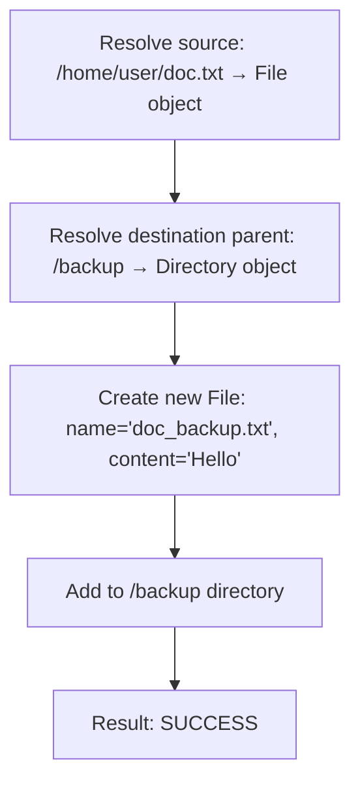
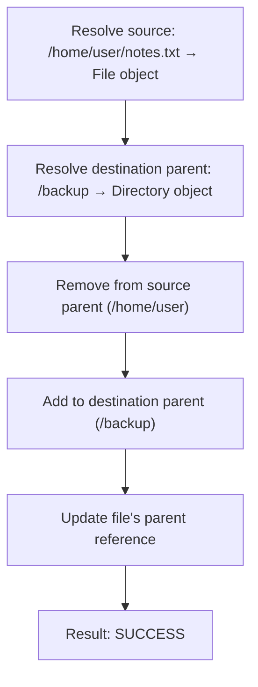
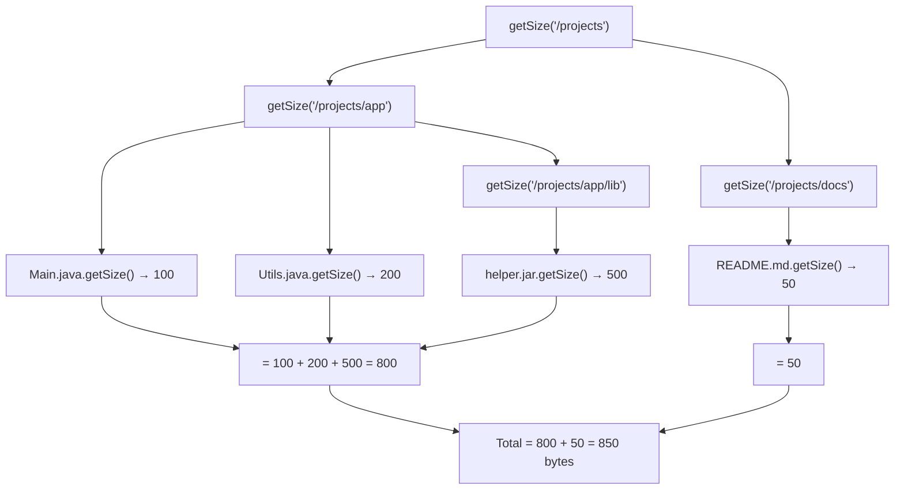
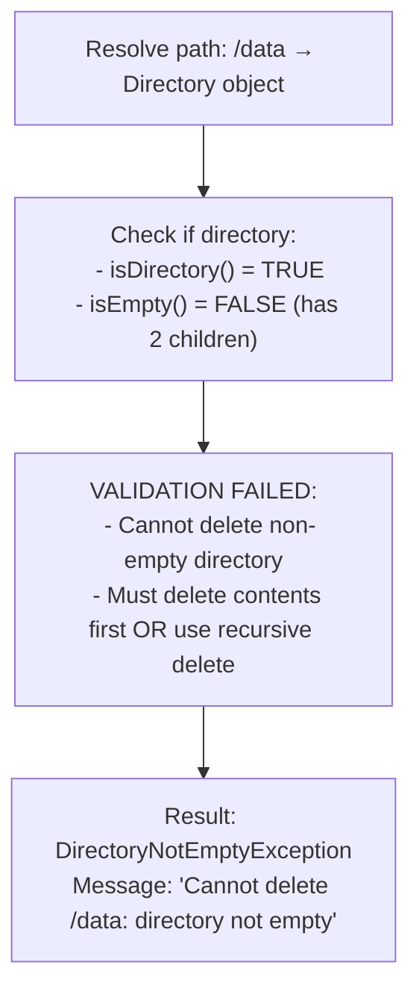

# 📁 File System - Simulation & Testing

## STEP 5: Simulation / Dry Run

### Scenario 1: Basic File System Operations

```
Initial State: Root directory "/"

mkdir("/home"):
  Created: /home/

mkdir("/home/user"):
  Created: /home/user/

createFile("/home/user/doc.txt", "Hello"):
  Created: /home/user/doc.txt (5 bytes)

ls("/home"):
  Returns: [user/]

getSize("/home"):
  Returns: 5 (recursive sum)
```

---

### Scenario 2: Copy and Move Operations

```
Initial State:
/
├── home/
│   └── user/
│       ├── doc.txt (content: "Hello", 5 bytes)
│       └── notes.txt (content: "Notes here", 10 bytes)
└── backup/

Step 1: copy("/home/user/doc.txt", "/backup/doc_backup.txt")



<details>
<summary>ASCII diagram (reference)</summary>

```text
┌───────────────────────────────────────────────────────────────┐
│ Resolve source: /home/user/doc.txt → File object             │
│ Resolve destination parent: /backup → Directory object        │
│ Create new File: name="doc_backup.txt", content="Hello"      │
│ Add to /backup directory                                       │
│ Result: SUCCESS                                                │
└───────────────────────────────────────────────────────────────┘
```

</details>

File System State:
/
├── home/
│   └── user/
│       ├── doc.txt (5 bytes) ← Original preserved
│       └── notes.txt (10 bytes)
└── backup/
    └── doc_backup.txt (5 bytes) ← Copy created

Step 2: move("/home/user/notes.txt", "/backup/notes.txt")



<details>
<summary>ASCII diagram (reference)</summary>

```text
┌───────────────────────────────────────────────────────────────┐
│ Resolve source: /home/user/notes.txt → File object           │
│ Resolve destination parent: /backup → Directory object        │
│ Remove from source parent (/home/user)                        │
│ Add to destination parent (/backup)                           │
│ Update file's parent reference                                 │
│ Result: SUCCESS                                                │
└───────────────────────────────────────────────────────────────┘
```

</details>

Final State:
/
├── home/
│   └── user/
│       └── doc.txt (5 bytes)
└── backup/
    ├── doc_backup.txt (5 bytes)
    └── notes.txt (10 bytes) ← Moved here

getSize("/backup"): 15 bytes
getSize("/home/user"): 5 bytes
```

---

### Scenario 3: Recursive Directory Size Calculation

```
File System Structure:
/
└── projects/
    ├── app/
    │   ├── Main.java (100 bytes)
    │   ├── Utils.java (200 bytes)
    │   └── lib/
    │       └── helper.jar (500 bytes)
    └── docs/
        └── README.md (50 bytes)

getSize("/projects") Execution Trace:



<details>
<summary>ASCII diagram (reference)</summary>

```text
┌───────────────────────────────────────────────────────────────┐
│ getSize("/projects")                                          │
│   │                                                           │
│   ├── getSize("/projects/app")                               │
│   │     ├── Main.java.getSize() → 100                        │
│   │     ├── Utils.java.getSize() → 200                       │
│   │     └── getSize("/projects/app/lib")                     │
│   │           └── helper.jar.getSize() → 500                 │
│   │     = 100 + 200 + 500 = 800                              │
│   │                                                           │
│   └── getSize("/projects/docs")                              │
│         └── README.md.getSize() → 50                         │
│         = 50                                                  │
│                                                               │
│   Total = 800 + 50 = 850 bytes                               │
└───────────────────────────────────────────────────────────────┘
```

</details>

Result: 850 bytes
```

---

### Scenario 4: Delete Non-Empty Directory (Failure Scenario)

```
Initial State:
/
└── data/
    ├── file1.txt
    └── subdir/
        └── file2.txt

Step 1: delete("/data") - Attempt to delete non-empty directory



<details>
<summary>ASCII diagram (reference)</summary>

```text
┌───────────────────────────────────────────────────────────────┐
│ Resolve path: /data → Directory object                        │
│ Check if directory:                                            │
│   - isDirectory() = TRUE                                      │
│   - isEmpty() = FALSE (has 2 children)                       │
│                                                               │
│ VALIDATION FAILED:                                            │
│   - Cannot delete non-empty directory                         │
│   - Must delete contents first OR use recursive delete        │
│                                                               │
│ Result: DirectoryNotEmptyException                            │
│ Message: "Cannot delete /data: directory not empty"          │
└───────────────────────────────────────────────────────────────┘
```

</details>

Correct approach: deleteRecursive("/data")
┌───────────────────────────────────────────────────────────────┐
│ Step 1: Recursively delete children                           │
│   - delete("/data/subdir/file2.txt") → SUCCESS               │
│   - delete("/data/subdir") → SUCCESS (now empty)             │
│   - delete("/data/file1.txt") → SUCCESS                      │
│                                                               │
│ Step 2: Delete now-empty directory                            │
│   - delete("/data") → SUCCESS                                │
│                                                               │
│ Result: SUCCESS                                                │
└───────────────────────────────────────────────────────────────┘
```

---

### Scenario 5: Circular Move Prevention (Edge Case)

```
Initial State:
/
└── a/
    └── b/
        └── c/

Attempt: move("/a", "/a/b/c/a") - Moving parent into its own child
┌───────────────────────────────────────────────────────────────┐
│ Source: /a                                                     │
│ Destination: /a/b/c/a                                         │
│                                                               │
│ VALIDATION:                                                    │
│   Check if destination is descendant of source:               │
│   - /a/b/c is descendant of /a → TRUE                        │
│                                                               │
│ REJECTED:                                                      │
│   - Would create circular reference                           │
│   - Directory cannot contain itself                           │
│                                                               │
│ Result: IllegalArgumentException                              │
│ Message: "Cannot move directory into its own subdirectory"   │
└───────────────────────────────────────────────────────────────┘
```

---

### Scenario 6: Concurrent Access Race Condition

```
Initial State:
/
└── shared/
    └── counter.txt (content: "0", 1 byte)

Thread A: Read and increment counter
Thread B: Read and increment counter (concurrent)

WITHOUT SYNCHRONIZATION (PROBLEM):
┌───────────────────────────────────────────────────────────────┐
│ Thread A                          Thread B                    │
│ ──────────────────────────────   ─────────────────────────── │
│ Read counter.txt → "0"                                         │
│                                  Read counter.txt → "0"        │
│ Calculate: 0 + 1 = 1                                          │
│                                  Calculate: 0 + 1 = 1         │
│ Write "1" to counter.txt                                      │
│                                  Write "1" to counter.txt    │
│                                                               │
│ RESULT: Lost update! Both threads read 0, both write 1.      │
│ Expected: counter = 2, Actual: counter = 1                   │
└───────────────────────────────────────────────────────────────┘

WITH SYNCHRONIZATION (SOLUTION):
┌───────────────────────────────────────────────────────────────┐
│ Thread A                          Thread B                    │
│ ──────────────────────────────   ─────────────────────────── │
│ Acquire write lock                                          │
│ Read counter.txt → "0"                                        │
│ Calculate: 0 + 1 = 1                                         │
│ Write "1" to counter.txt                                     │
│ Release write lock                                            │
│                                  Acquire write lock           │
│                                  Read counter.txt → "1"        │
│                                  Calculate: 1 + 1 = 2         │
│                                  Write "2" to counter.txt      │
│                                  Release write lock            │
│                                                               │
│ RESULT: Correct! Thread A writes 1, Thread B reads 1 and    │
│ writes 2. Final value: counter = 2                           │
└───────────────────────────────────────────────────────────────┘

PREVENTION STRATEGY:
- Use ReadWriteLock for file operations
- Read operations acquire read lock (concurrent allowed)
- Write operations acquire write lock (exclusive)
- Directory modifications require write lock
```

---

## STEP 6: Edge Cases & Testing Strategy

### Boundary Conditions

- **Delete Non-Empty Directory**: Should fail or recursive delete
- **Create File in Non-Existent Path**: Should fail
- **Move to Same Location**: No-op
- **Circular Move**: Prevent moving parent into child

---

## Testing Approach

### Unit Tests

```java
// FileTest.java
public class FileTest {

    @Test
    void testReadWrite() {
        Directory parent = new Directory("test", null);
        File file = new File("test.txt", parent);

        file.write("Hello World".getBytes());

        assertEquals("Hello World", new String(file.read()));
        assertEquals(11, file.getSize());
    }

    @Test
    void testExtensionExtraction() {
        Directory parent = new Directory("test", null);

        assertEquals("txt", new File("file.txt", parent).getExtension());
        assertEquals("pdf", new File("report.pdf", parent).getExtension());
        assertEquals("", new File("noextension", parent).getExtension());
        assertEquals("gz", new File("archive.tar.gz", parent).getExtension());
    }

    @Test
    void testPermissions() {
        Directory parent = new Directory("test", null);
        File file = new File("readonly.txt", parent);
        file.setPermissions(Permissions.readOnly());

        assertDoesNotThrow(() -> file.read());
        assertThrows(SecurityException.class, () -> file.write("data".getBytes()));
    }
}
```

```java
// DirectoryTest.java
public class DirectoryTest {

    @Test
    void testAddChild() {
        Directory parent = new Directory("parent", null);
        File child = new File("child.txt", null);

        parent.addChild(child);

        assertEquals(1, parent.getChildCount());
        assertEquals(parent, child.getParent());
        assertSame(child, parent.getChild("child.txt"));
    }

    @Test
    void testDuplicateChildRejected() {
        Directory parent = new Directory("parent", null);
        parent.addChild(new File("file.txt", null));

        assertThrows(IllegalArgumentException.class, () ->
            parent.addChild(new File("file.txt", null)));
    }

    @Test
    void testRecursiveSize() {
        Directory root = new Directory("root", null);
        Directory sub = new Directory("sub", root);
        root.addChild(sub);

        File file1 = new File("f1.txt", root);
        file1.write(new byte[100]);
        root.addChild(file1);

        File file2 = new File("f2.txt", sub);
        file2.write(new byte[50]);
        sub.addChild(file2);

        assertEquals(50, sub.getSize());
        assertEquals(150, root.getSize());
    }
}
```

```java
// FileSystemTest.java
public class FileSystemTest {

    private FileSystem fs;

    @BeforeEach
    void setUp() {
        fs = new FileSystem();
    }

    @Test
    void testMkdirCreatesPath() {
        fs.mkdir("/a/b/c");

        assertNotNull(fs.resolvePath("/a"));
        assertNotNull(fs.resolvePath("/a/b"));
        assertNotNull(fs.resolvePath("/a/b/c"));
    }

    @Test
    void testCdAndPwd() {
        fs.mkdir("/home/user");

        assertEquals("/", fs.pwd());

        fs.cd("/home/user");
        assertEquals("/home/user", fs.pwd());

        fs.cd("..");
        assertEquals("/home", fs.pwd());
    }

    @Test
    void testMoveFile() {
        fs.mkdir("/src");
        fs.mkdir("/dest");
        fs.createFile("/src/file.txt", "content");

        assertTrue(fs.mv("/src/file.txt", "/dest/file.txt"));

        assertNull(fs.resolvePath("/src/file.txt"));
        assertNotNull(fs.resolvePath("/dest/file.txt"));
    }

    @Test
    void testCopyFile() {
        fs.createFile("/original.txt", "content");

        assertTrue(fs.cp("/original.txt", "/copy.txt"));

        File original = (File) fs.resolvePath("/original.txt");
        File copy = (File) fs.resolvePath("/copy.txt");

        assertNotNull(original);
        assertNotNull(copy);
        assertEquals(original.readAsString(), copy.readAsString());
        assertNotSame(original, copy);
    }

    @Test
    void testFindByExtension() {
        fs.createFile("/a.txt", "");
        fs.createFile("/b.txt", "");
        fs.createFile("/c.pdf", "");
        fs.mkdir("/sub");
        fs.createFile("/sub/d.txt", "");

        List<File> txtFiles = fs.findByExtension("txt");

        assertEquals(3, txtFiles.size());
    }
}
```

### mkdir("/a/b/c/d")

```
Time: O(d) where d = depth
  - Split path: O(d)
  - For each part:
    - getChild(): O(1) HashMap lookup
    - addChild(): O(1) HashMap put

Space: O(d)
  - Path parts array: O(d)
  - New directories: O(d)
```

### find(criteria)

```
Time: O(n) where n = total entries
  - Visit every entry once
  - Predicate test: O(1) per entry

Space: O(h + m)
  - h = max tree height (recursion stack)
  - m = matching entries (results list)
```

### getSize() on directory

```
Time: O(n) where n = entries in subtree
  - Visit every descendant once
  - Sum sizes

Space: O(h)
  - h = max tree height (recursion stack)
```

---

**Note:** Interview follow-ups have been moved to `02-design-explanation.md`, STEP 8.
