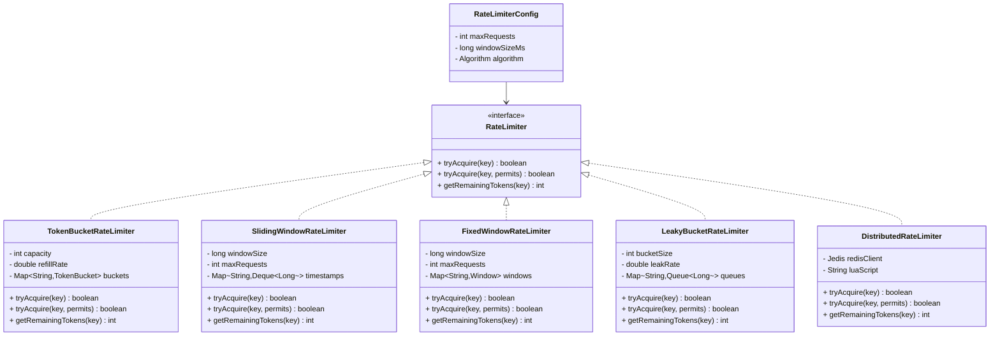

# 🚦 Rate Limiter - Problem Solution

## STEP 0: REQUIREMENTS QUICKPASS

### Core Functional Requirements

- Limit the number of requests per time window
- Support multiple algorithms (Token Bucket, Sliding Window, Fixed Window, Leaky Bucket)
- Be thread-safe for concurrent access
- Allow different limits per user/API/endpoint
- Return remaining quota information

### Explicit Out-of-Scope Items

- Distributed rate limiting (Redis-based)
- Persistent storage of rate limit state
- Dynamic rate limit configuration changes
- Rate limit bypass for whitelisted users
- Detailed analytics and reporting

### Assumptions and Constraints

- **In-Memory Only**: State stored in JVM
- **Single Instance**: Not distributed
- **Time Source**: System.currentTimeMillis()
- **Key-Based**: Each key (user/API) has independent limit

### Concurrency Model

- **Thread-Safe**: All operations are synchronized
- **AtomicLong**: For token counts
- **ConcurrentHashMap**: For per-key state

### Public APIs

- `tryAcquire(key)`: Attempt to acquire 1 permit
- `tryAcquire(key, permits)`: Attempt to acquire N permits
- `getRemainingTokens(key)`: Get remaining quota
- `getWaitTime(key)`: Time until next permit available

### Public API Usage Examples

```java
// Example 1: Basic usage
RateLimiter limiter = new TokenBucketRateLimiter(10, 5);
boolean allowed = limiter.tryAcquire("user1");
if (allowed) {
    System.out.println("Request allowed. Remaining: " + limiter.getRemainingTokens("user1"));
} else {
    System.out.println("Request rate limited");
}

// Example 2: Typical workflow
RateLimiter apiLimiter = RateLimiterFactory.tokenBucket(100);
for (Request request : requests) {
    String clientId = request.getClientId();
    if (apiLimiter.tryAcquire(clientId)) {
        processRequest(request);
    } else {
        return new Response(429, "Rate limit exceeded");
    }
}

// Example 3: Batch permit acquisition
RateLimiter limiter = new SlidingWindowCounterRateLimiter(100, 60000);
boolean allowed = limiter.tryAcquire("api-key-123", 5);
if (allowed) {
    System.out.println("Batch of 5 requests allowed");
    int remaining = limiter.getRemainingTokens("api-key-123");
    System.out.println("Remaining tokens: " + remaining);
}

// Example 4: Different algorithms for different use cases
RateLimiter strictLimiter = new SlidingWindowLogRateLimiter(10, 1000);
RateLimiter burstLimiter = new TokenBucketRateLimiter(100, 50);

// Strict rate limiting for payment API
if (!strictLimiter.tryAcquire("payment-user-1")) {
    throw new RateLimitException("Payment rate limit exceeded");
}

// Allow bursts for data export API
if (!burstLimiter.tryAcquire("export-user-1", 20)) {
    return "Export rate limited, please try again later";
}
```

### Invariants

- **Non-Negative Tokens**: Token count never negative
- **Rate Enforcement**: Never exceed configured rate
- **Time Monotonicity**: Time always moves forward

---

## STEP 1: Complete Reference Solution (Answer Key)

### Class Diagram Overview



<details>
<summary>ASCII diagram (reference)</summary>

```text
┌─────────────────────────────────────────────────────────────────────────────────┐
│                              RATE LIMITER                                        │
├─────────────────────────────────────────────────────────────────────────────────┤
│                                                                                  │
│  ┌──────────────────────────────────────────────────────────────────────────┐   │
│  │                      RateLimiter (interface)                              │   │
│  │                                                                           │   │
│  │  + tryAcquire(key: String): boolean                                      │   │
│  │  + tryAcquire(key: String, permits: int): boolean                        │   │
│  │  + getRemainingTokens(key: String): int                                  │   │
│  └──────────────────────────────────────────────────────────────────────────┘   │
│                          △                                                       │
│           ┌──────────────┼──────────────┬────────────────┐                      │
│           │              │              │                │                      │
│  ┌────────┴────────┐ ┌───┴────────┐ ┌───┴──────────┐ ┌───┴──────────┐          │
│  │  TokenBucket    │ │SlidingWindow│ │ FixedWindow  │ │ LeakyBucket  │          │
│  │  RateLimiter    │ │RateLimiter  │ │ RateLimiter  │ │ RateLimiter  │          │
│  │                 │ │             │ │              │ │              │          │
│  │  - capacity     │ │- windowSize │ │- windowSize  │ │- bucketSize  │          │
│  │  - refillRate   │ │- maxRequests│ │- maxRequests │ │- leakRate    │          │
│  │  - tokens       │ │- timestamps │ │- counters    │ │- queue       │          │
│  └─────────────────┘ └─────────────┘ └──────────────┘ └──────────────┘          │
│                                                                                  │
│  ┌──────────────────────────────────────────────────────────────────────────┐   │
│  │                      RateLimiterConfig                                    │   │
│  │                                                                           │   │
│  │  - maxRequests: int                                                       │   │
│  │  - windowSizeMs: long                                                     │   │
│  │  - algorithm: Algorithm                                                   │   │
│  └──────────────────────────────────────────────────────────────────────────┘   │
│                                                                                  │
│  ┌──────────────────────────────────────────────────────────────────────────┐   │
│  │                    DistributedRateLimiter                                 │   │
│  │                                                                           │   │
│  │  - redisClient: Jedis                                                     │   │
│  │  - luaScript: String                                                      │   │
│  └──────────────────────────────────────────────────────────────────────────┘   │
│                                                                                  │
└─────────────────────────────────────────────────────────────────────────────────┘
```

</details>

### Algorithm Comparison

```
TOKEN BUCKET:
┌─────────────────────────────────────────────────────────────────┐
│  Bucket: [●][●][●][●][●][ ][ ][ ][ ][ ]                        │
│          ▲                                                      │
│          │ Tokens refill at constant rate                       │
│          │                                                      │
│  Request arrives → Take token → Process                         │
│  No tokens? → REJECT                                            │
│                                                                 │
│  PROS: Allows bursts up to bucket size                         │
│  CONS: Burst can overwhelm downstream                          │
└─────────────────────────────────────────────────────────────────┘

SLIDING WINDOW LOG:
┌─────────────────────────────────────────────────────────────────┐
│  Time: ─────────────────────────────────────────────────────►   │
│        │         Window (1 min)          │                      │
│        ◄─────────────────────────────────►                      │
│        │  ●  ●    ●  ●  ●    ●  ●       │                      │
│        │  Timestamps of past requests    │                      │
│                                                                 │
│  Count requests in window → Compare to limit                    │
│                                                                 │
│  PROS: Very accurate, smooth rate                               │
│  CONS: Memory for storing timestamps                            │
└─────────────────────────────────────────────────────────────────┘

FIXED WINDOW:
┌─────────────────────────────────────────────────────────────────┐
│  Time: ─────────────────────────────────────────────────────►   │
│        │ Window 1 │ Window 2 │ Window 3 │                       │
│        │  ●●●●●   │  ●●●     │  ●●●●    │                       │
│        │  count=5 │  count=3 │  count=4 │                       │
│                                                                 │
│  Reset counter at window boundary                               │
│                                                                 │
│  PROS: Simple, memory efficient                                 │
│  CONS: Boundary problem (2x burst at edges)                     │
└─────────────────────────────────────────────────────────────────┘

SLIDING WINDOW COUNTER:
┌─────────────────────────────────────────────────────────────────┐
│  Combines Fixed Window + Sliding Window                         │
│                                                                 │
│  │ Prev Window │ Current Window │                               │
│  │  count=5    │   count=3      │                               │
│  │             │←─ 40% ─→│                                      │
│                                                                 │
│  Weighted count = 5 * 0.6 + 3 = 6                              │
│                                                                 │
│  PROS: Accurate + memory efficient                              │
│  CONS: Slightly more complex                                    │
└─────────────────────────────────────────────────────────────────┘
```

---

### Responsibilities Table

| Class                             | Owns                                            | Why                                                                                                              |
| --------------------------------- | ----------------------------------------------- | ---------------------------------------------------------------------------------------------------------------- |
| `RateLimiter` (interface)         | Rate limiting contract definition               | Defines common interface for all algorithms - enables polymorphism and algorithm interchangeability              |
| `TokenBucketRateLimiter`          | Token bucket algorithm implementation           | Implements token bucket logic - separate class enables algorithm-specific optimizations without affecting others |
| `SlidingWindowLogRateLimiter`     | Sliding window log algorithm implementation     | Implements sliding window log logic - separate class for memory-efficient timestamp tracking algorithm           |
| `SlidingWindowCounterRateLimiter` | Sliding window counter algorithm implementation | Implements sliding window counter logic - separate class for memory-efficient counter-based algorithm            |
| `FixedWindowRateLimiter`          | Fixed window algorithm implementation           | Implements fixed window logic - separate class for simple time-windowed algorithm                                |
| `LeakyBucketRateLimiter`          | Leaky bucket algorithm implementation           | Implements leaky bucket logic - separate class for constant-rate output algorithm                                |
| `DistributedRateLimiter`          | Distributed rate limiting using Redis           | Handles distributed rate limiting - separates distributed coordination from algorithm logic                      |
| `RateLimiterConfig`               | Rate limiter configuration parameters           | Encapsulates configuration - separates configuration from algorithm implementation, enables reusable config      |
| `RateLimiterFactory`              | Rate limiter creation and selection             | Creates rate limiter instances - separates object creation from usage, enables algorithm selection logic         |

---

## STEP 4: Code Walkthrough - Building From Scratch

This section explains how an engineer builds this system from scratch, in the order code should be written.

### Phase 1: Understand the Problem

**What is Rate Limiting?**

- Control how many requests a client can make
- Protect systems from overload
- Ensure fair resource usage

**Key Questions:**

- How many requests per time period?
- What happens when limit is exceeded?
- How to identify clients (IP, API key, user ID)?

---

### Phase 2: Token Bucket Algorithm

```java
// Step 1: Define the bucket state
private static class Bucket {
    private double tokens;       // Current token count
    private long lastRefillTime; // When we last added tokens
}
```

**Why double for tokens?**

- Refill rate might not be integer
- Example: 1.5 tokens per second
- Allows fractional tokens to accumulate

```java
// Step 2: Refill logic
private void refill(double refillRatePerMs, int capacity) {
    long now = System.currentTimeMillis();
    long elapsed = now - lastRefillTime;

    if (elapsed > 0) {
        // Calculate tokens to add
        double tokensToAdd = elapsed * refillRatePerMs;

        // Don't exceed capacity
        tokens = Math.min(capacity, tokens + tokensToAdd);

        lastRefillTime = now;
    }
}
```

```java
// Step 3: Consume tokens
synchronized boolean tryConsume(int permits, double refillRatePerMs, int capacity) {
    // First, add any tokens that should have accumulated
    refill(refillRatePerMs, capacity);

    // Check if we have enough tokens
    if (tokens >= permits) {
        tokens -= permits;
        return true;
    }
    return false;
}
```

---

### Phase 3: Fixed Window Algorithm

```java
// Step 4: Window state
private static class Window {
    final long windowId;        // Which window this is
    final AtomicInteger count;  // Requests in this window
}
```

```java
// Step 5: Try acquire with window transition
public boolean tryAcquire(String key, int permits) {
    long now = System.currentTimeMillis();
    long currentWindow = now / windowSizeMs;

    // Get or create window, reset if new window
    Window window = windows.compute(key, (k, existing) -> {
        if (existing == null || existing.windowId != currentWindow) {
            return new Window(currentWindow);  // New window
        }
        return existing;  // Same window
    });

    return window.tryIncrement(permits, maxRequests);
}
```

---

### Phase 4: Sliding Window Counter

```java
// Step 6: Track two windows
private static class WindowPair {
    long currentWindowId;
    AtomicInteger currentCount;
    int previousCount;  // Snapshot of previous window
}
```

```java
// Step 7: Window transition
synchronized void updateWindow(long newWindowId) {
    if (newWindowId > currentWindowId) {
        if (newWindowId == currentWindowId + 1) {
            // Consecutive window: save current as previous
            previousCount = currentCount.get();
        } else {
            // Skipped windows: previous is 0
            previousCount = 0;
        }
        currentWindowId = newWindowId;
        currentCount.set(0);
    }
}
```

```java
// Step 8: Weighted calculation
synchronized boolean tryAcquire(int permits, int max, long windowPosition, long windowSize) {
    // How far into current window (0.0 to 1.0)
    double positionRatio = (double) windowPosition / windowSize;

    // Weight for previous window (decreases as we move into current)
    double previousWeight = 1.0 - positionRatio;

    // Weighted count
    double weightedCount = previousCount * previousWeight + currentCount.get();

    if (weightedCount + permits <= max) {
        currentCount.addAndGet(permits);
        return true;
    }
    return false;
}
```

---

### Phase 5: Sliding Window Log

```java
// Step 9: Store timestamps
private final Map<String, Deque<Long>> requestLogs;

public boolean tryAcquire(String key, int permits) {
    long now = System.currentTimeMillis();
    long windowStart = now - windowSizeMs;

    Deque<Long> timestamps = requestLogs.computeIfAbsent(
        key, k -> new LinkedList<>());

    synchronized (timestamps) {
        // Remove expired timestamps
        while (!timestamps.isEmpty() && timestamps.peekFirst() < windowStart) {
            timestamps.pollFirst();
        }

        // Check limit
        if (timestamps.size() + permits <= maxRequests) {
            for (int i = 0; i < permits; i++) {
                timestamps.addLast(now);
            }
            return true;
        }
    }

    return false;
}
```

---

### Phase 6: Threading Model and Concurrency Control

**Threading Model:**

This system handles **high-frequency concurrent requests**:

- Multiple threads accessing rate limiters simultaneously
- Per-key synchronization ensures thread safety
- Atomic operations prevent race conditions

**Concurrency Control:**

```java
// Option A: Synchronized on bucket
synchronized boolean tryConsume(...) {
    // Only one thread per bucket
}

// Option B: ConcurrentHashMap + AtomicInteger
private final Map<String, Window> windows = new ConcurrentHashMap<>();

boolean tryIncrement(int permits, int max) {
    while (true) {
        int current = count.get();
        if (current + permits > max) {
            return false;
        }
        if (count.compareAndSet(current, current + permits)) {
            return true;
        }
        // Retry if CAS failed
    }
}
```

**CAS (Compare-And-Swap) explained:**

```
Thread A and B both try to increment count from 3 to 4:

Thread A: current = count.get() = 3
Thread B: current = count.get() = 3

Thread A: compareAndSet(3, 4) → SUCCESS, count = 4
Thread B: compareAndSet(3, 4) → FAIL (count is now 4, not 3)
Thread B: retry loop
Thread B: current = count.get() = 4
Thread B: compareAndSet(4, 5) → SUCCESS, count = 5

Result: Both increments happened correctly!
```

---

## STEP 2: Complete Java Implementation

> **Verified:** This code compiles successfully with Java 11+.

### 2.1 RateLimiter Interface

```java
// RateLimiter.java
package com.ratelimiter;

/**
 * Interface for rate limiting implementations.
 *
 * A rate limiter controls the rate of requests to protect
 * systems from being overwhelmed.
 */
public interface RateLimiter {

    /**
     * Tries to acquire a single permit.
     *
     * @param key Identifier for the rate limit (e.g., userId, IP, API key)
     * @return true if request is allowed, false if rate limited
     */
    boolean tryAcquire(String key);

    /**
     * Tries to acquire multiple permits.
     *
     * @param key Identifier for the rate limit
     * @param permits Number of permits to acquire
     * @return true if all permits acquired, false otherwise
     */
    boolean tryAcquire(String key, int permits);

    /**
     * Gets the number of remaining permits for a key.
     *
     * @param key Identifier for the rate limit
     * @return Number of remaining permits
     */
    int getRemainingTokens(String key);
}
```

### 2.2 Rate Limiter Configuration

```java
// RateLimiterConfig.java
package com.ratelimiter;

/**
 * Configuration for rate limiters.
 */
public class RateLimiterConfig {

    private final int maxRequests;
    private final long windowSizeMs;
    private final int bucketCapacity;
    private final double refillRatePerSecond;

    private RateLimiterConfig(Builder builder) {
        this.maxRequests = builder.maxRequests;
        this.windowSizeMs = builder.windowSizeMs;
        this.bucketCapacity = builder.bucketCapacity;
        this.refillRatePerSecond = builder.refillRatePerSecond;
    }

    public static Builder builder() {
        return new Builder();
    }

    // Preset configurations
    public static RateLimiterConfig perSecond(int requests) {
        return builder()
            .maxRequests(requests)
            .windowSizeMs(1000)
            .build();
    }

    public static RateLimiterConfig perMinute(int requests) {
        return builder()
            .maxRequests(requests)
            .windowSizeMs(60_000)
            .build();
    }

    public static RateLimiterConfig perHour(int requests) {
        return builder()
            .maxRequests(requests)
            .windowSizeMs(3_600_000)
            .build();
    }

    // Getters
    public int getMaxRequests() { return maxRequests; }
    public long getWindowSizeMs() { return windowSizeMs; }
    public int getBucketCapacity() { return bucketCapacity; }
    public double getRefillRatePerSecond() { return refillRatePerSecond; }

    public static class Builder {
        private int maxRequests = 100;
        private long windowSizeMs = 1000;
        private int bucketCapacity = 100;
        private double refillRatePerSecond = 10;

        public Builder maxRequests(int maxRequests) {
            this.maxRequests = maxRequests;
            return this;
        }

        public Builder windowSizeMs(long windowSizeMs) {
            this.windowSizeMs = windowSizeMs;
            return this;
        }

        public Builder bucketCapacity(int bucketCapacity) {
            this.bucketCapacity = bucketCapacity;
            return this;
        }

        public Builder refillRatePerSecond(double refillRatePerSecond) {
            this.refillRatePerSecond = refillRatePerSecond;
            return this;
        }

        public RateLimiterConfig build() {
            return new RateLimiterConfig(this);
        }
    }
}
```

### 2.3 Token Bucket Implementation

```java
// TokenBucketRateLimiter.java
package com.ratelimiter;

import java.util.Map;
import java.util.concurrent.ConcurrentHashMap;

/**
 * Token Bucket Rate Limiter.
 *
 * ALGORITHM:
 * - Bucket holds tokens up to capacity
 * - Tokens are added at a constant refill rate
 * - Each request consumes tokens
 * - If not enough tokens, request is rejected
 *
 * CHARACTERISTICS:
 * - Allows bursts up to bucket capacity
 * - Smooth long-term rate
 * - Memory efficient (one bucket per key)
 */
public class TokenBucketRateLimiter implements RateLimiter {

    private final int capacity;
    private final double refillRatePerMs;
    private final Map<String, Bucket> buckets;

    public TokenBucketRateLimiter(RateLimiterConfig config) {
        this.capacity = config.getBucketCapacity();
        this.refillRatePerMs = config.getRefillRatePerSecond() / 1000.0;
        this.buckets = new ConcurrentHashMap<>();
    }

    /**
     * Creates a token bucket rate limiter.
     *
     * @param capacity Maximum tokens in bucket
     * @param refillRatePerSecond Tokens added per second
     */
    public TokenBucketRateLimiter(int capacity, double refillRatePerSecond) {
        this.capacity = capacity;
        this.refillRatePerMs = refillRatePerSecond / 1000.0;
        this.buckets = new ConcurrentHashMap<>();
    }

    @Override
    public boolean tryAcquire(String key) {
        return tryAcquire(key, 1);
    }

    @Override
    public boolean tryAcquire(String key, int permits) {
        Bucket bucket = buckets.computeIfAbsent(key, k -> new Bucket(capacity));
        return bucket.tryConsume(permits, refillRatePerMs, capacity);
    }

    @Override
    public int getRemainingTokens(String key) {
        Bucket bucket = buckets.get(key);
        if (bucket == null) {
            return capacity;
        }
        return bucket.getAvailableTokens(refillRatePerMs, capacity);
    }

    /**
     * Internal bucket class.
     * Thread-safe through synchronization.
     */
    private static class Bucket {
        private double tokens;
        private long lastRefillTime;

        Bucket(int capacity) {
            this.tokens = capacity;
            this.lastRefillTime = System.currentTimeMillis();
        }

        synchronized boolean tryConsume(int permits, double refillRatePerMs, int capacity) {
            refill(refillRatePerMs, capacity);

            if (tokens >= permits) {
                tokens -= permits;
                return true;
            }
            return false;
        }

        synchronized int getAvailableTokens(double refillRatePerMs, int capacity) {
            refill(refillRatePerMs, capacity);
            return (int) tokens;
        }

        private void refill(double refillRatePerMs, int capacity) {
            long now = System.currentTimeMillis();
            long elapsed = now - lastRefillTime;

            if (elapsed > 0) {
                double tokensToAdd = elapsed * refillRatePerMs;
                tokens = Math.min(capacity, tokens + tokensToAdd);
                lastRefillTime = now;
            }
        }
    }
}
```

### 2.4 Sliding Window Log Implementation

```java
// SlidingWindowLogRateLimiter.java
package com.ratelimiter;

import java.util.*;
import java.util.concurrent.ConcurrentHashMap;

/**
 * Sliding Window Log Rate Limiter.
 *
 * ALGORITHM:
 * - Store timestamp of each request
 * - Count requests within the sliding window
 * - Remove expired timestamps
 *
 * CHARACTERISTICS:
 * - Most accurate rate limiting
 * - Higher memory usage (stores all timestamps)
 * - Best for low-volume, high-accuracy scenarios
 */
public class SlidingWindowLogRateLimiter implements RateLimiter {

    private final int maxRequests;
    private final long windowSizeMs;
    private final Map<String, Deque<Long>> requestLogs;

    public SlidingWindowLogRateLimiter(RateLimiterConfig config) {
        this.maxRequests = config.getMaxRequests();
        this.windowSizeMs = config.getWindowSizeMs();
        this.requestLogs = new ConcurrentHashMap<>();
    }

    public SlidingWindowLogRateLimiter(int maxRequests, long windowSizeMs) {
        this.maxRequests = maxRequests;
        this.windowSizeMs = windowSizeMs;
        this.requestLogs = new ConcurrentHashMap<>();
    }

    @Override
    public boolean tryAcquire(String key) {
        return tryAcquire(key, 1);
    }

    @Override
    public synchronized boolean tryAcquire(String key, int permits) {
        long now = System.currentTimeMillis();
        long windowStart = now - windowSizeMs;

        Deque<Long> timestamps = requestLogs.computeIfAbsent(key, k -> new LinkedList<>());

        // Remove expired timestamps
        synchronized (timestamps) {
            while (!timestamps.isEmpty() && timestamps.peekFirst() < windowStart) {
                timestamps.pollFirst();
            }

            // Check if we can accept the request
            if (timestamps.size() + permits <= maxRequests) {
                // Add timestamps for each permit
                for (int i = 0; i < permits; i++) {
                    timestamps.addLast(now);
                }
                return true;
            }
        }

        return false;
    }

    @Override
    public int getRemainingTokens(String key) {
        long now = System.currentTimeMillis();
        long windowStart = now - windowSizeMs;

        Deque<Long> timestamps = requestLogs.get(key);
        if (timestamps == null) {
            return maxRequests;
        }

        synchronized (timestamps) {
            // Count valid timestamps
            int count = 0;
            for (Long ts : timestamps) {
                if (ts >= windowStart) {
                    count++;
                }
            }
            return Math.max(0, maxRequests - count);
        }
    }

    /**
     * Cleans up expired entries to prevent memory leaks.
     */
    public void cleanup() {
        long now = System.currentTimeMillis();
        long windowStart = now - windowSizeMs;

        requestLogs.forEach((key, timestamps) -> {
            synchronized (timestamps) {
                while (!timestamps.isEmpty() && timestamps.peekFirst() < windowStart) {
                    timestamps.pollFirst();
                }
            }
        });

        // Remove empty entries
        requestLogs.entrySet().removeIf(entry -> entry.getValue().isEmpty());
    }
}
```

### 2.5 Fixed Window Implementation

```java
// FixedWindowRateLimiter.java
package com.ratelimiter;

import java.util.Map;
import java.util.concurrent.ConcurrentHashMap;
import java.util.concurrent.atomic.AtomicInteger;

/**
 * Fixed Window Rate Limiter.
 *
 * ALGORITHM:
 * - Divide time into fixed windows
 * - Count requests per window
 * - Reset counter at window boundary
 *
 * CHARACTERISTICS:
 * - Simple and memory efficient
 * - Has boundary problem (can allow 2x burst at window edges)
 * - Good for approximate rate limiting
 */
public class FixedWindowRateLimiter implements RateLimiter {

    private final int maxRequests;
    private final long windowSizeMs;
    private final Map<String, Window> windows;

    public FixedWindowRateLimiter(RateLimiterConfig config) {
        this.maxRequests = config.getMaxRequests();
        this.windowSizeMs = config.getWindowSizeMs();
        this.windows = new ConcurrentHashMap<>();
    }

    public FixedWindowRateLimiter(int maxRequests, long windowSizeMs) {
        this.maxRequests = maxRequests;
        this.windowSizeMs = windowSizeMs;
        this.windows = new ConcurrentHashMap<>();
    }

    @Override
    public boolean tryAcquire(String key) {
        return tryAcquire(key, 1);
    }

    @Override
    public boolean tryAcquire(String key, int permits) {
        long now = System.currentTimeMillis();
        long currentWindow = now / windowSizeMs;

        Window window = windows.compute(key, (k, existing) -> {
            if (existing == null || existing.windowId != currentWindow) {
                return new Window(currentWindow);
            }
            return existing;
        });

        return window.tryIncrement(permits, maxRequests);
    }

    @Override
    public int getRemainingTokens(String key) {
        long now = System.currentTimeMillis();
        long currentWindow = now / windowSizeMs;

        Window window = windows.get(key);
        if (window == null || window.windowId != currentWindow) {
            return maxRequests;
        }

        return Math.max(0, maxRequests - window.count.get());
    }

    private static class Window {
        final long windowId;
        final AtomicInteger count;

        Window(long windowId) {
            this.windowId = windowId;
            this.count = new AtomicInteger(0);
        }

        boolean tryIncrement(int permits, int max) {
            while (true) {
                int current = count.get();
                if (current + permits > max) {
                    return false;
                }
                if (count.compareAndSet(current, current + permits)) {
                    return true;
                }
                // CAS failed, retry
            }
        }
    }
}
```

### 2.6 Sliding Window Counter Implementation

```java
// SlidingWindowCounterRateLimiter.java
package com.ratelimiter;

import java.util.Map;
import java.util.concurrent.ConcurrentHashMap;
import java.util.concurrent.atomic.AtomicInteger;

/**
 * Sliding Window Counter Rate Limiter.
 *
 * ALGORITHM:
 * - Combines fixed window with sliding window
 * - Tracks counts for current and previous window
 * - Calculates weighted average based on position in current window
 *
 * CHARACTERISTICS:
 * - Good balance of accuracy and memory efficiency
 * - Smooths out boundary problem of fixed window
 * - Recommended for most use cases
 */
public class SlidingWindowCounterRateLimiter implements RateLimiter {

    private final int maxRequests;
    private final long windowSizeMs;
    private final Map<String, WindowPair> windowPairs;

    public SlidingWindowCounterRateLimiter(RateLimiterConfig config) {
        this.maxRequests = config.getMaxRequests();
        this.windowSizeMs = config.getWindowSizeMs();
        this.windowPairs = new ConcurrentHashMap<>();
    }

    public SlidingWindowCounterRateLimiter(int maxRequests, long windowSizeMs) {
        this.maxRequests = maxRequests;
        this.windowSizeMs = windowSizeMs;
        this.windowPairs = new ConcurrentHashMap<>();
    }

    @Override
    public boolean tryAcquire(String key) {
        return tryAcquire(key, 1);
    }

    @Override
    public boolean tryAcquire(String key, int permits) {
        long now = System.currentTimeMillis();
        long currentWindowId = now / windowSizeMs;
        long windowPosition = now % windowSizeMs;

        WindowPair pair = windowPairs.compute(key, (k, existing) -> {
            if (existing == null) {
                return new WindowPair(currentWindowId);
            }
            existing.updateWindow(currentWindowId);
            return existing;
        });

        return pair.tryAcquire(permits, maxRequests, windowPosition, windowSizeMs);
    }

    @Override
    public int getRemainingTokens(String key) {
        long now = System.currentTimeMillis();
        long currentWindowId = now / windowSizeMs;
        long windowPosition = now % windowSizeMs;

        WindowPair pair = windowPairs.get(key);
        if (pair == null) {
            return maxRequests;
        }

        double weightedCount = pair.getWeightedCount(currentWindowId, windowPosition, windowSizeMs);
        return Math.max(0, maxRequests - (int) Math.ceil(weightedCount));
    }

    private static class WindowPair {
        long currentWindowId;
        AtomicInteger currentCount;
        int previousCount;

        WindowPair(long windowId) {
            this.currentWindowId = windowId;
            this.currentCount = new AtomicInteger(0);
            this.previousCount = 0;
        }

        synchronized void updateWindow(long newWindowId) {
            if (newWindowId > currentWindowId) {
                if (newWindowId == currentWindowId + 1) {
                    previousCount = currentCount.get();
                } else {
                    previousCount = 0;
                }
                currentWindowId = newWindowId;
                currentCount.set(0);
            }
        }

        synchronized boolean tryAcquire(int permits, int max, long windowPosition, long windowSize) {
            double previousWeight = 1.0 - ((double) windowPosition / windowSize);
            double weightedCount = previousCount * previousWeight + currentCount.get();

            if (weightedCount + permits <= max) {
                currentCount.addAndGet(permits);
                return true;
            }
            return false;
        }

        synchronized double getWeightedCount(long windowId, long windowPosition, long windowSize) {
            if (windowId != currentWindowId) {
                return 0;
            }
            double previousWeight = 1.0 - ((double) windowPosition / windowSize);
            return previousCount * previousWeight + currentCount.get();
        }
    }
}
```

### 2.7 Leaky Bucket Implementation

```java
// LeakyBucketRateLimiter.java
package com.ratelimiter;

import java.util.Map;
import java.util.concurrent.ConcurrentHashMap;

/**
 * Leaky Bucket Rate Limiter.
 *
 * ALGORITHM:
 * - Requests enter a queue (bucket)
 * - Requests are processed (leak) at a constant rate
 * - If bucket is full, new requests are rejected
 *
 * CHARACTERISTICS:
 * - Smooths out bursts completely
 * - Constant output rate
 * - May add latency (requests wait in queue)
 */
public class LeakyBucketRateLimiter implements RateLimiter {

    private final int bucketSize;
    private final double leakRatePerMs;
    private final Map<String, LeakyBucket> buckets;

    public LeakyBucketRateLimiter(int bucketSize, double leakRatePerSecond) {
        this.bucketSize = bucketSize;
        this.leakRatePerMs = leakRatePerSecond / 1000.0;
        this.buckets = new ConcurrentHashMap<>();
    }

    @Override
    public boolean tryAcquire(String key) {
        return tryAcquire(key, 1);
    }

    @Override
    public boolean tryAcquire(String key, int permits) {
        LeakyBucket bucket = buckets.computeIfAbsent(key, k -> new LeakyBucket());
        return bucket.tryAdd(permits, bucketSize, leakRatePerMs);
    }

    @Override
    public int getRemainingTokens(String key) {
        LeakyBucket bucket = buckets.get(key);
        if (bucket == null) {
            return bucketSize;
        }
        return bucket.getAvailableSpace(bucketSize, leakRatePerMs);
    }

    private static class LeakyBucket {
        private double water;  // Current water level
        private long lastLeakTime;

        LeakyBucket() {
            this.water = 0;
            this.lastLeakTime = System.currentTimeMillis();
        }

        synchronized boolean tryAdd(int amount, int bucketSize, double leakRatePerMs) {
            leak(leakRatePerMs);

            if (water + amount <= bucketSize) {
                water += amount;
                return true;
            }
            return false;
        }

        synchronized int getAvailableSpace(int bucketSize, double leakRatePerMs) {
            leak(leakRatePerMs);
            return (int) (bucketSize - water);
        }

        private void leak(double leakRatePerMs) {
            long now = System.currentTimeMillis();
            long elapsed = now - lastLeakTime;

            if (elapsed > 0) {
                double leaked = elapsed * leakRatePerMs;
                water = Math.max(0, water - leaked);
                lastLeakTime = now;
            }
        }
    }
}
```

### 2.8 Distributed Rate Limiter (Redis)

```java
// DistributedRateLimiter.java
package com.ratelimiter;

/**
 * Distributed Rate Limiter using Redis.
 *
 * Uses Lua script for atomic operations.
 *
 * NOTE: This is a conceptual implementation.
 * In production, use Jedis or Lettuce client.
 */
public class DistributedRateLimiter implements RateLimiter {

    private final RedisClient redisClient;
    private final int maxRequests;
    private final long windowSizeMs;

    // Lua script for atomic sliding window rate limiting
    private static final String SLIDING_WINDOW_SCRIPT =
        "local key = KEYS[1]\n" +
        "local now = tonumber(ARGV[1])\n" +
        "local window = tonumber(ARGV[2])\n" +
        "local limit = tonumber(ARGV[3])\n" +
        "local permits = tonumber(ARGV[4])\n" +
        "\n" +
        "-- Remove old entries\n" +
        "redis.call('ZREMRANGEBYSCORE', key, 0, now - window)\n" +
        "\n" +
        "-- Count current requests\n" +
        "local count = redis.call('ZCARD', key)\n" +
        "\n" +
        "if count + permits <= limit then\n" +
        "    -- Add new entries\n" +
        "    for i = 1, permits do\n" +
        "        redis.call('ZADD', key, now, now .. ':' .. i .. ':' .. math.random())\n" +
        "    end\n" +
        "    redis.call('EXPIRE', key, math.ceil(window / 1000))\n" +
        "    return 1\n" +
        "else\n" +
        "    return 0\n" +
        "end";

    public DistributedRateLimiter(RedisClient redisClient, RateLimiterConfig config) {
        this.redisClient = redisClient;
        this.maxRequests = config.getMaxRequests();
        this.windowSizeMs = config.getWindowSizeMs();
    }

    @Override
    public boolean tryAcquire(String key) {
        return tryAcquire(key, 1);
    }

    @Override
    public boolean tryAcquire(String key, int permits) {
        String redisKey = "ratelimit:" + key;
        long now = System.currentTimeMillis();

        Object result = redisClient.eval(
            SLIDING_WINDOW_SCRIPT,
            1,
            redisKey,
            String.valueOf(now),
            String.valueOf(windowSizeMs),
            String.valueOf(maxRequests),
            String.valueOf(permits)
        );

        return "1".equals(result.toString());
    }

    @Override
    public int getRemainingTokens(String key) {
        String redisKey = "ratelimit:" + key;
        long now = System.currentTimeMillis();

        // Remove expired and count
        redisClient.zremrangeByScore(redisKey, 0, now - windowSizeMs);
        long count = redisClient.zcard(redisKey);

        return Math.max(0, maxRequests - (int) count);
    }

    /**
     * Simple Redis client interface.
     * In production, use Jedis or Lettuce.
     */
    public interface RedisClient {
        Object eval(String script, int numKeys, String... args);
        void zremrangeByScore(String key, long min, long max);
        long zcard(String key);
    }
}
```

### 2.9 Rate Limiter Factory

```java
// RateLimiterFactory.java
package com.ratelimiter;

/**
 * Factory for creating rate limiters.
 */
public class RateLimiterFactory {

    public enum Algorithm {
        TOKEN_BUCKET,
        SLIDING_WINDOW_LOG,
        SLIDING_WINDOW_COUNTER,
        FIXED_WINDOW,
        LEAKY_BUCKET
    }

    public static RateLimiter create(Algorithm algorithm, RateLimiterConfig config) {
        switch (algorithm) {
            case TOKEN_BUCKET:
                return new TokenBucketRateLimiter(config);
            case SLIDING_WINDOW_LOG:
                return new SlidingWindowLogRateLimiter(config);
            case SLIDING_WINDOW_COUNTER:
                return new SlidingWindowCounterRateLimiter(config);
            case FIXED_WINDOW:
                return new FixedWindowRateLimiter(config);
            case LEAKY_BUCKET:
                return new LeakyBucketRateLimiter(
                    config.getBucketCapacity(),
                    config.getRefillRatePerSecond());
            default:
                throw new IllegalArgumentException("Unknown algorithm: " + algorithm);
        }
    }

    /**
     * Creates a token bucket rate limiter with sensible defaults.
     */
    public static RateLimiter tokenBucket(int requestsPerSecond) {
        return new TokenBucketRateLimiter(requestsPerSecond * 2, requestsPerSecond);
    }

    /**
     * Creates a sliding window rate limiter.
     */
    public static RateLimiter slidingWindow(int maxRequests, long windowSizeMs) {
        return new SlidingWindowCounterRateLimiter(maxRequests, windowSizeMs);
    }
}
```

### 2.10 Demo Application

```java
// RateLimiterDemo.java
package com.ratelimiter;

public class RateLimiterDemo {

    public static void main(String[] args) throws InterruptedException {
        System.out.println("=== RATE LIMITER DEMO ===\n");

        // ==================== Token Bucket ====================
        System.out.println("===== TOKEN BUCKET (10 tokens, 5/sec refill) =====\n");

        RateLimiter tokenBucket = new TokenBucketRateLimiter(10, 5);

        // Burst of 12 requests
        System.out.println("Sending 12 requests in burst:");
        for (int i = 1; i <= 12; i++) {
            boolean allowed = tokenBucket.tryAcquire("user1");
            System.out.println("  Request " + i + ": " + (allowed ? "ALLOWED" : "REJECTED") +
                             " (remaining: " + tokenBucket.getRemainingTokens("user1") + ")");
        }

        // Wait for refill
        System.out.println("\nWaiting 2 seconds for refill...");
        Thread.sleep(2000);

        System.out.println("After refill - remaining: " + tokenBucket.getRemainingTokens("user1"));

        // ==================== Fixed Window ====================
        System.out.println("\n===== FIXED WINDOW (5 requests per second) =====\n");

        RateLimiter fixedWindow = new FixedWindowRateLimiter(5, 1000);

        System.out.println("Sending 7 requests:");
        for (int i = 1; i <= 7; i++) {
            boolean allowed = fixedWindow.tryAcquire("user2");
            System.out.println("  Request " + i + ": " + (allowed ? "ALLOWED" : "REJECTED"));
        }

        System.out.println("\nWaiting for new window...");
        Thread.sleep(1100);

        System.out.println("After new window - remaining: " + fixedWindow.getRemainingTokens("user2"));

        // ==================== Sliding Window ====================
        System.out.println("\n===== SLIDING WINDOW COUNTER (10 per 2 seconds) =====\n");

        RateLimiter slidingWindow = new SlidingWindowCounterRateLimiter(10, 2000);

        System.out.println("Sending 5 requests, waiting 1 second, sending 5 more:");

        for (int i = 1; i <= 5; i++) {
            slidingWindow.tryAcquire("user3");
        }
        System.out.println("  After first batch: remaining = " + slidingWindow.getRemainingTokens("user3"));

        Thread.sleep(1000);

        for (int i = 1; i <= 5; i++) {
            slidingWindow.tryAcquire("user3");
        }
        System.out.println("  After second batch: remaining = " + slidingWindow.getRemainingTokens("user3"));

        // Try one more
        boolean allowed = slidingWindow.tryAcquire("user3");
        System.out.println("  One more request: " + (allowed ? "ALLOWED" : "REJECTED"));

        // ==================== Different Users ====================
        System.out.println("\n===== DIFFERENT USERS (independent limits) =====\n");

        RateLimiter perUserLimiter = new TokenBucketRateLimiter(3, 1);

        System.out.println("User A sends 3 requests:");
        for (int i = 0; i < 3; i++) {
            System.out.println("  User A: " + (perUserLimiter.tryAcquire("userA") ? "ALLOWED" : "REJECTED"));
        }

        System.out.println("\nUser B sends 3 requests (independent limit):");
        for (int i = 0; i < 3; i++) {
            System.out.println("  User B: " + (perUserLimiter.tryAcquire("userB") ? "ALLOWED" : "REJECTED"));
        }

        System.out.println("\nUser A tries again:");
        System.out.println("  User A: " + (perUserLimiter.tryAcquire("userA") ? "ALLOWED" : "REJECTED"));

        System.out.println("\n=== DEMO COMPLETE ===");
    }
}
```

---

## STEP 5: Simulation / Dry Run

### Token Bucket Trace

```
Configuration: capacity=5, refillRate=2/sec

Initial State:
  tokens = 5
  lastRefillTime = T0

T0: Request 1
  refill(): elapsed=0, no refill
  tokens (5) >= 1? Yes
  tokens = 4
  Result: ALLOWED

T0: Request 2
  tokens = 3 → ALLOWED

T0: Request 3
  tokens = 2 → ALLOWED

T0: Request 4
  tokens = 1 → ALLOWED

T0: Request 5
  tokens = 0 → ALLOWED

T0: Request 6
  tokens (0) >= 1? No
  Result: REJECTED

T0 + 1000ms: Request 7
  refill(): elapsed=1000ms
  tokensToAdd = 1000 * (2/1000) = 2
  tokens = min(5, 0 + 2) = 2
  tokens (2) >= 1? Yes
  tokens = 1
  Result: ALLOWED
```

### Fixed Window Boundary Problem

```
Configuration: maxRequests=10, windowSize=1 minute

Window 1: 12:00:00 - 12:00:59
Window 2: 12:01:00 - 12:01:59

Scenario:
  12:00:55 - 10 requests → All ALLOWED (window 1 has 10)
  12:01:05 - 10 requests → All ALLOWED (window 2 has 10)

Problem: 20 requests in 10 seconds!

Sliding Window Counter Solution:
  At 12:01:05:
  - Previous window (12:00) count = 10
  - Current window (12:01) count = 0
  - Position in current window = 5 seconds = 5/60 = 8.3%
  - Previous weight = 1 - 0.083 = 0.917
  - Weighted count = 10 * 0.917 + 0 = 9.17
  - Remaining = 10 - 9.17 = 0.83 ≈ 0

  Request at 12:01:05 → REJECTED (properly limited)
```

---

## File Structure

```
com/ratelimiter/
├── RateLimiter.java
├── RateLimiterConfig.java
├── TokenBucketRateLimiter.java
├── SlidingWindowLogRateLimiter.java
├── SlidingWindowCounterRateLimiter.java
├── FixedWindowRateLimiter.java
├── LeakyBucketRateLimiter.java
├── DistributedRateLimiter.java
├── RateLimiterFactory.java
└── RateLimiterDemo.java
```
