# 📬 In-Memory Pub/Sub System - Simulation & Testing

## STEP 5: Simulation / Dry Run

### Scenario 1: Basic Message Publishing Flow

```
Setup:
- Topic: "orders"
- Subscribers: OrderProcessor, NotificationService

publish("orders", OrderCreatedMessage):
  1. Find topic "orders"
  2. Get all subscribers [OrderProcessor, NotificationService]
  3. For each subscriber:
     - OrderProcessor.onMessage(msg) → processes order
     - NotificationService.onMessage(msg) → sends email
  4. Return success
```

---

### Scenario 2: Concurrent Publishers and Subscribers

```
Initial State:
- Topic: "stock-prices"
- Subscribers: [TradingBot1, TradingBot2, AlertService]
- Publishers: [NYSE-Feed, NASDAQ-Feed]

Concurrent Execution Timeline:


<details>
<summary>ASCII diagram (reference)</summary>

```text
┌───────────────────────────────────────────────────────────────┐
│ T0: NYSE-Feed publishes("stock-prices", AAPL=$150)           │
│ T0: NASDAQ-Feed publishes("stock-prices", GOOG=$2800)        │
│                                                               │
│ Thread Pool Processing:                                       │
│ ┌─────────────────────────────────────────────────────────┐  │
│ │ Worker-1: TradingBot1.onMessage(AAPL=$150)              │  │
│ │ Worker-2: TradingBot2.onMessage(AAPL=$150)              │  │
│ │ Worker-3: AlertService.onMessage(AAPL=$150)             │  │
│ │ Worker-4: TradingBot1.onMessage(GOOG=$2800)             │  │
│ │ Worker-5: TradingBot2.onMessage(GOOG=$2800)             │  │
│ │ Worker-6: AlertService.onMessage(GOOG=$2800)            │  │
│ └─────────────────────────────────────────────────────────┘  │
│                                                               │
│ Thread Safety Verification:                                   │
│ - CopyOnWriteArraySet prevents ConcurrentModificationException│
│ - Each subscriber receives both messages (order may vary)    │
│ - No message loss despite concurrent publishing              │
└───────────────────────────────────────────────────────────────┘
```

</details>

Expected Result:
- TradingBot1: received [AAPL, GOOG] (any order)
- TradingBot2: received [AAPL, GOOG] (any order)
- AlertService: received [AAPL, GOOG] (any order)
```

---

### Scenario 3: Subscriber Failure Isolation (Failure Scenario)

```
Setup:
- Topic: "payments"
- Subscribers:
  [PaymentLogger, FraudDetector (throws exception), EmailNotifier]

Step 1: publish("payments", PaymentMessage{amount=$500})

```mermaid
flowchart TD
    A["publish('payments', PaymentMessage{amount=$500})"]
    
    B["Delivery to PaymentLogger:<br/>- PaymentLogger.onMessage(msg) → SUCCESS<br/>- Logs: 'Payment of $500 processed'"]
    
    C["Delivery to FraudDetector:<br/>- FraudDetector.onMessage(msg) →<br/>  THROWS RuntimeException('Database connection failed')<br/><br/>Exception Handling:<br/>- Exception caught in try-catch<br/>- Logged: 'Subscriber FraudDetector failed: Database...'<br/>- CONTINUE to next subscriber (isolation preserved)"]
    
    D["Delivery to EmailNotifier:<br/>- EmailNotifier.onMessage(msg) → SUCCESS<br/>- Sends email notification to customer"]
    
    A --> B
    B --> C
    C --> D
```



<details>
<summary>ASCII diagram (reference)</summary>

```text
┌───────────────────────────────────────────────────────────────┐
│ Delivery to PaymentLogger:                                    │
│   - PaymentLogger.onMessage(msg) → SUCCESS                   │
│   - Logs: "Payment of $500 processed"                        │
└───────────────────────────────────────────────────────────────┘

┌───────────────────────────────────────────────────────────────┐
│ Delivery to FraudDetector:                                    │
│   - FraudDetector.onMessage(msg) →                           │
│     THROWS RuntimeException("Database connection failed")    │
│                                                               │
│   Exception Handling:                                         │
│   - Exception caught in try-catch                            │
│   - Logged: "Subscriber FraudDetector failed: Database..."   │
│   - CONTINUE to next subscriber (isolation preserved)        │
└───────────────────────────────────────────────────────────────┘

┌───────────────────────────────────────────────────────────────┐
│ Delivery to EmailNotifier:                                    │
│   - EmailNotifier.onMessage(msg) → SUCCESS                   │
│   - Sends email notification to customer                     │
└───────────────────────────────────────────────────────────────┘
```

</details>

Final Result:
- PaymentLogger: ✅ Received message successfully
- FraudDetector: ❌ Failed (exception logged, not propagated)
- EmailNotifier: ✅ Received message successfully (NOT affected by previous failure)
- publish() returns: SUCCESS (partial delivery is acceptable)
```

---

### Scenario 4: Dynamic Subscription During Publishing

```
Initial State:
- Topic: "news"
- Subscribers: [NewsReader1]

Concurrent Operations:


<details>
<summary>ASCII diagram (reference)</summary>

```text
┌───────────────────────────────────────────────────────────────┐
│ T0: Publisher starts publish("news", Article1)               │
│     - Gets snapshot of subscribers: [NewsReader1]            │
│                                                               │
│ T1: New subscriber arrives                                    │
│     - subscribe("news", NewsReader2) → SUCCESS               │
│     - Subscribers now: [NewsReader1, NewsReader2]            │
│                                                               │
│ T2: Delivery continues with ORIGINAL snapshot                │
│     - NewsReader1.onMessage(Article1) → delivered           │
│     - NewsReader2 NOT in original snapshot → NOT delivered  │
│                                                               │
│ T3: Next publish("news", Article2)                           │
│     - Gets NEW snapshot: [NewsReader1, NewsReader2]          │
│     - Both receive Article2                                   │
└───────────────────────────────────────────────────────────────┘
```

</details>

Why This Is Correct:
- CopyOnWriteArraySet creates snapshot at iteration start
- Prevents ConcurrentModificationException
- New subscribers get messages from NEXT publish onwards
- Consistent and predictable behavior
```

---

## STEP 6: Edge Cases & Testing Strategy

### Boundary Conditions

- **Publish to Non-Existent Topic**: Create topic or fail?
- **Subscriber Throws Exception**: Continue with others
- **Concurrent Subscribe/Publish**: Thread safety
- **Unsubscribe During Delivery**: Handle gracefully

---

## Testing Approach

### Unit Tests

## Testing Approach

### Unit Tests

```java
// MessageTest.java
public class MessageTest {

    @Test
    void testMessageCreation() {
        Message msg = Message.builder()
            .topic("test")
            .payload("Hello")
            .header("key", "value")
            .build();

        assertEquals("test", msg.getTopic());
        assertEquals("Hello", msg.getPayload());
        assertEquals("value", msg.getHeader("key"));
        assertNotNull(msg.getId());
        assertNotNull(msg.getTimestamp());
    }

    @Test
    void testMessageImmutability() {
        Message msg = Message.of("test", "payload");

        // Headers map should be unmodifiable
        assertThrows(UnsupportedOperationException.class, () ->
            msg.getHeaders().put("new", "value"));
    }
}
```

```java
// TopicTest.java
public class TopicTest {

    @Test
    void testPublishToSubscribers() {
        Topic topic = new Topic("test");

        List<Message> received = new ArrayList<>();
        Subscriber subscriber = new CallbackSubscriber("sub1", received::add);

        topic.addSubscriber(new Subscription(topic, subscriber));

        Message msg = Message.of("test", "Hello");
        int delivered = topic.publish(msg);

        assertEquals(1, delivered);
        assertEquals(1, received.size());
        assertEquals("Hello", received.get(0).getPayload());
    }

    @Test
    void testFilteredSubscription() {
        Topic topic = new Topic("test");

        List<Message> received = new ArrayList<>();
        Subscriber subscriber = new CallbackSubscriber("sub1", received::add);

        // Only accept messages with header "type" = "important"
        Subscription sub = new Subscription(topic, subscriber,
            MessageFilters.hasHeader("type", "important"));
        topic.addSubscriber(sub);

        // Should be filtered out
        topic.publish(Message.of("test", "Regular"));
        assertEquals(0, received.size());

        // Should be delivered
        topic.publish(Message.builder()
            .topic("test")
            .payload("Important!")
            .header("type", "important")
            .build());
        assertEquals(1, received.size());
    }
}
```

```java
// PubSubServiceTest.java
public class PubSubServiceTest {

    private PubSubService pubsub;

    @BeforeEach
    void setUp() {
        pubsub = new PubSubService();
    }

    @AfterEach
    void tearDown() {
        pubsub.shutdown();
    }

    @Test
    void testCreateAndPublish() {
        pubsub.createTopic("orders");

        QueueSubscriber sub = new QueueSubscriber("queue");
        pubsub.subscribe("orders", sub);

        pubsub.publish("orders", "Order #1");

        Message received = sub.poll();
        assertNotNull(received);
        assertEquals("Order #1", received.getPayload());
    }

    @Test
    void testMultipleSubscribers() {
        pubsub.createTopic("news");

        QueueSubscriber sub1 = new QueueSubscriber("sub1");
        QueueSubscriber sub2 = new QueueSubscriber("sub2");

        pubsub.subscribe("news", sub1);
        pubsub.subscribe("news", sub2);

        pubsub.publish("news", "Breaking News!");

        // Both should receive
        assertNotNull(sub1.poll());
        assertNotNull(sub2.poll());
    }

    @Test
    void testUnsubscribe() {
        pubsub.createTopic("updates");

        QueueSubscriber sub = new QueueSubscriber("sub");
        Subscription subscription = pubsub.subscribe("updates", sub);

        pubsub.publish("updates", "Update 1");
        assertEquals(1, sub.getQueueSize());

        subscription.cancel();

        pubsub.publish("updates", "Update 2");
        assertEquals(1, sub.getQueueSize());  // Still 1, not 2
    }
}
```

### Concurrency Tests

```java
// ConcurrencyTest.java
public class ConcurrencyTest {

    @Test
    void testConcurrentPublish() throws InterruptedException {
        PubSubService pubsub = new PubSubService(true);  // Async
        pubsub.createTopic("concurrent");

        AtomicInteger received = new AtomicInteger(0);
        pubsub.subscribe("concurrent",
            new CallbackSubscriber("counter", msg -> received.incrementAndGet()));

        int numThreads = 10;
        int messagesPerThread = 100;
        CountDownLatch latch = new CountDownLatch(numThreads);

        for (int t = 0; t < numThreads; t++) {
            new Thread(() -> {
                for (int i = 0; i < messagesPerThread; i++) {
                    pubsub.publish("concurrent", "msg");
                }
                latch.countDown();
            }).start();
        }

        latch.await(10, TimeUnit.SECONDS);
        Thread.sleep(1000);  // Wait for async delivery

        assertEquals(numThreads * messagesPerThread, received.get());

        pubsub.shutdown();
    }

    @Test
    void testConcurrentSubscribeUnsubscribe() throws InterruptedException {
        PubSubService pubsub = new PubSubService();
        pubsub.createTopic("dynamic");

        int iterations = 1000;
        CountDownLatch latch = new CountDownLatch(2);

        // Thread 1: Subscribe and unsubscribe rapidly
        new Thread(() -> {
            for (int i = 0; i < iterations; i++) {
                Subscription sub = pubsub.subscribe("dynamic",
                    new PrintSubscriber("sub" + i));
                sub.cancel();
            }
            latch.countDown();
        }).start();

        // Thread 2: Publish rapidly
        new Thread(() -> {
            for (int i = 0; i < iterations; i++) {
                try {
                    pubsub.publish("dynamic", "msg" + i);
                } catch (Exception e) {
                    // Ignore - topic might be deleted
                }
            }
            latch.countDown();
        }).start();

        assertTrue(latch.await(10, TimeUnit.SECONDS));
        pubsub.shutdown();
    }
}
```

### Time Complexity

| Operation         | Complexity | Explanation                      |
| ----------------- | ---------- | -------------------------------- |
| `createTopic`     | O(1)       | ConcurrentHashMap put            |
| `subscribe`       | O(1)       | CopyOnWriteArraySet add          |
| `unsubscribe`     | O(n)       | CopyOnWriteArraySet remove       |
| `publish` (sync)  | O(s × f)   | s = subscribers, f = filter cost |
| `publish` (async) | O(s)       | Submit tasks                     |

### Space Complexity

| Component     | Space                             |
| ------------- | --------------------------------- |
| PubSubService | O(t) topics                       |
| Topic         | O(s) subscriptions + O(h) history |
| Message       | O(p + h) payload + headers        |

---

**Note:** Interview follow-ups have been moved to `02-design-explanation.md`, STEP 8.
