# 🍽️ Restaurant Reservation System - Simulation & Testing

## STEP 5: Simulation / Dry Run

### Scenario 1: Making a Reservation

```
Request: Party of 4, Friday 7 PM

1. Check available tables for Friday 7-9 PM
2. Find tables with capacity >= 4
3. Table T5 (capacity 6) is available
4. Create reservation:
   - reservationId: RES-001
   - table: T5
   - time: Friday 7 PM
   - duration: 2 hours
5. Mark T5 as RESERVED for 7-9 PM
6. Send confirmation email
```

---

### Scenario 2: Waitlist Processing

```
Initial State:
- All tables booked for Saturday 8 PM
- Waitlist for Saturday 8 PM: [Customer-A (party 2), Customer-B (party 4)]

Step 1: Customer cancels reservation at Table T2 (capacity 4)

```mermaid
flowchart TD
    A["Cancellation received for RES-045 (Table T2, Saturday 8 PM)<br/>Table T2 capacity: 4<br/>Table T2 status: RESERVED → AVAILABLE<br/>Trigger: processWaitlist(Saturday 8 PM)"]
```



<details>
<summary>ASCII diagram (reference)</summary>

```text
┌───────────────────────────────────────────────────────────────┐
│ Cancellation received for RES-045 (Table T2, Saturday 8 PM)  │
│ Table T2 capacity: 4                                          │
│ Table T2 status: RESERVED → AVAILABLE                        │
│ Trigger: processWaitlist(Saturday 8 PM)                      │
└───────────────────────────────────────────────────────────────┘
```

</details>

Step 2: Process waitlist (FIFO order)

```mermaid
flowchart TD
    A["Check Customer-A (party 2):<br/>  - Party size (2) ≤ Table capacity (4) ✓<br/>  - Create reservation for Customer-A at T2<br/>  - Remove Customer-A from waitlist<br/>  - Send confirmation notification<br/><br/>Result: Customer-A gets the table<br/>Remaining waitlist: [Customer-B (party 4)]"]
```



<details>
<summary>ASCII diagram (reference)</summary>

```text
┌───────────────────────────────────────────────────────────────┐
│ Check Customer-A (party 2):                                   │
│   - Party size (2) ≤ Table capacity (4) ✓                   │
│   - Create reservation for Customer-A at T2                  │
│   - Remove Customer-A from waitlist                          │
│   - Send confirmation notification                            │
│                                                               │
│ Result: Customer-A gets the table                            │
│ Remaining waitlist: [Customer-B (party 4)]                   │
└───────────────────────────────────────────────────────────────┘
```

</details>

Step 3: Later - Customer at Table T3 (capacity 2) cancels

```mermaid
flowchart TD
    A["Table T3 capacity: 2, now available<br/>Check Customer-B (party 4):<br/>  - Party size (4) > Table capacity (2) ✗<br/>  - Skip Customer-B, stays on waitlist<br/><br/>Result: No assignment made<br/>Customer-B waits for suitable table"]
```



<details>
<summary>ASCII diagram (reference)</summary>

```text
┌───────────────────────────────────────────────────────────────┐
│ Table T3 capacity: 2, now available                          │
│ Check Customer-B (party 4):                                   │
│   - Party size (4) > Table capacity (2) ✗                   │
│   - Skip Customer-B, stays on waitlist                       │
│                                                               │
│ Result: No assignment made                                    │
│ Customer-B waits for suitable table                          │
└───────────────────────────────────────────────────────────────┘
```

</details>
```

---

### Scenario 3: Concurrent Booking Race Condition Prevention

```
Initial State:
- Table T10 (capacity 6): AVAILABLE for Friday 7 PM
- Two customers simultaneously try to book

Concurrent Requests:


<details>
<summary>ASCII diagram (reference)</summary>

```text
┌───────────────────────────────────────────────────────────────┐
│ T0: Customer-X: makeReservation(T10, Friday 7 PM, party 4)   │
│ T0: Customer-Y: makeReservation(T10, Friday 7 PM, party 5)   │
└───────────────────────────────────────────────────────────────┘
```

</details>

With Synchronized Table Assignment:


<details>
<summary>ASCII diagram (reference)</summary>

```text
┌───────────────────────────────────────────────────────────────┐
│ Thread-1 (Customer-X):                                        │
│   - synchronized(table T10) { acquire lock }                 │
│   - Check: T10 available? YES                                │
│   - Mark T10 as RESERVED                                     │
│   - Create reservation RES-100                               │
│   - Release lock                                              │
│   - Result: SUCCESS                                           │
│                                                               │
│ Thread-2 (Customer-Y):                                        │
│   - synchronized(table T10) { waiting for lock... }          │
│   - Lock acquired                                             │
│   - Check: T10 available? NO (reserved by Customer-X)       │
│   - Release lock                                              │
│   - Result: TABLE_NOT_AVAILABLE                              │
│   - Offer: Add to waitlist or suggest alternative tables     │
└───────────────────────────────────────────────────────────────┘
```

</details>

Final State:
- Table T10: Reserved by Customer-X
- Customer-Y: Offered waitlist or alternative times
- No double-booking occurred
```

---

### Scenario 4: Modification with Conflict (Failure Scenario)

```
Initial State:
- Customer-A has reservation RES-050 at Table T5, Friday 7 PM
- Customer-B has reservation at Table T5, Friday 9 PM
- Customer-A wants to modify to Friday 9 PM

Step 1: modifyReservation(RES-050, Friday 9 PM)


<details>
<summary>ASCII diagram (reference)</summary>

```text
┌───────────────────────────────────────────────────────────────┐
│ Current booking: T5, Friday 7-9 PM                           │
│ Requested change: T5, Friday 9-11 PM                         │
│                                                               │
│ Availability Check:                                           │
│   - Table T5 at Friday 9 PM: RESERVED (by Customer-B)       │
│   - Cannot modify to same table                              │
│                                                               │
│ Alternative Search:                                           │
│   - Find other tables for Friday 9 PM, party same size      │
│   - Table T6 (capacity 6): AVAILABLE                        │
│                                                               │
│ Offer alternatives:                                           │
│   Option 1: Keep original (Friday 7 PM)                      │
│   Option 2: Move to Table T6, Friday 9 PM                   │
│   Option 3: Cancel and join waitlist for T5                  │
└───────────────────────────────────────────────────────────────┘
```

</details>

Result: ModificationResult.CONFLICT_ALTERNATIVES_OFFERED
```

---

## STEP 6: Edge Cases & Testing Strategy

### Boundary Conditions
- **No Available Tables**: Add to waitlist
- **Party Size > Largest Table**: Combine tables or reject
- **Cancellation < 24 hours**: Apply cancellation policy
- **Modification to Busy Slot**: Check availability first

---

## Testing Approach

### Phase 1: Understand the Problem

**What is a Restaurant Reservation System?**
- Customers book tables for specific dates and times
- Restaurant has limited tables of different sizes
- Must prevent double-booking
- Handle cancellations and modifications

**Key Entities:**
- **Table**: Physical seating with capacity
- **TimeSlot**: Period when table is occupied
- **Reservation**: Booking linking customer to table and time
- **Waitlist**: Queue for when no tables available

---

### Phase 2: Design the Time Model

```java
// Step 1: TimeSlot class
public class TimeSlot {
    private final LocalTime startTime;
    private final LocalTime endTime;
    
    public TimeSlot(LocalTime startTime, Duration duration) {
        this.startTime = startTime;
        this.endTime = startTime.plus(duration);
    }
}
```

**Why fixed-duration slots?**
- Simplifies availability checking
- Predictable table turnover
- Easier to display to customers

```java
// Step 2: Check overlap
public boolean overlaps(TimeSlot other) {
    // Two slots overlap if one starts before the other ends
    // and ends after the other starts
    return startTime.isBefore(other.endTime) && 
           endTime.isAfter(other.startTime);
}
```

**Overlap visualization:**

```
Slot A: |-------|
Slot B:     |-------|
        ↑   ↑   ↑   ↑
        A   B   A   B
        start   end

A.start < B.end? Yes (before B ends)
A.end > B.start? Yes (after B starts)
→ They overlap!
```

---

### Phase 3: Design the Table Model

```java
// Step 3: Table class
public class Table {
    private final String id;
    private final int capacity;
    private final int minCapacity;  // Minimum party size
    private final Section section;
    
    public boolean canAccommodate(int partySize) {
        return partySize >= minCapacity && partySize <= capacity;
    }
}
```

**Why minCapacity?**
- Don't want 1 person at 8-person table
- Maximize revenue
- Example: Table for 4 requires at least 2 guests

```java
// Step 4: Section for grouping
public class Section {
    private final String name;
    private final boolean outdoor;
    private final boolean smokingAllowed;
}
```

---

### Phase 4: Design the Reservation

```java
// Step 5: Reservation class
public class Reservation {
    private final String id;
    private final Customer customer;
    private final LocalDate date;
    private final TimeSlot timeSlot;
    private final int partySize;
    private Table table;
    private ReservationStatus status;
}
```

**Status state machine:**


<details>
<summary>ASCII diagram (reference)</summary>

```text
    ┌──────────┐
    │ PENDING  │
    └────┬─────┘
         │ confirm
         ▼
    ┌──────────┐
    │CONFIRMED │──────────────┐
    └────┬─────┘              │
         │ seat               │ cancel
         ▼                    ▼
    ┌──────────┐        ┌──────────┐
    │  SEATED  │        │CANCELLED │
    └────┬─────┘        └──────────┘
         │ complete
         ▼
    ┌──────────┐
    │COMPLETED │
    └──────────┘

    ┌──────────┐
    │ NO_SHOW  │ (from CONFIRMED after time passes)
    └──────────┘
```

</details>

---

### Phase 5: Design the Restaurant

```java
// Step 6: Restaurant configuration
public class Restaurant {
    private final String name;
    private final List<Table> tables;
    private final Map<DayOfWeek, TimeSlot> operatingHours;
    private final Duration slotDuration;
    
    public List<TimeSlot> getTimeSlots(LocalDate date) {
        TimeSlot hours = operatingHours.get(date.getDayOfWeek());
        List<TimeSlot> slots = new ArrayList<>();
        
        LocalTime current = hours.getStartTime();
        while (current.plus(slotDuration).isBefore(hours.getEndTime())) {
            slots.add(new TimeSlot(current, slotDuration));
            current = current.plus(slotDuration);
        }
        
        return slots;
    }
}
```

**Time slot generation:**

```
Operating hours: 11:00 - 22:00
Slot duration: 90 minutes

11:00 + 90min = 12:30 < 22:00 → Slot 1: 11:00-12:30
12:30 + 90min = 14:00 < 22:00 → Slot 2: 12:30-14:00
14:00 + 90min = 15:30 < 22:00 → Slot 3: 14:00-15:30
...
20:00 + 90min = 21:30 < 22:00 → Slot 7: 20:00-21:30
21:30 + 90min = 23:00 > 22:00 → Stop (can't fit another slot)
```

---

### Phase 6: Design the Reservation Service

```java
// Step 7: Track table bookings
public class ReservationService {
    // Map: Date → Table → Set of booked TimeSlots
    private final Map<LocalDate, Map<Table, Set<TimeSlot>>> tableBookings;
}
```

**Why this structure?**

```
tableBookings = {
    "2024-12-25": {
        Table1: {11:00-12:30, 18:30-20:00},
        Table2: {12:30-14:00},
        Table3: {18:30-20:00, 20:00-21:30}
    },
    "2024-12-26": {
        Table1: {19:00-20:30},
        ...
    }
}
```

- O(1) lookup by date
- O(1) lookup by table
- O(1) check if slot is booked

```java
// Step 8: Check availability
private boolean isTableAvailable(LocalDate date, Table table, TimeSlot timeSlot) {
    Map<Table, Set<TimeSlot>> dayBookings = tableBookings.get(date);
    if (dayBookings == null) return true;  // No bookings for this date
    
    Set<TimeSlot> bookedSlots = dayBookings.get(table);
    if (bookedSlots == null) return true;  // No bookings for this table
    
    return !bookedSlots.contains(timeSlot);
}
```

```java
// Step 9: Make reservation
public synchronized Reservation makeReservation(ReservationRequest request) {
    // 1. Validate
    validateRequest(request);
    
    // 2. Find time slot
    TimeSlot timeSlot = restaurant.findTimeSlot(request.getDate(), 
                                                 request.getPreferredTime());
    
    // 3. Find available table
    Table table = findAvailableTable(request.getDate(), timeSlot, 
                                     request.getPartySize());
    
    if (table == null) {
        throw new NoTableAvailableException("No table available");
    }
    
    // 4. Create reservation
    Reservation reservation = new Reservation(
        request.getCustomer(), request.getDate(), 
        timeSlot, request.getPartySize(), table);
    
    // 5. Book the table
    bookTable(request.getDate(), table, timeSlot);
    reservations.put(reservation.getId(), reservation);
    
    return reservation;
}
```

**Why synchronized?**

```
Without synchronization:
Thread A: findAvailableTable() → Table 1 available
Thread B: findAvailableTable() → Table 1 available
Thread A: bookTable(Table 1)
Thread B: bookTable(Table 1)  // Double booking!

With synchronization:
Thread A: lock → findAvailableTable() → bookTable() → unlock
Thread B: wait...
Thread B: lock → findAvailableTable() → Table 1 NOT available → unlock
```

---

### Phase 7: Implement Waitlist

```java
// Step 10: Waitlist management
private final Map<LocalDate, Queue<WaitlistEntry>> waitlist;

public WaitlistEntry addToWaitlist(ReservationRequest request) {
    WaitlistEntry entry = new WaitlistEntry(
        request.getCustomer(),
        request.getDate(),
        request.getPreferredTime(),
        request.getPartySize()
    );
    
    waitlist.computeIfAbsent(request.getDate(), k -> new LinkedList<>())
            .offer(entry);
    
    return entry;
}

// Step 11: Notify waitlist on cancellation
private void notifyWaitlist(LocalDate date, TimeSlot slot, int tableCapacity) {
    Queue<WaitlistEntry> dateWaitlist = waitlist.get(date);
    if (dateWaitlist == null) return;
    
    for (WaitlistEntry entry : dateWaitlist) {
        if (entry.getPartySize() <= tableCapacity && !entry.isNotified()) {
            entry.markNotified();
            // Send notification (SMS, email, etc.)
            break;
        }
    }
}
```

---

## Testing Approach

### Unit Tests

```java
// TimeSlotTest.java
public class TimeSlotTest {
    
    @Test
    void testOverlap() {
        TimeSlot slot1 = new TimeSlot(LocalTime.of(12, 0), Duration.ofHours(2));
        TimeSlot slot2 = new TimeSlot(LocalTime.of(13, 0), Duration.ofHours(2));
        TimeSlot slot3 = new TimeSlot(LocalTime.of(14, 0), Duration.ofHours(2));
        
        assertTrue(slot1.overlaps(slot2));  // 12-14 overlaps 13-15
        assertFalse(slot1.overlaps(slot3)); // 12-14 doesn't overlap 14-16
    }
}

// TableTest.java
public class TableTest {
    
    @Test
    void testCanAccommodate() {
        Section section = new Section("Main");
        Table table = new Table(1, 4, 2, section);  // capacity 4, min 2
        
        assertFalse(table.canAccommodate(1));  // Too small
        assertTrue(table.canAccommodate(2));   // Min size
        assertTrue(table.canAccommodate(4));   // Max size
        assertFalse(table.canAccommodate(5));  // Too large
    }
}

// ReservationServiceTest.java
public class ReservationServiceTest {
    
    private Restaurant restaurant;
    private ReservationService service;
    
    @BeforeEach
    void setUp() {
        restaurant = new Restaurant("Test", Duration.ofMinutes(90));
        Section section = new Section("Main");
        restaurant.addTable(new Table(1, 2, section));
        restaurant.addTable(new Table(2, 4, section));
        service = new ReservationService(restaurant);
    }
    
    @Test
    void testMakeReservation() {
        Customer customer = new Customer("John", "555-1234");
        LocalDate tomorrow = LocalDate.now().plusDays(1);
        
        ReservationRequest request = new ReservationRequest(
            customer, tomorrow, LocalTime.of(19, 0), 2);
        
        Reservation reservation = service.makeReservation(request);
        
        assertNotNull(reservation.getId());
        assertEquals(customer, reservation.getCustomer());
        assertEquals(ReservationStatus.CONFIRMED, reservation.getStatus());
    }
    
    @Test
    void testDoubleBookingPrevented() {
        Customer c1 = new Customer("John", "555-1234");
        Customer c2 = new Customer("Jane", "555-5678");
        LocalDate tomorrow = LocalDate.now().plusDays(1);
        LocalTime time = LocalTime.of(19, 0);
        
        // Book both 2-person tables
        service.makeReservation(new ReservationRequest(c1, tomorrow, time, 2));
        service.makeReservation(new ReservationRequest(c2, tomorrow, time, 2));
        
        // Third booking should fail (no more 2-person tables)
        Customer c3 = new Customer("Bob", "555-9999");
        assertThrows(NoTableAvailableException.class, () -> 
            service.makeReservation(new ReservationRequest(c3, tomorrow, time, 2)));
    }
    
    @Test
    void testCancellationFreesTable() {
        Customer c1 = new Customer("John", "555-1234");
        LocalDate tomorrow = LocalDate.now().plusDays(1);
        LocalTime time = LocalTime.of(19, 0);
        
        Reservation res = service.makeReservation(
            new ReservationRequest(c1, tomorrow, time, 2));
        
        // Cancel
        service.cancelReservation(res.getId());
        
        // Should be able to book again
        Customer c2 = new Customer("Jane", "555-5678");
        Reservation res2 = service.makeReservation(
            new ReservationRequest(c2, tomorrow, time, 2));
        
        assertNotNull(res2);
    }
}
```


### makeReservation

```
Time: O(t × s)
  - Find time slot: O(s) where s = slots per day
  - Find available table: O(t) where t = tables
  - Book table: O(1)

Space: O(1) for the operation itself
```

### findAvailableTable

```
Time: O(t)
  - Get suitable tables: O(t)
  - Check each table's availability: O(1) per table

Space: O(t) for the sorted list of suitable tables
```

### getAvailableTimeSlots

```
Time: O(s × t)
  - For each slot: O(s)
    - Check each table: O(t)

Space: O(s) for the result list
```

---

**Note:** Interview follow-ups have been moved to `02-design-explanation.md`, STEP 8.

