# 🚗 Car Rental System - Simulation & Testing

## STEP 5: Simulation / Dry Run

### Scenario 1: Complete Rental Flow

```
1. Search: SUV, Location A, Jan 15-17
   - Find available SUVs at Location A
   - Return: [SUV-001, SUV-003]

2. Reserve: SUV-001, Jan 15-17
   - Create reservation RES-001
   - Mark SUV-001 as RESERVED
   - Calculate estimate: 2 days × $80 = $160

3. Pickup: RES-001
   - Record mileage: 50,000
   - Change status to RENTED
   - Give keys to customer

4. Return: RES-001, Location B
   - Record mileage: 50,350
   - Calculate: 2 days × $80 + 350 miles × $0.25 = $247.50
   - Update vehicle location to B
```

---

### Scenario 2: One-Way Rental with Late Return

```
Initial State:
- Vehicle: SEDAN-007 at Location A (NYC)
- Reservation: RES-045, Jan 10-12, return at Location B (Boston)
- Daily rate: $50, One-way fee: $75

Step 1: Pickup at Location A

```mermaid
flowchart TD
    A["pickupVehicle(RES-045)<br/>- Verify reservation: CONFIRMED<br/>- Record start mileage: 25,000<br/>- Vehicle status: AVAILABLE → RENTED<br/>- Rental start time: Jan 10, 10:00 AM"]
```



<details>
<summary>ASCII diagram (reference)</summary>

```text
┌───────────────────────────────────────────────────────────────┐
│ pickupVehicle(RES-045)                                        │
│   - Verify reservation: CONFIRMED                            │
│   - Record start mileage: 25,000                             │
│   - Vehicle status: AVAILABLE → RENTED                       │
│   - Rental start time: Jan 10, 10:00 AM                      │
└───────────────────────────────────────────────────────────────┘
```

</details>

Step 2: Customer returns 1 day late at Location B

```mermaid
flowchart TD
    A["returnVehicle(RES-045, Location B, Jan 13 2:00 PM)<br/><br/>Expected return: Jan 12, 10:00 AM<br/>Actual return: Jan 13, 2:00 PM (28 hours late)<br/><br/>Charge Calculation:<br/>  Base rental: 2 days × $50 = $100<br/>  Late fee: 1 extra day × $50 × 1.5 = $75<br/>  One-way fee: $75<br/>  Total: $100 + $75 + $75 = $250<br/><br/>Vehicle status: RENTED → AVAILABLE<br/>Vehicle location: A → B (Boston)"]
```



<details>
<summary>ASCII diagram (reference)</summary>

```text
┌───────────────────────────────────────────────────────────────┐
│ returnVehicle(RES-045, Location B, Jan 13 2:00 PM)           │
│                                                               │
│ Expected return: Jan 12, 10:00 AM                            │
│ Actual return: Jan 13, 2:00 PM (28 hours late)              │
│                                                               │
│ Charge Calculation:                                           │
│   Base rental: 2 days × $50 = $100                          │
│   Late fee: 1 extra day × $50 × 1.5 = $75                   │
│   One-way fee: $75                                           │
│   Total: $100 + $75 + $75 = $250                            │
│                                                               │
│ Vehicle status: RENTED → AVAILABLE                           │
│ Vehicle location: A → B (Boston)                             │
└───────────────────────────────────────────────────────────────┘
```

</details>
```

---

### Scenario 3: Concurrent Booking Race Condition (Failure Prevention)

```
Initial State:
- Vehicle: SUV-001 at Location A, AVAILABLE
- Two customers try to book same vehicle for overlapping dates

Concurrent Requests:


With Synchronized Vehicle Booking:


<details>
<summary>ASCII diagram (reference)</summary>

```text
┌───────────────────────────────────────────────────────────────┐
│ T0: Customer-X: reserve(SUV-001, Jan 15-17)                  │
│ T0: Customer-Y: reserve(SUV-001, Jan 16-18)                  │
└───────────────────────────────────────────────────────────────┘

┌───────────────────────────────────────────────────────────────┐
│ Thread-1 (Customer-X):                                        │
│   - synchronized(SUV-001) { acquire lock }                   │
│   - Check availability Jan 15-17: AVAILABLE                  │
│   - Create reservation RES-100                               │
│   - Mark SUV-001 RESERVED for Jan 15-17                     │
│   - Release lock                                              │
│   - Result: SUCCESS                                           │
│                                                               │
│ Thread-2 (Customer-Y):                                        │
│   - synchronized(SUV-001) { waiting for lock... }            │
│   - Lock acquired                                             │
│   - Check availability Jan 16-18:                            │
│     - Conflict with Jan 15-17 reservation                    │
│   - Release lock                                              │
│   - Result: VEHICLE_NOT_AVAILABLE                            │
│   - Offer: Search for alternative vehicles                   │
└───────────────────────────────────────────────────────────────┘
```

</details>

Result: No double-booking, Customer-Y offered alternatives
```

---

### Scenario 4: Vehicle Damage on Return (Failure Scenario)

```
Initial State:
- Rental RES-078: Sedan-015, Jan 5-7, Customer John
- Vehicle condition at pickup: EXCELLENT, no damage recorded

Step 1: Return with visible damage

```mermaid
flowchart TD
    A["returnVehicle(RES-078, Location A)<br/><br/>Staff inspection reveals:<br/>  - Rear bumper dent (not present at pickup)<br/>  - Left mirror scratched<br/><br/>Damage Assessment:<br/>  - recordDamage(RES-078, DamageType.BODY_DAMAGE, 'Rear...')<br/>  - Estimated repair cost: $450<br/><br/>Updated Charges:<br/>  Base rental: 2 days × $45 = $90<br/>  Damage charge: $450<br/>  Total: $540<br/><br/>Vehicle status: RENTED → MAINTENANCE<br/>(Vehicle unavailable until repaired)<br/><br/>Customer notification sent<br/>Damage dispute process initiated"]
```



<details>
<summary>ASCII diagram (reference)</summary>

```text
┌───────────────────────────────────────────────────────────────┐
│ returnVehicle(RES-078, Location A)                           │
│                                                               │
│ Staff inspection reveals:                                     │
│   - Rear bumper dent (not present at pickup)                │
│   - Left mirror scratched                                     │
│                                                               │
│ Damage Assessment:                                            │
│   - recordDamage(RES-078, DamageType.BODY_DAMAGE, "Rear...")│
│   - Estimated repair cost: $450                              │
│                                                               │
│ Updated Charges:                                              │
│   Base rental: 2 days × $45 = $90                           │
│   Damage charge: $450                                        │
│   Total: $540                                                │
│                                                               │
│ Vehicle status: RENTED → MAINTENANCE                         │
│ (Vehicle unavailable until repaired)                         │
│                                                               │
│ Customer notification sent                                    │
│ Damage dispute process initiated                             │
└───────────────────────────────────────────────────────────────┘
```

</details>

Post-Processing:
- Vehicle SEDAN-015 moves to MAINTENANCE status
- Removed from available inventory until repairs complete
- Damage claim created for insurance/customer billing
```

---

## STEP 6: Edge Cases & Testing Strategy

### Boundary Conditions
- **Late Return**: Apply late fees
- **Different Return Location**: One-way fee
- **Vehicle Damage**: Damage assessment
- **No-Show**: Handle reservation expiry

---

## Testing Approach

### Phase 1: Understand the Problem

**What is a Car Rental System?**
- Customers rent vehicles for a period
- Different vehicle types at different prices
- Multiple pickup/dropoff locations
- Track vehicle availability and status

**Key Entities:**
- **Vehicle**: Physical car with type, make, model
- **Location**: Rental branch
- **Reservation**: Future booking
- **Rental**: Active rental (vehicle picked up)
- **Invoice**: Final billing

---

### Phase 2: Design the Vehicle Model

```java
// Step 1: Vehicle types with pricing
public enum VehicleType {
    ECONOMY("Economy", 1.0),
    SEDAN("Sedan", 1.5),
    SUV("SUV", 2.0),
    LUXURY("Luxury", 3.0);
    
    private final double priceMultiplier;
}
```

**Why price multiplier in enum?**
- Simple pricing model
- Easy to add new types
- Price = baseRate × multiplier

```java
// Step 2: Vehicle status
public enum VehicleStatus {
    AVAILABLE,    // Ready to rent
    RESERVED,     // Booked but not picked up
    RENTED,       // Currently out
    MAINTENANCE   // Not available
}
```

**Status state machine:**

```
AVAILABLE ──reserve()──► RESERVED ──pickup()──► RENTED
    ▲                        │                     │
    │                        │ cancel()            │ return()
    │                        ▼                     │
    └────────────────── AVAILABLE ◄────────────────┘
```

```java
// Step 3: Vehicle class
public class Vehicle {
    private final String id;
    private final VehicleType type;
    private final String make;
    private final String model;
    private VehicleStatus status;
    private Location currentLocation;
    private int mileage;
    
    public void reserve() {
        if (status != VehicleStatus.AVAILABLE) {
            throw new IllegalStateException("Vehicle not available");
        }
        this.status = VehicleStatus.RESERVED;
    }
}
```

---

### Phase 3: Design the Location Model

```java
// Step 4: Location class
public class Location {
    private final String id;
    private final String name;
    private final String address;
    private final Set<Vehicle> vehicles;
    private final boolean airportLocation;
    
    public List<Vehicle> getAvailableVehicles() {
        return vehicles.stream()
            .filter(Vehicle::isAvailable)
            .collect(Collectors.toList());
    }
}
```

**Why track vehicles per location?**
- Quick lookup of available vehicles
- Manage inventory per branch
- Handle one-way rentals

---

### Phase 4: Design Reservation and Rental

```java
// Step 5: Reservation - future booking
public class Reservation {
    private final String id;
    private final Customer customer;
    private final Vehicle vehicle;
    private final Location pickupLocation;
    private final Location dropoffLocation;
    private final LocalDateTime pickupTime;
    private final LocalDateTime dropoffTime;
    private ReservationStatus status;
}
```

```java
// Step 6: Rental - active rental
public class Rental {
    private final String id;
    private final Reservation reservation;
    private final int startMileage;
    private final LocalDateTime actualPickupTime;
    private LocalDateTime actualReturnTime;
    private int endMileage;
}
```

**Why separate Reservation and Rental?**
- Different lifecycle stages
- Reservation can be cancelled
- Rental tracks actual usage (mileage, times)

---

### Phase 5: Design Pricing Strategy

```java
// Step 7: Pricing strategy interface
public interface PricingStrategy {
    BigDecimal calculateBasePrice(Reservation reservation);
    BigDecimal calculateLateFee(Rental rental);
    BigDecimal calculateMileageFee(Rental rental, int includedMiles);
    BigDecimal calculateDropoffFee(Reservation reservation);
}
```

```java
// Step 8: Standard pricing implementation
public class StandardPricingStrategy implements PricingStrategy {
    private static final BigDecimal BASE_DAILY_RATE = new BigDecimal("50.00");
    
    @Override
    public BigDecimal calculateBasePrice(Reservation reservation) {
        long days = reservation.getDurationDays();
        if (days == 0) days = 1;  // Minimum 1 day
        
        // Base rate × vehicle multiplier × days
        BigDecimal dailyRate = BASE_DAILY_RATE.multiply(
            BigDecimal.valueOf(reservation.getVehicle().getType().getPriceMultiplier()));
        
        return dailyRate.multiply(BigDecimal.valueOf(days));
    }
    
    @Override
    public BigDecimal calculateLateFee(Rental rental) {
        long lateHours = rental.getLateHours();
        if (lateHours <= 0) return BigDecimal.ZERO;
        
        return LATE_FEE_PER_HOUR.multiply(BigDecimal.valueOf(lateHours));
    }
}
```

**Pricing calculation example:**

```
Vehicle: SUV (multiplier = 2.0)
Duration: 3 days
Base daily rate: $50

Base price = $50 × 2.0 × 3 = $300

Late return: 5 hours
Late fee = $15/hour × 5 = $75

Miles driven: 450
Included: 300 (100/day × 3 days)
Excess: 150 miles
Mileage fee = $0.25 × 150 = $37.50

Total = $300 + $75 + $37.50 = $412.50
```

---

### Phase 6: Design the Rental Service

```java
// Step 9: Search for available vehicles
public List<Vehicle> searchVehicles(SearchCriteria criteria) {
    List<Vehicle> available = new ArrayList<>();
    
    for (Vehicle vehicle : criteria.getPickupLocation().getAvailableVehicles()) {
        // Check type filter
        if (criteria.getVehicleType() != null && 
            vehicle.getType() != criteria.getVehicleType()) {
            continue;
        }
        
        // Check if not reserved for requested period
        if (isVehicleAvailable(vehicle, criteria.getPickupTime(), 
                               criteria.getDropoffTime())) {
            available.add(vehicle);
        }
    }
    
    return available;
}
```

```java
// Step 10: Check availability against reservations
private boolean isVehicleAvailable(Vehicle vehicle, 
                                   LocalDateTime start, LocalDateTime end) {
    for (Reservation res : reservations.values()) {
        if (res.getVehicle().equals(vehicle) && 
            res.getStatus() == ReservationStatus.CONFIRMED) {
            
            // Check for date overlap
            if (start.isBefore(res.getDropoffTime()) && 
                end.isAfter(res.getPickupTime())) {
                return false;  // Overlaps with existing reservation
            }
        }
    }
    return true;
}
```

**Overlap detection:**

```
Existing reservation:    |-------|
New request:                |-------|
                         ↑       ↑
                      pickup  dropoff

Overlap if: new.start < existing.end AND new.end > existing.start
```

```java
// Step 11: Make reservation
public synchronized Reservation makeReservation(Customer customer, Vehicle vehicle,
                                                 SearchCriteria criteria) {
    // Validate customer
    if (!customer.hasValidLicense()) {
        throw new IllegalArgumentException("License expired");
    }
    
    // Verify still available (double-check)
    if (!isVehicleAvailable(vehicle, criteria.getPickupTime(), 
                           criteria.getDropoffTime())) {
        throw new IllegalStateException("Vehicle no longer available");
    }
    
    // Create reservation
    Reservation reservation = new Reservation(
        customer, vehicle,
        criteria.getPickupLocation(), criteria.getDropoffLocation(),
        criteria.getPickupTime(), criteria.getDropoffTime()
    );
    
    vehicle.reserve();
    reservations.put(reservation.getId(), reservation);
    
    return reservation;
}
```

```java
// Step 12: Pickup and return
public Rental pickupVehicle(String reservationId) {
    Reservation reservation = reservations.get(reservationId);
    
    Rental rental = new Rental(reservation, vehicle.getMileage());
    
    reservation.pickup();
    vehicle.pickup();
    
    return rental;
}

public Invoice returnVehicle(String rentalId, Location returnLocation, 
                             int endMileage) {
    Rental rental = rentals.get(rentalId);
    
    rental.complete(returnLocation, endMileage);
    reservation.complete();
    vehicle.returnVehicle(returnLocation, endMileage);
    
    // Update location inventory
    pickupLocation.removeVehicle(vehicle);
    returnLocation.addVehicle(vehicle);
    
    return generateInvoice(rental);
}
```

---

## Testing Approach

### Unit Tests

```java
// VehicleTest.java
public class VehicleTest {
    
    @Test
    void testStatusTransitions() {
        Vehicle vehicle = new Vehicle("V1", VehicleType.SEDAN, 
            "Honda", "Accord", 2023, "ABC-123", 5);
        
        assertEquals(VehicleStatus.AVAILABLE, vehicle.getStatus());
        
        vehicle.reserve();
        assertEquals(VehicleStatus.RESERVED, vehicle.getStatus());
        
        vehicle.pickup();
        assertEquals(VehicleStatus.RENTED, vehicle.getStatus());
        
        vehicle.returnVehicle(null, 1000);
        assertEquals(VehicleStatus.AVAILABLE, vehicle.getStatus());
    }
    
    @Test
    void testCannotReserveIfNotAvailable() {
        Vehicle vehicle = new Vehicle("V1", VehicleType.SEDAN, 
            "Honda", "Accord", 2023, "ABC-123", 5);
        
        vehicle.reserve();
        
        assertThrows(IllegalStateException.class, () -> vehicle.reserve());
    }
}
```

```java
// RentalServiceTest.java
public class RentalServiceTest {
    
    private RentalService service;
    private Location location;
    private Vehicle vehicle;
    private Customer customer;
    
    @BeforeEach
    void setUp() {
        service = new RentalService();
        location = new Location("L1", "Test", "123 Main", "City", false);
        vehicle = new Vehicle("V1", VehicleType.SEDAN, 
            "Honda", "Accord", 2023, "ABC-123", 5);
        customer = new Customer("John", "john@email.com", "555-1234",
            "DL123", LocalDate.now().plusYears(2), LocalDate.of(1990, 1, 1));
        
        service.addLocation(location);
        service.addVehicle(vehicle, location);
    }
    
    @Test
    void testSearchAndReserve() {
        LocalDateTime pickup = LocalDateTime.now().plusDays(1);
        LocalDateTime dropoff = LocalDateTime.now().plusDays(3);
        
        SearchCriteria criteria = new SearchCriteria(location, pickup, dropoff);
        
        List<Vehicle> available = service.searchVehicles(criteria);
        assertEquals(1, available.size());
        
        Reservation res = service.makeReservation(customer, vehicle, criteria);
        assertNotNull(res);
        assertEquals(ReservationStatus.CONFIRMED, res.getStatus());
    }
    
    @Test
    void testDoubleBookingPrevented() {
        LocalDateTime pickup = LocalDateTime.now().plusDays(1);
        LocalDateTime dropoff = LocalDateTime.now().plusDays(3);
        SearchCriteria criteria = new SearchCriteria(location, pickup, dropoff);
        
        // First reservation
        service.makeReservation(customer, vehicle, criteria);
        
        // Second reservation for same period should fail
        Customer customer2 = new Customer("Jane", "jane@email.com", "555-5678",
            "DL456", LocalDate.now().plusYears(2), LocalDate.of(1985, 1, 1));
        
        assertThrows(IllegalStateException.class, () -> 
            service.makeReservation(customer2, vehicle, criteria));
    }
    
    @Test
    void testFullRentalCycle() {
        LocalDateTime pickup = LocalDateTime.now().plusDays(1);
        LocalDateTime dropoff = LocalDateTime.now().plusDays(3);
        SearchCriteria criteria = new SearchCriteria(location, pickup, dropoff);
        
        // Reserve
        Reservation res = service.makeReservation(customer, vehicle, criteria);
        
        // Pickup
        Rental rental = service.pickupVehicle(res.getId());
        assertEquals(VehicleStatus.RENTED, vehicle.getStatus());
        
        // Return
        Invoice invoice = service.returnVehicle(rental.getId(), location, 500);
        assertEquals(VehicleStatus.AVAILABLE, vehicle.getStatus());
        assertNotNull(invoice);
    }
}
```


### searchVehicles

```
Time: O(v × r)
  - v = vehicles at location
  - r = reservations to check for conflicts
  
  For each vehicle:
    - Check against all reservations: O(r)

Space: O(v) for result list
```

### makeReservation

```
Time: O(r)
  - Verify availability: O(r) reservation checks
  - Create reservation: O(1)
  - Update vehicle: O(1)

Space: O(1)
```

### returnVehicle

```
Time: O(1)
  - Lookup rental: O(1)
  - Update states: O(1)
  - Generate invoice: O(c) where c = number of charges

Space: O(c) for invoice
```

---

**Note:** Interview follow-ups have been moved to `02-design-explanation.md`, STEP 8.

