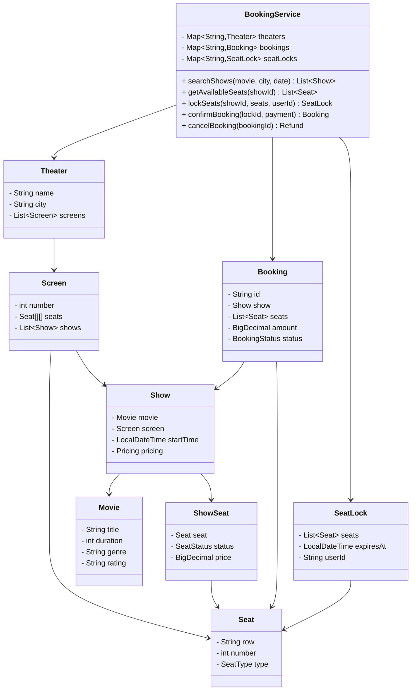

# 🎬 Movie Ticket Booking System (BookMyShow) - Problem Solution

## STEP 0: REQUIREMENTS QUICKPASS

### Core Functional Requirements
- Manage theaters, screens, and shows
- Handle seat selection with real-time availability
- Support concurrent booking with seat locking (5-minute hold)
- Manage show scheduling across multiple screens
- Generate tickets with unique booking codes
- Handle booking cancellations with refund policy

### Explicit Out-of-Scope Items
- Payment gateway integration
- Food and beverage ordering
- Loyalty points and rewards
- Movie ratings and reviews
- Seat preference learning
- Dynamic pricing

### Assumptions and Constraints
- **Multi-Theater**: Support multiple theaters
- **Seat Types**: Regular, Premium, VIP
- **Lock Duration**: 5 minutes for seat selection
- **Cancellation**: Up to 2 hours before show
- **Max Tickets**: 10 per booking

### Public APIs
- `searchShows(movie, city, date)`: Find shows
- `getAvailableSeats(showId)`: Get seat map
- `lockSeats(showId, seats, userId)`: Temporary hold
- `confirmBooking(lockId, paymentInfo)`: Complete booking
- `cancelBooking(bookingId)`: Cancel with refund

### Public API Usage Examples
```java
// Example 1: Basic usage
BookingService service = new BookingService();
Theater theater = new Theater("CinePlex", "123 Main St", "NYC");
service.addTheater(theater);
Movie movie = new Movie("Inception", Duration.ofMinutes(148), "Sci-Fi", "PG-13");
service.addMovie(movie);
Show show = service.createShow(movie, theater, screen, LocalDateTime.now().plusDays(1));
List<Show> shows = service.searchShows(movie, "NYC", LocalDate.now().plusDays(1));
List<ShowSeat> available = service.getAvailableSeats(show.getId());
SeatLock lock = service.lockSeats(show.getId(), Arrays.asList("A1", "A2"), "user123");
Booking booking = service.confirmBooking(lock.getId(), "user123");

// Example 2: Typical workflow
List<Show> shows = service.searchShows(movie, "NYC", LocalDate.now());
Show selectedShow = shows.get(0);
List<ShowSeat> seats = service.getAvailableSeats(selectedShow.getId());
SeatLock lock = service.lockSeats(selectedShow.getId(), Arrays.asList("B5", "B6"), "user456");
// ... user completes payment ...
Booking booking = service.confirmBooking(lock.getId(), "user456");
booking.printTicket();

// Example 3: Edge case - expired lock
SeatLock lock = service.lockSeats(show.getId(), Arrays.asList("C1"), "user789");
Thread.sleep(11 * 60 * 1000); // Wait for lock to expire
assertThrows(IllegalStateException.class, () -> 
    service.confirmBooking(lock.getId(), "user789"));
```

### Invariants
- **Seat Uniqueness**: One seat per booking per show
- **Lock Expiry**: Locks auto-release after timeout
- **Capacity Respect**: Never oversell a show

---

## STEP 1: Complete Reference Solution (Answer Key)

### Class Diagram Overview



<details>
<summary>ASCII diagram (reference)</summary>

```text
┌─────────────────────────────────────────────────────────────────────────────────┐
│                        MOVIE TICKET BOOKING SYSTEM                               │
├─────────────────────────────────────────────────────────────────────────────────┤
│                                                                                  │
│  ┌──────────────────────────────────────────────────────────────────────────┐   │
│  │                        BookingService                                     │   │
│  │                                                                           │   │
│  │  - theaters: Map<String, Theater>                                        │   │
│  │  - bookings: Map<String, Booking>                                        │   │
│  │  - seatLocks: Map<String, SeatLock>                                      │   │
│  │                                                                           │   │
│  │  + searchShows(movie, city, date): List<Show>                           │   │
│  │  + getAvailableSeats(showId): List<Seat>                                │   │
│  │  + lockSeats(showId, seats, userId): SeatLock                           │   │
│  │  + confirmBooking(lockId, payment): Booking                             │   │
│  │  + cancelBooking(bookingId): Refund                                     │   │
│  └──────────────────────────────────────────────────────────────────────────┘   │
│                          │                                                       │
│           ┌──────────────┼──────────────┬────────────────┐                      │
│           │              │              │                │                      │
│           ▼              ▼              ▼                ▼                      │
│  ┌─────────────┐  ┌─────────────┐  ┌─────────────┐  ┌─────────────┐            │
│  │   Theater   │  │    Movie    │  │    Show     │  │   Booking   │            │
│  │             │  │             │  │             │  │             │            │
│  │ - name      │  │ - title     │  │ - movie     │  │ - id        │            │
│  │ - city      │  │ - duration  │  │ - screen    │  │ - show      │            │
│  │ - screens[] │  │ - genre     │  │ - startTime │  │ - seats[]   │            │
│  └─────────────┘  │ - rating    │  │ - pricing   │  │ - amount    │            │
│        │          └─────────────┘  └─────────────┘  │ - status    │            │
│        ▼                                │           └─────────────┘            │
│  ┌─────────────┐                        │                                      │
│  │   Screen    │                        ▼                                      │
│  │             │◄─────────────┐  ┌─────────────┐                               │
│  │ - number    │              │  │  ShowSeat   │                               │
│  │ - seats[][] │              │  │             │                               │
│  │ - shows[]   │              │  │ - seat      │                               │
│  └─────────────┘              │  │ - status    │                               │
│        │                      │  │ - price     │                               │
│        ▼                      │  └─────────────┘                               │
│  ┌─────────────┐              │                                                │
│  │    Seat     │──────────────┘                                                │
│  │             │                                                               │
│  │ - row       │         ┌─────────────┐                                       │
│  │ - number    │         │  SeatLock   │                                       │
│  │ - type      │         │             │                                       │
│  └─────────────┘         │ - seats[]   │                                       │
│                          │ - expiresAt │                                       │
│                          └─────────────┘                                       │
└─────────────────────────────────────────────────────────────────────────────────┘
```

</details>

### Seat Layout Visualization

```
                         SCREEN
    ════════════════════════════════════════════

    Row A  [A1][A2][A3][A4]  ████  [A5][A6][A7][A8]     PREMIUM
    Row B  [B1][B2][B3][B4]  ████  [B5][B6][B7][B8]     $15.00
    
    Row C  [C1][C2][C3][C4]  ████  [C5][C6][C7][C8]     
    Row D  [D1][D2][D3][D4]  ████  [D5][D6][D7][D8]     STANDARD
    Row E  [E1][E2][E3][E4]  ████  [E5][E6][E7][E8]     $12.00
    Row F  [F1][F2][F3][F4]  ████  [F5][F6][F7][F8]     
    
    Row G  [G1][G2][G3][G4]  ████  [G5][G6][G7][G8]     
    Row H  [H1][H2][H3][H4]  ████  [H5][H6][H7][H8]     ECONOMY
    Row I  [I1][I2][I3][I4]  ████  [I5][I6][I7][I8]     $8.00
    Row J  [J1][J2][J3][J4]  ████  [J5][J6][J7][J8]     
    
    Legend: [XX] = Available  [██] = Booked  [⌛] = Locked
```

---

### Responsibilities Table

| Class | Owns | Why |
|-------|------|-----|
| `Movie` | Movie information (title, duration, genre) | Stores movie metadata - separates movie information from show/booking logic |
| `Theater` | Theater configuration (screens, shows) | Manages theater setup - encapsulates theater-level configuration and screen/show management |
| `Screen` | Screen seat layout and seat management | Manages screen layout - encapsulates screen configuration and seat organization |
| `Seat` | Physical seat properties (row, number, type) | Represents seat identity - encapsulates seat properties, separate from show-specific status |
| `Show` | Movie showing details (movie, screen, time) | Encapsulates show information - represents a specific movie showing at a time |
| `ShowSeat` | Seat status for a specific show | Manages show-specific seat status - separates show-level status from physical seat properties |
| `SeatLock` | Temporary seat lock management | Handles seat locking - manages temporary locks for concurrent booking, prevents double-booking |
| `Booking` | Confirmed booking details (seats, show, user) | Encapsulates booking data - stores confirmed booking information |
| `BookingService` | Booking operations coordination | Coordinates booking workflow - separates business logic from domain objects, handles seat selection/lock/booking |

---

## STEP 4: Code Walkthrough - Building From Scratch

This section explains how an engineer builds this system from scratch, in the order code should be written.

### Phase 1: Design the Seat Model

```java
// Step 1: Seat types and status
public enum SeatType {
    ECONOMY(new BigDecimal("8.00")),
    STANDARD(new BigDecimal("12.00")),
    PREMIUM(new BigDecimal("15.00"));
}

public enum SeatStatus {
    AVAILABLE, LOCKED, BOOKED
}

// Step 2: Physical seat (immutable)
public class Seat {
    private final String id;      // "A1", "B5"
    private final String row;
    private final int number;
    private final SeatType type;
}

// Step 3: Seat status for a specific show
public class ShowSeat {
    private final Seat seat;
    private final BigDecimal price;
    private SeatStatus status;
    private String lockedBy;
    private long lockExpiry;
}
```

**Why separate Seat and ShowSeat?**
- `Seat` is the physical seat (never changes)
- `ShowSeat` is seat status for a specific show
- Same seat can be available for one show, booked for another

---

### Phase 2: Implement Seat Locking

```java
// Step 4: Lock mechanism with synchronization
public synchronized boolean lock(String userId, long durationMs) {
    if (status != SeatStatus.AVAILABLE) {
        return false;
    }
    this.status = SeatStatus.LOCKED;
    this.lockedBy = userId;
    this.lockExpiry = System.currentTimeMillis() + durationMs;
    return true;
}

// Step 5: Lock expiration check
public synchronized boolean isLockExpired() {
    return status == SeatStatus.LOCKED && 
           System.currentTimeMillis() > lockExpiry;
}

public synchronized void checkAndReleaseLock() {
    if (isLockExpired()) {
        this.status = SeatStatus.AVAILABLE;
        this.lockedBy = null;
        this.lockExpiry = 0;
    }
}
```

---

### Phase 3: Design the Booking Flow

```java
// Step 6: SeatLock - groups locked seats
public class SeatLock {
    private final String id;
    private final String showId;
    private final List<ShowSeat> seats;
    private final String userId;
    private final LocalDateTime expiresAt;
}

// Step 7: Lock seats atomically
public synchronized SeatLock lockSeats(String showId, List<String> seatIds, 
                                       String userId) {
    List<ShowSeat> seatsToLock = new ArrayList<>();
    
    // Verify all seats are available
    for (String seatId : seatIds) {
        ShowSeat showSeat = show.getShowSeat(seatId);
        if (!showSeat.isAvailable()) {
            throw new IllegalStateException("Seat not available: " + seatId);
        }
        seatsToLock.add(showSeat);
    }
    
    // Lock all seats (atomic operation)
    for (ShowSeat seat : seatsToLock) {
        if (!seat.lock(userId, LOCK_DURATION_MS)) {
            // Rollback on failure
            for (ShowSeat lockedSeat : seatsToLock) {
                lockedSeat.unlock(userId);
            }
            throw new IllegalStateException("Failed to lock seats");
        }
    }
    
    return new SeatLock(showId, seatsToLock, userId, LOCK_DURATION_MS);
}
```

---

### Phase 4: Confirm Booking

```java
// Step 8: Confirm booking from lock
public synchronized Booking confirmBooking(String lockId, String userId) {
    SeatLock lock = seatLocks.get(lockId);
    
    // Validate lock
    if (lock == null || !lock.getUserId().equals(userId) || lock.isExpired()) {
        throw new IllegalStateException("Invalid or expired lock");
    }
    
    // Book all seats
    for (ShowSeat seat : lock.getSeats()) {
        seat.book();  // LOCKED → BOOKED
    }
    
    // Create booking
    Booking booking = new Booking(show, lock.getSeats(), userId, lock.getTotalAmount());
    bookings.put(booking.getId(), booking);
    seatLocks.remove(lockId);
    
    return booking;
}
```

---

### Phase 5: Threading Model and Concurrency Control

**Threading Model:**

This movie ticket booking system handles **concurrent seat selection**:
- Multiple users can try to book the same seats simultaneously
- Seat locking must be atomic to prevent double-booking
- Lock expiration releases seats after timeout

**Concurrency Control:**

```java
// Synchronized methods ensure atomic operations
public synchronized boolean lock(String userId, long durationMs) {
    // Check-then-act must be atomic
    if (status != SeatStatus.AVAILABLE) return false;
    status = SeatStatus.LOCKED;
    // ... set lock details ...
    return true;
}

// Background thread for lock cleanup
private final ScheduledExecutorService lockCleanupService;

public BookingService() {
    this.lockCleanupService = Executors.newSingleThreadScheduledExecutor();
    this.lockCleanupService.scheduleAtFixedRate(
        this::cleanupExpiredLocks, 1, 1, TimeUnit.MINUTES);
}

private void cleanupExpiredLocks() {
    List<String> expiredLocks = seatLocks.entrySet().stream()
        .filter(e -> e.getValue().isExpired())
        .map(Map.Entry::getKey)
        .collect(Collectors.toList());
    
    for (String lockId : expiredLocks) {
        SeatLock lock = seatLocks.remove(lockId);
        if (lock != null) {
            lock.release();  // Releases all seats
        }
    }
}
```

**Why synchronized for locking?**
- Without synchronization: Two threads can both see AVAILABLE and both lock the seat
- With synchronization: Only one thread can check and lock atomically

---

## STEP 2: Complete Final Implementation

> **Verified:** This code compiles successfully with Java 11+.

### 2.1 SeatType and SeatStatus Enums

```java
// SeatType.java
package com.moviebooking;

import java.math.BigDecimal;

public enum SeatType {
    ECONOMY(new BigDecimal("8.00")),
    STANDARD(new BigDecimal("12.00")),
    PREMIUM(new BigDecimal("15.00")),
    VIP(new BigDecimal("25.00"));
    
    private final BigDecimal basePrice;
    
    SeatType(BigDecimal basePrice) {
        this.basePrice = basePrice;
    }
    
    public BigDecimal getBasePrice() { return basePrice; }
}
```

```java
// SeatStatus.java
package com.moviebooking;

public enum SeatStatus {
    AVAILABLE,
    LOCKED,     // Temporarily locked during booking
    BOOKED
}
```

### 2.2 Seat Class

```java
// Seat.java
package com.moviebooking;

/**
 * Represents a physical seat in a screen.
 */
public class Seat {
    
    private final String id;
    private final String row;
    private final int number;
    private final SeatType type;
    
    public Seat(String row, int number, SeatType type) {
        this.id = row + number;
        this.row = row;
        this.number = number;
        this.type = type;
    }
    
    public String getId() { return id; }
    public String getRow() { return row; }
    public int getNumber() { return number; }
    public SeatType getType() { return type; }
    
    @Override
    public String toString() {
        return id;
    }
    
    @Override
    public boolean equals(Object o) {
        if (this == o) return true;
        if (!(o instanceof Seat)) return false;
        return id.equals(((Seat) o).id);
    }
    
    @Override
    public int hashCode() {
        return id.hashCode();
    }
}
```

### 2.3 Screen Class

```java
// Screen.java
package com.moviebooking;

import java.util.*;

/**
 * Represents a screen/auditorium in a theater.
 */
public class Screen {
    
    private final String id;
    private final int number;
    private final String name;
    private final List<List<Seat>> seatLayout;
    private final int totalSeats;
    
    public Screen(int number, String name) {
        this.id = "SCR-" + number;
        this.number = number;
        this.name = name;
        this.seatLayout = new ArrayList<>();
        this.totalSeats = 0;
    }
    
    public Screen(int number, String name, int rows, int seatsPerRow) {
        this.id = "SCR-" + number;
        this.number = number;
        this.name = name;
        this.seatLayout = createDefaultLayout(rows, seatsPerRow);
        this.totalSeats = rows * seatsPerRow;
    }
    
    private List<List<Seat>> createDefaultLayout(int rows, int seatsPerRow) {
        List<List<Seat>> layout = new ArrayList<>();
        
        for (int r = 0; r < rows; r++) {
            char rowChar = (char) ('A' + r);
            String rowName = String.valueOf(rowChar);
            List<Seat> rowSeats = new ArrayList<>();
            
            SeatType type;
            if (r < 2) type = SeatType.PREMIUM;
            else if (r < 6) type = SeatType.STANDARD;
            else type = SeatType.ECONOMY;
            
            for (int s = 1; s <= seatsPerRow; s++) {
                rowSeats.add(new Seat(rowName, s, type));
            }
            layout.add(rowSeats);
        }
        
        return layout;
    }
    
    public List<Seat> getAllSeats() {
        List<Seat> allSeats = new ArrayList<>();
        for (List<Seat> row : seatLayout) {
            allSeats.addAll(row);
        }
        return allSeats;
    }
    
    public Seat getSeat(String seatId) {
        for (List<Seat> row : seatLayout) {
            for (Seat seat : row) {
                if (seat.getId().equals(seatId)) {
                    return seat;
                }
            }
        }
        return null;
    }
    
    // Getters
    public String getId() { return id; }
    public int getNumber() { return number; }
    public String getName() { return name; }
    public List<List<Seat>> getSeatLayout() { return seatLayout; }
    public int getTotalSeats() { return totalSeats; }
    
    @Override
    public String toString() {
        return String.format("Screen %d (%s) - %d seats", number, name, totalSeats);
    }
}
```

### 2.4 Movie Class

```java
// Movie.java
package com.moviebooking;

import java.time.Duration;
import java.util.*;

/**
 * Represents a movie.
 */
public class Movie {
    
    private final String id;
    private final String title;
    private final String description;
    private final Duration duration;
    private final String genre;
    private final String rating;  // PG, PG-13, R, etc.
    private final String language;
    private final Set<String> cast;
    
    public Movie(String title, Duration duration, String genre, String rating) {
        this.id = "MOV-" + System.currentTimeMillis() % 100000;
        this.title = title;
        this.description = "";
        this.duration = duration;
        this.genre = genre;
        this.rating = rating;
        this.language = "English";
        this.cast = new HashSet<>();
    }
    
    public void addCastMember(String name) {
        cast.add(name);
    }
    
    // Getters
    public String getId() { return id; }
    public String getTitle() { return title; }
    public String getDescription() { return description; }
    public Duration getDuration() { return duration; }
    public String getGenre() { return genre; }
    public String getRating() { return rating; }
    public String getLanguage() { return language; }
    public Set<String> getCast() { return Collections.unmodifiableSet(cast); }
    
    @Override
    public String toString() {
        return String.format("%s (%s) - %d min", title, rating, duration.toMinutes());
    }
}
```

### 2.5 ShowSeat Class

```java
// ShowSeat.java
package com.moviebooking;

import java.math.BigDecimal;

/**
 * Represents a seat for a specific show with its status and price.
 */
public class ShowSeat {
    
    private final Seat seat;
    private final BigDecimal price;
    private SeatStatus status;
    private String lockedBy;
    private long lockExpiry;
    
    public ShowSeat(Seat seat, BigDecimal price) {
        this.seat = seat;
        this.price = price;
        this.status = SeatStatus.AVAILABLE;
    }
    
    public synchronized boolean lock(String userId, long durationMs) {
        if (status != SeatStatus.AVAILABLE) {
            return false;
        }
        this.status = SeatStatus.LOCKED;
        this.lockedBy = userId;
        this.lockExpiry = System.currentTimeMillis() + durationMs;
        return true;
    }
    
    public synchronized boolean unlock(String userId) {
        if (status != SeatStatus.LOCKED || !lockedBy.equals(userId)) {
            return false;
        }
        this.status = SeatStatus.AVAILABLE;
        this.lockedBy = null;
        this.lockExpiry = 0;
        return true;
    }
    
    public synchronized boolean book() {
        if (status != SeatStatus.LOCKED) {
            return false;
        }
        this.status = SeatStatus.BOOKED;
        return true;
    }
    
    public synchronized void release() {
        this.status = SeatStatus.AVAILABLE;
        this.lockedBy = null;
        this.lockExpiry = 0;
    }
    
    public synchronized boolean isLockExpired() {
        return status == SeatStatus.LOCKED && 
               System.currentTimeMillis() > lockExpiry;
    }
    
    public synchronized void checkAndReleaseLock() {
        if (isLockExpired()) {
            release();
        }
    }
    
    // Getters
    public Seat getSeat() { return seat; }
    public BigDecimal getPrice() { return price; }
    public SeatStatus getStatus() { return status; }
    public String getLockedBy() { return lockedBy; }
    
    public boolean isAvailable() {
        checkAndReleaseLock();
        return status == SeatStatus.AVAILABLE;
    }
    
    @Override
    public String toString() {
        return String.format("%s ($%.2f) - %s", seat.getId(), price, status);
    }
}
```

### 2.6 Show Class

```java
// Show.java
package com.moviebooking;

import java.math.BigDecimal;
import java.time.*;
import java.util.*;
import java.util.concurrent.ConcurrentHashMap;

/**
 * Represents a movie show at a specific time.
 */
public class Show {
    
    private final String id;
    private final Movie movie;
    private final Screen screen;
    private final LocalDateTime startTime;
    private final LocalDateTime endTime;
    private final Map<String, ShowSeat> showSeats;
    
    public Show(Movie movie, Screen screen, LocalDateTime startTime) {
        this.id = "SHW-" + System.currentTimeMillis() % 100000;
        this.movie = movie;
        this.screen = screen;
        this.startTime = startTime;
        this.endTime = startTime.plus(movie.getDuration()).plusMinutes(15); // 15 min buffer
        this.showSeats = new ConcurrentHashMap<>();
        
        initializeSeats();
    }
    
    private void initializeSeats() {
        for (Seat seat : screen.getAllSeats()) {
            BigDecimal price = seat.getType().getBasePrice();
            showSeats.put(seat.getId(), new ShowSeat(seat, price));
        }
    }
    
    public List<ShowSeat> getAvailableSeats() {
        List<ShowSeat> available = new ArrayList<>();
        for (ShowSeat showSeat : showSeats.values()) {
            if (showSeat.isAvailable()) {
                available.add(showSeat);
            }
        }
        return available;
    }
    
    public ShowSeat getShowSeat(String seatId) {
        return showSeats.get(seatId);
    }
    
    public int getAvailableCount() {
        return (int) showSeats.values().stream()
            .filter(ShowSeat::isAvailable)
            .count();
    }
    
    public int getBookedCount() {
        return (int) showSeats.values().stream()
            .filter(s -> s.getStatus() == SeatStatus.BOOKED)
            .count();
    }
    
    // Getters
    public String getId() { return id; }
    public Movie getMovie() { return movie; }
    public Screen getScreen() { return screen; }
    public LocalDateTime getStartTime() { return startTime; }
    public LocalDateTime getEndTime() { return endTime; }
    public Map<String, ShowSeat> getShowSeats() { return showSeats; }
    
    @Override
    public String toString() {
        return String.format("%s at %s (Screen %d) - %d/%d available",
            movie.getTitle(), startTime.toLocalTime(), 
            screen.getNumber(), getAvailableCount(), showSeats.size());
    }
}
```

### 2.7 Theater Class

```java
// Theater.java
package com.moviebooking;

import java.util.*;

/**
 * Represents a movie theater/cinema.
 */
public class Theater {
    
    private final String id;
    private final String name;
    private final String address;
    private final String city;
    private final List<Screen> screens;
    private final List<Show> shows;
    
    public Theater(String name, String address, String city) {
        this.id = "THR-" + System.currentTimeMillis() % 100000;
        this.name = name;
        this.address = address;
        this.city = city;
        this.screens = new ArrayList<>();
        this.shows = new ArrayList<>();
    }
    
    public void addScreen(Screen screen) {
        screens.add(screen);
    }
    
    public void addShow(Show show) {
        shows.add(show);
    }
    
    public List<Show> getShowsForMovie(Movie movie) {
        List<Show> movieShows = new ArrayList<>();
        for (Show show : shows) {
            if (show.getMovie().getId().equals(movie.getId())) {
                movieShows.add(show);
            }
        }
        return movieShows;
    }
    
    public List<Show> getShowsForDate(java.time.LocalDate date) {
        List<Show> dateShows = new ArrayList<>();
        for (Show show : shows) {
            if (show.getStartTime().toLocalDate().equals(date)) {
                dateShows.add(show);
            }
        }
        return dateShows;
    }
    
    // Getters
    public String getId() { return id; }
    public String getName() { return name; }
    public String getAddress() { return address; }
    public String getCity() { return city; }
    public List<Screen> getScreens() { return Collections.unmodifiableList(screens); }
    public List<Show> getShows() { return Collections.unmodifiableList(shows); }
    
    @Override
    public String toString() {
        return String.format("%s - %s, %s (%d screens)", name, address, city, screens.size());
    }
}
```

### 2.8 BookingStatus Enum

```java
// BookingStatus.java
package com.moviebooking;

public enum BookingStatus {
    PENDING,
    CONFIRMED,
    CANCELLED,
    EXPIRED
}
```

### 2.9 SeatLock Class

```java
// SeatLock.java
package com.moviebooking;

import java.time.LocalDateTime;
import java.util.*;

/**
 * Represents a temporary lock on seats during booking.
 */
public class SeatLock {
    
    private final String id;
    private final String showId;
    private final List<ShowSeat> seats;
    private final String userId;
    private final LocalDateTime createdAt;
    private final LocalDateTime expiresAt;
    private boolean released;
    
    public SeatLock(String showId, List<ShowSeat> seats, String userId, 
                    long lockDurationMs) {
        this.id = "LOCK-" + System.currentTimeMillis() % 100000;
        this.showId = showId;
        this.seats = new ArrayList<>(seats);
        this.userId = userId;
        this.createdAt = LocalDateTime.now();
        this.expiresAt = createdAt.plusNanos(lockDurationMs * 1_000_000);
        this.released = false;
    }
    
    public boolean isExpired() {
        return LocalDateTime.now().isAfter(expiresAt) || released;
    }
    
    public void release() {
        this.released = true;
        for (ShowSeat seat : seats) {
            seat.unlock(userId);
        }
    }
    
    public java.math.BigDecimal getTotalAmount() {
        return seats.stream()
            .map(ShowSeat::getPrice)
            .reduce(java.math.BigDecimal.ZERO, java.math.BigDecimal::add);
    }
    
    // Getters
    public String getId() { return id; }
    public String getShowId() { return showId; }
    public List<ShowSeat> getSeats() { return Collections.unmodifiableList(seats); }
    public String getUserId() { return userId; }
    public LocalDateTime getCreatedAt() { return createdAt; }
    public LocalDateTime getExpiresAt() { return expiresAt; }
    public boolean isReleased() { return released; }
}
```

### 2.10 Booking Class

```java
// Booking.java
package com.moviebooking;

import java.math.BigDecimal;
import java.time.LocalDateTime;
import java.util.*;

/**
 * Represents a confirmed booking.
 */
public class Booking {
    
    private final String id;
    private final Show show;
    private final List<ShowSeat> seats;
    private final String userId;
    private final BigDecimal totalAmount;
    private final LocalDateTime bookedAt;
    private BookingStatus status;
    private String confirmationCode;
    
    public Booking(Show show, List<ShowSeat> seats, String userId, BigDecimal totalAmount) {
        this.id = "BKG-" + System.currentTimeMillis() % 100000;
        this.show = show;
        this.seats = new ArrayList<>(seats);
        this.userId = userId;
        this.totalAmount = totalAmount;
        this.bookedAt = LocalDateTime.now();
        this.status = BookingStatus.CONFIRMED;
        this.confirmationCode = generateConfirmationCode();
    }
    
    private String generateConfirmationCode() {
        return String.format("%s%06d", 
            show.getMovie().getTitle().substring(0, 3).toUpperCase(),
            (int) (Math.random() * 1000000));
    }
    
    public void cancel() {
        if (status != BookingStatus.CONFIRMED) {
            throw new IllegalStateException("Cannot cancel booking with status: " + status);
        }
        this.status = BookingStatus.CANCELLED;
        for (ShowSeat seat : seats) {
            seat.release();
        }
    }
    
    public String getSeatNumbers() {
        StringBuilder sb = new StringBuilder();
        for (int i = 0; i < seats.size(); i++) {
            if (i > 0) sb.append(", ");
            sb.append(seats.get(i).getSeat().getId());
        }
        return sb.toString();
    }
    
    public void printTicket() {
        System.out.println("\n╔════════════════════════════════════════╗");
        System.out.println("║           MOVIE TICKET                 ║");
        System.out.println("╠════════════════════════════════════════╣");
        System.out.printf("║ Confirmation: %-25s║%n", confirmationCode);
        System.out.println("╠════════════════════════════════════════╣");
        System.out.printf("║ Movie: %-32s║%n", show.getMovie().getTitle());
        System.out.printf("║ Date: %-33s║%n", show.getStartTime().toLocalDate());
        System.out.printf("║ Time: %-33s║%n", show.getStartTime().toLocalTime());
        System.out.printf("║ Screen: %-31s║%n", show.getScreen().getNumber());
        System.out.printf("║ Seats: %-32s║%n", getSeatNumbers());
        System.out.println("╠════════════════════════════════════════╣");
        System.out.printf("║ Total: $%-31.2f║%n", totalAmount);
        System.out.println("╚════════════════════════════════════════╝\n");
    }
    
    // Getters
    public String getId() { return id; }
    public Show getShow() { return show; }
    public List<ShowSeat> getSeats() { return Collections.unmodifiableList(seats); }
    public String getUserId() { return userId; }
    public BigDecimal getTotalAmount() { return totalAmount; }
    public LocalDateTime getBookedAt() { return bookedAt; }
    public BookingStatus getStatus() { return status; }
    public String getConfirmationCode() { return confirmationCode; }
    
    @Override
    public String toString() {
        return String.format("Booking[%s: %s, %s, Seats: %s, $%.2f]",
            confirmationCode, show.getMovie().getTitle(), 
            show.getStartTime(), getSeatNumbers(), totalAmount);
    }
}
```

### 2.11 BookingService Class

```java
// BookingService.java
package com.moviebooking;

import java.math.BigDecimal;
import java.time.LocalDate;
import java.util.*;
import java.util.concurrent.*;
import java.util.stream.Collectors;

/**
 * Main service for managing movie bookings.
 */
public class BookingService {
    
    private static final long SEAT_LOCK_DURATION_MS = 10 * 60 * 1000; // 10 minutes
    
    private final Map<String, Theater> theaters;
    private final Map<String, Movie> movies;
    private final Map<String, Show> shows;
    private final Map<String, Booking> bookings;
    private final Map<String, SeatLock> seatLocks;
    private final ScheduledExecutorService lockCleanupService;
    
    public BookingService() {
        this.theaters = new ConcurrentHashMap<>();
        this.movies = new ConcurrentHashMap<>();
        this.shows = new ConcurrentHashMap<>();
        this.bookings = new ConcurrentHashMap<>();
        this.seatLocks = new ConcurrentHashMap<>();
        
        // Start lock cleanup service
        this.lockCleanupService = Executors.newSingleThreadScheduledExecutor();
        this.lockCleanupService.scheduleAtFixedRate(
            this::cleanupExpiredLocks, 1, 1, TimeUnit.MINUTES);
    }
    
    // ==================== Setup ====================
    
    public void addTheater(Theater theater) {
        theaters.put(theater.getId(), theater);
    }
    
    public void addMovie(Movie movie) {
        movies.put(movie.getId(), movie);
    }
    
    public Show createShow(Movie movie, Theater theater, Screen screen, 
                           java.time.LocalDateTime startTime) {
        Show show = new Show(movie, screen, startTime);
        shows.put(show.getId(), show);
        theater.addShow(show);
        return show;
    }
    
    // ==================== Search ====================
    
    public List<Movie> searchMovies(String query) {
        String lowerQuery = query.toLowerCase();
        return movies.values().stream()
            .filter(m -> m.getTitle().toLowerCase().contains(lowerQuery) ||
                        m.getGenre().toLowerCase().contains(lowerQuery))
            .collect(Collectors.toList());
    }
    
    public List<Show> searchShows(Movie movie, String city, LocalDate date) {
        return theaters.values().stream()
            .filter(t -> t.getCity().equalsIgnoreCase(city))
            .flatMap(t -> t.getShowsForMovie(movie).stream())
            .filter(s -> s.getStartTime().toLocalDate().equals(date))
            .sorted(Comparator.comparing(Show::getStartTime))
            .collect(Collectors.toList());
    }
    
    public List<Theater> getTheatersByCity(String city) {
        return theaters.values().stream()
            .filter(t -> t.getCity().equalsIgnoreCase(city))
            .collect(Collectors.toList());
    }
    
    // ==================== Seat Selection ====================
    
    public List<ShowSeat> getAvailableSeats(String showId) {
        Show show = shows.get(showId);
        if (show == null) {
            throw new IllegalArgumentException("Show not found");
        }
        return show.getAvailableSeats();
    }
    
    public synchronized SeatLock lockSeats(String showId, List<String> seatIds, 
                                           String userId) {
        Show show = shows.get(showId);
        if (show == null) {
            throw new IllegalArgumentException("Show not found");
        }
        
        // Verify all seats are available
        List<ShowSeat> seatsToLock = new ArrayList<>();
        for (String seatId : seatIds) {
            ShowSeat showSeat = show.getShowSeat(seatId);
            if (showSeat == null) {
                throw new IllegalArgumentException("Seat not found: " + seatId);
            }
            if (!showSeat.isAvailable()) {
                throw new IllegalStateException("Seat not available: " + seatId);
            }
            seatsToLock.add(showSeat);
        }
        
        // Lock all seats
        for (ShowSeat seat : seatsToLock) {
            if (!seat.lock(userId, SEAT_LOCK_DURATION_MS)) {
                // Rollback if any lock fails
                for (ShowSeat lockedSeat : seatsToLock) {
                    lockedSeat.unlock(userId);
                }
                throw new IllegalStateException("Failed to lock seats");
            }
        }
        
        SeatLock lock = new SeatLock(showId, seatsToLock, userId, SEAT_LOCK_DURATION_MS);
        seatLocks.put(lock.getId(), lock);
        
        return lock;
    }
    
    public void releaseLock(String lockId, String userId) {
        SeatLock lock = seatLocks.get(lockId);
        if (lock != null && lock.getUserId().equals(userId)) {
            lock.release();
            seatLocks.remove(lockId);
        }
    }
    
    // ==================== Booking ====================
    
    public synchronized Booking confirmBooking(String lockId, String userId) {
        SeatLock lock = seatLocks.get(lockId);
        
        if (lock == null) {
            throw new IllegalArgumentException("Lock not found or expired");
        }
        
        if (!lock.getUserId().equals(userId)) {
            throw new IllegalStateException("Lock belongs to different user");
        }
        
        if (lock.isExpired()) {
            seatLocks.remove(lockId);
            throw new IllegalStateException("Lock has expired");
        }
        
        Show show = shows.get(lock.getShowId());
        
        // Book all seats
        for (ShowSeat seat : lock.getSeats()) {
            if (!seat.book()) {
                throw new IllegalStateException("Failed to book seat: " + seat.getSeat().getId());
            }
        }
        
        // Create booking
        Booking booking = new Booking(show, lock.getSeats(), userId, lock.getTotalAmount());
        bookings.put(booking.getId(), booking);
        
        // Remove lock
        seatLocks.remove(lockId);
        
        return booking;
    }
    
    public BigDecimal cancelBooking(String bookingId, String userId) {
        Booking booking = bookings.get(bookingId);
        
        if (booking == null) {
            throw new IllegalArgumentException("Booking not found");
        }
        
        if (!booking.getUserId().equals(userId)) {
            throw new IllegalStateException("Booking belongs to different user");
        }
        
        // Check cancellation policy (e.g., 2 hours before show)
        java.time.LocalDateTime showTime = booking.getShow().getStartTime();
        java.time.LocalDateTime now = java.time.LocalDateTime.now();
        
        if (now.plusHours(2).isAfter(showTime)) {
            throw new IllegalStateException("Cannot cancel within 2 hours of show");
        }
        
        booking.cancel();
        
        // Calculate refund (e.g., 90% refund)
        return booking.getTotalAmount().multiply(new BigDecimal("0.90"));
    }
    
    // ==================== Queries ====================
    
    public Booking getBooking(String bookingId) {
        return bookings.get(bookingId);
    }
    
    public Booking getBookingByConfirmation(String confirmationCode) {
        return bookings.values().stream()
            .filter(b -> b.getConfirmationCode().equals(confirmationCode))
            .findFirst()
            .orElse(null);
    }
    
    public List<Booking> getUserBookings(String userId) {
        return bookings.values().stream()
            .filter(b -> b.getUserId().equals(userId))
            .sorted(Comparator.comparing(Booking::getBookedAt).reversed())
            .collect(Collectors.toList());
    }
    
    // ==================== Cleanup ====================
    
    private void cleanupExpiredLocks() {
        List<String> expiredLocks = seatLocks.entrySet().stream()
            .filter(e -> e.getValue().isExpired())
            .map(Map.Entry::getKey)
            .collect(Collectors.toList());
        
        for (String lockId : expiredLocks) {
            SeatLock lock = seatLocks.remove(lockId);
            if (lock != null) {
                lock.release();
            }
        }
    }
    
    public void shutdown() {
        lockCleanupService.shutdown();
    }
}
```

### 2.12 Demo Application

```java
// MovieBookingDemo.java
package com.moviebooking;

import java.time.*;
import java.util.*;

public class MovieBookingDemo {
    
    public static void main(String[] args) {
        System.out.println("=== MOVIE TICKET BOOKING SYSTEM DEMO ===\n");
        
        BookingService service = new BookingService();
        
        // ==================== Setup ====================
        System.out.println("===== SETTING UP THEATER =====\n");
        
        // Create theater
        Theater theater = new Theater("CinePlex Downtown", "123 Main St", "New York");
        Screen screen1 = new Screen(1, "IMAX", 10, 12);
        Screen screen2 = new Screen(2, "Standard", 8, 10);
        theater.addScreen(screen1);
        theater.addScreen(screen2);
        service.addTheater(theater);
        
        System.out.println("Theater: " + theater);
        
        // Create movies
        Movie movie1 = new Movie("Inception", Duration.ofMinutes(148), "Sci-Fi", "PG-13");
        Movie movie2 = new Movie("The Dark Knight", Duration.ofMinutes(152), "Action", "PG-13");
        service.addMovie(movie1);
        service.addMovie(movie2);
        
        System.out.println("Movies: " + movie1 + ", " + movie2);
        
        // Create shows
        LocalDateTime today = LocalDateTime.now().withHour(14).withMinute(0);
        Show show1 = service.createShow(movie1, theater, screen1, today);
        Show show2 = service.createShow(movie1, theater, screen1, today.plusHours(3));
        Show show3 = service.createShow(movie2, theater, screen2, today);
        
        System.out.println("\nShows created:");
        System.out.println("  " + show1);
        System.out.println("  " + show2);
        System.out.println("  " + show3);
        
        // ==================== Search Shows ====================
        System.out.println("\n===== SEARCHING SHOWS =====\n");
        
        List<Show> inceptionShows = service.searchShows(movie1, "New York", LocalDate.now());
        System.out.println("Inception shows in New York today:");
        for (Show show : inceptionShows) {
            System.out.println("  " + show);
        }
        
        // ==================== View Available Seats ====================
        System.out.println("\n===== AVAILABLE SEATS =====\n");
        
        List<ShowSeat> availableSeats = service.getAvailableSeats(show1.getId());
        System.out.println("Available seats for " + show1.getMovie().getTitle() + ":");
        System.out.println("  Total available: " + availableSeats.size());
        
        // Show some premium seats
        System.out.println("  Premium seats:");
        availableSeats.stream()
            .filter(s -> s.getSeat().getType() == SeatType.PREMIUM)
            .limit(5)
            .forEach(s -> System.out.println("    " + s));
        
        // ==================== Book Tickets ====================
        System.out.println("\n===== BOOKING TICKETS =====\n");
        
        String userId = "user123";
        List<String> selectedSeats = Arrays.asList("A1", "A2", "A3");
        
        System.out.println("User " + userId + " selecting seats: " + selectedSeats);
        
        // Lock seats
        SeatLock lock = service.lockSeats(show1.getId(), selectedSeats, userId);
        System.out.println("Seats locked until: " + lock.getExpiresAt());
        System.out.println("Total amount: $" + lock.getTotalAmount());
        
        // Confirm booking
        Booking booking = service.confirmBooking(lock.getId(), userId);
        System.out.println("\nBooking confirmed!");
        booking.printTicket();
        
        // ==================== Check Updated Availability ====================
        System.out.println("===== UPDATED AVAILABILITY =====\n");
        
        System.out.println("Show: " + show1);
        System.out.println("Booked seats: " + show1.getBookedCount());
        System.out.println("Available seats: " + show1.getAvailableCount());
        
        // ==================== Try to Book Same Seats ====================
        System.out.println("\n===== CONCURRENT BOOKING TEST =====\n");
        
        String userId2 = "user456";
        try {
            service.lockSeats(show1.getId(), Arrays.asList("A1", "A2"), userId2);
            System.out.println("ERROR: Should not be able to lock booked seats!");
        } catch (IllegalStateException e) {
            System.out.println("Correctly prevented: " + e.getMessage());
        }
        
        // Book different seats
        SeatLock lock2 = service.lockSeats(show1.getId(), Arrays.asList("B1", "B2"), userId2);
        Booking booking2 = service.confirmBooking(lock2.getId(), userId2);
        System.out.println("User2 booked: " + booking2.getSeatNumbers());
        
        // ==================== User Bookings ====================
        System.out.println("\n===== USER BOOKINGS =====\n");
        
        System.out.println("Bookings for " + userId + ":");
        for (Booking b : service.getUserBookings(userId)) {
            System.out.println("  " + b);
        }
        
        // ==================== Cleanup ====================
        service.shutdown();
        
        System.out.println("\n=== DEMO COMPLETE ===");
    }
}
```

---

## File Structure

```
com/moviebooking/
├── SeatType.java
├── SeatStatus.java
├── Seat.java
├── Screen.java
├── Movie.java
├── ShowSeat.java
├── Show.java
├── Theater.java
├── BookingStatus.java
├── SeatLock.java
├── Booking.java
├── BookingService.java
└── MovieBookingDemo.java
```

