# 🎬 Movie Ticket Booking System - Simulation & Testing

## STEP 5: Simulation / Dry Run

### Scenario 1: Happy Path - Ticket Booking Flow

```
1. Search: "Inception", Mumbai, Today
   - Returns shows at PVR, INOX
   - Show S-001: 7 PM, Screen 2

2. Select Seats: S-001, seats A1, A2
   - Check availability → Available
   - Lock seats for 5 minutes
   - Return lockId: LOCK-001

3. Confirm: LOCK-001
   - Process payment
   - Create booking B-001
   - Generate tickets T-001, T-002
   - Release lock, mark seats BOOKED
```

**Final State:**
```
ShowSeat A1, A2: BOOKED
Booking B-001: CONFIRMED
Tickets T-001, T-002 generated
All operations completed successfully
```

---

### Scenario 2: Failure/Invalid Input - Lock Expiry

**Initial State:**
```
ShowSeat A1: AVAILABLE
User locks A1 for 5 minutes at 10:00:00
Lock expires at 10:05:00
User attempts to confirm at 10:06:00 (after expiry)
```

**Step-by-step:**

1. `bookingService.selectSeats("user1", Show S-001, [A1])` at 10:00:00
   - Seat A1 is AVAILABLE
   - Lock acquired, lockId = "LOCK-001"
   - Status: AVAILABLE → LOCKED
   - Lock expiry: 10:05:00

2. Time passes to 10:06:00 (lock expired)

3. `bookingService.confirmBooking("LOCK-001")` at 10:06:00
   - Validate lock: Check if lock exists and not expired
   - Lock expiry check: currentTime (10:06:00) > lockExpiry (10:05:00) → expired
   - Lock expired → throws IllegalStateException("Lock expired")
   - Seat remains LOCKED (cleanup happens separately)

4. Cleanup process runs (periodic task)
   - `seat.checkAndReleaseLock()` detects expiry
   - Status: LOCKED → AVAILABLE
   - Lock released

**Final State:**
```
ShowSeat A1: AVAILABLE (lock expired and released)
Booking confirmation rejected
Seat available for other users
```

---

### Scenario 3: Concurrency/Race Condition - Concurrent Seat Selection

**Initial State:**
```
ShowSeat A1: AVAILABLE
Thread A: User1 selects A1
Thread B: User2 selects A1 (concurrent)
```

**Step-by-step (simulating concurrent seat selection):**

**Thread A:** `bookingService.selectSeats("user1", Show S-001, [A1])` at time T0
**Thread B:** `bookingService.selectSeats("user2", Show S-001, [A1])` at time T0 (concurrent)

1. **Thread A:** Enters `selectSeats()` method
   - Gets ShowSeat A1
   - Calls `showSeat.lock("user1", 5 minutes)`
   - `synchronized (this)` lock acquired on A1
   - Check status: AVAILABLE → true
   - Status change: AVAILABLE → LOCKED
   - lockedBy = "user1"
   - lockExpiry = currentTime + 5 minutes
   - Releases lock, returns lockId = "LOCK-001"

2. **Thread B:** Enters `selectSeats()` method (concurrent)
   - Gets ShowSeat A1
   - Calls `showSeat.lock("user2", 5 minutes)`
   - `synchronized (this)` lock WAIT (Thread A holds lock)
   - After Thread A releases, acquires lock
   - Check status: LOCKED (Thread A already locked) → false
   - `lock()` returns false immediately
   - Booking fails, no lock created

**Final State:**
```
ShowSeat A1: LOCKED by user1 (Thread A succeeded)
User2 selection rejected (Thread B failed)
Only one user gets the seat
Proper synchronization prevents double locking
```

---

## STEP 6: Edge Cases & Testing Strategy

### Boundary Conditions
- **Lock Expiry**: Auto-release after 5 min
- **Concurrent Selection**: First lock wins
- **Payment Failure**: Release seats
- **Show Cancellation**: Refund all bookings

---

## Testing Approach

### Phase 1: Understand the Problem

**What is a Movie Ticket Booking System?**
- Users browse movies and shows
- Select seats from available options
- Complete payment and receive tickets
- Handle concurrent seat selection

**Key Challenges:**
- **Concurrent booking**: Two users selecting same seat
- **Seat locking**: Hold seats while user completes payment
- **Lock expiration**: Release seats if user abandons

---

### Phase 2: Design the Seat Model

```java
// Step 1: Seat types with pricing
public enum SeatType {
    ECONOMY(new BigDecimal("8.00")),
    STANDARD(new BigDecimal("12.00")),
    PREMIUM(new BigDecimal("15.00"));
    
    private final BigDecimal basePrice;
}
```

```java
// Step 2: Physical seat (immutable)
public class Seat {
    private final String id;      // "A1", "B5"
    private final String row;     // "A", "B"
    private final int number;     // 1, 5
    private final SeatType type;
}
```

```java
// Step 3: Seat status for a show
public class ShowSeat {
    private final Seat seat;
    private final BigDecimal price;
    private SeatStatus status;     // AVAILABLE, LOCKED, BOOKED
    private String lockedBy;
    private long lockExpiry;
}
```

**Why separate Seat and ShowSeat?**
- `Seat` is the physical seat (never changes)
- `ShowSeat` is seat status for a specific show
- Same seat can be available for one show, booked for another

---

### Phase 3: Implement Seat Locking

```java
// Step 4: Lock mechanism
public synchronized boolean lock(String userId, long durationMs) {
    // Check if available
    if (status != SeatStatus.AVAILABLE) {
        return false;
    }
    
    // Lock it
    this.status = SeatStatus.LOCKED;
    this.lockedBy = userId;
    this.lockExpiry = System.currentTimeMillis() + durationMs;
    return true;
}
```

**Why synchronized?**

```
Without synchronization:
Thread A: checks status → AVAILABLE
Thread B: checks status → AVAILABLE
Thread A: sets status = LOCKED
Thread B: sets status = LOCKED  // Both think they got it!

With synchronization:
Thread A: acquires lock → checks → sets LOCKED → releases lock
Thread B: waits...
Thread B: acquires lock → checks → status is LOCKED → returns false
```

```java
// Step 5: Lock expiration
public synchronized boolean isLockExpired() {
    return status == SeatStatus.LOCKED && 
           System.currentTimeMillis() > lockExpiry;
}

public synchronized void checkAndReleaseLock() {
    if (isLockExpired()) {
        this.status = SeatStatus.AVAILABLE;
        this.lockedBy = null;
        this.lockExpiry = 0;
    }
}
```

**Lock lifecycle:**


---

### Phase 4: Design the Booking Flow

```java
// Step 6: SeatLock - groups locked seats
public class SeatLock {
    private final String id;
    private final String showId;
    private final List<ShowSeat> seats;
    private final String userId;
    private final LocalDateTime expiresAt;
    
    public BigDecimal getTotalAmount() {
        return seats.stream()
            .map(ShowSeat::getPrice)
            .reduce(BigDecimal.ZERO, BigDecimal::add);
    }
}
```

```java
// Step 7: Lock seats atomically
public synchronized SeatLock lockSeats(String showId, List<String> seatIds, 
                                       String userId) {
    Show show = shows.get(showId);
    List<ShowSeat> seatsToLock = new ArrayList<>();
    
    // Verify all seats are available
    for (String seatId : seatIds) {
        ShowSeat showSeat = show.getShowSeat(seatId);
        if (!showSeat.isAvailable()) {
            throw new IllegalStateException("Seat not available: " + seatId);
        }
        seatsToLock.add(showSeat);
    }
    
    // Lock all seats
    for (ShowSeat seat : seatsToLock) {
        if (!seat.lock(userId, LOCK_DURATION_MS)) {
            // Rollback on failure
            for (ShowSeat lockedSeat : seatsToLock) {
                lockedSeat.unlock(userId);
            }
            throw new IllegalStateException("Failed to lock seats");
        }
    }
    
    return new SeatLock(showId, seatsToLock, userId, LOCK_DURATION_MS);
}
```

**Booking flow:**

```mermaid
flowchart TD
    A["User selects seats"]
    A --> B["lockSeats()<br/>Returns SeatLock (expires in 10 min)"]
    B --> C["User fills payment info"]
    C --> D["confirmBooking()<br/>Converts LOCKED → BOOKED"]
    D --> E["Booking + Ticket"]
```



<details>
<summary>ASCII diagram (reference)</summary>

```text
User selects seats
        │
        ▼
┌───────────────────┐
│   lockSeats()     │ ──► Returns SeatLock (expires in 10 min)
└───────────────────┘
        │
        │ User fills payment info
        ▼
┌───────────────────┐
│ confirmBooking()  │ ──► Converts LOCKED → BOOKED
└───────────────────┘
        │
        ▼
    Booking + Ticket
```

</details>

---

### Phase 5: Confirm Booking

```java
// Step 8: Confirm booking from lock
public synchronized Booking confirmBooking(String lockId, String userId) {
    SeatLock lock = seatLocks.get(lockId);
    
    // Validate lock
    if (lock == null) {
        throw new IllegalArgumentException("Lock not found");
    }
    if (!lock.getUserId().equals(userId)) {
        throw new IllegalStateException("Lock belongs to different user");
    }
    if (lock.isExpired()) {
        seatLocks.remove(lockId);
        throw new IllegalStateException("Lock has expired");
    }
    
    Show show = shows.get(lock.getShowId());
    
    // Book all seats
    for (ShowSeat seat : lock.getSeats()) {
        seat.book();  // LOCKED → BOOKED
    }
    
    // Create booking
    Booking booking = new Booking(show, lock.getSeats(), userId, lock.getTotalAmount());
    bookings.put(booking.getId(), booking);
    
    // Remove lock
    seatLocks.remove(lockId);
    
    return booking;
}
```

---

### Phase 6: Background Lock Cleanup

```java
// Step 9: Cleanup expired locks
private final ScheduledExecutorService lockCleanupService;

public BookingService() {
    this.lockCleanupService = Executors.newSingleThreadScheduledExecutor();
    this.lockCleanupService.scheduleAtFixedRate(
        this::cleanupExpiredLocks, 1, 1, TimeUnit.MINUTES);
}

private void cleanupExpiredLocks() {
    List<String> expiredLocks = seatLocks.entrySet().stream()
        .filter(e -> e.getValue().isExpired())
        .map(Map.Entry::getKey)
        .collect(Collectors.toList());
    
    for (String lockId : expiredLocks) {
        SeatLock lock = seatLocks.remove(lockId);
        if (lock != null) {
            lock.release();  // Releases all seats
        }
    }
}
```

---

## Testing Approach

### Unit Tests

```java
// ShowSeatTest.java
public class ShowSeatTest {
    
    @Test
    void testLockAndBook() {
        Seat seat = new Seat("A", 1, SeatType.PREMIUM);
        ShowSeat showSeat = new ShowSeat(seat, new BigDecimal("15.00"));
        
        assertTrue(showSeat.isAvailable());
        
        // Lock
        assertTrue(showSeat.lock("user1", 60000));
        assertEquals(SeatStatus.LOCKED, showSeat.getStatus());
        
        // Can't lock again
        assertFalse(showSeat.lock("user2", 60000));
        
        // Book
        assertTrue(showSeat.book());
        assertEquals(SeatStatus.BOOKED, showSeat.getStatus());
    }
    
    @Test
    void testLockExpiration() throws InterruptedException {
        Seat seat = new Seat("A", 1, SeatType.STANDARD);
        ShowSeat showSeat = new ShowSeat(seat, new BigDecimal("12.00"));
        
        // Lock for 100ms
        showSeat.lock("user1", 100);
        assertFalse(showSeat.isAvailable());
        
        // Wait for expiration
        Thread.sleep(150);
        
        // Should be available after expiration check
        assertTrue(showSeat.isAvailable());
    }
}
```

```java
// BookingServiceTest.java
public class BookingServiceTest {
    
    private BookingService service;
    private Show show;
    
    @BeforeEach
    void setUp() {
        service = new BookingService();
        // Setup theater, movie, show...
    }
    
    @Test
    void testLockAndConfirm() {
        List<String> seats = Arrays.asList("A1", "A2");
        
        SeatLock lock = service.lockSeats(show.getId(), seats, "user1");
        assertNotNull(lock);
        assertEquals(2, lock.getSeats().size());
        
        Booking booking = service.confirmBooking(lock.getId(), "user1");
        assertNotNull(booking);
        assertEquals(BookingStatus.CONFIRMED, booking.getStatus());
    }
    
    @Test
    void testConcurrentLocking() {
        String seatId = "A1";
        
        // User 1 locks
        SeatLock lock1 = service.lockSeats(show.getId(), 
            Arrays.asList(seatId), "user1");
        assertNotNull(lock1);
        
        // User 2 tries to lock same seat
        assertThrows(IllegalStateException.class, () -> 
            service.lockSeats(show.getId(), Arrays.asList(seatId), "user2"));
    }
}
```

### Concurrency Tests

```java
// ConcurrencyTest.java
public class ConcurrencyTest {
    
    @Test
    void testConcurrentSeatLocking() throws InterruptedException {
        BookingService service = new BookingService();
        // Setup...
        
        String seatId = "A1";
        AtomicInteger successCount = new AtomicInteger(0);
        CountDownLatch latch = new CountDownLatch(10);
        
        // 10 threads try to lock same seat
        for (int i = 0; i < 10; i++) {
            String userId = "user" + i;
            new Thread(() -> {
                try {
                    service.lockSeats(show.getId(), Arrays.asList(seatId), userId);
                    successCount.incrementAndGet();
                } catch (IllegalStateException e) {
                    // Expected for losers
                } finally {
                    latch.countDown();
                }
            }).start();
        }
        
        latch.await(5, TimeUnit.SECONDS);
        
        // Only one should succeed
        assertEquals(1, successCount.get());
    }
}
```


### lockSeats

```
Time: O(k)
  - k = number of seats to lock
  - Verify each seat: O(1)
  - Lock each seat: O(1)

Space: O(k) for SeatLock object
```

### confirmBooking

```
Time: O(k)
  - Validate lock: O(1)
  - Book each seat: O(1) × k
  - Create booking: O(1)

Space: O(k) for Booking object
```

### cleanupExpiredLocks

```
Time: O(l)
  - l = number of active locks
  - Check expiration: O(1) per lock
  - Release seats: O(k) per lock

Space: O(l) for expired lock IDs list
```

---

**Note:** Interview follow-ups have been moved to `02-design-explanation.md`, STEP 8.

