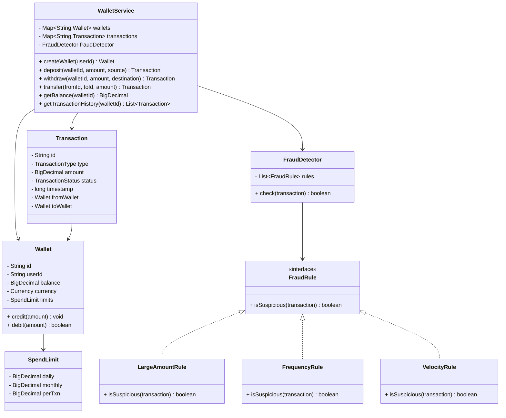
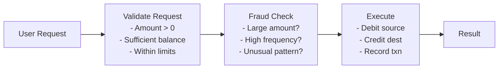

# 💰 Digital Wallet System - Problem Solution

## STEP 0: REQUIREMENTS QUICKPASS

### Core Functional Requirements
- Create and manage user wallet accounts
- Support deposits from linked bank accounts
- Support withdrawals to linked bank accounts
- Support peer-to-peer transfers
- Maintain complete transaction history
- Implement daily spending limits
- Handle concurrent transactions safely

### Explicit Out-of-Scope Items
- Actual bank integration
- KYC verification
- Multi-currency support
- Investment features
- Bill payments
- Merchant payments

### Assumptions and Constraints
- **Single Currency**: USD only
- **Daily Limit**: $10,000 per day
- **Min Balance**: $0 (no overdraft)
- **Transaction Fee**: None for P2P transfers
- **Instant Transfers**: No pending states

### Public APIs
- `createWallet(userId)`: Create new wallet
- `deposit(walletId, amount, source)`: Add funds
- `withdraw(walletId, amount, destination)`: Remove funds
- `transfer(fromWallet, toWallet, amount)`: P2P transfer
- `getBalance(walletId)`: Current balance
- `getTransactions(walletId, dateRange)`: History

### Public API Usage Examples
```java
// Example 1: Basic usage
WalletService service = new WalletService();
Wallet wallet = service.createWallet("user123");
service.deposit(wallet.getId(), new BigDecimal("1000.00"), "Bank Account");
BigDecimal balance = service.getBalance(wallet.getId());
System.out.println("Balance: " + balance);

// Example 2: Typical workflow
Wallet aliceWallet = service.createWallet("alice");
Wallet bobWallet = service.createWallet("bob");
service.deposit(aliceWallet.getId(), new BigDecimal("500.00"), "Credit Card");
Transaction transfer = service.transfer(
    aliceWallet.getId(), 
    bobWallet.getId(), 
    new BigDecimal("200.00"));
System.out.println("Transfer status: " + transfer.getStatus());

// Example 3: Edge case
Wallet wallet = service.createWallet("user1");
service.deposit(wallet.getId(), new BigDecimal("100.00"), "Bank");
try {
    service.withdraw(wallet.getId(), new BigDecimal("200.00"), "ATM");
} catch (IllegalStateException e) {
    System.out.println("Withdrawal failed: " + e.getMessage());
}
```

### Invariants
- **Balance ≥ 0**: No negative balances
- **Transaction Atomicity**: Complete or rollback
- **Audit Trail**: Every transaction logged

---

## STEP 1: Complete Reference Solution (Answer Key)

### Class Diagram Overview



<details>
<summary>ASCII diagram (reference)</summary>

```text
┌─────────────────────────────────────────────────────────────────────────────────┐
│                           DIGITAL WALLET SYSTEM                                  │
├─────────────────────────────────────────────────────────────────────────────────┤
│                                                                                  │
│  ┌──────────────────────────────────────────────────────────────────────────┐   │
│  │                         WalletService                                     │   │
│  │                                                                           │   │
│  │  - wallets: Map<String, Wallet>                                          │   │
│  │  - transactions: Map<String, Transaction>                                │   │
│  │  - fraudDetector: FraudDetector                                          │   │
│  │                                                                           │   │
│  │  + createWallet(userId): Wallet                                          │   │
│  │  + deposit(walletId, amount, source): Transaction                        │   │
│  │  + withdraw(walletId, amount, destination): Transaction                  │   │
│  │  + transfer(fromId, toId, amount): Transaction                           │   │
│  │  + getBalance(walletId): BigDecimal                                      │   │
│  │  + getTransactionHistory(walletId): List<Transaction>                    │   │
│  └──────────────────────────────────────────────────────────────────────────┘   │
│                          │                                                       │
│           ┌──────────────┼──────────────────────────┐                           │
│           │              │                          │                           │
│           ▼              ▼                          ▼                           │
│  ┌─────────────┐  ┌─────────────────┐     ┌─────────────────┐                  │
│  │   Wallet    │  │   Transaction   │     │  FraudDetector  │                  │
│  │             │  │                 │     │                 │                  │
│  │ - id        │  │ - id            │     │ - rules[]       │                  │
│  │ - userId    │  │ - type          │     │                 │                  │
│  │ - balance   │  │ - amount        │     │ + check(txn)    │                  │
│  │ - currency  │  │ - status        │     └─────────────────┘                  │
│  │ - limits    │  │ - timestamp     │              │                           │
│  │             │  │ - fromWallet    │              │                           │
│  │ + credit()  │  │ - toWallet      │              ▼                           │
│  │ + debit()   │  └─────────────────┘     ┌─────────────────┐                  │
│  └─────────────┘                          │   FraudRule     │                  │
│        │                                  │                 │                  │
│        ▼                                  │ + isSuspicious()│                  │
│  ┌─────────────┐                          └─────────────────┘                  │
│  │ SpendLimit  │                                   ▲                           │
│  │             │                     ┌─────────────┼─────────────┐             │
│  │ - daily     │                     │             │             │             │
│  │ - monthly   │           ┌─────────┴───┐  ┌─────┴─────┐  ┌────┴────┐        │
│  │ - perTxn    │           │ LargeAmount │  │ Frequency │  │ Velocity│        │
│  └─────────────┘           │    Rule     │  │   Rule    │  │  Rule   │        │
│                            └─────────────┘  └───────────┘  └─────────┘        │
└─────────────────────────────────────────────────────────────────────────────────┘
```

</details>

### Transaction Flow



<details>
<summary>ASCII diagram (reference)</summary>

```text
                    ┌─────────────────────────────────────────┐
                    │           TRANSACTION FLOW               │
                    └─────────────────────────────────────────┘

   User Request                                           Result
       │                                                    ▲
       ▼                                                    │
┌──────────────┐    ┌──────────────┐    ┌──────────────┐   │
│   Validate   │───►│ Fraud Check  │───►│   Execute    │───┘
│   Request    │    │              │    │              │
└──────────────┘    └──────────────┘    └──────────────┘
       │                   │                   │
       ▼                   ▼                   ▼
  - Amount > 0        - Large amount?     - Debit source
  - Sufficient        - High frequency?   - Credit dest
    balance           - Unusual pattern?  - Record txn
  - Within limits
```

</details>

---

### Responsibilities Table

| Class | Owns | Why |
|-------|------|-----|
| `Wallet` | Account balance and balance operations | Encapsulates wallet balance - manages credit/debit operations and balance state |
| `Transaction` | Transaction data (amount, type, participants, status) | Stores transaction information - encapsulates transaction details and status |
| `SpendLimit` | Spending limit configuration (daily, monthly, per-transaction) | Encapsulates limit rules - separates limit configuration from wallet logic |
| `FraudRule` (interface) | Fraud detection rule contract | Defines fraud detection interface - enables multiple fraud detection rules |
| `FraudDetector` | Fraud detection coordination | Coordinates fraud checks - applies multiple fraud rules, separates fraud detection from transaction logic |
| `WalletService` | Wallet operations coordination | Coordinates wallet workflow - separates business logic from domain objects, handles validation/fraud/execution |

---

## STEP 4: Code Walkthrough - Building From Scratch

This section explains how an engineer builds this system from scratch, in the order code should be written.

### Phase 1: Design the Wallet Model

```java
// Step 1: Basic wallet structure
public class Wallet {
    private final String id;
    private final String userId;
    private BigDecimal balance;
    private final Currency currency;
    private final ReentrantLock lock;
    private SpendLimit spendLimit;
    private final List<Transaction> transactionHistory;
    
    public Wallet(String id, String userId, Currency currency) {
        this.id = id;
        this.userId = userId;
        this.currency = currency;
        this.balance = BigDecimal.ZERO;
        this.lock = new ReentrantLock();
        this.transactionHistory = new ArrayList<>();
    }
}
```

---

### Phase 2: Implement Thread-Safe Balance Operations

```java
// Step 2: Thread-safe credit/debit operations
public void credit(BigDecimal amount) {
    lock.lock();
    try {
        this.balance = this.balance.add(amount);
    } finally {
        lock.unlock();
    }
}

public void debit(BigDecimal amount) {
    lock.lock();
    try {
        if (balance.compareTo(amount) < 0) {
            throw new IllegalStateException("Insufficient balance");
        }
        this.balance = this.balance.subtract(amount);
    } finally {
        lock.unlock();
    }
}
```

**Why ReentrantLock?**
- Allows same thread to acquire lock multiple times
- More flexible than synchronized
- Can try lock with timeout

---

### Phase 3: Design the Transaction Model

```java
// Step 3: Transaction with Builder pattern
public class Transaction {
    private final String id;
    private final TransactionType type;
    private final BigDecimal amount;
    private final String fromWalletId;
    private final String toWalletId;
    private TransactionStatus status;  // PENDING, COMPLETED, FAILED, FLAGGED
    
    public static class Builder {
        public Builder type(TransactionType type) { }
        public Builder amount(BigDecimal amount) { }
        public Builder from(String walletId) { }
        public Builder to(String walletId) { }
        public Transaction build() { }
    }
}
```

---

### Phase 4: Implement Spending Limits

```java
// Step 4: Spending limit checks
public boolean isWithinLimits(BigDecimal amount) {
    // Check per-transaction limit
    if (amount.compareTo(spendLimit.getPerTransactionLimit()) > 0) {
        return false;
    }
    
    // Check daily limit
    BigDecimal todaySpent = getSpentToday();
    if (todaySpent.add(amount).compareTo(spendLimit.getDailyLimit()) > 0) {
        return false;
    }
    
    // Check monthly limit
    BigDecimal monthSpent = getSpentThisMonth();
    if (monthSpent.add(amount).compareTo(spendLimit.getMonthlyLimit()) > 0) {
        return false;
    }
    
    return true;
}
```

---

### Phase 5: Implement Fraud Detection

```java
// Step 5: Fraud detection rules
public interface FraudRule {
    boolean isSuspicious(Transaction transaction, Wallet wallet);
    String getReason();
}

public class FraudDetector {
    private final List<FraudRule> rules;
    
    public List<String> check(Transaction transaction, Wallet wallet) {
        List<String> reasons = new ArrayList<>();
        for (FraudRule rule : rules) {
            if (rule.isSuspicious(transaction, wallet)) {
                reasons.add(rule.getReason());
            }
        }
        return reasons;
    }
}
```

---

### Phase 6: Implement Atomic Transfer

```java
// Step 6: Atomic transfer operation
public Transaction transfer(String fromWalletId, String toWalletId, 
                           BigDecimal amount) {
    Wallet fromWallet = getWallet(fromWalletId);
    Wallet toWallet = getWallet(toWalletId);
    
    Transaction transaction = new Transaction.Builder()
        .type(TransactionType.TRANSFER_OUT)
        .amount(amount)
        .from(fromWalletId)
        .to(toWalletId)
        .build();
    
    // Check limits
    if (!fromWallet.isWithinLimits(amount)) {
        transaction.fail("Exceeds spending limits");
        return transaction;
    }
    
    // Check fraud
    List<String> fraudReasons = fraudDetector.check(transaction, fromWallet);
    if (!fraudReasons.isEmpty()) {
        transaction.flag();
        return transaction;
    }
    
    // Execute atomically
    try {
        synchronized (this) {
            fromWallet.debit(amount);
            toWallet.credit(amount);
        }
        transaction.complete();
    } catch (Exception e) {
        transaction.fail(e.getMessage());
    }
    
    return transaction;
}
```

---

### Phase 7: Threading Model and Concurrency Control

**Threading Model:**

This digital wallet system handles **concurrent transactions**:
- Multiple operations can occur on the same wallet simultaneously
- Transfers must be atomic (all-or-nothing)
- Balance updates must be thread-safe

**Concurrency Control:**

```java
// Per-wallet locking with ReentrantLock
public class Wallet {
    private final ReentrantLock lock;
    private BigDecimal balance;
    
    public void credit(BigDecimal amount) {
        lock.lock();
        try {
            this.balance = this.balance.add(amount);
        } finally {
            lock.unlock();
        }
    }
    
    public void debit(BigDecimal amount) {
        lock.lock();
        try {
            if (balance.compareTo(amount) < 0) {
                throw new IllegalStateException("Insufficient balance");
            }
            this.balance = this.balance.subtract(amount);
        } finally {
            lock.unlock();
        }
    }
}

// Global synchronization for transfers (ensures atomicity across wallets)
public Transaction transfer(String fromWalletId, String toWalletId, 
                           BigDecimal amount) {
    // ... validation ...
    
    synchronized (this) {  // Lock entire service for atomic transfer
        fromWallet.debit(amount);
        toWallet.credit(amount);
    }
    
    // ... complete transaction ...
}
```

**Why synchronized block for transfers?**
- Without: Two threads can both debit from same wallet, causing double-spending
- With: Transfer operations are atomic - both debit and credit happen together or not at all

---

## STEP 2: Complete Java Implementation

> **Verified:** This code compiles successfully with Java 11+.

### 2.1 Currency and TransactionType Enums

```java
// Currency.java
package com.wallet;

public enum Currency {
    USD("US Dollar", "$"),
    EUR("Euro", "€"),
    GBP("British Pound", "£"),
    INR("Indian Rupee", "₹");
    
    private final String name;
    private final String symbol;
    
    Currency(String name, String symbol) {
        this.name = name;
        this.symbol = symbol;
    }
    
    public String getName() { return name; }
    public String getSymbol() { return symbol; }
}
```

```java
// TransactionType.java
package com.wallet;

public enum TransactionType {
    DEPOSIT,
    WITHDRAWAL,
    TRANSFER_OUT,
    TRANSFER_IN,
    REFUND
}
```

```java
// TransactionStatus.java
package com.wallet;

public enum TransactionStatus {
    PENDING,
    COMPLETED,
    FAILED,
    CANCELLED,
    FLAGGED  // For fraud review
}
```

### 2.2 SpendLimit Class

```java
// SpendLimit.java
package com.wallet;

import java.math.BigDecimal;

/**
 * Spending limits for a wallet.
 */
public class SpendLimit {
    
    private BigDecimal dailyLimit;
    private BigDecimal monthlyLimit;
    private BigDecimal perTransactionLimit;
    
    public SpendLimit() {
        this.dailyLimit = new BigDecimal("1000.00");
        this.monthlyLimit = new BigDecimal("10000.00");
        this.perTransactionLimit = new BigDecimal("500.00");
    }
    
    public SpendLimit(BigDecimal daily, BigDecimal monthly, BigDecimal perTxn) {
        this.dailyLimit = daily;
        this.monthlyLimit = monthly;
        this.perTransactionLimit = perTxn;
    }
    
    // Getters and Setters
    public BigDecimal getDailyLimit() { return dailyLimit; }
    public void setDailyLimit(BigDecimal limit) { this.dailyLimit = limit; }
    
    public BigDecimal getMonthlyLimit() { return monthlyLimit; }
    public void setMonthlyLimit(BigDecimal limit) { this.monthlyLimit = limit; }
    
    public BigDecimal getPerTransactionLimit() { return perTransactionLimit; }
    public void setPerTransactionLimit(BigDecimal limit) { this.perTransactionLimit = limit; }
}
```

### 2.3 Transaction Class

```java
// Transaction.java
package com.wallet;

import java.math.BigDecimal;
import java.time.LocalDateTime;

/**
 * Represents a wallet transaction.
 */
public class Transaction {
    
    private final String id;
    private final TransactionType type;
    private final BigDecimal amount;
    private final Currency currency;
    private final String fromWalletId;
    private final String toWalletId;
    private final String description;
    private final LocalDateTime timestamp;
    private TransactionStatus status;
    private String failureReason;
    
    private Transaction(Builder builder) {
        this.id = "TXN-" + System.currentTimeMillis() + "-" + 
                  (int)(Math.random() * 10000);
        this.type = builder.type;
        this.amount = builder.amount;
        this.currency = builder.currency;
        this.fromWalletId = builder.fromWalletId;
        this.toWalletId = builder.toWalletId;
        this.description = builder.description;
        this.timestamp = LocalDateTime.now();
        this.status = TransactionStatus.PENDING;
    }
    
    public void complete() {
        this.status = TransactionStatus.COMPLETED;
    }
    
    public void fail(String reason) {
        this.status = TransactionStatus.FAILED;
        this.failureReason = reason;
    }
    
    public void flag() {
        this.status = TransactionStatus.FLAGGED;
    }
    
    // Getters
    public String getId() { return id; }
    public TransactionType getType() { return type; }
    public BigDecimal getAmount() { return amount; }
    public Currency getCurrency() { return currency; }
    public String getFromWalletId() { return fromWalletId; }
    public String getToWalletId() { return toWalletId; }
    public String getDescription() { return description; }
    public LocalDateTime getTimestamp() { return timestamp; }
    public TransactionStatus getStatus() { return status; }
    public String getFailureReason() { return failureReason; }
    
    @Override
    public String toString() {
        return String.format("[%s] %s: %s%.2f - %s", 
            timestamp.toLocalDate(), type, currency.getSymbol(), amount, status);
    }
    
    // Builder
    public static class Builder {
        private TransactionType type;
        private BigDecimal amount;
        private Currency currency = Currency.USD;
        private String fromWalletId;
        private String toWalletId;
        private String description = "";
        
        public Builder type(TransactionType type) {
            this.type = type;
            return this;
        }
        
        public Builder amount(BigDecimal amount) {
            this.amount = amount;
            return this;
        }
        
        public Builder currency(Currency currency) {
            this.currency = currency;
            return this;
        }
        
        public Builder from(String walletId) {
            this.fromWalletId = walletId;
            return this;
        }
        
        public Builder to(String walletId) {
            this.toWalletId = walletId;
            return this;
        }
        
        public Builder description(String description) {
            this.description = description;
            return this;
        }
        
        public Transaction build() {
            return new Transaction(this);
        }
    }
}
```

### 2.4 Wallet Class

```java
// Wallet.java
package com.wallet;

import java.math.BigDecimal;
import java.time.LocalDate;
import java.time.LocalDateTime;
import java.util.*;
import java.util.concurrent.locks.ReentrantLock;

/**
 * Represents a user's digital wallet.
 */
public class Wallet {
    
    private final String id;
    private final String userId;
    private final Currency currency;
    private BigDecimal balance;
    private SpendLimit spendLimit;
    private final List<Transaction> transactionHistory;
    private final ReentrantLock lock;
    private boolean frozen;
    private LocalDateTime createdAt;
    
    public Wallet(String userId, Currency currency) {
        this.id = "WAL-" + System.currentTimeMillis() % 100000;
        this.userId = userId;
        this.currency = currency;
        this.balance = BigDecimal.ZERO;
        this.spendLimit = new SpendLimit();
        this.transactionHistory = new ArrayList<>();
        this.lock = new ReentrantLock();
        this.frozen = false;
        this.createdAt = LocalDateTime.now();
    }
    
    /**
     * Credits amount to wallet (deposit, transfer in).
     */
    public void credit(BigDecimal amount) {
        lock.lock();
        try {
            if (frozen) {
                throw new IllegalStateException("Wallet is frozen");
            }
            if (amount.compareTo(BigDecimal.ZERO) <= 0) {
                throw new IllegalArgumentException("Amount must be positive");
            }
            this.balance = this.balance.add(amount);
        } finally {
            lock.unlock();
        }
    }
    
    /**
     * Debits amount from wallet (withdrawal, transfer out).
     */
    public void debit(BigDecimal amount) {
        lock.lock();
        try {
            if (frozen) {
                throw new IllegalStateException("Wallet is frozen");
            }
            if (amount.compareTo(BigDecimal.ZERO) <= 0) {
                throw new IllegalArgumentException("Amount must be positive");
            }
            if (balance.compareTo(amount) < 0) {
                throw new IllegalStateException("Insufficient balance");
            }
            this.balance = this.balance.subtract(amount);
        } finally {
            lock.unlock();
        }
    }
    
    /**
     * Checks if a transaction is within spending limits.
     */
    public boolean isWithinLimits(BigDecimal amount) {
        // Check per-transaction limit
        if (amount.compareTo(spendLimit.getPerTransactionLimit()) > 0) {
            return false;
        }
        
        // Check daily limit
        BigDecimal todaySpent = getSpentToday();
        if (todaySpent.add(amount).compareTo(spendLimit.getDailyLimit()) > 0) {
            return false;
        }
        
        // Check monthly limit
        BigDecimal monthSpent = getSpentThisMonth();
        if (monthSpent.add(amount).compareTo(spendLimit.getMonthlyLimit()) > 0) {
            return false;
        }
        
        return true;
    }
    
    private BigDecimal getSpentToday() {
        LocalDate today = LocalDate.now();
        return transactionHistory.stream()
            .filter(t -> t.getTimestamp().toLocalDate().equals(today))
            .filter(t -> t.getType() == TransactionType.WITHDRAWAL || 
                        t.getType() == TransactionType.TRANSFER_OUT)
            .filter(t -> t.getStatus() == TransactionStatus.COMPLETED)
            .map(Transaction::getAmount)
            .reduce(BigDecimal.ZERO, BigDecimal::add);
    }
    
    private BigDecimal getSpentThisMonth() {
        LocalDate firstOfMonth = LocalDate.now().withDayOfMonth(1);
        return transactionHistory.stream()
            .filter(t -> !t.getTimestamp().toLocalDate().isBefore(firstOfMonth))
            .filter(t -> t.getType() == TransactionType.WITHDRAWAL || 
                        t.getType() == TransactionType.TRANSFER_OUT)
            .filter(t -> t.getStatus() == TransactionStatus.COMPLETED)
            .map(Transaction::getAmount)
            .reduce(BigDecimal.ZERO, BigDecimal::add);
    }
    
    public void addTransaction(Transaction transaction) {
        transactionHistory.add(transaction);
    }
    
    public void freeze() { this.frozen = true; }
    public void unfreeze() { this.frozen = false; }
    
    // Getters
    public String getId() { return id; }
    public String getUserId() { return userId; }
    public Currency getCurrency() { return currency; }
    public BigDecimal getBalance() { return balance; }
    public SpendLimit getSpendLimit() { return spendLimit; }
    public boolean isFrozen() { return frozen; }
    public LocalDateTime getCreatedAt() { return createdAt; }
    
    public List<Transaction> getTransactionHistory() {
        return Collections.unmodifiableList(transactionHistory);
    }
    
    public void setSpendLimit(SpendLimit limit) {
        this.spendLimit = limit;
    }
    
    @Override
    public String toString() {
        return String.format("Wallet[%s] User: %s, Balance: %s%.2f, Status: %s",
            id, userId, currency.getSymbol(), balance, frozen ? "FROZEN" : "ACTIVE");
    }
}
```

### 2.5 FraudRule Interface and Implementations

```java
// FraudRule.java
package com.wallet;

/**
 * Interface for fraud detection rules.
 */
public interface FraudRule {
    
    /**
     * Checks if a transaction is suspicious.
     * @return true if suspicious, false otherwise
     */
    boolean isSuspicious(Transaction transaction, Wallet wallet);
    
    /**
     * Gets the reason for flagging.
     */
    String getReason();
}
```

```java
// LargeAmountRule.java
package com.wallet;

import java.math.BigDecimal;

/**
 * Flags transactions that are unusually large.
 */
public class LargeAmountRule implements FraudRule {
    
    private final BigDecimal threshold;
    
    public LargeAmountRule(BigDecimal threshold) {
        this.threshold = threshold;
    }
    
    @Override
    public boolean isSuspicious(Transaction transaction, Wallet wallet) {
        return transaction.getAmount().compareTo(threshold) > 0;
    }
    
    @Override
    public String getReason() {
        return "Transaction amount exceeds threshold: " + threshold;
    }
}
```

```java
// FrequencyRule.java
package com.wallet;

import java.time.LocalDateTime;
import java.time.temporal.ChronoUnit;

/**
 * Flags too many transactions in a short period.
 */
public class FrequencyRule implements FraudRule {
    
    private final int maxTransactions;
    private final int timeWindowMinutes;
    
    public FrequencyRule(int maxTransactions, int timeWindowMinutes) {
        this.maxTransactions = maxTransactions;
        this.timeWindowMinutes = timeWindowMinutes;
    }
    
    @Override
    public boolean isSuspicious(Transaction transaction, Wallet wallet) {
        LocalDateTime windowStart = LocalDateTime.now()
            .minus(timeWindowMinutes, ChronoUnit.MINUTES);
        
        long recentCount = wallet.getTransactionHistory().stream()
            .filter(t -> t.getTimestamp().isAfter(windowStart))
            .count();
        
        return recentCount >= maxTransactions;
    }
    
    @Override
    public String getReason() {
        return "Too many transactions in " + timeWindowMinutes + " minutes";
    }
}
```

```java
// VelocityRule.java
package com.wallet;

import java.math.BigDecimal;
import java.time.LocalDateTime;
import java.time.temporal.ChronoUnit;

/**
 * Flags high total amount in a short period.
 */
public class VelocityRule implements FraudRule {
    
    private final BigDecimal maxAmount;
    private final int timeWindowMinutes;
    
    public VelocityRule(BigDecimal maxAmount, int timeWindowMinutes) {
        this.maxAmount = maxAmount;
        this.timeWindowMinutes = timeWindowMinutes;
    }
    
    @Override
    public boolean isSuspicious(Transaction transaction, Wallet wallet) {
        LocalDateTime windowStart = LocalDateTime.now()
            .minus(timeWindowMinutes, ChronoUnit.MINUTES);
        
        BigDecimal recentTotal = wallet.getTransactionHistory().stream()
            .filter(t -> t.getTimestamp().isAfter(windowStart))
            .filter(t -> t.getType() == TransactionType.WITHDRAWAL ||
                        t.getType() == TransactionType.TRANSFER_OUT)
            .map(Transaction::getAmount)
            .reduce(BigDecimal.ZERO, BigDecimal::add);
        
        return recentTotal.add(transaction.getAmount()).compareTo(maxAmount) > 0;
    }
    
    @Override
    public String getReason() {
        return "High velocity: total amount exceeds " + maxAmount + 
               " in " + timeWindowMinutes + " minutes";
    }
}
```

```java
// NewAccountRule.java
package com.wallet;

import java.math.BigDecimal;
import java.time.LocalDateTime;
import java.time.temporal.ChronoUnit;

/**
 * Flags large transactions from new accounts.
 */
public class NewAccountRule implements FraudRule {
    
    private final int accountAgeDays;
    private final BigDecimal threshold;
    
    public NewAccountRule(int accountAgeDays, BigDecimal threshold) {
        this.accountAgeDays = accountAgeDays;
        this.threshold = threshold;
    }
    
    @Override
    public boolean isSuspicious(Transaction transaction, Wallet wallet) {
        long walletAge = ChronoUnit.DAYS.between(
            wallet.getCreatedAt(), LocalDateTime.now());
        
        return walletAge < accountAgeDays && 
               transaction.getAmount().compareTo(threshold) > 0;
    }
    
    @Override
    public String getReason() {
        return "Large transaction from account less than " + 
               accountAgeDays + " days old";
    }
}
```

### 2.6 FraudDetector Class

```java
// FraudDetector.java
package com.wallet;

import java.util.*;

/**
 * Detects potentially fraudulent transactions.
 */
public class FraudDetector {
    
    private final List<FraudRule> rules;
    
    public FraudDetector() {
        this.rules = new ArrayList<>();
    }
    
    public void addRule(FraudRule rule) {
        rules.add(rule);
    }
    
    /**
     * Checks transaction against all fraud rules.
     * @return List of reasons if suspicious, empty list if clean
     */
    public List<String> check(Transaction transaction, Wallet wallet) {
        List<String> reasons = new ArrayList<>();
        
        for (FraudRule rule : rules) {
            if (rule.isSuspicious(transaction, wallet)) {
                reasons.add(rule.getReason());
            }
        }
        
        return reasons;
    }
    
    public boolean isSuspicious(Transaction transaction, Wallet wallet) {
        return !check(transaction, wallet).isEmpty();
    }
}
```

### 2.7 WalletService Class

```java
// WalletService.java
package com.wallet;

import java.math.BigDecimal;
import java.time.LocalDate;
import java.util.*;
import java.util.concurrent.ConcurrentHashMap;
import java.util.stream.Collectors;

/**
 * Main service for wallet operations.
 */
public class WalletService {
    
    private final Map<String, Wallet> wallets;
    private final Map<String, Transaction> transactions;
    private final FraudDetector fraudDetector;
    
    public WalletService() {
        this.wallets = new ConcurrentHashMap<>();
        this.transactions = new ConcurrentHashMap<>();
        this.fraudDetector = createDefaultFraudDetector();
    }
    
    private FraudDetector createDefaultFraudDetector() {
        FraudDetector detector = new FraudDetector();
        detector.addRule(new LargeAmountRule(new BigDecimal("5000")));
        detector.addRule(new FrequencyRule(10, 60));  // 10 txns per hour
        detector.addRule(new VelocityRule(new BigDecimal("10000"), 60));
        detector.addRule(new NewAccountRule(7, new BigDecimal("1000")));
        return detector;
    }
    
    // ==================== Wallet Management ====================
    
    public Wallet createWallet(String userId) {
        return createWallet(userId, Currency.USD);
    }
    
    public Wallet createWallet(String userId, Currency currency) {
        Wallet wallet = new Wallet(userId, currency);
        wallets.put(wallet.getId(), wallet);
        return wallet;
    }
    
    public Wallet getWallet(String walletId) {
        Wallet wallet = wallets.get(walletId);
        if (wallet == null) {
            throw new IllegalArgumentException("Wallet not found: " + walletId);
        }
        return wallet;
    }
    
    public List<Wallet> getUserWallets(String userId) {
        return wallets.values().stream()
            .filter(w -> w.getUserId().equals(userId))
            .collect(Collectors.toList());
    }
    
    // ==================== Transactions ====================
    
    /**
     * Deposits money into a wallet.
     */
    public Transaction deposit(String walletId, BigDecimal amount, 
                              String source) {
        Wallet wallet = getWallet(walletId);
        
        Transaction transaction = new Transaction.Builder()
            .type(TransactionType.DEPOSIT)
            .amount(amount)
            .currency(wallet.getCurrency())
            .to(walletId)
            .description("Deposit from " + source)
            .build();
        
        try {
            wallet.credit(amount);
            transaction.complete();
        } catch (Exception e) {
            transaction.fail(e.getMessage());
        }
        
        wallet.addTransaction(transaction);
        transactions.put(transaction.getId(), transaction);
        
        return transaction;
    }
    
    /**
     * Withdraws money from a wallet.
     */
    public Transaction withdraw(String walletId, BigDecimal amount, 
                               String destination) {
        Wallet wallet = getWallet(walletId);
        
        Transaction transaction = new Transaction.Builder()
            .type(TransactionType.WITHDRAWAL)
            .amount(amount)
            .currency(wallet.getCurrency())
            .from(walletId)
            .description("Withdrawal to " + destination)
            .build();
        
        // Check spending limits
        if (!wallet.isWithinLimits(amount)) {
            transaction.fail("Exceeds spending limits");
            wallet.addTransaction(transaction);
            transactions.put(transaction.getId(), transaction);
            return transaction;
        }
        
        // Check fraud
        List<String> fraudReasons = fraudDetector.check(transaction, wallet);
        if (!fraudReasons.isEmpty()) {
            transaction.flag();
            wallet.addTransaction(transaction);
            transactions.put(transaction.getId(), transaction);
            System.out.println("⚠️ Transaction flagged: " + fraudReasons);
            return transaction;
        }
        
        try {
            wallet.debit(amount);
            transaction.complete();
        } catch (Exception e) {
            transaction.fail(e.getMessage());
        }
        
        wallet.addTransaction(transaction);
        transactions.put(transaction.getId(), transaction);
        
        return transaction;
    }
    
    /**
     * Transfers money between wallets.
     */
    public Transaction transfer(String fromWalletId, String toWalletId, 
                               BigDecimal amount) {
        Wallet fromWallet = getWallet(fromWalletId);
        Wallet toWallet = getWallet(toWalletId);
        
        // Check currency match
        if (fromWallet.getCurrency() != toWallet.getCurrency()) {
            throw new IllegalArgumentException("Currency mismatch");
        }
        
        // Create outgoing transaction
        Transaction outTransaction = new Transaction.Builder()
            .type(TransactionType.TRANSFER_OUT)
            .amount(amount)
            .currency(fromWallet.getCurrency())
            .from(fromWalletId)
            .to(toWalletId)
            .description("Transfer to " + toWalletId)
            .build();
        
        // Check spending limits
        if (!fromWallet.isWithinLimits(amount)) {
            outTransaction.fail("Exceeds spending limits");
            fromWallet.addTransaction(outTransaction);
            transactions.put(outTransaction.getId(), outTransaction);
            return outTransaction;
        }
        
        // Check fraud
        List<String> fraudReasons = fraudDetector.check(outTransaction, fromWallet);
        if (!fraudReasons.isEmpty()) {
            outTransaction.flag();
            fromWallet.addTransaction(outTransaction);
            transactions.put(outTransaction.getId(), outTransaction);
            System.out.println("⚠️ Transaction flagged: " + fraudReasons);
            return outTransaction;
        }
        
        try {
            // Execute transfer atomically
            synchronized (this) {
                fromWallet.debit(amount);
                toWallet.credit(amount);
            }
            
            outTransaction.complete();
            
            // Create incoming transaction for recipient
            Transaction inTransaction = new Transaction.Builder()
                .type(TransactionType.TRANSFER_IN)
                .amount(amount)
                .currency(toWallet.getCurrency())
                .from(fromWalletId)
                .to(toWalletId)
                .description("Transfer from " + fromWalletId)
                .build();
            inTransaction.complete();
            
            toWallet.addTransaction(inTransaction);
            transactions.put(inTransaction.getId(), inTransaction);
            
        } catch (Exception e) {
            outTransaction.fail(e.getMessage());
        }
        
        fromWallet.addTransaction(outTransaction);
        transactions.put(outTransaction.getId(), outTransaction);
        
        return outTransaction;
    }
    
    // ==================== Queries ====================
    
    public BigDecimal getBalance(String walletId) {
        return getWallet(walletId).getBalance();
    }
    
    public List<Transaction> getTransactionHistory(String walletId) {
        return getWallet(walletId).getTransactionHistory();
    }
    
    public List<Transaction> getTransactionHistory(String walletId, 
                                                   LocalDate from, 
                                                   LocalDate to) {
        return getWallet(walletId).getTransactionHistory().stream()
            .filter(t -> !t.getTimestamp().toLocalDate().isBefore(from))
            .filter(t -> !t.getTimestamp().toLocalDate().isAfter(to))
            .collect(Collectors.toList());
    }
    
    public Transaction getTransaction(String transactionId) {
        return transactions.get(transactionId);
    }
    
    // ==================== Admin Operations ====================
    
    public void freezeWallet(String walletId) {
        getWallet(walletId).freeze();
    }
    
    public void unfreezeWallet(String walletId) {
        getWallet(walletId).unfreeze();
    }
    
    public void updateSpendLimits(String walletId, SpendLimit limits) {
        getWallet(walletId).setSpendLimit(limits);
    }
    
    public List<Transaction> getFlaggedTransactions() {
        return transactions.values().stream()
            .filter(t -> t.getStatus() == TransactionStatus.FLAGGED)
            .collect(Collectors.toList());
    }
}
```

### 2.8 Demo Application

```java
// WalletDemo.java
package com.wallet;

import java.math.BigDecimal;

public class WalletDemo {
    
    public static void main(String[] args) {
        System.out.println("=== DIGITAL WALLET SYSTEM DEMO ===\n");
        
        WalletService service = new WalletService();
        
        // ==================== Create Wallets ====================
        System.out.println("===== CREATING WALLETS =====\n");
        
        Wallet aliceWallet = service.createWallet("alice");
        Wallet bobWallet = service.createWallet("bob");
        
        System.out.println("Created: " + aliceWallet);
        System.out.println("Created: " + bobWallet);
        
        // ==================== Deposits ====================
        System.out.println("\n===== DEPOSITS =====\n");
        
        Transaction deposit1 = service.deposit(aliceWallet.getId(), 
            new BigDecimal("1000.00"), "Bank Account");
        System.out.println("Deposit: " + deposit1);
        System.out.println("Alice balance: $" + service.getBalance(aliceWallet.getId()));
        
        Transaction deposit2 = service.deposit(bobWallet.getId(), 
            new BigDecimal("500.00"), "Credit Card");
        System.out.println("Deposit: " + deposit2);
        System.out.println("Bob balance: $" + service.getBalance(bobWallet.getId()));
        
        // ==================== Transfer ====================
        System.out.println("\n===== TRANSFER =====\n");
        
        Transaction transfer = service.transfer(
            aliceWallet.getId(), 
            bobWallet.getId(), 
            new BigDecimal("250.00"));
        
        System.out.println("Transfer: " + transfer);
        System.out.println("Alice balance: $" + service.getBalance(aliceWallet.getId()));
        System.out.println("Bob balance: $" + service.getBalance(bobWallet.getId()));
        
        // ==================== Withdrawal ====================
        System.out.println("\n===== WITHDRAWAL =====\n");
        
        Transaction withdrawal = service.withdraw(
            bobWallet.getId(), 
            new BigDecimal("100.00"), 
            "ATM");
        
        System.out.println("Withdrawal: " + withdrawal);
        System.out.println("Bob balance: $" + service.getBalance(bobWallet.getId()));
        
        // ==================== Spending Limit Test ====================
        System.out.println("\n===== SPENDING LIMIT TEST =====\n");
        
        // Try to exceed per-transaction limit
        Transaction bigWithdrawal = service.withdraw(
            aliceWallet.getId(), 
            new BigDecimal("600.00"),  // Default limit is $500
            "Wire Transfer");
        
        System.out.println("Big withdrawal: " + bigWithdrawal);
        System.out.println("Status: " + bigWithdrawal.getStatus());
        System.out.println("Reason: " + bigWithdrawal.getFailureReason());
        
        // ==================== Fraud Detection Test ====================
        System.out.println("\n===== FRAUD DETECTION TEST =====\n");
        
        // Large amount triggers fraud check
        Transaction largeTransfer = service.transfer(
            aliceWallet.getId(), 
            bobWallet.getId(), 
            new BigDecimal("400.00"));  // Multiple transfers may trigger velocity
        
        System.out.println("Large transfer: " + largeTransfer);
        
        // ==================== Transaction History ====================
        System.out.println("\n===== TRANSACTION HISTORY =====\n");
        
        System.out.println("Alice's transactions:");
        for (Transaction t : service.getTransactionHistory(aliceWallet.getId())) {
            System.out.println("  " + t);
        }
        
        System.out.println("\nBob's transactions:");
        for (Transaction t : service.getTransactionHistory(bobWallet.getId())) {
            System.out.println("  " + t);
        }
        
        // ==================== Insufficient Balance ====================
        System.out.println("\n===== INSUFFICIENT BALANCE TEST =====\n");
        
        Transaction failedWithdrawal = service.withdraw(
            bobWallet.getId(), 
            new BigDecimal("10000.00"), 
            "Test");
        
        System.out.println("Failed withdrawal: " + failedWithdrawal);
        System.out.println("Status: " + failedWithdrawal.getStatus());
        System.out.println("Reason: " + failedWithdrawal.getFailureReason());
        
        // ==================== Freeze Wallet ====================
        System.out.println("\n===== FREEZE WALLET TEST =====\n");
        
        service.freezeWallet(aliceWallet.getId());
        System.out.println("Alice's wallet frozen");
        
        try {
            service.withdraw(aliceWallet.getId(), new BigDecimal("50.00"), "Test");
        } catch (IllegalStateException e) {
            System.out.println("Cannot withdraw from frozen wallet: " + e.getMessage());
        }
        
        service.unfreezeWallet(aliceWallet.getId());
        System.out.println("Alice's wallet unfrozen");
        
        // ==================== Final Balances ====================
        System.out.println("\n===== FINAL BALANCES =====\n");
        System.out.println("Alice: $" + service.getBalance(aliceWallet.getId()));
        System.out.println("Bob: $" + service.getBalance(bobWallet.getId()));
        
        System.out.println("\n=== DEMO COMPLETE ===");
    }
}
```

---

## File Structure

```
com/wallet/
├── Currency.java
├── TransactionType.java
├── TransactionStatus.java
├── SpendLimit.java
├── Transaction.java
├── Wallet.java
├── FraudRule.java
├── LargeAmountRule.java
├── FrequencyRule.java
├── VelocityRule.java
├── NewAccountRule.java
├── FraudDetector.java
├── WalletService.java
└── WalletDemo.java
```

