# 💰 Digital Wallet System - Simulation & Testing

## STEP 5: Simulation / Dry Run

### Scenario 1: Happy Path - P2P Transfer

```
Initial State:
- Wallet A: $500
- Wallet B: $200

Transfer: A → B, $100

1. Validate: A has sufficient balance ✓
2. Validate: $100 ≤ daily limit ✓
3. Begin transaction:
   - Debit A: $500 - $100 = $400
   - Credit B: $200 + $100 = $300
4. Log transaction TXN-001
5. Commit

Final State:
- Wallet A: $400
- Wallet B: $300
- Transaction TXN-001: COMPLETED
- All operations completed successfully
```

---

### Scenario 2: Failure/Invalid Input - Insufficient Balance

**Initial State:**
```
Wallet A: $50
Wallet B: $200
Daily limit: $500 (not exceeded)
```

**Step-by-step:**

1. `walletService.transfer("A", "B", $100)`
   - Validate source wallet exists → true
   - Validate destination wallet exists → true
   - Check balance: Wallet A balance ($50) < amount ($100) → insufficient
   - Transfer rejected
   - Throws IllegalStateException("Insufficient balance")
   - No transaction created
   - Wallet balances unchanged

2. `walletService.transfer("A", "B", -$10)` (invalid input)
   - Negative amount → throws IllegalArgumentException
   - No state change

3. `walletService.transfer("A", "A", $10)` (self-transfer)
   - Same wallet ID → throws IllegalArgumentException("Cannot transfer to self")
   - No state change

**Final State:**
```
Wallet A: $50 (unchanged)
Wallet B: $200 (unchanged)
Transfer rejected due to insufficient balance
Invalid inputs properly rejected
```

---

### Scenario 3: Concurrency/Race Condition - Concurrent Transfers

**Initial State:**
```
Wallet A: $200
Wallet B: $100
Wallet C: $50
Thread A: Transfer A → B, $150
Thread B: Transfer A → C, $100 (concurrent, both from Wallet A)
```

**Step-by-step (simulating concurrent transfers):**

**Thread A:** `walletService.transfer("A", "B", $150)` at time T0
**Thread B:** `walletService.transfer("A", "C", $100)` at time T0 (concurrent)

1. **Thread A:** Enters `transfer()` method
   - Gets Wallet A and Wallet B
   - Acquires lock on Wallet A (ReentrantLock)
   - Checks balance: $200 >= $150 → true
   - Checks limits: within daily limit → true
   - Fraud check: passes
   - Debit Wallet A: $200 - $150 = $50
   - Releases lock on Wallet A
   - Acquires lock on Wallet B
   - Credit Wallet B: $100 + $150 = $250
   - Releases lock on Wallet B
   - Creates transaction TXN-001
   - Returns transaction

2. **Thread B:** Enters `transfer()` method (concurrent)
   - Gets Wallet A and Wallet C
   - Attempts to acquire lock on Wallet A (waits if Thread A holds it)
   - After Thread A releases, acquires lock
   - Checks balance: $50 >= $100 → false (Thread A already debited $150)
   - Insufficient balance → throws IllegalStateException
   - No transaction created
   - Wallet balances unchanged

**Final State:**
```
Wallet A: $50 (Thread A succeeded, Thread B rejected)
Wallet B: $250 (Thread A succeeded)
Wallet C: $50 (Thread B failed, no change)
Transaction TXN-001: COMPLETED (Thread A only)
No race conditions, proper locking ensures atomicity
```

---

## STEP 6: Edge Cases & Testing Strategy

### Boundary Conditions
- **Insufficient Balance**: Reject transfer
- **Daily Limit Exceeded**: Reject transfer
- **Self-Transfer**: Should fail
- **Concurrent Transfers**: Prevent race conditions

---

## Visual Trace: Transfer Operation

### Phase 1: Understand the Problem

**What is a Digital Wallet?**
- Virtual account to store money
- Supports deposits, withdrawals, transfers
- Tracks transaction history
- Detects fraudulent activity

**Key Challenges:**
- **Concurrent transactions**: Multiple operations on same wallet
- **Atomicity**: Transfers must be all-or-nothing
- **Fraud detection**: Identify suspicious patterns
- **Spending limits**: Enforce daily/monthly caps

---

### Phase 2: Design the Wallet Model

```java
// Step 1: Basic wallet structure
public class Wallet {
    private final String id;
    private final String userId;
    private BigDecimal balance;
    private final Currency currency;
}
```

```java
// Step 2: Add thread-safe balance operations
public class Wallet {
    private final ReentrantLock lock;
    
    public void credit(BigDecimal amount) {
        lock.lock();
        try {
            this.balance = this.balance.add(amount);
        } finally {
            lock.unlock();
        }
    }
    
    public void debit(BigDecimal amount) {
        lock.lock();
        try {
            if (balance.compareTo(amount) < 0) {
                throw new IllegalStateException("Insufficient balance");
            }
            this.balance = this.balance.subtract(amount);
        } finally {
            lock.unlock();
        }
    }
}
```

**Why ReentrantLock?**
- Allows same thread to acquire lock multiple times
- More flexible than synchronized
- Can try lock with timeout

---

### Phase 3: Design the Transaction Model

```java
// Step 3: Transaction with Builder pattern
public class Transaction {
    private final String id;
    private final TransactionType type;
    private final BigDecimal amount;
    private final String fromWalletId;
    private final String toWalletId;
    private TransactionStatus status;
    
    // Use Builder for flexible construction
    public static class Builder {
        public Builder type(TransactionType type) { }
        public Builder amount(BigDecimal amount) { }
        public Builder from(String walletId) { }
        public Builder to(String walletId) { }
        public Transaction build() { }
    }
}
```

**Transaction Lifecycle:**

```
PENDING ──complete()──► COMPLETED
    │
    ├──fail()──► FAILED
    │
    └──flag()──► FLAGGED (for review)
```

---

### Phase 4: Implement Spending Limits

```java
// Step 4: Spending limit checks
public class Wallet {
    private SpendLimit spendLimit;
    private final List<Transaction> transactionHistory;
    
    public boolean isWithinLimits(BigDecimal amount) {
        // Check per-transaction limit
        if (amount.compareTo(spendLimit.getPerTransactionLimit()) > 0) {
            return false;
        }
        
        // Check daily limit
        BigDecimal todaySpent = getSpentToday();
        if (todaySpent.add(amount).compareTo(spendLimit.getDailyLimit()) > 0) {
            return false;
        }
        
        // Check monthly limit
        BigDecimal monthSpent = getSpentThisMonth();
        if (monthSpent.add(amount).compareTo(spendLimit.getMonthlyLimit()) > 0) {
            return false;
        }
        
        return true;
    }
    
    private BigDecimal getSpentToday() {
        LocalDate today = LocalDate.now();
        return transactionHistory.stream()
            .filter(t -> t.getTimestamp().toLocalDate().equals(today))
            .filter(t -> t.getType() == TransactionType.WITHDRAWAL ||
                        t.getType() == TransactionType.TRANSFER_OUT)
            .filter(t -> t.getStatus() == TransactionStatus.COMPLETED)
            .map(Transaction::getAmount)
            .reduce(BigDecimal.ZERO, BigDecimal::add);
    }
}
```

---

### Phase 5: Implement Fraud Detection

```java
// Step 5: Strategy pattern for fraud rules
public interface FraudRule {
    boolean isSuspicious(Transaction transaction, Wallet wallet);
    String getReason();
}

// Large amount rule
public class LargeAmountRule implements FraudRule {
    private final BigDecimal threshold;
    
    @Override
    public boolean isSuspicious(Transaction txn, Wallet wallet) {
        return txn.getAmount().compareTo(threshold) > 0;
    }
}

// Frequency rule
public class FrequencyRule implements FraudRule {
    private final int maxTransactions;
    private final int timeWindowMinutes;
    
    @Override
    public boolean isSuspicious(Transaction txn, Wallet wallet) {
        long recentCount = wallet.getTransactionHistory().stream()
            .filter(t -> t.getTimestamp().isAfter(windowStart))
            .count();
        return recentCount >= maxTransactions;
    }
}
```

```java
// Step 6: Fraud detector combines rules
public class FraudDetector {
    private final List<FraudRule> rules;
    
    public List<String> check(Transaction transaction, Wallet wallet) {
        List<String> reasons = new ArrayList<>();
        
        for (FraudRule rule : rules) {
            if (rule.isSuspicious(transaction, wallet)) {
                reasons.add(rule.getReason());
            }
        }
        
        return reasons;
    }
}
```

---

### Phase 6: Implement Transfer with Atomicity

```java
// Step 7: Atomic transfer
public Transaction transfer(String fromWalletId, String toWalletId, 
                           BigDecimal amount) {
    Wallet fromWallet = getWallet(fromWalletId);
    Wallet toWallet = getWallet(toWalletId);
    
    Transaction outTransaction = new Transaction.Builder()
        .type(TransactionType.TRANSFER_OUT)
        .amount(amount)
        .from(fromWalletId)
        .to(toWalletId)
        .build();
    
    // Check limits
    if (!fromWallet.isWithinLimits(amount)) {
        outTransaction.fail("Exceeds spending limits");
        return outTransaction;
    }
    
    // Check fraud
    List<String> fraudReasons = fraudDetector.check(outTransaction, fromWallet);
    if (!fraudReasons.isEmpty()) {
        outTransaction.flag();
        return outTransaction;
    }
    
    try {
        // Execute atomically
        synchronized (this) {
            fromWallet.debit(amount);
            toWallet.credit(amount);
        }
        outTransaction.complete();
        
    } catch (Exception e) {
        outTransaction.fail(e.getMessage());
    }
    
    return outTransaction;
}
```

**Why synchronized block?**

```
Without synchronization:
Thread A: debit from Alice
Thread B: debit from Alice
Thread A: credit to Bob
Thread B: credit to Charlie
// Both debits might succeed even if only enough for one!

With synchronization:
Thread A: acquires lock → debit → credit → release
Thread B: waits...
Thread B: acquires lock → debit fails (insufficient) → release
```

---

## Visual Trace: Transfer Operation

```
transfer(aliceWallet, bobWallet, $100)

```mermaid
flowchart TD
    A["Step 1: Create Transaction<br/>Transaction {<br/>  type: TRANSFER_OUT<br/>  amount: $100<br/>  from: aliceWallet<br/>  to: bobWallet<br/>  status: PENDING<br/>}"]
    
    B["Step 2: Check Spending Limits<br/>Per-transaction: $100 <= $500 ✓<br/>Daily spent: $200 + $100 = $300 <= $1000 ✓<br/>Monthly spent: $3000 + $100 = $3100 <= $10000 ✓"]
    
    C["Step 3: Check Fraud Rules<br/>LargeAmountRule: $100 <= $5000 ✓<br/>FrequencyRule: 3 txns in 60 min <= 10 ✓<br/>VelocityRule: $300 total in 60 min <= $10000 ✓<br/>NewAccountRule: account 30 days old ✓"]
    
    D["Step 4: Execute Transfer (synchronized)<br/>BEFORE:<br/>  Alice: $750<br/>  Bob: $500<br/><br/>aliceWallet.debit($100) → Alice: $650<br/>bobWallet.credit($100) → Bob: $600<br/><br/>AFTER:<br/>  Alice: $650<br/>  Bob: $600"]
    
    E["Step 5: Complete Transaction<br/>Transaction {<br/>  status: COMPLETED<br/>}<br/><br/>Create TRANSFER_IN for Bob's history"]
    
    A --> B
    B --> C
    C --> D
    D --> E
```



<details>
<summary>ASCII diagram (reference)</summary>

```text
┌─────────────────────────────────────────────────────────────────┐
│ Step 1: Create Transaction                                       │
├─────────────────────────────────────────────────────────────────┤
│ Transaction {                                                    │
│   type: TRANSFER_OUT                                            │
│   amount: $100                                                   │
│   from: aliceWallet                                             │
│   to: bobWallet                                                 │
│   status: PENDING                                               │
│ }                                                               │
└─────────────────────────────────────────────────────────────────┘
                              │
                              ▼
┌─────────────────────────────────────────────────────────────────┐
│ Step 2: Check Spending Limits                                    │
├─────────────────────────────────────────────────────────────────┤
│ Per-transaction: $100 <= $500 ✓                                 │
│ Daily spent: $200 + $100 = $300 <= $1000 ✓                      │
│ Monthly spent: $3000 + $100 = $3100 <= $10000 ✓                 │
└─────────────────────────────────────────────────────────────────┘
                              │
                              ▼
┌─────────────────────────────────────────────────────────────────┐
│ Step 3: Check Fraud Rules                                        │
├─────────────────────────────────────────────────────────────────┤
│ LargeAmountRule: $100 <= $5000 ✓                                │
│ FrequencyRule: 3 txns in 60 min <= 10 ✓                         │
│ VelocityRule: $300 total in 60 min <= $10000 ✓                  │
│ NewAccountRule: account 30 days old ✓                           │
└─────────────────────────────────────────────────────────────────┘
                              │
                              ▼
┌─────────────────────────────────────────────────────────────────┐
│ Step 4: Execute Transfer (synchronized)                          │
├─────────────────────────────────────────────────────────────────┤
│ BEFORE:                                                          │
│   Alice: $750                                                    │
│   Bob: $500                                                      │
│                                                                  │
│ aliceWallet.debit($100)  → Alice: $650                          │
│ bobWallet.credit($100)   → Bob: $600                            │
│                                                                  │
│ AFTER:                                                           │
│   Alice: $650                                                    │
│   Bob: $600                                                      │
└─────────────────────────────────────────────────────────────────┘
                              │
                              ▼
┌─────────────────────────────────────────────────────────────────┐
│ Step 5: Complete Transaction                                     │
├─────────────────────────────────────────────────────────────────┤
│ Transaction {                                                    │
│   status: COMPLETED                                             │
│ }                                                               │
│                                                                  │
│ Create TRANSFER_IN for Bob's history                            │
└─────────────────────────────────────────────────────────────────┘
```

</details>
```

---

## Testing Approach

### Unit Tests

```java
// WalletTest.java
public class WalletTest {
    
    @Test
    void testCreditAndDebit() {
        Wallet wallet = new Wallet("user1", Currency.USD);
        
        wallet.credit(new BigDecimal("100.00"));
        assertEquals(new BigDecimal("100.00"), wallet.getBalance());
        
        wallet.debit(new BigDecimal("30.00"));
        assertEquals(new BigDecimal("70.00"), wallet.getBalance());
    }
    
    @Test
    void testInsufficientBalance() {
        Wallet wallet = new Wallet("user1", Currency.USD);
        wallet.credit(new BigDecimal("50.00"));
        
        assertThrows(IllegalStateException.class, () -> 
            wallet.debit(new BigDecimal("100.00")));
    }
    
    @Test
    void testFrozenWallet() {
        Wallet wallet = new Wallet("user1", Currency.USD);
        wallet.credit(new BigDecimal("100.00"));
        wallet.freeze();
        
        assertThrows(IllegalStateException.class, () -> 
            wallet.debit(new BigDecimal("50.00")));
    }
}
```

```java
// FraudDetectorTest.java
public class FraudDetectorTest {
    
    @Test
    void testLargeAmountRule() {
        FraudDetector detector = new FraudDetector();
        detector.addRule(new LargeAmountRule(new BigDecimal("1000")));
        
        Wallet wallet = new Wallet("user1", Currency.USD);
        
        // Under threshold
        Transaction small = createTransaction(new BigDecimal("500"));
        assertFalse(detector.isSuspicious(small, wallet));
        
        // Over threshold
        Transaction large = createTransaction(new BigDecimal("1500"));
        assertTrue(detector.isSuspicious(large, wallet));
    }
    
    @Test
    void testFrequencyRule() {
        FraudDetector detector = new FraudDetector();
        detector.addRule(new FrequencyRule(3, 60));  // 3 per hour
        
        Wallet wallet = new Wallet("user1", Currency.USD);
        
        // Add 3 transactions
        for (int i = 0; i < 3; i++) {
            wallet.addTransaction(createCompletedTransaction());
        }
        
        // 4th should be flagged
        Transaction fourth = createTransaction(new BigDecimal("10"));
        assertTrue(detector.isSuspicious(fourth, wallet));
    }
}
```

### Integration Tests

```java
// WalletServiceTest.java
public class WalletServiceTest {
    
    private WalletService service;
    
    @BeforeEach
    void setUp() {
        service = new WalletService();
    }
    
    @Test
    void testTransferFlow() {
        Wallet alice = service.createWallet("alice");
        Wallet bob = service.createWallet("bob");
        
        // Deposit to Alice
        service.deposit(alice.getId(), new BigDecimal("1000"), "Bank");
        
        // Transfer to Bob
        Transaction transfer = service.transfer(
            alice.getId(), bob.getId(), new BigDecimal("300"));
        
        assertEquals(TransactionStatus.COMPLETED, transfer.getStatus());
        assertEquals(new BigDecimal("700.00"), service.getBalance(alice.getId()));
        assertEquals(new BigDecimal("300.00"), service.getBalance(bob.getId()));
    }
    
    @Test
    void testSpendingLimitEnforcement() {
        Wallet wallet = service.createWallet("user1");
        service.deposit(wallet.getId(), new BigDecimal("10000"), "Bank");
        
        // Try to exceed per-transaction limit ($500 default)
        Transaction withdrawal = service.withdraw(
            wallet.getId(), new BigDecimal("600"), "ATM");
        
        assertEquals(TransactionStatus.FAILED, withdrawal.getStatus());
        assertEquals("Exceeds spending limits", withdrawal.getFailureReason());
    }
}
```

### Concurrency Tests

```java
// ConcurrencyTest.java
public class ConcurrencyTest {
    
    @Test
    void testConcurrentTransfers() throws InterruptedException {
        WalletService service = new WalletService();
        Wallet source = service.createWallet("source");
        Wallet dest = service.createWallet("dest");
        
        service.deposit(source.getId(), new BigDecimal("1000"), "Bank");
        
        int threadCount = 10;
        BigDecimal transferAmount = new BigDecimal("50");
        CountDownLatch latch = new CountDownLatch(threadCount);
        AtomicInteger successCount = new AtomicInteger(0);
        
        for (int i = 0; i < threadCount; i++) {
            new Thread(() -> {
                try {
                    Transaction txn = service.transfer(
                        source.getId(), dest.getId(), transferAmount);
                    if (txn.getStatus() == TransactionStatus.COMPLETED) {
                        successCount.incrementAndGet();
                    }
                } finally {
                    latch.countDown();
                }
            }).start();
        }
        
        latch.await(5, TimeUnit.SECONDS);
        
        // All should succeed (1000 / 50 = 20 possible transfers)
        assertEquals(10, successCount.get());
        assertEquals(new BigDecimal("500.00"), service.getBalance(source.getId()));
        assertEquals(new BigDecimal("500.00"), service.getBalance(dest.getId()));
    }
}
```

---

**Note:** Interview follow-ups have been moved to `02-design-explanation.md`, STEP 8.

