# 📈 Stock Exchange / Order Matching - Simulation & Testing

## STEP 5: Simulation / Dry Run

### Scenario 1: Happy Path - Order Matching

```
Order Book for AAPL (initial empty):

1. Buy 100 @ $150 (Limit) → Added to buy side
   Buy: [100@$150]
   Sell: []

2. Sell 50 @ $150 (Limit) → Matches!
   Trade: 50 shares @ $150
   Buy: [50@$150]
   Sell: []

3. Sell 100 @ $149 (Limit) → Matches remaining, adds rest
   Trade: 50 shares @ $150 (buyer's price)
   Buy: []
   Sell: [50@$149]
```

**Final State:**
```
Order Book: Buy [], Sell [50@$149]
Trades executed at correct prices
All matching completed successfully
```

---

### Scenario 2: Failure/Invalid Input - Market Order with No Liquidity

**Initial State:**
```
Order Book for AAPL:
Buy: [] (empty)
Sell: [] (empty)
No orders in book
```

**Step-by-step:**

1. `orderBook.match(MarketOrder("buyer", BUY, 100 shares))`
   - Market order: Execute immediately at best available price
   - Check sell side: Empty
   - No liquidity available
   - Order rejected
   - Throws IllegalStateException("No liquidity for market order")
   - Order status: REJECTED
   - No trade created

2. `orderBook.match(LimitOrder("buyer", BUY, $0, 100))` (invalid input)
   - Price = 0 → throws IllegalArgumentException("Price must be positive")
   - No state change

3. `orderBook.match(LimitOrder("buyer", BUY, $150, 0))` (invalid input)
   - Quantity = 0 → throws IllegalArgumentException("Quantity must be positive")
   - No state change

**Final State:**
```
Order Book: Buy [], Sell [] (unchanged)
Market order rejected due to no liquidity
Invalid orders properly rejected
```

---

### Scenario 3: Concurrency/Race Condition - Concurrent Order Matching

**Initial State:**
```
Order Book for AAPL:
Buy: [100@$150] (one buy order)
Sell: [] (empty)
Thread A: Add sell order 50@$150
Thread B: Add sell order 60@$150 (concurrent)
Both should match against the same buy order
```

**Step-by-step (simulating concurrent order matching):**

**Thread A:** `orderBook.match(SellOrder("seller1", 50@$150))` at time T0
**Thread B:** `orderBook.match(SellOrder("seller2", 60@$150))` at time T0 (concurrent)

1. **Thread A:** Enters `match()` method
   - Gets buy order: 100@$150
   - Acquires lock on OrderBook
   - Check: Sell price ($150) <= Buy price ($150) → matches
   - Match quantity: min(50, 100) = 50
   - Create Trade: 50 shares @ $150
   - Update buy order: remainingQuantity = 100 - 50 = 50
   - Buy order status: PARTIALLY_FILLED
   - Releases lock
   - Returns trades list with 1 trade

2. **Thread B:** Enters `match()` method (concurrent)
   - Waits for lock (Thread A holds it)
   - After Thread A releases, acquires lock
   - Gets buy order: 50@$150 (remaining quantity after Thread A)
   - Check: Sell price ($150) <= Buy price ($150) → matches
   - Match quantity: min(60, 50) = 50 (only 50 remaining)
   - Create Trade: 50 shares @ $150
   - Update buy order: remainingQuantity = 50 - 50 = 0
   - Buy order status: FILLED
   - Remaining 10 shares from sell order added to sell side
   - Releases lock
   - Returns trades list with 1 trade

**Final State:**
```
Order Book: Buy [], Sell [10@$150]
Trade 1: 50 shares @ $150 (seller1)
Trade 2: 50 shares @ $150 (seller2)
Buy order: FILLED
Both sell orders processed correctly
No double matching, proper synchronization
```

---

## STEP 6: Edge Cases & Testing Strategy

### Boundary Conditions
- **Market Order, No Liquidity**: Reject or partial?
- **Price = 0**: Invalid
- **Quantity = 0**: Invalid
- **Self-Trade**: Prevent

---

## Visual Trace: Order Matching

```
Initial Order Book (AAPL):

ASKS:
  $152.00: 300 shares
  $151.50: 200 shares
  $151.00: 100 shares  ◄── Best Ask

BIDS:
  $150.50: 150 shares  ◄── Best Bid
  $150.00: 200 shares

Spread: $0.50

═══════════════════════════════════════════════════════════════

Incoming: BUY 250 shares @ MARKET

Step 1: Match against best ask ($151.00)

```mermaid
flowchart TD
    A["Match: 100 shares @ $151.00<br/>Trade: Buyer pays $151.00 × 100 = $15,100<br/><br/>Incoming order: 250 - 100 = 150 remaining<br/>Ask at $151.00: FILLED (removed)"]
```



<details>
<summary>ASCII diagram (reference)</summary>

```text
┌─────────────────────────────────────────────────────────────────┐
│ Match: 100 shares @ $151.00                                     │
│ Trade: Buyer pays $151.00 × 100 = $15,100                      │
│                                                                 │
│ Incoming order: 250 - 100 = 150 remaining                      │
│ Ask at $151.00: FILLED (removed)                               │
└─────────────────────────────────────────────────────────────────┘
```

</details>

Step 2: Match against next best ask ($151.50)

```mermaid
flowchart TD
    A["Match: 150 shares @ $151.50<br/>Trade: Buyer pays $151.50 × 150 = $22,725<br/><br/>Incoming order: 150 - 150 = 0 remaining (FILLED)<br/>Ask at $151.50: 200 - 150 = 50 remaining"]
```



<details>
<summary>ASCII diagram (reference)</summary>

```text
┌─────────────────────────────────────────────────────────────────┐
│ Match: 150 shares @ $151.50                                     │
│ Trade: Buyer pays $151.50 × 150 = $22,725                      │
│                                                                 │
│ Incoming order: 150 - 150 = 0 remaining (FILLED)               │
│ Ask at $151.50: 200 - 150 = 50 remaining                       │
└─────────────────────────────────────────────────────────────────┘
```

</details>

Result:
  Trades: 
    - 100 @ $151.00
    - 150 @ $151.50
  Total cost: $37,825
  Average price: $151.30

Updated Order Book:

ASKS:
  $152.00: 300 shares
  $151.50: 50 shares   ◄── Best Ask (reduced)

BIDS:
  $150.50: 150 shares  ◄── Best Bid

Spread: $1.00 (widened)
```

---

## Testing Approach

### Unit Tests

```java
// OrderTest.java
public class OrderTest {
    
    @Test
    void testFillOrder() {
        Order order = new Order("AAPL", "trader1", OrderSide.BUY,
            OrderType.LIMIT, new BigDecimal("150.00"), 100);
        
        order.fill(30);
        assertEquals(70, order.getRemainingQuantity());
        assertEquals(OrderStatus.PARTIALLY_FILLED, order.getStatus());
        
        order.fill(70);
        assertEquals(0, order.getRemainingQuantity());
        assertEquals(OrderStatus.FILLED, order.getStatus());
    }
    
    @Test
    void testCannotOverfill() {
        Order order = new Order("AAPL", "trader1", OrderSide.BUY,
            OrderType.LIMIT, new BigDecimal("150.00"), 100);
        
        assertThrows(IllegalArgumentException.class, () -> order.fill(150));
    }
}
```

```java
// OrderBookTest.java
public class OrderBookTest {
    
    private OrderBook book;
    
    @BeforeEach
    void setUp() {
        book = new OrderBook("AAPL");
    }
    
    @Test
    void testMatchingBuyOrder() {
        // Add sell order
        Order sell = new Order("AAPL", "seller", OrderSide.SELL,
            OrderType.LIMIT, new BigDecimal("100.00"), 50);
        book.match(sell);
        
        // Add buy order that crosses
        Order buy = new Order("AAPL", "buyer", OrderSide.BUY,
            OrderType.LIMIT, new BigDecimal("100.00"), 30);
        List<Trade> trades = book.match(buy);
        
        assertEquals(1, trades.size());
        assertEquals(30, trades.get(0).getQuantity());
        assertEquals(new BigDecimal("100.00"), trades.get(0).getPrice());
    }
    
    @Test
    void testNoMatchWhenPricesDontCross() {
        // Sell at $100
        Order sell = new Order("AAPL", "seller", OrderSide.SELL,
            OrderType.LIMIT, new BigDecimal("100.00"), 50);
        book.match(sell);
        
        // Buy at $99 (doesn't cross)
        Order buy = new Order("AAPL", "buyer", OrderSide.BUY,
            OrderType.LIMIT, new BigDecimal("99.00"), 30);
        List<Trade> trades = book.match(buy);
        
        assertEquals(0, trades.size());
        assertEquals(new BigDecimal("100.00"), book.getBestAsk());
        assertEquals(new BigDecimal("99.00"), book.getBestBid());
    }
    
    @Test
    void testMarketOrderAlwaysMatches() {
        // Add sell order
        Order sell = new Order("AAPL", "seller", OrderSide.SELL,
            OrderType.LIMIT, new BigDecimal("100.00"), 50);
        book.match(sell);
        
        // Market buy
        Order buy = new Order("AAPL", "buyer", OrderSide.BUY,
            OrderType.MARKET, null, 30);
        List<Trade> trades = book.match(buy);
        
        assertEquals(1, trades.size());
        assertEquals(30, trades.get(0).getQuantity());
    }
}
```


### match() Operation

```
Time: O(M × log P)
  - M = number of matched orders
  - P = number of price levels
  - Each match: O(1) for order operations
  - Remove price level: O(log P)

Space: O(T) for trades list
```

### Order Book Operations

```
addToBook: O(log P)
  - TreeMap put: O(log P)
  - PriceLevel add: O(1)

cancelOrder: O(N)
  - Find in PriceLevel: O(N)
  - Remove from TreeMap: O(log P)

getBestBid/Ask: O(1)
  - TreeMap firstKey: O(1)
```

---

**Note:** Interview follow-ups have been moved to `02-design-explanation.md`, STEP 8.

```java
public class LowLatencyOrderBook {
    // Use primitive arrays instead of objects
    private final long[] bidPrices;
    private final int[] bidQuantities;
    
    // Lock-free data structures
    private final AtomicReference<OrderBook> currentBook;
    
    // Pre-allocated object pools
    private final ObjectPool<Order> orderPool;
    private final ObjectPool<Trade> tradePool;
}
```

### Q2: How would you implement auction matching?

```java
public class AuctionMatcher {
    public BigDecimal calculateAuctionPrice(OrderBook book) {
        // Find price that maximizes volume
        BigDecimal bestPrice = null;
        int maxVolume = 0;
        
        for (BigDecimal price : getAllPrices(book)) {
            int buyVolume = getBuyVolumeAtOrAbove(book, price);
            int sellVolume = getSellVolumeAtOrBelow(book, price);
            int matchVolume = Math.min(buyVolume, sellVolume);
            
            if (matchVolume > maxVolume) {
                maxVolume = matchVolume;
                bestPrice = price;
            }
        }
        
        return bestPrice;
    }
}
```

### Q3: How would you persist order book state?

```java
public class OrderBookPersistence {
    public void snapshot(OrderBook book) {
        // Write to file/database
        List<Order> allOrders = book.getAllOrders();
        for (Order order : allOrders) {
            persist(order);
        }
    }
    
    public OrderBook restore(String symbol) {
        OrderBook book = new OrderBook(symbol);
        List<Order> orders = loadOrders(symbol);
        
        // Replay in timestamp order
        orders.sort(Comparator.comparing(Order::getTimestamp));
        for (Order order : orders) {
            if (order.isActive()) {
                book.addToBook(order);
            }
        }
        
        return book;
    }
}
```

### Q4: What would you do differently with more time?

1. **Add order types** - Stop, stop-limit, iceberg, FOK, IOC
2. **Add circuit breakers** - Halt trading on large moves
3. **Add market data** - Last price, OHLC, volume
4. **Add position tracking** - User holdings
5. **Add risk checks** - Pre-trade validation
6. **Add audit logging** - Regulatory compliance

