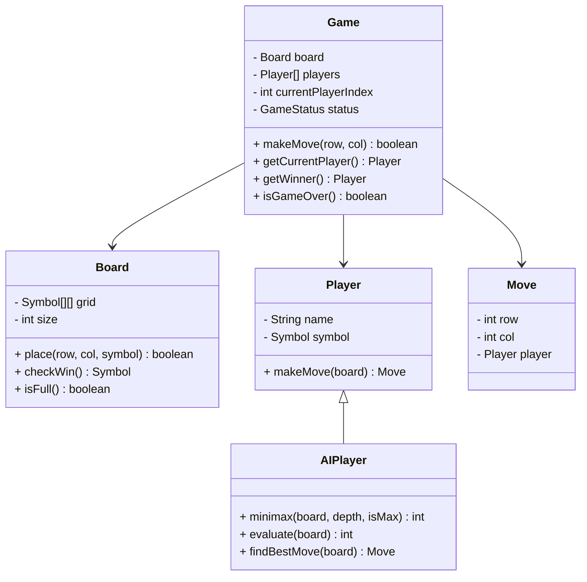

# ⭕ Tic-Tac-Toe Game - Problem Solution

## STEP 0: REQUIREMENTS QUICKPASS

### Core Functional Requirements
- Represent a game board (3x3 default, NxN configurable)
- Handle player turns (X and O)
- Validate moves (cell empty, within bounds)
- Check win conditions (row, column, diagonal)
- Detect draw conditions (board full, no winner)
- Support AI opponent using minimax algorithm

### Explicit Out-of-Scope Items
- Network multiplayer
- Game history/replay
- User accounts
- Tournament mode
- Custom symbols

### Assumptions and Constraints
- **Two Players**: X always goes first
- **Board Size**: 3x3 default
- **Win Condition**: N in a row (N = board size)
- **Turn-Based**: Synchronous play

### Public APIs
- `Game(boardSize)`: Create new game
- `makeMove(row, col)`: Place piece
- `getCurrentPlayer()`: Get whose turn
- `getWinner()`: Get winner (or null)
- `isGameOver()`: Check if game ended
- `getBoard()`: Get board state

### Public API Usage Examples
```java
// Example 1: Basic usage
Game game = new Game(3);
boolean moved = game.makeMove(0, 0);
System.out.println("Move successful: " + moved);
System.out.println("Current player: " + game.getCurrentPlayer());

// Example 2: Typical workflow
Game game = new Game(3);
Player player1 = new HumanPlayer("Alice", Symbol.X);
Player player2 = new HumanPlayer("Bob", Symbol.O);
game = new Game(player1, player2);
game.makeMove(0, 0);  // X's move
game.makeMove(1, 1);  // O's move
game.makeMove(0, 1);  // X's move
if (game.isGameOver()) {
    System.out.println("Winner: " + game.getWinner());
}

// Example 3: Edge case
Game game = new Game(3);
try {
    game.makeMove(-1, 0);  // Invalid row
} catch (IllegalArgumentException e) {
    System.out.println("Invalid move: " + e.getMessage());
}
game.makeMove(0, 0);
try {
    game.makeMove(0, 0);  // Cell already occupied
} catch (IllegalArgumentException e) {
    System.out.println("Cell occupied: " + e.getMessage());
}
```

### Invariants
- **Turn Alternation**: X, O, X, O...
- **Valid Moves Only**: Can't overwrite
- **Single Winner**: Game ends on win

---

## STEP 1: Complete Reference Solution (Answer Key)

### Class Diagram Overview



<details>
<summary>ASCII diagram (reference)</summary>

```text
┌─────────────────────────────────────────────────────────────────────────────────┐
│                           TIC-TAC-TOE GAME                                       │
├─────────────────────────────────────────────────────────────────────────────────┤
│                                                                                  │
│  ┌──────────────────────────────────────────────────────────────────────────┐   │
│  │                           Game                                            │   │
│  │                                                                           │   │
│  │  - board: Board                                                          │   │
│  │  - players: Player[]                                                     │   │
│  │  - currentPlayerIndex: int                                               │   │
│  │  - status: GameStatus                                                    │   │
│  │                                                                           │   │
│  │  + makeMove(row, col): boolean                                           │   │
│  │  + getCurrentPlayer(): Player                                            │   │
│  │  + getWinner(): Player                                                   │   │
│  │  + isGameOver(): boolean                                                 │   │
│  └──────────────────────────────────────────────────────────────────────────┘   │
│                          │                                                       │
│           ┌──────────────┼──────────────┬────────────────┐                      │
│           │              │              │                │                      │
│           ▼              ▼              ▼                ▼                      │
│  ┌─────────────┐  ┌─────────────┐  ┌─────────────┐  ┌─────────────┐            │
│  │    Board    │  │   Player    │  │  AIPlayer   │  │    Move     │            │
│  │             │  │             │  │             │  │             │            │
│  │ - grid[][]  │  │ - name      │  │ - minimax() │  │ - row       │            │
│  │ - size      │  │ - symbol    │  │ - evaluate()│  │ - col       │            │
│  │             │  │             │  │             │  │ - player    │            │
│  │ + place()   │  │ + makeMove()│  │ + findBest()│  └─────────────┘            │
│  │ + checkWin()│  └─────────────┘  └─────────────┘                             │
│  │ + isFull()  │                                                               │
│  └─────────────┘                                                               │
│                                                                                  │
└─────────────────────────────────────────────────────────────────────────────────┘
```

</details>

### Game Board Visualization

```
     0   1   2
   ┌───┬───┬───┐
 0 │ X │ O │ X │
   ├───┼───┼───┤
 1 │   │ X │ O │
   ├───┼───┼───┤
 2 │ O │   │ X │
   └───┴───┴───┘

Win Conditions:
- Rows: [0,0][0,1][0,2] or [1,0][1,1][1,2] or [2,0][2,1][2,2]
- Cols: [0,0][1,0][2,0] or [0,1][1,1][2,1] or [0,2][1,2][2,2]
- Diagonals: [0,0][1,1][2,2] or [0,2][1,1][2,0]
```

---

### Responsibilities Table

| Class | Owns | Why |
|-------|------|-----|
| `Board` | Game board state and win detection | Manages board state - encapsulates grid representation, symbol placement, and win condition checking |
| `Player` | Player identity (name, symbol) | Represents player - stores player information, separate from game logic |
| `AIPlayer` | AI move calculation (minimax algorithm) | Handles AI logic - encapsulates minimax algorithm and move evaluation, separate from human player |
| `Move` | Move representation (row, column, player) | Encapsulates move data - stores move information for game history and AI calculations |
| `Game` | Game flow coordination | Coordinates game workflow - separates game rules and turn management from board/player logic |

---

## STEP 4: Code Walkthrough - Building From Scratch

This section explains how an engineer builds this system from scratch, in the order code should be written.

### Phase 1: Understand the Problem

**What is Tic-Tac-Toe?**
- 3x3 grid (or NxN)
- Two players (X and O)
- Take turns placing symbols
- Win by getting 3 in a row (row, column, or diagonal)

**Key Challenges:**
- **Win detection**: Check all possible winning lines
- **AI opponent**: Make optimal moves
- **Extensibility**: Support different board sizes

---

### Phase 2: Design the Board

```java
// Step 1: Board representation
public class Board {
    private final int size;
    private final Symbol[][] grid;
    
    public Board(int size) {
        this.size = size;
        this.grid = new Symbol[size][size];
        // Initialize all cells to EMPTY
    }
}
```

```java
// Step 2: Place and remove symbols
public boolean placeSymbol(int row, int col, Symbol symbol) {
    if (!isValidPosition(row, col)) return false;
    if (grid[row][col] != Symbol.EMPTY) return false;
    
    grid[row][col] = symbol;
    moveCount++;
    return true;
}

public void removeSymbol(int row, int col) {
    grid[row][col] = Symbol.EMPTY;
    moveCount--;
}
```

---

### Phase 3: Implement Win Detection

```java
// Step 3: Check all winning lines
public boolean checkWin(Symbol symbol) {
    // Check rows
    for (int i = 0; i < size; i++) {
        if (checkLine(symbol, i, 0, 0, 1)) return true;
    }
    
    // Check columns
    for (int j = 0; j < size; j++) {
        if (checkLine(symbol, 0, j, 1, 0)) return true;
    }
    
    // Check diagonals
    if (checkLine(symbol, 0, 0, 1, 1)) return true;
    if (checkLine(symbol, 0, size-1, 1, -1)) return true;
    
    return false;
}

// Generic line checker
private boolean checkLine(Symbol symbol, int startRow, int startCol,
                         int rowDelta, int colDelta) {
    for (int i = 0; i < size; i++) {
        int row = startRow + i * rowDelta;
        int col = startCol + i * colDelta;
        if (grid[row][col] != symbol) return false;
    }
    return true;
}
```

**Why use deltas?**
```
Row check:    rowDelta=0, colDelta=1  → (0,0)(0,1)(0,2)
Column check: rowDelta=1, colDelta=0  → (0,0)(1,0)(2,0)
Diagonal:     rowDelta=1, colDelta=1  → (0,0)(1,1)(2,2)
Anti-diag:    rowDelta=1, colDelta=-1 → (0,2)(1,1)(2,0)
```

---

### Phase 4: Implement Minimax AI

```java
// Step 4: Find best move
public Move findBestMove(Board board) {
    int bestScore = Integer.MIN_VALUE;
    Move bestMove = null;
    
    for (int i = 0; i < board.getSize(); i++) {
        for (int j = 0; j < board.getSize(); j++) {
            if (board.isEmpty(i, j)) {
                // Try move
                board.placeSymbol(i, j, getSymbol());
                
                // Evaluate
                int score = minimax(board, 0, false, MIN, MAX);
                
                // Undo
                board.removeSymbol(i, j);
                
                if (score > bestScore) {
                    bestScore = score;
                    bestMove = new Move(i, j, getSymbol());
                }
            }
        }
    }
    return bestMove;
}
```

```java
// Step 5: Minimax with alpha-beta pruning
private int minimax(Board board, int depth, boolean isMaximizing,
                   int alpha, int beta) {
    // Terminal states
    if (board.checkWin(getSymbol())) return 10 - depth;
    if (board.checkWin(opponentSymbol)) return depth - 10;
    if (board.isFull()) return 0;
    
    if (isMaximizing) {
        int maxScore = Integer.MIN_VALUE;
        for (each empty cell) {
            board.placeSymbol(i, j, getSymbol());
            int score = minimax(board, depth+1, false, alpha, beta);
            board.removeSymbol(i, j);
            
            maxScore = Math.max(maxScore, score);
            alpha = Math.max(alpha, score);
            if (beta <= alpha) break;  // Prune
        }
        return maxScore;
    } else {
        int minScore = Integer.MAX_VALUE;
        for (each empty cell) {
            board.placeSymbol(i, j, opponentSymbol);
            int score = minimax(board, depth+1, true, alpha, beta);
            board.removeSymbol(i, j);
            
            minScore = Math.min(minScore, score);
            beta = Math.min(beta, score);
            if (beta <= alpha) break;  // Prune
        }
        return minScore;
    }
}
```

---

### Phase 5: Threading Model and Concurrency Control

**Threading Model:**

This is a **single-threaded game** design:
- Two players take turns (no concurrent moves)
- Game state is accessed sequentially
- No synchronization needed for basic gameplay

**If multi-threaded was needed (for AI computation in background):**

```java
public class AsyncAIPlayer {
    private final ExecutorService executor = Executors.newSingleThreadExecutor();
    
    public CompletableFuture<Move> findBestMoveAsync(Board board) {
        return CompletableFuture.supplyAsync(() -> {
            return minimaxSolver.findBestMove(board);
        }, executor);
    }
    
    public void shutdown() {
        executor.shutdown();
    }
}
```

---

## STEP 2: Complete Java Implementation

> **Verified:** This code compiles successfully with Java 11+.

### 2.1 Symbol and GameStatus Enums

```java
// Symbol.java
package com.tictactoe;

public enum Symbol {
    X('X'),
    O('O'),
    EMPTY(' ');
    
    private final char character;
    
    Symbol(char character) {
        this.character = character;
    }
    
    public char getCharacter() { return character; }
    
    @Override
    public String toString() {
        return String.valueOf(character);
    }
}
```

```java
// GameStatus.java
package com.tictactoe;

public enum GameStatus {
    IN_PROGRESS,
    X_WINS,
    O_WINS,
    DRAW
}
```

### 2.2 Move Class

```java
// Move.java
package com.tictactoe;

/**
 * Represents a move in the game.
 */
public class Move {
    
    private final int row;
    private final int col;
    private final Symbol symbol;
    
    public Move(int row, int col, Symbol symbol) {
        this.row = row;
        this.col = col;
        this.symbol = symbol;
    }
    
    public int getRow() { return row; }
    public int getCol() { return col; }
    public Symbol getSymbol() { return symbol; }
    
    @Override
    public String toString() {
        return String.format("%s at (%d, %d)", symbol, row, col);
    }
}
```

### 2.3 Board Class

```java
// Board.java
package com.tictactoe;

/**
 * Represents the game board.
 */
public class Board {
    
    private final int size;
    private final Symbol[][] grid;
    private int moveCount;
    
    public Board() {
        this(3);  // Default 3x3
    }
    
    public Board(int size) {
        this.size = size;
        this.grid = new Symbol[size][size];
        this.moveCount = 0;
        initializeBoard();
    }
    
    private void initializeBoard() {
        for (int i = 0; i < size; i++) {
            for (int j = 0; j < size; j++) {
                grid[i][j] = Symbol.EMPTY;
            }
        }
    }
    
    public boolean placeSymbol(int row, int col, Symbol symbol) {
        if (!isValidPosition(row, col)) {
            return false;
        }
        if (grid[row][col] != Symbol.EMPTY) {
            return false;
        }
        
        grid[row][col] = symbol;
        moveCount++;
        return true;
    }
    
    public void removeSymbol(int row, int col) {
        if (isValidPosition(row, col) && grid[row][col] != Symbol.EMPTY) {
            grid[row][col] = Symbol.EMPTY;
            moveCount--;
        }
    }
    
    public boolean isValidPosition(int row, int col) {
        return row >= 0 && row < size && col >= 0 && col < size;
    }
    
    public boolean isEmpty(int row, int col) {
        return isValidPosition(row, col) && grid[row][col] == Symbol.EMPTY;
    }
    
    public boolean isFull() {
        return moveCount == size * size;
    }
    
    public Symbol getSymbol(int row, int col) {
        if (!isValidPosition(row, col)) {
            return null;
        }
        return grid[row][col];
    }
    
    /**
     * Checks if the given symbol has won.
     */
    public boolean checkWin(Symbol symbol) {
        // Check rows
        for (int i = 0; i < size; i++) {
            if (checkLine(symbol, i, 0, 0, 1)) {
                return true;
            }
        }
        
        // Check columns
        for (int j = 0; j < size; j++) {
            if (checkLine(symbol, 0, j, 1, 0)) {
                return true;
            }
        }
        
        // Check main diagonal
        if (checkLine(symbol, 0, 0, 1, 1)) {
            return true;
        }
        
        // Check anti-diagonal
        if (checkLine(symbol, 0, size - 1, 1, -1)) {
            return true;
        }
        
        return false;
    }
    
    private boolean checkLine(Symbol symbol, int startRow, int startCol,
                             int rowDelta, int colDelta) {
        for (int i = 0; i < size; i++) {
            int row = startRow + i * rowDelta;
            int col = startCol + i * colDelta;
            if (grid[row][col] != symbol) {
                return false;
            }
        }
        return true;
    }
    
    public Board copy() {
        Board copy = new Board(size);
        for (int i = 0; i < size; i++) {
            for (int j = 0; j < size; j++) {
                copy.grid[i][j] = this.grid[i][j];
            }
        }
        copy.moveCount = this.moveCount;
        return copy;
    }
    
    public int getSize() { return size; }
    public int getMoveCount() { return moveCount; }
    
    public void print() {
        System.out.println();
        
        // Column headers
        System.out.print("    ");
        for (int j = 0; j < size; j++) {
            System.out.print(j + "   ");
        }
        System.out.println();
        
        // Top border
        System.out.print("  ┌");
        for (int j = 0; j < size; j++) {
            System.out.print("───");
            if (j < size - 1) System.out.print("┬");
        }
        System.out.println("┐");
        
        // Rows
        for (int i = 0; i < size; i++) {
            System.out.print(i + " │");
            for (int j = 0; j < size; j++) {
                System.out.print(" " + grid[i][j] + " ");
                if (j < size - 1) System.out.print("│");
            }
            System.out.println("│");
            
            // Row separator
            if (i < size - 1) {
                System.out.print("  ├");
                for (int j = 0; j < size; j++) {
                    System.out.print("───");
                    if (j < size - 1) System.out.print("┼");
                }
                System.out.println("┤");
            }
        }
        
        // Bottom border
        System.out.print("  └");
        for (int j = 0; j < size; j++) {
            System.out.print("───");
            if (j < size - 1) System.out.print("┴");
        }
        System.out.println("┘");
    }
}
```

### 2.4 Player Classes

```java
// Player.java
package com.tictactoe;

/**
 * Represents a player in the game.
 */
public class Player {
    
    private final String name;
    private final Symbol symbol;
    
    public Player(String name, Symbol symbol) {
        this.name = name;
        this.symbol = symbol;
    }
    
    public Move makeMove(Board board, int row, int col) {
        if (board.placeSymbol(row, col, symbol)) {
            return new Move(row, col, symbol);
        }
        return null;
    }
    
    public String getName() { return name; }
    public Symbol getSymbol() { return symbol; }
    
    @Override
    public String toString() {
        return name + " (" + symbol + ")";
    }
}
```

```java
// AIPlayer.java
package com.tictactoe;

/**
 * AI player using minimax algorithm.
 */
public class AIPlayer extends Player {
    
    private final Symbol opponentSymbol;
    
    public AIPlayer(String name, Symbol symbol) {
        super(name, symbol);
        this.opponentSymbol = (symbol == Symbol.X) ? Symbol.O : Symbol.X;
    }
    
    /**
     * Finds the best move using minimax algorithm.
     */
    public Move findBestMove(Board board) {
        int bestScore = Integer.MIN_VALUE;
        Move bestMove = null;
        
        for (int i = 0; i < board.getSize(); i++) {
            for (int j = 0; j < board.getSize(); j++) {
                if (board.isEmpty(i, j)) {
                    // Try this move
                    board.placeSymbol(i, j, getSymbol());
                    
                    // Calculate score using minimax
                    int score = minimax(board, 0, false, 
                                       Integer.MIN_VALUE, Integer.MAX_VALUE);
                    
                    // Undo move
                    board.removeSymbol(i, j);
                    
                    if (score > bestScore) {
                        bestScore = score;
                        bestMove = new Move(i, j, getSymbol());
                    }
                }
            }
        }
        
        return bestMove;
    }
    
    /**
     * Minimax algorithm with alpha-beta pruning.
     */
    private int minimax(Board board, int depth, boolean isMaximizing,
                       int alpha, int beta) {
        // Check terminal states
        if (board.checkWin(getSymbol())) {
            return 10 - depth;  // AI wins (prefer faster wins)
        }
        if (board.checkWin(opponentSymbol)) {
            return depth - 10;  // Opponent wins (prefer slower losses)
        }
        if (board.isFull()) {
            return 0;  // Draw
        }
        
        if (isMaximizing) {
            int maxScore = Integer.MIN_VALUE;
            
            for (int i = 0; i < board.getSize(); i++) {
                for (int j = 0; j < board.getSize(); j++) {
                    if (board.isEmpty(i, j)) {
                        board.placeSymbol(i, j, getSymbol());
                        int score = minimax(board, depth + 1, false, alpha, beta);
                        board.removeSymbol(i, j);
                        
                        maxScore = Math.max(maxScore, score);
                        alpha = Math.max(alpha, score);
                        
                        if (beta <= alpha) {
                            break;  // Beta cutoff
                        }
                    }
                }
            }
            return maxScore;
            
        } else {
            int minScore = Integer.MAX_VALUE;
            
            for (int i = 0; i < board.getSize(); i++) {
                for (int j = 0; j < board.getSize(); j++) {
                    if (board.isEmpty(i, j)) {
                        board.placeSymbol(i, j, opponentSymbol);
                        int score = minimax(board, depth + 1, true, alpha, beta);
                        board.removeSymbol(i, j);
                        
                        minScore = Math.min(minScore, score);
                        beta = Math.min(beta, score);
                        
                        if (beta <= alpha) {
                            break;  // Alpha cutoff
                        }
                    }
                }
            }
            return minScore;
        }
    }
    
    @Override
    public Move makeMove(Board board, int row, int col) {
        Move bestMove = findBestMove(board);
        if (bestMove != null) {
            board.placeSymbol(bestMove.getRow(), bestMove.getCol(), getSymbol());
        }
        return bestMove;
    }
}
```

### 2.5 Game Class

```java
// Game.java
package com.tictactoe;

import java.util.*;

/**
 * Main game controller.
 */
public class Game {
    
    private final Board board;
    private final Player[] players;
    private int currentPlayerIndex;
    private GameStatus status;
    private final List<Move> moveHistory;
    
    public Game(Player player1, Player player2) {
        this(player1, player2, 3);
    }
    
    public Game(Player player1, Player player2, int boardSize) {
        this.board = new Board(boardSize);
        this.players = new Player[]{player1, player2};
        this.currentPlayerIndex = 0;
        this.status = GameStatus.IN_PROGRESS;
        this.moveHistory = new ArrayList<>();
    }
    
    public boolean makeMove(int row, int col) {
        if (status != GameStatus.IN_PROGRESS) {
            return false;
        }
        
        Player currentPlayer = getCurrentPlayer();
        Move move;
        
        if (currentPlayer instanceof AIPlayer) {
            move = ((AIPlayer) currentPlayer).makeMove(board, row, col);
        } else {
            move = currentPlayer.makeMove(board, row, col);
        }
        
        if (move == null) {
            return false;
        }
        
        moveHistory.add(move);
        updateGameStatus();
        
        if (status == GameStatus.IN_PROGRESS) {
            switchPlayer();
        }
        
        return true;
    }
    
    public Move makeAIMove() {
        if (status != GameStatus.IN_PROGRESS) {
            return null;
        }
        
        Player currentPlayer = getCurrentPlayer();
        if (!(currentPlayer instanceof AIPlayer)) {
            return null;
        }
        
        Move move = ((AIPlayer) currentPlayer).findBestMove(board);
        if (move != null) {
            board.placeSymbol(move.getRow(), move.getCol(), move.getSymbol());
            moveHistory.add(move);
            updateGameStatus();
            
            if (status == GameStatus.IN_PROGRESS) {
                switchPlayer();
            }
        }
        
        return move;
    }
    
    private void updateGameStatus() {
        Player currentPlayer = getCurrentPlayer();
        
        if (board.checkWin(currentPlayer.getSymbol())) {
            status = currentPlayer.getSymbol() == Symbol.X ? 
                     GameStatus.X_WINS : GameStatus.O_WINS;
        } else if (board.isFull()) {
            status = GameStatus.DRAW;
        }
    }
    
    private void switchPlayer() {
        currentPlayerIndex = 1 - currentPlayerIndex;
    }
    
    public Player getCurrentPlayer() {
        return players[currentPlayerIndex];
    }
    
    public Player getWinner() {
        if (status == GameStatus.X_WINS) {
            return players[0].getSymbol() == Symbol.X ? players[0] : players[1];
        } else if (status == GameStatus.O_WINS) {
            return players[0].getSymbol() == Symbol.O ? players[0] : players[1];
        }
        return null;
    }
    
    public boolean isGameOver() {
        return status != GameStatus.IN_PROGRESS;
    }
    
    public Board getBoard() { return board; }
    public GameStatus getStatus() { return status; }
    public List<Move> getMoveHistory() { return Collections.unmodifiableList(moveHistory); }
    
    public void printBoard() {
        board.print();
    }
    
    public void printStatus() {
        System.out.println("\nGame Status: " + status);
        if (status == GameStatus.IN_PROGRESS) {
            System.out.println("Current Player: " + getCurrentPlayer());
        } else if (getWinner() != null) {
            System.out.println("Winner: " + getWinner());
        }
    }
}
```

### 2.6 Demo Application

```java
// TicTacToeDemo.java
package com.tictactoe;

import java.util.Scanner;

public class TicTacToeDemo {
    
    public static void main(String[] args) {
        System.out.println("=== TIC-TAC-TOE GAME ===\n");
        
        // Demo 1: Human vs Human
        System.out.println("===== DEMO 1: Human vs Human =====\n");
        demoHumanVsHuman();
        
        // Demo 2: Human vs AI
        System.out.println("\n===== DEMO 2: Human vs AI =====\n");
        demoHumanVsAI();
        
        // Demo 3: AI vs AI
        System.out.println("\n===== DEMO 3: AI vs AI =====\n");
        demoAIVsAI();
    }
    
    private static void demoHumanVsHuman() {
        Player player1 = new Player("Alice", Symbol.X);
        Player player2 = new Player("Bob", Symbol.O);
        Game game = new Game(player1, player2);
        
        // Simulate a game
        int[][] moves = {
            {1, 1},  // X center
            {0, 0},  // O corner
            {0, 2},  // X
            {2, 0},  // O
            {2, 2},  // X
            {1, 0},  // O
            {0, 1}   // X wins!
        };
        
        for (int[] move : moves) {
            if (game.isGameOver()) break;
            
            System.out.println(game.getCurrentPlayer().getName() + " plays:");
            game.makeMove(move[0], move[1]);
            game.printBoard();
        }
        
        game.printStatus();
    }
    
    private static void demoHumanVsAI() {
        Player human = new Player("Human", Symbol.X);
        AIPlayer ai = new AIPlayer("AI", Symbol.O);
        Game game = new Game(human, ai);
        
        // Human makes first move
        System.out.println("Human plays center:");
        game.makeMove(1, 1);
        game.printBoard();
        
        // AI responds
        System.out.println("\nAI thinking...");
        Move aiMove = game.makeAIMove();
        System.out.println("AI plays: " + aiMove);
        game.printBoard();
        
        // Human plays corner
        System.out.println("\nHuman plays corner:");
        game.makeMove(0, 0);
        game.printBoard();
        
        // AI responds
        System.out.println("\nAI thinking...");
        aiMove = game.makeAIMove();
        System.out.println("AI plays: " + aiMove);
        game.printBoard();
        
        // Continue until game over
        while (!game.isGameOver()) {
            if (game.getCurrentPlayer() instanceof AIPlayer) {
                System.out.println("\nAI thinking...");
                aiMove = game.makeAIMove();
                System.out.println("AI plays: " + aiMove);
            } else {
                // Find first empty spot for human
                for (int i = 0; i < 3; i++) {
                    for (int j = 0; j < 3; j++) {
                        if (game.getBoard().isEmpty(i, j)) {
                            System.out.println("\nHuman plays:");
                            game.makeMove(i, j);
                            i = j = 3;  // Break both loops
                        }
                    }
                }
            }
            game.printBoard();
        }
        
        game.printStatus();
    }
    
    private static void demoAIVsAI() {
        AIPlayer ai1 = new AIPlayer("AI-X", Symbol.X);
        AIPlayer ai2 = new AIPlayer("AI-O", Symbol.O);
        Game game = new Game(ai1, ai2);
        
        System.out.println("AI vs AI - Perfect play should result in draw\n");
        
        int moveNum = 1;
        while (!game.isGameOver()) {
            Move move = game.makeAIMove();
            System.out.println("Move " + moveNum++ + ": " + 
                              game.getMoveHistory().get(game.getMoveHistory().size() - 1));
            game.printBoard();
            System.out.println();
        }
        
        game.printStatus();
    }
}
```

---

## File Structure

```
com/tictactoe/
├── Symbol.java
├── GameStatus.java
├── Move.java
├── Board.java
├── Player.java
├── AIPlayer.java
├── Game.java
└── TicTacToeDemo.java
```

