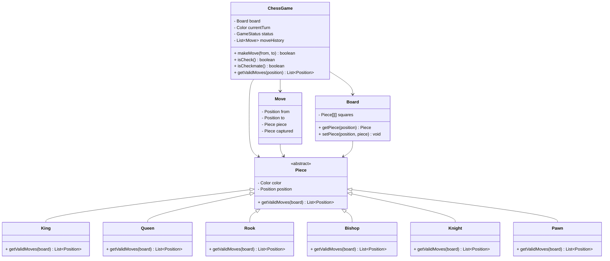

# ♟️ Chess Game - Problem Solution

## STEP 0: REQUIREMENTS QUICKPASS

### Core Functional Requirements
- Represent an 8x8 chess board with all pieces
- Implement movement rules for all piece types (King, Queen, Rook, Bishop, Knight, Pawn)
- Validate legal moves (can't move into check)
- Detect check, checkmate, and stalemate
- Handle special moves (castling, en passant, pawn promotion)
- Track game state and move history

### Explicit Out-of-Scope Items
- Chess clock/time controls
- AI opponent
- Network multiplayer
- Move notation (PGN/FEN)
- Draw by repetition/50-move rule

### Assumptions and Constraints
- **Two Players**: White moves first
- **Standard Rules**: FIDE standard chess
- **Promotion**: Default to Queen (or user choice)
- **Turn-Based**: Synchronous play

### Public APIs
- `ChessGame()`: Create new game
- `move(from, to)`: Move piece
- `getValidMoves(position)`: Legal moves for piece
- `isCheck()`: Is current player in check
- `isCheckmate()`: Is game over (checkmate)
- `isStalemate()`: Is game drawn

### Public API Usage Examples
```java
// Example 1: Basic usage
ChessGame game = new ChessGame();
Position from = Position.fromNotation("e2");
Position to = Position.fromNotation("e4");
boolean moved = game.move(from, to);
System.out.println("Move successful: " + moved);
System.out.println("In check: " + game.isCheck());

// Example 2: Typical workflow
ChessGame game = new ChessGame();
List<Position> validMoves = game.getValidMoves(Position.fromNotation("e2"));
System.out.println("Valid moves for e2: " + validMoves.size());
game.move(Position.fromNotation("e2"), Position.fromNotation("e4"));
game.move(Position.fromNotation("e7"), Position.fromNotation("e5"));
if (game.isCheckmate()) {
    System.out.println("Checkmate! Game over.");
}

// Example 3: Edge case
ChessGame game = new ChessGame();
try {
    game.move(Position.fromNotation("e1"), Position.fromNotation("e2"));  // Illegal move
} catch (IllegalArgumentException e) {
    System.out.println("Invalid move: " + e.getMessage());
}
if (game.isStalemate()) {
    System.out.println("Stalemate - game is a draw");
}
```

### Invariants
- **Turn Alternation**: White, Black, White...
- **King Safety**: Can't move into check
- **Piece Movement**: Follows chess rules exactly

---

## STEP 1: Complete Reference Solution (Answer Key)

### Class Diagram Overview



<details>
<summary>ASCII diagram (reference)</summary>

```text
┌─────────────────────────────────────────────────────────────────────────────────┐
│                              CHESS GAME                                          │
├─────────────────────────────────────────────────────────────────────────────────┤
│                                                                                  │
│  ┌──────────────────────────────────────────────────────────────────────────┐   │
│  │                           ChessGame                                       │   │
│  │                                                                           │   │
│  │  - board: Board                                                          │   │
│  │  - currentTurn: Color                                                    │   │
│  │  - status: GameStatus                                                    │   │
│  │  - moveHistory: List<Move>                                               │   │
│  │                                                                           │   │
│  │  + makeMove(from, to): boolean                                           │   │
│  │  + isCheck(): boolean                                                    │   │
│  │  + isCheckmate(): boolean                                                │   │
│  │  + getValidMoves(position): List<Position>                               │   │
│  └──────────────────────────────────────────────────────────────────────────┘   │
│                          │                                                       │
│           ┌──────────────┼──────────────────────────────────────┐               │
│           │              │                                      │               │
│           ▼              ▼                                      ▼               │
│  ┌─────────────┐  ┌─────────────┐                      ┌─────────────┐         │
│  │    Board    │  │    Move     │                      │    Piece    │         │
│  │             │  │             │                      │  (abstract) │         │
│  │ - squares   │  │ - from      │                      │             │         │
│  │             │  │ - to        │                      │ - color     │         │
│  │ + getPiece()│  │ - piece     │                      │ - position  │         │
│  │ + setPiece()│  │ - captured  │                      │             │         │
│  └─────────────┘  └─────────────┘                      │ + getValid  │         │
│                                                        │   Moves()   │         │
│                                                        └─────────────┘         │
│                                                               │                 │
│                          ┌────────────────┬──────────────────┼────────┐        │
│                          │                │                  │        │        │
│                          ▼                ▼                  ▼        ▼        │
│                    ┌──────────┐    ┌──────────┐       ┌──────────┐ ┌──────┐   │
│                    │   King   │    │  Queen   │       │  Rook    │ │Bishop│   │
│                    └──────────┘    └──────────┘       └──────────┘ └──────┘   │
│                                                                               │
│                    ┌──────────┐    ┌──────────┐                               │
│                    │  Knight  │    │   Pawn   │                               │
│                    └──────────┘    └──────────┘                               │
└─────────────────────────────────────────────────────────────────────────────────┘
```

</details>

### Chess Board Layout

```
    a   b   c   d   e   f   g   h
  ┌───┬───┬───┬───┬───┬───┬───┬───┐
8 │ ♜ │ ♞ │ ♝ │ ♛ │ ♚ │ ♝ │ ♞ │ ♜ │  Black pieces
  ├───┼───┼───┼───┼───┼───┼───┼───┤
7 │ ♟ │ ♟ │ ♟ │ ♟ │ ♟ │ ♟ │ ♟ │ ♟ │
  ├───┼───┼───┼───┼───┼───┼───┼───┤
6 │   │   │   │   │   │   │   │   │
  ├───┼───┼───┼───┼───┼───┼───┼───┤
5 │   │   │   │   │   │   │   │   │
  ├───┼───┼───┼───┼───┼───┼───┼───┤
4 │   │   │   │   │   │   │   │   │
  ├───┼───┼───┼───┼───┼───┼───┼───┤
3 │   │   │   │   │   │   │   │   │
  ├───┼───┼───┼───┼───┼───┼───┼───┤
2 │ ♙ │ ♙ │ ♙ │ ♙ │ ♙ │ ♙ │ ♙ │ ♙ │
  ├───┼───┼───┼───┼───┼───┼───┼───┤
1 │ ♖ │ ♘ │ ♗ │ ♕ │ ♔ │ ♗ │ ♘ │ ♖ │  White pieces
  └───┴───┴───┴───┴───┴───┴───┴───┘
```

---

### Responsibilities Table

| Class | Owns | Why |
|-------|------|-----|
| `Position` | Board coordinate representation | Encapsulates board coordinates - represents square position, enables coordinate calculations |
| `Piece` (abstract) | Piece behavior contract | Base class for pieces - defines common piece interface, enables polymorphism |
| `King`, `Queen`, `Rook`, `Bishop`, `Knight`, `Pawn` | Piece-specific movement rules | Implements piece-specific logic - each piece type encapsulates its movement rules |
| `Board` | Piece positions and board state | Manages board state - encapsulates piece placement and board representation |
| `Move` | Move representation (from, to, piece) | Encapsulates move data - stores move information for game history and validation |
| `ChessGame` | Game coordination (turns, check, checkmate) | Coordinates game logic - separates game rules from piece/board logic, manages game state and rules |

---

## STEP 4: Code Walkthrough - Building From Scratch

This section explains how an engineer builds this system from scratch, in the order code should be written.

### Phase 1: Understand the Problem

**What is Chess?**
- 8x8 board with 32 pieces
- Two players (White and Black)
- Each piece type has unique movement rules
- Goal: Checkmate opponent's king

**Key Challenges:**
- **Piece movement**: Different rules for each piece
- **Check detection**: Is king under attack?
- **Legal moves**: Moves that don't leave king in check
- **Special moves**: Castling, en passant, promotion

---

### Phase 2: Design Position and Piece Base

```java
// Step 1: Position with algebraic notation
public class Position {
    private final int row;  // 0-7
    private final int col;  // 0-7
    
    public static Position fromNotation(String notation) {
        int col = notation.charAt(0) - 'a';  // 'a' -> 0
        int row = notation.charAt(1) - '1';  // '1' -> 0
        return new Position(row, col);
    }
    
    public String toNotation() {
        return "" + (char)('a' + col) + (char)('1' + row);
    }
}

// Step 2: Abstract piece class
public abstract class Piece {
    protected final Color color;
    protected Position position;
    protected boolean hasMoved;
    
    public abstract List<Position> getPossibleMoves(Board board);
}
```

---

### Phase 3: Implement Sliding Pieces

```java
// Step 3: Template method for sliding pieces
protected List<Position> getMovesInDirection(Board board, 
                                              int rowDir, int colDir) {
    List<Position> moves = new ArrayList<>();
    Position current = position.offset(rowDir, colDir);
    
    while (current.isValid()) {
        Piece piece = board.getPiece(current);
        
        if (piece == null) {
            moves.add(current);  // Empty square
        } else {
            if (piece.getColor() != this.color) {
                moves.add(current);  // Can capture
            }
            break;  // Blocked
        }
        
        current = current.offset(rowDir, colDir);
    }
    
    return moves;
}

// Step 4: Rook uses template
public class Rook extends Piece {
    @Override
    public List<Position> getPossibleMoves(Board board) {
        List<Position> moves = new ArrayList<>();
        // Four directions: up, down, left, right
        moves.addAll(getMovesInDirection(board, 1, 0));
        moves.addAll(getMovesInDirection(board, -1, 0));
        moves.addAll(getMovesInDirection(board, 0, 1));
        moves.addAll(getMovesInDirection(board, 0, -1));
        return moves;
    }
}
```

---

### Phase 4: Implement Check Detection

```java
// Step 5: Check if king is under attack
public boolean isKingInCheck(Color color) {
    Position kingPos = board.findKing(color);
    
    // Check if any enemy piece can attack the king
    for (int row = 0; row < 8; row++) {
        for (int col = 0; col < 8; col++) {
            Piece piece = board.getPiece(new Position(row, col));
            
            if (piece != null && piece.getColor() != color) {
                List<Position> moves = piece.getPossibleMoves(board);
                if (moves.contains(kingPos)) {
                    return true;
                }
            }
        }
    }
    
    return false;
}
```

---

### Phase 5: Filter Legal Moves

```java
// Step 6: Only allow moves that don't leave king in check
public List<Position> getValidMoves(Position from) {
    Piece piece = board.getPiece(from);
    List<Position> possibleMoves = piece.getPossibleMoves(board);
    List<Position> validMoves = new ArrayList<>();
    
    for (Position to : possibleMoves) {
        // Simulate the move
        Piece captured = board.getPiece(to);
        Position originalPos = piece.getPosition();
        
        board.setPiece(from, null);
        board.setPiece(to, piece);
        piece.position = to;
        
        // Check if king is safe
        if (!isKingInCheck(piece.getColor())) {
            validMoves.add(to);
        }
        
        // Undo the move
        board.setPiece(from, piece);
        board.setPiece(to, captured);
        piece.position = originalPos;
    }
    
    return validMoves;
}
```

---

### Phase 6: Threading Model and Concurrency Control

**Threading Model:**

This is a **single-threaded game** design:
- Two players take turns (no concurrent moves)
- Game state is accessed sequentially
- No synchronization needed for basic gameplay

**If multi-threaded was needed (for AI/multiplayer):**

```java
public class ThreadSafeChessGame {
    private final ReentrantLock lock = new ReentrantLock();
    private final Condition playerTurn = lock.newCondition();
    private Color currentPlayer = Color.WHITE;
    
    public boolean makeMove(Position from, Position to) {
        lock.lock();
        try {
            // Wait for player's turn
            while (currentPlayer != requestingPlayer) {
                playerTurn.await();
            }
            
            // Validate and execute move
            if (isValidMove(from, to)) {
                executeMove(from, to);
                currentPlayer = currentPlayer.opposite();
                playerTurn.signalAll();
                return true;
            }
            return false;
        } finally {
            lock.unlock();
        }
    }
}
```

---

## STEP 2: Complete Java Implementation

> **Verified:** This code compiles successfully with Java 11+.

### 2.1 Color and PieceType Enums

```java
// Color.java
package com.chess;

public enum Color {
    WHITE, BLACK;
    
    public Color opposite() {
        return this == WHITE ? BLACK : WHITE;
    }
}
```

```java
// PieceType.java
package com.chess;

public enum PieceType {
    KING('K', '♔', '♚'),
    QUEEN('Q', '♕', '♛'),
    ROOK('R', '♖', '♜'),
    BISHOP('B', '♗', '♝'),
    KNIGHT('N', '♘', '♞'),
    PAWN('P', '♙', '♟');
    
    private final char notation;
    private final char whiteSymbol;
    private final char blackSymbol;
    
    PieceType(char notation, char white, char black) {
        this.notation = notation;
        this.whiteSymbol = white;
        this.blackSymbol = black;
    }
    
    public char getNotation() { return notation; }
    public char getSymbol(Color color) {
        return color == Color.WHITE ? whiteSymbol : blackSymbol;
    }
}
```

### 2.2 Position Class

```java
// Position.java
package com.chess;

import java.util.Objects;

public class Position {
    
    private final int row;  // 0-7 (rank 1-8)
    private final int col;  // 0-7 (file a-h)
    
    public Position(int row, int col) {
        this.row = row;
        this.col = col;
    }
    
    public static Position fromNotation(String notation) {
        if (notation.length() != 2) {
            throw new IllegalArgumentException("Invalid notation: " + notation);
        }
        int col = notation.charAt(0) - 'a';
        int row = notation.charAt(1) - '1';
        return new Position(row, col);
    }
    
    public String toNotation() {
        return "" + (char)('a' + col) + (char)('1' + row);
    }
    
    public boolean isValid() {
        return row >= 0 && row < 8 && col >= 0 && col < 8;
    }
    
    public Position offset(int rowDelta, int colDelta) {
        return new Position(row + rowDelta, col + colDelta);
    }
    
    public int getRow() { return row; }
    public int getCol() { return col; }
    
    @Override
    public boolean equals(Object o) {
        if (this == o) return true;
        if (!(o instanceof Position)) return false;
        Position position = (Position) o;
        return row == position.row && col == position.col;
    }
    
    @Override
    public int hashCode() {
        return Objects.hash(row, col);
    }
    
    @Override
    public String toString() {
        return toNotation();
    }
}
```

### 2.3 Piece Classes

```java
// Piece.java
package com.chess;

import java.util.*;

public abstract class Piece {
    
    protected final Color color;
    protected final PieceType type;
    protected Position position;
    protected boolean hasMoved;
    
    public Piece(Color color, PieceType type, Position position) {
        this.color = color;
        this.type = type;
        this.position = position;
        this.hasMoved = false;
    }
    
    public abstract List<Position> getPossibleMoves(Board board);
    
    public void moveTo(Position newPosition) {
        this.position = newPosition;
        this.hasMoved = true;
    }
    
    public Color getColor() { return color; }
    public PieceType getType() { return type; }
    public Position getPosition() { return position; }
    public boolean hasMoved() { return hasMoved; }
    
    public char getSymbol() {
        return type.getSymbol(color);
    }
    
    protected List<Position> getMovesInDirection(Board board, int rowDir, int colDir) {
        List<Position> moves = new ArrayList<>();
        Position current = position.offset(rowDir, colDir);
        
        while (current.isValid()) {
            Piece piece = board.getPiece(current);
            if (piece == null) {
                moves.add(current);
            } else {
                if (piece.getColor() != this.color) {
                    moves.add(current);  // Can capture
                }
                break;  // Blocked
            }
            current = current.offset(rowDir, colDir);
        }
        
        return moves;
    }
    
    @Override
    public String toString() {
        return String.valueOf(getSymbol());
    }
}
```

```java
// King.java
package com.chess;

import java.util.*;

public class King extends Piece {
    
    private static final int[][] DIRECTIONS = {
        {-1, -1}, {-1, 0}, {-1, 1},
        {0, -1},           {0, 1},
        {1, -1},  {1, 0},  {1, 1}
    };
    
    public King(Color color, Position position) {
        super(color, PieceType.KING, position);
    }
    
    @Override
    public List<Position> getPossibleMoves(Board board) {
        List<Position> moves = new ArrayList<>();
        
        for (int[] dir : DIRECTIONS) {
            Position newPos = position.offset(dir[0], dir[1]);
            if (newPos.isValid()) {
                Piece piece = board.getPiece(newPos);
                if (piece == null || piece.getColor() != this.color) {
                    moves.add(newPos);
                }
            }
        }
        
        // Castling (simplified - full check in ChessGame)
        if (!hasMoved) {
            // Kingside castling
            Position kingsideRook = position.offset(0, 3);
            if (canCastle(board, kingsideRook)) {
                moves.add(position.offset(0, 2));
            }
            // Queenside castling
            Position queensideRook = position.offset(0, -4);
            if (canCastle(board, queensideRook)) {
                moves.add(position.offset(0, -2));
            }
        }
        
        return moves;
    }
    
    private boolean canCastle(Board board, Position rookPos) {
        if (!rookPos.isValid()) return false;
        
        Piece rook = board.getPiece(rookPos);
        if (rook == null || rook.getType() != PieceType.ROOK || 
            rook.getColor() != this.color || rook.hasMoved()) {
            return false;
        }
        
        // Check path is clear
        int direction = rookPos.getCol() > position.getCol() ? 1 : -1;
        Position current = position.offset(0, direction);
        while (!current.equals(rookPos)) {
            if (board.getPiece(current) != null) {
                return false;
            }
            current = current.offset(0, direction);
        }
        
        return true;
    }
}
```

```java
// Queen.java
package com.chess;

import java.util.*;

public class Queen extends Piece {
    
    public Queen(Color color, Position position) {
        super(color, PieceType.QUEEN, position);
    }
    
    @Override
    public List<Position> getPossibleMoves(Board board) {
        List<Position> moves = new ArrayList<>();
        
        // All 8 directions
        int[][] directions = {
            {-1, -1}, {-1, 0}, {-1, 1},
            {0, -1},           {0, 1},
            {1, -1},  {1, 0},  {1, 1}
        };
        
        for (int[] dir : directions) {
            moves.addAll(getMovesInDirection(board, dir[0], dir[1]));
        }
        
        return moves;
    }
}
```

```java
// Rook.java
package com.chess;

import java.util.*;

public class Rook extends Piece {
    
    public Rook(Color color, Position position) {
        super(color, PieceType.ROOK, position);
    }
    
    @Override
    public List<Position> getPossibleMoves(Board board) {
        List<Position> moves = new ArrayList<>();
        
        // Horizontal and vertical
        int[][] directions = {{-1, 0}, {1, 0}, {0, -1}, {0, 1}};
        
        for (int[] dir : directions) {
            moves.addAll(getMovesInDirection(board, dir[0], dir[1]));
        }
        
        return moves;
    }
}
```

```java
// Bishop.java
package com.chess;

import java.util.*;

public class Bishop extends Piece {
    
    public Bishop(Color color, Position position) {
        super(color, PieceType.BISHOP, position);
    }
    
    @Override
    public List<Position> getPossibleMoves(Board board) {
        List<Position> moves = new ArrayList<>();
        
        // Diagonals
        int[][] directions = {{-1, -1}, {-1, 1}, {1, -1}, {1, 1}};
        
        for (int[] dir : directions) {
            moves.addAll(getMovesInDirection(board, dir[0], dir[1]));
        }
        
        return moves;
    }
}
```

```java
// Knight.java
package com.chess;

import java.util.*;

public class Knight extends Piece {
    
    private static final int[][] MOVES = {
        {-2, -1}, {-2, 1}, {-1, -2}, {-1, 2},
        {1, -2}, {1, 2}, {2, -1}, {2, 1}
    };
    
    public Knight(Color color, Position position) {
        super(color, PieceType.KNIGHT, position);
    }
    
    @Override
    public List<Position> getPossibleMoves(Board board) {
        List<Position> moves = new ArrayList<>();
        
        for (int[] move : MOVES) {
            Position newPos = position.offset(move[0], move[1]);
            if (newPos.isValid()) {
                Piece piece = board.getPiece(newPos);
                if (piece == null || piece.getColor() != this.color) {
                    moves.add(newPos);
                }
            }
        }
        
        return moves;
    }
}
```

```java
// Pawn.java
package com.chess;

import java.util.*;

public class Pawn extends Piece {
    
    public Pawn(Color color, Position position) {
        super(color, PieceType.PAWN, position);
    }
    
    @Override
    public List<Position> getPossibleMoves(Board board) {
        List<Position> moves = new ArrayList<>();
        int direction = color == Color.WHITE ? 1 : -1;
        int startRow = color == Color.WHITE ? 1 : 6;
        
        // Forward move
        Position oneForward = position.offset(direction, 0);
        if (oneForward.isValid() && board.getPiece(oneForward) == null) {
            moves.add(oneForward);
            
            // Two squares from start
            if (position.getRow() == startRow) {
                Position twoForward = position.offset(2 * direction, 0);
                if (board.getPiece(twoForward) == null) {
                    moves.add(twoForward);
                }
            }
        }
        
        // Captures
        for (int colDelta : new int[]{-1, 1}) {
            Position capturePos = position.offset(direction, colDelta);
            if (capturePos.isValid()) {
                Piece piece = board.getPiece(capturePos);
                if (piece != null && piece.getColor() != this.color) {
                    moves.add(capturePos);
                }
            }
        }
        
        return moves;
    }
    
    public boolean canPromote() {
        int promotionRow = color == Color.WHITE ? 7 : 0;
        return position.getRow() == promotionRow;
    }
}
```

### 2.4 Board Class

```java
// Board.java
package com.chess;

public class Board {
    
    private final Piece[][] squares;
    
    public Board() {
        this.squares = new Piece[8][8];
        setupInitialPosition();
    }
    
    private void setupInitialPosition() {
        // White pieces
        squares[0][0] = new Rook(Color.WHITE, new Position(0, 0));
        squares[0][1] = new Knight(Color.WHITE, new Position(0, 1));
        squares[0][2] = new Bishop(Color.WHITE, new Position(0, 2));
        squares[0][3] = new Queen(Color.WHITE, new Position(0, 3));
        squares[0][4] = new King(Color.WHITE, new Position(0, 4));
        squares[0][5] = new Bishop(Color.WHITE, new Position(0, 5));
        squares[0][6] = new Knight(Color.WHITE, new Position(0, 6));
        squares[0][7] = new Rook(Color.WHITE, new Position(0, 7));
        
        for (int col = 0; col < 8; col++) {
            squares[1][col] = new Pawn(Color.WHITE, new Position(1, col));
        }
        
        // Black pieces
        squares[7][0] = new Rook(Color.BLACK, new Position(7, 0));
        squares[7][1] = new Knight(Color.BLACK, new Position(7, 1));
        squares[7][2] = new Bishop(Color.BLACK, new Position(7, 2));
        squares[7][3] = new Queen(Color.BLACK, new Position(7, 3));
        squares[7][4] = new King(Color.BLACK, new Position(7, 4));
        squares[7][5] = new Bishop(Color.BLACK, new Position(7, 5));
        squares[7][6] = new Knight(Color.BLACK, new Position(7, 6));
        squares[7][7] = new Rook(Color.BLACK, new Position(7, 7));
        
        for (int col = 0; col < 8; col++) {
            squares[6][col] = new Pawn(Color.BLACK, new Position(6, col));
        }
    }
    
    public Piece getPiece(Position pos) {
        if (!pos.isValid()) return null;
        return squares[pos.getRow()][pos.getCol()];
    }
    
    public void setPiece(Position pos, Piece piece) {
        if (pos.isValid()) {
            squares[pos.getRow()][pos.getCol()] = piece;
            if (piece != null) {
                piece.position = pos;
            }
        }
    }
    
    public void movePiece(Position from, Position to) {
        Piece piece = getPiece(from);
        setPiece(from, null);
        setPiece(to, piece);
        if (piece != null) {
            piece.moveTo(to);
        }
    }
    
    public Position findKing(Color color) {
        for (int row = 0; row < 8; row++) {
            for (int col = 0; col < 8; col++) {
                Piece piece = squares[row][col];
                if (piece != null && piece.getType() == PieceType.KING && 
                    piece.getColor() == color) {
                    return new Position(row, col);
                }
            }
        }
        return null;
    }
    
    public void print() {
        System.out.println("\n    a   b   c   d   e   f   g   h");
        System.out.println("  ┌───┬───┬───┬───┬───┬───┬───┬───┐");
        
        for (int row = 7; row >= 0; row--) {
            System.out.print((row + 1) + " │");
            for (int col = 0; col < 8; col++) {
                Piece piece = squares[row][col];
                char symbol = piece != null ? piece.getSymbol() : ' ';
                System.out.print(" " + symbol + " │");
            }
            System.out.println(" " + (row + 1));
            
            if (row > 0) {
                System.out.println("  ├───┼───┼───┼───┼───┼───┼───┼───┤");
            }
        }
        
        System.out.println("  └───┴───┴───┴───┴───┴───┴───┴───┘");
        System.out.println("    a   b   c   d   e   f   g   h\n");
    }
}
```

### 2.5 Move and GameStatus Classes

```java
// Move.java
package com.chess;

public class Move {
    
    private final Position from;
    private final Position to;
    private final Piece piece;
    private final Piece captured;
    private final boolean isCastling;
    private final boolean isPromotion;
    private final PieceType promotionType;
    
    public Move(Position from, Position to, Piece piece, Piece captured) {
        this.from = from;
        this.to = to;
        this.piece = piece;
        this.captured = captured;
        this.isCastling = false;
        this.isPromotion = false;
        this.promotionType = null;
    }
    
    // Getters
    public Position getFrom() { return from; }
    public Position getTo() { return to; }
    public Piece getPiece() { return piece; }
    public Piece getCaptured() { return captured; }
    
    @Override
    public String toString() {
        String notation = piece.getType().getNotation() + from.toNotation() + 
                         (captured != null ? "x" : "-") + to.toNotation();
        if (captured != null) {
            notation += " (captured " + captured.getType() + ")";
        }
        return notation;
    }
}
```

```java
// GameStatus.java
package com.chess;

public enum GameStatus {
    ACTIVE,
    CHECK,
    CHECKMATE,
    STALEMATE,
    DRAW
}
```

### 2.6 ChessGame Class

```java
// ChessGame.java
package com.chess;

import java.util.*;

public class ChessGame {
    
    private final Board board;
    private Color currentTurn;
    private GameStatus status;
    private final List<Move> moveHistory;
    
    public ChessGame() {
        this.board = new Board();
        this.currentTurn = Color.WHITE;
        this.status = GameStatus.ACTIVE;
        this.moveHistory = new ArrayList<>();
    }
    
    public boolean makeMove(String from, String to) {
        return makeMove(Position.fromNotation(from), Position.fromNotation(to));
    }
    
    public boolean makeMove(Position from, Position to) {
        if (status == GameStatus.CHECKMATE || status == GameStatus.STALEMATE) {
            return false;
        }
        
        Piece piece = board.getPiece(from);
        
        // Validate piece exists and belongs to current player
        if (piece == null || piece.getColor() != currentTurn) {
            return false;
        }
        
        // Check if move is valid
        List<Position> validMoves = getValidMoves(from);
        if (!validMoves.contains(to)) {
            return false;
        }
        
        // Execute move
        Piece captured = board.getPiece(to);
        board.movePiece(from, to);
        
        // Handle castling
        if (piece.getType() == PieceType.KING && Math.abs(to.getCol() - from.getCol()) == 2) {
            handleCastling(from, to);
        }
        
        // Record move
        moveHistory.add(new Move(from, to, piece, captured));
        
        // Switch turn
        currentTurn = currentTurn.opposite();
        
        // Update game status
        updateStatus();
        
        return true;
    }
    
    private void handleCastling(Position kingFrom, Position kingTo) {
        int rookFromCol = kingTo.getCol() > kingFrom.getCol() ? 7 : 0;
        int rookToCol = kingTo.getCol() > kingFrom.getCol() ? 5 : 3;
        
        Position rookFrom = new Position(kingFrom.getRow(), rookFromCol);
        Position rookTo = new Position(kingFrom.getRow(), rookToCol);
        
        board.movePiece(rookFrom, rookTo);
    }
    
    public List<Position> getValidMoves(Position from) {
        Piece piece = board.getPiece(from);
        if (piece == null) {
            return Collections.emptyList();
        }
        
        List<Position> possibleMoves = piece.getPossibleMoves(board);
        List<Position> validMoves = new ArrayList<>();
        
        for (Position to : possibleMoves) {
            // Simulate move and check if it leaves king in check
            Piece captured = board.getPiece(to);
            Position originalPos = piece.getPosition();
            
            board.setPiece(from, null);
            board.setPiece(to, piece);
            piece.position = to;
            
            if (!isKingInCheck(piece.getColor())) {
                validMoves.add(to);
            }
            
            // Undo move
            board.setPiece(from, piece);
            board.setPiece(to, captured);
            piece.position = originalPos;
        }
        
        return validMoves;
    }
    
    public boolean isKingInCheck(Color color) {
        Position kingPos = board.findKing(color);
        if (kingPos == null) return false;
        
        // Check if any enemy piece can attack the king
        for (int row = 0; row < 8; row++) {
            for (int col = 0; col < 8; col++) {
                Piece piece = board.getPiece(new Position(row, col));
                if (piece != null && piece.getColor() != color) {
                    List<Position> moves = piece.getPossibleMoves(board);
                    if (moves.contains(kingPos)) {
                        return true;
                    }
                }
            }
        }
        
        return false;
    }
    
    private void updateStatus() {
        boolean inCheck = isKingInCheck(currentTurn);
        boolean hasValidMoves = hasAnyValidMoves(currentTurn);
        
        if (inCheck && !hasValidMoves) {
            status = GameStatus.CHECKMATE;
        } else if (!inCheck && !hasValidMoves) {
            status = GameStatus.STALEMATE;
        } else if (inCheck) {
            status = GameStatus.CHECK;
        } else {
            status = GameStatus.ACTIVE;
        }
    }
    
    private boolean hasAnyValidMoves(Color color) {
        for (int row = 0; row < 8; row++) {
            for (int col = 0; col < 8; col++) {
                Position pos = new Position(row, col);
                Piece piece = board.getPiece(pos);
                if (piece != null && piece.getColor() == color) {
                    if (!getValidMoves(pos).isEmpty()) {
                        return true;
                    }
                }
            }
        }
        return false;
    }
    
    // Getters
    public Board getBoard() { return board; }
    public Color getCurrentTurn() { return currentTurn; }
    public GameStatus getStatus() { return status; }
    public List<Move> getMoveHistory() { return Collections.unmodifiableList(moveHistory); }
    
    public void printBoard() {
        board.print();
        System.out.println("Turn: " + currentTurn + " | Status: " + status);
    }
}
```

### 2.7 Demo Application

```java
// ChessDemo.java
package com.chess;

public class ChessDemo {
    
    public static void main(String[] args) {
        System.out.println("=== CHESS GAME DEMO ===\n");
        
        ChessGame game = new ChessGame();
        
        System.out.println("Initial position:");
        game.printBoard();
        
        // Scholar's Mate example
        System.out.println("Playing Scholar's Mate...\n");
        
        game.makeMove("e2", "e4");
        System.out.println("1. e4");
        game.makeMove("e7", "e5");
        System.out.println("1... e5");
        
        game.makeMove("f1", "c4");
        System.out.println("2. Bc4");
        game.makeMove("b8", "c6");
        System.out.println("2... Nc6");
        
        game.makeMove("d1", "h5");
        System.out.println("3. Qh5");
        game.makeMove("g8", "f6");
        System.out.println("3... Nf6??");
        
        game.makeMove("h5", "f7");
        System.out.println("4. Qxf7#");
        
        game.printBoard();
        
        System.out.println("\nGame Status: " + game.getStatus());
        System.out.println("\nMove History:");
        for (int i = 0; i < game.getMoveHistory().size(); i++) {
            System.out.println((i + 1) + ". " + game.getMoveHistory().get(i));
        }
        
        System.out.println("\n=== DEMO COMPLETE ===");
    }
}
```

---

## File Structure

```
com/chess/
├── Color.java
├── PieceType.java
├── Position.java
├── Piece.java
├── King.java
├── Queen.java
├── Rook.java
├── Bishop.java
├── Knight.java
├── Pawn.java
├── Board.java
├── Move.java
├── GameStatus.java
├── ChessGame.java
└── ChessDemo.java
```

