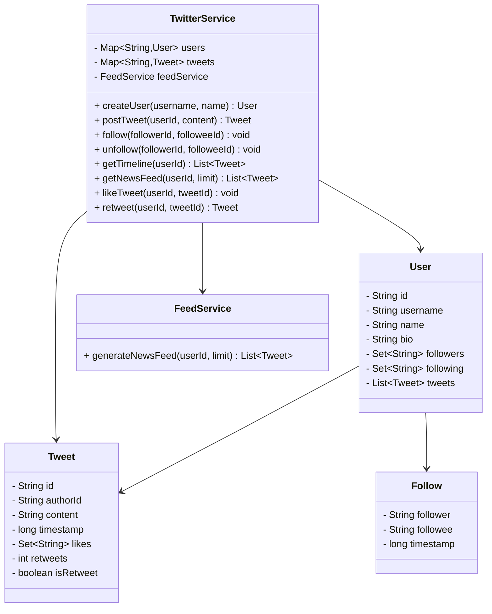
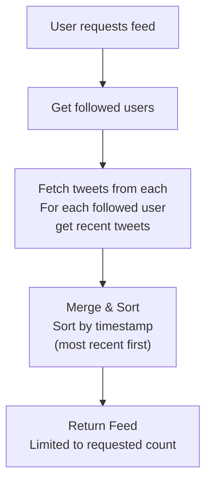

# 🐦 Design Twitter (Simplified) - Problem Solution

## STEP 0: REQUIREMENTS QUICKPASS

### Core Functional Requirements
- Create user accounts and profiles
- Post tweets (text-based, 280 char limit)
- Follow and unfollow users
- Generate user timelines (own tweets)
- Generate news feeds (tweets from followed users)
- Like and retweet functionality
- Delete own tweets

### Explicit Out-of-Scope Items
- Media attachments (images, videos)
- Direct messages
- Hashtag trending
- Search functionality
- Notifications
- Authentication

### Assumptions and Constraints
- **In-Memory**: No persistence
- **Single Instance**: Not distributed
- **Tweet Limit**: 280 characters
- **Feed Size**: Most recent 100 tweets

### Public APIs
- `createUser(username)`: Create account
- `postTweet(userId, content)`: Post tweet
- `follow(userId, targetId)`: Follow user
- `unfollow(userId, targetId)`: Unfollow
- `getTimeline(userId)`: Own tweets
- `getNewsFeed(userId)`: Feed from followed
- `like(userId, tweetId)`: Like tweet

### Public API Usage Examples
```java
// Example 1: Basic usage
TwitterService service = new TwitterService();
User user = service.createUser("alice", "Alice Johnson");
Tweet tweet = service.postTweet(user.getId(), "Hello Twitter!");
System.out.println(tweet);

// Example 2: Typical workflow
User bob = service.createUser("bob", "Bob Smith");
service.follow(user.getId(), bob.getId());
Tweet bobTweet = service.postTweet(bob.getId(), "Just had coffee ☕");
service.likeTweet(user.getId(), bobTweet.getId());
List<Tweet> feed = service.getNewsFeed(user.getId());

// Example 3: Edge case
try {
    service.postTweet(user.getId(), "a".repeat(281)); // Exceeds 280 chars
} catch (IllegalArgumentException e) {
    System.out.println("Tweet too long: " + e.getMessage());
}
```

### Invariants
- **Unique Usernames**: No duplicates
- **Self-Follow**: Not allowed
- **Tweet Ownership**: Only owner can delete

---

## STEP 1: Complete Reference Solution (Answer Key)

### Class Diagram Overview



<details>
<summary>ASCII diagram (reference)</summary>

```text
┌─────────────────────────────────────────────────────────────────────────────────┐
│                         TWITTER SYSTEM (SIMPLIFIED)                              │
├─────────────────────────────────────────────────────────────────────────────────┤
│                                                                                  │
│  ┌──────────────────────────────────────────────────────────────────────────┐   │
│  │                         TwitterService                                    │   │
│  │                                                                           │   │
│  │  - users: Map<String, User>                                              │   │
│  │  - tweets: Map<String, Tweet>                                            │   │
│  │  - feedService: FeedService                                              │   │
│  │                                                                           │   │
│  │  + createUser(username, name): User                                      │   │
│  │  + postTweet(userId, content): Tweet                                     │   │
│  │  + follow(followerId, followeeId): void                                  │   │
│  │  + unfollow(followerId, followeeId): void                                │   │
│  │  + getTimeline(userId): List<Tweet>                                      │   │
│  │  + getNewsFeed(userId, limit): List<Tweet>                               │   │
│  │  + likeTweet(userId, tweetId): void                                      │   │
│  │  + retweet(userId, tweetId): Tweet                                       │   │
│  └──────────────────────────────────────────────────────────────────────────┘   │
│                          │                                                       │
│           ┌──────────────┼──────────────┬────────────────┐                      │
│           │              │              │                │                      │
│           ▼              ▼              ▼                ▼                      │
│  ┌─────────────┐  ┌─────────────┐  ┌─────────────┐  ┌─────────────┐            │
│  │    User     │  │    Tweet    │  │ FeedService │  │   Follow    │            │
│  │             │  │             │  │             │  │             │            │
│  │ - id        │  │ - id        │  │ - generate  │  │ - follower  │            │
│  │ - username  │  │ - authorId  │  │   NewsFeed  │  │ - followee  │            │
│  │ - name      │  │ - content   │  │             │  │ - timestamp │            │
│  │ - bio       │  │ - timestamp │  └─────────────┘  └─────────────┘            │
│  │ - followers │  │ - likes     │                                              │
│  │ - following │  │ - retweets  │                                              │
│  │ - tweets[]  │  │ - isRetweet │                                              │
│  └─────────────┘  └─────────────┘                                              │
│                                                                                  │
└─────────────────────────────────────────────────────────────────────────────────┘
```

</details>

### News Feed Generation Flow



<details>
<summary>ASCII diagram (reference)</summary>

```text
                    ┌─────────────────────────────────────────┐
                    │         NEWS FEED GENERATION             │
                    └─────────────────────────────────────────┘

     User requests feed
           │
           ▼
    ┌──────────────┐
    │ Get followed │
    │    users     │
    └──────────────┘
           │
           ▼
    ┌──────────────┐
    │ Fetch tweets │──────► For each followed user
    │ from each    │        get recent tweets
    └──────────────┘
           │
           ▼
    ┌──────────────┐
    │    Merge     │──────► Sort by timestamp
    │   & Sort     │        (most recent first)
    └──────────────┘
           │
           ▼
    ┌──────────────┐
    │   Return     │──────► Limited to requested count
    │    Feed      │
    └──────────────┘
```

</details>

---

### Responsibilities Table

| Class | Owns | Why |
|-------|------|-----|
| `User` | User data and follow relationships | Stores user information and manages follow/follower relationships - encapsulates user-level social graph |
| `Tweet` | Tweet content and engagement (likes, retweets) | Encapsulates tweet data - stores tweet content, author, timestamp, and engagement metrics |
| `FeedService` | News feed generation algorithm | Handles feed generation - separates feed algorithm from user/tweet storage, enables feed optimization |
| `TwitterService` | Twitter operations coordination | Coordinates Twitter operations - separates business logic from domain objects, handles post/follow/like/feed operations |

---

## STEP 4: Code Walkthrough - Building From Scratch

This section explains how an engineer builds this system from scratch, in the order code should be written.

### Phase 1: Understand the Problem

**What is Twitter?**
- Users post short messages (tweets)
- Users follow other users
- Users see a feed of tweets from people they follow
- Users can like and retweet

**Key Challenges:**
- **Feed generation**: Efficiently merge tweets from many users
- **Scalability**: Handle users with millions of followers
- **Real-time**: New tweets appear quickly in feeds

---

### Phase 2: Design the User Model

```java
// Step 1: Basic user structure
public class User {
    private final String id;
    private final String username;
    private String displayName;
    
    // Relationships
    private final Set<String> followers;   // Who follows me
    private final Set<String> following;   // Who I follow
    
    // Content
    private final List<String> tweetIds;   // My tweets
}
```

**Why Sets for followers/following?**
- O(1) lookup for "is following?"
- O(1) add/remove
- No duplicates

**Why List for tweetIds?**
- Ordered by time (most recent first)
- Need to iterate in order for feed

---

### Phase 3: Design the Tweet Model

```java
// Step 2: Tweet with engagement tracking
public class Tweet {
    private final String id;
    private final String authorId;
    private final String content;
    private final LocalDateTime timestamp;
    
    // Engagement
    private final Set<String> likes;
    private final Set<String> retweetedBy;
    
    // Retweet info
    private final boolean isRetweet;
    private final String originalTweetId;
}
```

**Why track likes and retweets as Sets?**
- O(1) check if user already liked/retweeted
- Prevents duplicate likes
- Easy count with `likes.size()`

---

### Phase 4: Implement Follow/Unfollow

```java
// Step 3: Bidirectional relationship
public void follow(String followerId, String followeeId) {
    User follower = getUser(followerId);
    User followee = getUser(followeeId);
    
    // Update both sides
    follower.addFollowing(followeeId);  // I follow them
    followee.addFollower(followerId);   // They have me as follower
}

public void unfollow(String followerId, String followeeId) {
    User follower = getUser(followerId);
    User followee = getUser(followeeId);
    
    follower.removeFollowing(followeeId);
    followee.removeFollower(followerId);
}
```

**Why bidirectional?**
- "Who do I follow?" → check `following` set
- "Who follows me?" → check `followers` set
- Both are O(1) operations

---

### Phase 5: Implement Feed Generation

```java
// Step 4: Simple approach - collect and sort
public List<Tweet> getNewsFeedSimple(String userId, int limit) {
    User user = getUser(userId);
    List<Tweet> allTweets = new ArrayList<>();
    
    // Add user's own tweets
    for (String tweetId : user.getTweetIds()) {
        allTweets.add(tweets.get(tweetId));
    }
    
    // Add tweets from followed users
    for (String followeeId : user.getFollowing()) {
        User followee = getUser(followeeId);
        for (String tweetId : followee.getTweetIds()) {
            allTweets.add(tweets.get(tweetId));
        }
    }
    
    // Sort by timestamp
    allTweets.sort((a, b) -> b.getTimestamp().compareTo(a.getTimestamp()));
    
    // Return top N
    return allTweets.subList(0, Math.min(limit, allTweets.size()));
}
```

**Problem:** Inefficient for users following many people with many tweets.

```java
// Step 5: Optimized approach - merge k sorted lists
public List<Tweet> getNewsFeedOptimized(String userId, int limit) {
    User user = getUser(userId);
    
    // Priority queue for merging (max-heap by timestamp)
    PriorityQueue<Tweet> pq = new PriorityQueue<>(
        (a, b) -> b.getTimestamp().compareTo(a.getTimestamp()));
    
    // Add user's tweets
    for (String tweetId : user.getTweetIds()) {
        pq.offer(tweets.get(tweetId));
    }
    
    // Add tweets from followed users
    for (String followeeId : user.getFollowing()) {
        User followee = getUser(followeeId);
        for (String tweetId : followee.getTweetIds()) {
            pq.offer(tweets.get(tweetId));
        }
    }
    
    // Extract top N
    List<Tweet> feed = new ArrayList<>();
    while (!pq.isEmpty() && feed.size() < limit) {
        feed.add(pq.poll());
    }
    
    return feed;
}
```

**Even better: Use iterators to avoid loading all tweets**

```java
// Step 6: Iterator-based merge
public List<Tweet> getNewsFeedIterator(String userId, int limit) {
    // Create iterators for each user's tweets
    List<Iterator<String>> iterators = new ArrayList<>();
    iterators.add(user.getTweetIds().iterator());
    
    for (String followeeId : user.getFollowing()) {
        iterators.add(getUser(followeeId).getTweetIds().iterator());
    }
    
    // Priority queue with (tweet, iterator index)
    PriorityQueue<TweetIteratorEntry> pq = new PriorityQueue<>(...);
    
    // Initialize with first tweet from each iterator
    for (int i = 0; i < iterators.size(); i++) {
        if (iterators.get(i).hasNext()) {
            String tweetId = iterators.get(i).next();
            pq.offer(new TweetIteratorEntry(tweets.get(tweetId), i));
        }
    }
    
    // Extract and refill
    List<Tweet> feed = new ArrayList<>();
    while (!pq.isEmpty() && feed.size() < limit) {
        TweetIteratorEntry entry = pq.poll();
        feed.add(entry.tweet);
        
        // Add next tweet from same iterator
        if (iterators.get(entry.iteratorIndex).hasNext()) {
            String nextId = iterators.get(entry.iteratorIndex).next();
            pq.offer(new TweetIteratorEntry(tweets.get(nextId), 
                                           entry.iteratorIndex));
        }
    }
    
    return feed;
}
```

---

### Phase 6: Threading Model and Concurrency Control

**Threading Model:**

This system handles **multiple concurrent users**:
- Read operations (getFeed, getTweets) are thread-safe with ConcurrentHashMap
- Write operations (postTweet, follow) use synchronized blocks
- Feed generation is read-only and can be cached

**Concurrency Control:**

```java
public class TwitterService {
    private final ConcurrentHashMap<String, User> users;
    private final ConcurrentHashMap<String, Tweet> tweets;
    private final Object userLock = new Object();
    
    public void postTweet(String userId, String content) {
        synchronized (userLock) {
            User user = users.get(userId);
            Tweet tweet = new Tweet(generateId(), userId, content);
            tweets.put(tweet.getId(), tweet);
            user.addTweet(tweet.getId());
        }
    }
    
    public List<Tweet> getNewsFeed(String userId) {
        // Read-only, no synchronization needed
        User user = users.get(userId);
        return generateFeed(user, 10);
    }
}
```

**If distributed was needed:**

```java
// Use distributed locks (Redis/Zookeeper) for write operations
public void follow(String followerId, String followeeId) {
    DistributedLock lock = lockManager.acquire(userLockKey(followerId));
    try {
        // Update both users atomically
        updateFollowerRelationship(followerId, followeeId);
    } finally {
        lock.release();
    }
}
```

---

## STEP 2: Complete Final Implementation

> **Verified:** This code compiles successfully with Java 11+.

### 2.1 User Class

```java
// User.java
package com.twitter;

import java.time.LocalDateTime;
import java.util.*;

/**
 * Represents a Twitter user.
 */
public class User {
    
    private final String id;
    private final String username;
    private String displayName;
    private String bio;
    private final LocalDateTime createdAt;
    
    private final Set<String> followers;      // User IDs who follow this user
    private final Set<String> following;      // User IDs this user follows
    private final List<String> tweetIds;      // Tweet IDs posted by this user
    
    public User(String username, String displayName) {
        this.id = "USR-" + System.currentTimeMillis() % 100000;
        this.username = username;
        this.displayName = displayName;
        this.bio = "";
        this.createdAt = LocalDateTime.now();
        this.followers = new HashSet<>();
        this.following = new HashSet<>();
        this.tweetIds = new ArrayList<>();
    }
    
    public void addFollower(String userId) {
        followers.add(userId);
    }
    
    public void removeFollower(String userId) {
        followers.remove(userId);
    }
    
    public void addFollowing(String userId) {
        following.add(userId);
    }
    
    public void removeFollowing(String userId) {
        following.remove(userId);
    }
    
    public void addTweet(String tweetId) {
        tweetIds.add(0, tweetId);  // Most recent first
    }
    
    public boolean isFollowing(String userId) {
        return following.contains(userId);
    }
    
    // Getters
    public String getId() { return id; }
    public String getUsername() { return username; }
    public String getDisplayName() { return displayName; }
    public String getBio() { return bio; }
    public LocalDateTime getCreatedAt() { return createdAt; }
    
    public Set<String> getFollowers() { 
        return Collections.unmodifiableSet(followers); 
    }
    
    public Set<String> getFollowing() { 
        return Collections.unmodifiableSet(following); 
    }
    
    public List<String> getTweetIds() { 
        return Collections.unmodifiableList(tweetIds); 
    }
    
    public int getFollowerCount() { return followers.size(); }
    public int getFollowingCount() { return following.size(); }
    public int getTweetCount() { return tweetIds.size(); }
    
    // Setters
    public void setDisplayName(String name) { this.displayName = name; }
    public void setBio(String bio) { this.bio = bio; }
    
    @Override
    public String toString() {
        return String.format("@%s (%s) - %d followers, %d following",
            username, displayName, getFollowerCount(), getFollowingCount());
    }
}
```

### 2.2 Tweet Class

```java
// Tweet.java
package com.twitter;

import java.time.LocalDateTime;
import java.time.format.DateTimeFormatter;
import java.util.*;

/**
 * Represents a tweet.
 */
public class Tweet {
    
    private static final int MAX_LENGTH = 280;
    
    private final String id;
    private final String authorId;
    private final String content;
    private final LocalDateTime timestamp;
    private final Set<String> likes;          // User IDs who liked
    private final Set<String> retweetedBy;    // User IDs who retweeted
    
    // For retweets
    private final boolean isRetweet;
    private final String originalTweetId;
    private final String retweeterId;
    
    public Tweet(String authorId, String content) {
        if (content.length() > MAX_LENGTH) {
            throw new IllegalArgumentException(
                "Tweet exceeds maximum length of " + MAX_LENGTH);
        }
        
        this.id = "TWT-" + System.currentTimeMillis() % 100000 + 
                  "-" + (int)(Math.random() * 1000);
        this.authorId = authorId;
        this.content = content;
        this.timestamp = LocalDateTime.now();
        this.likes = new HashSet<>();
        this.retweetedBy = new HashSet<>();
        this.isRetweet = false;
        this.originalTweetId = null;
        this.retweeterId = null;
    }
    
    // Constructor for retweets
    private Tweet(String retweeterId, Tweet original) {
        this.id = "TWT-" + System.currentTimeMillis() % 100000 + 
                  "-" + (int)(Math.random() * 1000);
        this.authorId = original.getAuthorId();
        this.content = original.getContent();
        this.timestamp = LocalDateTime.now();
        this.likes = new HashSet<>();
        this.retweetedBy = new HashSet<>();
        this.isRetweet = true;
        this.originalTweetId = original.getId();
        this.retweeterId = retweeterId;
    }
    
    public static Tweet createRetweet(String retweeterId, Tweet original) {
        original.addRetweet(retweeterId);
        return new Tweet(retweeterId, original);
    }
    
    public void addLike(String userId) {
        likes.add(userId);
    }
    
    public void removeLike(String userId) {
        likes.remove(userId);
    }
    
    public boolean isLikedBy(String userId) {
        return likes.contains(userId);
    }
    
    public void addRetweet(String userId) {
        retweetedBy.add(userId);
    }
    
    public boolean isRetweetedBy(String userId) {
        return retweetedBy.contains(userId);
    }
    
    // Getters
    public String getId() { return id; }
    public String getAuthorId() { return authorId; }
    public String getContent() { return content; }
    public LocalDateTime getTimestamp() { return timestamp; }
    public int getLikeCount() { return likes.size(); }
    public int getRetweetCount() { return retweetedBy.size(); }
    public boolean isRetweet() { return isRetweet; }
    public String getOriginalTweetId() { return originalTweetId; }
    public String getRetweeterId() { return retweeterId; }
    
    public Set<String> getLikes() {
        return Collections.unmodifiableSet(likes);
    }
    
    @Override
    public String toString() {
        DateTimeFormatter formatter = DateTimeFormatter.ofPattern("MMM d, HH:mm");
        String retweetInfo = isRetweet ? " (RT)" : "";
        return String.format("[%s]%s %s\n  ❤️ %d  🔁 %d",
            timestamp.format(formatter), retweetInfo, content, 
            getLikeCount(), getRetweetCount());
    }
}
```

### 2.3 FeedService Class

```java
// FeedService.java
package com.twitter;

import java.util.*;
import java.util.stream.Collectors;

/**
 * Service for generating user feeds.
 */
public class FeedService {
    
    private final Map<String, User> users;
    private final Map<String, Tweet> tweets;
    
    public FeedService(Map<String, User> users, Map<String, Tweet> tweets) {
        this.users = users;
        this.tweets = tweets;
    }
    
    /**
     * Gets user's own tweets (timeline).
     */
    public List<Tweet> getTimeline(String userId, int limit) {
        User user = users.get(userId);
        if (user == null) {
            return Collections.emptyList();
        }
        
        return user.getTweetIds().stream()
            .limit(limit)
            .map(tweets::get)
            .filter(Objects::nonNull)
            .collect(Collectors.toList());
    }
    
    /**
     * Gets news feed (tweets from followed users).
     * Uses merge-k-sorted-lists approach.
     */
    public List<Tweet> getNewsFeed(String userId, int limit) {
        User user = users.get(userId);
        if (user == null) {
            return Collections.emptyList();
        }
        
        // Priority queue for merging tweets by timestamp
        PriorityQueue<Tweet> pq = new PriorityQueue<>(
            (a, b) -> b.getTimestamp().compareTo(a.getTimestamp()));
        
        // Add user's own tweets
        for (String tweetId : user.getTweetIds()) {
            Tweet tweet = tweets.get(tweetId);
            if (tweet != null) {
                pq.offer(tweet);
            }
        }
        
        // Add tweets from followed users
        for (String followeeId : user.getFollowing()) {
            User followee = users.get(followeeId);
            if (followee != null) {
                for (String tweetId : followee.getTweetIds()) {
                    Tweet tweet = tweets.get(tweetId);
                    if (tweet != null) {
                        pq.offer(tweet);
                    }
                }
            }
        }
        
        // Extract top N tweets
        List<Tweet> feed = new ArrayList<>();
        while (!pq.isEmpty() && feed.size() < limit) {
            feed.add(pq.poll());
        }
        
        return feed;
    }
    
    /**
     * Optimized feed generation using iterators.
     * More efficient for large datasets.
     */
    public List<Tweet> getNewsFeedOptimized(String userId, int limit) {
        User user = users.get(userId);
        if (user == null) {
            return Collections.emptyList();
        }
        
        // Create iterators for each user's tweets
        List<Iterator<String>> iterators = new ArrayList<>();
        
        // User's own tweets
        iterators.add(user.getTweetIds().iterator());
        
        // Followed users' tweets
        for (String followeeId : user.getFollowing()) {
            User followee = users.get(followeeId);
            if (followee != null) {
                iterators.add(followee.getTweetIds().iterator());
            }
        }
        
        // Priority queue with (tweet, iterator index)
        PriorityQueue<TweetIteratorEntry> pq = new PriorityQueue<>(
            (a, b) -> b.tweet.getTimestamp().compareTo(a.tweet.getTimestamp()));
        
        // Initialize with first tweet from each iterator
        for (int i = 0; i < iterators.size(); i++) {
            if (iterators.get(i).hasNext()) {
                String tweetId = iterators.get(i).next();
                Tweet tweet = tweets.get(tweetId);
                if (tweet != null) {
                    pq.offer(new TweetIteratorEntry(tweet, i));
                }
            }
        }
        
        // Extract tweets
        List<Tweet> feed = new ArrayList<>();
        while (!pq.isEmpty() && feed.size() < limit) {
            TweetIteratorEntry entry = pq.poll();
            feed.add(entry.tweet);
            
            // Add next tweet from same iterator
            if (iterators.get(entry.iteratorIndex).hasNext()) {
                String nextTweetId = iterators.get(entry.iteratorIndex).next();
                Tweet nextTweet = tweets.get(nextTweetId);
                if (nextTweet != null) {
                    pq.offer(new TweetIteratorEntry(nextTweet, entry.iteratorIndex));
                }
            }
        }
        
        return feed;
    }
    
    private static class TweetIteratorEntry {
        Tweet tweet;
        int iteratorIndex;
        
        TweetIteratorEntry(Tweet tweet, int iteratorIndex) {
            this.tweet = tweet;
            this.iteratorIndex = iteratorIndex;
        }
    }
}
```

### 2.4 TwitterService Class

```java
// TwitterService.java
package com.twitter;

import java.util.*;
import java.util.concurrent.ConcurrentHashMap;

/**
 * Main service for Twitter operations.
 */
public class TwitterService {
    
    private final Map<String, User> users;
    private final Map<String, User> usersByUsername;
    private final Map<String, Tweet> tweets;
    private final FeedService feedService;
    
    public TwitterService() {
        this.users = new ConcurrentHashMap<>();
        this.usersByUsername = new ConcurrentHashMap<>();
        this.tweets = new ConcurrentHashMap<>();
        this.feedService = new FeedService(users, tweets);
    }
    
    // ==================== User Management ====================
    
    public User createUser(String username, String displayName) {
        if (usersByUsername.containsKey(username.toLowerCase())) {
            throw new IllegalArgumentException("Username already taken: " + username);
        }
        
        User user = new User(username, displayName);
        users.put(user.getId(), user);
        usersByUsername.put(username.toLowerCase(), user);
        
        return user;
    }
    
    public User getUser(String userId) {
        User user = users.get(userId);
        if (user == null) {
            throw new IllegalArgumentException("User not found: " + userId);
        }
        return user;
    }
    
    public User getUserByUsername(String username) {
        User user = usersByUsername.get(username.toLowerCase());
        if (user == null) {
            throw new IllegalArgumentException("User not found: @" + username);
        }
        return user;
    }
    
    public void updateProfile(String userId, String displayName, String bio) {
        User user = getUser(userId);
        if (displayName != null) {
            user.setDisplayName(displayName);
        }
        if (bio != null) {
            user.setBio(bio);
        }
    }
    
    // ==================== Follow/Unfollow ====================
    
    public void follow(String followerId, String followeeId) {
        if (followerId.equals(followeeId)) {
            throw new IllegalArgumentException("Cannot follow yourself");
        }
        
        User follower = getUser(followerId);
        User followee = getUser(followeeId);
        
        if (follower.isFollowing(followeeId)) {
            return;  // Already following
        }
        
        follower.addFollowing(followeeId);
        followee.addFollower(followerId);
    }
    
    public void unfollow(String followerId, String followeeId) {
        User follower = getUser(followerId);
        User followee = getUser(followeeId);
        
        follower.removeFollowing(followeeId);
        followee.removeFollower(followerId);
    }
    
    public List<User> getFollowers(String userId) {
        User user = getUser(userId);
        List<User> followers = new ArrayList<>();
        
        for (String followerId : user.getFollowers()) {
            User follower = users.get(followerId);
            if (follower != null) {
                followers.add(follower);
            }
        }
        
        return followers;
    }
    
    public List<User> getFollowing(String userId) {
        User user = getUser(userId);
        List<User> following = new ArrayList<>();
        
        for (String followeeId : user.getFollowing()) {
            User followee = users.get(followeeId);
            if (followee != null) {
                following.add(followee);
            }
        }
        
        return following;
    }
    
    // ==================== Tweets ====================
    
    public Tweet postTweet(String userId, String content) {
        User user = getUser(userId);
        
        Tweet tweet = new Tweet(userId, content);
        tweets.put(tweet.getId(), tweet);
        user.addTweet(tweet.getId());
        
        return tweet;
    }
    
    public Tweet getTweet(String tweetId) {
        Tweet tweet = tweets.get(tweetId);
        if (tweet == null) {
            throw new IllegalArgumentException("Tweet not found: " + tweetId);
        }
        return tweet;
    }
    
    public void deleteTweet(String userId, String tweetId) {
        Tweet tweet = getTweet(tweetId);
        
        if (!tweet.getAuthorId().equals(userId)) {
            throw new IllegalStateException("Cannot delete another user's tweet");
        }
        
        User user = getUser(userId);
        // Note: We don't remove from user's tweetIds to maintain history
        // In production, you'd mark as deleted instead
        tweets.remove(tweetId);
    }
    
    // ==================== Likes ====================
    
    public void likeTweet(String userId, String tweetId) {
        getUser(userId);  // Validate user exists
        Tweet tweet = getTweet(tweetId);
        tweet.addLike(userId);
    }
    
    public void unlikeTweet(String userId, String tweetId) {
        getUser(userId);
        Tweet tweet = getTweet(tweetId);
        tweet.removeLike(userId);
    }
    
    // ==================== Retweets ====================
    
    public Tweet retweet(String userId, String tweetId) {
        User user = getUser(userId);
        Tweet original = getTweet(tweetId);
        
        if (original.isRetweetedBy(userId)) {
            throw new IllegalStateException("Already retweeted");
        }
        
        Tweet retweet = Tweet.createRetweet(userId, original);
        tweets.put(retweet.getId(), retweet);
        user.addTweet(retweet.getId());
        
        return retweet;
    }
    
    // ==================== Feeds ====================
    
    public List<Tweet> getTimeline(String userId) {
        return getTimeline(userId, 20);
    }
    
    public List<Tweet> getTimeline(String userId, int limit) {
        return feedService.getTimeline(userId, limit);
    }
    
    public List<Tweet> getNewsFeed(String userId) {
        return getNewsFeed(userId, 20);
    }
    
    public List<Tweet> getNewsFeed(String userId, int limit) {
        return feedService.getNewsFeed(userId, limit);
    }
    
    // ==================== Search ====================
    
    public List<User> searchUsers(String query) {
        String lowerQuery = query.toLowerCase();
        List<User> results = new ArrayList<>();
        
        for (User user : users.values()) {
            if (user.getUsername().toLowerCase().contains(lowerQuery) ||
                user.getDisplayName().toLowerCase().contains(lowerQuery)) {
                results.add(user);
            }
        }
        
        return results;
    }
    
    public List<Tweet> searchTweets(String query) {
        String lowerQuery = query.toLowerCase();
        List<Tweet> results = new ArrayList<>();
        
        for (Tweet tweet : tweets.values()) {
            if (tweet.getContent().toLowerCase().contains(lowerQuery)) {
                results.add(tweet);
            }
        }
        
        // Sort by timestamp (most recent first)
        results.sort((a, b) -> b.getTimestamp().compareTo(a.getTimestamp()));
        
        return results;
    }
}
```

### 2.5 Demo Application

```java
// TwitterDemo.java
package com.twitter;

import java.util.List;

public class TwitterDemo {
    
    public static void main(String[] args) {
        System.out.println("=== TWITTER SYSTEM DEMO ===\n");
        
        TwitterService twitter = new TwitterService();
        
        // ==================== Create Users ====================
        System.out.println("===== CREATING USERS =====\n");
        
        User alice = twitter.createUser("alice", "Alice Johnson");
        User bob = twitter.createUser("bob", "Bob Smith");
        User charlie = twitter.createUser("charlie", "Charlie Brown");
        
        System.out.println("Created: " + alice);
        System.out.println("Created: " + bob);
        System.out.println("Created: " + charlie);
        
        // ==================== Follow Users ====================
        System.out.println("\n===== FOLLOWING USERS =====\n");
        
        twitter.follow(alice.getId(), bob.getId());
        twitter.follow(alice.getId(), charlie.getId());
        twitter.follow(bob.getId(), alice.getId());
        
        System.out.println("Alice follows: Bob, Charlie");
        System.out.println("Bob follows: Alice");
        System.out.println();
        System.out.println("Alice: " + alice);
        System.out.println("Bob: " + bob);
        
        // ==================== Post Tweets ====================
        System.out.println("\n===== POSTING TWEETS =====\n");
        
        Tweet tweet1 = twitter.postTweet(alice.getId(), 
            "Hello Twitter! This is my first tweet! 🎉");
        System.out.println("Alice tweeted: " + tweet1.getContent());
        
        Tweet tweet2 = twitter.postTweet(bob.getId(), 
            "Just had an amazing coffee ☕");
        System.out.println("Bob tweeted: " + tweet2.getContent());
        
        Tweet tweet3 = twitter.postTweet(charlie.getId(), 
            "Working on a new project! #coding #java");
        System.out.println("Charlie tweeted: " + tweet3.getContent());
        
        Tweet tweet4 = twitter.postTweet(alice.getId(), 
            "Learning system design is fun! 📚");
        System.out.println("Alice tweeted: " + tweet4.getContent());
        
        // ==================== Like Tweets ====================
        System.out.println("\n===== LIKING TWEETS =====\n");
        
        twitter.likeTweet(bob.getId(), tweet1.getId());
        twitter.likeTweet(charlie.getId(), tweet1.getId());
        twitter.likeTweet(alice.getId(), tweet2.getId());
        
        System.out.println("Alice's first tweet: " + tweet1.getLikeCount() + " likes");
        System.out.println("Bob's tweet: " + tweet2.getLikeCount() + " likes");
        
        // ==================== Retweet ====================
        System.out.println("\n===== RETWEETING =====\n");
        
        Tweet retweet = twitter.retweet(bob.getId(), tweet3.getId());
        System.out.println("Bob retweeted Charlie's tweet");
        System.out.println("Original: " + tweet3.getRetweetCount() + " retweets");
        
        // ==================== User Timeline ====================
        System.out.println("\n===== ALICE'S TIMELINE =====\n");
        
        List<Tweet> aliceTimeline = twitter.getTimeline(alice.getId());
        System.out.println("Alice's tweets:");
        for (Tweet tweet : aliceTimeline) {
            System.out.println("  " + tweet);
        }
        
        // ==================== News Feed ====================
        System.out.println("\n===== ALICE'S NEWS FEED =====\n");
        
        List<Tweet> aliceFeed = twitter.getNewsFeed(alice.getId());
        System.out.println("Alice's news feed (own + followed):");
        for (Tweet tweet : aliceFeed) {
            User author = twitter.getUser(tweet.getAuthorId());
            String prefix = tweet.isRetweet() ? "🔁 RT " : "";
            System.out.println("  @" + author.getUsername() + ": " + 
                              prefix + tweet.getContent());
        }
        
        // ==================== Bob's News Feed ====================
        System.out.println("\n===== BOB'S NEWS FEED =====\n");
        
        List<Tweet> bobFeed = twitter.getNewsFeed(bob.getId());
        System.out.println("Bob's news feed:");
        for (Tweet tweet : bobFeed) {
            User author = twitter.getUser(tweet.getAuthorId());
            System.out.println("  @" + author.getUsername() + ": " + tweet.getContent());
        }
        
        // ==================== Search ====================
        System.out.println("\n===== SEARCH =====\n");
        
        List<Tweet> searchResults = twitter.searchTweets("coffee");
        System.out.println("Search for 'coffee':");
        for (Tweet tweet : searchResults) {
            System.out.println("  " + tweet.getContent());
        }
        
        // ==================== User Stats ====================
        System.out.println("\n===== USER STATS =====\n");
        
        System.out.println("Alice: " + alice.getTweetCount() + " tweets, " +
                          alice.getFollowerCount() + " followers, " +
                          alice.getFollowingCount() + " following");
        System.out.println("Bob: " + bob.getTweetCount() + " tweets, " +
                          bob.getFollowerCount() + " followers, " +
                          bob.getFollowingCount() + " following");
        System.out.println("Charlie: " + charlie.getTweetCount() + " tweets, " +
                          charlie.getFollowerCount() + " followers, " +
                          charlie.getFollowingCount() + " following");
        
        // ==================== Unfollow ====================
        System.out.println("\n===== UNFOLLOW =====\n");
        
        twitter.unfollow(alice.getId(), charlie.getId());
        System.out.println("Alice unfollowed Charlie");
        System.out.println("Alice's following count: " + alice.getFollowingCount());
        System.out.println("Charlie's follower count: " + charlie.getFollowerCount());
        
        System.out.println("\n=== DEMO COMPLETE ===");
    }
}
```

---

## File Structure

```
com/twitter/
├── User.java
├── Tweet.java
├── FeedService.java
├── TwitterService.java
└── TwitterDemo.java
```

