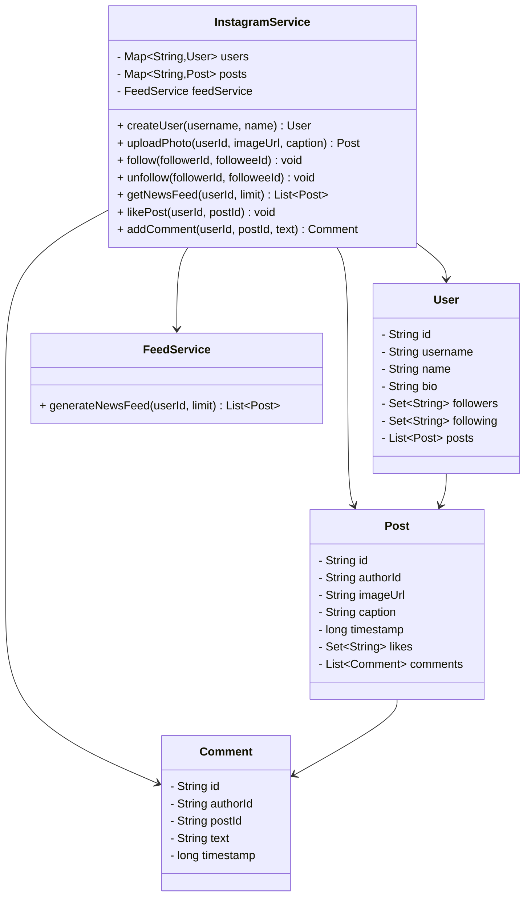

# 📸 Design Instagram (Simplified) - Complete Solution

## Problem Statement

Design a simplified Instagram system that can:
- Create user accounts and profiles
- Upload and share photos with captions
- Follow and unfollow users
- Generate news feeds (photos from followed users)
- Like and comment on photos
- View user profiles and photo galleries

---

## STEP 0: REQUIREMENTS QUICKPASS

### Functional Requirements
| # | Requirement |
|---|-------------|
| 1 | Create user accounts with username and display name |
| 2 | Update user profiles (bio, profile picture) |
| 3 | Upload photos with captions and optional location |
| 4 | Follow and unfollow other users |
| 5 | Generate news feed from followed users' posts |
| 6 | Like and unlike posts |
| 7 | Add and delete comments on posts |
| 8 | Extract and search by hashtags |
| 9 | View user profiles and photo galleries |
| 10 | Generate explore feed (discover new content) |

### Out of Scope
- Stories (24-hour ephemeral content)
- Reels/video content
- Direct messaging
- Image upload/storage (assume URL provided)
- Push notifications
- Shopping/commerce features
- Content moderation

### Assumptions
- Single server deployment (no distributed system)
- All users authenticated (no auth implementation)
- Images stored externally (only URLs managed)
- Chronological feed (no ML-based ranking)

### Scale Assumptions (LLD Focus)
- Moderate user base (thousands of users)
- In-memory storage acceptable
- Single JVM execution

### Concurrency Model
- ConcurrentHashMap for thread-safe user/post storage
- HashSet for followers/following (single-user operations)
- PriorityQueue for feed generation (per-request)

### Public APIs
```
InstagramService:
  + createUser(username, displayName): User
  + updateProfile(userId, displayName, bio, profilePictureUrl): void
  + follow(followerId, followeeId): void
  + unfollow(followerId, followeeId): void
  + uploadPhoto(userId, imageUrl, caption): Post
  + uploadPhoto(userId, imageUrl, caption, location): Post
  + likePost(userId, postId): void
  + unlikePost(userId, postId): void
  + addComment(userId, postId, text): Comment
  + deleteComment(userId, postId, commentId): void
  + getNewsFeed(userId, limit): List<Post>
  + getExploreFeed(userId, limit): List<Post>
  + getPostsByTag(tag, limit): List<Post>
  + getUserPosts(userId, limit): List<Post>
```

### Public API Usage Examples
```java
// Example 1: Basic usage
InstagramService instagram = new InstagramService();
User alice = instagram.createUser("alice_photo", "Alice Johnson");
instagram.updateProfile(alice.getId(), "Alice J", "Photography enthusiast", "https://example.com/profile.jpg");
User bob = instagram.createUser("bob_adventures", "Bob Smith");
instagram.follow(alice.getId(), bob.getId());
Post post = instagram.uploadPhoto(bob.getId(), "https://example.com/image.jpg", "Beautiful sunset! #sunset");
System.out.println(post);

// Example 2: Typical workflow
instagram.likePost(alice.getId(), post.getId());
Comment comment = instagram.addComment(alice.getId(), post.getId(), "Amazing shot!");
List<Post> newsFeed = instagram.getNewsFeed(alice.getId(), 20);
List<Post> exploreFeed = instagram.getExploreFeed(alice.getId(), 10);

// Example 3: Edge case
try {
    instagram.follow(alice.getId(), alice.getId()); // Cannot follow self
} catch (IllegalArgumentException e) {
    System.out.println("Error: " + e.getMessage());
}
```

### Invariants
- Username must be unique (case-insensitive)
- User cannot follow themselves
- Caption length limited to 2200 characters
- Post likes are unique per user (no duplicate likes)
- Hashtags extracted automatically from captions

---

### Responsibilities Table

| Class | Owns | Why |
|-------|------|-----|
| `User` | User data and follow relationships | Stores user information and manages follow/follower relationships - encapsulates user-level social graph |
| `Post` | Photo post content and engagement (likes, comments, hashtags) | Encapsulates post data - stores photo URL, caption, timestamp, and engagement metrics |
| `Comment` | Comment data (author, text, timestamp) | Encapsulates comment information - stores comment content and metadata |
| `FeedService` | Feed generation algorithms (news feed, explore feed) | Handles feed generation - separates feed algorithms from user/post storage, enables multiple feed types |
| `InstagramService` | Instagram operations coordination | Coordinates Instagram operations - separates business logic from domain objects, handles upload/follow/like/comment/feed operations |

---

## STEP 1: Complete Reference Solution (Answer Key)

### Class Diagram Overview



<details>
<summary>ASCII diagram (reference)</summary>

```text
┌─────────────────────────────────────────────────────────────────────────────────┐
│                        INSTAGRAM SYSTEM (SIMPLIFIED)                             │
├─────────────────────────────────────────────────────────────────────────────────┤
│                                                                                  │
│  ┌──────────────────────────────────────────────────────────────────────────┐   │
│  │                        InstagramService                                   │   │
│  │                                                                           │   │
│  │  - users: Map<String, User>                                              │   │
│  │  - posts: Map<String, Post>                                              │   │
│  │  - feedService: FeedService                                              │   │
│  │                                                                           │   │
│  │  + createUser(username, name): User                                      │   │
│  │  + uploadPhoto(userId, imageUrl, caption): Post                          │   │
│  │  + follow(followerId, followeeId): void                                  │   │
│  │  + unfollow(followerId, followeeId): void                                │   │
│  │  + getNewsFeed(userId, limit): List<Post>                                │   │
│  │  + likePost(userId, postId): void                                        │   │
│  │  + addComment(userId, postId, text): Comment                             │   │
│  └──────────────────────────────────────────────────────────────────────────┘   │
│                          │                                                       │
│           ┌──────────────┼──────────────┬────────────────┐                      │
│           │              │              │                │                      │
│           ▼              ▼              ▼                ▼                      │
│  ┌─────────────┐  ┌─────────────┐  ┌─────────────┐  ┌─────────────┐            │
│  │    User     │  │    Post     │  │   Comment   │  │ FeedService │            │
│  │             │  │             │  │             │  │             │            │
│  │ - id        │  │ - id        │  │ - id        │  │ - generate  │            │
│  │ - username  │  │ - authorId  │  │ - authorId  │  │   NewsFeed  │            │
│  │ - name      │  │ - imageUrl  │  │ - postId    │  │             │            │
│  │ - bio       │  │ - caption   │  │ - text      │  └─────────────┘            │
│  │ - followers │  │ - timestamp │  │ - timestamp │                             │
│  │ - following │  │ - likes     │  └─────────────┘                             │
│  │ - posts[]   │  │ - comments  │                                              │
│  └─────────────┘  └─────────────┘                                              │
│                                                                                  │
└─────────────────────────────────────────────────────────────────────────────────┘
```

</details>

### User Profile Layout

```
┌─────────────────────────────────────────────────────────────────┐
│                         @alice_photo                             │
│                                                                  │
│  ┌──────────┐    Alice Johnson                                  │
│  │  Avatar  │    📷 Photography enthusiast                      │
│  │   📷     │    ✨ Capturing moments                           │
│  └──────────┘                                                    │
│                                                                  │
│  ┌──────────┬──────────┬──────────┐                             │
│  │   125    │   1.2K   │   342    │                             │
│  │  Posts   │ Followers│ Following│                             │
│  └──────────┴──────────┴──────────┘                             │
│                                                                  │
│  ┌─────┐ ┌─────┐ ┌─────┐ ┌─────┐ ┌─────┐ ┌─────┐               │
│  │ 📷  │ │ 📷  │ │ 📷  │ │ 📷  │ │ 📷  │ │ 📷  │               │
│  └─────┘ └─────┘ └─────┘ └─────┘ └─────┘ └─────┘               │
│  ┌─────┐ ┌─────┐ ┌─────┐ ┌─────┐ ┌─────┐ ┌─────┐               │
│  │ 📷  │ │ 📷  │ │ 📷  │ │ 📷  │ │ 📷  │ │ 📷  │               │
│  └─────┘ └─────┘ └─────┘ └─────┘ └─────┘ └─────┘               │
└─────────────────────────────────────────────────────────────────┘
```

---

## STEP 2: Complete Java Implementation

> **Verified:** This code compiles successfully with Java 11+.

### 2.1 User Class

```java
// User.java
package com.instagram;

import java.time.LocalDateTime;
import java.util.*;

/**
 * Represents an Instagram user.
 */
public class User {
    
    private final String id;
    private final String username;
    private String displayName;
    private String bio;
    private String profilePictureUrl;
    private final LocalDateTime createdAt;
    
    private final Set<String> followers;
    private final Set<String> following;
    private final List<String> postIds;
    
    public User(String username, String displayName) {
        this.id = "USR-" + System.currentTimeMillis() % 100000;
        this.username = username;
        this.displayName = displayName;
        this.bio = "";
        this.profilePictureUrl = "";
        this.createdAt = LocalDateTime.now();
        this.followers = new HashSet<>();
        this.following = new HashSet<>();
        this.postIds = new ArrayList<>();
    }
    
    public void addFollower(String userId) {
        followers.add(userId);
    }
    
    public void removeFollower(String userId) {
        followers.remove(userId);
    }
    
    public void addFollowing(String userId) {
        following.add(userId);
    }
    
    public void removeFollowing(String userId) {
        following.remove(userId);
    }
    
    public void addPost(String postId) {
        postIds.add(0, postId);  // Most recent first
    }
    
    public void removePost(String postId) {
        postIds.remove(postId);
    }
    
    public boolean isFollowing(String userId) {
        return following.contains(userId);
    }
    
    // Getters
    public String getId() { return id; }
    public String getUsername() { return username; }
    public String getDisplayName() { return displayName; }
    public String getBio() { return bio; }
    public String getProfilePictureUrl() { return profilePictureUrl; }
    public LocalDateTime getCreatedAt() { return createdAt; }
    
    public Set<String> getFollowers() { 
        return Collections.unmodifiableSet(followers); 
    }
    
    public Set<String> getFollowing() { 
        return Collections.unmodifiableSet(following); 
    }
    
    public List<String> getPostIds() { 
        return Collections.unmodifiableList(postIds); 
    }
    
    public int getFollowerCount() { return followers.size(); }
    public int getFollowingCount() { return following.size(); }
    public int getPostCount() { return postIds.size(); }
    
    // Setters
    public void setDisplayName(String name) { this.displayName = name; }
    public void setBio(String bio) { this.bio = bio; }
    public void setProfilePictureUrl(String url) { this.profilePictureUrl = url; }
    
    @Override
    public String toString() {
        return String.format("@%s (%s) - %d posts, %d followers",
            username, displayName, getPostCount(), getFollowerCount());
    }
}
```

### 2.2 Comment Class

```java
// Comment.java
package com.instagram;

import java.time.LocalDateTime;
import java.time.format.DateTimeFormatter;

/**
 * Represents a comment on a post.
 */
public class Comment {
    
    private final String id;
    private final String authorId;
    private final String postId;
    private final String text;
    private final LocalDateTime timestamp;
    private int likeCount;
    
    public Comment(String authorId, String postId, String text) {
        this.id = "CMT-" + System.currentTimeMillis() % 100000 + 
                  "-" + (int)(Math.random() * 1000);
        this.authorId = authorId;
        this.postId = postId;
        this.text = text;
        this.timestamp = LocalDateTime.now();
        this.likeCount = 0;
    }
    
    public void like() {
        likeCount++;
    }
    
    // Getters
    public String getId() { return id; }
    public String getAuthorId() { return authorId; }
    public String getPostId() { return postId; }
    public String getText() { return text; }
    public LocalDateTime getTimestamp() { return timestamp; }
    public int getLikeCount() { return likeCount; }
    
    @Override
    public String toString() {
        DateTimeFormatter formatter = DateTimeFormatter.ofPattern("MMM d");
        return String.format("%s: %s", timestamp.format(formatter), text);
    }
}
```

### 2.3 Post Class

```java
// Post.java
package com.instagram;

import java.time.LocalDateTime;
import java.time.format.DateTimeFormatter;
import java.util.*;

/**
 * Represents an Instagram post (photo).
 */
public class Post {
    
    private static final int MAX_CAPTION_LENGTH = 2200;
    
    private final String id;
    private final String authorId;
    private final String imageUrl;
    private final String caption;
    private final LocalDateTime timestamp;
    private final Set<String> likes;
    private final List<Comment> comments;
    private final List<String> tags;
    private String location;
    
    public Post(String authorId, String imageUrl, String caption) {
        if (caption != null && caption.length() > MAX_CAPTION_LENGTH) {
            throw new IllegalArgumentException(
                "Caption exceeds maximum length of " + MAX_CAPTION_LENGTH);
        }
        
        this.id = "POST-" + System.currentTimeMillis() % 100000 + 
                  "-" + (int)(Math.random() * 1000);
        this.authorId = authorId;
        this.imageUrl = imageUrl;
        this.caption = caption != null ? caption : "";
        this.timestamp = LocalDateTime.now();
        this.likes = new HashSet<>();
        this.comments = new ArrayList<>();
        this.tags = extractTags(this.caption);
    }
    
    private List<String> extractTags(String text) {
        List<String> extractedTags = new ArrayList<>();
        if (text == null) return extractedTags;
        
        String[] words = text.split("\\s+");
        for (String word : words) {
            if (word.startsWith("#") && word.length() > 1) {
                extractedTags.add(word.substring(1).toLowerCase());
            }
        }
        return extractedTags;
    }
    
    public void addLike(String userId) {
        likes.add(userId);
    }
    
    public void removeLike(String userId) {
        likes.remove(userId);
    }
    
    public boolean isLikedBy(String userId) {
        return likes.contains(userId);
    }
    
    public void addComment(Comment comment) {
        comments.add(comment);
    }
    
    public void removeComment(String commentId) {
        comments.removeIf(c -> c.getId().equals(commentId));
    }
    
    // Getters
    public String getId() { return id; }
    public String getAuthorId() { return authorId; }
    public String getImageUrl() { return imageUrl; }
    public String getCaption() { return caption; }
    public LocalDateTime getTimestamp() { return timestamp; }
    public int getLikeCount() { return likes.size(); }
    public int getCommentCount() { return comments.size(); }
    public String getLocation() { return location; }
    public List<String> getTags() { return Collections.unmodifiableList(tags); }
    
    public Set<String> getLikes() {
        return Collections.unmodifiableSet(likes);
    }
    
    public List<Comment> getComments() {
        return Collections.unmodifiableList(comments);
    }
    
    public void setLocation(String location) {
        this.location = location;
    }
    
    @Override
    public String toString() {
        DateTimeFormatter formatter = DateTimeFormatter.ofPattern("MMM d, yyyy");
        String captionPreview = caption.length() > 50 
            ? caption.substring(0, 47) + "..." 
            : caption;
        return String.format("[%s] %s\n  ❤️ %d  💬 %d",
            timestamp.format(formatter), captionPreview, 
            getLikeCount(), getCommentCount());
    }
}
```

### 2.4 FeedService Class

```java
// FeedService.java
package com.instagram;

import java.util.*;
import java.util.stream.Collectors;

/**
 * Service for generating user feeds.
 */
public class FeedService {
    
    private final Map<String, User> users;
    private final Map<String, Post> posts;
    
    public FeedService(Map<String, User> users, Map<String, Post> posts) {
        this.users = users;
        this.posts = posts;
    }
    
    /**
     * Gets user's own posts (profile feed).
     */
    public List<Post> getUserPosts(String userId, int limit) {
        User user = users.get(userId);
        if (user == null) {
            return Collections.emptyList();
        }
        
        return user.getPostIds().stream()
            .limit(limit)
            .map(posts::get)
            .filter(Objects::nonNull)
            .collect(Collectors.toList());
    }
    
    /**
     * Gets news feed (posts from followed users).
     * Uses merge-k-sorted-lists approach.
     */
    public List<Post> getNewsFeed(String userId, int limit) {
        User user = users.get(userId);
        if (user == null) {
            return Collections.emptyList();
        }
        
        // Priority queue for merging posts by timestamp
        PriorityQueue<Post> pq = new PriorityQueue<>(
            (a, b) -> b.getTimestamp().compareTo(a.getTimestamp()));
        
        // Add posts from followed users
        for (String followeeId : user.getFollowing()) {
            User followee = users.get(followeeId);
            if (followee != null) {
                for (String postId : followee.getPostIds()) {
                    Post post = posts.get(postId);
                    if (post != null) {
                        pq.offer(post);
                    }
                }
            }
        }
        
        // Extract top N posts
        List<Post> feed = new ArrayList<>();
        while (!pq.isEmpty() && feed.size() < limit) {
            feed.add(pq.poll());
        }
        
        return feed;
    }
    
    /**
     * Gets explore feed (popular posts from all users).
     */
    public List<Post> getExploreFeed(String userId, int limit) {
        User user = users.get(userId);
        Set<String> followingIds = user != null ? user.getFollowing() : Collections.emptySet();
        
        return posts.values().stream()
            // Exclude posts from followed users and self
            .filter(p -> !followingIds.contains(p.getAuthorId()))
            .filter(p -> !p.getAuthorId().equals(userId))
            // Sort by engagement (likes + comments)
            .sorted((a, b) -> {
                int scoreA = a.getLikeCount() + a.getCommentCount() * 2;
                int scoreB = b.getLikeCount() + b.getCommentCount() * 2;
                return scoreB - scoreA;
            })
            .limit(limit)
            .collect(Collectors.toList());
    }
    
    /**
     * Gets posts by hashtag.
     */
    public List<Post> getPostsByTag(String tag, int limit) {
        String normalizedTag = tag.toLowerCase().replace("#", "");
        
        return posts.values().stream()
            .filter(p -> p.getTags().contains(normalizedTag))
            .sorted((a, b) -> b.getTimestamp().compareTo(a.getTimestamp()))
            .limit(limit)
            .collect(Collectors.toList());
    }
}
```

### 2.5 InstagramService Class

```java
// InstagramService.java
package com.instagram;

import java.util.*;
import java.util.concurrent.ConcurrentHashMap;
import java.util.stream.Collectors;

/**
 * Main service for Instagram operations.
 */
public class InstagramService {
    
    private final Map<String, User> users;
    private final Map<String, User> usersByUsername;
    private final Map<String, Post> posts;
    private final FeedService feedService;
    
    public InstagramService() {
        this.users = new ConcurrentHashMap<>();
        this.usersByUsername = new ConcurrentHashMap<>();
        this.posts = new ConcurrentHashMap<>();
        this.feedService = new FeedService(users, posts);
    }
    
    // ==================== User Management ====================
    
    public User createUser(String username, String displayName) {
        if (usersByUsername.containsKey(username.toLowerCase())) {
            throw new IllegalArgumentException("Username already taken: " + username);
        }
        
        User user = new User(username, displayName);
        users.put(user.getId(), user);
        usersByUsername.put(username.toLowerCase(), user);
        
        return user;
    }
    
    public User getUser(String userId) {
        User user = users.get(userId);
        if (user == null) {
            throw new IllegalArgumentException("User not found: " + userId);
        }
        return user;
    }
    
    public User getUserByUsername(String username) {
        User user = usersByUsername.get(username.toLowerCase());
        if (user == null) {
            throw new IllegalArgumentException("User not found: @" + username);
        }
        return user;
    }
    
    public void updateProfile(String userId, String displayName, String bio, 
                             String profilePictureUrl) {
        User user = getUser(userId);
        if (displayName != null) {
            user.setDisplayName(displayName);
        }
        if (bio != null) {
            user.setBio(bio);
        }
        if (profilePictureUrl != null) {
            user.setProfilePictureUrl(profilePictureUrl);
        }
    }
    
    // ==================== Follow/Unfollow ====================
    
    public void follow(String followerId, String followeeId) {
        if (followerId.equals(followeeId)) {
            throw new IllegalArgumentException("Cannot follow yourself");
        }
        
        User follower = getUser(followerId);
        User followee = getUser(followeeId);
        
        if (follower.isFollowing(followeeId)) {
            return;  // Already following
        }
        
        follower.addFollowing(followeeId);
        followee.addFollower(followerId);
    }
    
    public void unfollow(String followerId, String followeeId) {
        User follower = getUser(followerId);
        User followee = getUser(followeeId);
        
        follower.removeFollowing(followeeId);
        followee.removeFollower(followerId);
    }
    
    public List<User> getFollowers(String userId) {
        User user = getUser(userId);
        return user.getFollowers().stream()
            .map(users::get)
            .filter(Objects::nonNull)
            .collect(Collectors.toList());
    }
    
    public List<User> getFollowing(String userId) {
        User user = getUser(userId);
        return user.getFollowing().stream()
            .map(users::get)
            .filter(Objects::nonNull)
            .collect(Collectors.toList());
    }
    
    // ==================== Posts ====================
    
    public Post uploadPhoto(String userId, String imageUrl, String caption) {
        User user = getUser(userId);
        
        Post post = new Post(userId, imageUrl, caption);
        posts.put(post.getId(), post);
        user.addPost(post.getId());
        
        return post;
    }
    
    public Post uploadPhoto(String userId, String imageUrl, String caption, 
                           String location) {
        Post post = uploadPhoto(userId, imageUrl, caption);
        post.setLocation(location);
        return post;
    }
    
    public Post getPost(String postId) {
        Post post = posts.get(postId);
        if (post == null) {
            throw new IllegalArgumentException("Post not found: " + postId);
        }
        return post;
    }
    
    public void deletePost(String userId, String postId) {
        Post post = getPost(postId);
        
        if (!post.getAuthorId().equals(userId)) {
            throw new IllegalStateException("Cannot delete another user's post");
        }
        
        User user = getUser(userId);
        user.removePost(postId);
        posts.remove(postId);
    }
    
    // ==================== Likes ====================
    
    public void likePost(String userId, String postId) {
        getUser(userId);  // Validate user exists
        Post post = getPost(postId);
        post.addLike(userId);
    }
    
    public void unlikePost(String userId, String postId) {
        getUser(userId);
        Post post = getPost(postId);
        post.removeLike(userId);
    }
    
    public List<User> getPostLikers(String postId, int limit) {
        Post post = getPost(postId);
        return post.getLikes().stream()
            .limit(limit)
            .map(users::get)
            .filter(Objects::nonNull)
            .collect(Collectors.toList());
    }
    
    // ==================== Comments ====================
    
    public Comment addComment(String userId, String postId, String text) {
        getUser(userId);
        Post post = getPost(postId);
        
        Comment comment = new Comment(userId, postId, text);
        post.addComment(comment);
        
        return comment;
    }
    
    public void deleteComment(String userId, String postId, String commentId) {
        Post post = getPost(postId);
        
        Comment comment = post.getComments().stream()
            .filter(c -> c.getId().equals(commentId))
            .findFirst()
            .orElseThrow(() -> new IllegalArgumentException("Comment not found"));
        
        // Can delete if you're the comment author or post author
        if (!comment.getAuthorId().equals(userId) && 
            !post.getAuthorId().equals(userId)) {
            throw new IllegalStateException("Cannot delete this comment");
        }
        
        post.removeComment(commentId);
    }
    
    public List<Comment> getComments(String postId) {
        return getPost(postId).getComments();
    }
    
    // ==================== Feeds ====================
    
    public List<Post> getUserPosts(String userId) {
        return getUserPosts(userId, 12);
    }
    
    public List<Post> getUserPosts(String userId, int limit) {
        return feedService.getUserPosts(userId, limit);
    }
    
    public List<Post> getNewsFeed(String userId) {
        return getNewsFeed(userId, 20);
    }
    
    public List<Post> getNewsFeed(String userId, int limit) {
        return feedService.getNewsFeed(userId, limit);
    }
    
    public List<Post> getExploreFeed(String userId, int limit) {
        return feedService.getExploreFeed(userId, limit);
    }
    
    public List<Post> getPostsByTag(String tag, int limit) {
        return feedService.getPostsByTag(tag, limit);
    }
    
    // ==================== Search ====================
    
    public List<User> searchUsers(String query) {
        String lowerQuery = query.toLowerCase();
        
        return users.values().stream()
            .filter(u -> u.getUsername().toLowerCase().contains(lowerQuery) ||
                        u.getDisplayName().toLowerCase().contains(lowerQuery))
            .collect(Collectors.toList());
    }
    
    public List<String> searchTags(String query) {
        String lowerQuery = query.toLowerCase();
        
        return posts.values().stream()
            .flatMap(p -> p.getTags().stream())
            .filter(tag -> tag.contains(lowerQuery))
            .distinct()
            .collect(Collectors.toList());
    }
}
```

### 2.6 Demo Application

```java
// InstagramDemo.java
package com.instagram;

import java.util.List;

public class InstagramDemo {
    
    public static void main(String[] args) {
        System.out.println("=== INSTAGRAM SYSTEM DEMO ===\n");
        
        InstagramService instagram = new InstagramService();
        
        // ==================== Create Users ====================
        System.out.println("===== CREATING USERS =====\n");
        
        User alice = instagram.createUser("alice_photo", "Alice Johnson");
        instagram.updateProfile(alice.getId(), null, 
            "📷 Photography enthusiast\n✨ Capturing moments", null);
        
        User bob = instagram.createUser("bob_adventures", "Bob Smith");
        instagram.updateProfile(bob.getId(), null, 
            "🌍 Travel | 🏔️ Adventure | 📸 Stories", null);
        
        User charlie = instagram.createUser("charlie_eats", "Charlie Brown");
        instagram.updateProfile(charlie.getId(), null, 
            "🍕 Food blogger | 🍜 Restaurant reviews", null);
        
        System.out.println("Created: " + alice);
        System.out.println("Created: " + bob);
        System.out.println("Created: " + charlie);
        
        // ==================== Follow Users ====================
        System.out.println("\n===== FOLLOWING USERS =====\n");
        
        instagram.follow(alice.getId(), bob.getId());
        instagram.follow(alice.getId(), charlie.getId());
        instagram.follow(bob.getId(), alice.getId());
        instagram.follow(charlie.getId(), alice.getId());
        instagram.follow(charlie.getId(), bob.getId());
        
        System.out.println("Alice follows: Bob, Charlie");
        System.out.println("Bob follows: Alice");
        System.out.println("Charlie follows: Alice, Bob");
        System.out.println();
        System.out.println("Alice: " + alice.getFollowerCount() + " followers, " +
                          alice.getFollowingCount() + " following");
        
        // ==================== Upload Photos ====================
        System.out.println("\n===== UPLOADING PHOTOS =====\n");
        
        Post post1 = instagram.uploadPhoto(alice.getId(), 
            "https://example.com/sunset.jpg",
            "Beautiful sunset today! 🌅 #sunset #photography #nature",
            "Malibu Beach");
        System.out.println("Alice uploaded: " + post1.getCaption());
        
        Post post2 = instagram.uploadPhoto(bob.getId(),
            "https://example.com/mountain.jpg",
            "Summit reached! 🏔️ #hiking #adventure #mountains");
        System.out.println("Bob uploaded: " + post2.getCaption());
        
        Post post3 = instagram.uploadPhoto(charlie.getId(),
            "https://example.com/pizza.jpg",
            "Best pizza in town! 🍕 #foodie #pizza #yummy",
            "Joe's Pizza");
        System.out.println("Charlie uploaded: " + post3.getCaption());
        
        Post post4 = instagram.uploadPhoto(alice.getId(),
            "https://example.com/coffee.jpg",
            "Morning vibes ☕ #coffee #morning #photography");
        System.out.println("Alice uploaded: " + post4.getCaption());
        
        // ==================== Like Posts ====================
        System.out.println("\n===== LIKING POSTS =====\n");
        
        instagram.likePost(bob.getId(), post1.getId());
        instagram.likePost(charlie.getId(), post1.getId());
        instagram.likePost(alice.getId(), post2.getId());
        instagram.likePost(charlie.getId(), post2.getId());
        instagram.likePost(alice.getId(), post3.getId());
        instagram.likePost(bob.getId(), post3.getId());
        
        System.out.println("Alice's sunset post: " + post1.getLikeCount() + " likes");
        System.out.println("Bob's mountain post: " + post2.getLikeCount() + " likes");
        System.out.println("Charlie's pizza post: " + post3.getLikeCount() + " likes");
        
        // ==================== Add Comments ====================
        System.out.println("\n===== ADDING COMMENTS =====\n");
        
        Comment comment1 = instagram.addComment(bob.getId(), post1.getId(), 
            "Stunning shot! 😍");
        Comment comment2 = instagram.addComment(charlie.getId(), post1.getId(), 
            "Where is this?");
        Comment comment3 = instagram.addComment(alice.getId(), post2.getId(), 
            "Amazing view! Which trail?");
        
        System.out.println("Comments on Alice's post:");
        for (Comment c : instagram.getComments(post1.getId())) {
            User author = instagram.getUser(c.getAuthorId());
            System.out.println("  @" + author.getUsername() + ": " + c.getText());
        }
        
        // ==================== User Profile ====================
        System.out.println("\n===== ALICE'S PROFILE =====\n");
        
        System.out.println("@" + alice.getUsername());
        System.out.println(alice.getDisplayName());
        System.out.println(alice.getBio());
        System.out.println();
        System.out.printf("%d posts | %d followers | %d following%n",
            alice.getPostCount(), alice.getFollowerCount(), alice.getFollowingCount());
        
        System.out.println("\nAlice's posts:");
        for (Post post : instagram.getUserPosts(alice.getId())) {
            System.out.println("  " + post);
        }
        
        // ==================== News Feed ====================
        System.out.println("\n===== ALICE'S NEWS FEED =====\n");
        
        List<Post> aliceFeed = instagram.getNewsFeed(alice.getId());
        System.out.println("Posts from people Alice follows:");
        for (Post post : aliceFeed) {
            User author = instagram.getUser(post.getAuthorId());
            System.out.println("  @" + author.getUsername() + ": " + 
                              post.getCaption().split("\n")[0]);
            System.out.println("    ❤️ " + post.getLikeCount() + 
                              "  💬 " + post.getCommentCount());
        }
        
        // ==================== Hashtag Search ====================
        System.out.println("\n===== HASHTAG SEARCH =====\n");
        
        List<Post> photographyPosts = instagram.getPostsByTag("photography", 10);
        System.out.println("Posts with #photography:");
        for (Post post : photographyPosts) {
            User author = instagram.getUser(post.getAuthorId());
            System.out.println("  @" + author.getUsername() + ": " + 
                              post.getCaption().split("\n")[0]);
        }
        
        // ==================== Explore Feed ====================
        System.out.println("\n===== EXPLORE FEED FOR BOB =====\n");
        
        List<Post> exploreFeed = instagram.getExploreFeed(bob.getId(), 5);
        System.out.println("Discover new content:");
        for (Post post : exploreFeed) {
            User author = instagram.getUser(post.getAuthorId());
            System.out.println("  @" + author.getUsername() + ": " + 
                              post.getCaption().split("\n")[0]);
        }
        
        // ==================== User Stats ====================
        System.out.println("\n===== USER STATS =====\n");
        
        System.out.println("Alice: " + alice.getPostCount() + " posts, " +
                          alice.getFollowerCount() + " followers");
        System.out.println("Bob: " + bob.getPostCount() + " posts, " +
                          bob.getFollowerCount() + " followers");
        System.out.println("Charlie: " + charlie.getPostCount() + " posts, " +
                          charlie.getFollowerCount() + " followers");
        
        System.out.println("\n=== DEMO COMPLETE ===");
    }
}
```

---

## STEP 4: Building From Scratch: Step-by-Step

### Phase 1: Understand the Problem

**What is Instagram?**
- Users share photos with captions
- Users follow other users
- Users see a feed of photos from people they follow
- Users can like and comment on photos

**Key Differences from Twitter:**
- Media-centric (photos/videos vs text)
- Visual grid layout for profiles
- No retweet equivalent (sharing is different)
- Hashtags for discovery

---

### Phase 2: Design the User Model

```java
// Step 1: Basic user structure
public class User {
    private final String id;
    private final String username;
    private String displayName;
    private String bio;
    private String profilePictureUrl;
    
    // Relationships
    private final Set<String> followers;
    private final Set<String> following;
    
    // Content
    private final List<String> postIds;
}
```

**Why String IDs instead of object references?**
- Avoids circular references
- Easier serialization
- Works with databases
- Memory efficient for large datasets

---

### Phase 3: Design the Post Model

```java
// Step 2: Post with engagement
public class Post {
    private final String id;
    private final String authorId;
    private final String imageUrl;
    private final String caption;
    private final LocalDateTime timestamp;
    
    // Engagement
    private final Set<String> likes;
    private final List<Comment> comments;
    
    // Discovery
    private final List<String> tags;
    private String location;
}
```

```java
// Step 3: Extract hashtags from caption
private List<String> extractTags(String text) {
    List<String> tags = new ArrayList<>();
    if (text == null) return tags;
    
    String[] words = text.split("\\s+");
    for (String word : words) {
        if (word.startsWith("#") && word.length() > 1) {
            tags.add(word.substring(1).toLowerCase());
        }
    }
    return tags;
}
```

**Why extract tags during creation?**
- Avoids repeated parsing
- Enables efficient hashtag search
- Tags are immutable (caption doesn't change)

---

### Phase 4: Design the Comment Model

```java
// Step 4: Comment structure
public class Comment {
    private final String id;
    private final String authorId;
    private final String postId;
    private final String text;
    private final LocalDateTime timestamp;
    private int likeCount;
    
    public void like() {
        likeCount++;
    }
}
```

**Why comments are stored in Post?**
- Comments belong to a post
- Easy to get all comments for a post
- Simplifies deletion (delete post = delete comments)

---

### Phase 5: Implement Feed Generation

```java
// Step 5: News feed from followed users
public List<Post> getNewsFeed(String userId, int limit) {
    User user = users.get(userId);
    if (user == null) return Collections.emptyList();
    
    // Priority queue for merging (newest first)
    PriorityQueue<Post> pq = new PriorityQueue<>(
        (a, b) -> b.getTimestamp().compareTo(a.getTimestamp()));
    
    // Add posts from followed users
    for (String followeeId : user.getFollowing()) {
        User followee = users.get(followeeId);
        if (followee != null) {
            for (String postId : followee.getPostIds()) {
                Post post = posts.get(postId);
                if (post != null) {
                    pq.offer(post);
                }
            }
        }
    }
    
    // Extract top N
    List<Post> feed = new ArrayList<>();
    while (!pq.isEmpty() && feed.size() < limit) {
        feed.add(pq.poll());
    }
    
    return feed;
}
```

```java
// Step 6: Explore feed (discovery)
public List<Post> getExploreFeed(String userId, int limit) {
    Set<String> followingIds = getUser(userId).getFollowing();
    
    return posts.values().stream()
        // Exclude followed users and self
        .filter(p -> !followingIds.contains(p.getAuthorId()))
        .filter(p -> !p.getAuthorId().equals(userId))
        // Sort by engagement
        .sorted((a, b) -> {
            int scoreA = a.getLikeCount() + a.getCommentCount() * 2;
            int scoreB = b.getLikeCount() + b.getCommentCount() * 2;
            return scoreB - scoreA;
        })
        .limit(limit)
        .collect(Collectors.toList());
}
```

---

### Phase 6: Implement Hashtag Search

```java
// Step 7: Search by hashtag
public List<Post> getPostsByTag(String tag, int limit) {
    String normalizedTag = tag.toLowerCase().replace("#", "");
    
    return posts.values().stream()
        .filter(p -> p.getTags().contains(normalizedTag))
        .sorted((a, b) -> b.getTimestamp().compareTo(a.getTimestamp()))
        .limit(limit)
        .collect(Collectors.toList());
}
```

**For production: Use inverted index**

```java
// More efficient hashtag lookup
public class HashtagIndex {
    private final Map<String, Set<String>> tagToPostIds;
    
    public void indexPost(Post post) {
        for (String tag : post.getTags()) {
            tagToPostIds.computeIfAbsent(tag, k -> new LinkedHashSet<>())
                .add(post.getId());
        }
    }
    
    public List<String> getPostIds(String tag) {
        return new ArrayList<>(
            tagToPostIds.getOrDefault(tag.toLowerCase(), Collections.emptySet()));
    }
}
```

