# 📸 Design Instagram (Simplified) - Simulation & Testing

## STEP 5: Simulation / Dry Run

### Scenario 1: Happy Path - News Feed Generation

```
Alice follows: Bob, Charlie
Bob's posts: [B3, B1]
Charlie's posts: [C4, C2]

Step 1: Initialize priority queue


<details>
<summary>ASCII diagram (reference)</summary>

```text
┌─────────────────────────────────────────────────────────────────┐
│ For Bob: add B3, B1 to PQ                                       │
│ For Charlie: add C4, C2 to PQ                                   │
│                                                                  │
│ PQ: [C4, B3, C2, B1]  (sorted by timestamp, newest first)       │
└─────────────────────────────────────────────────────────────────┘
```

</details>

Step 2: Extract top N (limit=3)

```mermaid
flowchart TD
    A["poll() → C4<br/>Feed: [C4]"]
    B["poll() → B3<br/>Feed: [C4, B3]"]
    C["poll() → C2<br/>Feed: [C4, B3, C2]<br/>limit reached"]
    
    A --> B
    B --> C
```



<details>
<summary>ASCII diagram (reference)</summary>

```text
┌─────────────────────────────────────────────────────────────────┐
│ poll() → C4  │ Feed: [C4]                                       │
│ poll() → B3  │ Feed: [C4, B3]                                   │
│ poll() → C2  │ Feed: [C4, B3, C2]                               │
│ limit reached                                                    │
└─────────────────────────────────────────────────────────────────┘
```

</details>

Result: [C4, B3, C2]
```

**Final State:**
```
Feed generated correctly with posts from followed users
Posts sorted by timestamp (newest first)
All operations completed successfully
```

---

### Scenario 2: Failure/Invalid Input - Caption Exceeds Limit

**Initial State:**
```
User: Alice
Caption: 2201 characters (exceeds 2200 limit)
```

**Step-by-step:**

1. `instagramService.uploadPhoto("alice", "image.jpg", longCaption)` (2201 chars)
   - Validate caption length: 2201 > 2200
   - Validation fails
   - Throws IllegalArgumentException("Caption exceeds 2200 character limit")
   - No post created
   - User's post list unchanged

2. `instagramService.uploadPhoto("alice", null, "Caption")` (invalid input)
   - Null image URL → throws IllegalArgumentException("Image URL cannot be null")
   - No state change

3. `instagramService.uploadPhoto(null, "image.jpg", "Caption")` (invalid input)
   - Null user ID → throws IllegalArgumentException("User ID cannot be null")
   - No state change

**Final State:**
```
User Alice: No new post added
Post list unchanged
Invalid inputs properly rejected
```

---

### Scenario 3: Concurrency/Race Condition - Concurrent Like Operations

**Initial State:**
```
Post: P-001 by Alice
Likes: [] (empty)
Thread A: User1 likes post
Thread B: User2 likes post (concurrent)
Thread C: User1 likes post again (concurrent, duplicate)
```

**Step-by-step (simulating concurrent like operations):**

**Thread A:** `instagramService.likePost("user1", "P-001")` at time T0
**Thread B:** `instagramService.likePost("user2", "P-001")` at time T0 (concurrent)
**Thread C:** `instagramService.likePost("user1", "P-001")` at time T0 (concurrent, duplicate)

1. **Thread A:** Enters `likePost()` method
   - Gets Post P-001
   - Calls `post.addLike("user1")`
   - Acquires lock on Post P-001
   - Check: "user1" not in likes set → true
   - Adds "user1" to likes set
   - Releases lock

2. **Thread B:** Enters `likePost()` method (concurrent)
   - Gets Post P-001
   - Calls `post.addLike("user2")`
   - Waits for lock (Thread A holds it)
   - After Thread A releases, acquires lock
   - Check: "user2" not in likes set → true
   - Adds "user2" to likes set
   - Releases lock

3. **Thread C:** Enters `likePost()` method (concurrent, duplicate)
   - Gets Post P-001
   - Calls `post.addLike("user1")`
   - Waits for lock (Thread B holds it)
   - After Thread B releases, acquires lock
   - Check: "user1" in likes set → false (already liked)
   - Idempotent operation: No change, returns successfully
   - Releases lock

**Final State:**
```
Post P-001 likes: ["user1", "user2"]
Like count: 2
No duplicate likes
Thread-safe operations, proper synchronization
```

---

## Visual Trace: Explore Feed

```
All posts: [A1, B2, C3, D4, E5]
Alice follows: Bob (B2)
Alice's posts: A1

Step 1: Filter out followed and self
┌─────────────────────────────────────────────────────────────────┐
│ A1: Alice's post → EXCLUDE                                      │
│ B2: Bob's post (followed) → EXCLUDE                             │
│ C3: Charlie's post → INCLUDE                                    │
│ D4: Diana's post → INCLUDE                                      │
│ E5: Eve's post → INCLUDE                                        │
└─────────────────────────────────────────────────────────────────┘

Step 2: Calculate engagement scores
┌─────────────────────────────────────────────────────────────────┐
│ C3: 50 likes + 10 comments × 2 = 70                            │
│ D4: 100 likes + 5 comments × 2 = 110                           │
│ E5: 30 likes + 20 comments × 2 = 70                            │
└─────────────────────────────────────────────────────────────────┘

Step 3: Sort by score
┌─────────────────────────────────────────────────────────────────┐
│ Result: [D4 (110), C3 (70), E5 (70)]                           │
└─────────────────────────────────────────────────────────────────┘
```

---

## STEP 6: Edge Cases & Testing Strategy

### Edge Cases

| Category | Edge Case | Expected Behavior |
|----------|-----------|-------------------|
| User | Follow self | Throw IllegalArgumentException |
| User | Duplicate username | Throw IllegalArgumentException |
| User | Follow non-existent user | Throw IllegalArgumentException |
| Post | Caption exceeds 2200 chars | Throw IllegalArgumentException |
| Post | Empty caption | Allow (optional) |
| Post | Caption with only hashtags | Extract all tags |
| Like | Like same post twice | Idempotent (no duplicate) |
| Like | Like non-existent post | Throw IllegalArgumentException |
| Comment | Delete other user's comment | Throw IllegalStateException |
| Comment | Delete comment on own post | Allow (post owner can delete) |
| Feed | User follows no one | Return empty list |
| Feed | Followed users have no posts | Return empty list |
| Hashtag | Search with # prefix | Normalize and search |
| Hashtag | Case-insensitive search | Normalize to lowercase |

### Unit Tests

```java
// PostTest.java
public class PostTest {
    
    @Test
    void testHashtagExtraction() {
        Post post = new Post("user1", "image.jpg", 
            "Beautiful day! #sunset #photography");
        
        List<String> tags = post.getTags();
        assertEquals(2, tags.size());
        assertTrue(tags.contains("sunset"));
        assertTrue(tags.contains("photography"));
    }
    
    @Test
    void testLikes() {
        Post post = new Post("user1", "image.jpg", "Test");
        
        post.addLike("user2");
        post.addLike("user3");
        post.addLike("user2");  // Duplicate
        
        assertEquals(2, post.getLikeCount());
        assertTrue(post.isLikedBy("user2"));
        assertFalse(post.isLikedBy("user4"));
    }
    
    @Test
    void testComments() {
        Post post = new Post("user1", "image.jpg", "Test");
        
        Comment c1 = new Comment("user2", post.getId(), "Nice!");
        Comment c2 = new Comment("user3", post.getId(), "Great!");
        
        post.addComment(c1);
        post.addComment(c2);
        
        assertEquals(2, post.getCommentCount());
        assertEquals("Nice!", post.getComments().get(0).getText());
    }
}
```

### Integration Tests

```java
// InstagramServiceTest.java
public class InstagramServiceTest {
    
    private InstagramService instagram;
    
    @BeforeEach
    void setUp() {
        instagram = new InstagramService();
    }
    
    @Test
    void testNewsFeed() {
        User alice = instagram.createUser("alice", "Alice");
        User bob = instagram.createUser("bob", "Bob");
        
        instagram.follow(alice.getId(), bob.getId());
        
        instagram.uploadPhoto(bob.getId(), "img1.jpg", "Post 1");
        instagram.uploadPhoto(bob.getId(), "img2.jpg", "Post 2");
        
        List<Post> feed = instagram.getNewsFeed(alice.getId());
        
        assertEquals(2, feed.size());
        assertEquals("Post 2", feed.get(0).getCaption());  // Newest first
    }
    
    @Test
    void testHashtagSearch() {
        User alice = instagram.createUser("alice", "Alice");
        
        instagram.uploadPhoto(alice.getId(), "sunset.jpg", "#sunset #nature");
        instagram.uploadPhoto(alice.getId(), "coffee.jpg", "#coffee #morning");
        instagram.uploadPhoto(alice.getId(), "beach.jpg", "#sunset #beach");
        
        List<Post> sunsetPosts = instagram.getPostsByTag("sunset", 10);
        
        assertEquals(2, sunsetPosts.size());
    }
    
    @Test
    void testExploreFeed() {
        User alice = instagram.createUser("alice", "Alice");
        User bob = instagram.createUser("bob", "Bob");
        User charlie = instagram.createUser("charlie", "Charlie");
        
        instagram.follow(alice.getId(), bob.getId());
        
        // Bob's post (followed - should not appear)
        Post bobPost = instagram.uploadPhoto(bob.getId(), "img.jpg", "Bob's post");
        
        // Charlie's post (not followed - should appear)
        Post charliePost = instagram.uploadPhoto(charlie.getId(), "img.jpg", "Charlie's post");
        instagram.likePost(alice.getId(), charliePost.getId());
        
        List<Post> explore = instagram.getExploreFeed(alice.getId(), 10);
        
        assertEquals(1, explore.size());
        assertEquals(charlie.getId(), explore.get(0).getAuthorId());
    }
}
```

---

**Note:** Interview follow-ups have been moved to `02-design-explanation.md`, STEP 8.

```java
public class ImageUploadService {
    private final StorageService storage;
    
    public String uploadImage(String userId, byte[] imageData, 
                             String filename) {
        // Validate image
        validateImage(imageData);
        
        // Generate unique filename
        String uniqueName = generateUniqueName(userId, filename);
        
        // Resize for different sizes
        byte[] thumbnail = resize(imageData, 150, 150);
        byte[] medium = resize(imageData, 600, 600);
        byte[] large = resize(imageData, 1080, 1080);
        
        // Upload to storage (S3, etc.)
        storage.upload(uniqueName + "_thumb", thumbnail);
        storage.upload(uniqueName + "_medium", medium);
        storage.upload(uniqueName + "_large", large);
        
        return storage.getUrl(uniqueName + "_large");
    }
    
    private void validateImage(byte[] data) {
        // Check file size
        if (data.length > 10 * 1024 * 1024) {  // 10MB
            throw new IllegalArgumentException("Image too large");
        }
        
        // Check format (JPEG, PNG, etc.)
        String format = detectFormat(data);
        if (!ALLOWED_FORMATS.contains(format)) {
            throw new IllegalArgumentException("Unsupported format");
        }
    }
}
```

### Q2: How would you implement image filters?

```java
public interface ImageFilter {
    byte[] apply(byte[] imageData);
    String getName();
}

public class GrayscaleFilter implements ImageFilter {
    @Override
    public byte[] apply(byte[] imageData) {
        // Convert to grayscale
    }
}

public class SepiaFilter implements ImageFilter {
    @Override
    public byte[] apply(byte[] imageData) {
        // Apply sepia tone
    }
}

public class FilterService {
    private final Map<String, ImageFilter> filters;
    
    public FilterService() {
        filters = new HashMap<>();
        filters.put("grayscale", new GrayscaleFilter());
        filters.put("sepia", new SepiaFilter());
        // Add more filters
    }
    
    public byte[] applyFilter(byte[] imageData, String filterName) {
        ImageFilter filter = filters.get(filterName);
        if (filter == null) {
            throw new IllegalArgumentException("Unknown filter: " + filterName);
        }
        return filter.apply(imageData);
    }
    
    public List<String> getAvailableFilters() {
        return new ArrayList<>(filters.keySet());
    }
}
```

### Q3: How would you implement tagging users in photos?

```java
public class PhotoTag {
    private final String userId;
    private final double x;  // 0.0 to 1.0 (percentage)
    private final double y;
    
    public PhotoTag(String userId, double x, double y) {
        this.userId = userId;
        this.x = x;
        this.y = y;
    }
}

public class Post {
    private final List<PhotoTag> tags;
    
    public void tagUser(String userId, double x, double y) {
        tags.add(new PhotoTag(userId, x, y));
        // Notify tagged user
    }
    
    public void removeTag(String userId) {
        tags.removeIf(t -> t.getUserId().equals(userId));
    }
}

public class InstagramService {
    public List<Post> getPostsTaggingUser(String userId) {
        return posts.values().stream()
            .filter(p -> p.getTags().stream()
                .anyMatch(t -> t.getUserId().equals(userId)))
            .collect(Collectors.toList());
    }
}
```

### Q4: What would you do differently with more time?

1. **Add video support** - Reels, IGTV
2. **Add Stories** - 24-hour ephemeral content
3. **Add Direct Messages** - Private messaging
4. **Add shopping features** - Product tags, checkout
5. **Add content moderation** - Detect inappropriate content
6. **Add analytics** - Post insights, audience demographics
7. **Add scheduled posts** - Post at specific time
8. **Add collaborative posts** - Multiple authors

