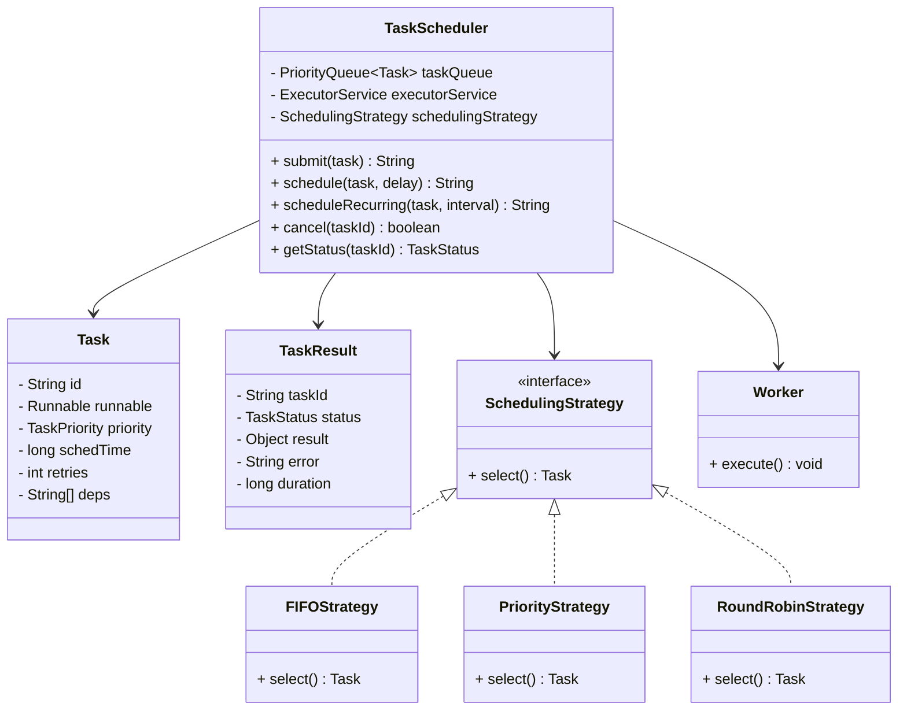

# ⏰ Design a Task Scheduler - Complete Solution

## Problem Statement

Design a Task Scheduler that can:
- Schedule tasks for immediate or delayed execution
- Support different scheduling algorithms (FIFO, Priority, Round Robin)
- Handle task dependencies
- Implement retry mechanism for failed tasks
- Support recurring/periodic tasks
- Track task status and history

---

## STEP 0: REQUIREMENTS QUICKPASS

### Functional Requirements
| # | Requirement |
|---|-------------|
| 1 | Submit tasks for immediate execution |
| 2 | Schedule tasks for delayed execution |
| 3 | Support recurring/periodic tasks |
| 4 | Support multiple scheduling strategies (FIFO, Priority, Round Robin) |
| 5 | Handle task dependencies |
| 6 | Implement retry mechanism for failed tasks |
| 7 | Track task status (PENDING, RUNNING, COMPLETED, FAILED) |
| 8 | Cancel pending/scheduled tasks |
| 9 | Query task status and results |
| 10 | Support task priorities (LOW, NORMAL, HIGH, CRITICAL) |

### Out of Scope
- Distributed task scheduling
- Persistent task storage
- Cron expression parsing
- Task timeout handling
- Progress tracking callbacks
- Workflow/DAG execution

### Assumptions
- Single server deployment
- In-memory task storage
- Tasks are Callable/Runnable objects
- No persistence across restarts

### Scale Assumptions (LLD Focus)
- Moderate task volume
- Single JVM execution
- Thread pool for parallel execution

### Concurrency Model
- ConcurrentLinkedQueue for task queue
- ConcurrentHashMap for task/result storage
- ExecutorService for task execution
- ScheduledExecutorService for delayed/recurring tasks

### Public APIs
```
TaskScheduler:
  + submit(task): String
  + schedule(task, delayMs): String
  + scheduleRecurring(task, intervalMs): String
  + cancel(taskId): boolean
  + getTask(taskId): Task
  + getStatus(taskId): TaskStatus
  + getResult(taskId): TaskResult
  + setStrategy(strategy): void
  + start(): void
  + stop(): void
```

### Public API Usage Examples
```java
// Example 1: Basic usage
TaskScheduler scheduler = new TaskScheduler();
scheduler.start();

Task task = new Task("Simple Task", () -> {
    System.out.println("Executing task");
    return "Done";
});

String taskId = scheduler.submit(task);
TaskStatus status = scheduler.getStatus(taskId);
TaskResult result = scheduler.getResult(taskId);

// Example 2: Typical workflow
scheduler.setStrategy(new PriorityStrategy());

Task highPriorityTask = new Task("Important", () -> {
    // Do important work
    return null;
}).withPriority(TaskPriority.HIGH);

Task lowPriorityTask = new Task("Background", () -> {
    // Do background work
    return null;
}).withPriority(TaskPriority.LOW);

scheduler.submit(highPriorityTask);
scheduler.submit(lowPriorityTask);

// Example 3: Edge case - task with dependencies
Task parentTask = new Task("Parent", () -> {
    return "parent-result";
});

String parentId = scheduler.submit(parentTask);

Task childTask = new Task("Child", () -> {
    // Use parent result
    return null;
}).withDependency(parentId);

scheduler.submit(childTask);
```

### Invariants
- Task ID is unique
- Dependencies must complete successfully before dependent task runs
- Retry count cannot exceed maxRetries
- Cancelled tasks cannot be restarted
- Recurring tasks create new instances per execution

---

## STEP 1: Complete Reference Solution (Answer Key)

### Class Diagram Overview



<details>
<summary>ASCII diagram (reference)</summary>

```text
┌─────────────────────────────────────────────────────────────────────────────────┐
│                            TASK SCHEDULER                                        │
├─────────────────────────────────────────────────────────────────────────────────┤
│                                                                                  │
│  ┌──────────────────────────────────────────────────────────────────────────┐   │
│  │                         TaskScheduler                                     │   │
│  │                                                                           │   │
│  │  - taskQueue: PriorityQueue<Task>                                        │   │
│  │  - executorService: ExecutorService                                      │   │
│  │  - schedulingStrategy: SchedulingStrategy                                │   │
│  │                                                                           │   │
│  │  + submit(task): String                                                  │   │
│  │  + schedule(task, delay): String                                         │   │
│  │  + scheduleRecurring(task, interval): String                             │   │
│  │  + cancel(taskId): boolean                                               │   │
│  │  + getStatus(taskId): TaskStatus                                         │   │
│  └──────────────────────────────────────────────────────────────────────────┘   │
│                          │                                                       │
│           ┌──────────────┼──────────────┬────────────────┐                      │
│           │              │              │                │                      │
│           ▼              ▼              ▼                ▼                      │
│  ┌─────────────┐  ┌─────────────┐  ┌─────────────┐  ┌─────────────┐            │
│  │    Task     │  │ TaskResult  │  │ Scheduling  │  │   Worker    │            │
│  │             │  │             │  │  Strategy   │  │             │            │
│  │ - id        │  │ - taskId    │  │ (interface) │  │ - execute() │            │
│  │ - runnable  │  │ - status    │  │             │  └─────────────┘            │
│  │ - priority  │  │ - result    │  │ + select()  │                             │
│  │ - schedTime │  │ - error     │  └─────────────┘                             │
│  │ - retries   │  │ - duration  │         ▲                                    │
│  │ - deps[]    │  └─────────────┘         │                                    │
│  └─────────────┘                          │                                    │
│                            ┌──────────────┼──────────────┐                     │
│                            │              │              │                     │
│                     ┌──────┴───┐   ┌──────┴───┐   ┌─────┴─────┐               │
│                     │   FIFO   │   │ Priority │   │RoundRobin │               │
│                     └──────────┘   └──────────┘   └───────────┘               │
└─────────────────────────────────────────────────────────────────────────────────┘
```

</details>

---

### Responsibilities Table

| Class | Owns | Why |
|-------|------|-----|
| `Task` | Task definition (id, runnable, priority, dependencies) | Encapsulates task data and execution logic - enables task abstraction and reuse |
| `TaskResult` | Task execution result (status, output, error, duration) | Stores execution outcome - separation of task definition from execution result |
| `SchedulingStrategy` (interface) | Task selection algorithm contract | Defines scheduling algorithm interface - enables Strategy pattern for different scheduling approaches |
| `FIFOStrategy` | First-in-first-out selection logic | Implements FIFO scheduling - enables simple queue-based scheduling |
| `PriorityStrategy` | Priority-based selection logic | Implements priority scheduling - enables priority-based task ordering |
| `RoundRobinStrategy` | Round-robin selection logic | Implements round-robin scheduling - enables fair task distribution |
| `TaskScheduler` | Overall scheduler coordination and task lifecycle | Orchestrates task submission, scheduling, execution, and result management - central coordinator |

---

## STEP 2: Complete Final Implementation

> **Verified:** This code compiles successfully with Java 11+.

### 2.1 TaskStatus and TaskPriority Enums

```java
// TaskStatus.java
package com.scheduler;

public enum TaskStatus {
    PENDING,
    SCHEDULED,
    RUNNING,
    COMPLETED,
    FAILED,
    CANCELLED,
    RETRYING
}
```

```java
// TaskPriority.java
package com.scheduler;

public enum TaskPriority {
    LOW(0),
    NORMAL(1),
    HIGH(2),
    CRITICAL(3);
    
    private final int value;
    
    TaskPriority(int value) {
        this.value = value;
    }
    
    public int getValue() { return value; }
}
```

### 2.2 Task Class

```java
// Task.java
package com.scheduler;

import java.time.LocalDateTime;
import java.util.*;
import java.util.concurrent.Callable;

public class Task {
    
    private final String id;
    private final String name;
    private final Callable<Object> callable;
    private TaskPriority priority;
    private LocalDateTime scheduledTime;
    private TaskStatus status;
    
    private int maxRetries;
    private int retryCount;
    private long retryDelayMs;
    
    private final Set<String> dependencies;
    private boolean recurring;
    private long intervalMs;
    
    private LocalDateTime createdAt;
    private LocalDateTime startedAt;
    private LocalDateTime completedAt;
    
    public Task(String name, Callable<Object> callable) {
        this.id = "TASK-" + System.currentTimeMillis() % 100000 + 
                  "-" + (int)(Math.random() * 10000);
        this.name = name;
        this.callable = callable;
        this.priority = TaskPriority.NORMAL;
        this.scheduledTime = LocalDateTime.now();
        this.status = TaskStatus.PENDING;
        this.maxRetries = 0;
        this.retryCount = 0;
        this.retryDelayMs = 1000;
        this.dependencies = new HashSet<>();
        this.recurring = false;
        this.createdAt = LocalDateTime.now();
    }
    
    public Task(String name, Runnable runnable) {
        this(name, () -> {
            runnable.run();
            return null;
        });
    }
    
    public Object execute() throws Exception {
        return callable.call();
    }
    
    public boolean canRetry() {
        return retryCount < maxRetries;
    }
    
    public void incrementRetry() {
        retryCount++;
    }
    
    // Builder-style setters
    public Task withPriority(TaskPriority priority) {
        this.priority = priority;
        return this;
    }
    
    public Task withScheduledTime(LocalDateTime time) {
        this.scheduledTime = time;
        return this;
    }
    
    public Task withRetry(int maxRetries, long delayMs) {
        this.maxRetries = maxRetries;
        this.retryDelayMs = delayMs;
        return this;
    }
    
    public Task withDependency(String taskId) {
        this.dependencies.add(taskId);
        return this;
    }
    
    public Task asRecurring(long intervalMs) {
        this.recurring = true;
        this.intervalMs = intervalMs;
        return this;
    }
    
    // Getters and setters
    public String getId() { return id; }
    public String getName() { return name; }
    public TaskPriority getPriority() { return priority; }
    public LocalDateTime getScheduledTime() { return scheduledTime; }
    public TaskStatus getStatus() { return status; }
    public void setStatus(TaskStatus status) { this.status = status; }
    public int getMaxRetries() { return maxRetries; }
    public int getRetryCount() { return retryCount; }
    public long getRetryDelayMs() { return retryDelayMs; }
    public Set<String> getDependencies() { return Collections.unmodifiableSet(dependencies); }
    public boolean isRecurring() { return recurring; }
    public long getIntervalMs() { return intervalMs; }
    public LocalDateTime getCreatedAt() { return createdAt; }
    public LocalDateTime getStartedAt() { return startedAt; }
    public void setStartedAt(LocalDateTime time) { this.startedAt = time; }
    public LocalDateTime getCompletedAt() { return completedAt; }
    public void setCompletedAt(LocalDateTime time) { this.completedAt = time; }
    
    @Override
    public String toString() {
        return String.format("Task[%s] %s (%s) - %s", id, name, priority, status);
    }
}
```

### 2.3 TaskResult Class

```java
// TaskResult.java
package com.scheduler;

import java.time.Duration;
import java.time.LocalDateTime;

public class TaskResult {
    
    private final String taskId;
    private final TaskStatus status;
    private final Object result;
    private final Throwable error;
    private final LocalDateTime startTime;
    private final LocalDateTime endTime;
    
    public TaskResult(String taskId, TaskStatus status, Object result, 
                     Throwable error, LocalDateTime start, LocalDateTime end) {
        this.taskId = taskId;
        this.status = status;
        this.result = result;
        this.error = error;
        this.startTime = start;
        this.endTime = end;
    }
    
    public Duration getDuration() {
        if (startTime != null && endTime != null) {
            return Duration.between(startTime, endTime);
        }
        return Duration.ZERO;
    }
    
    public boolean isSuccess() {
        return status == TaskStatus.COMPLETED;
    }
    
    // Getters
    public String getTaskId() { return taskId; }
    public TaskStatus getStatus() { return status; }
    public Object getResult() { return result; }
    public Throwable getError() { return error; }
    public LocalDateTime getStartTime() { return startTime; }
    public LocalDateTime getEndTime() { return endTime; }
    
    @Override
    public String toString() {
        return String.format("TaskResult[%s] %s - Duration: %dms",
            taskId, status, getDuration().toMillis());
    }
}
```

### 2.4 SchedulingStrategy Interface and Implementations

```java
// SchedulingStrategy.java
package com.scheduler;

import java.util.Queue;

public interface SchedulingStrategy {
    Task selectNext(Queue<Task> tasks);
    void addTask(Queue<Task> tasks, Task task);
}
```

```java
// FIFOStrategy.java
package com.scheduler;

import java.util.*;

public class FIFOStrategy implements SchedulingStrategy {
    
    @Override
    public Task selectNext(Queue<Task> tasks) {
        return tasks.poll();
    }
    
    @Override
    public void addTask(Queue<Task> tasks, Task task) {
        tasks.offer(task);
    }
}
```

```java
// PriorityStrategy.java
package com.scheduler;

import java.util.*;

public class PriorityStrategy implements SchedulingStrategy {
    
    @Override
    public Task selectNext(Queue<Task> tasks) {
        if (tasks.isEmpty()) return null;
        
        // Find highest priority task
        Task highest = null;
        for (Task task : tasks) {
            if (highest == null || 
                task.getPriority().getValue() > highest.getPriority().getValue()) {
                highest = task;
            }
        }
        
        tasks.remove(highest);
        return highest;
    }
    
    @Override
    public void addTask(Queue<Task> tasks, Task task) {
        tasks.offer(task);
    }
}
```

```java
// RoundRobinStrategy.java
package com.scheduler;

import java.util.*;

public class RoundRobinStrategy implements SchedulingStrategy {
    
    private int timeQuantumMs = 100;
    
    public RoundRobinStrategy() {}
    
    public RoundRobinStrategy(int timeQuantumMs) {
        this.timeQuantumMs = timeQuantumMs;
    }
    
    @Override
    public Task selectNext(Queue<Task> tasks) {
        return tasks.poll();
    }
    
    @Override
    public void addTask(Queue<Task> tasks, Task task) {
        tasks.offer(task);
    }
    
    public int getTimeQuantumMs() { return timeQuantumMs; }
}
```

### 2.5 TaskScheduler Class

```java
// TaskScheduler.java
package com.scheduler;

import java.time.LocalDateTime;
import java.util.*;
import java.util.concurrent.*;

public class TaskScheduler {
    
    private final Queue<Task> taskQueue;
    private final Map<String, Task> allTasks;
    private final Map<String, TaskResult> taskResults;
    private final ExecutorService executorService;
    private final ScheduledExecutorService scheduledExecutor;
    private SchedulingStrategy strategy;
    private volatile boolean running;
    
    public TaskScheduler() {
        this(Runtime.getRuntime().availableProcessors());
    }
    
    public TaskScheduler(int workerCount) {
        this.taskQueue = new ConcurrentLinkedQueue<>();
        this.allTasks = new ConcurrentHashMap<>();
        this.taskResults = new ConcurrentHashMap<>();
        this.executorService = Executors.newFixedThreadPool(workerCount);
        this.scheduledExecutor = Executors.newScheduledThreadPool(2);
        this.strategy = new FIFOStrategy();
        this.running = false;
    }
    
    public void setStrategy(SchedulingStrategy strategy) {
        this.strategy = strategy;
    }
    
    public void start() {
        running = true;
        
        // Start scheduler thread
        scheduledExecutor.scheduleAtFixedRate(
            this::processQueue, 0, 100, TimeUnit.MILLISECONDS);
    }
    
    public void stop() {
        running = false;
        executorService.shutdown();
        scheduledExecutor.shutdown();
    }
    
    public String submit(Task task) {
        task.setStatus(TaskStatus.PENDING);
        allTasks.put(task.getId(), task);
        strategy.addTask(taskQueue, task);
        return task.getId();
    }
    
    public String schedule(Task task, long delayMs) {
        task.setStatus(TaskStatus.SCHEDULED);
        task.withScheduledTime(LocalDateTime.now().plusNanos(delayMs * 1_000_000));
        allTasks.put(task.getId(), task);
        
        scheduledExecutor.schedule(() -> {
            task.setStatus(TaskStatus.PENDING);
            strategy.addTask(taskQueue, task);
        }, delayMs, TimeUnit.MILLISECONDS);
        
        return task.getId();
    }
    
    public String scheduleRecurring(Task task, long intervalMs) {
        task.asRecurring(intervalMs);
        task.setStatus(TaskStatus.SCHEDULED);
        allTasks.put(task.getId(), task);
        
        scheduledExecutor.scheduleAtFixedRate(() -> {
            // Create new task instance for each execution
            Task instance = new Task(task.getName(), () -> task.execute())
                .withPriority(task.getPriority());
            instance.setStatus(TaskStatus.PENDING);
            strategy.addTask(taskQueue, instance);
        }, 0, intervalMs, TimeUnit.MILLISECONDS);
        
        return task.getId();
    }
    
    public boolean cancel(String taskId) {
        Task task = allTasks.get(taskId);
        if (task == null) return false;
        
        if (task.getStatus() == TaskStatus.PENDING || 
            task.getStatus() == TaskStatus.SCHEDULED) {
            task.setStatus(TaskStatus.CANCELLED);
            taskQueue.remove(task);
            return true;
        }
        
        return false;
    }
    
    private void processQueue() {
        if (!running) return;
        
        Task task = strategy.selectNext(taskQueue);
        if (task == null) return;
        
        // Check dependencies
        if (!areDependenciesMet(task)) {
            strategy.addTask(taskQueue, task);  // Re-queue
            return;
        }
        
        // Execute task
        executorService.submit(() -> executeTask(task));
    }
    
    private boolean areDependenciesMet(Task task) {
        for (String depId : task.getDependencies()) {
            TaskResult result = taskResults.get(depId);
            if (result == null || !result.isSuccess()) {
                return false;
            }
        }
        return true;
    }
    
    private void executeTask(Task task) {
        task.setStatus(TaskStatus.RUNNING);
        task.setStartedAt(LocalDateTime.now());
        
        Object result = null;
        Throwable error = null;
        TaskStatus finalStatus = TaskStatus.COMPLETED;
        
        try {
            result = task.execute();
        } catch (Exception e) {
            error = e;
            finalStatus = TaskStatus.FAILED;
            
            // Handle retry
            if (task.canRetry()) {
                task.incrementRetry();
                task.setStatus(TaskStatus.RETRYING);
                
                scheduledExecutor.schedule(() -> {
                    task.setStatus(TaskStatus.PENDING);
                    strategy.addTask(taskQueue, task);
                }, task.getRetryDelayMs(), TimeUnit.MILLISECONDS);
                
                return;
            }
        }
        
        task.setStatus(finalStatus);
        task.setCompletedAt(LocalDateTime.now());
        
        TaskResult taskResult = new TaskResult(
            task.getId(), finalStatus, result, error,
            task.getStartedAt(), task.getCompletedAt());
        
        taskResults.put(task.getId(), taskResult);
    }
    
    // Queries
    public Task getTask(String taskId) {
        return allTasks.get(taskId);
    }
    
    public TaskStatus getStatus(String taskId) {
        Task task = allTasks.get(taskId);
        return task != null ? task.getStatus() : null;
    }
    
    public TaskResult getResult(String taskId) {
        return taskResults.get(taskId);
    }
    
    public List<Task> getPendingTasks() {
        return allTasks.values().stream()
            .filter(t -> t.getStatus() == TaskStatus.PENDING)
            .toList();
    }
    
    public List<Task> getRunningTasks() {
        return allTasks.values().stream()
            .filter(t -> t.getStatus() == TaskStatus.RUNNING)
            .toList();
    }
}
```

### 2.6 Demo Application

```java
// TaskSchedulerDemo.java
package com.scheduler;

import java.util.concurrent.atomic.AtomicInteger;

public class TaskSchedulerDemo {
    
    public static void main(String[] args) throws InterruptedException {
        System.out.println("=== TASK SCHEDULER DEMO ===\n");
        
        TaskScheduler scheduler = new TaskScheduler(4);
        scheduler.start();
        
        // ==================== Basic Tasks ====================
        System.out.println("===== BASIC TASKS =====\n");
        
        Task task1 = new Task("Simple Task", () -> {
            System.out.println("Executing simple task");
            return "Done";
        });
        
        String id1 = scheduler.submit(task1);
        System.out.println("Submitted: " + id1);
        
        // ==================== Priority Tasks ====================
        System.out.println("\n===== PRIORITY TASKS =====\n");
        
        scheduler.setStrategy(new PriorityStrategy());
        
        Task lowTask = new Task("Low Priority", () -> {
            System.out.println("Low priority executing");
            return null;
        }).withPriority(TaskPriority.LOW);
        
        Task highTask = new Task("High Priority", () -> {
            System.out.println("High priority executing");
            return null;
        }).withPriority(TaskPriority.HIGH);
        
        Task criticalTask = new Task("Critical", () -> {
            System.out.println("Critical executing");
            return null;
        }).withPriority(TaskPriority.CRITICAL);
        
        scheduler.submit(lowTask);
        scheduler.submit(highTask);
        scheduler.submit(criticalTask);
        
        Thread.sleep(500);
        
        // ==================== Delayed Tasks ====================
        System.out.println("\n===== DELAYED TASKS =====\n");
        
        Task delayedTask = new Task("Delayed Task", () -> {
            System.out.println("Delayed task executing after 1 second");
            return null;
        });
        
        scheduler.schedule(delayedTask, 1000);
        System.out.println("Scheduled delayed task");
        
        Thread.sleep(1500);
        
        // ==================== Retry Tasks ====================
        System.out.println("\n===== RETRY TASKS =====\n");
        
        AtomicInteger attempts = new AtomicInteger(0);
        Task retryTask = new Task("Retry Task", () -> {
            int attempt = attempts.incrementAndGet();
            System.out.println("Attempt " + attempt);
            if (attempt < 3) {
                throw new RuntimeException("Simulated failure");
            }
            return "Success on attempt " + attempt;
        }).withRetry(3, 500);
        
        scheduler.submit(retryTask);
        
        Thread.sleep(3000);
        
        TaskResult result = scheduler.getResult(retryTask.getId());
        if (result != null) {
            System.out.println("Final result: " + result);
        }
        
        // ==================== Task Dependencies ====================
        System.out.println("\n===== TASK DEPENDENCIES =====\n");
        
        Task parentTask = new Task("Parent Task", () -> {
            System.out.println("Parent task completed");
            return "parent-data";
        });
        
        String parentId = scheduler.submit(parentTask);
        
        Task childTask = new Task("Child Task", () -> {
            System.out.println("Child task executing (parent completed)");
            return null;
        }).withDependency(parentId);
        
        scheduler.submit(childTask);
        
        Thread.sleep(1000);
        
        // ==================== Recurring Tasks ====================
        System.out.println("\n===== RECURRING TASKS =====\n");
        
        AtomicInteger counter = new AtomicInteger(0);
        Task recurringTask = new Task("Heartbeat", () -> {
            System.out.println("Heartbeat #" + counter.incrementAndGet());
            return null;
        });
        
        scheduler.scheduleRecurring(recurringTask, 500);
        
        Thread.sleep(2500);
        
        // ==================== Cleanup ====================
        System.out.println("\n===== STOPPING SCHEDULER =====\n");
        
        scheduler.stop();
        System.out.println("Scheduler stopped");
        
        System.out.println("\n=== DEMO COMPLETE ===");
    }
}
```

---

## STEP 4: Building From Scratch: Step-by-Step

### Phase 1: Understand the Problem

**What is a Task Scheduler?**
- Manages execution of tasks
- Supports different scheduling policies
- Handles failures and retries
- Tracks task status

---

### Phase 2: Design Task Model

```java
public class Task {
    private final String id;
    private final Callable<Object> callable;
    private TaskPriority priority;
    private TaskStatus status;
    private int maxRetries;
    private Set<String> dependencies;
    
    public Object execute() throws Exception {
        return callable.call();
    }
}
```

---

### Phase 3: Design Scheduling Strategy

```java
public interface SchedulingStrategy {
    Task selectNext(Queue<Task> tasks);
}

public class PriorityStrategy implements SchedulingStrategy {
    @Override
    public Task selectNext(Queue<Task> tasks) {
        return tasks.stream()
            .max(Comparator.comparing(t -> t.getPriority().getValue()))
            .orElse(null);
    }
}
```

---

### Phase 4: Implement Task Execution

```java
private void executeTask(Task task) {
    task.setStatus(TaskStatus.RUNNING);
    
    try {
        Object result = task.execute();
        task.setStatus(TaskStatus.COMPLETED);
        storeResult(task, result, null);
        
    } catch (Exception e) {
        if (task.canRetry()) {
            scheduleRetry(task);
        } else {
            task.setStatus(TaskStatus.FAILED);
            storeResult(task, null, e);
        }
    }
}
```

