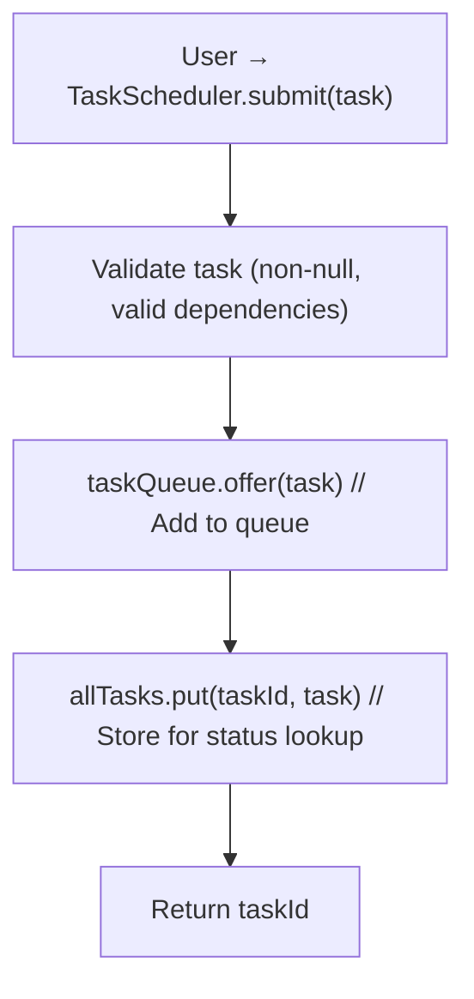
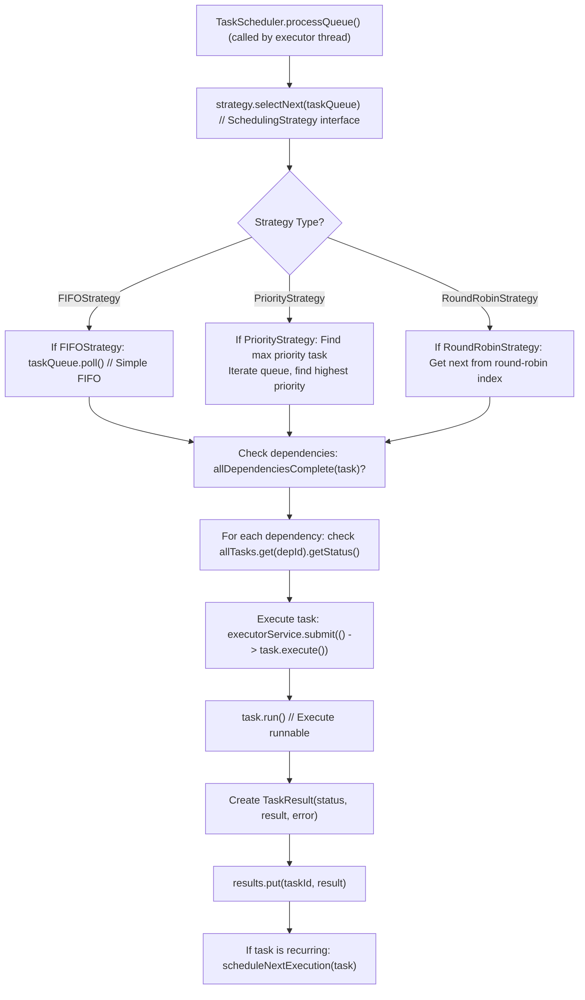
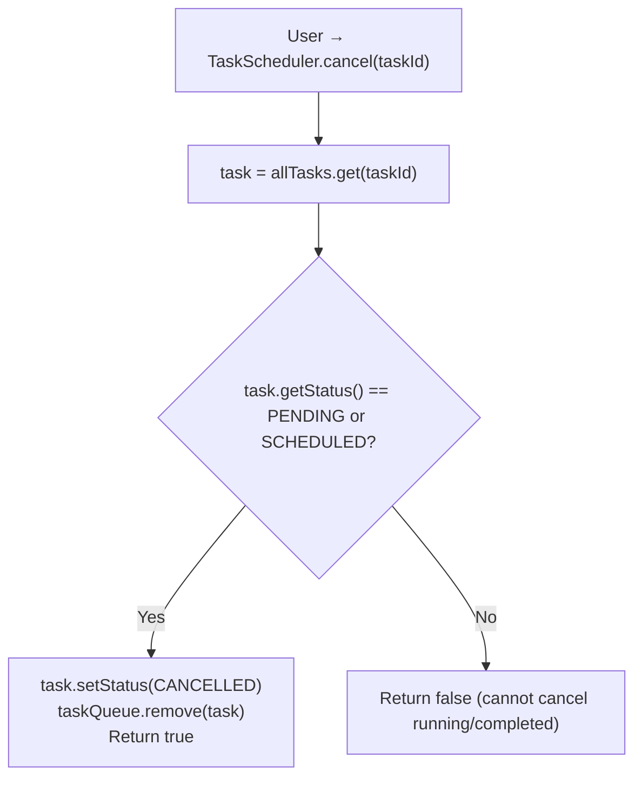

# ⏰ Design a Task Scheduler - Design Explanation

## SOLID Principles Analysis

### 1. Single Responsibility Principle (SRP)

| Class | Responsibility | Reason for Change |
|-------|---------------|-------------------|
| `Task` | Store task data and execute | Task model changes |
| `TaskResult` | Store execution result | Result model changes |
| `SchedulingStrategy` | Select next task | Scheduling algorithm changes |
| `TaskScheduler` | Coordinate scheduling | Scheduler logic changes |

---

### 2. Open/Closed Principle (OCP)

**Adding New Scheduling Strategies:**

```java
// No changes to existing code
public class DeadlineStrategy implements SchedulingStrategy {
    @Override
    public Task selectNext(Queue<Task> tasks) {
        // Select task with earliest deadline
    }
}

public class FairShareStrategy implements SchedulingStrategy {
    @Override
    public Task selectNext(Queue<Task> tasks) {
        // Balance between users/groups
    }
}
```

---

### 3. Liskov Substitution Principle (LSP)

**All strategies work interchangeably:**

```java
public class TaskScheduler {
    private SchedulingStrategy strategy;
    
    public void setStrategy(SchedulingStrategy strategy) {
        this.strategy = strategy;  // Any strategy works
    }
    
    private void processQueue() {
        Task task = strategy.selectNext(taskQueue);
        // Works with FIFO, Priority, RoundRobin, etc.
    }
}
```

---

### 4. Dependency Inversion Principle (DIP)

**Current Design (Good):**

```java
public class TaskScheduler {
    private SchedulingStrategy strategy;  // Interface
    
    // Depends on abstraction, not concrete class
}
```

---

## SOLID Principles Check

| Principle | Rating | Explanation | Fix if WEAK/FAIL | Tradeoff |
|-----------|--------|-------------|------------------|----------|
| **SRP** | PASS | Each class has a single, well-defined responsibility. Task stores task data, TaskResult stores results, SchedulingStrategy defines selection, TaskScheduler coordinates. Clear separation. | N/A | - |
| **OCP** | PASS | System is open for extension (new scheduling strategies) without modifying existing code. Strategy pattern enables this. | N/A | - |
| **LSP** | PASS | All SchedulingStrategy implementations properly implement the SchedulingStrategy contract. They are substitutable in TaskScheduler. | N/A | - |
| **ISP** | PASS | SchedulingStrategy interface is minimal and focused. Only selectNext method is defined. No unused methods. | N/A | - |
| **DIP** | PASS | TaskScheduler depends on SchedulingStrategy interface, not concrete strategy classes. Depends on abstraction. | N/A | - |

---

## How Objects Interact at Runtime

**Task Submission Flow:**



**Task Execution Flow:**



**Task Cancellation Flow:**



<details>
<summary>ASCII diagram (reference)</summary>

```text
User → TaskScheduler.submit(task)
         │
         ├──► Validate task (non-null, valid dependencies)
         │
         ├──► taskQueue.offer(task)  // Add to queue
         │
         ├──► allTasks.put(taskId, task)  // Store for status lookup
         │
         └──► Return taskId

TaskScheduler.processQueue() (called by executor thread)
         │
         ▼
    strategy.selectNext(taskQueue)  // SchedulingStrategy interface
         │
         ├──► If FIFOStrategy: taskQueue.poll()  // Simple FIFO
         │
         ├──► If PriorityStrategy: Find max priority task
         │         │
         │         ▼
         │    Iterate queue, find highest priority
         │
         └──► If RoundRobinStrategy: Get next from round-robin index
         │
         ├──► Check dependencies: allDependenciesComplete(task)?
         │         │
         │         ▼
         │    For each dependency: check allTasks.get(depId).getStatus()
         │
         ├──► Execute task: executorService.submit(() -> task.execute())
         │         │
         │         ▼
         │    task.run()  // Execute runnable
         │         │
         │         ▼
         │    Create TaskResult(status, result, error)
         │
         ├──► results.put(taskId, result)
         │
         └──► If task is recurring: scheduleNextExecution(task)

User → TaskScheduler.cancel(taskId)
         │
         ├──► task = allTasks.get(taskId)
         │
         ├──► Check: task.getStatus() == PENDING or SCHEDULED?
         │         │
         │         ├──► Yes: task.setStatus(CANCELLED)
         │         │    taskQueue.remove(task)
         │         │    Return true
         │         │
         │         └──► No: Return false (cannot cancel running/completed)
```

</details>
         │
         └──► Return cancellation result
```

---

## Why Alternatives Were Rejected

### Alternative 1: Single Scheduling Method with If-Else

```java
// Rejected approach
public class TaskScheduler {
    private SchedulingType type;  // FIFO, PRIORITY, ROUND_ROBIN
    
    private Task selectNext() {
        if (type == SchedulingType.FIFO) {
            return taskQueue.poll();
        } else if (type == SchedulingType.PRIORITY) {
            // Priority logic here
        } else if (type == SchedulingType.ROUND_ROBIN) {
            // Round-robin logic here
        }
    }
}
```

**Why rejected:**
- Violates OCP (must modify TaskScheduler to add new scheduling types)
- Giant if-else statements are hard to maintain
- Cannot easily test scheduling logic in isolation
- Scheduling logic mixed with scheduler coordination

**Better approach:** Strategy pattern with separate strategy classes

---

### Alternative 2: Task Contains Scheduling Logic

```java
// Rejected approach
public class Task {
    public int getSchedulePriority() {
        // Task knows how to compare itself
        return priority.ordinal();
    }
}
```

**Why rejected:**
- Task should not know about scheduling algorithms
- Different strategies may use different criteria
- Violates SRP (task handles both definition and scheduling)
- Hard to change scheduling without modifying Task class

**Better approach:** Separate SchedulingStrategy classes that operate on Tasks

---

## Design Patterns Used

### 1. Strategy Pattern

**Where:** Scheduling algorithms

```java
public interface SchedulingStrategy {
    Task selectNext(Queue<Task> tasks);
}

public class FIFOStrategy implements SchedulingStrategy { }
public class PriorityStrategy implements SchedulingStrategy { }
public class RoundRobinStrategy implements SchedulingStrategy { }
```

---

### 2. Builder Pattern

**Where:** Task configuration

```java
Task task = new Task("MyTask", () -> doWork())
    .withPriority(TaskPriority.HIGH)
    .withRetry(3, 1000)
    .withDependency("parent-task-id")
    .asRecurring(5000);
```

---

### 3. Observer Pattern (Potential)

**Where:** Task completion notifications

```java
public interface TaskListener {
    void onTaskStarted(Task task);
    void onTaskCompleted(Task task, TaskResult result);
    void onTaskFailed(Task task, Throwable error);
}

public class TaskScheduler {
    private final List<TaskListener> listeners;
    
    private void executeTask(Task task) {
        notifyStarted(task);
        // Execute
        notifyCompleted(task, result);
    }
}
```

---

## Complexity Analysis

### Time Complexity

| Operation | FIFO | Priority | Round Robin |
|-----------|------|----------|-------------|
| `submit` | O(1) | O(1) | O(1) |
| `selectNext` | O(1) | O(N) | O(1) |
| `cancel` | O(N) | O(N) | O(N) |

### Space Complexity

| Component | Space |
|-----------|-------|
| Task queue | O(N) |
| All tasks | O(N) |
| Results | O(N) |

---

---

## STEP 8: Interviewer Follow-ups with Answers

### Q1: How would you handle distributed scheduling?

```java
public class DistributedScheduler {
    private final RedisClient redis;
    
    public String submit(Task task) {
        // Store task in Redis
        redis.lpush("task-queue", serialize(task));
        return task.getId();
    }
    
    public Task fetchNext() {
        // Blocking pop with timeout
        String data = redis.brpop("task-queue", 5);
        return deserialize(data);
    }
}
```

### Q2: How would you implement task deadlines?

```java
public class Task {
    private LocalDateTime deadline;
    
    public boolean isOverdue() {
        return deadline != null && LocalDateTime.now().isAfter(deadline);
    }
}

public class DeadlineStrategy implements SchedulingStrategy {
    @Override
    public Task selectNext(Queue<Task> tasks) {
        return tasks.stream()
            .filter(t -> !t.isOverdue())
            .min(Comparator.comparing(Task::getDeadline))
            .orElse(null);
    }
}
```

### Q3: How would you implement task groups?

```java
public class TaskGroup {
    private final String id;
    private final List<Task> tasks;
    private final ExecutionMode mode;  // PARALLEL, SEQUENTIAL
    
    public void execute(TaskScheduler scheduler) {
        if (mode == ExecutionMode.PARALLEL) {
            tasks.forEach(scheduler::submit);
        } else {
            // Chain dependencies
            String prevId = null;
            for (Task task : tasks) {
                if (prevId != null) {
                    task.withDependency(prevId);
                }
                scheduler.submit(task);
                prevId = task.getId();
            }
        }
    }
}
```

### Q4: How would you implement rate limiting?

```java
public class RateLimitedScheduler extends TaskScheduler {
    private final RateLimiter rateLimiter;
    
    @Override
    public String submit(Task task) {
        if (!rateLimiter.tryAcquire()) {
            throw new RateLimitExceededException();
        }
        return super.submit(task);
    }
}
```

### Q5: How would you implement task timeout?

```java
private void executeTask(Task task) {
    Future<?> future = executorService.submit(() -> task.execute());
    
    try {
        future.get(task.getTimeoutMs(), TimeUnit.MILLISECONDS);
    } catch (TimeoutException e) {
        future.cancel(true);
        task.setStatus(TaskStatus.TIMEOUT);
    }
}
```

### Q6: How would you implement task progress tracking?

```java
public interface ProgressCallback {
    void onProgress(int percent, String message);
}

public class Task {
    private ProgressCallback progressCallback;
    
    public void reportProgress(int percent, String message) {
        if (progressCallback != null) {
            progressCallback.onProgress(percent, message);
        }
    }
}
```

### Q7: How would you handle task persistence across restarts?

```java
public class PersistentTaskScheduler extends TaskScheduler {
    private final TaskRepository repository;
    
    @Override
    public String submit(Task task) {
        String taskId = super.submit(task);
        repository.save(task);
        return taskId;
    }
    
    public void restoreTasks() {
        List<Task> pendingTasks = repository.findByStatus(TaskStatus.PENDING);
        for (Task task : pendingTasks) {
            super.submit(task);
        }
    }
}
```

### Q8: How would you implement task prioritization with aging?

```java
public class AgingPriorityStrategy implements SchedulingStrategy {
    @Override
    public Task selectNext(Queue<Task> tasks) {
        return tasks.stream()
            .max(Comparator
                .comparing((Task t) -> calculateEffectivePriority(t))
                .thenComparing(Task::getCreatedAt))
            .orElse(null);
    }
    
    private int calculateEffectivePriority(Task task) {
        long ageMs = Duration.between(task.getCreatedAt(), LocalDateTime.now()).toMillis();
        int ageBoost = (int) (ageMs / 1000); // Boost by 1 per second
        return task.getPriority().getValue() + ageBoost;
    }
}
```

---

## STEP 7: Complexity Analysis

### Time Complexity by Strategy

| Operation | FIFO | Priority | Round Robin |
|-----------|------|----------|-------------|
| `submit` | O(1) | O(1) | O(1) |
| `selectNext` | O(1) | O(N) | O(1) |
| `cancel` | O(N) | O(N) | O(N) |
| `getStatus` | O(1) | O(1) | O(1) |

### Space Complexity

| Component | Space | Notes |
|-----------|-------|-------|
| Task queue | O(N) | N = pending tasks |
| All tasks map | O(T) | T = total tasks (including completed) |
| Results map | O(T) | T = completed tasks |
| Dependencies | O(D) | D = total dependencies |

### Bottlenecks at Scale

**10x Usage (1K → 10K tasks, 100 → 1K tasks/second):**
- Problem: Priority queue operations become slower (O(log n)), task scheduling overhead increases, dependency resolution becomes expensive
- Solution: Use specialized priority queue implementation, optimize dependency graph traversal, implement task batching
- Tradeoff: Algorithm complexity increases, batching adds latency

**100x Usage (1K → 100K tasks, 100 → 10K tasks/second):**
- Problem: Single instance can't handle all tasks, scheduling algorithm too slow, memory for task storage exceeds capacity
- Solution: Shard tasks by priority/time range, use distributed task scheduler (Quartz cluster, Celery), implement distributed coordination
- Tradeoff: Distributed system complexity, need task routing and coordination across shards

### Scheduling Overhead

| Strategy | Selection Time | Best For |
|----------|---------------|----------|
| FIFO | O(1) | Fair ordering, simple workloads |
| Priority | O(N) | Important tasks first |
| Round Robin | O(1) | Equal time slicing |
| Deadline | O(N) | Time-sensitive tasks |

