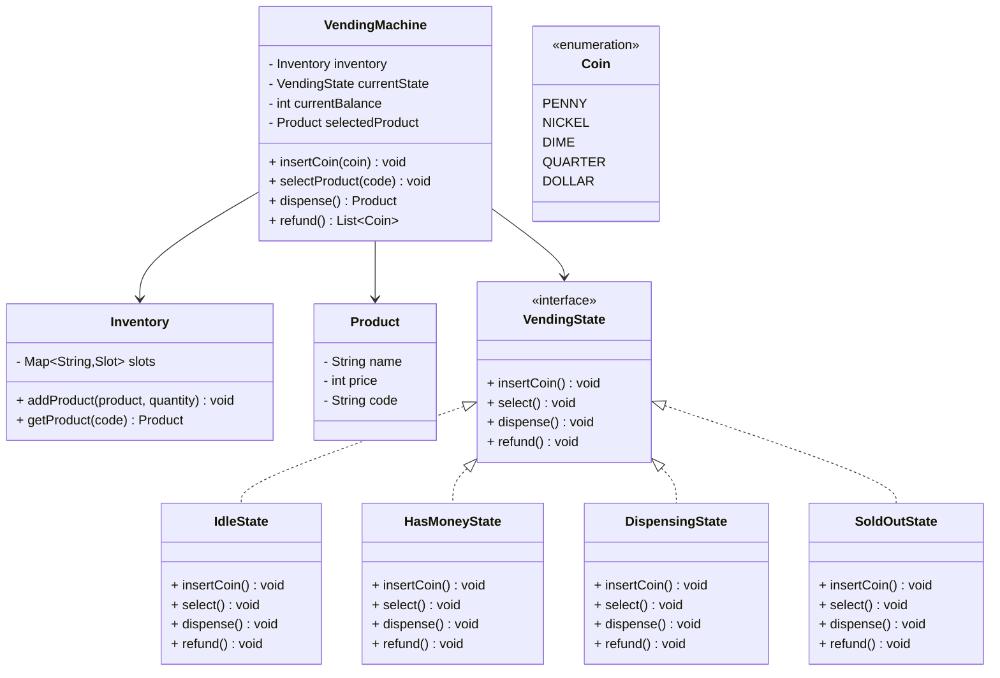
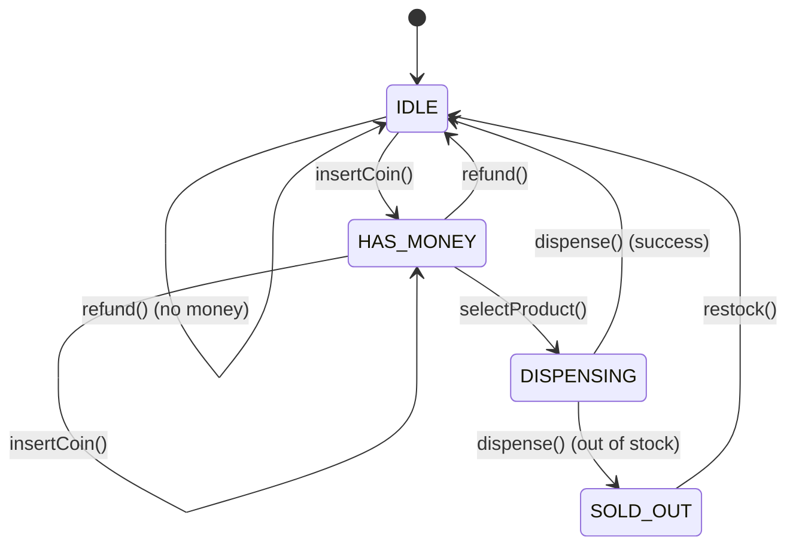

# 🥤 Vending Machine - Complete Solution

## Problem Statement

Design a Vending Machine that can:
- Manage product inventory with different slots
- Accept coins and cash payments
- Dispense products and return change
- Handle refund requests
- Use State Machine pattern for operation states
- Track sales and inventory levels

---

## STEP 0: REQUIREMENTS QUICKPASS

### Functional Requirements
| # | Requirement |
|---|-------------|
| 1 | Manage product inventory in slots |
| 2 | Accept coin payments (penny, nickel, dime, quarter, dollar) |
| 3 | Display available products and prices |
| 4 | Select product by slot code |
| 5 | Dispense product when sufficient payment |
| 6 | Calculate and return change |
| 7 | Handle refund requests |
| 8 | Track sales history |
| 9 | Support restocking operations |
| 10 | Use State Machine for operation states |

### Out of Scope
- Card/mobile payments
- Remote monitoring
- Multiple currency support
- Temperature control
- Age verification
- Receipt printing

### Assumptions
- Unlimited coin supply for change
- Single user interaction at a time
- Products are non-perishable
- No network connectivity required

### Scale Assumptions (LLD Focus)
- Single vending machine
- In-memory inventory and sales
- Synchronous operations

### Concurrency Model
- Single-threaded operation (one user at a time)
- State pattern ensures valid transitions
- No concurrent access to inventory

### Public APIs
```
VendingMachine:
  + insertCoin(coin): void
  + selectProduct(code): void
  + dispense(): void
  + refund(): void
  + stockProduct(slotCode, product, quantity): void
  + restock(slotCode, quantity): void
  + displayProducts(): void
  + getCurrentBalance(): int
  + getCurrentStateName(): String
  + getSalesHistory(): List<Sale>
```

### Public API Usage Examples
```java
// Example 1: Basic usage - successful purchase
VendingMachine machine = new VendingMachine();
machine.stockProduct("A1", new Product("A1", "Coca-Cola", 150), 5);
machine.insertCoin(Coin.DOLLAR);
machine.insertCoin(Coin.QUARTER);
machine.insertCoin(Coin.QUARTER);
machine.selectProduct("A1");

// Example 2: Typical workflow with refund
machine.insertCoin(Coin.DOLLAR);
machine.insertCoin(Coin.QUARTER);
machine.displayProducts();
machine.refund();

// Example 3: Edge case - invalid product selection
machine.insertCoin(Coin.DOLLAR);
machine.selectProduct("Z9");  // Invalid code
machine.refund();
```

### Invariants
- Balance cannot be negative
- Product cannot be dispensed if insufficient funds
- Sold out products cannot be selected
- State transitions follow defined state machine
- Change returned uses greedy algorithm (largest coins first)

---

## STEP 1: Complete Reference Solution (Answer Key)

### Class Diagram Overview



<details>
<summary>ASCII diagram (reference)</summary>

```text
┌─────────────────────────────────────────────────────────────────────────────────┐
│                            VENDING MACHINE                                       │
├─────────────────────────────────────────────────────────────────────────────────┤
│                                                                                  │
│  ┌──────────────────────────────────────────────────────────────────────────┐   │
│  │                        VendingMachine                                     │   │
│  │                                                                           │   │
│  │  - inventory: Inventory                                                  │   │
│  │  - currentState: VendingState                                            │   │
│  │  - currentBalance: int (cents)                                           │   │
│  │  - selectedProduct: Product                                              │   │
│  │                                                                           │   │
│  │  + insertCoin(coin): void                                                │   │
│  │  + selectProduct(code): void                                             │   │
│  │  + dispense(): Product                                                   │   │
│  │  + refund(): List<Coin>                                                  │   │
│  └──────────────────────────────────────────────────────────────────────────┘   │
│                          │                                                       │
│           ┌──────────────┼──────────────┬────────────────┐                      │
│           │              │              │                │                      │
│           ▼              ▼              ▼                ▼                      │
│  ┌─────────────┐  ┌─────────────┐  ┌─────────────┐  ┌─────────────┐            │
│  │  Inventory  │  │   Product   │  │    Coin     │  │VendingState │            │
│  │             │  │             │  │             │  │ (interface) │            │
│  │ - slots     │  │ - name      │  │ - PENNY     │  │             │            │
│  │             │  │ - price     │  │ - NICKEL    │  │ + insertCoin│            │
│  │ + addProduct│  │ - code      │  │ - DIME      │  │ + select    │            │
│  │ + getProduct│  └─────────────┘  │ - QUARTER   │  │ + dispense  │            │
│  └─────────────┘                   └─────────────┘  │ + refund    │            │
│                                                     └─────────────┘            │
│                                                            ▲                    │
│                          ┌─────────────────────────────────┼────────┐          │
│                          │              │                  │        │          │
│                    ┌─────┴────┐  ┌──────┴─────┐  ┌────────┴───┐ ┌──┴───┐     │
│                    │  Idle    │  │HasMoney    │  │ Dispensing │ │ Sold │     │
│                    │  State   │  │  State     │  │   State    │ │ Out  │     │
│                    └──────────┘  └────────────┘  └────────────┘ └──────┘     │
└─────────────────────────────────────────────────────────────────────────────────┘
```

</details>

### State Machine Diagram



<details>
<summary>ASCII diagram (reference)</summary>

```text
                    ┌─────────────────────────────────────────┐
                    │           VENDING MACHINE STATES         │
                    └─────────────────────────────────────────┘

                              ┌──────────────┐
              ┌───────────────│    IDLE      │◄──────────────┐
              │               └──────────────┘               │
              │                     │                        │
              │              insertCoin()                    │
              │                     │                        │
              │                     ▼                        │
              │               ┌──────────────┐               │
              │    ┌─────────►│  HAS_MONEY   │◄─────────┐    │
              │    │          └──────────────┘          │    │
              │    │                │                   │    │
              │ insertCoin()  selectProduct()    refund()   │
              │    │                │                   │    │
              │    │                ▼                   │    │
              │    │          ┌──────────────┐          │    │
              │    └──────────│  DISPENSING  │──────────┘    │
              │               └──────────────┘               │
              │                     │                        │
              │               dispense()                     │
              │                     │                        │
              │                     ▼                        │
              │               ┌──────────────┐               │
              └───────────────│   SOLD_OUT   │───────────────┘
                              └──────────────┘
                                    │
                               restock()
                                    │
                                    ▼
                              (back to IDLE)
```

</details>

---

### Responsibilities Table

| Class | Owns | Why |
|-------|------|-----|
| `Product` | Product identity (code, name, price) | Encapsulates product data - single source of truth for product information |
| `Slot` | Single slot's inventory (product, quantity) | Manages per-slot state and operations - enables independent slot management |
| `Inventory` | All slots and their organization | Centralizes slot management - enables bulk operations and queries |
| `VendingState` (interface) | State-specific behavior contract | Defines state behavior interface - enables State pattern implementation |
| `IdleState` | IDLE state behavior | Handles machine behavior when idle - separation of state logic |
| `HasMoneyState` | HAS_MONEY state behavior | Handles behavior when money is inserted - enables state transitions |
| `DispensingState` | DISPENSING state behavior | Handles product dispensing logic - manages dispensing workflow |
| `SoldOutState` | SOLD_OUT state behavior | Handles sold-out scenarios - prevents invalid operations |
| `VendingMachine` | Overall machine coordination and state | Orchestrates all operations and manages state transitions - central coordinator |

---

## STEP 2: Complete Java Implementation

> **Verified:** This code compiles successfully with Java 11+.

### 2.1 Coin Enum

```java
// Coin.java
package com.vending;

public enum Coin {
    PENNY(1),
    NICKEL(5),
    DIME(10),
    QUARTER(25),
    DOLLAR(100);
    
    private final int valueInCents;
    
    Coin(int valueInCents) {
        this.valueInCents = valueInCents;
    }
    
    public int getValue() { return valueInCents; }
}
```

### 2.2 Product Class

```java
// Product.java
package com.vending;

public class Product {
    
    private final String code;
    private final String name;
    private final int priceInCents;
    
    public Product(String code, String name, int priceInCents) {
        this.code = code;
        this.name = name;
        this.priceInCents = priceInCents;
    }
    
    public String getCode() { return code; }
    public String getName() { return name; }
    public int getPrice() { return priceInCents; }
    
    @Override
    public String toString() {
        return String.format("%s - %s ($%.2f)", code, name, priceInCents / 100.0);
    }
}
```

### 2.3 Slot Class

```java
// Slot.java
package com.vending;

public class Slot {
    
    private final String code;
    private Product product;
    private int quantity;
    private final int capacity;
    
    public Slot(String code, int capacity) {
        this.code = code;
        this.capacity = capacity;
        this.quantity = 0;
    }
    
    public void setProduct(Product product, int quantity) {
        this.product = product;
        this.quantity = Math.min(quantity, capacity);
    }
    
    public Product dispense() {
        if (quantity > 0 && product != null) {
            quantity--;
            return product;
        }
        return null;
    }
    
    public void restock(int amount) {
        this.quantity = Math.min(quantity + amount, capacity);
    }
    
    public boolean isEmpty() {
        return quantity <= 0;
    }
    
    public boolean hasProduct() {
        return product != null && quantity > 0;
    }
    
    // Getters
    public String getCode() { return code; }
    public Product getProduct() { return product; }
    public int getQuantity() { return quantity; }
    public int getCapacity() { return capacity; }
}
```

### 2.4 Inventory Class

```java
// Inventory.java
package com.vending;

import java.util.*;

public class Inventory {
    
    private final Map<String, Slot> slots;
    
    public Inventory() {
        this.slots = new LinkedHashMap<>();
    }
    
    public void addSlot(String code, int capacity) {
        slots.put(code, new Slot(code, capacity));
    }
    
    public void stockProduct(String slotCode, Product product, int quantity) {
        Slot slot = slots.get(slotCode);
        if (slot != null) {
            slot.setProduct(product, quantity);
        }
    }
    
    public void restock(String slotCode, int quantity) {
        Slot slot = slots.get(slotCode);
        if (slot != null) {
            slot.restock(quantity);
        }
    }
    
    public Slot getSlot(String code) {
        return slots.get(code);
    }
    
    public Product getProduct(String code) {
        Slot slot = slots.get(code);
        return slot != null ? slot.getProduct() : null;
    }
    
    public boolean isAvailable(String code) {
        Slot slot = slots.get(code);
        return slot != null && slot.hasProduct();
    }
    
    public Product dispense(String code) {
        Slot slot = slots.get(code);
        return slot != null ? slot.dispense() : null;
    }
    
    public List<Slot> getAllSlots() {
        return new ArrayList<>(slots.values());
    }
    
    public void printInventory() {
        System.out.println("\n=== INVENTORY ===");
        for (Slot slot : slots.values()) {
            if (slot.getProduct() != null) {
                System.out.printf("%s: %s x%d%n", 
                    slot.getCode(), slot.getProduct().getName(), slot.getQuantity());
            } else {
                System.out.printf("%s: [Empty]%n", slot.getCode());
            }
        }
        System.out.println();
    }
}
```

### 2.5 VendingState Interface and Implementations

```java
// VendingState.java
package com.vending;

public interface VendingState {
    void insertCoin(VendingMachine machine, Coin coin);
    void selectProduct(VendingMachine machine, String code);
    void dispense(VendingMachine machine);
    void refund(VendingMachine machine);
    String getStateName();
}
```

```java
// IdleState.java
package com.vending;

public class IdleState implements VendingState {
    
    @Override
    public void insertCoin(VendingMachine machine, Coin coin) {
        machine.addToBalance(coin.getValue());
        System.out.println("Inserted: " + coin + " ($" + 
            String.format("%.2f", coin.getValue() / 100.0) + ")");
        System.out.println("Current balance: $" + 
            String.format("%.2f", machine.getCurrentBalance() / 100.0));
        machine.setState(new HasMoneyState());
    }
    
    @Override
    public void selectProduct(VendingMachine machine, String code) {
        System.out.println("Please insert money first");
    }
    
    @Override
    public void dispense(VendingMachine machine) {
        System.out.println("Please insert money and select a product first");
    }
    
    @Override
    public void refund(VendingMachine machine) {
        System.out.println("No money to refund");
    }
    
    @Override
    public String getStateName() { return "IDLE"; }
}
```

```java
// HasMoneyState.java
package com.vending;

public class HasMoneyState implements VendingState {
    
    @Override
    public void insertCoin(VendingMachine machine, Coin coin) {
        machine.addToBalance(coin.getValue());
        System.out.println("Inserted: " + coin + " ($" + 
            String.format("%.2f", coin.getValue() / 100.0) + ")");
        System.out.println("Current balance: $" + 
            String.format("%.2f", machine.getCurrentBalance() / 100.0));
    }
    
    @Override
    public void selectProduct(VendingMachine machine, String code) {
        Product product = machine.getInventory().getProduct(code);
        
        if (product == null) {
            System.out.println("Invalid product code: " + code);
            return;
        }
        
        if (!machine.getInventory().isAvailable(code)) {
            System.out.println("Product sold out: " + product.getName());
            return;
        }
        
        if (machine.getCurrentBalance() < product.getPrice()) {
            System.out.println("Insufficient funds. Need $" + 
                String.format("%.2f", product.getPrice() / 100.0) +
                ", have $" + String.format("%.2f", machine.getCurrentBalance() / 100.0));
            return;
        }
        
        machine.setSelectedProduct(product);
        machine.setState(new DispensingState());
        machine.dispense();
    }
    
    @Override
    public void dispense(VendingMachine machine) {
        System.out.println("Please select a product first");
    }
    
    @Override
    public void refund(VendingMachine machine) {
        machine.returnChange(machine.getCurrentBalance());
        machine.resetBalance();
        machine.setState(new IdleState());
    }
    
    @Override
    public String getStateName() { return "HAS_MONEY"; }
}
```

```java
// DispensingState.java
package com.vending;

public class DispensingState implements VendingState {
    
    @Override
    public void insertCoin(VendingMachine machine, Coin coin) {
        System.out.println("Please wait, dispensing product...");
    }
    
    @Override
    public void selectProduct(VendingMachine machine, String code) {
        System.out.println("Please wait, dispensing product...");
    }
    
    @Override
    public void dispense(VendingMachine machine) {
        Product product = machine.getSelectedProduct();
        
        if (product == null) {
            System.out.println("No product selected");
            machine.setState(new HasMoneyState());
            return;
        }
        
        // Dispense product
        Product dispensed = machine.getInventory().dispense(product.getCode());
        
        if (dispensed != null) {
            System.out.println("\n🎉 Dispensed: " + dispensed.getName());
            
            // Calculate and return change
            int change = machine.getCurrentBalance() - product.getPrice();
            if (change > 0) {
                machine.returnChange(change);
            }
            
            machine.recordSale(product);
            machine.resetBalance();
            machine.setSelectedProduct(null);
            
            // Check if slot is now empty
            if (!machine.getInventory().isAvailable(product.getCode())) {
                System.out.println("Note: " + product.getName() + " is now sold out");
            }
            
            machine.setState(new IdleState());
        } else {
            System.out.println("Failed to dispense product");
            machine.setState(new HasMoneyState());
        }
    }
    
    @Override
    public void refund(VendingMachine machine) {
        System.out.println("Cannot refund while dispensing");
    }
    
    @Override
    public String getStateName() { return "DISPENSING"; }
}
```

```java
// SoldOutState.java
package com.vending;

public class SoldOutState implements VendingState {
    
    @Override
    public void insertCoin(VendingMachine machine, Coin coin) {
        System.out.println("Machine is sold out. Returning coin.");
        System.out.println("Returned: " + coin);
    }
    
    @Override
    public void selectProduct(VendingMachine machine, String code) {
        System.out.println("Machine is sold out");
    }
    
    @Override
    public void dispense(VendingMachine machine) {
        System.out.println("Machine is sold out");
    }
    
    @Override
    public void refund(VendingMachine machine) {
        System.out.println("No money to refund");
    }
    
    @Override
    public String getStateName() { return "SOLD_OUT"; }
}
```

### 2.6 VendingMachine Class

```java
// VendingMachine.java
package com.vending;

import java.util.*;

public class VendingMachine {
    
    private final Inventory inventory;
    private VendingState currentState;
    private int currentBalance;  // in cents
    private Product selectedProduct;
    private final List<Sale> salesHistory;
    
    public VendingMachine() {
        this.inventory = new Inventory();
        this.currentState = new IdleState();
        this.currentBalance = 0;
        this.salesHistory = new ArrayList<>();
        
        initializeSlots();
    }
    
    private void initializeSlots() {
        // Create slots A1-A4, B1-B4
        for (char row = 'A'; row <= 'B'; row++) {
            for (int col = 1; col <= 4; col++) {
                inventory.addSlot(row + String.valueOf(col), 10);
            }
        }
    }
    
    // State pattern methods - delegate to current state
    public void insertCoin(Coin coin) {
        currentState.insertCoin(this, coin);
    }
    
    public void selectProduct(String code) {
        currentState.selectProduct(this, code.toUpperCase());
    }
    
    public void dispense() {
        currentState.dispense(this);
    }
    
    public void refund() {
        currentState.refund(this);
    }
    
    // Internal methods for state classes
    void setState(VendingState state) {
        this.currentState = state;
    }
    
    void addToBalance(int amount) {
        this.currentBalance += amount;
    }
    
    void resetBalance() {
        this.currentBalance = 0;
    }
    
    void setSelectedProduct(Product product) {
        this.selectedProduct = product;
    }
    
    void returnChange(int amountInCents) {
        if (amountInCents <= 0) return;
        
        System.out.println("\nReturning change: $" + 
            String.format("%.2f", amountInCents / 100.0));
        
        List<Coin> change = calculateChange(amountInCents);
        System.out.print("Coins: ");
        for (Coin coin : change) {
            System.out.print(coin + " ");
        }
        System.out.println();
    }
    
    private List<Coin> calculateChange(int amount) {
        List<Coin> change = new ArrayList<>();
        Coin[] coins = {Coin.DOLLAR, Coin.QUARTER, Coin.DIME, Coin.NICKEL, Coin.PENNY};
        
        for (Coin coin : coins) {
            while (amount >= coin.getValue()) {
                change.add(coin);
                amount -= coin.getValue();
            }
        }
        
        return change;
    }
    
    void recordSale(Product product) {
        salesHistory.add(new Sale(product, currentBalance));
    }
    
    // Admin methods
    public void stockProduct(String slotCode, Product product, int quantity) {
        inventory.stockProduct(slotCode, product, quantity);
    }
    
    public void restock(String slotCode, int quantity) {
        inventory.restock(slotCode, quantity);
        
        // If machine was sold out, check if we can go back to idle
        if (currentState instanceof SoldOutState && hasAnyProducts()) {
            currentState = new IdleState();
        }
    }
    
    private boolean hasAnyProducts() {
        return inventory.getAllSlots().stream()
            .anyMatch(Slot::hasProduct);
    }
    
    // Getters
    public Inventory getInventory() { return inventory; }
    public int getCurrentBalance() { return currentBalance; }
    public Product getSelectedProduct() { return selectedProduct; }
    public String getCurrentStateName() { return currentState.getStateName(); }
    public List<Sale> getSalesHistory() { return Collections.unmodifiableList(salesHistory); }
    
    public void displayProducts() {
        System.out.println("\n╔════════════════════════════════════════╗");
        System.out.println("║         VENDING MACHINE PRODUCTS        ║");
        System.out.println("╠════════════════════════════════════════╣");
        
        for (Slot slot : inventory.getAllSlots()) {
            if (slot.hasProduct()) {
                Product p = slot.getProduct();
                String status = slot.getQuantity() > 0 ? 
                    String.format("x%d", slot.getQuantity()) : "SOLD OUT";
                System.out.printf("║ %s: %-20s $%5.2f %s%n",
                    slot.getCode(), p.getName(), p.getPrice() / 100.0, status);
            }
        }
        
        System.out.println("╚════════════════════════════════════════╝");
        System.out.println("State: " + getCurrentStateName() + 
            " | Balance: $" + String.format("%.2f", currentBalance / 100.0));
    }
    
    // Inner class for sales tracking
    public static class Sale {
        private final Product product;
        private final int amountPaid;
        private final java.time.LocalDateTime timestamp;
        
        public Sale(Product product, int amountPaid) {
            this.product = product;
            this.amountPaid = amountPaid;
            this.timestamp = java.time.LocalDateTime.now();
        }
        
        public Product getProduct() { return product; }
        public int getAmountPaid() { return amountPaid; }
        public java.time.LocalDateTime getTimestamp() { return timestamp; }
    }
}
```

### 2.7 Demo Application

```java
// VendingMachineDemo.java
package com.vending;

public class VendingMachineDemo {
    
    public static void main(String[] args) {
        System.out.println("=== VENDING MACHINE DEMO ===\n");
        
        VendingMachine machine = new VendingMachine();
        
        // Stock the machine
        System.out.println("===== STOCKING MACHINE =====\n");
        
        machine.stockProduct("A1", new Product("A1", "Coca-Cola", 150), 5);
        machine.stockProduct("A2", new Product("A2", "Pepsi", 150), 5);
        machine.stockProduct("A3", new Product("A3", "Water", 100), 5);
        machine.stockProduct("A4", new Product("A4", "Orange Juice", 175), 3);
        machine.stockProduct("B1", new Product("B1", "Chips", 125), 4);
        machine.stockProduct("B2", new Product("B2", "Cookies", 150), 4);
        machine.stockProduct("B3", new Product("B3", "Candy Bar", 100), 6);
        machine.stockProduct("B4", new Product("B4", "Gum", 75), 8);
        
        machine.displayProducts();
        
        // ==================== Successful Purchase ====================
        System.out.println("\n===== PURCHASE COCA-COLA =====\n");
        
        machine.insertCoin(Coin.DOLLAR);
        machine.insertCoin(Coin.QUARTER);
        machine.insertCoin(Coin.QUARTER);
        machine.selectProduct("A1");
        
        machine.displayProducts();
        
        // ==================== Insufficient Funds ====================
        System.out.println("\n===== INSUFFICIENT FUNDS TEST =====\n");
        
        machine.insertCoin(Coin.QUARTER);
        machine.selectProduct("A1");  // Needs $1.50
        
        // Add more money
        machine.insertCoin(Coin.DOLLAR);
        machine.insertCoin(Coin.QUARTER);
        machine.selectProduct("A1");
        
        // ==================== Refund ====================
        System.out.println("\n===== REFUND TEST =====\n");
        
        machine.insertCoin(Coin.DOLLAR);
        machine.insertCoin(Coin.QUARTER);
        System.out.println("Requesting refund...");
        machine.refund();
        
        // ==================== Invalid Product ====================
        System.out.println("\n===== INVALID PRODUCT TEST =====\n");
        
        machine.insertCoin(Coin.DOLLAR);
        machine.selectProduct("Z9");  // Invalid code
        machine.refund();
        
        // ==================== Exact Change ====================
        System.out.println("\n===== EXACT CHANGE TEST =====\n");
        
        machine.insertCoin(Coin.QUARTER);
        machine.insertCoin(Coin.QUARTER);
        machine.insertCoin(Coin.QUARTER);
        machine.selectProduct("B4");  // Gum at $0.75
        
        // ==================== Sales Report ====================
        System.out.println("\n===== SALES REPORT =====\n");
        
        System.out.println("Total sales: " + machine.getSalesHistory().size());
        int totalRevenue = 0;
        for (VendingMachine.Sale sale : machine.getSalesHistory()) {
            System.out.println("  - " + sale.getProduct().getName() + 
                " ($" + String.format("%.2f", sale.getProduct().getPrice() / 100.0) + ")");
            totalRevenue += sale.getProduct().getPrice();
        }
        System.out.println("Total revenue: $" + String.format("%.2f", totalRevenue / 100.0));
        
        // ==================== Final Inventory ====================
        System.out.println("\n===== FINAL INVENTORY =====");
        machine.displayProducts();
        
        System.out.println("\n=== DEMO COMPLETE ===");
    }
}
```

---

## STEP 4: Building From Scratch: Step-by-Step

### Phase 1: Understand the Problem

**What is a Vending Machine?**
- Stores products in slots
- Accepts coins/cash
- Dispenses products
- Returns change

**Key Challenges:**
- **State management**: Different behaviors in different states
- **Change calculation**: Return correct coins
- **Inventory tracking**: Know what's available

---

### Phase 2: Design the State Machine

```java
// Step 1: Define states
public interface VendingState {
    void insertCoin(VendingMachine machine, Coin coin);
    void selectProduct(VendingMachine machine, String code);
    void dispense(VendingMachine machine);
    void refund(VendingMachine machine);
}

// Step 2: Implement each state with different behavior
public class IdleState implements VendingState {
    @Override
    public void insertCoin(VendingMachine machine, Coin coin) {
        machine.addToBalance(coin.getValue());
        machine.setState(new HasMoneyState());  // Transition!
    }
    
    @Override
    public void selectProduct(VendingMachine machine, String code) {
        System.out.println("Please insert money first");
        // Stay in IDLE
    }
}
```

---

### Phase 3: Implement Change Calculation

```java
// Step 3: Greedy algorithm for change
private List<Coin> calculateChange(int amount) {
    List<Coin> change = new ArrayList<>();
    
    // Try largest coins first
    Coin[] coins = {DOLLAR, QUARTER, DIME, NICKEL, PENNY};
    
    for (Coin coin : coins) {
        while (amount >= coin.getValue()) {
            change.add(coin);
            amount -= coin.getValue();
        }
    }
    
    return change;
}
```

---

### Phase 4: Implement Inventory

```java
// Step 4: Slot and Inventory management
public class Slot {
    private Product product;
    private int quantity;
    
    public Product dispense() {
        if (quantity > 0) {
            quantity--;
            return product;
        }
        return null;
    }
}

public class Inventory {
    private Map<String, Slot> slots;
    
    public boolean isAvailable(String code) {
        Slot slot = slots.get(code);
        return slot != null && slot.getQuantity() > 0;
    }
}
```

