# 🥤 Vending Machine - Design Explanation

## SOLID Principles Analysis

### 1. Single Responsibility Principle (SRP)

| Class | Responsibility | Reason for Change |
|-------|---------------|-------------------|
| `Product` | Store product data | Product model changes |
| `Slot` | Manage single slot | Slot behavior changes |
| `Inventory` | Manage all slots | Inventory rules change |
| `VendingState` | Handle state-specific behavior | State logic changes |
| `VendingMachine` | Coordinate operations | Machine logic changes |

---

### 2. Open/Closed Principle (OCP)

**Adding New States:**

```java
// No changes to existing code
public class MaintenanceState implements VendingState {
    @Override
    public void insertCoin(VendingMachine machine, Coin coin) {
        System.out.println("Machine under maintenance");
    }
    // ... other methods
}
```

**Adding New Payment Methods:**

```java
public interface PaymentMethod {
    boolean processPayment(int amount);
    void refund(int amount);
}

public class CoinPayment implements PaymentMethod { }
public class CardPayment implements PaymentMethod { }
public class MobilePayment implements PaymentMethod { }
```

---

### 3. Liskov Substitution Principle (LSP)

**All states work interchangeably:**

```java
public class VendingMachine {
    private VendingState currentState;
    
    public void insertCoin(Coin coin) {
        // Works with any VendingState implementation
        currentState.insertCoin(this, coin);
    }
}
```

---

### 4. Dependency Inversion Principle (DIP)

**Current Design (Good):**

```java
public class VendingMachine {
    private VendingState currentState;  // Interface
    
    // Depends on abstraction, not concrete state
}
```

---

## SOLID Principles Check

| Principle | Rating | Explanation | Fix if WEAK/FAIL | Tradeoff |
|-----------|--------|-------------|------------------|----------|
| **SRP** | PASS | Each class has a single, well-defined responsibility. Product stores product data, Slot manages slot state, Inventory manages all slots, VendingState defines state behavior, VendingMachine coordinates. Clear separation. | N/A | - |
| **OCP** | PASS | System is open for extension (new states, payment methods) without modifying existing code. State pattern enables this. | N/A | - |
| **LSP** | PASS | All VendingState implementations properly implement the VendingState contract. They are substitutable in VendingMachine. | N/A | - |
| **ISP** | PASS | VendingState interface is minimal and focused. Only methods needed for state behavior are defined. No unused methods. | N/A | - |
| **DIP** | PASS | VendingMachine depends on VendingState interface, not concrete state classes. Depends on abstraction. | N/A | - |

---

## How Objects Interact at Runtime

**Purchase Flow:**

```mermaid
flowchart TD
    A["User → VendingMachine.selectProduct('A1')"]
    B["currentState.selectProduct(this, 'A1')"]
    C["inventory.getProduct('A1')"]
    D{"currentBalance >= product.getPrice()?"}
    E["selectedProduct = product<br/>setState(new DispensingState())"]
    F["Show 'Insufficient funds'"]
    
    A --> B
    B --> C
    C --> D
    D -->|Yes| E
    D -->|No| F
```





<details>
<summary>ASCII diagram (reference)</summary>

```text
User → VendingMachine.insertCoin(DOLLAR)
         │
         ▼
    currentState.insertCoin(this, DOLLAR)
         │
         ├──► If IdleState:
         │         │
         │         ▼
         │    addToBalance(100)
         │    setState(new HasMoneyState())
         │
         └──► If HasMoneyState:
                   │
                   ▼
              addToBalance(100)
              (stay in HasMoneyState)

User → VendingMachine.selectProduct("A1")
         │
         ▼
    currentState.selectProduct(this, "A1")
         │
         ▼
    inventory.getProduct("A1")
         │
         ├──► Check: currentBalance >= product.getPrice()
         │         │
         │         ▼
         │    selectedProduct = product
         │    setState(new DispensingState())
         │
         └──► Else: Show "Insufficient funds"

User → VendingMachine.dispense()
         │
         ▼
    currentState.dispense(this)
         │
         ├──► inventory.dispenseProduct("A1")
         │         │
         │         ▼
         │    slot.getProduct()
         │    slot.decreaseQuantity()
         │
         ├──► calculateChange(balance - productPrice)
         │         │
         │         ▼
         │    Return coins list
         │
         ├──► balance = 0
         │    setState(new IdleState())
         │
         └──► Return product
```

</details>

---

## Why Alternatives Were Rejected

### Alternative 1: Single State Class with Enum

```java
// Rejected approach
public class VendingMachine {
    private VendingStateEnum state;
    
    public void insertCoin(Coin coin) {
        switch (state) {
            case IDLE:
                // Logic here
                break;
            case HAS_MONEY:
                // Logic here
                break;
            // ... more cases
        }
    }
}
```

**Why rejected:**
- Violates OCP (must modify VendingMachine to add new states)
- Giant switch statements are hard to maintain
- State-specific behavior scattered throughout the class
- Cannot easily test state behavior in isolation

**Better approach:** State pattern with separate state classes

---

### Alternative 2: VendingMachine Contains All Logic

```java
// Rejected approach
public class VendingMachine {
    public void insertCoin(Coin coin) {
        if (currentBalance == 0) {
            // Idle state logic
        } else {
            // Has money state logic
        }
    }
}
```

**Why rejected:**
- All state logic in one class violates SRP
- Hard to maintain and extend
- State transitions not explicit
- Difficult to understand state behavior

**Better approach:** Separate state classes with clear transitions

---

## Design Patterns Used

### 1. State Pattern (Main Pattern)

**Where:** Machine operation states

```java
public interface VendingState {
    void insertCoin(VendingMachine machine, Coin coin);
    void selectProduct(VendingMachine machine, String code);
    void dispense(VendingMachine machine);
    void refund(VendingMachine machine);
}

// Different behaviors in each state
public class IdleState implements VendingState {
    @Override
    public void insertCoin(VendingMachine machine, Coin coin) {
        machine.addToBalance(coin.getValue());
        machine.setState(new HasMoneyState());
    }
}

public class HasMoneyState implements VendingState {
    @Override
    public void insertCoin(VendingMachine machine, Coin coin) {
        machine.addToBalance(coin.getValue());
        // Stay in same state
    }
}
```

**State Transitions:**

```
IDLE ──insertCoin()──► HAS_MONEY
HAS_MONEY ──selectProduct()──► DISPENSING
DISPENSING ──dispense()──► IDLE
HAS_MONEY ──refund()──► IDLE
```

---

### 2. Strategy Pattern (Potential)

**Where:** Change calculation

```java
public interface ChangeStrategy {
    List<Coin> calculateChange(int amount);
}

public class GreedyChangeStrategy implements ChangeStrategy {
    @Override
    public List<Coin> calculateChange(int amount) {
        // Use largest coins first
    }
}

public class MinCoinsStrategy implements ChangeStrategy {
    @Override
    public List<Coin> calculateChange(int amount) {
        // Minimize number of coins
    }
}
```

---

### 3. Factory Pattern (Potential)

**Where:** Creating products

```java
public class ProductFactory {
    public static Product createBeverage(String code, String name, int price) {
        return new Product(code, name, price, ProductCategory.BEVERAGE);
    }
    
    public static Product createSnack(String code, String name, int price) {
        return new Product(code, name, price, ProductCategory.SNACK);
    }
}
```

---

## Change Calculation Algorithm

```java
// Greedy algorithm for change
private List<Coin> calculateChange(int amount) {
    List<Coin> change = new ArrayList<>();
    Coin[] coins = {DOLLAR, QUARTER, DIME, NICKEL, PENNY};
    
    for (Coin coin : coins) {
        while (amount >= coin.getValue()) {
            change.add(coin);
            amount -= coin.getValue();
        }
    }
    
    return change;
}
```

**Example:** Change for 67 cents
```
67 cents:
  - 2 quarters (50 cents) → 17 remaining
  - 1 dime (10 cents) → 7 remaining
  - 1 nickel (5 cents) → 2 remaining
  - 2 pennies (2 cents) → 0 remaining
  
Result: [QUARTER, QUARTER, DIME, NICKEL, PENNY, PENNY]
```

---

## Complexity Analysis

### Time Complexity

| Operation | Complexity | Explanation |
|-----------|------------|-------------|
| `insertCoin` | O(1) | Add to balance |
| `selectProduct` | O(1) | Map lookup |
| `dispense` | O(1) | Update slot |
| `calculateChange` | O(C) | C = number of coins |

### Space Complexity

| Component | Space |
|-----------|-------|
| Inventory | O(S) | S = number of slots |
| Sales history | O(N) | N = number of sales |
| Change calculation | O(C) | C = coins returned |

---

---

## STEP 8: Interviewer Follow-ups with Answers

### Q1: How would you handle card payments?

```java
public class VendingMachine {
    private PaymentProcessor paymentProcessor;
    
    public void payWithCard(String cardNumber, int amount) {
        if (paymentProcessor.charge(cardNumber, amount)) {
            // Process purchase
        }
    }
}
```

### Q2: How would you implement remote monitoring?

```java
public class VendingMachine {
    private final List<MachineObserver> observers;
    
    public interface MachineObserver {
        void onLowStock(String slotCode, int remaining);
        void onSale(Product product);
        void onError(String error);
    }
    
    private void notifyLowStock(Slot slot) {
        if (slot.getQuantity() <= 2) {
            for (MachineObserver obs : observers) {
                obs.onLowStock(slot.getCode(), slot.getQuantity());
            }
        }
    }
}
```

### Q3: How would you handle multiple currencies?

```java
public interface Currency {
    int getValueInCents();
    String getSymbol();
}

public class VendingMachine {
    private Currency baseCurrency;
    private Map<Currency, Double> exchangeRates;
    
    public void insertMoney(Currency currency, int amount) {
        int valueInBase = convertToBaseCurrency(currency, amount);
        addToBalance(valueInBase);
    }
}
```

### Q4: What would you do differently with more time?

1. **Add touchscreen UI** - Modern interface
2. **Add inventory alerts** - Low stock notifications
3. **Add promotions** - Buy 2 get 1 free
4. **Add loyalty program** - Points and rewards
5. **Add remote management** - Cloud dashboard
6. **Add temperature control** - For beverages

### Q5: How would you handle coin inventory?

```java
public class CoinInventory {
    private Map<Coin, Integer> coinCounts;

    public boolean canMakeChange(int amount) {
        // Check if we have enough coins
        Map<Coin, Integer> temp = new HashMap<>(coinCounts);
        for (Coin coin : Coin.values()) {
            while (amount >= coin.getValue() && temp.get(coin) > 0) {
                amount -= coin.getValue();
                temp.put(coin, temp.get(coin) - 1);
            }
        }
        return amount == 0;
    }
}
```

### Q6: How would you add admin operations?

```java
public class AdminPanel {
    private final VendingMachine machine;
    private final String adminPassword;

    public boolean authenticate(String password) {
        return adminPassword.equals(password);
    }

    public void restock(String slotCode, int quantity) {
        machine.restock(slotCode, quantity);
    }

    public void setPrice(String slotCode, int newPrice) {
        machine.getInventory().getSlot(slotCode)
            .getProduct().setPrice(newPrice);
    }

    public Report generateSalesReport() {
        return new Report(machine.getSalesHistory());
    }
}
```

### Q7: How would you handle power failure?

```java
public class VendingMachine {
    private StateSerializer serializer;

    public void saveState() {
        MachineState state = new MachineState(
            currentBalance,
            selectedProduct,
            currentState.getStateName()
        );
        serializer.save(state);
    }

    public void restoreState() {
        MachineState state = serializer.load();
        if (state != null) {
            currentBalance = state.getBalance();
            // Restore other state...
        }
    }
}
```

### Q8: How would you handle concurrent access if multiple users could use the machine simultaneously?

```java
public class VendingMachine {
    private final ReentrantLock lock = new ReentrantLock();
    
    public void insertCoin(Coin coin) {
        lock.lock();
        try {
            currentState.insertCoin(this, coin);
        } finally {
            lock.unlock();
        }
    }
    
    public void selectProduct(String code) {
        lock.lock();
        try {
            currentState.selectProduct(this, code);
        } finally {
            lock.unlock();
        }
    }
    
    // Alternative: Use synchronized blocks or concurrent collections
    // For high throughput: Use read-write locks for read operations
}
```

---

## STEP 7: Complexity Analysis

### Time Complexity

| Operation | Complexity | Explanation |
|-----------|------------|-------------|
| `insertCoin` | O(1) | Add to balance |
| `selectProduct` | O(1) | Map lookup |
| `dispense` | O(1) | Update slot quantity |
| `calculateChange` | O(C) | C = number of coin types |
| `refund` | O(C) | C = number of coin types |
| `restock` | O(1) | Update slot quantity |

### Space Complexity

| Component | Space | Notes |
|-----------|-------|-------|
| Inventory | O(S) | S = number of slots |
| Sales history | O(N) | N = number of sales |
| Change calculation | O(C) | C = coins returned |
| State objects | O(1) | Fixed number of states |

### Bottlenecks at Scale

**10x Usage (10 → 100 machines):**
- Problem: Inventory management overhead grows, change calculation becomes noticeable, concurrent transaction handling increases
- Solution: Optimize inventory tracking, cache change calculations, use efficient transaction processing
- Tradeoff: Cache memory overhead, cache invalidation complexity

**100x Usage (10 → 1K machines):**
- Problem: Single instance can't manage all machines, inventory updates become bottleneck, real-time monitoring impossible
- Solution: Shard machines by region/location, use distributed inventory management, implement centralized monitoring service
- Tradeoff: Distributed system complexity, need inventory synchronization across shards

### Change Calculation Analysis

```
Greedy Algorithm for Change:
- Always uses largest coin first
- Optimal for standard US coin denominations
- Time: O(C) where C = coin types
- Space: O(R) where R = coins returned

Example: 67 cents
  - 2 quarters (50¢) → 17 remaining
  - 1 dime (10¢) → 7 remaining  
  - 1 nickel (5¢) → 2 remaining
  - 2 pennies (2¢) → 0 remaining
  Total: 6 coins
```

