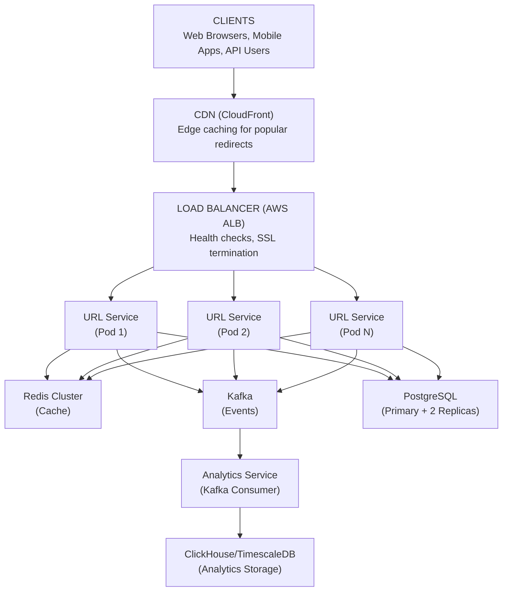
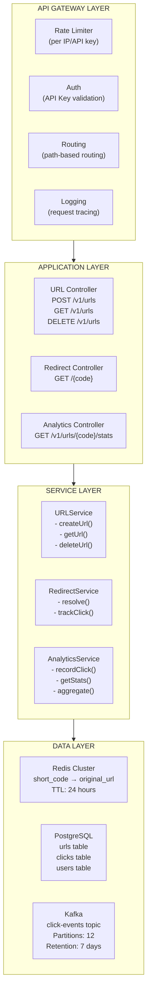
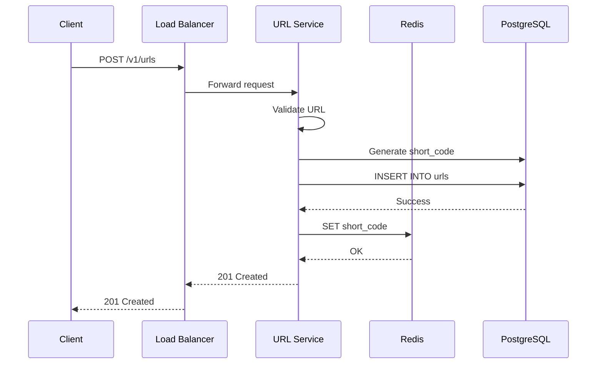
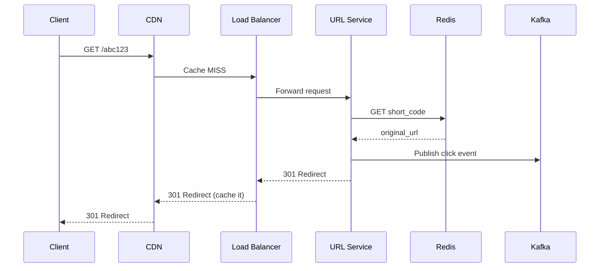
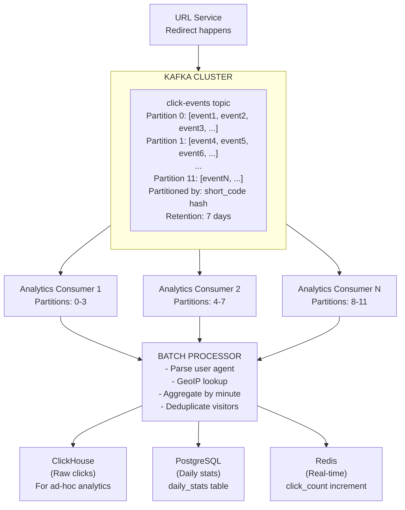
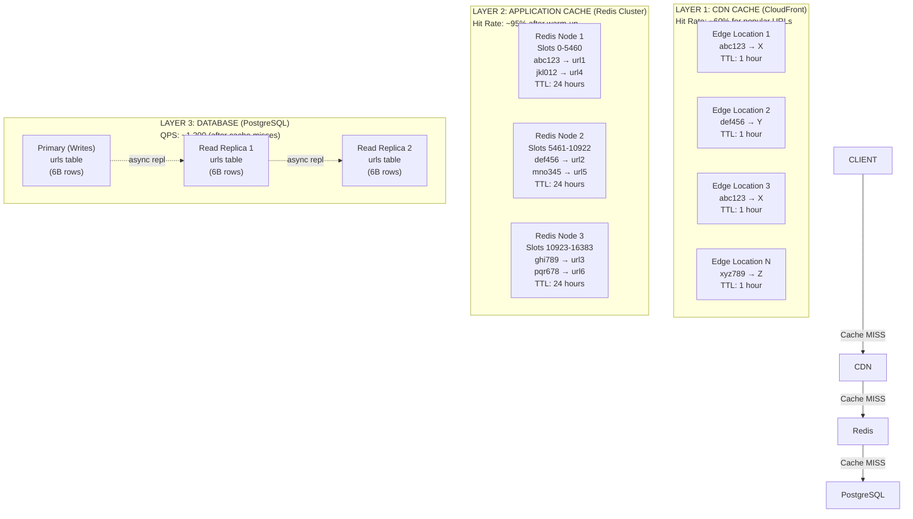
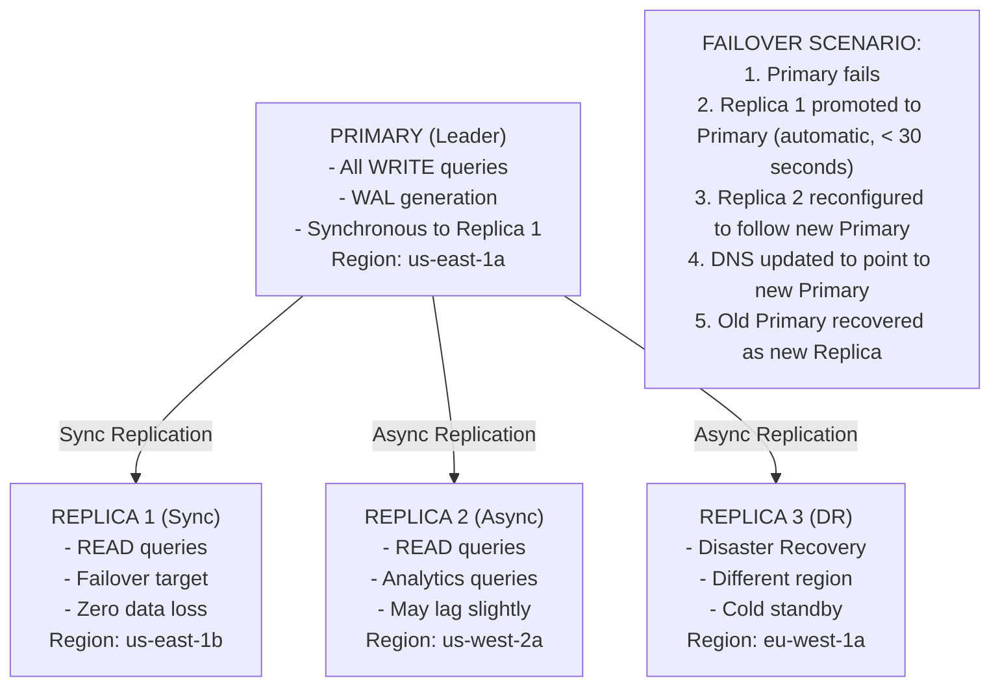
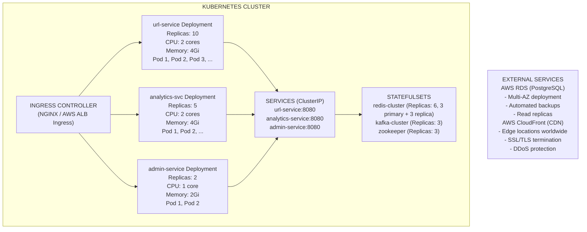
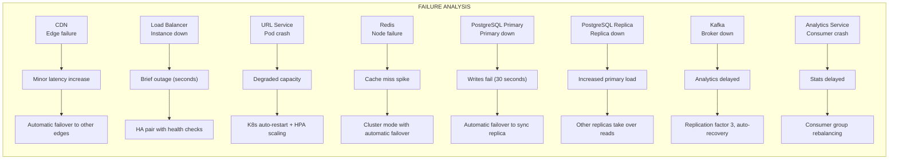

# URL Shortener - Architecture Diagrams

## Component Overview

Before looking at diagrams, let's understand each component and why it exists.

### Components Explained

| Component                 | Purpose                                | Why It Exists                                         |
| ------------------------- | -------------------------------------- | ----------------------------------------------------- |
| **Load Balancer**         | Distributes traffic across servers     | Single server can't handle 12K QPS; provides failover |
| **API Gateway**           | Rate limiting, authentication, routing | Centralizes cross-cutting concerns                    |
| **URL Service**           | Core business logic                    | Creates short URLs, handles redirects                 |
| **Cache (Redis)**         | Fast URL lookups                       | Database can't handle 12K QPS directly                |
| **Database (PostgreSQL)** | Persistent storage                     | Source of truth for all URL mappings                  |
| **Analytics Service**     | Click tracking                         | Separates analytics from critical path                |
| **Message Queue (Kafka)** | Async click processing                 | Decouples redirect from analytics                     |
| **CDN**                   | Edge caching                           | Reduces latency for global users                      |

---

## High-Level Architecture



<details>
<summary>ASCII diagram (reference)</summary>

```text
┌─────────────────────────────────────────────────────────────────────────────┐
│                                   CLIENTS                                    │
│                    (Web Browsers, Mobile Apps, API Users)                   │
└─────────────────────────────────────────────────────────────────────────────┘
                                      │
                                      ▼
┌─────────────────────────────────────────────────────────────────────────────┐
│                              CDN (CloudFront)                                │
│                     Edge caching for popular redirects                       │
└─────────────────────────────────────────────────────────────────────────────┘
                                      │
                                      ▼
┌─────────────────────────────────────────────────────────────────────────────┐
│                         LOAD BALANCER (AWS ALB)                              │
│                    Health checks, SSL termination                            │
└─────────────────────────────────────────────────────────────────────────────┘
                                      │
                    ┌─────────────────┼─────────────────┐
                    ▼                 ▼                 ▼
            ┌─────────────┐   ┌─────────────┐   ┌─────────────┐
            │ URL Service │   │ URL Service │   │ URL Service │
            │  (Pod 1)    │   │  (Pod 2)    │   │  (Pod N)    │
            └──────┬──────┘   └──────┬──────┘   └──────┬──────┘
                   │                 │                 │
                   └────────────┬────┴────────────────┘
                                │
              ┌─────────────────┼─────────────────┐
              ▼                 ▼                 ▼
    ┌──────────────────┐ ┌──────────────┐ ┌──────────────────┐
    │   Redis Cluster  │ │   Kafka      │ │   PostgreSQL     │
    │   (Cache)        │ │   (Events)   │ │   (Primary + 2   │
    │                  │ │              │ │    Replicas)     │
    └──────────────────┘ └──────┬───────┘ └──────────────────┘
                                │
                                ▼
                    ┌──────────────────────┐
                    │  Analytics Service   │
                    │  (Kafka Consumer)    │
                    └──────────┬───────────┘
                               │
                               ▼
                    ┌──────────────────────┐
                    │  ClickHouse/TimescaleDB│
                    │  (Analytics Storage)  │
                    └──────────────────────┘
```

</details>
```

---

## Detailed Component Diagram



<details>
<summary>ASCII diagram (reference)</summary>

```text
┌─────────────────────────────────────────────────────────────────────────────────────┐
│                                                                                      │
│  ┌─────────────────────────────────────────────────────────────────────────────┐    │
│  │                           API GATEWAY LAYER                                  │    │
│  │  ┌──────────────┐  ┌──────────────┐  ┌──────────────┐  ┌──────────────┐     │    │
│  │  │ Rate Limiter │  │    Auth      │  │   Routing    │  │   Logging    │     │    │
│  │  │  (per IP/    │  │  (API Key    │  │  (path-based │  │  (request    │     │    │
│  │  │   API key)   │  │   validation)│  │   routing)   │  │   tracing)   │     │    │
│  │  └──────────────┘  └──────────────┘  └──────────────┘  └──────────────┘     │    │
│  └─────────────────────────────────────────────────────────────────────────────┘    │
│                                         │                                            │
│                    ┌────────────────────┼────────────────────┐                      │
│                    ▼                    ▼                    ▼                      │
│  ┌─────────────────────────────────────────────────────────────────────────────┐    │
│  │                          APPLICATION LAYER                                   │    │
│  │                                                                              │    │
│  │  ┌────────────────────┐  ┌────────────────────┐  ┌────────────────────┐     │    │
│  │  │   URL Controller   │  │ Redirect Controller│  │Analytics Controller│     │    │
│  │  │                    │  │                    │  │                    │     │    │
│  │  │  POST /v1/urls     │  │  GET /{code}       │  │  GET /v1/urls/     │     │    │
│  │  │  GET /v1/urls      │  │                    │  │      {code}/stats  │     │    │
│  │  │  DELETE /v1/urls   │  │                    │  │                    │     │    │
│  │  └─────────┬──────────┘  └─────────┬──────────┘  └─────────┬──────────┘     │    │
│  │            │                       │                       │                 │    │
│  │            ▼                       ▼                       ▼                 │    │
│  │  ┌────────────────────────────────────────────────────────────────────┐     │    │
│  │  │                         SERVICE LAYER                               │     │    │
│  │  │                                                                     │     │    │
│  │  │  ┌─────────────────┐  ┌─────────────────┐  ┌─────────────────┐     │     │    │
│  │  │  │   URLService    │  │ RedirectService │  │ AnalyticsService│     │     │    │
│  │  │  │                 │  │                 │  │                 │     │     │    │
│  │  │  │ - createUrl()   │  │ - resolve()     │  │ - recordClick() │     │     │    │
│  │  │  │ - getUrl()      │  │ - trackClick()  │  │ - getStats()    │     │     │    │
│  │  │  │ - deleteUrl()   │  │                 │  │ - aggregate()   │     │     │    │
│  │  │  └────────┬────────┘  └────────┬────────┘  └────────┬────────┘     │     │    │
│  │  │           │                    │                    │              │     │    │
│  │  └───────────┼────────────────────┼────────────────────┼──────────────┘     │    │
│  │              │                    │                    │                    │    │
│  └──────────────┼────────────────────┼────────────────────┼────────────────────┘    │
│                 │                    │                    │                         │
│  ┌──────────────┼────────────────────┼────────────────────┼────────────────────┐    │
│  │              ▼                    ▼                    ▼                    │    │
│  │                              DATA LAYER                                     │    │
│  │                                                                             │    │
│  │  ┌─────────────────┐  ┌─────────────────┐  ┌─────────────────────────┐     │    │
│  │  │  Redis Cluster  │  │   PostgreSQL    │  │        Kafka            │     │    │
│  │  │                 │  │                 │  │                         │     │    │
│  │  │  short_code →   │  │  urls table     │  │  click-events topic     │     │    │
│  │  │  original_url   │  │  clicks table   │  │                         │     │    │
│  │  │                 │  │  users table    │  │  Partitions: 12         │     │    │
│  │  │  TTL: 24 hours  │  │                 │  │  Retention: 7 days      │     │    │
│  │  └─────────────────┘  └─────────────────┘  └─────────────────────────┘     │    │
│  │                                                                             │    │
│  └─────────────────────────────────────────────────────────────────────────────┘    │
│                                                                                      │
└─────────────────────────────────────────────────────────────────────────────────────┘
```

</details>
```

---

## Request Flow: URL Creation

### Sequence Diagram



<details>
<summary>ASCII diagram (reference)</summary>

```text
┌──────┐     ┌────────────┐     ┌────────────┐     ┌───────┐     ┌──────────┐
│Client│     │Load Balancer│    │URL Service │     │ Redis │     │PostgreSQL│
└──┬───┘     └─────┬──────┘     └─────┬──────┘     └───┬───┘     └────┬─────┘
   │               │                  │                │              │
   │ POST /v1/urls │                  │                │              │
   │──────────────>│                  │                │              │
   │               │                  │                │              │
   │               │ Forward request  │                │              │
   │               │─────────────────>│                │              │
   │               │                  │                │              │
   │               │                  │ Validate URL   │              │
   │               │                  │────────────────│              │
   │               │                  │                │              │
   │               │                  │ Generate short_code           │
   │               │                  │────────────────────────────────│
   │               │                  │                │              │
   │               │                  │           INSERT INTO urls    │
   │               │                  │──────────────────────────────>│
   │               │                  │                │              │
   │               │                  │                │    Success   │
   │               │                  │<──────────────────────────────│
   │               │                  │                │              │
   │               │                  │ SET short_code │              │
   │               │                  │───────────────>│              │
   │               │                  │                │              │
   │               │                  │      OK        │              │
   │               │                  │<───────────────│              │
   │               │                  │                │              │
   │               │  201 Created     │                │              │
   │               │<─────────────────│                │              │
   │               │                  │                │              │
   │ 201 Created   │                  │                │              │
   │<──────────────│                  │                │              │
   │               │                  │                │              │
```

</details>
```

### Step-by-Step Explanation

1. **Client sends POST request** with the long URL to create
2. **Load Balancer** receives request, performs health check, forwards to healthy server
3. **URL Service** validates the URL format (must be valid HTTP/HTTPS)
4. **URL Service** generates a unique short code using counter + base62 encoding
5. **PostgreSQL** stores the URL mapping (INSERT with short_code as primary key)
6. **Redis** caches the mapping for fast redirects
7. **Response** returns the short URL to the client

---

## Request Flow: URL Redirect

### Sequence Diagram



<details>
<summary>ASCII diagram (reference)</summary>

```text
┌──────┐     ┌─────┐     ┌────────────┐     ┌────────────┐     ┌───────┐     ┌───────┐
│Client│     │ CDN │     │Load Balancer│    │URL Service │     │ Redis │     │ Kafka │
└──┬───┘     └──┬──┘     └─────┬──────┘     └─────┬──────┘     └───┬───┘     └───┬───┘
   │            │              │                  │                │             │
   │ GET /abc123│              │                  │                │             │
   │───────────>│              │                  │                │             │
   │            │              │                  │                │             │
   │            │ Cache MISS   │                  │                │             │
   │            │─────────────>│                  │                │             │
   │            │              │                  │                │             │
   │            │              │ Forward request  │                │             │
   │            │              │─────────────────>│                │             │
   │            │              │                  │                │             │
   │            │              │                  │ GET short_code │             │
   │            │              │                  │───────────────>│             │
   │            │              │                  │                │             │
   │            │              │                  │  original_url  │             │
   │            │              │                  │<───────────────│             │
   │            │              │                  │                │             │
   │            │              │                  │ Publish click event          │
   │            │              │                  │───────────────────────────>│
   │            │              │                  │                │             │
   │            │              │ 301 Redirect     │                │             │
   │            │              │<─────────────────│                │             │
   │            │              │                  │                │             │
   │            │ 301 Redirect │                  │                │             │
   │            │ (cache it)   │                  │                │             │
   │            │<─────────────│                  │                │             │
   │            │              │                  │                │             │
   │ 301 Redirect              │                  │                │             │
   │<───────────│              │                  │                │             │
   │            │              │                  │                │             │
```

</details>
```

### Step-by-Step Explanation

1. **Client clicks short URL** (e.g., `https://tiny.url/abc123`)
2. **CDN checks cache** for this short code
   - If cached: Return 301 redirect immediately (fastest path)
   - If not cached: Forward to origin
3. **Load Balancer** routes to healthy URL Service instance
4. **URL Service** checks Redis for the short code
   - If found: Use cached original URL
   - If not found: Query PostgreSQL, then cache in Redis
5. **Publish click event** to Kafka (async, non-blocking)
6. **Return 301 redirect** with original URL in Location header
7. **CDN caches** the redirect for future requests

### Cache Hit Path (Fastest)

```
Client → CDN (cache hit) → 301 Redirect
Latency: ~10ms
```

### Cache Miss Path (Normal)

```
Client → CDN → Load Balancer → URL Service → Redis → 301 Redirect
Latency: ~30ms
```

### Full Miss Path (Rare)

```
Client → CDN → LB → URL Service → Redis (miss) → PostgreSQL → 301 Redirect
Latency: ~50ms
```

---

## Analytics Data Flow



<details>
<summary>ASCII diagram (reference)</summary>

```text
┌─────────────────────────────────────────────────────────────────────────────────────┐
│                            ANALYTICS PIPELINE                                        │
└─────────────────────────────────────────────────────────────────────────────────────┘

  ┌─────────────┐     ┌─────────────────────────────────────────────────────────┐
  │ URL Service │     │                    KAFKA CLUSTER                         │
  │             │     │  ┌─────────────────────────────────────────────────┐    │
  │ Redirect    │────>│  │            click-events topic                   │    │
  │ happens     │     │  │                                                 │    │
  │             │     │  │  Partition 0: [event1, event2, event3, ...]    │    │
  └─────────────┘     │  │  Partition 1: [event4, event5, event6, ...]    │    │
                      │  │  ...                                            │    │
                      │  │  Partition 11: [eventN, ...]                    │    │
                      │  │                                                 │    │
                      │  │  Partitioned by: short_code hash                │    │
                      │  │  Retention: 7 days                              │    │
                      │  └─────────────────────────────────────────────────┘    │
                      └─────────────────────────────────────────────────────────┘
                                              │
                                              │
                    ┌─────────────────────────┼─────────────────────────┐
                    ▼                         ▼                         ▼
          ┌─────────────────┐       ┌─────────────────┐       ┌─────────────────┐
          │ Analytics       │       │ Analytics       │       │ Analytics       │
          │ Consumer 1      │       │ Consumer 2      │       │ Consumer N      │
          │                 │       │                 │       │                 │
          │ Partitions: 0-3 │       │ Partitions: 4-7 │       │ Partitions: 8-11│
          └────────┬────────┘       └────────┬────────┘       └────────┬────────┘
                   │                         │                         │
                   └─────────────────────────┼─────────────────────────┘
                                             │
                                             ▼
                              ┌───────────────────────────┐
                              │      BATCH PROCESSOR      │
                              │                           │
                              │  - Parse user agent       │
                              │  - GeoIP lookup           │
                              │  - Aggregate by minute    │
                              │  - Deduplicate visitors   │
                              └─────────────┬─────────────┘
                                            │
                          ┌─────────────────┼─────────────────┐
                          ▼                 ▼                 ▼
               ┌──────────────────┐ ┌──────────────────┐ ┌──────────────────┐
               │   ClickHouse     │ │   PostgreSQL     │ │   Redis          │
               │   (Raw clicks)   │ │   (Daily stats)  │ │   (Real-time)    │
               │                  │ │                  │ │                  │
               │   For ad-hoc     │ │   daily_stats    │ │   click_count    │
               │   analytics      │ │   table          │ │   increment      │
               └──────────────────┘ └──────────────────┘ └──────────────────┘
```

</details>
```

### Why This Architecture?

1. **Kafka decouples redirect from analytics**: Redirect returns immediately, analytics processed async
2. **Partitioning by short_code**: All events for same URL go to same partition (ordering preserved)
3. **Multiple consumers**: Parallel processing for throughput
4. **Multiple storage backends**: Different use cases need different databases

---

## Caching Architecture



<details>
<summary>ASCII diagram (reference)</summary>

```text
┌─────────────────────────────────────────────────────────────────────────────────────┐
│                              MULTI-LAYER CACHING                                     │
└─────────────────────────────────────────────────────────────────────────────────────┘

                              ┌───────────────────┐
                              │      CLIENT       │
                              └─────────┬─────────┘
                                        │
                                        ▼
┌─────────────────────────────────────────────────────────────────────────────────────┐
│  LAYER 1: CDN CACHE (CloudFront)                                                     │
│  ┌─────────────────────────────────────────────────────────────────────────────┐    │
│  │  Edge Location 1     Edge Location 2     Edge Location 3     Edge Location N │    │
│  │  ┌─────────────┐     ┌─────────────┐     ┌─────────────┐     ┌─────────────┐ │    │
│  │  │ abc123 → X  │     │ def456 → Y  │     │ abc123 → X  │     │ xyz789 → Z  │ │    │
│  │  │ TTL: 1 hour │     │ TTL: 1 hour │     │ TTL: 1 hour │     │ TTL: 1 hour │ │    │
│  │  └─────────────┘     └─────────────┘     └─────────────┘     └─────────────┘ │    │
│  └─────────────────────────────────────────────────────────────────────────────┘    │
│  Hit Rate: ~60% for popular URLs                                                     │
└─────────────────────────────────────────────────────────────────────────────────────┘
                                        │
                                        │ Cache MISS
                                        ▼
┌─────────────────────────────────────────────────────────────────────────────────────┐
│  LAYER 2: APPLICATION CACHE (Redis Cluster)                                          │
│  ┌─────────────────────────────────────────────────────────────────────────────┐    │
│  │  Redis Node 1          Redis Node 2          Redis Node 3                    │    │
│  │  ┌─────────────────┐   ┌─────────────────┐   ┌─────────────────┐            │    │
│  │  │ Slots 0-5460    │   │ Slots 5461-10922│   │ Slots 10923-16383│           │    │
│  │  │                 │   │                 │   │                 │            │    │
│  │  │ abc123 → url1   │   │ def456 → url2   │   │ ghi789 → url3   │            │    │
│  │  │ jkl012 → url4   │   │ mno345 → url5   │   │ pqr678 → url6   │            │    │
│  │  │ TTL: 24 hours   │   │ TTL: 24 hours   │   │ TTL: 24 hours   │            │    │
│  │  └─────────────────┘   └─────────────────┘   └─────────────────┘            │    │
│  └─────────────────────────────────────────────────────────────────────────────┘    │
│  Hit Rate: ~95% after warm-up                                                        │
└─────────────────────────────────────────────────────────────────────────────────────┘
                                        │
                                        │ Cache MISS
                                        ▼
┌─────────────────────────────────────────────────────────────────────────────────────┐
│  LAYER 3: DATABASE (PostgreSQL)                                                      │
│  ┌─────────────────────────────────────────────────────────────────────────────┐    │
│  │  Primary (Writes)              Read Replica 1           Read Replica 2       │    │
│  │  ┌─────────────────┐          ┌─────────────────┐      ┌─────────────────┐   │    │
│  │  │                 │          │                 │      │                 │   │    │
│  │  │   urls table    │  ──────> │   urls table    │ ───> │   urls table    │   │    │
│  │  │   (6B rows)     │  async   │   (6B rows)     │ async│   (6B rows)     │   │    │
│  │  │                 │  repl    │                 │ repl │                 │   │    │
│  │  └─────────────────┘          └─────────────────┘      └─────────────────┘   │    │
│  └─────────────────────────────────────────────────────────────────────────────┘    │
│  QPS: ~1,200 (after cache misses)                                                    │
└─────────────────────────────────────────────────────────────────────────────────────┘
```

</details>
```

### Cache Strategy Details

| Layer      | What's Cached      | TTL      | Invalidation                |
| ---------- | ------------------ | -------- | --------------------------- |
| CDN        | Redirect responses | 1 hour   | URL deletion triggers purge |
| Redis      | URL mappings       | 24 hours | Write-through on create     |
| PostgreSQL | Source of truth    | N/A      | N/A                         |

---

## Database Replication Architecture



<details>
<summary>ASCII diagram (reference)</summary>

```text
┌─────────────────────────────────────────────────────────────────────────────────────┐
│                         PostgreSQL REPLICATION TOPOLOGY                              │
└─────────────────────────────────────────────────────────────────────────────────────┘

                              ┌───────────────────────┐
                              │    PRIMARY (Leader)    │
                              │                       │
                              │  - All WRITE queries  │
                              │  - WAL generation     │
                              │  - Synchronous to     │
                              │    Replica 1          │
                              │                       │
                              │  Region: us-east-1a   │
                              └───────────┬───────────┘
                                          │
                    ┌─────────────────────┼─────────────────────┐
                    │ Sync Replication    │ Async Replication   │
                    ▼                     │                     ▼
     ┌───────────────────────┐            │      ┌───────────────────────┐
     │   REPLICA 1 (Sync)    │            │      │   REPLICA 2 (Async)   │
     │                       │            │      │                       │
     │  - READ queries       │            │      │  - READ queries       │
     │  - Failover target    │            │      │  - Analytics queries  │
     │  - Zero data loss     │            │      │  - May lag slightly   │
     │                       │            │      │                       │
     │  Region: us-east-1b   │            │      │  Region: us-west-2a   │
     └───────────────────────┘            │      └───────────────────────┘
                                          │
                                          │ Async Replication
                                          ▼
                           ┌───────────────────────┐
                           │   REPLICA 3 (DR)      │
                           │                       │
                           │  - Disaster Recovery  │
                           │  - Different region   │
                           │  - Cold standby       │
                           │                       │
                           │  Region: eu-west-1a   │
                           └───────────────────────┘

FAILOVER SCENARIO:
─────────────────
1. Primary fails
2. Replica 1 promoted to Primary (automatic, < 30 seconds)
3. Replica 2 reconfigured to follow new Primary
4. DNS updated to point to new Primary
5. Old Primary recovered as new Replica
```

</details>
```

---

## Database Schema Design

### Database Choice: PostgreSQL

**Why PostgreSQL?**

1. **ACID compliance**: URL mappings need strong consistency
2. **Mature and reliable**: Battle-tested at scale
3. **Rich indexing**: B-tree, hash indexes for fast lookups
4. **JSON support**: Flexible metadata storage
5. **Replication**: Built-in streaming replication for HA

**Why not other options?**

| Database   | Reason Against                        |
| ---------- | ------------------------------------- |
| MongoDB    | Overkill for simple key-value lookups |
| DynamoDB   | Vendor lock-in, complex for analytics |
| Cassandra  | Write-optimized, we're read-heavy     |
| Redis only | Need durability, not just caching     |

### Core Tables

#### 1. urls Table

```sql
CREATE TABLE urls (
    -- Primary identifier
    short_code VARCHAR(8) PRIMARY KEY,

    -- Core data
    original_url VARCHAR(2048) NOT NULL,

    -- Ownership
    user_id BIGINT REFERENCES users(id),
    api_key_id BIGINT REFERENCES api_keys(id),

    -- Timestamps
    created_at TIMESTAMP WITH TIME ZONE DEFAULT NOW(),
    updated_at TIMESTAMP WITH TIME ZONE DEFAULT NOW(),
    expires_at TIMESTAMP WITH TIME ZONE,
    deleted_at TIMESTAMP WITH TIME ZONE,  -- Soft delete

    -- Flags
    is_custom BOOLEAN DEFAULT FALSE,
    redirect_type SMALLINT DEFAULT 301,  -- 301 or 302

    -- Analytics (denormalized for fast reads)
    click_count BIGINT DEFAULT 0,
    last_clicked_at TIMESTAMP WITH TIME ZONE,

    -- Flexible metadata
    metadata JSONB DEFAULT '{}',

    -- Constraints
    CONSTRAINT valid_redirect_type CHECK (redirect_type IN (301, 302, 307))
);

-- Index for redirect lookups (most critical)
CREATE INDEX idx_urls_short_code_active
ON urls(short_code)
WHERE deleted_at IS NULL AND (expires_at IS NULL OR expires_at > NOW());

-- Index for user's URLs listing
CREATE INDEX idx_urls_user_id_created
ON urls(user_id, created_at DESC)
WHERE deleted_at IS NULL;

-- Index for expiration cleanup job
CREATE INDEX idx_urls_expires_at
ON urls(expires_at)
WHERE expires_at IS NOT NULL AND deleted_at IS NULL;

-- Index for original URL lookup (to return existing short URL)
CREATE INDEX idx_urls_original_url_hash
ON urls(MD5(original_url))
WHERE deleted_at IS NULL;
```

**Why these indexes?**

| Index                    | Purpose                 | Query Pattern                                |
| ------------------------ | ----------------------- | -------------------------------------------- |
| Primary key (short_code) | Fast redirect lookup    | `WHERE short_code = ?`                       |
| user_id + created_at     | List user's URLs sorted | `WHERE user_id = ? ORDER BY created_at DESC` |
| expires_at               | Cleanup expired URLs    | `WHERE expires_at < NOW()`                   |
| original_url hash        | Deduplicate URLs        | `WHERE MD5(original_url) = ?`                |

#### 2. clicks Table (Analytics)

```sql
CREATE TABLE clicks (
    id BIGSERIAL PRIMARY KEY,
    short_code VARCHAR(8) NOT NULL,

    -- Timestamp
    clicked_at TIMESTAMP WITH TIME ZONE DEFAULT NOW(),

    -- Client info
    ip_hash VARCHAR(64),  -- Hashed for privacy
    user_agent TEXT,
    referrer VARCHAR(2048),

    -- Geo data (populated asynchronously)
    country_code CHAR(2),
    city VARCHAR(100),

    -- Device info (parsed from user agent)
    device_type VARCHAR(20),  -- mobile, desktop, tablet
    browser VARCHAR(50),
    os VARCHAR(50)
) PARTITION BY RANGE (clicked_at);

-- Create monthly partitions
CREATE TABLE clicks_2024_01 PARTITION OF clicks
    FOR VALUES FROM ('2024-01-01') TO ('2024-02-01');

CREATE TABLE clicks_2024_02 PARTITION OF clicks
    FOR VALUES FROM ('2024-02-01') TO ('2024-03-01');

-- Index for analytics queries
CREATE INDEX idx_clicks_short_code_time
ON clicks(short_code, clicked_at DESC);

-- Index for time-based aggregations
CREATE INDEX idx_clicks_time
ON clicks(clicked_at);
```

**Why partitioning?**

With 10 billion clicks/month, the clicks table grows massive. Partitioning by month allows:

- Fast deletion of old data (drop partition)
- Query optimization (partition pruning)
- Independent maintenance per partition

#### 3. users Table

```sql
CREATE TABLE users (
    id BIGSERIAL PRIMARY KEY,
    email VARCHAR(255) UNIQUE NOT NULL,
    password_hash VARCHAR(255) NOT NULL,

    created_at TIMESTAMP WITH TIME ZONE DEFAULT NOW(),
    updated_at TIMESTAMP WITH TIME ZONE DEFAULT NOW(),

    -- Account status
    status VARCHAR(20) DEFAULT 'active',
    tier VARCHAR(20) DEFAULT 'free',

    -- Settings
    default_expiry_days INTEGER DEFAULT 1825,  -- 5 years

    CONSTRAINT valid_status CHECK (status IN ('active', 'suspended', 'deleted')),
    CONSTRAINT valid_tier CHECK (tier IN ('free', 'pro', 'enterprise'))
);

CREATE INDEX idx_users_email ON users(email);
```

#### 4. api_keys Table

```sql
CREATE TABLE api_keys (
    id BIGSERIAL PRIMARY KEY,
    user_id BIGINT REFERENCES users(id) NOT NULL,

    key_hash VARCHAR(64) NOT NULL,  -- SHA-256 of actual key
    key_prefix VARCHAR(8) NOT NULL,  -- First 8 chars for identification

    name VARCHAR(100),

    created_at TIMESTAMP WITH TIME ZONE DEFAULT NOW(),
    last_used_at TIMESTAMP WITH TIME ZONE,
    expires_at TIMESTAMP WITH TIME ZONE,
    revoked_at TIMESTAMP WITH TIME ZONE,

    -- Permissions
    permissions JSONB DEFAULT '{"create": true, "read": true, "delete": true}'
);

CREATE INDEX idx_api_keys_hash ON api_keys(key_hash) WHERE revoked_at IS NULL;
CREATE INDEX idx_api_keys_user ON api_keys(user_id);
```

#### 5. daily_stats Table (Aggregated Analytics)

```sql
CREATE TABLE daily_stats (
    short_code VARCHAR(8) NOT NULL,
    date DATE NOT NULL,

    -- Aggregated metrics
    click_count INTEGER DEFAULT 0,
    unique_visitors INTEGER DEFAULT 0,

    -- Top referrers (JSONB for flexibility)
    top_referrers JSONB DEFAULT '[]',

    -- Geographic breakdown
    country_breakdown JSONB DEFAULT '{}',

    -- Device breakdown
    device_breakdown JSONB DEFAULT '{}',

    PRIMARY KEY (short_code, date)
);

CREATE INDEX idx_daily_stats_date ON daily_stats(date);
```

---

## Deployment Architecture (Kubernetes)



<details>
<summary>ASCII diagram (reference)</summary>

```text
┌─────────────────────────────────────────────────────────────────────────────────────┐
│                              KUBERNETES CLUSTER                                      │
│                                                                                      │
│  ┌───────────────────────────────────────────────────────────────────────────────┐  │
│  │                              INGRESS CONTROLLER                                │  │
│  │                         (NGINX / AWS ALB Ingress)                              │  │
│  └───────────────────────────────────────────────────────────────────────────────┘  │
│                                        │                                             │
│         ┌──────────────────────────────┼──────────────────────────────┐             │
│         ▼                              ▼                              ▼             │
│  ┌─────────────────┐          ┌─────────────────┐          ┌─────────────────┐     │
│  │ url-service     │          │ analytics-svc   │          │ admin-service   │     │
│  │ Deployment      │          │ Deployment      │          │ Deployment      │     │
│  │                 │          │                 │          │                 │     │
│  │ Replicas: 10    │          │ Replicas: 5     │          │ Replicas: 2     │     │
│  │ CPU: 2 cores    │          │ CPU: 2 cores    │          │ CPU: 1 core     │     │
│  │ Memory: 4Gi     │          │ Memory: 4Gi     │          │ Memory: 2Gi     │     │
│  │                 │          │                 │          │                 │     │
│  │ ┌─────┐ ┌─────┐│          │ ┌─────┐ ┌─────┐│          │ ┌─────┐ ┌─────┐│     │
│  │ │Pod 1│ │Pod 2││          │ │Pod 1│ │Pod 2││          │ │Pod 1│ │Pod 2││     │
│  │ └─────┘ └─────┘│          │ └─────┘ └─────┘│          │ └─────┘ └─────┘│     │
│  │ ┌─────┐ ┌─────┐│          │ ┌─────┐        │          │                 │     │
│  │ │Pod 3│ │...  ││          │ │...  │        │          │                 │     │
│  │ └─────┘ └─────┘│          │ └─────┘        │          │                 │     │
│  └─────────────────┘          └─────────────────┘          └─────────────────┘     │
│           │                            │                            │              │
│           │                            │                            │              │
│  ┌────────┴────────────────────────────┴────────────────────────────┴────────┐    │
│  │                           SERVICES (ClusterIP)                             │    │
│  │                                                                            │    │
│  │  url-service:8080    analytics-service:8080    admin-service:8080         │    │
│  └─────────────────────────────────────────────────────────────────────────────┘    │
│                                        │                                            │
│  ┌─────────────────────────────────────┴──────────────────────────────────────┐    │
│  │                              STATEFULSETS                                   │    │
│  │                                                                             │    │
│  │  ┌─────────────────┐    ┌─────────────────┐    ┌─────────────────┐         │    │
│  │  │ redis-cluster   │    │ kafka-cluster   │    │ zookeeper       │         │    │
│  │  │                 │    │                 │    │                 │         │    │
│  │  │ Replicas: 6     │    │ Replicas: 3     │    │ Replicas: 3     │         │    │
│  │  │ (3 primary +    │    │                 │    │                 │         │    │
│  │  │  3 replica)     │    │                 │    │                 │         │    │
│  │  └─────────────────┘    └─────────────────┘    └─────────────────┘         │    │
│  └─────────────────────────────────────────────────────────────────────────────┘    │
│                                                                                      │
│  ┌─────────────────────────────────────────────────────────────────────────────┐    │
│  │                              EXTERNAL SERVICES                               │    │
│  │                                                                              │    │
│  │  ┌─────────────────────────┐    ┌─────────────────────────────────────┐     │    │
│  │  │ AWS RDS (PostgreSQL)    │    │ AWS CloudFront (CDN)                 │     │    │
│  │  │                         │    │                                      │     │    │
│  │  │ - Multi-AZ deployment   │    │ - Edge locations worldwide          │     │    │
│  │  │ - Automated backups     │    │ - SSL/TLS termination               │     │    │
│  │  │ - Read replicas         │    │ - DDoS protection                   │     │    │
│  │  └─────────────────────────┘    └─────────────────────────────────────┘     │    │
│  └─────────────────────────────────────────────────────────────────────────────┘    │
│                                                                                      │
└─────────────────────────────────────────────────────────────────────────────────────┘
```

</details>
```

---

## Failure Points and Mitigation



<details>
<summary>ASCII diagram (reference)</summary>

```text
┌─────────────────────────────────────────────────────────────────────────────────────┐
│                              FAILURE ANALYSIS                                        │
└─────────────────────────────────────────────────────────────────────────────────────┘

Component              Failure Mode           Impact              Mitigation
─────────────────────────────────────────────────────────────────────────────────────
┌─────────────┐
│     CDN     │ ───── Edge failure ────── Minor latency ──── Automatic failover
│             │                           increase            to other edges
└─────────────┘

┌─────────────┐
│Load Balancer│ ───── Instance down ───── Brief outage ───── HA pair with
│             │                           (seconds)           health checks
└─────────────┘

┌─────────────┐
│ URL Service │ ───── Pod crash ───────── Degraded ────────── K8s auto-restart
│             │                           capacity            + HPA scaling
└─────────────┘

┌─────────────┐
│    Redis    │ ───── Node failure ────── Cache miss ──────── Cluster mode with
│             │                           spike               automatic failover
└─────────────┘

┌─────────────┐
│ PostgreSQL  │ ───── Primary down ────── Writes fail ─────── Automatic failover
│  Primary    │                           (30 seconds)        to sync replica
└─────────────┘

┌─────────────┐
│ PostgreSQL  │ ───── Replica down ────── Increased ────────── Other replicas
│  Replica    │                           primary load        take over reads
└─────────────┘

┌─────────────┐
│    Kafka    │ ───── Broker down ─────── Analytics ────────── Replication factor
│             │                           delayed             3, auto-recovery
└─────────────┘

┌─────────────┐
│  Analytics  │ ───── Consumer crash ──── Stats delayed ───── Consumer group
│  Service    │                                               rebalancing
└─────────────┘
```

</details>
```

---

## Summary

| Aspect            | Decision           | Rationale                               |
| ----------------- | ------------------ | --------------------------------------- |
| CDN               | CloudFront         | Global edge caching, DDoS protection    |
| Load Balancer     | AWS ALB            | Layer 7, health checks, SSL termination |
| Application       | Spring Boot on K8s | Scalable, familiar, good ecosystem      |
| Cache             | Redis Cluster      | Fast lookups, high availability         |
| Database          | PostgreSQL         | ACID, mature, good replication          |
| Message Queue     | Kafka              | High throughput, durability, replay     |
| Analytics Storage | ClickHouse         | Optimized for time-series aggregations  |
