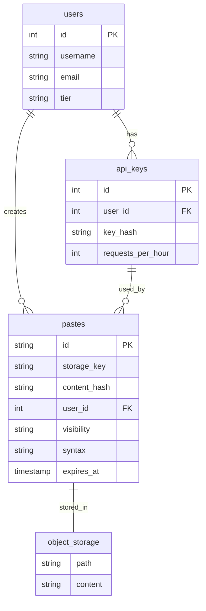

# Pastebin - API & Schema Design

## API Design Philosophy

Pastebin API differs from URL Shortener in key ways:
1. **Large payloads**: Content can be up to 10 MB
2. **Streaming support**: Large pastes need chunked transfer
3. **Content-type handling**: Support for various text formats
4. **Access control**: Authentication for private pastes

---

## Base URL Structure

```
Production: https://api.pastebin.com/v1
Web App:    https://pastebin.com
Raw Content: https://raw.pastebin.com/{paste_id}
```

---

## Authentication

### Anonymous Access
- Can create public/unlisted pastes
- Can view public/unlisted pastes
- Rate limited (stricter limits)

### Authenticated Access
```http
Authorization: Bearer {api_key}
```

- Can create private pastes
- Can manage own pastes
- Higher rate limits

---

## API Versioning Strategy

We use URL path versioning (`/v1/`, `/v2/`) because:
- Easy to understand and implement
- Clear in logs and documentation
- Allows running multiple versions simultaneously

**Backward Compatibility Rules:**

Non-breaking changes (no version bump):
- Adding new optional fields
- Adding new endpoints
- Adding new error codes

Breaking changes (require new version):
- Removing fields
- Changing field types
- Changing endpoint paths
- Changing authentication

**Deprecation Policy:**
1. Announce deprecation 6 months in advance
2. Return Deprecation header
3. Maintain old version for 12 months after new version release

---

## Rate Limiting Headers

Every response includes rate limit information:

```http
X-RateLimit-Limit: 1000
X-RateLimit-Remaining: 999
X-RateLimit-Reset: 1640000000
```

**Rate Limits by Tier:**

| Tier | Requests/hour |
|------|---------------|
| Anonymous | 100 |
| Authenticated | 10,000 |
| Premium | 100,000 |

---

## Error Model

All error responses follow this standard envelope structure:

```json
{
  "error": {
    "code": "ERROR_CODE",
    "message": "Human-readable error message",
    "details": {
      "field": "field_name",  // Optional
      "reason": "Specific reason"  // Optional
    },
    "request_id": "req_123456"  // For tracing
  }
}
```

**Error Codes Reference:**

| HTTP Status | Error Code | Description |
|-------------|------------|-------------|
| 400 | INVALID_INPUT | Request validation failed |
| 400 | CONTENT_TOO_LARGE | Paste content exceeds size limit |
| 400 | INVALID_SYNTAX | Syntax highlighting language not supported |
| 401 | UNAUTHORIZED | Authentication required |
| 403 | FORBIDDEN | Insufficient permissions |
| 404 | NOT_FOUND | Paste not found |
| 403 | PASSWORD_REQUIRED | Password required to access paste |
| 429 | RATE_LIMITED | Rate limit exceeded |
| 500 | INTERNAL_ERROR | Server error |
| 503 | SERVICE_UNAVAILABLE | Service temporarily unavailable |

**Error Response Examples:**

```json
// 400 Bad Request - Content too large
{
  "error": {
    "code": "CONTENT_TOO_LARGE",
    "message": "Paste content exceeds 10 MB limit",
    "details": {
      "max_size": 10485760,
      "actual_size": 15728640
    },
    "request_id": "req_abc123"
  }
}

// 403 Forbidden - Password required
{
  "error": {
    "code": "PASSWORD_REQUIRED",
    "message": "This paste is password protected",
    "details": {},
    "request_id": "req_xyz789"
  }
}

// 429 Rate Limited
{
  "error": {
    "code": "RATE_LIMITED",
    "message": "Rate limit exceeded. Please try again later.",
    "details": {
      "limit": 100,
      "remaining": 0,
      "reset_at": "2024-01-15T11:00:00Z"
    },
    "request_id": "req_def456"
  }
}
```

---

## Core API Endpoints

### 1. Create Paste

**Endpoint:** `POST /v1/pastes`

**Request:**
```http
POST /v1/pastes HTTP/1.1
Host: api.pastebin.com
Content-Type: application/json
Authorization: Bearer api_key_xxxxx  (optional)

{
  "content": "def hello():\n    print('Hello, World!')\n",
  "title": "My Python Script",          // Optional
  "syntax": "python",                    // Optional, for highlighting
  "visibility": "unlisted",              // public, unlisted, private
  "expires_in": "1d",                    // 10m, 1h, 1d, 1w, 1m, 1y, never
  "password": "secret123"                // Optional, for password protection
}
```

**Expiration Options:**
| Value | Duration |
|-------|----------|
| `10m` | 10 minutes |
| `1h` | 1 hour |
| `1d` | 1 day |
| `1w` | 1 week |
| `1m` | 1 month (default) |
| `1y` | 1 year |
| `never` | Never expires |

**Response (201 Created):**
```json
{
  "id": "abc12345",
  "url": "https://pastebin.com/abc12345",
  "raw_url": "https://raw.pastebin.com/abc12345",
  "title": "My Python Script",
  "syntax": "python",
  "visibility": "unlisted",
  "created_at": "2024-01-15T10:30:00Z",
  "expires_at": "2024-01-16T10:30:00Z",
  "size": 45,
  "views": 0
}
```

**Error Responses:**

```json
// 400 Bad Request - Content too large
{
  "error": {
    "code": "CONTENT_TOO_LARGE",
    "message": "Paste content exceeds 10 MB limit",
    "max_size": 10485760,
    "actual_size": 15728640
  }
}

// 400 Bad Request - Invalid syntax
{
  "error": {
    "code": "INVALID_SYNTAX",
    "message": "Unknown syntax 'pythn'. Did you mean 'python'?",
    "suggestions": ["python", "python3"]
  }
}

// 401 Unauthorized - Private paste without auth
{
  "error": {
    "code": "AUTH_REQUIRED",
    "message": "Authentication required to create private pastes"
  }
}

// 429 Too Many Requests
{
  "error": {
    "code": "RATE_LIMITED",
    "message": "Too many pastes. Limit: 10/hour for anonymous users",
    "retry_after": 1800
  }
}
```

### 2. Create Paste (Large Content - Multipart)

For pastes > 1 MB, use multipart upload:

**Endpoint:** `POST /v1/pastes/upload`

```http
POST /v1/pastes/upload HTTP/1.1
Host: api.pastebin.com
Content-Type: multipart/form-data; boundary=----FormBoundary

------FormBoundary
Content-Disposition: form-data; name="metadata"
Content-Type: application/json

{"title": "Large Log File", "syntax": "text", "expires_in": "1d"}
------FormBoundary
Content-Disposition: form-data; name="content"; filename="log.txt"
Content-Type: text/plain

[... large content here ...]
------FormBoundary--
```

---

### 3. Get Paste

**Endpoint:** `GET /v1/pastes/{paste_id}`

**Request:**
```http
GET /v1/pastes/abc12345 HTTP/1.1
Host: api.pastebin.com
Accept: application/json
```

**Response (200 OK):**
```json
{
  "id": "abc12345",
  "title": "My Python Script",
  "content": "def hello():\n    print('Hello, World!')\n",
  "syntax": "python",
  "visibility": "unlisted",
  "created_at": "2024-01-15T10:30:00Z",
  "expires_at": "2024-01-16T10:30:00Z",
  "size": 45,
  "views": 142,
  "author": {
    "username": "johndoe",
    "avatar_url": "https://..."
  }
}
```

**For password-protected pastes:**
```http
GET /v1/pastes/abc12345?password=secret123 HTTP/1.1
```

Or via header:
```http
X-Paste-Password: secret123
```

**Error Responses:**
```json
// 404 Not Found
{
  "error": {
    "code": "PASTE_NOT_FOUND",
    "message": "Paste 'abc12345' does not exist or has expired"
  }
}

// 401 Unauthorized - Password required
{
  "error": {
    "code": "PASSWORD_REQUIRED",
    "message": "This paste is password protected"
  }
}

// 403 Forbidden - Private paste
{
  "error": {
    "code": "ACCESS_DENIED",
    "message": "This paste is private"
  }
}
```

---

### 4. Get Raw Content

**Endpoint:** `GET /raw/{paste_id}`

Returns plain text content without JSON wrapper.

```http
GET /raw/abc12345 HTTP/1.1
Host: raw.pastebin.com
```

**Response:**
```http
HTTP/1.1 200 OK
Content-Type: text/plain; charset=utf-8
Content-Length: 45
Cache-Control: public, max-age=3600
X-Syntax: python

def hello():
    print('Hello, World!')
```

---

### 5. Delete Paste

**Endpoint:** `DELETE /v1/pastes/{paste_id}`

```http
DELETE /v1/pastes/abc12345 HTTP/1.1
Host: api.pastebin.com
Authorization: Bearer api_key_xxxxx
```

**Response (204 No Content):**
```http
HTTP/1.1 204 No Content
```

---

### 6. List User's Pastes

**Endpoint:** `GET /v1/users/me/pastes`

```http
GET /v1/users/me/pastes?page=1&limit=20 HTTP/1.1
Host: api.pastebin.com
Authorization: Bearer api_key_xxxxx
```

**Response (200 OK):**
```json
{
  "data": [
    {
      "id": "abc12345",
      "title": "My Python Script",
      "syntax": "python",
      "visibility": "unlisted",
      "created_at": "2024-01-15T10:30:00Z",
      "expires_at": "2024-01-16T10:30:00Z",
      "size": 45,
      "views": 142
    }
  ],
  "pagination": {
    "page": 1,
    "limit": 20,
    "total_items": 56,
    "total_pages": 3
  }
}
```

---

### 7. List Recent Public Pastes

**Endpoint:** `GET /v1/pastes/recent`

```http
GET /v1/pastes/recent?limit=20&syntax=python HTTP/1.1
Host: api.pastebin.com
```

**Response:**
```json
{
  "data": [
    {
      "id": "xyz78901",
      "title": "Flask API Example",
      "syntax": "python",
      "created_at": "2024-01-15T12:00:00Z",
      "size": 1024,
      "views": 50
    }
  ]
}
```

---

## Database Schema Design

### Database Choice: PostgreSQL + Object Storage

**Why this hybrid approach?**

1. **PostgreSQL for metadata**: Fast queries, indexing, relationships
2. **Object Storage (S3) for content**: 
   - Scalable to petabytes
   - Cost-effective for large files
   - Built-in CDN integration

**Why not store content in PostgreSQL?**
- Large TEXT columns hurt query performance
- Backup/restore becomes slow
- Storage costs are higher

### Core Tables

#### 1. pastes Table (Metadata)

```sql
CREATE TABLE pastes (
    -- Primary identifier
    id VARCHAR(8) PRIMARY KEY,
    
    -- Content reference
    storage_key VARCHAR(255) NOT NULL,  -- S3 key
    content_hash VARCHAR(64) NOT NULL,  -- SHA-256 for deduplication
    size_bytes BIGINT NOT NULL,
    
    -- Metadata
    title VARCHAR(255),
    syntax VARCHAR(50) DEFAULT 'text',
    
    -- Access control
    visibility VARCHAR(20) DEFAULT 'unlisted',
    password_hash VARCHAR(255),  -- bcrypt hash if password protected
    
    -- Ownership
    user_id BIGINT REFERENCES users(id),  -- NULL for anonymous
    
    -- Timestamps
    created_at TIMESTAMP WITH TIME ZONE DEFAULT NOW(),
    expires_at TIMESTAMP WITH TIME ZONE,
    deleted_at TIMESTAMP WITH TIME ZONE,
    
    -- Analytics
    view_count BIGINT DEFAULT 0,
    last_viewed_at TIMESTAMP WITH TIME ZONE,
    
    -- Constraints
    CONSTRAINT valid_visibility CHECK (visibility IN ('public', 'unlisted', 'private')),
    CONSTRAINT valid_size CHECK (size_bytes <= 10485760)  -- 10 MB
);

-- Index for user's pastes
CREATE INDEX idx_pastes_user_created ON pastes(user_id, created_at DESC)
    WHERE deleted_at IS NULL;

-- Index for public pastes listing
CREATE INDEX idx_pastes_public_recent ON pastes(created_at DESC)
    WHERE visibility = 'public' AND deleted_at IS NULL AND expires_at > NOW();

-- Index for expiration cleanup
CREATE INDEX idx_pastes_expires ON pastes(expires_at)
    WHERE expires_at IS NOT NULL AND deleted_at IS NULL;

-- Index for content deduplication
CREATE INDEX idx_pastes_content_hash ON pastes(content_hash);
```

#### 2. users Table

```sql
CREATE TABLE users (
    id BIGSERIAL PRIMARY KEY,
    username VARCHAR(50) UNIQUE NOT NULL,
    email VARCHAR(255) UNIQUE NOT NULL,
    password_hash VARCHAR(255) NOT NULL,
    
    created_at TIMESTAMP WITH TIME ZONE DEFAULT NOW(),
    last_login_at TIMESTAMP WITH TIME ZONE,
    
    -- Settings
    default_visibility VARCHAR(20) DEFAULT 'unlisted',
    default_expiry VARCHAR(10) DEFAULT '1m',
    
    -- Limits
    tier VARCHAR(20) DEFAULT 'free',
    storage_used_bytes BIGINT DEFAULT 0,
    
    CONSTRAINT valid_tier CHECK (tier IN ('free', 'pro', 'enterprise'))
);
```

#### 3. api_keys Table

```sql
CREATE TABLE api_keys (
    id BIGSERIAL PRIMARY KEY,
    user_id BIGINT REFERENCES users(id) NOT NULL,
    
    key_hash VARCHAR(64) NOT NULL,
    key_prefix VARCHAR(8) NOT NULL,
    name VARCHAR(100),
    
    created_at TIMESTAMP WITH TIME ZONE DEFAULT NOW(),
    last_used_at TIMESTAMP WITH TIME ZONE,
    expires_at TIMESTAMP WITH TIME ZONE,
    revoked_at TIMESTAMP WITH TIME ZONE,
    
    -- Rate limits
    requests_per_hour INTEGER DEFAULT 1000
);

CREATE INDEX idx_api_keys_hash ON api_keys(key_hash) WHERE revoked_at IS NULL;
```

#### 4. syntax_languages Table

```sql
CREATE TABLE syntax_languages (
    code VARCHAR(50) PRIMARY KEY,
    name VARCHAR(100) NOT NULL,
    aliases TEXT[],  -- Alternative names
    file_extensions TEXT[],  -- .py, .python
    
    -- For auto-detection
    first_line_pattern VARCHAR(255),  -- e.g., "#!/usr/bin/python"
    
    is_active BOOLEAN DEFAULT TRUE
);

-- Sample data
INSERT INTO syntax_languages (code, name, aliases, file_extensions) VALUES
('python', 'Python', ARRAY['py', 'python3'], ARRAY['.py', '.pyw']),
('javascript', 'JavaScript', ARRAY['js', 'node'], ARRAY['.js', '.mjs']),
('java', 'Java', ARRAY[], ARRAY['.java']),
('sql', 'SQL', ARRAY['mysql', 'postgresql'], ARRAY['.sql']);
```

---

## Object Storage Schema

### S3 Bucket Structure

```
pastebin-content/
├── pastes/
│   ├── 2024/
│   │   ├── 01/
│   │   │   ├── 15/
│   │   │   │   ├── abc12345.txt.gz
│   │   │   │   ├── def67890.txt.gz
│   │   │   │   └── ...
│   │   │   └── 16/
│   │   │       └── ...
│   │   └── 02/
│   │       └── ...
│   └── ...
└── deduplicated/
    ├── sha256-{hash}.txt.gz  -- Shared content
    └── ...
```

### Storage Key Format

```
pastes/{year}/{month}/{day}/{paste_id}.txt.gz

Example: pastes/2024/01/15/abc12345.txt.gz
```

### Metadata in S3

Each object has metadata:
```json
{
  "x-amz-meta-paste-id": "abc12345",
  "x-amz-meta-syntax": "python",
  "x-amz-meta-size-original": "45",
  "x-amz-meta-created-at": "2024-01-15T10:30:00Z"
}
```

---

## Content Deduplication

### Why Deduplicate?

Many pastes contain identical content (common code snippets, templates).

### How It Works

```java
public class PasteService {
    
    public Paste createPaste(CreatePasteRequest request) {
        // 1. Hash the content
        String contentHash = DigestUtils.sha256Hex(request.getContent());
        
        // 2. Check for existing content
        Optional<String> existingKey = storageService.findByHash(contentHash);
        
        String storageKey;
        if (existingKey.isPresent()) {
            // 3a. Reuse existing content
            storageKey = existingKey.get();
            log.info("Deduplicated paste, reusing {}", storageKey);
        } else {
            // 3b. Store new content
            storageKey = storageService.store(request.getContent());
        }
        
        // 4. Create paste record (always new)
        return pasteRepository.save(Paste.builder()
            .id(generateId())
            .storageKey(storageKey)
            .contentHash(contentHash)
            .title(request.getTitle())
            .build());
    }
}
```

### Deduplication Rate

Estimated 10-15% of pastes are duplicates (common error messages, boilerplate code).

---

## Entity Relationship Diagram



<details>
<summary>ASCII diagram (reference)</summary>

```text
┌─────────────────┐       ┌─────────────────┐
│     users       │       │    api_keys     │
├─────────────────┤       ├─────────────────┤
│ id (PK)         │───┐   │ id (PK)         │
│ username        │   │   │ user_id (FK)    │──┐
│ email           │   │   │ key_hash        │  │
│ tier            │   │   │ requests/hour   │  │
└─────────────────┘   │   └─────────────────┘  │
                      │                        │
                      └────────────┬───────────┘
                                   │
                                   ▼
                        ┌─────────────────────┐
                        │       pastes        │
                        ├─────────────────────┤
                        │ id (PK)             │
                        │ storage_key         │──────┐
                        │ content_hash        │      │
                        │ user_id (FK)        │      │
                        │ visibility          │      │
                        │ syntax              │      │
                        │ expires_at          │      │
                        └─────────────────────┘      │
                                                     │
                                                     ▼
                                          ┌─────────────────────┐
                                          │   Object Storage    │
                                          │       (S3)          │
                                          ├─────────────────────┤
                                          │ pastes/2024/01/...  │
                                          │ deduplicated/...    │
                                          └─────────────────────┘
```

</details>
```

---

## Paste ID Generation

### Requirements
- 8 characters (62^8 = 218 trillion combinations)
- URL-safe (alphanumeric only)
- Not sequential (prevent enumeration)

### Implementation

```java
public class PasteIdGenerator {
    
    private static final String ALPHABET = 
        "0123456789ABCDEFGHIJKLMNOPQRSTUVWXYZabcdefghijklmnopqrstuvwxyz";
    
    private final SecureRandom random = new SecureRandom();
    
    public String generate() {
        StringBuilder sb = new StringBuilder(8);
        for (int i = 0; i < 8; i++) {
            sb.append(ALPHABET.charAt(random.nextInt(62)));
        }
        return sb.toString();
    }
    
    // Collision handling
    public String generateUnique(PasteRepository repository) {
        for (int attempt = 0; attempt < 10; attempt++) {
            String id = generate();
            if (!repository.existsById(id)) {
                return id;
            }
        }
        throw new RuntimeException("Failed to generate unique ID after 10 attempts");
    }
}
```

### Collision Probability

```
With 10M pastes and 62^8 possible IDs:
Probability of collision ≈ n² / (2 × N)
= (10M)² / (2 × 218T)
= 10^14 / (4.36 × 10^14)
≈ 0.23 (23% chance of at least one collision)

After 100M pastes:
≈ 2.3% chance per new paste
```

Solution: Check for collision and retry.

---

## Rate Limiting

### Limits by User Type

| User Type | Create/hour | View/hour | Storage Limit |
|-----------|-------------|-----------|---------------|
| Anonymous | 10 | 1000 | N/A |
| Free | 100 | 10,000 | 100 MB |
| Pro | 1000 | Unlimited | 10 GB |
| Enterprise | Unlimited | Unlimited | Unlimited |

### Rate Limit Headers

```http
X-RateLimit-Limit: 100
X-RateLimit-Remaining: 95
X-RateLimit-Reset: 1705312800
X-RateLimit-Resource: paste-create
```

---

## Input Validation

### Content Validation

```java
public class ContentValidator {
    
    private static final long MAX_SIZE = 10 * 1024 * 1024; // 10 MB
    
    public ValidationResult validate(String content) {
        // 1. Size check
        if (content.getBytes(StandardCharsets.UTF_8).length > MAX_SIZE) {
            return ValidationResult.invalid("Content exceeds 10 MB limit");
        }
        
        // 2. Empty check
        if (content.isBlank()) {
            return ValidationResult.invalid("Content cannot be empty");
        }
        
        // 3. Binary content check
        if (containsBinaryData(content)) {
            return ValidationResult.invalid("Binary content not allowed");
        }
        
        // 4. Malware pattern check (optional)
        if (containsMalwarePatterns(content)) {
            return ValidationResult.flagged("Content flagged for review");
        }
        
        return ValidationResult.valid();
    }
    
    private boolean containsBinaryData(String content) {
        // Check for null bytes or control characters
        return content.chars().anyMatch(c -> c == 0 || (c < 32 && c != 9 && c != 10 && c != 13));
    }
}
```

---

## API Versioning

### Strategy: URL Path Versioning

```
/v1/pastes  - Current version
/v2/pastes  - Future version (when needed)
```

### Deprecation Headers

```http
Deprecation: true
Sunset: Sat, 01 Jul 2025 00:00:00 GMT
Link: <https://api.pastebin.com/v2/pastes>; rel="successor-version"
```

---

## Idempotency Model

### What is Idempotency?

An operation is **idempotent** if performing it multiple times has the same effect as performing it once. This is critical for handling retries, network failures, and duplicate requests when creating pastes.

### Idempotent Operations in Pastebin

| Operation | Idempotent? | Mechanism |
|-----------|-------------|-----------|
| **Create Paste** | ✅ Yes | Idempotency key or content hash deduplication |
| **Get Paste** | ✅ Yes | Read-only, no side effects |
| **Delete Paste** | ✅ Yes | DELETE is idempotent (safe to retry) |
| **Update Paste** | ✅ Yes | Version-based updates prevent conflicts |
| **Record View** | ⚠️ At-least-once | Deduplication by (paste_id, ip_hash, timestamp) |

### Idempotency Implementation

**1. Paste Creation with Idempotency Key:**

```java
@PostMapping("/v1/pastes")
public ResponseEntity<PasteResponse> createPaste(
        @RequestBody CreatePasteRequest request,
        @RequestHeader(value = "Idempotency-Key", required = false) String idempotencyKey) {
    
    // If idempotency key provided, check for existing paste
    if (idempotencyKey != null) {
        Paste existing = pasteRepository.findByIdempotencyKey(idempotencyKey);
        if (existing != null) {
            return ResponseEntity.ok(PasteResponse.from(existing));
        }
    }
    
    // Check for content deduplication (optional: if same content + user)
    if (request.getUserId() != null) {
        String contentHash = DigestUtils.sha256Hex(request.getContent());
        Paste duplicate = pasteRepository.findByContentHashAndUserId(contentHash, request.getUserId());
        if (duplicate != null && duplicate.getCreatedAt().isAfter(Instant.now().minus(1, ChronoUnit.HOURS))) {
            // Same content created within last hour, return existing
            return ResponseEntity.ok(PasteResponse.from(duplicate));
        }
    }
    
    // Create new paste
    Paste paste = pasteService.createPaste(request, idempotencyKey);
    
    return ResponseEntity.status(201).body(PasteResponse.from(paste));
}
```

**2. Content Deduplication (Storage-Level):**

```java
public Paste createPaste(CreatePasteRequest request, String idempotencyKey) {
    // Calculate content hash
    String contentHash = DigestUtils.sha256Hex(request.getContent());
    
    // Check if content already stored (deduplication)
    StorageKey existingKey = storageService.findByContentHash(contentHash);
    
    String storageKey;
    if (existingKey != null) {
        // Content already exists, reuse storage
        storageKey = existingKey.getKey();
        storageService.incrementReferenceCount(storageKey);
    } else {
        // New content, upload to S3
        storageKey = storageService.uploadContent(request.getContent(), contentHash);
    }
    
    // Create paste metadata
    Paste paste = Paste.builder()
        .id(generatePasteId())
        .contentHash(contentHash)
        .storageKey(storageKey)
        .idempotencyKey(idempotencyKey)
        .title(request.getTitle())
        .syntax(request.getSyntax())
        .visibility(request.getVisibility())
        .expiresAt(calculateExpiration(request.getExpiresIn()))
        .build();
    
    return pasteRepository.save(paste);
}
```

**3. View Count Deduplication:**

```java
// Deduplicate view counts by (paste_id, ip_hash, timestamp)
public void recordView(String pasteId, String ipAddress) {
    String ipHash = DigestUtils.sha256Hex(ipAddress).substring(0, 16);
    long timestamp = System.currentTimeMillis() / 1000; // Round to second
    String dedupKey = String.format("view:%s:%s:%d", pasteId, ipHash, timestamp);
    
    // Set if absent (idempotent)
    Boolean isNew = redisTemplate.opsForValue()
        .setIfAbsent(dedupKey, "1", Duration.ofMinutes(5));
    
    if (Boolean.TRUE.equals(isNew)) {
        // New view, increment counter
        incrementViewCount(pasteId);
    }
    // Duplicate view, ignore
}
```

### Idempotency Key Generation

**Client-Side (Recommended):**
```javascript
// Generate UUID v4 for each request
const idempotencyKey = crypto.randomUUID();
fetch('/v1/pastes', {
    headers: {
        'Idempotency-Key': idempotencyKey
    },
    body: pasteData
});
```

**Server-Side (Fallback):**
```java
// If client doesn't provide key, generate from content hash + user
String idempotencyKey = DigestUtils.sha256Hex(
    request.getContent() + 
    (request.getUserId() != null ? request.getUserId() : "anonymous")
);
```

### Duplicate Detection Window

| Operation | Deduplication Window | Storage |
|-----------|---------------------|---------|
| Paste Creation | 24 hours | PostgreSQL (idempotency_key unique index) |
| Content Deduplication | Forever | S3 (content hash) |
| View Counts | 5 minutes | Redis |
| Update Operations | 1 hour | PostgreSQL (version-based) |

### Idempotency Key Storage

```sql
-- Add idempotency_key column with unique index
ALTER TABLE pastes ADD COLUMN idempotency_key VARCHAR(255);
CREATE UNIQUE INDEX idx_pastes_idempotency_key ON pastes(idempotency_key) 
WHERE idempotency_key IS NOT NULL;

-- Add content_hash for deduplication
ALTER TABLE pastes ADD COLUMN content_hash VARCHAR(64);
CREATE INDEX idx_pastes_content_hash ON pastes(content_hash);
```

---

## Summary

| Aspect | Decision |
|--------|----------|
| Metadata Storage | PostgreSQL |
| Content Storage | S3/Object Storage |
| ID Format | 8-char alphanumeric |
| Content Limit | 10 MB |
| Compression | gzip for all content |
| Deduplication | SHA-256 hash-based |
| Access Control | Public, Unlisted, Private |
| Rate Limiting | Tier-based, per-resource |

