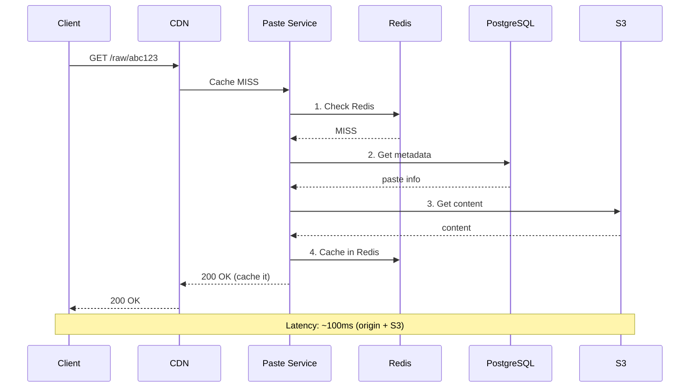

# Pastebin - Data Model & Architecture

## Component Overview

Before looking at diagrams, let's understand each component and why it exists.

### Components Explained

| Component | Purpose | Why It Exists |
|-----------|---------|---------------|
| **Load Balancer** | Distributes traffic | High availability, SSL termination |
| **API Gateway** | Rate limiting, auth | Centralizes cross-cutting concerns |
| **Paste Service** | Core business logic | Create, retrieve, delete pastes |
| **Metadata DB (PostgreSQL)** | Paste metadata | Fast queries, relationships |
| **Object Storage (S3)** | Paste content | Scalable, cost-effective for large files |
| **Cache (Redis)** | Hot content caching | Reduce S3 reads for popular pastes |
| **CDN** | Edge caching | Global low-latency access |
| **Cleanup Worker** | Expiration handling | Delete expired pastes |

---

## Database Choice: PostgreSQL + Object Storage

### Why This Hybrid Approach?

1. **PostgreSQL for metadata**: Fast queries, indexing, relationships
2. **Object Storage (S3) for content**: 
   - Scalable to petabytes
   - Cost-effective for large files
   - Built-in CDN integration

### Why Not Store Content in PostgreSQL?

- Large TEXT columns hurt query performance
- Backup/restore becomes slow
- Storage costs are higher ($0.115/GB vs $0.023/GB for S3)

### Consistency Model

**CAP Theorem Tradeoff:**

We choose **Consistency + Partition Tolerance (CP)**:
- **Consistency**: Paste creation/deletion must be immediately visible
- **Partition Tolerance**: System continues operating during network partitions
- **Availability**: Sacrificed during partitions (some requests may fail)

**Why CP over AP?**
- Paste creation must be immediately accessible (strong consistency required)
- Data correctness is more important than 100% availability
- During partitions, we prefer to fail requests rather than serve stale data

**ACID vs BASE:**

**ACID (Strong Consistency) for:**
- Paste creation (must be immediately accessible)
- Paste deletion (must stop serving immediately)
- User authentication
- Database transactions

**BASE (Eventual Consistency) for:**
- View counts (batched updates, acceptable delay)
- CDN cache (1-hour TTL acceptable)
- Analytics aggregations (not real-time)

**Per-Operation Consistency Guarantees:**

| Operation | Consistency Level | Guarantee |
|-----------|------------------|-----------|
| Create paste | Strong | Immediately visible, read-after-write |
| Delete paste | Strong | Immediately stops serving |
| View paste | Strong | Always sees latest version |
| View count | Eventual | Updates within 1 hour |
| CDN cache | Eventual | May serve stale for up to 1 hour |
| Analytics | Eventual | Aggregated hourly/daily |

**Read-After-Write Consistency:**
- Guaranteed by writing to PostgreSQL primary
- Cache populated synchronously on create
- User sees their paste immediately after creation

---

## Core Database Schema

### 1. pastes Table (Metadata)

```sql
CREATE TABLE pastes (
    -- Primary identifier
    id VARCHAR(8) PRIMARY KEY,
    
    -- Content reference
    storage_key VARCHAR(255) NOT NULL,  -- S3 key
    content_hash VARCHAR(64) NOT NULL,  -- SHA-256 for deduplication
    size_bytes BIGINT NOT NULL,
    
    -- Metadata
    title VARCHAR(255),
    syntax VARCHAR(50) DEFAULT 'text',
    
    -- Access control
    visibility VARCHAR(20) DEFAULT 'unlisted',
    password_hash VARCHAR(255),  -- bcrypt hash if password protected
    
    -- Ownership
    user_id BIGINT REFERENCES users(id),  -- NULL for anonymous
    
    -- Timestamps
    created_at TIMESTAMP WITH TIME ZONE DEFAULT NOW(),
    expires_at TIMESTAMP WITH TIME ZONE,
    deleted_at TIMESTAMP WITH TIME ZONE,
    
    -- Analytics
    view_count BIGINT DEFAULT 0,
    last_viewed_at TIMESTAMP WITH TIME ZONE,
    
    -- Constraints
    CONSTRAINT valid_visibility CHECK (visibility IN ('public', 'unlisted', 'private')),
    CONSTRAINT valid_size CHECK (size_bytes <= 10485760)  -- 10 MB
);

-- Index for user's pastes
CREATE INDEX idx_pastes_user_created ON pastes(user_id, created_at DESC)
    WHERE deleted_at IS NULL;

-- Index for public pastes listing
CREATE INDEX idx_pastes_public_recent ON pastes(created_at DESC)
    WHERE visibility = 'public' AND deleted_at IS NULL AND expires_at > NOW();

-- Index for expiration cleanup
CREATE INDEX idx_pastes_expires ON pastes(expires_at)
    WHERE expires_at IS NOT NULL AND deleted_at IS NULL;

-- Index for content deduplication
CREATE INDEX idx_pastes_content_hash ON pastes(content_hash);
```

**Why each index exists:**

| Index | Purpose | Query Pattern |
|-------|---------|---------------|
| `idx_pastes_user_created` | User's paste list | `WHERE user_id = ? ORDER BY created_at DESC` |
| `idx_pastes_public_recent` | Recent public pastes | `WHERE visibility = 'public' ORDER BY created_at DESC` |
| `idx_pastes_expires` | Cleanup job | `WHERE expires_at < NOW()` |
| `idx_pastes_content_hash` | Deduplication check | `WHERE content_hash = ?` |

### 2. users Table

```sql
CREATE TABLE users (
    id BIGSERIAL PRIMARY KEY,
    username VARCHAR(50) UNIQUE NOT NULL,
    email VARCHAR(255) UNIQUE NOT NULL,
    password_hash VARCHAR(255) NOT NULL,
    
    created_at TIMESTAMP WITH TIME ZONE DEFAULT NOW(),
    last_login_at TIMESTAMP WITH TIME ZONE,
    
    -- Settings
    default_visibility VARCHAR(20) DEFAULT 'unlisted',
    default_expiry VARCHAR(10) DEFAULT '1m',
    
    -- Limits
    tier VARCHAR(20) DEFAULT 'free',
    storage_used_bytes BIGINT DEFAULT 0,
    
    CONSTRAINT valid_tier CHECK (tier IN ('free', 'pro', 'enterprise'))
);
```

### 3. api_keys Table

```sql
CREATE TABLE api_keys (
    id BIGSERIAL PRIMARY KEY,
    user_id BIGINT REFERENCES users(id) NOT NULL,
    
    key_hash VARCHAR(64) NOT NULL,
    key_prefix VARCHAR(8) NOT NULL,
    name VARCHAR(100),
    
    created_at TIMESTAMP WITH TIME ZONE DEFAULT NOW(),
    last_used_at TIMESTAMP WITH TIME ZONE,
    expires_at TIMESTAMP WITH TIME ZONE,
    revoked_at TIMESTAMP WITH TIME ZONE,
    
    -- Rate limits
    requests_per_hour INTEGER DEFAULT 1000
);

CREATE INDEX idx_api_keys_hash ON api_keys(key_hash) WHERE revoked_at IS NULL;
```

### 4. syntax_languages Table

```sql
CREATE TABLE syntax_languages (
    code VARCHAR(50) PRIMARY KEY,
    name VARCHAR(100) NOT NULL,
    aliases TEXT[],  -- Alternative names
    file_extensions TEXT[],  -- .py, .python
    
    -- For auto-detection
    first_line_pattern VARCHAR(255),  -- e.g., "#!/usr/bin/python"
    
    is_active BOOLEAN DEFAULT TRUE
);

-- Sample data
INSERT INTO syntax_languages (code, name, aliases, file_extensions) VALUES
('python', 'Python', ARRAY['py', 'python3'], ARRAY['.py', '.pyw']),
('javascript', 'JavaScript', ARRAY['js', 'node'], ARRAY['.js', '.mjs']),
('java', 'Java', ARRAY[], ARRAY['.java']),
('sql', 'SQL', ARRAY['mysql', 'postgresql'], ARRAY['.sql']);
```

---

## Object Storage Schema

### S3 Bucket Structure

```
pastebin-content/
├── pastes/
│   ├── 2024/
│   │   ├── 01/
│   │   │   ├── 15/
│   │   │   │   ├── abc12345.txt.gz
│   │   │   │   ├── def67890.txt.gz
│   │   │   │   └── ...
│   │   │   └── 16/
│   │   │       └── ...
│   │   └── 02/
│   │       └── ...
│   └── ...
└── deduplicated/
    ├── sha256-{hash}.txt.gz  -- Shared content
    └── ...
```

### Storage Key Format

```
pastes/{year}/{month}/{day}/{paste_id}.txt.gz

Example: pastes/2024/01/15/abc12345.txt.gz
```

### Metadata in S3

Each object has metadata:
```json
{
  "x-amz-meta-paste-id": "abc12345",
  "x-amz-meta-syntax": "python",
  "x-amz-meta-size-original": "45",
  "x-amz-meta-created-at": "2024-01-15T10:30:00Z"
}
```

---

## Entity Relationship Diagram

```
┌─────────────────┐       ┌─────────────────┐
│     users       │       │    api_keys     │
├─────────────────┤       ├─────────────────┤
│ id (PK)         │───┐   │ id (PK)         │
│ username        │   │   │ user_id (FK)    │──┐
│ email           │   │   │ key_hash        │  │
│ tier            │   │   │ requests/hour   │  │
└─────────────────┘   │   └─────────────────┘  │
                      │                        │
                      └────────────┬───────────┘
                                   │
                                   ▼
                        ┌─────────────────────┐
                        │       pastes        │
                        ├─────────────────────┤
                        │ id (PK)             │
                        │ storage_key         │──────┐
                        │ content_hash        │      │
                        │ user_id (FK)        │      │
                        │ visibility          │      │
                        │ syntax              │      │
                        │ expires_at          │      │
                        └─────────────────────┘      │
                                                     │
                                                     ▼
                                          ┌─────────────────────┐
                                          │   Object Storage    │
                                          │       (S3)          │
                                          ├─────────────────────┤
                                          │ pastes/2024/01/...  │
                                          │ deduplicated/...    │
                                          └─────────────────────┘
```

---

## Sharding Strategy

### Current Scale (No Sharding Needed)

At 10M pastes/month:
- PostgreSQL handles 220 QPS easily
- Single primary + replicas sufficient

### Future Sharding (100M+ pastes/month)

**Shard Key**: `paste_id` (first 2 characters)

**Why paste_id?**
- Even distribution (random IDs)
- No hot partitions
- Simple routing logic

**Sharding Implementation:**

```java
public class ShardRouter {
    private static final int NUM_SHARDS = 16;
    
    public int getShard(String pasteId) {
        // Use first 2 chars of paste_id for routing
        int hash = pasteId.substring(0, 2).hashCode();
        return Math.abs(hash % NUM_SHARDS);
    }
}
```

**Hot Partition Mitigation:**
- Random paste IDs ensure even distribution
- No user-based sharding (would create hotspots for popular users)

**Resharding Strategy:**
- Double shards (16 → 32)
- Use consistent hashing for minimal data movement
- Online migration with dual-write period

---

## Replication Strategy

### PostgreSQL Replication


<details>
<summary>ASCII diagram (reference)</summary>

```text
┌───────────────────────┐
│    PRIMARY (Leader)    │
│                       │
│  - All WRITE queries  │
│  - WAL generation     │
│  - Synchronous to     │
│    Replica 1          │
│                       │
│  Region: us-east-1a   │
└───────────┬───────────┘
            │
    ┌───────┴───────┐
    │ Sync          │ Async
    ▼               ▼
┌─────────────┐  ┌─────────────┐
│  REPLICA 1  │  │  REPLICA 2  │
│  (Sync)     │  │  (Async)    │
│             │  │             │
│  us-east-1b │  │  us-west-2a │
└─────────────┘  └─────────────┘
```

</details>
```

**Sync vs Async Trade-offs:**

| Type | Data Loss | Latency Impact | Use Case |
|------|-----------|----------------|----------|
| Synchronous | Zero | +5-10ms | Critical data (paste metadata) |
| Asynchronous | Possible | None | DR replica, analytics |

### Backup and Recovery

**RPO (Recovery Point Objective):** < 1 minute
- Continuous WAL archiving to S3
- Point-in-time recovery capability

**RTO (Recovery Time Objective):** < 15 minutes
- Automated failover with Patroni
- DNS update to new primary

**Backup Schedule:**
- Full backup: Daily at 3 AM UTC
- WAL archiving: Continuous
- Retention: 30 days

---

## High-Level Architecture


<details>
<summary>ASCII diagram (reference)</summary>

```text
┌─────────────────────────────────────────────────────────────────────────────────────┐
│                                    CLIENTS                                           │
│                         (Web Browsers, CLI Tools, APIs)                              │
└─────────────────────────────────────────────────────────────────────────────────────┘
                                         │
                    ┌────────────────────┴────────────────────┐
                    │                                         │
                    ▼                                         ▼
┌─────────────────────────────────┐         ┌─────────────────────────────────┐
│         CDN (CloudFront)        │         │       API Gateway               │
│                                 │         │                                 │
│  - Edge caching for raw content │         │  - Rate limiting               │
│  - Static assets                │         │  - Authentication              │
│  - Geographic distribution      │         │  - Request routing             │
└────────────────┬────────────────┘         └────────────────┬────────────────┘
                 │                                           │
                 │ Cache Miss                                │
                 └──────────────────────┬────────────────────┘
                                        │
                                        ▼
                          ┌─────────────────────────────┐
                          │      LOAD BALANCER          │
                          │        (AWS ALB)            │
                          └─────────────┬───────────────┘
                                        │
              ┌─────────────────────────┼─────────────────────────┐
              ▼                         ▼                         ▼
       ┌─────────────┐           ┌─────────────┐           ┌─────────────┐
       │   Paste     │           │   Paste     │           │   Paste     │
       │  Service 1  │           │  Service 2  │           │  Service N  │
       └──────┬──────┘           └──────┬──────┘           └──────┬──────┘
              │                         │                         │
              └─────────────────────────┼─────────────────────────┘
                                        │
         ┌──────────────────────────────┼──────────────────────────────┐
         │                              │                              │
         ▼                              ▼                              ▼
┌─────────────────────┐    ┌─────────────────────┐    ┌─────────────────────┐
│   Redis Cluster     │    │     PostgreSQL      │    │    S3 (Content)     │
│                     │    │                     │    │                     │
│ - Hot content cache │    │ - Paste metadata    │    │ - Paste content     │
│ - Rate limit data   │    │ - User data         │    │ - Compressed (gzip) │
│ - Session data      │    │ - API keys          │    │ - Deduplicated      │
└─────────────────────┘    └─────────────────────┘    └─────────────────────┘
                                        │
                                        │ Async
                                        ▼
                          ┌─────────────────────────────┐
                          │      Cleanup Worker         │
                          │                             │
                          │  - Delete expired pastes    │
                          │  - Clean orphaned content   │
                          │  - Update statistics        │
                          └─────────────────────────────┘
```

</details>
```

---

## Detailed Data Flow

### Create Paste Flow


<details>
<summary>ASCII diagram (reference)</summary>

```text
┌──────┐     ┌─────────┐     ┌─────────────┐     ┌───────┐     ┌──────────┐     ┌─────┐
│Client│     │API Gate │     │Paste Service│     │ Redis │     │PostgreSQL│     │ S3  │
└──┬───┘     └────┬────┘     └──────┬──────┘     └───┬───┘     └────┬─────┘     └──┬──┘
   │              │                 │                │              │              │
   │ POST /pastes │                 │                │              │              │
   │─────────────>│                 │                │              │              │
   │              │                 │                │              │              │
   │              │ Rate limit check│                │              │              │
   │              │────────────────>│                │              │              │
   │              │                 │ INCR ratelimit │              │              │
   │              │                 │───────────────>│              │              │
   │              │                 │    count       │              │              │
   │              │                 │<───────────────│              │              │
   │              │                 │                │              │              │
   │              │ Forward request │                │              │              │
   │              │────────────────>│                │              │              │
   │              │                 │                │              │              │
   │              │                 │ 1. Generate ID │              │              │
   │              │                 │────────────────│              │              │
   │              │                 │                │              │              │
   │              │                 │ 2. Hash content│              │              │
   │              │                 │────────────────│              │              │
   │              │                 │                │              │              │
   │              │                 │ 3. Check dedup │              │              │
   │              │                 │──────────────────────────────>│              │
   │              │                 │                │              │              │
   │              │                 │ 4. Upload content (if new)    │              │
   │              │                 │─────────────────────────────────────────────>│
   │              │                 │                │              │     OK       │
   │              │                 │<─────────────────────────────────────────────│
   │              │                 │                │              │              │
   │              │                 │ 5. Save metadata              │              │
   │              │                 │──────────────────────────────>│              │
   │              │                 │                │     OK       │              │
   │              │                 │<──────────────────────────────│              │
   │              │                 │                │              │              │
   │              │                 │ 6. Cache metadata             │              │
   │              │                 │───────────────>│              │              │
   │              │                 │                │              │              │
   │              │  201 Created    │                │              │              │
   │              │<────────────────│                │              │              │
   │              │                 │                │              │              │
   │ 201 Created  │                 │                │              │              │
   │<─────────────│                 │                │              │              │
```

</details>
```

**Step-by-Step Explanation:**

1. **Client sends POST request** with paste content
2. **API Gateway** checks rate limits via Redis
3. **Paste Service** generates unique 8-character ID
4. **Paste Service** computes SHA-256 hash of content
5. **PostgreSQL** checks if content hash already exists (deduplication)
6. **S3** stores compressed content (if not deduplicated)
7. **PostgreSQL** stores paste metadata
8. **Redis** caches metadata for fast lookups
9. **Response** returns the paste URL to client

### View Paste Flow (Cache Hit)


<details>
<summary>ASCII diagram (reference)</summary>

```text
┌──────┐     ┌─────┐     ┌─────────────┐     ┌───────┐
│Client│     │ CDN │     │Paste Service│     │ Redis │
└──┬───┘     └──┬──┘     └──────┬──────┘     └───┬───┘
   │            │               │                │
   │ GET /raw/abc123            │                │
   │───────────>│               │                │
   │            │               │                │
   │            │ Cache HIT     │                │
   │            │───────────────│                │
   │            │               │                │
   │ 200 OK     │               │                │
   │ (content)  │               │                │
   │<───────────│               │                │
   │            │               │                │
   
Latency: ~10ms (CDN edge)
```

</details>
```

### View Paste Flow (Cache Miss)



<details>
<summary>ASCII diagram (reference)</summary>

```text
┌──────┐     ┌─────┐     ┌─────────────┐     ┌───────┐     ┌──────────┐     ┌─────┐
│Client│     │ CDN │     │Paste Service│     │ Redis │     │PostgreSQL│     │ S3  │
└──┬───┘     └──┬──┘     └──────┬──────┘     └───┬───┘     └────┬─────┘     └──┬──┘
   │            │               │                │              │              │
   │ GET /raw/abc123            │                │              │              │
   │───────────>│               │                │              │              │
   │            │               │                │              │              │
   │            │ Cache MISS    │                │              │              │
   │            │──────────────>│                │              │              │
   │            │               │                │              │              │
   │            │               │ 1. Check Redis │              │              │
   │            │               │───────────────>│              │              │
   │            │               │    MISS        │              │              │
   │            │               │<───────────────│              │              │
   │            │               │                │              │              │
   │            │               │ 2. Get metadata│              │              │
   │            │               │──────────────────────────────>│              │
   │            │               │    paste info  │              │              │
   │            │               │<──────────────────────────────│              │
   │            │               │                │              │              │
   │            │               │ 3. Get content │              │              │
   │            │               │─────────────────────────────────────────────>│
   │            │               │    content     │              │              │
   │            │               │<─────────────────────────────────────────────│
   │            │               │                │              │              │
   │            │               │ 4. Cache in Redis             │              │
   │            │               │───────────────>│              │              │
   │            │               │                │              │              │
   │            │  200 OK       │                │              │              │
   │            │  (cache it)   │                │              │              │
   │            │<──────────────│                │              │              │
   │            │               │                │              │              │
   │ 200 OK     │               │                │              │              │
   │<───────────│               │                │              │              │

Latency: ~100ms (origin + S3)
```

</details>
```

---

## Caching Architecture


<details>
<summary>ASCII diagram (reference)</summary>

```text
┌─────────────────────────────────────────────────────────────────────────────────────┐
│                              MULTI-LAYER CACHING                                     │
└─────────────────────────────────────────────────────────────────────────────────────┘

                              ┌───────────────────┐
                              │      CLIENT       │
                              └─────────┬─────────┘
                                        │
                                        ▼
┌─────────────────────────────────────────────────────────────────────────────────────┐
│  LAYER 1: CDN (CloudFront)                                                          │
│  ┌─────────────────────────────────────────────────────────────────────────────┐   │
│  │  Cache Key: /raw/{paste_id}                                                  │   │
│  │  TTL: 1 hour for public, 0 for private                                       │   │
│  │  Hit Rate: ~60% for popular pastes                                           │   │
│  └─────────────────────────────────────────────────────────────────────────────┘   │
└─────────────────────────────────────────────────────────────────────────────────────┘
                                        │
                                        │ Cache MISS
                                        ▼
┌─────────────────────────────────────────────────────────────────────────────────────┐
│  LAYER 2: Application Cache (Redis)                                                 │
│  ┌─────────────────────────────────────────────────────────────────────────────┐   │
│  │                                                                              │   │
│  │  Metadata Cache:                     Content Cache:                          │   │
│  │  ┌─────────────────────────┐        ┌─────────────────────────┐             │   │
│  │  │ Key: meta:{paste_id}    │        │ Key: content:{paste_id} │             │   │
│  │  │ Value: JSON metadata    │        │ Value: compressed text  │             │   │
│  │  │ TTL: 1 hour             │        │ TTL: 15 minutes         │             │   │
│  │  │ Size: ~500 bytes        │        │ Max Size: 1 MB          │             │   │
│  │  └─────────────────────────┘        └─────────────────────────┘             │   │
│  │                                                                              │   │
│  │  Only cache pastes < 1 MB in Redis (larger go directly to S3)               │   │
│  │  Hit Rate: ~40%                                                              │   │
│  └─────────────────────────────────────────────────────────────────────────────┘   │
└─────────────────────────────────────────────────────────────────────────────────────┘
                                        │
                                        │ Cache MISS
                                        ▼
┌─────────────────────────────────────────────────────────────────────────────────────┐
│  LAYER 3: Origin Storage                                                            │
│  ┌───────────────────────────────────┐  ┌───────────────────────────────────┐      │
│  │         PostgreSQL                │  │            S3                     │      │
│  │                                   │  │                                   │      │
│  │  - Paste metadata                 │  │  - Paste content                  │      │
│  │  - Always authoritative           │  │  - Compressed (gzip)              │      │
│  │  - Query for existence check      │  │  - Lifecycle policies             │      │
```

</details>
```
│  └───────────────────────────────────┘  └───────────────────────────────────┘      │
└─────────────────────────────────────────────────────────────────────────────────────┘
```

---

## Storage Architecture


<details>
<summary>ASCII diagram (reference)</summary>

```text
┌─────────────────────────────────────────────────────────────────────────────────────┐
│                              STORAGE ARCHITECTURE                                    │
└─────────────────────────────────────────────────────────────────────────────────────┘

┌─────────────────────────────────────────────────────────────────────────────────────┐
│                              PostgreSQL (Metadata)                                   │
│                                                                                      │
│  ┌─────────────────────────────────────────────────────────────────────────────┐   │
│  │                              pastes table                                    │   │
│  │  ┌──────────┬──────────────────┬───────────┬──────────┬─────────────────┐   │   │
│  │  │    id    │   storage_key    │   title   │  syntax  │   expires_at    │   │   │
│  │  ├──────────┼──────────────────┼───────────┼──────────┼─────────────────┤   │   │
│  │  │ abc12345 │ pastes/2024/...  │ My Code   │ python   │ 2024-02-15      │   │   │
│  │  │ def67890 │ dedup/sha256-... │ Config    │ yaml     │ NULL (never)    │   │   │
│  │  └──────────┴──────────────────┴───────────┴──────────┴─────────────────┘   │   │
│  └─────────────────────────────────────────────────────────────────────────────┘   │
│                                                                                      │
│  Primary: us-east-1a                                                                 │
│  Replicas: us-east-1b, us-west-2a                                                   │
└─────────────────────────────────────────────────────────────────────────────────────┘
                                        │
                                        │ storage_key references
                                        ▼
┌─────────────────────────────────────────────────────────────────────────────────────┐
│                              S3 (Content Storage)                                    │
│                                                                                      │
│  ┌─────────────────────────────────────────────────────────────────────────────┐   │
│  │  Bucket: pastebin-content-prod                                               │   │
│  │                                                                              │   │
│  │  pastes/                                                                     │   │
│  │  ├── 2024/                                                                   │   │
│  │  │   ├── 01/                                                                 │   │
│  │  │   │   ├── 15/                                                             │   │
│  │  │   │   │   ├── abc12345.txt.gz  (45 bytes compressed)                      │   │
│  │  │   │   │   └── ghi34567.txt.gz  (1.2 KB compressed)                        │   │
│  │  │   │   └── 16/                                                             │   │
│  │  │   │       └── ...                                                         │   │
│  │  │   └── 02/                                                                 │   │
│  │  │       └── ...                                                             │   │
│  │  │                                                                           │   │
│  │  deduplicated/                                                               │   │
│  │  └── sha256-a1b2c3d4...xyz.txt.gz  (shared by multiple pastes)              │   │
│  └─────────────────────────────────────────────────────────────────────────────┘   │
│                                                                                      │
│  Storage Class: S3 Standard (first 30 days) → S3 IA (after 30 days)                 │
│  Encryption: SSE-S3                                                                  │
│  Versioning: Disabled (pastes are immutable)                                        │
└─────────────────────────────────────────────────────────────────────────────────────┘
```

</details>
```

### S3 Lifecycle Policy

```json
{
  "Rules": [
    {
      "ID": "TransitionToIA",
      "Status": "Enabled",
      "Filter": {
        "Prefix": "pastes/"
      },
      "Transitions": [
        {
          "Days": 30,
          "StorageClass": "STANDARD_IA"
        }
      ]
    },
    {
      "ID": "DeleteExpired",
      "Status": "Enabled",
      "Filter": {
        "Prefix": "pastes/"
      },
      "Expiration": {
        "Days": 365
      }
    }
  ]
}
```

---

## Paste ID Generation

### Requirements
- 8 characters (62^8 = 218 trillion combinations)
- URL-safe (alphanumeric only)
- Not sequential (prevent enumeration)

### Implementation

```java
public class PasteIdGenerator {
    
    private static final String ALPHABET = 
        "0123456789ABCDEFGHIJKLMNOPQRSTUVWXYZabcdefghijklmnopqrstuvwxyz";
    
    private final SecureRandom random = new SecureRandom();
    
    public String generate() {
        StringBuilder sb = new StringBuilder(8);
        for (int i = 0; i < 8; i++) {
            sb.append(ALPHABET.charAt(random.nextInt(62)));
        }
        return sb.toString();
    }
    
    // Collision handling
    public String generateUnique(PasteRepository repository) {
        for (int attempt = 0; attempt < 10; attempt++) {
            String id = generate();
            if (!repository.existsById(id)) {
                return id;
            }
        }
        throw new RuntimeException("Failed to generate unique ID after 10 attempts");
    }
}
```

### Collision Probability

```
With 10M pastes and 62^8 possible IDs:
Probability of collision ≈ n² / (2 × N)
= (10M)² / (2 × 218T)
= 10^14 / (4.36 × 10^14)
≈ 0.23 (23% chance of at least one collision)

After 100M pastes:
≈ 2.3% chance per new paste
```

Solution: Check for collision and retry.

---

## Content Deduplication

### Why Deduplicate?

Many pastes contain identical content (common code snippets, templates).
Estimated 10-15% of pastes are duplicates.

### How It Works

```java
public class PasteService {
    
    public Paste createPaste(CreatePasteRequest request) {
        // 1. Hash the content
        String contentHash = DigestUtils.sha256Hex(request.getContent());
        
        // 2. Check for existing content
        Optional<String> existingKey = storageService.findByHash(contentHash);
        
        String storageKey;
        if (existingKey.isPresent()) {
            // 3a. Reuse existing content
            storageKey = existingKey.get();
            log.info("Deduplicated paste, reusing {}", storageKey);
        } else {
            // 3b. Store new content
            storageKey = storageService.store(request.getContent());
        }
        
        // 4. Create paste record (always new)
        return pasteRepository.save(Paste.builder()
            .id(generateId())
            .storageKey(storageKey)
            .contentHash(contentHash)
            .title(request.getTitle())
            .build());
    }
}
```

---

## Cleanup Worker Architecture


<details>
<summary>ASCII diagram (reference)</summary>

```text
┌─────────────────────────────────────────────────────────────────────────────────────┐
│                              CLEANUP WORKER                                          │
└─────────────────────────────────────────────────────────────────────────────────────┘

┌─────────────────────────────────────────────────────────────────────────────────────┐
│                                                                                      │
│  ┌─────────────────┐                                                                │
│  │   Scheduler     │  Runs every hour                                               │
│  │   (Cron)        │                                                                │
│  └────────┬────────┘                                                                │
│           │                                                                          │
│           ▼                                                                          │
│  ┌─────────────────────────────────────────────────────────────────────────────┐   │
│  │                         Cleanup Job                                          │   │
│  │                                                                              │   │
│  │  1. Query expired pastes (batch of 1000)                                     │   │
│  │     SELECT id, storage_key FROM pastes                                       │   │
│  │     WHERE expires_at < NOW() AND deleted_at IS NULL                          │   │
│  │     LIMIT 1000                                                               │   │
│  │                                                                              │   │
│  │  2. For each paste:                                                          │   │
│  │     a. Soft delete in PostgreSQL (set deleted_at)                            │   │
│  │     b. Delete from Redis cache                                               │   │
│  │     c. Invalidate CDN cache                                                  │   │
│  │     d. Queue S3 deletion (async)                                             │   │
│  │                                                                              │   │
│  │  3. Process S3 deletions in batches                                          │   │
│  │     (S3 DeleteObjects API supports 1000 keys per request)                    │   │
│  │                                                                              │   │
│  └─────────────────────────────────────────────────────────────────────────────┘   │
│                                                                                      │
│           │                                                                          │
│           ▼                                                                          │
│  ┌─────────────────────────────────────────────────────────────────────────────┐   │
│  │                     Orphan Content Cleanup (Weekly)                          │   │
│  │                                                                              │   │
│  │  Find S3 objects with no corresponding paste record                         │   │
│  │  (handles crashes during paste creation)                                     │   │
│  │                                                                              │   │
│  └─────────────────────────────────────────────────────────────────────────────┘   │
│                                                                                      │
└─────────────────────────────────────────────────────────────────────────────────────┘
```

</details>
```

---

## Deployment Architecture (Kubernetes)


<details>
<summary>ASCII diagram (reference)</summary>

```text
┌─────────────────────────────────────────────────────────────────────────────────────┐
│                              KUBERNETES CLUSTER                                      │
│                                                                                      │
│  ┌───────────────────────────────────────────────────────────────────────────────┐  │
│  │                              INGRESS (NGINX)                                   │  │
│  │                         TLS termination, routing                               │  │
│  └───────────────────────────────────────────────────────────────────────────────┘  │
│                                        │                                             │
│         ┌──────────────────────────────┼──────────────────────────────┐             │
│         ▼                              ▼                              ▼             │
│  ┌─────────────────┐          ┌─────────────────┐          ┌─────────────────┐     │
│  │ paste-service   │          │ cleanup-worker  │          │ web-frontend    │     │
│  │ Deployment      │          │ CronJob         │          │ Deployment      │     │
│  │                 │          │                 │          │                 │     │
│  │ Replicas: 5     │          │ Schedule: hourly│          │ Replicas: 3     │     │
│  │ CPU: 1 core     │          │ CPU: 0.5 core   │          │ CPU: 0.5 core   │     │
│  │ Memory: 2Gi     │          │ Memory: 1Gi     │          │ Memory: 512Mi   │     │
│  └─────────────────┘          └─────────────────┘          └─────────────────┘     │
│           │                                                                          │
│  ┌────────┴────────────────────────────────────────────────────────────────────┐    │
│  │                           SERVICES (ClusterIP)                               │    │
│  │                                                                              │    │
│  │  paste-service:8080              web-frontend:3000                           │    │
│  └──────────────────────────────────────────────────────────────────────────────┘    │
│                                        │                                             │
│  ┌─────────────────────────────────────┴──────────────────────────────────────┐     │
│  │                              EXTERNAL SERVICES                              │     │
│  │                                                                             │     │
│  │  ┌─────────────────┐  ┌─────────────────┐  ┌─────────────────────────┐     │     │
│  │  │ RDS PostgreSQL  │  │ ElastiCache     │  │ S3 Bucket               │     │     │
│  │  │                 │  │ (Redis)         │  │                         │     │     │
│  │  │ Multi-AZ        │  │ Cluster Mode    │  │ pastebin-content-prod   │     │     │
│  │  └─────────────────┘  └─────────────────┘  └─────────────────────────┘     │     │
│  └─────────────────────────────────────────────────────────────────────────────┘     │
│                                                                                      │
└─────────────────────────────────────────────────────────────────────────────────────┘
```

</details>
```

---

## Failure Points and Recovery


<details>
<summary>ASCII diagram (reference)</summary>

```text
┌─────────────────────────────────────────────────────────────────────────────────────┐
│                              FAILURE ANALYSIS                                        │
└─────────────────────────────────────────────────────────────────────────────────────┘

Component              Failure Mode           Impact              Recovery
─────────────────────────────────────────────────────────────────────────────────────

┌─────────────┐
│     CDN     │ ───── Edge down ──────── Minor latency ──── Auto-failover to
│             │                          increase           other edges
└─────────────┘

┌─────────────┐
│   Paste     │ ───── Pod crash ──────── Degraded ───────── K8s auto-restart
│   Service   │                          capacity           + HPA scaling
└─────────────┘

┌─────────────┐
│    Redis    │ ───── Node down ──────── Cache miss ─────── Cluster failover
│             │                          spike, S3 load     (automatic)
└─────────────┘

┌─────────────┐
│ PostgreSQL  │ ───── Primary down ───── Writes fail ────── Promote replica
│             │                          (30 seconds)       (automatic)
└─────────────┘

┌─────────────┐
│     S3      │ ───── Region down ────── Content ────────── S3 cross-region
│             │                          unavailable        replication
└─────────────┘

┌─────────────┐
│   Cleanup   │ ───── Job fails ──────── Expired pastes ─── Retry on next
│   Worker    │                          accumulate         schedule
└─────────────┘
```

</details>
```

### Graceful Degradation

```java
public class PasteService {
    
    public PasteResponse getPaste(String id) {
        try {
            // Try full path
            return getFromCacheOrStorage(id);
        } catch (StorageException e) {
            // S3 is down, try Redis only
            Paste cached = redis.get("content:" + id);
            if (cached != null) {
                return PasteResponse.fromCache(cached);
            }
            throw new ServiceUnavailableException("Content temporarily unavailable");
        } catch (DatabaseException e) {
            // PostgreSQL is down, serve from cache if available
            Paste cached = redis.get("meta:" + id);
            if (cached != null) {
                return PasteResponse.fromCache(cached);
            }
            throw new ServiceUnavailableException("Service temporarily unavailable");
        }
    }
}
```

---

## Summary

| Component | Technology | Purpose |
|-----------|------------|---------|
| CDN | CloudFront | Edge caching, global distribution |
| Load Balancer | AWS ALB | Traffic distribution, health checks |
| API Service | Spring Boot | Business logic |
| Metadata DB | PostgreSQL | Paste metadata, user data |
| Content Storage | S3 | Paste content (compressed) |
| Cache | Redis Cluster | Hot content, rate limiting |
| Cleanup | K8s CronJob | Expire old pastes |
| Monitoring | Prometheus + Grafana | Metrics, alerting |

