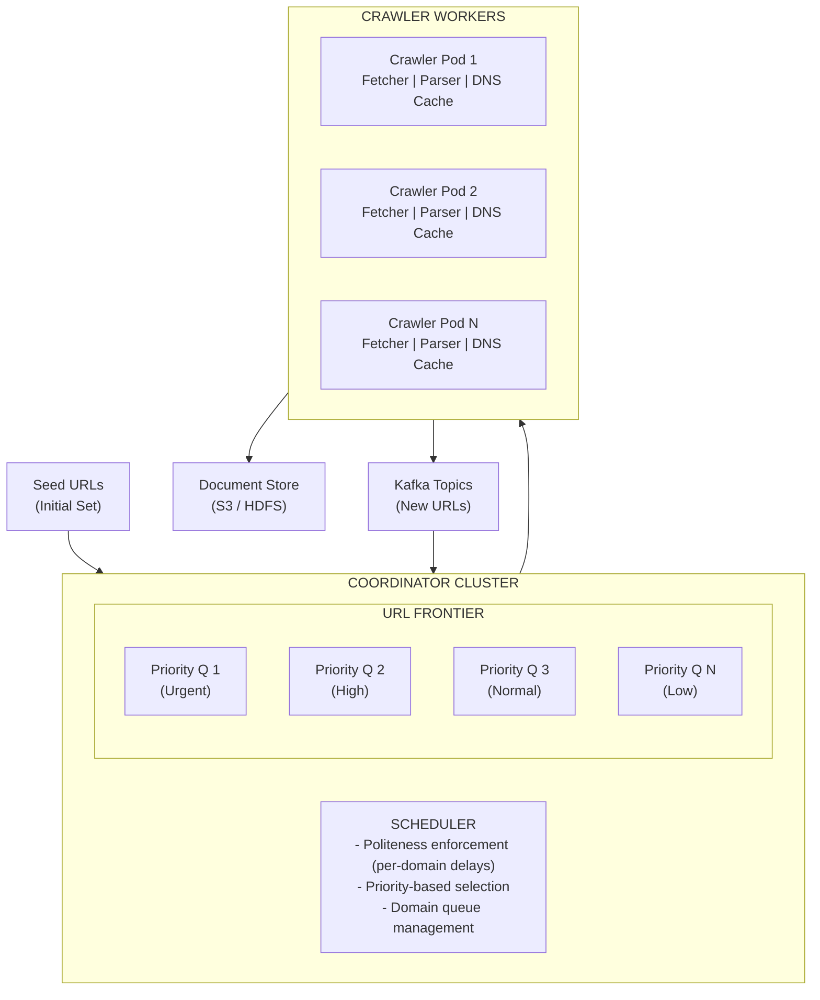
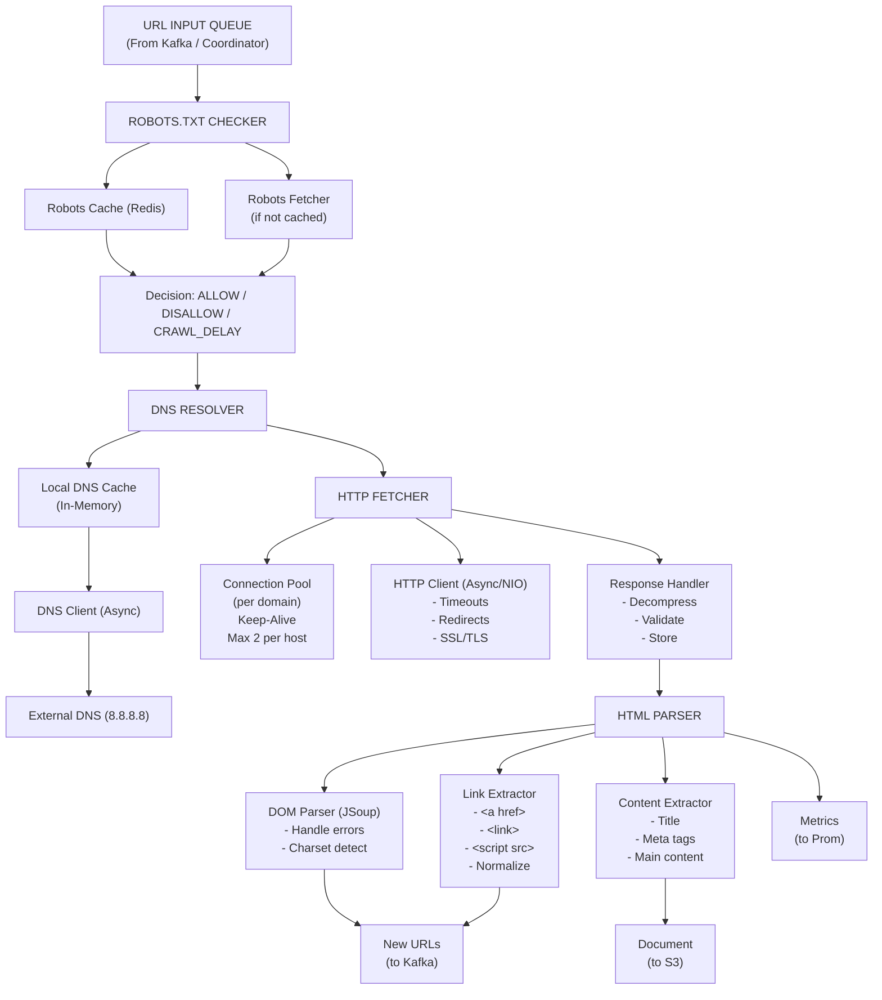
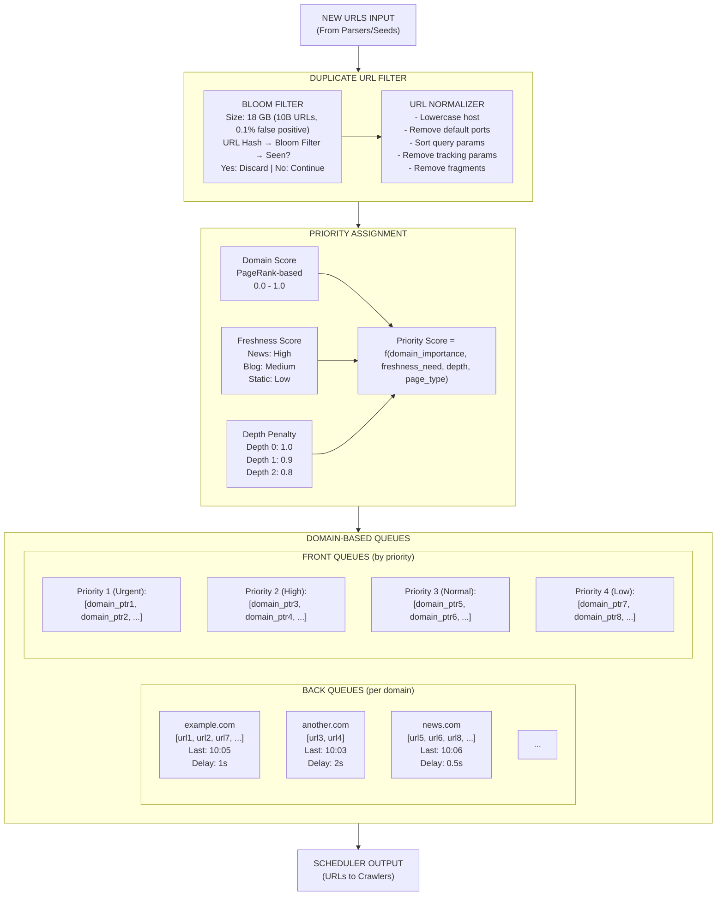

# Web Crawler - Data Model & Architecture

## Component Overview

Before looking at diagrams, let's understand each component and why it exists.

### Components Explained

| Component | Purpose | Why It Exists |
|-----------|---------|---------------|
| **URL Frontier** | Queue of URLs to crawl | Manages what to crawl next |
| **Scheduler** | Decides when to crawl each URL | Enforces politeness and priorities |
| **Fetcher** | Downloads web pages | Core crawling functionality |
| **DNS Resolver** | Resolves domain names | Must know IP to connect |
| **Parser** | Extracts links and content | Discovers new URLs |
| **Duplicate Detector** | Filters seen URLs/content | Avoids wasting resources |
| **Robots Handler** | Manages robots.txt rules | Legal and ethical compliance |
| **Document Store** | Stores crawled pages | Persistence for indexing |
| **Coordinator** | Manages distributed crawlers | Scales across multiple machines |

---

## Database Choices

| Data Type | Database | Rationale |
|-----------|----------|-----------|
| URL Frontier | Redis + Kafka | Fast queue operations, persistence |
| Crawled URLs | PostgreSQL | Relational queries, deduplication |
| Document Metadata | PostgreSQL | Structured data, joins |
| Raw Content | S3/HDFS | Blob storage, cheap at scale |
| Robots.txt Cache | Redis | Fast lookups, TTL support |
| Bloom Filter | Redis | Probabilistic deduplication |

---

## Consistency Model

**CAP Theorem Tradeoff:**

We choose **Availability + Partition Tolerance (AP)**:
- **Availability**: Crawler must continue operating (even with stale frontier state)
- **Partition Tolerance**: System continues operating during network partitions
- **Consistency**: Sacrificed (URL frontier state may be inconsistent across crawlers)

**Why AP over CP?**
- Crawling doesn't need strict consistency (duplicate crawls acceptable)
- Better to continue crawling than fail completely
- System must always operate (high availability requirement)
- During partitions, we prefer duplicate crawls over stopping

**ACID vs BASE:**

**ACID (Strong Consistency) for:**
- URL deduplication (PostgreSQL, prevents duplicate URLs in frontier)
- Document metadata (PostgreSQL, prevents duplicate storage)
- Crawl scheduling (PostgreSQL, prevents duplicate scheduling)

**BASE (Eventual Consistency) for:**
- URL frontier state (Redis, may be inconsistent across crawlers)
- Crawl progress (eventual synchronization)
- Robots.txt cache (may be stale, acceptable)

**Per-Operation Consistency Guarantees:**

| Operation | Consistency Level | Guarantee |
|-----------|------------------|-----------|
| Add URL to frontier | Eventual | May be added multiple times (deduplicated later) |
| Check if URL crawled | Strong | PostgreSQL ensures no duplicate crawls |
| Update crawl status | Eventual | Status may be inconsistent across crawlers |
| Robots.txt lookup | Eventual | Cache may be stale (acceptable) |
| Document storage | Strong | Prevents duplicate storage (ACID) |

**Eventual Consistency Boundaries:**
- Frontier staleness: URLs may be queued multiple times (deduplicated on crawl)
- Crawl progress: Synchronized eventually (not real-time)
- No read-after-write needed for crawling (write-heavy operation)

---

## URL Frontier Schema (Redis + PostgreSQL)

### Redis Structures

```
# Priority queue per domain (sorted set)
ZADD frontier:example.com <priority_score> <url_hash>
# Score = priority * 1000000 + timestamp (for ordering)

# Domain crawl timestamps (for politeness)
HSET domain:last_crawl example.com 1705750800

# Ready domains (set of domains ready to crawl)
SADD ready_domains example.com another.com

# Domain metadata
HSET domain:meta:example.com crawl_delay 1000 last_robots_fetch 1705750000
```

### PostgreSQL Schema

```sql
CREATE TABLE url_frontier (
    url_hash CHAR(64) PRIMARY KEY,  -- SHA-256 of normalized URL
    url TEXT NOT NULL,
    domain VARCHAR(255) NOT NULL,
    
    -- Priority and scheduling
    priority SMALLINT DEFAULT 5,  -- 1 (highest) to 10 (lowest)
    depth SMALLINT DEFAULT 0,     -- Distance from seed URL
    
    -- Discovery
    discovered_at TIMESTAMP WITH TIME ZONE DEFAULT NOW(),
    discovered_from CHAR(64),     -- Parent URL hash
    
    -- Crawl status
    status VARCHAR(20) DEFAULT 'pending',
    last_crawl_attempt TIMESTAMP WITH TIME ZONE,
    crawl_count SMALLINT DEFAULT 0,
    last_status_code SMALLINT,
    
    -- Scheduling
    next_crawl_after TIMESTAMP WITH TIME ZONE DEFAULT NOW(),
    
    CONSTRAINT valid_status CHECK (status IN ('pending', 'crawling', 'completed', 'failed', 'blocked'))
);

-- Index for fetching next URLs to crawl
CREATE INDEX idx_frontier_ready ON url_frontier(domain, priority, next_crawl_after)
    WHERE status = 'pending';

-- Index for domain-based queries
CREATE INDEX idx_frontier_domain ON url_frontier(domain);

-- Index for status monitoring
CREATE INDEX idx_frontier_status ON url_frontier(status);
```

---

## Crawled Documents Schema

```sql
CREATE TABLE crawled_documents (
    url_hash CHAR(64) PRIMARY KEY,
    url TEXT NOT NULL,
    domain VARCHAR(255) NOT NULL,
    
    -- HTTP response
    http_status SMALLINT NOT NULL,
    content_type VARCHAR(100),
    content_length INTEGER,
    content_encoding VARCHAR(50),
    
    -- Headers
    etag VARCHAR(255),
    last_modified TIMESTAMP WITH TIME ZONE,
    
    -- Content
    content_hash CHAR(64),  -- SHA-256 of content
    storage_path TEXT,      -- S3/HDFS path
    
    -- Timestamps
    crawled_at TIMESTAMP WITH TIME ZONE DEFAULT NOW(),
    
    -- Extracted data
    title TEXT,
    outlinks_count INTEGER DEFAULT 0,
    
    -- Quality signals
    is_duplicate BOOLEAN DEFAULT FALSE,
    duplicate_of CHAR(64)
);

-- Index for content deduplication
CREATE INDEX idx_docs_content_hash ON crawled_documents(content_hash);

-- Index for domain queries
CREATE INDEX idx_docs_domain ON crawled_documents(domain, crawled_at DESC);

-- Index for recent crawls
CREATE INDEX idx_docs_crawled_at ON crawled_documents(crawled_at DESC);
```

---

## Outlinks Table

```sql
CREATE TABLE outlinks (
    id BIGSERIAL PRIMARY KEY,
    source_url_hash CHAR(64) NOT NULL,
    target_url TEXT NOT NULL,
    target_url_hash CHAR(64) NOT NULL,
    
    anchor_text TEXT,
    link_type VARCHAR(20) DEFAULT 'hyperlink',  -- hyperlink, redirect, canonical
    
    discovered_at TIMESTAMP WITH TIME ZONE DEFAULT NOW(),
    
    CONSTRAINT fk_source FOREIGN KEY (source_url_hash) 
        REFERENCES crawled_documents(url_hash)
);

-- Index for discovering new URLs
CREATE INDEX idx_outlinks_target ON outlinks(target_url_hash);

-- Index for link analysis
CREATE INDEX idx_outlinks_source ON outlinks(source_url_hash);
```

---

## Domain Statistics Table

```sql
CREATE TABLE domain_stats (
    domain VARCHAR(255) PRIMARY KEY,
    
    -- Crawl statistics
    pages_crawled BIGINT DEFAULT 0,
    pages_failed BIGINT DEFAULT 0,
    bytes_downloaded BIGINT DEFAULT 0,
    
    -- Timing
    first_crawled_at TIMESTAMP WITH TIME ZONE,
    last_crawled_at TIMESTAMP WITH TIME ZONE,
    avg_response_time_ms INTEGER,
    
    -- Robots.txt
    robots_txt_fetched_at TIMESTAMP WITH TIME ZONE,
    robots_txt_hash CHAR(64),
    crawl_delay_ms INTEGER DEFAULT 1000,
    
    -- Quality
    error_rate FLOAT DEFAULT 0.0,
    is_blocked BOOLEAN DEFAULT FALSE,
    block_reason TEXT
);

CREATE INDEX idx_domain_stats_last_crawl ON domain_stats(last_crawled_at);
```

---

## High-Level Architecture



<details>
<summary>ASCII diagram (reference)</summary>

```text
┌─────────────────────────────────────────────────────────────────────────────────────┐
│                              WEB CRAWLER SYSTEM                                      │
└─────────────────────────────────────────────────────────────────────────────────────┘

                              ┌───────────────────┐
                              │    Seed URLs      │
                              │   (Initial Set)   │
                              └─────────┬─────────┘
                                        │
                                        ▼
┌─────────────────────────────────────────────────────────────────────────────────────┐
│                              COORDINATOR CLUSTER                                     │
│  ┌─────────────────────────────────────────────────────────────────────────────┐    │
│  │                         URL FRONTIER                                         │    │
│  │  ┌──────────────┐  ┌──────────────┐  ┌──────────────┐  ┌──────────────┐    │    │
│  │  │ Priority Q 1 │  │ Priority Q 2 │  │ Priority Q 3 │  │ Priority Q N │    │    │
│  │  │ (Urgent)     │  │ (High)       │  │ (Normal)     │  │ (Low)        │    │    │
│  │  └──────────────┘  └──────────────┘  └──────────────┘  └──────────────┘    │    │
│  └─────────────────────────────────────────────────────────────────────────────┘    │
│                                                                                      │
│  ┌─────────────────────────────────────────────────────────────────────────────┐    │
│  │                         SCHEDULER                                            │    │
│  │  - Politeness enforcement (per-domain delays)                                │    │
│  │  - Priority-based selection                                                  │    │
│  │  - Domain queue management                                                   │    │
│  └─────────────────────────────────────────────────────────────────────────────┘    │
└─────────────────────────────────────────────────────────────────────────────────────┘
                                        │
                     ┌──────────────────┼──────────────────┐
                     ▼                  ▼                  ▼
┌─────────────────────────────────────────────────────────────────────────────────────┐
│                              CRAWLER WORKERS                                         │
│                                                                                      │
│  ┌─────────────────┐  ┌─────────────────┐  ┌─────────────────┐                     │
│  │  Crawler Pod 1  │  │  Crawler Pod 2  │  │  Crawler Pod N  │                     │
│  │                 │  │                 │  │                 │                     │
│  │ ┌─────────────┐ │  │ ┌─────────────┐ │  │ ┌─────────────┐ │                     │
│  │ │   Fetcher   │ │  │ │   Fetcher   │ │  │ │   Fetcher   │ │                     │
│  │ └─────────────┘ │  │ └─────────────┘ │  │ └─────────────┘ │                     │
│  │ ┌─────────────┐ │  │ ┌─────────────┐ │  │ ┌─────────────┐ │                     │
│  │ │   Parser    │ │  │ │   Parser    │ │  │ │   Parser    │ │                     │
│  │ └─────────────┘ │  │ └─────────────┘ │  │ └─────────────┘ │                     │
│  │ ┌─────────────┐ │  │ ┌─────────────┐ │  │ ┌─────────────┐ │                     │
│  │ │ DNS Cache   │ │  │ │ DNS Cache   │ │  │ │ DNS Cache   │ │                     │
│  │ └─────────────┘ │  │ └─────────────┘ │  │ └─────────────┘ │                     │
│  └────────┬────────┘  └────────┬────────┘  └────────┬────────┘                     │
│           │                    │                    │                              │
└───────────┼────────────────────┼────────────────────┼──────────────────────────────┘
            │                    │                    │
            └────────────────────┼────────────────────┘
                                 │
                     ┌───────────┴───────────┐
                     ▼                       ▼
          ┌─────────────────┐     ┌─────────────────┐
          │  Document Store │     │  Kafka Topics   │
          │  (S3 / HDFS)    │     │  (New URLs)     │
          └─────────────────┘     └─────────────────┘
```

</details>
```

---

## Detailed Crawler Architecture



<details>
<summary>ASCII diagram (reference)</summary>

```text
┌─────────────────────────────────────────────────────────────────────────────────────┐
│                              SINGLE CRAWLER POD                                      │
└─────────────────────────────────────────────────────────────────────────────────────┘

┌─────────────────────────────────────────────────────────────────────────────────────┐
│                                                                                      │
│  ┌─────────────────────────────────────────────────────────────────────────────┐    │
│  │                         URL INPUT QUEUE                                      │    │
│  │                    (From Kafka / Coordinator)                                │    │
│  └────────────────────────────────┬────────────────────────────────────────────┘    │
│                                   │                                                  │
│                                   ▼                                                  │
│  ┌─────────────────────────────────────────────────────────────────────────────┐    │
│  │                         ROBOTS.TXT CHECKER                                   │    │
│  │                                                                              │    │
│  │  ┌─────────────────┐    ┌─────────────────┐                                 │    │
│  │  │ Robots Cache    │    │ Robots Fetcher  │                                 │    │
│  │  │ (Redis)         │    │ (if not cached) │                                 │    │
│  │  └─────────────────┘    └─────────────────┘                                 │    │
│  │                                                                              │    │
│  │  Decision: ALLOW / DISALLOW / CRAWL_DELAY                                   │    │
│  └────────────────────────────────┬────────────────────────────────────────────┘    │
│                                   │                                                  │
│                                   ▼                                                  │
│  ┌─────────────────────────────────────────────────────────────────────────────┐    │
│  │                         DNS RESOLVER                                         │    │
│  │                                                                              │    │
│  │  ┌─────────────────┐    ┌─────────────────┐    ┌─────────────────┐          │    │
│  │  │ Local DNS Cache │───>│ DNS Client      │───>│ External DNS    │          │    │
│  │  │ (In-Memory)     │    │ (Async)         │    │ (8.8.8.8)       │          │    │
│  │  └─────────────────┘    └─────────────────┘    └─────────────────┘          │    │
│  └────────────────────────────────┬────────────────────────────────────────────┘    │
│                                   │                                                  │
│                                   ▼                                                  │
│  ┌─────────────────────────────────────────────────────────────────────────────┐    │
│  │                         HTTP FETCHER                                         │    │
│  │                                                                              │    │
│  │  ┌─────────────────┐    ┌─────────────────┐    ┌─────────────────┐          │    │
│  │  │ Connection Pool │    │ HTTP Client     │    │ Response        │          │    │
│  │  │ (per domain)    │    │ (Async/NIO)     │    │ Handler         │          │    │
│  │  │                 │    │                 │    │                 │          │    │
│  │  │ Keep-Alive      │    │ - Timeouts      │    │ - Decompress    │          │    │
│  │  │ Max 2 per host  │    │ - Redirects     │    │ - Validate      │          │    │
│  │  │                 │    │ - SSL/TLS       │    │ - Store         │          │    │
│  │  └─────────────────┘    └─────────────────┘    └─────────────────┘          │    │
│  └────────────────────────────────┬────────────────────────────────────────────┘    │
│                                   │                                                  │
│                                   ▼                                                  │
│  ┌─────────────────────────────────────────────────────────────────────────────┐    │
│  │                         HTML PARSER                                          │    │
│  │                                                                              │    │
│  │  ┌─────────────────┐    ┌─────────────────┐    ┌─────────────────┐          │    │
│  │  │ DOM Parser      │    │ Link Extractor  │    │ Content         │          │    │
│  │  │ (JSoup)         │    │                 │    │ Extractor       │          │    │
│  │  │                 │    │ - <a href>      │    │                 │          │    │
│  │  │ - Handle errors │    │ - <link>        │    │ - Title         │          │    │
│  │  │ - Charset detect│    │ - <script src>  │    │ - Meta tags     │          │    │
│  │  │                 │    │ - Normalize     │    │ - Main content  │          │    │
│  │  └─────────────────┘    └─────────────────┘    └─────────────────┘          │    │
│  └────────────────────────────────┬────────────────────────────────────────────┘    │
│                                   │                                                  │
│                    ┌──────────────┼──────────────┐                                  │
│                    ▼              ▼              ▼                                  │
│           ┌──────────────┐ ┌──────────────┐ ┌──────────────┐                       │
│           │ New URLs     │ │ Document     │ │ Metrics      │                       │
│           │ (to Kafka)   │ │ (to S3)      │ │ (to Prom)    │                       │
│           └──────────────┘ └──────────────┘ └──────────────┘                       │
│                                                                                      │
└─────────────────────────────────────────────────────────────────────────────────────┘
```

</details>
```

---

## URL Frontier Architecture



<details>
<summary>ASCII diagram (reference)</summary>

```text
┌─────────────────────────────────────────────────────────────────────────────────────┐
│                              URL FRONTIER DETAIL                                     │
└─────────────────────────────────────────────────────────────────────────────────────┘

                         ┌───────────────────────────┐
                         │      NEW URLS INPUT       │
                         │   (From Parsers/Seeds)    │
                         └─────────────┬─────────────┘
                                       │
                                       ▼
┌─────────────────────────────────────────────────────────────────────────────────────┐
│                         DUPLICATE URL FILTER                                         │
│                                                                                      │
│  ┌─────────────────────────────────────────────────────────────────────────────┐    │
│  │                         BLOOM FILTER                                         │    │
│  │                                                                              │    │
│  │  Size: 18 GB (10B URLs, 0.1% false positive)                                │    │
│  │                                                                              │    │
│  │  URL Hash → Bloom Filter → Seen? → Yes: Discard                             │    │
│  │                                  → No: Continue                              │    │
│  └─────────────────────────────────────────────────────────────────────────────┘    │
│                                                                                      │
│  ┌─────────────────────────────────────────────────────────────────────────────┐    │
│  │                         URL NORMALIZER                                       │    │
│  │                                                                              │    │
│  │  - Lowercase host                                                           │    │
│  │  - Remove default ports                                                     │    │
│  │  - Sort query params                                                        │    │
│  │  - Remove tracking params                                                   │    │
│  │  - Remove fragments                                                         │    │
│  └─────────────────────────────────────────────────────────────────────────────┘    │
└─────────────────────────────────────────────────────────────────────────────────────┘
                                       │
                                       ▼
┌─────────────────────────────────────────────────────────────────────────────────────┐
│                         PRIORITY ASSIGNMENT                                          │
│                                                                                      │
│  Priority Score = f(domain_importance, freshness_need, depth, page_type)            │
│                                                                                      │
│  ┌─────────────────┐  ┌─────────────────┐  ┌─────────────────┐                     │
│  │ Domain Score    │  │ Freshness Score │  │ Depth Penalty   │                     │
│  │                 │  │                 │  │                 │                     │
│  │ PageRank-based  │  │ News: High      │  │ Depth 0: 1.0    │                     │
│  │ 0.0 - 1.0       │  │ Blog: Medium    │  │ Depth 1: 0.9    │                     │
│  │                 │  │ Static: Low     │  │ Depth 2: 0.8    │                     │
│  └─────────────────┘  └─────────────────┘  └─────────────────┘                     │
└─────────────────────────────────────────────────────────────────────────────────────┘
                                       │
                                       ▼
┌─────────────────────────────────────────────────────────────────────────────────────┐
│                         DOMAIN-BASED QUEUES                                          │
│                                                                                      │
│  ┌─────────────────────────────────────────────────────────────────────────────┐    │
│  │                         BACK QUEUES (per domain)                             │    │
│  │                                                                              │    │
│  │  ┌──────────────┐  ┌──────────────┐  ┌──────────────┐  ┌──────────────┐    │    │
│  │  │ example.com  │  │ another.com  │  │  news.com    │  │    ...       │    │    │
│  │  │              │  │              │  │              │  │              │    │
│  │  │ [url1, url2, │  │ [url3, url4] │  │ [url5, url6, │  │              │    │
│  │  │  url7, ...]  │  │              │  │  url8, ...]  │  │              │    │
│  │  │              │  │              │  │              │  │              │    │
│  │  │ Last: 10:05  │  │ Last: 10:03  │  │ Last: 10:06  │  │              │    │
│  │  │ Delay: 1s    │  │ Delay: 2s    │  │ Delay: 0.5s  │  │              │    │
│  │  └──────────────┘  └──────────────┘  └──────────────┘  └──────────────┘    │    │
│  └─────────────────────────────────────────────────────────────────────────────┘    │
│                                                                                      │
│  ┌─────────────────────────────────────────────────────────────────────────────┐    │
│  │                         FRONT QUEUES (by priority)                           │    │
│  │                                                                              │    │
│  │  Priority 1 (Urgent):  [domain_ptr1, domain_ptr2, ...]                      │    │
│  │  Priority 2 (High):    [domain_ptr3, domain_ptr4, ...]                      │    │
│  │  Priority 3 (Normal):  [domain_ptr5, domain_ptr6, ...]                      │    │
│  │  Priority 4 (Low):     [domain_ptr7, domain_ptr8, ...]                      │    │
│  └─────────────────────────────────────────────────────────────────────────────┘    │
└─────────────────────────────────────────────────────────────────────────────────────┘
                                       │
                                       ▼
                         ┌───────────────────────────┐
                         │     SCHEDULER OUTPUT      │
                         │    (URLs to Crawlers)     │
                         └───────────────────────────┘
```

</details>
```

---

## Distributed Coordination

```
┌─────────────────────────────────────────────────────────────────────────────────────┐
│                         DISTRIBUTED CRAWLER COORDINATION                             │
└─────────────────────────────────────────────────────────────────────────────────────┘

┌─────────────────────────────────────────────────────────────────────────────────────┐
│                         DOMAIN PARTITIONING                                          │
│                                                                                      │
│  Domain Hash → Partition Assignment                                                  │
│                                                                                      │
│  ┌─────────────────────────────────────────────────────────────────────────────┐    │
│  │                                                                              │    │
│  │   hash("example.com") % 15 = 3  →  Crawler Pod 3                            │    │
│  │   hash("another.com") % 15 = 7  →  Crawler Pod 7                            │    │
│  │   hash("news.com") % 15 = 12    →  Crawler Pod 12                           │    │
│  │                                                                              │    │
│  └─────────────────────────────────────────────────────────────────────────────┘    │
│                                                                                      │
│  Benefits:                                                                           │
│  - Same domain always goes to same crawler                                          │
│  - Politeness enforced locally (no coordination needed)                             │
│  - robots.txt cached locally                                                        │
│  - Connection reuse within pod                                                      │
└─────────────────────────────────────────────────────────────────────────────────────┘
```

---

## Failure Handling

```
┌─────────────────────────────────────────────────────────────────────────────────────┐
│                              FAILURE SCENARIOS                                       │
└─────────────────────────────────────────────────────────────────────────────────────┘

Failure Type           Detection              Recovery
─────────────────────────────────────────────────────────────────────────────────────

┌─────────────────┐
│ Crawler Pod     │ ─── K8s health ─────── Restart pod
│ Crash           │     check fails        Kafka rebalances partitions
│                 │                        URLs re-consumed from offset
└─────────────────┘

┌─────────────────┐
│ DNS Timeout     │ ─── 5 second ───────── Use cached IP if available
│                 │     timeout            Retry with backup DNS
│                 │                        Mark domain for later retry
└─────────────────┘

┌─────────────────┐
│ HTTP Timeout    │ ─── 30 second ──────── Retry up to 3 times
│                 │     timeout            Exponential backoff
│                 │                        Mark URL as failed after 3
└─────────────────┘

┌─────────────────┐
│ HTTP 5xx Error  │ ─── Status code ────── Retry with backoff
│                 │     500-599            Max 3 retries
│                 │                        Back off entire domain
└─────────────────┘

┌─────────────────┐
│ HTTP 429        │ ─── Rate limited ───── Honor Retry-After header
│ (Too Many Req)  │                        Increase domain delay
│                 │                        Back off for 1+ hours
└─────────────────┘
```

---

## Summary

| Aspect | Decision | Rationale |
|--------|----------|-----------|
| Distribution | Domain-based sharding | Politeness enforced locally |
| Coordination | Kafka partitions | Scalable, fault-tolerant |
| URL Frontier | Two-level queues | Priority + politeness |
| Deduplication | Bloom filter | Memory-efficient for billions |
| Storage | S3 + PostgreSQL | Cheap blob + structured metadata |
| Failure handling | Retry + backoff | Graceful degradation |

