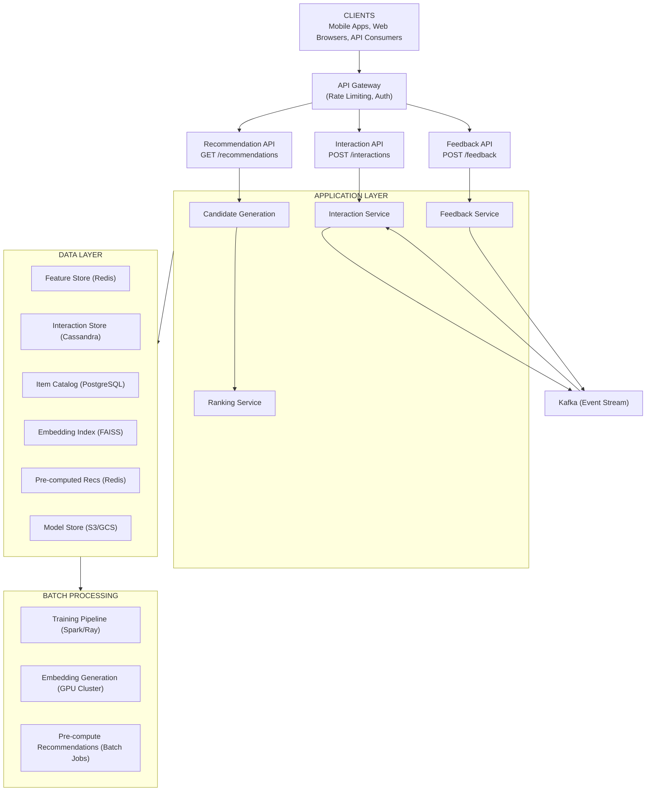

# Recommendation System - Data Model & Architecture

## Component Overview

### Components Explained

| Component              | Purpose                                | Why It Exists                                    |
| ---------------------- | -------------------------------------- | ------------------------------------------------ |
| **Candidate Generation**| Find initial set of relevant items    | Reduce 100M items to 1000 candidates             |
| **Ranking Service**    | Score and order candidates             | Personalized ordering                            |
| **Feature Store**      | Serve user/item features               | Fast feature retrieval for ranking               |
| **Embedding Service**  | Store and query embeddings             | Vector similarity search                         |
| **Interaction Service**| Capture user behavior                  | Real-time signal collection                      |
| **Training Pipeline**  | Train recommendation models            | Continuous model improvement                     |

---

## Database Schema Design

### Database Choices

| Data Type           | Database       | Rationale                                |
| ------------------- | -------------- | ---------------------------------------- |
| User profiles       | PostgreSQL     | ACID, complex queries                    |
| Item catalog        | PostgreSQL     | Relational data, metadata                |
| Interactions        | Cassandra      | High write volume, time-series           |
| User embeddings     | Redis + FAISS  | Fast retrieval, ANN search               |
| Item embeddings     | FAISS          | Approximate nearest neighbor             |
| Feature store       | Redis          | Real-time feature serving                |

---

## Consistency Model

**CAP Theorem Tradeoff:**

We choose **Availability + Partition Tolerance (AP)**:
- **Availability**: Recommendations must always respond (even with stale models)
- **Partition Tolerance**: System continues operating during network partitions
- **Consistency**: Sacrificed (recommendations may be based on stale embeddings/models)

**Why AP over CP?**
- Recommendations don't need to be real-time (minutes/hours delay acceptable)
- Better to serve stale recommendations than fail requests
- System must always respond (high availability requirement)
- During partitions, we prefer serving stale recommendations over failing

**ACID vs BASE:**

**ACID (Strong Consistency) for:**
- User profile updates (PostgreSQL, must be immediately visible)
- Item catalog updates (PostgreSQL, prevent duplicate items)
- Interaction recording (Cassandra, at-least-once delivery)

**BASE (Eventual Consistency) for:**
- User/item embeddings (updated hourly/daily, not real-time)
- Recommendation results (may be based on stale embeddings)
- Model serving (models updated periodically, not real-time)
- Feature store (real-time features updated within seconds, acceptable delay)

**Per-Operation Consistency Guarantees:**

| Operation | Consistency Level | Guarantee |
|-----------|------------------|-----------|
| Get recommendations | Eventual | May be based on embeddings/models up to hours/days old |
| Record interaction | Strong (at-least-once) | Interaction recorded, may be processed later |
| Update user profile | Strong | Immediately visible in recommendations |
| Update item catalog | Strong | New items available within minutes |
| Embedding updates | Eventual | New embeddings available within hours/days |
| Model updates | Eventual | New models deployed periodically |

**Eventual Consistency Boundaries:**
- Embedding staleness: Up to hours/days (acceptable for recommendations)
- Model staleness: Models updated daily/weekly (not real-time)
- Real-time features: Updated within seconds (acceptable delay)
- No read-after-write needed for recommendations (read-only operation)

---

### Users Table

```sql
CREATE TABLE users (
    id BIGSERIAL PRIMARY KEY,
    user_id VARCHAR(50) UNIQUE NOT NULL,
    
    -- Profile
    created_at TIMESTAMP WITH TIME ZONE DEFAULT NOW(),
    last_active_at TIMESTAMP WITH TIME ZONE,
    
    -- Preferences (explicit)
    preferred_categories TEXT[],
    language VARCHAR(10),
    country VARCHAR(3),
    
    -- Computed features
    engagement_level VARCHAR(20),  -- high, medium, low
    total_interactions INTEGER DEFAULT 0,
    
    -- Cold start status
    is_new_user BOOLEAN DEFAULT TRUE,
    onboarding_completed BOOLEAN DEFAULT FALSE
);

CREATE INDEX idx_users_active ON users(last_active_at DESC);
CREATE INDEX idx_users_engagement ON users(engagement_level);
```

---

### Items Table

```sql
CREATE TABLE items (
    id BIGSERIAL PRIMARY KEY,
    item_id VARCHAR(50) UNIQUE NOT NULL,
    
    -- Metadata
    title VARCHAR(500) NOT NULL,
    description TEXT,
    category VARCHAR(100),
    subcategory VARCHAR(100),
    tags TEXT[],
    
    -- Content features
    content_features JSONB,  -- Extracted features
    
    -- Popularity metrics
    view_count BIGINT DEFAULT 0,
    interaction_count BIGINT DEFAULT 0,
    avg_rating DECIMAL(3, 2),
    
    -- Timestamps
    created_at TIMESTAMP WITH TIME ZONE DEFAULT NOW(),
    updated_at TIMESTAMP WITH TIME ZONE DEFAULT NOW(),
    
    -- Status
    is_active BOOLEAN DEFAULT TRUE,
    is_new_item BOOLEAN DEFAULT TRUE
);

CREATE INDEX idx_items_category ON items(category, subcategory);
CREATE INDEX idx_items_popularity ON items(interaction_count DESC);
CREATE INDEX idx_items_new ON items(created_at DESC) WHERE is_new_item = TRUE;
```

---

### Interactions Table (Cassandra)

```sql
-- Partition by user_id for efficient user history queries
CREATE TABLE interactions (
    user_id TEXT,
    event_time TIMESTAMP,
    item_id TEXT,
    action_type TEXT,
    context MAP<TEXT, TEXT>,
    session_id TEXT,
    PRIMARY KEY (user_id, event_time, item_id)
) WITH CLUSTERING ORDER BY (event_time DESC, item_id ASC);

-- For item-based queries
CREATE TABLE item_interactions (
    item_id TEXT,
    event_time TIMESTAMP,
    user_id TEXT,
    action_type TEXT,
    PRIMARY KEY (item_id, event_time)
) WITH CLUSTERING ORDER BY (event_time DESC);
```

---

### User Embeddings (Redis)

```
# User embedding vector (128 dimensions)
HSET user_embedding:{user_id} 
    vector <binary_vector>
    version "v2.3.1"
    updated_at "2024-01-20T00:00:00Z"

# User features for ranking
HSET user_features:{user_id}
    avg_session_length 15.5
    preferred_categories "sci-fi,action,drama"
    engagement_score 0.75
    last_interaction_time 1705764600
```

---

### Item Embeddings (FAISS Index)

```python
# FAISS index structure
index = faiss.IndexIVFFlat(
    quantizer,           # Coarse quantizer
    embedding_dim,       # 128 dimensions
    n_clusters,          # 1000 clusters
    faiss.METRIC_INNER_PRODUCT
)

# Mapping: FAISS index position -> item_id
item_id_mapping = {
    0: "movie_001",
    1: "movie_002",
    ...
}
```

---

### Pre-computed Recommendations

```sql
-- Store pre-computed recommendations for batch serving
CREATE TABLE precomputed_recommendations (
    user_id VARCHAR(50),
    recommendation_type VARCHAR(50),  -- homepage, similar, etc.
    item_id VARCHAR(50),
    rank INTEGER,
    score FLOAT,
    explanation_type VARCHAR(50),
    computed_at TIMESTAMP WITH TIME ZONE,
    expires_at TIMESTAMP WITH TIME ZONE,
    PRIMARY KEY (user_id, recommendation_type, rank)
);

CREATE INDEX idx_precomputed_expiry ON precomputed_recommendations(expires_at);
```

---

## Entity Relationship Diagram


**Embedding Stores:**
- Redis: `user_embedding:{user_id}` → vector
- Redis: `user_features:{user_id}` → feature hash
- FAISS: item_embeddings index

<details>
<summary>ASCII diagram (reference)</summary>

```text
┌─────────────────────┐       ┌─────────────────────┐
│       users         │       │       items         │
├─────────────────────┤       ├─────────────────────┤
│ id (PK)             │       │ id (PK)             │
│ user_id (unique)    │       │ item_id (unique)    │
│ preferred_categories│       │ title               │
│ engagement_level    │       │ category            │
│ is_new_user         │       │ content_features    │
└─────────────────────┘       │ is_new_item         │
         │                    └─────────────────────┘
         │                             │
         │    ┌────────────────────────┘
         │    │
         ▼    ▼
┌─────────────────────────────────────────────────────┐
│                   interactions                       │
│              (Cassandra - Time Series)              │
├─────────────────────────────────────────────────────┤
│ user_id (PK)                                        │
│ event_time (CK)                                     │
│ item_id (CK)                                        │
│ action_type                                         │
│ context                                             │
└─────────────────────────────────────────────────────┘

┌─────────────────────────────────────────────────────┐
│                  EMBEDDING STORES                    │
├─────────────────────────────────────────────────────┤
│ Redis: user_embedding:{user_id} → vector            │
│ Redis: user_features:{user_id} → feature hash       │
│ FAISS: item_embeddings index                        │
└─────────────────────────────────────────────────────┘

┌─────────────────────────────────────────────────────┐
│              precomputed_recommendations             │
├─────────────────────────────────────────────────────┤
│ user_id (PK)                                        │
│ recommendation_type (PK)                            │
│ rank (PK)                                           │
│ item_id                                             │
│ score                                               │
│ expires_at                                          │
└─────────────────────────────────────────────────────┘
```

</details>
```

---

## Feature Store Schema

### User Features

```json
{
  "user_id": "user_123",
  "features": {
    "demographic": {
      "age_bucket": "25-34",
      "country": "US",
      "language": "en"
    },
    "behavioral": {
      "avg_session_length_minutes": 15.5,
      "sessions_per_week": 5,
      "preferred_time_of_day": "evening",
      "device_type": "mobile"
    },
    "preference": {
      "top_categories": ["sci-fi", "action", "drama"],
      "avg_rating_given": 4.2,
      "completion_rate": 0.75
    },
    "recency": {
      "days_since_last_interaction": 1,
      "interactions_last_7_days": 45,
      "interactions_last_30_days": 180
    }
  },
  "embedding": [0.12, -0.34, 0.56, ...],
  "version": "v2.3.1",
  "updated_at": "2024-01-20T00:00:00Z"
}
```

### Item Features

```json
{
  "item_id": "movie_456",
  "features": {
    "content": {
      "category": "sci-fi",
      "subcategories": ["thriller", "action"],
      "duration_minutes": 148,
      "release_year": 2010,
      "director": "Christopher Nolan",
      "cast": ["Leonardo DiCaprio", "Joseph Gordon-Levitt"]
    },
    "popularity": {
      "total_views": 15000000,
      "views_last_7_days": 50000,
      "avg_rating": 4.8,
      "rating_count": 2500000
    },
    "engagement": {
      "completion_rate": 0.92,
      "rewatch_rate": 0.15,
      "share_rate": 0.05
    }
  },
  "embedding": [0.23, 0.45, -0.12, ...],
  "version": "v2.3.1"
}
```

---

## High-Level Architecture



<details>
<summary>ASCII diagram (reference)</summary>

```text
┌─────────────────────────────────────────────────────────────────────────────────────┐
│                                    CLIENTS                                           │
│                    (Mobile Apps, Web Browsers, API Consumers)                       │
└─────────────────────────────────────────────────────────────────────────────────────┘
                                        │
                                        ▼
                            ┌───────────────────────┐
                            │     API Gateway       │
                            │  (Rate Limiting, Auth)│
                            └───────────┬───────────┘
                                        │
            ┌───────────────────────────┼───────────────────────────┐
            ▼                           ▼                           ▼
┌───────────────────────┐   ┌───────────────────────┐   ┌───────────────────────┐
│  Recommendation API   │   │   Interaction API     │   │    Feedback API       │
│                       │   │                       │   │                       │
│  GET /recommendations │   │  POST /interactions   │   │  POST /feedback       │
└───────────┬───────────┘   └───────────┬───────────┘   └───────────┬───────────┘
            │                           │                           │
            │                           │                           │
┌───────────┼───────────────────────────┼───────────────────────────┼───────────────┐
│           ▼                           ▼                           ▼               │
│  ┌─────────────────┐         ┌─────────────────┐         ┌─────────────────┐     │
│  │   Candidate     │         │   Interaction   │         │    Feedback     │     │
│  │   Generation    │         │    Service      │         │    Service      │     │
│  └────────┬────────┘         └────────┬────────┘         └────────┬────────┘     │
│           │                           │                           │               │
│           ▼                           ▼                           ▼               │
│  ┌─────────────────┐         ┌─────────────────┐                                 │
│  │    Ranking      │         │     Kafka       │◄────────────────────────────────│
│  │    Service      │         │  (Event Stream) │                                 │
│  └────────┬────────┘         └────────┬────────┘                                 │
│           │                           │                                           │
│           │                           │                                           │
│  APPLICATION LAYER                    │                                           │
└───────────┼───────────────────────────┼───────────────────────────────────────────┘
            │                           │
            │                           │
┌───────────┼───────────────────────────┼───────────────────────────────────────────┐
│           ▼                           ▼                                           │
│  ┌─────────────────┐         ┌─────────────────┐         ┌─────────────────┐     │
│  │  Feature Store  │         │   Interaction   │         │   Item Catalog  │     │
│  │    (Redis)      │         │   Store (Cass)  │         │   (PostgreSQL)  │     │
│  └─────────────────┘         └─────────────────┘         └─────────────────┘     │
│                                                                                   │
│  ┌─────────────────┐         ┌─────────────────┐         ┌─────────────────┐     │
│  │  Embedding      │         │  Pre-computed   │         │   Model Store   │     │
│  │  Index (FAISS)  │         │  Recs (Redis)   │         │   (S3/GCS)      │     │
│  └─────────────────┘         └─────────────────┘         └─────────────────┘     │
│                                                                                   │
│  DATA LAYER                                                                       │
└───────────────────────────────────────────────────────────────────────────────────┘
                                        │
                                        ▼
┌───────────────────────────────────────────────────────────────────────────────────┐
│                              BATCH PROCESSING                                      │
│                                                                                    │
│  ┌─────────────────┐         ┌─────────────────┐         ┌─────────────────┐     │
│  │   Training      │         │   Embedding     │         │  Pre-compute    │     │
│  │   Pipeline      │         │   Generation    │         │  Recommendations│     │
│  │   (Spark/Ray)   │         │   (GPU Cluster) │         │  (Batch Jobs)   │     │
│  └─────────────────┘         └─────────────────┘         └─────────────────┘     │
│                                                                                    │
└───────────────────────────────────────────────────────────────────────────────────┘
```

</details>
```

---

## Two-Stage Recommendation Pipeline


<details>
<summary>ASCII diagram (reference)</summary>

```text
┌─────────────────────────────────────────────────────────────────────────────────────┐
│                          RECOMMENDATION REQUEST FLOW                                 │
└─────────────────────────────────────────────────────────────────────────────────────┘

User Request: "Get 50 recommendations for user_123"
                                │
                                ▼
┌─────────────────────────────────────────────────────────────────────────────────────┐
│  STAGE 1: CANDIDATE GENERATION                                                       │
│  Goal: Reduce 100M items → 1000 candidates                                          │
│                                                                                      │
│  ┌─────────────────┐  ┌─────────────────┐  ┌─────────────────┐  ┌─────────────┐   │
│  │  Collaborative  │  │  Content-Based  │  │   Popularity    │  │  Trending   │   │
│  │   Filtering     │  │   Filtering     │  │    Based        │  │             │   │
│  │                 │  │                 │  │                 │  │             │   │
│  │ Similar users'  │  │ Items matching  │  │ Most popular    │  │ Trending    │   │
│  │ preferences     │  │ user preferences│  │ in category     │  │ this week   │   │
│  │                 │  │                 │  │                 │  │             │   │
│  │ Output: 500     │  │ Output: 300     │  │ Output: 150     │  │ Output: 50  │   │
│  └────────┬────────┘  └────────┬────────┘  └────────┬────────┘  └──────┬──────┘   │
│           │                    │                    │                  │           │
│           └────────────────────┴────────────────────┴──────────────────┘           │
│                                        │                                            │
│                                        ▼                                            │
│                            ┌───────────────────────┐                               │
│                            │  Merge & Deduplicate  │                               │
│                            │  ~1000 candidates     │                               │
│                            └───────────────────────┘                               │
└─────────────────────────────────────────────────────────────────────────────────────┘
                                        │
                                        ▼
┌─────────────────────────────────────────────────────────────────────────────────────┐
│  STAGE 2: RANKING                                                                    │
│  Goal: Score 1000 candidates → Top 50                                               │
│                                                                                      │
│  ┌─────────────────────────────────────────────────────────────────────────────┐   │
│  │                         FEATURE ASSEMBLY                                     │   │
│  │                                                                              │   │
│  │  User Features          Item Features          Context Features             │   │
│  │  ┌──────────────┐      ┌──────────────┐       ┌──────────────┐             │   │
│  │  │ Demographics │      │ Category     │       │ Time of day  │             │   │
│  │  │ History      │      │ Popularity   │       │ Device       │             │   │
│  │  │ Preferences  │      │ Freshness    │       │ Session      │             │   │
│  │  │ Embedding    │      │ Embedding    │       │ Location     │             │   │
│  │  └──────────────┘      └──────────────┘       └──────────────┘             │   │
│  └─────────────────────────────────────────────────────────────────────────────┘   │
│                                        │                                            │
│                                        ▼                                            │
│                            ┌───────────────────────┐                               │
│                            │   Ranking Model       │                               │
│                            │   (Neural Network)    │                               │
│                            │                       │                               │
│                            │   Input: 100 features │                               │
│                            │   Output: Score 0-1   │                               │
│                            └───────────────────────┘                               │
│                                        │                                            │
│                                        ▼                                            │
│                            ┌───────────────────────┐                               │
│                            │   Post-Processing     │                               │
│                            │                       │                               │
│                            │   - Diversity filter  │                               │
│                            │   - Business rules    │                               │
│                            │   - Freshness boost   │                               │
│                            └───────────────────────┘                               │
│                                        │                                            │
│                                        ▼                                            │
│                            ┌───────────────────────┐                               │
│                            │   Top 50 Results      │                               │
│                            └───────────────────────┘                               │
└─────────────────────────────────────────────────────────────────────────────────────┘
```

</details>
```

---

## Candidate Generation Detail

### Collaborative Filtering (ANN Search)


<details>
<summary>ASCII diagram (reference)</summary>

```text
┌─────────────────────────────────────────────────────────────────────────────────────┐
│                       COLLABORATIVE FILTERING                                        │
└─────────────────────────────────────────────────────────────────────────────────────┘

                    ┌───────────────────────────────────┐
                    │         User Embedding            │
                    │         user_123: [0.2, -0.1, ...]│
                    └─────────────────┬─────────────────┘
                                      │
                                      ▼
┌─────────────────────────────────────────────────────────────────────────────────────┐
│                           FAISS INDEX                                                │
│                                                                                      │
│  ┌─────────────────────────────────────────────────────────────────────────────┐   │
│  │                    IVF (Inverted File) Structure                             │   │
│  │                                                                              │   │
│  │  Cluster 1: [item_1, item_45, item_892, ...]                                │   │
│  │  Cluster 2: [item_2, item_67, item_234, ...]                                │   │
│  │  Cluster 3: [item_5, item_23, item_567, ...]                                │   │
│  │  ...                                                                         │   │
│  │  Cluster 1000: [item_99, item_456, ...]                                     │   │
│  │                                                                              │   │
│  │  1. Find nearest clusters to user embedding (probe 10 clusters)             │   │
│  │  2. Search within those clusters                                             │   │
│  │  3. Return top-k nearest items                                               │   │
│  └─────────────────────────────────────────────────────────────────────────────┘   │
│                                                                                      │
│  Query: user_embedding                                                               │
│  Time: O(n_probe * cluster_size) ≈ 5ms                                              │
│  Result: 500 nearest items                                                           │
└─────────────────────────────────────────────────────────────────────────────────────┘
```

</details>
```

---

## Real-time Signal Processing


<details>
<summary>ASCII diagram (reference)</summary>

```text
┌─────────────────────────────────────────────────────────────────────────────────────┐
│                          REAL-TIME SIGNAL FLOW                                       │
└─────────────────────────────────────────────────────────────────────────────────────┘

User Action: Click on "Inception"
                    │
                    ▼
┌───────────────────────────────────────────────────────────────────────────────────┐
│  CLIENT                                                                            │
│  ┌─────────────────────────────────────────────────────────────────────────────┐  │
│  │  POST /interactions                                                          │  │
│  │  {user_id: "user_123", item_id: "movie_456", action: "click"}               │  │
│  └─────────────────────────────────────────────────────────────────────────────┘  │
└───────────────────────────────────────────────────────────────────────────────────┘
                    │
                    ▼
┌───────────────────────────────────────────────────────────────────────────────────┐
│  INTERACTION SERVICE                                                               │
│  ┌─────────────────────────────────────────────────────────────────────────────┐  │
│  │  1. Validate event                                                           │  │
│  │  2. Publish to Kafka                                                         │  │
│  │  3. Return 202 Accepted                                                      │  │
│  └─────────────────────────────────────────────────────────────────────────────┘  │
└───────────────────────────────────────────────────────────────────────────────────┘
                    │
                    ▼
┌───────────────────────────────────────────────────────────────────────────────────┐
│  KAFKA: interaction-events                                                         │
│  ┌─────────────────────────────────────────────────────────────────────────────┐  │
│  │  Partition 0: [event1, event4, event7, ...]                                 │  │
│  │  Partition 1: [event2, event5, event8, ...]                                 │  │
│  │  Partition 2: [event3, event6, event9, ...]                                 │  │
│  └─────────────────────────────────────────────────────────────────────────────┘  │
└───────────────────────────────────────────────────────────────────────────────────┘
                    │
        ┌───────────┴───────────┬───────────────────┐
        ▼                       ▼                   ▼
┌───────────────┐      ┌───────────────┐    ┌───────────────┐
│ Feature       │      │ Interaction   │    │ Session       │
│ Updater       │      │ Store Writer  │    │ Aggregator    │
│               │      │               │    │               │
│ Update user   │      │ Write to      │    │ Update        │
│ features in   │      │ Cassandra     │    │ session       │
│ Redis         │      │               │    │ context       │
└───────────────┘      └───────────────┘    └───────────────┘

Effect on Next Recommendation Request:
─────────────────────────────────────
1. User features updated with recent click
2. Session context includes "clicked Inception"
3. Ranking model sees fresh signals
4. Similar items to Inception boosted
```

</details>
```

---

## Training Pipeline

```
┌─────────────────────────────────────────────────────────────────────────────────────┐
│                          TRAINING PIPELINE                                           │
└─────────────────────────────────────────────────────────────────────────────────────┘

┌─────────────────────────────────────────────────────────────────────────────────────┐
│  DATA COLLECTION (Daily)                                                             │
│                                                                                      │
│  ┌─────────────────┐    ┌─────────────────┐    ┌─────────────────┐                 │
│  │  Interactions   │    │  User Profiles  │    │  Item Catalog   │                 │
│  │  (Cassandra)    │    │  (PostgreSQL)   │    │  (PostgreSQL)   │                 │
│  └────────┬────────┘    └────────┬────────┘    └────────┬────────┘                 │
│           │                      │                      │                           │
│           └──────────────────────┴──────────────────────┘                           │
│                                  │                                                   │
│                                  ▼                                                   │
│                      ┌───────────────────────┐                                      │
│                      │   Data Lake (S3)      │                                      │
│                      │   Raw training data   │                                      │
│                      └───────────────────────┘                                      │
└─────────────────────────────────────────────────────────────────────────────────────┘
                                   │
                                   ▼
┌─────────────────────────────────────────────────────────────────────────────────────┐
│  FEATURE ENGINEERING (Spark)                                                         │
│                                                                                      │
│  ┌─────────────────────────────────────────────────────────────────────────────┐   │
│  │  1. User aggregations (views, clicks, purchases per category)               │   │
│  │  2. Item aggregations (popularity, engagement rates)                        │   │
│  │  3. User-Item interactions (co-occurrence matrix)                           │   │
│  │  4. Temporal features (time since last interaction)                         │   │
│  │  5. Cross features (user_category × item_category)                          │   │
│  └─────────────────────────────────────────────────────────────────────────────┘   │
│                                  │                                                   │
│                                  ▼                                                   │
│                      ┌───────────────────────┐                                      │
│                      │   Feature Dataset     │                                      │
│                      │   (Parquet files)     │                                      │
│                      └───────────────────────┘                                      │
└─────────────────────────────────────────────────────────────────────────────────────┘
                                   │
                    ┌──────────────┴──────────────┐
                    ▼                             ▼
┌───────────────────────────────┐   ┌───────────────────────────────┐
│  EMBEDDING MODEL TRAINING     │   │  RANKING MODEL TRAINING       │
│  (GPU Cluster)                │   │  (GPU Cluster)                │
│                               │   │                               │
│  Algorithm: Matrix            │   │  Algorithm: Deep Neural       │
│  Factorization / Two-Tower    │   │  Network (Wide & Deep)        │
│                               │   │                               │
│  Output:                      │   │  Output:                      │
│  - User embeddings (128-dim)  │   │  - Ranking model weights      │
│  - Item embeddings (128-dim)  │   │                               │
│                               │   │  Metrics:                     │
│  Duration: 4 hours            │   │  - AUC: 0.85                  │
│                               │   │  - NDCG@10: 0.72              │
└───────────────┬───────────────┘   └───────────────┬───────────────┘
                │                                   │
                └─────────────────┬─────────────────┘
                                  │
                                  ▼
┌─────────────────────────────────────────────────────────────────────────────────────┐
│  MODEL DEPLOYMENT                                                                    │
│                                                                                      │
│  ┌─────────────────┐    ┌─────────────────┐    ┌─────────────────┐                 │
│  │  Model Registry │    │  A/B Test       │    │  Gradual        │                 │
│  │  (MLflow)       │───>│  Assignment     │───>│  Rollout        │                 │
│  │                 │    │  (5% traffic)   │    │  (100% traffic) │                 │
│  └─────────────────┘    └─────────────────┘    └─────────────────┘                 │
│                                                                                      │
│  ┌─────────────────────────────────────────────────────────────────────────────┐   │
│  │  Deployment targets:                                                         │   │
│  │  - FAISS index updated with new item embeddings                             │   │
│  │  - Redis updated with new user embeddings                                   │   │
│  │  - Ranking model deployed to GPU servers                                    │   │
│  └─────────────────────────────────────────────────────────────────────────────┘   │
└─────────────────────────────────────────────────────────────────────────────────────┘
```

---

## A/B Testing Infrastructure

```
┌─────────────────────────────────────────────────────────────────────────────────────┐
│                          A/B TESTING FLOW                                            │
└─────────────────────────────────────────────────────────────────────────────────────┘

                    ┌───────────────────────────────────┐
                    │     Recommendation Request        │
                    │     user_id: user_123             │
                    └─────────────────┬─────────────────┘
                                      │
                                      ▼
                    ┌───────────────────────────────────┐
                    │     Experiment Assignment         │
                    │                                   │
                    │     hash(user_id) % 100           │
                    │     0-4: Experiment A (5%)        │
                    │     5-9: Experiment B (5%)        │
                    │     10-99: Control (90%)          │
                    └─────────────────┬─────────────────┘
                                      │
            ┌─────────────────────────┼─────────────────────────┐
            ▼                         ▼                         ▼
┌───────────────────────┐ ┌───────────────────────┐ ┌───────────────────────┐
│    Control Group      │ │   Experiment A        │ │   Experiment B        │
│                       │ │                       │ │                       │
│    Model v2.3.1       │ │   Model v2.4.0        │ │   Model v2.4.0        │
│    (Production)       │ │   (New ranking)       │ │   + Diversity boost   │
│                       │ │                       │ │                       │
└───────────┬───────────┘ └───────────┬───────────┘ └───────────┬───────────┘
            │                         │                         │
            └─────────────────────────┴─────────────────────────┘
                                      │
                                      ▼
                    ┌───────────────────────────────────┐
                    │     Response with Experiment ID   │
                    │     X-Experiment: exp_123_A       │
                    └─────────────────┬─────────────────┘
                                      │
                                      ▼
                    ┌───────────────────────────────────┐
                    │     Metrics Collection            │
                    │                                   │
                    │     - CTR per experiment          │
                    │     - Conversion per experiment   │
                    │     - Engagement per experiment   │
                    └───────────────────────────────────┘
                                      │
                                      ▼
                    ┌───────────────────────────────────┐
                    │     Statistical Analysis          │
                    │                                   │
                    │     After 1 week:                 │
                    │     Exp A: +3% CTR (p < 0.05)    │
                    │     Exp B: +1% CTR (p = 0.12)    │
                    │                                   │
                    │     Decision: Roll out Exp A      │
                    └───────────────────────────────────┘
```

---

## Caching Architecture

```
┌─────────────────────────────────────────────────────────────────────────────────────┐
│                          MULTI-LAYER CACHING                                         │
└─────────────────────────────────────────────────────────────────────────────────────┘

┌─────────────────────────────────────────────────────────────────────────────────────┐
│  LAYER 1: PRE-COMPUTED RECOMMENDATIONS                                               │
│                                                                                      │
│  ┌─────────────────────────────────────────────────────────────────────────────┐   │
│  │  For active users (DAU):                                                     │   │
│  │  - Pre-compute top 1000 recommendations nightly                             │   │
│  │  - Store in Redis: precomputed:{user_id} = [item_ids]                       │   │
│  │  - TTL: 24 hours                                                            │   │
│  │  - Hit rate: ~60% of requests                                               │   │
│  └─────────────────────────────────────────────────────────────────────────────┘   │
└─────────────────────────────────────────────────────────────────────────────────────┘
                                      │
                                      │ Cache MISS
                                      ▼
┌─────────────────────────────────────────────────────────────────────────────────────┐
│  LAYER 2: EMBEDDING CACHE                                                            │
│                                                                                      │
│  ┌─────────────────────────────────────────────────────────────────────────────┐   │
│  │  User embeddings in Redis:                                                   │   │
│  │  - user_embedding:{user_id} = [128-dim vector]                              │   │
│  │  - TTL: 1 hour                                                              │   │
│  │  - Hit rate: ~95%                                                           │   │
│  │                                                                              │   │
│  │  Item embeddings in FAISS (memory-mapped):                                  │   │
│  │  - Loaded at startup                                                        │   │
│  │  - Updated hourly                                                           │   │
│  └─────────────────────────────────────────────────────────────────────────────┘   │
└─────────────────────────────────────────────────────────────────────────────────────┘
                                      │
                                      │ Cache MISS
                                      ▼
┌─────────────────────────────────────────────────────────────────────────────────────┐
│  LAYER 3: FEATURE CACHE                                                              │
│                                                                                      │
│  ┌─────────────────────────────────────────────────────────────────────────────┐   │
│  │  User features: user_features:{user_id}                                     │   │
│  │  Item features: item_features:{item_id}                                     │   │
│  │  TTL: 15 minutes                                                            │   │
│  │  Hit rate: ~90%                                                             │   │
│  └─────────────────────────────────────────────────────────────────────────────┘   │
└─────────────────────────────────────────────────────────────────────────────────────┘
                                      │
                                      │ Cache MISS
                                      ▼
┌─────────────────────────────────────────────────────────────────────────────────────┐
│  LAYER 4: DATABASE                                                                   │
│                                                                                      │
│  ┌─────────────────────────────────────────────────────────────────────────────┐   │
│  │  PostgreSQL: User profiles, Item catalog                                    │   │
│  │  Cassandra: Interaction history                                             │   │
│  │  S3: Model artifacts                                                        │   │
│  └─────────────────────────────────────────────────────────────────────────────┘   │
└─────────────────────────────────────────────────────────────────────────────────────┘
```

---

## Failure Points and Mitigation

```
┌─────────────────────────────────────────────────────────────────────────────────────┐
│                              FAILURE ANALYSIS                                        │
└─────────────────────────────────────────────────────────────────────────────────────┘

Component              Failure Mode           Impact              Mitigation
─────────────────────────────────────────────────────────────────────────────────────

┌─────────────────┐
│ FAISS Index     │ ─── Corruption ──────── Wrong results ────── Blue-green deploy,
│                 │                                               backup index
└─────────────────┘

┌─────────────────┐
│ Feature Store   │ ─── Latency spike ───── Slow ranking ─────── Timeout + defaults,
│                 │                                               local cache
└─────────────────┘

┌─────────────────┐
│ Ranking Model   │ ─── GPU failure ─────── No ranking ──────── Fallback to simple
│                 │                                               rule-based ranking
└─────────────────┘

┌─────────────────┐
│ Kafka           │ ─── Broker down ─────── Events delayed ──── 3x replication,
│                 │                                               automatic failover
└─────────────────┘

┌─────────────────┐
│ PostgreSQL      │ ─── Primary down ────── Catalog unavailable  Automatic failover
│                 │                                               to replica
└─────────────────┘

GRACEFUL DEGRADATION STRATEGY:
─────────────────────────────
1. If ranking fails → Use candidate scores directly
2. If FAISS fails → Use pre-computed recommendations
3. If features unavailable → Use default features
4. If all else fails → Return popular items
```

---

## Summary

| Aspect              | Decision                                              |
| ------------------- | ----------------------------------------------------- |
| Architecture        | Two-stage (candidate generation + ranking)            |
| Candidate generation| Collaborative + Content + Popularity                  |
| Ranking             | Neural network with 100+ features                     |
| Embeddings          | FAISS for ANN search                                  |
| Real-time signals   | Kafka → Feature Store                                 |
| Caching             | Multi-layer (pre-computed → embeddings → features)    |
| A/B testing         | Hash-based assignment, statistical analysis           |

