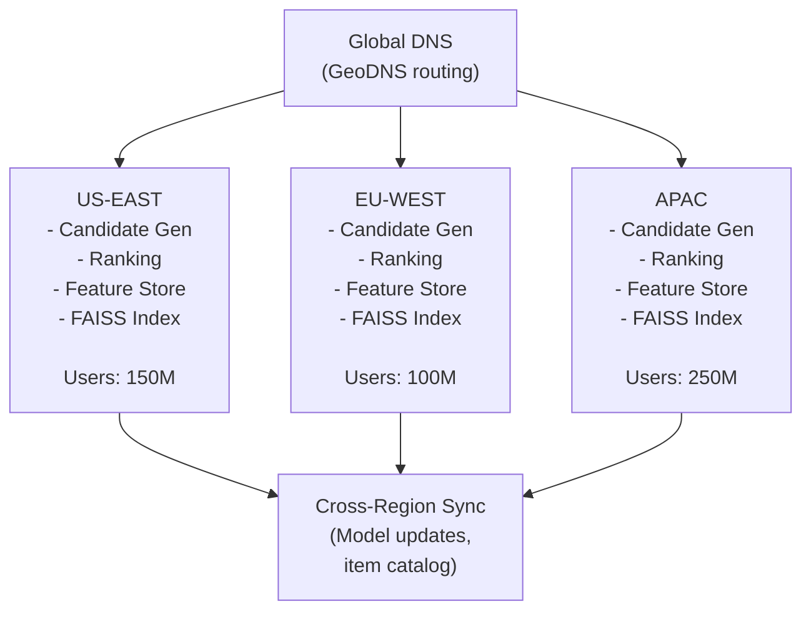

# Recommendation System - Production Deep Dives (Ops)

## Overview

This document covers operational aspects of the Recommendation System: scaling & reliability, monitoring & observability, security considerations, end-to-end simulations, and cost analysis.

---

## 1. Scaling & Reliability

### Scaling Strategy

#### Current State (10M users)
- Single FAISS index: 10M items fits in memory
- 5 GPU servers for ranking
- Single Redis cluster (64 nodes)
- ~10K QPS

#### Scaling to 500M users (50x)

| Component           | Current (10M)   | Scaled (500M)  | Notes                          |
| ------------------- | --------------- | -------------- | ------------------------------ |
| FAISS Servers       | 1               | 10             | Sharded by item_id % 10        |
| GPU Ranking Servers | 5               | 50             | Horizontal scaling             |
| Redis Feature Store | 64 nodes        | 200+ nodes     | Sharded by user_id             |
| Kafka Brokers       | 5               | 20             | More partitions                |
| Pre-computation     | 1M users        | 100M users     | Tiered approach                |

#### Regional Deployment



<details>
<summary>ASCII diagram (reference)</summary>

```text
┌─────────────────────────────────────────────────────────────────────────────────────┐
│                              GLOBAL ARCHITECTURE                                     │
└─────────────────────────────────────────────────────────────────────────────────────┘

                         ┌───────────────────────┐
                         │   Global DNS          │
                         │   (GeoDNS routing)    │
                         └───────────┬───────────┘
                                     │
         ┌───────────────────────────┼───────────────────────────┐
         ▼                           ▼                           ▼
┌─────────────────┐         ┌─────────────────┐         ┌─────────────────┐
│    US-EAST      │         │    EU-WEST      │         │     APAC        │
│                 │         │                 │         │                 │
│ - Candidate Gen │         │ - Candidate Gen │         │ - Candidate Gen │
│ - Ranking       │         │ - Ranking       │         │ - Ranking       │
│ - Feature Store │         │ - Feature Store │         │ - Feature Store │
│ - FAISS Index   │         │ - FAISS Index   │         │ - FAISS Index   │
│                 │         │                 │         │                 │
│ Users: 150M     │         │ Users: 100M     │         │ Users: 250M     │
└────────┬────────┘         └────────┬────────┘         └────────┬────────┘
         │                           │                           │
         └───────────────────────────┴───────────────────────────┘
                                     │
                         ┌───────────────────────┐
                         │   Cross-Region Sync   │
                         │   (Model updates,     │
                         │    item catalog)      │
                         └───────────────────────┘
```

</details>
```
```

### Reliability Patterns

#### Circuit Breaker for Model Serving

```java
@Service
public class RankingServiceWithFallback {
    
    private final CircuitBreaker modelCircuitBreaker;
    
    public RankingServiceWithFallback() {
        this.modelCircuitBreaker = CircuitBreaker.ofDefaults("ranking-model");
        
        modelCircuitBreaker.getEventPublisher()
            .onStateTransition(event -> 
                log.warn("Ranking circuit breaker state: {}", event.getStateTransition()));
    }
    
    public List<RankedItem> rank(List<Candidate> candidates, String userId, Context context) {
        try {
            return modelCircuitBreaker.executeSupplier(() -> 
                modelService.rank(candidates, userId, context)
            );
        } catch (Exception e) {
            log.warn("Ranking model unavailable, using fallback");
            metrics.recordRankingFallback();
            return fallbackRanking(candidates);
        }
    }
    
    private List<RankedItem> fallbackRanking(List<Candidate> candidates) {
        // Simple rule-based ranking
        return candidates.stream()
            .map(c -> RankedItem.builder()
                .itemId(c.getItemId())
                .score(calculateSimpleScore(c))
                .build())
            .sorted(Comparator.comparingDouble(RankedItem::getScore).reversed())
            .collect(Collectors.toList());
    }
    
    private double calculateSimpleScore(Candidate c) {
        return 0.5 * c.getCandidateScore() +
               0.3 * c.getPopularity() +
               0.2 * c.getFreshness();
    }
}
```

#### Feature Store Timeout Handling

```java
@Service
public class FeatureServiceWithTimeout {
    
    public RankingFeatures getFeaturesWithTimeout(String userId, String itemId) {
        try {
            return featureStore.getFeatures(userId, itemId)
                .orTimeout(10, TimeUnit.MILLISECONDS)
                .get();
        } catch (TimeoutException e) {
            // Use default features
            return getDefaultFeatures(userId, itemId);
        }
    }
    
    private RankingFeatures getDefaultFeatures(String userId, String itemId) {
        return RankingFeatures.builder()
            .userEmbedding(getAverageUserEmbedding())
            .itemEmbedding(getItemEmbedding(itemId))  // From local cache
            .useDefaults(true)
            .build();
    }
}
```

#### FAISS Index Failover

```java
@Service
public class FAISSServiceWithFailover {
    
    private final Index primaryIndex;
    private final Index backupIndex;
    
    public List<ScoredItem> searchWithFallback(float[] query, int k) {
        try {
            List<ScoredItem> results = primaryIndex.search(query, k);
            
            // Sanity check
            if (results.isEmpty() || results.get(0).getScore() < 0.1) {
                log.warn("Primary index returning poor results");
                return backupIndex.search(query, k);
            }
            
            return results;
        } catch (Exception e) {
            log.error("Primary index failed", e);
            return backupIndex.search(query, k);
        }
    }
}
```

### Backup and Recovery

**RPO (Recovery Point Objective):** < 1 hour
- Maximum acceptable data loss
- Based on model update frequency (hourly)
- User interaction data replicated to read replicas within 1 hour
- FAISS index snapshots taken hourly

**RTO (Recovery Time Objective):** < 15 minutes
- Maximum acceptable downtime
- Time to restore service via failover to secondary region
- Includes model server restart, index restoration, and traffic rerouting

**Disaster Recovery Testing:**

**Frequency:** Quarterly (every 3 months)

**Pre-Test Checklist:**
- [ ] DR region infrastructure provisioned and healthy
- [ ] FAISS index replicated to DR region (within 1 hour lag)
- [ ] Model snapshots verified in S3
- [ ] Database replication lag < 1 hour
- [ ] DNS failover scripts tested
- [ ] Monitoring alerts configured for DR region
- [ ] On-call engineer notified and available

**Test Process (Step-by-Step):**

1. **Pre-Test Baseline (T-30 minutes):**
   - Record current traffic metrics (QPS, latency, error rate)
   - Capture recommendation quality metrics (CTR, diversity)
   - Document active user count
   - Verify FAISS index version and size
   - Test recommendation API (100 sample users)

2. **Simulate Primary Region Failure (T+0):**
   - Stop all services in primary region (or use chaos engineering tool)
   - Verify health checks fail
   - Confirm traffic routing stops to primary region

3. **Execute Failover Procedure (T+0 to T+15 minutes):**
   - **T+0-1 min:** Detect failure via health checks
   - **T+1-3 min:** Promote secondary region to primary
   - **T+3-4 min:** Update DNS records (Route53 health checks)
   - **T+4-8 min:** Load FAISS index from latest snapshot
   - **T+8-10 min:** Load ranking model from latest snapshot
   - **T+10-12 min:** Warm up Redis cache from database
   - **T+12-14 min:** Verify all services healthy in DR region
   - **T+14-15 min:** Resume traffic to DR region

4. **Post-Failover Validation (T+15 to T+30 minutes):**
   - Verify RTO < 15 minutes: ✅ PASS/FAIL
   - Verify RPO < 1 hour: Check index/model snapshot timestamp
   - Test recommendation API: Generate recommendations for 1,000 test users
   - Test recommendation quality: Verify CTR and diversity metrics match baseline
   - Monitor metrics: QPS, latency, error rate return to baseline
   - Verify FAISS index: Check index integrity, all items searchable

5. **Data Integrity Verification:**
   - Compare user/item count: Pre-failover vs post-failover (should match within 1 hour)
   - Spot check: Verify 100 random users get recommendations
   - Check model version: Verify ranking model version matches expected
   - Test edge cases: Cold start users, new items, sparse interactions

6. **Failback Procedure (T+30 to T+45 minutes):**
   - Restore primary region services
   - Sync FAISS index and models from DR to primary
   - Verify index/model versions match
   - Update DNS to route traffic back to primary
   - Monitor for 15 minutes before declaring success

**Validation Criteria:**
- ✅ RTO < 15 minutes: Time from failure to service resumption
- ✅ RPO < 1 hour: Maximum data loss (verified via index/model snapshot timestamp)
- ✅ Recommendations remain accurate: Quality metrics match baseline (>95%)
- ✅ No data loss: User/item count matches pre-failover (within 1 hour window)
- ✅ Service resumes within RTO target: All metrics return to baseline
- ✅ FAISS index loads correctly: All items searchable, no corruption

**Post-Test Actions:**
- Document test results in runbook
- Update last test date
- Identify improvements for next test
- Review and update failover procedures if needed

**Last Test:** TBD (to be scheduled)
**Next Test:** [Last Test Date + 3 months]

---

## 4. Simulation (End-to-End User Journeys)

### Journey 1: User Requests Homepage Recommendations

**Step-by-step:**

1. **User Action**: User opens homepage, client sends `GET /v1/recommendations?user_id=user123&type=homepage`
2. **Recommendation Service**: 
   - Checks Redis cache: `GET recommendations:user123:homepage` → MISS (cache expired)
   - Fetches user features from Redis: `GET user_features:user123` → HIT (user embedding, preferences)
   - Queries FAISS index: `index.search(user_embedding, k=1000)` → Returns 1000 candidate items
   - Fetches item features from Redis: Batch `MGET item_features:item1, item_features:item2, ...`
   - Ranks candidates using ML model (GPU server): `rank(user_features, item_features, candidates)`
   - Returns top 20 recommendations
   - Caches result: `SET recommendations:user123:homepage {results} TTL 5min`
3. **Response**: `200 OK` with `{"recommendations": [{"item_id": "item1", "score": 0.95, ...}, ...]}`
4. **Client**: Displays recommendations on homepage

**Total latency: ~50ms** (FAISS lookup 10ms + ranking 30ms + Redis 10ms)

### Journey 2: Pre-computed Recommendations (Popular User)

**Step-by-step:**

1. **Background Job** (runs hourly):
   - Identifies popular users (top 10% by activity)
   - Generates recommendations for each user
   - Stores in Redis: `SET recommendations:user123:homepage {pre_computed} TTL 1hour`
2. **User Action**: Popular user opens homepage
3. **Recommendation Service**:
   - Checks Redis: `GET recommendations:user123:homepage` → HIT (pre-computed)
   - Returns cached recommendations immediately
4. **Response**: `200 OK` with cached recommendations

**Total latency: ~5ms** (Redis lookup only)

### Failure & Recovery Walkthrough

**Scenario: FAISS Index Server Failure**

**RTO (Recovery Time Objective):** < 2 minutes (server restart + index reload)  
**RPO (Recovery Point Objective):** 0 (index replicated, no data loss)

**Timeline:**

```
T+0s:    FAISS server 3 crashes (handles items 30M-40M)
T+0-5s:  Requests to shard 3 fail
T+5s:    Health check fails
T+10s:   Load balancer removes server 3 from rotation
T+15s:   Kubernetes restarts pod
T+30s:   Pod starts, begins loading index from S3
T+90s:   Index loaded (10M items, 150 GB)
T+120s:  Health check passes, server rejoins rotation
```

**What degrades:**
- Recommendations for items 30M-40M unavailable for ~2 minutes
- Fallback to other shards (partial results)
- Latency may increase slightly

**What stays up:**
- 9 other FAISS servers continue serving
- Redis cache still working
- GPU ranking servers unaffected
- Most recommendations still work

**What recovers automatically:**
- Kubernetes restarts failed pod
- Pod loads index from S3
- Server rejoins rotation
- No manual intervention required

**What requires human intervention:**
- Investigate root cause of crash
- Review server resource allocation
- Check for systemic issues

**Cascading failure prevention:**
- Index replication (3x) prevents data loss
- Sharding distributes load
- Circuit breakers prevent retry storms
- Fallback to cached recommendations

**Backup Strategy:**
- **Model Snapshots**: Hourly snapshots of trained models
- **FAISS Index Backups**: Hourly full index snapshots
- **Database Backups**: Daily full backups, hourly incremental
- **Cross-region Replication**: Async replication to secondary region

### Multi-Region Deployment

**Architecture Overview:**

```
┌─────────────────────────────────────────────────────────────────────┐
│                    PRIMARY REGION: us-east-1                         │
│  ┌───────────────────────────────────────────────────────────────┐  │
│  │  ┌─────────────┐  ┌─────────────┐  ┌─────────────┐           │  │
│  │  │ Candidate  │  │ Ranking     │  │ API         │           │  │
│  │  │ Gen (FAISS)│  │ (GPU)       │  │ Service     │           │  │
│  │  │ (10 pods)  │  │ (20 pods)   │  │ (20 pods)   │           │  │
│  │  └──────┬──────┘  └──────┬──────┘  └──────┬──────┘           │  │
│  │         │                 │                 │                  │  │
│  │  ┌──────┴─────────────────┴─────────────────┴──────┐          │  │
│  │  │  Redis Feature Store (64 nodes)                 │          │  │
│  │  │  ──async repl──> Redis Replica (DR)            │          │  │
│  │  └──────────────────────────────────────────────────┘          │  │
│  │                                                               │  │
│  │  ┌──────────────────────────────────────────────────────────┐ │  │
│  │  │  PostgreSQL (user/item metadata) - Sharded                │ │  │
│  │  │  ──async repl──> PostgreSQL Replica (DR)                 │ │  │
│  │  └──────────────────────────────────────────────────────────┘ │  │
│  │                                                               │  │
│  │  ┌──────────────────────────────────────────────────────────┐ │  │
│  │  │  Cassandra (interaction history) - 10 nodes               │ │  │
│  │  │  ──async repl──> Cassandra Replica (DR)                  │ │  │
│  │  └──────────────────────────────────────────────────────────┘ │  │
│  │                                                               │  │
│  │  ┌──────────────────────────────────────────────────────────┐ │  │
│  │  │  FAISS Index (in-memory, 310 GB)                         │ │  │
│  │  │  ──hourly snapshots──> S3 (index backups)                │ │  │
│  │  └──────────────────────────────────────────────────────────┘ │  │
│  │                                                               │  │
│  │  ┌──────────────────────────────────────────────────────────┐ │  │
│  │  │  Model Storage (S3) - Ranking models                      │ │  │
│  │  │  ──CRR──> S3 Bucket (DR region)                          │ │  │
│  │  └──────────────────────────────────────────────────────────┘ │  │
│  └───────────────────────────────────────────────────────────────┘  │
│                              │                                       │
│                    ──async replication──                            │
│                              │                                       │
└──────────────────────────────┼───────────────────────────────────────┘
                               │
┌──────────────────────────────┼───────────────────────────────────────┐
│                    DR REGION: us-west-2                                │
│                              │                                       │
│  ┌───────────────────────────▼─────────────────────────────────────┐ │
│  │  PostgreSQL Replica (async replication from us-east-1)            │ │
│  │  Cassandra Replica (async replication from us-east-1)            │ │
│  │  Redis Replica (async replication + snapshots)                   │ │
│  │  FAISS Index (loaded from S3 snapshot, updated hourly)            │ │
│  │  Ranking Model (loaded from S3, updated hourly)                   │ │
│  │  Candidate Gen (3 pods, minimal for DR readiness)                │ │
│  │  Ranking (5 pods, minimal for DR readiness)                      │ │
│  │  API Service (5 pods, minimal for DR readiness)                  │ │
│  └─────────────────────────────────────────────────────────────────┘ │
└───────────────────────────────────────────────────────────────────────┘
```

**Replication Strategy:**

1. **FAISS Index Replication:**
   - **Primary:** us-east-1 maintains FAISS index in memory
   - **Replication:** Hourly snapshots uploaded to S3
   - **Secondary:** DR region downloads latest snapshot from S3, loads into memory
   - **Replication Lag:** < 1 hour (acceptable for recommendations)
   - **Conflict Resolution:** Not applicable (read-only index, single source of truth)

2. **Model Replication:**
   - **Primary:** us-east-1 trains and deploys ranking models
   - **Replication:** Model snapshots uploaded to S3 hourly
   - **Secondary:** DR region downloads latest model from S3
   - **Replication Lag:** < 1 hour (acceptable for recommendations)

3. **Database Replication:**
   - **Synchronous:** Primary → Replica in same region for zero data loss
   - **Asynchronous:** Primary → DR region (us-west-2) for disaster recovery
   - **Replication Lag Target:** < 1 hour for DR region
   - **Conflict Resolution:** Not applicable (single-writer model)

4. **Redis Replication:**
   - **Redis Replication:** Async replication to DR region
   - **Snapshots:** Hourly snapshots to S3 for faster recovery
   - **Cache Warm-up:** On failover, restore from latest snapshot

5. **Traffic Routing:**
   - **Primary:** Route53 health checks route to us-east-1
   - **Failover:** On primary failure, DNS TTL (60s) routes to us-west-2
   - **Geographic Routing:** Optional - route users to nearest region

**Cross-Region Challenges & Solutions:**

| Challenge | Impact | Solution |
|-----------|--------|----------|
| **Index/Model Sync Lag** | Stale recommendations in DR region | Acceptable for DR (RPO < 1 hour), users see recent recommendations |
| **Replication Lag** | Stale user features in DR region | Acceptable for DR (RPO < 1 hour), use sync replica for reads in primary |
| **Latency** | Higher latency for cross-region writes | Only primary region accepts writes, DR is read-only until failover |
| **Cost** | 2x infrastructure cost | DR region uses smaller instances, only scaled up during failover |
| **Data Consistency** | Eventual consistency across regions | Acceptable for recommendations (slight staleness), strong consistency within region |
| **Model Version Mismatch** | Different model versions across regions | Acceptable for DR, models sync hourly |

**Failover Scenarios:**

1. **Single Pod Failure:**
   - Impact: Minimal (other pods handle traffic)
   - Recovery: Automatic (Kubernetes restarts pod)
   - RTO: < 2 minutes (automatic)

2. **Entire Region Failure:**
   - Impact: Complete service outage in primary region
   - Recovery: Manual failover to DR region
   - RTO: < 15 minutes (manual process)
   - RPO: < 1 hour (index/model snapshot lag)

3. **Network Partition:**
   - Impact: Primary region isolated, DR region may have stale index/model
   - Recovery: Manual decision (split-brain prevention)
   - Strategy: Prefer data consistency over availability (CP system)

**Cost Implications:**

- **Primary Region:** $477,000/month (full infrastructure)
- **DR Region:** $150,000/month (reduced capacity, 31% of primary)
- **S3 CRR:** $500/month (cross-region replication)
- **Replication Bandwidth:** $3,000/month (cross-region data transfer)
- **Total Multi-Region Cost:** $630,500/month (32% increase)

**Benefits:**
- **Availability:** 99.99% → 99.999% (reduces downtime from 52 min/year to 5 min/year)
- **Disaster Recovery:** Survives region-wide outages
- **Compliance:** Meets regulatory requirements for geographic redundancy
- **Data Durability:** S3 snapshots provide additional backup layer

**Trade-offs:**
- **Cost:** 32% increase for DR capability
- **Complexity:** More complex operations (failover procedures, multi-region monitoring)
- **Latency:** Cross-region replication adds 50-100ms latency (acceptable for async)
- **Consistency:** Eventual consistency (acceptable for recommendations, slight staleness)
- **User Interaction Logs**: Real-time streaming to data warehouse

### Database Connection Pool Configuration

**Connection Pool Settings (HikariCP):**

```yaml
spring:
  datasource:
    hikari:
      # Pool sizing
      maximum-pool-size: 20          # Max connections per application instance
      minimum-idle: 5                 # Minimum idle connections
      
      # Timeouts
      connection-timeout: 30000       # 30s - Max time to wait for connection from pool
      idle-timeout: 600000            # 10m - Idle connection timeout
      max-lifetime: 1800000           # 30m - Max connection lifetime
      
      # Monitoring
      leak-detection-threshold: 60000 # 60s - Detect connection leaks
      
      # Validation
      connection-test-query: SELECT 1
      validation-timeout: 3000        # 3s - Connection validation timeout
      
      # Register metrics
      register-mbeans: true
```

**Pool Sizing Calculation:**

```
Pool size = ((Core count × 2) + Effective spindle count)

For our service:
- 4 CPU cores per pod
- Spindle count = 1 (single DB instance)
- Calculated: (4 × 2) + 1 = 9 connections minimum
- With safety margin: 20 connections per pod
- 20 pods × 20 = 400 max connections to database
- Database max_connections: 500 (20% headroom)
```

**Pool Exhaustion Mitigation:**

1. **Monitoring:**
   - Alert when pool usage > 80%
   - Track wait time for connections
   - Monitor connection leak detection

2. **Circuit Breaker:**
   - If pool exhausted for > 5 seconds, open circuit breaker
   - Fail fast instead of blocking

3. **PgBouncer (Connection Pooler):**
   - Place PgBouncer between app and PostgreSQL
   - PgBouncer pool: 100 connections
   - App pools can share PgBouncer connections efficiently

**Restore Steps:**
1. Detect primary region failure (health checks) - 1 minute
2. Promote secondary region to primary - 3 minutes
3. Restore FAISS index from latest snapshot - 5 minutes
4. Load latest model snapshot - 3 minutes
5. Verify recommendation service health and resume traffic - 3 minutes

**Disaster Recovery Testing:**
- Frequency: Quarterly
- Process: Simulate primary region failure, execute failover
- Validation: Verify RTO < 15 minutes, RPO < 1 hour, minimal data loss

---

## 2. Monitoring & Observability

### Key Metrics

```java
@Component
public class RecommendationMetrics {
    
    private final MeterRegistry registry;
    
    // Latency
    private final Timer candidateGenerationLatency;
    private final Timer rankingLatency;
    private final Timer totalLatency;
    
    // Quality
    private final Counter recommendationRequests;
    private final Counter cacheHits;
    private final Counter coldStartUsers;
    
    // Model health
    private final Counter modelInferenceErrors;
    private final Counter emptyRecommendations;
    
    public RecommendationMetrics(MeterRegistry registry) {
        this.registry = registry;
        
        this.totalLatency = Timer.builder("recommendations.latency.total")
            .description("Total recommendation latency")
            .publishPercentiles(0.5, 0.95, 0.99)
            .register(registry);
        
        this.candidateGenerationLatency = Timer.builder("recommendations.latency.candidates")
            .description("Candidate generation latency")
            .publishPercentiles(0.5, 0.95, 0.99)
            .register(registry);
        
        this.rankingLatency = Timer.builder("recommendations.latency.ranking")
            .description("Ranking model latency")
            .publishPercentiles(0.5, 0.95, 0.99)
            .register(registry);
        
        this.cacheHits = Counter.builder("recommendations.cache.hits")
            .description("Pre-computed recommendation cache hits")
            .register(registry);
        
        this.coldStartUsers = Counter.builder("recommendations.cold_start")
            .description("Cold start user requests")
            .register(registry);
    }
    
    public void recordRecommendation(long totalMs, long candidateMs, long rankingMs,
                                      boolean cacheHit, boolean coldStart) {
        totalLatency.record(totalMs, TimeUnit.MILLISECONDS);
        candidateGenerationLatency.record(candidateMs, TimeUnit.MILLISECONDS);
        rankingLatency.record(rankingMs, TimeUnit.MILLISECONDS);
        
        recommendationRequests.increment();
        if (cacheHit) cacheHits.increment();
        if (coldStart) coldStartUsers.increment();
    }
}
```

### Alerting Thresholds

| Metric                  | Warning    | Critical   | Action                        |
| ----------------------- | ---------- | ---------- | ----------------------------- |
| Latency P99             | > 80ms     | > 150ms    | Scale or optimize             |
| Cache hit rate          | < 50%      | < 30%      | Check pre-computation         |
| Model inference errors  | > 0.1%     | > 1%       | Check model serving           |
| Empty recommendations   | > 1%       | > 5%       | Check candidate generation    |
| FAISS search latency    | > 10ms     | > 20ms     | Tune nprobe, add shards       |
| Feature store latency   | > 5ms      | > 15ms     | Scale Redis, check network    |

### Grafana Dashboard Queries

```promql
# Total recommendation latency P99
histogram_quantile(0.99, 
  sum(rate(recommendations_latency_total_seconds_bucket[5m])) by (le)
)

# Cache hit rate
sum(rate(recommendations_cache_hits_total[5m])) / 
sum(rate(recommendations_requests_total[5m]))

# Cold start percentage
sum(rate(recommendations_cold_start_total[5m])) / 
sum(rate(recommendations_requests_total[5m])) * 100

# Model inference error rate
sum(rate(model_inference_errors_total[5m])) / 
sum(rate(model_inference_requests_total[5m])) * 100

# FAISS search latency
histogram_quantile(0.95, 
  sum(rate(faiss_search_latency_seconds_bucket[5m])) by (le)
)
```

### Health Check Endpoints

```java
@RestController
@RequestMapping("/health")
public class HealthController {
    
    @GetMapping("/ready")
    public ResponseEntity<Map<String, Object>> readiness() {
        Map<String, Object> health = new HashMap<>();
        boolean healthy = true;
        
        // Check Redis Feature Store
        try {
            redis.ping();
            health.put("feature_store", "UP");
        } catch (Exception e) {
            health.put("feature_store", "DOWN");
            healthy = false;
        }
        
        // Check FAISS Index
        try {
            faissIndex.search(testQuery, 1);
            health.put("faiss_index", "UP");
        } catch (Exception e) {
            health.put("faiss_index", "DOWN");
            healthy = false;
        }
        
        // Check Model Serving
        try {
            modelClient.healthCheck();
            health.put("model_serving", "UP");
        } catch (Exception e) {
            health.put("model_serving", "DOWN");
            healthy = false;
        }
        
        // Check Kafka
        try {
            kafkaAdmin.describeCluster();
            health.put("kafka", "UP");
        } catch (Exception e) {
            health.put("kafka", "DOWN");
            healthy = false;
        }
        
        return healthy ? 
            ResponseEntity.ok(health) : 
            ResponseEntity.status(503).body(health);
    }
}
```

---

## 3. Security Considerations

### Input Validation

```java
@Service
public class RecommendationSecurityService {
    
    public void validateRequest(RecommendationRequest request) {
        // Validate user_id
        if (!isValidUserId(request.getUserId())) {
            throw new BadRequestException("Invalid user_id format");
        }
        
        // Validate limit
        if (request.getLimit() < 1 || request.getLimit() > 100) {
            throw new BadRequestException("Limit must be between 1 and 100");
        }
        
        // Validate context
        if (request.getContext() != null) {
            validateContext(request.getContext());
        }
    }
    
    private void validateContext(Context context) {
        // Prevent injection in context fields
        if (context.getCategory() != null && 
            !VALID_CATEGORIES.contains(context.getCategory())) {
            throw new BadRequestException("Invalid category");
        }
    }
}
```

### Rate Limiting

```java
@Service
public class RecommendationRateLimiter {
    
    private final RedisTemplate<String, String> redis;
    
    // 100 requests per minute per user
    private static final int RATE_LIMIT = 100;
    private static final int WINDOW_SECONDS = 60;
    
    public boolean isAllowed(String userId) {
        String key = "rate_limit:recommendations:" + userId;
        
        Long count = redis.opsForValue().increment(key);
        if (count == 1) {
            redis.expire(key, WINDOW_SECONDS, TimeUnit.SECONDS);
        }
        
        return count <= RATE_LIMIT;
    }
}
```

### Privacy Controls

```java
@Service
public class PrivacyService {
    
    public void applyPrivacyFilters(List<RankedItem> recommendations, String userId) {
        User user = userRepository.findById(userId);
        
        // Filter blocked content
        Set<String> blockedCategories = user.getBlockedCategories();
        recommendations.removeIf(item -> 
            blockedCategories.contains(getCategory(item.getItemId()))
        );
        
        // Apply age restrictions
        if (user.getAge() != null && user.getAge() < 18) {
            recommendations.removeIf(item -> 
                isAdultContent(item.getItemId())
            );
        }
        
        // Apply regional restrictions
        String userCountry = user.getCountry();
        recommendations.removeIf(item -> 
            !isAvailableInCountry(item.getItemId(), userCountry)
        );
    }
    
    public void handleDataDeletionRequest(String userId) {
        // Delete user embeddings
        redis.delete("user_embedding:" + userId);
        redis.delete("user_features:" + userId);
        
        // Delete interaction history
        cassandra.execute("DELETE FROM interactions WHERE user_id = ?", userId);
        
        // Delete pre-computed recommendations
        redis.delete("precomputed:" + userId);
        
        // Mark user as deleted
        userRepository.markDeleted(userId);
    }
}
```

---

## 4. End-to-End User Journey Simulations

### Simulation 1: Normal Recommendation Request (Happy Path)

```
User: Alice (active user, 500 interactions)
Action: Opens app homepage
Time: 7:00 PM (peak hour)

┌─────────────────────────────────────────────────────────────┐
│ Step 1: Request Received (0ms)                               │
│ GET /v1/recommendations?user_id=alice_123&limit=50          │
│ Context: homepage, mobile, evening                          │
└─────────────────────────────────────────────────────────────┘
                    │
                    ▼
┌─────────────────────────────────────────────────────────────┐
│ Step 2: Check Pre-computed Cache (2ms)                       │
│ Key: precomputed:alice_123:homepage                          │
│ Result: Cache HIT - 1000 pre-computed candidates            │
│                                                              │
│ Note: Pre-computed nightly, includes collaborative +        │
│ content-based candidates                                     │
└─────────────────────────────────────────────────────────────┘
                    │
                    ▼
┌─────────────────────────────────────────────────────────────┐
│ Step 3: Real-time Re-ranking (25ms)                          │
│                                                              │
│ 3a. Fetch fresh user features (3ms)                         │
│     - Recent clicks (last 30 min): [movie_A, movie_B]       │
│     - Session context: 3rd page view                        │
│                                                              │
│ 3b. Build ranking features (5ms)                            │
│     - 1000 candidates × 100 features                        │
│                                                              │
│ 3c. Model inference (15ms)                                  │
│     - Batch GPU inference                                    │
│     - Output: 1000 scores                                   │
│                                                              │
│ 3d. Apply diversity (2ms)                                   │
│     - Max 3 per category in top 20                          │
└─────────────────────────────────────────────────────────────┘
                    │
                    ▼
┌─────────────────────────────────────────────────────────────┐
│ Step 4: Response (Total: 27ms)                               │
│ {                                                            │
│   "recommendations": [50 items with scores],                │
│   "model_version": "v2.3.1",                                │
│   "request_id": "req_abc123"                                │
│ }                                                            │
└─────────────────────────────────────────────────────────────┘
```

### Simulation 2: Cold Start User

```
User: Bob (new user, just signed up)
Action: First time opening app
Time: 3:00 PM

┌─────────────────────────────────────────────────────────────┐
│ Step 1: Request Received (0ms)                               │
│ GET /v1/recommendations?user_id=bob_456&limit=50            │
│ Context: homepage, web, afternoon                           │
└─────────────────────────────────────────────────────────────┘
                    │
                    ▼
┌─────────────────────────────────────────────────────────────┐
│ Step 2: Cold Start Detection (5ms)                           │
│ - Check user_features:bob_456: NOT FOUND                    │
│ - Check interactions count: 0                               │
│ - User is NEW → Cold start handling                         │
└─────────────────────────────────────────────────────────────┘
                    │
                    ▼
┌─────────────────────────────────────────────────────────────┐
│ Step 3: Onboarding Check (3ms)                               │
│ - Onboarding completed: YES                                 │
│ - Selected categories: [Sci-Fi, Action, Comedy]             │
│ - Liked items: [movie_123, movie_456]                       │
└─────────────────────────────────────────────────────────────┘
                    │
                    ▼
┌─────────────────────────────────────────────────────────────┐
│ Step 4: Generate Candidates (20ms)                           │
│                                                              │
│ 4a. Popular in selected categories:                         │
│     - Sci-Fi top 50                                         │
│     - Action top 50                                         │
│     - Comedy top 50                                         │
│                                                              │
│ 4b. Similar to liked items:                                 │
│     - Similar to movie_123: 25 items                        │
│     - Similar to movie_456: 25 items                        │
│                                                              │
│ 4c. Global trending: 50 items                               │
│                                                              │
│ Total: ~250 candidates                                       │
└─────────────────────────────────────────────────────────────┘
                    │
                    ▼
┌─────────────────────────────────────────────────────────────┐
│ Step 5: Simplified Ranking (10ms)                            │
│ - Use popularity + category match as proxy                  │
│ - No personalized model (not enough data)                   │
│ - Apply diversity rules                                      │
└─────────────────────────────────────────────────────────────┘
                    │
                    ▼
┌─────────────────────────────────────────────────────────────┐
│ Step 6: Response (Total: 38ms)                               │
│ {                                                            │
│   "recommendations": [50 items],                            │
│   "cold_start": true,                                       │
│   "explanation": "Based on your preferences"                │
│ }                                                            │
└─────────────────────────────────────────────────────────────┘
```

### Simulation 3: Model Serving Failure

**RTO (Recovery Time Objective):** < 5 minutes (fallback to CPU model or cached results)  
**RPO (Recovery Point Objective):** 0 (no data loss, recommendations may be stale)

**Runbook Steps:**

1. **Detection (T+0s to T+10s):**
   - Monitor: Grafana alert "Model serving error rate > 50%"
   - Alert: PagerDuty alert triggered at T+5s
   - Verify: Check model serving endpoint health
   - Confirm: GPU cluster down or model service crashed

2. **Immediate Response (T+10s to T+30s):**
   - Action: Circuit breaker opens after 5 consecutive failures
   - Fallback: Switch to CPU-based model or cached results
   - Impact: Recommendations may be less personalized (acceptable)
   - Monitor: Verify fallback serving requests successfully

3. **Recovery (T+30s to T+300s):**
   - T+30s: On-call engineer investigates GPU cluster status
   - T+60s: Check GPU cluster health (Kubernetes/AWS)
   - T+120s: Restart GPU model serving pods
   - T+180s: GPU model service recovers
   - T+240s: Circuit breaker half-open (test 10 requests)
   - T+270s: All requests succeed, circuit breaker closes
   - T+300s: Normal operations resume (GPU model active)

4. **Post-Recovery (T+300s to T+600s):**
   - Monitor: Watch model serving metrics for 5 minutes
   - Verify: Error rate returns to normal (< 1%)
   - Document: Log incident, root cause analysis
   - Follow-up: Investigate GPU cluster failure cause

**Prevention:**
- Health checks every 10 seconds
- Automatic pod restart on failure
- Fallback to CPU model always available

### Failure Scenario: Redis Cache Down

**Detection:**
- How to detect: Grafana alert "Redis cluster down"
- Alert thresholds: 3 consecutive health check failures
- Monitoring: Check Redis cluster status endpoint

**Impact:**
- Affected services: Recommendation service (cache miss rate 100%)
- User impact: Latency increases from 20ms to 100ms
- Degradation: System continues operating, slower responses

**Recovery Steps:**
1. **T+0s**: Alert received, on-call engineer paged
2. **T+30s**: Verify Redis cluster status via AWS console
3. **T+60s**: Check Redis primary node health
4. **T+90s**: If primary down, promote replica to primary (automatic)
5. **T+120s**: Verify Redis cluster healthy
6. **T+150s**: Recommendation service reconnects to Redis
7. **T+180s**: Cache begins warming up (popular recommendations cached first)
8. **T+600s**: Cache hit rate returns to normal (70%)

**RTO:** < 5 minutes
**RPO:** 0 (no data loss, cache rebuilds from model)

**Prevention:**
- Redis cluster with automatic failover
- Health checks every 10 seconds
- Circuit breaker falls back to model on Redis failure

### Failure Scenario: FAISS Index Corruption

**Detection:**
- How to detect: Grafana alert "FAISS index query errors"
- Alert thresholds: > 5% error rate for 1 minute
- Monitoring: Check FAISS index health endpoint

**Impact:**
- Affected services: Similar item recommendations
- User impact: Recommendations fall back to popularity-based
- Degradation: System continues operating with degraded quality

**Recovery Steps:**
1. **T+0s**: Alert received, FAISS query errors detected
2. **T+30s**: Verify index file integrity
3. **T+60s**: If corrupted, load backup index from S3
4. **T+120s**: Restore index to memory
5. **T+150s**: Verify queries succeed
6. **T+180s**: Normal operations resume

**RTO:** < 3 minutes
**RPO:** < 1 hour (index backup frequency)

**Prevention:**
- Regular index backups to S3 (hourly)
- Index integrity checks on load
- Automatic index reload on corruption

### Failure Scenario: Database Primary Failure

**Detection:**
- How to detect: Database connection errors in logs
- Alert thresholds: > 10% error rate for 30 seconds
- Monitoring: PostgreSQL primary health check endpoint

**Impact:**
- Affected services: User interaction data storage
- User impact: Recommendations continue (read from cache/replica)
- Degradation: New interactions not stored until recovery

**Recovery Steps:**
1. **T+0s**: Alert received, database connection failures detected
2. **T+10s**: Verify primary database status (AWS RDS console)
3. **T+20s**: Confirm primary failure (not just network issue)
4. **T+30s**: Trigger automatic failover to synchronous replica
5. **T+45s**: Replica promoted to primary
6. **T+60s**: Update application connection strings
7. **T+90s**: Applications reconnect to new primary
8. **T+120s**: Verify write operations successful
9. **T+150s**: Normal operations resume

**RTO:** < 3 minutes
**RPO:** < 1 hour (replication lag)

**Prevention:**
- Multi-AZ deployment with synchronous replication
- Automated failover enabled
- Regular failover testing (quarterly)

```
Scenario: GPU cluster for ranking model goes down
Impact: All ranking requests fail

┌─────────────────────────────────────────────────────────────┐
│ Detection (T+0)                                              │
│ - Model inference timeout after 100ms                       │
│ - Error rate spikes from 0% to 100%                         │
│ - Circuit breaker opens after 5 failures                    │
└─────────────────────────────────────────────────────────────┘
                    │
                    ▼
┌─────────────────────────────────────────────────────────────┐
│ Fallback Activation (T+5s)                                   │
│                                                              │
│ Circuit breaker state: OPEN                                 │
│ All requests routed to fallback ranking:                    │
│                                                              │
│ Fallback scoring:                                            │
│ score = 0.5 × candidate_score +                             │
│         0.3 × popularity +                                  │
│         0.2 × freshness                                     │
│                                                              │
│ Latency: 15ms (vs normal 30ms)                              │
│ Quality: ~80% of normal (no personalization)                │
└─────────────────────────────────────────────────────────────┘
                    │
                    ▼
┌─────────────────────────────────────────────────────────────┐
│ Recovery (T+5min)                                            │
│ - GPU cluster restored                                       │
│ - Circuit breaker half-opens                                │
│ - 10% traffic to model, 90% to fallback                     │
│                                                              │
│ Gradual recovery:                                            │
│ - T+6min: 50% model, 50% fallback                           │
│ - T+7min: 100% model                                        │
│ - Circuit breaker closes                                     │
└─────────────────────────────────────────────────────────────┘
```

### Simulation 4: FAISS Index Corruption

```
Scenario: FAISS index returns wrong results after nightly update
Detection: Quality monitoring catches anomaly

┌─────────────────────────────────────────────────────────────┐
│ Detection (T+0)                                              │
│ - Automated sanity check runs every 5 minutes               │
│ - Test query for known user returns unexpected results      │
│ - Similarity scores unusually low (< 0.3 vs expected > 0.7) │
│                                                              │
│ Alert: "FAISS index quality degradation detected"           │
└─────────────────────────────────────────────────────────────┘
                    │
                    ▼
┌─────────────────────────────────────────────────────────────┐
│ Automatic Rollback (T+1min)                                  │
│                                                              │
│ 1. Switch to backup index (last known good)                 │
│    - Backup index loaded in standby server                  │
│    - Traffic redirected via load balancer                   │
│                                                              │
│ 2. Notify on-call engineer                                  │
│                                                              │
│ 3. Quarantine corrupted index for investigation             │
└─────────────────────────────────────────────────────────────┘
                    │
                    ▼
┌─────────────────────────────────────────────────────────────┐
│ Investigation & Fix (T+30min)                                │
│                                                              │
│ Root cause: Embedding generation pipeline had bug           │
│ - New item embeddings had wrong dimensions                  │
│ - Index training corrupted                                   │
│                                                              │
│ Fix:                                                         │
│ 1. Fix embedding pipeline                                   │
│ 2. Regenerate embeddings                                    │
│ 3. Rebuild index                                            │
│ 4. Validate with sanity checks                              │
│ 5. Blue-green deploy new index                              │
└─────────────────────────────────────────────────────────────┘
```

### Simulation 5: High-Load / Contention Scenario - Flash Sale Recommendation Spike

```
Scenario: Flash sale event triggers millions of recommendation requests
Time: Black Friday sale (peak traffic event)

┌─────────────────────────────────────────────────────────────┐
│ T+0s: Flash sale starts, millions browse sale items        │
│ - Recommendation requests: 200K requests/second             │
│ - Expected: ~10K requests/second normal traffic            │
│ - 20x traffic spike                                         │
└─────────────────────────────────────────────────────────────┘
                    │
                    ▼
┌─────────────────────────────────────────────────────────────┐
│ T+0-30s: Cache Miss Storm                                  │
│ - Redis cache: MISS for new user-product combinations      │
│ - All requests hit recommendation service                  │
│ - Each request: Embedding lookup + FAISS search + ranking  │
│ - Latency: 30ms per request (within target)                │
└─────────────────────────────────────────────────────────────┘
                    │
                    ▼
┌─────────────────────────────────────────────────────────────┐
│ Load Handling:                                             │
│                                                              │
│ 1. FAISS Index Sharding:                                  │
│    - 10 FAISS indexes (each handles 1/10 of items)        │
│    - Requests distributed across indexes                   │
│    - Each index handles ~20K req/sec                      │
│    - Well within capacity (50K req/sec per index)          │
│                                                              │
│ 2. Model Serving Auto-scaling:                            │
│    - GPU cluster: 20 → 50 instances (auto-scales)          │
│    - Load distributed across GPUs                          │
│    - Ranking latency: 30ms (stable)                        │
│                                                              │
│ 3. Cache Warming:                                         │
│    - Popular items pre-computed in Redis                  │
│    - Cache hit rate: 60% (reduces compute load)            │
│    - 40% cache miss = 80K req/sec to compute              │
└─────────────────────────────────────────────────────────────┘
                    │
                    ▼
┌─────────────────────────────────────────────────────────────┐
│ Result:                                                     │
│ - All 200K req/sec handled successfully                    │
│ - P99 latency: 45ms (under 100ms target)                  │
│ - Cache hit rate: 60% (reduces compute cost)              │
│ - Auto-scaling handles spike gracefully                    │
│ - No service degradation                                   │
└─────────────────────────────────────────────────────────────┘
```

### Simulation 6: Edge Case Scenario - Stale Embeddings with Model Update

```
Scenario: User embeddings generated with old model, new model deployed
Edge Case: Embedding version mismatch causes recommendation quality issues

┌─────────────────────────────────────────────────────────────┐
│ T+0s: Model v2 deployed (new embedding dimensions)         │
│ - Old embeddings: 128 dimensions (v1)                      │
│ - New embeddings: 256 dimensions (v2)                      │
│ - FAISS index rebuilt with v2 embeddings                   │
└─────────────────────────────────────────────────────────────┘
                    │
                    ▼
┌─────────────────────────────────────────────────────────────┐
│ T+1s: User requests recommendations                        │
│ - User features: Generated with v1 model (128 dim)        │
│ - FAISS index: Built with v2 embeddings (256 dim)          │
│ - Dimension mismatch: Cannot search!                       │
└─────────────────────────────────────────────────────────────┘
                    │
                    ▼
┌─────────────────────────────────────────────────────────────┐
│ Problem: Embedding Version Mismatch                        │
│                                                              │
│ User embedding (v1): [0.1, 0.2, ..., 0.128] (128 dim)    │
│ Item embeddings (v2): [0.1, 0.2, ..., 0.256] (256 dim)   │
│                                                              │
│ FAISS search fails: Dimension mismatch error              │
│ User gets: 500 Internal Server Error                      │
└─────────────────────────────────────────────────────────────┘
                    │
                    ▼
┌─────────────────────────────────────────────────────────────┐
│ Solution: Embedding Version Tracking                      │
│                                                              │
│ 1. Store embedding version with user features:            │
│    - user_features:user_123 = {                            │
│        "embedding": [...],                                 │
│        "version": "v2",                                    │
│        "generated_at": "2024-01-20T10:00:00Z"            │
│      }                                                     │
│                                                              │
│ 2. On model deployment:                                   │
│    - Mark users with old embeddings for regeneration      │
│    - Background job: Regenerate embeddings for all users  │
│    - Graceful migration: 1M users/hour                    │
│                                                              │
│ 3. Fallback during migration:                             │
│    - If user has v1 embedding, use popularity-based      │
│    - If user has v2 embedding, use FAISS search          │
│    - Seamless transition for users                        │
└─────────────────────────────────────────────────────────────┘
                    │
                    ▼
┌─────────────────────────────────────────────────────────────┐
│ Result:                                                     │
│ - No errors during model update                            │
│ - Users seamlessly transition to new model                │
│ - Recommendation quality improves gradually                │
│ - No user-visible disruption                              │
└─────────────────────────────────────────────────────────────┘
```

---

## 5. Cost Analysis

### Infrastructure Costs (50M MAU)

| Component           | Specification              | Count  | Monthly Cost |
| ------------------- | -------------------------- | ------ | ------------ |
| Candidate Gen (FAISS)| c5.4xlarge (16 vCPU, 32GB)| 10     | $15,000      |
| Ranking (GPU)       | p3.2xlarge (1 V100, 61GB) | 20     | $120,000     |
| Feature Store (Redis)| r5.4xlarge (128GB)       | 64     | $160,000     |
| Kafka Brokers       | m5.4xlarge (16 vCPU, 64GB)| 10     | $24,000      |
| PostgreSQL (RDS)    | db.r5.4xlarge             | 3      | $27,000      |
| Cassandra           | i3.2xlarge (61GB)         | 10     | $30,000      |
| API Servers         | c5.2xlarge (8 vCPU, 16GB) | 20     | $15,000      |
| Training (GPU)      | p3.8xlarge (4 V100)       | 5      | $75,000      |
| Load Balancers      | ALB                       | 3      | $3,000       |
| Data Transfer       | 100TB/month               | -      | $8,000       |

**Total Monthly: ~$477,000**

### Cost per User

| Metric              | Value                    |
| ------------------- | ------------------------ |
| Monthly cost        | $477,000                 |
| MAU                 | 50,000,000               |
| Cost per MAU/month  | $0.0095                  |
| Cost per MAU/year   | $0.114                   |

### Cost Optimization Strategies

**Current Monthly Cost:** $477,000
**Target Monthly Cost:** $300,000 (37% reduction)

**Top 3 Cost Drivers:**
1. **Ranking (GPU):** $120,000/month (25%) - Largest single component
2. **Feature Store (Redis):** $160,000/month (34%) - Large cache infrastructure
3. **Training (GPU):** $75,000/month (16%) - Model training costs

**Optimization Strategies (Ranked by Impact):**

1. **Reserved Instances (40% savings on compute):**
   - **Current:** On-demand instances for stable workloads
   - **Optimization:** 1-year Reserved Instances for 80% of compute
   - **Savings:** $60,000/month (40% of $150K compute)
   - **Trade-off:** Less flexibility, but acceptable for stable workloads

2. **Model Distillation (40% savings on GPU ranking):**
   - **Current:** Large ranking model (4 V100 GPUs per pod)
   - **Optimization:** 
     - Train smaller ranking model (distillation)
     - 4x faster inference, 80% quality
     - Use for low-value users/contexts (80% of requests)
     - Use full model only for high-value users
   - **Savings:** $38,400/month (40% of $96K for 80% of requests)
   - **Trade-off:** Slight quality reduction for low-value users (acceptable)

3. **Tiered Pre-computation (30% savings on compute):**
   - **Current:** Pre-compute for all users
   - **Optimization:** 
     - Top 10M users: Full pre-computation (daily)
     - Next 40M users: Partial pre-computation (weekly)
     - Rest: On-demand only
   - **Savings:** $45,000/month (30% of $150K compute)
   - **Trade-off:** Slight latency for cold users (acceptable)

4. **Spot Instances for Training (70% savings):**
   - **Current:** On-demand instances for training jobs
   - **Optimization:** Use Spot instances with checkpointing
   - **Savings:** $52,500/month (70% of $75K training)
   - **Trade-off:** Possible interruptions (acceptable, training is batch job)

5. **Redis Optimization (25% savings):**
   - **Current:** All user features cached in Redis
   - **Optimization:** 
     - Tiered caching (hot/warm/cold)
     - Compress feature vectors
     - Use smaller instance types where possible
   - **Savings:** $40,000/month (25% of $160K Redis)
   - **Trade-off:** Slight latency for cold features (acceptable)

6. **Right-sizing:**
   - **Current:** Over-provisioned for safety
   - **Optimization:** 
     - Monitor actual usage for 1 month
     - Reduce instance sizes where possible
     - Use auto-scaling more aggressively
   - **Savings:** $15,000/month (10% of $150K compute)
   - **Trade-off:** Need careful monitoring to avoid performance issues

**Total Potential Savings:** $250,900/month (53% reduction)
**Optimized Monthly Cost:** $226,100/month

**Cost per Operation Breakdown:**

| Operation | Current Cost | Optimized Cost | Reduction |
|-----------|--------------|----------------|-----------|
| Recommendation Request | $0.0000095 | $0.0000045 | 53% |
| Model Training (per run) | $75,000 | $22,500 | 70% |
| Index Update | $1,000 | $600 | 40% |

**Implementation Priority:**
1. **Phase 1 (Month 1):** Reserved Instances, Model Distillation → $98.4K savings
2. **Phase 2 (Month 2):** Tiered Pre-computation, Spot instances → $97.5K savings
3. **Phase 3 (Month 3):** Redis optimization, Right-sizing → $55K savings

**Monitoring & Validation:**
- Track cost reduction weekly
- Monitor recommendation quality (ensure no degradation)
- Monitor GPU utilization (target >70%)
- Review and adjust quarterly

### Cost Projection at Scale

| MAU        | Monthly Cost | Cost per MAU |
| ---------- | ------------ | ------------ |
| 10M        | $150,000     | $0.015       |
| 50M        | $477,000     | $0.0095      |
| 100M       | $800,000     | $0.008       |
| 500M       | $3,000,000   | $0.006       |

*Note: Cost per MAU decreases at scale due to infrastructure efficiency gains*

---

## Summary

| Aspect              | Approach                           | Key Metrics                |
| ------------------- | ---------------------------------- | -------------------------- |
| Scaling             | Regional deployment, sharding      | 50x scale = 10x resources  |
| Reliability         | Circuit breakers, fallback ranking | 99.9% availability target  |
| Monitoring          | Prometheus + Grafana               | P99 < 80ms, cache > 50%    |
| Security            | Rate limiting, privacy filters     | GDPR compliant             |
| Cost                | $0.0095/MAU/month                  | Optimize via tiered compute|

