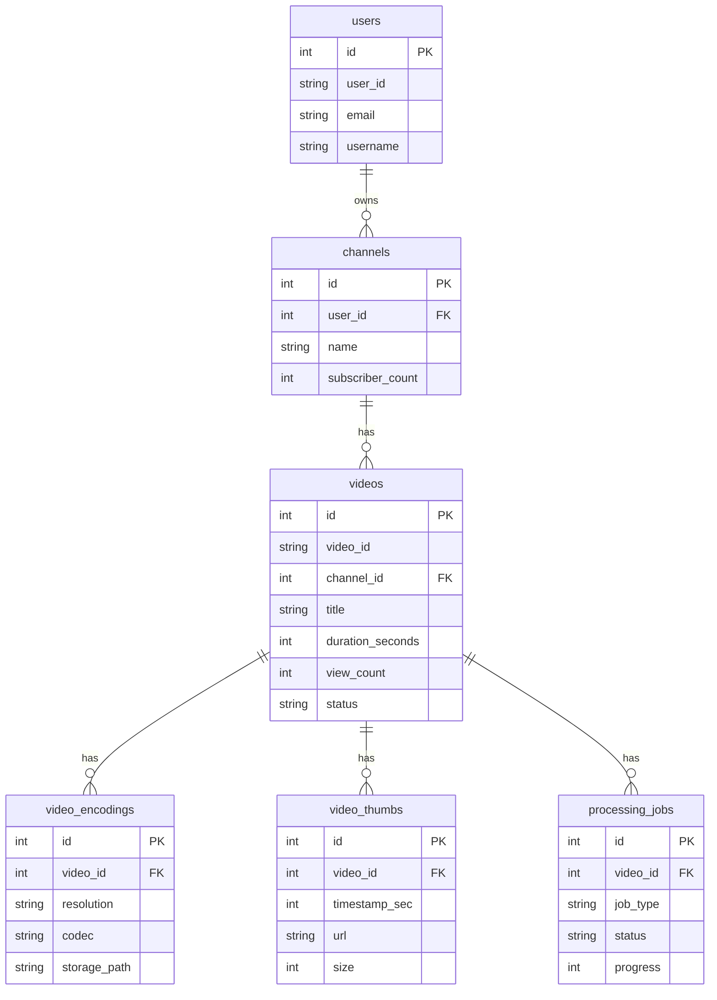
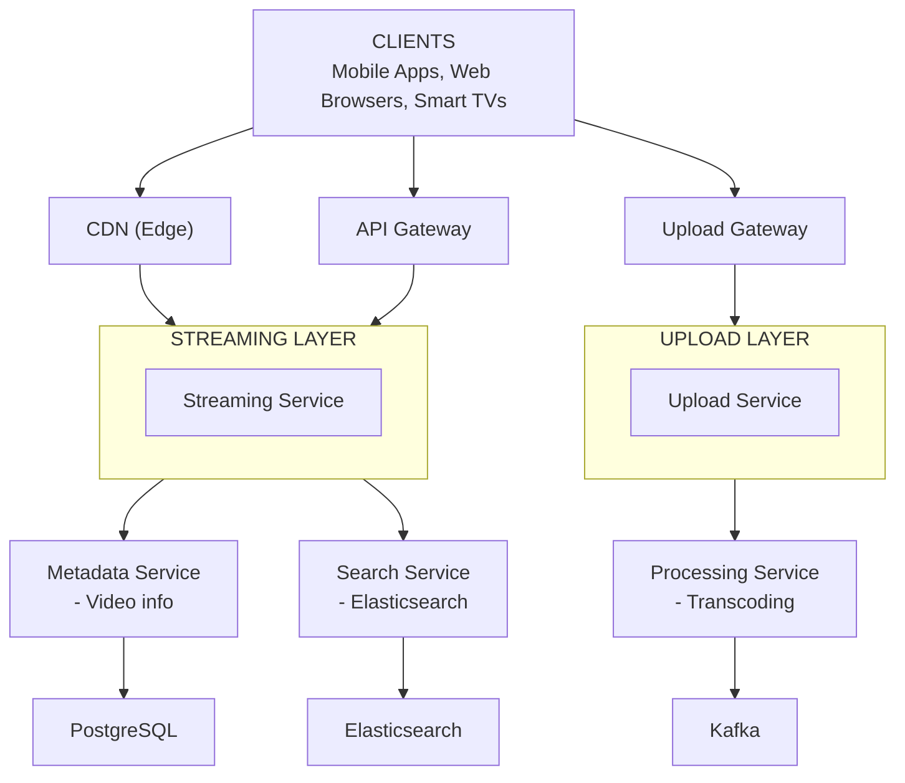
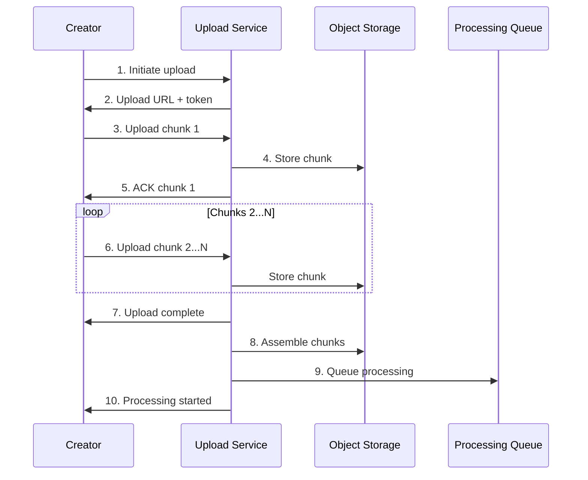
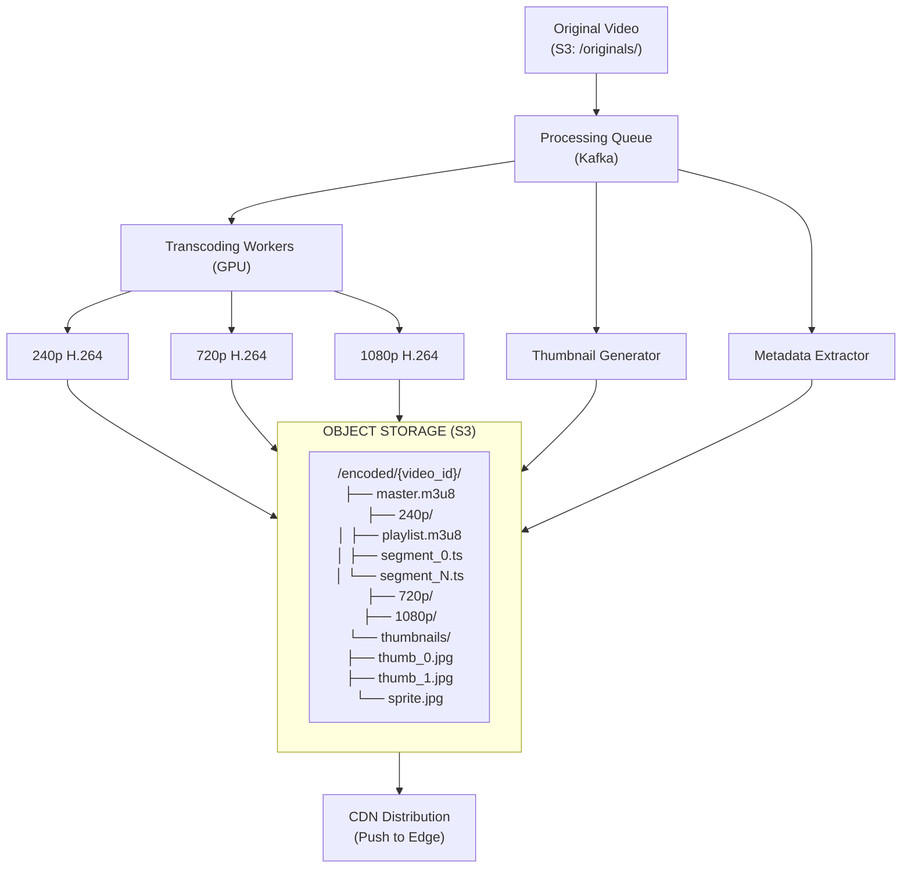

# Video Streaming - Data Model & Architecture

## Database Choices

| Data Type           | Database       | Rationale                                |
| ------------------- | -------------- | ---------------------------------------- |
| Video metadata      | PostgreSQL     | ACID, complex queries                    |
| Video files         | Object Storage | Blob storage (S3/GCS)                    |
| View counts         | Redis + Kafka  | High write volume, eventual consistency  |
| Watch history       | Cassandra      | Time-series, user-partitioned            |
| Search index        | Elasticsearch  | Full-text search                         |
| Recommendations     | Redis          | Fast access to precomputed recs          |

---

## Consistency Model

**CAP Theorem Tradeoff:**

We choose **Availability + Partition Tolerance (AP)**:
- **Availability**: Video streaming must always work (even with stale metadata)
- **Partition Tolerance**: System continues operating during network partitions
- **Consistency**: Sacrificed (view counts, recommendations may be stale)

**Why AP over CP?**
- View counts don't need to be real-time (hours delay acceptable)
- Better to serve videos than fail requests
- System must always respond (high availability requirement)
- During partitions, we prefer serving stale metadata over failing

**ACID vs BASE:**

**ACID (Strong Consistency) for:**
- Video metadata (PostgreSQL, must be immediately visible after upload)
- Video deletion (PostgreSQL, must stop serving immediately)
- User authentication (PostgreSQL, security requirement)
- Channel subscriptions (PostgreSQL, prevent duplicate subscriptions)

**BASE (Eventual Consistency) for:**
- View counts (updated hourly, not real-time)
- Watch history (Cassandra, eventual synchronization)
- Recommendations (updated periodically, not real-time)
- CDN cache (may serve stale content for hours)

**Per-Operation Consistency Guarantees:**

| Operation | Consistency Level | Guarantee |
|-----------|------------------|-----------|
| Upload video | Strong | Immediately visible, read-after-write |
| Delete video | Strong | Immediately stops serving |
| Stream video | Strong | Always sees latest version |
| Record view | Eventual | Count updated within 1 hour |
| Watch history | Eventual | Synchronized within minutes |
| Recommendations | Eventual | Updated daily (not real-time) |
| CDN cache | Eventual | May serve stale for up to hours |

**Eventual Consistency Boundaries:**
- View count staleness: Up to 1 hour (acceptable for analytics)
- Watch history: Synchronized within minutes (acceptable delay)
- Recommendations: Updated daily (not real-time)
- CDN cache: Hours of staleness (acceptable for video content)

---

## Videos Table (PostgreSQL)

```sql
CREATE TABLE videos (
    id BIGSERIAL PRIMARY KEY,
    video_id VARCHAR(50) UNIQUE NOT NULL,
    
    -- Ownership
    channel_id BIGINT NOT NULL REFERENCES channels(id),
    
    -- Content
    title VARCHAR(500) NOT NULL,
    description TEXT,
    tags TEXT[],
    category VARCHAR(100),
    
    -- Technical
    duration_seconds INTEGER NOT NULL,
    original_filename VARCHAR(255),
    original_size_bytes BIGINT,
    
    -- Status
    status VARCHAR(20) DEFAULT 'uploading',
    processing_progress INTEGER DEFAULT 0,
    
    -- Privacy
    privacy VARCHAR(20) DEFAULT 'public',
    
    -- Timestamps
    uploaded_at TIMESTAMP WITH TIME ZONE DEFAULT NOW(),
    published_at TIMESTAMP WITH TIME ZONE,
    updated_at TIMESTAMP WITH TIME ZONE DEFAULT NOW(),
    
    -- Denormalized counts (updated async)
    view_count BIGINT DEFAULT 0,
    like_count INTEGER DEFAULT 0,
    dislike_count INTEGER DEFAULT 0,
    comment_count INTEGER DEFAULT 0,
    
    CONSTRAINT valid_status CHECK (status IN ('uploading', 'processing', 'ready', 'failed', 'deleted')),
    CONSTRAINT valid_privacy CHECK (privacy IN ('public', 'unlisted', 'private'))
);

CREATE INDEX idx_videos_channel ON videos(channel_id, published_at DESC);
CREATE INDEX idx_videos_status ON videos(status) WHERE status != 'ready';
CREATE INDEX idx_videos_published ON videos(published_at DESC) WHERE privacy = 'public';
CREATE INDEX idx_videos_views ON videos(view_count DESC) WHERE privacy = 'public';
```

---

## Video Encodings Table

```sql
CREATE TABLE video_encodings (
    id BIGSERIAL PRIMARY KEY,
    video_id BIGINT NOT NULL REFERENCES videos(id),
    
    -- Encoding details
    resolution VARCHAR(20) NOT NULL,  -- '240p', '720p', '1080p', '4k'
    codec VARCHAR(20) NOT NULL,       -- 'h264', 'h265', 'vp9', 'av1'
    container VARCHAR(20) NOT NULL,   -- 'mp4', 'webm', 'ts'
    bitrate INTEGER NOT NULL,         -- bits per second
    
    -- Storage
    storage_path TEXT NOT NULL,
    file_size_bytes BIGINT NOT NULL,
    
    -- HLS/DASH
    manifest_path TEXT,
    segment_duration INTEGER DEFAULT 10,
    
    -- Status
    status VARCHAR(20) DEFAULT 'pending',
    created_at TIMESTAMP WITH TIME ZONE DEFAULT NOW(),
    
    UNIQUE(video_id, resolution, codec)
);

CREATE INDEX idx_encodings_video ON video_encodings(video_id);
```

---

## Channels Table

```sql
CREATE TABLE channels (
    id BIGSERIAL PRIMARY KEY,
    channel_id VARCHAR(50) UNIQUE NOT NULL,
    user_id BIGINT NOT NULL REFERENCES users(id),
    
    -- Profile
    name VARCHAR(100) NOT NULL,
    description TEXT,
    avatar_url TEXT,
    banner_url TEXT,
    
    -- Stats (denormalized)
    subscriber_count BIGINT DEFAULT 0,
    video_count INTEGER DEFAULT 0,
    total_views BIGINT DEFAULT 0,
    
    -- Timestamps
    created_at TIMESTAMP WITH TIME ZONE DEFAULT NOW(),
    updated_at TIMESTAMP WITH TIME ZONE DEFAULT NOW()
);

CREATE INDEX idx_channels_user ON channels(user_id);
CREATE INDEX idx_channels_subscribers ON channels(subscriber_count DESC);
```

---

## Watch History (Cassandra)

```sql
-- Partition by user_id for efficient user history queries
CREATE TABLE watch_history (
    user_id TEXT,
    watched_at TIMESTAMP,
    video_id TEXT,
    watch_duration_seconds INT,
    completed BOOLEAN,
    last_position_seconds INT,
    PRIMARY KEY (user_id, watched_at, video_id)
) WITH CLUSTERING ORDER BY (watched_at DESC, video_id ASC);

-- For "continue watching" feature
CREATE TABLE watch_progress (
    user_id TEXT,
    video_id TEXT,
    position_seconds INT,
    duration_seconds INT,
    updated_at TIMESTAMP,
    PRIMARY KEY (user_id, video_id)
);
```

---

## View Counts (Redis + PostgreSQL)

```
# Real-time view count in Redis
INCR views:vid_abc123

# Hourly aggregation to PostgreSQL
# Cron job: Every hour, flush Redis to PostgreSQL
```

```sql
-- Hourly view aggregates
CREATE TABLE view_aggregates (
    video_id BIGINT NOT NULL REFERENCES videos(id),
    hour_bucket TIMESTAMP WITH TIME ZONE NOT NULL,
    view_count INTEGER NOT NULL,
    unique_viewers INTEGER,
    avg_watch_duration INTEGER,
    PRIMARY KEY (video_id, hour_bucket)
);
```

---

## Processing Queue (PostgreSQL)

```sql
CREATE TABLE processing_jobs (
    id BIGSERIAL PRIMARY KEY,
    video_id BIGINT NOT NULL REFERENCES videos(id),
    job_type VARCHAR(50) NOT NULL,  -- 'transcode', 'thumbnail', 'manifest'
    
    -- Job details
    input_path TEXT NOT NULL,
    output_path TEXT,
    parameters JSONB,
    
    -- Status
    status VARCHAR(20) DEFAULT 'pending',
    progress INTEGER DEFAULT 0,
    error_message TEXT,
    
    -- Worker
    worker_id VARCHAR(100),
    started_at TIMESTAMP WITH TIME ZONE,
    completed_at TIMESTAMP WITH TIME ZONE,
    
    -- Scheduling
    priority INTEGER DEFAULT 0,
    created_at TIMESTAMP WITH TIME ZONE DEFAULT NOW(),
    
    CONSTRAINT valid_job_status CHECK (status IN ('pending', 'processing', 'completed', 'failed'))
);

CREATE INDEX idx_jobs_pending ON processing_jobs(priority DESC, created_at ASC) 
    WHERE status = 'pending';
CREATE INDEX idx_jobs_video ON processing_jobs(video_id);
```

---

## Entity Relationship Diagram



**Cassandra (Time-Series):**
- `watch_history`: (user_id, watched_at, video_id) → watch details
- `watch_progress`: (user_id, video_id) → position, duration

**Object Storage (S3/GCS):**
- `/originals/{video_id}/original.mp4`
- `/encoded/{video_id}/720p/segment_0.ts`
- `/encoded/{video_id}/720p/playlist.m3u8`
- `/thumbnails/{video_id}/thumb_0.jpg`

<details>
<summary>ASCII diagram (reference)</summary>

```text
┌─────────────────────┐       ┌─────────────────────┐
│       users         │       │      channels       │
├─────────────────────┤       ├─────────────────────┤
│ id (PK)             │       │ id (PK)             │
│ user_id             │───────│ user_id (FK)        │
│ email               │       │ name                │
│ username            │       │ subscriber_count    │
└─────────────────────┘       └─────────────────────┘
                                       │
                                       │
                                       ▼
                              ┌─────────────────────┐
                              │       videos        │
                              ├─────────────────────┤
                              │ id (PK)             │
                              │ video_id            │
                              │ channel_id (FK)     │
                              │ title               │
                              │ duration_seconds    │
                              │ view_count          │
                              │ status              │
                              └─────────────────────┘
                                       │
                    ┌──────────────────┼──────────────────┐
                    ▼                  ▼                  ▼
┌─────────────────────────┐ ┌─────────────────┐ ┌─────────────────────┐
│    video_encodings      │ │  video_thumbs   │ │  processing_jobs    │
├─────────────────────────┤ ├─────────────────┤ ├─────────────────────┤
│ id (PK)                 │ │ id (PK)         │ │ id (PK)             │
│ video_id (FK)           │ │ video_id (FK)   │ │ video_id (FK)       │
│ resolution              │ │ timestamp_sec   │ │ job_type            │
│ codec                   │ │ url             │ │ status              │
│ storage_path            │ │ size            │ │ progress            │
└─────────────────────────┘ └─────────────────┘ └─────────────────────┘

┌─────────────────────────────────────────────────────────────────────┐
│                    CASSANDRA (Time-Series)                          │
├─────────────────────────────────────────────────────────────────────┤
│ watch_history: (user_id, watched_at, video_id) → watch details     │
│ watch_progress: (user_id, video_id) → position, duration           │
└─────────────────────────────────────────────────────────────────────┘

┌─────────────────────────────────────────────────────────────────────┐
│                    OBJECT STORAGE (S3/GCS)                          │
├─────────────────────────────────────────────────────────────────────┤
│ /originals/{video_id}/original.mp4                                 │
│ /encoded/{video_id}/720p/segment_0.ts                              │
│ /encoded/{video_id}/720p/playlist.m3u8                             │
│ /thumbnails/{video_id}/thumb_0.jpg                                 │
```

</details>
```
└─────────────────────────────────────────────────────────────────────┘
```

---

## Component Overview

| Component              | Purpose                                | Why It Exists                                    |
| ---------------------- | -------------------------------------- | ------------------------------------------------ |
| **Upload Service**     | Handle video uploads                   | Chunked, resumable uploads                       |
| **Processing Service** | Transcode videos                       | Convert to multiple formats/resolutions          |
| **Streaming Service**  | Serve video content                    | Generate manifests, serve segments               |
| **CDN**                | Edge delivery                          | Low latency global delivery                      |
| **Metadata Service**   | Video information                      | Titles, descriptions, thumbnails                 |
| **Analytics Service**  | View counting, watch time              | Track engagement metrics                         |

---

## High-Level Architecture



<details>
<summary>ASCII diagram (reference)</summary>

```text
┌─────────────────────────────────────────────────────────────────────────────────────┐
│                                    CLIENTS                                           │
│                    (Mobile Apps, Web Browsers, Smart TVs)                           │
└─────────────────────────────────────────────────────────────────────────────────────┘
                                        │
                    ┌───────────────────┼───────────────────┐
                    │                   │                   │
                    ▼                   ▼                   ▼
            ┌─────────────┐     ┌─────────────┐     ┌─────────────┐
            │    CDN      │     │ API Gateway │     │   Upload    │
            │   (Edge)    │     │             │     │   Gateway   │
```

</details>
```
            └──────┬──────┘     └──────┬──────┘     └──────┬──────┘
                   │                   │                   │
                   │                   │                   │
┌──────────────────┼───────────────────┼───────────────────┼──────────────────────────┐
│                  │                   │                   │                          │
│  ┌───────────────▼────────────────┐  │  ┌────────────────▼───────────────────────┐ │
│  │        STREAMING LAYER         │  │  │           UPLOAD LAYER                 │ │
│  │                                │  │  │                                        │ │
│  │  ┌──────────────────────────┐  │  │  │  ┌──────────────────────────────────┐ │ │
│  │  │    Origin Servers        │  │  │  │  │      Upload Service              │ │ │
│  │  │    (Video Segments)      │  │  │  │  │      (Chunked Upload)            │ │ │
│  │  └──────────────────────────┘  │  │  │  └──────────────────────────────────┘ │ │
│  └────────────────────────────────┘  │  └────────────────────────────────────────┘ │
│                                      │                   │                          │
│  APPLICATION LAYER                   │                   │                          │
└──────────────────────────────────────┼───────────────────┼──────────────────────────┘
                                       │                   │
            ┌──────────────────────────┼───────────────────┼──────────────────────────┐
            ▼                          ▼                   ▼                          │
┌───────────────────────┐  ┌───────────────────────┐  ┌───────────────────────┐      │
│   Metadata Service    │  │   Search Service      │  │  Processing Service   │      │
│                       │  │                       │  │                       │      │
│ - Video info          │  │ - Elasticsearch       │  │ - Transcoding         │      │
│ - Channel info        │  │ - Full-text search    │  │ - Thumbnail gen       │      │
│ - Recommendations     │  │ - Filters             │  │ - Manifest creation   │      │
└───────────┬───────────┘  └───────────┬───────────┘  └───────────┬───────────┘      │
            │                          │                          │                   │
            │                          │                          │                   │
┌───────────┼──────────────────────────┼──────────────────────────┼───────────────────┤
│           ▼                          ▼                          ▼                   │
│  ┌─────────────────┐         ┌─────────────────┐         ┌─────────────────┐       │
│  │   PostgreSQL    │         │  Elasticsearch  │         │   Kafka         │       │
│  │   (Metadata)    │         │   (Search)      │         │  (Job Queue)    │       │
│  └─────────────────┘         └─────────────────┘         └─────────────────┘       │
│                                                                                     │
│  ┌─────────────────┐         ┌─────────────────┐         ┌─────────────────┐       │
│  │   Cassandra     │         │     Redis       │         │   S3/GCS        │       │
│  │ (Watch History) │         │    (Cache)      │         │ (Video Storage) │       │
│  └─────────────────┘         └─────────────────┘         └─────────────────┘       │
│                                                                                     │
│  DATA LAYER                                                                         │
└─────────────────────────────────────────────────────────────────────────────────────┘
```

---

## Video Upload Flow



<details>
<summary>ASCII diagram (reference)</summary>

```text
┌─────────────────────────────────────────────────────────────────────────────────────┐
│                          VIDEO UPLOAD FLOW                                           │
└─────────────────────────────────────────────────────────────────────────────────────┘

Creator                 Upload Service          Object Storage        Processing Queue
   │                         │                       │                      │
   │ 1. Initiate upload      │                       │                      │
   │ ───────────────────────>│                       │                      │
   │                         │                       │                      │
   │ 2. Upload URL + token   │                       │                      │
   │ <───────────────────────│                       │                      │
   │                         │                       │                      │
   │ 3. Upload chunk 1       │                       │                      │
   │ ───────────────────────>│                       │                      │
   │                         │ 4. Store chunk        │                      │
   │                         │ ─────────────────────>│                      │
   │                         │                       │                      │
   │ 5. ACK chunk 1          │                       │                      │
   │ <───────────────────────│                       │                      │
   │                         │                       │                      │
   │ 6. Upload chunk 2...N   │                       │                      │
   │ ───────────────────────>│                       │                      │
   │         ...             │         ...           │                      │
   │                         │                       │                      │
   │ 7. Upload complete      │                       │                      │
   │ <───────────────────────│                       │                      │
   │                         │                       │                      │
   │                         │ 8. Assemble chunks    │                      │
   │                         │ ─────────────────────>│                      │
   │                         │                       │                      │
   │                         │ 9. Queue processing   │                      │
   │                         │ ─────────────────────────────────────────────>
   │                         │                       │                      │
   │ 10. Processing started  │                       │                      │
   │ <───────────────────────│                       │                      │
```

</details>
```

---

## Video Processing Pipeline



<details>
<summary>ASCII diagram (reference)</summary>

```text
┌─────────────────────────────────────────────────────────────────────────────────────┐
│                          VIDEO PROCESSING PIPELINE                                   │
└─────────────────────────────────────────────────────────────────────────────────────┘

                              ┌───────────────────────┐
                              │    Original Video     │
                              │    (S3: /originals/)  │
                              └───────────┬───────────┘
                                          │
                                          ▼
                              ┌───────────────────────┐
                              │   Processing Queue    │
                              │       (Kafka)         │
                              └───────────┬───────────┘
                                          │
                    ┌─────────────────────┼─────────────────────┐
                    ▼                     ▼                     ▼
          ┌─────────────────┐   ┌─────────────────┐   ┌─────────────────┐
          │ Transcoding     │   │ Thumbnail       │   │ Metadata        │
          │ Workers (GPU)   │   │ Generator       │   │ Extractor       │
          └────────┬────────┘   └────────┬────────┘   └────────┬────────┘
                   │                     │                     │
                   │                     │                     │
    ┌──────────────┼──────────────┐     │                     │
    ▼              ▼              ▼     │                     │
┌───────┐    ┌───────┐    ┌───────┐    │                     │
│ 240p  │    │ 720p  │    │ 1080p │    │                     │
│ H.264 │    │ H.264 │    │ H.264 │    │                     │
└───┬───┘    └───┬───┘    └───┬───┘    │                     │
    │            │            │        │                     │
    └────────────┼────────────┘        │                     │
                 │                     │                     │
                 ▼                     ▼                     ▼
    ┌─────────────────────────────────────────────────────────────┐
    │                    OBJECT STORAGE (S3)                       │
    │                                                              │
    │  /encoded/{video_id}/                                       │
    │  ├── master.m3u8                                            │
    │  ├── 240p/                                                  │
    │  │   ├── playlist.m3u8                                      │
    │  │   ├── segment_0.ts                                       │
    │  │   └── segment_N.ts                                       │
    │  ├── 720p/                                                  │
    │  ├── 1080p/                                                 │
    │  └── thumbnails/                                            │
    │      ├── thumb_0.jpg                                        │
    │      ├── thumb_1.jpg                                        │
    │      └── sprite.jpg                                         │
    └─────────────────────────────────────────────────────────────┘
                                │
                                ▼
                    ┌───────────────────────┐
                    │   CDN Distribution    │
                    │   (Push to Edge)      │
                    └───────────────────────┘
```

</details>
```

---

## Video Streaming Flow

```
┌─────────────────────────────────────────────────────────────────────────────────────┐
│                          VIDEO STREAMING FLOW                                        │
└─────────────────────────────────────────────────────────────────────────────────────┘

Viewer                    CDN Edge              Origin Shield           Object Storage
   │                         │                       │                       │
   │ 1. Request master.m3u8  │                       │                       │
   │ ───────────────────────>│                       │                       │
   │                         │                       │                       │
   │                         │ Cache HIT?            │                       │
   │                         │ ─────────┐            │                       │
   │                         │          │ YES       │                       │
   │ 2. master.m3u8          │ <────────┘            │                       │
   │ <───────────────────────│                       │                       │
   │                         │                       │                       │
   │ 3. Select 720p quality  │                       │                       │
   │                         │                       │                       │
   │ 4. Request 720p/playlist│                       │                       │
   │ ───────────────────────>│                       │                       │
   │                         │                       │                       │
   │ 5. 720p playlist        │                       │                       │
   │ <───────────────────────│                       │                       │
   │                         │                       │                       │
   │ 6. Request segment_0.ts │                       │                       │
   │ ───────────────────────>│                       │                       │
   │                         │                       │                       │
   │                         │ Cache MISS            │                       │
   │                         │ ─────────────────────>│                       │
   │                         │                       │                       │
   │                         │                       │ Fetch from S3         │
   │                         │                       │ ─────────────────────>│
   │                         │                       │                       │
   │                         │                       │ Segment data          │
   │                         │                       │ <─────────────────────│
   │                         │                       │                       │
   │                         │ Segment + cache       │                       │
   │                         │ <─────────────────────│                       │
   │                         │                       │                       │
   │ 7. segment_0.ts         │                       │                       │
   │ <───────────────────────│                       │                       │
   │                         │                       │                       │
   │ 8. Request segment_1.ts │                       │                       │
   │ ───────────────────────>│                       │                       │
   │         ...             │                       │                       │
```

---

## Multi-Tier CDN Architecture

```
┌─────────────────────────────────────────────────────────────────────────────────────┐
│                          MULTI-TIER CDN ARCHITECTURE                                 │
└─────────────────────────────────────────────────────────────────────────────────────┘

                              ┌───────────────────────┐
                              │      ORIGIN           │
                              │   (Object Storage)    │
                              │                       │
                              │   S3/GCS Buckets      │
                              │   - All video files   │
                              │   - Source of truth   │
                              └───────────┬───────────┘
                                          │
                                          ▼
                              ┌───────────────────────┐
                              │    ORIGIN SHIELD      │
                              │                       │
                              │   - Protects origin   │
                              │   - Aggregates misses │
                              │   - Large cache       │
                              │   - Few locations     │
                              └───────────┬───────────┘
                                          │
                    ┌─────────────────────┼─────────────────────┐
                    ▼                     ▼                     ▼
          ┌─────────────────┐   ┌─────────────────┐   ┌─────────────────┐
          │   REGIONAL PoP  │   │   REGIONAL PoP  │   │   REGIONAL PoP  │
          │   (US-EAST)     │   │   (EU-WEST)     │   │   (APAC)        │
          │                 │   │                 │   │                 │
          │   - Mid-tier    │   │   - Mid-tier    │   │   - Mid-tier    │
          │   - Popular     │   │   - Popular     │   │   - Popular     │
          │     content     │   │     content     │   │     content     │
          └────────┬────────┘   └────────┬────────┘   └────────┬────────┘
                   │                     │                     │
        ┌──────────┼──────────┐         │          ┌──────────┼──────────┐
        ▼          ▼          ▼         ▼          ▼          ▼          ▼
    ┌───────┐ ┌───────┐ ┌───────┐  ┌───────┐  ┌───────┐ ┌───────┐ ┌───────┐
    │ EDGE  │ │ EDGE  │ │ EDGE  │  │ EDGE  │  │ EDGE  │ │ EDGE  │ │ EDGE  │
    │ NYC   │ │ DC    │ │ Miami │  │London │  │Tokyo  │ │Sydney │ │Seoul  │
    └───┬───┘ └───┬───┘ └───┬───┘  └───┬───┘  └───┬───┘ └───┬───┘ └───┬───┘
        │         │         │          │          │         │         │
        └─────────┴─────────┴──────────┴──────────┴─────────┴─────────┘
                                       │
                                       ▼
                              ┌───────────────────────┐
                              │       VIEWERS         │
                              │  (Routed to nearest   │
                              │   edge by DNS/Anycast)│
                              └───────────────────────┘

Cache Hit Rates:
- Edge: 85% (hot content)
- Regional: 10% (warm content)
- Origin Shield: 4% (cold content)
- Origin: 1% (very cold/new)
```

---

## CDN URL Structure

```
# Master manifest
https://cdn.videoplatform.com/v/{video_id}/master.m3u8

# Quality-specific manifest
https://cdn.videoplatform.com/v/{video_id}/720p/playlist.m3u8

# Video segments
https://cdn.videoplatform.com/v/{video_id}/720p/segment_0.ts
https://cdn.videoplatform.com/v/{video_id}/720p/segment_1.ts

# Thumbnails
https://cdn.videoplatform.com/t/{video_id}/default.jpg
https://cdn.videoplatform.com/t/{video_id}/sprite.jpg

# Subtitles
https://cdn.videoplatform.com/s/{video_id}/en.vtt
```

---

## Summary

| Component           | Technology/Approach                     |
| ------------------- | --------------------------------------- |
| Video metadata      | PostgreSQL                              |
| Video storage       | Object Storage (S3/GCS)                 |
| Watch history       | Cassandra                               |
| View counts         | Redis (real-time) + PostgreSQL (batch)  |
| Search              | Elasticsearch                           |
| Streaming           | HLS/DASH via CDN                        |
| Upload              | Chunked, resumable                      |

| Aspect              | Decision                                              |
| ------------------- | ----------------------------------------------------- |
| Upload              | Chunked, resumable to object storage                  |
| Processing          | Distributed workers, parallel transcoding             |
| Storage             | Multi-tier: hot (edge) → warm (regional) → cold (S3)  |
| Delivery            | Multi-tier CDN with origin shield                     |
| Streaming           | HLS/DASH with client-side ABR                         |
| View counting       | Kafka + Redis + batch aggregation                     |

