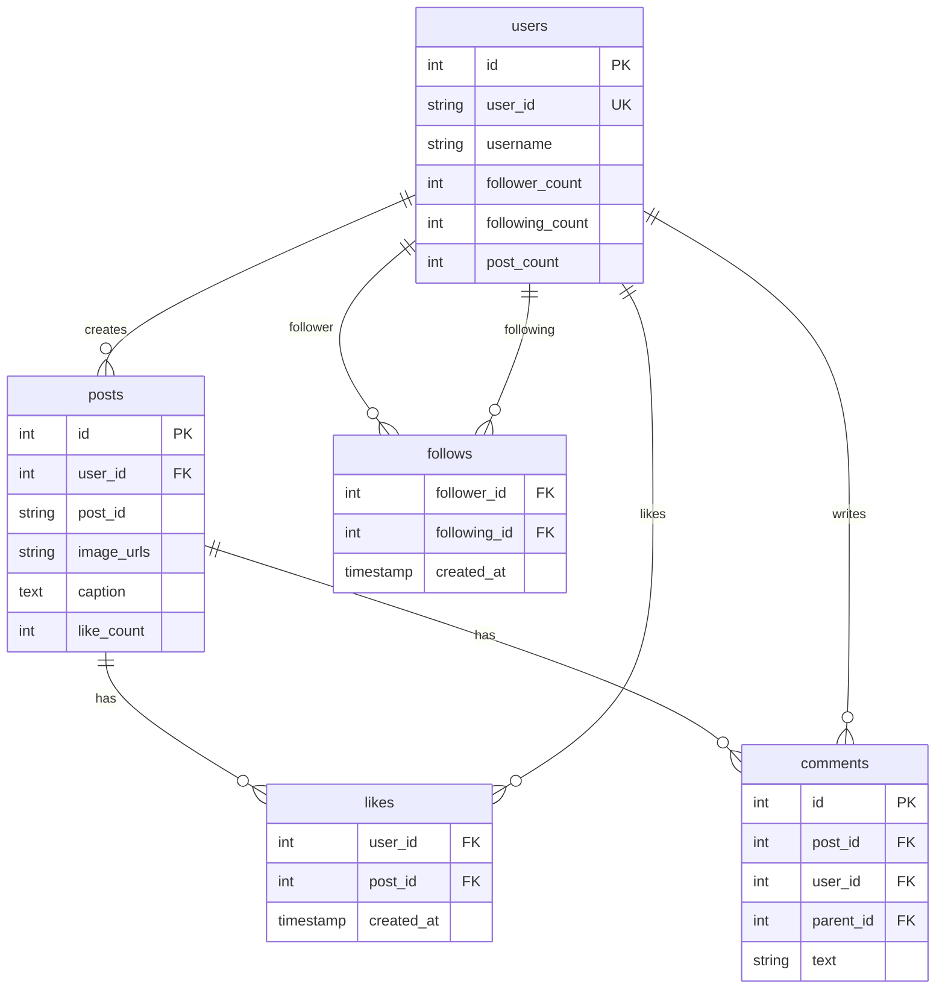
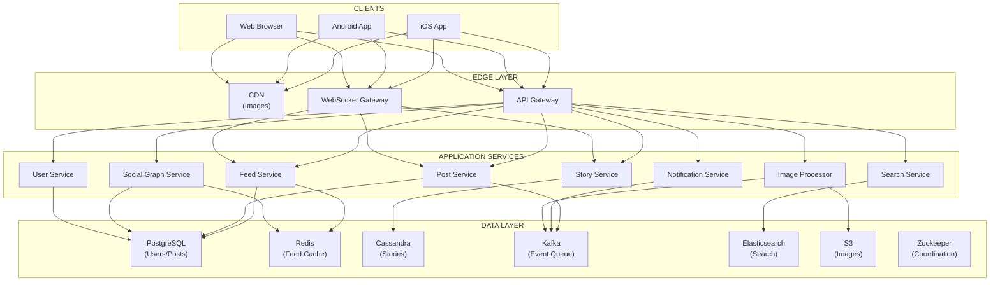
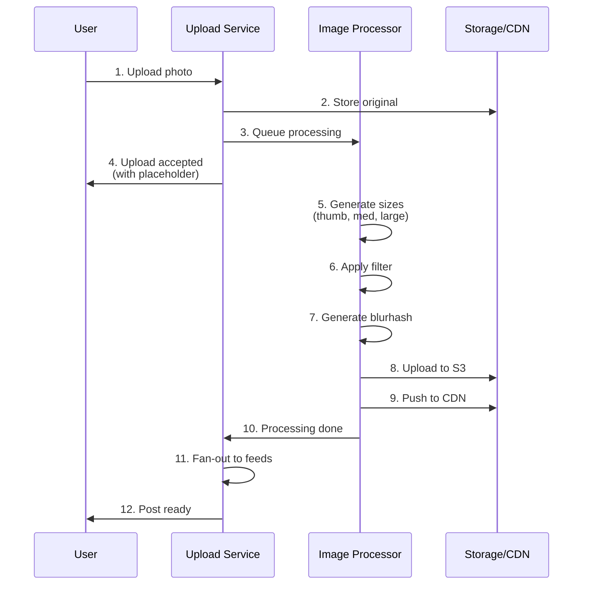
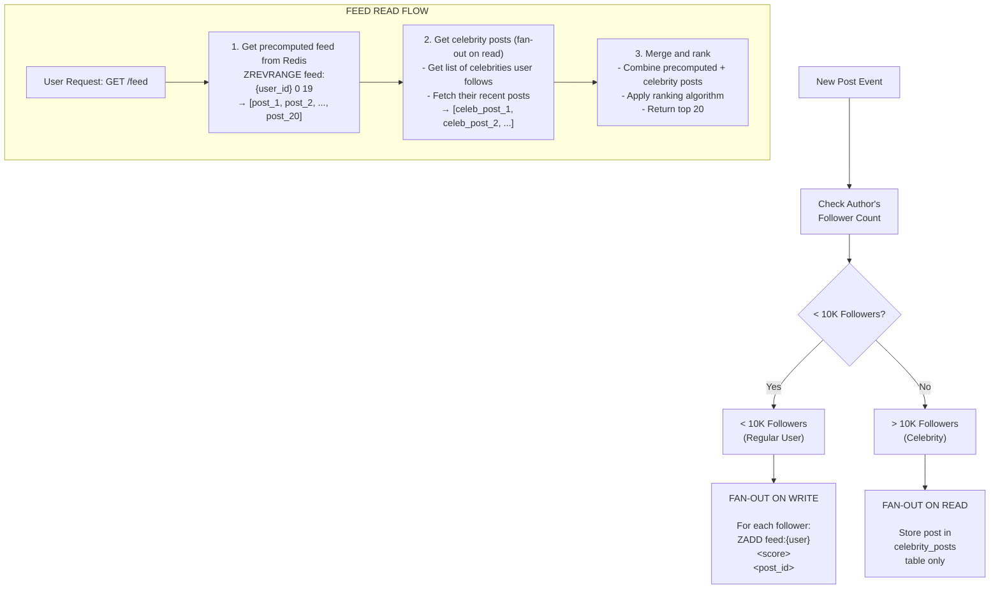
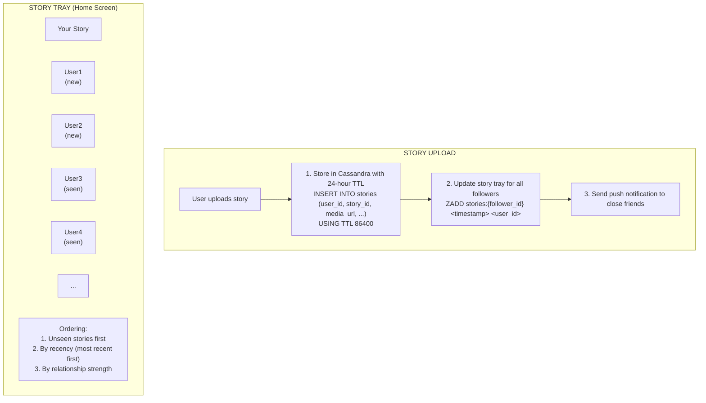
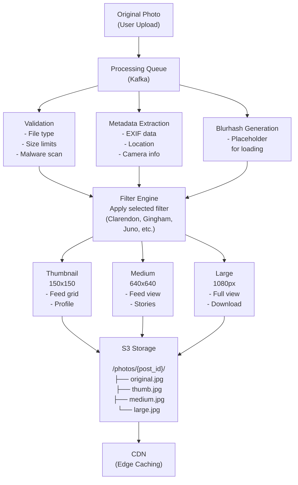
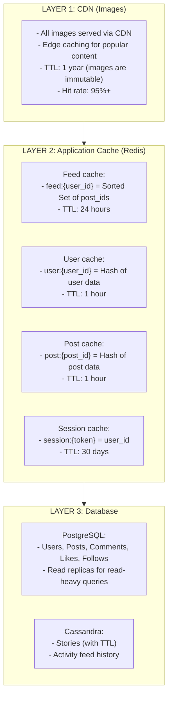

# Instagram / Photo Sharing - Data Model & Architecture

## Database Choices

| Data Type           | Database       | Rationale                                |
| ------------------- | -------------- | ---------------------------------------- |
| Users/Posts         | PostgreSQL     | ACID, complex queries                    |
| Feed cache          | Redis          | Fast reads, sorted sets                  |
| Social graph        | PostgreSQL + Redis | Persistent + cached                   |
| Stories             | Cassandra      | TTL support, time-series                 |
| Images              | S3/Object Store| Blob storage                             |
| Search              | Elasticsearch  | Full-text search                         |

---

## Consistency Model

**CAP Theorem Tradeoff:**

We choose **Availability + Partition Tolerance (AP)**:
- **Availability**: Feed must always respond (even with stale posts)
- **Partition Tolerance**: System continues operating during network partitions
- **Consistency**: Sacrificed (feed may be missing recent posts, counts may be stale)

**Why AP over CP?**
- Feed doesn't need to be perfectly up-to-date (minutes delay acceptable)
- Better to serve stale feed than fail requests
- System must always respond (high availability requirement)
- During partitions, we prefer serving stale feed over failing

**ACID vs BASE:**

**ACID (Strong Consistency) for:**
- Post creation (PostgreSQL, must be immediately visible)
- Post deletion (PostgreSQL, must stop serving immediately)
- Follow/unfollow (PostgreSQL, prevent duplicate relationships)
- User authentication (PostgreSQL, security requirement)

**BASE (Eventual Consistency) for:**
- Feed generation (may be missing recent posts for minutes)
- Like/comment counts (updated asynchronously)
- Follower counts (updated asynchronously)
- Feed cache (may be stale for minutes)

**Per-Operation Consistency Guarantees:**

| Operation | Consistency Level | Guarantee |
|-----------|------------------|-----------|
| Create post | Strong | Immediately visible, read-after-write |
| Delete post | Strong | Immediately stops serving |
| Get feed | Eventual | May be missing posts for minutes |
| Like post | Eventual | Count updated within seconds |
| Follow user | Strong | Relationship immediately visible |
| Follower count | Eventual | Updated asynchronously |

**Eventual Consistency Boundaries:**
- Feed staleness: Up to minutes (acceptable for social feed)
- Like/comment counts: Updated within seconds (acceptable delay)
- Follower counts: Updated asynchronously (acceptable delay)
- Feed cache: Minutes of staleness (acceptable for social feed)

---

## Users Table

```sql
CREATE TABLE users (
    id BIGSERIAL PRIMARY KEY,
    user_id VARCHAR(50) UNIQUE NOT NULL,
    
    -- Profile
    username VARCHAR(30) UNIQUE NOT NULL,
    full_name VARCHAR(100),
    bio VARCHAR(150),
    profile_pic_url TEXT,
    website VARCHAR(200),
    
    -- Privacy
    is_private BOOLEAN DEFAULT FALSE,
    is_verified BOOLEAN DEFAULT FALSE,
    
    -- Stats (denormalized)
    post_count INTEGER DEFAULT 0,
    follower_count BIGINT DEFAULT 0,
    following_count INTEGER DEFAULT 0,
    
    -- Timestamps
    created_at TIMESTAMP WITH TIME ZONE DEFAULT NOW(),
    updated_at TIMESTAMP WITH TIME ZONE DEFAULT NOW()
);

CREATE INDEX idx_users_username ON users(username);
CREATE INDEX idx_users_followers ON users(follower_count DESC);
```

---

## Posts Table

```sql
CREATE TABLE posts (
    id BIGSERIAL PRIMARY KEY,
    post_id VARCHAR(50) UNIQUE NOT NULL,
    user_id BIGINT NOT NULL REFERENCES users(id),
    
    -- Content
    caption TEXT,
    
    -- Images (JSON array of URLs)
    image_urls JSONB NOT NULL,
    blurhash VARCHAR(50),
    aspect_ratio DECIMAL(4, 2) DEFAULT 1.0,
    
    -- Location
    location_name VARCHAR(200),
    location_lat DECIMAL(10, 8),
    location_lng DECIMAL(11, 8),
    
    -- Stats (denormalized)
    like_count INTEGER DEFAULT 0,
    comment_count INTEGER DEFAULT 0,
    
    -- Status
    is_archived BOOLEAN DEFAULT FALSE,
    is_comments_disabled BOOLEAN DEFAULT FALSE,
    
    -- Timestamps
    created_at TIMESTAMP WITH TIME ZONE DEFAULT NOW(),
    updated_at TIMESTAMP WITH TIME ZONE DEFAULT NOW()
);

CREATE INDEX idx_posts_user ON posts(user_id, created_at DESC);
CREATE INDEX idx_posts_created ON posts(created_at DESC);
CREATE INDEX idx_posts_location ON posts(location_lat, location_lng) 
    WHERE location_lat IS NOT NULL;
```

---

## Follows Table

```sql
CREATE TABLE follows (
    id BIGSERIAL PRIMARY KEY,
    follower_id BIGINT NOT NULL REFERENCES users(id),
    following_id BIGINT NOT NULL REFERENCES users(id),
    
    created_at TIMESTAMP WITH TIME ZONE DEFAULT NOW(),
    
    UNIQUE(follower_id, following_id)
);

CREATE INDEX idx_follows_follower ON follows(follower_id);
CREATE INDEX idx_follows_following ON follows(following_id);
```

---

## Likes Table

```sql
CREATE TABLE likes (
    id BIGSERIAL PRIMARY KEY,
    user_id BIGINT NOT NULL REFERENCES users(id),
    post_id BIGINT NOT NULL REFERENCES posts(id),
    
    created_at TIMESTAMP WITH TIME ZONE DEFAULT NOW(),
    
    UNIQUE(user_id, post_id)
);

CREATE INDEX idx_likes_post ON likes(post_id);
CREATE INDEX idx_likes_user ON likes(user_id, created_at DESC);
```

---

## Comments Table

```sql
CREATE TABLE comments (
    id BIGSERIAL PRIMARY KEY,
    comment_id VARCHAR(50) UNIQUE NOT NULL,
    post_id BIGINT NOT NULL REFERENCES posts(id),
    user_id BIGINT NOT NULL REFERENCES users(id),
    parent_id BIGINT REFERENCES comments(id),  -- For replies
    
    text VARCHAR(2200) NOT NULL,
    
    like_count INTEGER DEFAULT 0,
    
    created_at TIMESTAMP WITH TIME ZONE DEFAULT NOW()
);

CREATE INDEX idx_comments_post ON comments(post_id, created_at DESC);
CREATE INDEX idx_comments_user ON comments(user_id);
```

---

## Stories Table (Cassandra)

```sql
CREATE TABLE stories (
    user_id TEXT,
    story_id TIMEUUID,
    media_type TEXT,
    media_url TEXT,
    thumbnail_url TEXT,
    duration_seconds INT,
    created_at TIMESTAMP,
    expires_at TIMESTAMP,
    view_count COUNTER,
    PRIMARY KEY (user_id, story_id)
) WITH CLUSTERING ORDER BY (story_id DESC)
  AND default_time_to_live = 86400;  -- 24 hours TTL

-- Story views
CREATE TABLE story_views (
    story_id TEXT,
    viewer_id TEXT,
    viewed_at TIMESTAMP,
    PRIMARY KEY (story_id, viewer_id)
) WITH default_time_to_live = 86400;
```

---

## Feed Cache (Redis)

```
# User's precomputed feed (sorted set)
# Score = timestamp (for chronological) or ranking score
ZADD feed:{user_id} <score> <post_id>

# Example
ZADD feed:user_123 1705764600 post_abc
ZADD feed:user_123 1705764500 post_def

# Get feed (most recent first)
ZREVRANGE feed:user_123 0 19 WITHSCORES

# Feed TTL
EXPIRE feed:{user_id} 86400  # 24 hours

# User's story tray (sorted set)
ZADD stories:{user_id} <timestamp> <story_owner_id>
```

---

## Hashtags Table

```sql
CREATE TABLE hashtags (
    id BIGSERIAL PRIMARY KEY,
    name VARCHAR(100) UNIQUE NOT NULL,
    post_count BIGINT DEFAULT 0
);

CREATE TABLE post_hashtags (
    post_id BIGINT REFERENCES posts(id),
    hashtag_id BIGINT REFERENCES hashtags(id),
    PRIMARY KEY (post_id, hashtag_id)
);

CREATE INDEX idx_post_hashtags_hashtag ON post_hashtags(hashtag_id);
```

---

## Entity Relationship Diagram



**Cassandra:**
- `stories`: (user_id, story_id) → story data
- `story_views`: (story_id, viewer_id) → viewed_at

**Redis Cache:**
- `feed:{user_id}` → Sorted Set of post_ids
- `stories:{user_id}` → Sorted Set of story owners
- `user:{user_id}` → Hash of user data

<details>
<summary>ASCII diagram (reference)</summary>

```text
┌─────────────────────┐       ┌─────────────────────┐
│       users         │       │       posts         │
├─────────────────────┤       ├─────────────────────┤
│ id (PK)             │       │ id (PK)             │
│ user_id (unique)    │───────│ user_id (FK)        │
│ username            │       │ post_id             │
│ follower_count      │       │ image_urls          │
│ following_count     │       │ caption             │
│ post_count          │       │ like_count          │
└─────────────────────┘       └─────────────────────┘
         │                             │
         │                             │
         ▼                             ▼
┌─────────────────────┐       ┌─────────────────────┐
│      follows        │       │       likes         │
├─────────────────────┤       ├─────────────────────┤
│ follower_id (FK)    │       │ user_id (FK)        │
│ following_id (FK)   │       │ post_id (FK)        │
│ created_at          │       │ created_at          │
└─────────────────────┘       └─────────────────────┘

┌─────────────────────────────────────────────────────┐
│                  comments                            │
├─────────────────────────────────────────────────────┤
│ id (PK)                                             │
│ post_id (FK)                                        │
│ user_id (FK)                                        │
│ parent_id (FK, self)                                │
│ text                                                │
└─────────────────────────────────────────────────────┘

┌─────────────────────────────────────────────────────┐
│                  CASSANDRA                           │
├─────────────────────────────────────────────────────┤
│ stories: (user_id, story_id) → story data           │
│ story_views: (story_id, viewer_id) → viewed_at      │
└─────────────────────────────────────────────────────┘

┌─────────────────────────────────────────────────────┐
│                  REDIS CACHE                         │
├─────────────────────────────────────────────────────┤
│ feed:{user_id}        → Sorted Set of post_ids      │
│ stories:{user_id}     → Sorted Set of story owners  │
│ user:{user_id}        → Hash of user data           │
└─────────────────────────────────────────────────────┘
```

</details>
```

---

## Component Overview

| Component              | Purpose                                | Why It Exists                                    |
| ---------------------- | -------------------------------------- | ------------------------------------------------ |
| **Upload Service**     | Handle photo uploads                   | Process and store images                         |
| **Feed Service**       | Generate personalized feeds            | Core user experience                             |
| **Story Service**      | Manage ephemeral content               | 24-hour content with TTL                         |
| **Social Graph Service**| Manage follows/followers              | Relationship data                                |
| **Image Processor**    | Resize, filter, optimize images        | Multiple sizes for different devices             |
| **Notification Service**| Push notifications                    | Engagement driver                                |

---

## High-Level Architecture



<details>
<summary>ASCII diagram (reference)</summary>

```text
┌─────────────────────────────────────────────────────────────────────────────────────┐
│                                    CLIENTS                                           │
│                    (iOS App, Android App, Web Browser)                              │
└─────────────────────────────────────────────────────────────────────────────────────┘
                                        │
                    ┌───────────────────┼───────────────────┐
                    │                   │                   │
                    ▼                   ▼                   ▼
            ┌─────────────┐     ┌─────────────┐     ┌─────────────┐
            │    CDN      │     │ API Gateway │     │  WebSocket  │
            │  (Images)   │     │             │     │  Gateway    │
            └─────────────┘     └──────┬──────┘     └──────┬──────┘
                                       │                   │
                                       │                   │
┌──────────────────────────────────────┼───────────────────┼──────────────────────────┐
│                                      │                   │                          │
│  ┌───────────────────────────────────┼───────────────────┼───────────────────────┐ │
│  │                           APPLICATION SERVICES                                 │ │
│  │                                                                                │ │
│  │  ┌──────────────┐  ┌──────────────┐  ┌──────────────┐  ┌──────────────┐       │ │
│  │  │    Feed      │  │    Post      │  │   Story      │  │   Search     │       │ │
│  │  │   Service    │  │   Service    │  │   Service    │  │   Service    │       │ │
│  │  └──────────────┘  └──────────────┘  └──────────────┘  └──────────────┘       │ │
│  │                                                                                │ │
│  │  ┌──────────────┐  ┌──────────────┐  ┌──────────────┐  ┌──────────────┐       │ │
│  │  │   Social     │  │   User       │  │ Notification │  │   Image      │       │ │
│  │  │   Graph      │  │   Service    │  │   Service    │  │  Processor   │       │ │
│  │  └──────────────┘  └──────────────┘  └──────────────┘  └──────────────┘       │ │
│  │                                                                                │ │
│  └────────────────────────────────────────────────────────────────────────────────┘ │
│                                                                                      │
│  APPLICATION LAYER                                                                   │
└──────────────────────────────────────────────────────────────────────────────────────┘
                                        │
                                        │
┌───────────────────────────────────────┼──────────────────────────────────────────────┐
│                                       │                                              │
│  ┌─────────────────┐  ┌─────────────────┐  ┌─────────────────┐  ┌─────────────────┐ │
│  │   PostgreSQL    │  │     Redis       │  │   Cassandra     │  │     Kafka       │ │
│  │   (Users/Posts) │  │  (Feed Cache)   │  │   (Stories)     │  │  (Event Queue)  │ │
│  └─────────────────┘  └─────────────────┘  └─────────────────┘  └─────────────────┘ │
│                                                                                      │
│  ┌─────────────────┐  ┌─────────────────┐  ┌─────────────────┐                      │
│  │  Elasticsearch  │  │       S3        │  │    Zookeeper    │                      │
│  │    (Search)     │  │    (Images)     │  │  (Coordination) │                      │
│  └─────────────────┘  └─────────────────┘  └─────────────────┘                      │
│                                                                                      │
│  DATA LAYER                                                                          │
└──────────────────────────────────────────────────────────────────────────────────────┘
```

</details>
```

---

## Photo Upload Flow



<details>
<summary>ASCII diagram (reference)</summary>

```text
┌─────────────────────────────────────────────────────────────────────────────────────┐
│                          PHOTO UPLOAD FLOW                                           │
└─────────────────────────────────────────────────────────────────────────────────────┘

User                    Upload Service       Image Processor        Storage/CDN
  │                          │                     │                    │
  │ 1. Upload photo          │                     │                    │
  │ ─────────────────────────>                     │                    │
  │                          │                     │                    │
  │                          │ 2. Store original   │                    │
  │                          │ ────────────────────────────────────────>│
  │                          │                     │                    │
  │                          │ 3. Queue processing │                    │
  │                          │ ───────────────────>│                    │
  │                          │                     │                    │
  │ 4. Upload accepted       │                     │                    │
  │ <─────────────────────────                     │                    │
  │    (with placeholder)    │                     │                    │
  │                          │                     │                    │
  │                          │                     │ 5. Generate sizes  │
  │                          │                     │ (thumb, med, large)│
  │                          │                     │                    │
  │                          │                     │ 6. Apply filter    │
  │                          │                     │                    │
  │                          │                     │ 7. Generate blurhash
  │                          │                     │                    │
  │                          │                     │ 8. Upload to S3    │
  │                          │                     │ ───────────────────>
  │                          │                     │                    │
  │                          │                     │ 9. Push to CDN     │
  │                          │                     │ ───────────────────>
  │                          │                     │                    │
  │                          │ 10. Processing done │                    │
  │                          │ <───────────────────│                    │
  │                          │                     │                    │
  │                          │ 11. Fan-out to feeds│                    │
  │                          │ ───────────────────────────────────────> │
  │                          │                     │                    │
  │ 12. Post ready           │                     │                    │
  │ <─────────────────────────                     │                    │
```

</details>
```

---

## Feed Generation (Hybrid Fan-out)



<details>
<summary>ASCII diagram (reference)</summary>

```text
┌─────────────────────────────────────────────────────────────────────────────────────┐
│                          FEED GENERATION                                             │
└─────────────────────────────────────────────────────────────────────────────────────┘

                         ┌───────────────────┐
                         │   New Post Event  │
                         └─────────┬─────────┘
                                   │
                                   ▼
                         ┌───────────────────┐
                         │  Check Author's   │
                         │  Follower Count   │
                         └─────────┬─────────┘
                                   │
                    ┌──────────────┴──────────────┐
                    │                             │
                    ▼                             ▼
        ┌─────────────────────┐      ┌─────────────────────┐
        │  < 10K Followers    │      │  > 10K Followers    │
        │  (Regular User)     │      │  (Celebrity)        │
        └──────────┬──────────┘      └──────────┬──────────┘
                   │                            │
                   ▼                            ▼
        ┌─────────────────────┐      ┌─────────────────────┐
        │  FAN-OUT ON WRITE   │      │  FAN-OUT ON READ    │
        │                     │      │                     │
        │  For each follower: │      │  Store post in      │
        │  ZADD feed:{user}   │      │  celebrity_posts    │
        │       <score>       │      │  table only         │
        │       <post_id>     │      │                     │
        └─────────────────────┘      └─────────────────────┘

┌─────────────────────────────────────────────────────────────────────────────────────┐
│                          FEED READ FLOW                                              │
└─────────────────────────────────────────────────────────────────────────────────────┘

User Request: GET /feed
         │
         ▼
┌─────────────────────────────────────────────────────────────────────────────────────┐
│  1. Get precomputed feed from Redis                                                  │
│     ZREVRANGE feed:{user_id} 0 19                                                   │
│     → [post_1, post_2, ..., post_20]                                                │
└─────────────────────────────────────────────────────────────────────────────────────┘
         │
         ▼
┌─────────────────────────────────────────────────────────────────────────────────────┐
│  2. Get celebrity posts (fan-out on read)                                            │
│     - Get list of celebrities user follows                                          │
│     - Fetch their recent posts                                                      │
│     → [celeb_post_1, celeb_post_2, ...]                                            │
└─────────────────────────────────────────────────────────────────────────────────────┘
         │
         ▼
┌─────────────────────────────────────────────────────────────────────────────────────┐
│  3. Merge and rank                                                                   │
│     - Combine precomputed + celebrity posts                                         │
│     - Apply ranking algorithm                                                       │
│     - Return top 20                                                                 │
└─────────────────────────────────────────────────────────────────────────────────────┘
```

</details>
```

---

## Stories Architecture



<details>
<summary>ASCII diagram (reference)</summary>

```text
┌─────────────────────────────────────────────────────────────────────────────────────┐
│                          STORIES SYSTEM                                              │
└─────────────────────────────────────────────────────────────────────────────────────┘

┌───────────────────────────────────────────────────────────────────────────────────┐
│  STORY UPLOAD                                                                      │
│                                                                                    │
│  User uploads story                                                                │
│         │                                                                          │
│         ▼                                                                          │
│  ┌─────────────────────────────────────────────────────────────────────────────┐  │
│  │  1. Store in Cassandra with 24-hour TTL                                      │  │
│  │     INSERT INTO stories (user_id, story_id, media_url, ...)                 │  │
│  │     USING TTL 86400                                                         │  │
│  │                                                                              │  │
│  │  2. Update story tray for all followers                                      │  │
│  │     ZADD stories:{follower_id} <timestamp> <user_id>                        │  │
│  │                                                                              │  │
│  │  3. Send push notification to close friends                                  │  │
│  └─────────────────────────────────────────────────────────────────────────────┘  │
└───────────────────────────────────────────────────────────────────────────────────┘

┌───────────────────────────────────────────────────────────────────────────────────┐
│  STORY TRAY (Home Screen)                                                          │
│                                                                                    │
│  ┌───────┐ ┌───────┐ ┌───────┐ ┌───────┐ ┌───────┐                               │
│  │ Your  │ │ User1 │ │ User2 │ │ User3 │ │ User4 │  ...                          │
│  │ Story │ │ (new) │ │ (new) │ │(seen) │ │(seen) │                               │
│  └───────┘ └───────┘ └───────┘ └───────┘ └───────┘                               │
│                                                                                    │
│  Ordering:                                                                         │
│  1. Unseen stories first                                                          │
│  2. By recency (most recent first)                                                │
│  3. By relationship strength                                                      │
└───────────────────────────────────────────────────────────────────────────────────┘
```

</details>
```

---

## Image Processing Pipeline



<details>
<summary>ASCII diagram (reference)</summary>

```text
┌─────────────────────────────────────────────────────────────────────────────────────┐
│                          IMAGE PROCESSING PIPELINE                                   │
└─────────────────────────────────────────────────────────────────────────────────────┘

                              ┌───────────────────────┐
                              │    Original Photo     │
                              │    (User Upload)      │
                              └───────────┬───────────┘
                                          │
                                          ▼
                              ┌───────────────────────┐
                              │   Processing Queue    │
                              │       (Kafka)         │
                              └───────────┬───────────┘
                                          │
                    ┌─────────────────────┼─────────────────────┐
                    ▼                     ▼                     ▼
          ┌─────────────────┐   ┌─────────────────┐   ┌─────────────────┐
          │   Validation    │   │    Metadata     │   │   Blurhash      │
          │                 │   │   Extraction    │   │   Generation    │
          │ - File type     │   │                 │   │                 │
          │ - Size limits   │   │ - EXIF data     │   │ - Placeholder   │
          │ - Malware scan  │   │ - Location      │   │   for loading   │
          └────────┬────────┘   │ - Camera info   │   └────────┬────────┘
                   │            └────────┬────────┘            │
                   │                     │                     │
                   └─────────────────────┴─────────────────────┘
                                         │
                                         ▼
                              ┌───────────────────────┐
                              │    Filter Engine      │
                              │                       │
                              │  Apply selected filter│
                              │  (Clarendon, Gingham, │
                              │   Juno, etc.)         │
                              └───────────┬───────────┘
                                          │
                    ┌─────────────────────┼─────────────────────┐
                    ▼                     ▼                     ▼
          ┌─────────────────┐   ┌─────────────────┐   ┌─────────────────┐
          │   Thumbnail     │   │    Medium       │   │     Large       │
          │   150x150       │   │    640x640      │   │    1080px       │
          │                 │   │                 │   │                 │
          │   - Feed grid   │   │   - Feed view   │   │   - Full view   │
          │   - Profile     │   │   - Stories     │   │   - Download    │
          └────────┬────────┘   └────────┬────────┘   └────────┬────────┘
                   │                     │                     │
                   └─────────────────────┴─────────────────────┘
                                         │
                                         ▼
                              ┌───────────────────────┐
                              │      S3 Storage       │
                              │                       │
                              │  /photos/{post_id}/   │
                              │  ├── original.jpg     │
                              │  ├── thumb.jpg        │
                              │  ├── medium.jpg       │
                              │  └── large.jpg        │
                              └───────────┬───────────┘
                                          │
                                          ▼
                              ┌───────────────────────┐
                              │        CDN            │
                              │   (Edge Caching)      │
                              └───────────────────────┘
```

</details>
```

---

## Multi-Layer Caching



<details>
<summary>ASCII diagram (reference)</summary>

```text
┌─────────────────────────────────────────────────────────────────────────────────────┐
│                          MULTI-LAYER CACHING                                         │
└─────────────────────────────────────────────────────────────────────────────────────┘

┌─────────────────────────────────────────────────────────────────────────────────────┐
│  LAYER 1: CDN (Images)                                                               │
│  ┌─────────────────────────────────────────────────────────────────────────────┐   │
│  │  - All images served via CDN                                                 │   │
│  │  - Edge caching for popular content                                          │   │
│  │  - TTL: 1 year (images are immutable)                                       │   │
│  │  - Hit rate: 95%+                                                           │   │
│  └─────────────────────────────────────────────────────────────────────────────┘   │
└─────────────────────────────────────────────────────────────────────────────────────┘

┌─────────────────────────────────────────────────────────────────────────────────────┐
│  LAYER 2: Application Cache (Redis)                                                  │
│  ┌─────────────────────────────────────────────────────────────────────────────┐   │
│  │  Feed cache:                                                                 │   │
│  │  - feed:{user_id} = Sorted Set of post_ids                                  │   │
│  │  - TTL: 24 hours                                                            │   │
│  │                                                                              │   │
│  │  User cache:                                                                 │   │
│  │  - user:{user_id} = Hash of user data                                       │   │
│  │  - TTL: 1 hour                                                              │   │
│  │                                                                              │   │
│  │  Post cache:                                                                 │   │
│  │  - post:{post_id} = Hash of post data                                       │   │
│  │  - TTL: 1 hour                                                              │   │
│  │                                                                              │   │
│  │  Session cache:                                                              │   │
│  │  - session:{token} = user_id                                                │   │
│  │  - TTL: 30 days                                                             │   │
│  └─────────────────────────────────────────────────────────────────────────────┘   │
└─────────────────────────────────────────────────────────────────────────────────────┘

┌─────────────────────────────────────────────────────────────────────────────────────┐
│  LAYER 3: Database                                                                   │
│  ┌─────────────────────────────────────────────────────────────────────────────┐   │
│  │  PostgreSQL:                                                                 │   │
│  │  - Users, Posts, Comments, Likes, Follows                                   │   │
│  │  - Read replicas for read-heavy queries                                     │   │
│  │                                                                              │   │
│  │  Cassandra:                                                                  │   │
│  │  - Stories (with TTL)                                                       │   │
│  │  - Activity feed history                                                    │   │
│  └─────────────────────────────────────────────────────────────────────────────┘   │
└─────────────────────────────────────────────────────────────────────────────────────┘
```

</details>
```

---

## Image URL Structure

```
# Profile pictures
https://cdn.instagram.com/avatars/{user_id}/{size}.jpg
Sizes: 150, 320, 640

# Post images
https://cdn.instagram.com/p/{post_id}/{size}.jpg
Sizes: thumb (150), medium (640), large (1080)

# Stories
https://cdn.instagram.com/stories/{story_id}/{size}.jpg
Sizes: thumb, full
```

---

## Summary

| Component           | Technology/Approach                     |
| ------------------- | --------------------------------------- |
| User/Post data      | PostgreSQL                              |
| Feed cache          | Redis Sorted Sets                       |
| Stories             | Cassandra with TTL                      |
| Images              | S3 + CDN                                |
| Search              | Elasticsearch                           |
| Social graph        | PostgreSQL + Redis cache                |

| Aspect              | Decision                                              |
| ------------------- | ----------------------------------------------------- |
| Feed generation     | Hybrid fan-out (write for regular, read for celebrities)|
| Image storage       | S3 with CDN, multiple sizes                           |
| Image processing    | Async pipeline, filter on upload                      |
| Stories             | Cassandra with 24-hour TTL                            |
| Caching             | Multi-layer (CDN → Redis → Database)                  |
| Notifications       | Aggregated, multi-channel                             |

