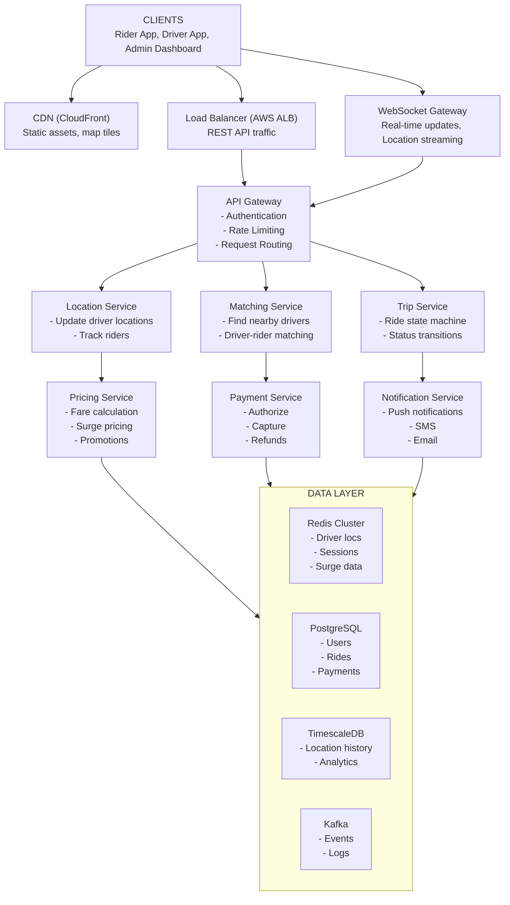

# Ride Hailing - Data Model & Architecture

## Component Overview

Before looking at diagrams, let's understand each component and why it exists.

### Components Explained

| Component | Purpose | Why It Exists |
|-----------|---------|---------------|
| **Load Balancer** | Distributes traffic across servers | Single server can't handle 100K+ requests/sec |
| **API Gateway** | Rate limiting, auth, routing | Centralizes cross-cutting concerns |
| **Location Service** | Handles driver location updates | Specialized for high-throughput geo updates |
| **Matching Service** | Matches riders with drivers | Core business logic, CPU-intensive |
| **Trip Service** | Manages ride lifecycle | State machine for ride status |
| **Pricing Service** | Calculates fares and surge | Dynamic pricing logic |
| **Payment Service** | Processes payments | Handles payment provider integration |
| **Notification Service** | Push notifications | Async communication to mobile apps |
| **WebSocket Gateway** | Real-time bidirectional communication | Live location updates |
| **Redis** | Driver locations, sessions | Sub-ms geospatial queries |
| **PostgreSQL** | Transactional data | ACID for rides, payments |
| **TimescaleDB** | Location history | Time-series optimized storage |
| **Kafka** | Event streaming | Decouples services, event sourcing |

---

## High-Level Architecture



<details>
<summary>ASCII diagram (reference)</summary>

```text
┌─────────────────────────────────────────────────────────────────────────────────┐
│                                   CLIENTS                                        │
│                    (Rider App, Driver App, Admin Dashboard)                      │
└─────────────────────────────────────────────────────────────────────────────────┘
                                      │
                    ┌─────────────────┼─────────────────┐
                    ▼                 ▼                 ▼
┌──────────────────────┐  ┌──────────────────────┐  ┌──────────────────────┐
│   CDN (CloudFront)   │  │   Load Balancer      │  │  WebSocket Gateway   │
│   Static assets,     │  │   (AWS ALB)          │  │  Real-time updates   │
│   map tiles          │  │   REST API traffic   │  │  Location streaming  │
└──────────────────────┘  └──────────┬───────────┘  └──────────┬───────────┘
                                     │                         │
                                     ▼                         │
                          ┌──────────────────────┐             │
                          │    API Gateway       │             │
                          │  - Authentication    │             │
                          │  - Rate Limiting     │             │
                          │  - Request Routing   │             │
                          └──────────┬───────────┘             │
                                     │                         │
         ┌───────────────────────────┼───────────────────────────┐
         │                           │                           │
         ▼                           ▼                           ▼
┌─────────────────┐       ┌─────────────────┐       ┌─────────────────┐
│ Location Service│       │ Matching Service│       │   Trip Service  │
│                 │       │                 │       │                 │
│ - Update driver │       │ - Find nearby   │       │ - Ride state    │
│   locations     │       │   drivers       │       │   machine       │
│ - Track riders  │       │ - Driver-rider  │       │ - Status        │
│                 │       │   matching      │       │   transitions   │
└────────┬────────┘       └────────┬────────┘       └────────┬────────┘
         │                         │                         │
         │        ┌────────────────┼────────────────┐        │
         │        │                │                │        │
         ▼        ▼                ▼                ▼        ▼
┌─────────────────────┐  ┌─────────────────┐  ┌─────────────────────┐
│ Pricing Service     │  │ Payment Service │  │ Notification Service│
│                     │  │                 │  │                     │
│ - Fare calculation  │  │ - Authorize     │  │ - Push notifications│
│ - Surge pricing     │  │ - Capture       │  │ - SMS               │
│ - Promotions        │  │ - Refunds       │  │ - Email             │
└─────────────────────┘  └─────────────────┘  └─────────────────────┘
         │                         │                         │
         └─────────────────────────┼─────────────────────────┘
                                   │
                                   ▼
┌─────────────────────────────────────────────────────────────────────────────────┐
│                              DATA LAYER                                          │
│                                                                                  │
│  ┌─────────────────┐  ┌─────────────────┐  ┌─────────────────┐  ┌────────────┐  │
│  │  Redis Cluster  │  │   PostgreSQL    │  │  TimescaleDB    │  │   Kafka    │  │
│  │                 │  │                 │  │                 │  │            │  │
│  │ - Driver locs   │  │ - Users         │  │ - Location      │  │ - Events   │  │
│  │ - Sessions      │  │ - Rides         │  │   history       │  │ - Logs     │  │
│  │ - Surge data    │  │ - Payments      │  │ - Analytics     │  │            │  │
│  └─────────────────┘  └─────────────────┘  └─────────────────┘  └────────────┘  │
│                                                                                  │
└─────────────────────────────────────────────────────────────────────────────────┘
```

</details>
```

---

## Detailed Component Diagram

```
┌─────────────────────────────────────────────────────────────────────────────────────┐
│                                                                                      │
│  ┌─────────────────────────────────────────────────────────────────────────────┐    │
│  │                           GATEWAY LAYER                                      │    │
│  │                                                                              │    │
│  │  ┌──────────────────┐  ┌──────────────────┐  ┌──────────────────┐           │    │
│  │  │   REST Gateway   │  │ WebSocket Gateway│  │   Admin Gateway  │           │    │
│  │  │                  │  │                  │  │                  │           │    │
│  │  │ - API routing    │  │ - Connection mgmt│  │ - Dashboard API  │           │    │
│  │  │ - Rate limiting  │  │ - Heartbeat      │  │ - Support tools  │           │    │
│  │  │ - Auth           │  │ - Pub/Sub        │  │ - Analytics      │           │    │
│  │  └──────────────────┘  └──────────────────┘  └──────────────────┘           │    │
│  │                                                                              │    │
│  └─────────────────────────────────────────────────────────────────────────────┘    │
│                                         │                                            │
│         ┌───────────────────────────────┼───────────────────────────────┐           │
│         ▼                               ▼                               ▼           │
│  ┌─────────────────────────────────────────────────────────────────────────────┐    │
│  │                          APPLICATION LAYER                                   │    │
│  │                                                                              │    │
│  │  ┌────────────────┐  ┌────────────────┐  ┌────────────────┐  ┌────────────┐ │    │
│  │  │Location Service│  │Matching Service│  │  Trip Service  │  │Pricing Svc │ │    │
│  │  │                │  │                │  │                │  │            │ │    │
│  │  │ updateLocation │  │ findDrivers    │  │ createRide     │  │ calculate  │ │    │
│  │  │ getDrivers     │  │ matchRide      │  │ updateStatus   │  │ getSurge   │ │    │
│  │  │ trackRide      │  │ reassign       │  │ completeRide   │  │ applyPromo │ │    │
│  │  └───────┬────────┘  └───────┬────────┘  └───────┬────────┘  └─────┬──────┘ │    │
│  │          │                   │                   │                 │        │    │
│  │  ┌────────────────┐  ┌────────────────┐  ┌────────────────┐                 │    │
│  │  │Payment Service │  │Notification Svc│  │  User Service  │                 │    │
│  │  │                │  │                │  │                │                 │    │
│  │  │ authorize      │  │ sendPush       │  │ getProfile     │                 │    │
│  │  │ capture        │  │ sendSMS        │  │ updateRating   │                 │    │
│  │  │ refund         │  │ sendEmail      │  │ verifyPhone    │                 │    │
│  │  └───────┬────────┘  └───────┬────────┘  └───────┬────────┘                 │    │
│  │          │                   │                   │                          │    │
│  └──────────┼───────────────────┼───────────────────┼──────────────────────────┘    │
│             │                   │                   │                               │
│  ┌──────────┼───────────────────┼───────────────────┼──────────────────────────┐    │
│  │          ▼                   ▼                   ▼                          │    │
│  │                              DATA LAYER                                     │    │
│  │                                                                             │    │
│  │  ┌─────────────────┐  ┌─────────────────┐  ┌─────────────────────────┐     │    │
│  │  │  Redis Cluster  │  │   PostgreSQL    │  │        Kafka            │     │    │
│  │  │                 │  │                 │  │                         │     │    │
│  │  │ drivers:locs    │  │  users          │  │  ride-events            │     │    │
│  │  │ (GEOADD/GEORADIUS)│ │  rides          │  │  location-updates       │     │    │
│  │  │                 │  │  payments       │  │  notifications          │     │    │
│  │  │ ride:{id}       │  │  surge_zones    │  │                         │     │    │
│  │  │ (HSET/HGET)     │  │                 │  │  Partitions: 24         │     │    │
│  │  │                 │  │                 │  │  Retention: 7 days      │     │    │
│  │  │ TTL: 30 sec     │  │                 │  │                         │     │    │
│  │  └─────────────────┘  └─────────────────┘  └─────────────────────────┘     │    │
│  │                                                                             │    │
│  └─────────────────────────────────────────────────────────────────────────────┘    │
│                                                                                      │
└─────────────────────────────────────────────────────────────────────────────────────┘
```

---

## Request Flow: Ride Request and Matching

### Sequence Diagram

```
┌──────┐  ┌─────────┐  ┌─────────┐  ┌─────────┐  ┌───────┐  ┌───────┐  ┌──────────┐
│Rider │  │API Gway │  │Trip Svc │  │Match Svc│  │ Redis │  │Pricing│  │Driver App│
└──┬───┘  └────┬────┘  └────┬────┘  └────┬────┘  └───┬───┘  └───┬───┘  └────┬─────┘
   │           │            │            │           │          │           │
   │ POST /rides            │            │           │          │           │
   │──────────>│            │            │           │          │           │
   │           │            │            │           │          │           │
   │           │ createRide │            │           │          │           │
   │           │───────────>│            │           │          │           │
   │           │            │            │           │          │           │
   │           │            │ getFareEstimate        │          │           │
   │           │            │────────────────────────────────>│           │
   │           │            │            │           │          │           │
   │           │            │            │     fareEstimate    │           │
   │           │            │<────────────────────────────────│           │
   │           │            │            │           │          │           │
   │           │            │ findNearbyDrivers      │          │           │
   │           │            │───────────>│           │          │           │
   │           │            │            │           │          │           │
   │           │            │            │ GEORADIUS │          │           │
   │           │            │            │──────────>│          │           │
   │           │            │            │           │          │           │
   │           │            │            │  drivers  │          │           │
   │           │            │            │<──────────│          │           │
   │           │            │            │           │          │           │
   │           │            │   drivers  │           │          │           │
   │           │            │<───────────│           │          │           │
   │           │            │            │           │          │           │
   │           │            │ [For each driver]      │          │           │
   │           │            │ sendRideRequest (WebSocket)       │           │
   │           │            │─────────────────────────────────────────────>│
   │           │            │            │           │          │           │
   │           │ 201 Created (MATCHING)  │           │          │           │
   │<──────────│            │            │           │          │           │
   │           │            │            │           │          │           │
   │           │            │            │    [Driver accepts via WS]       │
   │           │            │            │<─────────────────────────────────│
   │           │            │            │           │          │           │
   │           │            │ driverAccepted         │          │           │
   │           │            │<───────────│           │          │           │
   │           │            │            │           │          │           │
   │  WS: DRIVER_ASSIGNED   │            │           │          │           │
   │<──────────────────────────────────────────────────────────│           │
   │           │            │            │           │          │           │
```

### Step-by-Step Explanation

1. **Rider sends ride request** with pickup/dropoff locations
2. **API Gateway** validates JWT token, checks rate limits
3. **Trip Service** creates ride record with status `MATCHING`
4. **Pricing Service** calculates fare estimate based on distance, time, surge
5. **Matching Service** queries Redis for nearby available drivers
6. **Redis GEORADIUS** returns drivers within 5km sorted by distance
7. **Matching Service** filters by vehicle type, rating, acceptance rate
8. **WebSocket Gateway** sends ride request to top 5 drivers
9. **Rider receives** confirmation that matching is in progress
10. **First driver accepts** within 15-second window
11. **Matching Service** assigns driver, cancels requests to other drivers
12. **Rider notified** via WebSocket with driver details

---

## Request Flow: Real-Time Location Tracking

### Sequence Diagram

```
┌──────────┐  ┌──────────┐  ┌─────────────┐  ┌───────┐  ┌──────────┐  ┌───────┐
│Driver App│  │WS Gateway│  │Location Svc │  │ Redis │  │  Kafka   │  │Rider  │
└────┬─────┘  └────┬─────┘  └──────┬──────┘  └───┬───┘  └────┬─────┘  └───┬───┘
     │             │               │             │           │            │
     │ WS: location update         │             │           │            │
     │────────────>│               │             │           │            │
     │             │               │             │           │            │
     │             │ updateLocation│             │           │            │
     │             │──────────────>│             │           │            │
     │             │               │             │           │            │
     │             │               │ GEOADD      │           │            │
     │             │               │────────────>│           │            │
     │             │               │             │           │            │
     │             │               │ HSET driver │           │            │
     │             │               │────────────>│           │            │
     │             │               │             │           │            │
     │             │               │ Publish to Kafka        │            │
     │             │               │────────────────────────>│            │
     │             │               │             │           │            │
     │             │               │ [If driver has active ride]          │
     │             │               │ getActiveRide           │            │
     │             │               │────────────>│           │            │
     │             │               │             │           │            │
     │             │               │ ride_id     │           │            │
     │             │               │<────────────│           │            │
     │             │               │             │           │            │
     │             │ broadcastToRider            │           │            │
     │             │<──────────────│             │           │            │
     │             │               │             │           │            │
     │             │               │             │           │ WS: driver_location
     │             │─────────────────────────────────────────────────────>│
     │             │               │             │           │            │
```

### Location Update Processing

```java
@Service
public class LocationService {
    
    private final RedisTemplate<String, String> redisTemplate;
    private final KafkaTemplate<String, LocationEvent> kafkaTemplate;
    
    public void updateDriverLocation(String driverId, Location location) {
        // 1. Update geospatial index
        redisTemplate.opsForGeo().add(
            "drivers:locations",
            new Point(location.getLongitude(), location.getLatitude()),
            driverId
        );
        
        // 2. Update driver metadata
        redisTemplate.opsForHash().put(
            "driver:" + driverId,
            "last_location",
            location.toJson()
        );
        redisTemplate.expire("driver:" + driverId, Duration.ofSeconds(30));
        
        // 3. Publish to Kafka for analytics
        kafkaTemplate.send("location-updates", driverId, 
            new LocationEvent(driverId, location, Instant.now()));
        
        // 4. If driver has active ride, notify rider
        String rideId = redisTemplate.opsForValue()
            .get("driver:" + driverId + ":current_ride");
        
        if (rideId != null) {
            broadcastToRider(rideId, location);
        }
    }
    
    public List<NearbyDriver> findNearbyDrivers(Location pickup, double radiusKm, int limit) {
        // Find drivers within radius
        GeoResults<RedisGeoCommands.GeoLocation<String>> results = 
            redisTemplate.opsForGeo().radius(
                "drivers:locations",
                new Circle(
                    new Point(pickup.getLongitude(), pickup.getLatitude()),
                    new Distance(radiusKm, Metrics.KILOMETERS)
                ),
                RedisGeoCommands.GeoRadiusCommandArgs.newGeoRadiusArgs()
                    .includeCoordinates()
                    .includeDistance()
                    .sortAscending()
                    .limit(limit * 2)  // Get extra for filtering
            );
        
        // Filter by availability and vehicle type
        return results.getContent().stream()
            .map(this::toNearbyDriver)
            .filter(this::isAvailable)
            .limit(limit)
            .collect(Collectors.toList());
    }
}
```

---

## Matching Algorithm

### Driver Selection Criteria

```java
@Service
public class MatchingService {
    
    public Optional<Driver> findBestMatch(RideRequest request) {
        // 1. Get nearby drivers
        List<NearbyDriver> candidates = locationService
            .findNearbyDrivers(request.getPickup(), 5.0, 20);
        
        if (candidates.isEmpty()) {
            return Optional.empty();
        }
        
        // 2. Filter by vehicle type
        candidates = candidates.stream()
            .filter(d -> d.getVehicleTypes().contains(request.getVehicleType()))
            .collect(Collectors.toList());
        
        // 3. Score each driver
        List<ScoredDriver> scored = candidates.stream()
            .map(d -> scoreDriver(d, request))
            .sorted(Comparator.comparing(ScoredDriver::getScore).reversed())
            .collect(Collectors.toList());
        
        // 4. Return top driver
        return scored.isEmpty() ? Optional.empty() 
                               : Optional.of(scored.get(0).getDriver());
    }
    
    private ScoredDriver scoreDriver(NearbyDriver driver, RideRequest request) {
        double score = 0.0;
        
        // Distance score (closer is better, max 40 points)
        double distanceScore = Math.max(0, 40 - (driver.getDistanceKm() * 8));
        score += distanceScore;
        
        // Rating score (max 30 points)
        double ratingScore = (driver.getRating() - 4.0) * 30;  // 4.0-5.0 maps to 0-30
        score += Math.max(0, ratingScore);
        
        // Acceptance rate score (max 20 points)
        double acceptanceScore = driver.getAcceptanceRate() * 20;
        score += acceptanceScore;
        
        // Recent activity bonus (max 10 points)
        if (driver.getLastRideMinutesAgo() < 30) {
            score += 10;
        }
        
        return new ScoredDriver(driver, score);
    }
}
```

### Matching State Machine

```
                    ┌─────────────────┐
                    │    MATCHING     │
                    │                 │
                    │ Send to drivers │
                    └────────┬────────┘
                             │
           ┌─────────────────┼─────────────────┐
           │                 │                 │
           ▼                 ▼                 ▼
    ┌─────────────┐  ┌─────────────┐  ┌─────────────┐
    │   DRIVER    │  │   TIMEOUT   │  │  NO_DRIVERS │
    │  ACCEPTED   │  │  (15 sec)   │  │  AVAILABLE  │
    └──────┬──────┘  └──────┬──────┘  └──────┬──────┘
           │                │                │
           │                ▼                │
           │         ┌─────────────┐         │
           │         │ TRY NEXT    │         │
           │         │ DRIVER      │─────────┤
           │         └──────┬──────┘         │
           │                │                │
           │                │ (max 3 tries)  │
           │                ▼                ▼
           │         ┌─────────────────────────┐
           │         │      CANCELLED          │
           │         │   (no drivers found)    │
           │         └─────────────────────────┘
           │
           ▼
    ┌─────────────┐
    │   DRIVER    │
    │  ASSIGNED   │
    └─────────────┘
```

---

## Surge Pricing Architecture

### Surge Calculation

```java
@Service
public class SurgePricingService {
    
    private static final Duration CALCULATION_WINDOW = Duration.ofMinutes(5);
    private static final double BASE_DEMAND_THRESHOLD = 1.5;  // riders/driver ratio
    
    @Scheduled(fixedRate = 60000)  // Every minute
    public void calculateSurgePricing() {
        List<GeoZone> zones = geoZoneRepository.findAll();
        
        for (GeoZone zone : zones) {
            double surgeMultiplier = calculateSurgeForZone(zone);
            
            // Store in Redis with 5-minute expiry
            redisTemplate.opsForValue().set(
                "surge:" + zone.getId(),
                String.valueOf(surgeMultiplier),
                Duration.ofMinutes(5)
            );
            
            // Publish surge update event
            if (surgeMultiplier > 1.0) {
                kafkaTemplate.send("surge-updates", zone.getId(),
                    new SurgeEvent(zone.getId(), surgeMultiplier));
            }
        }
    }
    
    private double calculateSurgeForZone(GeoZone zone) {
        // Count ride requests in last 5 minutes
        long rideRequests = rideRepository.countRecentInZone(
            zone.getBoundary(), CALCULATION_WINDOW);
        
        // Count available drivers in zone
        long availableDrivers = locationService.countDriversInZone(zone);
        
        if (availableDrivers == 0) {
            return 2.5;  // Maximum surge when no drivers
        }
        
        double demandRatio = (double) rideRequests / availableDrivers;
        
        // Calculate surge multiplier
        if (demandRatio <= BASE_DEMAND_THRESHOLD) {
            return 1.0;  // No surge
        }
        
        // Linear surge: 1.0 at 1.5 ratio, 2.5 at 4.5 ratio
        double surge = 1.0 + (demandRatio - BASE_DEMAND_THRESHOLD) * 0.5;
        return Math.min(surge, 2.5);  // Cap at 2.5x
    }
}
```

### Surge Zones Visualization

```
┌─────────────────────────────────────────────────────────────────┐
│                         CITY MAP                                 │
│                                                                  │
│    ┌─────────┐     ┌─────────┐     ┌─────────┐                  │
│    │ Zone A  │     │ Zone B  │     │ Zone C  │                  │
│    │ Surge:  │     │ Surge:  │     │ Surge:  │                  │
│    │  1.0x   │     │  1.5x   │     │  2.0x   │                  │
│    │ (Normal)│     │ (Busy)  │     │ (Peak)  │                  │
│    └─────────┘     └─────────┘     └─────────┘                  │
│                                                                  │
│    ┌─────────┐     ┌─────────┐     ┌─────────┐                  │
│    │ Zone D  │     │ Zone E  │     │ Zone F  │                  │
│    │ Surge:  │     │ Surge:  │     │ Surge:  │                  │
│    │  1.2x   │     │  1.0x   │     │  1.8x   │                  │
│    └─────────┘     └─────────┘     └─────────┘                  │
│                                                                  │
│  Legend: 1.0x = Normal, 1.5x = Busy, 2.0x+ = Peak demand        │
└─────────────────────────────────────────────────────────────────┘
```

---

## Database Replication Architecture

```
┌─────────────────────────────────────────────────────────────────────────────────────┐
│                         PostgreSQL REPLICATION TOPOLOGY                              │
└─────────────────────────────────────────────────────────────────────────────────────┘

                              ┌───────────────────────┐
                              │    PRIMARY (Leader)    │
                              │                       │
                              │  - All WRITE queries  │
                              │  - Rides, Payments    │
                              │  - User updates       │
                              │                       │
                              │  Region: us-west-2a   │
                              └───────────┬───────────┘
                                          │
                    ┌─────────────────────┼─────────────────────┐
                    │ Sync Replication    │ Async Replication   │
                    ▼                     │                     ▼
     ┌───────────────────────┐            │      ┌───────────────────────┐
     │   REPLICA 1 (Sync)    │            │      │   REPLICA 2 (Async)   │
     │                       │            │      │                       │
     │  - READ queries       │            │      │  - Analytics queries  │
     │  - Failover target    │            │      │  - Reporting          │
     │  - Zero data loss     │            │      │                       │
     │                       │            │      │  Region: us-east-1a   │
     │  Region: us-west-2b   │            │      └───────────────────────┘
     └───────────────────────┘            │
                                          │
                                          ▼
                           ┌───────────────────────┐
                           │   REPLICA 3 (DR)      │
                           │                       │
                           │  - Disaster Recovery  │
                           │  - Cross-region       │
                           │                       │
                           │  Region: eu-west-1a   │
                           └───────────────────────┘
```

---

## Caching Architecture

```
┌─────────────────────────────────────────────────────────────────────────────────────┐
│                              REDIS CLUSTER LAYOUT                                    │
└─────────────────────────────────────────────────────────────────────────────────────┘

┌─────────────────────────────────────────────────────────────────────────────────────┐
│  REDIS CLUSTER (6 nodes: 3 primary + 3 replica)                                      │
│                                                                                      │
│  ┌─────────────────────────────────────────────────────────────────────────────┐    │
│  │  DATA TYPES AND ACCESS PATTERNS                                              │    │
│  │                                                                              │    │
│  │  1. DRIVER LOCATIONS (Geospatial)                                           │    │
│  │     Key: drivers:locations                                                   │    │
│  │     Type: GEOADD / GEORADIUS                                                │    │
│  │     TTL: 30 seconds (auto-expire offline drivers)                           │    │
│  │     Operations: 100K updates/sec, 1.5K queries/sec                          │    │
│  │                                                                              │    │
│  │  2. DRIVER METADATA (Hash)                                                   │    │
│  │     Key: driver:{driver_id}                                                  │    │
│  │     Fields: status, vehicle_type, rating, last_location                     │    │
│  │     TTL: 30 seconds                                                          │    │
│  │                                                                              │    │
│  │  3. ACTIVE RIDES (Hash)                                                      │    │
│  │     Key: ride:{ride_id}                                                      │    │
│  │     Fields: status, driver_id, rider_id, pickup, dropoff                    │    │
│  │     TTL: None (explicit delete on completion)                               │    │
│  │                                                                              │    │
│  │  4. USER SESSIONS (String)                                                   │    │
│  │     Key: session:{user_id}                                                   │    │
│  │     Value: JWT token metadata                                                │    │
│  │     TTL: 30 minutes                                                          │    │
│  │                                                                              │    │
│  │  5. SURGE PRICING (String)                                                   │    │
│  │     Key: surge:{zone_id}                                                     │    │
│  │     Value: multiplier (e.g., "1.5")                                         │    │
│  │     TTL: 5 minutes                                                           │    │
│  │                                                                              │    │
│  │  6. RATE LIMITING (Sorted Set)                                               │    │
│  │     Key: ratelimit:{user_id}:{endpoint}                                     │    │
│  │     Type: Sliding window counter                                             │    │
│  │     TTL: 1 minute                                                            │    │
│  │                                                                              │    │
│  └─────────────────────────────────────────────────────────────────────────────┘    │
│                                                                                      │
└─────────────────────────────────────────────────────────────────────────────────────┘
```

---

## WebSocket Connection Management

```
┌─────────────────────────────────────────────────────────────────────────────────────┐
│                         WEBSOCKET ARCHITECTURE                                       │
└─────────────────────────────────────────────────────────────────────────────────────┘

┌──────────────────┐     ┌──────────────────┐     ┌──────────────────┐
│   Driver App 1   │     │   Rider App 1    │     │   Driver App N   │
│   WS Connection  │     │   WS Connection  │     │   WS Connection  │
└────────┬─────────┘     └────────┬─────────┘     └────────┬─────────┘
         │                        │                        │
         └────────────────────────┼────────────────────────┘
                                  │
                    ┌─────────────┴─────────────┐
                    │     LOAD BALANCER         │
                    │  (Sticky Sessions by      │
                    │   Connection ID)          │
                    └─────────────┬─────────────┘
                                  │
         ┌────────────────────────┼────────────────────────┐
         ▼                        ▼                        ▼
┌─────────────────┐     ┌─────────────────┐     ┌─────────────────┐
│  WS Server 1    │     │  WS Server 2    │     │  WS Server N    │
│                 │     │                 │     │                 │
│  Connections:   │     │  Connections:   │     │  Connections:   │
│  - driver_1     │     │  - driver_5     │     │  - driver_100   │
│  - rider_2      │     │  - rider_8      │     │  - rider_200    │
│  - driver_3     │     │  - driver_9     │     │                 │
└────────┬────────┘     └────────┬────────┘     └────────┬────────┘
         │                       │                       │
         └───────────────────────┼───────────────────────┘
                                 │
                    ┌────────────┴────────────┐
                    │      REDIS PUB/SUB      │
                    │                         │
                    │  Channels:              │
                    │  - ride:{ride_id}       │
                    │  - driver:{driver_id}   │
                    │  - zone:{zone_id}       │
                    └─────────────────────────┘
```

### WebSocket Server Implementation

```java
@Component
public class WebSocketHandler extends TextWebSocketHandler {
    
    private final Map<String, WebSocketSession> driverSessions = new ConcurrentHashMap<>();
    private final Map<String, WebSocketSession> riderSessions = new ConcurrentHashMap<>();
    private final RedisMessageListenerContainer listenerContainer;
    
    @Override
    public void afterConnectionEstablished(WebSocketSession session) {
        String userId = extractUserId(session);
        String userType = extractUserType(session);
        
        if ("DRIVER".equals(userType)) {
            driverSessions.put(userId, session);
            subscribeToDriverChannel(userId, session);
        } else {
            riderSessions.put(userId, session);
            subscribeToRiderChannel(userId, session);
        }
    }
    
    @Override
    protected void handleTextMessage(WebSocketSession session, TextMessage message) {
        WebSocketMessage wsMessage = parseMessage(message);
        
        switch (wsMessage.getType()) {
            case "LOCATION_UPDATE":
                handleLocationUpdate(session, wsMessage);
                break;
            case "RIDE_ACCEPT":
                handleRideAccept(session, wsMessage);
                break;
            case "RIDE_DECLINE":
                handleRideDecline(session, wsMessage);
                break;
        }
    }
    
    public void broadcastToRider(String riderId, Object message) {
        // Publish to Redis for cross-server delivery
        redisTemplate.convertAndSend(
            "rider:" + riderId,
            objectMapper.writeValueAsString(message)
        );
    }
    
    public void sendRideRequestToDriver(String driverId, RideRequest request) {
        redisTemplate.convertAndSend(
            "driver:" + driverId,
            objectMapper.writeValueAsString(new RideRequestMessage(request))
        );
    }
}
```

---

## Failure Points and Mitigation

```
┌─────────────────────────────────────────────────────────────────────────────────────┐
│                              FAILURE ANALYSIS                                        │
└─────────────────────────────────────────────────────────────────────────────────────┘

Component              Failure Mode           Impact              Mitigation
─────────────────────────────────────────────────────────────────────────────────────
┌─────────────┐
│ WebSocket   │ ───── Server crash ────── Connections ──────── Reconnect with
│ Gateway     │                           dropped              exponential backoff
└─────────────┘

┌─────────────┐
│ Location    │ ───── High latency ────── Stale driver ─────── Multiple instances,
│ Service     │                           locations            async processing
└─────────────┘

┌─────────────┐
│ Matching    │ ───── Service down ────── No new rides ─────── Circuit breaker,
│ Service     │                           can be matched       queue requests
└─────────────┘

┌─────────────┐
│ Redis       │ ───── Node failure ────── Location data ────── Cluster mode,
│             │                           unavailable          automatic failover
└─────────────┘

┌─────────────┐
│ PostgreSQL  │ ───── Primary down ────── Writes fail ──────── Sync replica
│             │                           (30 seconds)         promotion
└─────────────┘

┌─────────────┐
│ Kafka       │ ───── Broker down ─────── Events delayed ───── Replication,
│             │                                                auto-recovery
└─────────────┘

┌─────────────┐
│ Payment     │ ───── Provider down ──── Payments fail ─────── Retry queue,
│ Service     │                                                fallback provider
└─────────────┘
```

---

## Summary

| Aspect | Decision | Rationale |
|--------|----------|-----------|
| Real-time communication | WebSocket | Bidirectional, low latency |
| Driver location storage | Redis Geospatial | Sub-ms queries, built-in geo commands |
| Transactional data | PostgreSQL | ACID, complex queries |
| Location history | TimescaleDB | Time-series optimized |
| Event streaming | Kafka | Decoupling, replay capability |
| Matching algorithm | Distance + Rating + Acceptance | Balance ETA and quality |
| Surge pricing | Zone-based, 1-minute refresh | Responsive to demand |

