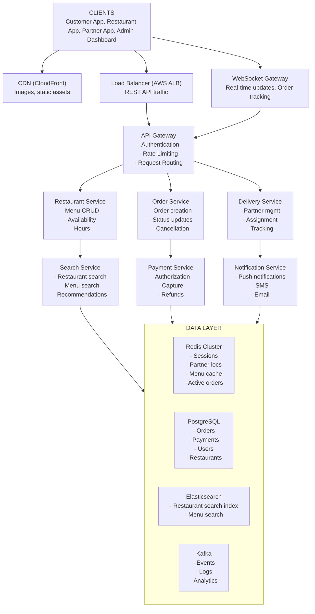
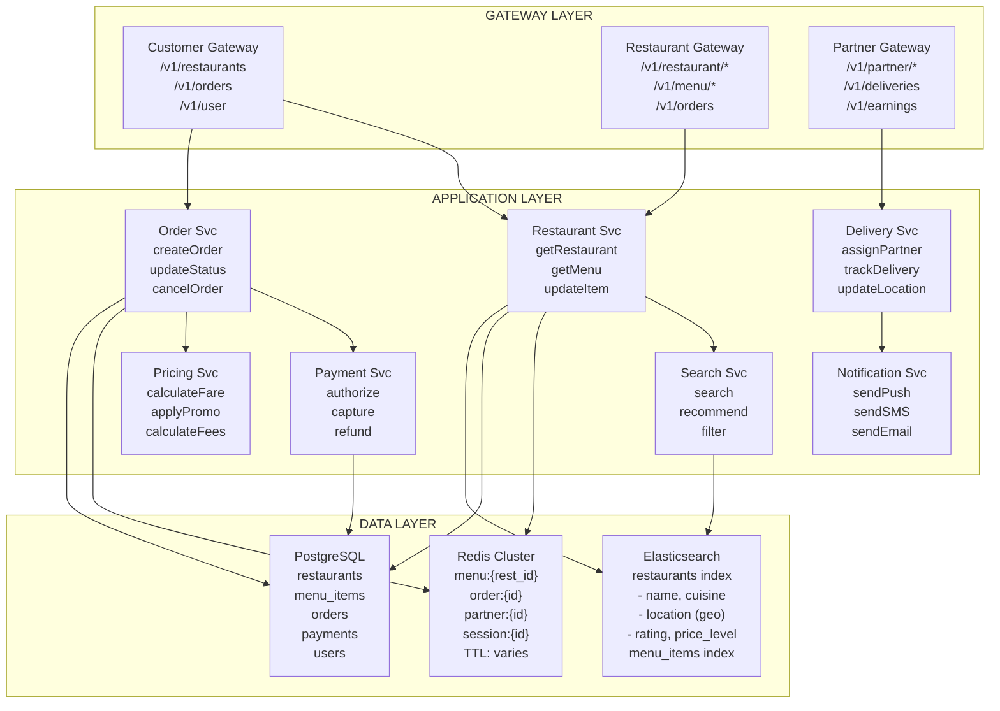
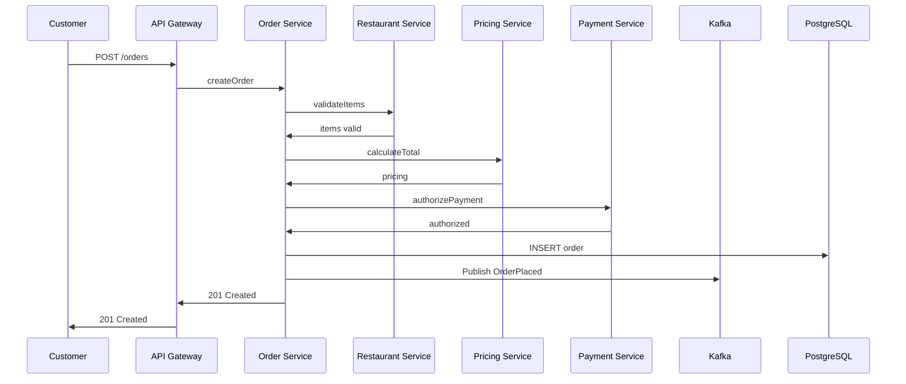

# Food Delivery - Data Model & Architecture

## Component Overview

Before looking at diagrams, let's understand each component and why it exists.

### Components Explained

| Component | Purpose | Why It Exists |
|-----------|---------|---------------|
| **Load Balancer** | Distributes traffic across servers | Handle 15K+ requests/sec at peak |
| **API Gateway** | Rate limiting, auth, routing | Different APIs for customers, restaurants, partners |
| **Restaurant Service** | Restaurant and menu management | Core catalog functionality |
| **Search Service** | Restaurant discovery | Full-text and geo search |
| **Order Service** | Order lifecycle management | Critical business logic |
| **Delivery Service** | Partner assignment and tracking | Real-time delivery coordination |
| **Payment Service** | Payment processing | Handle transactions securely |
| **Notification Service** | Push notifications, SMS | Keep all parties informed |
| **Redis** | Caching, real-time data | Fast lookups, session storage |
| **PostgreSQL** | Transactional data | ACID for orders, payments |
| **Elasticsearch** | Search index | Restaurant and menu search |
| **Kafka** | Event streaming | Decouple services, analytics |

---

## High-Level Architecture



<details>
<summary>ASCII diagram (reference)</summary>

```text
┌─────────────────────────────────────────────────────────────────────────────────┐
│                                   CLIENTS                                        │
│           (Customer App, Restaurant App, Partner App, Admin Dashboard)           │
└─────────────────────────────────────────────────────────────────────────────────┘
                                      │
                    ┌─────────────────┼─────────────────┐
                    ▼                 ▼                 ▼
┌──────────────────────┐  ┌──────────────────────┐  ┌──────────────────────┐
│   CDN (CloudFront)   │  │   Load Balancer      │  │  WebSocket Gateway   │
│   Images, static     │  │   (AWS ALB)          │  │  Real-time updates   │
│   assets             │  │   REST API traffic   │  │  Order tracking      │
└──────────────────────┘  └──────────┬───────────┘  └──────────┬───────────┘
                                     │                         │
                                     ▼                         │
                          ┌──────────────────────┐             │
                          │    API Gateway       │             │
                          │  - Authentication    │             │
                          │  - Rate Limiting     │             │
                          │  - Request Routing   │             │
                          └──────────┬───────────┘             │
                                     │                         │
         ┌───────────────────────────┼───────────────────────────┐
         │                           │                           │
         ▼                           ▼                           ▼
┌─────────────────┐       ┌─────────────────┐       ┌─────────────────┐
│Restaurant Service│      │  Order Service  │       │ Delivery Service│
│                 │       │                 │       │                 │
│ - Menu CRUD     │       │ - Order creation│       │ - Partner mgmt  │
│ - Availability  │       │ - Status updates│       │ - Assignment    │
│ - Hours         │       │ - Cancellation  │       │ - Tracking      │
└────────┬────────┘       └────────┬────────┘       └────────┬────────┘
         │                         │                         │
         │        ┌────────────────┼────────────────┐        │
         │        │                │                │        │
         ▼        ▼                ▼                ▼        ▼
┌─────────────────────┐  ┌─────────────────┐  ┌─────────────────────┐
│  Search Service     │  │ Payment Service │  │ Notification Service│
│                     │  │                 │  │                     │
│ - Restaurant search │  │ - Authorization │  │ - Push notifications│
│ - Menu search       │  │ - Capture       │  │ - SMS               │
│ - Recommendations   │  │ - Refunds       │  │ - Email             │
└─────────────────────┘  └─────────────────┘  └─────────────────────┘
         │                         │                         │
         └─────────────────────────┼─────────────────────────┘
                                   │
                                   ▼
┌─────────────────────────────────────────────────────────────────────────────────┐
│                              DATA LAYER                                          │
│                                                                                  │
│  ┌─────────────────┐  ┌─────────────────┐  ┌─────────────────┐  ┌────────────┐  │
│  │  Redis Cluster  │  │   PostgreSQL    │  │  Elasticsearch  │  │   Kafka    │  │
│  │                 │  │                 │  │                 │  │            │  │
│  │ - Sessions      │  │ - Orders        │  │ - Restaurant    │  │ - Events   │  │
│  │ - Partner locs  │  │ - Payments      │  │   search index  │  │ - Logs     │  │
│  │ - Menu cache    │  │ - Users         │  │ - Menu search   │  │ - Analytics│  │
│  │ - Active orders │  │ - Restaurants   │  │                 │  │            │  │
│  └─────────────────┘  └─────────────────┘  └─────────────────┘  └────────────┘  │
│                                                                                  │
└─────────────────────────────────────────────────────────────────────────────────┘
```

</details>
```

---

## Detailed Service Architecture



<details>
<summary>ASCII diagram (reference)</summary>

```text
┌─────────────────────────────────────────────────────────────────────────────────────┐
│                                                                                      │
│  ┌─────────────────────────────────────────────────────────────────────────────┐    │
│  │                           GATEWAY LAYER                                      │    │
│  │                                                                              │    │
│  │  ┌──────────────────┐  ┌──────────────────┐  ┌──────────────────┐           │    │
│  │  │ Customer Gateway │  │Restaurant Gateway│  │  Partner Gateway │           │    │
│  │  │                  │  │                  │  │                  │           │    │
│  │  │ /v1/restaurants  │  │ /v1/restaurant/* │  │ /v1/partner/*    │           │    │
│  │  │ /v1/orders       │  │ /v1/menu/*       │  │ /v1/deliveries   │           │    │
│  │  │ /v1/user         │  │ /v1/orders       │  │ /v1/earnings     │           │    │
│  │  └──────────────────┘  └──────────────────┘  └──────────────────┘           │    │
│  │                                                                              │    │
│  └─────────────────────────────────────────────────────────────────────────────┘    │
│                                         │                                            │
│         ┌───────────────────────────────┼───────────────────────────────┐           │
│         ▼                               ▼                               ▼           │
│  ┌─────────────────────────────────────────────────────────────────────────────┐    │
│  │                          APPLICATION LAYER                                   │    │
│  │                                                                              │    │
│  │  ┌────────────────┐  ┌────────────────┐  ┌────────────────┐  ┌────────────┐ │    │
│  │  │Restaurant Svc  │  │  Order Svc     │  │ Delivery Svc   │  │ Search Svc │ │    │
│  │  │                │  │                │  │                │  │            │ │    │
│  │  │ getRestaurant  │  │ createOrder    │  │ assignPartner  │  │ search     │ │    │
│  │  │ getMenu        │  │ updateStatus   │  │ trackDelivery  │  │ recommend  │ │    │
│  │  │ updateItem     │  │ cancelOrder    │  │ updateLocation │  │ filter     │ │    │
│  │  └───────┬────────┘  └───────┬────────┘  └───────┬────────┘  └─────┬──────┘ │    │
│  │          │                   │                   │                 │        │    │
│  │  ┌────────────────┐  ┌────────────────┐  ┌────────────────┐                 │    │
│  │  │ Payment Svc    │  │Notification Svc│  │  Pricing Svc   │                 │    │
│  │  │                │  │                │  │                │                 │    │
│  │  │ authorize      │  │ sendPush       │  │ calculateFare  │                 │    │
│  │  │ capture        │  │ sendSMS        │  │ applyPromo     │                 │    │
│  │  │ refund         │  │ sendEmail      │  │ calculateFees  │                 │    │
│  │  └───────┬────────┘  └───────┬────────┘  └───────┬────────┘                 │    │
│  │          │                   │                   │                          │    │
│  └──────────┼───────────────────┼───────────────────┼──────────────────────────┘    │
│             │                   │                   │                               │
│  ┌──────────┼───────────────────┼───────────────────┼──────────────────────────┐    │
│  │          ▼                   ▼                   ▼                          │    │
│  │                              DATA LAYER                                     │    │
│  │                                                                             │    │
│  │  ┌─────────────────┐  ┌─────────────────┐  ┌─────────────────────────┐     │    │
│  │  │  Redis Cluster  │  │   PostgreSQL    │  │     Elasticsearch       │     │    │
│  │  │                 │  │                 │  │                         │     │    │
│  │  │ menu:{rest_id}  │  │  restaurants    │  │  restaurants index      │     │    │
│  │  │ order:{id}      │  │  menu_items     │  │  - name, cuisine        │     │    │
│  │  │ partner:{id}    │  │  orders         │  │  - location (geo)       │     │    │
│  │  │ session:{id}    │  │  payments       │  │  - rating, price_level  │     │    │
│  │  │                 │  │  users          │  │                         │     │    │
│  │  │ TTL: varies     │  │                 │  │  menu_items index       │     │    │
│  │  └─────────────────┘  └─────────────────┘  └─────────────────────────┘     │    │
│  │                                                                             │    │
│  └─────────────────────────────────────────────────────────────────────────────┘    │
│                                                                                      │
└─────────────────────────────────────────────────────────────────────────────────────┘
```

</details>
```

---

## Request Flow: Customer Places Order

### Sequence Diagram



<details>
<summary>ASCII diagram (reference)</summary>

```text
┌────────┐ ┌─────────┐ ┌─────────┐ ┌─────────┐ ┌─────────┐ ┌───────┐ ┌─────────┐
│Customer│ │API Gway │ │Order Svc│ │Rest Svc │ │Price Svc│ │Payment│ │  Kafka  │
└───┬────┘ └────┬────┘ └────┬────┘ └────┬────┘ └────┬────┘ └───┬───┘ └────┬────┘
    │          │           │           │           │          │          │
    │ POST /orders         │           │           │          │          │
    │─────────>│           │           │           │          │          │
    │          │           │           │           │          │          │
    │          │ createOrder           │           │          │          │
    │          │──────────>│           │           │          │          │
    │          │           │           │           │          │          │
    │          │           │ validateItems         │          │          │
    │          │           │──────────>│           │          │          │
    │          │           │           │           │          │          │
    │          │           │    items valid        │          │          │
    │          │           │<──────────│           │          │          │
    │          │           │           │           │          │          │
    │          │           │ calculateTotal        │          │          │
    │          │           │──────────────────────>│          │          │
    │          │           │           │           │          │          │
    │          │           │        pricing        │          │          │
    │          │           │<──────────────────────│          │          │
    │          │           │           │           │          │          │
    │          │           │ authorizePayment      │          │          │
    │          │           │─────────────────────────────────>│          │
    │          │           │           │           │          │          │
    │          │           │        authorized     │          │          │
    │          │           │<─────────────────────────────────│          │
    │          │           │           │           │          │          │
    │          │           │ INSERT order (PostgreSQL)        │          │
    │          │           │───────────────────────────────────────────>│
    │          │           │           │           │          │          │
    │          │           │ Publish OrderPlaced   │          │          │
    │          │           │───────────────────────────────────────────>│
    │          │           │           │           │          │          │
    │          │ 201 Created           │           │          │          │
    │<─────────│           │           │           │          │          │
    │          │           │           │           │          │          │
```

</details>
```

### Step-by-Step Explanation

1. **Customer submits order** with items, address, payment method
2. **API Gateway** validates JWT token, checks rate limits
3. **Order Service** receives request, generates order ID
4. **Restaurant Service** validates items are available
5. **Pricing Service** calculates subtotal, fees, tax, discounts
6. **Payment Service** authorizes payment (hold, not capture)
7. **Order Service** creates order record in PostgreSQL
8. **Kafka event** published for downstream processing
9. **Restaurant notified** via WebSocket
10. **Response** returned to customer with order details

---

## Request Flow: Order Lifecycle

### State Machine Diagram

```
┌─────────────────────────────────────────────────────────────────────────────────────┐
│                              ORDER STATE MACHINE                                     │
└─────────────────────────────────────────────────────────────────────────────────────┘

                                    ┌──────────┐
                                    │  PLACED  │
                                    │          │
                                    │ Customer │
                                    │ submits  │
                                    └────┬─────┘
                                         │
                         ┌───────────────┼───────────────┐
                         │               │               │
                         ▼               │               ▼
                  ┌──────────────┐       │        ┌──────────────┐
                  │  CONFIRMED   │       │        │   REJECTED   │
                  │              │       │        │              │
                  │ Restaurant   │       │        │ Restaurant   │
                  │ accepts      │       │        │ declines     │
                  └──────┬───────┘       │        └──────────────┘
                         │               │               │
                         ▼               │               ▼
                  ┌──────────────┐       │         Full refund
                  │  PREPARING   │       │
                  │              │       │
                  │ Kitchen      │       │
                  │ starts       │       │
                  └──────┬───────┘       │
                         │               │
                         ▼               │
                  ┌──────────────┐       │
                  │    READY     │       │
                  │              │       │
                  │ Food ready   │       │
                  │ for pickup   │       │
                  └──────┬───────┘       │
                         │               │
                         ▼               │
                  ┌──────────────┐       │
                  │  PICKED_UP   │       │
                  │              │       │
                  │ Partner has  │       │
                  │ food         │       │
                  └──────┬───────┘       │
                         │               │
                         ▼               │
                  ┌──────────────┐       │
                  │  DELIVERED   │       │
                  │              │       │
                  │ Customer     │       │
                  │ received     │       │
                  └──────────────┘       │
                                         │
                                         │
                         ┌───────────────┴───────────────┐
                         │                               │
                         ▼                               ▼
                  ┌──────────────┐                ┌──────────────┐
                  │  CANCELLED   │                │  CANCELLED   │
                  │  (Customer)  │                │ (Restaurant) │
                  │              │                │              │
                  │ Partial/full │                │ Full refund  │
                  │ refund       │                │              │
                  └──────────────┘                └──────────────┘
```

---

## Delivery Partner Assignment Flow

```
┌────────────────────────────────────────────────────────────────────────────────────┐
│                         DELIVERY ASSIGNMENT FLOW                                    │
└────────────────────────────────────────────────────────────────────────────────────┘

  Order status → PREPARING
        │
        ▼
┌─────────────────┐
│ Find available  │
│ partners near   │
│ restaurant      │
│ (Redis GEORADIUS)│
└────────┬────────┘
         │
         ▼
┌─────────────────┐     ┌─────────────────┐
│ Score partners  │     │ Scoring factors:│
│ by:             │────>│ - Distance (40%)│
│                 │     │ - Rating (25%)  │
│                 │     │ - Accept rate(20%)│
│                 │     │ - Completion(15%)│
└────────┬────────┘     └─────────────────┘
         │
         ▼
┌─────────────────┐
│ Send offer to   │
│ top partner     │
│ (WebSocket)     │
└────────┬────────┘
         │
         │ 30 second timeout
         │
    ┌────┴────┐
    │         │
    ▼         ▼
┌────────┐ ┌────────────┐
│ACCEPTED│ │DECLINED/   │
│        │ │TIMEOUT     │
└───┬────┘ └─────┬──────┘
    │            │
    │            ▼
    │     ┌─────────────────┐
    │     │ Try next partner│
    │     │ (up to 3 times) │
    │     └────────┬────────┘
    │              │
    │              │ All declined
    │              ▼
    │     ┌─────────────────┐
    │     │ Expand search   │
    │     │ radius          │
    │     └─────────────────┘
    │
    ▼
┌─────────────────┐
│ Partner assigned│
│ to order        │
│ Status: ASSIGNED│
└─────────────────┘
```

---

## Search Architecture

### Elasticsearch Index Design

```json
// Restaurant Index
{
  "mappings": {
    "properties": {
      "id": {"type": "keyword"},
      "name": {
        "type": "text",
        "analyzer": "standard",
        "fields": {
          "keyword": {"type": "keyword"},
          "autocomplete": {
            "type": "text",
            "analyzer": "autocomplete"
          }
        }
      },
      "description": {"type": "text"},
      "cuisine_types": {"type": "keyword"},
      "location": {"type": "geo_point"},
      "rating": {"type": "float"},
      "rating_count": {"type": "integer"},
      "price_level": {"type": "integer"},
      "delivery_time_minutes": {"type": "integer"},
      "is_open": {"type": "boolean"},
      "is_accepting_orders": {"type": "boolean"},
      "promoted": {"type": "boolean"},
      "promotion_score": {"type": "float"}
    }
  },
  "settings": {
    "analysis": {
      "analyzer": {
        "autocomplete": {
          "tokenizer": "autocomplete",
          "filter": ["lowercase"]
        }
      },
      "tokenizer": {
        "autocomplete": {
          "type": "edge_ngram",
          "min_gram": 2,
          "max_gram": 20,
          "token_chars": ["letter", "digit"]
        }
      }
    }
  }
}
```

### Search Query Example

```java
@Service
public class RestaurantSearchService {
    
    public SearchResponse searchRestaurants(SearchRequest request) {
        BoolQueryBuilder query = QueryBuilders.boolQuery();
        
        // Must be open and accepting orders
        query.filter(QueryBuilders.termQuery("is_open", true));
        query.filter(QueryBuilders.termQuery("is_accepting_orders", true));
        
        // Location filter
        query.filter(QueryBuilders.geoDistanceQuery("location")
            .point(request.getLat(), request.getLng())
            .distance(request.getRadiusKm(), DistanceUnit.KILOMETERS));
        
        // Text search (if provided)
        if (request.getQuery() != null) {
            query.must(QueryBuilders.multiMatchQuery(request.getQuery())
                .field("name", 3.0f)
                .field("name.autocomplete", 2.0f)
                .field("cuisine_types", 1.5f)
                .field("description", 1.0f)
                .type(MultiMatchQueryBuilder.Type.BEST_FIELDS));
        }
        
        // Cuisine filter
        if (request.getCuisine() != null) {
            query.filter(QueryBuilders.termQuery("cuisine_types", request.getCuisine()));
        }
        
        // Rating filter
        if (request.getMinRating() != null) {
            query.filter(QueryBuilders.rangeQuery("rating")
                .gte(request.getMinRating()));
        }
        
        // Build search request with sorting
        SearchSourceBuilder sourceBuilder = new SearchSourceBuilder()
            .query(query)
            .from(request.getOffset())
            .size(request.getLimit());
        
        // Sort by relevance + distance + promotion
        sourceBuilder.sort(SortBuilders.scoreSort().order(SortOrder.DESC));
        sourceBuilder.sort(SortBuilders.geoDistanceSort("location", request.getLat(), request.getLng())
            .order(SortOrder.ASC)
            .unit(DistanceUnit.KILOMETERS));
        
        return elasticsearchClient.search(searchRequest);
    }
}
```

---

## Caching Architecture

```
┌─────────────────────────────────────────────────────────────────────────────────────┐
│                              REDIS CACHE STRATEGY                                    │
└─────────────────────────────────────────────────────────────────────────────────────┘

┌─────────────────────────────────────────────────────────────────────────────────────┐
│  REDIS CLUSTER (6 nodes: 3 primary + 3 replica)                                      │
│                                                                                      │
│  ┌─────────────────────────────────────────────────────────────────────────────┐    │
│  │  DATA TYPES AND ACCESS PATTERNS                                              │    │
│  │                                                                              │    │
│  │  1. RESTAURANT DATA (Hash)                                                   │    │
│  │     Key: restaurant:{restaurant_id}                                          │    │
│  │     Fields: name, rating, is_open, delivery_fee, etc.                       │    │
│  │     TTL: 1 hour                                                              │    │
│  │     Invalidation: On restaurant update                                       │    │
│  │                                                                              │    │
│  │  2. MENU DATA (Hash)                                                         │    │
│  │     Key: menu:{restaurant_id}                                                │    │
│  │     Fields: Full menu JSON                                                   │    │
│  │     TTL: 15 minutes (menus change frequently)                               │    │
│  │     Invalidation: On menu item update                                        │    │
│  │                                                                              │    │
│  │  3. ACTIVE ORDERS (Hash)                                                     │    │
│  │     Key: order:{order_id}                                                    │    │
│  │     Fields: status, restaurant_id, partner_id, timestamps                   │    │
│  │     TTL: None (deleted on completion)                                        │    │
│  │                                                                              │    │
│  │  4. PARTNER LOCATIONS (Geospatial)                                          │    │
│  │     Key: partners:locations                                                  │    │
│  │     Type: GEOADD / GEORADIUS                                                │    │
│  │     TTL: Members expire via separate cleanup                                 │    │
│  │                                                                              │    │
│  │  5. PARTNER STATUS (Hash)                                                    │    │
│  │     Key: partner:{partner_id}                                                │    │
│  │     Fields: status, current_order, last_location                            │    │
│  │     TTL: 30 seconds (auto-offline if not refreshed)                         │    │
│  │                                                                              │    │
│  │  6. USER SESSIONS (String)                                                   │    │
│  │     Key: session:{session_id}                                                │    │
│  │     Value: User metadata JSON                                                │    │
│  │     TTL: 30 minutes (sliding)                                                │    │
│  │                                                                              │    │
│  │  7. SEARCH RESULTS CACHE (String)                                            │    │
│  │     Key: search:{hash_of_params}                                             │    │
│  │     Value: Search results JSON                                               │    │
│  │     TTL: 5 minutes                                                           │    │
│  │                                                                              │    │
│  └─────────────────────────────────────────────────────────────────────────────┘    │
│                                                                                      │
└─────────────────────────────────────────────────────────────────────────────────────┘
```

### Cache Implementation

```java
@Service
public class RestaurantCacheService {
    
    private final RedisTemplate<String, String> redisTemplate;
    private final RestaurantRepository restaurantRepository;
    private final ObjectMapper objectMapper;
    
    private static final Duration RESTAURANT_TTL = Duration.ofHours(1);
    private static final Duration MENU_TTL = Duration.ofMinutes(15);
    
    // Cache-aside pattern for restaurant data
    public Restaurant getRestaurant(String restaurantId) {
        String key = "restaurant:" + restaurantId;
        
        // Try cache first
        String cached = redisTemplate.opsForValue().get(key);
        if (cached != null) {
            return objectMapper.readValue(cached, Restaurant.class);
        }
        
        // Cache miss: load from DB
        Restaurant restaurant = restaurantRepository.findById(restaurantId)
            .orElseThrow(() -> new NotFoundException("Restaurant not found"));
        
        // Store in cache
        redisTemplate.opsForValue().set(
            key,
            objectMapper.writeValueAsString(restaurant),
            RESTAURANT_TTL
        );
        
        return restaurant;
    }
    
    // Write-through for menu updates
    public void updateMenuItem(String restaurantId, MenuItem item) {
        // Update DB
        menuItemRepository.save(item);
        
        // Invalidate cache
        redisTemplate.delete("menu:" + restaurantId);
        
        // Also invalidate search index (async)
        kafkaTemplate.send("menu-updates", restaurantId, item);
    }
}
```

---

## Database Replication Architecture

```
┌─────────────────────────────────────────────────────────────────────────────────────┐
│                         PostgreSQL REPLICATION TOPOLOGY                              │
└─────────────────────────────────────────────────────────────────────────────────────┘

                              ┌───────────────────────┐
                              │    PRIMARY (Leader)    │
                              │                       │
                              │  - All WRITE queries  │
                              │  - Orders, Payments   │
                              │  - Menu updates       │
                              │                       │
                              │  Region: us-west-2a   │
                              └───────────┬───────────┘
                                          │
                    ┌─────────────────────┼─────────────────────┐
                    │ Sync Replication    │ Async Replication   │
                    ▼                     │                     ▼
     ┌───────────────────────┐            │      ┌───────────────────────┐
     │   REPLICA 1 (Sync)    │            │      │   REPLICA 2 (Async)   │
     │                       │            │      │                       │
     │  - READ queries       │            │      │  - Analytics queries  │
     │  - Order lookups      │            │      │  - Reporting          │
     │  - Failover target    │            │      │                       │
     │                       │            │      │  Region: us-east-1a   │
     │  Region: us-west-2b   │            │      └───────────────────────┘
     └───────────────────────┘            │
                                          │
                                          ▼
                           ┌───────────────────────┐
                           │   REPLICA 3 (DR)      │
                           │                       │
                           │  - Disaster Recovery  │
                           │  - Cross-region       │
                           │                       │
                           │  Region: eu-west-1a   │
                           └───────────────────────┘
```

---

## Failure Points and Mitigation

```
┌─────────────────────────────────────────────────────────────────────────────────────┐
│                              FAILURE ANALYSIS                                        │
└─────────────────────────────────────────────────────────────────────────────────────┘

Component              Failure Mode           Impact              Mitigation
─────────────────────────────────────────────────────────────────────────────────────
┌─────────────┐
│   Search    │ ───── ES cluster ────── No restaurant ───── Fallback to
│   Service   │        down             discovery          PostgreSQL query
└─────────────┘

┌─────────────┐
│   Order     │ ───── Service down ──── No new orders ──── Multiple replicas,
│   Service   │                                            circuit breaker
└─────────────┘

┌─────────────┐
│  Delivery   │ ───── Service down ──── No assignments ─── Queue orders,
│   Service   │                                            manual assignment
└─────────────┘

┌─────────────┐
│   Redis     │ ───── Node failure ──── Cache miss ─────── Cluster mode,
│             │                         spike              auto-failover
└─────────────┘

┌─────────────┐
│ PostgreSQL  │ ───── Primary down ──── Writes fail ────── Sync replica
│             │                         (30 seconds)       promotion
└─────────────┘

┌─────────────┐
│   Kafka     │ ───── Broker down ───── Events delayed ─── Replication,
│             │                                            auto-recovery
└─────────────┘

┌─────────────┐
│  Payment    │ ───── Provider down ─── Payments fail ──── Retry queue,
│   Service   │                                            fallback provider
└─────────────┘
```

---

## Summary

| Aspect | Decision | Rationale |
|--------|----------|-----------|
| Search | Elasticsearch | Full-text + geo queries |
| Cache | Redis Cluster | Fast lookups, geospatial |
| Database | PostgreSQL | ACID for orders |
| Events | Kafka | Decouple services |
| Real-time | WebSocket | Order tracking |
| CDN | CloudFront | Images, static assets |

